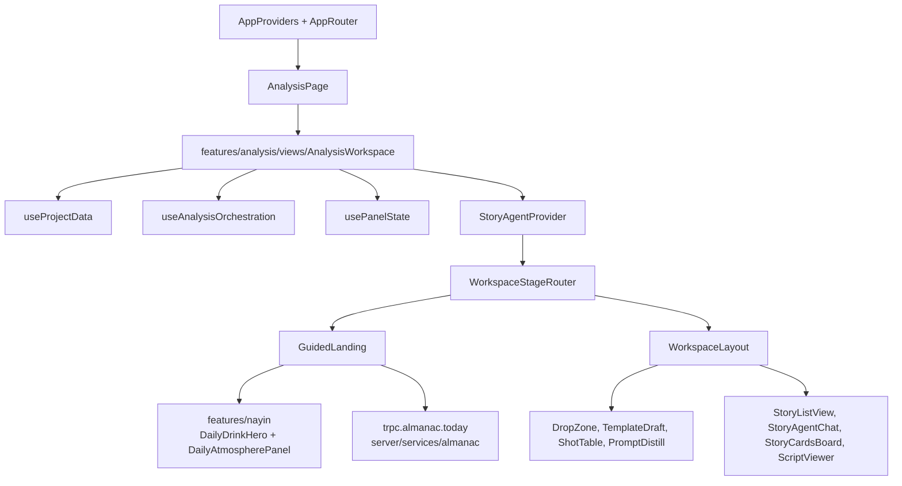

# Drinking Time Frontend Architecture

Drinking Time uses a feature-module frontend structure with a small shared platform layer.

The active layering is:

- `App -> Business -> Platform -> External`
- routes stay thin
- feature state has one owner
- feature views are props-in / UI-out whenever practical
- archived files are historical reference only and must not be imported by active code

## Layer Mapping

### App

- `client/src/App.tsx`
- `client/src/app/providers/AppProviders.tsx`
- `client/src/app/router/AppRouter.tsx`
- `client/src/app/shell/TopBar.tsx`
- `client/src/pages/AnalysisPage.tsx`

Responsibilities:

- application providers
- route wiring
- app shell / chrome
- page entry points only

### Business

- `client/src/features/analysis/`
- `client/src/features/storyAgent/`
- `client/src/features/nayin/`

Responsibilities:

- own feature state and orchestration
- own feature-specific views, hooks, config, and types
- compose shared platform components into product workflows
- keep cross-feature handoffs explicit through props, providers, or tRPC

Current feature ownership:

- `features/analysis/`: analysis workspace, material ingestion UI, timeline drawer, shot table, analysis hooks, status/stage config
- `features/storyAgent/`: Story Agent context, story list/chat/card/script views, story persistence orchestration
- `features/nayin/`: Nayin provider, date/theme utilities, daily almanac display helpers, favicon updates, beverage ambience and icon views

### Platform

- `client/src/components/ErrorBoundary.tsx`
- `client/src/components/ui/`
- `client/src/lib/trpc.ts`
- `client/src/lib/utils.ts`
- `client/src/lib/lunar.ts`
- `shared/`

Responsibilities:

- reusable UI primitives
- cross-feature helpers
- API client setup
- shared types/constants

### External

- `server/routers.ts`
- `server/archive/storyAgent.ts`
- `server/services/`
- browser APIs such as `localStorage` and file drag/drop

Responsibilities:

- tRPC procedures
- AI/archive logic
- persistence, old-almanac adapters, and backend services
- external runtime integration

## Boundary Rules

1. Business components belong under `client/src/features/<feature>/`, not directly under `client/src/components/`.
2. App chrome belongs under `client/src/app/`, not under shared components.
3. `client/src/components/` is reserved for `ErrorBoundary` and `ui/` primitives.
4. Legacy context/library paths such as `client/src/contexts/NayinContext.tsx`, `client/src/lib/nayin.ts`, and `client/src/lib/mockData.ts` are retired.
5. `client/src/archive/` is excluded from TypeScript and is not an active architecture layer.
6. Story Agent client traffic should go through `trpc.storyAgent.*`, not raw `/api/archive/story-agent-*` fetch calls.
7. Analysis display views such as `DropZone` and `Timeline` receive callbacks from hooks/containers instead of importing tRPC directly.

## Active Analysis Flow

## What Changed In The Convergence Pass

1. `client/src/components/` was reduced to shared platform UI only.
2. `TopBar` moved to `client/src/app/shell/TopBar.tsx`.
3. Legacy Nayin, ThemeContext, mock data, demo, and duplicate component paths moved out of active code.
4. The obsolete `useAnalysisWorkspace` hook was retired in favor of focused hooks:
   - `useProjectData`
   - `useAnalysisOrchestration`
   - `usePanelState`
5. Story Agent tRPC procedures are covered by router tests.
6. `client/src/architecture-boundaries.test.ts` now protects the architecture boundaries from drifting back.

## Verification

The architecture guard is intentionally structural and fast:

- `client/src/architecture-boundaries.test.ts`

It checks:

- allowed top-level files under `client/src/components/`
- no active imports from retired paths
- no feature-specific imports from `@/components/...`
- no raw client calls to Story Agent archive REST endpoints
- no direct tRPC imports in `DropZone` or `Timeline`
