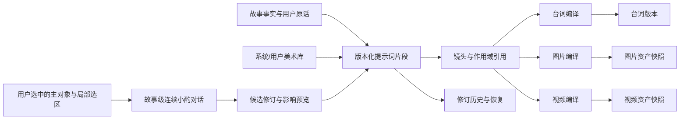

# 统一提示词数据库：台词、图片、视频与美术配方的版本谱系

## Summary

建立故事级、关系型、可版本化的提示词事实层，让台词、图片和视频从共享语义中派生，同时允许各媒介独立修改。左侧常驻的小酌对话贯穿同一故事的创作阶段，以用户选中的文字、镜头或素材为上下文，完成单镜头的编辑、影响预览、用户确认、素材过期和按需重渲闭环。

---

## Problem Frame

当前提示词信息分散在镜头字段、故事文档、前端表格、图片记录、视频参数快照和美术 YAML 中。它们都能完成局部任务，却没有共同的版本身份和依赖关系，因此同一镜头的台词、图片与视频可能分别持有不同事实，用户也很难知道一次修改会影响什么。

现有提示词表格已经能把主体、动作、台词、叙事、美术和运镜拆成行，图片和视频生成也开始保存最终提示词。然而这些结构目前更接近界面投影或生成快照，不足以回答“这条内容从哪里来”“哪些素材依赖它”“用户改过几次”“旧图片为什么过期”等问题。

用户还需要建立特定美术提示词库。若美术库继续作为另一套孤立结构，故事采用、镜头覆盖和后续更新会再次产生多套真相。

小酌目前在不同创作页面拥有不同形态和对话状态，并且通常只知道焦点镜头，不一定知道用户刚刚选中的文字、图片区域、视频时间段或素材版本。用户需要反复描述“我说的是哪一张、哪一句、哪一段”，Agent 的建议也难以稳定关联到可确认的提示词修订。

---

## Actors

- A1. 创作者：编辑台词、图片方向、视频动作和美术配方，决定修改范围并确认正式版本。
- A2. 小酌及导演 Agent：分析意图、参考图和上下文，提出候选修订及影响说明，但不能自行替换正式版本。
- A3. 提示词数据库：保存共享语义、媒介指令、版本、引用、编译结果及生成素材之间的关系。
- A4. 台词、图片和视频生成器：消费各自的已确认编译结果，并把实际使用的版本和参数留作不可变快照。
- A5. 美术库维护者：在系统库或用户私库中维护可复用的美术配方，供故事锁定版本。

---

## Conceptual Model

关系模型中的核心划分是：

- 提示词片段是可独立版本化的语义实体。
- 镜头与片段是多对多关系，同一片段可以服务多个媒介或镜头。
- 台词、图片、视频是不同编译目标，共享事实但拥有各自的局部指令。
- 编译结果和生成资产记录当时实际使用的版本，不随未来编辑被改写。

---

## Key Flows

- F1. 单对象局部修改
  - **Trigger:** 创作者在台词、图片或视频区域修改一个提示词。
  - **Actors:** A1, A3
  - **Steps:** 系统创建候选修订；默认只计算当前对象的变化；展示差异和影响范围；用户确认后将修订设为当前版本。
  - **Outcome:** 当前对象更新，其他媒介不被隐式改写。
  - **Covered by:** R3, R5, R6, R8

- F2. 应用到整个镜头
  - **Trigger:** 创作者把修改明确应用到整个镜头。
  - **Actors:** A1, A3, A4
  - **Steps:** 系统识别共享语义与所有依赖；重新编译受影响的台词、图片和视频提示词；展示差异；用户确认；已有素材保留并标记过期。
  - **Outcome:** 三种媒介引用同一版共享事实，但不会自动产生付费素材。
  - **Covered by:** R2, R4, R6, R7, R9, R10

- F3. Agent 提议修改
  - **Trigger:** 小酌或视觉导演分析用户输入、参考图或失败结果。
  - **Actors:** A1, A2, A3
  - **Steps:** Agent 创建候选修订并解释理由；系统展示内容差异及影响范围；用户确认、调整或拒绝。
  - **Outcome:** 只有确认后的修订进入正式谱系。
  - **Covered by:** R6, R8

- F4. 美术配方复用
  - **Trigger:** 创作者为故事选择系统或私有美术配方。
  - **Actors:** A1, A3, A5
  - **Steps:** 故事锁定所选配方版本；各镜头继承；个别镜头可建立局部覆盖；美术库后续更新只提示可升级，不自动改变故事。
  - **Outcome:** 美术风格可复用、可升级，也能稳定复现旧故事。
  - **Covered by:** R12-R15

- F5. 选中对象后请小酌修改
  - **Trigger:** 创作者选中文字、镜头、图片、视频或时间轴素材，并在左侧聊天栏发送修改要求。
  - **Actors:** A1, A2, A3
  - **Steps:** 选中对象作为上下文引用卡进入聊天；用户可附带一个局部文字、图片区域或时间范围；小酌读取对象身份、版本和关联提示词；生成候选修订与影响说明；用户确认、调整或拒绝。
  - **Outcome:** 建议准确关联到用户所指对象，并继续遵守版本、局部传播和用户确认规则。
  - **Covered by:** R5-R9, R19-R22

---

## Requirements

**统一事实与版本**

- R1. 台词、图片和视频必须读取同一套提示词事实，不得各自维护无法追溯的平行真相。
- R2. 系统必须区分共享语义与媒介指令。人物、故事事实、镜头任务和台词含义可以被多个媒介引用；图片构图、视频运镜等只属于对应媒介。
- R3. 用户或 Agent 的每次修改必须产生新修订，保留作者、来源、时间、修改理由和前一版本关系；历史版本不得被原地覆盖。
- R4. 每个镜头、媒介编译结果和生成素材都必须能追溯到其实际引用的提示词版本。

**修改、传播与审批**

- R5. 用户直接编辑时默认只修改当前对象，不得自动传播到其他媒介或镜头。
- R6. 用户选择“应用到整个镜头”或更大作用域时，系统必须在确认前展示受影响的台词、图片提示词、视频提示词及已有素材。
- R7. 已生成的图片和视频必须保持不变。上游版本变化时，依赖旧版本的素材标记为过期，但仍可查看、播放和恢复。
- R8. Agent 只能创建候选修订；用户确认后修订才可成为当前版本。拒绝候选不得改变正式数据或素材状态。
- R9. 确认提示词修改不得自动触发付费生成。重渲图片或视频必须由用户单独确认。

**编译与生成记录**

- R10. 台词、图片和视频必须拥有独立编译结果；它们可以共享片段，但必须分别记录最终文本、引用版本和编译时间。
- R11. 每次图片或视频生成必须保存当时实际使用的完整提示词、参考素材、模型参数和来源版本，使旧结果可以解释和复现。

**美术提示词库**

- R12. 美术提示词库必须支持系统基础库和用户私有库，两者使用同一种可版本化内容模型。
- R13. 故事采用美术配方时必须锁定具体版本；用户私库或系统库后续更新不得静默改变已有故事。
- R14. 镜头可以覆盖故事级美术配方的局部维度；局部覆盖不得反向修改故事快照或源美术库。
- R15. 系统必须提供稳定的导入边界，使其他工作线创建的特定美术库可以进入用户私库，并在导入前校验内容、版本和来源。

**界面与第一版**

- R16. 默认界面必须以创作配方卡片呈现提示词；高级界面必须能以数据库表格查看片段、版本、来源、作用域、引用和素材状态。两种界面编辑同一份数据。
- R17. 第一版必须完成一个镜头的闭环：查看当前提示词关系、局部编辑、预览差异、确认修订、标记旧素材过期、选择是否重渲，以及恢复旧版本。
- R18. 现有故事和素材必须可继续读取。旧字段和旧提示词记录在迁移期间作为兼容输入，不得长期与新数据库双向写入形成两套事实。

**常驻小酌与选择上下文**

- R19. 每个故事必须拥有一条连续的小酌创作对话。用户在故事、镜头设计、故事版、视频和剪辑区域之间切换时继续使用同一会话；切换故事时加载目标故事自己的会话。
- R20. 桌面端小酌必须作为左侧常驻栏存在并允许折叠。折叠、切换创作区域或短暂离开页面时，未发送内容和当前上下文引用不得丢失。
- R21. 用户可以把一个主对象和一个从属于它的局部选区挂入聊天。主对象支持镜头、图片、视频和时间轴素材；局部选区支持文字片段、图片矩形区域和视频或时间轴时间段。引用必须记录稳定对象身份和当时版本，不能只保存复制后的展示文本。
- R22. 选择对象本身不得自动调用 Agent。只有用户发送消息后，小酌才分析引用上下文；回复必须说明目标对象、候选修改和影响范围，并沿用 R8 的用户确认机制。

---

## Acceptance Examples

- AE1. **Covers R2, R5, R10.** 给定 SH01 已有台词、主图和视频提示词，当用户只修改“视频运镜”为轻微推近并确认，只有视频编译结果产生新版本；台词和图片提示词保持当前版本。
- AE2. **Covers R4, R6, R7, R9.** 给定 SH01 已有采用图片和视频，当用户修改人物服装并选择应用到整个镜头，确认页列出三种媒介变化；确认后旧图片和视频仍可查看但显示过期，系统不自动重渲。
- AE3. **Covers R3, R8.** 当小酌建议改写一句台词时，该建议先作为候选修订出现；用户拒绝后，当前台词版本、图片提示词、视频提示词和素材状态均不改变。
- AE4. **Covers R7, R11.** 当用户查看过期视频时，可以看到它由哪版主图、哪版视频提示词和哪些模型参数生成，并能继续播放该视频。
- AE5. **Covers R12-R14.** 给定故事锁定用户私库中“写实记录”第 3 版，当私库发布第 4 版时，故事继续使用第 3 版；只有用户主动升级后才产生新的故事美术版本和影响预览。
- AE6. **Covers R14.** 当 SH03 把故事级暖色光覆盖为冷色夜景时，其他镜头仍使用故事配方，源美术库内容不改变。
- AE7. **Covers R16, R17.** 用户在配方卡片中编辑主体后，可以切换高级数据库视图看到同一候选修订、来源和影响关系；两处确认结果一致。
- AE8. **Covers R18.** 打开一个只有旧镜头字段、旧图片提示词和旧视频快照的故事时，仍能显示和生成；首次迁移后，新修改只写入统一提示词事实层。
- AE9. **Covers R19, R20.** 用户在 SH02 的故事版中与小酌讨论后切换到动态分镜，再折叠和展开左侧栏，仍能看到同一故事的对话、未发送草稿和当前引用；切换到另一个故事时不会带入 SH02 的会话。
- AE10. **Covers R21, R22.** 用户选中 SH03 主图中的一个矩形区域后，左侧栏显示“SH03 主图 + 局部区域”引用卡；在用户发送“这里只保留窗户”之前不调用 Agent，发送后建议只针对该图片对象创建候选修订。
- AE11. **Covers R3, R21, R22.** 一条历史消息引用 SH01 主图第 2 版，之后主图已更新到第 3 版；重新查看历史消息时仍能识别第 2 版，并提示它不是当前版本，而不是悄悄改指向第 3 版。
- AE12. **Covers R5, R8, R19-R22.** 用户选中一段台词并要求“更克制一点”，小酌展示台词候选差异并默认只影响当前台词；用户拒绝后，连续对话保留该讨论，但正式提示词和素材状态均不改变。

---

## Success Criteria

- 用户在一个镜头内可以看清台词、图片和视频为何相关，也能安全地只改其中一个。
- 任一已生成图片或视频都能回答“使用了哪版提示词、参考图和参数”。
- 修改共享事实后，系统准确指出受影响对象，不丢失旧素材，也不擅自产生费用。
- 系统美术库和用户私库可以被故事稳定复用，库升级不会造成历史故事风格漂移。
- 用户在任一创作区域选中具体对象后，可以直接用自然语言告诉小酌怎么改，不必重新描述对象身份和当前版本。
- 同一故事的小酌对话跨创作区域连续存在，同时不会把上下文串到其他故事。
- 规划阶段无需重新发明修改范围、审批、过期、重渲和美术版本行为。

---

## Scope Boundaries

- 第一版不自动重渲图片或视频。
- 第一版不做多镜头批量传播、复杂冲突合并或多人实时协作。
- 第一版不做公开提示词市场；用户私库仅归当前用户所有。
- 第一版不建立完整事件溯源系统。
- 第一版不以完整数据库管理后台为交付目标；高级视图只覆盖创作所需的查询和编辑。
- 第一版不删除旧资产或强制升级旧故事。
- 音频生成、配音版本和成片导出暂不进入统一提示词谱系。
- 第一版不支持任意数量的跨镜头多选；只支持一个主对象和一个局部选区。
- 第一版不在选中对象后自动分析、主动写入或触发生成。
- 第一版不实现移动端常驻侧栏布局。

---

## Key Decisions

- 关系型提示词谱系取代“每镜头一份完整 JSON”：片段可复用，依赖、版本和过期关系可以被明确表达。
- 用户编辑默认局部生效：降低意外传播的风险；较大范围必须由用户主动选择。
- 生成素材不可变：新的提示词版本通过过期标记与旧素材共存，而不是覆盖历史。
- Agent 提议、用户确认：分析能力可以主动工作，但正式创作事实仍由用户掌控。
- 系统库、用户私库、故事快照、镜头覆盖四层美术作用域：兼顾复用、稳定与局部自由。
- 配方卡片与数据库视图共用同一事实：满足普通创作和高级管理，不产生双状态。
- 第一版选择单镜头闭环：先证明统一谱系能改善真实创作操作，再扩展批量能力。
- 小酌按故事保持连续会话：创作阶段共享上下文，但故事之间严格隔离。
- 选择通过引用卡进入对话：用户明确发送才触发分析，既减少无效模型调用，也保留创作主动权。
- 一个主对象加一个局部选区：足以覆盖改一句话、改一块画面和改一段视频，同时控制第一版复杂度。

---

## Dependencies / Assumptions

- 现有提示词行、统一编译上下文、图片生成提示词、视频参数快照和美术配方可作为迁移来源，不要求推倒重写。
- 每个故事及镜头已有或可以获得稳定身份，不能依赖会变化的展示镜号建立谱系。
- 图片和视频生成服务能够接受编译后的最终提示词，并保存对应的生成快照。
- 本地持久化模式与关系数据库模式都必须保持相同的版本和审批语义。
- 其他工作线制作特定美术库时，会遵守本需求后续定义的导入契约。
- 现有对象选择信息能够扩展为带稳定身份和版本的故事级聊天引用。
- 现有分散的故事对话与创作对话可以迁移或归并为故事级单一会话，且历史消息不会丢失。

---

## Outstanding Questions

### Deferred to Planning

- [Affects R1-R4][Technical] 如何将现有镜头字段、提示词覆盖和生成记录渐进迁移为统一谱系，并避免兼容期双写。
- [Affects R3, R6][Technical] 修订并发、重复确认和版本冲突采用什么一致性策略。
- [Affects R7, R11][Technical] 过期状态应实时计算还是持久化投影，以及如何高效查询。
- [Affects R12-R15][Technical] 美术库导入契约、去重、升级比较和非法条目隔离的具体格式。
- [Affects R16][Technical] 高级数据库视图第一版需要哪些筛选、排序和关系展开能力。
- [Affects R19, R20][Technical] 如何迁移并归并现有故事页、创作页对话状态，同时保持故事隔离和历史兼容。
- [Affects R21, R22][Technical] 各类文字、图片区域、视频时间段和时间轴素材如何统一序列化为可授权、可回放的版本化引用。
