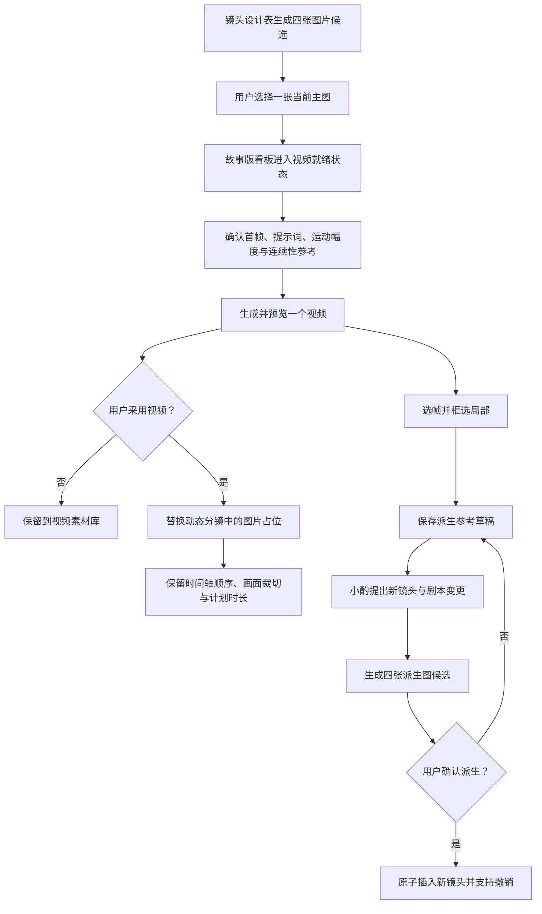

# 图片、视频、剪辑与派生镜头的统一素材流程

## Summary

本需求定义一条统一的镜头素材流水线：镜头设计表完成四图候选与主图确认，故事版看板完成单视频生成与采用，动态分镜负责素材替换、裁切、素材库和派生镜头；小酌始终跟随当前创作对象协助用户判断和修改。

---

## Problem Frame

当前图片、视频和动态分镜已经分别具备一部分能力，但用户需要在多个区域反复寻找按钮，且同一镜头在不同面板可能显示不同素材。图片生成后是否已经成为主图、视频是否基于最新版主图、时间轴使用的是图片还是视频，都缺少稳定且可见的答案。

这种不确定性还会放大生成成本：用户可能拿四宫格合成图去生成视频，可能在主图已经变化后继续误用旧视频，也可能因为一次失败生成而看不到之前可用的素材。提示词、模型参数和素材来源没有形成可追溯版本时，小酌也无法准确解释为什么这一版结果发生变化。

派生镜头进一步暴露了同一问题。从视频里选帧、框选局部、图生图、修改剧本和插入时间轴不是五个孤立按钮，而是一次需要草稿、确认、版本关系和撤销能力的创作操作。

---

## User Flow

图示只表达产品流程；下面的文字需求是最终依据。

---

## Actors

- A1. 用户：选择图片、确认视频、调整提示词和裁切区间，并最终决定是否派生新镜头。
- A2. 小酌：读取当前创作对象，解释参数和素材状态，提出修改建议，并在用户确认后写入变更。
- A3. 镜头设计表：图片候选、图片历史、参考图和当前主图的主工作区。
- A4. 故事版看板：视频生成准备、预览、采用和视频历史的主工作区。
- A5. 动态分镜：当前素材消费、时间轴剪辑、素材库和派生镜头入口。
- A6. 302 能力：理解参考画面和框选区域，并承担图片或视频模型调用。

---

## Key Flows

- F1. 四图候选成为当前主图
  - **Trigger:** 用户在镜头设计表为某个镜头生成新图片。
  - **Actors:** A1, A2, A3
  - **Steps:** 系统生成四张候选；候选进入图片历史但不改变原主图；用户点击其中一张；该图成为唯一当前主图；故事版看板和动态分镜立即读取新主图。
  - **Outcome:** 用户明确选择的单张图片成为视频首帧来源，四宫格和未选候选不会进入视频阶段。
  - **Covered by:** R1, R3, R4, R5

- F2. 从当前主图生成并采用单视频
  - **Trigger:** 当前镜头已有当前主图，用户在故事版看板打开视频生成确认区。
  - **Actors:** A1, A2, A4, A6
  - **Steps:** 确认区展示当前主图、自动生成的视频提示词、运动幅度和前后镜头连续性参考；用户可直接编辑或让小酌提出修改；系统生成一个产品层视频；用户预览后决定采用或保留到素材库。
  - **Outcome:** 只有用户采用的视频才成为当前视频；未采用或失败的视频不覆盖可用素材。
  - **Covered by:** R6, R7, R8, R9, R10, R11

- F3. 当前视频进入动态分镜
  - **Trigger:** 用户采用一条视频。
  - **Actors:** A1, A5
  - **Steps:** 视频替换同一镜头的图片占位；保持时间轴顺序、位置和画面裁切；初始使用区间从第 0 秒开始，长度等于镜头计划时长；用户可继续裁切。
  - **Outcome:** 动态分镜优先播放当前视频，没有当前视频时稳定回退当前主图。
  - **Covered by:** R12, R13, R14

- F4. 在素材库复用视频
  - **Trigger:** 用户打开动态分镜素材库。
  - **Actors:** A1, A5
  - **Steps:** 素材库默认筛选当前镜头，也可查看全部素材；用户先预览某条视频，再选择采用到时间轴；同镜头素材默认替换当前时间轴素材，未采用素材继续保留。
  - **Outcome:** 用户无需离开剪辑上下文即可回看和采用历史素材。
  - **Covered by:** R15, R16

- F5. 从视频帧派生新镜头
  - **Trigger:** 用户在动态分镜的视频预览中选择“派生新镜头”。
  - **Actors:** A1, A2, A5, A6
  - **Steps:** 用户通过胶片条和逐帧控制定位画面；放大、缩小、拖动并矩形框选局部；系统保存带来源关系的派生参考草稿；302 同时理解完整帧与框选区域；小酌让用户确认参考用途，并提出新镜头、插入位置、时长和剧本变更；系统生成四张派生图候选；用户选图并确认剧本差异后正式插入。
  - **Outcome:** 新镜头带着稳定身份、当前主图和计划时长进入视频阶段；整次写入可以一键撤销。
  - **Covered by:** R17, R18, R19, R20

---

## Requirements

**统一职责与创作上下文**

- R1. 镜头设计表负责图片，故事版看板负责视频，动态分镜负责剪辑、素材库和派生镜头；三个面板必须读取同一套镜头素材状态。
- R2. 任一时刻只能有一个当前创作对象；用户点击镜头、图片或视频后，三个面板和小酌必须跟随同一镜头，并明确显示当前对象。

**图片候选与当前主图**

- R3. 每次图片生成产生四张候选；候选和四宫格任务结果只能进入历史，不能自动替换当前主图。
- R4. 用户点击某张候选后，该图立即成为该镜头唯一当前主图；旧主图保留在图片历史中，生成或裁切失败时原主图保持不变。
- R5. 图片生成必须综合当前故事的叙事风格、美术风格、人物参考、场景参考、当前镜头和相邻镜头信息；参考图用途由系统建议并由用户确认。

**视频生成、预览与参数**

- R6. 故事版看板必须在镜头卡片内提供精简视频确认区，集中展示当前主图、视频提示词、运动幅度和前后镜头连续性参考，不要求用户跳转寻找其他按钮。
- R7. 视频提示词由系统自动填写，用户可以直接编辑，也可以让小酌先展示修改前后对比；只有用户确认后，小酌才能写入提示词，视频仍由用户主动点击生成。
- R8. 运动幅度根据镜头动作、运镜和情绪自动判断为低或高，用户可以在生成前切换。
- R9. 视频只使用当前主图作为图像输入；前后镜头当前主图只用于生成连续性提示，不向用户暗示当前模型支持真实首尾帧输入。
- R10. 一次生成在产品层只产生一个待确认视频；生成成功后先预览，用户点击采用后才成为当前视频。未采用或失败的视频不得替换当前视频或当前主图兜底。
- R11. 每个视频版本必须保留不可变的生成参数快照，并提供可见入口；小酌能够读取并解释主图版本、最终提示词、运动幅度、模型、供应商、镜头时长、连续性参考、任务标识和生成时间。

**版本变化与动态分镜**

- R12. 当前主图改变后，基于旧主图生成的视频仍可播放并保留在历史中，但必须标记为基于旧主图；该镜头的视频主操作变为重新生成。
- R13. 动态分镜必须优先显示已采用的当前视频；没有当前视频时显示当前主图作为图片占位，任何失败结果都不能让镜头变为空。
- R14. 用户采用视频后，系统自动替换同镜头的图片占位，并保留时间轴顺序、位置和画面裁切；初始视频区间从第 0 秒开始，长度等于镜头计划时长，用户之后可以继续裁切。

**素材库**

- R15. 动态分镜提供侧边素材库，默认只显示当前镜头的图片和视频版本，并允许切换查看全部素材；未采用视频、旧视频和旧图片继续保留。
- R16. 素材进入时间轴前必须先预览；采用同镜头素材时默认替换该镜头当前素材。跨镜头素材不能直接覆盖，必须通过派生镜头流程进入故事。

**派生镜头**

- R17. 派生页面必须支持胶片条定位、逐帧前进和后退、矩形框选、放大、缩小和拖动画面，无需一次加载并铺开视频全部帧。
- R18. 用户确认选帧和框选区域后，系统先保存派生参考草稿，并记录来源视频、时间点和裁切区域；302 同时理解完整帧和框选区域，以框选区域为主要参考，并由小酌让用户确认它属于人物、场景、物件或构图参考。
- R19. 小酌必须先提出新镜头草案、推荐插入位置、推荐时长和剧本变更对比；派生图片仍产生四张候选，用户选图并确认全部变更前，正式故事和时间轴不得改变。
- R20. 确认派生必须作为一次原子创作操作：新镜头使用稳定身份，界面镜号按故事顺序重排，选中图片成为新镜头当前主图并进入视频阶段；用户可以一键撤销剧本、镜头顺序、素材关系和时间轴变化。

---

## Unified Material Contract

统一素材契约描述产品必须维持的事实，不限定具体存储方式：

- 镜头身份稳定：素材始终绑定不会因展示镜号重排而变化的镜头身份。
- 素材版本不可变：图片和视频生成结果作为历史版本保留；修改通过创建新版本完成。
- 当前关系显式：每个镜头最多有一个当前主图和一个已采用的当前视频；候选、历史、失败和过期状态不能冒充当前素材。
- 来源可追溯：派生图片知道来源视频、时间点和裁切区域；视频知道来源主图版本和生成参数。
- 展示规则一致：镜头设计表、故事版看板、动态分镜和小酌从同一事实推导当前状态，不分别保存互相覆盖的答案。
- 写入具有边界：选中主图、采用视频和确认派生分别是完整操作；失败时不能留下半完成的当前关系。

---

## Acceptance Examples

- AE1. **Covers R3, R4.** Given SH03 已有当前主图，when 新一轮四张候选生成完成但用户没有点击任何一张，then SH03 当前主图不变，候选只出现在图片历史。
- AE2. **Covers R4, R13.** Given 用户点击 SH03 的右上候选，when 单张图片保存成功，then 它成为唯一当前主图，三个面板立即同步；when 保存失败，then 原主图继续显示。
- AE3. **Covers R6, R7, R8, R9.** Given SH05 已有当前主图，when 用户展开视频确认区，then 用户在同一卡片看到可编辑提示词、可切换运动幅度和前后镜头连续性说明，且只有 SH05 当前主图作为图像输入。
- AE4. **Covers R10, R13.** Given SH05 仍以图片占位，when 视频生成成功但用户尚未采用，then 时间轴继续显示图片；when 用户采用，then 时间轴才切换为视频。
- AE5. **Covers R11.** Given 用户对视频效果提出反馈，when 打开生成参数或询问小酌，then 能看到并解释该版本实际使用的主图、提示词、运动幅度和模型信息，而不是当前已被修改的提示词。
- AE6. **Covers R12.** Given SH05 已有当前视频，when 用户选择一张新主图，then 旧视频仍可播放但标记为基于旧主图，主操作提示重新生成。
- AE7. **Covers R14.** Given SH05 计划时长 2.4 秒，when 用户采用一个 5 秒视频，then 时间轴默认使用 0 至 2.4 秒，保持 SH05 的位置和画面裁切，用户可以继续调整入点和出点。
- AE8. **Covers R15, R16.** Given 一个未采用视频仍有局部片段可用，when 用户在动态分镜素材库预览并采用它，then 它替换同镜头当前素材而不改变其他镜头顺序。
- AE9. **Covers R17, R18, R19.** Given 用户在视频 1.8 秒处框选人物手部，when 关闭派生页面后继续与小酌讨论，then 选帧、裁切区域和来源视频仍保存在派生参考草稿中，正式故事尚未改变。
- AE10. **Covers R19, R20.** Given 用户选中一张派生候选图并确认剧本差异，when 派生写入成功，then 新镜头插在确认位置、展示镜号自动重排、素材仍绑定正确镜头；when 用户撤销，then 剧本和时间轴同时恢复。
- AE11. **Covers R2.** Given 用户在动态分镜点击 SH06 的视频素材，when 当前创作对象切换完成，then 镜头设计表和故事版看板都定位到 SH06，小酌明确显示正在讨论该视频；随后点击 SH03 图片时，三个区域共同切换到 SH03。

---

## Success Criteria

- 用户可以沿着“选图、生成视频、采用到时间轴、派生新镜头”连续工作，不需要反复寻找不同区域的按钮。
- 任一镜头在三个面板显示相同的当前主图、当前视频和版本状态，刷新后不会回退到旧答案。
- 候选、失败、未采用和基于旧主图的视频都不会意外覆盖可用当前素材。
- 用户和小酌都能准确回答某个结果使用了哪张图、什么提示词和哪些关键参数。
- 派生镜头在用户确认前不污染正式故事，确认后完整写入且可以完整撤销。
- 下游规划无需再发明三面板职责、图片候选规则、视频采用规则、素材库行为或派生镜头确认流程。

---

## Scope Boundaries

- 第一版不做多轨剪辑、音频混剪、复杂转场渲染或成片导出。
- 第一版不支持自由套索选区，使用矩形框选、缩放和平移。
- 第一版不一次加载并展示视频全部帧，使用胶片条、拖动定位和逐帧控制。
- 第一版不自动生成或自动采用视频，生成和采用都由用户明确触发。
- 第一版不切换到支持真实首尾帧输入的新视频模型；前后镜头先用于连续性提示。
- 第一版不建设独立素材库页面，使用动态分镜侧边抽屉。
- 第一版不允许素材直接跨镜头覆盖，跨镜头复用必须通过派生镜头。
- 第一版不要求动态分镜承担图片候选或视频生成入口。

---

## Key Decisions

- 三面板按媒介阶段分工：图片在镜头设计表，视频在故事版看板，剪辑和派生在动态分镜。
- 图片必须先选后用：四张候选不自动改变主图，只有用户选中的单张图片进入视频阶段。
- 视频必须先预览后采用：生成成功不等于进入时间轴，用户保留最后决定权。
- 产品层保持单视频结果：用户不需要在图片四候选之后再管理四个视频候选。
- 小酌修改需要确认：小酌可以理解、比较和写入提示词，但不能擅自生成素材或修改正式剧本。
- 素材历史不等于当前素材：旧版本继续有价值，但必须明确当前、候选、失败、未采用和过期状态。
- 派生镜头先草稿后原子确认：选帧、图生图和剧本变更在一个可撤销操作中收束。

---

## Dependencies / Assumptions

- 前置流程已经提供可读取的叙事风格、美术风格和角色设定。
- 当前 302 视频能力只接收一张图；前后镜头连续性先通过提示词表达。
- 图片模型能够提供四张候选，或提供可被产品稳定拆分为四张候选的结果。
- 视频和图片资产能够长期保留来源信息，不依赖临时前端状态维持版本关系。
- 小酌能够读取当前创作对象、派生参考草稿和素材参数快照。
- 展示镜号可以重排，但素材绑定依赖稳定镜头身份。

---

## Outstanding Questions

### Deferred to Planning

- [Affects R3, R4][Technical] 当前各图片供应商返回四张独立图片还是一张四宫格；如何统一为相同的候选确认体验？
- [Affects R9, R10][Needs research] 当底层视频供应商返回多个结果时，产品层单视频应使用供应商主结果、固定规则还是质量判断？
- [Affects R11, R12][Technical] 如何可靠判断视频所基于的主图版本已经过期，并保证参数快照不被后续修改？
- [Affects R14][Technical] 新视频替换图片或旧视频时，画面裁切与时间区间如何在不同素材尺寸和时长之间稳定映射？
- [Affects R18][Technical] 完整帧与框选区域的视觉理解如何缓存，避免用户反复打开派生页面时重复调用模型？
- [Affects R20][Technical] 原子派生与一键撤销如何覆盖故事、镜头、素材和时间轴，同时避免部分成功？
