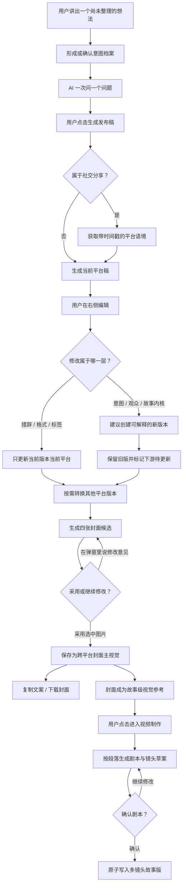

# 发布稿：个人表达整理、多平台派生与视频交接

## Summary

在 `/editing` 中提供意图驱动的「发布稿」工作界面：自动识别、用户手选和工作台修改共同形成一份可确认的意图档案；用途、核心观众或故事内核变化时保留旧稿并创建可解释的新版本。
同一版本可派生多个平台稿；小红书与抖音稿使用随版本保存的真实平台语境和相关热门标签。版本切换同步恢复文稿、意图、平台、封面与视频来源，同时让故事版字段历史、语音、图片候选和视频 Take 保持独立。

---

## Problem Frame

用户往往已经有明确的观察、情绪和立场，却无法独立把它们组织成大众能够理解、自己又愿意署名的成稿。通用 AI 文案工具常直接套用「爆款」结构和平台腔调，虽然语言更顺，却会磨平原有观点，把带有个人品味的表达变成批量生成的平均文本。

当前可行但割裂的做法，是先与 AI 多轮聊天厘清想法，再手动复制成文案、另外制作封面；如果之后还想生成视频，又要重新讲述一次。过程中不仅容易丢失原始观点，平台之间的改写、封面与视频也缺少共同的故事来源。

现有流程还把同一个“写给谁、为什么写”拆成聊天意图、发布版本意图和平台选择三套状态。用户可能已经表示要公开分享，首次文稿仍按“留存给自己”生成；开场手选可能被后续自动识别覆盖；平台已经切到小红书，活动版本的意图却没有同步。界面有版本入口不等于这条用户任务已经闭环。

现有平台稿中的话题标签由模型直接生成，用户无法判断它们来自真实趋势、过时印象还是语言模型的猜测。随便生成的标签既不能帮助用户抓住正在发生的讨论，也可能为了表面热度把一篇私人、具体的表达带向无关热点，损害内容可信度。

现有视频交接只把正式封面变成一个开场镜头，发布稿正文虽然被识别为旁白候选，却没有形成剧本或对应镜头。用户在文字稿中完成的多段表达因此无法出现在故事版中，也无法检查哪些内容被保留、改写或遗漏。

一次生成一张正式封面的做法同样缺少控制感：图片可能构图粗糙、审美不合格，甚至带有乱码或莫名其妙的字体，但系统已经把它当成最终结果。用户既看不到同轮候选，也无法围绕某一张图直接说修改意见，只能反复盲抽并承担不透明的生成成本。

---

## Actors

- A1. 用户：有真实想法和个人立场，希望在不被 AI 同质化的前提下完成可发布表达。
- A2. 对话编辑助手：通过逐问逐答厘清用户意图，整理而不驯化用户的表达。
- A3. 平台适配能力：保持内容内核不变，为不同社交平台派生合适的表达版本。
- A4. 视频创作界面：接收同一故事的内核、当前发布稿和故事级封面参考，生成可确认的剧本与逐镜对应关系，再继续完成图片和视频创作。

---

## Key Flows

- F1. 从想法到第一份发布稿
  - **Trigger:** 用户开启新故事，选择一个目标平台并开始讲述自己的想法。
  - **Actors:** A1, A2
  - **Steps:** 用户自由描述或手选用途 → 系统形成待确认或已确认的意图档案 → AI 一次提出一个关键问题 → 用户决定信息已经足够 → 系统先持久化最新意图 → 用户点击「生成发布稿」 → 社交分享场景按需获取平台语境 → 当前平台的 V1 初稿出现在右侧编辑器。
  - **Outcome:** 用户得到一份与界面所示用途、观众和平台一致，且保留本人观点和锋芒的可编辑稿件。
  - **Covered by:** R1, R2, R3, R4, R5, R45, R46, R47, R48

- F2. 从一个平台转换到另一个平台
  - **Trigger:** 当前平台已有发布稿，用户点击转换到另一个平台。
  - **Actors:** A1, A3
  - **Steps:** 用户选择目标平台 → 系统读取同一发布版本的故事内核、意图和当前稿件 → 按目标平台调整标题、长度、语气、排版、标签与行动号召 → 新平台稿进入对应标签页；仅当用途、核心观众或传播目的同时变化时才提出新发布版本。
  - **Outcome:** 同一发布版本下的两个平台稿并列保留，核心事实、意图和用户声音一致，表达形式适配各自平台。
  - **Covered by:** R6, R7, R8, R9, R50, R51

- F3. 编辑措辞或改变故事内核
  - **Trigger:** 用户在任一平台稿件中进行修改。
  - **Actors:** A1, A2, A3
  - **Steps:** 系统判断修改层级 → 措辞、标题、格式和标签变化只留在当前版本当前平台 → 用途、核心观众、表达目的或内核变化先提出新版本建议 → 用户处理未应用编辑并确认后创建新版本 → 其他平台稿和视频来源标记「待更新」；判断不清时直接询问用户。
  - **Outcome:** 用户已经编辑过的版本和人工标题不会被擅自覆盖，跨平台内容和下游资产仍能显式追溯。
  - **Covered by:** R10, R11, R12, R21, R22, R25, R51, R52

- F4. 从发布稿进入封面和视频创作
  - **Trigger:** 用户认可当前发布稿，希望配图或继续制作视频。
  - **Actors:** A1, A2, A4
  - **Steps:** 系统基于故事内核与当前稿生成四张封面候选 → 用户迭代并明确采用一张故事级主视觉 → 用户点击进入视频制作 → 系统读取当前发布版本，按非空段落转写成剧本段落并生成逐镜草案 → 用户在故事版的剧本栏检查原文覆盖和镜头对应 → 用户确认后一次性写入正式镜头 → 后续镜头图片统一参考正式封面。
  - **Outcome:** 原文字稿完整保留并能追溯到剧本和镜头；正式封面统一后续视觉语言但不占用镜头；未经确认的转写不会污染正式故事版。
  - **Covered by:** R13, R14, R15, R16, R17, R18, R19, R20, R27, R28, R29, R30, R31, R32, R33, R34, R35, R36

- F5. 意图、观众或故事内核变化后创建新版本
  - **Trigger:** 用户继续聊天、修改用途或编辑文稿，并提出可能改变主用途、核心观众、表达目的、观点、事实、情绪或创作方向的新想法。
  - **Actors:** A1, A2, A3, A4
  - **Steps:** 系统展示从当前意图到新意图的变化及建议版本名 → 用户选择把未应用编辑留在旧版、带入新版或取消 → 用户确认创建新版本 → 新版本保留旧成果的来源关系并明确封面与视频状态 → 只为当前平台生成新稿 → 其他平台和下游材料标记「待更新」 → 用户通过顶部版本选择器切换。
  - **Outcome:** 用户可以继续推进表达而不丢失旧版本；每版说明为什么产生，并能看到文稿、封面和视频来源是否仍然有效。
  - **Covered by:** R21, R22, R23, R24, R25, R26, R52, R53, R55

- F6. 获取平台语境并为小红书或抖音稿选择相关热门标签
  - **Trigger:** 用户正在编辑小红书或抖音稿，并主动打开或刷新热门标签建议。
  - **Actors:** A1, A3
  - **Steps:** 系统读取带来源和更新时间的平台语境快照 → 生成时参考相关话题、内容结构、常见开场和表达边界 → 从真实趋势中筛选相关标签 → 将实时热门与降级的近期相关建议分开标明 → 用户勾选需要的标签 → 只更新当前版本、当前平台的包装。
  - **Outcome:** 用户知道当前平台稿和热门标签的语境依据并保留最终选择权；没有相关热点或趋势服务失败时，仍可按平台规则创作且不改变故事事实。
  - **Covered by:** R37, R38, R39, R40, R41, R42, R43, R44, R48, R49

---

## Requirements

**入口与工作界面**

- R1. `/editing` 必须提供名为「发布稿」的明确功能入口，并将它作为与剪辑台并列的独立工作界面；两者仍属于同一个当前故事，不得创建独立的社交媒体项目。
- R2. 「发布稿」界面采用左侧对话、右侧稿件编辑器的布局；用户切换到该界面后仍能围绕当前故事继续对话。
- R3. 新故事开始时，对话区必须允许用户选择目标平台；首版支持小红书、X / Twitter、Instagram、LinkedIn、微信朋友圈、抖音 / TikTok 配文。

**对话与生成边界**

- R4. 对话编辑助手必须复现「用户先讲想法、AI 一次问一个关键问题、逐步厘清表达」的工作方式，不能用一次性长表单取代对话。
- R5. 系统不得因判断信息足够而自动生成稿件；只有用户点击「生成发布稿」后，才生成当前目标平台版本。创建 V1 前必须先保存界面当前显示的已确认或暂定意图，不能继续使用旧意图或默认“留存 · 自己”。
- R6. 默认只生成当前平台稿。即使用户选择了多个目标平台，也不得在没有明确操作时批量生成其他稿件；同一意图和故事内核下的跨平台转换属于同一发布版本，不得仅因切换平台创建 V2。
- R7. 首次生成、跨平台转换、用户指令改写和格式修复都必须提高结构、节奏、措辞和可理解性，同时保留用户事实、观点、情绪、结论、原话特征和表达锋芒。

**平台版本与编辑**

- R8. 同一发布版本下的每个平台稿必须以独立标签页保留，用户可随时切换、阅读和编辑；生成新平台稿不得覆盖已有平台稿，也不得混淆“发布版本”和“平台稿”。
- R9. 用户可以对任一已有稿件执行「一键转为」其他受支持平台。转换只能改变平台表达，包括标题、长度、语气、排版、标签和行动号召，不能擅自改变共同的内容内核。
- R10. 同一故事必须保留一份跨平台共用的故事内核，覆盖关键事实、核心观点、主要情绪、个人表达倾向和视觉概念；各平台稿是它的发布变体。
- R11. 用户修改稿件后，系统必须区分「当前平台的措辞、标题、格式或标签调整」与「主用途、核心观众、表达目的或故事内核发生改变」：前者只影响当前版本当前平台，后者必须提出创建新发布版本。
- R12. 当修改层级无法可靠判断时，系统必须直接询问用户；故事内核经确认更新后，其他平台版本只标记为「建议更新」，不得自动重写或覆盖。

**封面与视频交接**

- R13. 用户可以基于故事内核和当前发布稿明确发起一轮封面生成；每轮必须在弹窗内同时呈现四张可独立选择的候选，不得把任一候选自动视为正式封面。
- R14. 同一故事最终只采用一张正式封面主视觉，各平台只适配比例、裁切和封面标题；探索中的候选不得覆盖已有正式封面，也不得因切换平台自动生成新图片。
- R15. 用户完成编辑后，首版必须提供复制当前平台文案和下载对应封面的出口，不要求连接社交平台账号。
- R16. 用户从发布稿进入视频制作时，视频创作界面必须从同一故事自动获得故事内核、当前平台发布稿和正式封面，并以这些材料生成剧本草案，而不是要求用户从头复述。
- R17. 发布稿是视频剧本的上游来源而不是临时面板；用户在工作区之间切换时不得清空发布稿、剧本或对应关系。只有用户明确点击「进入视频制作」才生成剧本预览，普通工作区切换不得自动改写或产生模型调用。
- R18. 封面候选弹窗必须同时提供候选选择和自然语言反馈输入；用户选中候选后提出修改意见时，新一轮应以该候选为视觉基础，未选中候选时则基于当前故事内核重新构思。
- R19. 每轮付费生成必须由用户单独确认并显示当轮费用；选中候选、切换候选和采用已有候选不得再次收费。已付费生成的候选必须归属于当前故事，关闭弹窗或刷新页面后仍能恢复。
- R20. 封面生成必须明确抑制可读文字、乱码字体、Logo 和水印；系统不得声称候选已经通过自动文字检测，用户仍可淘汰任何带有文字瑕疵或审美不合格的图片。

**故事版本与内核变化**
- R21. 同一故事必须支持多个发布版本；主用途、核心观众、表达目的、观点、事实、情绪或创作方向发生实质变化时应创建新版本，普通措辞、标题、断句、标签、平台格式或同一意图下的平台转换不得自动创建新版本。
- R22. 当自动识别或编辑判断发现实质意图或故事内核变化时，必须先展示从当前状态到提案状态的差异并请求用户确认；未经确认不得自动创建新版本、覆盖当前意图或修改当前版本。
- R23. 新版本必须保留旧版本故事内核、平台稿、正式封面和视频交接材料的来源关系；不得自动生成新封面、重写旧平台稿或触发付费模型调用。继承材料必须清楚标明来自哪个版本以及是否仍需用户重新确认，不能悄悄冒充新版本的已确认成果。
- R24. 创建新版本后，系统只为当前选中的平台生成新版本稿件；其他已有平台稿保留旧版本内容并显示「待更新」，不得后台批量重写或消耗模型调用。
- R25. 发布稿顶部必须提供版本选择器，显示版本序号和产生原因，例如「V2 · 公开分享 · 陌生读者」；版本名优先来自本版变化事实、用途和观众，用户可以通过真实入口重命名，人工名称不得被自动覆盖。
- R26. 每个版本的正式封面、平台稿、未应用编辑缓冲和视频交接材料必须相互隔离；切换版本不得清空或串用这些状态，在一个版本中修改或采用内容不得覆盖其他版本的已确认成果。

**视频剧本、全文覆盖与镜头对应**

- R27. 故事版看板必须增加可见的「剧本」栏；剧本是从当前发布稿派生的独立视频表达，不得用发布稿原文或镜头描述的简单复制代替。
- R28. 用户点击「进入视频制作」后，系统必须自动生成一份剧本与镜头草案并先展示预览；未经用户确认，草案不得替换或新增正式故事版镜头。
- R29. 转写必须按当前发布稿的非空段落直接拆分：每个原文段落至少对应一个剧本段落和一个镜头，长段落可以拆成多个镜头，但任何事实、观点、情绪或结论都不得被静默遗漏。多段发布稿的首版镜头数不得少于四个。
- R30. 每个剧本段落必须把平台文案转成可朗读、可表演或可视觉化的视频表达；平台标签、话题、排版说明和行动号召不得被机械转成旁白或镜头内容。
- R31. 剧本栏必须让用户同时看到原文来源、转写后的剧本段落和对应镜头编号，以便逐段检查覆盖、改写和遗漏。
- R32. 用户确认剧本后，系统必须把整组剧本与镜头作为一次完整操作写入；生成或保存失败时不得留下只有部分段落、部分镜头或单独封面镜头的半成品。
- R33. 剧本必须绑定生成它的发布版本和稿件修订。原稿发生变化后，现有剧本保留并标记「需要更新」；只有用户查看影响并确认重新转写后，才能产生新的剧本与镜头草案。
- R34. 重新转写不得自动删除已有图片、视频或人工镜头修改；当新旧镜头结构无法安全对应时，系统必须先展示影响并由用户决定如何处理已有成果。
- R35. 正式封面必须作为故事级视觉参考供所有后续镜头出图使用，约束整体人物、色彩、材质和视觉气质；封面不得归属或占用任何单独镜头，也不得要求所有镜头复制封面的具体构图。
- R36. 对已经把封面保存成单独开场镜头的旧故事，用户首次确认新剧本时必须移除该占位关系、保留封面资产并提升为故事级视觉参考；不得因迁移删除封面图片本身。

**小红书与抖音平台语境及热门标签**

- R37. 第一版热门标签选择只覆盖小红书与抖音；其他平台继续使用内容相关标签，不得显示未经验证的“实时热门”标记。
- R38. 热门标签获取必须由用户主动打开或刷新建议触发；普通页面加载、版本切换和后台定时任务不得持续请求趋势数据。
- R39. “实时热门”候选必须来自可追溯的真实趋势来源，并向用户显示来源与更新时间；模型可以在已验证候选中判断内容相关性，但不得凭空创造并宣称某标签正在热门。平台语境还可以包含相关话题、常见开场、内容结构和表达边界，但任何信号都不能覆盖故事事实或用户意图。
- R40. 真实趋势不可用、可信度不足或已经过期时，系统可以降级提供“近期相关”或普通内容标签，但必须明确区分，不能继续沿用“实时热门”名称。
- R41. 系统必须优先保证标签与当前文稿相关；如果真实热榜中没有相关候选，应明确显示暂无相关热门标签并改为内容标签，不得为了热度推荐无关话题。
- R42. 标签候选只供用户勾选，不得自动插入或替换现有标签；获取、筛选或保存失败时，当前稿件和用户已选标签必须保持不变。
- R43. 已选标签必须绑定当前发布版本和当前平台；刷新建议或更换标签属于平台包装调整，不得创建新的故事版本，也不得影响其他版本或平台稿。
- R44. 热门标签不得进入故事内核、视频旁白、剧本段落或镜头内容；它们只属于对应平台的发布包装。

**意图、版本与下游状态协调**

- R45. 故事必须只有一份可解释的意图档案，覆盖主用途、兼顾用途、核心观众、次要观众、发布渠道、表达取向以及暂定/用户确认状态；聊天自动识别、开场手选和发布工作台修改不得继续维护互相冲突的事实源。
- R46. 自动识别只能产生可见的意图提案；用户手动选择或确认后的意图具有更高优先级，后续自动识别不得静默覆盖。平台选择只能改变发布渠道，除非用户同时确认用途、观众或传播目的发生变化。
- R47. 当前意图必须参与持久化、自动保存和刷新恢复；首次创建 V1 以及已有故事重新进入发布工作台时，界面、服务端故事和活动发布版本不得分别显示新旧意图。
- R48. 当活动版本用于小红书或抖音社交分享时，系统可以在用户明确生成或刷新时获取一次平台语境快照；快照至少记录平台、来源、获取时间、相关主题、真实热门标签以及可用于适配的结构信号。
- R49. 平台语境快照必须绑定发布版本和平台并可在刷新后解释“这一版当时依据什么生成”；刷新快照属于当前版本的语境修订，只有应用新语境后造成主用途、核心观众、表达目的或故事内核变化时才提出新版本。
- R50. 首次生成、跨平台转换、按用户要求改写和格式修复必须遵守同一内容边界：故事事实与核心观点不漂移，平台表达互相隔离，格式修复不得借机重写内容。
- R51. 发布标题、故事名、版本短名和卡片标题必须保持不同职责；平台语境可辅助发布标题，但不得污染故事名或版本名。用户手改标题必须优先，正文改写和标题生成失败不得清空或覆盖人工标题。
- R52. 创建或切换版本时如存在未应用编辑，用户必须能选择“留在原版本”“带入新版本”或“取消”；系统不得要求用户绕行多个控件，也不得静默丢弃、重复应用或把缓冲写入错误版本。
- R53. 切换发布版本必须一起投影文稿、意图、平台、版本名、正式封面来源、视频交接来源和下游“待更新”状态；旧故事版可继续回看，但不得被宣布为新版本的正式故事版。
- R54. 意图识别、趋势查询、文稿生成、版本创建、封面查询和视频交接等异步结果必须校验所属故事、源发布版本和触发时的意图/上下文修订；迟到结果不得写入当前其他故事或其他版本。
- R55. 故事版字段版本、语音版本、图片候选与采用历史、视频 Take 历史必须继续作为独立制作历史；它们可以记录来源发布版本并在上游变化时标记待更新，但不得折叠进发布版本容器或被创建 V2 自动覆盖。
- R56. 功能状态只有在真实入口可达，并通过“意图变化 → 创建并命名 V2 → 生成/转换平台稿 → 选择相关标签 → 切换与刷新恢复 → 封面和视频来源正确”的端到端验收后才能标记为可用；分层单测或页面文字存在不能替代该证据。

---

## Acceptance Examples

- AE1. **Covers R4, R5, R7.** Given 用户只说「我觉得 AI 和社交平台都在制造虚假繁荣」，when AI 与用户逐轮厘清主轴且用户点击「生成发布稿」，then 右侧出现一篇结构完整但保留原有批判立场的小红书稿；点击前不得自动生成。
- AE2. **Covers R3, R6, R8.** Given 用户同时选择小红书、X 和 LinkedIn，when 用户点击生成且当前平台是小红书，then 只生成小红书标签页内容，X 和 LinkedIn 不在后台自动消耗模型调用。
- AE3. **Covers R8, R9.** Given 小红书标签页已有一篇用户编辑过的稿件，when 用户点击「一键转为 X」，then 系统新增并打开 X 标签页，原小红书稿保持不变，X 稿更短但事实、观点和立场一致。
- AE4. **Covers R11, R12.** Given 用户把「获利的只有大模型公司」改成「平台和模型公司共同获利」，when 系统判断这可能改变核心结论，then 先询问这是当前平台措辞还是核心观点变化；用户确认更新内核后，其他标签页只出现更新提示，不被自动改写。
- AE5. **Covers R11.** Given 用户只把小红书稿中的长句拆成短句并增加换行，when 系统识别为平台措辞调整，then 修改只保留在小红书标签页，不触发其他平台更新提示。
- AE6. **Covers R13, R14, R15.** Given 当前故事已有认可的小红书稿，when 用户明确生成一轮封面，then 弹窗出现四张候选且正式封面保持不变；用户采用其中一张并随后切换到 Instagram 时，两个平台复用该正式主视觉，只调整版式适配。
- AE7. **Covers R16, R17, R28.** Given 用户已经完成 X 稿和封面，when 用户点击「进入视频制作」，then 发布稿状态继续保留，系统自动展示剧本与镜头预览；when 用户只是切换到其他工作区，then 不生成或改写剧本。
- AE8. **Covers R13, R19.** Given 当前故事没有正式封面，when 用户确认一次四图生成费用，then 系统只提交一轮付费任务并展示四张候选；候选出现时不得自动选择、自动采用或再次扣费。
- AE9. **Covers R18, R19.** Given 用户选中了第二张候选并输入「去掉画面里的字体，让人物更小、机器更压迫」，when 用户明确发起下一轮，then 系统显示该轮费用并在确认后返回四张基于第二张调整的新候选，上一轮仍可回看。
- AE10. **Covers R14, R19.** Given 故事已有正式封面且用户又生成了四张候选，when 用户关闭弹窗或刷新页面，then 原正式封面保持不变，重新打开弹窗仍能恢复尚未采用的候选。
- AE11. **Covers R14, R16, R35.** Given 用户从候选中明确采用一张图片，when 用户进入故事版并为任一镜头生成图片，then 各工作区读取同一张故事级正式封面作为视觉参考；未采用候选不得成为故事视觉参考，正式封面也不得自动成为某镜头主图。
- AE12. **Covers R21, R22.** Given 用户只要求把一句话改短，when 系统判断为措辞调整，then 当前版本更新且不创建新版本；当用户提出新的核心判断并确认创建版本时，then 系统创建 V2 并保留 V1。
- AE13. **Covers R23, R24.** Given V1 已有小红书稿、X 稿和正式封面，when 用户确认创建 V2，then V2 继承正式封面和全部已有材料，只生成当前平台的新稿，X 稿显示「待更新」且没有后台调用。
- AE14. **Covers R25, R26.** Given 故事已有 V1 和 V2，when 用户在顶部切换版本，then 对话上下文、平台稿、封面和视频交接材料都切换到对应版本；在 V2 中修改或换封面不会改变 V1。
- AE15. **Covers R27, R29, R30, R31.** Given `#1172` 当前发布稿有六个非空正文段落且故事版只有一个封面占位镜头，when 系统生成视频剧本预览，then 出现至少六个可追溯的剧本段落和对应镜头，每个原文段落都能定位到自己的转写结果，且话题标签不进入旁白。
- AE16. **Covers R28, R32.** Given 用户正在预览六镜剧本草案，when 用户取消或保存失败，then 正式故事版保持原状；when 用户确认且保存成功，then 六个镜头和对应剧本同时出现，不存在只写入前三镜的状态。
- AE17. **Covers R33, R34.** Given 已确认剧本基于 V1 的第二次稿件修订，when 用户修改原稿正文，then 旧剧本继续可读并显示需要更新；重新转写前，已有镜头图片和视频保持不变并展示可能受影响的镜头。
- AE18. **Covers R35, R36.** Given `#1172` 的正式封面曾被保存为唯一开场镜头，when 用户确认新的多镜头剧本，then 封面图片继续作为整个故事的视觉参考，但不再占用任何镜头；后续每镜出图继承其视觉语言而不是复制其构图。
- AE19. **Covers R37, R38, R39.** Given 用户正在编辑小红书稿且可靠趋势来源返回与正文相关的候选，when 用户主动打开热门标签建议，then 页面展示带来源和更新时间的真实热门标签，且打开页面前没有后台请求趋势数据。
- AE20. **Covers R40, R41.** Given 当天真实热榜没有与正文相关的候选，when 用户请求热门标签，then 系统显示“暂无相关热门标签”并提供普通内容标签，不展示无关全站热点。
- AE21. **Covers R39, R40.** Given 真实趋势来源暂时不可用，但系统能找到近期相关话题，when 返回候选，then 它们明确标为“近期相关”而不是“实时热门”，并显示可核对的来源时间。
- AE22. **Covers R42.** Given 当前抖音稿已经有用户选择的三个标签，when 刷新趋势或保存新选择失败，then 原有三个标签和正文保持不变，不出现部分替换或清空。
- AE23. **Covers R43, R44.** Given V1 小红书稿和 V2 抖音稿分别保存了不同标签，when 用户刷新 V2 的热门建议并切回 V1，then 两版标签各自恢复、版本数量不变，且标签没有进入视频旁白或剧本。
- AE24. **Covers R45, R46.** Given 用户在开场菜单明确选择“给自己看”，when 后续聊天被自动识别为可能公开分享，then 系统只显示意图提案，不能覆盖已确认选择，也不能自动创建或修改发布版本。
- AE25. **Covers R5, R47.** Given 界面已经确认“公开分享 · 陌生读者 · 小红书”，when 用户首次生成 V1 并刷新页面，then 故事意图、V1 版本意图和平台选择保持一致，不恢复成默认“留存 · 自己”。
- AE26. **Covers R21, R22, R25, R46.** Given V1 为“留给自己”，when 用户确认改成“公开分享给陌生读者”，then 系统创建并激活 `V2 · 公开分享 · 陌生读者`、完整保留 V1，且平台选择本身不会静默改变用途。
- AE27. **Covers R6, R8, R9, R50.** Given 当前发布版本已有小红书稿，when 用户只要求转换为抖音稿且用途、观众和故事内核不变，then 抖音稿保存在同一发布版本的独立平台标签页，不创建 V2，也不覆盖小红书稿。
- AE28. **Covers R48, R49.** Given V2 按小红书当日语境生成，when 用户数日后切回 V2，then 页面仍能看到当时的平台、来源和获取时间；用户主动刷新语境只产生当前版本的语境修订，不自动增加发布版本数量。
- AE29. **Covers R7, R50, R51.** Given 用户已经手工修改小红书标题，when 系统转换抖音稿、按指令改写正文或修复格式，then 人工标题不被清空，故事事实与个人声音保持一致，标题生成失败也不影响正文。
- AE30. **Covers R26, R52.** Given 用户在 V1 有未应用正文修改，when 系统建议创建 V2，then 用户可以选择把修改留在 V1、带入 V2 或取消；无论选择哪项，切换和刷新后缓冲都不丢失、不重复应用、不串到其他版本。
- AE31. **Covers R23, R53, R55.** Given V1 已有正式封面、已确认故事版、采用图片和多个视频 Take，when 创建并切到 V2，then 页面清楚标明哪些材料来自 V1、哪些待更新；V1 资产保持可用，V2 不会自动把它们改写为自己的已确认成果。
- AE32. **Covers R30, R33, R44, R53.** Given V2 使用小红书热门标签并已有来源于 V1 的旧故事版，when 用户从 V2 进入视频制作，then 新转写过滤标签、平台 CTA 和排版噪音，旧故事版继续可回看并标记来源变化，人工镜头和已采用媒体不被删除。
- AE33. **Covers R54.** Given 用户在故事 A 的 V1 发起意图识别和趋势查询后立即切到故事 B 的 V2，when 故事 A 的异步结果迟到返回，then 它们被丢弃或只归档到原作用域，不能改变故事 B 的意图、标签或文稿。
- AE34. **Covers R56.** Given router、service 和静态渲染测试全部通过但尚未完成真实交互，when 更新功能账本，then 该功能仍保持部分可用；只有完整端到端流程通过并留有可执行证据后才能标记为可用。

---

## Success Criteria

- 用户能把一个原本难以复述的真实想法，整理成一篇愿意以本人身份发布、且仍能认出自己观点与语气的稿件。
- 用户从开始对话到获得第一个可编辑平台稿，不需要填写长表单，也不会触发未明确要求的平台生成。
- 同一故事可以至少完成一次跨平台转换，转换后核心事实、观点与立场不漂移，原稿不丢失。
- 用户能够在四图候选中选择、通过自然语言迭代并采用一张与故事一致的封面主视觉；不满意的候选不会污染正式封面或下游工作区。
- 用户进入视频制作后无需重复讲述，系统能把当前发布稿的全部正文转写成可确认的视频剧本，并让每段原文、剧本和镜头相互可追溯。
- `#1172` 这类只有封面占位镜头的故事能够在一次确认后形成至少四镜的完整故事版，而不是让多段文字停留在交接提示里。
- 正式封面能够统一后续镜头图片的视觉语言，同时始终保持故事级资产身份，不被误当成某一镜。
- 用户可以在同一故事中继续更新想法、创建 V2 或后续版本，旧版本仍可回看和复用，新版本不会自动产生不必要的模型或生图调用。
- 用户编辑小红书或抖音稿时，可以从有来源、有更新时间且与正文相关的真实趋势中选择标签；没有相关热点时不会被诱导硬蹭无关话题。
- 用户无论从聊天自动识别、开场手选还是发布工作台修改用途，都能看到同一份意图；实质变化形成可确认、可解释的新版本，而不是覆盖旧稿。
- 用户可以完成一次“V1 留给自己 → V2 公开分享 → 小红书/抖音平台稿 → 相关热门标签 → 切换并刷新 → 视频交接”的完整流程，所有状态仍指向正确故事和版本。
- 后续规划无需再发明入口名称、页面布局、支持平台、生成时机、版本保留规则、修改同步规则、封面复用方式或视频交接内容。
- 后续规划无需再决定热门标签的首发平台、真实性标记、降级语义、用户选择权或版本边界。
- 功能账本不再因后端容器、单层测试或页面入口存在就把版本能力标为完整可用。

---

## Scope Boundaries

- 第一版不长期学习或训练用户的个人文风。
- 版本链首版只提供版本切换、继承和待更新提示，不提供复杂的逐字差异合并、多人协作或评论式审阅。
- 第一版不批量生成全部平台稿件，也不在后台自动生成未请求的版本。
- 第一版不自动替用户挑选「最好」的候选，也不自动把候选升级为正式封面。
- 第一版不提供画笔、蒙版、局部涂抹或图层等专业修图工具；修改通过弹窗内自然语言完成。
- 第一版不对每个社交平台分别生成四套候选，平台差异继续通过正式主视觉的裁切和版式适配解决。
- 第一版不承诺通过 OCR 或视觉模型自动拦截所有文字瑕疵；候选生成提示必须抑制文字，最终审美判断由用户完成。
- 第一版不连接社交平台账号，不做直接发布、定时发布或发布队列。
- 第一版不采集发布后的平台数据，也不根据浏览、点赞或转化自动优化文案。
- 第一版热门标签只覆盖小红书与抖音，不承诺其他平台的实时趋势。
- 第一版不后台轮询或定时追踪热榜，只在用户主动查看或刷新时获取。
- 第一版不展示与正文无关的全站热点，不把模型生成或无法核验的标签称为“实时热门”。
- 第一版不自动重写其他平台已存在或已编辑的版本。
- 普通工作区切换不自动拆镜；只有用户明确点击「进入视频制作」才生成剧本与镜头预览。
- 第一版采用段落直接拆镜，不增加复杂导演节拍、多套剧本方案或自动镜头语言精修。
- 确认剧本不会自动生成图片、视频或成片，也不会自动提交付费图片/视频任务。
- 本功能不自动把正式封面插入时间线，也不要求镜头复刻封面构图。
- 故事版剧本、图片要求、视频要求各自的字段历史不并入发布版本；发布版本只记录来源关系和待更新状态。
- 语音版本、图片候选与采用历史、视频 Take 历史继续由各自制作流程管理，不因创建发布 V2 自动复制、采用或删除。
- 封面美术提示词工程、静态图质量门禁、提示词评测与供应商最终提示词统一保持独立；本需求只规定它们消费哪个故事和发布版本。
- “一键生成约 30 秒视频”、视频模型选择和付费执行保持独立，本需求只提供已确认的版本化上游材料。

---

## Key Decisions

- 使用「发布稿」而非「剧本」：首要产物是可直接发布的社交文案，「剧本」会误导用户以为这里只服务视频。
- 以同一个故事为唯一单位：发布稿、封面和视频是同一故事的不同表达，避免为社交媒体另建一套割裂项目。
- 用户明确触发生成：无论平台文案还是封面，都不因系统判断或平台选择自动批量调用模型。
- 故事内核与平台表达分层：内核保护用户的事实、观点和品味，平台版本负责长度、语气和格式适配。
- 保护已编辑版本：内核变化只产生更新提示，用户决定是否重新派生，系统不以一致性为由覆盖人工修改。
- 四图探索、一图采用：每轮生成提供四张可讨论的候选，用户通过自然语言迭代并明确采用一张；只有采用后的主视觉跨平台复用，优先保持视觉识别并控制生成成本。
- 生成与采用分离：付费任务只负责产生候选，选中或查看候选不会改写正式封面；采用是一次不收费、可明确理解的用户决定。
- 第一版采用复制与下载出口：先闭合内容创作价值，不把平台账号接入和发布可靠性带进首版。
- 发布稿、视频剧本与故事版分层：发布稿保留可发布表达，剧本负责逐段视频转写，故事版负责正式镜头；三者通过可追溯关系连接，不互相覆盖。
- 明确进入后自动预览、确认后原子写入：用户点击「进入视频制作」即表达了生成剧本草案的意图，但正式镜头只有在用户确认后才改变。
- 段落直接拆镜：第一版优先保证全文覆盖和可检查性，每个非空段落至少产生一个剧本段落和镜头，不额外引入导演节拍层。
- 封面是故事级视觉母版：正式封面统一后续图片的视觉语言，但不属于任何镜头；画面内容仍由各镜剧本决定。
- 版本以意图与故事内核变化为边界：措辞、标题、格式和标签属于当前版本；确认后的用途、核心观众、表达目的或故事内核变化才产生新版本，避免静默覆盖和版本噪音。
- 新版本先继承旧版本成果再局部更新：正式封面和未更新的平台稿保持可用，当前平台优先获得新稿，其他平台由用户决定是否派生。
- 真实趋势先于模型判断：只有带来源和更新时间的候选才能标为“实时热门”，模型只负责从可信候选中判断与正文的相关程度。
- 相关性优先于表面热度：没有相关热门标签时宁可回退到内容标签，也不通过无关热点稀释用户的真实表达。
- 热门标签属于平台包装：刷新或修改标签不改变故事内核、不创建发布版本，也不进入视频表达。
- 活动发布版本是发布输出的权威意图：聊天自动识别和开场手选提供上游提案；发布版本存在后，实质变化必须经用户确认并形成新版本，不能直接覆盖。
- 平台语境快照统一承载实时信号：热门标签、相关话题、结构和开场信号共享同一来源与时间语义，不为标签另建一条不可追溯的数据链。
- 平台稿四条链路共享内容边界：首次生成、跨平台转换、按指令改写和格式修复都保护用户事实、声音和人工标题。
- 发布版本与制作历史分层：版本切换同步展示下游来源和过期状态，但不吞并故事版字段、语音、图片候选或视频 Take 的独立历史。
- 全流程证据先于功能状态：只有真实入口与跨层端到端流程通过后，功能账本才能把能力标为可用。

---

## Dependencies / Assumptions

- 现有产品继续把「故事」作为聊天、文字、图片、镜头和视频之间的共同创作单位。
- 现有 `/editing` 已具备对话、当前故事、素材和视频工作界面；新功能需要增加独立工作区切换，同时不制造第二套故事状态。
- 各平台适配规则必须明确区分内容内核与平台表达，避免把平台风格优化变成观点改写。
- 封面候选需要归属于当前故事并在关闭弹窗或刷新后恢复；只有明确采用的候选才能进入正式封面和视频交接。
- 封面平台适配需要在不破坏正式主视觉主体和标题可读性的前提下处理不同画幅。
- 视频创作界面能够接收故事内核、当前发布稿和封面主视觉，并把正文转写为可持久化、可预览、可逐镜映射的剧本草案。
- 后续镜头出图能力能够读取故事级正式封面作为视觉参考，同时仍以当前镜头剧本决定具体画面内容。
- 故事版能够区分未确认剧本草案与正式镜头，并支持整组确认或整组失败，不留下部分写入。
- 版本切换需要让对话编辑、平台稿、封面主视觉和视频交接材料始终指向同一个版本，不能只切换文案而留下其他工作区的旧上下文。
- 小红书与抖音的真实趋势来源可能具有不同的公开范围、更新时间和稳定性；功能必须在来源不可用时诚实降级，而不是伪造连续可用性。
- 趋势候选属于不受产品控制的外部内容；规划时需要明确来源合规性、内容安全和失效处理。
- 自动识别、趋势查询、版本操作、封面加载和视频交接都可能异步完成；它们必须携带足够的故事、版本和上下文身份，支持丢弃迟到结果。
- 版本化发布流程需要继续复用现有标题、封面、故事版和素材历史能力；本需求不重新设计这些子系统，只收敛它们的来源和状态边界。

---

## Outstanding Questions

### Resolve Before Planning

- [Affects R23, R53][User decision] 创建新发布版本时，旧版正式封面应默认成为“V2 的继承基线，待用户重新确认”，还是只作为可查看参考而让 V2 默认没有正式封面？
- [Affects R17, R28, R32][User decision] 用户点击「进入视频制作」后，应保留“先看剧本与镜头预览、确认后写入”，还是直接进入故事版并在故事版内完成确认？历史会话中两种方向都出现过，需要以当前产品取向重新确认。

### Deferred to Planning

- [Affects R3, R9][Technical] 六个平台的首版适配规则如何复用共同结构，同时允许平台特有的标题、长度、标签和行动号召？
- [Affects R10, R11, R12][Technical] 如何保存并比较故事内核与平台版本，使措辞修改、内核修改和「建议更新」状态在刷新后仍然可靠？
- [Affects R13, R14][Technical] 封面主视觉如何生成平台安全区域，并在不同画幅中完成可预期的裁切与标题排版？
- [Affects R13, R18, R19][Technical] 如何保存每轮四张候选及其上下轮关系，使已付费结果可恢复、可回看且不会污染正式封面？
- [Affects R18][Technical] 用户基于选中候选提出修改意见时，如何复用该候选的视觉信息并生成下一轮四张变化，而不是退化成无关的重新抽卡？
- [Affects R16, R27, R31, R33][Technical] 如何保存原文段落、剧本段落、发布版本与稳定镜头之间的来源关系，使重新排序或刷新后仍可追溯？
- [Affects R28, R32, R34][Technical] 剧本预览、整组确认和已有媒体保护如何形成可恢复的原子操作，并在新旧镜头结构变化时给出可靠影响预览？
- [Affects R35, R36][Technical] 如何把现有封面主图提升为故事级视觉参考，并让所有出图入口一致消费，同时安全迁移已经存在的封面占位镜头？
- [Affects R21, R23, R26][Technical] 如何保存版本快照与版本间的继承关系，使旧版本只读可回看、新版本可独立编辑，并在刷新或跨工作区切换后保持一致？
- [Affects R24][Technical] 如何为其他平台维护「待更新」状态，同时保留用户已经手动编辑过的旧平台稿，避免版本派生覆盖人工内容？
- [Affects R37, R39, R40][Needs research] 小红书与抖音分别有哪些可靠、可持续且允许产品使用的公开趋势来源？不同来源在多长时间内仍可以诚实标为“实时热门”？
- [Affects R39, R41][Technical] 如何在真实趋势热度与当前文稿相关性之间排序，并让无关候选稳定落选，而不由模型自行补造热点？
- [Affects R38, R40, R42][Technical] 如何缓存和刷新趋势结果，使用户主动获取时足够新，同时在来源限流、超时或失败时保留原标签并给出明确降级状态？
- [Affects R39, R44][Technical] 如何把外部趋势文本作为不可信输入处理，避免其内容影响故事内核、文稿指令或视频生成流程？
- [Affects R45, R46, R47][Technical] 如何把聊天意图、用户确认和发布版本意图归一成单一档案，并迁移已有故事而不丢失历史用途？
- [Affects R50, R51][Technical] 如何让首次生成、跨平台转换、按指令改写和格式修复共享质量契约，同时保留各平台差异与人工标题？
- [Affects R52, R53, R54][Technical] 如何保存版本缓冲、来源状态和异步作用域，使切换、刷新、迟到回包和 CAS 冲突都不造成串故事或串版本？
- [Affects R55][Technical] 下游字段历史和素材历史如何记录来源发布版本，并在上游变化时标记待更新而不自动复制或删除？
- [Affects R56][Technical] 哪组组件交互、服务集成和浏览器 reload 测试共同构成将功能账本状态从 partial 提升为 working 的最低证据集？
