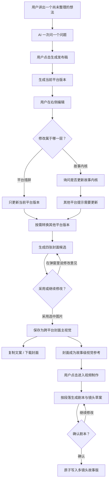

# 发布稿：个人表达整理、多平台派生与视频交接

## Summary

在 `/editing` 中提供独立的「发布稿」工作界面，让用户把尚未组织好的个人想法整理成保留其观点、锋芒与品味的社交媒体文案，并在进入视频制作时把全文转写成可确认、可追溯、逐镜对应的视频剧本。
正式封面作为整个故事的视觉参考，而不是某个镜头；同一故事可以保留多个发布版本，原文字稿、剧本、镜头和视觉成果不会因继续创作而相互覆盖。

---

## Problem Frame

用户往往已经有明确的观察、情绪和立场，却无法独立把它们组织成大众能够理解、自己又愿意署名的成稿。通用 AI 文案工具常直接套用「爆款」结构和平台腔调，虽然语言更顺，却会磨平原有观点，把带有个人品味的表达变成批量生成的平均文本。

当前可行但割裂的做法，是先与 AI 多轮聊天厘清想法，再手动复制成文案、另外制作封面；如果之后还想生成视频，又要重新讲述一次。过程中不仅容易丢失原始观点，平台之间的改写、封面与视频也缺少共同的故事来源。

现有视频交接只把正式封面变成一个开场镜头，发布稿正文虽然被识别为旁白候选，却没有形成剧本或对应镜头。用户在文字稿中完成的多段表达因此无法出现在故事版中，也无法检查哪些内容被保留、改写或遗漏。

一次生成一张正式封面的做法同样缺少控制感：图片可能构图粗糙、审美不合格，甚至带有乱码或莫名其妙的字体，但系统已经把它当成最终结果。用户既看不到同轮候选，也无法围绕某一张图直接说修改意见，只能反复盲抽并承担不透明的生成成本。

---

## Actors

- A1. 用户：有真实想法和个人立场，希望在不被 AI 同质化的前提下完成可发布表达。
- A2. 对话编辑助手：通过逐问逐答厘清用户意图，整理而不驯化用户的表达。
- A3. 平台适配能力：保持内容内核不变，为不同社交平台派生合适的表达版本。
- A4. 视频创作界面：接收同一故事的内核、当前发布稿和故事级封面参考，生成可确认的剧本与逐镜对应关系，再继续完成图片和视频创作。

---

## Key Flows

- F1. 从想法到第一份发布稿
  - **Trigger:** 用户开启新故事，选择一个目标平台并开始讲述自己的想法。
  - **Actors:** A1, A2
  - **Steps:** 用户自由描述 → AI 一次提出一个关键问题 → 用户决定信息已经足够 → 用户点击「生成发布稿」 → 当前平台的初稿出现在右侧编辑器。
  - **Outcome:** 用户得到一份保留本人观点和锋芒、可继续编辑的当前平台稿件。
  - **Covered by:** R1, R2, R3, R4, R5

- F2. 从一个平台转换到另一个平台
  - **Trigger:** 当前平台已有发布稿，用户点击转换到另一个平台。
  - **Actors:** A1, A3
  - **Steps:** 用户选择目标平台 → 系统读取共同故事内核和当前稿件 → 按目标平台调整标题、长度、语气、排版、标签与行动号召 → 新版本进入对应平台标签页。
  - **Outcome:** 两个平台版本并列保留，核心事实与观点一致，表达形式适配各自平台。
  - **Covered by:** R6, R7, R8, R9

- F3. 编辑措辞或改变故事内核
  - **Trigger:** 用户在任一平台稿件中进行修改。
  - **Actors:** A1, A2, A3
  - **Steps:** 系统判断修改层级 → 措辞变化只留在当前平台 → 内核变化先请求用户确认 → 确认后更新共同内核，并给其他平台版本标记「建议更新」；判断不清时直接询问用户。
  - **Outcome:** 用户已经编辑过的版本不会被擅自覆盖，跨平台内容仍能显式保持一致。
  - **Covered by:** R10, R11, R12

- F4. 从发布稿进入封面和视频创作
  - **Trigger:** 用户认可当前发布稿，希望配图或继续制作视频。
  - **Actors:** A1, A2, A4
  - **Steps:** 系统基于故事内核与当前稿生成四张封面候选 → 用户迭代并明确采用一张故事级主视觉 → 用户点击进入视频制作 → 系统读取当前发布版本，按非空段落转写成剧本段落并生成逐镜草案 → 用户在故事版的剧本栏检查原文覆盖和镜头对应 → 用户确认后一次性写入正式镜头 → 后续镜头图片统一参考正式封面。
  - **Outcome:** 原文字稿完整保留并能追溯到剧本和镜头；正式封面统一后续视觉语言但不占用镜头；未经确认的转写不会污染正式故事版。
  - **Covered by:** R13, R14, R15, R16, R17, R18, R19, R20, R27, R28, R29, R30, R31, R32, R33, R34, R35, R36

- F5. 故事内核变化后创建新版本
  - **Trigger:** 用户继续聊故事并提出可能改变原有观点、事实、情绪或创作方向的新想法。
  - **Actors:** A1, A2, A3, A4
  - **Steps:** AI 说明这可能是内核变化 → 用户确认创建新版本 → 新版本继承旧版本的内核、平台稿、正式封面和视频交接材料 → 只为当前平台生成新稿 → 其他平台保留旧稿并标记「待更新」 → 用户通过顶部版本选择器在版本之间切换。
  - **Outcome:** 用户可以继续推进想法而不丢失旧版本；新版本成为当前编辑上下文，旧版本仍可回看、复制和进入视频创作。
  - **Covered by:** R21, R22, R23, R24, R25, R26

---

## Requirements

**入口与工作界面**

- R1. `/editing` 必须提供名为「发布稿」的明确功能入口，并将它作为与剪辑台并列的独立工作界面；两者仍属于同一个当前故事，不得创建独立的社交媒体项目。
- R2. 「发布稿」界面采用左侧对话、右侧稿件编辑器的布局；用户切换到该界面后仍能围绕当前故事继续对话。
- R3. 新故事开始时，对话区必须允许用户选择目标平台；首版支持小红书、X / Twitter、Instagram、LinkedIn、微信朋友圈、抖音 / TikTok 配文。

**对话与生成边界**

- R4. 对话编辑助手必须复现「用户先讲想法、AI 一次问一个关键问题、逐步厘清表达」的工作方式，不能用一次性长表单取代对话。
- R5. 系统不得因判断信息足够而自动生成稿件；只有用户点击「生成发布稿」后，才生成当前目标平台版本。
- R6. 默认只生成当前平台版本。即使用户选择了多个目标平台，也不得在没有明确操作时批量生成其他版本。
- R7. AI 的编辑目标是提高结构、节奏、措辞和可理解性，但不得主动弱化用户的事实、观点、情绪、结论或表达锋芒。

**平台版本与编辑**

- R8. 每个平台版本必须以独立标签页保留，用户可随时切换、阅读和编辑；生成新平台版本不得覆盖已有平台版本。
- R9. 用户可以对任一已有稿件执行「一键转为」其他受支持平台。转换只能改变平台表达，包括标题、长度、语气、排版、标签和行动号召，不能擅自改变共同的内容内核。
- R10. 同一故事必须保留一份跨平台共用的故事内核，覆盖关键事实、核心观点、主要情绪、个人表达倾向和视觉概念；各平台稿是它的发布变体。
- R11. 用户修改稿件后，系统必须区分「当前平台的措辞调整」与「故事内核发生改变」：前者只影响当前标签页，后者必须先询问用户是否同步到故事内核。
- R12. 当修改层级无法可靠判断时，系统必须直接询问用户；故事内核经确认更新后，其他平台版本只标记为「建议更新」，不得自动重写或覆盖。

**封面与视频交接**

- R13. 用户可以基于故事内核和当前发布稿明确发起一轮封面生成；每轮必须在弹窗内同时呈现四张可独立选择的候选，不得把任一候选自动视为正式封面。
- R14. 同一故事最终只采用一张正式封面主视觉，各平台只适配比例、裁切和封面标题；探索中的候选不得覆盖已有正式封面，也不得因切换平台自动生成新图片。
- R15. 用户完成编辑后，首版必须提供复制当前平台文案和下载对应封面的出口，不要求连接社交平台账号。
- R16. 用户从发布稿进入视频制作时，视频创作界面必须从同一故事自动获得故事内核、当前平台发布稿和正式封面，并以这些材料生成剧本草案，而不是要求用户从头复述。
- R17. 发布稿是视频剧本的上游来源而不是临时面板；用户在工作区之间切换时不得清空发布稿、剧本或对应关系。只有用户明确点击「进入视频制作」才生成剧本预览，普通工作区切换不得自动改写或产生模型调用。
- R18. 封面候选弹窗必须同时提供候选选择和自然语言反馈输入；用户选中候选后提出修改意见时，新一轮应以该候选为视觉基础，未选中候选时则基于当前故事内核重新构思。
- R19. 每轮付费生成必须由用户单独确认并显示当轮费用；选中候选、切换候选和采用已有候选不得再次收费。已付费生成的候选必须归属于当前故事，关闭弹窗或刷新页面后仍能恢复。
- R20. 封面生成必须明确抑制可读文字、乱码字体、Logo 和水印；系统不得声称候选已经通过自动文字检测，用户仍可淘汰任何带有文字瑕疵或审美不合格的图片。

**故事版本与内核变化**
- R21. 同一故事必须支持多个发布版本；只有观点、事实、情绪或创作方向发生变化时才创建新版本，普通措辞、断句、标签或平台格式调整不得自动创建新版本。
- R22. 当 AI 判断用户的新想法可能改变故事内核时，必须先说明判断并请求用户确认；未经确认不得自动创建新版本或覆盖当前版本。
- R23. 新版本必须完整继承旧版本的故事内核、已有平台稿、正式封面和视频交接材料；创建新版本不得自动生成新封面或触发付费模型调用。
- R24. 创建新版本后，系统只为当前选中的平台生成新版本稿件；其他已有平台稿保留旧版本内容并显示「待更新」，不得后台批量重写或消耗模型调用。
- R25. 发布稿顶部必须提供版本选择器，显示版本序号和可读短标题；系统默认生成「V2 · 短标题」形式的名称，用户可以重命名，切换版本不得清空对话、稿件、封面或视频交接状态。
- R26. 每个版本的正式封面、平台稿和视频交接材料必须相互隔离；在一个版本中修改或采用内容，不得覆盖其他版本的已确认成果。

**视频剧本、全文覆盖与镜头对应**

- R27. 故事版看板必须增加可见的「剧本」栏；剧本是从当前发布稿派生的独立视频表达，不得用发布稿原文或镜头描述的简单复制代替。
- R28. 用户点击「进入视频制作」后，系统必须自动生成一份剧本与镜头草案并先展示预览；未经用户确认，草案不得替换或新增正式故事版镜头。
- R29. 转写必须按当前发布稿的非空段落直接拆分：每个原文段落至少对应一个剧本段落和一个镜头，长段落可以拆成多个镜头，但任何事实、观点、情绪或结论都不得被静默遗漏。多段发布稿的首版镜头数不得少于四个。
- R30. 每个剧本段落必须把平台文案转成可朗读、可表演或可视觉化的视频表达；平台标签、话题、排版说明和行动号召不得被机械转成旁白或镜头内容。
- R31. 剧本栏必须让用户同时看到原文来源、转写后的剧本段落和对应镜头编号，以便逐段检查覆盖、改写和遗漏。
- R32. 用户确认剧本后，系统必须把整组剧本与镜头作为一次完整操作写入；生成或保存失败时不得留下只有部分段落、部分镜头或单独封面镜头的半成品。
- R33. 剧本必须绑定生成它的发布版本和稿件修订。原稿发生变化后，现有剧本保留并标记「需要更新」；只有用户查看影响并确认重新转写后，才能产生新的剧本与镜头草案。
- R34. 重新转写不得自动删除已有图片、视频或人工镜头修改；当新旧镜头结构无法安全对应时，系统必须先展示影响并由用户决定如何处理已有成果。
- R35. 正式封面必须作为故事级视觉参考供所有后续镜头出图使用，约束整体人物、色彩、材质和视觉气质；封面不得归属或占用任何单独镜头，也不得要求所有镜头复制封面的具体构图。
- R36. 对已经把封面保存成单独开场镜头的旧故事，用户首次确认新剧本时必须移除该占位关系、保留封面资产并提升为故事级视觉参考；不得因迁移删除封面图片本身。

---

## Acceptance Examples

- AE1. **Covers R4, R5, R7.** Given 用户只说「我觉得 AI 和社交平台都在制造虚假繁荣」，when AI 与用户逐轮厘清主轴且用户点击「生成发布稿」，then 右侧出现一篇结构完整但保留原有批判立场的小红书稿；点击前不得自动生成。
- AE2. **Covers R3, R6, R8.** Given 用户同时选择小红书、X 和 LinkedIn，when 用户点击生成且当前平台是小红书，then 只生成小红书标签页内容，X 和 LinkedIn 不在后台自动消耗模型调用。
- AE3. **Covers R8, R9.** Given 小红书标签页已有一篇用户编辑过的稿件，when 用户点击「一键转为 X」，then 系统新增并打开 X 标签页，原小红书稿保持不变，X 稿更短但事实、观点和立场一致。
- AE4. **Covers R11, R12.** Given 用户把「获利的只有大模型公司」改成「平台和模型公司共同获利」，when 系统判断这可能改变核心结论，then 先询问这是当前平台措辞还是核心观点变化；用户确认更新内核后，其他标签页只出现更新提示，不被自动改写。
- AE5. **Covers R11.** Given 用户只把小红书稿中的长句拆成短句并增加换行，when 系统识别为平台措辞调整，then 修改只保留在小红书标签页，不触发其他平台更新提示。
- AE6. **Covers R13, R14, R15.** Given 当前故事已有认可的小红书稿，when 用户明确生成一轮封面，then 弹窗出现四张候选且正式封面保持不变；用户采用其中一张并随后切换到 Instagram 时，两个平台复用该正式主视觉，只调整版式适配。
- AE7. **Covers R16, R17, R28.** Given 用户已经完成 X 稿和封面，when 用户点击「进入视频制作」，then 发布稿状态继续保留，系统自动展示剧本与镜头预览；when 用户只是切换到其他工作区，then 不生成或改写剧本。
- AE8. **Covers R13, R19.** Given 当前故事没有正式封面，when 用户确认一次四图生成费用，then 系统只提交一轮付费任务并展示四张候选；候选出现时不得自动选择、自动采用或再次扣费。
- AE9. **Covers R18, R19.** Given 用户选中了第二张候选并输入「去掉画面里的字体，让人物更小、机器更压迫」，when 用户明确发起下一轮，then 系统显示该轮费用并在确认后返回四张基于第二张调整的新候选，上一轮仍可回看。
- AE10. **Covers R14, R19.** Given 故事已有正式封面且用户又生成了四张候选，when 用户关闭弹窗或刷新页面，then 原正式封面保持不变，重新打开弹窗仍能恢复尚未采用的候选。
- AE11. **Covers R14, R16, R35.** Given 用户从候选中明确采用一张图片，when 用户进入故事版并为任一镜头生成图片，then 各工作区读取同一张故事级正式封面作为视觉参考；未采用候选不得成为故事视觉参考，正式封面也不得自动成为某镜头主图。
- AE12. **Covers R21, R22.** Given 用户只要求把一句话改短，when 系统判断为措辞调整，then 当前版本更新且不创建新版本；当用户提出新的核心判断并确认创建版本时，then 系统创建 V2 并保留 V1。
- AE13. **Covers R23, R24.** Given V1 已有小红书稿、X 稿和正式封面，when 用户确认创建 V2，then V2 继承正式封面和全部已有材料，只生成当前平台的新稿，X 稿显示「待更新」且没有后台调用。
- AE14. **Covers R25, R26.** Given 故事已有 V1 和 V2，when 用户在顶部切换版本，then 对话上下文、平台稿、封面和视频交接材料都切换到对应版本；在 V2 中修改或换封面不会改变 V1。
- AE15. **Covers R27, R29, R30, R31.** Given `#1172` 当前发布稿有六个非空正文段落且故事版只有一个封面占位镜头，when 系统生成视频剧本预览，then 出现至少六个可追溯的剧本段落和对应镜头，每个原文段落都能定位到自己的转写结果，且话题标签不进入旁白。
- AE16. **Covers R28, R32.** Given 用户正在预览六镜剧本草案，when 用户取消或保存失败，then 正式故事版保持原状；when 用户确认且保存成功，then 六个镜头和对应剧本同时出现，不存在只写入前三镜的状态。
- AE17. **Covers R33, R34.** Given 已确认剧本基于 V1 的第二次稿件修订，when 用户修改原稿正文，then 旧剧本继续可读并显示需要更新；重新转写前，已有镜头图片和视频保持不变并展示可能受影响的镜头。
- AE18. **Covers R35, R36.** Given `#1172` 的正式封面曾被保存为唯一开场镜头，when 用户确认新的多镜头剧本，then 封面图片继续作为整个故事的视觉参考，但不再占用任何镜头；后续每镜出图继承其视觉语言而不是复制其构图。

---

## Success Criteria

- 用户能把一个原本难以复述的真实想法，整理成一篇愿意以本人身份发布、且仍能认出自己观点与语气的稿件。
- 用户从开始对话到获得第一个可编辑平台稿，不需要填写长表单，也不会触发未明确要求的平台生成。
- 同一故事可以至少完成一次跨平台转换，转换后核心事实、观点与立场不漂移，原稿不丢失。
- 用户能够在四图候选中选择、通过自然语言迭代并采用一张与故事一致的封面主视觉；不满意的候选不会污染正式封面或下游工作区。
- 用户进入视频制作后无需重复讲述，系统能把当前发布稿的全部正文转写成可确认的视频剧本，并让每段原文、剧本和镜头相互可追溯。
- `#1172` 这类只有封面占位镜头的故事能够在一次确认后形成至少四镜的完整故事版，而不是让多段文字停留在交接提示里。
- 正式封面能够统一后续镜头图片的视觉语言，同时始终保持故事级资产身份，不被误当成某一镜。
- 用户可以在同一故事中继续更新想法、创建 V2 或后续版本，旧版本仍可回看和复用，新版本不会自动产生不必要的模型或生图调用。
- 后续规划无需再发明入口名称、页面布局、支持平台、生成时机、版本保留规则、修改同步规则、封面复用方式或视频交接内容。

---

## Scope Boundaries

- 第一版不长期学习或训练用户的个人文风。
- 版本链首版只提供版本切换、继承和待更新提示，不提供复杂的逐字差异合并、多人协作或评论式审阅。
- 第一版不批量生成全部平台稿件，也不在后台自动生成未请求的版本。
- 第一版不自动替用户挑选「最好」的候选，也不自动把候选升级为正式封面。
- 第一版不提供画笔、蒙版、局部涂抹或图层等专业修图工具；修改通过弹窗内自然语言完成。
- 第一版不对每个社交平台分别生成四套候选，平台差异继续通过正式主视觉的裁切和版式适配解决。
- 第一版不承诺通过 OCR 或视觉模型自动拦截所有文字瑕疵；候选生成提示必须抑制文字，最终审美判断由用户完成。
- 第一版不连接社交平台账号，不做直接发布、定时发布或发布队列。
- 第一版不采集发布后的平台数据，也不根据浏览、点赞或转化自动优化文案。
- 第一版不自动重写其他平台已存在或已编辑的版本。
- 普通工作区切换不自动拆镜；只有用户明确点击「进入视频制作」才生成剧本与镜头预览。
- 第一版采用段落直接拆镜，不增加复杂导演节拍、多套剧本方案或自动镜头语言精修。
- 确认剧本不会自动生成图片、视频或成片，也不会自动提交付费图片/视频任务。
- 本功能不自动把正式封面插入时间线，也不要求镜头复刻封面构图。

---

## Key Decisions

- 使用「发布稿」而非「剧本」：首要产物是可直接发布的社交文案，「剧本」会误导用户以为这里只服务视频。
- 以同一个故事为唯一单位：发布稿、封面和视频是同一故事的不同表达，避免为社交媒体另建一套割裂项目。
- 用户明确触发生成：无论平台文案还是封面，都不因系统判断或平台选择自动批量调用模型。
- 故事内核与平台表达分层：内核保护用户的事实、观点和品味，平台版本负责长度、语气和格式适配。
- 保护已编辑版本：内核变化只产生更新提示，用户决定是否重新派生，系统不以一致性为由覆盖人工修改。
- 四图探索、一图采用：每轮生成提供四张可讨论的候选，用户通过自然语言迭代并明确采用一张；只有采用后的主视觉跨平台复用，优先保持视觉识别并控制生成成本。
- 生成与采用分离：付费任务只负责产生候选，选中或查看候选不会改写正式封面；采用是一次不收费、可明确理解的用户决定。
- 第一版采用复制与下载出口：先闭合内容创作价值，不把平台账号接入和发布可靠性带进首版。
- 发布稿、视频剧本与故事版分层：发布稿保留可发布表达，剧本负责逐段视频转写，故事版负责正式镜头；三者通过可追溯关系连接，不互相覆盖。
- 明确进入后自动预览、确认后原子写入：用户点击「进入视频制作」即表达了生成剧本草案的意图，但正式镜头只有在用户确认后才改变。
- 段落直接拆镜：第一版优先保证全文覆盖和可检查性，每个非空段落至少产生一个剧本段落和镜头，不额外引入导演节拍层。
- 封面是故事级视觉母版：正式封面统一后续图片的视觉语言，但不属于任何镜头；画面内容仍由各镜剧本决定。
- 版本以故事内核变化为边界：措辞编辑属于当前版本，确认后的内核变化才产生新版本；这能让用户继续思考，同时避免把每次重写都变成难以管理的版本噪音。
- 新版本先继承旧版本成果再局部更新：正式封面和未更新的平台稿保持可用，当前平台优先获得新稿，其他平台由用户决定是否派生。

---

## Dependencies / Assumptions

- 现有产品继续把「故事」作为聊天、文字、图片、镜头和视频之间的共同创作单位。
- 现有 `/editing` 已具备对话、当前故事、素材和视频工作界面；新功能需要增加独立工作区切换，同时不制造第二套故事状态。
- 各平台适配规则必须明确区分内容内核与平台表达，避免把平台风格优化变成观点改写。
- 封面候选需要归属于当前故事并在关闭弹窗或刷新后恢复；只有明确采用的候选才能进入正式封面和视频交接。
- 封面平台适配需要在不破坏正式主视觉主体和标题可读性的前提下处理不同画幅。
- 视频创作界面能够接收故事内核、当前发布稿和封面主视觉，并把正文转写为可持久化、可预览、可逐镜映射的剧本草案。
- 后续镜头出图能力能够读取故事级正式封面作为视觉参考，同时仍以当前镜头剧本决定具体画面内容。
- 故事版能够区分未确认剧本草案与正式镜头，并支持整组确认或整组失败，不留下部分写入。
- 版本切换需要让对话编辑、平台稿、封面主视觉和视频交接材料始终指向同一个版本，不能只切换文案而留下其他工作区的旧上下文。

---

## Outstanding Questions

### Deferred to Planning

- [Affects R3, R9][Technical] 六个平台的首版适配规则如何复用共同结构，同时允许平台特有的标题、长度、标签和行动号召？
- [Affects R10, R11, R12][Technical] 如何保存并比较故事内核与平台版本，使措辞修改、内核修改和「建议更新」状态在刷新后仍然可靠？
- [Affects R13, R14][Technical] 封面主视觉如何生成平台安全区域，并在不同画幅中完成可预期的裁切与标题排版？
- [Affects R13, R18, R19][Technical] 如何保存每轮四张候选及其上下轮关系，使已付费结果可恢复、可回看且不会污染正式封面？
- [Affects R18][Technical] 用户基于选中候选提出修改意见时，如何复用该候选的视觉信息并生成下一轮四张变化，而不是退化成无关的重新抽卡？
- [Affects R16, R27, R31, R33][Technical] 如何保存原文段落、剧本段落、发布版本与稳定镜头之间的来源关系，使重新排序或刷新后仍可追溯？
- [Affects R28, R32, R34][Technical] 剧本预览、整组确认和已有媒体保护如何形成可恢复的原子操作，并在新旧镜头结构变化时给出可靠影响预览？
- [Affects R35, R36][Technical] 如何把现有封面主图提升为故事级视觉参考，并让所有出图入口一致消费，同时安全迁移已经存在的封面占位镜头？
- [Affects R21, R23, R26][Technical] 如何保存版本快照与版本间的继承关系，使旧版本只读可回看、新版本可独立编辑，并在刷新或跨工作区切换后保持一致？
- [Affects R24][Technical] 如何为其他平台维护「待更新」状态，同时保留用户已经手动编辑过的旧平台稿，避免版本派生覆盖人工内容？
