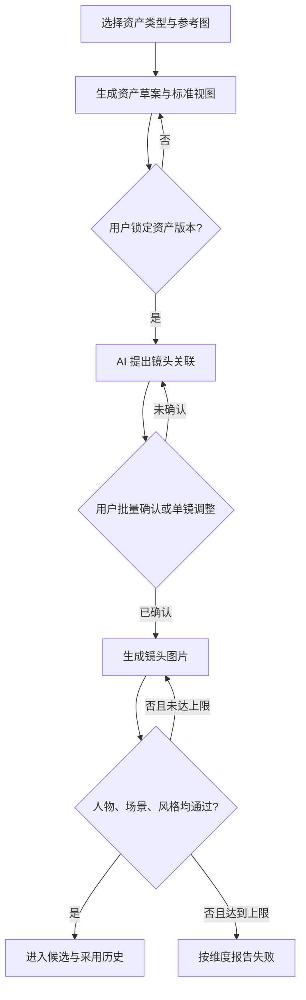

# Story 锁定式视觉资产

## Summary

在当前 Story 的素材仓库中增加可锁定的人物、场景和美术风格资产。镜头在用户确认关联后携带指定资产生成，并通过人物、场景、风格三项自动验收与有限重试，只把一致性合格的图片交给用户选择。

---

## Problem Frame

当前人物一致性从未真正成立：逐镜生成时，人物长相、发型和服饰会漂移，已有的单人物参考也无法形成可管理、可确认、可追溯的资产。场景与画风同样缺少明确的锁定对象，参考图只是生成时的软提示，用户无法知道模型究竟继承了什么。

用户需要的不是“更相似”，而是设计事实不漂移：人物的脸、发型、服饰和配件，场景的空间结构、材质与固定陈设，以及美术风格的媒介、笔触和造型语言必须与已确认资产一致。景别、机位、动作、表情和光线可以改变，但不能借此改写这些固定事实。

---

## Actors

- A1. 创作者：创建并锁定资产，确认镜头关联，最终采用合格图片。
- A2. 资产 Agent：分析参考图、生成标准视图、暴露冲突并提出镜头关联建议。
- A3. 一致性守门员：生成后分别检查人物、场景和风格，控制重试与失败报告。

---

## Key Flows

- F1. 创建并锁定资产
  - **Trigger:** 创作者在当前 Story 的素材仓库选择新建人物、场景或风格资产。
  - **Actors:** A1, A2
  - **Steps:** 创作者先选择资产类型并选择若干参考图；Agent 只提取该类型的固定事实，生成对应标准视图和资产草案；冲突内容被明确列出；创作者确认后锁定首个资产版本。
  - **Outcome:** 只有一份范围明确、视图完整且经用户确认的 Story 级资产可用于正式生成。
  - **Covered by:** R1-R7

- F2. 为镜头建立资产关联
  - **Trigger:** Story 中已有镜头和至少一项锁定资产。
  - **Actors:** A1, A2
  - **Steps:** Agent 根据镜头内容提出整组关联建议；创作者批量确认、拒绝或逐镜修改；确认后的关联固定到明确的资产版本。
  - **Outcome:** 每个待生成镜头都有可解释、可修改且不会被后续资产更新静默改变的资产组合。
  - **Covered by:** R8-R10

- F3. 生成、验收与重试
  - **Trigger:** 创作者为已确认资产关联的镜头发起图片生成。
  - **Actors:** A1, A3
  - **Steps:** 系统在付费前检查关联与参考是否可用；生成后分别检查人物、场景和风格；任一必需项失败则在上限内自动重试；只有全部通过的结果才进入候选；耗尽重试后按维度报告失败。
  - **Outcome:** 用户不会把明显漂移的图片误当成可用候选，也不会在缺少有效参考时静默付费。
  - **Covered by:** R11-R15

---

## Requirements

**资产仓库与创建**

- R1. 当前 Story 的素材仓库新增“资产”分类，包含人物、场景和美术风格三种资产；v1 不读取或复用其他 Story 的资产。
- R2. 创建前由用户明确选择资产类型；即使参考图同时含人物、场景和风格，Agent 也只提取本次所选类型，不擅自拆分或混合创建。
- R3. 一个资产可由若干参考图共同建立。参考之间的固定事实发生冲突时，Agent 必须指出冲突并等待用户处理，不能静默平均、随机选择或杜撰统一版本。
- R4. 人物资产草案至少呈现可检查的正面、侧面、背面和身份关键特写；场景资产至少呈现主视角、反打或反向关系、侧向关系和俯视布局；风格资产呈现覆盖不同主体与景别的代表视图，以证明它不是某一张图的构图复刻。
- R5. 标准视图首先是待确认草案。只有用户明确锁定后，资产才可参与正式镜头生成。
- R6. 人物资产等于一个固定造型：脸、发型、发色、服饰款式、配件共同锁定。换装或换发型建立新的资产，不在同一资产内保存多个造型。
- R7. 场景资产锁定空间结构、材质、固定陈设和关键物件关系；风格资产锁定媒介、笔触、造型语言、色彩体系及禁止项。场景光线不属于永久固定事实，除非用户把它明确锁入资产。

**镜头关联与生成约束**

- R8. Agent 可以根据镜头内容为整组镜头提出人物、场景和风格关联建议，但建议在用户批量确认前不得影响正式生成。
- R9. 用户可以逐镜修改关联。v1 每镜最多承诺一个主要人物资产，可同时关联一个场景资产和一个风格资产；不承诺多人镜头中的逐人一致性。
- R10. 资产固定事实的优先级高于镜头临时描述；镜头可改变景别、机位、动作、表情和光线，但若文字要求会改变已锁定的发型、服饰、场景结构或美术语言，系统必须在付费前暴露冲突，不能暗中选择一边。
- R11. 正式生成前必须验证所有必需关联已经确认、资产版本仍然有效且参考输入可被当前生成链路实际使用；缺失或降级为无参考生成时必须阻止付费提交。

**验收、重试与历史**

- R12. 每张生成结果必须分别接受人物、场景和风格一致性检查；只检查该镜头已关联的资产维度，不凭空要求未关联的资产。
- R13. 任一必需维度未通过时，结果不得进入可采用候选；系统应把失败维度和偏差反馈给下一次自动重试，并设置明确的最大重试次数。
- R14. 达到重试上限仍未通过时，系统停止继续付费，保留可审计的尝试记录，并分别报告人物、场景或风格的失败原因，不用一张低质量结果冒充成功。
- R15. 通过验收的结果沿用现有候选与明确采用语义：生成成功不等于自动成为当前图片。每个结果可追溯到镜头生成时实际使用的人物、场景、风格资产版本和验收结论。
- R16. 更新已锁定资产会创建新版本。历史镜头和历史生成结果继续指向原版本；是否将现有镜头关联升级到新版本，必须由用户明确确认。

---

## Acceptance Examples

- AE1. **Covers R2-R6.** 给定三张同一人物、同一服饰的照片，用户选择“人物资产”后，系统只建立人物固定造型草案；用户确认正、侧、背和关键特写后资产才变为可用。
- AE2. **Covers R3, R5.** 给定参考图中的外套颜色或发型互相冲突，系统明确列出冲突且资产保持未锁定；系统不得自行选择其中一种后进入镜头生成。
- AE3. **Covers R8-R10.** 给定十个镜头和已锁定资产，Agent 提出批量关联；用户把其中一镜换成另一个场景资产后，只有用户最终确认的组合用于该镜生成。
- AE4. **Covers R10-R11.** 给定镜头绑定了“短发、红色长外套”的人物资产，而镜头文字要求“长发、白衬衫”，系统在付费前提示冲突并阻止生成，而不是让模型随机决定。
- AE5. **Covers R12-R14.** 给定生成图人物通过但场景家具关系改变，一致性守门员只把场景标为失败并携带该偏差重试；达到上限后停止并报告场景失败，原图不进入候选。
- AE6. **Covers R7, R12.** 给定同一场景资产和风格资产，远景、侧面特写与夜间光线可以不同，但空间结构、材质、固定陈设及美术语言仍需通过检查。
- AE7. **Covers R15-R16.** 给定资产已从版本 1 更新为版本 2，历史镜头继续显示其使用的版本 1；只有用户确认升级关联后，新生成才使用版本 2，旧候选与当前采用图不被覆盖。

---

## Success Criteria

- 同一人物资产连续生成三个不同景别、动作或光线的单人镜头，创作者可以一眼确认是同一张脸、同一发型和同一套服饰，且三张都具有通过记录。
- 同一场景资产从主视角、反打和特写生成时，空间结构、材质与固定陈设关系保持一致。
- 同一风格资产作用于人物、场景和物件镜头时，媒介、笔触、造型语言与色彩体系保持一致，而不是复刻同一构图。
- 任何参考不可用、绑定冲突或一致性失败都不会被静默降级成无参考付费生成。
- 计划与实施不需要再发明资产范围、锁定语义、镜头关联方式、失败行为或历史版本行为。

---

## Scope Boundaries

- v1 资产严格属于当前 Story，不做项目级或个人级共享。
- v1 每镜最多承诺一个主要人物资产；多人镜头的逐人一致性延后。
- v1 一个角色资产只含一个固定造型，不在资产内切换服饰或发型。
- 不建设三维人物、三维场景或先搭确定画面再渲染的制作系统。
- 不建设基于 99 张私有参考图的审美学习库、满意/不满意训练库或跨用户偏好系统。
- 不把资产锁定等同于永久禁止编辑；编辑通过新版本完成。
- 不承诺生成模型永不失败；产品承诺是失败结果不冒充合格候选、自动重试有上限且失败可解释。

---

## Key Decisions

- 选择“锁定式视觉资产”而非简单多图参考包：仅靠软参考无法支撑“必须一致”的产品承诺。
- 资产类型由用户先选：避免一张图中的人物、场景和风格被错误混为同一控制信号。
- 采用“AI 建议、用户确认”的镜头关联：兼顾大量镜头的效率与创作者控制权。
- 一致性检查是候选入口守门，而非仅显示风险标签：明显漂移的图片不能进入采用流程。
- 资产版本不可原地覆盖：保证历史镜头和生成结果的含义可追溯。
- v1 先证明单主要人物 + 单场景 + 单风格的组合，不让多人约束稀释最核心的一致性验收。

---

## Dependencies / Assumptions

- 复用现有 Story 隔离、稳定镜头身份、图片候选与明确采用历史。
- 复用现有统一静态图片生成链路及其人物、场景、风格参考能力，但不能依赖静默降级。
- 现有单人物锚点、单张参考分析和图生图能力可作为迁移输入，不再作为最终产品模型。
- 自动一致性判断需要能够输出分维度结论和可用于重试的具体偏差；阈值与重试上限由计划阶段结合供应商成本和误判风险确定。

---

## Outstanding Questions

### Deferred to Planning

- [Affects R4][Needs research] 各类标准视图应由一次多视图任务还是若干可恢复任务生成，才能兼顾成本、失败恢复和视图间一致性。
- [Affects R12-R14][Needs research] 人物、场景和风格分别使用什么自动评测组合，以及如何校准到“宁可不给候选，也不让漂移图通过”。
- [Affects R13-R14][Technical] 最大重试次数、重试预算和任务恢复边界如何与现有付费确认及幂等机制结合。
