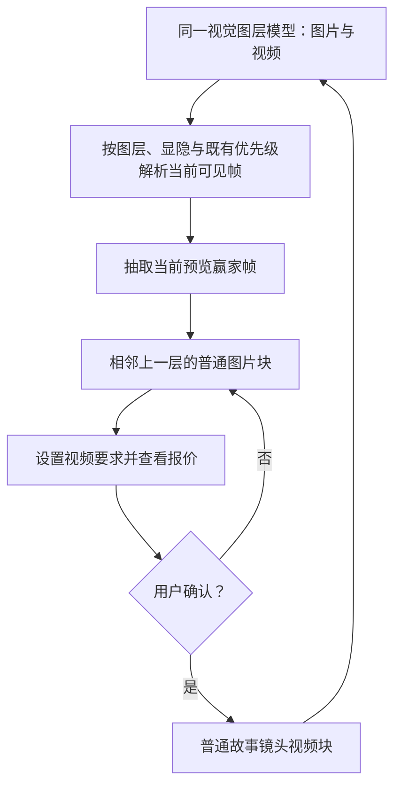

# 统一视觉图层剪辑操作

## Summary

时间线将采用统一的视觉图层操作模型：底层故事镜头与上层生成内容不再拥有两套不同能力。用户可以在任意图层编辑视频、从当前预览画面抽帧并继续生成，同时按所选对象安全地复制、粘贴和删除。

---

## Problem Frame

当前第一层故事镜头具备较完整的右键剪辑菜单，上层普通视频和图片却只接入了部分操作。用户把生成视频放到新图层后，无法继续用同样方式切割、抽帧或交给聊聊，图层因此看起来像两种不同产品对象，也中断了“生成—抽帧—再生成”的迭代过程。

复制、删除和键盘焦点也缺少统一的对象边界。图片块、视频块和故事镜头虽然都显示在时间线上，但用户无法稳定预判复制会产生什么、按删除键会删掉素材块还是整个镜头，以及删除是否会影响素材仓库原件。

---

## Actors

- A1. 剪辑用户：在视觉图层中选择、修改、派生和删除镜头、视频与图片。
- A2. 时间线与预览系统：解析图层覆盖关系、管理对象选择，并保证预览、抽帧和导出看到同一画面。
- A3. 付费生成流程：展示视频参数与报价，并只在用户明确确认后提交任务。

---

## Key Flows

- F1. 在任意图层编辑视频
  - **Trigger:** 用户选中底层或上层的一个视频块。
  - **Actors:** A1、A2
  - **Steps:** 时间线显示明确的对象选择状态；右键菜单提供所有视频共有的剪辑操作；当视频代表完整故事镜头时，菜单再提供故事重排、加镜和删除整个镜头等结构操作；命令按当前对象类型执行。
  - **Outcome:** 视频所在图层和素材来源不会限制其剪辑能力。
  - **Covered by:** R1、R2、R3、R4、R5、R6、R20

- F2. 用多个图层共同派生新视频
  - **Trigger:** 用户在多个视觉素材重叠的时刻执行抽帧。
  - **Actors:** A1、A2、A3
  - **Steps:** 系统按当前预览的稳定赢家规则解析操作时刻的可见画面；把该帧放到当前操作图层的上一层；用户移动、复制或把该图片作为生成输入；系统展示参数与报价；用户明确确认后才提交生成；采用结果成为普通故事镜头视频块。
  - **Outcome:** 不同图层能够通过覆盖、赢家抽帧和再生成持续影响彼此，且付费边界保持明确。
  - **Covered by:** R7、R8、R9、R10、R11、R12

- F3. 复制、粘贴和直接删除
  - **Trigger:** 用户选中一个故事镜头或图片块，并使用快捷键或右键菜单。
  - **Actors:** A1、A2
  - **Steps:** 系统记录被选对象及其类型；复制形成当前故事会话内的剪贴板快照；键盘粘贴使用播放头和当前图层，右键粘贴使用点击位置；删除键立即删除当前对象；每次成功粘贴或删除都可用一次撤销恢复。
  - **Outcome:** 新副本可以独立修改，删除范围与被选对象一致，素材仓库原件保持安全。
  - **Covered by:** R13、R14、R15、R16、R17、R18、R19

---

## Requirements

**统一图层与对象操作**

- R1. 所有持久视觉图层必须使用同一套图层语义；图层编号、是否位于第一层以及素材是否由生成流程产生，都不得决定一个视频能否被剪辑。
- R2. 图层顺序只决定覆盖与合成关系。即使一个素材在预览中被更高层遮住，用户仍必须能从它所在的时间线图层直接选择和操作它。
- R3. 时间线必须显示明确、唯一的当前选择，并让用户能够分辨选中的是完整故事镜头、镜头拥有的内部视频片段还是独立图片块。在对象上打开右键菜单时，该对象必须先成为唯一当前选择，菜单标题和命令绑定该对象；空白处右键只提供位置操作，不得沿用先前对象的复制或删除命令。对象类别由创作语义而非当前存储宿主决定：镜头主视觉及在该镜头内部追加或切出的片段归镜头所有；所有时间线图片块保持独立；在某个对象上继续切割时，新片段继承该对象类别。
- R4. 凡代表完整故事镜头的视频，无论位于哪一层、是否由生成流程产生，都必须提供截图所示的适用完整操作，包括在当前时间打或取消锚点、切刀、抽帧、交给聊聊、逐帧或跨层移动、故事顺序前后挪、加镜、复制和删除整个故事镜头。镜头内部视频片段必须提供切刀、抽帧、聊聊、移动和删除该片段等适用操作，但不得显示会误改整个故事镜头的复制、重排、加镜或删镜命令。
- R5. 图片块必须提供适用的对象操作，包括复制、交给聊聊、删除和作为视频生成输入；当当前位置能按既有锚点模型归属到稳定镜头时，可以提供在该时间打或取消锚点，否则必须禁用并说明原因。空白图层必须提供粘贴或新增入口，没有实际含义的视频操作不得伪装成可用图片操作。
- R6. 新操作不得破坏现有的逐帧移动、跨层移动、磁吸、位置锚点、图层显隐、视觉赢家、撤销以及镜头信息列与视频移动同步等能力；复制对象不得复制绝对位置锚点。

**当前预览抽帧与继续生成**

- R7. 用户通过快捷键抽帧时，系统必须使用播放头时刻；用户通过右键菜单抽帧时，系统必须使用右键点击的绝对时刻并把播放头同步到该时刻。两种入口都抽取当时的最终可见画面，而不是只读取发起菜单的视频源画面。
- R8. 本需求中的“最终可见画面”指既有全画幅视觉层规则选出的单一赢家帧，不新增多层透明度或混合模式的像素合成。抽帧、预览和导出必须共享同一套图层显隐、锚点优先级与稳定赢家规则；隐藏层不得进入结果，同一时刻不得出现三种不同的当前画面。
- R9. 抽帧结果必须作为普通的一帧图片块，放在当前操作图层的相邻上一层，并与抽帧时刻保持相同绝对时间。若紧邻上一层不存在或处于隐藏状态，系统必须在当前层上方插入新的可见层并把原有更高层整体上移，不得擅自取消任何既有图层的隐藏状态。抽帧本身不得创建付费任务，也不得移动或裁剪任何受锚点保护的镜头。
- R10. 抽出的图片必须可以像其他普通图片块一样选择、移动、跨层、复制、删除、交给聊聊，并作为后续视频生成的输入。
- R11. 从图片发起视频生成时，系统必须先展示生成参数与报价；只有用户明确确认后才能提交付费任务。取消或关闭确认流程不得创建任务或修改时间线。
- R12. 用户采用生成结果后，新视频必须成为普通视觉图层中的故事镜头视频块，参与相同的覆盖规则并获得 R4 中故事镜头适用的完整操作，使“覆盖—抽帧—再生成”可以重复进行。

**复制与粘贴**

- R13. `Cmd/Ctrl+C` 和右键复制必须读取当下明确选中的故事镜头或图片块；右键另一个对象时必须按 R3 先切换选择，没有有效且可复制的对象时不得复制邻近对象或静默沿用过期选择。复制成功后形成独立于后续选择和播放头变化的内存快照；切换 Story 或刷新页面时必须清空，源对象失效且所需媒体引用已不可用时粘贴必须失败并说明原因。本轮不把镜头内部视频片段加入通用剪贴板。
- R14. 复制故事镜头必须得到新的稳定镜头身份，并复制全部用户可见、可编辑的镜头信息、当前采用媒体和内部剪辑状态；内部片段获得新身份，源媒体继续复用。绝对位置锚点、仅因存储而挂在该镜头下的独立图片块、生成任务和付费记录不得随镜头复制。复制图片块时，副本保留时长、裁剪、变换和其他可见编辑参数，获得新的时间线身份，并继续引用同一张原图。
- R15. `Cmd/Ctrl+V` 默认把副本放到播放头：存在明确当前图层时使用该层，否则沿用来源图层；右键“粘贴到这里”必须使用用户点击的时间和图层。粘贴故事镜头时，新镜头按目标绝对时间插入相邻故事顺序并获得唯一镜号，镜头信息列按新的绝对起点显示；粘贴允许与现有素材重叠，不替换、不推开也不自动寻找空档，重叠结果继续服从既有锚点、图层和稳定堆叠优先级。
- R16. 粘贴后的镜头或图片块必须能够独立移动、修改和删除。后续编辑副本不得联动改变原对象；二者共享原始媒体引用时，任何一个时间线对象也不得取得删除媒体原件的所有权。

**对象级删除与恢复**

- R17. 选中故事镜头后删除，必须删除该故事镜头及其拥有的主视觉和内部视频片段；仅因存储宿主关系挂在它下面的独立图片块必须重新归属并保持原绝对时间和图层。选中镜头内部视频片段或独立图片块后删除，只能移除该片段或图片块。任何删除都不得删除或改写素材仓库原图、来源视频、生成 Take、采用历史、生成记录或其他引用；同一对象通过右键菜单或键盘删除时必须使用相同语义。故事只剩最后一个镜头时，删除整个镜头必须禁用并说明原因。
- R18. `Delete/Backspace` 必须立即删除当前对象并产生一条可撤销记录；一次撤销完整恢复这次删除。每次成功粘贴也必须形成一条原子撤销记录，纯复制不写撤销栈，失败操作不得占用撤销记录。焦点位于文字输入、可编辑内容或其他会消费删除键的控件时，时间线不得误删对象。
- R19. 成功的粘贴和删除必须在刷新后保持；失败时保留操作前状态并给出用户可见反馈，不得静默删除、静默复制或只在界面中暂时变化。
- R20. 既有 legacy overlay 在首次执行任一修改操作时，必须原子、无损地归一为它所关联的普通上层故事镜头，保留源媒体、绝对时间、图层和当前可见结果，并在同一次用户操作中继续执行所选命令；无法解析到有效故事镜头的异常 overlay 必须保持原状并显示错误，不得猜测迁移为独立片段。归一过程不得产生重复块、闪回旧位置或额外撤销步骤。

---

## Acceptance Examples

- AE1. **Covers R1、R4、R5。** 给定第一层故事镜头、上层生成镜头和一个镜头内部视频片段，两个故事镜头都提供锚点、切刀、抽帧、聊聊、移动、前后挪、加镜、复制和删镜；内部片段只显示适用的片段操作，图片不出现无意义的切刀入口。
- AE2. **Covers R2、R3。** 给定上层视频完全遮住下层视频，用户仍能在下层轨道选中下层视频；执行移动或删除所选片段时只改变下层对象，上层视频保持不变。
- AE3. **Covers R6。** 给定一个带镜头信息列的视频，用户从任意图层移动它时，信息列继续随视频显示瞬态移动预览；移动独立图片块不会错误带动镜头信息列。
- AE4. **Covers R7、R8、R9、R10。** 给定底层人物视频与上层全画幅视频在 8 秒处重叠，上层是当前预览赢家；用户在底层视频 8 秒处右键抽帧后，播放头同步到 8 秒，结果与预览显示的上层赢家帧完全一致而不是两层混合，并以一帧普通图片块出现在底层的可见上一层。
- AE5. **Covers R7、R8、R9。** 给定一个隐藏上层和一个按既有优先级成为赢家的可见镜头，用户在播放头按抽帧快捷键，结果与预览和导出解析一致，隐藏层不出现；若紧邻上一层隐藏或不存在，系统插入新的可见上层并保持原层隐藏，不移动受锚点保护的镜头。
- AE6. **Covers R11、R12。** 用户用抽帧图片发起视频生成，查看报价后取消，系统没有供应商任务、扣费或新增视频；再次发起并明确确认、采用结果后，新视频成为可继续切割、抽帧、复制和删镜的普通故事镜头视频块。
- AE7. **Covers R13、R14、R15、R16、R18。** 用户复制一个带内部切割和镜头描述的故事镜头，把播放头移到另一时刻并在当前图层粘贴；新镜头按落点插入故事顺序，获得新镜号、镜头身份和内部片段身份，保留可见编辑状态但不复制位置锚点或独立上层素材；一次撤销完整移除副本，原镜头不变。
- AE8. **Covers R14、R15、R16、R17、R18。** 用户复制带时长和变换的图片块，并右键粘贴到已有素材重叠的另一层；副本保留编辑参数且不替换原有块，删除副本后素材仓库原图和原图片块仍存在，一次撤销恢复副本。
- AE9. **Covers R17、R18。** 用户删除一个作为存储宿主的故事镜头时，该镜头拥有的内部剪辑随镜头删除，独立上层图片仍在原时间和图层并完成重新归属；一次撤销完整恢复镜头和归属。故事仅剩一个镜头时删除被阻止；用户在镜头文字输入框中按退格键时只编辑文字。
- AE10. **Covers R19。** 粘贴或删除保存失败时，刷新后仍保留操作前对象，界面显示失败原因和可重试状态；保存成功时刷新不回弹。
- AE11. **Covers R13。** 用户复制后改变选择和播放头，仍可粘贴刚才的快照；切换 Story 或刷新页面后，粘贴入口不再使用旧 Story 的剪贴板内容。
- AE12. **Covers R20。** 用户首次切割一个能解析到有效镜头的历史 overlay 时，同一次操作把它无损归一为对应的普通上层故事镜头并完成切割；时间、图层、源视频和可见画面不变，时间线上没有重复块，一次撤销恢复操作前状态。无法解析镜头的异常 overlay 不迁移也不切割，并显示错误。
- AE13. **Covers R3、R13、R17。** 给定镜头 A 已选中，用户直接右键图片 B 时，B 先成为唯一选择，菜单标题、复制和删除都绑定 B；用户右键空白轨道时只看到粘贴或新增等位置操作，不会删除 A 或 B。

---

## Success Criteria

- 用户不需要理解“主轨”和“覆盖层”的历史差异；任意图层中的视频都能使用同样的剪辑操作。
- 用户可以完成“多层覆盖画面—抽取当前预览赢家帧—把图片放到上一层—确认生成新视频—继续剪辑”的完整循环。
- 复制、粘贴和删除始终以清晰选中的对象为边界，用户不会因删除一个图片块而丢失整个镜头或素材仓库原件。
- 自动化测试覆盖底层与上层视频菜单、重叠赢家抽帧、对象级复制粘贴、对象级删除、输入框保护、撤销和刷新持久化。
- 主仓库 3000 端口的真实浏览器验收能够完成三条 Key Flow，且规划与实施无需再发明图层差异、粘贴位置、抽帧来源或删除范围等产品规则。

---

## Scope Boundaries

- 不支持跨 Story、跨项目或通过系统剪贴板交换媒体对象；本轮复制粘贴限定在当前故事编辑上下文。
- 通用剪贴板本轮只支持完整故事镜头和图片块，不新增镜头内部视频片段的复制粘贴。
- 不删除素材仓库中的原始图片、视频或生成 Take；删除只处理用户明确选中的时间线对象或故事镜头。
- 不新增调色、蒙版、转场、透明度、混合模式或多层像素合成；“最终可见画面”继续使用现有单一赢家帧。
- 不改变视频模型、定价、报价卡或付费确认责任，也不增加自动提交或批量付费生成。
- 不强迫静态图片显示切刀等没有实际含义的视频操作；统一的是图层能力和交互规则，不是抹掉媒体对象本身的差异。
- 不重做既有移动、落位、锚点、图层管理或导出模型；本轮只扩展它们需要支持的对象操作和派生流程，并保持已有约束。

---

## Key Decisions

- 图层同等、对象有别：操作能力不得按第一层或上层分叉，但故事结构命令、片段命令、复制和删除必须根据完整镜头、镜头内部视频片段或独立图片块的真实语义执行。
- 抽取预览赢家而非菜单对象的源素材：图层之间通过当前可见结果共同影响下一轮生成，但本轮不新增像素混合合成器。
- 抽帧结果进入相邻上一层：结果与来源上下文保持接近，同时作为普通图片继续参与统一移动和编辑。
- 复制创建独立时间线对象但复用原始媒体：副本可以独立修改，又不会复制素材实体或重复付费。
- 镜头副本复制用户可见编辑状态，不复制绝对锚点和独立上层素材；落点同时决定绝对时间、目标图层和相邻故事顺序。
- 删除镜头不级联删除独立图片块：图片块保持绝对位置并重新归属，只有镜头拥有的主视觉和内部视频片段随镜头删除。
- 直接删除配合单步撤销：高频剪辑保持快捷，同时通过明确选择、输入控件保护和撤销控制误删风险。
- 复用现有报价确认：抽帧和编辑不付费，生成视频仍由用户在看到参数与价格后明确决定。

---

## Dependencies / Assumptions

- 本需求是 `docs/brainstorms/2026-08-22-unified-visual-material-placement-requirements.md` 的增量，不替换其中统一移动、跨层落位和刷新持久化要求。
- 抽帧配对和视频要求继续沿用 `docs/brainstorms/2026-08-20-extracted-frame-guided-pairing-requirements.md` 已定义的参数、报价和确认边界。
- 所有结构性时间继续使用 30fps 整数帧；预览、抽帧和导出继续共享既有的锚点、图层、显隐和稳定赢家规则。
- 新镜头副本必须获得新的稳定身份且不得跨故事复用身份；图片副本只建立非所有权引用，不改变原图的采用状态、归属或历史。
- 故事镜头删除和普通视觉图片块删除继续是两条不同的安全边界；任何统一菜单都不得通过界面便利绕过该边界。
- 现有镜头信息列与视频移动同步能力继续有效；独立图片块不拥有也不带动镜头信息列。
- 历史 overlay 继续服从现有“首次修改时迁移为普通视觉对象”的兼容方向；迁移与用户命令必须表现为一次原子操作。

---

## Outstanding Questions

### Deferred to Planning

- [Affects R2、R3][Technical] 在重叠和窄剪辑场景下，如何让被遮挡对象保持可命中，并以最低额外复杂度显示当前对象类型与选择状态？
- [Affects R3、R13、R17、R18][Technical] 如何让统一选择、右键菜单和键盘路由共享一个对象身份，同时继续避开输入控件、锚点控件和浏览器默认快捷键？
- [Affects R14、R15、R17][Technical] 镜头复制、故事顺序插入和删除宿主后的独立块重新归属，如何在一次服务端事务中生成全部新身份或归属并保持绝对帧？
- [Affects R18、R19、R20][Technical] 故事镜头删除、片段删除、粘贴和 legacy 归一如何汇入同一撤销体验，同时保持各自既有的安全校验与失败恢复？
