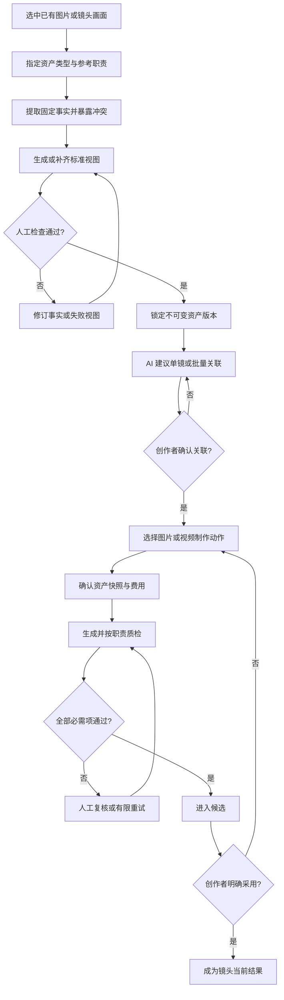

# 视觉资产制作流程

## Summary

在当前 Story 的资产仓库中补齐一条面向实际制作的工作流：创作者可将已经选好的图片直接建立为人物、场景或美术风格资产，锁定版本并关联现有镜头，再从同一组资产约束出发完成换人、哑光油画统一、局部修图和图生视频。

---

## Problem Frame

当前制作已经形成了一套可行但割裂的工作方法：图片先在文件夹中挑选，再由若干独立脚本分别完成换人、油画化、局部修改、单图动画或首尾帧视频。人物参考、场景参考、美术风格参考和生成结果散落在文件夹、脚本参数与聊天上下文中，镜头并不知道自己实际依赖了哪一版资产。

这种方式在少量镜头上可以工作，但随着镜头增多，创作者需要反复解释人物长相、服装、画风与哪些内容必须保留；同一张参考图还可能同时把人物、构图和材质带入生成，导致人物变对了但场景被改写，或画风统一了但人物特征漂移。任务中断或供应商状态不明时，也难以判断是否应重试以及是否会重复付费。

---

## Actors

- A1. 创作者：导入精选素材、确认资产事实与版本、关联镜头、发起制作并最终采用结果。
- A2. 资产 Agent：分析参考图的职责与固定事实，生成或修订标准视图，提出镜头关联建议并解释冲突。
- A3. 制作与质检系统：按已确认的资产快照执行图片或视频任务，管理费用、任务恢复、一致性检查和候选结果。

---

## Key Flows

- F1. 从精选图片建立资产
  - **Trigger:** 创作者在素材仓库或镜头中选中一张或多张已有图片。
  - **Actors:** A1, A2
  - **Steps:** 创作者选择人物、场景或美术风格资产类型，并逐张标明参考职责；Agent 仅提取所选职责对应的固定事实，暴露冲突；创作者修正后形成待检查的资产版本。
  - **Outcome:** 精选图片成为来源明确、职责隔离且可继续完善的 Story 级资产草案。
  - **Covered by:** R1-R5

- F2. 检查、修订并锁定资产版本
  - **Trigger:** 资产草案已有固定事实和所需标准视图。
  - **Actors:** A1, A2
  - **Steps:** 创作者查看原始像素和标准视图，逐项处理冲突或失败视图；需要改变固定事实时创建新版本；确认无误后锁定。
  - **Outcome:** 正式制作只能使用可追溯、不可被静默改写的锁定版本。
  - **Covered by:** R5-R7

- F3. 将资产关联到现有镜头
  - **Trigger:** 当前 Story 同时存在镜头和已锁定资产。
  - **Actors:** A1, A2
  - **Steps:** Agent 提出单镜或批量关联建议；创作者检查覆盖情况、冲突和缺失项，逐镜修改并确认；镜头保存实际确认的资产版本组合。
  - **Outcome:** 每个待制作镜头都有明确的人物、场景和风格来源，且后续资产更新不会静默改变旧关联。
  - **Covered by:** R8-R10

- F4. 制作、质检并采用图片或视频
  - **Trigger:** 创作者为输入有效、资产关联已确认的镜头选择制作动作。
  - **Actors:** A1, A3
  - **Steps:** 系统展示动作影响、实际使用的资产与费用；创作者确认后提交；系统恢复或跟踪任务，按动作目标和资产维度质检；合格结果进入候选，创作者明确采用或继续修订。
  - **Outcome:** 图片与视频共享同一资产约束，付费过程可控，历史结果和采用关系可追溯。
  - **Covered by:** R11-R18

---

## Requirements

**精选素材导入与职责隔离**

- R1. 创作者可以从当前 Story 的素材仓库、已有镜头画面或主动选择的本地图片建立资产；已有图片可以直接作为资产来源，不要求先重新生成一张图片。
- R2. 本地素材导入后必须成为仓库内可持续使用的原始素材，并保留来源名称、导入时间和来源关系；移动或移除导入前的本地文件，不应让已建立的资产失效。
- R3. 建立资产时必须先选择人物、场景或美术风格类型，并为每张参考图标明它负责证明的内容。人物身份参考不得顺带控制构图和场景，场景参考不得顺带改写人物，风格参考不得被当成需要复刻的主体与布局。
- R4. 同一张图片可以经创作者明确操作分别用于多个资产类型，但系统不得因为图片中同时出现人物、场景和画风而自动混合创建或混合约束。

**资产事实、标准视图与版本**

- R5. Agent 必须从参考图中形成可审阅的固定事实、允许变化和冲突清单；冲突由创作者裁决，不能通过平均、随机选择或补写未被参考证明的事实来消解。
- R6. 资产版本必须提供足够的标准视图和大图检查入口。人物身份锚点必须包含真实生成或真实提供的清晰正面头部特写，不能用模糊全身图的裁切放大代替；人物、场景和风格的其他标准视图沿用原锁定式视觉资产需求。
- R7. 只有创作者明确锁定的版本才能参与正式制作。锁定版本不可原地改写；修订须产生新版本，旧镜头与旧结果继续指向原版本。删除资产记录不得删除已经导入或付费生成的图片证据。

**镜头关联**

- R8. Agent 可以依据镜头内容提出单镜和批量关联建议，创作者可以批量确认、拒绝或逐镜改动；未确认的建议不得影响图片或视频生成。
- R9. 每个镜头的正式关联必须落到稳定镜头身份和明确的不可变资产版本。v1 沿用每镜一个主要人物、一个场景和一个美术风格的组合边界。
- R10. 资产仓库和镜头列表必须让创作者看见哪些镜头已关联、缺少哪类资产、使用哪一版本，以及镜头描述是否与固定事实冲突。任何缺失、冲突或参考不可用都必须在付费前暴露。

**制作动作与共同资产快照**

- R11. 界面至少提供以下可理解的制作动作，并明确每种动作允许改变与必须保留的内容：
  - 仅统一人物：替换或统一主要人物，同时保留原构图、场景关系和既有材质语言。
  - 仅统一画风：转换为锁定的哑光油画等风格，同时保留人物身份、场景结构和原画面布局。
  - 人物与画风同时统一：在一次制作中同时执行前两项约束，不能让其中一项覆盖另一项。
  - 局部修改：只处理创作者指定的区域或对象，其余已锁定事实和画面关系保持不变。
  - 单图动画：从一张已确认画面生成动作镜头，人物、场景和风格继续使用该镜头的资产快照。
  - 首尾帧视频：以两张已确认画面定义起点和终点，并在付费前检查两帧的资产版本是否兼容。
- R12. 图片与视频生成必须使用同一套镜头资产关联语义。提交前应展示本次实际使用的输入画面、人物版本、场景版本、风格版本和动作说明；输入无效或绑定冲突时不得静默降级为无参考生成。

**费用、任务恢复与重复付费保护**

- R13. 每次付费制作前必须展示预计费用、计费内容、自动重试上限及可能的总费用边界，并由创作者明确确认；修改输入、指令、资产版本或制作动作后，旧报价不得继续使用。
- R14. 同一任务的恢复与重试必须复用原任务身份和已成功的子结果。供应商或本地状态为未知时，系统不得自动创建一笔新的付费任务；应先查询、恢复或让创作者决定下一步。

**质检、候选、采用与谱系**

- R15. 每个结果必须按镜头已关联的资产维度以及所选制作动作分别质检。例如“仅统一人物”除人物一致性外，还必须检查原构图、场景和画风是否被意外改写；视频还必须检查人物与场景在时间上的连续性。
- R16. 自动质检为 `fail` 或 `unknown` 的结果不得自动成为可采用候选。创作者必须能查看原始质量结果并进行人工复核、带意见重试或停止；所有自动重试都必须受次数与费用上限约束。
- R17. 合格结果进入图片或视频候选区，生成成功不等于自动采用。只有创作者明确采用后才更新镜头当前结果；原图、未采用候选和既有图片或视频版本继续保留。
- R18. 每个生成结果必须可追溯到来源素材、镜头、实际资产版本、制作动作、创作者指令、费用确认、任务状态、质检结论和采用记录；查看历史结果时必须显示生成当时的资产快照，而不是当前最新版。

---

## Acceptance Examples

- AE1. **Covers R1, R2.** 给定创作者从本地选中一张已完成场景图并建立场景资产，导入完成后即使原文件被移动，资产草案、来源记录和仓库内原图仍可正常查看与使用。
- AE2. **Covers R3, R4.** 给定一张同时包含女主、红色哑光油画和门框构图的图片，创作者把它指定为“人物身份参考”后，系统只提取女主身份事实，不把红色画风和门框构图当成人物资产要求；若还要用其画风，创作者需另行明确建立风格资产。
- AE3. **Covers R5-R7.** 给定人物参考中的鞋子和发型互相冲突，系统保持资产未锁定并列出冲突；创作者裁决、查看清晰头部特写和标准视图后才能锁定。之后修改服装会产生新版本，旧镜头不受影响。
- AE4. **Covers R8-R10.** 给定二十个已有镜头和三项锁定资产，Agent 提出批量关联，创作者只修改其中两镜并确认；正式生成使用确认后的逐镜版本组合，仍缺少场景资产的镜头在付费前被明确标出。
- AE5. **Covers R11, R12, R15.** 给定一个构图满意但女主错误的镜头，创作者选择“仅统一人物”，结果必须使用锁定女主并保留原机位、人物姿态、场景结构和哑光油画材质；若人物正确但构图被改写，该结果仍判为失败。
- AE6. **Covers R11, R12, R15.** 给定六张人物和场景已经正确但红色照片质感不统一的画面，创作者批量选择“仅统一画风”，系统逐镜使用同一风格版本，同时把人物身份或场景结构漂移视为失败。
- AE7. **Covers R11-R13.** 给定首帧和尾帧绑定了不同人物版本，系统在报价前展示版本冲突并阻止提交；创作者统一版本后，新的报价才允许确认。
- AE8. **Covers R13, R14.** 给定一个付费视频任务在提交后连接中断且状态未知，界面显示“查询或恢复中”，不自动再次扣费；恢复时复用原任务及已经成功的阶段。
- AE9. **Covers R16, R17.** 给定结果自动质检为 `unknown`，创作者可以放大查看并人工判定；在人工通过前它不能替换镜头当前结果，即使生成供应商已返回成功。
- AE10. **Covers R17, R18.** 给定创作者先采用图片候选 A，随后生成视频候选 B 但未采用，镜头继续保留 A 为当前图片，B 作为视频候选可追溯到生成时使用的资产版本和费用记录。

---

## Success Criteria

- 创作者可以完全通过 `/editing` 的可见界面，从精选图片完成导入、资产建立、冲突裁决、标准视图检查、版本锁定、镜头关联、付费确认、生成、质检和采用，不再依赖终端脚本或聊天记录维持上下文。
- 同一锁定人物用于至少三个不同景别或动作的镜头时，人物身份、发型、体态和服装保持可辨识的一致；同一风格用于至少三张不同主体和构图的红色画面时，呈现统一的哑光油画语言而不复制构图。
- 创作者能够为一组现有镜头批量建立资产关联，并准确识别每镜缺失、冲突和所用版本；资产升级不会改变历史绑定或历史结果。
- 任何绑定冲突、参考不可用、质检失败或状态未知都不会被静默转换为无参考付费生成、自动采用或重复付费。
- 现有换人、油画统一、组合处理、局部修改、单图动画和首尾帧视频能力都能在统一工作流中被选择、解释、追踪和恢复。
- 后续计划与实施不需要重新发明参考职责、资产锁定、镜头关联、制作动作语义、付费保护、质检入口或候选采用规则。

---

## Scope Boundaries

- 本需求扩展现有“Story 锁定式视觉资产”，不建立第二套平行的资产、版本或镜头绑定系统。
- v1 资产仍严格属于当前 Story，不做跨 Story、项目级或个人级共享。
- v1 每镜只承诺一个主要人物资产；多人镜头的逐人身份和服装一致性延后。
- 不建设三维人物、三维场景、骨骼动画或先搭三维空间再渲染的系统。
- 不建设持续监听桌面目录或与外部文件夹双向实时同步的能力；本地素材由创作者主动导入。
- 不在本需求中更换生成供应商、统一所有模型或承诺模型永不失败。
- 不允许 Agent 自动采用生成结果，也不因删除资产记录而删除已导入或付费生成的媒体。
- 不建设面向任意团队和文件类型的通用数字资产管理平台。

---

## Key Decisions

- 扩展现有锁定式视觉资产，而不是把独立脚本原样搬进页面：创作者操作的是资产和制作意图，具体执行能力服从同一套版本、绑定和历史语义。
- 允许精选图片直接建立资产：已有合格画面本身就是高价值制作输入，不应被迫重新生成后才能进入流程。
- 参考图按职责隔离：人物、场景和材质信号必须明确分工，避免“修对一项、带坏另外两项”。
- 镜头绑定不可变资产版本：这让图片和视频能够复用同一视觉契约，也让历史结果真正可复现。
- 图片和视频共享资产快照，但制作动作各自声明允许变化与必须保留的内容：共同约束不等于把不同媒介的质检混成一项。
- 采用“自动质检守门 + 人工可复核”：模型不确定时不冒充通过，但正确结果也不会因为一次 `unknown` 永久卡死。
- 生成、候选和采用继续分离：供应商完成任务只表示产生了结果，不表示创作者已接受它。
- 付费任务以可恢复且不可重复扣费为优先：状态未知先查询恢复，不能用盲目重提掩盖任务管理缺口。

---

## Dependencies / Assumptions

- 复用现有 Story 隔离、稳定镜头身份、资产不可变版本、候选与明确采用历史。
- 复用现有人物、场景和风格标准视图能力，并补齐人工复核、固定事实修订和单视图重生成等界面闭环。
- 现有图片与视频供应商能够接受相应的参考输入；若某个动作或模型不能可靠消费必需参考，界面必须阻止该组合，而不是静默降级。
- 资产参考需要具备独立于用户原始本地路径的持久可用性，并能被真实生成链路稳定访问。
- 制作动作的默认语义以当前已经验证的制作脚本行为为基线，但脚本文件本身不是产品中的长期权威来源。

---

## Outstanding Questions

### Deferred to Planning

- [Affects R1-R4][Technical] 如何把本地素材和仓库既有图片统一导入资产来源，同时避免重复拷贝又保证原路径失效后仍可使用。
- [Affects R6-R7][Needs research] 场景与风格标准视图的真实付费验收应使用哪些代表性输入，才能证明版本锁定可用于不同景别和主体。
- [Affects R11-R12][Needs research] 每种制作动作与可用供应商、参考图数量、尺寸限制和报价能力的兼容矩阵如何确定。
- [Affects R12, R18][Technical] 如何消除绑定后生成对临时公网参考图地址的硬依赖，并保证历史资产快照长期可访问。
- [Affects R13-R14][Technical] 任务身份、报价有效期、子任务回执和中断恢复如何接入现有付费幂等机制。
- [Affects R15-R16][Needs research] 人物、场景、风格、构图保持和视频连续性分别采用何种质检组合、阈值与有限重试预算。
