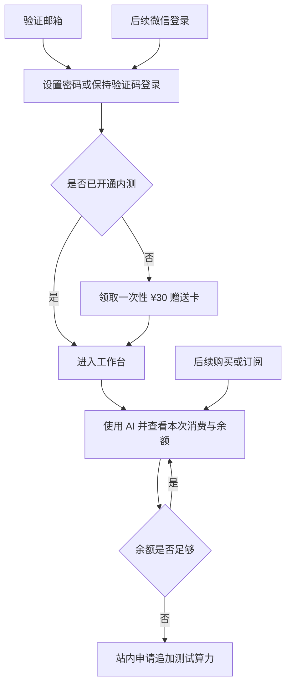

# 账户登录、算力赠送卡与全成本额度控制

## Summary

把线上内测升级为分阶段的正式账户与付费体系：第一阶段提供邮箱验证码、密码、¥30 算力赠送卡和透明消费账本；第二阶段接入微信并绑定同一账号；第三阶段支持购买算力和订阅。所有入口最终共享同一身份、同一份创作数据和同一余额，不再把邀请码当作长期密码。

---

## Problem Frame

当前内测入口把邀请码同时当作访问资格和长期登录凭据。真实手机测试已经暴露出这种设计的脆弱性：邮箱拼写与邀请码绑定关系难以理解，邀请码生成与登录校验稍有差异就会完全阻断登录，用户也没有设置、修改或找回个人密码的入口。

产品中的文字、图片、语音和视频能力会产生真实供应商成本，但用户目前缺少一个属于自己账号的清晰余额视图，无法在每次使用后直接知道花了多少钱、还剩多少钱。余额耗尽后也没有站内续充申请流程。与此同时，后续微信登录、购买算力和订阅都会引入新的身份合并、支付到账、退款与重复回调风险；若没有统一账户和账本边界，容易产生重复账号、重复赠送或余额错误。

现有生产、测试与本地历史数据分处不同存储，测试数据库迁移状态也需要在上线前收敛。任何账户升级都必须保住现有账号和创作数据，不能用新登录方式建立第二份孤立内容。

图示只表达产品流程；下文要求为权威定义。

---

## Actors

- A1. 用户：通过邮箱、密码或后续微信身份进入自己的账号，领取或购买算力，创作内容并查看余额与消费。
- A2. 管理员／负责人：发放赠送卡、处理续充申请、调整测试额度并审计费用，但不能浏览用户创作内容。
- A3. AI 能力供应商：提供文字、图片、语音、视频等付费能力，并返回任务状态、用量或费用依据。
- A4. 支付与订阅渠道：在第三阶段处理微信支付、支付宝、银行卡或订阅，并返回可核验的支付状态。
- A5. 账户与额度系统：统一身份、访问资格、赠送与购买余额、费用预占、结算和审计记录。

---

## Key Flows

- F1. 邮箱注册、开通与首张赠送卡
  - **Trigger:** 新用户首次打开线上登录页。
  - **Actors:** A1, A5
  - **Steps:** 用户验证邮箱；可以设置密码；未开通用户进入赠送卡领取页；用户输入尚未领取且未过期的卡；系统一次性增加 ¥30 并开通工作台。
  - **Outcome:** 用户拥有独立账号、¥30 可用算力和清晰余额，赠送卡不能再次使用。
  - **Covered by:** R1, R2, R4, R5, R6

- F2. 返回登录与密码恢复
  - **Trigger:** 用户在新设备登录、主动退出或登录状态失效。
  - **Actors:** A1, A5
  - **Steps:** 用户选择邮箱验证码或密码登录；忘记密码时通过已验证邮箱恢复；正常设备保持登录状态；系统始终打开同一账号和同一份创作数据。
  - **Outcome:** 用户不再依赖赠送卡登录，也不会因选择不同登录方式产生第二个账号。
  - **Covered by:** R1, R2, R3

- F3. 付费调用与透明结算
  - **Trigger:** 用户执行会调用付费 AI 的操作。
  - **Actors:** A1, A3, A5
  - **Steps:** 系统核对费用上界与可用余额；文字聊天直接执行，高成本媒体调用先展示价格并确认；调用完成或失败后按真实成本结算；界面展示本次消费、剩余余额和逐笔记录。
  - **Outcome:** 用户知道每笔钱花在哪里，系统不会因并发或重试透支余额。
  - **Covered by:** R8, R9, R10, R11

- F4. 余额不足与追加测试算力
  - **Trigger:** 可用余额不足以覆盖新的付费调用。
  - **Actors:** A1, A2, A5
  - **Steps:** 系统不提交该调用；用户仍可登录、浏览和编辑；页面提示申请续充并展示负责人邮箱 `mountionzeng@gmail.com`；用户提交站内申请；管理员批准、拒绝或补充额度并留下审计记录。
  - **Outcome:** 不产生无预算覆盖的供应商费用，用户和管理员都能看见申请处理状态。
  - **Covered by:** R10, R12, R13, R14

- F5. 后续微信绑定与购买算力
  - **Trigger:** 第二、三阶段能力分别开放。
  - **Actors:** A1, A4, A5
  - **Steps:** 用户把微信身份绑定到已有邮箱账号，或在明确确认后建立新账号；购买或订阅成功后增加对应算力；重复通知、失败、取消或退款只影响一次账目；所有入口继续使用同一内容和余额。
  - **Outcome:** 登录方式和资金来源可以扩展，但不会分裂身份、内容或账本。
  - **Covered by:** R15, R16, R17, R18, R19

---

## Requirements

**第一阶段：邮箱身份与密码**

- R1. 用户必须可以通过邮箱验证码登录；正常设备在安全会话有效期内自动进入账号，新设备、主动退出或会话失效后重新验证。
- R2. 已验证邮箱的用户必须可以设置密码、使用密码登录、修改密码，并通过邮箱验证找回密码；赠送卡不得继续承担密码或长期登录凭据的职责。
- R3. 邮箱验证码、密码及后续微信登录必须解析到同一个用户身份、同一批项目与 Story、同一份聊天和正文、同一余额；任何身份切换都不得削弱既有账号归属校验或遗留上一个账号的缓存数据。

**第一阶段：赠送卡与内测开通**

- R4. 未开通内测的已验证账号只能进入赠送卡领取与账户说明页面；领取首张有效赠送卡后开通工作台，登录、浏览和其他免费行为不消耗卡内额度。
- R5. 首张赠送卡提供一次性 ¥30 启动算力，不与另一笔“新用户自动赠送”叠加；以后管理员可以发放其他面额的追加赠送卡。
- R6. 赠送卡不预绑邮箱，由首个已验证账号一次性领取；未领取卡默认 30 天过期，领取后的余额不因卡到期而失效，卡号不得在领取后恢复或再次展示为可用凭据。
- R7. 已领取旧邀请码的账号迁移后自动视为已开通并最多获得一次 ¥30；尚未领取的旧邀请码转换为 ¥30 赠送卡。账号迁移、旧卡转换和首次赠送必须可重复执行而不重复加额，也不得丢失现有内容。

**统一余额、消费与不足处理**

- R8. 所有产品触发的付费 AI 能力共用一个人民币可用余额，包括文字、图片、语音、视频及后续付费能力；赠送、管理员调整、购买、消费、释放和退款必须形成不可静默改写的逐笔记录。
- R9. 每次付费调用提交前必须按已限定参数预占可信的最高可能费用；并发任务共享同一可用余额。无法确定可信上界或余额不足时，不得向供应商提交。
- R10. 调用结束后优先按供应商实际费用或可核验用量结算并释放多余预占；供应商已收费的失败按实际成本扣除，确认未收费才全部释放。重试、网络恢复和异步回调不得重复提交、重复预占或重复扣费。
- R11. 用户必须能在账号中看到当前可用余额、累计消费和逐笔明细。文字聊天不增加确认步骤，但每次完成后直接展示本次消费和剩余余额；图片、语音、视频等高成本操作在提交前展示预计费用和预计余额并要求确认。
- R12. 余额不足只阻止新的付费调用；登录、浏览已有内容、编辑和不产生供应商费用的功能继续可用。页面必须明确提示申请续充、展示负责人邮箱 `mountionzeng@gmail.com`，并保留用户尚未提交的创作输入。
- R13. 用户可以提交站内追加测试算力申请并查看待处理、已批准或已拒绝状态；当前内测申请不收用户费用，管理员决定是否追加及追加金额，同一未处理需求不得产生重复申请噪音。
- R14. 管理员可以发卡、处理续充申请、调整额度并查看账号级余额和费用；每次人工调整必须记录操作者、时间、金额和原因，不能改写既有消费事实，也不能借管理权限查看用户故事、提示词或媒体。

**第二阶段：微信登录与身份绑定**

- R15. 第二阶段接入微信自动登录，并允许用户把微信身份绑定到已验证的邮箱账号；绑定前必须清楚说明将使用哪个现有账号、内容与余额，并由用户确认。
- R16. 微信登录不得静默建立与已有邮箱账号并行的内容或余额。绑定冲突、失去微信访问能力或更换绑定关系时，用户必须仍能通过已验证邮箱恢复同一账号，且任何解绑或重绑都需保留审计记录。

**第三阶段：购买算力与订阅**

- R17. 第三阶段支持通过微信支付、支付宝和合规银行卡渠道购买算力；只有可核验的成功支付才能增加余额，支付失败、重复通知、网络重试和重复回调不得重复加额。
- R18. 订阅必须在购买前明确价格、周期、包含额度、自动续费规则和取消方式；取消只停止后续续费，不得静默删除已经合法获得的内容或已结算账目。
- R19. 赠送额度与购买额度在账目中分别可追溯，但用户看到一个总可用余额并优先消耗赠送额度。购买算力不支持提现或用户间转账；退款和争议处理必须对应原支付记录，并保证余额与消费事实可核对。

**分阶段上线门槛**

- R20. 第一阶段不得等待微信或支付完成才上线，但必须先通过账户恢复、跨账号隔离、赠送与迁移幂等、并发额度、失败结算、数据备份和真实手机端端到端验收；第二、三阶段各自在身份绑定或真实资金链路验收通过后才能开放。

---

## Acceptance Examples

- AE1. **Covers R1, R2, R3.** 给定用户已用邮箱创建账号并拥有故事，当其设置密码后分别使用验证码和密码登录，两次都进入同一个账号并看到同一故事与余额。
- AE2. **Covers R2.** 给定用户忘记密码，当其完成已验证邮箱的恢复流程并设置新密码，旧密码失效，新密码可登录，赠送卡不参与恢复。
- AE3. **Covers R4, R5, R6.** 给定一个已验证但未开通的邮箱账号，当其领取未过期的 ¥30 卡，账号获得工作台和 ¥30；另一账号再次输入同一卡号时不能领取。
- AE4. **Covers R6.** 给定一张超过 30 天仍未领取的卡，当用户尝试领取时不增加余额；给定该卡已在过期前领取，卡到期不会扣除已入账余额。
- AE5. **Covers R7.** 给定一个已通过旧邀请码登录的账号和一个未领取旧邀请码，当迁移重复执行两次，旧账号只获得一次 ¥30，未领取邀请码只形成一张可用赠送卡，现有故事数量与内容不变。
- AE6. **Covers R9, R10.** 给定可用余额 ¥10，两个并发任务最高费用分别为 ¥7 和 ¥6，当第一个任务预占 ¥7 后，第二个任务不提交；第一个最终消费 ¥5 时释放 ¥2，余额变为 ¥5。
- AE7. **Covers R10, R11.** 给定一次文字请求最高可能费用 ¥0.30、实际费用 ¥0.18，当回复完成时不弹出事前确认，回复旁显示本次消费 ¥0.18，账号余额同步减少 ¥0.18，明细只出现一笔结算。
- AE8. **Covers R10, R11.** 给定图片生成预计最高费用 ¥1.50，当用户确认后任务执行并实际消费 ¥1.20，结果页和账本显示实际费用，未使用的 ¥0.30 被释放。
- AE9. **Covers R12, R13.** 给定用户余额不足，当其尝试付费生成时供应商未收到任务；用户仍可编辑正文，并能提交一次续充申请、看到待处理状态和负责人邮箱。
- AE10. **Covers R13, R14.** 给定管理员批准追加 ¥20，用户余额增加 ¥20，申请显示已批准，调整记录保留管理员、时间、金额和原因；管理员仍无法打开用户故事。
- AE11. **Covers R15, R16.** 给定用户先有邮箱账号及故事，当其绑定微信并从微信登录时进入原账号；绑定冲突时系统停止并要求确认，不创建第二份故事或余额。
- AE12. **Covers R17, R19.** 给定同一支付成功通知到达三次，账号只增加一次购买额度；退款对应原支付记录减少可退余额，不修改与该支付无关的历史消费。
- AE13. **Covers R18.** 给定用户订阅自动续费套餐，当其在下一周期前取消，当前已获得权益按已说明规则保留，下一周期不再扣款，取消记录可查询。

---

## Success Criteria

- 新用户无需把邀请码当密码，即可完成邮箱验证、设置密码、领取 ¥30 赠送卡并进入自己的工作台。
- 返回用户在手机和电脑上使用验证码或密码进入同一账号，跨端继续同一份聊天、正文和余额。
- 用户能在每次付费调用后直接看到本次消费和剩余余额，账本总额能与管理员及供应商记录核对。
- 余额不足时不会产生新的供应商费用，用户仍能保留并编辑已有内容，并能完成站内续充申请。
- 迁移、并发、失败、重试和异步恢复不会造成重复赠送、重复加款、重复扣费或负余额。
- 第二阶段微信登录和第三阶段支付上线时，不新增平行身份、内容副本或独立账本。
- 规划阶段无需重新发明首张卡金额、登录方式、可见性、余额不足行为、续充流程、阶段边界或管理员隐私权限。

---

## Scope Boundaries

- 第一阶段上线不依赖微信登录、在线支付或订阅完成；这些是已确认的第二、三阶段能力，不是永久排除项。
- 当前内测续充只追加测试算力，不向用户收款；真实购买只在第三阶段开放。
- 不提供余额提现、用户间转账、赠送额度兑换现金或把产品账户当作通用钱包。
- 不自动按月恢复免费额度；订阅额度只按未来明确的套餐规则发放。
- 不允许管理员以账号、续充、支付或客服为由浏览用户的私有创作内容。
- 不在本需求中定义订阅价格、套餐组合、促销折扣或税务票据细节。
- 不增加测试者之间共享账号、转移故事或共同编辑的能力。
- 不用新账户体系覆盖或删除旧数据库、本地历史数据或尚未完成归属确认的 Story。

---

## Key Decisions

- 登录与赠送分离：邮箱验证码、密码和后续微信是身份凭据，赠送卡只负责开通资格和增加算力。
- 首张卡即启动额度：¥30 由一次性赠送卡提供，避免“自动赠送 + 卡赠送”双重领取和多邮箱滥用。
- 先验证身份再领卡：卡可以像礼物一样转交，同时避免把额度绑定到无法验证的拼错邮箱。
- 一个账号、一份内容、一个余额：登录方式和资金来源可以扩展，但不能形成平行身份或账本。
- 透明但不过度打断：文字消费完成后直接展示，高成本媒体调用保留事前确认。
- 先预占、后结算：用可信费用上界守住并发风险，再按实际成本形成可审计账目。
- 分阶段交付：先解决当前登录与算力可见性，再引入微信身份，最后承担真实支付与订阅复杂度。
- 管理权限与内容权限分离：管理员能处理邀请、额度和支付状态，但不能浏览用户创作内容。

---

## Dependencies / Assumptions

- 邮箱验证码发送能力必须在真实域名可用；密码恢复依赖用户持续控制已验证邮箱。
- 现有账号、邀请、项目、Story、聊天和正文需要先完成权威数据源与归属盘点；测试数据库迁移链必须收敛后才能承载账户与账本。
- 所有付费 AI 入口必须能给出可信费用上界，并获得实际费用、可换算用量或稳定单价，否则不能纳入硬余额控制后开放。
- 微信登录依赖可用的微信开放能力、回调域名和合规配置；具体资质在第二阶段规划前核验。
- 微信支付、支付宝、银行卡和订阅依赖合规商户能力、支付协议、退款规则、隐私与用户条款；具体渠道在第三阶段规划前核验。
- 正式域名 HTTPS、会话安全、备份、回滚和跨账号访问保护是每个阶段的上线前置条件。
- 用户确认负责人联系邮箱为 `mountionzeng@gmail.com`。

---

## Outstanding Questions

### Deferred to Planning

- [Affects R1, R2][Technical] 确定安全会话期限、密码强度、修改密码后的其他设备处理，以及验证码与密码的限流和防暴力尝试策略。
- [Affects R7, R20][Technical] 制定旧账号、旧邀请码、正式 MySQL、测试 MySQL 与本地历史数据的备份、归属映射、迁移验证和回滚步骤。
- [Affects R8, R9, R10][Needs research] 逐项盘点所有付费调用、供应商、计价单位、实际用量字段与保守费用上界，防止遗漏旧路径。
- [Affects R13, R14][Technical] 确定续充申请通知负责人、处理时效、重复申请合并和管理员审计体验。
- [Affects R15, R16][Needs research] 核验可用微信登录形态、所需资质以及邮箱账号与微信身份的绑定、冲突和恢复策略。
- [Affects R17, R18, R19][Needs research] 在第三阶段规划前核验支付渠道、商户资质、退款、订阅续费、消费者告知、隐私和税务要求。
- [Affects R20][Technical] 为三个阶段分别建立真实手机、跨端、跨账号、费用并发、失败恢复和回滚验收清单。
