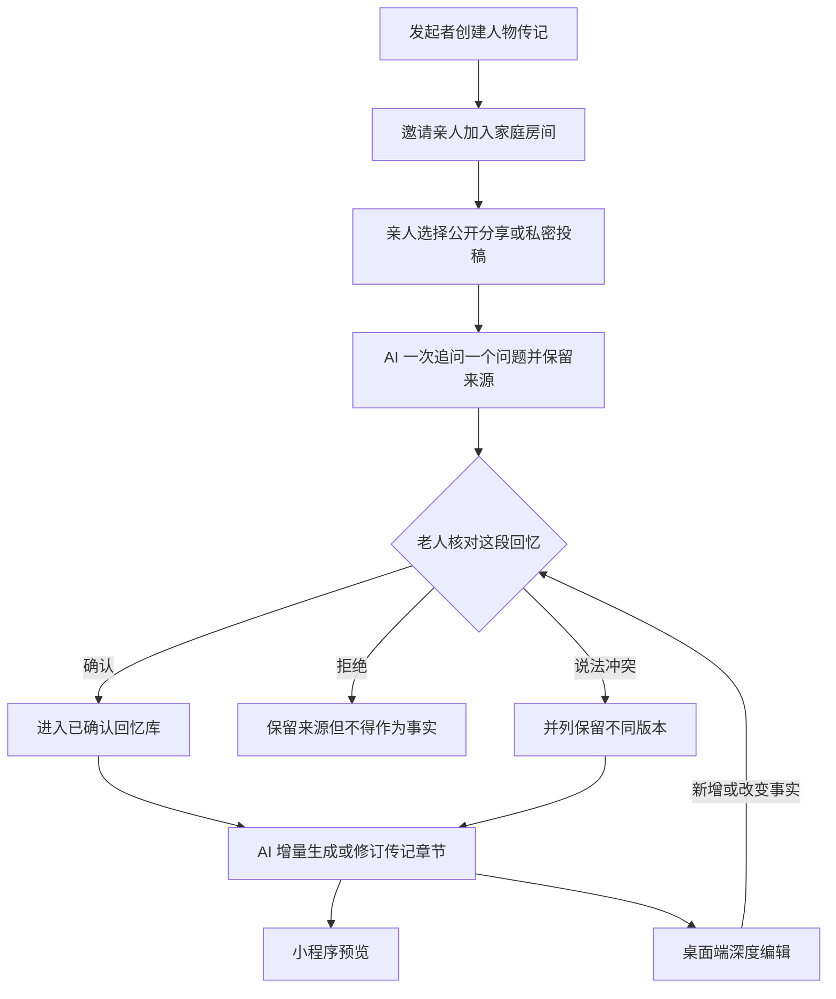

# 微信家庭人物传记 V1：共同回忆写成可信的文字人生

## Summary

在 Drinking Time 内新增“家庭人物传记”能力：亲人通过微信小程序共同提供文字、语音和照片，老人逐条确认事实，AI 再把已确认的回忆持续写成章节式传记。小程序负责低门槛采集、确认和预览，桌面端保留深度整理与编辑；V1 以文字为核心，只允许少量封面和插花作为可选装饰。

---

## Problem Frame

一个家庭对老人的记忆通常散落在不同人的聊天、相册和口述里。同一件事可能只有某个人记得，也可能存在互相矛盾的版本；如果没有来源和确认过程，AI 很容易把推测、误记或文学化补全写成“事实”。

真正需要参与的人又不是同一种用户：老人拥有最终的事实判断，却未必愿意学习复杂编辑器；亲人愿意补充片段，却不应拥有改写整部传记的权限；发起者需要把材料整理成可读的作品，但不能替老人确认人生。现有桌面创作工作台面向较复杂的文字和视听制作，不适合直接搬到微信小程序，也不能以开放 Story 共同编辑为代价破坏现有归属边界。

图示只表达产品中的权威流转；具体数据结构和技术边界由规划阶段决定，正文需求为最终依据。

---

## Actors

- A1. 老人／传记主人公：讲述并核对自己的经历，对事实是否成立拥有最终确认权。
- A2. Story 所有者／家庭发起者：创建传记、邀请亲人、整理材料并在桌面端编辑成稿，但不能代替老人确认事实。
- A3. 受邀亲人：以追加投稿的方式提供自己知道的回忆、声音和照片，不直接编辑权威 Story。
- A4. AI 采访者与编辑：一次提出一个问题、追问线索、整理人物和事件，并只依据已确认材料生成传记正文。
- A5. 微信小程序端：承载邀请加入、家庭采集、老人确认和传记预览等低门槛操作。
- A6. 桌面 Web 端：承载材料整理、章节编排和深度文字编辑，不要求迁移到小程序。

---

## Key Flows

- F1. 创建人物传记并邀请家人
  - **Trigger:** A2 决定为一位仍能参与核对的老人建立传记。
  - **Actors:** A1, A2, A3, A5, A6
  - **Steps:** A2 在现有产品内创建人物传记 Story；填写主人公与家庭关系；通过微信邀请 A1 和 A3；受邀者先看到用途、身份与可见范围，再决定加入和投稿。
  - **Outcome:** 形成一个仍由 A2 单独拥有 Story 权限、但允许家人追加贡献的家庭房间。
  - **Covered by:** R1, R2, R3, R4, R5

- F2. 家人共同补充回忆
  - **Trigger:** A3 想补充自己知道的一段经历。
  - **Actors:** A3, A4, A5
  - **Steps:** A3 选择家庭公开或私密投稿；用文字、语音或照片开始讲述；A4 一次只问一个问题，并允许跳过、暂停和继续；系统保留投稿人、原始材料、可见范围与不确定处。
  - **Outcome:** 产生一组可追溯、尚待老人确认的回忆材料，不直接改写传记事实。
  - **Covered by:** R6, R7, R8, R9

- F3. 老人确认事实并处理冲突
  - **Trigger:** 新材料等待 A1 核对，或不同亲人对同一事件说法不一。
  - **Actors:** A1, A2, A4, A5
  - **Steps:** A1 在小程序查看简短材料和来源；逐条选择确认、拒绝或保留不同版本；A4 不替老人裁决矛盾；A2 可以整理顺序，但不能代为确认。
  - **Outcome:** 已确认内容成为传记事实依据，未确认或被拒绝的内容不会被写成权威事实，冲突版本仍可追溯。
  - **Covered by:** R10, R11, R12

- F4. 增量写成章节并跨端预览
  - **Trigger:** 已确认材料足以形成第一章，或新确认的材料需要补入已有章节。
  - **Actors:** A1, A2, A4, A5, A6
  - **Steps:** A4 依据已确认材料生成或修订受影响章节；A2 在桌面端调整叙事和文字；若编辑新增或改变事实则重新交给 A1 确认；A1 和 A3 在小程序阅读当前可见版本。
  - **Outcome:** 传记可以逐章成长并保留事实来源，不必每次重新生成整本作品。
  - **Covered by:** R13, R14, R15, R17

---

## Requirements

**产品边界与角色权限**

- R1. 家庭人物传记必须作为 Drinking Time 内的新能力存在，而不是另建一套与 Story、文字版本和桌面创作流程割裂的产品。
- R2. V1 只服务仍能参与讲述和确认的在世老人；老人必须能够以主人公身份加入，并对事实确认拥有最终决定权。
- R3. 现有 Story 继续只有一个所有者。受邀亲人只能追加投稿、补充更正和查看被授权内容，不能直接改写或删除权威 Story、传记章节、他人投稿或成员权限。
- R4. 微信小程序 V1 只承担投稿、老人确认和传记预览；深度整理与章节编辑留在桌面 Web，不迁移完整创作编辑器。
- R5. 受邀者首次加入前必须清楚看到传记目的、自己的家庭身份、材料可见范围和使用方式，并在明确同意后才能提交内容。

**回忆采集与来源**

- R6. 每次投稿都允许选择“家庭房间可见”或“私密提交”。私密提交默认只对投稿者、老人和 Story 所有者可见，未经投稿者明确同意不得转为家庭公开内容。
- R7. 投稿必须支持文字、语音和照片，并保留原始材料、投稿人、提交时间、可见范围以及它与后续整理内容之间的来源关系。
- R8. AI 采访一次只提出一个问题；可以围绕同一线索继续追问，但必须允许用户跳过、暂停并在以后继续，不能强迫完成固定问卷。
- R9. AI 可以从多位家人的材料中识别人物、关系、时间和事件线索，但必须保留不确定性和来源，不能把提取结果或推测静默升级为事实。

**老人确认与事实权威**

- R10. 老人必须能对待核对材料逐条选择确认、拒绝或保留冲突版本；Story 所有者和其他亲人不能代替老人执行事实确认。
- R11. 未确认或被拒绝的投稿不得成为传记中的权威事实陈述，也不得因为 AI 重写、多人重复提及或 Story 所有者编辑而自动获得确认状态。
- R12. 对同一人物或事件存在矛盾说法时，系统必须保留各自来源和版本，交给老人选择确认其中之一或继续并列保留，AI 不得自动合并成一个看似确定的答案。

**传记成稿与呈现**

- R13. 主输出必须是可持续生长的章节式人物传记。AI 只依据已确认材料生成首章、追加新章或修订受影响章节，并让关键事实可以追溯到来源。
- R14. Story 所有者可以在桌面端做结构、语气和文字润色；任何新增事实或改变事实含义的编辑，都必须回到未确认状态并重新交给老人核对。
- R15. 小程序必须能预览当前传记章节及其确认状态，但不提供章节重排、多人合并、复杂评论或完整桌面编辑能力。
- R16. 封面和少量章节插花只能作为文字完成后的可选装饰，由用户明确发起并单独确认；不得自动触发付费图片或视频生成，也不得用图像内容反向改变传记事实。
- R17. 传记不得把虚构对白、补造情节或推测心理无标识地写成真实经历；如使用文学化重构，必须明确标注，并在进入正式文本前再次取得老人确认。
- R18. V1 不建设静态画册、复杂图文排版、印刷或视频成片流程；这些既有或潜在能力不能成为完成人物传记文字链路的前置条件。

---

## Acceptance Examples

- AE1. **Covers R1, R2, R3, R4, R5.** Given 发起者为自己的父亲创建人物传记并发出微信邀请，when 一位亲人加入，then 他先看到用途与可见范围，只能在小程序投稿和预览，不能进入桌面编辑器或修改 Story 正文；父亲仍是事实确认者。
- AE2. **Covers R6, R7.** Given 一位亲人知道一段不希望其他家人立即看到的往事，when 他选择私密提交并上传语音和照片，then 原始材料及来源得到保存，其他受邀亲人看不到该投稿，老人和 Story 所有者可以按授权核对，但不能擅自改为家庭公开。
- AE3. **Covers R8, R9.** Given 亲人回答“小时候外公带我去过上海”，when AI 追问具体年份而对方选择跳过并暂停，then 该材料保留“年份未知”的来源状态，会话可以以后继续，AI 不得自行补出年份。
- AE4. **Covers R10, R11.** Given 一段亲人投稿尚未由老人核对，when Story 所有者请求生成第一章，then 该投稿可以出现在待确认材料中，但不能以确定事实写进章节；只有老人确认后才可进入事实依据。
- AE5. **Covers R10, R12.** Given 两位亲人对老人第一次工作的城市说法不同，when 老人认为两种记忆都暂时无法排除，then 系统并列保留两个版本及各自来源，传记不擅自选择或拼成第三种说法。
- AE6. **Covers R13, R15.** Given 前三章已经生成，when 新确认的回忆只涉及青年时期，then AI 只提出对相关章节的追加或修订，小程序预览更新后的章节及确认状态，其他章节不被整本重写。
- AE7. **Covers R14, R17.** Given Story 所有者把“那天他很紧张”润色为一段具体内心独白，when 这段话没有来源，then 系统必须把它标为文学化重构并要求老人重新确认，不能因它来自桌面编辑器就直接成为正式事实。
- AE8. **Covers R16, R18.** Given 第一版文字传记已经可读，when 用户没有主动选择封面或插花，then 系统不会提交任何付费图片或视频任务，文字传记仍被视为完整的 V1 成果。

---

## Success Criteria

- 一个家庭可以由一位发起者创建传记、邀请多位亲人，并在不开放 Story 共同编辑权的前提下持续汇集回忆。
- 老人只使用小程序就能理解材料来自谁，并完成确认、拒绝或保留冲突，不需要学习桌面创作术语。
- 新确认的回忆能够增量进入相关章节；读者可以从关键事实回看来源，AI 的推测不会悄悄变成事实。
- 公开投稿、私密投稿、未确认材料和正式传记之间的边界清楚，未经授权的家人看不到私密内容。
- V1 即使不生成任何图片或视频，也能交付一份可继续修订、可在小程序阅读的章节式文字传记。
- 后续规划可以直接据此设计身份、权限、确认、版本和跨端链路，无需再发明用户角色、事实权威或 V1 范围。

---

## Scope Boundaries

### Deferred for later

- 完整的多人 Story 编辑、逐段评论、分支合并和协同审稿。
- 更丰富的插图、静态画册、复杂排版、PDF／印刷和实体书交付。
- 家庭提醒、采集进度运营、公开分享和跨家庭协作。
- 在真实用户反馈之后扩展更复杂的传记结构、导出与商业化能力。

### Outside this product's identity

- 为已故者构造可对话人格，或声称让其在虚拟世界“复活”。
- 数字人、声音克隆、3D 记忆世界和自动生成视频人生。
- 把完整桌面编辑器搬进微信小程序，或让所有亲人共同改写同一个 Story。
- 以静态相册／绘本、复杂出版排版或自动付费出图作为 V1 的主产品。
- 将未经确认的推测、虚构对白或文学补全伪装成真实人生。

---

## Key Decisions

- 这是 Drinking Time 的新能力，不是独立项目：复用已有 Story 与文字创作方向，同时避免复制一套长期维护成本高的新产品。
- 先服务能参与确认的在世老人：产品核心是共同回忆与事实核对，不是替缺席的人生成一个看似真实的人格。
- 小程序负责低门槛动作，桌面端负责复杂编辑：两端围绕同一传记协作，但不追求界面和能力完全相同。
- 亲人“投稿”而不是“共同编辑”：追加式贡献既符合家庭采集场景，也保留现有 Story 单所有者的安全边界。
- 老人是事实权威，AI 是采访者和编辑：AI 可以组织多人的记忆，但不能裁决真伪或抹平冲突。
- 文字先于视觉：章节传记本身就是完整成果，封面和插花只有在用户主动选择时才作为装饰加入。
- Life Motif 只作为产品启发：不得复制其受许可保护的采访题库、原文措辞或报告结构。

---

## Dependencies / Assumptions

- `story-ownership` 已是 working 能力，所有现有 Story 读写仍必须同时校验 `storyId + userId`；家庭投稿层不得通过放宽这一不变量实现。
- `publishing-versions` 仍处于 observing。规划阶段需要判断章节传记是复用其文字版本能力还是建立更窄的传记版本概念，并补足真实跨端验收，不能先假设它已经完整可用。
- 后端已有移动聊天、照片上传和移动生成相关能力可供研究，但当前 `/m` 不再是独立移动界面，现有前端、录音和导出能力依赖浏览器环境；微信登录、邀请身份、录音、上传、转写和传输仍需小程序适配。
- 假设 V1 的老人愿意且能够亲自参与事实核对；无行为能力、无法联系或已故主人公不在本需求覆盖范围。
- 上线微信小程序前必须满足账号体系、隐私同意、内容安全、数据删除、服务域名和平台审核要求。

---

## Outstanding Questions

### Deferred to Planning

- [Affects R4, R5][Technical] 选择哪种微信小程序工程形态，并确定它与现有 Web 代码能够复用的边界。
- [Affects R3, R5][Technical] 微信登录、邀请链接、家庭身份与现有用户／Story 所有者之间如何安全映射。
- [Affects R6, R7][Technical] 小程序录音、照片上传、断点恢复、转写和网络失败重试如何适配现有服务能力。
- [Affects R5, R6, R11][Needs research] 明确隐私同意、私密投稿、撤回／删除、退出家庭、内容审核和未成年人材料的产品规则与平台要求。
- [Affects R10, R11, R12][Technical] 设计“原始投稿—提取线索—老人确认—正文事实”的可追溯权威链路及冲突呈现方式。
- [Affects R13, R14, R15][Needs research] 验证传记章节版本如何复用或收窄现有 `publishing-versions`，并定义桌面编辑触发重新确认的边界。
- [Affects R16][Technical] 保证封面和插花使用独立的显式授权与费用确认，且任何失败都不阻塞文字传记。
