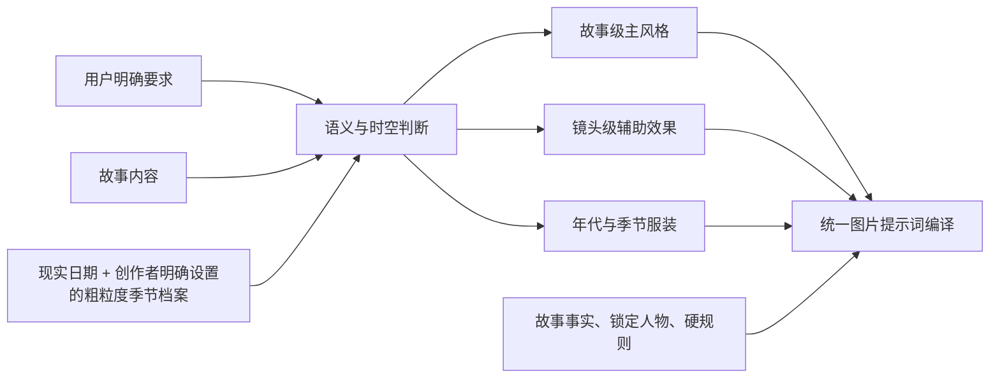

# 语义驱动的美术导演

## Summary

在现有统一静态图片提示词体系中增加条件式美术导演：根据用户要求、故事内容、时代与现实季节选择故事级主风格、镜头级辅助效果和合适服装，而不是把优秀提示词无条件附加到每次生成中。

---

## Problem Frame

现有图片链路已有统一编译、提示词谱系、美术配方和生成安全规则，但用户无法预先知道系统会怎样使用一段美术提示词。将一组优秀提示词设为固定前缀，会让所有镜头被同一种语言覆盖；完全依赖精确关键词，又无法接住用户用故事、情绪或时代背景间接表达的审美意图。

同一故事还需要兼顾两个尺度：整体视觉语言应当稳定，个别镜头的运动、弥散等效果又应随叙事变化。年代、地域和季节也会影响色调、媒介与服装；如果这些信息各自独立推断，容易出现时代物件正确但服装不合季节，或情绪匹配但人物连续性被破坏的问题。目前还没有真实失败样本可用于校准，因此第一版必须让触发依据可解释，并把准确性作为待验证目标。

---

## Actors

- A1. 创作者：用自然语言、故事内容或明确美术要求表达想要的视觉效果，并拥有最终覆盖权。
- A2. 美术导演：识别风格、时间、地域、季节和服装意图，选择兼容的美术能力并说明依据。
- A3. 统一图片提示词体系：合并故事事实、人物资产、美术选择与图片硬规则，产出一次权威编译结果。
- A4. 图片生成器：只消费最终编译结果，不追加另一套美术规则。

---

## Key Flows

- F1. 从故事建立主风格
  - **Trigger:** 用户提出美术要求，或故事内容提供足够清晰的视觉、情绪、时代证据。
  - **Actors:** A1, A2, A3
  - **Steps:** 美术导演读取用户要求与故事内容；识别候选美术卡；排除与写实用途、故事事实或用户要求冲突的候选；选择一张主卡，并记录触发依据。
  - **Outcome:** 故事获得可解释、可覆盖且跨镜头稳定的主风格；证据不足时不强行选择专项风格。
  - **Covered by:** R1-R5, R12

- F2. 为镜头增加辅助效果
  - **Trigger:** 某一镜头出现速度、眩晕、记忆消散、梦境过渡或其他明确适配的局部视觉需求。
  - **Actors:** A1, A2, A3
  - **Steps:** 美术导演保持故事主卡；独立判断镜头辅助卡；只提取与主卡兼容的局部特征；把主卡与至多一张辅助卡交给统一编译。
  - **Outcome:** 镜头获得局部表现力，但不会反向改变故事主风格或堆叠多套完整提示词。
  - **Covered by:** R4-R7

- F3. 时间与服装适配
  - **Trigger:** 用户或故事说明年代、地点、季节或天气，或者当代故事未提供明确季节。
  - **Actors:** A1, A2, A3
  - **Steps:** 明确信息优先；当代且未说明时间时，以现实日期和创作者明确保存的粗粒度季节档案推断季节，浏览器时区只能作为可编辑建议和本地日期输入；先守住年代与故事事实，再选择时代艺术语言、色调和服装；若人物已有锁定造型，先提出季节化新版本候选并等待用户确认与绑定。
  - **Outcome:** 画面避免时代与季节穿帮，同时保留人物辨识度、原锁定版本和艺术表达空间。
  - **Covered by:** R8-R11, R13

---

## Requirements

**意图识别与风格选择**

- R1. 美术导演必须同时读取用户明确要求和故事内容；不得要求用户必须说出精确的风格关键词才能触发。
- R2. 用户明确指定的风格、时代、季节、天气或服装必须高于系统推断；系统不得用审美判断覆盖已确认的故事事实。
- R3. 第一版美术能力库至少包含三张彼此独立的条件式卡：现代主义绘画融合、朦胧彩铅极简、动态模糊／弥散。
- R4. 每个作用域最多选择一张主卡和一张兼容辅助卡；不得把多套完整提示词直接拼接。
- R5. 触发必须基于可指出的用户语言或叙事证据；证据不足、候选互相冲突或用途不允许风格化时，不启用专项美术卡。

**故事与镜头尺度**

- R6. 主卡在故事级保持视觉一致性；镜头级辅助卡只对当前镜头生效，不得反向改写故事主风格。
- R7. 辅助卡只能贡献与主卡兼容的局部特征。例如，动态模糊可以作为朦胧彩铅主风格的轻微运动效果，但不能取代其媒介和构图语言。

**时间、地域与服装**

- R8. 用户或故事说明年代时，美术导演必须先保证服装、环境、物件和媒介不产生明显时代穿帮，再灵活选择该时期的艺术语言、代表性色调或能表达其时代精神的视觉特征。
- R9. 无法可靠建立艺术家与年代的对应关系时，只使用有依据的时代色调、媒介和材质，不得虚构艺术家归属。
- R10. 当代故事未明确时间时，默认以现实当前日期作为时间来源，并只根据创作者明确保存的粗粒度季节档案判断季节；浏览器时区只能作为可编辑建议和本地日期输入，不能单独证明所在地、半球或气候。档案未知、热带或含糊时不猜测季节服装，且任何创作者上下文都不得自动写入画面内容。
- R11. 服装判断必须综合年代、地域、季节、天气、场合、人物身份与动作。人物没有锁定造型时可以直接采用合适的季节服装；人物已有锁定造型时，不得直接改变正式版本，而应提出保留标志主色、轮廓和配件、只调整面料、厚度、袖长与叠穿的季节化新版本候选，用户确认并绑定新版本后才用于镜头。用户明确指定继续使用原服装时不得提出自动季节化。

**编译、安全与可解释性**

- R12. 艺术家姓名可以作为配方来源和内部语义保留；实际生成提示词应优先转译为可观察的线条、色点、留白、色彩结构、材质和媒介特征，避免机械堆叠姓名。
- R13. 写实记录、产品展示、人物或场景标准图、结构验收图等要求事实或结构准确的用途，必须禁止自动套用这些表现性风格卡；服装适配也不得破坏其验收目标。
- R14. 条件式美术结果必须进入现有统一图片提示词编译，一次生成只产生一个权威最终提示词；图片生成器不得再次追加独立美术规则。
- R15. 每次选择或跳过美术卡都必须能够追溯所用主卡、辅助卡、时间与服装判断及其触发证据，以便在真实样本出现后评估和调整。

---

## Acceptance Examples

- AE1. **Covers R1, R3-R5.** 给定用户没有说“彩铅”，但故事描述一个人物在空旷房间里回忆逝去亲人，画面关系简单且语气安静，系统可以选择“朦胧彩铅极简”为主卡，并以留白、柔和颗粒和渐变色作为依据；如果故事只是普通室内对话，则不得仅因出现“回忆”二字自动触发。
- AE2. **Covers R4, R6, R7.** 给定故事已采用“朦胧彩铅极简”为主卡，当某镜头描述人物在奔跑中产生眩晕，当前镜头可增加轻微“动态模糊／弥散”辅助效果；后续静止镜头仍只继承故事主卡。
- AE3. **Covers R2, R5, R13.** 给定用户要求“写实证件式人物标准图”，即使人物故事带有诗意与孤独感，也不得自动启用现代主义绘画、彩铅或动态弥散风格。
- AE4. **Covers R8, R9, R12.** 给定故事明确发生在 1930 年代上海，系统先限制服装、陈设与材质的时代边界，再选择有依据的时代色调和绘画或印刷特征；若无法确认具体艺术家关联，不得编造姓名来填充提示词。
- AE5. **Covers R10, R11.** 给定当代故事未写季节，现实日期为 2026 年 8 月 31 日且创作者明确保存了北半球四季档案，系统为日常场景采用轻薄透气的服装；浏览器时区或创作者档案不得因此变成故事发生地。若档案未知、热带或未确认，则不猜测季节服装。
- AE6. **Covers R2, R11.** 给定锁定人物以深红色外套和银色胸针作为标志造型，夏季镜头不得直接改变该正式版本；系统可以提出保留深红主色、轮廓线索和银色胸针、改为轻薄面料或短袖叠穿的新版本候选，只有用户确认并绑定后才用于镜头。若用户明确要求继续穿原外套，则不提出季节化候选。
- AE7. **Covers R14, R15.** 给定一次镜头生成同时命中故事主卡和镜头辅助卡，最终只形成一个统一编译提示词，并能查看主卡、辅助卡、时间和服装判断的来源；供应商侧不再追加第二套美术描述。

---

## Success Criteria

- 用户不需要掌握提示词术语，也能通过自然语言和故事内容获得符合其真实意图的美术表达。
- 同一故事的整体风格保持稳定，局部镜头效果不会造成无理由的风格跳变。
- 年代、季节与服装不存在明显穿帮，锁定人物仍保持可辨识的造型连续性。
- 在没有真实失败样本的初始阶段，每一次触发与不触发都可解释、可追溯，后续评测能够定位是哪一项判断导致结果。
- 规划阶段无需重新发明触发来源、优先级、跨镜头继承、时间默认值、服装调整边界或风格禁用场景。

---

## Scope Boundaries

- 不把任何一张美术卡无条件追加到每次图片生成。
- 不在同一作用域融合三套完整风格。
- 不因单镜头的辅助效果改变整个故事的主风格。
- 不覆盖用户明确服装、锁定人物身份或已确认故事事实。
- 不为验证规则自动提交付费出图任务。
- 不通过 GPS、IP、浏览器时区或其他隐式信号静默推断创作者所在地；不把创作者季节档案写成故事地点，也不在故事明确异地或异时空时继续使用现实季节。
- 不虚构艺术家与年代、地域或艺术流派的关系。
- 第一版不建立无限扩展的艺术家知识库，也不自动联网检索艺术史资料。
- 第一版不处理视频生成提示词；动态模糊／弥散仅作为静态画面的视觉表现。

---

## Key Decisions

- 采用语义识别而非关键词匹配：用户通常描述的是故事和感觉，不应被迫学习提示词术语。
- 同时允许用户要求和故事内容触发：显式意图优先，叙事证据补足未说出口的美术需求。
- 使用“故事主卡 + 镜头辅助卡”：在整体一致性和局部表现力之间建立清晰边界。
- 时间维度采用“事实严格、风格灵活”：年代穿帮属于错误，艺术语言则保留创作空间。
- 当代缺省时间采用现实日期和创作者明确设置的粗粒度季节档案：浏览器时区只提供可编辑建议，未知时不猜测，从而兼顾合理季节服装与隐私边界。
- 锁定服装通过季节化新版本调整：原锁定版本保持不变，候选保留人物标志特征，用户确认并绑定后才参与镜头生成。
- 艺术家参考在内部保留、生成时转译：保存配方语境，同时提高不同图片模型的可控性。
- 扩展现有统一提示词体系：条件式美术判断是现有能力的上游选择层，不创建平行提示词真相。

---

## Dependencies / Assumptions

- 依赖现有统一静态图片提示词编译继续作为唯一权威出口。
- 依赖现有提示词谱系保存最终编译结果及其来源，不覆盖旧记录。
- 依赖故事事实、人物锁定资产和生成用途能够作为美术判断的输入。
- 产品提供可编辑、可清除的粗粒度季节档案；浏览器时区仅作建议。档案未确认、已清除、未知、热带或含糊时，系统不猜测季节服装。
- 当前没有真实失败案例，第一版触发规则的准确性需要通过后续真实生成和修改历史验证。

---

## Outstanding Questions

### Deferred to Planning

- [Affects R1-R7, R13][Technical] 如何在现有图片编译链路中定位唯一的语义选择阶段，避免与已有美术 DNA、用户修改和参考图职责重复判断。
- [Affects R5, R15][Technical] 如何表达触发置信度、冲突与跳过原因，并让评测可以稳定读取。
- [Affects R8, R9, R12][Needs research] 第一版时代艺术语言与色调知识应采用多大的受控目录，怎样验证来源并避免错误归属。
- [Resolved in planning][Affects R10, R11][Technical] 使用创作者明确保存的粗粒度季节档案；浏览器时区只作可编辑建议，未知、热带或含糊时不猜测季节服装，不使用静默 GPS/IP。
- [Affects R15][Technical] 在没有付费自动验证的前提下，首批真实样本采用什么评测和人工复盘流程。
