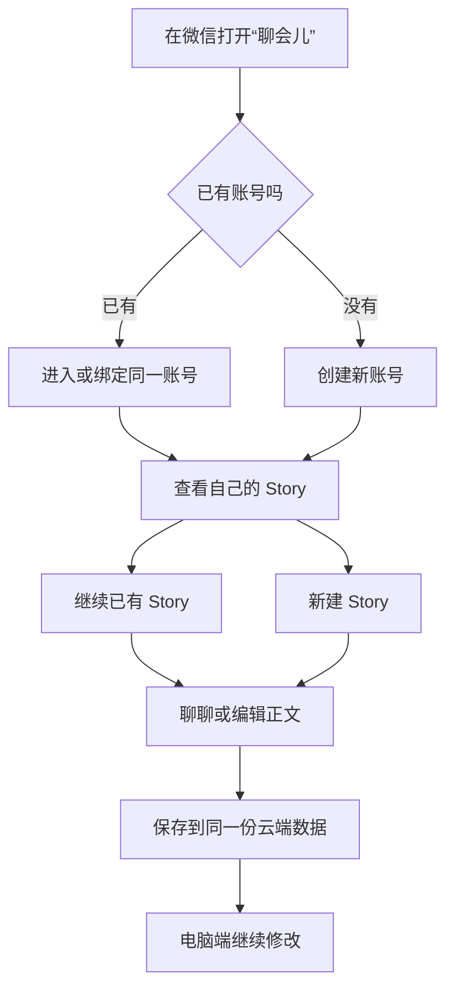

# “聊会儿”微信小程序：同一账号随时续聊与修改故事

## Summary

为“聊会儿”提供一个微信原生小程序入口。用户可以创建或进入与网页端相同的账号，查看、新建和切换自己的 Story，继续“聊聊”对话并编辑当前故事正文；手机保存后的内容可在电脑端继续处理。

---

## Problem Frame

用户已经能在电脑端写故事，但灵感经常发生在离开电脑的时候。当前替代方式是先把内容写进微信、备忘录或另一段聊天，回到电脑后再复制、寻找原 Story 并重新建立上下文；账号、对话和正文因此容易分散。

此前的小程序测试壳层使用了“拾光”名称和人物传记语境，容易让两个不同产品方向混在一起。“聊会儿”的当前目标更窄：服务同一位创作者管理自己的账号和 Story，不引入家庭传记、亲属投稿或多人事实确认流程。

图示只表达用户流程；具体身份、同步和存储方式由规划阶段决定，正文需求为最终依据。

---

## Actors

- A1. 创作者：在微信中随时记录、续聊和修改故事，并在电脑端继续深度编辑。
- A2. “聊会儿”微信小程序：提供账号入口、Story 管理、“聊聊”和正文编辑等手机核心操作。
- A3. “聊聊”：围绕当前 Story 延续已有对话上下文并回复创作者。
- A4. 电脑 Web 工作区：继续提供完整创作能力，并读取小程序保存的同一账号和 Story 数据。

---

## Key Flows

- F1. 创建账号或进入已有账号
  - **Trigger:** A1 第一次在微信打开“聊会儿”。
  - **Actors:** A1, A2
  - **Steps:** A1 选择创建新账号，或验证并绑定已经在电脑端使用的账号；系统明确显示当前身份；身份冲突时停止并提供可恢复路径，不替用户猜测归属。
  - **Outcome:** 小程序获得一个明确且唯一的账号身份，不产生与网页端割裂的重复账号。
  - **Covered by:** R1, R2, R3, R4

- F2. 查看、继续或新建 Story
  - **Trigger:** A1 已进入自己的账号。
  - **Actors:** A1, A2
  - **Steps:** 小程序显示该账号的 Story 列表和最近编辑项；A1 可以打开已有 Story，也可以输入最少必要信息创建一个空 Story；创建后立即进入该 Story 的轻量工作区。
  - **Outcome:** 用户不依赖电脑即可开始一个新故事，或回到原有故事继续工作。
  - **Covered by:** R5, R6, R7

- F3. 跨端继续“聊聊”
  - **Trigger:** A1 在某个 Story 中打开“聊聊”。
  - **Actors:** A1, A2, A3, A4
  - **Steps:** 小程序加载该 Story 的已有对话；A1 发送新消息并获得回复；完整的一问一答保存到该 Story；电脑端重新进入或刷新后能够看到并继续。
  - **Outcome:** 手机和电脑延续同一条 Story 对话，而不是各自生成一份副本。
  - **Covered by:** R8, R9, R10

- F4. 修改正文并处理跨端冲突
  - **Trigger:** A1 在小程序打开当前 Story 的正文。
  - **Actors:** A1, A2, A4
  - **Steps:** A1 编辑并保存正文；正常保存成为两端共同读取的版本；如果电脑端已经先保存了更新，小程序不得静默覆盖，并保留本机文字供用户复制、恢复或重新处理。
  - **Outcome:** 用户可以放心在手机上写故事，不会因两端先后保存而无声丢失内容。
  - **Covered by:** R11, R12, R13

---

## Requirements

**产品身份与账号**

- R1. 小程序必须使用“聊会儿”的产品名称、说明和视觉语境，不使用“拾光”、家庭传记、亲属协作或人物纪念等定位。
- R2. 新用户必须能够在小程序创建“聊会儿”账号；已有用户必须能够进入或绑定电脑端已经使用的同一账号。
- R3. 同一用户在小程序、手机 Web 和电脑 Web 中必须对应同一个账号身份，并读取同一份 Story、对话、正文和余额；不得为小程序创建独立业务账号或数据副本。
- R4. 用户必须能查看当前账号、退出登录，并完成必要的密码设置、修改或找回。微信身份可以用于后续自动登录，但不能在未确认时静默覆盖或合并已有邮箱账号。

**Story 入口与创建**

- R5. 登录后必须显示当前账号拥有的 Story，并清楚标识最近编辑的 Story；不能显示其他账号的 Story。
- R6. 用户必须能在小程序新建 Story。新建流程只收集开始创作所需的最少信息，不要求先完成分镜、素材、发布平台或视频设置。
- R7. 用户必须能在多个 Story 之间切换；存在未保存正文时，切换前必须让用户选择留下、保存或放弃，不能直接丢弃。

**“聊聊”与跨端延续**

- R8. 小程序必须加载当前 Story 已保存的“聊聊”历史，而不是创建仅属于小程序的新会话。
- R9. 用户发送消息后，用户消息和“聊聊”回复必须作为同一轮保存到当前 Story；未知结果不得被当成失败后重新生成，避免重复内容或重复扣费。
- R10. 手机端新增的对话在电脑端重新进入、切换回来或刷新后可见，电脑端新增的对话也应以相同方式在小程序可见；第一阶段不要求两个已打开屏幕实时同步输入过程。

**正文编辑与数据安全**

- R11. 小程序必须允许查看、修改和保存当前 Story 的权威正文，并明确显示未保存、保存中、已保存、失败和冲突状态。
- R12. 保存成功的正文必须成为小程序与电脑端共同读取的版本，不能只存在微信本机缓存中。
- R13. 当小程序基于旧版本保存时，不得覆盖电脑端较新的正文；冲突时同时保留本机文本和服务端文本，并提供恢复、复制或放弃路径。

**移动体验与费用可见性**

- R14. 小程序第一阶段只保留账号、Story 列表、“聊聊”和正文四类核心任务；输入、发送、保存、切换和冲突处理必须适合常见手机尺寸、软键盘与安全区域。
- R15. 用户必须能看到账号剩余算力余额和每次付费调用的金额；余额不足时停止新的付费调用，但仍允许查看 Story 和编辑正文，并提示联系负责人续充。
- R16. 测试壳层必须持续显示演示状态；只有真实账号、真实 Story 和真实服务端全部接通并完成跨端验证后，才能移除演示标识或把功能标记为可用。

---

## Acceptance Examples

- AE1. **Covers R1.** Given 用户打开当前小程序，when 查看启动页和工作区，then 页面只出现“聊会儿”及个人 Story 创作语境，不出现“拾光”、家庭传记、亲属投稿或老人确认等内容。
- AE2. **Covers R2, R3, R4.** Given 用户已经在电脑端拥有账号，when 在小程序验证并绑定该账号，then 小程序进入同一身份；如果验证信息对应多个历史身份，则停止绑定并提示人工处理，不新建一个看似成功的重复账号。
- AE3. **Covers R5, R6.** Given 当前账号已有两个 Story，when 用户在小程序登录并再新建一个 Story，then 列表只显示该账号的三个 Story，新 Story 可以立即进入“聊聊”或正文，不要求先配置视频创作流程。
- AE4. **Covers R7.** Given 用户修改了 Story A 的正文但尚未保存，when 尝试切换到 Story B，then 系统先显示选择，不会因切换动作直接清空 Story A 的本机文字。
- AE5. **Covers R8, R9, R10.** Given Story A 在电脑端已有对话，when 用户在小程序继续一轮“聊聊”并获得回复，then 小程序刷新后问答仍在，电脑端重新进入 Story A 后也能从这轮之后继续。
- AE6. **Covers R11, R12.** Given 用户在小程序修改当前 Story 正文，when 保存成功，then 小程序刷新后保留修改，电脑端重新进入后显示相同正文。
- AE7. **Covers R13.** Given 小程序和电脑同时载入正文版本 A，when 电脑先保存版本 B、小程序随后提交基于 A 的修改，then 小程序不会覆盖 B，且本机修改和 B 都可查看或复制。
- AE8. **Covers R15.** Given 账号余额不足，when 用户尝试发送新的付费消息，then 系统不提交付费调用并提示联系负责人；用户仍能打开 Story、阅读历史和编辑正文。
- AE9. **Covers R14, R16.** Given 小程序仍使用本机演示数据，when 用户在常见窄屏和软键盘状态下操作，then 核心按钮可达且页面始终显示演示标识，不把模拟回答、余额或 Story 冒充为真实账号数据。

---

## Success Criteria

- 用户只用微信即可创建或进入“聊会儿”账号，新建 Story，完成一轮“聊聊”并保存一次正文。
- 同一账号在小程序和电脑端看到相同的 Story 列表、对话历史、正文和余额，不需要导入导出或复制粘贴。
- 用户可以从手机开始一个故事，也可以在手机续写电脑端的故事，随后回到电脑继续编辑。
- 网络失败、未知聊天结果、余额不足和跨端正文冲突都不会造成静默丢稿、重复生成或重复扣费。
- 小程序中不再出现“拾光”人物传记定位；“拾光”已有需求和功能保持独立，不被删除或改写。
- 后续规划无需重新发明小程序第一阶段的产品身份、账号关系、Story 范围、同步语义或非目标。

---

## Scope Boundaries

- 不包含“拾光”家庭人物传记、亲属投稿、老人事实确认、家族房间或纪念册能力；这些属于独立产品方向。
- 不包含图片生成、图片编辑、素材仓库、分镜表、时间线、视频制作或数字人。
- 不包含多人同时编辑同一 Story，也不要求实时同步光标、输入过程或页面状态。
- 不在本阶段接入微信支付、支付宝、银行卡或订阅；余额展示、消费明细和“联系负责人续充”仍属于第一阶段。
- 不把完整电脑工作台搬进小程序；复杂创作、素材和视听制作继续留在电脑端。
- 企业小程序 AppID、合法域名、内容安全、隐私合规和平台审核完成前，不把测试壳层当作已发布产品。

---

## Key Decisions

- “聊会儿”和“拾光”是两个独立方向：当前小程序只承载个人账号与个人 Story 创作，不继承人物传记语境。
- 小程序是同一产品的移动入口：账号和数据权威与网页端共享，不做导入导出，也不维护第二份数据库。
- 既支持继续，也支持从手机开始：用户不必先在电脑创建 Story，才能使用小程序。
- 小程序保持轻量：账号、Story、“聊聊”和正文形成完整闭环，复杂桌面创作能力不进入第一阶段。
- 第一阶段采用“保存后跨端可见”：保证可靠和不丢稿，暂不承担实时协同编辑成本。
- 余额透明但充值后置：用户能知道每笔调用花了多少、还剩多少，支付渠道留到后续阶段。

---

## Dependencies / Assumptions

- 统一账号工作必须先完成历史身份盘点、冲突处理和长期登录方式，才能安全启用小程序自动身份解析。
- 小程序、手机 Web 和电脑 Web 必须连接同一个持久化线上数据源；本机演示数据不能作为跨端完成证据。
- Story 归属保护、对话整轮持久化、正文版本冲突保护和算力账本必须在小程序接入时保持有效，不能为了移动端便利而削弱。
- 企业小程序账号审批期间可以使用官方测试环境验证壳层，但测试身份不能迁移或冒充正式微信身份。
- 用户接受第一阶段依赖网络连接，不提供离线编辑。

---

## Outstanding Questions

### Deferred to Planning

- [Affects R2, R3, R4][Technical] 设计微信身份、已有邮箱账号与新账号创建之间的安全绑定顺序，避免产生重复身份或错误认领历史 Story。
- [Affects R5, R6][Technical] 确认现有 Story 创建和最近编辑排序能力如何以最小界面暴露给小程序。
- [Affects R8, R9, R10][Technical] 复用现有对话持久化、幂等查询和费用结算合同，并定义小程序会话过期后的安全恢复行为。
- [Affects R11, R12, R13][Technical] 确认小程序正文对应的权威版本范围，以及现有冲突和草稿恢复能力需要补足的部分。
- [Affects R14][Needs research] 完成中文输入法、常见窄屏、软键盘、安全区域和系统大字号的真实开发者工具与真机验收矩阵。
- [Affects R16][Needs research] 明确企业 AppID、合法域名、隐私协议、内容安全和提审发布的外部前置条件。
