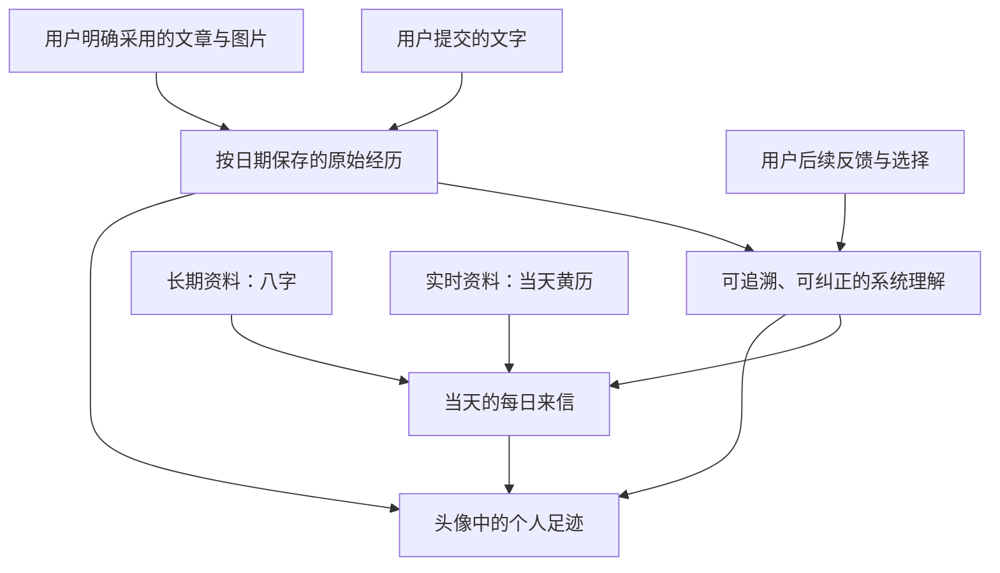

# 个人记忆与每日来信互通

## Summary

产品将建立一份跨 Story、按日期组织的私密个人记忆：用户提交的文字与明确采用的作品成为可回看的原始经历，系统从中持续更新可纠正的理解；头像提供个人足迹入口，每日来信把相关长期记忆、八字与当天黄历自然地写进当天内容。

---

## Problem Frame

当前每日来信已经能够保存每天的回信、用户在回信里留下的话，并把有活动的 Story 放回对应日期；但普通聊天框里的交流、用户采用的文章与图片并没有共同进入一份账号级记忆。用户即使连续使用产品，第二天的来信仍主要认识八字、当天黄历和过去的回信留言，无法稳定理解他在其他对话里表达过的偏好、牵挂、变化与选择。

头像菜单目前只展示账号身份和退出入口。用户缺少一个自然的位置回看“哪一天说过什么、形成了什么感悟、采用了哪篇文章或哪张图片”，也无法知道每日来信为何记得某件事、纠正错误理解，或让已经过时的理解不再影响后续内容。

---

## Actors

- A1. 登录用户：在聊天、回信和创作流程中留下文字、采用作品、纠正系统理解，并私密回看自己的足迹。
- A2. 个人记忆系统：保存原始经历、提炼带来源的理解，并根据后续反馈调整哪些理解继续参与个性化。
- A3. 每日来信：结合当天黄历、用户八字和相关个人记忆，生成可归档、可回看的当天内容。
- A4. 作品权威流程：继续负责文章版本、图片候选与采用结果；个人记忆只引用其明确结果，不取得作品所有权。

---

## Key Flows

- F1. 从聊天与创作沉淀记忆
  - **Trigger:** 用户提交一段文字，或明确采用一篇文章、一张图片或其他创作结果。
  - **Actors:** A1、A2、A4
  - **Steps:** 系统按中国时区记录发生日期和原始来源；保留用户原话或所采用作品的稳定引用；从中提炼可能长期有用的事实、偏好、牵挂、目标或感悟；明确区分用户原话与系统推断。
  - **Outcome:** 原始经历可在个人足迹中回看，可信的派生理解可以参与未来每日来信，未采用候选不会制造记忆噪音。
  - **Covered by:** R1、R2、R3、R4、R5、R6

- F2. 根据反馈更新而不改写历史
  - **Trigger:** 用户在后续对话中纠正、否定或更新一个旧说法，撤销采用，或直接要求系统忘记某项理解。
  - **Actors:** A1、A2
  - **Steps:** 系统定位相关原始来源和当前理解；把明确纠正视为强反馈；保留“以前怎样、现在怎样”的变化轨迹；让过时或被否定的理解降权、归档或退出个性化；只在用户明确要求时删除原始内容。
  - **Outcome:** 后续每日来信使用当前理解，不再重复已纠正的错误，同时用户的人生变化没有被静默抹去。
  - **Covered by:** R5、R7、R8、R9、R10

- F3. 生成更懂用户的每日来信
  - **Trigger:** 新的中国日历日期到来，用户第一次打开当天每日来信，或明确要求结合新信息重读当天来信。
  - **Actors:** A1、A2、A3
  - **Steps:** 获取属于目标日期的黄历；读取用户当前八字资料；选择少量与今天相关且仍有效的个人记忆；生成来信并保存当天版本；若引用过去经历，保持日期和语气准确，不把推测冒充用户内心结论。
  - **Outcome:** 来信既有当天性，也体现用户连续的个人经历，并能解释自己为何记得相关内容。
  - **Covered by:** R11、R12、R13、R14、R15

- F4. 从头像回看个人足迹
  - **Trigger:** 用户点击自己的头像。
  - **Actors:** A1、A2、A3、A4
  - **Steps:** 头像第一层继续显示账号与退出能力，同时展示最近足迹和完整入口；用户按日期查看当天原话、感悟、每日来信、相关 Story、采用文章和采用图片；点击作品可回到其权威查看入口；用户可查看来源、纠正理解或让某项理解退出个性化。
  - **Outcome:** 用户能从一个入口看见“我在这里留下了什么，以及系统如何理解我”，并始终拥有纠正和遗忘控制权。
  - **Covered by:** R16、R17、R18

---

## Requirements

**原始经历与采用边界**

- R1. 个人记忆必须属于登录账号而不是单个 Story。它可以引用同一账号下不同 Story、聊天、每日回信和作品中的经历，但不得放宽现有项目、Story、文章或图片的所有权校验，也不得让任何其他账号读取这些内容。
- R2. 系统必须长期保存用户主动提交或明确保存的文字，包括普通聊天与每日来信中的用户消息，并记录原文、发生日期和原始上下文。尚未提交的输入草稿、键盘过程和系统生成但未被用户采用的文字不属于个人记忆。
- R3. 系统必须把用户明确采用的创作结果作为长期经历。文章以用户明确采用、保存为当前版本或发布的结果为准；图片以用户明确“用这张”、采用为当前画面或用于正式成果的结果为准。“非常好看的图片”由用户的采用行为定义，不由系统自行进行审美评奖。
- R4. 每条原始经历必须按中国时区归入明确日期，并保留回到原始聊天、Story、文章版本或图片的能力。同一内容跨日继续修改时应保留每次有意义的用户行为时间，不得把全部历史重写到最后修改日。
- R5. 个人记忆系统不得自动硬删除或改写用户原话、已采用作品及其历史来源。用户明确删除源内容时，系统必须遵循该内容原有的安全删除流程，并同步阻止已经失去依据的派生理解继续影响个性化。

**系统理解与反馈学习**

- R6. 系统可以从原始经历中提炼当前事实、长期偏好、重要关系、阶段目标、近期牵挂和个人感悟，但必须区分“用户明确说过”与“系统根据行为推断”，并让每项理解能够追溯到日期和来源。
- R7. 明确纠正、否定、编辑、忘记请求和撤销采用属于强反馈；多次重复表达与持续采用可以提高可信度。单纯没有点击、没有回复或暂时未使用某项内容不得被解释为否定。
- R8. 新表达与旧理解冲突时，系统必须保留变化轨迹并以有明确依据的最新表达作为当前理解。旧内容可以被标记为过时或只适用于过去，不得静默篡改成用户从未说过的新结论。
- R9. 系统可以让短期状态随时间自然降权，也可以把失效、重复或长期无关的派生理解归档，使其退出每日来信上下文；归档不得删除原始经历，并且必须允许用户查看和恢复。
- R10. 用户必须能查看系统目前记住了什么、依据是什么，并能纠正、归档、恢复或要求忘记某项派生理解。“不再用于每日来信”与“删除原始文章、图片或 Story”必须是清晰分开的动作。

**每日来信的个性化**

- R11. 八字属于用户主动提供、可修改的长期资料，修改后影响未来来信但不重写过去来信；黄历属于目标日期的实时外部资料，每个新日期重新获取，不得被当作用户长期记忆或拿其他日期内容冒充今天。
- R12. 每日来信必须从仍有效的个人理解中选择与当天有关的少量内容，并与当天黄历、用户八字共同形成自然连贯的文字；不得把全部原始聊天直接拼接进模型上下文，也不得为了显得“懂用户”而罗列隐私或重复陈旧信息。
- R13. 当天来信首次生成时只能使用当时已有的信息。当天后来产生的新聊天或反馈默认影响未来来信；只有用户明确要求“再读一遍”或同等操作时，才可结合新信息形成当天的新版本，已经读过或归档的文字不得无提示地自行变化。
- R14. 来信引用旧事时必须尊重原始日期、原话与当前有效状态；不确定的信息要以克制、可纠正的方式表达，禁止虚构时间关系、把推断写成事实、替用户诊断心理或武断解释其真实内心。
- R15. 当目标日期的黄历无法可靠取得时，系统不得编造。它可以使用带明确日期且仍适用的可信缓存，或清楚降级为不含黄历断言的来信；故障不得污染用户八字、个人记忆或已经归档的历史来信。

**头像与个人足迹**

- R16. 用户点击头像后，现有账号身份、管理员入口和退出登录能力必须继续可用；同时第一层应展示最近几天的个人足迹摘要和进入完整足迹的清晰入口，而不是把完整时间线强塞进现有小弹层。
- R17. 完整个人足迹必须按日期聚合当天用户原话或感悟、每日来信、有活动的 Story、明确采用的文章和明确采用的图片。没有某类内容的日期不得制造占位成果；点击日期或作品应打开相应详情，并能自然返回原来的日期位置。
- R18. 头像与完整足迹必须覆盖加载、空记录、来源已删除、作品仍在生成或不可访问等状态。来源失效时保留可解释的历史信息但不展示破图或虚假链接；个人足迹中的纠正、归档和忘记操作必须给出结果反馈，并在刷新与同账号跨端访问后保持一致。

---

## Acceptance Examples

- AE1. **Covers R1、R2、R4、R12、R17。** 用户在 9 月 2 日的普通 Story 聊天里提交“最近在学游泳”，第二天首次打开每日来信时，系统可以自然联系这件事并标明它来自 9 月 2 日；头像足迹的 9 月 2 日也能回到原聊天，另一个账号完全看不到该记录。
- AE2. **Covers R3、R17。** 用户一次生成四张图片，只对其中一张点击“用这张”；个人足迹只把采用图作为当天作品展示，其他三个候选仍留在既有图片历史中，但不会被称为用户的重要作品或参与长期偏好判断。
- AE3. **Covers R3、R4、R17。** 用户在一天生成文章草稿，第二天明确采用修订版；足迹分别保留创作与采用发生的日期，并将明确采用的版本作为长期作品入口，而不是把所有草稿都当成最终文章。
- AE4. **Covers R7、R8、R9、R14。** 用户曾说喜欢独处，后来明确表示“我最近其实更想多见朋友”；系统保留偏好变化的日期轨迹，以新表达影响当前来信，不再把“喜欢独处”当作永久人格结论。
- AE5. **Covers R5、R10。** 用户要求每日来信不要再提一段旧关系；相关派生理解立即退出个性化并可在归档中查看，原聊天不会被系统擅自删除。只有用户随后从原始内容入口明确删除时，才执行该内容所属流程的删除语义。
- AE6. **Covers R11、R13。** 用户上午读过当天来信，下午修改八字资料并留下新的聊天；页面不会静默改写上午的内容。次日来信使用新八字与新记忆；若用户下午主动选择“再读一遍”，当天可以生成标明为新版本的来信。
- AE7. **Covers R11、R15。** 当天黄历服务不可用且没有可信的当天缓存时，每日来信明确省略黄历判断并继续提供基于用户资料的克制内容，不得套用昨天黄历，也不得把失败结果保存成用户长期记忆。
- AE8. **Covers R6、R10、R14、R17。** 头像足迹中一条卡片写明“系统理解：你可能偏爱暖色插画”，并能查看它来自三次采用行为；用户将其纠正为“我只是这一个项目需要暖色”后，系统把范围收窄到该项目，不再把它写成全局偏好。
- AE9. **Covers R16、R17、R18。** 新用户点击头像时仍能查看账号与退出入口，并看到自然的空足迹说明；有历史的用户先看到最近摘要，进入完整足迹后按日期浏览，遇到已删除来源时看到可解释状态而不是破图或无限加载。

---

## Success Criteria

- 连续使用产品的用户能在每日来信中识别出来自过去真实聊天与采用选择的准确联系，而不是只得到八字和黄历模板。
- 用户能从头像进入按日期组织的个人足迹，找到过去的原话、来信、Story、采用文章和采用图片，并回到原始内容。
- 用户一次明确纠正或忘记后，错误或不想再使用的派生理解不会继续出现在未来来信；原始经历不会被系统误删。
- 未采用候选、未提交草稿和其他账号数据不会进入个人记忆或每日来信；所有跨 Story 聚合继续服从既有账号与内容归属。
- 自动化证据覆盖文字沉淀、作品采用、冲突更新、记忆归档恢复、黄历降级、来信版本、头像时间线和跨账号隔离；主仓库 3000 端口能够验收四条 Key Flow。
- 后续规划不需要再发明长期记忆与实时资料的边界、何为采用、系统可自动删除什么、同日来信何时更新或头像里展示哪些内容。

---

## Scope Boundaries

- 本阶段只建设用户本人可见的私密个人足迹，不建设公开个人主页、关注关系或社交展示。
- 不采集产品之外的聊天、设备输入、第三方账号活动或用户未主动提交的键盘内容。
- 不把一个用户的记忆用于训练、推荐或影响其他用户，也不建设跨用户画像。
- 不把所有原始聊天无筛选地交给每日来信；个性化只使用有来源、仍有效且与当天相关的有限记忆。
- 不让系统自行评判图片“好不好看”；是否成为长期作品由用户明确采用决定。
- 不允许系统自动硬删除用户原话、作品或 Story；个人记忆中的忘记和归档不替代各内容权威流程的删除能力。
- 不重做文章版本、图片候选与采用、Story 归属或每日来信历史；本需求只把它们的权威结果连接成账号级记忆和回看体验。
- 不提供心理诊断、命运断言或无法追溯依据的人格结论；八字与黄历只能以产品现有的文化参考边界参与来信。
- 不承诺每次聊天后自动重写当天来信；默认在新一天使用新记忆，用户明确要求时才更新当天版本。

---

## Key Decisions

- 原始经历与派生理解分层：前者忠实记录用户说过和采用过的内容，后者可以学习、降权、归档和纠正，从而兼顾连续性与可控性。
- 采用行为而非生成行为进入长期作品：用户选择是可靠偏好信号，也避免候选和失败结果污染个人足迹。
- 账号级记忆引用 Story 级来源：每日来信可以理解用户跨项目的连续经历，但不取得或绕过原内容的所有权。
- 冲突保留变化轨迹：系统使用当前有效理解，同时承认用户会变化，不把旧话伪装成从未发生。
- 自动淘汰只作用于派生理解：系统通过降权和归档控制上下文质量，不承担不可恢复地删除用户内容的权力。
- 每日来信读取精选记忆而非完整聊天：减少隐私暴露、上下文噪音和武断联想，同时保留来源透明度。
- 头像提供摘要与完整足迹两层体验：现有小弹层继续承担账号操作，较长的日期历史在适合浏览与管理的空间中展开。
- 历史来信稳定、同日更新显式：新信息自然影响未来，用户主动重读时才形成当天新版本。

---

## Dependencies / Assumptions

- 现有每日来信已经具备按日期归档、历史选择、用户回信修改和 Story 活动日期关联；当前个性化历史主要来自每日来信中的用户留言，普通聊天和采用作品尚未接入。
- 普通聊天继续以既有 Story 对话为权威；桌面与手机的同账号对话不得为个人记忆建立彼此分裂的副本。
- 文章采用与版本继续由“个人社交发布工作台”和“发布文字稿版本”定义，图片采用继续由“图片候选与采用历史”定义；个人足迹只消费这些明确结果。
- “Story 作为唯一工作单元”和“项目归属与访问控制”的隔离规则继续有效；账号级聚合只能跨越同一用户拥有的内容。
- 黄历来源必须能够按目标日期提供可识别的事实来源；八字资料继续由用户主动提供并允许修改。
- 历史数据可能缺少统一采用事件或可靠活动日期，规划需要区分能够确定回填、只能标记来源不完整以及完全不能猜测的记录。

---

## Outstanding Questions

### Deferred to Planning

- [Affects R1、R2、R4][Technical] 如何统一发现桌面、手机、每日回信等现有对话入口中已经提交的用户文字，并以账号级索引引用 Story 权威而不复制出第二份可漂移正文？
- [Affects R3、R5][Technical] 如何把文章采用、图片采用、撤销采用和底层作品删除映射成一致事件，同时保持各功能现有版本与删除语义？
- [Affects R6、R7、R8、R9][Needs research] 派生理解的提炼、重复合并、可信度、时效降权和冲突识别应采用什么可评测策略，才能避免把一次性项目要求误判为永久人格？
- [Affects R10、R17、R18][Technical] 个人足迹如何在大量跨 Story 记录中稳定分页、按日期返回原来源，并让纠正、归档、恢复和来源删除在并发或跨端情况下保持一致？
- [Affects R11、R13、R15][Technical] 当天黄历的实时获取、可信缓存、失败降级与每日来信版本应如何协调，避免重复生成、过期事实或无提示改写？
- [Affects R12、R14][Needs research] 每日来信应如何选择足够相关但不过度暴露的少量记忆，并用自动化评测约束日期错误、推断冒充事实、重复陈旧信息和心理越界？
- [Affects R4、R17][Technical] 对缺少日期、采用事件或来源仍可访问性的历史聊天与作品，哪些可以确定性回填，哪些必须显示为来源不完整而不是猜测？
