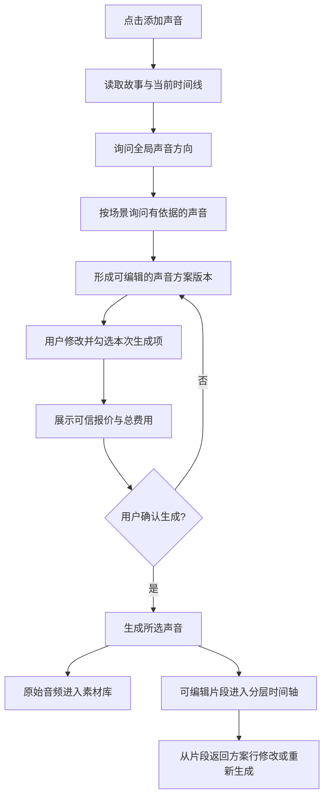

# 对话式声音导演与分层时间轴

## Summary

把“添加声音”升级为一个理解故事与时间线的对话式声音导演：通过简短问答形成可编辑的整套声音方案版本，用户核对内容与费用后再生成，并把原始素材与可编辑的分层时间轴片段同时保存。

---

## Problem Frame

当前“添加声音”以旁白、音乐、环境音和音效等独立入口组织能力，适合用户已经知道自己要加什么的情况，但无法先阅读整部故事、统一规划声音，再把人物对白、旁白、配乐和场景声音作为一套方案共同核对。用户需要自己在多个入口之间来回判断声音类型、位置和风格，难以保证人物音色一致，也看不到生成前的整体费用与落点。

声音生成又同时涉及创作真实性、付费确认和非破坏编辑。系统不能为了填满声音轨而添加原故事中没有的对白或情节，不能因为编辑文字自动产生费用，也不能让时间轴上的裁切和删除破坏素材库原件。

---

## User Flow

图示仅概括主流程；下方文字要求为准。

---

## Actors

- A1. 创作者：回答声音导演的问题、修改声音方案、选择生成范围并确认费用，之后在时间轴继续编辑。
- A2. 声音导演：依据故事与时间线提出有限且可解释的问题，整理声音方案，但不擅自生成或改写故事事实。
- A3. 声音生成与时间线系统：权威报价、生成和保存音频，把原始素材与可编辑片段分别落入素材库和时间轴。

---

## Key Flows

- F1. 创建声音方案
  - **Trigger:** A1 点击“添加声音”。
  - **Actors:** A1, A2
  - **Steps:** A2 读取故事和当前时间线 → 先询问全局声音方向 → 再按场景询问有故事依据的声音 → A1 从故事相关选项中选择或自由输入 → A2 形成可编辑的整套声音方案版本。
  - **Outcome:** A1 在发生任何付费生成前，可以检查整部作品的声音内容、人物、落点和风格。
  - **Covered by:** R1–R9

- F2. 确认并生成声音
  - **Trigger:** A1 在声音方案中选择本次要生成的项目。
  - **Actors:** A1, A3
  - **Steps:** A1 编辑并勾选方案行 → A3 对所选项目给出可信报价和总费用 → A1 明确确认 → A3 只生成所选项目 → 原始音频进入素材库，同时创建分层时间轴片段。
  - **Outcome:** 费用、生成范围、素材归属和时间轴落点均可核对。
  - **Covered by:** R10–R16, R19

- F3. 编辑或重新生成既有声音
  - **Trigger:** A1 在时间轴选中一个生成声音片段。
  - **Actors:** A1, A3
  - **Steps:** A1 可直接调整片段的时间与混音属性；若要修改台词、音色或表演风格，则进入对应方案行 → A3 重新报价 → A1 明确确认后生成新原始素材并替换该时间轴片段。
  - **Outcome:** 普通剪辑不产生生成费用；需要模型重新生成的修改有清楚的付费边界，旧素材仍可恢复。
  - **Covered by:** R13–R17, R19

- F4. 为人物确定基础音色
  - **Trigger:** 声音方案识别到需要发声的人物。
  - **Actors:** A1, A2, A3
  - **Steps:** A2 提供适合人物的可试听官方声音，并提供使用已有授权克隆声音或新建克隆声音的入口 → A1 试听并选择 → 新建克隆声音时完成授权确认、录制或上传、预览对比 → 该人物在整套方案中绑定一个基础音色。
  - **Outcome:** 同一人物跨场景保持声音身份一致，各场景只调整情绪、语速和力度。
  - **Covered by:** R6, R7

---

## Requirements

**故事驱动的对话规划**

- R1. 点击“添加声音”后，应直接在聊天框进入声音导演问答，而不是要求用户先从声音类型菜单中自行选择。
- R2. 声音导演必须读取当前故事及时间线上已有的字幕、镜头、人物、声音素材和时间位置；已存在的内容应参与提问与去重。
- R3. 问答顺序固定为先确定全局声音方向，再按场景处理局部声音需求；用户可以中途返回修改先前答案。
- R4. 每个问题应提供 2–4 个由故事证据支持的选项并允许自由输入；系统不得为了提供选项而引入原故事没有的人物、事件或情节。
- R5. 若故事中没有某类声音的使用依据，系统不强行询问或自动加入该类型，但应说明未加入，并保留手动添加入口。
- R6. 对白优先使用故事中的逐字台词。故事只描述说话含义而没有逐字台词时，系统可以提供紧贴原意的候选文本，但必须标记为“AI 草稿”，未经用户确认不得生成。

**人物与音色**

- R7. 每个人物在整套声音方案中绑定一个基础音色，可选择可试听的官方声音或用户有权使用的克隆声音；不同场景只改变情绪、语速和力度，不自动更换人物音色。
- R8. 新建克隆声音必须包含权利与授权确认、录制或上传、试听对比和保存步骤；未确认授权或未完成试听时，不得把克隆声音用于付费生成。

**声音方案与版本**

- R9. 问答结束后必须形成一份可编辑的整套声音方案。每一行至少让用户看清声音类型、对应场景或时间、人物或声源、台词或声音描述、音色、表演或风格、预计时长、生成选择、费用与状态。
- R10. 声音版本以整套方案为单位保存为 V1、V2 等，支持查看和恢复；本范围不建立每条声音的多 Take 版本体系。
- R11. 修改已经确认过的整套方案应形成新版本。恢复旧版本只恢复方案内容，不应直接删除素材、覆盖人工调整过的时间轴片段或触发生成。
- R12. 每行提供生成勾选，默认全选；用户可以取消暂不生成的项目。确认区域应显示本次选择的项目数、可信单项报价和总费用。
- R13. 只有用户明确点击确认后，系统才生成所选项目；未选择、未变化或仍为未确认 AI 草稿的项目不得提交生成或计费。

**素材库与分层时间轴**

- R14. 每个成功生成的声音必须先成为素材库中的原始音频资产，并同时按方案中的时间位置创建一个可编辑的时间轴片段。
- R15. 时间轴采用自适应语义分层：默认显示对白、旁白、配乐、环境音和音效；对白层展开后按人物显示独立子轨。
- R16. 时间轴片段支持移动、裁切、音量、静音和淡入淡出等非生成编辑；这些操作不得修改或删除素材库原件，也不得触发付费生成。
- R17. 从时间轴片段可以进入其对应的声音方案行。修改台词、音色或表演风格时，应先显示新的费用，只有明确点击“重新生成”才创建新素材并替换当前片段；旧素材继续保留。
- R18. 预览与导出必须消费同一份分层混音结果，保证用户在编辑器听到的时间、音量、淡入淡出和重叠关系与成片一致。

**安全、失败与兼容**

- R19. 所有付费生成继续使用服务端权威报价、余额检查和一次性明确确认；修改字幕、恢复版本、移动片段或打开方案均不得自动提交生成。
- R20. 批量生成部分失败时，成功项目可以进入素材库和时间轴，失败项目应保留在方案中并显示可解释状态；重试不得重复提交已经成功的项目。
- R21. 现有字幕—旁白绑定、本地音频导入、五类音频语义、撤销、故事与用户归属隔离、正式时间线与旧数据只读兼容均必须保留。

---

## Acceptance Examples

- AE1. **Covers R1–R5.** 给定故事只有人物对白和室内雨声依据，当用户点击“添加声音”时，系统先询问整体方向，再询问相关场景的对白和环境音；不会为了完整性强问或自动加入枪声、车辆等无关音效。
- AE2. **Covers R4, R6, R13.** 给定故事写着“她向母亲道歉”但没有逐字台词，当系统形成方案时，可以提供忠于原意的候选台词并标记“AI 草稿”；在用户确认文本前，该行不可提交生成。
- AE3. **Covers R7, R8.** 给定同一人物出现在三个场景，当用户选择一个官方或已授权克隆音色后，三个场景保持同一基础音色，只允许分别调整情绪、语速和力度；新克隆声音未完成授权和试听时不可使用。
- AE4. **Covers R9–R13, R19.** 给定声音方案有十行，当用户取消勾选其中三行时，确认区只统计另外七行的可信报价；确认后只生成这七行，未勾选行仍保留在方案中。
- AE5. **Covers R10, R11.** 给定用户已确认 V1 并手动裁切了时间轴片段，当用户恢复 V1 或切换到 V2 时，系统只切换可编辑方案内容，不自动覆盖该片段、不删除资产，也不产生费用。
- AE6. **Covers R14–R16.** 给定一条旁白生成成功，当处理完成时，素材库出现原始音频，旁白层同时出现可编辑片段；用户移动、裁切或删除片段后，素材库原件仍存在且未改变。
- AE7. **Covers R15.** 给定故事包含三个人物对白、旁白、配乐和环境音，当时间轴显示声音轨时，默认呈现五个主层；展开对白后显示三个人物子轨，每条对白位于对应人物子轨。
- AE8. **Covers R17, R19.** 给定用户只调整片段音量，不发生报价或生成；当用户改动台词或音色时，系统打开对应方案行并给出新报价，只有再次确认后才生成新素材和替换片段。
- AE9. **Covers R18.** 给定时间轴上同时存在旁白、配乐和带淡入淡出的环境音，当用户预览并导出时，两者的时间位置、增益、淡入淡出和重叠关系一致。
- AE10. **Covers R20.** 给定批量生成七行、其中两行失败，当任务结束时，五个成功素材及片段可用，两行失败仍在方案中并可单独重试；重试不会再次生成或计费已经成功的五行。

---

## Success Criteria

- 用户无需预先懂声音制作分类，也能从故事上下文出发完成一套可核对的声音设计。
- 每一个自动建议都能追溯到故事、字幕、镜头或用户回答；不会出现与原始内容无关的对白、人物或声音事件。
- 用户在付费前能够看清将生成什么、放在哪里、使用什么音色以及总费用，并能逐行排除项目。
- 同一人物跨场景保持稳定声音身份，旁白、对白、配乐、环境音和音效在时间轴上可以独立编辑和混音。
- 生成后同时得到可复用的原始素材与可编辑片段；时间轴操作不破坏素材库原件。
- 后续规划与实现不需要重新发明问答顺序、版本语义、生成确认、分层规则或重新生成边界。

---

## Scope Boundaries

- 不建立单条声音的多 Take 版本体系；版本只覆盖整套声音方案。
- 不允许 AI 无依据地扩写故事、增加人物或把场景描述直接当成已确认台词。
- 不自动生成、自动重试未知状态的付费请求，也不绕过报价、余额或供应商权限检查。
- 不让时间轴片段成为音频资产的唯一副本；删除或撤销片段不删除原始素材。
- 不移除现有旧数据只读适配或改变正式时间线的权威边界。
- 多语言字幕、逐字卡拉 OK、自动 ducking 和响度标准化不在本范围。
- 本需求不指定具体供应商或模型；供应商能力匹配与技术路由留给规划阶段验证。

---

## Key Decisions

- **立即进入问答。** “添加声音”不再先要求用户理解声音类型；声音导演负责从故事出发逐步澄清。
- **先全局、后场景。** 先确定统一声音方向，再解决局部例外，兼顾一致性与可控性。
- **故事证据优先。** 选项和建议必须有上下文依据；缺少逐字台词时只提供明确标记的可选草稿。
- **先方案、后付费。** 问答先产出可编辑的整套声音版本，生成范围和费用在最终确认区集中核对。
- **整套方案版本。** 版本用于保存完整声音设计，不额外引入单条多 Take 的管理复杂度。
- **素材与片段分离。** 原始音频进入素材库，可编辑引用进入时间轴；两者生命周期分开。
- **自适应分层。** 主时间轴保持五类声音清晰，对白按需展开为人物子轨。
- **人物基础音色稳定。** 角色身份由固定基础音色维持，场景变化通过表演参数表达。
- **生成修改显式付费。** 普通剪辑免费且非破坏；改变内容或音色必须重新报价并由用户确认。

---

## Dependencies / Assumptions

- 本功能扩展现有 `timeline-subtitle-audio-editing` 与 `storyboard-voice-lane` 能力，不替换现有音频资产、正式时间线、混音、预览和导出基础。
- 现有旁白、音乐、环境音、音效和原声导入继续作为不同语义类型存在。
- 声音导演可读取当前故事和正式时间线；若人物归属、台词或场景位置无法可靠判断，应在问答中请用户确认，而不是猜测。
- 官方声音、声音克隆、旁白、音乐和音效的可用供应商能力及价格可能不同；规划阶段需要核实现有集成能覆盖哪些类别，以及缺口如何降级呈现。
- 现有故事与用户归属隔离、付费回执、失败恢复、幂等和未知提交冻结规则继续生效。

---

## Outstanding Questions

### Deferred to Planning

- [Affects R2–R6][Technical] 如何在长故事中组织上下文、人物和场景证据，使问题简短但不遗漏已有声音或重复建议。
- [Affects R7, R8][Needs research] 当前可用供应商分别支持哪些官方音色、克隆流程、试听和授权记录能力，缺失能力如何降级。
- [Affects R9–R13][Technical] 声音方案版本与现有故事版本、编辑会话和撤销边界如何协调，保证恢复方案不会越权改变时间轴。
- [Affects R14–R18][Technical] 自动落位、人物子轨展开和片段到方案行的反向入口如何复用现有音频资产与混音能力。
- [Affects R19, R20][Technical] 多类型批量报价与部分失败的幂等提交、状态恢复和重试边界如何落到现有付费安全模型中。
- [Affects R21][Technical] 新入口与现有添加声音菜单、旁白候选、本地导入及旧数据只读适配如何渐进兼容。
