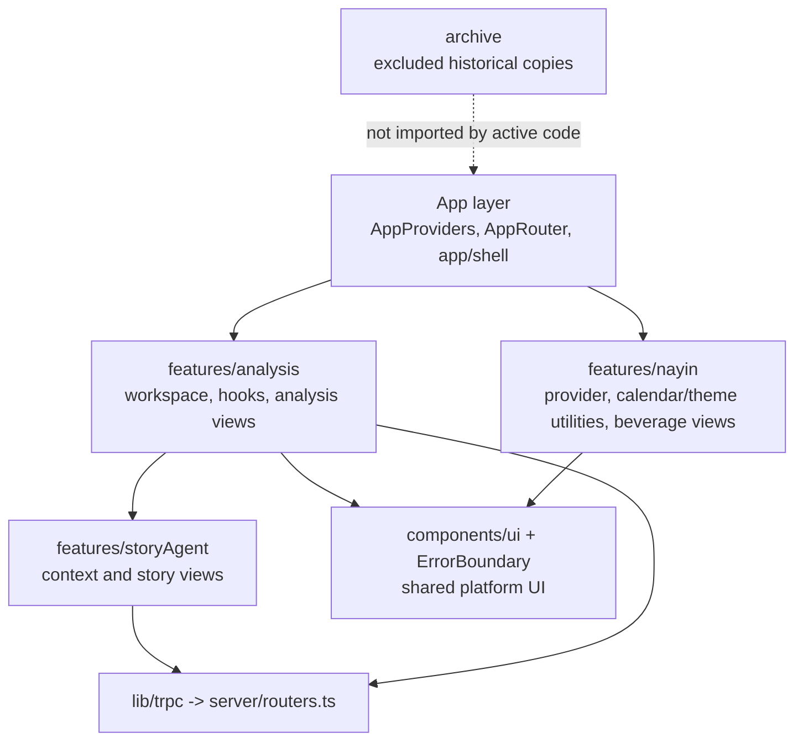

# refactor: Frontend Architecture Convergence

## Summary

Finish the frontend architecture refactor from the current partially migrated state: remove duplicate business components from `client/src/components/`, retire legacy paths and the unused monolithic analysis hook, add lightweight architecture guards, harden Story Agent tRPC parity around the already-migrated context, and update the architecture documentation so the repo presents one clear frontend model.

This plan is a continuation of the 2026-05-09 plan, not a restart. It treats the existing `features/analysis/`, `features/storyAgent/`, and `features/nayin/` modules as the target shape and focuses on convergence, verification, and documentation.

---

## Problem Frame

The original refactor goal remains valid: Drinking Time should not require developers to guess whether a component belongs to analysis, story authoring, Nayin theming, or shared UI. Current code shows that the first migration pass landed many target modules, but it left duplicate active files in old locations. The result is a riskier middle state: imports mostly point at feature modules, while stale copies under `client/src/components/`, `client/src/contexts/`, and `client/src/lib/` still compile and make future changes ambiguous.

The highest-value work now is to remove ambiguity without changing product behavior, AI prompts, analysis algorithms, or visual design.

---

## Requirements

- R1. Business components live in feature modules, not in the top-level `client/src/components/` directory. Carries origin R1, R2, R3, R5, AE1.
- R2. Legacy duplicate paths are removed or archived: old analysis views, old Nayin context/utilities, old mock data, old ThemeContext, and orphaned dashboard/demo components. Carries origin R4, R17, R18, R19.
- R3. The active analysis workspace uses focused hooks directly and no active code imports `useAnalysisWorkspace`. Carries origin R6, R7, AE2.
- R4. Panel tab persistence and sticky workspace-stage behavior remain unchanged. Carries origin R8, R9.
- R5. `DropZone` and `Timeline` remain props-in display views with tRPC calls owned by hooks/containers. Carries origin R14, R15, R16, AE4.
- R6. Story Agent client code remains on tRPC and does not reintroduce raw `fetch()` calls to archive endpoints. Carries origin R10, R11, R12, AE3.
- R7. The repo gains executable boundary checks so the architecture cannot drift back to the old flat layout unnoticed.
- R8. Architecture docs reflect the converged module model with repo-relative paths.

**Origin acceptance examples:**
- AE1: `client/src/components/` contains only shared, feature-agnostic components and `ui/`.
- AE2: `AnalysisWorkspace` composes focused hooks directly.
- AE3: Story Agent chat and classification use `trpc.storyAgent.*`.
- AE4: `DropZone` and `Timeline` receive upload/pin/exclude callbacks instead of importing tRPC.

---

## Scope Boundaries

- No UI/UX redesign, layout changes, copy changes, animation changes, or responsive redesign.
- No AI prompt strategy changes and no changes to analysis/story generation algorithms.
- No database schema changes beyond tests or guards needed for the architecture cleanup.
- No rewrite of Story Agent state management. This plan preserves the edit-context snapshot work already present in `StoryAgentContext`.
- No removal of server archive REST endpoints in this pass unless they are proven unused and the implementation owner deliberately folds that cleanup in.

### Deferred to Follow-Up Work

- Remove `/api/archive/story-agent-*` and `/api/archive/stories*` REST endpoints: future backend cleanup after tRPC parity tests have covered the expected shapes.
- Split the large `StoryAgentContext` into smaller hooks/state machines: future refactor after architecture convergence, because it would overlap with the edit-context enrichment work.
- Move or redesign `ComponentShowcase`: archive it in this plan if it is demo-only; rebuild a proper showcase later only if it becomes product-critical.
- Add richer visual regression coverage: future QA pass after the structural cleanup is complete.

---

## Context & Research

### Relevant Code and Patterns

- `client/src/features/analysis/` is already the active analysis module. `AnalysisWorkspace` calls `useProjectData`, `useAnalysisOrchestration`, and `usePanelState`.
- `client/src/features/analysis/views/DropZone.tsx` and `Timeline.tsx` already receive mutation callbacks through props; this is the target direction.
- `client/src/features/storyAgent/StoryAgentContext.tsx` already uses `trpc.storyAgent.chat`, `classify`, `storyUpsert`, `storyDelete`, plus `utils.storyAgent.storyList.fetch()` and `storyGet.fetch()`.
- `server/routers.ts` already exposes `storyAgent.chat`, `classify`, `summarize`, `storyList`, `storyGet`, `storyUpsert`, and `storyDelete`.
- `client/src/features/nayin/` already contains the active Nayin provider, utilities, and beverage views.
- `client/src/archive/` already exists and is excluded by `tsconfig.json`, making it the correct holding area for historical component copies.
- `docs/analysis-architecture.md` still describes older absolute-path layer mappings and should be updated after convergence.

### Current Drift From Target

- `client/src/components/` still contains old copies of analysis views, beverage views, dashboard/demo components, and archived candidates even though active imports use feature modules.
- `client/src/contexts/NayinContext.tsx`, `client/src/contexts/ThemeContext.tsx`, `client/src/lib/nayin.ts`, `client/src/lib/favicon.ts`, and `client/src/lib/mockData.ts` still exist as legacy paths.
- `client/src/features/analysis/hooks/useAnalysisWorkspace.ts` still exists and imports old component paths even though `AnalysisWorkspace` no longer uses it.
- `client/src/pages/ComponentShowcase.tsx` keeps `AIChatBox` alive as a demo dependency, even though it is not routed by `AppRouter`.
- Existing Vitest config only includes server tests, so frontend architecture boundaries currently rely on review discipline rather than an executable guard.

### Institutional Learnings

- `docs/analysis-architecture.md` defines the intended App -> Business -> Platform -> External layering.
- `docs/plans/2026-05-09-001-refactor-analysis-page-architecture-plan.md` established the current `AnalysisWorkspace -> StoryAgentProvider -> WorkspaceStageRouter -> WorkspaceLayout` shape.
- `docs/plans/2026-05-11-001-feat-edit-context-enrichment-plan.md` touches `StoryAgentContext`; this refactor must preserve its snapshot and annotation integration points.

### External References

- External research skipped. The repo has enough local patterns for this structural cleanup, and the work is primarily convergence against already-authored requirements and current code.

---

## Key Technical Decisions

- **Create a convergence plan instead of editing the old plan:** The 2026-05-09 plan is partially executed and no longer reflects the repo state. A new plan is safer because it documents remaining work from today's code.
- **Move app chrome out of `components/`:** `TopBar` is not a reusable primitive; it is Drinking Time shell UI. Move it to `client/src/app/shell/TopBar.tsx` so `components/` can mean shared platform components plus shadcn primitives.
- **Archive stale copies rather than repairing them:** Old business component copies under `client/src/components/` should move to `client/src/archive/` or be removed only when already archived. Active behavior must come from feature modules.
- **Retire `useAnalysisWorkspace`:** Since `AnalysisWorkspace` already calls focused hooks directly, keeping the old hook creates a second state model. Archive it rather than maintaining a compatibility wrapper no active code uses.
- **Do not introduce `useTweaks` unless the tweaks UI returns:** The old hook contains `autoCycle`, `grain`, `jitter`, and `illustrationSize`, but active code does not use them. Treat those as archived behavior with `TweaksDock`, not as required current state.
- **Add architecture guard tests before or alongside cleanup:** The old directory shape is easy to regress. A small Node-based test can assert top-level boundary rules without requiring a full browser test harness.
- **Keep Story Agent REST endpoints for now:** The client has already migrated to tRPC. Endpoint removal is lower-priority backend cleanup and should not be bundled unless parity tests are strong.

---

## Open Questions

### Resolved During Planning

- **Should the plan start from scratch?** No. The repo is already partially migrated, so this plan focuses on convergence.
- **Where should `TopBar` live?** `client/src/app/shell/TopBar.tsx`, because it is app shell/chrome rather than a shared primitive.
- **Should the old `useAnalysisWorkspace` stay as a wrapper?** No active code uses it. Archiving it better prevents accidental reuse of stale state.
- **Should `AIChatBox` remain in shared components?** Only if `ComponentShowcase` remains active. Current routing does not expose the showcase, so archive both as demo-only unless implementation discovers an active consumer.
- **Should Story Agent be split now?** No. It overlaps with edit-context enrichment and would expand the blast radius.

### Deferred to Implementation

- Whether archived duplicate files are physically moved or deleted when an identical archived copy already exists. The invariant is that `client/src/archive/` remains the only historical holding area and active code has no duplicate old paths.
- Exact shape of `server/routers.storyAgent.test.ts` setup. Use the router's current protected-procedure testing pattern if one exists; otherwise test exported archive functions plus a minimal caller harness.
- Whether `ComponentShowcase` should be archived entirely or kept under a clearly non-product location. Default to archive because it is not routed.

---

## Output Structure

Final active frontend shape:

```text
client/src/
  app/
    providers/AppProviders.tsx
    router/AppRouter.tsx
    shell/
      TopBar.tsx
  archive/
    ...historical component/context/mock copies...
  components/
    ErrorBoundary.tsx
    ui/
      ...shadcn primitives...
  features/
    analysis/
      config/
      containers/
      hooks/
        useAnalysisOrchestration.ts
        usePanelState.ts
        useProjectData.ts
      views/
    nayin/
      NayinContext.tsx
      favicon.ts
      nayin.ts
      views/
    storyAgent/
      StoryAgentContext.tsx
      types.ts
      views/
  lib/
    lunar.ts
    trpc.ts
    utils.ts
```

---

## High-Level Technical Design

> *This illustrates the intended approach and is directional guidance for review, not implementation specification. The implementing agent should treat it as context, not code to reproduce.*



The boundary rule is simple: feature-specific UI stays under its feature, app chrome stays under `app/`, reusable primitives stay under `components/`, and archive files are not imported by active code.

---

## Implementation Units

### U1. Add Architecture Guard Tests

**Goal:** Create executable checks that capture the target frontend boundary rules before deleting old paths.

**Requirements:** R1, R2, R5, R6, R7

**Dependencies:** None

**Files:**
- Modify: `vitest.config.ts`
- Create: `client/src/architecture-boundaries.test.ts`
- Modify: `tsconfig.json` if needed to keep test files out of production typecheck scope

**Approach:**
- Extend Vitest include patterns to run selected client-side architecture tests in Node.
- Add a filesystem-based architecture test that asserts:
  - `client/src/components/` top-level contains only allowed shared files and `ui/`.
  - No active file imports from `@/contexts/NayinContext`, `@/contexts/ThemeContext`, `@/lib/nayin`, `@/lib/favicon`, or `@/lib/mockData`.
  - No active file imports feature-specific views from `@/components/...`.
  - No active file imports `useAnalysisWorkspace`.
  - `client/src/archive/` is excluded from active import scanning.
- Keep this test intentionally small and structural. It should fail loudly when old paths return.

**Patterns to follow:**
- Existing Vitest setup in `vitest.config.ts`
- Existing `rg`-style boundary checks described in the origin success criteria

**Test scenarios:**
- Happy path: With the converged structure, the architecture test passes.
- Edge case: A stale import from `@/components/DropZone` is introduced in any active file, and the test fails with the matching path.
- Edge case: A new business file is added directly under `client/src/components/`, and the test fails unless it is explicitly classified as shared.

**Verification:**
- The new test runs with the existing `test` script.
- Before cleanup, it may fail for known drift; after U2-U4, it must pass.

---

### U2. Clean Active Component and Demo Boundaries

**Goal:** Make `client/src/components/` mean shared UI only by moving app chrome and archiving stale business/demo files.

**Requirements:** R1, R2, R7, AE1

**Dependencies:** U1

**Files:**
- Create: `client/src/app/shell/TopBar.tsx`
- Modify: `client/src/features/analysis/views/AnalysisWorkspace.tsx`
- Move or archive: `client/src/components/TopBar.tsx`
- Move or archive: `client/src/components/DropZone.tsx`
- Move or archive: `client/src/components/Timeline.tsx`
- Move or archive: `client/src/components/ShotTable.tsx`
- Move or archive: `client/src/components/TemplateDraft.tsx`
- Move or archive: `client/src/components/PromptDistill.tsx`
- Move or archive: `client/src/components/ShotStageIllustration.tsx`
- Move or archive: `client/src/components/BeverageAmbience.tsx`
- Move or archive: `client/src/components/BeverageTransition.tsx`
- Move or archive: `client/src/components/BeverageTransitionOverlay.tsx`
- Move or archive: `client/src/components/DashboardLayout.tsx`
- Move or archive: `client/src/components/DashboardLayoutSkeleton.tsx`
- Move or archive: `client/src/components/ManusDialog.tsx`
- Move or archive: `client/src/components/Map.tsx`
- Move or archive: `client/src/components/ProfileRailDrawer.tsx`
- Move or archive: `client/src/components/StageAtlas.tsx`
- Move or archive: `client/src/components/TweaksDock.tsx`
- Move or archive: `client/src/components/AIChatBox.tsx`
- Move or archive: `client/src/pages/ComponentShowcase.tsx`
- Test: `client/src/architecture-boundaries.test.ts`

**Approach:**
- Move `TopBar` to `app/shell` and update `AnalysisWorkspace` to import it from the app shell.
- For files that already have feature-module equivalents, archive the old top-level copies rather than updating them.
- Treat `ComponentShowcase` and `AIChatBox` as demo-only unless implementation discovers a live route or product dependency.
- Keep `client/src/components/ErrorBoundary.tsx` and `client/src/components/ui/` active. Any additional active top-level component must be explicitly shared and feature-agnostic.

**Patterns to follow:**
- Existing feature-module views in `client/src/features/analysis/views/`
- Existing Nayin views in `client/src/features/nayin/views/`
- Existing archive convention in `client/src/archive/`

**Test scenarios:**
- Covers AE1. Happy path: `client/src/components/` top-level contains only allowed shared files and `ui/`.
- Happy path: `AnalysisWorkspace` still renders the same top bar from `client/src/app/shell/TopBar.tsx`.
- Edge case: Archived files may keep stale imports because `client/src/archive/` is excluded from compilation and active import scans.
- Integration: The analysis workspace still reaches material and story tabs after the move.

**Verification:**
- `client/src/architecture-boundaries.test.ts` passes for the component boundary rules.
- TypeScript compilation has no unresolved imports from moved files.
- No active code imports feature-specific views from `@/components/`.

---

### U3. Remove Legacy Context, Library, and Mock Data Paths

**Goal:** Eliminate duplicate legacy paths now owned by feature modules.

**Requirements:** R1, R2, R7

**Dependencies:** U1, U2

**Files:**
- Move or archive: `client/src/contexts/NayinContext.tsx`
- Move or archive: `client/src/contexts/ThemeContext.tsx`
- Move or archive: `client/src/lib/nayin.ts`
- Move or archive: `client/src/lib/favicon.ts`
- Move or archive: `client/src/lib/mockData.ts`
- Modify: any active imports discovered during implementation
- Test: `client/src/architecture-boundaries.test.ts`

**Approach:**
- Active Nayin imports should use `client/src/features/nayin/NayinContext.tsx`, `client/src/features/nayin/nayin.ts`, and `client/src/features/nayin/favicon.ts`.
- Active analysis config imports should use `client/src/features/analysis/config/statusConfig.ts` and `client/src/features/analysis/types.ts`.
- ThemeContext has already been replaced by `<html class="dark">` and should remain archived only.
- Do not preserve compatibility re-exports in `contexts/` or `lib/` unless an active consumer is discovered that cannot be moved in this pass. Compatibility shims would undermine the boundary.

**Patterns to follow:**
- Current imports in `client/src/app/providers/AppProviders.tsx`
- Current imports in `client/src/features/analysis/views/*`
- Current imports in `client/src/features/nayin/*`

**Test scenarios:**
- Happy path: No active code imports from removed legacy paths.
- Happy path: NayinProvider still sets daily theme data and favicon through feature-owned utilities.
- Edge case: Old archived files are ignored by boundary scans and TypeScript.
- Integration: Analysis views still render `STATUS_CONFIG` and `SOURCE_TYPE_CONFIG` from feature config.

**Verification:**
- `client/src/architecture-boundaries.test.ts` passes for legacy path rules.
- `client/src/contexts/` is empty or removed unless a future shared context is introduced.
- `client/src/lib/` contains only true shared utilities such as `trpc.ts`, `utils.ts`, and `lunar.ts`.

---

### U4. Retire Legacy Analysis Workspace Hook

**Goal:** Remove the obsolete monolithic `useAnalysisWorkspace` state model and ensure active analysis state is owned by focused hooks.

**Requirements:** R3, R4, R5, AE2, AE4

**Dependencies:** U1, U2, U3

**Files:**
- Move or archive: `client/src/features/analysis/hooks/useAnalysisWorkspace.ts`
- Modify: `client/src/features/analysis/hooks/useProjectData.ts`
- Modify: `client/src/features/analysis/hooks/useAnalysisOrchestration.ts`
- Modify: `client/src/features/analysis/hooks/usePanelState.ts`
- Modify: `client/src/features/analysis/views/AnalysisWorkspace.tsx`
- Modify: `client/src/features/analysis/views/WorkspaceStageRouter.tsx`
- Modify: `client/src/features/analysis/views/WorkspaceLayout.tsx`
- Modify: `client/src/features/analysis/containers/AnalysisTimelineDrawer.tsx`
- Test: `client/src/architecture-boundaries.test.ts`
- Test: `client/src/features/analysis/hooks/usePanelState.test.tsx` if the frontend test harness is added during U1

**Approach:**
- Archive the old hook rather than keeping a compatibility wrapper.
- Keep the active split as three hooks unless implementation finds active tweak behavior that must be preserved:
  - `useProjectData`: project selection, reference/shot queries, upload, pin/exclude, cache invalidation.
  - `useAnalysisOrchestration`: analysis query, analysis run mutation, analysis active state, on-time rate.
  - `usePanelState`: timeline drawer, selected stage, active input tab persistence, sticky workspace stage.
- Confirm `DropZone` and `Timeline` remain callback-driven and do not import `trpc`.
- Preserve `dt:activeInputTab` localStorage key and session-only sticky stage behavior.
- Remove references to old `panelsBooted`, `profileOpen`, `autoCycle`, `grain`, `jitter`, and `illustrationSize` unless an active consumer is discovered. Those belong with archived `TweaksDock`.

**Patterns to follow:**
- Current `AnalysisWorkspace` composition with focused hooks
- Current `WorkspaceStageRouter` sticky workspace-stage logic
- Current `AnalysisTimelineDrawer` callback wiring

**Test scenarios:**
- Covers AE2. Happy path: `AnalysisWorkspace` imports and calls focused hooks directly; no active import of `useAnalysisWorkspace` exists.
- Covers AE4. Happy path: `DropZone` upload invokes the `onUploadFile` prop and does not import `trpc`.
- Covers AE4. Happy path: `Timeline` pin/exclude invokes `onPin` and `onExclude` props and does not import `trpc`.
- Happy path: `activeInputTab` persists under `dt:activeInputTab` across remounts.
- Edge case: With no localStorage value, active input tab defaults to `material`.
- Integration: Once `WorkspaceStageRouter` reaches workspace mode, it stays there for the session even if data becomes empty.

**Verification:**
- No active file imports `useAnalysisWorkspace`.
- Focused hooks each have a clear concern and no large omnibus return object.
- Upload, pin, exclude, analysis run, tab persistence, and sticky workspace behavior remain unchanged.

---

### U5. Harden Story Agent tRPC Parity

**Goal:** Verify the already-migrated Story Agent tRPC path and protect it against fallback to raw archive fetch calls.

**Requirements:** R6, R7, AE3

**Dependencies:** U1

**Files:**
- Modify: `client/src/features/storyAgent/StoryAgentContext.tsx`
- Modify: `server/routers.ts` only if parity gaps are found
- Test: `server/routers.storyAgent.test.ts`
- Test: `client/src/architecture-boundaries.test.ts`
- Test: `client/src/features/storyAgent/StoryAgentContext.test.tsx` if frontend context tests are added during U1

**Approach:**
- Keep `StoryAgentContext` on `trpc.storyAgent.*` mutations and router utility fetches. Do not reintroduce browser `fetch()` calls to `/api/archive/*`.
- Verify `storyAgent.chat`, `classify`, `summarize`, `storyList`, `storyGet`, `storyUpsert`, and `storyDelete` match the archive REST response shapes that the context expects.
- Preserve edit-context snapshot calls in `sendMessage` and the 5-minute auto-save flow. The context is shared with the edit-context enrichment work, so this unit should be surgical.
- Add tests around router procedures or a caller harness rather than rewriting archive functions.

**Patterns to follow:**
- Existing tRPC usage in `client/src/features/storyAgent/StoryAgentContext.tsx`
- Existing archive function tests in `server/archive/storyAgent.test.ts`
- Existing protected procedure patterns in `server/routers.ts`

**Test scenarios:**
- Covers AE3. Happy path: `sendMessage` uses `trpc.storyAgent.chat.useMutation()` and appends the assistant response plus generated card.
- Happy path: `generateScript` uses `trpc.storyAgent.classify.useMutation()` and stores generated shots/scripts.
- Happy path: story list and story load use `storyList` and `storyGet` through tRPC utilities.
- Happy path: story save and delete use `storyUpsert` and `storyDelete`.
- Edge case: tRPC chat error leaves the user message visible, clears replying state, and shows the existing error toast.
- Integration: Snapshot capture before message send still runs before the Story Agent mutation and failure does not block generation.

**Verification:**
- `StoryAgentContext` has no raw `fetch(` calls.
- No client file calls `/api/archive/story-agent-*` or `/api/archive/stories*`.
- Story chat, classification, story load, save, delete, and snapshot behavior remain intact.

---

### U6. Update Architecture Documentation

**Goal:** Make the docs match the converged structure so future work follows the new boundaries.

**Requirements:** R8

**Dependencies:** U2, U3, U4, U5

**Files:**
- Modify: `docs/analysis-architecture.md`
- Modify: `docs/plans/2026-05-09-002-refactor-frontend-architecture-plan.md` only if adding a short superseded note is useful
- Test: `client/src/architecture-boundaries.test.ts`

**Approach:**
- Replace absolute local paths in `docs/analysis-architecture.md` with repo-relative paths.
- Update layer mapping:
  - App: `client/src/App.tsx`, `client/src/app/providers/AppProviders.tsx`, `client/src/app/router/AppRouter.tsx`, `client/src/app/shell/TopBar.tsx`, `client/src/pages/AnalysisPage.tsx`.
  - Business: feature modules under `client/src/features/analysis/`, `client/src/features/storyAgent/`, and `client/src/features/nayin/`.
  - Platform: `client/src/components/ui/`, `client/src/components/ErrorBoundary.tsx`, `client/src/lib/trpc.ts`, `client/src/lib/utils.ts`, `client/src/lib/lunar.ts`.
  - Archive: `client/src/archive/` is not an active layer and must not be imported by active code.
- Document the boundary guard test so future refactors know why it exists.

**Patterns to follow:**
- Current docs style in `docs/analysis-architecture.md`
- Source plan trace from this plan and the 2026-05-09 origin plan

**Test scenarios:**
- Test expectation: none for prose docs. The architecture guard test is the executable counterpart.

**Verification:**
- Docs use repo-relative paths only.
- Docs no longer mention `useAnalysisWorkspace` as the active owner of analysis state.
- Docs describe `components/` as shared primitives, not as the home for business views.

---

### U7. Final Acceptance Sweep

**Goal:** Verify the refactor satisfies the origin success criteria without product behavior drift.

**Requirements:** R1, R2, R3, R4, R5, R6, R7, R8, AE1, AE2, AE3, AE4

**Dependencies:** U1, U2, U3, U4, U5, U6

**Files:**
- Modify only if acceptance checks uncover missed imports or stale docs.
- Test: `client/src/architecture-boundaries.test.ts`
- Test: `server/routers.storyAgent.test.ts`
- Test: `client/src/features/analysis/hooks/usePanelState.test.tsx` if created
- Test: `client/src/features/storyAgent/StoryAgentContext.test.tsx` if created

**Approach:**
- Run the architecture guard and relevant server/client tests.
- Run type checking after archive moves, because stale imports are the main failure mode.
- Do one manual browser pass through:
  - guided landing -> material workspace
  - upload/paste material path
  - timeline open/pin/exclude
  - story list -> new story -> chat -> generate script
  - reload with active tab persistence
- If a failure is caused by unrelated current working-tree changes in server files, document it rather than reverting those changes.

**Patterns to follow:**
- Origin success criteria and acceptance examples
- Existing app route through `client/src/app/router/AppRouter.tsx`

**Test scenarios:**
- Covers AE1. `components/` boundary guard passes.
- Covers AE2. Focused hook boundary guard passes.
- Covers AE3. Story Agent tRPC tests pass and no raw archive fetch calls exist in client code.
- Covers AE4. DropZone and Timeline stay tRPC-free and callback-driven.
- Integration: Full material and story workflows complete without visual or behavior changes.

**Verification:**
- All planned tests pass.
- TypeScript compilation succeeds.
- Manual browser pass shows no UI regressions.
- Architecture docs and code agree about the active module model.

---

## System-Wide Impact

- **Interaction graph:** `AnalysisWorkspace` remains the orchestrator for project and analysis hooks, `StoryAgentProvider` still wraps the workspace subtree, and `WorkspaceStageRouter` still derives guided vs workspace mode from references plus story cards.
- **Error propagation:** Upload, pin/exclude, analysis run, and Story Agent errors should travel through existing callbacks and toast/error states. This plan does not introduce new error surfaces.
- **State lifecycle risks:** The main risks are stale imports, duplicate state hooks, localStorage key changes, and snapshot timing regressions in `StoryAgentContext`.
- **API surface parity:** Client Story Agent behavior depends on `server/routers.ts` matching archive function response shapes. REST endpoint removal is deferred until this parity is tested.
- **Integration coverage:** Architecture guard tests cover boundary drift; router/context tests cover tRPC parity; manual browser verification covers cross-feature behavior.
- **Unchanged invariants:** UI visuals, Nayin theming behavior, AI prompts, analysis algorithms, Story Agent edit-context snapshot timing, and persistence keys should remain unchanged.

---

## Risks & Dependencies

| Risk | Mitigation |
|------|------------|
| Archiving old component copies breaks a hidden active import | Add architecture guard first, then rely on type checking to catch unresolved imports. |
| Moving `TopBar` changes app shell behavior | Move path only; do not alter props, state, styling, or Nayin interactions. |
| Removing `useAnalysisWorkspace` drops old tweak state that was still active | Confirm no active imports/consumers before archiving. If an active consumer is discovered, move that behavior into a focused hook before removal. |
| Story Agent context changes conflict with edit-context enrichment | Keep U5 surgical; preserve snapshot calls, auto-save refs, and localStorage persistence. |
| Archive files retain stale imports | `client/src/archive/` is excluded from TypeScript and active scans; do not import archive files from active code. |
| Frontend test harness grows the scope | Keep U1 to structural Node tests by default. Add jsdom/context tests only when implementation needs behavior coverage beyond static guards. |

---

## Documentation / Operational Notes

- This plan should be implemented as a structural refactor with characterization-first verification. Behavior changes should be treated as bugs unless explicitly discovered to be broken today.
- Current working tree has unrelated server changes in `server/_core/env.ts`, `server/archive/storyAgent.ts`, and `.env.server`; implementation should not revert or normalize those unless the user explicitly asks.
- If a future implementer wants to remove archive REST endpoints, create a follow-up backend cleanup plan after Story Agent tRPC tests are passing.

---

## Sources & References

- **Origin document:** [docs/brainstorms/frontend-architecture-refactor-requirements.md](../brainstorms/frontend-architecture-refactor-requirements.md)
- Superseded plan: [docs/plans/2026-05-09-002-refactor-frontend-architecture-plan.md](2026-05-09-002-refactor-frontend-architecture-plan.md)
- Related prior plan: [docs/plans/2026-05-09-001-refactor-analysis-page-architecture-plan.md](2026-05-09-001-refactor-analysis-page-architecture-plan.md)
- Related active plan: [docs/plans/2026-05-11-001-feat-edit-context-enrichment-plan.md](2026-05-11-001-feat-edit-context-enrichment-plan.md)
- Architecture doc: [docs/analysis-architecture.md](../analysis-architecture.md)
- Key code: `client/src/features/analysis/views/AnalysisWorkspace.tsx`, `client/src/features/analysis/hooks/useProjectData.ts`, `client/src/features/analysis/hooks/useAnalysisOrchestration.ts`, `client/src/features/analysis/hooks/usePanelState.ts`, `client/src/features/storyAgent/StoryAgentContext.tsx`, `server/routers.ts`
