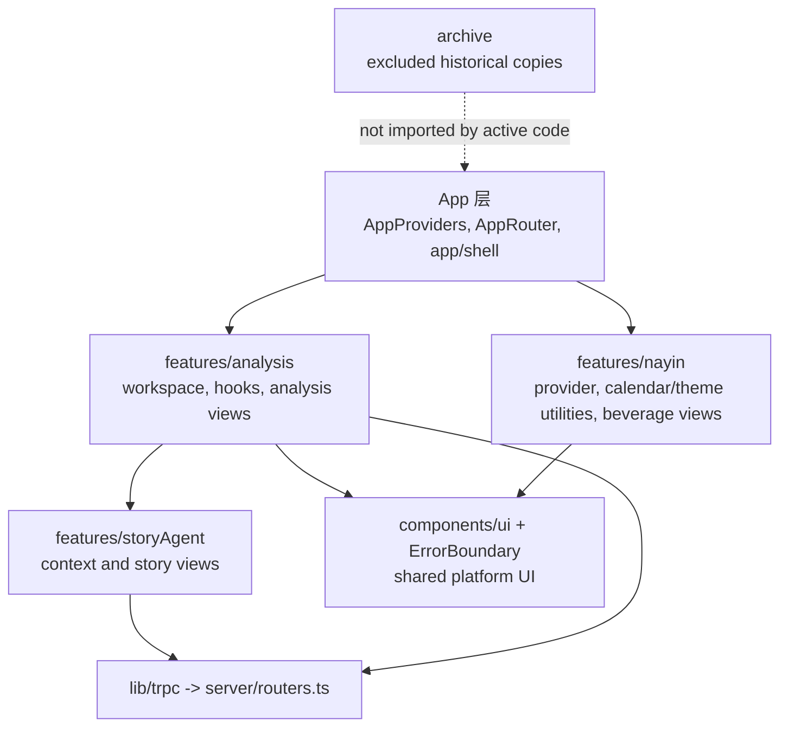

# refactor: 前端架构收敛

## 摘要

从当前“已经迁移了一部分，但还没有完全收口”的状态出发，完成 Drinking Time 的前端架构重构：清理 `client/src/components/` 中重复的业务组件，退休旧路径和未使用的单体分析 hook，增加轻量架构边界检查，强化 Story Agent 已迁移到 tRPC 后的接口一致性，并更新架构文档，让仓库呈现一套清晰、唯一的前端模块模型。

这份计划是 2026-05-09 计划的延续，不是从零重来。它把现有的 `features/analysis/`、`features/storyAgent/` 和 `features/nayin/` 视为目标结构，重点放在收敛、验证和文档同步。

---

## 问题背景

原始重构目标依然成立：Drinking Time 不应该让开发者靠猜来判断一个组件属于分析引擎、故事创作、Nayin 主题，还是共享 UI。当前代码显示第一轮迁移已经落下了很多目标模块，但旧位置仍保留了重复的活跃文件。结果是一个更危险的中间态：大多数 import 已经指向 feature module，但 `client/src/components/`、`client/src/contexts/` 和 `client/src/lib/` 下的旧副本仍能编译，后续维护时很容易改错地方。

当前最高价值的工作，是在不改变产品行为、AI prompt、分析算法和视觉设计的前提下，消除这种歧义。

---

## 需求

- R1. 业务组件必须位于 feature module 中，而不是顶层 `client/src/components/` 目录。承接原始 R1、R2、R3、R5、AE1。
- R2. 移除或归档旧的重复路径：旧分析视图、旧 Nayin context/工具、旧 mock data、旧 ThemeContext，以及孤立的 dashboard/demo 组件。承接原始 R4、R17、R18、R19。
- R3. 当前分析工作台直接使用聚焦 hook，活跃代码不再 import `useAnalysisWorkspace`。承接原始 R6、R7、AE2。
- R4. 面板 tab 持久化和 sticky workspace-stage 行为保持不变。承接原始 R8、R9。
- R5. `DropZone` 和 `Timeline` 继续作为 props-in 的展示视图，tRPC 调用由 hooks/containers 拥有。承接原始 R14、R15、R16、AE4。
- R6. Story Agent 客户端代码继续使用 tRPC，不重新引入对 archive endpoint 的原始 `fetch()` 调用。承接原始 R10、R11、R12、AE3。
- R7. 仓库增加可执行的边界检查，防止架构悄悄退回旧的扁平布局。
- R8. 架构文档反映收敛后的模块模型，并全部使用 repo-relative 路径。

**原始验收示例：**
- AE1：`client/src/components/` 只包含共享、feature-agnostic 组件和 `ui/`。
- AE2：`AnalysisWorkspace` 直接组合聚焦 hook。
- AE3：Story Agent chat 和 classification 使用 `trpc.storyAgent.*`。
- AE4：`DropZone` 和 `Timeline` 通过 upload/pin/exclude callback 工作，而不是 import tRPC。

---

## 范围边界

- 不做 UI/UX 重设计、布局调整、文案修改、动画修改或响应式重设计。
- 不修改 AI prompt 策略，也不改分析/故事生成算法。
- 不做数据库 schema 变更，除非是架构清理所需的测试或边界检查。
- 不重写 Story Agent 状态管理。本计划保留 `StoryAgentContext` 中已有的 edit-context snapshot 工作。
- 本轮不移除 server archive REST endpoints，除非实现过程中已经证明它们未被使用，并且实现者明确决定把这个清理合并进来。

### 延后到后续工作

- 移除 `/api/archive/story-agent-*` 和 `/api/archive/stories*` REST endpoints：等 tRPC parity 测试覆盖预期 shape 后，再做后端清理。
- 拆分大型 `StoryAgentContext` 为更小的 hooks/state machines：等架构收敛后再做，因为它会和 edit-context enrichment 工作重叠。
- 移动或重建 `ComponentShowcase`：本计划中如果它只是 demo，就归档；以后只有在它重新成为产品关键部分时再重建正式 showcase。
- 增加更丰富的视觉回归覆盖：结构清理完成后再单独做 QA pass。

---

## 上下文与调研

### 相关代码和模式

- `client/src/features/analysis/` 已经是活跃分析模块。`AnalysisWorkspace` 调用 `useProjectData`、`useAnalysisOrchestration` 和 `usePanelState`。
- `client/src/features/analysis/views/DropZone.tsx` 和 `Timeline.tsx` 已经通过 props 接收 mutation callback，这是目标方向。
- `client/src/features/storyAgent/StoryAgentContext.tsx` 已经使用 `trpc.storyAgent.chat`、`classify`、`storyUpsert`、`storyDelete`，以及 `utils.storyAgent.storyList.fetch()` 和 `storyGet.fetch()`。
- `server/routers.ts` 已经暴露 `storyAgent.chat`、`classify`、`summarize`、`storyList`、`storyGet`、`storyUpsert` 和 `storyDelete`。
- `client/src/features/nayin/` 已经包含活跃的 Nayin provider、工具和 beverage views。
- `client/src/archive/` 已经存在，并且被 `tsconfig.json` 排除，适合作为历史组件副本的存放区。
- `docs/analysis-architecture.md` 仍描述较旧的绝对路径 layer mapping，需要在收敛后更新。

### 当前偏离目标的地方

- `client/src/components/` 仍包含旧分析视图、beverage views、dashboard/demo 组件和归档候选文件，尽管活跃 import 已经使用 feature modules。
- `client/src/contexts/NayinContext.tsx`、`client/src/contexts/ThemeContext.tsx`、`client/src/lib/nayin.ts`、`client/src/lib/favicon.ts` 和 `client/src/lib/mockData.ts` 仍作为旧路径存在。
- `client/src/features/analysis/hooks/useAnalysisWorkspace.ts` 仍存在，并且 import 旧 component 路径，即使 `AnalysisWorkspace` 已经不再使用它。
- `client/src/pages/ComponentShowcase.tsx` 让 `AIChatBox` 作为 demo dependency 保持活跃，尽管它没有被 `AppRouter` 路由到。
- 当前 Vitest 配置只包含 server tests，所以前端架构边界目前依赖人工 review，而不是可执行 guard。

### 组织内已有认知

- `docs/analysis-architecture.md` 定义了目标的 App -> Business -> Platform -> External 分层。
- `docs/plans/2026-05-09-001-refactor-analysis-page-architecture-plan.md` 建立了当前的 `AnalysisWorkspace -> StoryAgentProvider -> WorkspaceStageRouter -> WorkspaceLayout` 结构。
- `docs/plans/2026-05-11-001-feat-edit-context-enrichment-plan.md` 触及 `StoryAgentContext`；本次重构必须保留其中的 snapshot 和 annotation integration points。

### 外部参考

- 跳过外部调研。仓库内已有足够本地模式支撑这次结构清理，本工作主要是根据已写好的需求和当前代码做收敛。

---

## 关键技术决策

- **新建收敛计划，而不是编辑旧计划：** 2026-05-09 计划已经部分执行，不再准确反映当前仓库状态。新计划更安全，因为它从今天的代码出发记录剩余工作。
- **把 app chrome 移出 `components/`：** `TopBar` 不是可复用 primitive，而是 Drinking Time 的 shell UI。把它移动到 `client/src/app/shell/TopBar.tsx`，让 `components/` 只表示共享 platform components 和 shadcn primitives。
- **归档 stale copies，而不是修旧副本：** `client/src/components/` 下的旧业务组件副本应移动到 `client/src/archive/`，或者在已经归档时删除旧副本。活跃行为必须来自 feature modules。
- **退休 `useAnalysisWorkspace`：** 既然 `AnalysisWorkspace` 已经直接调用 focused hooks，继续保留旧 hook 会形成第二套状态模型。应归档它，而不是维护一个没有活跃调用方的 compatibility wrapper。
- **除非 tweaks UI 回归，否则不新增 `useTweaks`：** 旧 hook 包含 `autoCycle`、`grain`、`jitter` 和 `illustrationSize`，但活跃代码没有使用它们。把它们视为随 `TweaksDock` 一起归档的行为，而不是当前必需状态。
- **在清理前或清理同时增加架构 guard tests：** 旧目录形状很容易回归。一个小型 Node-based test 就能断言顶层边界规则，不需要完整 browser test harness。
- **暂时保留 Story Agent REST endpoints：** 客户端已经迁移到 tRPC。endpoint 删除优先级较低，应等 parity tests 足够稳后再单独清理。

---

## 开放问题

### 已在规划阶段解决

- **是否从零开始规划？** 不。仓库已经部分迁移，因此本计划聚焦收敛。
- **`TopBar` 应该放在哪里？** `client/src/app/shell/TopBar.tsx`，因为它是 app shell/chrome，不是共享 primitive。
- **旧 `useAnalysisWorkspace` 是否应保留为 wrapper？** 不。没有活跃代码使用它。归档它能避免未来误用 stale state。
- **`AIChatBox` 是否仍应留在共享 components？** 只有 `ComponentShowcase` 保持活跃时才需要。当前路由没有暴露 showcase，所以默认把二者作为 demo-only 归档，除非实现中发现活跃消费者。
- **现在是否拆分 Story Agent？** 不。它和 edit-context enrichment 重叠，会扩大 blast radius。

### 延后到实现阶段

- 当一个重复文件已经有相同 archived copy 时，是物理移动还是直接删除旧副本。核心 invariant 是：`client/src/archive/` 是唯一历史存放区，活跃代码没有旧路径副本。
- `server/routers.storyAgent.test.ts` 的具体测试 harness 形状。如果已有 protected-procedure 测试模式，就沿用；否则测试 exported archive functions 加一个最小 caller harness。
- `ComponentShowcase` 是完整归档，还是移动到明确的 non-product 位置。默认归档，因为它未被路由。

---

## 输出结构

最终活跃前端结构：

```text
client/src/
  app/
    providers/AppProviders.tsx
    router/AppRouter.tsx
    shell/
      TopBar.tsx
  archive/
    ...historical component/context/mock copies...
  components/
    ErrorBoundary.tsx
    ui/
      ...shadcn primitives...
  features/
    analysis/
      config/
      containers/
      hooks/
        useAnalysisOrchestration.ts
        usePanelState.ts
        useProjectData.ts
      views/
    nayin/
      NayinContext.tsx
      favicon.ts
      nayin.ts
      views/
    storyAgent/
      StoryAgentContext.tsx
      types.ts
      views/
  lib/
    lunar.ts
    trpc.ts
    utils.ts
```

---

## 高层技术设计

> *这张图只说明预期方向，供 review 时理解整体形状；不是实现规格。实现者应把它作为上下文，而不是要照抄的代码。*



边界规则很简单：feature-specific UI 留在自己的 feature 下，app chrome 留在 `app/` 下，可复用 primitives 留在 `components/` 下，archive 文件不得被活跃代码 import。

---

## 实施单元

### U1. 增加架构边界检查测试

**目标：** 在删除旧路径之前，先创建可执行检查来固定目标前端边界规则。

**需求：** R1, R2, R5, R6, R7

**依赖：** 无

**文件：**
- 修改：`vitest.config.ts`
- 新建：`client/src/architecture-boundaries.test.ts`
- 如有需要，修改：`tsconfig.json`，避免 test files 被生产 typecheck 误纳入

**方案：**
- 扩展 Vitest include patterns，让选定的 client-side architecture tests 能在 Node 环境运行。
- 添加一个基于文件系统的 architecture test，断言：
  - `client/src/components/` 顶层只包含允许的共享文件和 `ui/`。
  - 活跃文件不从 `@/contexts/NayinContext`、`@/contexts/ThemeContext`、`@/lib/nayin`、`@/lib/favicon` 或 `@/lib/mockData` import。
  - 活跃文件不从 `@/components/...` import feature-specific views。
  - 活跃文件不 import `useAnalysisWorkspace`。
  - `client/src/archive/` 被排除在活跃 import 扫描外。
- 这个测试应保持小而结构化。一旦旧路径回归，它应清楚失败。

**遵循模式：**
- 现有 `vitest.config.ts`
- 原始 success criteria 中描述的 `rg` 风格边界检查

**测试场景：**
- Happy path：结构收敛后，architecture test 通过。
- Edge case：任何活跃文件重新引入 `@/components/DropZone` import 时，测试失败并指出匹配路径。
- Edge case：新的业务文件直接加入 `client/src/components/` 顶层时，除非它被明确归类为 shared，否则测试失败。

**验收：**
- 新测试能通过现有 `test` script 运行。
- 清理前它可以因为已知 drift 失败；U2-U4 完成后必须通过。

---

### U2. 清理活跃组件和 demo 边界

**目标：** 让 `client/src/components/` 只表示共享 UI：移动 app chrome，归档 stale business/demo files。

**需求：** R1, R2, R7, AE1

**依赖：** U1

**文件：**
- 新建：`client/src/app/shell/TopBar.tsx`
- 修改：`client/src/features/analysis/views/AnalysisWorkspace.tsx`
- 移动或归档：`client/src/components/TopBar.tsx`
- 移动或归档：`client/src/components/DropZone.tsx`
- 移动或归档：`client/src/components/Timeline.tsx`
- 移动或归档：`client/src/components/ShotTable.tsx`
- 移动或归档：`client/src/components/TemplateDraft.tsx`
- 移动或归档：`client/src/components/PromptDistill.tsx`
- 移动或归档：`client/src/components/ShotStageIllustration.tsx`
- 移动或归档：`client/src/components/BeverageAmbience.tsx`
- 移动或归档：`client/src/components/BeverageTransition.tsx`
- 移动或归档：`client/src/components/BeverageTransitionOverlay.tsx`
- 移动或归档：`client/src/components/DashboardLayout.tsx`
- 移动或归档：`client/src/components/DashboardLayoutSkeleton.tsx`
- 移动或归档：`client/src/components/ManusDialog.tsx`
- 移动或归档：`client/src/components/Map.tsx`
- 移动或归档：`client/src/components/ProfileRailDrawer.tsx`
- 移动或归档：`client/src/components/StageAtlas.tsx`
- 移动或归档：`client/src/components/TweaksDock.tsx`
- 移动或归档：`client/src/components/AIChatBox.tsx`
- 移动或归档：`client/src/pages/ComponentShowcase.tsx`
- 测试：`client/src/architecture-boundaries.test.ts`

**方案：**
- 将 `TopBar` 移到 `app/shell`，并更新 `AnalysisWorkspace` 从 app shell import。
- 对已有 feature-module 等价物的文件，归档旧顶层副本，而不是继续维护它们。
- 除非实现时发现 live route 或产品依赖，否则把 `ComponentShowcase` 和 `AIChatBox` 视为 demo-only。
- 保留 `client/src/components/ErrorBoundary.tsx` 和 `client/src/components/ui/`。任何额外活跃顶层 component 都必须明确是 shared 且 feature-agnostic。

**遵循模式：**
- `client/src/features/analysis/views/` 中现有 feature-module views
- `client/src/features/nayin/views/` 中现有 Nayin views
- `client/src/archive/` 中现有归档约定

**测试场景：**
- Covers AE1. Happy path：`client/src/components/` 顶层只包含允许的共享文件和 `ui/`。
- Happy path：`AnalysisWorkspace` 仍从 `client/src/app/shell/TopBar.tsx` 渲染同一个 top bar。
- Edge case：归档文件可以保留 stale imports，因为 `client/src/archive/` 被排除出编译和活跃 import 扫描。
- Integration：移动后，分析工作台仍能进入 material 和 story tabs。

**验收：**
- `client/src/architecture-boundaries.test.ts` 的 component boundary rules 通过。
- TypeScript 编译没有来自移动文件的 unresolved imports。
- 活跃代码不再从 `@/components/` import feature-specific views。

---

### U3. 移除旧 context、library 和 mock data 路径

**目标：** 删除现在已由 feature modules 拥有的重复 legacy paths。

**需求：** R1, R2, R7

**依赖：** U1, U2

**文件：**
- 移动或归档：`client/src/contexts/NayinContext.tsx`
- 移动或归档：`client/src/contexts/ThemeContext.tsx`
- 移动或归档：`client/src/lib/nayin.ts`
- 移动或归档：`client/src/lib/favicon.ts`
- 移动或归档：`client/src/lib/mockData.ts`
- 修改：实现时发现的任何活跃 imports
- 测试：`client/src/architecture-boundaries.test.ts`

**方案：**
- 活跃 Nayin imports 应使用 `client/src/features/nayin/NayinContext.tsx`、`client/src/features/nayin/nayin.ts` 和 `client/src/features/nayin/favicon.ts`。
- 活跃分析 config imports 应使用 `client/src/features/analysis/config/statusConfig.ts` 和 `client/src/features/analysis/types.ts`。
- ThemeContext 已经被 `<html class="dark">` 替代，只应保留归档版本。
- 不保留 `contexts/` 或 `lib/` 下的 compatibility re-exports，除非实现时发现某个活跃 consumer 无法在本轮移动。兼容 shim 会削弱边界。

**遵循模式：**
- `client/src/app/providers/AppProviders.tsx` 当前 imports
- `client/src/features/analysis/views/*` 当前 imports
- `client/src/features/nayin/*` 当前 imports

**测试场景：**
- Happy path：活跃代码不从已移除的 legacy paths import。
- Happy path：NayinProvider 仍通过 feature-owned utilities 设置每日主题数据和 favicon。
- Edge case：旧归档文件被 boundary scan 和 TypeScript 忽略。
- Integration：分析视图仍从 feature config 渲染 `STATUS_CONFIG` 和 `SOURCE_TYPE_CONFIG`。

**验收：**
- `client/src/architecture-boundaries.test.ts` 的 legacy path rules 通过。
- `client/src/contexts/` 为空或被移除，除非未来引入真正 shared context。
- `client/src/lib/` 只包含真正共享的工具，例如 `trpc.ts`、`utils.ts` 和 `lunar.ts`。

---

### U4. 退休旧 Analysis Workspace hook

**目标：** 移除过时的单体 `useAnalysisWorkspace` 状态模型，确保活跃分析状态由 focused hooks 拥有。

**需求：** R3, R4, R5, AE2, AE4

**依赖：** U1, U2, U3

**文件：**
- 移动或归档：`client/src/features/analysis/hooks/useAnalysisWorkspace.ts`
- 修改：`client/src/features/analysis/hooks/useProjectData.ts`
- 修改：`client/src/features/analysis/hooks/useAnalysisOrchestration.ts`
- 修改：`client/src/features/analysis/hooks/usePanelState.ts`
- 修改：`client/src/features/analysis/views/AnalysisWorkspace.tsx`
- 修改：`client/src/features/analysis/views/WorkspaceStageRouter.tsx`
- 修改：`client/src/features/analysis/views/WorkspaceLayout.tsx`
- 修改：`client/src/features/analysis/containers/AnalysisTimelineDrawer.tsx`
- 测试：`client/src/architecture-boundaries.test.ts`
- 测试：如果 U1 中加入前端测试 harness，则增加 `client/src/features/analysis/hooks/usePanelState.test.tsx`

**方案：**
- 归档旧 hook，不保留 compatibility wrapper。
- 除非实现时发现 active tweak behavior 必须保留，否则维持当前三 hook 分工：
  - `useProjectData`：项目选择、reference/shot queries、upload、pin/exclude、cache invalidation。
  - `useAnalysisOrchestration`：analysis query、analysis run mutation、analysis active state、on-time rate。
  - `usePanelState`：timeline drawer、selected stage、active input tab persistence、sticky workspace stage。
- 确认 `DropZone` 和 `Timeline` 仍通过 callback 工作，且不 import `trpc`。
- 保留 `dt:activeInputTab` localStorage key 和 session-only sticky stage 行为。
- 除非发现活跃 consumer，否则移除旧的 `panelsBooted`、`profileOpen`、`autoCycle`、`grain`、`jitter` 和 `illustrationSize` 相关引用。这些属于已归档的 `TweaksDock` 行为。

**遵循模式：**
- 当前 `AnalysisWorkspace` 对 focused hooks 的组合方式
- 当前 `WorkspaceStageRouter` sticky workspace-stage 逻辑
- 当前 `AnalysisTimelineDrawer` callback wiring

**测试场景：**
- Covers AE2. Happy path：`AnalysisWorkspace` 直接 import 并调用 focused hooks；不存在对 `useAnalysisWorkspace` 的活跃 import。
- Covers AE4. Happy path：`DropZone` upload 调用 `onUploadFile` prop，不 import `trpc`。
- Covers AE4. Happy path：`Timeline` pin/exclude 调用 `onPin` 和 `onExclude` props，不 import `trpc`。
- Happy path：`activeInputTab` 在 remount 后通过 `dt:activeInputTab` 持久化。
- Edge case：没有 localStorage 值时，active input tab 默认是 `material`。
- Integration：`WorkspaceStageRouter` 一旦进入 workspace mode，本 session 内即使数据变空也保持 workspace mode。

**验收：**
- 没有活跃文件 import `useAnalysisWorkspace`。
- 每个 focused hook 都有清晰职责，没有大型 omnibus return object。
- Upload、pin、exclude、analysis run、tab persistence 和 sticky workspace 行为保持不变。

---

### U5. 强化 Story Agent tRPC parity

**目标：** 验证已经迁移的 Story Agent tRPC 路径，并防止回退到 raw archive fetch calls。

**需求：** R6, R7, AE3

**依赖：** U1

**文件：**
- 修改：`client/src/features/storyAgent/StoryAgentContext.tsx`
- 仅在发现 parity gap 时修改：`server/routers.ts`
- 测试：`server/routers.storyAgent.test.ts`
- 测试：`client/src/architecture-boundaries.test.ts`
- 测试：如果 U1 中加入前端 context tests，则增加 `client/src/features/storyAgent/StoryAgentContext.test.tsx`

**方案：**
- 保持 `StoryAgentContext` 使用 `trpc.storyAgent.*` mutations 和 router utility fetches。不要重新引入浏览器端对 `/api/archive/*` 的 `fetch()` 调用。
- 验证 `storyAgent.chat`、`classify`、`summarize`、`storyList`、`storyGet`、`storyUpsert` 和 `storyDelete` 与 context 期望的 archive REST response shapes 一致。
- 保留 `sendMessage` 中的 edit-context snapshot 调用，以及 5 分钟 auto-save flow。这个 context 与 edit-context enrichment 工作共享，因此本单元必须非常克制。
- 添加围绕 router procedures 或 caller harness 的测试，不重写 archive functions。

**遵循模式：**
- `client/src/features/storyAgent/StoryAgentContext.tsx` 中现有 tRPC 使用方式
- `server/archive/storyAgent.test.ts` 中现有 archive function tests
- `server/routers.ts` 中现有 protected procedure 模式

**测试场景：**
- Covers AE3. Happy path：`sendMessage` 使用 `trpc.storyAgent.chat.useMutation()`，并 append assistant response 和 generated card。
- Happy path：`generateScript` 使用 `trpc.storyAgent.classify.useMutation()`，并保存 generated shots/scripts。
- Happy path：story list 和 story load 通过 tRPC utilities 使用 `storyList` 和 `storyGet`。
- Happy path：story save/delete 使用 `storyUpsert` 和 `storyDelete`。
- Edge case：tRPC chat error 保留用户消息，清空 replying state，并显示现有 error toast。
- Integration：message send 前的 snapshot capture 仍在 Story Agent mutation 前运行，且失败不阻塞 generation。

**验收：**
- `StoryAgentContext` 没有 raw `fetch(` calls。
- 没有 client 文件调用 `/api/archive/story-agent-*` 或 `/api/archive/stories*`。
- Story chat、classification、story load、save、delete 和 snapshot 行为保持完整。

---

### U6. 更新架构文档

**目标：** 让文档匹配收敛后的结构，确保未来工作沿用新边界。

**需求：** R8

**依赖：** U2, U3, U4, U5

**文件：**
- 修改：`docs/analysis-architecture.md`
- 如有必要添加 superseded 说明，则修改：`docs/plans/2026-05-09-002-refactor-frontend-architecture-plan.md`
- 测试：`client/src/architecture-boundaries.test.ts`

**方案：**
- 将 `docs/analysis-architecture.md` 中的绝对本地路径替换为 repo-relative 路径。
- 更新 layer mapping：
  - App：`client/src/App.tsx`、`client/src/app/providers/AppProviders.tsx`、`client/src/app/router/AppRouter.tsx`、`client/src/app/shell/TopBar.tsx`、`client/src/pages/AnalysisPage.tsx`。
  - Business：`client/src/features/analysis/`、`client/src/features/storyAgent/` 和 `client/src/features/nayin/` 下的 feature modules。
  - Platform：`client/src/components/ui/`、`client/src/components/ErrorBoundary.tsx`、`client/src/lib/trpc.ts`、`client/src/lib/utils.ts`、`client/src/lib/lunar.ts`。
  - Archive：`client/src/archive/` 不是活跃 layer，活跃代码不得 import 它。
- 记录 boundary guard test 的存在和目的，让未来重构知道它为什么存在。

**遵循模式：**
- `docs/analysis-architecture.md` 当前文档风格
- 本计划和 2026-05-09 原计划的 source trace

**测试场景：**
- Test expectation: none for prose docs。architecture guard test 是它的可执行对应物。

**验收：**
- 文档只使用 repo-relative paths。
- 文档不再把 `useAnalysisWorkspace` 描述为当前分析状态 owner。
- 文档描述 `components/` 是 shared primitives 的位置，而不是 business views 的家。

---

### U7. 最终验收扫尾

**目标：** 验证本次重构满足原始 success criteria，且没有产品行为漂移。

**需求：** R1, R2, R3, R4, R5, R6, R7, R8, AE1, AE2, AE3, AE4

**依赖：** U1, U2, U3, U4, U5, U6

**文件：**
- 仅在验收检查发现遗漏 import 或 stale docs 时修改。
- 测试：`client/src/architecture-boundaries.test.ts`
- 测试：`server/routers.storyAgent.test.ts`
- 测试：如果已创建，则运行 `client/src/features/analysis/hooks/usePanelState.test.tsx`
- 测试：如果已创建，则运行 `client/src/features/storyAgent/StoryAgentContext.test.tsx`

**方案：**
- 运行 architecture guard 和相关 server/client tests。
- archive moves 后运行 type checking，因为 stale imports 是主要失败模式。
- 做一轮手动浏览器验证：
  - guided landing -> material workspace
  - upload/paste material path
  - timeline open/pin/exclude
  - story list -> new story -> chat -> generate script
  - reload 后验证 active tab persistence
- 如果失败来自 server 文件中当前工作树已有的无关修改，记录它，不要 revert 这些修改。

**遵循模式：**
- 原始 success criteria 和 acceptance examples
- `client/src/app/router/AppRouter.tsx` 中现有 app route

**测试场景：**
- Covers AE1. `components/` boundary guard 通过。
- Covers AE2. focused hook boundary guard 通过。
- Covers AE3. Story Agent tRPC tests 通过，且 client code 不存在 raw archive fetch calls。
- Covers AE4. DropZone 和 Timeline 保持 tRPC-free、callback-driven。
- Integration：完整 material 和 story workflows 可完成，且没有视觉或行为变化。

**验收：**
- 所有计划内测试通过。
- TypeScript 编译成功。
- 手动浏览器验证未发现 UI 回归。
- 架构文档与代码对 active module model 的描述一致。

---

## 系统级影响

- **交互图：** `AnalysisWorkspace` 仍是 project 和 analysis hooks 的 orchestrator，`StoryAgentProvider` 仍包裹 workspace subtree，`WorkspaceStageRouter` 仍从 references 和 story cards 推导 guided/workspace mode。
- **错误传播：** Upload、pin/exclude、analysis run 和 Story Agent errors 应通过现有 callbacks 与 toast/error states 传播。本计划不引入新的错误表面。
- **状态生命周期风险：** 主要风险是 stale imports、重复 state hooks、localStorage key 变化，以及 `StoryAgentContext` 中 snapshot timing 回归。
- **API surface parity：** Client Story Agent 行为依赖 `server/routers.ts` 与 archive function response shapes 匹配。REST endpoint 移除延后到 parity 被测试覆盖后。
- **集成覆盖：** Architecture guard tests 覆盖边界漂移；router/context tests 覆盖 tRPC parity；手动浏览器验证覆盖跨 feature 行为。
- **不变 invariant：** UI 视觉、Nayin theming 行为、AI prompts、分析算法、Story Agent edit-context snapshot timing 和 persistence keys 应保持不变。

---

## 风险与依赖

| 风险 | 缓解 |
|------|------|
| 归档旧组件副本破坏隐藏活跃 import | 先添加 architecture guard，再依赖 type checking 捕获 unresolved imports。 |
| 移动 `TopBar` 改变 app shell 行为 | 只移动路径；不改变 props、state、styling 或 Nayin interactions。 |
| 移除 `useAnalysisWorkspace` 丢掉仍然活跃的旧 tweak state | 归档前确认没有活跃 imports/consumers。如果发现活跃 consumer，先把行为移入 focused hook。 |
| Story Agent context 变更与 edit-context enrichment 冲突 | U5 保持手术式修改；保留 snapshot calls、auto-save refs 和 localStorage persistence。 |
| Archive 文件保留 stale imports | `client/src/archive/` 被 TypeScript 和 active scans 排除；活跃代码不得 import archive files。 |
| 前端测试 harness 扩大范围 | U1 默认保持为 structural Node tests。只有当实现确实需要行为覆盖时，再加 jsdom/context tests。 |

---

## 文档 / 运维备注

- 这份计划应作为结构性重构执行，并采用 characterization-first verification。除非明确发现当前行为本来就是坏的，否则任何行为变化都应视为 bug。
- 当前工作树已有无关 server 改动：`server/_core/env.ts`、`server/archive/storyAgent.ts` 和 `.env.server`；实现时不要 revert 或整理这些文件，除非用户明确要求。
- 如果未来实现者想移除 archive REST endpoints，应在 Story Agent tRPC tests 通过后，单独创建后端清理计划。

---

## 来源与参考

- **原始需求文档：** [docs/brainstorms/frontend-architecture-refactor-requirements.md](../brainstorms/frontend-architecture-refactor-requirements.md)
- 被取代的计划：[docs/plans/2026-05-09-002-refactor-frontend-architecture-plan.md](2026-05-09-002-refactor-frontend-architecture-plan.md)
- 相关早期计划：[docs/plans/2026-05-09-001-refactor-analysis-page-architecture-plan.md](2026-05-09-001-refactor-analysis-page-architecture-plan.md)
- 相关活跃计划：[docs/plans/2026-05-11-001-feat-edit-context-enrichment-plan.md](2026-05-11-001-feat-edit-context-enrichment-plan.md)
- 架构文档：[docs/analysis-architecture.md](../analysis-architecture.md)
- 关键代码：`client/src/features/analysis/views/AnalysisWorkspace.tsx`、`client/src/features/analysis/hooks/useProjectData.ts`、`client/src/features/analysis/hooks/useAnalysisOrchestration.ts`、`client/src/features/analysis/hooks/usePanelState.ts`、`client/src/features/storyAgent/StoryAgentContext.tsx`、`server/routers.ts`
