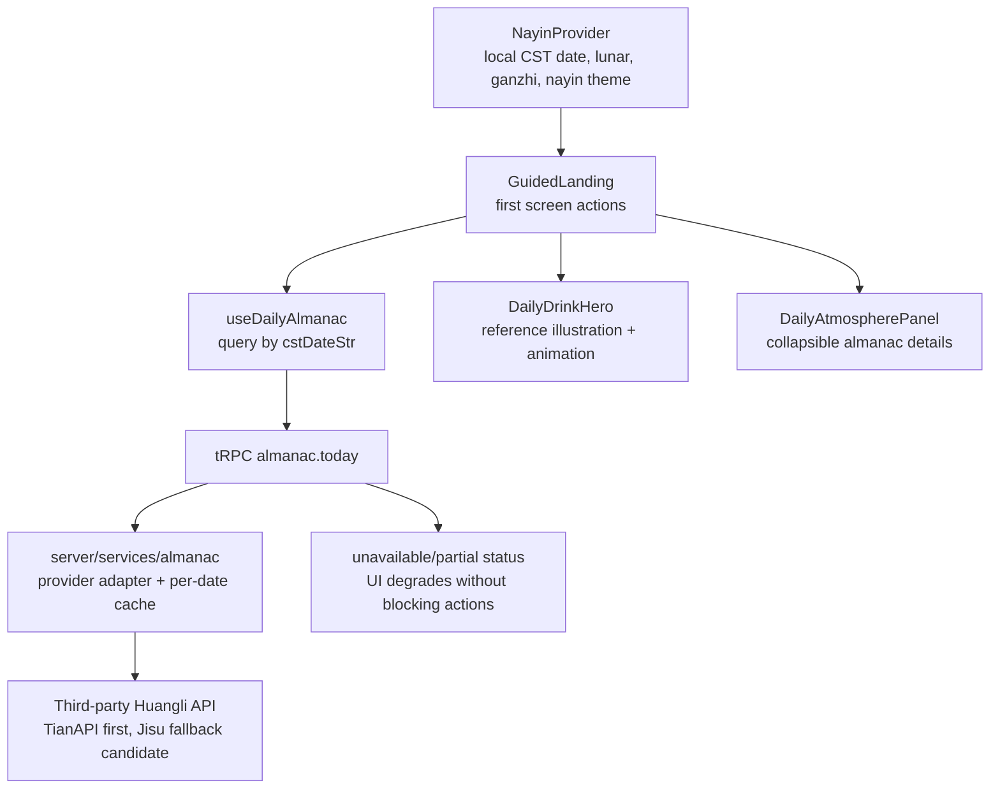

# feat: 欢迎页纳音老黄历改造

## Summary

本计划把欢迎页改造成“首屏两按钮 + 可展开今日气息”的结构：本地继续负责北京时间、农历、干支和纳音主题，服务端新增老黄历 API 适配与 tRPC 查询，前端把 API 信息和用户提供的 standalone HTML 插画/动画方向迁入当前产品。实现以 `GuidedLanding` 和 `features/nayin` 为中心，避免重做分析工作台。

---

## Problem Frame

现有欢迎页已经有清晰的“上传素材”和“聊故事”入口，也已经有 NayinProvider 提供每日纳音主题。计划需要补齐的是：真实老黄历信息、参考 HTML 的插画动画保留，以及不让仪式感压过核心开始路径。（see origin: `docs/brainstorms/2026-05-13-welcome-nayin-almanac-requirements.md`）

---

## Requirements

- R1. 欢迎页采用两层结构：首屏入口简洁，第二层展示可展开/可收起的“今日气息”。承接 origin R1。
- R2. 首屏保留两个主要按钮：“上传素材开始”和“聊一个故事开始”。承接 origin R2, R3, R4, AE1。
- R3. 页面主题按当天北京时间对应的纳音五行自动变化，并展示公历、农历、干支、纳音名称和五行。承接 origin R6, R7, AE2。
- R4. 保留用户提供的 standalone HTML 中的五行饮品插画与动画方向，允许产品适配但不大改美术方向。承接 origin R8, R9, AE2。
- R5. 第一版接入真实老黄历 API，在第二层展示宜忌、吉时、方位等可用信息。承接 origin R10, R11, AE3。
- R6. 老黄历 API 字段缺失或请求失败时必须优雅降级，不伪造权威黄历信息，也不影响两个开始按钮。承接 origin R12, R13, AE4。
- R7. 页面文案保持 Drinking Time 的创作陪伴感和饮品隐喻，不变成严肃算命或强运势判断。承接 origin R14, R15, AE5。
- R8. 桌面和移动视口下按钮、文案、插画、动效和展开层不能互相遮挡。承接 origin R5。

**Origin actors:** A1 新项目/空项目用户, A2 回访用户, A3 老黄历 API, A4 后续实现者
**Origin flows:** F1 首屏进入, F2 展开今日气息, F3 老黄历 API 不可用
**Origin acceptance examples:** AE1 双入口可用, AE2 纳音视觉变化, AE3 API 信息在展开层, AE4 API 失败降级, AE5 内容语气

---

## Scope Boundaries

- 不重做 `WorkspaceLayout`、镜头表、故事 Agent、素材上传或分析流程。
- 不手写完整权威老黄历算法；权威扩展信息来自第三方老黄历 API。
- 不新增星座、生肖运势、个人命盘、社交分享或复杂用户偏好。
- 不替换参考 HTML 的五行饮品视觉方向；美术工作以迁移、适配、整理为主。
- 不把老黄历信息放在首屏主行动位置，也不弱化两个开始按钮。

### Deferred to Follow-Up Work

- 用户可选择多个老黄历服务商、后台配置 provider、管理额度或监控 API SLA：本计划只做第一版可用适配。
- 持久化黄历缓存到数据库或 KV：第一版采用服务端轻量日期缓存和客户端查询缓存，除非实现时发现 provider 限额必须持久化。
- 全站级视觉回归测试体系：本计划只要求该欢迎页的浏览器截图与交互验证。

---

## Context & Research

### Relevant Code and Patterns

- `client/src/features/analysis/views/GuidedLanding.tsx` 已经是欢迎页入口，当前只渲染两个 Nayin-themed 按钮。
- `client/src/features/analysis/views/WorkspaceStageRouter.tsx` 已经根据项目数据选择 `GuidedLanding` 或 `WorkspaceLayout`，两个按钮只负责切换 material/story 路径。
- `client/src/features/nayin/NayinContext.tsx` 已经每天按北京时间刷新 `today`，并把 active element 写入 `data-nayin`。
- `client/src/features/nayin/nayin.ts` 已经能计算北京时间日期、日柱、纳音名称、五行主题和农历日期。
- `client/src/features/nayin/views/WuxingDrinkIcon.tsx`、`BeverageAmbience.tsx`、`WuxingParticles.tsx` 和 `BeverageTransition.tsx` 已经承载五行饮品插画、背景和动效，应优先扩展而不是重建。
- `server/routers.ts` 已有 `nayin.today` public tRPC procedure，但它只返回服务器端简单纳音数据，且和客户端 Nayin 计算有重复。
- `server/_core/env.ts` 集中管理服务端环境变量，适合新增黄历 API key/base URL/provider 配置。
- `server/routers.storyAgent.test.ts` 和 `server/nayin.test.ts` 展示了通过 `appRouter.createCaller()` 测试 tRPC procedure 的模式。
- `client/src/architecture-boundaries.test.ts` 保护当前 feature-module 边界，新文件应继续遵守 `features/nayin`、`features/analysis`、`components/ui` 的分工。

### Institutional Learnings

- 当前仓库还没有 `docs/solutions/` 学习文档。
- `docs/analysis-architecture.md` 记录了前端模块边界：业务代码进入 feature module，顶层 `components/` 只放共享平台 UI。
- `docs/plans/2026-05-13-001-refactor-frontend-architecture-convergence-plan.zh-CN.md` 已把 `TopBar` 移到 `app/shell`，把 Nayin 相关文件集中到 `features/nayin/`，本计划应继续沿用这个结构。

### External References

- [天行数据老黄历 API](https://www.tianapi.com/apiview/45)：官方文档描述支持老黄历查询，能力包括吉时宜忌、阴历、五行、冲煞、胎神等，并使用 key/date/type 参数。
- [极速数据黄历 API](https://www.jisuapi.com/api/huangli/)：官方文档描述支持 1900-2100 年黄历查询，返回宜/忌、干支、凶神宜忌、吉神宜趋、喜神/福神/财神等字段，适合作为备选 provider。
- [聚合数据老黄历 API](https://www.juhe.cn/docs/api/id/65)：公开文档可作为补充参考，但当前公开描述的年份覆盖偏旧，不作为第一默认候选。

---

## Key Technical Decisions

- **服务端代理第三方 API，不从浏览器直连：** API key 留在服务端，前端只通过 tRPC 获取规范化结果，避免泄漏 key 和 CORS/鉴权问题。
- **默认计划以天行数据为首选 provider，极速数据为备选：** 天行文档明确覆盖“吉时宜忌”等需求关键词；极速数据年份范围和方位字段更清晰，适合作为实现期替代或 fallback 参考。实现时只需要落地一个 provider，但服务层应避免把 UI 绑死在某个原始响应 shape 上。
- **新增规范化 Almanac contract：** UI 不直接消费 provider 原始字段。服务端把不同 provider 响应整理为稳定的当天黄历模型，字段缺失时以 empty/nullable 表示，不生成假数据。
- **API 失败返回降级状态而不是让页面报错：** tRPC procedure 应把 provider unavailable、缺 key、超时、字段缺失等转成可渲染状态，让 `GuidedLanding` 继续显示本地纳音/农历和两个按钮。
- **本地 Nayin 仍是欢迎页的主题真源：** `useNayin()` 已经处理每日刷新和 CSS theme。黄历 API 补充扩展信息，不替代当前主题系统。
- **首屏不放满黄历信息：** 黄历详情进入 Collapsible/Accordion 式的“今日气息”层，默认只露出轻量提示和展开入口。
- **保留参考视觉方向优先于重新设计：** 现有 `WuxingDrinkIcon`、`BeverageAmbience` 和 `WuxingParticles` 应作为迁入参考 HTML 插画/动画的落点；只有当参考 HTML 中存在当前缺失的视觉细节时才补充。

---

## Open Questions

### Resolved During Planning

- **老黄历 API 放前端还是后端？** 后端。API key 和 provider 原始响应都留在服务端，前端消费 tRPC 的规范化结果。
- **第一版选哪个 provider？** 计划推荐天行数据作为默认 provider，极速数据作为实现期备选。如果实现者已有可用 key 或天行字段无法满足“吉时”展示，可在同一规范化 contract 下切换到极速数据或另一个明确支持字段的 provider。
- **API 信息如何影响首屏？** 不影响两个按钮的主位置；只在第二层展开内容中呈现。
- **是否需要数据库缓存？** 第一版不需要。黄历是按日期变化的低频数据，服务端 per-date 内存缓存加客户端 React Query 缓存足够支撑开发和小流量使用。

### Deferred to Implementation

- **最终 provider 字段名和样例响应：** 需要用真实 key 或官方控制台验证，尤其是“吉时”字段是否可直接返回，或者是否需要 provider 的独立时辰接口。
- **参考 HTML 中哪些动画细节必须完整迁入：** 实现者应对照用户提供的 standalone HTML 逐项迁移，若某个细节和当前响应式布局冲突，以保留整体五行饮品动效方向为准。
- **API key 配置位置与部署注入：** 本地 `.env` 和生产环境变量由部署环境提供，计划只要求 `server/_core/env.ts` 暴露读取入口。

---

## Output Structure

```text
client/src/features/nayin/
  almanac.ts
  almanac.test.ts
  hooks/
    useDailyAlmanac.ts
  views/
    DailyAtmospherePanel.tsx
    DailyDrinkHero.tsx
    WuxingDrinkIcon.tsx

client/src/features/analysis/views/
  GuidedLanding.tsx

server/
  services/
    almanac.ts
    almanac.test.ts
  almanac.router.test.ts
  routers.ts
  _core/env.ts
```

`Output Structure` 是预期形状，不是硬约束。若实现时发现更贴合当前 feature boundary 的文件名，可以调整，但必须保持 Nayin/黄历逻辑不散落回 `components/` 顶层。

---

## High-Level Technical Design

> *This illustrates the intended approach and is directional guidance for review, not implementation specification. The implementing agent should treat it as context, not code to reproduce.*



Core flow:
1. `useNayin()` supplies local date identity and active element.
2. `GuidedLanding` renders the two buttons immediately from local state.
3. `useDailyAlmanac(today.cstDateStr)` fetches API-backed details through tRPC.
4. The collapsible detail layer renders `ok`, `partial`, `unconfigured`, or `unavailable` states without disrupting the two buttons.

---

## Implementation Units

### U1. Define and Test the Almanac Provider Service

**Goal:** Add a server-side almanac service that hides third-party provider details behind a normalized, UI-safe contract.

**Requirements:** R5, R6, origin F3, origin AE3, origin AE4

**Dependencies:** None

**Files:**
- Create: `server/services/almanac.ts`
- Create: `server/services/almanac.test.ts`
- Modify: `server/_core/env.ts`

**Approach:**
- Add environment-backed configuration for provider, API key, and optional base URL. Keep secret values server-only.
- Define a normalized `AlmanacDay` model that covers:
  - source/provider label
  - status: successful, partial, unconfigured, unavailable
  - date identity
  - yi/ji activities
  - auspicious hours when provider supplies them
  - direction fields such as 喜神/福神/财神 or equivalent
  - raw-provider-derived metadata only when safe and useful for debugging
- Implement one concrete provider first, using TianAPI as the default candidate.
- Keep field mapping tolerant: missing provider fields become empty arrays or nulls; the service must not invent authoritative content.
- Add a small per-date in-memory cache to avoid repeated same-day provider calls and protect free quota.
- Use provider timeout and typed failure results so router/UI can degrade cleanly.

**Execution note:** Start test-first for the mapper and failure contract. This is the riskiest layer because provider responses are external and can drift.

**Patterns to follow:**
- `server/_core/env.ts` for environment access.
- `server/archive/storyAgent.ts` and `server/_core/llm.ts` for server-side `fetch` error handling style.
- `server/routers.storyAgent.test.ts` for hoisted mocks and deterministic service tests.

**Test scenarios:**
- Happy path: given a representative successful provider response with yi/ji/direction/hour fields, the service returns `status: "ok"` and normalized arrays/fields.
- Edge case: given a response that has yi/ji but no hour field, the service returns available yi/ji and marks auspicious hours empty/partial without inventing values.
- Error path: when API key is missing, the service returns an unconfigured/unavailable result rather than attempting a network call.
- Error path: when provider returns non-OK, malformed JSON, or times out, the service returns an unavailable result suitable for UI fallback.
- Integration: repeated requests for the same date use the cache and do not call the provider fetcher again within the cache window.

**Verification:**
- Service tests prove mapping, missing-field behavior, unconfigured behavior, provider failure behavior, and cache behavior.
- No client-side file imports provider secrets or provider response shapes.

---

### U2. Expose a Public tRPC Almanac Endpoint

**Goal:** Add a tRPC procedure that lets the welcome page fetch normalized old-almanac details for the current CST date.

**Requirements:** R5, R6, origin F2, origin F3, origin AE3, origin AE4

**Dependencies:** U1

**Files:**
- Modify: `server/routers.ts`
- Create: `server/almanac.router.test.ts`
- Optionally modify: `server/nayin.test.ts` if the existing `nayin.today` tests need shared date helpers

**Approach:**
- Add a public almanac-oriented router/procedure, separate from protected project data.
- Input should be a CST date string supplied by the client from `today.cstDateStr`, with server validation for date format and supported range.
- The procedure should call `server/services/almanac.ts` and return the normalized result.
- Provider failures should usually return an unavailable result rather than throw a tRPC error, because the UI must degrade without blocking the page.
- Input validation failures can remain tRPC errors because they indicate a caller bug, not provider unavailability.
- Avoid expanding the existing `nayin.today` duplicate calculation unless needed. The client already has richer Nayin data from `features/nayin/nayin.ts`.

**Patterns to follow:**
- `server/routers.ts` public procedure pattern from `auth.me` and `nayin.today`.
- `server/nayin.test.ts` for public caller setup.
- `server/routers.storyAgent.test.ts` for mocking services behind router procedures.

**Test scenarios:**
- Happy path: given a valid date and mocked service success, the router returns the normalized almanac result.
- Edge case: given a valid date with service partial data, the router preserves partial status and available fields.
- Error path: given provider unavailable from the service, the router returns unavailable status without throwing.
- Error path: given an invalid date string, the router rejects input with a validation error.
- Integration: procedure is public and callable with an unauthenticated context, matching the welcome page use case.

**Verification:**
- Router tests cover success, partial, unavailable, invalid input, and public access.
- The new endpoint does not require a project ID or logged-in user.

---

### U3. Add Client Almanac Types and Query Hook

**Goal:** Give the frontend a small, typed way to request and render old-almanac details without leaking tRPC usage into presentational components.

**Requirements:** R3, R5, R6, origin F2, origin F3

**Dependencies:** U2

**Files:**
- Create: `client/src/features/nayin/almanac.ts`
- Create: `client/src/features/nayin/almanac.test.ts`
- Create: `client/src/features/nayin/hooks/useDailyAlmanac.ts`

**Approach:**
- Define client-facing types/helpers for almanac status, available fields, and display readiness.
- Build `useDailyAlmanac(date)` around `trpc.almanac.today.useQuery`.
- Keep query behavior date-scoped: a new CST day should naturally fetch new data; the old day can remain cached.
- Provide small pure helpers for UI decisions, such as whether there are enough details to show the expanded panel, which sections have data, and which fallback copy to show.
- Keep presentational components free of direct `@/lib/trpc` imports, matching the existing analysis view boundary pattern.

**Patterns to follow:**
- `client/src/features/analysis/hooks/useProjectData.ts` and `useAnalysisOrchestration.ts` for hook-owned tRPC access.
- `client/src/features/nayin/nayin.ts` for pure date/theme helper style.
- `client/src/architecture-boundaries.test.ts` rule that display views should not own direct tRPC calls when a hook can own them.

**Test scenarios:**
- Happy path: display helper reports details available when yi/ji or direction/hour fields exist.
- Edge case: helper reports no authority-backed detail when all optional API fields are empty.
- Error path: unavailable/unconfigured status maps to fallback copy and does not ask UI to render fake fields.
- Edge case: partial status still exposes available sections and labels missing sections as absent rather than failed.

**Verification:**
- Pure helper tests pass.
- `GuidedLanding` can consume one hook result instead of branching on raw tRPC states.

---

### U4. Migrate Reference Illustration and Animation Direction

**Goal:** Preserve the standalone HTML's five-element drink illustration and animation feel inside the current Nayin feature module.

**Requirements:** R3, R4, R8, origin F1, origin AE2

**Dependencies:** U3 can run in parallel; U5 depends on this unit.

**Files:**
- Modify: `client/src/features/nayin/views/WuxingDrinkIcon.tsx`
- Modify: `client/src/features/nayin/views/BeverageAmbience.tsx`
- Modify: `client/src/features/nayin/views/WuxingParticles.tsx`
- Create: `client/src/features/nayin/views/DailyDrinkHero.tsx`
- Create or modify: `client/src/features/nayin/dailyPresentation.ts`
- Test: `client/src/features/nayin/dailyPresentation.test.ts`

**Approach:**
- Treat the user-provided standalone HTML as the visual reference for drink identities and motion direction.
- Prefer extending existing Nayin views over adding a parallel visual system:
  - `WuxingDrinkIcon` remains the canonical element-to-drink illustration.
  - `BeverageAmbience` and `WuxingParticles` remain background/particle owners.
  - `DailyDrinkHero` composes the large welcome illustration and subtle motion.
- Keep all five elements covered: metal/beer, wood/Longjing, water/coconut, fire/Dahongpao, earth/coffee.
- Avoid random layout shifts or text overlap: hero dimensions should use stable responsive constraints.
- Do not add decorative gradient blobs/orbs; use drink/element-specific visual assets and existing theme tokens.

**Patterns to follow:**
- Existing `WuxingDrinkIcon.tsx` SVG illustration style.
- Existing `BeverageTransition.tsx` and `WuxingParticles.tsx` framer-motion/light CSS animation patterns.
- `client/src/index.css` Nayin CSS custom properties and `data-nayin` tokens.

**Test scenarios:**
- Happy path: every `NayinElement` maps to a drink identity, illustration label, and hero copy.
- Edge case: unknown/unsupported element is impossible at type level; helper tests cover exhaustive mapping through all five elements.
- Visual verification: desktop and mobile screenshots show the drink hero visible, not cropped into meaninglessness, and not blocking the two buttons.
- Motion verification: animations render nonblank and subtle across element changes; no animation should resize the button layout.

**Verification:**
- Presentation helper tests pass.
- Browser verification confirms the visual direction remains recognizably aligned with the standalone HTML reference.

---

### U5. Refactor GuidedLanding Into Two-Layer Welcome UI

**Goal:** Make the welcome page feel daily and almanac-aware while preserving the two-button entry as the main path.

**Requirements:** R1, R2, R3, R4, R5, R6, R7, R8, origin F1, origin F2, origin F3, origin AE1, origin AE2, origin AE3, origin AE4, origin AE5

**Dependencies:** U3, U4

**Files:**
- Modify: `client/src/features/analysis/views/GuidedLanding.tsx`
- Create: `client/src/features/nayin/views/DailyAtmospherePanel.tsx`
- Test: `client/src/features/analysis/views/GuidedLanding.test.tsx`
- Test: `client/src/features/nayin/dailyPresentation.test.ts`
- Modify if needed for component-test harness: `vitest.config.ts`

**Approach:**
- Recompose `GuidedLanding` around three zones:
  - daily hero: drink illustration, date identity, short Drinking Time greeting
  - primary actions: the two existing buttons and their existing routes
  - collapsible “今日气息” layer: API-backed old-almanac details and fallback states
- Use `Collapsible` or `Accordion` from `client/src/components/ui/` for the second layer, not a custom disclosure widget.
- Keep button labels exactly as required:
  - “上传素材开始”
  - “聊一个故事开始”
- The current code says “聊一段故事开始”; implementation must correct it to “聊一个故事开始” to match the origin requirement.
- Keep expanded content compact: show available yi/ji, auspicious hours, directions, and source/status; hide missing provider sections.
- For API unavailable/unconfigured states, show a gentle fallback line and local date/Nayin identity only.
- Preserve keyboard accessibility: disclosure control has clear label, buttons remain native buttons, focus states remain visible.
- Keep mobile layout single-column with stable hero sizing; desktop may use a constrained central composition, but not a marketing landing page.

**Patterns to follow:**
- Existing `GuidedLanding.tsx` motion timing and button click handlers.
- `client/src/components/ui/collapsible.tsx` for disclosure behavior.
- `client/src/app/shell/TopBar.tsx` for compact date/Nayin copy style.
- `client/src/features/storyAgent/views/StoryAgentChat.tsx` and analysis views for restrained panel styling using `var(--nayin-*)` tokens.

**Test scenarios:**
- Covers AE1. Happy path: with local Nayin data and API success, the page renders both buttons with exact required labels and both callbacks remain wired.
- Covers AE3. Happy path: when almanac details are available and the user expands the panel, yi/ji and provider-backed fields appear only in the detail layer.
- Covers AE4. Error path: when `useDailyAlmanac` reports unavailable/unconfigured, buttons remain visible and the detail layer shows a fallback rather than crashing.
- Covers AE5. Content check: helper-level copy remains framed as creative daily atmosphere, not prescriptive fortune telling.
- Component behavior: clicking each rendered button calls the corresponding `onSelectMaterial` / `onSelectStory` callback once.
- Responsive verification: mobile and desktop screenshots show no overlapping text, buttons, illustration, or expanded panel.

**Verification:**
- The current empty-project route still starts in `GuidedLanding`.
- Clicking each button still flips `WorkspaceStageRouter` into workspace mode with the correct active tab.
- Browser verification confirms first viewport keeps the two buttons prominent.

---

### U6. Verify Integration, Types, and Architecture Boundaries

**Goal:** Prove the feature is integrated safely across server, client, and visual behavior.

**Requirements:** R1-R8, all origin acceptance examples

**Dependencies:** U1, U2, U3, U4, U5

**Files:**
- Modify if needed: `client/src/architecture-boundaries.test.ts`
- Modify if needed: `docs/analysis-architecture.md`
- Test: `server/services/almanac.test.ts`
- Test: `server/almanac.router.test.ts`
- Test: `client/src/features/nayin/almanac.test.ts`
- Test: `client/src/features/nayin/dailyPresentation.test.ts`
- Test: `client/src/features/analysis/views/GuidedLanding.test.tsx`

**Approach:**
- Keep architecture-boundary tests green: new Nayin and welcome files belong under feature modules, not top-level `components/`.
- Run type checking against the new tRPC router and client hook.
- Build the app and inspect the generated bundle for obvious asset/import issues.
- Start the local dev server and verify the welcome page in browser at desktop and mobile viewport sizes.
- If `docs/analysis-architecture.md` describes the welcome/Nayin module boundaries, update it so the new almanac service and two-layer welcome page are discoverable.

**Patterns to follow:**
- Existing `architecture-boundaries.test.ts` for structural guards.
- Existing build and Vitest configuration.
- Existing frontend design verification discipline for UI changes.

**Test scenarios:**
- Integration: all new server/client tests pass together with existing Nayin and Story Agent router tests.
- Integration: TypeScript accepts the expanded app router and generated tRPC client types.
- Visual: desktop screenshot shows hero, two buttons, and collapsed detail layer without overlap.
- Visual: mobile screenshot shows a single-column layout with buttons reachable without horizontal scrolling.
- Error path: simulated unavailable almanac state still produces a usable welcome page.
- Regression: architecture-boundary test still prevents new business UI from being placed under `client/src/components/`.

**Verification:**
- Test suite and typecheck pass.
- Production build succeeds.
- Browser screenshots demonstrate nonblank visual assets, readable text, clickable buttons, and usable expanded details.

---

## System-Wide Impact

- **Interaction graph:** `GuidedLanding` becomes the only visible consumer of the new almanac query. `NayinProvider` remains the source of theme/date identity. `server/services/almanac.ts` owns third-party API calls. `server/routers.ts` exposes a public read-only tRPC surface.
- **Error propagation:** Provider failures should become normalized unavailable/partial results. Invalid client input remains a validation error. UI must not crash or block entry paths on provider failure.
- **State lifecycle risks:** Daily data changes at CST midnight. `NayinProvider` already refreshes at midnight/focus; `useDailyAlmanac` should be keyed by `today.cstDateStr` so it refetches when the date changes.
- **API surface parity:** No REST endpoint is needed. Client access should follow existing tRPC patterns.
- **Integration coverage:** Server service tests cover provider mapping; router tests cover public tRPC behavior; browser verification covers the visual two-layer interaction.
- **Unchanged invariants:** `WorkspaceStageRouter` decides guided vs workspace stage; button click callbacks still set active input tab and sticky workspace stage. Analysis, story, upload, and project persistence flows are unchanged.

---

## Risks & Dependencies

| Risk | Mitigation |
|------|------------|
| Chosen old-almanac provider does not expose a direct “吉时” field in the available plan | Use the normalized contract to support provider-specific hour fields; verify with the real key during U1. If TianAPI cannot satisfy it, switch the adapter to a provider/API tier that explicitly returns hour luck while keeping UI unchanged. |
| API key missing in local or production environment | Service returns unconfigured/unavailable status; UI falls back to local Nayin/农历 and keeps both buttons usable. |
| Free quota is exhausted by repeated welcome-page loads | Add server per-date in-memory cache and client date-keyed query cache. Defer persistent cache until traffic proves it is needed. |
| Provider raw response changes | Keep raw provider mapping isolated in `server/services/almanac.ts` and cover representative response shapes with tests. |
| Visual migration drifts too far from user-provided HTML | Treat existing/reference drink identities as acceptance criteria; verify all five elements in browser screenshots before declaring done. |
| Expanded panel makes first screen feel crowded | Keep details collapsed by default and render only a compact preview line next to/under the hero. |
| Timezone mismatch between local Nayin and API query | Use `today.cstDateStr` from `useNayin()` as the client query date; validate server input as a date string rather than using server local timezone implicitly. |

---

## Documentation / Operational Notes

- Add deployment notes for required Huangli API environment variables if the repo has or gains an env example/runbook.
- Do not commit real API keys. Local `.env` and production secrets remain environment-managed.
- If provider terms require attribution, add a compact source label inside the expanded detail layer.
- If `docs/analysis-architecture.md` is updated, describe the new almanac service as a server integration supporting `features/nayin`, not as an analysis-workspace concern.

---

## Sources & References

- **Origin document:** [docs/brainstorms/2026-05-13-welcome-nayin-almanac-requirements.md](../brainstorms/2026-05-13-welcome-nayin-almanac-requirements.md)
- Related code: `client/src/features/analysis/views/GuidedLanding.tsx`
- Related code: `client/src/features/analysis/views/WorkspaceStageRouter.tsx`
- Related code: `client/src/features/nayin/NayinContext.tsx`
- Related code: `client/src/features/nayin/nayin.ts`
- Related code: `client/src/features/nayin/views/WuxingDrinkIcon.tsx`
- Related code: `client/src/features/nayin/views/BeverageAmbience.tsx`
- Related code: `server/routers.ts`
- Related code: `server/_core/env.ts`
- External docs: [天行数据老黄历 API](https://www.tianapi.com/apiview/45)
- External docs: [极速数据黄历 API](https://www.jisuapi.com/api/huangli/)
- External docs: [聚合数据老黄历 API](https://www.juhe.cn/docs/api/id/65)
