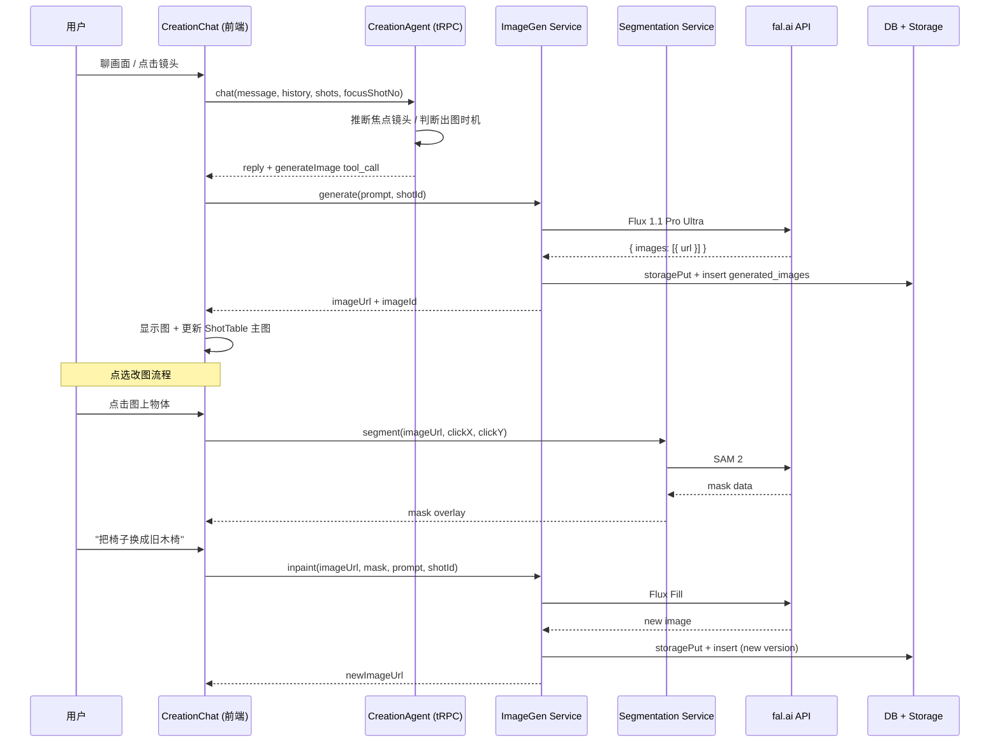

# feat: Creation Engine v1 — 剧本→画面独立页面

## Summary

把 Drinking Time 的「双引擎」架构的另一半建出来。新增 `/creation` 路由和页面，承载 Creation Agent 对话 + Shot Production Table 两件套；接入 fal.ai 一站式图像服务（Flux 1.1 Pro Ultra 生图 + Flux Fill 改图 + SAM 2 分割）；实现 Script↔Shot 1:1 跨页联动、对话内自动出图、焦点镜头跟踪、图拖动重绑、点选物体级改图。分四阶段落地：后端基础 → Creation Agent → UI 重构 → 图像功能。

---

## Problem Frame

Analysis Engine 已成立，但 Creation 一直缺位。Shot Table 被塞在 Analysis 右栏挤占空间，用户走完聊故事→卡片→剧本→Shot Table 后看到的全是文字描述的镜头，从"有剧本"到"可以拍"之间缺少视觉化这一步。(see origin: docs/brainstorms/2026-05-21-creation-engine-v1-requirements.md)

---

## Requirements

- R1. Analysis 页面移除 Shot Table，恢复三面板布局（故事列表/Cards/Script）
- R2. 新建 Creation Engine 页面 = Creation Agent 对话框 + Shot Production Table
- R3. 项目数据（卡片/剧本/Shot Table/图像）在 Analysis 和 Creation 之间共享
- R4. Creation Agent 独立对话历史，不读小酌逐句聊天
- R5. Creation Agent 可读取卡片、最新剧本、Shot Table 当前状态
- R6. 图像能力为 Creation Engine 独占
- R7. Script S0X ↔ Shot Table SH0X 严格 1:1
- R8. Script↔Shot 可互相跳转聚焦
- R9. Creation Agent 达到语义条件后自动出图
- R10. 图绑当前焦点镜头
- R11. 焦点由 Agent 推断 + 用户显式动作更新
- R12. 同一镜头多版本图，最新为主图
- R13. 用户可拖动重绑图到另一镜
- R14. 点选物体后 AI 自动识别边界高亮
- R15. 高亮确认后改图，只重生该区域
- R16. 改图后新版本成主图，旧版本进历史
- R17. 跨页切换时两边状态完整保留
- R18. 进入 Creation 时 Shot Table 自动从已有数据初始化

**Origin actors:** A1 (创作者), A2 (Story Agent/小酌), A3 (Creation Agent), A4 (Shot Production Table)
**Origin flows:** F1 (首次出图), F2 (点选改图), F3 (跨页面切换)
**Origin acceptance examples:** AE1 (R7,R8), AE2 (R9,R10,R12), AE3 (R11), AE4 (R14,R15,R16), AE5 (R17), AE6 (R4,R5,R6)

---

## Scope Boundaries

- 场景:镜头 1:N 拆分（v1 锁定 1:1）
- 视频生成
- 导出/打包给摄制组
- 给 Story Agent 加图像能力
- 多浏览器 tab 实时同步（last-write-wins per autoSave 间隔）
- 给 fal.ai 之外的 provider 写完整适配器（只留接口契约空位）
- Segmentation 模型本地化/WASM 化（纯服务端调用）
- 图像版权/商业使用合规
- 自动化测试调用真实 fal.ai API（用 fetcher injection mock）

### Deferred to Follow-Up Work

- Creation Agent 的 system prompt 深度调优和对话哲学设计：v1 先跑通功能，后续迭代打磨语气
- 图像版本的 gallery/timeline 浏览 UI：v1 只做"主图+历史列表"，花哨的查看界面后续加

---

## Context & Research

### Relevant Code and Patterns

- **DB 层 (dual-mode):** `server/db.ts` — 全表走 in-memory + JSON 持久化 fallback，MySQL drizzle 作为可选。新表需在 `drizzle/schema.ts` 声明 + `server/db.ts` 加 memory CRUD
- **Schema 声明:** `drizzle/schema.ts` — `mysqlTable()` 定义，export type + InsertType
- **LLM 调用:** `server/_core/llm.ts` — `invokeLLM()` 统一封装 OpenAI 兼容格式
- **图像生成（已有基础）:** `server/_core/imageGeneration.ts` — 当前走 Manus Forge ImageService，需要替换为 fal.ai
- **Storage:** `server/storage.ts` — `storagePut(relKey, data, contentType)` / `storageGet(relKey)` 落 Forge 代理存储
- **Story Agent 模式:** `server/archive/storyAgent.ts` — `replyFromStoryAgent()` 接收 messages + context，调 `invokeLLM`，解析 JSON tool_calls 返回 cards/shots/script
- **Story Agent Context:** `client/src/features/storyAgent/StoryAgentContext.tsx` — React Context + localStorage 持久化 `dt:storyAgent:${projectId}`
- **路由:** `client/src/app/router/AppRouter.tsx` — wouter `<Switch>` + `<Route>`, AuthGuard HOC
- **当前 WorkspaceLayout:** `client/src/features/analysis/views/WorkspaceLayout.tsx` — 三面板 ResizablePanelGroup，ShotTable 在右面板
- **服务 layer 模式:** `server/services/almanac.ts` — normalized status union + injectable fetcher + never throws
- **韧性模式:** `server/services/semanticAnnotation.ts` — 30s 超时 + 熔断（3 次失败 10 分钟冷却）
- **tRPC 路由:** `server/routers.ts` — `protectedProcedure` + zod input → service function

### External References

- fal.ai SDK: `@fal-ai/serverless-client` — `fal.subscribe("fal-ai/flux/1.1/pro/ultra", { input })` for generation
- fal.ai Flux Fill (inpainting): `fal-ai/flux/1.1/pro/ultra/redux` or `fal-ai/flux-pro/v1.1/fill` — accepts image + mask + prompt
- fal.ai SAM 2: `fal-ai/sam2` — accepts image + point coordinates → returns segmentation masks
- All fal.ai calls return `{ images: [{ url, content_type }] }` or similar; URLs are temporary signed URLs (need to persist via storagePut)

---

## Key Technical Decisions

- **图像 API 选 fal.ai 一站式:** Flux 1.1 Pro Ultra 生成 + Flux Fill 改图 + SAM 2 segmentation。DALL-E 3 已退役，Imagen 5 即将退役，OpenAI 封中国；fal.ai 中国可达且 SDK 优秀。Replicate 作为 fallback adapter 留扩展点（只留接口形状，不实际接入）
- **单主拥有 schema:** `generated_images.shotId` 单 FK，拖动 = 搬（更新 shotId），原镜头自动 promote 上一版本为主图
- **服务 layer 形状:** `server/services/imageGen.ts` 和 `server/services/segmentation.ts` 仿照 almanac.ts 的 normalized status union + injectable fetcher + never throws 模式
- **韧性套路复用:** 30s 超时 + 熔断（3 次失败 10 分钟冷却），沿用 semanticAnnotation.ts 已确立的模式，套用到 image-gen 和 segmentation
- **跨页面 state:** CreationAgentProvider 仿照 StoryAgentProvider 在 Creation 页面内（不抬到 AppRouter 顶层），localStorage 命名空间 `dt:creationAgent:${projectId}`
- **Empty state:** 进入 Creation Engine 时如果还没卡片/剧本，不阻塞；Creation Agent 第一句软引导回 Analysis，但用户可以留下
- **Abort 语义:** 所有图像生成/segmentation 调用走 AbortController，导航离开或对同一镜头发新请求时取消上一个
- **并发同镜生成:** 按 request-time 时间戳决定主图
- **共享 LLM helpers 前置抽取:** 把 `parseJsonLoose` 抽到 `server/_core/llmJson.ts`、invokeAgent 抽到 `server/_core/agentChannel.ts`——~30 行移动，无行为变化
- **导航形式:** 顶栏 Tab 切换 Analysis / Creation，wouter 路由 `/analysis` 和 `/creation`

---

## Open Questions

### Resolved During Planning

- **图重绑语义:** 拖动 = 把图的 shotId 换成目标镜头，原镜头 promote 上一版本为主图。不支持一图多镜。
- **SAM mask 是否需要保留:** 不需要持久化 mask。每次改图时重新跑 SAM 拿 mask → 传给 Flux Fill。成本低且避免 mask 与图版本不同步。
- **进入 Creation 无数据时:** 不阻塞入口，Creation Agent 第一句话软引导回 Analysis。

### Deferred to Implementation

- Creation Agent system prompt 具体措辞（需要在 agent 跑通后调优）
- fal.ai 具体 model endpoint ID（可能随 SDK 版本更新）
- 前端图像 canvas 组件选型（用于显示 segmentation overlay）——实现时决定是 `<canvas>` overlay 还是 SVG mask

---

## High-Level Technical Design

> *This illustrates the intended approach and is directional guidance for review, not implementation specification.*

---

## Implementation Units

### U1. Shared LLM Helpers Extraction

**Goal:** 抽取共用工具到独立模块，为双 Agent 共享做准备

**Requirements:** R4, R5 (前置基础设施)

**Dependencies:** None

**Files:**
- Create: `server/_core/llmJson.ts`
- Create: `server/_core/agentChannel.ts`
- Modify: `server/archive/storyAgent.ts`

**Approach:**
- 从 `storyAgent.ts` 抽出 `parseJsonLoose` → `server/_core/llmJson.ts`
- 抽出 agent 请求封装逻辑（构建 messages + invokeLLM + 解析响应）→ `server/_core/agentChannel.ts`，参数化 model/system prompt
- `storyAgent.ts` 改为 import 新模块，无行为变化

**Patterns to follow:**
- `server/_core/llm.ts` 的导出风格

**Test scenarios:**
- Happy path: storyAgent 现有测试（`server/routers.storyAgent.test.ts`）全通过，行为不变

**Verification:**
- `storyAgent.ts` 不再内含 `parseJsonLoose`
- 现有 story agent 测试全绿

---

### U2. fal.ai Service Layer — Image Generation

**Goal:** 建立 fal.ai 图像生成服务，支持文生图和改图（inpainting）

**Requirements:** R9, R15

**Dependencies:** None

**Files:**
- Create: `server/services/imageGen.ts`
- Create: `server/services/imageGen.test.ts`
- Modify: `server/_core/env.ts` (add FAL_AI_KEY)

**Approach:**
- 仿照 `almanac.ts` 的 injectable fetcher + normalized status union 模式
- 导出 `generateImage(prompt, options?)` 和 `inpaintImage(imageUrl, maskUrl, prompt, options?)`
- 内部调用 fal.ai SDK（`@fal-ai/serverless-client`）
- 返回 `{ status: 'ok', imageUrl, imageKey } | { status: 'error', message }`
- 生成后自动 `storagePut` 持久化（fal.ai URL 会过期）
- 30s 超时 + 熔断（3 次失败 10 分钟冷却），复用 semanticAnnotation.ts 的模式
- env 新增 `FAL_AI_KEY`

**Patterns to follow:**
- `server/services/almanac.ts` — fetcher injection, status union, never throws
- `server/services/semanticAnnotation.ts` — circuit breaker pattern

**Test scenarios:**
- Happy path: mock fetcher 返回图像 → 得到 `{ status: 'ok', imageUrl }`
- Error path: fal.ai 返回 500 → 得到 `{ status: 'error' }` 不抛异常
- Error path: 超时 → 得到 `{ status: 'error', message: 'timeout' }`
- Edge case: 熔断器打开后请求直接返回 error 不调 fal.ai
- Happy path: inpaintImage 传入 imageUrl + maskUrl + prompt → 得到新图

**Verification:**
- 所有 test 绿
- 无真实 fal.ai 调用（fetcher injection mock）

---

### U3. fal.ai Service Layer — Segmentation (SAM 2)

**Goal:** 建立 SAM 2 物体分割服务，接收图+点击坐标返回 mask

**Requirements:** R14

**Dependencies:** None

**Files:**
- Create: `server/services/segmentation.ts`
- Create: `server/services/segmentation.test.ts`

**Approach:**
- 同 U2 的 almanac 模式
- 导出 `segmentAtPoint(imageUrl, x, y)` 返回 `{ status: 'ok', maskUrl } | { status: 'error' }`
- 内部调 fal.ai SAM 2 endpoint
- mask 图持久化到 storage（临时 key，不进 DB）
- 超时 + 熔断

**Patterns to follow:**
- `server/services/imageGen.ts` (U2)
- `server/services/almanac.ts`

**Test scenarios:**
- Happy path: mock 返回 mask → `{ status: 'ok', maskUrl }`
- Error path: SAM 调用失败 → `{ status: 'error' }` 不抛
- Edge case: 点空区域 → 返回空 mask → 状态 `{ status: 'ok', maskUrl: null }`

**Verification:**
- 所有 test 绿

---

### U4. Database Schema — generated_images Table

**Goal:** 新增 `generated_images` 表存储图像元数据和版本历史

**Requirements:** R10, R12, R13, R16

**Dependencies:** None

**Files:**
- Modify: `drizzle/schema.ts`
- Modify: `server/db.ts`

**Approach:**
- Schema 字段: `id`, `projectId`, `shotId` (FK to shot/story shot), `shotNo` (varchar, e.g. "SH02"), `imageKey` (storage key), `imageUrl`, `prompt`, `parentImageId` (nullable, for inpaint versions), `isCurrent` (boolean, 当前主图), `generationType` ('generate' | 'inpaint'), `maskKey` (nullable), `createdAt`
- 在 `server/db.ts` 添加 memory CRUD: `createGeneratedImage`, `getImagesByShotNo(projectId, shotNo)`, `updateImageCurrent(imageId, isCurrent)`, `reassignImage(imageId, newShotNo)`
- 重绑逻辑: `reassignImage` 更新 `shotId`/`shotNo`，同时把目标镜头的旧 `isCurrent` 置 false，新图置 true

**Patterns to follow:**
- `drizzle/schema.ts` 已有表的声明模式
- `server/db.ts` 的 memory fallback CRUD 模式

**Test scenarios:**
- Happy path: createGeneratedImage → 查询 getImagesByShotNo 能拿到
- Happy path: reassignImage 把图从 SH01 搬到 SH02 → SH01 的上一版本 promote 为 isCurrent
- Edge case: 同一 shotNo 多张图，只有最新的 isCurrent=true

**Verification:**
- memory CRUD 全通过
- reassign 后旧镜头自动 promote

---

### U5. Creation Agent — Server Side

**Goal:** 建立 Creation Agent 的服务端逻辑——接收对话、推断焦点、判断出图时机、调用图像服务

**Requirements:** R4, R5, R6, R9, R10, R11

**Dependencies:** U1, U2, U4

**Files:**
- Create: `server/services/creationAgent.ts`
- Modify: `server/routers.ts` (add creationAgent router)

**Approach:**
- 参考 `storyAgent.ts` 的 `replyFromStoryAgent` 结构，但 system prompt 完全不同
- 输入: `message`, `history`, `cards` (from story), `currentScript`, `shots` (shot table state), `currentFocusShotNo`
- Agent 通过 tool_call 机制触发出图: 当判断画面描述够了，返回 `{ tool: 'generateImage', prompt, shotNo }`
- 焦点推断: 从用户消息提取 SH0X 引用，或从对话上下文推断当前在讨论的镜头
- tRPC router: `creationAgent.chat` mutation
- 不读小酌的 `history`（前端不传）

**Patterns to follow:**
- `server/archive/storyAgent.ts` — replyFromStoryAgent 的 messages 构建 + tool_calls 解析
- `server/_core/agentChannel.ts` (U1)

**Test scenarios:**
- Happy path: 发消息聊 SH02 画面 → 返回 reply 包含文字
- Happy path: Agent 判断出图 → 返回含 generateImage tool_call → 调用 imageGen → 返回 imageUrl
- Happy path: 消息提到 "看看 SH03" → focusShotNo 更新为 SH03
- Edge case: 没有卡片/剧本时 → Agent 返回软引导文案
- Error path: imageGen 返回 error → Agent reply 包含"图像生成失败"提示

**Verification:**
- chat 请求返回有效 reply
- 出图 tool_call 被正确处理并返回 imageUrl

---

### U6. Creation Agent — Client Context

**Goal:** 建立 Creation Agent 的前端状态管理（Context + localStorage 持久化）

**Requirements:** R4, R5, R11, R17

**Dependencies:** U5

**Files:**
- Create: `client/src/features/creationAgent/CreationAgentContext.tsx`
- Create: `client/src/features/creationAgent/types.ts`
- Create: `client/src/features/creationAgent/views/CreationAgentChat.tsx`

**Approach:**
- 仿照 `StoryAgentContext.tsx` 的整体结构
- State: `messages`, `focusShotNo`, `generatedImages` (per shotNo), `isReplying`, `isGenerating`
- localStorage key: `dt:creationAgent:${projectId}`
- `sendMessage()`: 调 `trpc.creationAgent.chat.mutate()`，解析 reply，如有 generateImage tool_call 则调 `trpc.creationAgent.generate.mutate()` 并更新 images
- 焦点更新: 从 Agent reply 中提取焦点信号 + 用户点击 Shot Table 行时直接 setState
- AbortController: 导航离开时 abort 进行中的请求

**Patterns to follow:**
- `client/src/features/storyAgent/StoryAgentContext.tsx` — Context 结构、localStorage 持久化

**Test scenarios:**
- Happy path: sendMessage → messages 追加 user + assistant
- Happy path: Agent reply 含 generateImage → isGenerating=true → 完成后 images 更新
- Happy path: 切页面再回来 → localStorage 恢复全部 state
- Edge case: focusShotNo 随用户点击 + Agent 推断而更新

**Verification:**
- 对话、图像、焦点状态在页面切换后完整恢复

---

### U7. UI — Creation Page + Shot Table 搬迁

**Goal:** 建立 Creation Engine 页面，搬 ShotTable 到 Creation 侧，Analysis 页面恢复三面板

**Requirements:** R1, R2, R3, R7, R8, R17, R18

**Dependencies:** U6

**Files:**
- Create: `client/src/pages/CreationPage.tsx`
- Create: `client/src/features/creation/views/CreationWorkspace.tsx`
- Modify: `client/src/app/router/AppRouter.tsx` (add `/creation` route)
- Modify: `client/src/features/analysis/views/WorkspaceLayout.tsx` (remove ShotTable)
- Modify: `client/src/features/analysis/views/ShotTable.tsx` (extract shared, keep reusable)

**Approach:**
- AppRouter 新增 `<Route path="/creation"><AuthGuard><CreationPage /></AuthGuard></Route>`
- CreationPage 包裹 `<CreationAgentProvider>` + `<CreationWorkspace />`
- CreationWorkspace: 左面板 = CreationAgentChat，右面板 = ShotTable（复用现有组件）
- WorkspaceLayout 右面板移除 ShotTable，只保留 ScriptViewer
- 顶栏 Tab 导航: Analysis / Creation，用 wouter `useLocation` 切换
- ShotTable 在 Creation 侧增加图像缩略列（主图 thumbnail）
- Script↔Shot 1:1 联动: ScriptViewer 里点击 S0X → navigate to `/creation` + set focusShotNo=SH0X（或 emit event）；Shot Table 行点击 → scroll to Script 对应段

**Patterns to follow:**
- `client/src/pages/AnalysisPage.tsx` — thin page wrapper
- `client/src/features/analysis/views/AnalysisWorkspace.tsx` — workspace 组件结构

**Test scenarios:**
- Happy path: 访问 `/creation` → 显示 CreationWorkspace（对话框+ShotTable）
- Happy path: Analysis 页面不再显示 ShotTable
- Happy path: 从 Script 点 S02 → 跳到 Creation 页面 SH02 行高亮
- Covers AE1: Script 点 S02 → Shot Table 聚焦 SH02，反向同理
- Covers AE5: 切到 Analysis 再切回 → 对话/图像/焦点完好

**Verification:**
- `/creation` 路由可达
- Analysis 页面恢复三面板
- Script↔Shot 互相跳转

---

### U8. Shot Table — 图像缩略 + 拖动重绑

**Goal:** Shot Table 每行显示主图缩略，支持拖动图到另一行重绑

**Requirements:** R10, R12, R13

**Dependencies:** U4, U7

**Files:**
- Modify: `client/src/features/analysis/views/ShotTable.tsx`
- Create: `client/src/features/creation/views/ShotImageCell.tsx`

**Approach:**
- ShotTable 行增加 thumbnail 列，显示 `isCurrent=true` 的图的缩略图
- 拖放: HTML5 Drag & Drop — drag start 带 imageId，drop 到另一行 → 调 `trpc.creationAgent.reassignImage`
- 重绑后自动 promote 原镜头上一版本

**Patterns to follow:**
- ShotTable 已有的 EditableLine 组件风格

**Test scenarios:**
- Happy path: 有主图的 shot 行显示缩略图
- Happy path: 拖图从 SH01 到 SH02 → SH02 显示新主图，SH01 promote 上一版本
- Covers AE2 (partial): 生成后 ShotTable 行显示缩略
- Edge case: 无图的行不显示 thumbnail，不接受自己拖给自己

**Verification:**
- 缩略正确显示
- 拖放重绑功能正常

---

### U9. 对话内图像显示 + 自动出图集成

**Goal:** CreationAgentChat 中显示生成的图像，Agent 自动出图后图出现在对话框 + ShotTable

**Requirements:** R9, R10, R12

**Dependencies:** U5, U6, U8

**Files:**
- Modify: `client/src/features/creationAgent/views/CreationAgentChat.tsx`
- Create: `client/src/features/creationAgent/views/ChatImageMessage.tsx`

**Approach:**
- 当 Agent reply 包含 generateImage tool_call 时，前端自动发 generate 请求
- 生成中显示 loading placeholder（带 shotNo 标签）
- 生成完成后在对话中显示图片 + shotNo tag
- 同时更新 CreationAgentContext 的 images state → Shot Table 缩略自动更新
- Covers AE2: 图出现在对话+ShotTable+Script 对应位

**Patterns to follow:**
- StoryAgentChat 的消息渲染模式

**Test scenarios:**
- Happy path: Agent 决定出图 → loading → 图出现在对话流 + ShotTable
- Covers AE2: 焦点 SH02 → 出图 → 对话显示 + SH02 行缩略更新
- Covers AE3: 对话说 "看看 SH03" → 焦点切 SH03 → 下一张图绑 SH03
- Error path: 出图失败 → 对话显示错误提示

**Verification:**
- 图能在对话中正确显示
- 出图后 ShotTable 主图更新

---

### U10. 点选改图 — Segmentation Overlay + Inpaint

**Goal:** 实现点选物体 → SAM 识别边界 → 用户描述改动 → 局部重生

**Requirements:** R14, R15, R16

**Dependencies:** U3, U9

**Files:**
- Create: `client/src/features/creationAgent/views/ImageSegmentOverlay.tsx`
- Modify: `client/src/features/creationAgent/views/ChatImageMessage.tsx`
- Modify: `server/routers.ts` (add segment + inpaint endpoints)

**Approach:**
- 用户点击图 → 前端获取点击坐标（相对图像尺寸的归一化坐标）
- 调 `trpc.creationAgent.segment({ imageUrl, x, y })` → 服务端调 SAM 2 → 返回 mask URL
- 前端用 `<canvas>` 或 SVG overlay 显示 mask 高亮
- 用户确认区域 + 输入改动描述 → 调 `trpc.creationAgent.inpaint({ imageUrl, maskUrl, prompt, shotNo })`
- 返回新版本图 → 更新 DB（parentImageId 链到旧图，旧图 isCurrent=false）→ 更新对话 + ShotTable

**Patterns to follow:**
- ChatImageMessage (U9) 的图片显示模式
- `server/services/segmentation.ts` (U3)

**Test scenarios:**
- Covers AE4: 点椅子 → 高亮 → "换成旧木椅" → 新图生成 → 主图更新 + 旧图进历史
- Happy path: 点击物体 → mask overlay 显示
- Happy path: 确认 + 描述 → inpaint → 新图替换
- Error path: SAM 识别失败 → 提示"无法识别该区域"
- Edge case: 点空区域 → 返回空 mask → 提示用户重新点选

**Verification:**
- 完整 click → segment → overlay → inpaint → update 流程跑通

---

### U11. Script Viewer — 主图缩略 + 跨页联动

**Goal:** ScriptViewer 里每个场景段显示对应镜头的主图缩略，点击可跳到 Creation

**Requirements:** R7, R8, R12

**Dependencies:** U7, U8

**Files:**
- Modify: `client/src/features/storyAgent/views/ScriptViewer.tsx`

**Approach:**
- 从 DB 查询每个 S0X 对应 SH0X 的主图 → 在场景段旁显示小缩略
- 点击缩略或场景段 → navigate to `/creation` + set focusShotNo
- 需要一个共享的 images query hook（按 projectId 查全部主图）

**Patterns to follow:**
- ScriptViewer 现有的场景渲染

**Test scenarios:**
- Happy path: S02 有主图 → ScriptViewer S02 段显示缩略
- Happy path: 点击 S02 缩略 → 跳到 Creation, SH02 高亮
- Covers AE1: 双向跳转

**Verification:**
- Script 中显示对应镜头主图
- 跳转正常工作

---

## System-Wide Impact

- **Interaction graph:** Creation Agent 读取 Story 数据（cards, script, shots）但不写；Analysis 侧操作（编辑卡片、重新生成剧本）会改变 Creation Agent 的上下文输入，但不会直接影响已生成的图像
- **Error propagation:** fal.ai 调用失败 → imageGen/segmentation service 返回 error status → agent reply 包含友好提示 → 前端显示提示。不会阻塞对话流
- **State lifecycle risks:** 跨页面切换时 localStorage 是 source of truth；如果用户在 Analysis 改了卡片再回 Creation，Agent 看到的是最新数据但之前的对话可能基于旧数据——v1 接受这个边界，不做 stale 检测
- **API surface parity:** Shot Table 组件被复用于 Creation 页面，需确保 props 兼容
- **Unchanged invariants:** Story Agent 的所有行为不变；Analysis 页面的三面板布局（移除 ShotTable 后）是简化不是功能变化

---

## Risks & Dependencies

| Risk | Mitigation |
|------|------------|
| fal.ai API 延迟（生图 10-30s，SAM 2-5s）| 前端 loading 状态 + AbortController 取消；30s 超时 + 熔断 |
| fal.ai 中国可达性 | 已验证可达；加 Replicate 接口空位作为 fallback 扩展点 |
| 图像存储成本 | 每张图 storagePut 到 Forge 代理，key 按 `generated/${projectId}/${shotNo}/${timestamp}.png` 组织 |
| ShotTable 搬迁影响 Analysis 页面 | U7 中同步移除+验证 Analysis 三面板完整 |
| Memory DB 扩展（新增 generatedImages 表）| 沿用已有模式，测试覆盖 |

---

## Sources & References

- **Origin document:** [docs/brainstorms/2026-05-21-creation-engine-v1-requirements.md](docs/brainstorms/2026-05-21-creation-engine-v1-requirements.md)
- Related code: `server/archive/storyAgent.ts`, `client/src/features/storyAgent/StoryAgentContext.tsx`
- Related code: `server/services/almanac.ts` (service layer pattern)
- Related code: `server/services/semanticAnnotation.ts` (circuit breaker pattern)
- fal.ai docs: https://fal.ai/docs
