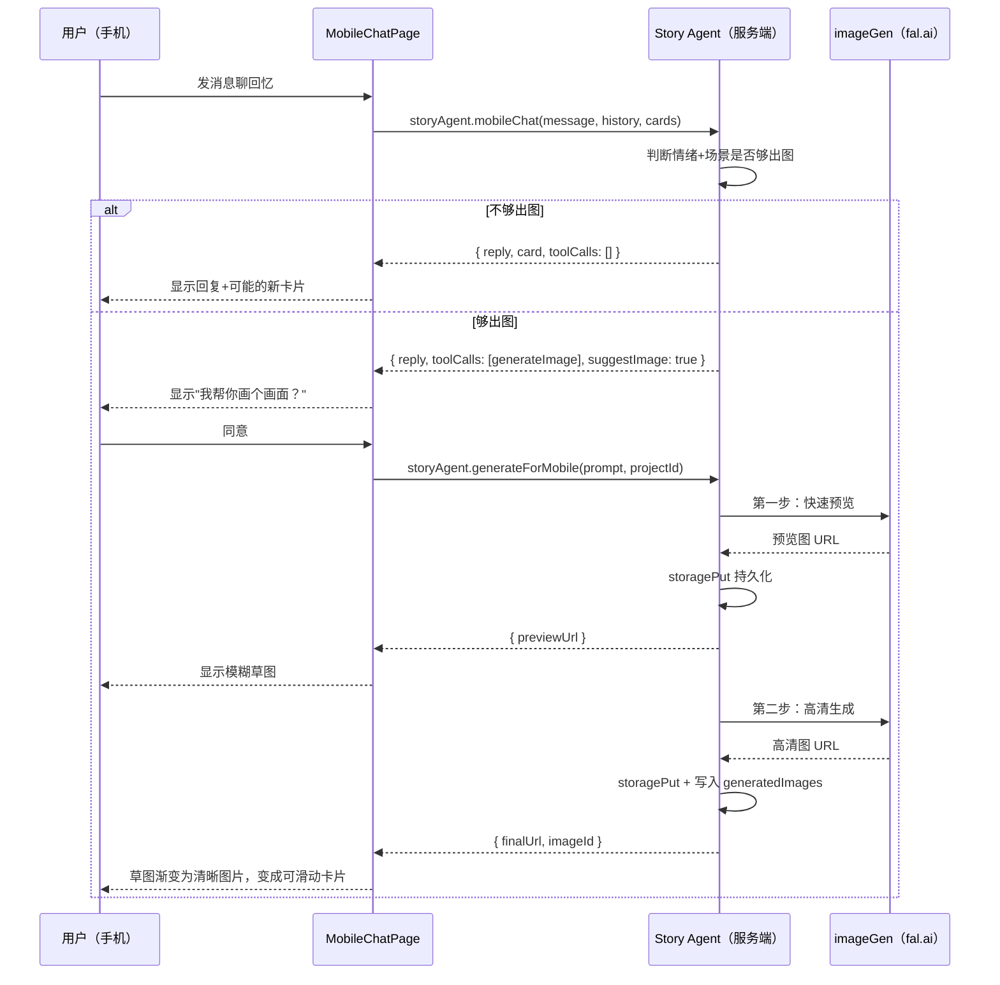

# feat: 手机端聊天出图体验

## Summary

在现有桌面端之上新增手机端体验层：扩展 Story Agent 的服务端函数，让小酌获得 `generateImage` 工具调用能力；通过 wouter 新增 `/m` 和 `/m/storyboard` 两条手机路由；用 framer-motion 的拖拽 API 构建左划/右划卡片手势；复用 fal.ai Flux 图像生成和 SAM 2 分割服务。手机端遵循 feature-module 架构模式，所有新组件放在 `features/mobileChat/` 下。

---

## Problem Frame

桌面端的 Creation Engine 是为导演/创作者设计的专业工作台，对于"只想回忆不想操作"的普通用户门槛太高。这类用户需要的是：打开手机，跟小酌聊，画面自然蹦出来。目前整个产品没有移动端适配、没有手势交互、小酌也没有出图能力。（详见 origin: `docs/brainstorms/2026-05-25-mobile-chat-image-experience-requirements.md`）

---

## Requirements

- R1. 手机端两个页面：聊天页 + 剧本故事版页
- R2. 小酌是唯一角色，不引入新 Agent
- R3. 手机端和桌面端共享同一套后端数据
- R4. 小酌根据情绪+场景丰富度主动提议出图
- R5. 图片生成期间先草图后清晰的渐进加载
- R6. 生成的图片以卡片形式支持左划（丢弃）和右划（收下）
- R7. 左划后小酌追问"哪里不对"收集负反馈
- R8. 用户可点击图片区域进入局部编辑
- R9. 局部编辑：AI 识别物体边界，只重生该区域
- R10. 局部编辑完成后可继续编辑或右划收下
- R11. 右划的图自动绑定到对应剧本台词（故事版帧）
- R12. 绑定关系由小酌从对话上下文推断
- R13. 同一台词可有多张图，最新收下的为主图
- R14. 每个用户动作（左划/右划/编辑）都作为信号记录
- R15. 剧本故事版页展示台词 + 对应图片
- R16. 故事版页支持全能编辑：改文字、拖拽调序、编辑图片、删除场景
- R17. 两个页面数据实时同步

**Origin actors:** A1（回忆者/用户）、A2（小酌/Story Agent）、A3（剧本+故事版页面）
**Origin flows:** F1（聊天中自然出图）、F2（左划丢弃+信号收集）、F3（局部编辑后右划）、F4（右划收下→绑定剧本）
**Origin acceptance examples:** AE1（covers R4,R5）、AE2（covers R6,R7）、AE3（covers R8,R9,R10）、AE4（covers R11,R12,R13）、AE5（covers R15,R16）

---

## Scope Boundaries

- 桌面端页面不做改动
- Creation Agent / CreationPage 不修改
- 视频生成或播放
- 语音输入
- 推送通知
- 原生 App 封装
- 图像版权合规

### Deferred to Follow-Up Work

- 语音输入作为后续增强
- 手机端和桌面端的实时双向同步（v1 用按需加载）
- 信号数据反馈到生成模型的算法优化

---

## Context & Research

### 相关代码和模式

- `server/archive/storyAgent.ts` — Story Agent 系统提示词 + 响应解析，扩展出图能力的主要修改目标
- `server/services/creationAgent.ts` — Creation Agent 的 `toolCalls` 模式是扩展 Story Agent 的参考模板
- `server/services/imageGen.ts` — fal.ai Flux 1.1 Pro Ultra，文字→图片，带断路器
- `server/services/segmentation.ts` — fal.ai SAM 2 点击分割，带断路器
- `server/routers.ts` — tRPC 路由，storyAgent 命名空间（line 554）和 creationAgent 命名空间（line 835）
- `client/src/features/storyAgent/StoryAgentContext.tsx` — 聊天状态管理，localStorage 持久化
- `client/src/features/creationAgent/views/ImageSegmentOverlay.tsx` — 点选编辑 UI（idle→segmenting→masked→inpainting 状态机）
- `client/src/features/creationAgent/views/CreationAgentChat.tsx` — 图片在聊天气泡内显示的模式
- `client/src/app/router/AppRouter.tsx` — wouter 路由，AuthGuard 模式
- `client/src/hooks/useMobile.tsx` — 已有的移动端检测钩子（768px 断点）
- `drizzle/schema.ts` — `generatedImages` 表（parentImageId 版本链、isCurrent、generationType）

### 架构约束

- 代码库有架构边界测试（`architecture-boundaries.test.ts`），手机端代码必须遵守 feature-module 模式
- 显示组件必须是 props-in、UI-out，不直接调用 tRPC
- 小酌的人格在 2026-05-19 改版中从"采样器"变成"陪伴者"——出图建议必须像朋友的自然提议
- fal.ai 返回的 URL 会过期，所有图片必须立刻通过 `storagePut` 持久化
- Story Agent 当前的 JSON 响应格式：`{ reply, card, read }`，需要扩展加入 `toolCalls`

---

## Key Technical Decisions

- **扩展 Story Agent 而非新建 Agent：** 在 `replyFromStoryAgent` 的返回类型中新增 `toolCalls` 和 `generatedImage` 字段，复用 Creation Agent 的工具调用模式。理由：需求明确小酌是唯一角色；新建 Agent 需要独立的对话历史和 context provider，复杂度翻倍。（see origin: Key Decisions — 小酌统一角色）

- **手机端用独立路由而非响应式断点：** `/m` 和 `/m/storyboard` 是独立页面，不是现有页面的媒体查询适配。理由：手机端和桌面端的交互逻辑完全不同（滑动卡片 vs 双面板），共用组件会导致条件分支过多。

- **渐进加载用两步生成实现：** 第一步用较小 aspect ratio 或降低步数快速出预览图（~3-5秒），第二步用完整参数替换为高清图。理由：fal.ai 不支持流式像素传输，progressive JPEG 需要服务端转码，两步生成最简单且复用现有 `generateImage` 函数。

- **framer-motion 做滑动手势：** 用 `motion.div` 的 `drag="x"` + `dragConstraints` + `onDragEnd` 实现左右滑动判定。理由：项目已安装 framer-motion 12.x，不需要引入新依赖；embla-carousel 更适合连续轮播而非单卡判定。

- **信号数据存为独立表：** 新建 `imageSignals` 表记录每次用户交互（swipe_left/swipe_right/edit/edit_position），而非在 `generatedImages` 上加字段。理由：信号是时序事件流，一张图可能有多次交互；和图片元数据混在一起会让表职责不清。

---

## Open Questions

### 已在规划中解决

- **导航形式：** 底部 tab 栏，两个 tab（聊天 / 故事版），用 framer-motion AnimatePresence 做切换动画
- **手势技术方案：** framer-motion drag API，不引入新库
- **渐进加载方案：** 两步生成（快速预览 + 高清替换）

### 留给实施阶段

- 小酌判断"出图时机"的具体提示词措辞——需要在实施中调试
- 两步生成的第一步具体参数（步数、尺寸）——需要实测 fal.ai 响应速度
- 信号数据具体如何影响后续生成——v1 先收集，算法优化是 follow-up

---

## Output Structure

```
client/src/
├── features/
│   └── mobileChat/
│       ├── MobileChatContext.tsx      # 手机端聊天+图片状态
│       ├── types.ts                   # 手机端专用类型
│       └── views/
│           ├── MobileChatPage.tsx     # 聊天页主组件
│           ├── MobileChatMessages.tsx # 消息列表
│           ├── ImageCard.tsx          # 可滑动的图片卡片
│           ├── MobileImageEdit.tsx    # 手机端局部编辑
│           ├── MobileStoryboard.tsx   # 故事版页主组件
│           ├── StoryboardScene.tsx    # 单个场景（台词+图片）
│           └── MobileTabBar.tsx       # 底部 tab 栏
├── pages/
│   └── MobilePage.tsx                # 手机端入口，包含 tab 路由
server/
└── archive/storyAgent.ts            # 扩展出图能力（修改）
drizzle/
└── schema.ts                        # 新增 imageSignals 表（修改）
```

---

## High-Level Technical Design

> *以下为方向性设计参考，不是实施规范。实施时应根据实际情况灵活调整。*



---

## Implementation Units

### U1. Story Agent 服务端扩展出图能力

**Goal:** 让 `replyFromStoryAgent` 能返回图像生成工具调用，新增手机端专用的聊天和出图 tRPC 端点。

**Requirements:** R2, R4, R12

**Dependencies:** 无

**Files:**
- Modify: `server/archive/storyAgent.ts`
- Modify: `server/routers.ts`
- Test: `server/archive/storyAgent.test.ts`

**Approach:**
- 在 `buildAgentSystemPrompt` 中新增出图判断指令块，仅在手机端调用时注入（通过参数 `enableImageGen: boolean` 控制）
- 扩展 `StoryAgentChatResult` 类型，新增 `toolCalls: ToolCall[]` 和 `generatedImage` 字段，复用 Creation Agent 的 `GenerateImageToolCall` 类型
- 在 `replyFromStoryAgent` 中解析 toolCalls，如果有 `generateImage` 则调用 `generateImage()` 并持久化结果
- 新增 tRPC 端点：`storyAgent.mobileChat`（包含出图能力的聊天）、`storyAgent.generateForMobile`（用户确认后触发图片生成）、`storyAgent.mobileSegment`（SAM 2 分割）、`storyAgent.mobileInpaint`（局部修复）
- 出图提示词风格：小酌用类似"我帮你画个画面？"的陪伴者语气提议，不是系统通知

**Patterns to follow:**
- `server/services/creationAgent.ts` 的 toolCalls 解析和 `generateImage` 执行模式
- `server/routers.ts` 的 `creationAgent.segment` 和 `creationAgent.inpaint` 端点模式

**Test scenarios:**
- Happy path: 发送含有明确场景描述的消息（"那天下午阳台上看夕阳"），Agent 返回 `toolCalls` 中包含 `generateImage`，图片 URL 有效且已持久化到 storage
- Happy path: 发送日常聊天消息（"今天好累"），Agent 返回空 `toolCalls`，不触发出图
- Edge case: `enableImageGen: false` 时，即使场景描述足够具体也不返回 `generateImage` toolCall（桌面端不受影响）
- Error path: fal.ai 断路器打开时，`generateImage` 返回 `{ status: 'error' }`，tRPC 端点返回友好错误消息而非崩溃
- Integration: mobileChat 端点调用完整链路：LLM → 解析 toolCalls → generateImage → storagePut → 写入 generatedImages 表 → 返回 imageUrl

**Verification:**
- `storyAgent.mobileChat` 端点可用，能正确区分"出图"和"不出图"场景
- 生成的图片已持久化，`generatedImages` 表有对应记录

---

### U2. 信号数据表

**Goal:** 新建 `imageSignals` 表，记录用户对图片的每次交互动作。

**Requirements:** R14

**Dependencies:** 无

**Files:**
- Modify: `drizzle/schema.ts`
- Modify: `server/db.ts`
- Modify: `server/routers.ts`
- Test: `server/db.test.ts`（如果存在）

**Approach:**
- 新增 `imageSignals` 表：`id`, `projectId`, `imageId`（关联 generatedImages）, `action`（enum: swipe_left / swipe_right / edit_start / edit_complete）, `metadata`（JSON，存编辑位置、描述、左划原因等）, `createdAt`
- 在 `server/db.ts` 中新增 `createImageSignal` 函数
- 新增 tRPC 端点 `storyAgent.recordSignal`

**Patterns to follow:**
- `drizzle/schema.ts` 中 `generatedImages` 表的定义模式
- `server/db.ts` 中 `createGeneratedImage` 的写入模式

**Test scenarios:**
- Happy path: 调用 `createImageSignal` 传入 swipe_right action + imageId，数据库成功写入一条记录
- Happy path: 同一张图片记录多次信号（先 edit_start，再 edit_complete，最后 swipe_right），三条记录都存在
- Edge case: metadata 为空对象 `{}` 时正常写入

**Verification:**
- `imageSignals` 表可通过 tRPC 端点写入
- 信号数据包含 projectId、imageId、action、metadata、createdAt

---

### U3. 手机端路由和入口页面

**Goal:** 新增手机端路由、入口页面、底部 tab 栏，搭建手机端的基础框架。

**Requirements:** R1, R3

**Dependencies:** 无

**Files:**
- Modify: `client/src/app/router/AppRouter.tsx`
- Create: `client/src/pages/MobilePage.tsx`
- Create: `client/src/features/mobileChat/views/MobileTabBar.tsx`
- Create: `client/src/features/mobileChat/types.ts`

**Approach:**
- 在 AppRouter 中新增 `/m` 和 `/m/storyboard` 路由，都指向 `MobilePage`，由 MobilePage 内部根据路由切换 tab
- MobilePage 包裹 StoryAgentProvider（复用现有的），底部固定 MobileTabBar（聊天 / 故事版 两个 tab）
- MobileTabBar 用 wouter 的 `useLocation` 控制激活状态
- 应用全局 viewport meta 标签确保手机端正确缩放

**Patterns to follow:**
- `client/src/pages/CreationPage.tsx` 的 provider 包裹模式
- `client/src/app/router/AppRouter.tsx` 的 AuthGuard 模式

**Test scenarios:**

Test expectation: none — 纯路由和布局搭建，无业务逻辑

**Verification:**
- 浏览器访问 `/m` 显示聊天 tab 激活的手机端页面
- 访问 `/m/storyboard` 显示故事版 tab 激活
- 未登录时被 AuthGuard 重定向到 `/login`

---

### U4. MobileChatContext 状态管理

**Goal:** 创建手机端聊天+图片状态管理 context，扩展现有 StoryAgentContext 的消息类型以支持图片。

**Requirements:** R3, R6, R13, R17

**Dependencies:** U1, U3

**Files:**
- Create: `client/src/features/mobileChat/MobileChatContext.tsx`
- Modify: `client/src/features/storyAgent/StoryAgentContext.tsx`（类型扩展）

**Approach:**
- MobileChatContext 包裹 StoryAgentContext，新增手机端专有状态：`pendingImage`（当前待确认的图片）、`imageSignals`（本次会话的交互历史）
- 扩展 StoryAgentContext 的 `ChatMessage` 类型，新增可选的 `generatedImage` 字段（复用 CreationAgent 的 `{ imageUrl, imageKey, shotNo, imageId }` 结构）
- 提供 `sendMobileMessage`（调用 mobileChat 端点）、`handleSwipeLeft`、`handleSwipeRight`、`recordSignal` 方法
- localStorage 持久化 key: `dt:mobileChat:${projectId}`

**Patterns to follow:**
- `client/src/features/creationAgent/CreationAgentContext.tsx` 的消息+图片状态管理
- `client/src/features/storyAgent/StoryAgentContext.tsx` 的 localStorage 持久化模式

**Test scenarios:**
- Happy path: `sendMobileMessage` 调用后，消息列表新增一条 user 消息和一条 assistant 消息；如果 assistant 带 generatedImage，该字段非空
- Happy path: `handleSwipeRight` 将 pendingImage 设为 null，并调用 `recordSignal` 写入 swipe_right 信号
- Happy path: `handleSwipeLeft` 将 pendingImage 设为 null，并调用 `recordSignal` 写入 swipe_left 信号
- Edge case: 页面刷新后从 localStorage 恢复消息列表和图片状态

**Verification:**
- MobileChatContext 可以发消息、处理图片状态、记录信号
- 状态在页面切换（聊天↔故事版）时保持

---

### U5. 聊天页消息列表和输入框

**Goal:** 构建手机端聊天 UI：消息气泡列表、输入框、自动滚动。

**Requirements:** R4, R7

**Dependencies:** U3, U4

**Files:**
- Create: `client/src/features/mobileChat/views/MobileChatPage.tsx`
- Create: `client/src/features/mobileChat/views/MobileChatMessages.tsx`

**Approach:**
- MobileChatPage 是聊天 tab 的主视图：顶部最小化标题栏、中间消息列表（flex-1 overflow-y-auto）、底部固定输入框
- MobileChatMessages 渲染消息气泡：用户消息靠右、小酌消息靠左，framer-motion 做入场动画
- 输入框用 textarea + 发送按钮，Enter 发送、Shift+Enter 换行
- 当小酌提议出图（reply 包含出图意愿的关键词），显示一个"好呀"按钮让用户一键确认
- 新消息到达时自动滚动到底部

**Patterns to follow:**
- `client/src/features/creationAgent/views/CreationAgentChat.tsx` 的消息列表和输入框模式

**Test scenarios:**
- Happy path: 发送消息后，消息列表新增用户气泡（靠右）和小酌回复气泡（靠左）
- Happy path: 小酌回复包含出图建议时，显示"好呀"确认按钮
- Edge case: 连续快速发送多条消息，消息顺序正确，滚动正常
- Edge case: 长消息不溢出屏幕，文字自动换行

**Verification:**
- 手机端聊天界面可以正常聊天
- 小酌的出图建议以自然的对话方式呈现

---

### U6. 可滑动的图片卡片

**Goal:** 图片生成后以可滑动卡片形式浮在对话上方，支持左划丢弃、右划收下。

**Requirements:** R5, R6, R7, R11, R14

**Dependencies:** U4, U5

**Files:**
- Create: `client/src/features/mobileChat/views/ImageCard.tsx`

**Approach:**
- ImageCard 用 `motion.div` + `drag="x"` 实现水平拖拽
- 拖拽位移超过屏幕宽度 30% 时判定为有效滑动：向右 = 收下，向左 = 丢弃
- 拖拽过程中卡片旋转倾斜（rotation = offsetX * 0.1），松手后回弹或飞出动画
- 右划收下：调用 `handleSwipeRight`，图片绑定到当前对话上下文的剧本台词
- 左划丢弃：调用 `handleSwipeLeft`，小酌追问"哪里不对"
- 渐进加载：图片先以 blur + 低分辨率显示（CSS `filter: blur(8px)`），高清图加载完成后渐变切换
- 卡片下方显示小提示文字："← 不对 · 收下 →"

**Patterns to follow:**
- framer-motion 的 `drag` + `onDragEnd` + `useMotionValue` 模式

**Test scenarios:**
- Covers AE2. 图片生成后卡片出现，用户左划 → 卡片飞出消失 → 小酌追问"哪里不对"
- Happy path: 右划超过 30% 宽度 → 卡片飞入右侧 → recordSignal 写入 swipe_right → pendingImage 清空
- Happy path: 拖拽不足 30% 松手 → 卡片回弹原位，不触发任何动作
- Edge case: 垂直滚动时不触发水平滑动判定（dragDirectionLock）
- Integration: 右划后 `generatedImages` 表中该图的 `isCurrent` 为 true

**Verification:**
- 图片卡片支持左右滑动，动画流畅
- 每次滑动都记录到 imageSignals 表

---

### U7. 手机端局部编辑

**Goal:** 用户点击图片卡片上的区域，进入局部编辑模式（SAM 2 分割 + Flux Fill 修复）。

**Requirements:** R8, R9, R10

**Dependencies:** U1, U6

**Files:**
- Create: `client/src/features/mobileChat/views/MobileImageEdit.tsx`

**Approach:**
- 用户长按或点击卡片上的图片，进入全屏编辑模式
- 编辑模式复用 `ImageSegmentOverlay` 的状态机逻辑（idle → segmenting → masked → inpainting），但 UI 为手机端全屏设计
- 点击位置归一化为 0-1 坐标，调用 `storyAgent.mobileSegment` 端点
- 分割蒙版以高亮覆盖层显示，底部弹出文本输入框让用户描述改动
- 确认后调用 `storyAgent.mobileInpaint`，新图替换当前图
- 编辑完成后返回卡片状态，用户可以继续编辑其他区域或滑动

**Patterns to follow:**
- `client/src/features/creationAgent/views/ImageSegmentOverlay.tsx` 的分割+修复 UI 流程

**Test scenarios:**
- Covers AE3. 点击图片中的树 → AI 识别并高亮树的边界 → 用户输入"应该是枯树" → 该区域重新生成 → 其余画面保留
- Happy path: 点击空白区域 → SAM 2 返回空蒙版 → 提示用户"没有识别到物体，请点击更具体的区域"
- Error path: 分割服务断路器打开 → 显示友好提示"稍后再试"，不崩溃
- Edge case: 修复完成后用户可以再次点击新图的另一个区域进行第二次编辑

**Verification:**
- 局部编辑功能在手机端全屏模式下正常工作
- 编辑后的新图替换旧图，旧图进入版本历史

---

### U8. 剧本故事版页面

**Goal:** 构建手机端的剧本+故事版页面，展示台词和对应图片，支持全能编辑。

**Requirements:** R15, R16, R17

**Dependencies:** U3, U4

**Files:**
- Create: `client/src/features/mobileChat/views/MobileStoryboard.tsx`
- Create: `client/src/features/mobileChat/views/StoryboardScene.tsx`

**Approach:**
- 垂直滚动布局：每个场景是一个卡片，上半部分是图片（点击可编辑），下半部分是台词文字（点击可编辑，contentEditable）
- 场景顺序调整：长按场景卡片触发拖拽排序（framer-motion Reorder.Group，复用 StoryCardsBoard 的模式）
- 删除场景：左划场景卡片或点击删除按钮
- 没有图片的场景显示空白占位 + "和小酌聊聊这个场景" 提示
- 页面数据从 StoryAgentContext 的 storyShots + generatedImages 组合而来

**Patterns to follow:**
- `client/src/features/storyAgent/views/StoryCardsBoard.tsx` 的 Reorder.Group 拖拽排序模式
- `client/src/features/analysis/views/ShotTable.tsx` 的 Shot 数据展示模式

**Test scenarios:**
- Covers AE4. 用户在聊天页右划收下一张图 → 切到故事版页面 → 对应台词下方显示该图
- Covers AE5. 三个场景各带图 → 拖拽第三个到第一个位置 → 顺序更新 → 修改第二个场景台词 → 文字保存 → 点击第一张图 → 进入编辑
- Happy path: 空状态（没有剧本/Shot 数据）显示引导文案"先和小酌聊聊你的故事"
- Edge case: 场景只有台词没有图片 → 显示占位图 + 引导跳转聊天

**Verification:**
- 故事版页面正确展示所有场景的台词和图片
- 编辑、排序、删除操作正常，数据和聊天页同步

---

## System-Wide Impact

- **Interaction graph:** Story Agent 的服务端函数新增出图分支，下游调用 `imageGen` 和 `segmentation` 服务。手机端新 tRPC 端点和桌面端的 storyAgent 端点共享同一个 `replyFromStoryAgent` 函数（通过 `enableImageGen` 参数区分）。
- **Error propagation:** fal.ai 服务故障时，断路器机制已存在（imageGen.ts / segmentation.ts）。手机端需要在 UI 层面友好提示，不让用户看到原始错误。
- **State lifecycle risks:** 手机端和桌面端读写同一个 localStorage key 空间（`dt:storyAgent:${projectId}`）。同一浏览器不会同时打开两个页面操作同一个 project，但刷新后数据一致性需要保证。
- **API surface parity:** 桌面端现有的 `storyAgent.chat` 端点不受影响。手机端新增的 `mobileChat`、`mobileSegment`、`mobileInpaint` 是独立端点。
- **Unchanged invariants:** Creation Agent 和 CreationPage 完全不变。桌面端 Analysis 页面不变。Story Agent 在桌面端的行为不变（`enableImageGen` 默认 false）。

---

## Risks & Dependencies

| 风险 | 应对 |
|------|------|
| fal.ai Flux 生成延迟 10-30 秒，手机端用户耐心较低 | 两步生成的预览图缓解等待焦虑；加载动画用模糊渐清晰而非转圈 |
| framer-motion drag 在某些手机浏览器上的触摸事件兼容性 | 使用 `touch-action: none` CSS 属性防止浏览器默认手势干扰；在主流机型上测试 |
| Story Agent 扩展出图后系统提示词变长，可能影响响应质量 | 出图相关指令仅在 `enableImageGen: true` 时注入，桌面端不受影响 |
| 两步生成增加 API 调用成本 | 第一步可以用较低步数/较小尺寸降低成本；必要时退化为单步生成 |
| 同一个 localStorage 被手机端和桌面端共同读写 | 手机端用独立路由，正常使用场景下不会同时操作；v1 接受这个风险 |

---

## Sources & References

- **Origin document:** `docs/brainstorms/2026-05-25-mobile-chat-image-experience-requirements.md`
- Related plan: `docs/plans/2026-05-21-001-feat-creation-engine-v1-plan.md`（Creation Engine 桌面端实施计划）
- Related requirements: `docs/brainstorms/2026-05-21-creation-engine-v1-requirements.md`
- Related code: `server/services/creationAgent.ts`（工具调用模式参考）
- Related code: `client/src/features/creationAgent/views/ImageSegmentOverlay.tsx`（点选编辑 UI 参考）
- Related code: `client/src/features/storyAgent/views/StoryCardsBoard.tsx`（拖拽排序参考）
