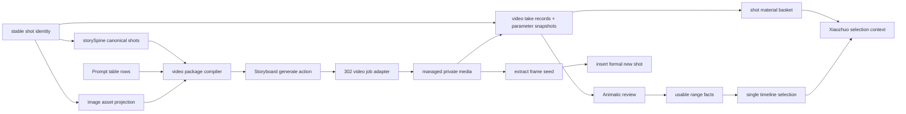
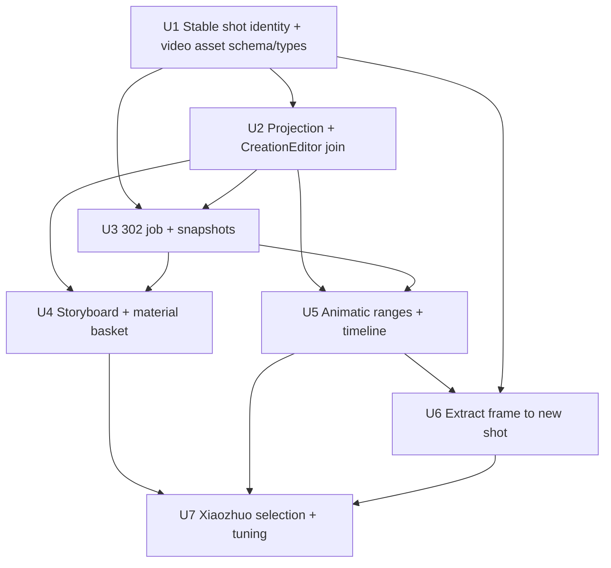

# feat: Add shot video takes and material basket workflow

## Summary

Build a story-scoped video asset layer that mirrors the existing image asset projection: Storyboard starts shot-level image-to-video generation, the prompt table supplies the video package, Animatic reviews the resulting video takes and usable ranges, and Xiaozhuo reads the same selection context and generation snapshots before suggesting changes.

---

## Problem Frame

The SH05/SH06 image-sync bug showed the core risk for the video phase: if Storyboard, Animatic, and the prompt table each interpret shots, images, prompts, and generation results differently, the user will again see assets in one panel that cannot be used in another. Video also adds a lifecycle that images do not have yet: a generated take may be only partly usable, may feed the timeline through a range, and may become the seed for a new shot through frame extraction.

This plan keeps the product behavior defined in `docs/brainstorms/2026-06-22-001-shot-video-material-basket-requirements.md` and focuses on the implementation shape that prevents another split-brain asset layer.

---

## Requirements

- P1. Storyboard, prompt table, Animatic, and Xiaozhuo must read one story-scoped shot and asset model for video work.
- P2. Storyboard must provide the shot-level video generation entry, but only after the shot has a traceable keyframe image and enough video package data.
- P3. The prompt table must remain the editing surface for video semantics: motion prompt, start/end state, transition, sound/subtitle meaning, and duration.
- P4. Generated videos must persist as video takes with canonical status, source image, prompt, model parameters, managed media key, and task metadata.
- P5. Generated video takes are candidates by default; the timeline uses an explicit selected full-take or usable-range segment, not blindly the latest successful take.
- P6. Animatic must let users play takes, mark usable start/end ranges, and set a range as the timeline segment without physically cutting a new mp4 in v1.
- P7. The first material library is a shot-local material basket containing current keyframe, references, video takes, usable ranges, extracted-frame seeds, and generation history.
- P8. Users can extract one frame or front/back frames from an extraction-capable video take and insert them as a formal new shot after the source shot.
- P9. Inserting a new shot must preserve stable internal identity and source metadata while display labels are re-numbered.
- P10. Xiaozhuo must understand current selection context across text, shot cards, images, video takes, ranges, and extracted frames.
- P11. Xiaozhuo must explain the backend parameters actually used for a generation and propose parameter or prompt adjustments after user feedback.
- P12. Every generation, range selection, and extraction operation must be traceable by storyId, shot identity, source asset, user, and parameter snapshot.
- P13. Stable shot identity is the primary key for generation, keyframes, video takes, usable ranges, timeline selections, extracted frames, and Xiaozhuo selection context; display `shotNo` is only a user-facing label.
- P14. Timeline selection is a single replaceable/clearable reference per story shot; ranges are reusable facts, not competing timeline truth.

**Origin actors:** A1 user, A2 Xiaozhuo, A3 Storyboard, A4 prompt table, A5 Animatic, A6 video model service.
**Origin flows:** F1 shot video generation, F2 Animatic review and usable range marking, F3 extract frame to new shot, F4 generation review and tuning.
**Origin acceptance examples:** AE1-AE5.

### Origin Traceability

| Plan requirement | Origin coverage |
|---|---|
| P1 | R1, R2, R3; F1-F4 |
| P2 | R4, R5, R6; AE1, AE2 |
| P3 | R4, R13; A4; F1 |
| P4 | R6, R13; AE1, AE5 |
| P5 | R7, R8; AE3 |
| P6 | R7, R8; AE3 |
| P7 | R9; F1-F3 |
| P8 | R10; AE4 |
| P9 | R11, R12; AE4 |
| P10 | R3, R14, R15; AE2, AE5 |
| P11 | R13, R14, R15; AE5 |
| P12 | R12, R13, R14; F4 |
| P13 | R11 and planning question about stable shot identity |
| P14 | R8; AE3 |

---

## Scope Boundaries

- First version does not build a global asset drawer or cross-shot drag-and-drop material library.
- First version does not physically trim mp4 files; it stores usable ranges and timeline references.
- First version does not build a professional multi-track editor, audio mixer, or transition renderer.
- First version does not batch-generate every shot in the film.
- First version does not let Xiaozhuo autonomously insert new shots without user choice or confirmation.
- First version does not expose every raw model field to ordinary users; Xiaozhuo explains a curated parameter snapshot.
- First version does not create an A/B experiment platform; parameter snapshots are for traceability, review, and comparison.

### Deferred to Follow-Up Work

- Real video trimming/export pipeline that creates derived mp4 files.
- Global material library and cross-shot asset reuse.
- Batch whole-story video generation.
- Multi-track timeline, audio mixing, rendered transitions, and final assembly export.
- Advanced model comparison and experiment management.

---

## Context & Research

### Relevant Code and Patterns

- `client/src/features/storyAgent/spine/storySpine.ts` and `client/src/features/storyAgent/spine/selectors.ts` hold canonical story shots for Storyboard and related panels.
- `client/src/features/storyAgent/views/StoryboardPanel.tsx` is a thin wrapper; `client/src/features/storyAgent/views/StoryCardsBoard.tsx` owns the `StoryboardReviewBoard` UI where users already edit intent, action, dialogue, camera movement, sound, transitions, rationale, and `videoPrompt`.
- `client/src/features/storyAgent/views/StoryImagesStrip.tsx` reads `storyAgent.storyImages`; generated image visibility is already based on the image asset projection rather than stale `story.body.mobileImages`.
- `client/src/features/creationEditor/CreationEditorContext.tsx` currently merges canonical shots, persisted story body, and `storyImages`; it already exposes `generateShotVideo`, but the result is not persisted as a shared take.
- `client/src/features/creationEditor/spine-bridge.test.ts` explicitly protects the boundary that Animatic and prompt table consume shared state through `useCreationEditor` instead of each panel independently querying story body/spine/tRPC.
- `client/src/features/creationEditor/views/AnimaticPlayer.tsx` already compiles a video recipe, validates keyframe readiness, calls `generateShotVideo`, and keeps a local `videoPreviewByShotNo`.
- `client/src/features/creationEditor/promptTable/videoRecipe.ts` compiles the video package from shot fields and prompt-table rows.
- `server/services/videoGen.ts` already wraps the 302 video call with env-driven model, submit path, poll path, image field, timeout, and injectable fetcher.
- `server/routers.ts` has `creationAgent.generateShotVideo`, which validates the selected keyframe image and calls `generateShotVideo`, but does not persist a video take.
- `shared/imageAsset.ts`, `server/services/imageAssets.ts`, and `client/src/features/creationAgent/imageAssetViewModel.ts` provide the image asset projection pattern to mirror for video.
- `server/services/storySync.ts` deletes image copies from `story.body` and preserves selected shot metadata on merge; video persistence must follow the same single-authority discipline.
- `client/src/features/storyAgent/StoryAgentContext.tsx` already has selection-edit plumbing for text and shot fields; this should be extended into a richer selected-object context instead of adding a second assistant.
- `client/src/features/creationAgent/CreationAgentContext.tsx` and `client/src/features/creationAgent/views/ShotImageWorkspace.tsx` already model a shot image workspace and floating Xiaozhuo chat for Creation.

### Institutional Learnings

- `docs/solutions/2026-06-13-故事为唯一单位-镜头按storyId.md`: story is the work unit; assets and shots must be scoped by `storyId` and `userId`, not by project-level display shot numbers alone.
- `docs/solutions/2026-06-13-多worktree环境数据分裂收敛.md`: local persistence follows the running cwd; verification should happen in the main repo service, and tests must not overwrite real `.webdev/local-persist.json`.
- `docs/plans/2026-06-13-001-feat-unified-image-asset-layer-plan.md`: image generation success is not user selection; asset projection separates pending, selected, rejected, primary, missing, and history states.
- `docs/plans/2026-06-18-001-refactor-agent-spine-first-cut-plan.md`: CreationEditor previously became another shot truth source; this plan must keep video fields attached to canonical story/asset projections rather than creating panel-local interpretations.
- `docs/codex-302-image-models-prompt.md`: 302 generation can be asynchronous and model-dependent; submit/poll/result handling should be env-driven, not hard-coded around one response shape.
- `server/routers.shot.test.ts`: story-scoped router tests already protect `storyId + userId` isolation; video take and extraction endpoints should follow the same security shape.

### External References

- Not used. The architecture is grounded in the repository's existing React, tRPC, Drizzle, story spine, and image asset patterns. 302 model details are treated as an implementation spike against the configured key.

---

## Key Technical Decisions

- **Video takes get their own persistent asset layer:** Store generated video results in DB-backed records and project them into `VideoTake` view models, mirroring image assets. Do not store video URLs as panel-local React state or as ad hoc fields inside each view.
- **Stable shot identity is a prerequisite, not a later extraction detail:** U1 introduces or preserves an immutable `stableShotId`/`shotIdentity` on story shots, updates merge keys to prefer it, and treats `shotNo` as a display label and legacy fallback only. Existing stories receive deterministic compatible identities, persist those identities before video writes, and then never rederive them from mutable shot order, display labels, or shot text.
- **Images join the same stable identity path:** Video can only be stable if source keyframes are stable. Image projection should add `shotIdentity` to `generated_images` or an equivalent asset mapping so keyframes, image signals, video takes, and usable ranges do not drift when display labels are re-numbered.
- **One durable video projection, many consumers:** `server/services/videoAssets.ts` and one story-scoped tRPC query shape are the authority for durable video takes, ranges, and timeline selections. Durable video state does not live in `StorySpineState`, `stories.body`, or component-local preview state; those layers may keep only transient focus and in-flight UI state.
- **Generation success creates a candidate take, not timeline truth:** `VideoTakeStatus` is canonical: `submitted | processing | available | failed | timeout | unfollowable`. Only an `available` take can become timeline material, and only after the user explicitly chooses a full-take segment or a usable range.
- **Video jobs use client-triggered refresh in v1:** Starting generation creates a take immediately in `submitted` state with an idempotency key and parameter snapshot, returns `takeId/status`, and never waits for a minutes-long provider poll. The UI calls a refresh mutation/query for submitted or processing takes; that refresh polls one provider task, updates persisted state to `processing`, `available`, `failed`, `timeout`, or `unfollowable`, then invalidates the video take projection. A server worker loop is follow-up work, not a v1 implementation option.
- **Timeline selection is separate from ranges:** Usable ranges are facts on takes; the selected timeline segment is one story-shot-level reference to a range or full take. Setting a new segment replaces the old one atomically. Clearing the selection removes timeline truth and falls back to the shot duration placeholder; it does not silently use the full take. Users must explicitly choose "use full take" when they want the whole video on the timeline.
- **Parameter snapshots are curated and explainable:** Persist model, endpoint family, duration, aspect ratio, source image id, managed object key or redacted URL metadata, prompt hash/text, used prompt dimensions, reference ids, submitted parameter fields, task id, and timing/status. Do not store secret keys, signed media URLs in Xiaozhuo-visible snapshots, or noisy provider internals.
- **`story.body` keeps shot semantics; video assets keep generation facts:** Prompt-table fields such as `videoPrompt`, `videoStart`, `videoEnd`, and `durationMs` remain shot metadata. Take URLs, task status, usable ranges, and parameter snapshots live in the video asset layer.
- **Successful v1 takes must be extraction-capable:** A successful provider output is copied into managed storage as a private media object and persisted as a managed key before the take is marked extraction-capable. `extractionUnavailable` is reserved for failed copies, legacy takes, or provider outputs that cannot be safely copied, not for the default happy path.
- **Managed media is private by default:** Store object keys rather than durable public URLs. Playback and frame access go through an authorization-checked route or short-lived signed URL after validating story/user ownership, and story deletion or rollback must delete or garbage-collect associated media objects.
- **Frame extraction uses staged storage plus transaction:** Extracted frame bytes land in temporary storage first, then DB/story insertion runs in one transaction or memory-mode equivalent, then the media key is promoted after commit. Failed or abandoned staging writes are cleaned up so no visible orphan image, half-inserted shot, or re-numbered display state remains.
- **Xiaozhuo works through an early shared contract and later richer behavior:** U1 defines the typed selection context, and U4 owns the minimal preflight suggestion/apply contract needed for generation readiness. U7 expands that same contract into parameter explanation, regeneration tuning, stale selection handling, and extracted-frame context.

---

## Open Questions

### Resolved During Planning

- Where should the primary video generation entry live? Storyboard/shot surface, with prompt-table data feeding the package and Animatic consuming results.
- Should v1 physically trim mp4 files? No; store usable start/end range metadata only.
- Should v1 build a global material library? No; use a shot-local material basket.
- Should video results be treated like images? Yes; use an asset projection with status and user signals/ranges rather than local-only preview state.
- Is stable shot identity required before video? Yes; it is a U1 prerequisite across shots, images, video takes, timeline selections, and selection context.
- Is video generation synchronous? No; the UI starts an observable take and advances job status through client-triggered refresh of persisted provider tasks.
- Is a usable range itself the timeline truth? No; timeline selection is a single replaceable/clearable reference per stable shot.
- Does clearing timeline selection use the full take? No; clearing removes timeline truth and falls back to the shot placeholder. Full-take use is an explicit selection.
- Can v1 extraction ship with default `extractionUnavailable` generated takes? No; successful new v1 takes must be copied to managed storage and marked extraction-capable unless copy or provider constraints fail.

### Deferred to Implementation

- 302 video model mapping: discover which model the current 302 key should use, supported duration/aspect/reference fields, submit/poll shapes, and failure statuses before freezing provider-specific adapters.
- Provider copy details: confirm returned URL shape, content type, max size, and whether the managed-storage copy must proxy through server fetch or provider export APIs.
- Frame extraction mechanics: confirm browser canvas and server-side extraction constraints for managed video URLs; if canvas is tainted, use a server-side extraction path or provider-generated frame export.

---

## High-Level Technical Design

> *This illustrates the intended approach and is directional guidance for review, not implementation specification. The implementing agent should treat it as context, not code to reproduce.*

---

## Implementation Units

### U1. Stable Shot Identity, Video Asset Schema, and Shared Types

**Goal:** Add stable shot identity as the cross-asset prerequisite, then add the persistent and shared type foundation for story-scoped video takes, usable ranges, timeline selections, parameter snapshots, and extracted-frame source metadata.

**Requirements:** P1, P4, P5, P7, P9, P12, P13, P14

**Dependencies:** None

**Files:**
- Create: `shared/videoAsset.ts`
- Modify: `shared/imageAsset.ts`
- Create: `shared/selectionContext.ts`
- Test: `shared/selectionContext.test.ts`
- Modify: `client/src/features/storyAgent/types.ts`
- Modify: `client/src/features/storyAgent/spine/storySpine.ts`
- Test: `client/src/features/storyAgent/spine/storySpine.test.ts`
- Modify: `client/src/features/storyAgent/views/StoryImagesStrip.tsx`
- Modify: `client/src/features/creationAgent/imageAssetViewModel.ts`
- Modify: `client/src/features/creationEditor/CreationEditorContext.tsx`
- Test: `client/src/features/creationEditor/creationEditor.routing.test.tsx`
- Modify: `server/services/imageAssets.ts`
- Modify: `server/services/storySync.ts`
- Test: `server/services/storySync.preserve-rationale.test.ts`
- Modify: `server/routers.ts`
- Modify: `drizzle/schema.ts`
- Create: next Drizzle migration under `drizzle/`
- Modify: `server/db.ts`
- Test: `server/db.videoAssets.test.ts`
- Test: `shared/videoAsset.test.ts`

**Approach:**
- Add `stableShotId`/`shotIdentity` to story shots with a deterministic compatibility backfill for old stories and immutable ids for new inserted shots.
- Define the identity backfill contract explicitly: old stories receive persisted stable ids before any video write, the compatibility id is seeded from existing persisted shot position plus original display label only for the first backfill, collisions get deterministic suffixes, and later loads read the persisted id rather than rederiving it from mutable order, labels, or text.
- Update shot normalization and `storySync.ts` merge behavior to key by stable identity first, with `shotNo` only as legacy fallback.
- Add a stable shot identity field to `generated_images` or an equivalent story image mapping, and update `server/services/imageAssets.ts`, `storyAgent.storyImages`, `StoryImagesStrip`, and `imageAssetViewModel` to prefer `shotIdentity` before `canonicalShotNo`.
- Define `VideoTakeStatus` once in `shared/videoAsset.ts` as `submitted | processing | available | failed | timeout | unfollowable`; do not introduce `pending` or `queued` aliases.
- Add `video_takes` with story/user ownership, stable shot identity, source image id, managed video object key, extraction capability, canonical status, task id, duration, aspect ratio, prompt, provider/model metadata, idempotency key, parameter snapshot JSON, safe error message, and timestamps.
- Add `video_take_ranges` keyed to a take, with start/end seconds, label, source, and timestamps.
- Add a separate `video_timeline_selections` table or equivalent single-reference model keyed by `storyId + userId + stableShotId`, pointing to a take/range/full-take selection.
- Add source metadata for extracted frames either in the inserted shot payload or an associated source JSON field, including source shot identity, take id, timestamp, frame image id, and Xiaozhuo/user reason.
- Define `shared/selectionContext.ts` here with the minimal typed shapes needed by U4/U5/U7: text, shot field, keyframe image, video take, usable range, timeline segment, and extracted-frame seed.
- Mirror image asset helpers with canonical status normalization, range validation, and safe serialization.
- Declare FK-vs-soft-association strategy explicitly. If following the current soft-association style, service functions must validate `storyId + userId + takeId/sourceImageId/stableShotId` before writes.
- Add indexes for story/user/status lookup, take/range lookup, source image lookup, and per-shot timeline selection replacement.
- Add an idempotency uniqueness boundary for generation and extraction operations, scoped by `userId + storyId + stableShotId + idempotencyKey` for generation and by `userId + storyId + takeId + frameSelection + insertionTarget` for extraction.
- Define private media storage at the type/schema boundary: records store managed object keys, not durable public URLs; public/signed playback URLs are derived by authorized service routes and excluded from default serialized snapshots.
- Include full memory adapter support in `server/db.ts`: old JSON without video arrays defaults to empty arrays, dates normalize back to `Date`, `nextIds` include video rows, and `deleteStory` clears video rows/ranges/selections.
- Do not put secrets, signed media URLs, raw provider request/response bodies, or full unrestricted provider internals into snapshots; store model/config names, prompt inputs, managed keys/redacted URL metadata, and submitted parameter values that Xiaozhuo can safely explain.

**Execution note:** Characterization-first for local persistence: add memory adapter tests before adding router behavior so schema evolution does not silently lose video rows.

**Patterns to follow:**
- `shared/imageAsset.ts`
- `server/services/imageAssets.ts`
- `drizzle/schema.ts` generated image and image signal rows
- `server/db.ts` memory-state normalization and local persistence safety net
- `server/services/storySync.ts` field-preserving merge behavior

**Test scenarios:**
- Happy path: old story shots without stable ids load with compatible identities and save without changing user-visible `shotNo`.
- Happy path: two clients loading the same old story before and after identity persistence produce the same stable ids.
- Happy path: `storySync.ts` preserves prompt/video fields by stable identity after a new shot is inserted and display `shotNo` values shift.
- Happy path: image projection attaches a keyframe to the same stable identity before and after display re-numbering.
- Happy path: `ImageAsset` carries `shotIdentity`, and Storyboard/Creation image workspaces group images by it before falling back to display shot number.
- Happy path: creating a take for `storyId=28`, the stable identity behind display label `SH06`, source image id, prompt, and parameter snapshot returns a serialized `available` candidate take.
- Happy path: creating a usable range `1.2s-3.4s` for the take stores seconds precisely and can be marked as the timeline segment.
- Happy path: setting a timeline selection for the same stable shot replaces the previous selection instead of leaving two active timeline truths.
- Happy path: serialized `VideoTakeStatus` accepts only `submitted`, `processing`, `available`, `failed`, `timeout`, or `unfollowable`.
- Edge case: invalid ranges with negative start, end before start, or end beyond known duration are rejected or normalized according to the helper contract.
- Edge case: shot display number changes after insertion but source metadata still points to the original stable shot identity and take id.
- Error path: failed generation persists canonical status, task id if present, safe error message, and parameter snapshot without a managed media key.
- Security path: take serialization excludes signed URLs and serves media only through authorized playback or short-lived URL helpers.
- Integration: local memory persistence reloads video takes/ranges without losing date fields or ownership fields.
- Integration: local memory persistence with an old `.webdev/local-persist.json` shape defaults video arrays and ids safely without writing the real file during tests.
- Integration: deleting a story removes or hides its video takes, ranges, timeline selections, and schedules/deletes associated managed media objects from subsequent story queries.

**Verification:**
- Stable shot identity tests prove display re-numbering cannot move existing image/video/range metadata to a different shot; video asset tests prove create/read/update behavior in memory mode and safe serialization through shared helpers.

---

### U2. Video Take Projection and CreationEditor Data Join

**Goal:** Expose one story-scoped video asset projection to Storyboard, Animatic, prompt table, material basket, and Xiaozhuo instead of local per-panel video previews.

**Requirements:** P1, P4, P5, P6, P7, P12, P13, P14

**Dependencies:** U1

**Files:**
- Create: `server/services/videoAssets.ts`
- Test: `server/services/videoAssets.test.ts`
- Modify: `server/routers.ts`
- Create: `client/src/features/creationEditor/videoAssetViewModel.ts`
- Test: `client/src/features/creationEditor/videoAssetViewModel.test.ts`
- Modify: `client/src/features/creationEditor/CreationEditorContext.tsx`
- Test: `client/src/features/creationEditor/creationEditor.routing.test.tsx`
- Test: `client/src/features/creationEditor/spine-bridge.test.ts`
- Test: `client/src/features/creationEditor/videoAssets.test.ts`

**Approach:**
- Add service functions that project DB rows into `VideoTakeAsset` records grouped by story and stable shot identity, including status, latest range, timeline segment, source image, parameter snapshot summary, and availability.
- Add one story-scoped lightweight tRPC query for projected `VideoTakeAsset` summaries and mutations for range/timeline updates under an existing router boundary that validates `getStoryById(storyId, userId)`.
- Add lazy detail queries for per-shot take history and full parameter snapshots so a range edit does not refetch full snapshots for unrelated shots.
- Extend `CreationEditorShot` with video take summaries and selected timeline segment references, while keeping shot semantics in canonical shots/story body.
- Use `videoAssetViewModel.ts` as the shared presentation helper for candidate/failed/processing/timeline/range display state in both `ShotMaterialBasket` and Animatic; keep layout-only mapping inside the surface components.
- Keep Animatic and prompt-table panels behind `CreationEditorContext`; do not let either panel add direct story/video tRPC reads that bypass the shared projection.
- Do not add durable video takes to `StorySpineState`, `stories.body`, or `AnimaticPlayer` local state; those layers may store only current focus, selected take id, and in-flight UI flags.
- Replace `AnimaticPlayer` local `videoPreviewByShotNo` as the durable source of truth; local state can still track in-flight UI, but persisted takes must come from the query.
- Invalidate/refetch story video takes after generation, range changes, extraction, and selection actions.

**Patterns to follow:**
- `server/services/imageAssets.ts`
- `client/src/features/creationEditor/CreationEditorContext.tsx` story image query and merge flow
- `client/src/features/creationEditor/creationEditor.routing.test.tsx`
- `client/src/features/creationEditor/spine-bridge.test.ts`

**Test scenarios:**
- Happy path: story video take query returns only takes for the current story and user.
- Happy path: a generated take attached to SH06 appears in the `CreationEditorShot` for SH06 after query merge.
- Edge case: canonical shots are present before story body loads; video take projection still attaches by stable identity when active story id matches.
- Edge case: rejected/failed takes are visible in material basket history but not selected as the timeline segment.
- Edge case: a stable shot has multiple ranges across multiple takes; projection returns all ranges and exactly one selected timeline segment.
- Edge case: story summary query omits full raw parameter snapshots; per-shot/take detail loads history on demand.
- Error path: querying a story owned by another user returns no takes or an authorization error through the router boundary.
- Integration: `generateShotVideo` mutation invalidates the take query and Animatic reads the persisted take after refetch instead of local preview state.
- Integration: range/timeline update refetches the affected shot summary without refetching unrelated full take histories.
- Architecture guard: Animatic and prompt table still do not import `trpc.storyAgent.storyGet`, `trpc.storyAgent.storyImages`, or `useStorySpine` directly.
- Architecture guard: no durable `VideoTakeAsset` arrays are introduced into `StorySpineState` or `stories.body`.

**Verification:**
- CreationEditor routing tests cover canonical shots, story images, and video takes joining to the same selected shot list.

---

### U3. 302 Video Generation Job Lifecycle and Parameter Snapshot Persistence

**Goal:** Turn the existing 302 video call into a traceable submit/poll/persist lifecycle that creates video takes and exposes the backend parameters Xiaozhuo can later explain.

**Requirements:** P2, P3, P4, P11, P12, P13

**Dependencies:** U1, U2

**Files:**
- Modify: `server/services/videoGen.ts`
- Test: `server/services/videoGen.test.ts`
- Create: `server/services/videoJobs.ts`
- Test: `server/services/videoJobs.test.ts`
- Create: `server/services/mediaIngestion.ts`
- Test: `server/services/mediaIngestion.test.ts`
- Modify/Create: managed video storage helpers or route under the existing server storage boundary
- Modify: `server/routers.ts`
- Test: `server/routers.video.test.ts`
- Test: `server/routers.shot.test.ts`
- Modify: `client/src/features/creationEditor/CreationEditorContext.tsx`

**Approach:**
- Preserve the existing env-driven `generateShotVideo` adapter, but return a normalized job result that includes submitted parameters, task id, provider status, timing, and safe raw-shape hints.
- Add a video job service that validates story ownership, validates the selected image belongs to the stable shot identity, materializes the source image, builds a curated parameter snapshot, creates a `submitted` take with an idempotency key, then calls the provider adapter.
- Define the v1 idempotency protocol before wiring UI: the client supplies an operation id for a button attempt, the server scopes it by `userId + storyId + stableShotId + idempotencyKey`, and a unique constraint or service-level check returns the existing take on double-click or network retry.
- Return `takeId/status` promptly to the frontend. Add `refreshVideoTakeStatus` as the v1 status driver: it polls one provider task, advances the persisted take, and is called by UI polling/manual refresh for `submitted` or `processing` takes. Do not implement long request polling or a background worker in v1.
- On task-id response, update the existing take with task id and `processing` status before any refresh poll step.
- Treat a task-id response without poll configuration as an `unfollowable` take with a clear status instead of a throwaway error.
- Persist provider failures, poll timeouts, and update failures as take state transitions. Older usable ranges and timeline selections must remain unchanged.
- Copy successful provider video output into managed storage before marking a new v1 take extraction-capable. If copy fails or the provider output cannot be safely copied, mark the take `available` only when playback is safe and `extractionUnavailable` with a clear reason.
- Add provider URL ingestion controls before copying: allow only HTTPS URLs from configured provider/storage host allowlists, reject private/link-local/loopback DNS resolutions and unsafe redirects, stream with size/content-type/timeout limits, and store only the managed object key on the take.
- Keep provider-specific fields behind an adapter so changing 302 model/endpoint does not require changing UI contracts.
- Add a one-time implementation spike step before final wiring: use the configured 302 key to identify model id, image field, duration/aspect support, poll path, success/failure shapes, and whether returned URLs need copying.
- Add stale submitted/processing reconciliation: refresh may transition old tasks to `timeout` after configured age, and a user-visible refresh action can retry status lookup without submitting a duplicate provider job.
- Log IDs, status, timing, and coarse error classes only; never log API keys, signed media URLs, full prompts, raw provider request/response bodies, parameter snapshots, or media bytes.

**Patterns to follow:**
- `server/services/videoGen.ts`
- `server/services/imageGen.ts`
- `server/services/imageAssets.ts` `materializeImageInput`
- `server/services/creationAgent.ts` normalized action result style

**Test scenarios:**
- Happy path: direct video URL result creates an `available` take with source image id, prompt, model, duration, aspect ratio, task metadata, and safe parameter snapshot.
- Happy path: task-id plus `refreshVideoTakeStatus` poll success creates the same take after refresh.
- Happy path: generation mutation creates a `submitted` take and returns `takeId/status` before a long-running provider result is complete.
- Happy path: submitted take remains visible in Storyboard material basket and Animatic after page refresh.
- Happy path: successful provider output is copied to managed storage, take stores a managed object key, and extraction capability is true.
- Edge case: model is not configured; no take with managed media key is created, and the user-facing error remains clear.
- Edge case: poll path is missing; the system preserves task id/status as `unfollowable` so the user can see the job was submitted but cannot be followed.
- Edge case: repeated clicks, network retry after provider submit, and refresh/retry with the same idempotency key do not create duplicate uncontrolled submitted takes.
- Edge case: stale `submitted` or `processing` tasks transition to `timeout` through refresh without clearing old timeline selections.
- Security path: provider output copy rejects non-HTTPS URLs, disallowed hosts, private IP redirects, over-limit payloads, and non-video content types.
- Error path: provider failure creates a failed take with snapshot and error, without clearing older usable takes.
- Error path: source image does not belong to the story/shot; mutation refuses generation.
- Security path: a user cannot generate or read a video take by guessing another user's `storyId`, `imageId`, or take id.
- Integration: provider succeeds but DB update fails; the previous timeline segment remains selected and a recoverable take state or error is visible.
- Integration: router response includes the persisted take id so frontend can focus the new take.

**Verification:**
- Server tests prove the job lifecycle can explain what parameters were used even when the provider fails.

---

### U4. Storyboard Generation Entry and Shot Material Basket

**Goal:** Make Storyboard the smooth generation surface and add the first shot-local material basket for keyframe, references, video takes, usable ranges, extracted-frame seeds, and generation history.

**Requirements:** P2, P3, P4, P7, P10, P11

**Dependencies:** U1, U2, U3

**Files:**
- Modify: `client/src/features/storyAgent/views/StoryboardPanel.tsx`
- Modify: `client/src/features/storyAgent/views/StoryCardsBoard.tsx`
- Modify: `client/src/features/storyAgent/views/StoryImagesStrip.tsx`
- Create: `client/src/features/storyAgent/views/ShotMaterialBasket.tsx`
- Modify: `client/src/features/creationEditor/promptTable/videoRecipe.ts`
- Test: `client/src/features/creationEditor/promptTable/videoRecipe.test.ts`
- Modify: `client/src/features/creationAgent/types.ts`
- Modify: `client/src/features/creationAgent/views/FloatingAgentChat.tsx`

**Approach:**
- Reuse `compileVideoShotRecipe` as the contract for the video package, but expose missing package items in Storyboard: keyframe image, video prompt, motion direction, duration, start/end state, transition, sound/subtitle meaning, and relevant references.
- Add a generate button and preflight state in `StoryboardReviewBoard` near each shot's storyboard card or detail area, not as a hidden Animatic-only action.
- Show the shot material basket on the selected shot: current keyframe, candidate keyframes/reference images, video takes, usable ranges, failed jobs, extracted frame seeds, and parameter snapshot summary.
- Keep image inputs sourced from the existing story image projection; do not resurrect `story.body.mobileImages` as a video keyframe source.
- Add a Storyboard preflight matrix:
  - no keyframe: ask the user to select or generate a keyframe, no Xiaozhuo text patch can bypass it;
  - keyframe without traceable image id: ask the user to choose a traceable image asset or persist the image first;
  - missing video prompt, motion direction, duration, transition, or sound/subtitle meaning: route into Xiaozhuo's preflight suggestion contract;
  - optional references available but unselected: show as optional candidates, not a hard block;
  - provider config unavailable: block generation with setup/status copy;
  - existing `submitted` or `processing` take: show status and refresh/cancel/retry affordance rather than creating another uncontrolled job.
- If the package is incomplete in a text/semantic way, route the user into a Xiaozhuo suggestion flow rather than submitting a weak generation. The suggestion state must distinguish pending suggestion, accepted field patch, ignored suggestion, suggestion error, and whether acceptance should auto-continue generation or return the user to the generate button.
- Implement the minimal Xiaozhuo preflight contract in this unit: `suggest-video-package-fill` and `apply-shot-field-update` can propose and apply confirmed shot-field patches without waiting for U7's full parameter-tuning work.
- Use the shared `videoAssetViewModel.ts` from U2 for take status labels and actions in the basket.
- Add a take-status affordance matrix for the basket: each canonical status defines label, primary action, disabled actions, refresh/retry path, whether it can be selected for Xiaozhuo context, and whether it can be used as a timeline segment.
- Clicking a take, usable range, or extracted-frame seed in the basket should update the shared selection context so Xiaozhuo knows which object the user is asking about.
- Keep Storyboard and Animatic reading the same video take query/projection.

**Patterns to follow:**
- `client/src/features/storyAgent/views/StoryCardsBoard.tsx`
- `client/src/features/creationAgent/views/ShotImageWorkspace.tsx`
- `client/src/features/creationEditor/promptTable/videoRecipe.ts`

**Test scenarios:**
- Covers AE1. Given SH06 has a current keyframe and video prompt, clicking generate from Storyboard creates a video take that appears in the shot material basket and Animatic.
- Covers AE2. Given SH06 lacks `videoPrompt`, Storyboard shows missing package state and surfaces Xiaozhuo suggestion instead of submitting generation.
- Covers AE2. Given SH06 lacks a traceable keyframe, Storyboard asks the user to select or persist a keyframe and does not route the issue to Xiaozhuo text suggestion as if it were a prompt-only gap.
- Covers AE2. Accepting Xiaozhuo's suggested `videoPrompt` and motion fields writes only the confirmed fields, then either resumes generation when the user chose that path or leaves the generate button enabled for a second click.
- Covers AE2. Ignoring Xiaozhuo's suggestion leaves generation blocked and preserves the user's existing shot fields.
- Error path: Xiaozhuo suggestion fails; Storyboard keeps the preflight blocked state and shows a retryable error.
- Happy path: basket groups video takes, usable ranges, and extracted-frame seeds under the selected shot.
- Happy path: clicking a basket take sends selection context containing story id, stable shot id, take id, status, and parameter snapshot summary.
- Happy path: preflight display includes the same transition and sound/subtitle semantics that the prompt table owns.
- Happy path: submitted/processing/available/failed/timeout/unfollowable takes render distinct basket affordances and never let an unavailable take become a timeline segment.
- Edge case: a failed take remains visible as history but does not displace the latest usable segment.
- Edge case: a keyframe exists only through `promptRun.imageUrl`; preflight treats it as a usable image only when it has a traceable image id or requires selection otherwise.
- Error path: generation failure shows the persisted failure/error state and keeps prior takes intact.

**Verification:**
- Frontend tests prove Storyboard and Animatic render from the same persisted take projection.

---

### U5. Animatic Take Review, Usable Ranges, and Timeline Segments

**Goal:** Convert Animatic from an image preview player into a video review surface where users can play takes, mark usable ranges, and set the timeline segment per shot.

**Requirements:** P5, P6, P7, P10, P12, P14

**Dependencies:** U1, U2, U3

**Files:**
- Modify: `client/src/features/creationEditor/views/AnimaticPanel.tsx`
- Modify: `client/src/features/creationEditor/views/AnimaticPlayer.tsx`
- Modify: `client/src/features/creationEditor/views/Timeline.tsx`
- Test: `client/src/features/creationEditor/playback.test.ts`

**Approach:**
- Display the selected video take when a shot has one; fall back to keyframe/image preview and current empty states when it does not.
- Add take chooser/history within the Animatic shot view, using candidate/failed/timeout/unfollowable/timeline states from the shared projection and `videoAssetViewModel.ts`.
- Add a take-status affordance matrix matching the Storyboard basket: playable statuses, disabled timeline actions, refresh/retry paths, Xiaozhuo-selectable states, and parameter-explanation availability must be consistent across panels.
- Add range controls for start/end seconds with stable constraints based on known take duration; persist changes through the range mutation.
- Add explicit actions to use a range on the timeline, use a full take on the timeline, replace the current segment with another take/range, and clear the timeline segment.
- Define the timeline fallback matrix: no take -> shot duration placeholder; available take with no explicit timeline selection -> preview only, timeline remains prior selected segment or shot placeholder; explicit full-take selection -> `0..duration`; explicit range selection -> range duration; clear selection -> remove timeline truth and show shot placeholder; failed/timeout/unfollowable take -> not playable and cannot become a timeline segment.
- Treat range mutation and timeline-selection mutation as optimistic only when rollback is implemented; failed saves must restore the previous selected segment/range in UI.
- Selecting a take or range in Animatic should update the shared selection context, and deleting/invalidating it should clear or mark the selection stale.
- Update Timeline to show the selected video segment duration and label while still supporting shot duration before video exists.
- Add accessibility contracts for take chooser, range controls, and timeline actions: keyboard adjustment, ARIA labels/live status, linked error text, minimum touch targets, and focus restoration after failed mutations.
- Ensure playback and selection state do not resize or scramble the timeline.

**Patterns to follow:**
- `client/src/features/creationEditor/views/Timeline.tsx`
- `client/src/features/creationEditor/playback.ts`
- Existing UI density in `AnimaticPanel`

**Test scenarios:**
- Covers AE3. Given a 5s take, marking 1.2s to 3.4s persists a range and timeline displays a 2.2s segment without creating a new mp4.
- Happy path: choosing a different take updates the video player but does not change the timeline until the user sets a range.
- Happy path: setting a full-take segment uses `0` to take duration when no custom range exists.
- Happy path: setting a new range from another take replaces the previous timeline segment for that stable shot.
- Happy path: clearing the timeline segment removes timeline truth and falls back to the shot duration placeholder, not full take.
- Edge case: start cannot move beyond end and end cannot move below start.
- Edge case: failed, timeout, unfollowable, or missing media-key takes are not playable but remain visible as history.
- Accessibility path: keyboard users can adjust range start/end, trigger use/replace/clear actions, perceive mutation status, and keep focus after save failure.
- Error path: range or timeline selection mutation fails; the old selected segment remains visible and no partial local selection is left behind.
- Integration: selecting an Animatic range and asking Xiaozhuo includes range id, take id, stable shot id, timing, and adjacent-shot context in the chat request.
- Integration: selecting a timeline card still synchronizes selected shot across Animatic, Storyboard, and prompt table.

**Verification:**
- Animatic tests and browser verification show SH05/SH06 style cases use the same shot/image/video source across panels.

---

### U6. Extract Frame to Formal New Shot

**Goal:** Let users extract one frame or a front/back frame pair from an existing video take and insert a formal new shot after the source shot with traceable source metadata.

**Requirements:** P8, P9, P10, P12, P13

**Dependencies:** U1, U2, U5

**Files:**
- Create: `client/src/features/creationEditor/video/frameExtract.ts`
- Test: `client/src/features/creationEditor/video/frameExtract.test.ts`
- Modify: `server/routers.ts`
- Modify: `server/db.ts`
- Create: `server/services/shotInsertion.ts`
- Test: `server/services/shotInsertion.test.ts`
- Modify: `client/src/features/creationEditor/CreationEditorContext.tsx`
- Modify: `client/src/features/storyAgent/spine/storySpine.ts`
- Test: `client/src/features/storyAgent/spine/storySpine.test.ts`

**Approach:**
- Add frontend extraction helpers for selecting a timestamp and producing image bytes when the managed video source allows canvas extraction.
- Add an extraction interaction state machine: choose timestamp, choose single/front-back mode, extracting/loading, source unavailable, frame preview, Xiaozhuo suggestion loading/error/accepted/ignored, confirm insertion, inserting, success focus on inserted shot, and failure with original shot order/selection preserved.
- Require the selected take to expose an extraction-capable managed source. If only a temporary or CORS-tainted URL exists, block extraction with a clear action path instead of attempting a flaky canvas read.
- Add a server mutation that validates the take, validates extracted frame bytes, stages the image media, creates source metadata, inserts a new shot after the source shot, and reorders display shot numbers.
- Validate extracted frame uploads server-side before storage promotion: authenticated story/take ownership, max byte size, MIME sniffing, allowed raster formats only, dimension limits, decode/re-encode to safe image format, checksum/idempotency handling, and rejection of SVG/HTML or malformed payloads.
- Run the server mutation inside a transaction or memory-mode equivalent transaction for DB/story state: generated image row, shot insertion, display re-numbering, source metadata, and related projection refresh must succeed or fail together.
- Use staged storage around the transaction: write temporary media keys first, promote keys only after commit, and cleanup failed or abandoned staged writes.
- Use an idempotency key based on take id, timestamp/frame selection, and insertion target so repeated submissions do not insert duplicate shots.
- Preserve source metadata in the new shot: source story id, source shot identity/display label, source take id, timestamp(s), image id(s), and reason.
- Return the updated ordered shots and story revision from the mutation, then update `useStorySpine.setStoryShots` or the owning StoryAgentContext action, invalidate storyGet/storyImages/videoTakes, and reselect the inserted shot so Storyboard, prompt table, and Animatic see the inserted shot immediately even when canonical spine shots were already loaded.
- Use Xiaozhuo-generated suggestions for new shot intent/action/duration only after user confirmation.

**Patterns to follow:**
- `client/src/features/creationEditor/video/frameCrop.ts`
- `client/src/features/storyAgent/storyCardDeletion.ts`
- `server/services/storySync.ts` field-preserving merge behavior
- `server/services/shotPromptComposer.ts`

**Test scenarios:**
- Covers AE4. Extracting SH06 take at 2.4s inserts a new formal shot after SH06, old SH07 displays as SH08, and source metadata is preserved.
- Happy path: front/back frame extraction stores two source frame references for the inserted shot.
- Happy path: user previews extracted frame(s), accepts or ignores Xiaozhuo's suggested new-shot fields, confirms insertion, and lands focused on the new shot.
- Edge case: extraction is blocked with a clear error when the managed video source cannot be read by canvas and no server fallback is configured.
- Edge case: inserted shot receives a stable identity distinct from display `shotNo`.
- Edge case: repeated extraction submit for the same take/timestamp/target returns the existing inserted result or refuses duplication.
- Edge case: malformed, oversized, non-raster, or SVG/HTML frame payloads are rejected before storage.
- Integration: after insertion, Storyboard, prompt table, and Animatic all render the same new shot order.
- Integration: a server-inserted body shot is visible even when canonical spine shots were already loaded before the mutation.
- Error path: server rejects extraction if the take does not belong to the current story/user.
- Error path: staged image storage succeeds but shot insertion fails; staged media is cleaned up and no visible orphan image, half-inserted shot, or re-numbered display state remains.
- Error path: any later metadata/range refresh step fails; transaction rolls back or the failure is explicitly recorded without changing timeline truth.

**Verification:**
- Tests prove insertion does not orphan existing images, video takes, or timeline ranges when display labels are re-numbered.

---

### U7. Xiaozhuo Selection Context, Parameter Explanation, and Confirmed Tuning

**Goal:** Let the existing Xiaozhuo chat understand selected shots, text, images, video takes, ranges, and extracted frames, explain backend parameters, and apply prompt/parameter adjustments after confirmation.

**Requirements:** P10, P11, P12, P13

**Dependencies:** U1, U2, U3, U4, U5, U6

**Files:**
- Modify: `shared/selectionContext.ts`
- Test: `shared/selectionContext.test.ts`
- Modify: `client/src/features/storyAgent/types.ts`
- Modify: `client/src/features/storyAgent/StoryAgentContext.tsx`
- Modify: `client/src/features/storyAgent/hooks/useSelectionCapture.ts`
- Modify: `client/src/features/storyAgent/views/StoryAgentChat.tsx`
- Modify: `client/src/features/creationAgent/types.ts`
- Modify: `client/src/features/creationAgent/CreationAgentContext.tsx`
- Modify: `client/src/features/creationAgent/views/FloatingAgentChat.tsx`
- Modify: `server/services/creationAgent.ts`
- Test: `server/services/creationAgent.test.ts`
- Modify: `server/routers.ts`
- Test: `server/routers.storyAgent.test.ts`

**Approach:**
- Build on the typed selection context from U1 rather than introducing a second assistant data shape.
- Extend both existing chat lanes deliberately: Story workspace Xiaozhuo consumes selected story objects from panels; `/creation` floating Xiaozhuo consumes focus shot/assets and must receive the same normalized selection payload when video objects are selected.
- Add explicit UI selection events from Storyboard material basket and Animatic for take, range, timeline segment, and extracted-frame seed; do not rely on the current text-only selection hook.
- Feed current selection into the existing Xiaozhuo chat request alongside story id, shot identity, adjacent shots, current package, video take snapshot, and parameter snapshot summary.
- Extend the U4 preflight actions into the full assistant action set: explain-parameters, suggest-range-reason, suggest-regeneration-tuning, create-video-generation-request, confirm-extract-new-shot, and reuse `suggest-video-package-fill` / `apply-shot-field-update` rather than redefining them.
- Split read-only actions from mutating actions: explain/suggest actions may run immediately; apply/generate/extract actions create explicit pending confirmations or execute only for direct user commands.
- Keep natural-language output in Xiaozhuo's voice; do not expose provider internals as raw JSON or add a second visible agent.
- Make state-changing actions confirmation-gated unless they correspond to a direct user command.
- Clear or mark selection stale when the user switches story, hides the panel, deletes the selected object, replaces the take/range, or after insertion changes the shot order.
- Log or persist the final applied tuning snapshot so the user can compare "before/after" in the basket.

**Patterns to follow:**
- `client/src/features/storyAgent/StoryAgentContext.tsx` selection edit flow
- `server/services/creationAgent.ts` tool-call style
- `client/src/features/creationAgent/views/FloatingAgentChat.tsx`

**Test scenarios:**
- Covers AE5. Given a generated take feels "too fast", asking Xiaozhuo what backend used returns duration/motion/model summary and a proposed adjustment, without mutating state.
- Happy path: user confirms Xiaozhuo's suggested slower version; the next generation request uses adjusted duration/motion fields and stores a new parameter snapshot.
- Happy path: selecting a usable range and asking "这段为什么可用" includes range timing, source take, and adjacent shots in the reply context.
- Happy path: selecting a take in Storyboard basket and asking in Story workspace Xiaozhuo sends the same normalized selection shape as selecting that take in Animatic and asking `/creation` floating Xiaozhuo.
- Happy path: read-only parameter explanation returns no pending mutation action.
- Edge case: selected object was deleted or belongs to another story; Xiaozhuo explains the selection is stale and asks the user to reselect.
- Edge case: switching active story clears video selection before the next chat request.
- Error path: malformed parameter snapshot is safely summarized as "unknown/unavailable" instead of breaking chat.
- Integration: selecting a shot in Storyboard and selecting a take in Animatic both route to the same assistant context contract.

**Verification:**
- Server tests prove Xiaozhuo can explain snapshots and produce confirmation-gated tuning actions from selection context.

---

## System-Wide Impact

- **Data lifecycle:** New video records, ranges, and timeline selections become durable story-scoped assets; `story.body` remains responsible for shot semantics, stable shot identity, and display order.
- **Ownership and security:** Every video operation must validate `storyId` and `userId`, then validate source image/take/range/stable shot identity belongs to that story.
- **Cross-panel parity:** Storyboard, prompt table, Animatic, and Xiaozhuo all read projected assets from the same queries/context. Local component state is allowed only for transient UI controls.
- **Error propagation:** Provider errors persist as failed takes and user-facing messages; failures must not clear older takes, keyframes, or timeline selections.
- **State lifecycle risks:** Inserting shots requires stable identity, transaction/rollback behavior, and idempotency so display re-numbering does not break existing images, takes, ranges, source links, or selection context.
- **Async lifecycle:** `submitted`/`processing`/`timeout`/`unfollowable`/`available`/`failed` takes must stay visible after refresh and across Storyboard/Animatic; polling failures are take state, not UI-only errors.
- **Timeline truth:** Usable ranges are reusable facts; the timeline segment is one replaceable/clearable selection per stable shot.
- **Media access:** Video and extracted-frame bytes are private managed media; routes or signed URLs must validate story/user access before playback or extraction.
- **Provider trust boundary:** 302 output URLs are untrusted input until the ingestion service validates host, DNS/IP, redirect behavior, content type, size, and timeout limits.
- **API surface parity:** tRPC routes, shared types, server services, and frontend view models must use the same serialized `VideoTakeAsset` shape.
- **Logging:** Runtime logs and audit events may include ids/status/timing/coarse error classes, but not keys, signed URLs, full prompts, provider bodies, raw snapshots, or media bytes.
- **Integration coverage:** Unit tests alone are insufficient; router tests need to cover generate -> persist -> query -> range -> timeline and extract -> insert -> re-render flows.
- **Unchanged invariants:** Image assets remain governed by `generated_images` and `image_signals`; video work extends that pattern rather than changing image selection semantics.

---

## Alternative Approaches Considered

- **Store video takes inside `stories.body`:** Faster to add, but repeats the image-sync failure mode and makes provider results vulnerable to stale story body saves. Rejected in favor of a video asset layer.
- **Put generation only in Animatic:** It matches playback, but users naturally prepare keyframes and prompt intent in Storyboard/prompt table. Rejected because it hides generation away from the shot preparation surface.
- **Build a global material library first:** More general, but bigger than v1 and not needed to solve single-shot generation/review. Deferred.
- **Physically trim mp4 files immediately:** Cleaner media assets, but adds storage/transcoding complexity before the review loop is proven. Deferred.

---

## Success Metrics

- A user can generate SH06 video from Storyboard and play the same persisted take in Animatic after refresh.
- A user can mark a usable range and see the timeline duration reflect that range without producing a new mp4 file.
- Xiaozhuo can explain the model, duration, aspect, source image id, prompt dimensions, and adjustment suggestion for a selected take without exposing signed URLs or provider internals.
- Extracting a frame inserts a new shot without breaking existing Storyboard, prompt table, Animatic, image, or video associations.

---

## Dependencies / Prerequisites

- 302 API key is available in the environment, but model id, submit/poll paths, supported fields, and output URL/copy behavior must be confirmed in U3.
- The active story must be loaded through the existing story spine/CreationEditor bridge before video actions run.
- Managed video storage must be available for v1 extraction-capable takes; otherwise U6 cannot be considered complete.
- Existing local persistence safety rules remain in force: tests must use isolated state and must not write the real `.webdev/local-persist.json`.

---

## Risks & Dependencies

| Risk | Mitigation |
|------|------------|
| Video takes drift from shots after display re-numbering | Introduce/preserve stable shot identity in U1, update story merge keys, and treat `shotNo` as display label |
| Keyframe images drift even if video takes are stable | Add stable identity to image projection or an equivalent mapping, with fallback only for legacy assets |
| Multiple ranges compete as timeline truth | Separate range facts from a single per-shot timeline selection and update it transactionally |
| Provider returns task shapes that do not match current adapter assumptions | Keep U3 spike and adapter normalization before UI depends on provider fields |
| Provider task is orphaned after submit or refresh | Create a persisted submitted take before provider work and advance it through `refreshVideoTakeStatus` |
| Duplicate generation jobs from double-click or retry | Scope idempotency by user/story/stable shot/operation key and return the existing submitted take |
| Provider URL ingestion causes SSRF or storage DoS | Copy only allowlisted HTTPS provider URLs, reject private IPs/unsafe redirects, and enforce size/type/time limits |
| Media URL leak bypasses authorization | Store private managed object keys and serve playback/extraction through auth-checked routes or short-lived signed URLs |
| Successful generation accidentally replaces timeline material | Candidate take status; explicit range/timeline selection required |
| Failed generation hides previous usable video | Persist failed take separately and never clear older selected range on failure |
| Storing raw parameters leaks too much provider detail | Curated snapshot whitelist, redacted URL metadata, and no secrets/raw key material |
| Runtime logs leak prompts, snapshots, or media URLs | Log ids/status/timing/coarse errors only and redact provider bodies, prompts, signed URLs, snapshots, and media bytes |
| Browser frame extraction is blocked by CORS | Require managed/readable video source for successful v1 takes and provide server/provider extraction fallback when needed |
| Extract-frame insertion leaves orphan media or half-inserted shot | Staged media storage plus DB transaction/memory-equivalent transaction and cleanup/idempotency around image, shot, re-number, and metadata writes |
| Extracted frame upload accepts unsafe bytes | Server-side MIME sniffing, size/dimension limits, decode/re-encode, checksum/idempotency, and SVG/HTML rejection |
| `story.body` saves overwrite video metadata | Keep video generation facts out of `story.body`; add field-preserving tests for shot-level source metadata |
| Xiaozhuo acts on stale selection after object deletion or story switch | Explicit selection invalidation on story switch, panel hide, delete, replacement, and shot insertion |
| UI becomes too dense | Keep v1 basket shot-local, reuse compact controls, avoid a full editor/global library |

---

## Documentation / Operational Notes

- Add a short developer note after implementation documenting the video take lifecycle, parameter snapshot whitelist, media ingestion rules, and how to configure 302 video env values.
- Use `pnpm env:status` or the equivalent `npx tsx scripts/env-status.ts` before manual browser verification in the main repo.
- Manual verification should happen on the main local service; do not start a dev server from a worktree copy.
- Do not log API keys, signed media URLs, full prompts, parameter snapshots, media bytes, or full provider request/response bodies when probing or running 302 video jobs.

---

## Sources & References

- **Origin document:** `docs/brainstorms/2026-06-22-001-shot-video-material-basket-requirements.md`
- `shared/videoAsset.ts`
- `shared/selectionContext.ts`
- `client/src/features/storyAgent/views/StoryboardPanel.tsx`
- `client/src/features/storyAgent/views/StoryCardsBoard.tsx`
- `client/src/features/storyAgent/views/StoryImagesStrip.tsx`
- `client/src/features/creationEditor/CreationEditorContext.tsx`
- `client/src/features/creationEditor/views/AnimaticPanel.tsx`
- `client/src/features/creationEditor/views/AnimaticPlayer.tsx`
- `client/src/features/creationEditor/views/Timeline.tsx`
- `client/src/features/creationEditor/videoAssetViewModel.ts`
- `client/src/features/creationEditor/promptTable/videoRecipe.ts`
- `client/src/features/creationAgent/CreationAgentContext.tsx`
- `client/src/features/creationAgent/imageAssetViewModel.ts`
- `client/src/features/creationAgent/views/ShotImageWorkspace.tsx`
- `server/services/videoGen.ts`
- `server/services/videoJobs.ts`
- `server/services/videoAssets.ts`
- `server/services/mediaIngestion.ts`
- `server/services/imageAssets.ts`
- `server/services/storySync.ts`
- `server/services/shotInsertion.ts`
- `server/routers.ts`
- `drizzle/schema.ts`
- `docs/plans/2026-06-13-001-feat-unified-image-asset-layer-plan.md`
- `docs/plans/2026-06-18-001-refactor-agent-spine-first-cut-plan.md`
- `docs/solutions/2026-06-13-故事为唯一单位-镜头按storyId.md`
- `docs/solutions/2026-06-13-多worktree环境数据分裂收敛.md`
