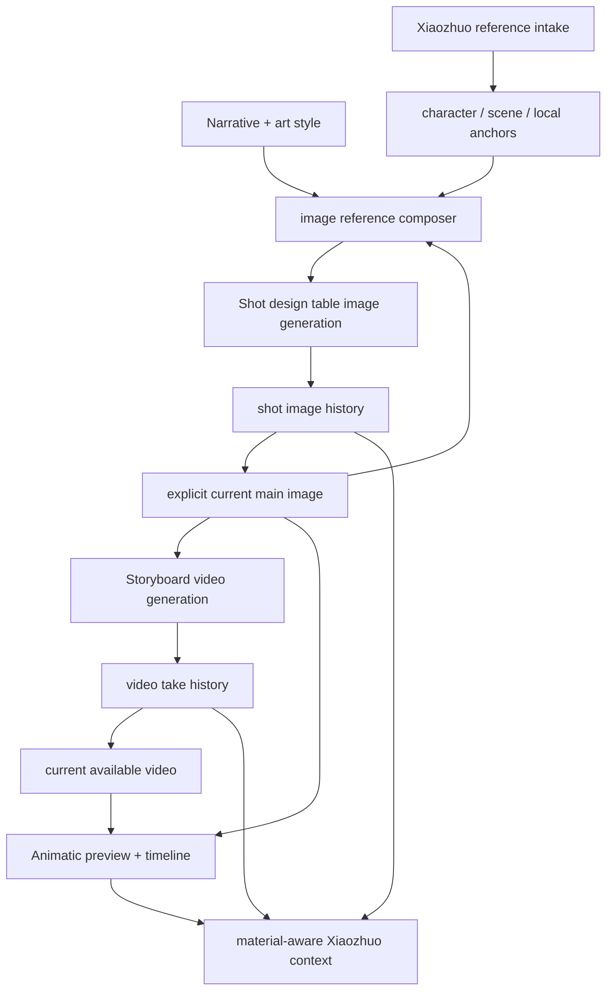
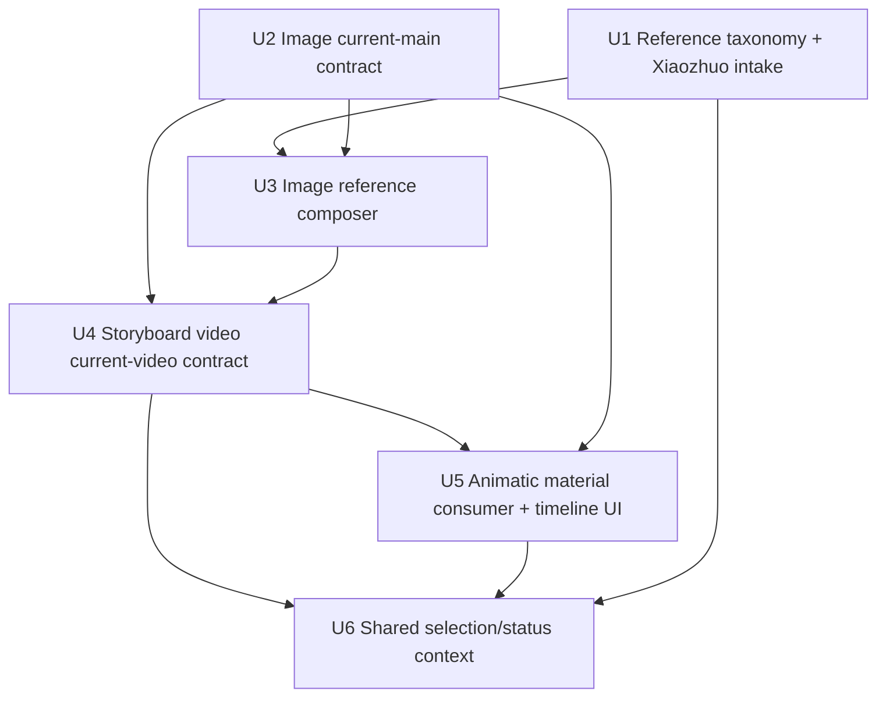
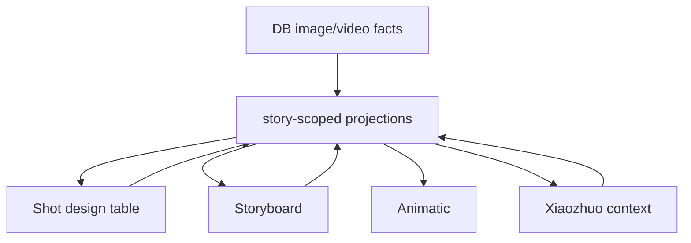

# feat: Unify image, video, and animatic material flow

## Summary

Build one shot material contract across the shot design table, Storyboard, and Animatic: image work happens in the shot design table, video work happens in Storyboard, and Animatic consumes the latest material for lightweight editing. The plan tightens current-main-image and current-video rules, adds reference intake through Xiaozhuo, and fixes the timeline UI so it can become the first stable editing surface.

This plan complements `docs/plans/2026-06-22-001-feat-shot-video-material-basket-plan.md`. The earlier plan owns the durable video take layer and deeper video-basket roadmap; this plan owns the upstream image reference/current-material contract and the cross-panel convergence that makes the video layer feel reliable.

---

## Problem Frame

The system already has most of the pieces: image assets, video takes, Storyboard cards, an Animatic preview, and Xiaozhuo chat. The current user-visible problem is that those pieces do not always agree on which image or video is the material for a shot. A newly generated image can become visible in one panel before the user has chosen it, a failed video take can make the current state look broken, and the Animatic timeline tries to combine generation, preview, range work, and editing controls in a cramped layout.

The desired behavior is simpler. A generated image is only a candidate until the user picks it as the current main image. A successful video take becomes the current video for that shot, while failed takes stay in history. Animatic should display current video first, current main image second, and never become a competing image or video generation entry in the first version.

---

## Requirements

- P1. The shot design table, Storyboard, and Animatic must read one story-scoped shot material model.
- P2. The shot design table owns image generation, image history, reference images, and current main image selection.
- P3. Xiaozhuo must ask for character or scene references before the first image generation path when no useful anchors exist.
- P4. Chat-uploaded references must be confirmed as character, scene, or current-shot local references, then scoped to whole story, current scene or segment, or current shot.
- P5. Image generation produces candidates and history only; it cannot automatically replace the current main image.
- P6. Selecting a current main image is an explicit user action, and that choice is what Storyboard and Animatic consume.
- P7. Image generation references must be gathered in priority order: current shot main image, adjacent shot main images, character anchor, scene anchor, narrative style, and art style.
- P8. If no usable image references exist, image generation must cold-start from the selected narrative and art style prompts.
- P9. The backend and frontend must expose shot image version history and identify the current main image.
- P10. Storyboard owns video generation from the current main image and shows video take history.
- P11. Video generation should default to adjacent main images as continuity references, while letting the user inspect and cancel those references.
- P12. A successful video take becomes the current video for the shot; failed takes never cover an existing current video or current main image fallback.
- P13. Animatic must display current video first, current main image second, and a clear failed or missing state only when no usable current material exists.
- P14. Animatic first version must support adding, removing, ordering, playing one shot, and playing all timeline shots without triggering image or video generation.
- P15. Timeline shot tiles must show whether they use current video, current main image fallback, or a failed or stale material state.
- P16. Xiaozhuo must understand the selected image, video take, shot, or timeline item well enough to explain material status and suggest edits after user confirmation.

**Origin actors:** A1 user, A2 Xiaozhuo, A3 shot design table, A4 Storyboard, A5 Animatic.
**Origin flows:** F1 reference intake, F2 image generation and main image selection, F3 Storyboard video generation, F4 Animatic material consumption and lightweight editing.
**Origin acceptance examples:** AE1-AE6.

### Origin Traceability

| Plan requirement | Origin coverage |
|---|---|
| P1 | R1-R4; Success Criteria |
| P2 | R1, R14; F2 |
| P3 | R5, R8; F1; AE1 |
| P4 | R6, R7; F1; AE1 |
| P5 | R10; AE2 |
| P6 | R11; AE2 |
| P7 | R12; F2; AE3 |
| P8 | R13; AE3 |
| P9 | R14; AE2 |
| P10 | R15, R19; F3 |
| P11 | R16; F3; AE4 |
| P12 | R17, R18; AE4, AE5 |
| P13 | R20, R22; AE5, AE6 |
| P14 | R21, R23; AE6 |
| P15 | R22; AE5, AE6 |
| P16 | R5-R9 plus Success Criteria around Xiaozhuo explanation |

---

## Scope Boundaries

- This plan does not build a professional editor with multi-track editing, audio mixing, transition rendering, or final export.
- This plan does not implement frame extraction, crop-to-new-shot, or video-derived new-shot generation. Those remain follow-up Animatic capabilities.
- This plan does not make Animatic an image or video generation surface in v1.
- This plan does not introduce a global material library; it keeps image history and video take history at shot level.
- This plan does not require users to inspect raw model parameters. Xiaozhuo and advanced panels can show curated generation state.
- This plan does not change provider keys or `.env` handling.

### Deferred to Follow-Up Work

- True video trimming and export.
- Frame extraction from rendered video into new shot seeds.
- Crop tooling and image-to-video regeneration from cropped frames.
- Global reusable material library across shots and stories.
- Batch video generation for the whole story.
- Rich model-comparison and experiment dashboards.

---

## Context & Research

### Relevant Code and Patterns

- `shared/imageAsset.ts`, `server/services/imageAssets.ts`, and `client/src/features/creationAgent/imageAssetViewModel.ts` already separate selected, rejected, pending, primary, and missing image asset states.
- `server/db.ts` currently marks older same-shot images `isCurrent=false` when a new generated image is inserted. That makes `isCurrent` behave like latest candidate freshness, not user-selected current main image, and it conflicts with P5/P6 if projected as the main image.
- `server/routers.ts` currently projects `storyAgent.storyImages` from primary assets and pending current assets. Pending current assets should remain visible in the shot design table, but they should not become the current material consumed by Storyboard or Animatic.
- `client/src/features/creationAgent/views/ShotImageWorkspace.tsx` is already the right frontend surface for image history, pending candidates, and explicit main-image selection.
- `client/src/features/creationAgent/CreationAgentContext.tsx` uses `creationAgent.getProjectAssets`, `selectImage`, and `generateNextImage` for the shot image workspace. `selectImage` still uses a project-shaped input even though the material contract is story-scoped.
- `server/services/creationAgent.ts` already has deterministic image generation and revision paths, and it currently prefers a continuity image from the existing image asset projection.
- `shared/artDirection.ts`, `client/src/features/storyAgent/StoryAgentContext.tsx`, and `client/src/features/storyAgent/storyArtReferences.ts` already model art direction and character references, but the reference taxonomy is currently too narrow for scene and current-shot local references.
- `server/services/imageInjection.ts` can inject a character reference into image prompts. It needs a broader, scoped reference contract rather than character-only behavior.
- `shared/videoAsset.ts`, `server/services/videoAssets.ts`, `server/services/videoJobs.ts`, and `server/services/videoGen.ts` already provide a durable video-take path that this plan should extend rather than replace.
- `server/services/videoJobs.ts` already stores previous and next image reference metadata in the video generation snapshot, but prompt assembly can still leak provider-hostile reference wording into the MJ-Video prompt path.
- `client/src/features/storyAgent/views/ShotMaterialBasket.tsx` is the right Storyboard surface for video generation, take history, and reference visibility.
- `client/src/features/creationEditor/CreationEditorContext.tsx` already merges canonical story shots, story images, and story video assets into `CreationEditorShot`; this should remain the convergence point for Animatic.
- `client/src/features/creationEditor/views/AnimaticPlayer.tsx` already previews video before image when playable video exists, but it still exposes generation and first-frame selection actions that conflict with R23 from the origin.
- `client/src/features/creationEditor/views/Timeline.tsx` already has local timeline add, remove, play-one, play-all, and duration controls, but the current card layout compresses controls and causes overlap on narrow widths.
- `shared/selectionContext.ts` already has source types for shots, storyboard images, animatic videos, timeline ranges, and chat. It is a good base for Xiaozhuo material-status awareness.

### Institutional Learnings

- `docs/solutions/2026-06-13-故事为唯一单位-镜头按storyId.md`: story is the work unit; asset reads and writes must validate `storyId + userId`.
- `docs/solutions/2026-06-13-多worktree环境数据分裂收敛.md`: local persistence follows the running cwd; verification should happen against the main repo service and tests must not overwrite `.webdev/local-persist.json`.
- `docs/plans/2026-06-13-001-feat-unified-image-asset-layer-plan.md`: image generation success is not user selection; the projection must separate pending, selected, rejected, primary, missing, and history.
- `docs/plans/2026-06-14-001-feat-single-image-swipe-loop-plan.md`: deterministic single-image generation and explicit selection are already the intended image loop; this plan closes the remaining current-material gaps.
- `docs/plans/2026-06-22-001-feat-shot-video-material-basket-plan.md`: persistent video takes, ranges, parameter snapshots, and material basket behavior already have a deeper implementation roadmap; this plan aligns image and Animatic behavior to that layer.

### External References

- The user provided the MJ-Video OpenAPI shape for `/mj/submit/video`: required `prompt`, `motion`, and `image`, with each task generating four five-second videos. No extra web lookup was used for this plan.

---

## Key Technical Decisions

- **Selection is the current image truth:** Treat explicit image selection as the current main image. `isCurrent` can remain useful as latest-candidate metadata, but downstream current-material projections must not treat pending latest candidates as the main image.
- **Shot design table keeps candidate visibility:** Pending and rejected image versions stay visible in `ShotImageWorkspace`, not in Storyboard or Animatic's current-material projection.
- **Story-scoped image APIs:** Image selection and generation should validate by `storyId + userId + imageId` and carry stable shot identity, with project id only as legacy compatibility where unavoidable.
- **Reference taxonomy expands without replacing art direction:** Add scoped reference roles for character, scene, and current-shot local references while keeping existing art recipe and character-anchor behavior compatible.
- **Xiaozhuo asks before guessing:** When a user uploads or implies a reference, Xiaozhuo confirms type and scope before it becomes an anchor that influences future images.
- **Prompt references are provider-aware:** Adjacent image references are visible product concepts and parameter-snapshot facts. For MJ-Video, they should not be appended as raw Chinese URL-heavy lines that can trigger prompt-parameter errors.
- **Current video is derived from successful take state:** The newest or explicitly chosen available take is the current video. Failed, timeout, or processing takes remain history and never become the Animatic fallback.
- **Animatic consumes, Storyboard generates:** Animatic v1 should show material status, play material, organize timeline shots, and edit local timing. It should link users back to the right surface for image or video generation rather than exposing competing generation controls.
- **Timeline layout needs fixed control zones:** Timeline tiles should have stable dimensions and separate preview, action, and duration controls so buttons cannot overlap labels or sliders.
- **Selection context is shared with Xiaozhuo:** The selected shot, image version, video take, and timeline item should produce the same typed context for chat suggestions, status explanation, and future edit flows.

---

## Open Questions

### Resolved During Planning

- Image generation belongs in the shot design table, not Storyboard or Animatic.
- Video generation belongs in Storyboard, with Animatic consuming the resulting current video.
- Generated images are candidates until manually selected.
- Successful video takes automatically become the current video, while failed takes never cover usable material.
- Dynamic Animatic v1 should not generate images or videos.
- Reference images can be character, scene, or current-shot local references, and they need explicit scope.
- Cold-start image generation can use narrative style and art style when no image references exist.

### Deferred to Implementation

- Whether to migrate legacy `isCurrent` rows or fix projection semantics first and backfill only if tests expose ambiguity.
- The exact Xiaozhuo UI for confirming reference type and scope: quick buttons, chat text, or both.
- Whether the video provider accepts true multi-image references. If not, adjacent references remain visible continuity context and parameter-snapshot metadata, with only supported fields sent to the provider.
- How much historical generation detail to expose to ordinary users versus Xiaozhuo/debug surfaces.
- Whether timeline ordering remains local in v1 or receives persistence in the next pass after the layout and material contract are stable.

---

## High-Level Technical Design

> This diagram is directional. It shows ownership and data flow, not exact implementation calls.

---

## Implementation Units

### U1. Reference Taxonomy and Xiaozhuo Intake

**Goal:** Let Xiaozhuo collect and persist reference intent before image generation by confirming whether a reference is for character, scene, or current-shot local use, then confirming scope.

**Requirements:** P3, P4, P7, P8, P16

**Dependencies:** None

**Files:**
- Modify: `shared/artDirection.ts`
- Test: `shared/artDirection.test.ts`
- Modify: `client/src/features/storyAgent/storyArtReferences.ts`
- Test: `client/src/features/storyAgent/storyArtReferences.test.ts`
- Modify: `client/src/features/storyAgent/StoryAgentContext.tsx`
- Modify: `client/src/features/storyAgent/views/StoryAgentChat.tsx`
- Modify: `client/src/features/creationAgent/views/FloatingAgentChat.tsx`
- Modify: `server/services/creationAgent.ts`
- Test: `server/services/creationAgent.test.ts`
- Modify: `server/services/imageInjection.ts`
- Test: `server/services/imageInjection.test.ts`

**Approach:**
- Extend the existing art reference model so references can represent character, scene, and current-shot local intent with a confirmed scope.
- Keep existing character-anchor behavior compatible, but stop treating all useful reference images as character references.
- Add a first-image-generation preflight state that lets Xiaozhuo ask for missing references only when the story lacks useful anchors.
- When chat receives an uploaded reference, route it through a confirmation step before it affects future image prompts.

**Test scenarios:**
- Covers AE1. A first image-generation attempt with no anchors causes Xiaozhuo to ask for character or scene references.
- A user-provided image can be confirmed as a scene reference without becoming the character anchor.
- A current-shot local reference affects only the active shot's generation context.
- Existing stories with only character references still produce the same character-reference prompt behavior.

**Verification:**
- Xiaozhuo can distinguish and persist character, scene, and local references without breaking existing art direction flows.

### U2. Image Current-Main Contract and Story-Scoped Version History

**Goal:** Make explicit image selection the only source of current main image truth while preserving full image version history in the shot design table.

**Requirements:** P1, P2, P5, P6, P9, P13

**Dependencies:** None

**Files:**
- Modify: `server/db.ts`
- Modify: `server/services/imageAssets.ts`
- Test: `server/services/imageAssets.test.ts`
- Modify: `server/routers.ts`
- Test: `server/routers.storyAgent.test.ts`
- Modify: `server/services/creationAgent.ts`
- Test: `server/services/creationAgent.test.ts`
- Modify: `client/src/features/creationAgent/CreationAgentContext.tsx`
- Modify: `client/src/features/creationAgent/imageAssetViewModel.ts`
- Test: `client/src/features/creationAgent/imageAssetViewModel.test.ts`
- Modify: `client/src/features/creationAgent/views/ShotImageWorkspace.tsx`
- Modify: `client/src/features/creationEditor/CreationEditorContext.tsx`
- Test: `client/src/features/creationEditor/creationEditor.routing.test.tsx`

**Approach:**
- Preserve generated candidates as history and pending versions until a selection signal marks one as primary.
- Tighten `storyAgent.storyImages` and `CreationEditorContext` consumption so pending latest candidates are not treated as current material.
- Move image selection toward story-scoped authorization and stable shot identity, while keeping legacy project inputs only where compatibility requires them.
- Ensure generated and revised images carry shot identity so SH labels, reordered shots, and current-material projections do not drift.

**Test scenarios:**
- Covers AE2. Generating new candidates for a shot with an existing selected main image does not change the current main image.
- Selecting a candidate makes it the current main image and updates Storyboard plus Animatic projections.
- Rejected or pending images remain visible in shot image history but do not appear as current material.
- Image selection fails for an image outside the current story or user.

**Verification:**
- The same shot shows one current main image across the shot design table, Storyboard, and Animatic, while history still lists prior versions.

### U3. Image Reference Composer and Cold-Start Prompt Assembly

**Goal:** Generate image candidates with the intended continuity and style context: current shot image first, adjacent shot images next, then character and scene anchors, then narrative and art style.

**Requirements:** P3, P7, P8

**Dependencies:** U1, U2

**Files:**
- Create: `server/services/shotImageReferences.ts`
- Test: `server/services/shotImageReferences.test.ts`
- Modify: `server/services/creationAgent.ts`
- Test: `server/services/creationAgent.test.ts`
- Modify: `server/services/imageInjection.ts`
- Test: `server/services/imageInjection.test.ts`
- Modify: `client/src/features/creationAgent/views/ShotImageWorkspace.tsx`
- Modify: `client/src/features/storyAgent/views/StoryCardsBoard.tsx`

**Approach:**
- Centralize reference selection so image generation does not reimplement priority logic in multiple tools.
- Use only selected main images for current and adjacent image references; pending candidates remain history unless explicitly selected.
- Use scoped character and scene anchors from U1.
- When no image references exist, compose a cold-start prompt from the story's narrative style and art recipe rather than emitting generic visual prompts.
- Surface the references being used in the shot design table so users can understand why a generation is expected to stay visually consistent.

**Test scenarios:**
- Covers AE3. A first-shot cold start with no images uses narrative and art style.
- A shot with a selected current image uses that image before adjacent references.
- Adjacent pending candidates are ignored until selected.
- Scene-scoped references are included for matching scope and excluded outside it.

**Verification:**
- Image generation no longer depends only on text prompt luck for character, scene, and style continuity.

### U4. Storyboard Video Generation and Current-Video Contract

**Goal:** Make Storyboard the reliable video generation surface by requiring a current main image, showing continuity references, and ensuring failed takes never cover current material.

**Requirements:** P1, P10, P11, P12, P13, P15

**Dependencies:** U2, U3

**Files:**
- Modify: `client/src/features/storyAgent/views/ShotMaterialBasket.tsx`
- Modify: `client/src/features/storyAgent/views/StoryCardsBoard.tsx`
- Modify: `client/src/features/creationEditor/CreationEditorContext.tsx`
- Modify: `server/services/videoJobs.ts`
- Test: `server/services/videoJobs.test.ts`
- Modify: `server/services/videoGen.ts`
- Test: `server/services/videoGen.test.ts`
- Modify: `server/services/videoAssets.ts`
- Modify: `server/routers.ts`
- Test: `server/routers.storyAgent.test.ts`
- Modify: `shared/videoAsset.ts`
- Test: `client/src/features/creationEditor/videoAssetViewModel.test.ts`

**Approach:**
- Require the source image for video generation to be the selected current main image for the shot.
- Show previous and next current main images as default continuity references, with visible controls to exclude an unsuitable reference.
- Keep adjacent references in parameter snapshots and user-facing explanation, but send only provider-supported fields to 302.
- For MJ-Video, sanitize prompts so unsupported reference wording and raw URL lines do not cause prompt-parameter failures.
- Project the current video from available take state while keeping failed, timeout, and processing takes as history.

**Test scenarios:**
- Covers AE4. A successful Storyboard video generation becomes current video and is visible in Animatic.
- Covers AE5. A failed later take does not replace an existing current video.
- Video generation is blocked or explained when the shot has no explicit current main image.
- Removing an adjacent reference changes the submitted reference set and parameter snapshot without mutating the shot's main image.
- MJ-Video prompt submission strips provider-hostile reference text while preserving a useful visual prompt.

**Verification:**
- Storyboard can generate, list, and explain takes, and Animatic never goes empty because a new take failed.

### U5. Animatic Material Consumer and Timeline UI Refactor

**Goal:** Turn Animatic into a stable lightweight editing surface that consumes latest material and avoids overlapping controls.

**Requirements:** P1, P13, P14, P15

**Dependencies:** U2, U4

**Files:**
- Modify: `client/src/features/creationEditor/views/AnimaticPanel.tsx`
- Modify: `client/src/features/creationEditor/views/AnimaticPlayer.tsx`
- Modify: `client/src/features/creationEditor/views/Timeline.tsx`
- Modify: `client/src/features/creationEditor/videoAssetViewModel.ts`
- Test: `client/src/features/creationEditor/videoAssetViewModel.test.ts`
- Test: `client/src/features/creationEditor/creationEditor.routing.test.tsx`
- Test: `client/src/features/creationEditor/playback.test.ts`

**Approach:**
- Keep Animatic preview priority as current video first and current main image fallback second.
- Remove or demote image and video generation controls from Animatic v1, replacing them with navigation or contextual links to the owning surface when needed.
- Refactor the timeline into stable clip tiles with separate header, play/remove actions, material status, and duration controls.
- Keep add, remove, order, play-one, and play-all behavior focused on timeline organization.
- Make failed or stale take states visible without letting those states erase playable current material.

**Test scenarios:**
- Covers AE5. A failed take is shown as history/status, while Animatic still previews the old current video or current main image.
- Covers AE6. Removing a shot from the timeline and playing all uses the remaining order only.
- Timeline controls do not overlap at common desktop and narrow widths.
- Animatic does not call image or video generation mutations from the first-version editing path.

**Verification:**
- The Animatic timeline is visually stable, playable, and truthful about which material each shot is using.

### U6. Shared Selection Context and Material Status for Xiaozhuo

**Goal:** Let Xiaozhuo recognize selected shots, images, video takes, and timeline items so it can explain status and propose the right next edit without inventing a separate material truth.

**Requirements:** P1, P4, P9, P15, P16

**Dependencies:** U1, U4, U5

**Files:**
- Modify: `shared/selectionContext.ts`
- Test: `shared/selectionContext.test.ts`
- Modify: `client/src/features/storyAgent/hooks/useSelectionCapture.ts`
- Modify: `client/src/features/storyAgent/StoryAgentContext.tsx`
- Modify: `client/src/features/storyAgent/views/StoryAgentChat.tsx`
- Modify: `client/src/features/creationAgent/views/FloatingAgentChat.tsx`
- Modify: `client/src/features/creationAgent/CreationAgentContext.tsx`
- Modify: `server/services/creationAgent.ts`
- Test: `server/services/creationAgent.test.ts`
- Test: `server/routers.storyAgent.test.ts`

**Approach:**
- Normalize selected material context for current main image, image candidate, video take, failed take, and timeline clip.
- Include enough status in the context for Xiaozhuo to say whether the item is current, pending, failed, or fallback material.
- Use the same context for reference intake, edit suggestions, and generation-parameter explanation.
- Keep user confirmation as the boundary before Xiaozhuo changes references, selects images, or edits shot material prompts.

**Test scenarios:**
- Xiaozhuo receives a selected pending image as a candidate, not as the current main image.
- Xiaozhuo receives a failed video take as history/error and does not describe it as the current video.
- Selecting a timeline item gives Xiaozhuo the underlying current video or image fallback status.
- A confirmed reference upload writes the right reference type and scope into story context.

**Verification:**
- Chat explanations match the material status shown in the UI and do not create a fourth interpretation of shot state.

---

## System-Wide Impact

- **Data lifecycle:** Existing generated images may have `isCurrent=true` even though they were never explicitly selected. The safest first move is to make projections obey explicit selection and legacy fallback rules before considering any migration.
- **Authorization:** Image selection, image history, video generation, and video take history must consistently validate `storyId + userId`.
- **Invalidation:** After image generation, image selection, video generation, and video status refresh, the shot design table, Storyboard, and Animatic must invalidate the same story material queries.
- **Provider behavior:** MJ-Video may reject prompts containing unsupported panel/layout/reference language. Video prompt assembly must be provider-aware.
- **UI behavior:** Animatic timeline layout changes affect a high-visibility surface; visual browser checks are required after implementation.
- **Backward compatibility:** Existing stories with legacy image rows and video takes should still show the best available main image or video rather than becoming empty.

---

## Verification Plan

- Run targeted unit tests for image asset projection, reference composition, video job prompt assembly, video asset projection, selection context, and CreationEditor material merging.
- Run Storyboard and CreationEditor routing tests that cover current image selection, current video projection, failed-take fallback, and timeline play/remove behavior.
- Run typecheck after all units that change shared types or tRPC inputs.
- Start the main repo dev server only if needed for UI verification, after `pnpm env:status` per workspace rules.
- Use browser screenshots for the Animatic timeline at desktop and narrow widths to verify controls do not overlap.
- Manually verify one end-to-end story path: select current main image in shot design table, generate Storyboard video, observe current video in Animatic, fail a later take, confirm Animatic still shows usable material.

---

## Rollout Notes

- Implement U2 before depending on generated images for video. Otherwise Storyboard may continue to use unselected candidates.
- Implement U4 before removing Animatic generation controls. Otherwise users may temporarily lose the only visible path for video generation in some shots.
- Keep compatibility fallbacks visible during the transition, but label them as legacy or fallback material where the UI exposes status.
- Do not change `.env` or provider keys as part of this plan.

---

## Review Notes

- The plan preserves the origin's product decisions: image in shot design table, video in Storyboard, Animatic as consumer/editor, current image by manual selection, current video by successful take.
- The main architectural bet is to fix projections and shared context rather than add a new material table.
- The largest implementation risk is legacy `isCurrent` ambiguity. U2 must land with focused tests before U4 and U5 rely on current-material behavior.
