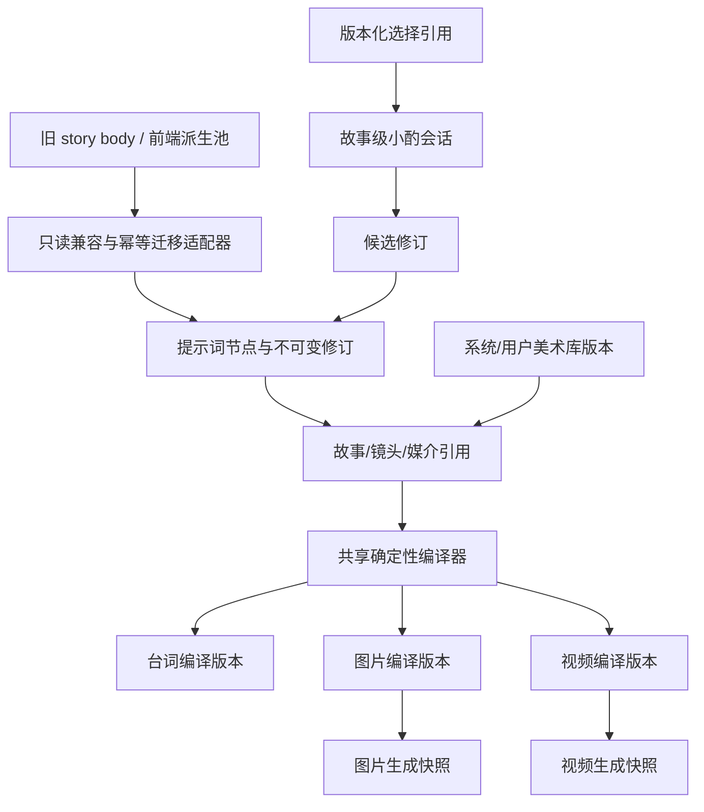
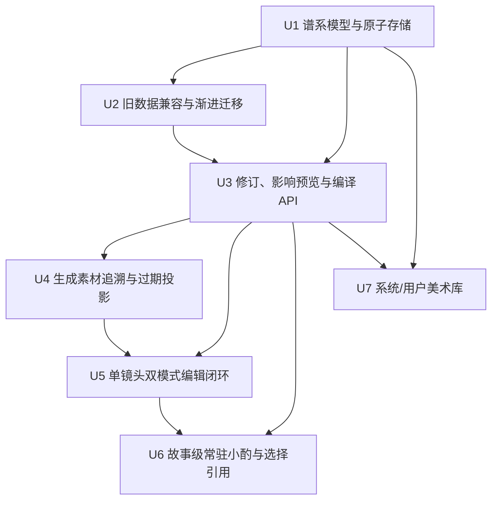
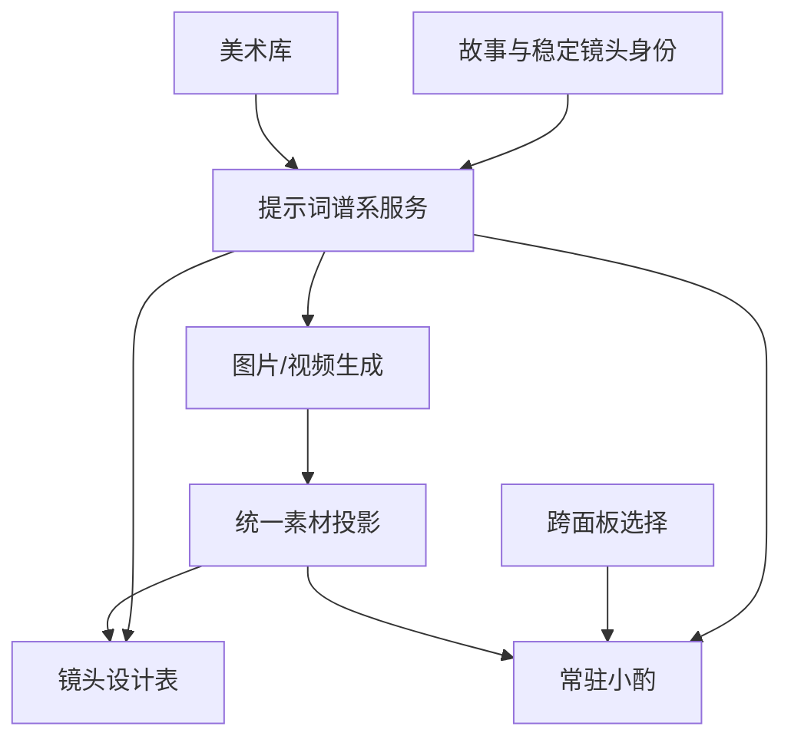

# feat: 建立统一提示词谱系与常驻小酌

## Summary

以服务端关系型谱系取代前端派生提示词池作为事实源，统一保存片段、修订、镜头引用、台词/图片/视频编译和生成素材来源。实施按“单镜头闭环 → 故事级常驻小酌 → 美术库”推进，旧故事在首次编辑时渐进迁移，迁移后不再双写旧字段。

---

## Problem Frame

当前提示词信息同时存在于故事 JSON、镜头字段、前端派生池、提示词覆盖、图片记录和视频参数快照中；选区编辑甚至会直接改写正文。现有能力足以生成内容，却无法稳定表达版本、依赖、影响范围和“这份素材依据哪一版提示词生成”。完整产品行为见来源需求文档。

---

## Requirements

- R1. 台词、图片和视频读取同一套提示词事实，不维护无法追溯的平行真相。
- R2. 区分共享语义与媒介指令；故事事实可以共享，图片构图和视频运镜保持媒介局部。
- R3. 用户或 Agent 的每次修改产生不可覆盖内容的修订，并保留作者、来源、理由和父版本。
- R4. 镜头、编译结果和生成素材可追溯到实际引用的提示词版本。
- R5. 用户直接编辑默认只修改当前对象，不隐式传播。
- R6. 扩大到整个镜头或故事前展示台词、图片、视频和已有素材的影响。
- R7. 已生成图片和视频不可变；上游变化后显示过期，但仍可查看、播放和恢复。
- R8. Agent 只创建候选修订，用户确认后才改变当前版本。
- R9. 提示词确认不自动触发付费生成，重渲必须由用户独立触发。
- R10. 台词、图片和视频拥有独立编译结果，并分别记录最终文本、引用版本和编译时间。
- R11. 图片和视频生成保存完整提示词、参考素材、模型参数和来源版本。
- R12. 系统美术库和用户私库使用同一种可版本化内容模型。
- R13. 故事锁定美术配方的具体版本，库更新不得静默改变已有故事。
- R14. 镜头可以局部覆盖故事级美术配方，不反向修改故事快照或源库。
- R15. 美术库具有稳定且可校验的导入边界。
- R16. 配方卡片和高级数据库视图编辑同一事实。
- R17. 第一版完成单镜头的编辑、差异预览、确认、素材过期、按需重渲和恢复旧版本闭环。
- R18. 旧故事和素材保持可读；首次编辑渐进迁移，迁移后不长期双写。
- R19. 每个故事拥有一条跨创作区域连续的小酌会话，故事之间严格隔离。
- R20. 桌面端左侧常驻聊天栏可折叠，并保留未发送草稿和当前引用。
- R21. 聊天支持一个主对象加一个局部文字、图片区域或时间范围，并保存稳定对象身份及当时版本。
- R22. 选择对象不自动调用 Agent；发送后只创建可确认的候选修订。

**Origin actors:** A1 创作者、A2 小酌及导演 Agent、A3 提示词数据库、A4 内容生成器、A5 美术库维护者。

**Origin flows:** F1 单对象局部修改、F2 应用到整个镜头、F3 Agent 提议修改、F4 美术配方复用、F5 选中对象后请小酌修改。

**Origin acceptance examples:** AE1-AE12 均由下列实施单元和测试场景承接。

---

## Scope Boundaries

- 不自动重渲图片或视频，不把提示词确认和供应商付费调用合并。
- 不做跨镜头任意多选、批量传播、复杂冲突合并或多人实时协作。
- 不做公开提示词市场；用户私库只对所有者可见。
- 不建立完整事件溯源系统；修订谱系只覆盖创作事实和生成来源。
- 不删除旧素材、不强制一次性迁移所有故事。
- 不将音频生成、配音版本、成片导出纳入第一版谱系。
- 不实现移动端常驻侧栏。

### Deferred to Follow-Up Work

- 多镜头批量修改与冲突合并。
- 美术库公开分享、协作编辑和市场能力。
- 将音频、配音及成片导出接入同一谱系。

---

## Context & Research

### Relevant Code and Patterns

- `client/src/features/storyAgent/promptPool.ts` 已能从视觉分析提取确定性片段；保留为旧数据转换器，不再作为事实源。
- `shared/promptContext.ts`、`client/src/features/creationEditor/promptTable/promptRecipe.ts` 和 `videoRecipe.ts` 已形成图片/视频编译骨架；应收敛为共享纯编译器并由服务端确认结果。
- `server/services/storyMaterials.ts` 已提供故事级统一素材投影；提示词状态应作为并列投影进入同一 Creation Editor 查询边界。
- `server/db.ts` 的时间轴和派生镜头实现了 MySQL 行锁、版本校验、事务提交，以及本地持久化快照回滚的等价路径。
- `shared/selectionContext.ts` 已覆盖镜头、图片、视频、时间轴和派生素材；`useSelectionCapture` 与 `StoryAgentChat` 已有文字引用卡雏形。
- `WorkspaceLayout.tsx` 已把故事聊天固定在左侧；本计划扩展为可折叠的故事级会话，不另造第二个视觉容器。
- `StoryAgentContext.sendSelectionEdit` 当前会在 Agent 返回后直接改正文，是必须先加 characterization test 再替换的高风险路径。
- `docs/style-library/entries/*.yaml` 与 `server/services/styleLibrary.ts` 已有美术条目校验和转换，应作为系统库导入来源。

### Institutional Learnings

- `docs/solutions/2026-06-13-故事为唯一单位-镜头按storyId.md`：故事是唯一工作单位；所有读取和写入都必须同时校验 `storyId + userId`，稳定镜头身份不能退回展示镜号。
- `docs/solutions/2026-06-13-多worktree环境数据分裂收敛.md`：本地持久化是真实运行模式，不是测试替身；新增关系必须进入内存状态、磁盘序列化、重载、删除与重置路径。

### External References

- [Drizzle ORM Transactions](https://orm.drizzle.team/docs/transactions)：继续使用仓库现有事务 API，确认修订时将版本校验、当前指针、编译和会话动作作为一个逻辑提交。
- [Drizzle Migrations](https://orm.drizzle.team/docs/migrations)：沿用 codebase-first schema 与显式迁移文件，不在运行时隐式改表。
- [MySQL InnoDB Locking Reads](https://dev.mysql.com/doc/refman/8.0/en/innodb-locking-reads.html)：确认操作使用唯一索引定位的锁定读取，避免并发确认覆盖。
- [MySQL Foreign Key Constraints](https://dev.mysql.com/doc/refman/8.4/en/create-table-foreign-keys.html)：新谱系内部关系使用匹配类型、索引和引用约束；跨旧表关联保持可空以兼容历史数据。

---

## Key Technical Decisions

- **服务端谱系为唯一事实源。** 前端 `PromptRow`、卡片和数据库视图都是服务端投影；客户端编译只用于即时预览，生成前必须由服务端确认编译版本。
- **稳定语义节点与不可变内容修订分离。** 节点表达“SH03 的人物服装”或“SH03 的视频运镜”，修订保存内容历史；节点的当前指针只在确认事务中改变。
- **共享节点与媒介节点分层。** 故事事实、人物、镜头任务和台词含义可被多个编译目标引用；图片构图和视频运镜使用媒介作用域节点。局部编辑必要时创建局部分支，不修改共享源。
- **编译结果版本化并记录输入集合。** 台词、图片、视频分别拥有当前编译；编译保存参与的修订顺序和内容指纹，确保差异预览、复现和过期判断一致。
- **过期状态按谱系派生。** 新图片和视频记录其编译版本；当它不再等于当前编译时显示过期。确认修订不批量改写历史素材。
- **渐进迁移不写读路径。** 未迁移故事通过只读兼容投影继续显示；第一次创建候选、绑定配方或执行其他提示词写入时，在同一写事务中先幂等导入旧片段、覆盖和生成快照，再完成本次写入，此后只写新表。新建故事在首次持久化时直接初始化谱系。可选离线回填脚本只负责提前迁移，不改变语义。
- **故事级乐观版本 + 行锁。** 每次候选确认提交调用方看到的故事提示词版本；MySQL 路径锁定故事提示词状态，本地模式使用内存快照和一次写盘回滚。
- **对话持久化与提示词提交解耦。** 用户消息和候选建议可以先保存；只有独立确认操作才能改变当前修订。拒绝建议只改变候选状态。
- **历史聊天合并保留来源。** 故事页和创作页旧消息按时间归并到故事会话，按消息 ID 去重并记录来源；开场/回归问候等临时消息不作为创作历史迁移。
- **系统美术 YAML 是作者入口，不是运行时事实源。** 校验后的条目以内容指纹幂等导入系统库版本；用户私库使用同一内容模型，故事只引用锁定版本。

---

## Public Contracts

- `promptLineage.getStoryProjection`：按 `storyId` 返回故事聚合版本、迁移状态、镜头节点、当前修订、待处理候选、三模态当前编译和素材影响摘要；所有服务端查询同时校验当前用户。
- `promptLineage.listRevisionHistory`：按节点和游标分页读取历史修订及对应编译，版本历史对话框按需加载，避免主编辑查询随故事生命周期无限增长。
- `promptLineage.createCandidate`、`previewCandidate`、`confirmCandidate`、`rejectCandidate`、`restoreRevision`：候选创建与预览不改变当前指针；确认与恢复必须提交 `expectedStoryVersion`，冲突返回最新投影。
- 图片和视频生成沿用现有入口，但迁移后的故事必须提交服务端已确认且属于目标故事、镜头和模态的 `compilationId`；客户端原始 prompt 只能作为未迁移故事的受控兼容输入。
- `storyConversation.list`、`send`：按故事和游标分页读取、发送消息；发送携带版本化 `SelectionContext`，服务端重新授权对象后才允许 Agent 创建候选修订。
- `artPromptLibrary.list`、`import`、`createVersion`、`bindStoryVersion`、`previewUpgrade`：系统库只读，用户库按所有者写入，故事绑定和升级复用候选/影响预览/确认语义。
- 所有变更接口成功后返回更新后的故事级提示词投影或新版本号；失败不得要求客户端凭局部响应自行拼装另一套事实。

---

## Open Questions

### Resolved During Planning

- **旧数据何时迁移？** 读取时只做兼容投影，第一次提示词编辑时原子导入；另提供幂等回填脚本用于提前迁移。
- **并发确认如何处理？** 每故事提示词状态维护版本号；确认时提交预期版本并锁定状态行，冲突返回新投影供用户重新确认。
- **素材过期实时计算还是批量落库？** 通过素材绑定的编译版本与当前编译版本比较派生，不改写历史资产。
- **旧聊天如何合并？** 故事页和创作页历史按时间合并、按消息 ID 去重、保留来源；临时问候不迁移。
- **高级视图第一版展示什么？** 仅展示片段/节点、当前版本、来源、作用域、引用目标、候选状态和素材过期关系，并提供筛选与版本历史。
- **美术库如何导入？** YAML 与 JSON 进入同一校验模型，以内容指纹去重；系统条目只读，用户条目只能由所有者修改。

### Deferred to Implementation

- 旧故事中缺失稳定镜头身份或来源对象已经删除时，具体迁移报告措辞与人工修复入口。
- 新表的最终索引组合和查询批次大小，根据实际 explain 结果微调，但不得改变所有权与唯一性约束。
- 左栏折叠宽度、窄桌面断点和动效细节，在浏览器验收中按现有设计系统调整。

---

## High-Level Technical Design

> *This illustrates the intended approach and is directional guidance for review, not implementation specification. The implementing agent should treat it as context, not code to reproduce.*

核心关系采用“聚合状态 + 规范化谱系”的组合：

- 故事提示词状态保存所有者、当前聚合版本和迁移状态。
- 提示词节点保存作用域、维度和当前修订指针；提示词修订保存不可覆盖的内容、来源、父版本和候选状态。
- 节点引用表达故事、镜头及媒介对语义节点的使用关系。
- 编译记录保存最终文本、模态、输入指纹；编译输入关系按顺序连接具体修订。
- 新图片和视频使用可空编译关联；旧素材保持可读，未绑定时显示为 legacy/未知来源而非错误地判为过期。
- 故事会话、消息和消息引用独立持久化；引用保存对象版本与归一化局部选区，不把整张素材复制进消息。
- 美术库、库版本和库项目连接同一类提示词修订；故事绑定具体库版本，镜头覆盖仍通过普通节点引用实现。

---

## Implementation Units

### U1. 建立提示词谱系领域模型与原子存储

**Goal:** 建立关系型实体、共享类型和 MySQL/本地持久化等价写入，为修订、编译、会话和美术库提供稳定基础。

**Requirements:** R1-R4, R10-R12, R18-R19；支持 A1-A5 的所有权边界。

**Dependencies:** None.

**Files:**
- Create: `shared/promptLineage.ts`
- Create: `drizzle/migrations/0008_prompt_lineage.sql`
- Create: `server/services/promptLineageStore.ts`
- Create: `server/services/promptLineageStore.test.ts`
- Modify: `drizzle/schema.ts`
- Modify: `drizzle/relations.ts`
- Modify: `server/db.ts`

**Approach:**
- 定义故事提示词状态、语义节点、不可变修订、节点引用、编译记录、编译输入、故事会话、消息、消息引用、美术库及版本的共享枚举和投影类型。
- 在同一 additive migration 中预先建立 U1-U7 需要的新表，并为新图片和视频增加可空编译关联；后续单元只消费这些字段，不反复修改同一迁移文件。
- MySQL 新表使用明确主键、唯一键、所有权列和内部外键；所有按故事操作同时校验 `storyId + userId`。
- 节点当前修订必须属于该节点，编译输入必须属于同一故事且匹配目标作用域；使用复合唯一键/约束与服务层校验共同防止跨节点或跨故事指针。
- 修订内容创建后不可更新；仅候选状态和节点当前修订指针可在事务中变化。
- 本地模式为所有新实体增加内存集合、ID 计数、磁盘序列化/重载、故事删除清理和测试重置。
- 增加故事聚合版本，作为候选确认、迁移和库升级的并发门。

**Execution note:** 先为 MySQL 与本地模式写同一组存储契约测试，再实现 schema 和适配器。

**Patterns to follow:**
- `storyTimelines` 的故事所有者唯一约束。
- `updateStoryTimeline` 的预期版本和锁定读取。
- `confirmDerivedShotAtomic` 的 MySQL 事务与本地快照回滚等价实现。

**Test scenarios:**
- Happy path：为同一故事创建节点、两个修订和引用后，读取投影只返回确认的当前修订，历史仍完整。
- Edge case：同一候选确认请求重复提交，返回同一已确认结果，不创建重复编译或重复版本。
- Error path：错误 `userId`、其他故事的稳定镜头身份、其他用户的库版本均被拒绝，数据库无部分写入。
- Error path：尝试把节点当前指针指向另一节点修订，或把其他故事修订作为编译输入时被拒绝，聚合版本不变。
- Error path：预期版本落后时确认失败，当前指针和聚合版本保持不变。
- Integration：MySQL 路径中任一中间写入失败会整体回滚；本地模式恢复内存快照且磁盘文件不出现部分状态。
- Integration：删除故事时清理故事私有谱系、会话和绑定，但不删除系统美术库。
- Persistence：本地模式写盘后重载，节点、修订、引用、编译输入顺序和会话消息保持一致。
- Migration：在包含旧故事、图片和视频记录的数据库 fixture 上执行 additive migration，不要求先回填，旧数据行和现有读取保持可用。

**Verification:**
- 新领域类型没有依赖前端组件。
- 两种持久化模式通过相同所有权、版本和原子性测试。

### U2. 兼容旧提示词并实现首次编辑渐进迁移

**Goal:** 让旧故事继续显示，在第一次提示词写入时把视觉片段、镜头字段、覆盖、生成记录和聊天历史幂等导入新谱系；新故事首次持久化时直接初始化谱系，此后停止写旧提示词字段。

**Requirements:** R1, R4, R11, R18-R21；F1, F2, F5；AE8, AE9.

**Dependencies:** U1.

**Files:**
- Create: `server/services/promptLineageMigration.ts`
- Create: `server/services/promptLineageMigration.test.ts`
- Create: `scripts/backfill-prompt-lineage.ts`
- Create: `scripts/backfill-prompt-lineage.test.ts`
- Modify: `client/src/features/storyAgent/promptPool.ts`
- Modify: `server/services/storySync.ts`
- Modify: `server/routers.ts`
- Modify: `client/src/features/storyAgent/storyAgentPersistence.ts`

**Approach:**
- 保留图像分析到片段的纯转换逻辑，移动或复用为服务端可调用的兼容适配器；确定性旧 ID 只用于识别迁移来源，新数据库使用稳定主键。
- 未迁移故事查询返回 `legacy` 投影；不得在普通 GET/查询时写数据库。
- 第一次创建候选修订、绑定配方或执行其他提示词写入时，在该写事务开头幂等导入：故事/镜头共享字段、媒介字段、片段引用、提示词覆盖、图片 prompt、视频快照和现有消息；导入和本次写入要么一起成功，要么一起回滚。
- 新故事在首次保存稳定镜头身份和 story body 的现有持久化边界初始化谱系，不先制造一份需要以后再迁移的 legacy 数据。
- 迁移按稳定镜头身份关联；只有展示镜号而无稳定身份时使用现有身份补齐逻辑，无法确定归属则报告并跳过，不猜到其他故事。
- 旧故事页与创作页消息按时间合并、消息 ID 去重并标记来源；开场白和内存回归问候不进入正式会话。
- 迁移成功后状态改为已迁移，新的编辑写新谱系；旧字段只保留为历史兼容输入。
- 提供 dry-run 默认的回填脚本，输出可迁移、已迁移、歧义和拒绝数量；只有显式写入模式才提交。

**Patterns to follow:**
- `scripts/backfill-shot-storyid.ts` 的歧义拒绝、dry-run 和所有权保护。
- `storySync.ts` 的版本准备与旧字段保留策略。
- `promptPool.test.ts` 的图像分析片段 characterization。

**Test scenarios:**
- Covers AE8：只有旧 `promptOverrides`、`promptRun`、`fragmentRefs` 和生成素材的故事先正常显示；首次编辑后导入一次，第二次编辑不重复导入。
- Covers AE9：故事页与创作页历史按时间合并，重复消息只保留一条，临时问候被排除。
- Happy path：功能发布后新建故事首次落库即拥有谱系状态和台词/图片/视频初始编译，不经过 legacy 双写阶段。
- Edge case：旧故事没有视觉画布或提示词覆盖时仍生成最小共享节点，不制造不存在的偏好。
- Edge case：旧图片/视频没有可追溯提示词版本时保留 legacy 来源，不错误标记为最新或过期。
- Error path：稳定镜头身份歧义、跨用户素材、损坏的局部选择数据进入迁移报告但不污染谱系。
- Integration：迁移事务失败后故事仍处于 legacy 状态，旧读取继续可用；重试可成功。
- Script：dry-run 不改变数据库；写入模式重复运行结果幂等。

**Verification:**
- 任意旧故事无需提前回填即可查看。
- 首次编辑后新旧显示一致，新修改不再落入旧提示词字段。

### U3. 实现候选修订、影响预览与三模态编译服务

**Goal:** 提供统一服务和 tRPC 契约，完成候选创建、局部/镜头级影响分析、确认/拒绝、版本恢复和台词/图片/视频编译。

**Requirements:** R1-R10, R22；F1-F3；AE1-AE3, AE12.

**Dependencies:** U1, U2.

**Files:**
- Create: `shared/promptCompiler.ts`
- Create: `shared/promptCompiler.test.ts`
- Create: `server/services/promptLineage.ts`
- Create: `server/services/promptLineage.test.ts`
- Create: `server/routers.promptLineage.test.ts`
- Modify: `shared/promptContext.ts`
- Modify: `client/src/features/creationEditor/promptTable/promptRecipe.ts`
- Modify: `client/src/features/creationEditor/promptTable/videoRecipe.ts`
- Modify: `server/routers.ts`

**Approach:**
- 把现有图片和视频编译规则收敛成共享纯编译器，输入为已排序的确认修订和作用域，输出台词、图片、视频三个独立结果及输入指纹。
- 主查询返回故事版本、镜头节点、当前修订、待处理候选、三模态当前编译、影响摘要和迁移状态；历史修订通过节点级游标查询按需加载。
- 创建候选时显式指定局部媒介、整个镜头或故事作用域；默认局部。局部编辑共享节点时创建媒介局部分支，不修改其他引用。
- 影响预览在写入前比较当前与候选编译，列出变化模态和将变过期的素材，但不改变任何当前指针。
- 确认事务校验预期故事版本、对象归属和候选状态，更新当前修订，只为实际受影响的模态生成新编译并提升聚合版本；未受影响模态继续引用原编译 ID。拒绝仅改变候选状态。
- 恢复历史版本时复制所选历史内容成为以当前修订为父版本的新候选，再走预览和确认；不能把旧修订原地改写或直接移动当前指针绕过审批。
- 常规生成入口最终只接受已持久化编译 ID；legacy 故事保留受控兼容分支，迁移后禁止客户端原始 prompt 成为事实源。

**Execution note:** 从 F1/F2 的路由集成测试开始，先锁定“不确认不写入”和“默认局部”的行为。

**Patterns to follow:**
- `buildUnifiedPrompt` 的确定性 block 顺序和硬约束。
- `CreationEditorContext` 现有图片/视频 recipe 的维度选择。
- `updateStoryTimeline` 的版本冲突返回路径。

**Test scenarios:**
- Covers AE1：只修改视频运镜，预览和确认后仅视频编译版本变化，台词和图片编译 ID 不变。
- Covers AE2：修改人物服装并应用到整个镜头，预览列出三模态差异与受影响素材；确认不触发生成。
- Covers AE3：Agent 候选被拒绝后当前修订、编译和故事版本均不改变。
- Covers AE12：选中台词的局部候选默认只影响台词；拒绝后正式数据不变。
- Happy path：确认历史修订恢复请求后生成新当前编译，旧修订和旧编译继续可查询。
- Edge case：空文本、非法作用域、缺失节点、已拒绝候选和跨故事 revision ID 被拒绝。
- Error path：两个客户端从同一版本确认不同候选，只有一个成功，另一个获得最新投影用于重新预览。
- Integration：客户端预览编译和服务端确认编译对相同输入产出相同指纹及最终文本。

**Verification:**
- 所有正式修改都经过候选、影响预览和确认。
- 三模态编译可单独变化，也能由共享节点一起变化。

### U4. 把图片和视频生成绑定到编译版本

**Goal:** 让图片、视频和统一素材投影可追溯生成时提示词版本，并可靠显示 current、legacy 或 stale。

**Requirements:** R4, R7, R9-R11, R17；F2；AE2, AE4.

**Dependencies:** U3.

**Files:**
- Create: `server/services/promptMaterialProjection.ts`
- Create: `server/services/promptMaterialProjection.test.ts`
- Modify: `server/services/creationAgent.ts`
- Modify: `server/services/videoJobs.ts`
- Modify: `server/services/storyMaterials.ts`
- Modify: `shared/storyMaterial.ts`
- Modify: `server/services/storyMaterials.test.ts`
- Modify: `server/services/videoJobs.test.ts`
- Modify: `server/routers.ts`

**Approach:**
- 为新图片和视频保存可空编译关联，同时继续保留完整 prompt 和参数快照。
- 图片/视频生成前由服务端读取并校验当前编译归属、镜头身份和模态；供应商调用失败不创建成功素材，也不改变当前编译。
- 统一素材投影比较素材编译与当前编译：相同为 current，不同为 stale，无关联的历史数据为 legacy/unknown。
- 图片主图改变仍按现有规则使依赖旧图片的视频过期；提示词过期和首帧过期分别保留原因，界面可解释。
- 采用或播放旧素材不修改其生成来源；用户重渲后得到绑定新编译的新资产。

**Patterns to follow:**
- `VideoParameterSnapshot` 的模型和输入快照。
- `getStoryMaterialState` 的故事级图片、视频、时间轴合并。
- 当前主图变化后视频 stale 的现有判断。

**Test scenarios:**
- Covers AE4：打开过期视频时返回其图片版本、视频编译版本、最终提示词和模型参数，且视频 URL 仍可播放。
- Covers AE2：共享修订确认后旧图片和视频立即在投影中显示 stale，但数据库资产行内容不变。
- Happy path：使用当前图片编译生成图片、使用当前视频编译生成视频，返回素材状态 current。
- Edge case：旧素材没有编译关联时显示 legacy，不与当前编译错误匹配。
- Error path：把其他故事或旧版本编译 ID 交给生成入口时拒绝供应商调用。
- Error path：供应商失败只记录失败 take/错误信息，不改当前编译或已采用素材。
- Integration：重渲后新素材 current、旧素材 stale，时间轴顺序与裁切设置不变。

**Verification:**
- 任意新素材都能解释“依据哪版提示词和参数生成”。
- 提示词修改与实际付费生成保持两个明确动作。

### U5. 完成单镜头配方卡片与数据库视图闭环

**Goal:** 将镜头设计表改为服务端谱系投影，提供默认配方卡片和高级数据库视图，完成局部编辑、差异、确认、恢复和按需重渲。

**Requirements:** R5-R9, R16-R18；F1, F2；AE1, AE2, AE7, AE8.

**Dependencies:** U3, U4.

**Files:**
- Create: `client/src/features/creationEditor/promptLineage/viewModel.ts`
- Create: `client/src/features/creationEditor/promptLineage/viewModel.test.ts`
- Create: `client/src/features/creationEditor/views/PromptDatabaseView.tsx`
- Create: `client/src/features/creationEditor/views/PromptRevisionDialog.tsx`
- Create: `client/src/features/creationEditor/views/PromptLineagePanel.test.tsx`
- Modify: `client/src/features/creationEditor/CreationEditorContext.tsx`
- Modify: `client/src/features/creationEditor/views/PromptTablePanel.tsx`
- Modify: `client/src/features/creationEditor/views/PromptTable.tsx`
- Modify: `client/src/features/creationEditor/promptTable/buildPromptTable.ts`
- Modify: `client/src/features/creationEditor/promptTable/persist.ts`
- Modify: `client/src/features/creationEditor/creationEditor.routing.test.tsx`

**Approach:**
- Creation Editor 查询统一提示词投影；旧 `PromptRow` 由投影构建，保留现有排序、来源标签和权重交互。
- 默认卡片模式按内容、叙事、图片、美术、视频分组；高级视图展示来源、作用域、当前版本、候选、引用对象和素材状态。
- 编辑先打开候选差异层，默认局部作用域；“应用到整个镜头”明确切换影响范围并重新请求预览。
- 确认后失效提示词和素材查询，保持选中镜头不变；重渲按钮是独立后续动作。
- 版本历史支持查看和恢复；恢复同样先显示影响预览。
- 停止把 `promptOverrides`、`promptRun` 写回故事 body；兼容 helper 只服务 legacy 投影和迁移测试。

**Patterns to follow:**
- `PromptTable` 的维度编辑、来源和当前画面状态。
- `ShotImageHistory` 的版本列表。
- `AnimaticMaterialDrawer` 的 current/history/stale 分类。

**Test scenarios:**
- Covers AE7：在卡片模式编辑主体后，高级视图显示同一候选和影响；任一视图确认后另一视图立即一致。
- Covers AE1：视频行局部编辑只刷新视频卡片状态，图片和台词仍显示原编译。
- Covers AE2：整个镜头预览列出三模态和 stale 素材；确认后不自动开始生成。
- Covers AE8：legacy 故事首次进入仍显示旧 rows；首次编辑成功后切换到 lineage 投影且刷新不丢失。
- Happy path：选择历史版本恢复，确认后当前版本和差异状态更新，旧生成素材仍在历史列表。
- Edge case：确认期间故事版本被其他操作更新，界面保留用户草稿并要求重新预览。
- Responsive：桌面和窄桌面下卡片、数据库表、确认对话框无文字或按钮重叠。

**Verification:**
- 用户能在一个镜头内完成需求 R17 的完整闭环。
- 卡片和高级视图不持有独立可写状态。

### U6. 统一故事级常驻小酌与版本化选择引用

**Goal:** 把故事页和创作页会话收敛为每故事一条连续对话，扩展左侧可折叠栏和版本化上下文引用，并把直接选区写入改为候选确认。

**Requirements:** R3, R5-R6, R8, R19-R22；F3, F5；AE3, AE9-AE12.

**Dependencies:** U3, U5.

**Files:**
- Create: `server/services/storyConversation.ts`
- Create: `server/services/storyConversation.test.ts`
- Create: `server/routers.storyConversation.test.ts`
- Create: `client/src/features/storyAgent/storyConversationStore.ts`
- Create: `client/src/features/storyAgent/storyConversationStore.test.ts`
- Create: `client/src/features/storyAgent/views/SelectionContextCard.tsx`
- Create: `client/src/features/storyAgent/views/StoryAgentChat.selection.test.tsx`
- Create: `client/src/features/storyAgent/StoryAgentContext.selectionEdit.test.tsx`
- Modify: `shared/selectionContext.ts`
- Modify: `client/src/features/storyAgent/types.ts`
- Modify: `client/src/features/storyAgent/hooks/useSelectionCapture.ts`
- Modify: `client/src/features/storyAgent/StoryAgentContext.tsx`
- Modify: `client/src/features/storyAgent/views/StoryAgentChat.tsx`
- Modify: `client/src/features/analysis/views/WorkspaceLayout.tsx`
- Modify: `client/src/features/creationEditor/CreationEditorContext.tsx`
- Modify: `client/src/pages/CreationPage.tsx`
- Modify: `client/src/features/creationAgent/CreationAgentContext.tsx`
- Modify: `client/src/features/creationAgent/views/FloatingAgentChat.tsx`
- Modify: `server/archive/selectionEdit.ts`
- Modify: `server/routers.ts`

**Approach:**
- 共享 `SelectionContext` 成为唯一选择类型，加入对象版本和归一化局部选区；移除前端重复的简化选择形状。
- 故事会话服务按 `storyId + userId` 读取消息，发送消息时服务端重新解析并授权引用对象，不能信任客户端展示文本。
- 左栏在同一故事内跨面板保持对话、当前引用和未发送草稿；折叠只改变布局。切换故事立即切换会话与草稿槽。
- 一个主对象最多附带一个局部选区。文字选区保留原文和范围；图片矩形、视频/时间范围使用归一化坐标。
- 只选择不发送时不调用 Agent。发送后用户消息持久化引用版本，Agent 结果创建候选修订和影响预览，不直接调用正文 setter。
- 历史消息始终展示当时引用版本；当前对象已更新时标明“历史版本”，不静默重绑。
- `CreationPage` 在故事会话可用后停止挂载 `FloatingAgentChat`；Creation 独立消息状态不再作为第二条会话，必要创作工具改由故事会话调用。兼容代码只有在 characterization test 证明无调用方后才能删除。
- 故事页粘性开场和回归问候仍是展示态，不污染持久化会话；创作区域不重复播报开场。

**Execution note:** 先为当前 `sendSelectionEdit` 直接写正文建立 characterization test，再改成候选修订，防止无意丢失其他选区能力。

**Patterns to follow:**
- `StoryAgentChat` 当前文字引用卡和显式发送行为。
- `WorkspaceLayout` 的固定左栏与横向创作面板。
- `projectScopedStore` 的分槽草稿持久化，但分槽键改为故事身份。

**Test scenarios:**
- Covers AE9：同一故事跨故事版、动态分镜和镜头设计表保持消息、未发送草稿及引用；切换故事不串会话。
- Covers AE10：选中主图矩形区域只显示引用卡且不发请求；发送后服务端收到已授权图片版本和归一化区域。
- Covers AE11：历史消息引用旧主图版本时仍解析旧版本，并显示非当前状态。
- Covers AE12：选中台词发送修改请求后只出现局部候选；拒绝后正式台词和素材状态不变，对话仍保留。
- Covers AE3：Agent 建议在用户确认前不改变当前修订。
- Edge case：主对象删除、素材归属变化、引用版本缺失、跨容器文字选区时给出不可编辑状态，不改错对象。
- Edge case：折叠/展开、浏览器刷新和 story 切换期间，发送中的请求不会把回复写进错误故事。
- Error path：伪造 imageId、videoTakeId、rangeId 或 stableShotId 被服务端拒绝；消息可保留失败说明但不创建候选。
- Integration：从聊天确认候选后，Prompt Table 和素材过期投影同步更新；重渲仍需第二次明确操作。
- Regression：故事页开场与回归问候测试保持通过，创作区域不新增重复开场。
- Responsive：左栏折叠后主区可用；展开后桌面和窄桌面不遮挡关键操作或产生横向内容重叠。

**Verification:**
- 所有桌面创作面板共用每故事唯一会话。
- 任何选区修改都能追溯对象版本，并且不确认不写入。

### U7. 接入系统与用户美术提示词库

**Goal:** 把现有系统 YAML 条目和用户私有美术配方接入同一版本化库模型，支持故事锁版、升级预览和镜头覆盖。

**Requirements:** R2, R6, R12-R16；F4；AE5, AE6.

**Dependencies:** U1, U3.

**Files:**
- Create: `shared/artPromptLibrary.ts`
- Create: `shared/artPromptLibrary.test.ts`
- Create: `server/services/artPromptLibrary.ts`
- Create: `server/services/artPromptLibrary.test.ts`
- Create: `server/routers.artPromptLibrary.test.ts`
- Create: `client/src/features/creationEditor/views/ArtPromptLibraryPanel.tsx`
- Create: `client/src/features/creationEditor/views/ArtPromptLibraryPanel.test.tsx`
- Modify: `server/services/styleLibrary.ts`
- Modify: `shared/artDirection.ts`
- Modify: `client/src/features/creationEditor/CreationEditorContext.tsx`
- Modify: `client/src/features/creationEditor/views/PromptTablePanel.tsx`
- Modify: `server/routers.ts`
- Modify: `docs/style-library/_TEMPLATE.yaml`

**Approach:**
- 定义系统库与用户私库共同使用的可版本化条目模型，覆盖风格、色彩、光线、构图、材质、负面约束、来源和适用范围。
- 系统 YAML 经现有 loader 校验后按内容指纹幂等导入只读系统库；错误条目隔离，不阻断其他条目。
- 用户可以从 YAML/JSON 导入或在界面复制系统配方形成私有条目；所有写操作校验所有权。
- 故事选择具体库版本并把其项目引用为故事级节点；库发布新版本只产生升级提示和影响预览。
- 镜头覆盖创建 shot-scope 节点，不修改故事快照和源库版本。
- 提供稳定导入契约和模板，供另一聊天工作线生成特定美术库。

**Patterns to follow:**
- `styleLibrary.ts` 的 zod 校验、坏条目跳过和缓存。
- `StoryArtDirection.recipeVersions` 的版本历史语义。
- U3 的候选、影响预览和确认事务。

**Test scenarios:**
- Covers AE5：故事锁定用户库第 3 版后，发布第 4 版不改变当前故事；主动升级先展示提示词和素材影响。
- Covers AE6：SH03 冷色覆盖只影响 SH03，其他镜头继续引用故事级暖色版本，源库无变化。
- Happy path：系统 YAML 与用户 JSON 导入相同语义结构，转换成相同类别的提示词节点。
- Edge case：重复导入相同内容不创建重复版本；内容变化创建新版本。
- Error path：坏 YAML、未知字段类型、空配方、跨用户库编辑被隔离或拒绝，不影响已有版本。
- Integration：故事选择库版本后，图片和视频编译引用相同锁定美术修订；重启和切换故事后保持。
- UI：卡片视图和高级数据库视图展示同一库版本与故事绑定状态。

**Verification:**
- 系统库、用户私库、故事快照和镜头覆盖四层作用域可被查询和追溯。
- 另一工作线可依据模板生成可校验、可导入的美术库文件。

---

## System-Wide Impact

- **Interaction graph:** 故事状态、提示词投影、Creation Editor、聊天、图片/视频任务和素材投影都通过同一故事身份与编译版本连接。
- **Error propagation:** 候选创建失败不改变正式数据；确认冲突返回最新版本；供应商失败不回滚已确认提示词，但不会创建成功素材。
- **State lifecycle risks:** 重点防止首次迁移部分写入、重复确认、旧请求写入新故事、客户端预览与服务端编译漂移，以及本地磁盘部分落盘。
- **API surface parity:** 故事板重渲、Creation 单图循环、小酌改图和视频生成都必须接受服务端编译版本；不能只修一个按钮。
- **Integration coverage:** 需要 MySQL/本地存储契约测试、router 事务测试、Creation 跨面板测试和浏览器端到端验收共同证明。
- **Unchanged invariants:** `storyId + userId + stableShotId` 仍是所有权与归属边界；旧素材继续可读；生成付费操作始终需要用户明确触发。

---

## Phased Delivery

### Phase 1：单镜头提示词闭环

- U1-U5。
- 验收：legacy 故事可迁移；局部/镜头级编辑可预览、确认、恢复；新旧图片/视频状态可解释；不自动生成。

### Phase 2：故事级常驻小酌

- U6。
- 验收：跨桌面创作区域保持每故事会话；引用一个主对象和一个局部选区；不发送不调用、不确认不写入。

### Phase 3：美术提示词库

- U7。
- 验收：系统/用户库同模型，故事锁版，镜头覆盖，升级不静默传播；产出外部工作线导入模板。

---

## Risk Analysis & Mitigation

| Risk | Likelihood | Impact | Mitigation |
|------|------------|--------|------------|
| 新旧提示词双写后再次分裂 | High | High | 只读兼容 + 首次编辑原子迁移；迁移后新写入只进谱系，测试禁止旧 helper 被新路径调用 |
| 一次 schema 改动过大导致迁移失败 | Medium | High | 新表与可空关联先落地，禁止破坏性删除；dry-run 回填、幂等迁移和本地备份 |
| 多端同时确认覆盖用户修改 | Medium | High | 故事聚合版本、唯一索引锁定读取、幂等候选确认和冲突重新预览 |
| 新编译器与当前生成 prompt 漂移 | Medium | High | 共享纯编译器、legacy characterization、客户端预览/服务端确认指纹一致测试 |
| 旧素材被误判过期 | Medium | Medium | 无编译关联标记 legacy/unknown；只对明确绑定的编译版本做 stale 比较 |
| 会话切故事时异步回复串线 | Medium | High | 消息和请求携带 storyId；响应落库与 UI reducer 同时校验当前故事/会话身份 |
| 选择引用被伪造造成越权 | Low | High | 服务端按引用类型重新解析，所有素材/镜头均校验 storyId + userId |
| 本地模式与 MySQL 行为漂移 | Medium | High | 同一存储契约测试、内存快照回滚、一次写盘和重载测试 |
| 美术库升级静默改变历史故事 | Low | High | 故事绑定不可变库版本；升级必须经过候选与影响预览 |
| 左栏挤压现有横向面板 | Medium | Medium | 复用现有固定左栏，增加折叠状态；桌面/窄桌面 Playwright 截图验收 |

---

## Success Metrics

- 对任一新生成图片或视频，都能从素材投影追溯到具体编译、输入修订、参考素材和模型参数。
- 单镜头局部修改不会改变未选择的模态；镜头级修改会准确列出三模态影响。
- 候选拒绝、版本冲突、供应商失败和迁移失败均不会产生部分正式写入。
- legacy 故事首次编辑后只存在一个可写提示词事实源，刷新与重启后状态一致。
- 同一故事跨故事版、动态分镜和镜头设计表保持同一会话，切换故事不串消息或引用。
- 系统/用户美术库升级不会静默改变已锁定故事。

---

## Documentation / Operational Notes

- 更新 `docs/style-library/README.md`，说明系统库导入、用户私库格式、版本和故事锁定语义。
- 新增提示词谱系迁移说明，包含 dry-run 报告、备份、写入、回滚和 legacy 状态定义。
- 部署采用 additive migration：先建表和可空关联，再发布兼容读与迁移服务，最后切换新写入；不在本计划内删除旧字段。
- 发布门槛分三步：存储契约和旧数据 fixture 通过后才部署 schema；兼容投影与 dry-run 指标稳定后才允许按故事首次迁移；单镜头 AE1-AE4、AE7-AE8 通过后才关闭该故事的旧写入。
- 回退只停止新的首次迁移和新写入口，不删除已迁移谱系；已迁移故事继续由新投影读取，未迁移故事继续走 legacy 投影，避免回退时恢复双写。
- 若迁移失败率、无来源新素材或所有权拒绝异常升高，立即关闭首次迁移入口并保留 dry-run/诊断；已确认修订和历史素材不做逆向覆盖。
- 监控候选确认冲突、迁移失败、legacy 故事数量、无编译来源的新素材、跨故事引用拒绝和本地持久化写入失败。
- 真实 302/MJ 调用不属于常规测试；浏览器验收可使用已有素材与 mock 生成，付费烟测单独执行一次。

---

## Sources & References

- **Origin document:** [docs/brainstorms/2026-06-02-unified-prompt-pool-requirements.md](../brainstorms/2026-06-02-unified-prompt-pool-requirements.md)
- Related plan: `docs/plans/2026-06-24-001-feat-unified-material-flow-plan.md`
- Related learning: `docs/solutions/2026-06-13-故事为唯一单位-镜头按storyId.md`
- Related learning: `docs/solutions/2026-06-13-多worktree环境数据分裂收敛.md`
- External docs: [Drizzle transactions](https://orm.drizzle.team/docs/transactions), [Drizzle migrations](https://orm.drizzle.team/docs/migrations), [MySQL locking reads](https://dev.mysql.com/doc/refman/8.0/en/innodb-locking-reads.html), [MySQL foreign keys](https://dev.mysql.com/doc/refman/8.4/en/create-table-foreign-keys.html)
