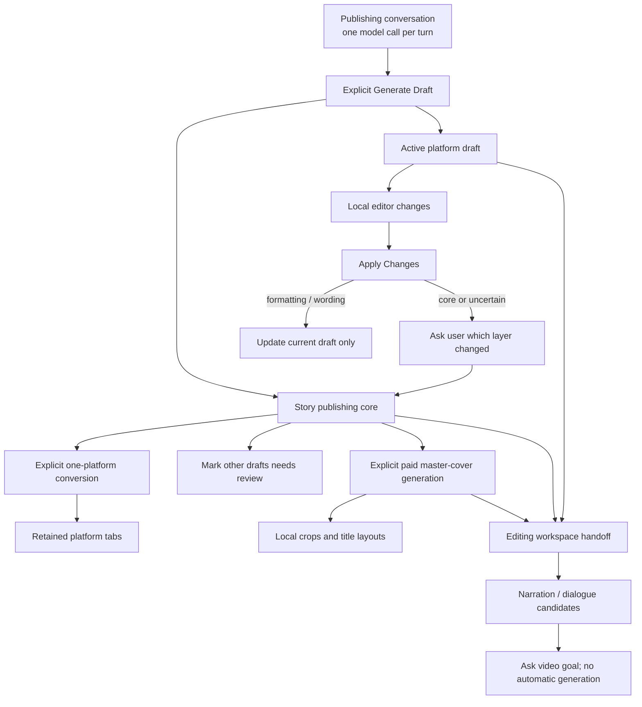
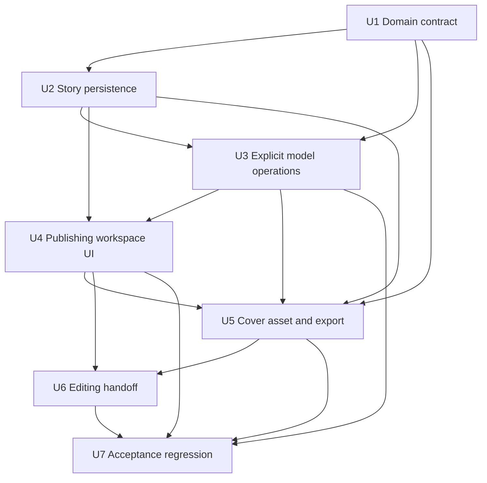
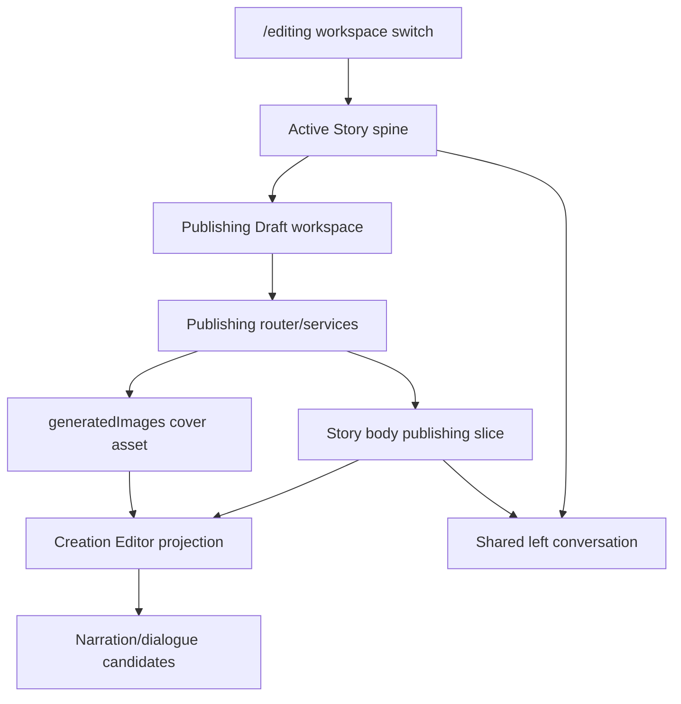

# feat: Add publishing draft workspace

## Summary

Add an independent Publishing Draft workspace beside the editing workspace while keeping Story as the single source of truth. The implementation introduces a typed publishing slice, explicit one-at-a-time model operations, one reusable cover asset, and a downstream handoff that lets the editing workspace inherit the current draft as narration and dialogue candidates without copying or automatically generating video.

---

## Problem Frame

The current story conversation can help a user explore an idea, but it has no durable, editable social-publishing surface and no shared contract for platform variants, cover output, or video handoff. Reusing the generic script and image paths without a publishing boundary would risk flattening the user's voice, issuing hidden model calls, overwriting edited variants, and forcing the user to explain the same story again (see origin: `docs/brainstorms/2026-08-05-publishing-draft-workspace-requirements.md`).

---

## Requirements

- R1. Add a clearly named Publishing Draft workspace beside the editing workspace under `/editing`; both remain attached to the active Story.
- R2. Keep the existing conversation on the left and provide a focused publishing editor on the right.
- R3. Support Xiaohongshu, X, Instagram, LinkedIn, WeChat Moments, and Douyin/TikTok as explicit platform choices.
- R4. Preserve the one-question-at-a-time conversation flow instead of replacing it with a form.
- R5. Generate no draft until the user explicitly selects Generate Publishing Draft.
- R6. Generate only the active platform; never fan out to unrequested platforms.
- R7. Improve structure and wording without weakening facts, viewpoint, emotion, conclusion, or personal edge.
- R8. Retain each platform version in an independent tab without overwriting another platform.
- R9. Convert to one requested target platform at a time while preserving the shared content core.
- R10. Persist one cross-platform story core covering facts, thesis, emotion, voice traits, and visual concept.
- R11. Distinguish platform wording edits from story-core changes.
- R12. Ask when the edit level is uncertain; confirmed core changes mark other drafts as needing review without rewriting them.
- R13. Generate a cover only after an explicit user action.
- R14. Reuse one text-free master visual and adapt crop, ratio, and title layout locally for each platform.
- R15. Provide Copy Text and Download Cover exits without connecting social accounts.
- R16. Let the editing workspace read the current core, platform draft, and cover from the same Story and continue by asking for the video goal.
- R17. Keep Publishing Draft and Editing as independent workspaces with an upstream/downstream relationship; switching preserves publishing state and exposes narration/dialogue candidates without automatic shot splitting, rewriting, video generation, or paid model calls.

**Origin actors:** A1 (user), A2 (conversation editor), A3 (platform adapter), A4 (video editing workspace)

**Origin flows:** F1 (idea to first draft), F2 (single-platform conversion), F3 (wording versus core edit), F4 (cover and downstream video handoff)

**Origin acceptance examples:** AE1–AE7

---

## Success Metrics

- Before the user presses Generate Publishing Draft, the publishing editor remains empty and Publishing chat performs exactly one conversational model call per submitted message.
- First-draft generation creates one core and one active-platform draft; each Convert To action creates at most one requested target and never changes an existing source draft.
- Refreshing, switching Stories, and switching between Publishing Draft and Editing preserve the active platform, accepted drafts, core revision, stale markers, and current cover association.
- Applying formatting-only edits uses zero model calls; a potentially semantic Apply action uses at most one classification call and never updates the core without confirmation.
- One accepted cover-generation action creates one current master asset; all six downloadable platform variants reuse that asset with zero additional image jobs.
- Continue to Video exposes the same Story's core, active draft, cover, narration candidates, and dialogue candidates while issuing zero model, shot, image, or video generation calls.
- Owner-isolation tests show that no Story ID can expose or mutate another user's publishing drafts or cover.

---

## Scope Boundaries

- Do not train or maintain a long-term personal writing-style model in v1.
- Do not add complex version history, diff views, collaboration, or multi-user editing.
- Do not batch-generate all selected platforms or pre-generate unopened tabs.
- Do not generate multiple independent cover concepts for one story by default.
- Do not connect social accounts, publish directly, schedule posts, or ingest performance analytics.
- Do not automatically rewrite an existing platform version after the story core changes.
- Do not turn the Publishing Draft workspace into an overlay owned by the editing workspace.
- Do not split shots, rewrite narration, generate images, or generate video merely because the user switches to Editing.
- Do not refactor unrelated story, prompt-lineage, timeline, or image-generation architecture.

### Deferred to Follow-Up Work

- Direct social publishing, scheduling, and post-performance feedback belong to a later product iteration.
- Manual focal-point adjustment and advanced cover templates can follow after the single-master export path is validated.
- Persistent user voice profiles and reusable personal style presets remain separate work.

---

## Context & Research

### Relevant Code and Patterns

- `client/src/pages/EditingStudioPage.tsx` already owns the left chat/right workspace composition and the Materials/Timeline controls; it is the correct place for the top-level Publishing Draft versus Editing workspace switch.
- `client/src/features/storyAgent/spine/storySpine.ts`, `client/src/features/storyAgent/storyAgentPersistence.ts`, and `client/src/features/storyAgent/StoryAgentContext.tsx` form the canonical client Story state, local recovery, cloud hydration, and queued save boundary.
- `server/routers/storyAgent.ts`, `server/routers/_storyShared.ts`, and `server/services/storySync.ts` provide owner-checked Story reads, revisioned JSON-body persistence, and conservative stale-save handling.
- `server/routers/promptLineage.ts` exposes the owner-checked story conversation aggregate, while `server/archive/storyReply.ts` shows the current natural-reply plus background-extraction behavior that Publishing mode must narrow.
- `server/services/agentRuntime.ts`, `server/_core/agentChannel.ts`, and `server/_core/llmJson.ts` provide the established structured-agent, retry, and loose-JSON parsing patterns.
- `server/services/imageGen.ts`, `shared/imageRenderCost.ts`, `server/services/imageAssets.ts`, and `server/services/storyMaterials.ts` provide image generation, explicit cost confirmation, story-scoped assets, and material projection.
- `client/src/features/creationEditor/CreationEditorContext.tsx` already resolves the active Story and reads `storyGet`; it can project a publishing handoff without creating a second copy.
- `client/src/lib/imageUpload.ts` and `client/src/features/creationEditor/video/frameCrop.ts` establish browser-canvas and deterministic crop helpers for local cover export.
- `client/src/components/ui/tabs.tsx` provides the existing Radix Tabs pattern for retained platform versions.

### Institutional Learnings

- `docs/solutions/2026-06-13-故事为唯一单位-镜头按storyId.md`: Story is the only work unit; every story-scoped read/write must validate `userId`, and current Story identity must never be inferred from “latest story.”
- `docs/solutions/2026-06-13-多worktree环境数据分裂收敛.md`: local persistence is tied to the serving checkout, so implementation and verification must use the configured main service rather than starting a second development server.

### External References

- None required. The repository already contains direct patterns for Story persistence, structured LLM output, cost confirmation, image assets, tabs, canvas export, and video workspace projection. Platform dimensions and copy constraints remain data in a local adapter registry so they can be revised without changing the domain model.

---

## Key Technical Decisions

| Decision                                                                                                                | Rationale                                                                                                                                                           |
| ----------------------------------------------------------------------------------------------------------------------- | ------------------------------------------------------------------------------------------------------------------------------------------------------------------- |
| Store a normalized `publishing` slice inside the existing Story JSON body                                               | Publishing text, cover linkage, and video handoff remain part of one Story without a schema migration or second project model.                                      |
| Make dedicated publishing mutations the only server writer for that slice                                               | Generic full-Story autosaves cannot silently overwrite platform drafts or core revisions; the existing Story save path preserves the server-owned publishing slice. |
| Represent the Story core separately from per-platform drafts                                                            | Platform wording can change independently while facts, viewpoint, emotion, voice, and visual concept retain a traceable revision.                                   |
| Treat Publishing Draft and Editing as sibling workspaces with a downstream handoff                                      | They are different tools, but Editing consumes the same Story's publishing material instead of copying or closing it.                                               |
| Disable editing-agent interception and background card extraction in Publishing conversation mode                       | A publishing chat turn makes one conversational model call; structure is derived only after the user explicitly asks for a draft.                                   |
| Use one structured generation call for the first core plus active-platform draft, and one call per requested conversion | This closes the first-draft flow without hidden fan-out and makes token cost proportional to explicit user actions.                                                 |
| Classify edits only on Apply Changes                                                                                    | Keystrokes and autosave remain local; formatting-only changes use a deterministic fast path, and only potentially semantic changes invoke one classifier call.      |
| Generate one square, text-free, safe-centered master cover                                                              | One stored visual can survive portrait and landscape crops; platform titles and crops remain deterministic client-side exports rather than repeated image jobs.     |
| Store the cover in `generatedImages` with a dedicated publishing-cover classification                                   | The asset gets existing ownership, storage, availability, and current-version behavior without appearing as an unassigned storyboard frame.                         |
| Derive narration and dialogue candidates without a model call during handoff                                            | Paragraphs and explicit quotations can be projected immediately; the user then confirms the video goal before any rewriting, shot creation, or paid work.           |

The v1 platform registry should begin with the following export defaults. These are product defaults, not claims that a platform will never revise its recommendations; keeping them in one registry makes later updates mechanical.

| Platform       | Default cover export |  Ratio | Copy adaptation emphasis                                          |
| -------------- | -------------------: | -----: | ----------------------------------------------------------------- |
| Xiaohongshu    |          1080 × 1440 |    3:4 | Clear cover title, readable short paragraphs, optional topic tags |
| X              |           1600 × 900 |   16:9 | Concise opening, compact body or thread-ready segmentation        |
| Instagram      |          1080 × 1350 |    4:5 | Visual-first caption, compact opening, optional hashtags          |
| LinkedIn       |           1200 × 627 | 1.91:1 | Professional context, evidence, readable paragraph rhythm         |
| WeChat Moments |          1080 × 1080 |    1:1 | Familiar voice, restrained formatting, minimal tagging            |
| Douyin/TikTok  |          1080 × 1920 |   9:16 | Hook-first caption, short lines, optional topic tags              |

---

## Open Questions

### Resolved During Planning

- **Are Publishing Draft and Editing mutually exclusive features?** No. They are independent sibling workspaces; only their visible right-hand surfaces switch, while Publishing remains durable upstream state consumed by Editing.
- **When should edit classification run?** Only on Apply Changes. Pure formatting changes resolve locally; semantic uncertainty gets one explicit classification call.
- **Should platform switching regenerate cover art?** No. It changes only local crop, ratio, and title layout.
- **Should entering Editing automatically create video structure?** No. It exposes read-only narration/dialogue candidates and asks the user for a goal first.

### Deferred to Implementation

- Platform character guidance and safe-area padding may be tuned while implementing the adapter registry, but the six confirmed export dimensions above and deterministic safe-area tests must be present before the unit is complete.
- The final browser-canvas helper composition may reuse or wrap existing crop/upload helpers depending on their current test seams; it must not introduce a server-side render dependency.
- Exact UI copy for generation errors, stale-version badges, and core-change confirmation can be refined during implementation while preserving the state transitions defined here.

---

## Output Structure

    shared/
      publishingDraft.ts
      publishingDraft.test.ts
    server/
      routers/
        publishingDraft.ts
      services/
        publishingDraft.ts
        publishingPersistence.ts
    client/src/features/publishingDraft/
      PublishingDraftWorkspace.tsx
      PublishingPlatformPicker.tsx
      PublishingVideoHandoff.tsx
      publishingVideoHandoff.ts
      publishingCoverExport.ts
      publishingDraftViewModel.ts
      *.test.ts(x)

The tree is the expected responsibility split, not a requirement to preserve these exact filenames if implementation reveals a simpler boundary. Per-unit file lists remain authoritative.

---

## High-Level Technical Design

> _This illustrates the intended approach and is directional guidance for review, not implementation specification. The implementing agent should treat it as context, not code to reproduce._

The durable server slice contains the shared core, active/selected platform identifiers, per-platform draft records with source-core revision and review state, and the current cover asset reference. Transient typing state, pending confirmations, and export previews stay client-side until the user applies them.

---

## Implementation Units

### U1. Define the publishing domain and platform adapters

**Goal:** Establish one normalized, runtime-validated contract for the shared core, six platform drafts, edit state, cover reference, and video handoff projection.

**Requirements:** R3, R7–R12, R14, R17; F2, F3

**Dependencies:** None

**Files:**

- Create: `shared/publishingDraft.ts`
- Create: `shared/publishingDraft.test.ts`
- Modify: `server/archive/storyAgent.types.ts`
- Modify: `server/archive/storyIntent.ts`
- Test: `server/archive/storyIntent.test.ts`

**Approach:**

- Define canonical identifiers for Xiaohongshu, X, Instagram, LinkedIn, WeChat Moments, and Douyin/TikTok, with one registry carrying labels, text guidance, cover dimensions, aspect ratio, and title-safe-area metadata.
- Model a versioned Story core separately from a map of platform drafts. Each draft records its source-core revision, applied content baseline, local/server revision, and whether a later core change requires review.
- Model edit outcomes as wording-only, core-changing, or uncertain. Keep pending user confirmation separate from durable confirmed state.
- Normalize unknown or older persisted shapes to safe empty defaults and reject unsupported platform identifiers at server boundaries.
- Extend intent recognition vocabulary to the six canonical publishing platforms without removing existing non-publishing platforms.

**Execution note:** Implement the domain normalization and transition tests before connecting React or server model calls.

**Patterns to follow:**

- `shared/artDirection.ts` for versioned normalized JSON-domain state.
- `client/src/features/storyAgent/intentTypes.ts` and `server/archive/storyIntent.ts` for tolerant persisted intent normalization.
- `shared/imageRenderCost.ts` for shared client/server contracts.

**Test scenarios:**

- Happy path: normalize a complete core with two platform drafts and retain independent content, source-core revisions, and active platform.
- Covers AE2: selecting three target platforms keeps only the active platform populated; unopened targets remain metadata only.
- Covers AE3: adding an X draft preserves the existing user-edited Xiaohongshu draft byte-for-byte.
- Covers AE4: confirming a core revision marks every other existing platform draft as needing review while leaving its text unchanged.
- Covers AE5: applying a wording-only result updates only the active draft baseline and does not advance the core revision.
- Edge case: unknown platform keys, malformed drafts, duplicate selected platforms, and missing optional cover data normalize without throwing or manufacturing text.
- Intent integration: each of the six canonical platform names and common Chinese/English aliases resolves to the intended platform value.

**Verification:**

- All client and server layers can import one platform/core/draft contract.
- Pure transition tests demonstrate that no operation rewrites an unrelated platform draft.

### U2. Persist the publishing slice without generic Story-save data loss

**Goal:** Hydrate and recover Publishing Draft locally while making dedicated owner-checked server operations authoritative for durable publishing writes.

**Requirements:** R1, R8, R10–R12, R16, R17; F2–F4

**Dependencies:** U1

**Files:**

- Create: `server/services/publishingPersistence.ts`
- Create: `server/services/publishingPersistence.test.ts`
- Modify: `client/src/features/storyAgent/spine/storySpine.ts`
- Modify: `client/src/features/storyAgent/spine/storySpine.test.ts`
- Modify: `client/src/features/storyAgent/storyAgentPersistence.ts`
- Create: `client/src/features/storyAgent/storyAgentPersistence.test.ts`
- Modify: `client/src/features/storyAgent/StoryAgentContext.tsx`
- Modify: `drizzle/schema.ts`
- Modify: `server/services/storySync.ts`
- Create: `server/services/storySync.publishing.test.ts`

**Approach:**

- Add normalized durable publishing state and setters to the Story spine and local `PersistedState`, including empty, hydrate, reset, work-score, and orphan-recovery paths. Store un-applied editor buffers separately as local-only state keyed by Story and platform so refresh/workspace switching cannot lose typing or accidentally promote it to accepted server content.
- Add the publishing shape to the `StoryBody` TypeScript contract without creating a table or database migration.
- Treat the publishing slice as server-owned in generic Story persistence: ordinary Story autosaves preserve the latest server slice instead of replacing it from an older whole-body snapshot.
- Implement a dedicated persistence service that validates Story ownership, reads the latest body, applies a typed publishing operation, advances Story and publishing revisions, and returns the normalized saved state.
- Merge disjoint platform operations on the latest server state. Reject or report same-platform/base-revision conflicts rather than silently choosing an older draft.
- Expose a context action that flushes a local `-1` Story into a real owner-scoped Story before any publishing generation request.

**Execution note:** Add characterization coverage for generic Story stale-save behavior before changing preservation rules.

**Patterns to follow:**

- `server/services/storySync.ts` for Story revision handling and server-field preservation.
- `server/routers/storyAgent.ts` for owner-checked Story creation/update.
- `client/src/features/storyAgent/storyAgentPersistence.ts` for tolerant local recovery.

**Test scenarios:**

- Happy path: local publishing state survives refresh and cloud `storyGet` hydration for the active Story.
- New Story: a local `activeStoryId=-1` with conversation work is persisted once, receives a positive ID, and subsequent publishing writes target that ID.
- Integration: a dedicated draft save advances the Story revision and a later generic autosave preserves the saved publishing slice.
- Concurrency: two operations adding different platform drafts both survive; two stale edits to the same platform return a conflict and preserve the server version.
- Core safety: a confirmed core update advances its revision and marks other drafts stale without changing their content.
- Ownership error: another user cannot read or mutate the publishing slice by Story ID.
- Recovery edge case: malformed local publishing JSON normalizes to an empty workspace while existing messages/cards/shots remain intact.
- Local draft safety: refresh and workspace switching restore an un-applied buffer for the same Story/platform, while opening another Story never displays or uploads that buffer.

**Verification:**

- Publishing data survives refresh, Story switching, and ordinary Story autosave.
- Existing Story fields and revision conflict protections remain unchanged outside the new server-owned slice.

### U3. Add explicit, token-bounded publishing model operations

**Goal:** Provide generation, conversion, and semantic-edit classification APIs whose model calls happen only in response to explicit user actions.

**Requirements:** R4–R7, R9–R12; F1–F3; AE1–AE5

**Dependencies:** U1, U2

**Files:**

- Create: `server/services/publishingDraft.ts`
- Create: `server/services/publishingDraft.test.ts`
- Create: `server/routers/publishingDraft.ts`
- Create: `server/routers.publishingDraft.test.ts`
- Modify: `server/routers/index.ts`
- Modify: `server/routers/storyAgent.ts`
- Modify: `server/archive/storyReply.ts`
- Test: `server/archive/storyAgent.test.ts`
- Modify: `client/src/features/storyAgent/StoryAgentContext.tsx`

**Approach:**

- Add a Publishing interaction mode to Story chat. In that mode the client bypasses the editing-command runner and the server runs only the natural conversational reply, skipping background card extraction and tool proposals.
- On first explicit generation, load the owner-checked Story and bounded recent conversation from server state, preferring the durable conversation aggregate and filling any first/new-Story gap from normalized `body.messages`; then use one structured call to return the shared core plus the active-platform draft.
- On conversion, send the confirmed core and one source draft to one target-platform adapter; do not read or generate any other target.
- Validate and normalize all model output before persistence. A timeout, malformed response, or provider error leaves prior core/drafts unchanged and returns a retryable UI error.
- Expose an owner-checked read endpoint alongside the operation mutations so Publishing and Editing receive the same normalized server slice and current-cover projection.
- On Apply Changes, run a deterministic formatting-only check first. Invoke one classifier only when content may have changed semantically; return wording/core/uncertain plus a proposed core update, but persist no core change until the user confirms.
- Bound conversation and draft context to the material required for the requested operation, and record operation/model metadata without storing hidden chain-of-thought.

**Execution note:** Start with failing service and router contract tests that assert call counts and no-mutation failure behavior.

**Patterns to follow:**

- `server/services/agentRuntime.ts` for structured JSON agents and fallbacks.
- `server/archive/storyReply.ts` for natural-language reply handling and provider error recovery.
- `server/routers/promptLineage.ts` for owner-checked conversation access.

**Test scenarios:**

- Covers AE1: ordinary Publishing chat asks one concise follow-up and performs exactly one model call without generating a draft.
- Covers AE1: clicking Generate after sufficient conversation makes one structured call and retains the user's critical thesis and quoted wording in the normalized result.
- Covers AE2: generating Xiaohongshu with three selected targets calls the model once and creates no X or LinkedIn content.
- Covers AE3: converting to X calls the model once, creates only X, and does not mutate the Xiaohongshu source.
- Existing target: requesting a platform that already has an edited draft opens/returns it and does not regenerate or overwrite it in v1.
- Covers AE5: whitespace, paragraph-break, and punctuation-only edits classify locally with zero model calls.
- Covers AE4: a changed conclusion invokes one classifier call and returns a core-change confirmation without mutating the core.
- Uncertain path: ambiguous semantic output asks the user to choose wording or core instead of guessing.
- Error path: model timeout, invalid JSON, or normalization failure returns an error and leaves the prior durable state unchanged.
- Ownership path: generation, conversion, classification, and apply operations reject an inaccessible Story before invoking a model.
- Regression: normal non-Publishing Story chat retains its existing reply/extraction behavior.

**Verification:**

- Instrumented tests prove the maximum model-call count for each user action.
- No API path can batch-generate platforms or confirm a core change implicitly.

### U4. Build the independent Publishing Draft workspace

**Goal:** Add the `/editing` Publishing Draft entry, platform-aware conversation controls, retained editor tabs, explicit generation/apply flows, and copy output.

**Requirements:** R1–R12, R15, R17; F1–F3; AE1–AE5

**Dependencies:** U2, U3

**Files:**

- Create: `client/src/features/publishingDraft/PublishingDraftWorkspace.tsx`
- Create: `client/src/features/publishingDraft/PublishingDraftWorkspace.test.tsx`
- Create: `client/src/features/publishingDraft/PublishingPlatformPicker.tsx`
- Create: `client/src/features/publishingDraft/PublishingPlatformPicker.test.tsx`
- Create: `client/src/features/publishingDraft/publishingDraftViewModel.ts`
- Create: `client/src/features/publishingDraft/publishingDraftViewModel.test.ts`
- Modify: `client/src/pages/EditingStudioPage.tsx`
- Modify: `client/src/features/storyAgent/views/StoryAgentChat.tsx`
- Modify: `client/src/app/shell/TopBar.test.tsx`
- Modify: `client/src/features/creationEditor/spine-bridge.test.ts`

**Approach:**

- Introduce a top-level workspace switch between Publishing Draft and Editing. Switching replaces only the right-hand surface and interaction mode; it never resets publishing state or the active Story.
- Keep Materials, Timeline, and video Export controls scoped to Editing while giving Publishing its own Generate, Apply Changes, Convert To, Copy Text, Generate Cover, Download Cover, and Continue to Video actions.
- Pass Publishing interaction mode into the existing left chat so its platform picker is available near the composer and editing commands are not intercepted.
- Require an active platform before enabling Publishing chat submission; selecting it also confirms `social_post` intent, preventing an additional intent-recognition call from running beside the one allowed conversational call.
- Let the picker maintain both one active platform and an optional multi-select target list. The list controls visible Convert To choices only; selecting it never generates drafts.
- Display only existing platform drafts as tabs. Selected-but-uncreated platforms remain conversion choices, not empty generated tabs.
- Keep six-platform tab navigation keyboard-accessible and horizontally scrollable at narrow widths rather than shrinking labels into unreadable controls.
- Keep editor keystrokes in a local dirty buffer. Apply Changes runs the U3 classification flow; core/uncertain results open a focused confirmation instead of autosaving semantic decisions.
- Preserve local dirty buffers when switching sibling workspaces. Before changing to another Story, require an explicit Apply, Discard, or Stay choice so personal writing cannot disappear or leak across Story scope.
- Show each draft's save state, source-core freshness, and “needs review” status without automatically regenerating it.
- Copy only the active platform's publishable text and provide clear success/failure feedback for clipboard restrictions.

**Execution note:** Implement the view model and state-transition tests before the full component layout.

**Patterns to follow:**

- `client/src/components/ui/tabs.tsx` for retained platform tabs.
- `client/src/pages/EditingStudioPage.tsx` for shared chat/workspace composition.
- `client/src/features/storyAgent/views/StoryAgentChat.tsx` for intent display and composer behavior.

**Test scenarios:**

- Covers AE1: Publishing opens beside the existing chat; conversation alone never populates the editor, and Generate creates the active tab.
- Covers AE2: multi-select platform intent still generates only the active platform and exposes other platforms as Convert To choices.
- Covers AE3: converting to X adds and activates an X tab while preserving the edited Xiaohongshu tab.
- Covers AE4: a possible thesis change shows a wording-versus-core confirmation; confirming core marks other tabs for review without changing text.
- Covers AE5: paragraph-only edits apply to the active tab without a confirmation modal or other-tab state changes.
- Workspace independence: switching Publishing → Editing → Publishing restores the same active platform, dirty buffer, and generated tabs.
- Story-switch safety: a dirty buffer blocks immediate Story replacement until the user applies, discards, or stays; the next Story never receives the previous Story's text.
- Narrow layout: all six platforms remain reachable by keyboard and horizontal scrolling without covering the editor actions.
- Empty state: no active Story shows a clear start/open Story prompt and performs no API call.
- Failure path: generation, conversion, save, and clipboard errors preserve the editor content and offer a retry.
- Accessibility: workspace switch, platform tabs, editor, status badges, and all actions have names, keyboard focus, and correct pressed/selected states.

**Verification:**

- The Publishing and Editing workspaces can be switched independently without losing state.
- Every generation-affecting action is explicit and disabled while its one corresponding request is in flight.

### U5. Generate one publishing cover and export deterministic platform variants

**Goal:** Add explicit, cost-confirmed master-cover generation, classify it as a publishing asset, and export platform crops/titles locally.

**Requirements:** R13–R15; F4; AE6

**Dependencies:** U1, U2, U3, U4

**Files:**

- Modify: `shared/imageAsset.ts`
- Modify: `shared/imageRenderCost.ts`
- Modify: `shared/imageRenderCost.test.ts`
- Modify: `server/services/imageAssets.ts`
- Modify: `server/services/imageAssets.test.ts`
- Modify: `server/services/storyMaterials.ts`
- Modify: `server/services/storyMaterials.test.ts`
- Modify: `client/src/features/creationAgent/imageAssetViewModel.ts`
- Modify: `client/src/features/creationAgent/imageAssetViewModel.test.ts`
- Modify: `server/routers/publishingDraft.ts`
- Modify: `server/routers.publishingDraft.test.ts`
- Create: `client/src/features/publishingDraft/publishingCoverExport.ts`
- Create: `client/src/features/publishingDraft/publishingCoverExport.test.ts`
- Modify: `client/src/features/publishingDraft/PublishingDraftWorkspace.tsx`
- Modify: `client/src/features/publishingDraft/PublishingDraftWorkspace.test.tsx`

**Approach:**

- Add a dedicated publishing-cover `ImageAssetKind` and assignment, recognized before numeric/style shot parsing through a reserved publishing cover marker.
- Compose the cover prompt deterministically from the confirmed core's visual concept and active draft, then reuse `generateImage` for one square, text-free, safe-centered master visual. Do not spend a separate text-model call to rewrite the image prompt. Persist the result with the current Story and make a newer cover supersede only the prior publishing cover.
- Extend the existing shared estimate/confirmation contract so the client displays an estimated CNY cost and the server revalidates the accepted estimate before invoking the provider.
- Keep publishing covers out of `storyImages`, storyboard shot groups, and unassigned material buckets while exposing the current cover through the publishing API.
- Render platform-specific crops, title layout, safe-area padding, and output dimensions with browser canvas. Use the authenticated/stable image route so canvas export is not tainted by remote CORS.
- Platform switching and repeated downloads reuse the same master image and make zero image-model calls.

**Execution note:** Add asset-projection and cost-confirmation tests before connecting the paid generation action.

**Patterns to follow:**

- `shared/imageAsset.ts` and `server/services/imageAssets.ts` for semantic asset classification.
- `shared/imageRenderCost.ts` and `storyAgent.generateForMobile` for server-revalidated cost consent.
- `client/src/lib/imageUpload.ts` and `client/src/features/creationEditor/video/frameCrop.ts` for canvas loading, crop, and Blob export.

**Test scenarios:**

- Covers AE6: explicit confirmed generation invokes the image provider once, persists one current publishing cover, and returns it to the workspace.
- Cost guard: missing, rejected, or stale cost confirmation invokes no image provider and returns the current estimate.
- Covers AE6: changing from Xiaohongshu to Instagram exports different dimensions/crops from the same cover asset ID with zero generation calls.
- Asset isolation: publishing covers are absent from story-frame projection, Story Cards mobile images, storyboard shot groups, and unassigned material lists.
- Replacement: generating a new cover marks only the previous publishing cover non-current and does not affect shot or style-reference images.
- Ownership: another user cannot fetch or regenerate a Story's cover.
- Export edge cases: long title wrapping, empty optional title, portrait/landscape crop, high-DPI canvas, image-load failure, and blocked download produce deterministic output or a recoverable error.
- Failure path: provider or storage failure keeps the prior cover current and leaves platform drafts unchanged.

**Verification:**

- One master cover can be downloaded for all six platform adapters without additional provider jobs.
- Existing image and material surfaces show no publishing cover leakage.

### U6. Hand publishing material downstream into Editing

**Goal:** Let Editing consume the current publishing core, active draft, cover, narration candidates, and dialogue candidates from the same Story without automatic generation.

**Requirements:** R16, R17; F4; AE7

**Dependencies:** U4, U5

**Files:**

- Create: `client/src/features/publishingDraft/publishingVideoHandoff.ts`
- Create: `client/src/features/publishingDraft/publishingVideoHandoff.test.ts`
- Create: `client/src/features/publishingDraft/PublishingVideoHandoff.tsx`
- Create: `client/src/features/publishingDraft/PublishingVideoHandoff.test.tsx`
- Modify: `client/src/features/creationEditor/CreationEditorContext.tsx`
- Modify: `client/src/features/creationEditor/types.ts`
- Modify: `client/src/features/creationEditor/views/EditingNleWorkspace.tsx`
- Modify: `client/src/features/storyAgent/chatStoryContext.ts`
- Modify: `client/src/features/storyAgent/chatStoryContext.test.ts`
- Modify: `client/src/pages/EditingStudioPage.tsx`
- Modify: `client/src/features/creationEditor/spine-bridge.test.ts`

**Approach:**

- Project a read-only publishing handoff from `storyGet` plus the publishing cover query inside `CreationEditorContext`; do not copy it into shots, scripts, or timeline data.
- Derive narration candidates from publishable body paragraphs and dialogue candidates from explicit quotations/direct-speech structure with deterministic pure functions. Preserve source text and source platform references.
- When Continue to Video is clicked, switch to Editing, show a compact source/handoff surface, and present a deterministic “what video do you want to make?” prompt without calling a model.
- Add the core, active draft summary, and candidate digest to the next Story chat context so the user's answer continues from the publishing material.
- Require an explicit subsequent user action before converting candidates into script/shots or invoking existing video/image generation.

**Execution note:** Keep handoff derivation pure and tested before integrating it into the large Creation Editor context.

**Patterns to follow:**

- `client/src/features/creationEditor/CreationEditorContext.tsx` for active-Story projections.
- `client/src/features/storyAgent/chatStoryContext.ts` for compact Story context passed to the conversation agent.
- `client/src/features/creationEditor/spine-bridge.test.ts` for enforcing provider boundaries.

**Test scenarios:**

- Covers AE7: Continue to Video preserves Publishing state, switches to Editing, and exposes core, X draft, and cover from the same Story ID.
- Covers AE7: prose paragraphs become narration candidates, quoted lines become dialogue candidates, and every candidate preserves its original text.
- No paid side effects: workspace switching invokes no chat, image, shot, or video generation mutation.
- Missing optional data: a draft without cover still hands off text; a cover without an active draft does not manufacture narration.
- Stale draft: Editing surfaces the needs-review state instead of silently using a regenerated or rewritten version.
- Chat integration: the first video-goal answer includes publishing context once, without asking the user to restate the story.
- Regression: existing Editing Story/shot/timeline loading still depends only on the active Story provider and does not import StoryAgent React context directly.

**Verification:**

- Editing visibly receives upstream publishing material and asks for direction before any transformation.
- No duplicate publishing payload is created in the timeline, shot list, or script state during handoff.

### U7. Close acceptance flows and guard regressions

**Goal:** Prove the complete user flows, model-call boundaries, Story ownership, refresh recovery, workspace switching, and unchanged editing/image behavior.

**Requirements:** R1–R17; F1–F4; AE1–AE7

**Dependencies:** U3, U4, U5, U6

**Files:**

- Create: `client/src/features/publishingDraft/publishingDraftFlow.test.tsx`
- Modify: `server/routers.publishingDraft.test.ts`
- Modify: `server/routers.storyAgent.test.ts`
- Modify: `client/src/features/creationEditor/spine-bridge.test.ts`
- Modify: `client/src/app/shell/TopBar.test.tsx`

**Approach:**

- Add one integration-style client flow that covers idea conversation, explicit first generation, local editing/apply, one-platform conversion, cover consent/generation, export, and downstream handoff.
- Add server call-count assertions around chat, draft generation, conversion, edit classification, cover generation, and passive workspace switching.
- Exercise refresh and Story switching against normalized local and server state so no draft, active platform, stale marker, or cover reference disappears.
- Preserve the existing static architecture boundaries for Story spine, Creation Editor provider, material projection, and `/editing` composition while extending them for the new sibling workspace.

**Patterns to follow:**

- `server/routers.storyAgent.test.ts` for authenticated Story lifecycle integration coverage.
- `client/src/features/creationEditor/spine-bridge.test.ts` for source-level architecture boundary assertions.
- Existing feature-level tests under `client/src/features/storyAgent/` for refresh and Story-switch isolation.

**Test scenarios:**

- Covers AE1–AE7 in sequence for a single Story, including refresh between platform conversion and cover generation.
- Call budget: N Publishing chat turns produce N conversational calls and zero extraction/editing calls; each explicit generation/conversion/classification/cover action produces at most its one allowed provider call.
- Multi-Story isolation: switching Stories never shows another Story's drafts, cover, active platform, or narration candidates.
- Workspace isolation: Materials/Timeline/Export keep their existing Editing behavior, while Publishing remains durable and independently reopenable.
- Failure recovery: retry after generation, persistence, clipboard, canvas, or provider failure does not duplicate platform versions or overwrite accepted text.
- Regression: existing Story Agent, Story Images, Material Warehouse, Creation Editor, and prompt-lineage tests remain behaviorally unchanged outside Publishing mode.

**Verification:**

- Every origin acceptance example has an automated assertion at the most appropriate layer.
- The feature can be demonstrated end to end without an unrequested model call or duplicate Story copy.

---

## System-Wide Impact

- **Interaction graph:** `/editing` selects the visible sibling workspace; both use the active Story. Publishing UI calls dedicated publishing APIs, which update the Story body and optional cover asset. Creation Editor and Story chat read that same state for downstream work.
- **Error propagation:** conversational, structured-text, persistence, image, and canvas failures remain separate and recoverable. No failed downstream operation may clear a prior draft, core, or cover.
- **State lifecycle risks:** local dirty buffers, server revisions, core revisions, platform freshness, and current-cover selection must transition atomically enough that refresh never converts an unconfirmed edit into confirmed core state.
- **API surface parity:** desktop `/editing` is the v1 surface. Existing mobile Story chat keeps its behavior; shared Story data remains readable later without adding mobile publishing UI now.
- **Integration coverage:** cross-layer tests must prove active Story ownership, local-to-cloud draft promotion, generic autosave preservation, generated-image classification, and Editing handoff.
- **Unchanged invariants:** Story remains the sole work unit; `userId` gates every Story/asset operation; generic Story chat outside Publishing keeps current behavior; Story Images and Material Warehouse remain shot/style oriented; workspace switching triggers no paid generation.

---

## Alternative Approaches Considered

- **Store drafts in a new relational table:** Rejected for v1 because the existing Story JSON body is already the canonical cross-surface payload. A dedicated writer plus typed normalization provides safe boundaries without a migration; a table can be reconsidered if draft history or collaboration arrives.
- **Reuse generated scripts or Story Cards as platform drafts:** Rejected because those shapes carry storyboard semantics and would blur platform wording with the shared content core.
- **Make Publishing an Editing overlay:** Rejected after user clarification. Publishing is an independent upstream workspace; only the viewport switches.
- **Run semantic classification on every keystroke or blur:** Rejected because it creates unnecessary latency/cost and can race with typing. Apply Changes is the explicit semantic boundary.
- **Generate one image per platform or render covers on the server:** Rejected because it repeats paid work and creates variant drift. One stored master plus deterministic local exports meets the confirmed scope.
- **Copy publishing data into video scripts/shots during handoff:** Rejected because copies drift. Editing reads a projection and waits for explicit transformation intent.

---

## Risk Analysis & Mitigation

| Risk                                                                           | Likelihood | Impact | Mitigation                                                                                                                           |
| ------------------------------------------------------------------------------ | ---------- | ------ | ------------------------------------------------------------------------------------------------------------------------------------ |
| Generic Story autosave overwrites a newer publishing draft                     | Medium     | High   | Make the publishing slice server-owned, preserve it in generic saves, and route writes through revision-aware publishing operations. |
| Hidden model fan-out recreates the cost problem this feature is meant to solve | Medium     | High   | Add interaction mode, explicit operation endpoints, provider call-count tests, and no-call assertions for typing/switching.          |
| Platform adaptation weakens the user's viewpoint                               | Medium     | High   | Separate core from expression, include invariant fields in prompts/validation, and require confirmation for core changes.            |
| Ambiguous edits update the wrong layer                                         | Medium     | High   | Use deterministic formatting fast path, semantic classifier only on Apply, and explicit user choice for core/uncertain outcomes.     |
| Publishing covers leak into storyboard materials                               | Medium     | Medium | Add a first-class cover kind/assignment and projection tests across Story Images, material state, and client view models.            |
| Canvas export fails because the stored image is cross-origin                   | Medium     | Medium | Load through the existing authenticated/stable image route and surface recoverable export errors.                                    |
| Very different platform ratios crop out the subject                            | Medium     | Medium | Generate a square safe-centered master, encode safe areas per adapter, and keep advanced focal-point controls deferred.              |
| Downstream handoff accidentally starts shot/video generation                   | Low        | High   | Keep projection pure/read-only and assert zero mutations on workspace switch and Continue to Video.                                  |
| Current dirty workspace contains unrelated code changes during implementation  | High       | Medium | Implementers must inspect status, edit only listed files, and avoid reset/merge/restart operations outside the active task.          |

---

## Phased Delivery

### Phase 1 — Contracts and safe server behavior

- Complete U1–U3: domain contract, Story persistence boundary, chat call suppression, and explicit generation/conversion/classification operations.
- This phase is complete only when tests prove owner checks, failure no-mutation, and one-call limits.

### Phase 2 — Publishing creation surface

- Complete U4–U5: independent workspace, platform editor, copy, paid cover generation, and local exports.
- Keep Editing unchanged except for the top-level workspace entry until the upstream flow is stable.

### Phase 3 — Downstream handoff and regression closure

- Complete U6–U7: read-only Editing projection, narration/dialogue candidates, video-goal prompt, full acceptance flow, and regression gates.

---

## Documentation / Operational Notes

- No database migration or new environment variable is planned.
- Paid cover generation must use the existing image-provider configuration and explicit CNY confirmation contract; workspace switching, local export, and narration/dialogue derivation are free local operations.
- Implementation must use the configured main repository service for browser verification and must not start a second dev server from a worktree.
- Logs should identify operation type, Story ID, platform, provider/model label, duration, success/failure, and call count, but must not log full private drafts or model reasoning.

---

## Sources & References

- **Origin document:** [docs/brainstorms/2026-08-05-publishing-draft-workspace-requirements.md](../brainstorms/2026-08-05-publishing-draft-workspace-requirements.md)
- Related Story state: `client/src/features/storyAgent/spine/storySpine.ts`
- Related Story persistence: `client/src/features/storyAgent/StoryAgentContext.tsx`, `server/services/storySync.ts`
- Related conversation: `server/archive/storyReply.ts`, `server/routers/promptLineage.ts`
- Related image assets: `shared/imageAsset.ts`, `server/services/imageAssets.ts`
- Related editing handoff: `client/src/features/creationEditor/CreationEditorContext.tsx`
