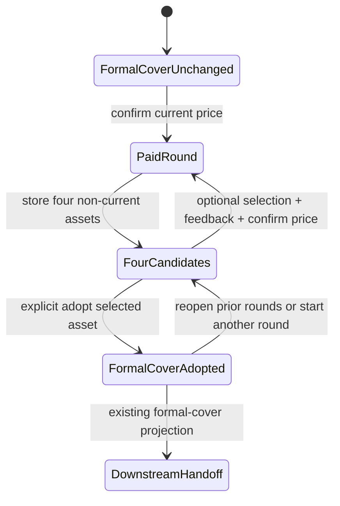

# feat: Add publishing cover candidate workflow

## Summary

Extend the existing Publishing Draft cover flow from a single immediately-adopted image into persisted four-image exploration rounds. Generation and adoption become separate operations: each paid round produces recoverable candidates, optional natural-language feedback can use one selected candidate as its visual reference, and only an explicit adoption updates the formal cover consumed by downstream workspaces.

---

## Problem Frame

The current route stores the first Midjourney result directly as the Story's formal cover. That removes user choice, lets unattractive or text-corrupted output leak into downstream workspaces, and cannot restore or iterate on the other candidates already returned by the provider (see origin: `docs/brainstorms/2026-08-05-publishing-draft-workspace-requirements.md`).

---

## Requirements

- R13. One explicitly confirmed paid round presents four independently selectable candidates without adopting any of them.
- R14. Candidate exploration never overwrites the existing formal cover; only an explicit adoption updates the shared cover and downstream handoff.
- R18. The dialog supports selecting a candidate and entering natural-language feedback; a selected candidate becomes the next round's visual reference, while no selection means a fresh story-based concept.
- R19. Every paid round re-confirms the current CNY estimate, while selection and adoption are free; paid rounds survive dialog close and page refresh.
- R20. Prompts explicitly suppress readable text, gibberish, logos, signatures, UI chrome, and watermarks without claiming automated visual inspection.

**Origin actors:** A1 (user), A2 (conversation editor), A4 (video creation workspace)

**Origin flows:** F4 (publishing draft to cover exploration and video handoff)

**Origin acceptance examples:** AE6, AE8–AE11

---

## Scope Boundaries

- Do not automatically rank, preselect, or adopt a candidate.
- Do not add masks, brushes, layers, OCR moderation, or per-platform image generation.
- Do not submit real paid jobs during implementation or automated verification; provider behavior is exercised through mocks.
- Do not replace the existing formal-cover export or downstream handoff contract.
- Do not add a database migration; candidate rounds remain a normalized additive part of the existing Story publishing slice.

---

## Context & Research

### Relevant Code and Patterns

- `server/services/imageGen.ts` already receives `imageUrls` from the 302 Midjourney task but currently stores only the first URL. Its additive result contract can expose all stored candidates without breaking existing callers.
- `shared/publishingDraft.ts` and `server/services/publishingPersistence.ts` already normalize and revision-write the Story publishing slice, including the formal `cover` reference.
- `server/routers/publishingDraft.ts` already owns Story/user authorization, current-price confirmation, prompt composition, generated-image creation, and formal cover promotion.
- `client/src/features/publishingDraft/PublishingDraftWorkspace.tsx` already contains the cover confirmation dialog and can evolve it into the single exploration surface while retaining the current formal cover card.
- `generatedImages.isCurrent = false` is the existing non-adopted asset state; `promoteStoryImageToCurrent` is the existing explicit adoption boundary.

### Institutional Learnings

- `docs/solutions/2026-06-13-故事为唯一单位-镜头按storyId.md`: every candidate read and mutation must remain owner-scoped to the active Story.
- `docs/solutions/2026-06-13-多worktree环境数据分裂收敛.md`: browser verification must use the already-serving worktree instead of starting a competing checkout.

### External References

- None required. The repository contains direct patterns for multi-image Midjourney results, Story persistence, asset promotion, cost consent, dialogs, and image-to-image references.

---

## Key Technical Decisions

- Persist candidate rounds as asset-ID metadata inside the existing publishing slice. Generated image bytes and prompts remain in `generatedImages`; the Story only carries round identity, lineage, feedback, source-core revision, candidate IDs, and timestamps.
- Keep `publishing.cover` as the sole formal-cover contract. Existing export and downstream consumers remain unchanged and therefore cannot accidentally inherit candidates.
- Prefer the provider's `imageUrls` array over a combined `imageUrl` when both exist, deduplicate URLs, store up to four results, and require four stored candidates before a round is considered successful.
- Use the existing Midjourney image-edit path for selected-candidate feedback so the selected local asset is sent as the reference image. A feedback round without a selection uses the story prompt as a fresh text-to-image request.
- Keep candidate selection and draft feedback client-local. Paid round metadata is durable; reopening starts on the latest round with no automatic candidate selection.
- Re-read the latest publishing state after the paid provider call before appending the round. This preserves paid results if unrelated draft state advanced while generation was in flight; the batch records the source core revision used to generate it.

---

## Open Questions

### Resolved During Planning

- How are candidates separated from the formal cover? Candidate images remain non-current and are referenced only by cover rounds; adoption alone updates `publishing.cover` and promotes one image.
- How is a selected image used for feedback? The server verifies that the asset belongs to a stored round for the same Story/user, loads it, and passes it through the existing Midjourney image-to-image path.
- What survives refresh? All paid round metadata and image assets survive; unsent feedback and a transient selection do not.
- Does adoption cost money? No. It is a persistence and promotion operation against an existing asset.

### Deferred to Implementation

- Exact dialog microcopy and compact responsive spacing may be tuned during browser inspection while preserving the confirmed state transitions and visible price boundary.

---

## High-Level Technical Design

> *This illustrates the intended approach and is directional guidance for review, not implementation specification. The implementing agent should treat it as context, not code to reproduce.*

---

## Implementation Units

### U1. Preserve all Midjourney candidate outputs

**Goal:** Convert one successful Midjourney task into a stable four-image result without changing single-image callers.

**Requirements:** R13, R19, R20; AE8

**Dependencies:** None

**Files:**

- Modify: `server/services/imageGen.ts`
- Modify: `server/services/imageGen.test.ts`
- Modify: `shared/imageRenderCost.ts`
- Modify: `shared/imageRenderCost.test.ts`

**Approach:**

- Add an optional ordered candidate collection to the image-generation result while preserving `imageUrl` and `imageKey` as the first candidate for existing consumers.
- Normalize string and object-shaped 302 URLs, prefer the individual array, deduplicate, store each result through the existing local-first asset path, and surface partial failures instead of pretending four candidates exist.
- Update the publishing cover profile and quote to advertise four candidates for one paid Midjourney task.

**Execution note:** Extend the 302 object-array characterization test before changing result handling.

**Patterns to follow:**

- `server/services/imageGen.test.ts` 302 Midjourney polling tests.
- `shared/imageRenderCost.ts` storyboard four-candidate quote contract.

**Test scenarios:**

- Happy path: a response containing four object URLs downloads and stores all four in provider order while retaining the first as `imageUrl`.
- Edge case: combined `imageUrl` plus four individual URLs returns four individual candidates, not five or a combined grid.
- Edge case: duplicate or blank URLs are removed.
- Error path: one candidate storage failure produces an explicit incomplete-result error and never reports a valid four-image round.
- Regression: a legacy single `imageUrl` response still returns a valid single-image result to existing non-publishing callers.

**Verification:**

- One mocked provider task exposes four stable local URLs and the existing single-image API fields remain compatible.

### U2. Persist cover exploration rounds separately from the formal cover

**Goal:** Add normalized, revision-safe candidate lineage to the Story publishing slice without changing the formal cover contract.

**Requirements:** R13, R14, R18, R19; AE8–AE11

**Dependencies:** U1

**Files:**

- Modify: `shared/publishingDraft.ts`
- Modify: `shared/publishingDraft.test.ts`
- Modify: `server/services/publishingPersistence.ts`
- Modify: `server/services/publishingPersistence.test.ts`

**Approach:**

- Add a cover-round record with stable ID, platform, source-core revision, optional parent candidate, feedback, four asset IDs, and creation time.
- Normalize old Stories to an empty round list and reject malformed, duplicate, or non-positive asset IDs without corrupting the formal cover.
- Add an append-round write operation that increments publishing revision but does not touch `cover`.

**Execution note:** Implement normalization and persistence transition tests before router integration.

**Patterns to follow:**

- `normalizePublishingDraftState` for additive persisted fields.
- `writePublishingDraftState` for owner-scoped, serialized Story writes.

**Test scenarios:**

- Covers AE8: appending one four-ID round leaves `cover` null and advances publishing revision once.
- Covers AE10: normalization after serialization restores all paid rounds while retaining the prior formal cover.
- Edge case: older state without rounds normalizes to an empty collection.
- Edge case: malformed rounds or invalid asset IDs are discarded rather than exposed.
- Conflict path: a stale append revision is rejected without changing prior rounds or formal cover.

**Verification:**

- Refreshable publishing state contains candidate lineage and formal cover as distinct fields.

### U3. Split generation from explicit candidate adoption in the publishing API

**Goal:** Return recoverable four-image rounds and make adoption the only operation that changes the formal cover or downstream image currentness.

**Requirements:** R13, R14, R18–R20; AE6, AE8–AE11

**Dependencies:** U1, U2

**Files:**

- Modify: `server/routers/publishingDraft.ts`
- Modify: `server/routers.publishingDraft.test.ts`

**Approach:**

- Extend the read response with owner-validated candidate assets grouped by persisted round.
- Change `generateCover` to accept optional feedback and an optional reference asset, invoke text-to-image or image-to-image exactly once after cost confirmation, create four non-current publishing assets, and append a round without setting or promoting the cover.
- Add `adoptCoverCandidate` to verify candidate membership and ownership, promote the selected asset, and then update `publishing.cover`; if promotion fails, leave the previous formal cover unchanged.
- Compose feedback prompts as explicit deltas while retaining story context, art direction, empty headline space, and strong no-text/no-logo/no-watermark constraints.

**Execution note:** All router tests use mocked provider and database functions; do not submit a real image job.

**Patterns to follow:**

- Existing `generateCover` ownership and price-revalidation behavior.
- Existing `promoteStoryImageToCurrent` explicit-selection transaction.

**Test scenarios:**

- Covers AE8: one confirmed generation calls the provider once, creates four `isCurrent: false` assets, appends one round, and never calls promotion or `set_cover`.
- Cost guard: missing or stale confirmation calls neither generation nor edit.
- Covers AE9: selected candidate plus feedback calls the image-edit path once with that asset as reference and appends a child round; no selection calls text-to-image.
- Ownership: an asset from another Story/user or outside the Story's persisted rounds cannot be used as a reference or adopted.
- Covers AE10: generation with an existing formal cover leaves that cover unchanged on success and failure.
- Covers AE11: adoption promotes exactly one existing candidate and updates `publishing.cover`; unadopted candidates remain non-current and absent from downstream projection.
- Error path: fewer than four stored candidates returns a recoverable error and does not append a round.

**Verification:**

- The API response makes it impossible for generation alone to change the formal cover consumed by other workspaces.

### U4. Build the four-candidate conversation dialog

**Goal:** Give the user a clear, attractive, recoverable place to compare four candidates, request another round, and explicitly adopt one.

**Requirements:** R13, R14, R18–R20; AE6, AE8–AE11

**Dependencies:** U2, U3

**Files:**

- Modify: `client/src/features/publishingDraft/PublishingDraftWorkspace.tsx`
- Modify: `client/src/features/publishingDraft/PublishingDraftWorkspace.test.tsx`
- Modify: `client/src/features/publishingDraft/publishingDraftFlow.test.ts`

**Approach:**

- Replace the one-shot confirmation modal with one cover studio dialog containing round navigation, a responsive 2×2 candidate grid, explicit selected state, natural-language feedback input, current-round price confirmation, and an adoption action.
- Opening with prior rounds restores the latest paid round and existing formal cover; no candidate is automatically selected.
- The initial empty dialog explains the one-task/four-candidate quote. Subsequent feedback generation clearly distinguishes “based on selected image” from “fresh concept.”
- Adoption closes or settles the dialog, refreshes the formal cover card, and reuses the existing downstream handoff; generating another round leaves that card untouched.
- Use existing paper-like surfaces, restrained gold accent, Radix focus behavior, visible loading states, and 3:4 thumbnails without overlaying generated text.

**Patterns to follow:**

- Existing Publishing Draft editor visual language and `Dialog` primitives.
- Existing Story-scoped query cache update guard in `PublishingDraftWorkspace.tsx`.

**Test scenarios:**

- Covers AE8: first confirmation renders four candidates, none selected, and no formal-cover success message.
- Covers AE9: selecting candidate two changes the feedback action label/context; submitting feedback shows the next four-image round and keeps the previous round navigable.
- Covers AE10: closing and reopening restores server-returned rounds and leaves the prior formal cover visible.
- Covers AE11: only clicking Adopt updates the formal cover UI and makes it available to downstream consumers.
- Interaction guard: selection and adoption never display a price or invoke `generateCover`; every new paid round displays and revalidates the estimate.
- Responsive/accessibility: grid, round navigation, input, candidates, selected state, loading state, and actions remain named and keyboard reachable at desktop and narrow widths.
- Failure path: generation or adoption errors keep existing rounds, selection, feedback, and formal cover available for retry.

**Verification:**

- Browser inspection with mocked candidate responses proves the full dialog loop without making a real paid request.

---

## System-Wide Impact

- **Interaction graph:** Publishing dialog calls candidate generation; generation stores non-current assets and round metadata; adoption alone promotes an asset and updates the existing formal-cover projection used by export, Materials, Storyboard, and Editing.
- **Error propagation:** provider/storage failures stay within the paid round action; adoption failures preserve both prior formal cover and candidates; client errors do not clear cached rounds.
- **State lifecycle risks:** paid output can finish after another publishing edit, so round append must merge against the latest state while retaining the source-core revision used by the job.
- **API surface parity:** existing formal `coverAsset` remains unchanged; only the Publishing read response gains candidate rounds and the router gains adoption.
- **Integration coverage:** router tests prove asset ownership, non-promotion, and explicit adoption; client tests prove no automatic selection/adoption; browser verification proves the visible state transitions.
- **Unchanged invariants:** Story is the only work unit, `userId` guards every asset, platform switching is free, formal cover download remains local, and downstream workspaces consume only `publishing.cover`.

---

## Risks & Dependencies

| Risk | Mitigation |
|------|------------|
| Provider returns a combined grid or fewer than four usable URLs | Prefer individual `imageUrls`, deduplicate, require four stored candidates, and surface an incomplete-round error. |
| Paid results are orphaned by a concurrent publishing revision | Validate before generation, then append against the latest state with the captured source-core revision. |
| Candidate assets leak into Story materials or video handoff | Keep every candidate non-current and preserve `publishing.cover` as the only downstream reference. |
| Selected-reference generation silently falls back to text-to-image | Use the Midjourney edit path with required input-image behavior and return an error if the selected asset cannot be read. |
| Story JSON grows with many rounds | Store only compact lineage and asset IDs in the Story; image bytes and full prompts stay in `generatedImages`. |

---

## Documentation / Operational Notes

- No migration or environment variable is required.
- Automated tests and browser validation must mock `generateCover`; no real paid generation is authorized for this implementation pass.
- Existing successfully generated formal cover remains valid and visible throughout exploration until the user adopts a replacement.

---

## Sources & References

- **Origin document:** [docs/brainstorms/2026-08-05-publishing-draft-workspace-requirements.md](../brainstorms/2026-08-05-publishing-draft-workspace-requirements.md)
- Related generation: `server/services/imageGen.ts`
- Related persistence: `shared/publishingDraft.ts`, `server/services/publishingPersistence.ts`
- Related API: `server/routers/publishingDraft.ts`
- Related UI: `client/src/features/publishingDraft/PublishingDraftWorkspace.tsx`
