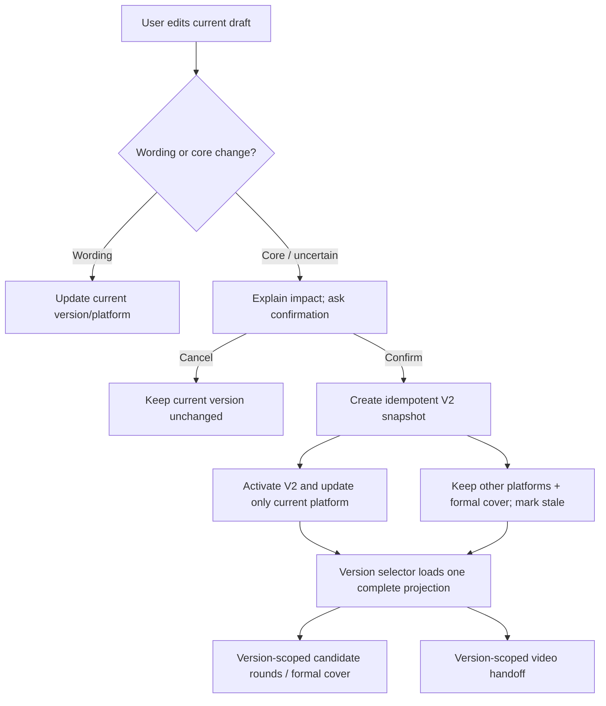
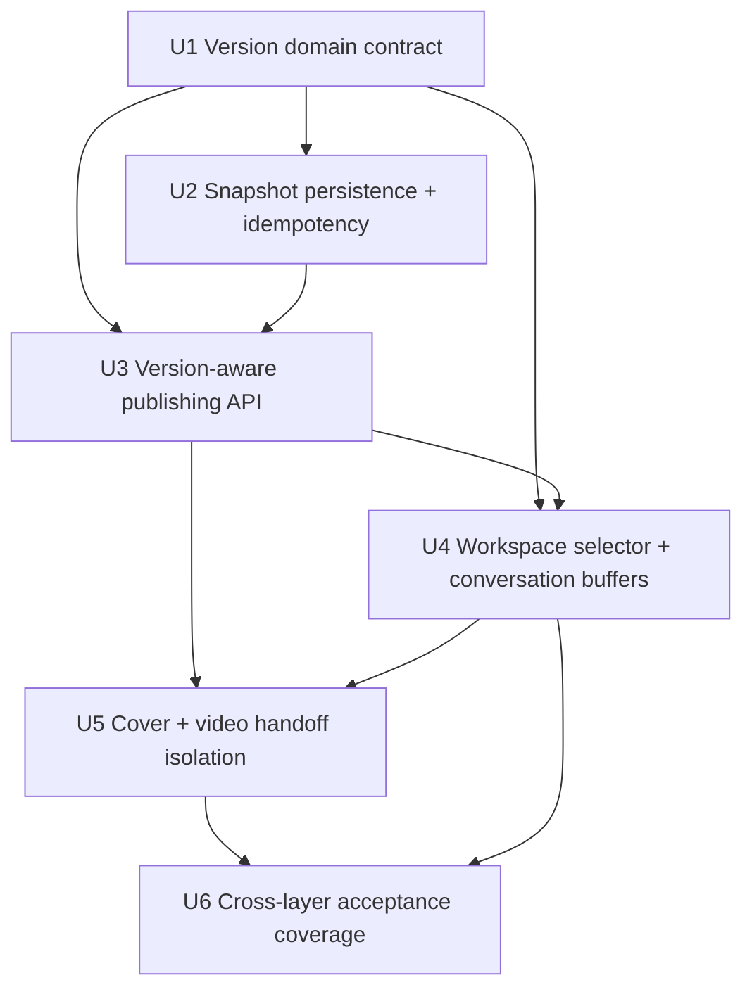
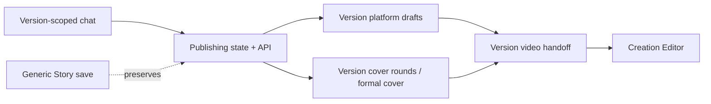

# feat: Add story publishing versions

## Summary

Extend the existing Story-owned `publishing` state with immutable version snapshots. A confirmed story-core change creates a new active version, carries forward the prior version's usable publishing and video material, and scopes every later draft, cover, conversation, and handoff operation to that version.

The implementation keeps the existing six-platform and four-candidate workflows intact while adding version creation, selection, renaming, stale-platform states, idempotent retries, and protection for unsaved local edits.

---

## Problem Frame

The current publishing workspace has one durable core, one set of platform drafts, one cover lineage, and one video handoff per Story. This protects the first publishing flow but makes a meaningful change to the user's idea overwrite or mix with the previous result. The version extension must preserve the old result while ensuring that every surface—conversation, copy, cover, and video handoff—points at the same selected version (see origin: `docs/brainstorms/2026-08-05-publishing-draft-workspace-requirements.md`).

---

## Requirements

- R21. Support multiple publishing versions within one Story; wording, line breaks, tags, and platform formatting stay in the current version, while a confirmed change to facts, thesis, emotion, or direction creates a new version.
- R22. Explain when a user change may alter the story core and require confirmation before creating a version or changing the current version.
- R23. Create a new version as an independent snapshot that inherits the prior core, existing platform drafts, formal cover, and video handoff material without generating a new cover or making a paid call.
- R24. Generate a new draft only for the currently selected platform; retain other inherited platform drafts and mark them `待更新` without background rewrites or model calls.
- R25. Provide a top-level version selector with a readable default name (`V2 · <short title>`), user renaming, durable refresh behavior, and version-scoped conversation/editor state.
- R26. Keep each version's core, drafts, cover rounds, formal cover, and video handoff isolated; edits or adoption in one version cannot mutate another version.
- Preserve the existing invariants from R11–R12 and R16–R20: wording/core classification, explicit generation and cost confirmation, formal-cover versus candidate separation, Story ownership checks, and no automatic video generation on workspace switching.

**Origin actors:** A1 (user), A2 (conversation editor), A3 (platform adaptation), A4 (video creation workspace)

**Origin flows:** F3 (wording versus core edit), F4 (cover and downstream video handoff), F5 (story-core change creates a new version)

**Origin acceptance examples:** AE4, AE6, AE7, AE9–AE11, AE12–AE14

---

## Scope Boundaries

- Do not add a second Story, project, or social-media project model; versions remain a slice of the existing Story.
- Do not provide word-level diff/merge, collaborative editing, branching/merging, version deletion, or a full revision timeline in v1.
- Do not auto-create a version for wording, formatting, tag, or platform-only changes.
- Do not batch-regenerate inherited platforms, generate a new cover on version creation, or charge for copying inherited material.
- Do not let a V2 edit, cover adoption, or video handoff write back into V1.
- Do not redesign the completed six-platform adapter, four-candidate cover studio, or unrelated prompt-lineage/timeline architecture.

### Deferred to Follow-Up Work

- Rich visual/text diff and selective merge between versions.
- Version deletion, archival, or user-configurable retention limits.
- Cross-user collaboration, review comments, and direct social publishing.

---

## Context & Research

### Relevant Code and Patterns

- `shared/publishingDraft.ts` already normalizes the single Story core, platform drafts, cover reference, cover rounds, and edit outcomes; extend this contract instead of creating a parallel domain model.
- `server/services/publishingPersistence.ts` is the server-owned write boundary. Its per-Story lock, revision assertions, and `prepareStoryBody` merge protect the publishing slice from generic Story saves.
- `server/routers/publishingDraft.ts` owns all publishing mutations, user/Story checks, cost confirmation, candidate lineage, and core-change confirmation; version-aware inputs must be enforced here rather than inferred in React.
- `client/src/features/storyAgent/spine/storySpine.ts` and `client/src/features/storyAgent/storyAgentPersistence.ts` hold the active Story and per-Story publishing buffers; their Story-keyed local-buffer pattern is the basis for per-version dirty state.
- `client/src/features/publishingDraft/PublishingDraftWorkspace.tsx` renders platform tabs, edit confirmation, cover studio, and the video continuation action. The version selector belongs at this workspace's top context bar and must share its dirty-state guard.
- `client/src/features/publishingDraft/publishingVideoHandoff.ts` and `client/src/features/creationEditor/CreationEditorContext.tsx` currently project one Story-level handoff; they must consume the selected version projection without copying it.
- `server/services/imageAssets.ts`, `server/services/storyMaterials.ts`, and the completed cover plan keep generated candidates Story/user-owned and make only the formal cover current. Version membership should be carried by publishing round metadata and validated before adoption, avoiding an unrelated image-table migration.

### Institutional Learnings

- `docs/solutions/2026-06-13-故事为唯一单位-镜头按storyId.md`: Story is the only work unit; every read/write must validate both `storyId` and `userId`, and no code may infer context from the latest Story.
- `docs/solutions/2026-06-13-多worktree环境数据分裂收敛.md`: local persistence follows the serving checkout. Implementation and browser verification must use the configured main service and must not create a competing worktree/server with a separate data file.
- `docs/plans/2026-06-29-001-feat-unified-prompt-lineage-plan.md`: server state is the source of truth; candidates and previews do not move current pointers; confirmed writes use expected revisions and return a complete projection.
- `docs/plans/2026-08-05-002-feat-publishing-cover-candidate-workflow-plan.md`: paid cover results remain non-current until explicit adoption, candidate lineage is compactly stored in Story state, and paid output is appended against the latest publishing revision.

### External References

- None required. The repository already provides the persistence, optimistic-concurrency, Radix Tabs/Dialog, image lineage, and Story handoff patterns needed for this extension.

---

## Key Technical Decisions

- **Keep versions inside the existing Story `publishing` boundary:** this preserves Story as the single source of truth, avoids a second project model and migration, and lets generic Story saves continue protecting the whole version container.
- **Make the version container canonical:** after legacy normalization, the only authoritative shape is Story-level `activeVersionId` plus `versions[]` and a container revision. There is no independently writable top-level `core`, `drafts`, or `cover` projection; compatibility helpers resolve one complete active version for old callers during the migration of consumers.
- **Use immutable snapshot inheritance:** creating V2 deep-copies V1's core, platform drafts, formal-cover reference, and handoff inputs; later writes target only V2. Cover-round history remains owned by its source version, while the inherited formal cover is marked as reusable provenance. Shared asset bytes may be reused, but the version's formal-cover pointer and candidate membership are independent.
- **Represent the selected version as an explicit server projection:** the server returns the active version plus its `versionId`, `containerRevision`, `versionRevision`, and complete scoped state. Client code must not combine a new version's draft with an old version's cover or handoff.
- **Make version creation idempotent across retries:** the operation token and resulting version ID are persisted in the Story-owned container, so a retry after a process restart returns the existing result instead of duplicating V2. The in-process Story lock remains a contention aid, not the correctness boundary; expected container/core revisions provide the compare-and-swap guard.
- **Keep platform refresh local to the new version:** the confirmed core-change platform receives the new generated/edited content and clears its review flag; inherited platforms retain their exact text and show `待更新` until the user explicitly derives that platform in V2.
- **Separate stale state from edit state:** each inherited draft records the core revision it came from and the core revision it has been explicitly refreshed against. A manual edit, stale marker, and pending local buffer are separate facts; refreshing one platform clears only that platform's stale marker after the new content is explicitly accepted.
- **Guard version switching with the existing dirty-buffer policy:** apply, keep for later, or cancel are explicit choices. No version or platform switch silently discards local edits.
- **Bind cover and video operations to `versionId`:** candidate rounds, formal-cover adoption, and handoff projections must reject assets or payloads from another version even when they belong to the same Story. An inherited formal cover is explicitly marked as reusable provenance; a candidate round is never implicitly reusable.

---

## Open Questions

### Resolved During Planning

- **Where are versions stored?** Inside the Story's server-owned `publishing` slice, not a separate project or social-media record.
- **What does inheritance mean?** A deep snapshot at creation; later V2 mutations never flow back to V1, while reusable image bytes may remain shared by asset ID.
- **What happens to unsaved edits on switch?** The user is asked to apply, keep locally for later, or cancel the switch; silent loss is prohibited.
- **How is the default name produced?** Use the existing generated/edited short title or thesis-derived short label without an additional model call; the user may rename it.
- **How is conversation scoped?** Each version stores a bounded normalized snapshot of its publishing conversation. New publishing messages append to the active version snapshot as well as the existing Story conversation record; creating V2 clones the parent snapshot, and switching versions reads only the selected snapshot. This avoids guessing a version from Story-level “latest” messages and avoids a new conversation table migration.
- **What happens to inherited platforms?** Their text and manual edits remain unchanged and are marked `待更新`; only the active platform is generated or updated after creation.

### Deferred to Implementation

- The exact serialized field names and bounded message-count limit can be finalized while tracing the current conversation persistence seam; the canonical shape, version-scoped snapshot behavior, and no-latest-message fallback are fixed by this plan.
- The exact short-title truncation and duplicate-name presentation can be tuned in the shared normalizer and UI tests; the version number remains the unique identity.
- The final browser copy for conflict, stale-platform, and dirty-switch dialogs may be polished without changing their state transitions.

---

## High-Level Technical Design

> *This illustrates the intended approach and is directional guidance for review, not implementation specification. The implementing agent should treat it as context, not code to reproduce.*

Version creation is an atomic server operation: it writes and activates V2 only after the snapshot and already-confirmed user content validate; it does not wait for or invoke a later model/image generation. The selected version is the only source for the workspace's conversation context, platform tabs, cover studio, and handoff. A slow query or mutation response is applied only if its `(storyId, versionId, containerRevision, versionRevision)` still matches the active client context.

---

## Implementation Units

### U1. Define the versioned publishing domain contract

**Goal:** Add a normalized, backward-compatible version container and make every publishing artifact explicitly addressable by version.

**Requirements:** R21, R23, R25, R26; AE12–AE14

**Dependencies:** None

**Files:**

- Modify: `shared/publishingDraft.ts`
- Test: `shared/publishingDraft.test.ts`

**Approach:**

- Add a version record containing stable ID, sequence, display name, parent ID, version-local revision, core, platform drafts, selected/active platform, formal cover provenance, version-owned cover rounds, and a bounded publishing-conversation snapshot. Keep Story-level `containerRevision` distinct from each version's `versionRevision` and the nested core/draft revisions. Every local buffer also stores the version/core/draft baseline it was created from.
- Normalize legacy single-version data into deterministic V1 without changing existing text, formal cover, candidate rounds, or unknown Story fields. If legacy top-level fields coexist with partial `versions[]`, preserve the complete legacy projection as V1, resolve duplicates by deterministic first-valid ordering, and retain unassignable cover/draft records under V1 or block the write with a visible repair error; normalization must never silently discard a valid platform draft or formal cover. New writes use the version container as the sole authoritative representation; compatibility helpers resolve one complete active projection while callers migrate.
- V2 inherits only the formal-cover pointer/provenance, not V1 candidate-round history. New candidate rounds are created only under the active version; keep `versionId` on rounds, cover references, local buffers, and video handoff payloads so shared image bytes cannot imply shared candidate ownership.
- Normalize empty/duplicate names, unsupported platform IDs, malformed rounds, and missing parent IDs without inventing a second Story or silently deleting valid V1 material.

**Execution note:** Add characterization tests for current single-version normalization before changing the persisted shape.

**Patterns to follow:**

- `normalizePublishingDraftState` and `emptyPublishingDraftState` for tolerant persisted-state normalization.
- `normalizePersisted`, `PublishingDraftBufferMap`, and `publishingBufferKey` for Story-scoped local recovery.
- `PublishingCoverRound` validation for compact asset lineage and no-candidate formal-cover separation.

**Test scenarios:**

- Happy path: a legacy state with one core, two platform drafts, a formal cover, and cover rounds normalizes to V1 with byte-equivalent content and a stable active version.
- Covers AE12: wording-only edits keep the same version ID; core-change input produces a version-creation candidate rather than mutating V1.
- Covers AE13: inherited V2 contains independent copies of core/drafts/formal-cover metadata while preserving the parent ID and sequence.
- Covers AE14: version-local active platform, selected platforms, cover rounds, and handoff identity normalize independently for V1 and V2.
- Edge case: malformed version entries, duplicate names, duplicate IDs, unknown platforms, and buffers for another Story/version are ignored or safely reset.
- Legacy safety: when malformed/partial versions coexist with legacy top-level fields, the complete legacy projection wins V1, unassignable formal-cover/draft data remains visible under V1, and the normalizer reports a repair-needed condition instead of silently deleting it.
- Isolation: modifying a nested V2 draft/core/round in a returned object cannot mutate the corresponding V1 object.
- Conversation: V2 starts with a copy of V1's bounded publishing message snapshot; appending a new active-version message does not alter V1's snapshot.

**Verification:**

- Shared tests prove old persisted Stories load as V1 and all version-aware consumers can resolve one complete active projection without fallback mixing.

---

### U2. Persist atomic version snapshots and idempotent selection

**Goal:** Extend the server-owned persistence boundary with create, select, rename, and version-scoped mutation primitives protected by Story ownership, revisions, and retry-safe operation identity.

**Requirements:** R21–R26; AE12–AE14

**Dependencies:** U1

**Files:**

- Modify: `server/services/publishingPersistence.ts`
- Test: `server/services/publishingPersistence.test.ts`
- Modify: `server/services/storySync.publishing.test.ts`

**Approach:**

- Add an atomic `createVersion` operation that validates the expected active-version/core/draft revisions, snapshots the parent, writes the already-confirmed current-platform content supplied by the user (without invoking a model), marks inherited platforms `待更新`, and activates the new version in one Story write. Any later generated draft is a separate explicit operation.
- Add `selectVersion` and `renameVersion` operations with owner checks, per-version revision checks, and complete projection returns. Keep the first version non-deletable in v1.
- Persist the client operation token and resulting version ID in the Story-owned container; if the same token is retried after a timeout or process restart, return the existing version rather than append another version. Distinct concurrent requests are serialized by the existing Story lock and lose on the expected container/core revision check.
- Keep generic whole-Story saves from replacing the version container through `prepareStoryBody`, just as they currently protect the server-owned publishing slice.
- Treat snapshot creation, container revision advancement, and activation as one atomic Story write. If validation fails, the write does not happen and V1 remains active; there is no post-activation asset step in this operation. Later asset/projection failures are isolated to their explicit operation and leave the selected version intact.

**Patterns to follow:**

- `withStoryWriteLock`, `assertRevision`, and `PublishingDraftConflictError` in `publishingPersistence.ts`.
- `storySync.publishing.test.ts` for proving generic saves preserve server-owned publishing state.
- Story ownership checks in `getPublishingDraftState` and all existing publishing mutations.

**Test scenarios:**

- Happy path: create V2 from V1 atomically activates V2, copies the core/drafts/formal-cover provenance (not V1 candidate rounds), writes only the already-confirmed current-platform content, and increments Story/container revisions once without a model call.
- Covers AE13: inherited X/manual edits remain byte-identical and are marked `待更新`; no other platform mutation or model call is recorded.
- Idempotency: retrying the same create-version operation token returns the same V2 and version count remains two.
- Conflict: stale core/draft/version revisions reject creation or selection without changing V1 or V2.
- Ownership: another user's Story ID cannot read, create, rename, or select a version.
- Dirty baseline: a version-local draft buffer is not persisted by a version switch unless the caller explicitly applies it.
- Buffer CAS: applying a kept buffer sends its stored version/core/draft baseline; a stale baseline returns the latest complete projection and requires explicit replace, keep-buffer, or discard (merge is out of scope), never a silent overwrite.
- Generic save integration: a stale full-Story body cannot overwrite a newer version container.
- Restart safety: the persisted operation token still resolves to the original V2 after a fresh server process, while an unknown token cannot claim an existing version.

**Verification:**

- Persistence tests show one Story write creates an isolated V2 snapshot and every success response contains the full selected-version projection.

---

### U3. Make publishing routes version-aware

**Goal:** Route all existing generation, conversion, editing, core-change confirmation, cover, and platform-selection actions through an explicit version context.

**Requirements:** R11, R12, R16–R26; AE4, AE6, AE7, AE9, AE12–AE14

**Dependencies:** U1, U2

**Files:**

- Modify: `server/routers/publishingDraft.ts`
- Test: `server/routers.publishingDraft.test.ts`
- Modify: `server/services/publishingDraft.ts`
- Test: `server/services/publishingDraft.test.ts`

**Approach:**

- Add version ID and expected version/core/draft revisions to every mutation that can read or write publishing state; never infer the version from the client-selected platform alone.
- Change confirmed core-change handling from “mutate current core” to “create and activate a new version,” while preserving wording-only edits in the current version and keeping uncertain changes behind the existing confirmation response.
- Keep generation explicit: after V2 creation, only the active platform may invoke the existing generate/convert/rewrite path; inherited platforms are returned with a stale marker and no background call.
- Require any post-creation generate/convert request to use the `createVersion` response's container/version/draft revisions. If create and generate responses arrive out of order, only the response whose expected baseline still matches the active projection may apply; an older result is discarded without clearing stale markers or replacing content.
- Add version-scoped rename/select endpoints and return the complete selected projection after each mutation so React does not stitch together partial state.
- Make publishing conversation reads/writes accept the selected version context and use the version's bounded snapshot; legacy V1 may seed from the existing Story/durable conversation once, but later reads must not merge in whichever Story messages happen to be newest.
- Preserve the existing cost-confirmation, provider mocking, Story/user asset checks, and conflict error mapping for cover generation and adoption.

**Patterns to follow:**

- Existing `applyEdit`, `confirmCoreChange`, `generate`, `convert`, and `generateCover` router boundaries.
- `throwPublishingError` conflict/ownership/model-output mapping.
- `loadPublishingCoverRounds` and the completed four-candidate workflow for explicit candidate membership checks.

**Test scenarios:**

- Covers AE12: wording change applies to V1; confirmed core change returns active V2 while V1 remains readable and unchanged.
- Covers AE13: after V2 creation, an explicit request generates only the active platform once; creating V2 itself never calls the model, and inherited platforms never call it in the background.
- Version isolation: V2 rewrite/apply/convert changes no V1 draft, revision, stale flag, or cover metadata.
- Conversation isolation: a generate/convert request for V2 never includes V1-only publishing messages, and switching back to V1 restores its earlier snapshot.
- Cover ownership: a V1 candidate cannot be adopted or used as a V2 reference unless the version contract explicitly marks it as an inherited formal cover; a V2 candidate cannot mutate V1.
- Cost/error path: version creation does not invoke the image provider; a later cover generation still requires one fresh cost confirmation and preserves the selected version on failure.
- Retry/conflict path: duplicate confirmation and stale version requests return one conflict/idempotent result without duplicate drafts or charges.
- Create/generate race: a delayed create response cannot be overwritten by an earlier generate response, and a delayed generate response based on the pre-create revision is rejected without changing V2.

**Verification:**

- Router tests prove every publishing mutation is version-scoped and that a complete response is sufficient for the client to replace its current projection.

---

### U4. Add the version selector and version-scoped conversation/editor state

**Goal:** Let users switch V1/V2 in the publishing UI without losing context, mixing versions, or silently dropping local edits.

**Requirements:** R22, R24, R25, R26; AE12–AE14

**Dependencies:** U2, U3

**Files:**

- Modify: `client/src/features/storyAgent/spine/storySpine.ts`
- Modify: `client/src/features/storyAgent/storyAgentPersistence.ts`
- Modify: `client/src/features/storyAgent/views/StoryAgentChat.tsx`
- Modify: `client/src/features/storyAgent/chatStoryContext.ts`
- Modify: `client/src/features/publishingDraft/PublishingDraftWorkspace.tsx`
- Modify: `client/src/features/publishingDraft/publishingDraftViewModel.ts`
- Test: `client/src/features/publishingDraft/PublishingDraftWorkspace.test.tsx`
- Test: `client/src/features/publishingDraft/publishingDraftFlow.test.ts`
- Test: `client/src/features/storyAgent/storyAgentPersistence.test.ts`

**Approach:**

- Add a top version selector showing sequence and readable name, with rename affordance and the current version's stale-platform counts.
- Key publishing text buffers, rewrite previews, pending core confirmations, and version-scoped conversation context by `(storyId, versionId, platform)`; keep generic Story history intact for non-publishing workspaces.
- Before switching versions or platforms, detect dirty buffers and offer apply, keep locally for later, or cancel. Applying shows saving/success/error states; an apply failure retains the buffer and keeps the current version active. Keeping locally stores the buffer under its Story/version/platform key and shows a recoverable “待应用” indicator after refresh; a later switch reopens the same three-way choice. A slow read/mutation response may update the UI only when its Story/version/containerRevision/versionRevision token still matches the active context.
- After selecting a version, replace the entire local publishing projection and chat context together, then derive platform tabs, editor content, cover state, and handoff from that projection. Do not retain the previous version's React-only cover or pending decision state.
- Keep `待更新` visible on inherited platforms until an explicit “更新此平台” convert/generate operation for that version/platform succeeds. If the inherited draft has manual edits, show a preview and require an explicit replace/keep choice; generation failure keeps the stale marker and the old text. The stale badge must not block copying or continuing to video, but it must be visible in those actions' context.
- Define selector states for loading, empty/corrupt version list, selected, disabled while switching, rename-saving, rename-conflict, and retry-after-network-error. Preserve keyboard order, dialog focus return, named controls/live status for screen readers, and a narrow layout that keeps the selector, stale action, cover choice, and “继续做视频” target reachable.

**Patterns to follow:**

- Existing dirty-buffer handling and leave-workspace dialog in `EditingStudioPage.tsx`.
- Story-keyed selectors and `storySpineStore` scope checks in `PublishingDraftWorkspace.tsx`.
- Radix `Tabs`/`Dialog` primitives and existing publishing workspace visual language.

**Test scenarios:**

- Covers AE14: the selector switches V1/V2 and simultaneously changes conversation, active platform, drafts, formal cover, version-owned candidate rounds, and video-handoff identity.
- Dirty switch: with an unsaved V2 editor buffer, apply persists it, keep preserves it under V2 for later, cancel leaves V1 active, and no action loses text.
- Refresh/recovery: reload restores the selected version and version-local buffers; a stale or slow query cannot overwrite a newer selected version.
- Rename: empty/duplicate names fall back safely while the sequence and stable ID remain unchanged.
- Stale platform: V2 shows inherited X as `待更新`; explicit conversion clears only V2/X and leaves V1/X and other V2 platforms unchanged.
- Error path: failed selection/rename/generation keeps the previous complete projection and offers retry without clearing the chat or editor.
- Selector states: loading disables only version-changing controls; an empty/corrupt response leaves the current projection visible with a retry action; rename conflict returns focus to the name field without changing the stored name.
- Refresh recovery: a kept local buffer reappears as `待应用`; if the server version advanced, the UI offers compare/keep-current-buffer or discard, never overwriting either side silently.

**Verification:**

- Component and flow tests show that a version switch is a complete context replacement, not merely a text-tab change.

---

### U5. Isolate cover candidates and video handoff by version

**Goal:** Ensure downstream visual and video work always consumes the selected version's formal cover and draft, while inherited and newly generated assets remain safely separated.

**Requirements:** R23, R26; AE6, AE7, AE9–AE11, AE14

**Dependencies:** U1, U3, U4

**Files:**

- Modify: `client/src/features/publishingDraft/publishingVideoHandoff.ts`
- Test: `client/src/features/publishingDraft/publishingVideoHandoff.test.ts`
- Modify: `client/src/features/creationEditor/CreationEditorContext.tsx`
- Test: `client/src/features/creationEditor/editingTransitionPersistence.test.ts`
- Modify: `client/src/features/publishingDraft/PublishingDraftWorkspace.tsx`
- Test: `client/src/features/publishingDraft/publishingCoverExport.test.ts`
- Test: `client/src/features/publishingDraft/PublishingVideoHandoff.test.tsx`

**Approach:**

- Add version identity and source revisions to the handoff projection; derive narration/dialogue only from the selected version's active platform draft.
- Treat the inherited formal cover as a version-local reference with explicit provenance. New candidate rounds are recorded against the active version, and adoption updates only that version's formal-cover pointer; existing non-current candidates remain isolated and cannot be selected merely because they share a Story ID.
- When entering the editing workspace, pass `(storyId, versionId, draftRevision, coreRevision, coverAssetId)` through the handoff so an old handoff cannot overwrite a newer version's editor context. Any editor-side persistence or callback must compare this identity before writing back.
- Enforce the same handoff identity at the server write boundary for any editor callback or persistence path; a payload with an old `(storyId, versionId, draftRevision, coreRevision, coverAssetId)` is rejected as stale rather than relying only on a client-side guard.
- Keep workspace switching read-only: no automatic shot split, narration rewrite, image/video generation, or paid call. Switching back to Publishing restores the same selected version.
- Define downstream availability explicitly: without a formal cover, cover export is disabled but text and video handoff remain available; while a candidate round is generating, the current formal cover and prior round remain usable; fewer-than-four/asset-load failures show a retryable error without replacing the formal cover; an expired handoff is ignored and rebuilt from the selected version.

**Patterns to follow:**

- `buildPublishingVideoHandoff` and `latestPublishingDraftState` projection helpers.
- `CreationEditorContext` query precedence and `storyId` ownership checks.
- `promoteStoryImageToCurrent` as the explicit adoption boundary for formal covers.

**Test scenarios:**

- Covers AE7: entering Editing with V1 exposes V1 core/draft/cover and speech candidates without model, shot, image, or video calls.
- Covers AE14: entering Editing from V2 exposes V2 handoff; returning to V1 restores V1 handoff and cover without cross-version replacement.
- Cover adoption: a V2 candidate adoption changes only V2's formal-cover reference; V1's cover and downstream projection remain unchanged.
- Cover refresh: V2 inherited formal cover remains until explicit V2 adoption; candidate rounds from V1 are not selectable as V2 candidates.
- Stale handoff: a delayed V1 handoff response is ignored after V2 becomes active.
- Handoff write guard: a callback carrying V1 identity cannot update a V2 editor projection or timeline handoff after the user switches versions.
- Server handoff CAS: a stale V1 callback is rejected at the write boundary, and the current V2 handoff remains unchanged.
- Downstream empty/error states: no formal cover disables only cover export; stale current-platform text remains copyable/video-eligible with a visible warning; failed candidate generation leaves the prior formal cover and retry action intact.
- Export: platform cover downloads read the selected version's formal-cover asset and never a candidate or another version's cover.

**Verification:**

- Handoff and export tests prove the selected version is the only source for downstream text, image, narration, and dialogue.

---

### U6. Exercise the full version lifecycle and browser-visible regressions

**Goal:** Close the cross-layer gaps that unit tests cannot prove: refresh, concurrent tabs, dirty switching, no-hidden-generation guarantees, and complete V1/V2 handoff behavior.

**Requirements:** R21–R26 and success criteria; AE12–AE14

**Dependencies:** U1, U2, U3, U4, U5

**Files:**

- Modify: `client/src/features/publishingDraft/publishingDraftFlow.test.ts`
- Modify: `server/routers.publishingDraft.test.ts`
- Modify: `client/src/pages/editingStudioWorkspace.test.ts`
- Create or modify: `client/src/features/publishingDraft/publishingVersionFlow.test.tsx`
- Create or modify: `server/services/publishingVersionFlow.test.ts`

**Approach:**

- Add an end-to-end-style mocked flow that starts with V1, manually edits multiple platforms, confirms a core change, creates V2, switches platforms and versions, adopts a V2 cover, and enters/exits Editing.
- Simulate double confirmation, stale revisions, delayed read responses, failed model calls, fewer-than-four image candidates, refresh restoration, and an in-flight cover job while switching versions.
- Keep paid provider calls mocked and assert call counts; browser verification should use the already-serving main checkout rather than starting a second dev server or touching local persistence from another worktree.

**Test scenarios:**

- Full lifecycle: V1 Xiaohongshu/X drafts and cover survive V2 creation; V2 only updates the active platform and marks other platforms `待更新`.
- Double-submit: two identical core-change confirmations produce one V2, one Story revision advance, and no duplicate model/image calls.
- Concurrent tabs: stale V1/V2 selection or edit cannot overwrite the active version; the UI keeps the latest complete projection and exposes a retry path.
- In-flight cover: a result is stored under the version that submitted it; switching versions during generation does not change either version's formal cover.
- Browser-visible acceptance: selector, rename, stale marker, dirty switch dialog, cover isolation, and “继续做视频” all remain reachable and coherent at `/editing`.

**Verification:**

- The mocked integration suite and browser pass cover AE12–AE14 plus the explicit no-background-generation and no-cross-version-overwrite invariants.

---

## System-Wide Impact

- **Interaction graph:** StoryAgent chat and publishing editor select one version; publishing mutations persist that version; cover studio reads/writes version-scoped rounds; Creation Editor projects the same version into the video handoff; generic Story saves continue to preserve the server-owned container.
- **Error propagation:** ownership and revision conflicts return the existing publishing conflict shape; stale selections retain the current complete projection and offer retry; provider/storage failures leave both versions' formal covers and prior drafts intact.
- **State lifecycle risks:** legacy single-version data must normalize to V1; local buffers must be version-keyed; delayed query/mutation responses must be ignored after a selection change; idempotent creation must prevent duplicate V2 snapshots and duplicate paid work; explicit asset/projection failures must not replace a valid formal cover or active version.
- **API surface parity:** every existing publishing mutation and the Creation Editor handoff must accept/return version identity; Story list, non-publishing panels, and generic Story APIs continue to address the same Story ID.
- **Integration coverage:** cross-layer tests must prove V1/V2 isolation through refresh, platform conversion, cover adoption, video handoff, and concurrent/stale responses; browser verification must run against the configured main service.
- **Unchanged invariants:** Story remains the only work unit; user ownership is always checked; wording edits stay in-place; formal cover remains separate from candidates; explicit generation/cost confirmation remains required; switching to Editing never auto-generates video.

---

## Risks & Dependencies

| Risk | Mitigation |
|------|------------|
| Legacy Stories have only one publishing object and no version ID | Normalize deterministically to V1 and add characterization coverage before new writes. |
| Snapshot copies drift or share nested references | Deep-clone at the domain boundary and test mutations against both parent and child. |
| A retry creates duplicate V2 or repeats paid work | Persist operation token → version/result, use expected revisions, and assert provider call counts; do not couple version creation to cover generation. |
| V2 inherits an edited platform and later logic overwrites it | Preserve inherited content as the baseline, mark it stale, and require explicit target-platform generation/confirmation before replacing it. |
| Cover candidates or formal cover cross versions | Store version/provenance membership in round/reference metadata and require Story + user + version validation before reference, export, or adoption. |
| Client mixes version state after a slow response | Gate updates on active Story/version/revision tokens and replace the complete projection atomically. |
| A multi-step write leaves an active version without its referenced resource | Commit the Story snapshot first as inactive or use a compensating write; only activate after required references validate, and expose a retryable failure without deleting the prior version. |
| Story JSON grows with duplicated conversations or cover data | Keep compact IDs/anchors in the version container and continue storing image bytes/prompts in existing generated-image records. |
| Multiple worktrees or servers read different local persistence | Use the already-serving main checkout for browser validation and follow the environment-convergence runbook. |

---

## Success Metrics

- Confirming one core change creates exactly one new version and never overwrites the previous version's drafts, cover, conversation context, or handoff.
- Switching versions restores a complete matching set of conversation, active platform, platform drafts, stale markers, cover state, and video handoff after refresh.
- Creating V2 causes zero cover/model calls; only an explicit current-platform generation or cover action can call a model.
- A V2 platform refresh clears only that platform's `待更新` state and leaves V1 and other V2 platforms unchanged.
- V1 and V2 cover adoption, export, and video continuation remain isolated under repeated refreshes and delayed responses.

---

## Phased Delivery

### Phase 1: Domain and persistence safety

- Land U1 and U2 with legacy normalization, snapshot inheritance, idempotent create/select/rename, and server-owned save protection.

### Phase 2: Version-aware operations and workspace

- Land U3 and U4 so all mutations and the visible selector operate on complete version projections with dirty-state protection.

### Phase 3: Downstream isolation and acceptance proof

- Land U5 and U6, then run browser-visible checks against the existing main service before considering the version chain ready for implementation handoff.

---

## Documentation / Operational Notes

- No new environment variable or database migration is expected; the version container remains in the existing Story JSON body and must be backward-compatible with current persisted Stories.
- Do not trigger real paid image generation during automated tests or browser smoke checks; use mocked provider responses and the existing cost-confirmation seams.
- Before browser verification, confirm the serving process, checkout, branch, and persistence path so an old worktree cannot overwrite the version snapshot under test.
- Update the originating brainstorm only if implementation discovers a product behavior that changes R21–R26; implementation-only details belong in this plan or follow-up notes.

---

## Sources & References

- **Origin document:** [docs/brainstorms/2026-08-05-publishing-draft-workspace-requirements.md](../brainstorms/2026-08-05-publishing-draft-workspace-requirements.md)
- Existing publishing plan: [docs/plans/2026-08-05-001-feat-publishing-draft-workspace-plan.md](2026-08-05-001-feat-publishing-draft-workspace-plan.md)
- Existing cover plan: [docs/plans/2026-08-05-002-feat-publishing-cover-candidate-workflow-plan.md](2026-08-05-002-feat-publishing-cover-candidate-workflow-plan.md)
- Shared domain: `shared/publishingDraft.ts`
- Persistence boundary: `server/services/publishingPersistence.ts`
- Publishing API: `server/routers/publishingDraft.ts`
- Workspace UI: `client/src/features/publishingDraft/PublishingDraftWorkspace.tsx`
- Video projection: `client/src/features/publishingDraft/publishingVideoHandoff.ts`
- Environment guidance: `docs/solutions/2026-06-13-多worktree环境数据分裂收敛.md`
