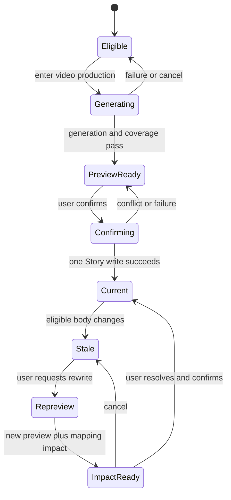
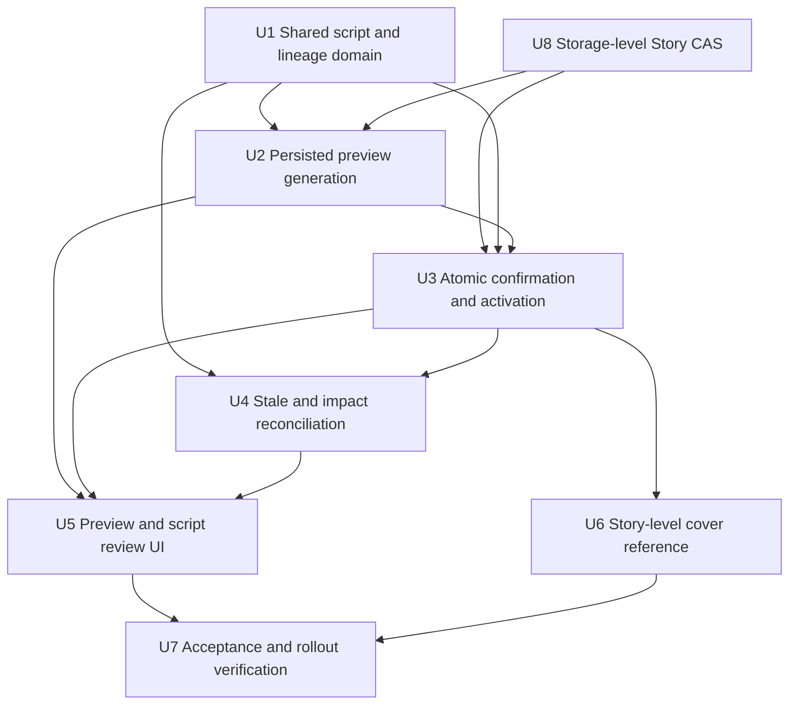
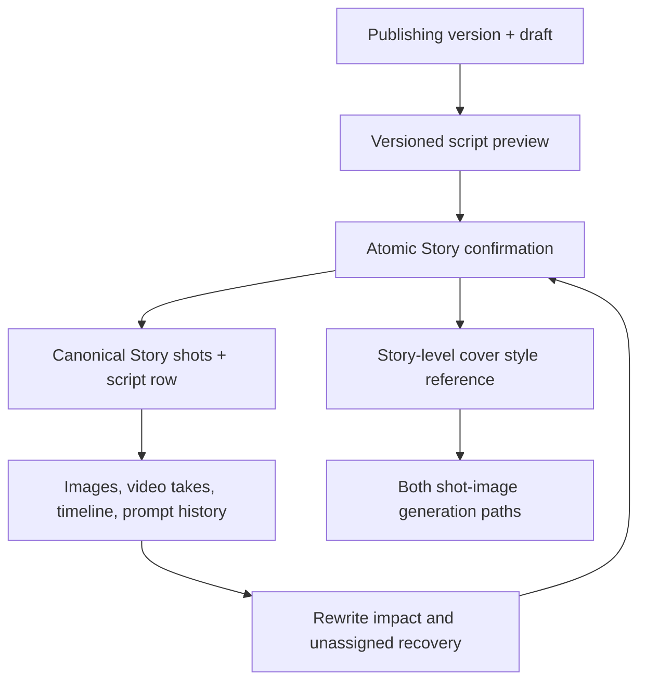

# feat: Turn publishing drafts into versioned video storyboards

## Summary

Replace the current cover-only handoff with a persisted, version-scoped video-script preview that gives every canonical body paragraph traceable script-and-shot coverage and produces at least four storyboard shots. CTA or formatting-like body content is classified and transformed into a non-mechanical visual or performance treatment rather than copied into narration. Confirmation promotes the whole reviewed preview into the active publishing-derived storyboard in one Story write, while stable identities, impact review, and Story-level cover references protect existing manual work and media.

---

## Problem Frame

The current `prepareVideoStoryboard` path creates a single `publishing-cover-opening` shot and binds the formal cover to it. The publishing body is only projected as narration/dialogue candidates, so a complete six-paragraph draft such as Story `#1172` has no durable video script, paragraph coverage, multi-shot confirmation, or safe regeneration path (see origin: `docs/brainstorms/2026-08-05-publishing-draft-workspace-requirements.md`).

This is an incremental plan. The completed publishing workspace, cover-candidate workflow, and publishing-version plans remain historical records; this plan supersedes only their old “candidate-only, no shot splitting” video-handoff decision.

---

## Requirements

- R16. “进入视频制作” must read the active Story, publishing version, platform draft, content core, and formal cover without asking the user to restate them.
- R17. Only the explicit “进入视频制作” action may generate a video-script preview; ordinary workspace, platform, Story, and publishing-version navigation must not invoke the model or mutate formal shots.
- R26. Every publishing version must retain an isolated video-script/storyboard snapshot. Only one version’s publishing-derived shot group is active in the Storyboard at a time; activating another version must preserve the inactive version’s snapshot and media.
- R27. The Storyboard must expose a visible “剧本” field that is distinct from publishing copy, dialogue, image requirements, and video requirements.
- R28. Entering video production generates and persists a reviewable preview; it must not add, replace, reorder, or bind any formal Story shot before confirmation.
- R29. Every canonical non-empty body paragraph must map to at least one script segment and one draft shot. The initial result has at least four shots; six eligible paragraphs produce at least six shots.
- R30. Script text must be a speakable, performable, or visual rewrite rather than a copy. Title, tags, formatting instructions, topic boilerplate, and platform CTA are classified separately and cannot be mechanically inserted as narration.
- R31. Review surfaces must show the source paragraph, rewritten script, and temporary/formal shot mapping in both directions.
- R32. Confirmation must validate and promote the complete script, shot group, lineage, active-version pointer, and legacy-cover migration in one authoritative Story write. Cancellation, conflict, or failure leaves the formal Storyboard unchanged.
- R33. A preview/confirmed script is bound to Story ID, publishing version, source platform, draft revision, canonical content hash, and Storyboard revision. A later eligible-body change preserves the old result and marks it stale.
- R34. Regeneration must produce an impact plan before changing formal shots. Exact safe matches may preserve stable shot IDs; split, merge, removed, ambiguous, and manually edited shots require an explicit user resolution. Images, videos, prompt history, and user edits are never deleted automatically.
- R35. The accepted cover is a Story-level style reference. All downstream shot-image entry points may inherit its people, palette, material, texture, and visual mood while the shot script controls content and composition.
- R36. The first confirmed script for a legacy Story removes only a still-system-shaped `publishing-cover-opening` placeholder from the formal shot list, retains the cover asset, and promotes it to the Story-level reference set. A materially edited placeholder enters impact review instead of being silently removed.

**Origin actors:** A1 (user), A2 (conversation editor), A4 (video creation interface)

**Origin flows:** F4 (publishing draft to cover and video creation), F5 (publishing-version continuation)

**Origin acceptance examples:** AE7, AE11, AE14–AE18

The established R1–R15 and R18–R25 behaviors remain unchanged: platform drafting, version creation, cover exploration/adoption, copying/downloading, explicit paid generation, and Story ownership continue through their existing completed implementations.

---

## Scope Boundaries

- Do not generate images, videos, audio, or a finished timeline during preview or confirmation, and do not request a paid image/video quote.
- Do not introduce a director-beat layer, multiple competing script concepts, automatic camera-language refinement, or Seedance-specific shot prompting in this increment.
- Do not copy the cover composition into every shot or assign the cover as a character anchor, primary shot image, or timeline item.
- Do not replace unrelated/manual Story shots. The managed boundary is the active publishing-derived group plus the exact legacy cover placeholder.
- Do not match or migrate media by mutable `shotNo`; only stable identity and explicit user mapping may carry media across structural changes.
- Do not delete generated-image rows, video takes, prompt history, inactive version snapshots, or user-edited shots as a side effect of script regeneration.
- Do not revise the six-platform publishing adapters, four-cover-candidate workflow, social publishing, performance analytics, or advanced version diff/merge.
- Do not start a second development server or write implementation/test data to a worktree `.webdev/` store.

### Deferred to Follow-Up Work

- Director-assisted beat splitting and camera-language polish can build on the confirmed script aggregate after paragraph coverage is proven.
- Multiple simultaneously visible publishing-version storyboards, side-by-side script diff, and bulk cross-version media remapping remain later workflow improvements.
- Direct Seedance/Kling generation and oil/paper-material fidelity scoring remain downstream generation work; this plan only preserves and propagates the approved Story-level reference.

---

## Context & Research

### Relevant Code and Patterns

- `client/src/features/publishingDraft/PublishingDraftWorkspace.tsx` owns the explicit continue action. Its current call to `prepareVideoStoryboard` is the handoff seam to replace with preview generation and review navigation.
- `client/src/features/publishingDraft/publishingVideoHandoff.ts` already projects `storyId`, `versionId`, container/version revisions, active platform, draft, core, and cover. Extend this contract instead of creating a second Story context.
- `shared/publishingDraft.ts` and `server/services/publishingPersistence.ts` provide the version container, draft revisions, per-Story write serialization, expected-revision conflicts, idempotency receipts, and server-owned publishing slice.
- `server/routers/publishingDraft.ts` currently contains the incompatible cover-opening mutation and is the owner-checked API boundary for preview/confirm operations.
- `client/src/features/storyAgent/types.ts`, `shared/shotDirector.ts`, and `server/services/storySync.ts` define, edit, normalize, merge, and preserve canonical Story shots. New script/provenance fields must cross all three boundaries.
- `client/src/features/storyAgent/views/StoryboardPanel.tsx`, `StoryboardReviewBoard.tsx`, and `StoryboardMatrix.tsx` are the real Storyboard surface. The matrix currently exposes only image/video requirement rows, so the script row and lineage review belong here.
- `client/src/features/creationEditor/CreationEditorContext.tsx` merges canonical `stories.body.shots` with editor metadata and material projections. Stable IDs are the seam for preserving media and prompt state.
- `server/services/storyMaterials.ts` and `server/services/imageAssets.ts` already make removed shot bindings visible as unassigned material and keep publishing covers out of shot material. They need legacy-cover-ID compatibility after placeholder removal.
- `shared/artDirection.ts`, `server/routers/_storyShared.ts`, `server/services/imageGenerationReference.ts`, `server/services/shotImageReferences.ts`, `server/routers/storyAgent.ts`, and `server/services/creationAgent.ts` form the two Story-level image-reference paths that every later shot render must share.
- `server/services/publishingDraft.ts` and `server/_core/llmJson.ts` provide structured model-output validation and bounded repair patterns suitable for paragraph-keyed script generation.

### Institutional Learnings

- `docs/solutions/2026-06-13-故事为唯一单位-镜头按storyId.md`: Story remains the only work unit; every read/write is scoped by both `storyId` and `userId`, never by a latest-Story fallback.
- `docs/solutions/2026-06-13-多worktree环境数据分裂收敛.md`: local persistence follows `process.cwd()`. Browser verification uses the main repository’s port 3000, and migration-like checks must use backups/dry runs rather than touching real local data from tests.
- `docs/story-workspace-data-contract.md`: unmatched images and video takes remain recoverable as unassigned material; removing a shot projection must not delete asset records.
- `docs/plans/2026-06-15-002-feat-story-visual-identity-plan.md`: extend the existing Story art-direction/reference pipeline instead of introducing a cover-only style system.
- `docs/plans/2026-08-06-003-feat-story-publishing-versions-plan.md`: version operations return one complete projection, use persistent operation receipts, and treat expected revision checks—not the in-process lock—as the conflict boundary.

### External References

- None required. The repository has direct patterns for all relevant technology: structured text generation, versioned Story persistence, stable shot identity, unassigned media recovery, Story-level art references, and tRPC/React testing.

---

## Key Technical Decisions

| Decision | Rationale |
| --- | --- |
| Store the latest preview and confirmed video-storyboard snapshot inside each `PublishingStoryVersion` | Script state inherits publishing-version isolation and cannot mix V1 text with V2 cover or draft revisions. |
| Keep `stories.body.shots` as the formal Storyboard projection for this flow | The live Storyboard and Creation Editor already consume and mutate this canonical list. Avoid the non-transactional delete/insert director-shot-table replacement path. |
| Give the formal Storyboard its own active publishing-group pointer | `publishing.activeVersionId` controls the publishing workspace only. A separate Storyboard activation pointer changes only on confirmation/activation, so browsing V1/V2 cannot silently replace formal shots. |
| Allow one active publishing-derived group per Story while preserving every version snapshot | The Storyboard stays understandable, versions remain recoverable, and activating another version can be impact-reviewed without displaying duplicate complete films simultaneously. Managed stable IDs remain permanently unique across the Story and are never reused by another version/group. |
| Treat preview persistence as a publishing-state write, not a formal-shot write | Refresh and workspace switching can recover review state while R28 remains true. |
| Use paragraph-keyed structured generation followed by deterministic coverage validation | The model supplies the rewrite and visual interpretation, while the server—not prompt compliance—guarantees that no eligible paragraph silently disappears. |
| Derive staleness from canonical eligible-body content, not presentation formatting | Body meaning changes invalidate the script; tags or layout data that never entered the script do not create false stale states. Core and formal-cover changes receive distinct content/visual impact markers. |
| Require a storage-enforced Story revision compare-and-swap for preview and confirmation | The current process-local lock plus unconditional update has a lost-update window. A conditional write/row lock and affected-row check must be the correctness boundary shared by publishing writes and whole-Story writers. |
| Bind every operation receipt to operation kind and canonical request hash | A token reused with different Story/version/preview inputs must conflict rather than return an unrelated prior result; the receipt is committed in the same CAS as its result and retained for the supported retry horizon. |
| Preserve unrelated shots and use a three-way field ownership merge for stable-ID matches | Comparing last confirmed baseline, current formal shot, and new preview distinguishes generated fields from later user/downstream edits; automatic similarity remapping is unsafe for valuable media. |
| Park inactive-group media by globally unique stable ID | Inactive assets/takes are retained in existing stores and appear as parked/unassigned until their exact version snapshot is reactivated; no hidden second binding or copied media is introduced. Timeline items receive an equivalent recoverable parked projection. |
| Treat the formal-cover asset ID on the publishing version identified by the independent active Storyboard group pointer as authoritative during legacy migration | The old generated-image row can retain compatibility metadata without a second cross-store mutation; one shared classification resolver makes image lists, materials, and reference plans agree that it is a publishing cover rather than an SH01 image. |
| Add a typed Story-level style-reference role and keep its semantics until the provider adapter | URL-only references cannot distinguish “inherit material/style” from “copy composition” or “lock character identity.” Asset ID is authoritative; URL resolution happens only after ownership/availability checks. |

---

## Open Questions

### Resolved During Planning

- **What happens to existing non-cover shots?** Only the publishing-derived group is activated/replaced. Unrelated/manual shots remain, and the legacy cover placeholder is handled separately.
- **How do publishing versions own Storyboards?** Each version stores an independent script/shot snapshot; one publishing-derived group is active in the Storyboard at a time. Activating a different version requires impact review and preserves the inactive snapshot and media.
- **What happens to unmatched media?** It becomes recoverable unassigned material only after an explicit user choice to retire the old shot; no asset/take is deleted or reassigned by similarity.
- **What is the paragraph coverage denominator?** Canonical non-empty `draft.body` paragraphs. Title and structured tags are outside the body. Every body paragraph, including platform-only/CTA content, must map to at least one segment and one draft shot; CTA or formatting-like text also carries an explicit classification and a non-verbatim visual/performance treatment reason.
- **How is the four-shot minimum interpreted?** Any non-empty eligible draft produces at least four shots, while paragraph coverage sets a higher minimum when there are more than four eligible paragraphs.
- **Must a Story have a formal cover before script generation?** No. Preview and confirmation work without a cover; they simply omit the optional Story-level style reference.
- **Is text rewriting a hidden generation?** No. Clicking “进入视频制作” is the explicit request for one script-preview operation. It does not authorize image/video/audio generation.
- **What is atomic for this flow?** The version snapshot, independent Storyboard activation pointer, canonical Story shots, lineage, revisions, operation receipt, and Story-level reference metadata are committed by one storage-enforced revision CAS. Asset bytes/takes are not mutated by confirmation.

### Deferred to Implementation

- Final model prompt wording and the exact upper bound on per-paragraph shot expansion may be tuned against structured-output fixtures; the non-negotiable bound is one-or-more per eligible paragraph, at least four overall, and rejection of arbitrary output explosion.
- Exact copy and visual layout for the impact-resolution dialog may be polished while preserving required choices and zero-mutation cancellation.
- Existing manually edited cover placeholders require a conservative detector based on known system defaults plus extra media/field checks. Ambiguous placeholders must enter impact review; exact thresholds can be finalized with legacy fixtures.

---

## High-Level Technical Design

> *This illustrates the intended approach and is directional guidance for review, not implementation specification. The implementing agent should treat it as context, not code to reproduce.*

The persisted aggregate is conceptually divided into four parts:

| Part | Responsibility |
| --- | --- |
| Source binding | Story/version/platform/draft revision, canonical content hash, Storyboard revision, independent active-group identity, and formal-cover reference used for the run |
| Paragraph/script lineage | Stable preview-local paragraph and segment identities, source text, rewrite text, explicit content classification/treatment reason, and segment-to-shot mapping |
| Shot snapshot | Draft/formal stable shot identities, script text, generation fields, baseline values used to detect later human edits, and activation status |
| Lifecycle/impact | Preview/confirmed/stale state, operation receipt, stale reasons, safe matches, conflicts, user resolutions, and activation history |

The preview route may persist the first, second, and draft-shot portions only inside the active publishing version. Preview and confirm both re-read the current Story, validate every revision and request hash, construct the complete next body in memory, and commit it through a storage-enforced Story revision CAS. Confirmation additionally advances the independent active publishing-group pointer. Formal-cover bytes, images, video takes, and prompt history remain untouched; parked/active projections follow permanently unique stable IDs and the formal-cover asset pointer on the publishing version identified by the independent active Storyboard group pointer.

---

## Implementation Units

### U1. Define the publishing video-script and lineage domain

**Goal:** Establish one normalized contract for paragraph coverage, script segments, draft/formal shots, version ownership, stale state, impact decisions, and Story-shot provenance.

**Requirements:** R26–R34; AE14–AE17

**Dependencies:** None

**Files:**

- Create: `shared/publishingVideoStoryboard.ts`
- Create: `shared/publishingVideoStoryboard.test.ts`
- Modify: `shared/publishingDraft.ts`
- Test: `shared/publishingDraft.test.ts`
- Modify: `client/src/features/storyAgent/types.ts`
- Modify: `shared/shotDirector.ts`
- Modify: `server/services/storySync.ts`
- Test: `server/services/storySync.preserve-rationale.test.ts`

**Approach:**

- Add one optional version-local video-storyboard aggregate that can normalize older publishing versions with no script state to an empty eligible state.
- Canonicalize `draft.body` line endings, whitespace-only blocks, duplicate-text ordinals, and structured non-body title/tags. Assign stable identities within a source revision and a deterministic content hash for stale detection.
- Require every canonical body paragraph, including platform-only CTA or formatting-like content, to map to at least one script segment and one draft shot. Such content remains visible in coverage review with an explicit classification and non-verbatim visual/performance treatment, and can never become confirmable through an exclusion-only record.
- Keep script text separate from `dialogue`, `sourceCardContent`, `promptDraft`, and `videoPrompt`. Add only the per-shot script/provenance fields the Storyboard must render and persist; keep full source text and impact state in the version aggregate.
- Define a field-ownership matrix before adding persistence: publishing-generated fields may update only when current value still equals the last confirmed baseline; user-owned fields always require explicit resolution; downstream-owned fields such as prompt/media/timeline metadata are inherited but never rewritten by text regeneration; derived display fields do not participate in merge decisions.
- Store generated baselines at confirmation time and use a three-way comparison among last confirmed baseline, current formal shot, and new preview. A field that diverged from the confirmed baseline is treated as user/downstream-owned even if it resembles new model output.
- Give each confirmed group and managed shot a Story-global stable identity. A version snapshot owns the identity forever; later groups cannot reuse it unless they are reactivating that exact snapshot.
- Define pure validation and impact functions for coverage, minimum shot count, stable-ID reuse, split/merge/unmatched classification, and user-resolution completeness.

**Execution note:** Implement the normalizer, coverage validator, and impact classifier test-first because every later write depends on them rejecting incomplete or ambiguous state.

**Patterns to follow:**

- Version normalization and deep-copy behavior in `shared/publishingDraft.ts`.
- Stable identity helpers in `shared/shotIdentity.ts`.
- Director-field preservation in `server/services/storySync.ts`.

**Test scenarios:**

- Covers AE15: six eligible paragraphs produce six distinct source identities, at least six mapped segments/shots, and complete reverse lookup from each shot to its source paragraph.
- Happy path: one, two, and three eligible paragraphs can be split into at least four shots without losing source coverage; four paragraphs produce at least four.
- Edge case: CRLF, consecutive blank lines, Markdown lists/quotes, repeated identical paragraphs, emoji-only content, structured tags, and CTA-like paragraphs normalize deterministically and show their treatment.
- Error path: missing paragraph mapping, duplicate segment identity, a mapped segment with zero shots, an arbitrary excess of model shots, or copy-equal “rewrite” output makes a preview non-confirmable.
- Impact: unchanged paragraphs reuse prior managed stable shot IDs; split, merge, deleted, inserted, reordered, and duplicate-text cases receive deterministic impact categories without matching by `shotNo`.
- Persistence: script/provenance fields survive Story normalization, stale whole-body merges, reorder, and individual Storyboard field edits.
- Human edit: a field differing from its generated baseline is marked user-owned and cannot be overwritten by a later generated snapshot without an explicit resolution.
- Ownership matrix: script/action fields update when unchanged since confirmation, while duration, prompt lineage, selected media, timeline metadata, and explicitly edited fields remain downstream/user-owned.
- Identity: V1 and V2 cannot allocate the same managed stable ID; reactivating V1 resolves only V1’s original IDs and flags any corrupted collision.

**Verification:**

- Pure shared tests can prove paragraph completeness, four-shot minimum, stable lineage, and conservative impact classification without a model, database, or browser.

---

### U8. Establish storage-level compare-and-swap for Story body writers

**Goal:** Remove the check/write race that could let preview, confirmation, autosave, shot editing, art-direction updates, or legacy services overwrite a newer Story body after validating an older revision.

**Requirements:** R17, R28, R32–R36; AE16–AE18

**Dependencies:** None

**Files:**

- Modify: `server/db.ts`
- Create: `server/db.storyRevision.test.ts`
- Create: `server/services/storyBodyPersistence.ts`
- Create: `server/services/storyBodyPersistence.test.ts`
- Modify: `server/services/publishingPersistence.ts`
- Modify: `server/routers/storyAgent.ts`
- Test: `server/routers.storyAgent.test.ts`
- Modify: `server/routers/_storyShared.ts`
- Modify: `server/services/chatCutXml.ts`
- Modify: `server/services/directorAdvice.ts`

**Approach:**

- Add one owner-scoped conditional Story-body persistence boundary for both MySQL and local persistence. It compares the persisted Story revision with the expected revision at write time and reports whether the write won; the in-process lock remains a contention optimization only.
- Route every production `stories.body` writer through the same expected-revision contract. Each caller must either return conflict, or re-read and reapply a narrowly scoped merge operation that is safe for its domain; no caller may silently replay a full Story replacement against a new baseline.
- Keep operation receipts inside the body produced by the same winning CAS so a result cannot exist without its idempotency record.
- Preserve the existing stale-save merge policy where appropriate, but run its final merged body through CAS and repeat the read/merge only when the specific operation is designed to be retryable. Confirmation itself is never automatically rebased.

**Execution note:** Characterize every current `updateStory(...body...)` production caller before enforcing the new boundary, then add independent-writer race tests rather than relying on calls serialized behind one in-process lock.

**Patterns to follow:**

- Owner scoping in `server/db.ts` and Story reads.
- Revision extraction and conservative merge rules in `server/services/storySync.ts`.
- Conflict projection behavior in `server/services/publishingPersistence.ts`.

**Test scenarios:**

- Storage race: two independent writers with the same expected revision attempt different body changes; exactly one wins and the loser observes conflict without overwriting the winner.
- Local parity: the local-persist implementation provides the same conditional-write result and persists one coherent body/receipt snapshot.
- Autosave: a stale full-Story save follows its conservative merge policy and cannot overwrite a confirmed publishing group.
- Shot edit: a shot-field write racing confirmation either commits first and forces confirmation impact refresh, or loses and returns the latest Story; neither edit disappears.
- Cross-domain: character/art-direction, ChatCut attachment, director advice, cover adoption, and publishing preview writers retain their own fields when retrying a safe scoped operation after conflict.
- Restart/idempotency: a committed request receipt survives process restart; an uncommitted/losing request leaves no receipt.

**Verification:**

- The full production search for Story-body updates resolves to the shared CAS boundary, and independent-context tests prove no older body can replace a newer revision.

---

### U2. Generate and persist a preview without touching formal shots

**Goal:** Replace the cover-opening preparation call with an explicit, recoverable script-preview operation bound to the exact active publishing draft.

**Requirements:** R16, R17, R28–R31, R33; AE7, AE15

**Dependencies:** U1, U8

**Files:**

- Create: `server/services/publishingVideoStoryboard.ts`
- Test: `server/services/publishingVideoStoryboard.test.ts`
- Modify: `server/services/publishingPersistence.ts`
- Test: `server/services/publishingPersistence.test.ts`
- Modify: `server/routers/publishingDraft.ts`
- Test: `server/routers.publishingDraft.test.ts`
- Modify: `client/src/features/publishingDraft/publishingVideoHandoff.ts`
- Test: `client/src/features/publishingDraft/publishingVideoHandoff.test.ts`

**Approach:**

- Replace the current mutating `prepareVideoStoryboard` behavior with a preview operation that owner-checks the Story, resolves one complete active version projection, rejects unsaved/empty or missing drafts, and captures the Story/publishing/version/draft/Storyboard revision baseline.
- Send canonical paragraphs with stable keys, Story core, source platform, and optional formal-cover visual description to one structured text-generation service. Ask for video-language rewrites and shot drafts, not image/video generation.
- Validate the returned keys, coverage, rewrite difference, shot count, and bounded output before persistence. Structured repair/retry may correct malformed model output, but incomplete coverage never falls back to copying the source text.
- Persist only the latest version/platform preview and its operation receipt inside the publishing version. Repeated requests for an already-current preview return it instead of issuing another call; a later response for an old revision remains old/stale and cannot become the current preview.
- Persist previews with the same storage-level Story revision CAS used by confirmation. A retry after a CAS conflict must re-read and reapply only the publishing-preview operation to the latest body; it must preserve intervening shot/art-direction fields and must not silently retry confirmation against a new baseline.
- Bind receipts to operation kind, Story/version/platform, canonical request hash, source revisions, result identity, and resulting revisions. Same token plus different payload is a conflict; retention is bounded only after the supported client retry horizon and never drops an in-flight receipt.
- Keep a previous confirmed snapshot intact when creating a new preview. Preview failure, cancellation, workspace switching, or route invalidation never writes `body.shots` or assigns media.

**Execution note:** Start with router/service tests that snapshot formal shots and generation-call counters before and after preview success, failure, retry, and cancellation.

**Patterns to follow:**

- Structured validation/repair in `server/services/publishingDraft.ts` and `server/_core/llmJson.ts`.
- Owner checks and complete projection returns in `server/routers/publishingDraft.ts`.
- Operation receipts and revision conflicts in `server/services/publishingPersistence.ts`.

**Test scenarios:**

- Covers AE7: ordinary workspace switching performs zero preview calls; explicit entry produces a preview and preserves publishing state.
- Covers AE15: a `#1172`-shaped six-paragraph fixture returns at least six rewritten script segments/shots, with tags excluded from narration.
- Happy path: a preview persists across read, refresh, workspace switching, and version switching and reappears only under its source version/platform.
- Edge case: a valid draft with no formal cover still produces a preview and no cover shot.
- Error path: model failure, malformed structured output, incomplete coverage, output explosion, or preview persistence failure leaves formal shots, material bindings, and confirmed script unchanged.
- Concurrency: changing the draft during generation marks the late preview stale; changing active version prevents the response from appearing under the new version.
- Idempotency: double-click, response loss, and retry with the same operation token produce one preview and at most one text-generation call.
- Race: preview persistence concurrent with a shot or art-direction edit either merges by reapplying the publishing-only operation after a CAS conflict or returns conflict; it never wins by replacing the newer whole Story body.
- Receipt safety: same token/different request hash rejects; a same-payload retry after later edits returns the recorded result identity without rewriting current state; receipts survive restart and compact only outside the retry horizon.
- Cost guard: preview does not call image generation, video generation, media assignment, timeline, or paid render quote/submit functions.

**Verification:**

- The server can recover a complete preview after refresh while a byte-for-byte comparison proves that formal Story shots and media records did not change.

---

### U3. Confirm and activate the complete versioned Storyboard atomically

**Goal:** Promote a reviewed preview into the active publishing-derived shot group with one authoritative Story update and no partial cover/media mutation.

**Requirements:** R26, R28, R31, R32, R35, R36; AE14, AE16, AE18

**Dependencies:** U1, U2, U8

**Files:**

- Modify: `server/services/publishingPersistence.ts`
- Test: `server/services/publishingPersistence.test.ts`
- Create: `server/services/publishingVideoStoryboardPersistence.ts`
- Test: `server/services/publishingVideoStoryboardPersistence.test.ts`
- Modify: `server/routers/publishingDraft.ts`
- Test: `server/routers.publishingDraft.test.ts`
- Modify: `server/services/storySync.ts`
- Modify: `server/services/imageAssets.ts`
- Test: `server/services/imageAssets.test.ts`
- Modify: `server/services/storyMaterials.ts`
- Test: `server/services/storyMaterials.test.ts`

**Approach:**

- Add one owner-checked confirmation boundary that validates the expected Story, container, version, draft, preview, and formal-Storyboard revisions before constructing any next state. Replace unconditional Story-body update for this path with a database/local-store equivalent of compare-and-swap; zero affected rows returns the latest complete conflict projection.
- Build the full next state in memory: confirmed version snapshot, independent active Storyboard group pointer, managed-shot group, unrelated/manual shots, Story-level reference metadata, revisions, request-bound receipt, and parked-binding index. Commit them in the same revision CAS.
- Mark each published shot with its group/version/segment provenance and confirmation baseline. Preserve stable IDs only where U1 declares the mapping safe or the user explicitly maps it.
- On first activation, replace an exact untouched `publishing-cover-opening` at its position with the new managed group; otherwise append the first managed group after unrelated shots. A modified legacy placeholder appears in impact review and cannot be silently removed.
- Do not update generated-image or video-take rows during confirmation. Resolve the cover from the publishing version identified by the independent active Storyboard group pointer, validate Story/user ownership, and feed its asset ID into one shared classification resolver whose result overrides legacy shot metadata in image/material/reference projections.
- Return the complete publishing projection and canonical Story shot projection; the client applies it only when Story/version/revision scope still matches.

**Execution note:** Add failure-injection tests around each validation/construction boundary before connecting the client confirmation button.

**Patterns to follow:**

- Atomic JSON Story writes and server-owned field protection in `server/services/publishingPersistence.ts` and `server/services/storySync.ts`.
- Stable shot-field preservation in `mergeStoryShotsPreservingFields` and `CreationEditorContext.mergeCanonicalStoryShots`.
- Publishing-cover material isolation in `server/services/imageAssets.ts` and `server/services/storyMaterials.ts`.

**Test scenarios:**

- Covers AE16: one confirmation makes all six script records and six formal shots visible together; injected failure at any point leaves the prior Story body unchanged.
- Covers AE18: the exact legacy placeholder disappears, the same cover asset remains accessible as a publishing cover, and no formal shot owns it.
- Ownership: another user cannot read or confirm a Story’s preview or reference its cover asset.
- Conflict: changed draft, Storyboard, version, active Story, or preview revision rejects confirmation and preserves both sides’ newer work.
- Storage race: confirmation concurrent with individual shot edit, cover adoption, art-direction update, and generic Story autosave lets at most one expected revision win; the loser cannot overwrite the winner even from a separate service context.
- Idempotency: a lost confirmation response retried with the same token returns the already-confirmed group without duplicate shots or references.
- Receipt safety: same token/different preview or resolution payload conflicts; the receipt and result become visible together in the winning CAS.
- Existing Story: unrelated/manual shots preserve order, stable IDs, fields, timeline membership, and material relationships when the first publishing group activates.
- Legacy ambiguity: a cover placeholder with non-default text or extra media is not removed until its impact decision is present.
- Projection: a legacy cover asset whose stored row still says SH01 is classified consistently by the active Storyboard formal-cover ID as `publishing_cover` in image list, material state, unassigned list, and reference plan; forged/cross-Story/missing IDs degrade safely.
- Integration: stale whole-Story autosave cannot overwrite the newly confirmed publishing aggregate or formal shots.

**Verification:**

- One successful Story revision exposes a complete active script/shot group; every simulated failure and conflict exposes the exact previous revision with no partial artifacts.

---

### U4. Mark stale scripts and reconcile regeneration without losing work

**Goal:** Detect source changes, generate an explicit impact plan, and preserve stable media/user edits across safe rewrites and user-resolved structural changes.

**Requirements:** R31, R33, R34; AE17

**Dependencies:** U1, U3

**Files:**

- Modify: `shared/publishingVideoStoryboard.ts`
- Test: `shared/publishingVideoStoryboard.test.ts`
- Modify: `server/services/publishingPersistence.ts`
- Test: `server/services/publishingPersistence.test.ts`
- Modify: `server/services/publishingVideoStoryboardPersistence.ts`
- Test: `server/services/publishingVideoStoryboardPersistence.test.ts`
- Modify: `server/routers/publishingDraft.ts`
- Test: `server/routers.publishingDraft.test.ts`
- Modify: `client/src/features/creationEditor/CreationEditorContext.tsx`
- Test: `client/src/features/creationEditor/spine-bridge.test.ts`
- Test: `client/src/features/creationEditor/creationEditor.routing.test.tsx`
- Modify: `shared/storyMaterial.ts`
- Modify: `server/services/storyMaterials.ts`
- Test: `server/services/storyMaterials.test.ts`

**Approach:**

- After every publishing-draft mutation, compare the canonical eligible-body hash with each bound preview/confirmed snapshot. Preserve old output and mark content stale rather than deleting or regenerating it. Track core and formal-cover changes as separate impact reasons.
- Regeneration writes a new preview beside the confirmed snapshot and computes a complete impact list: retain, content update, split, merge, insert, remove, manual-field conflict, ambiguous source, and active-version replacement.
- Automatically propose stable-ID reuse only for exact safe one-to-one lineage matches whose current formal fields still equal the last confirmed baseline. Similarity may explain a suggestion but cannot move media by itself.
- Require a user resolution for every split/merge/remove/ambiguous/manual conflict before confirmation. The safe default keeps the old formal shot; an explicit retirement removes only its formal projection, leaving images/videos unassigned and recoverable.
- Preserve prompt runs, selected images, video takes, timeline edits, and user-owned fields on reused stable IDs. Never persist a dropped `shotNo` mapping as lineage.
- Partition material state into active shot bindings and recoverable parked/unassigned bindings. Parked timeline items must retain their shot ID, order, trim, effects, and version/group ownership just as images and takes retain their stable IDs; reactivation restores only the exact snapshot identity.
- Derive version ownership from the immutable snapshot-to-stable-ID index and enforce Story-global uniqueness. Inactive assets/takes are not copied into the publishing aggregate and are not considered actively bound.

**Patterns to follow:**

- Draft/core stale markers in `shared/publishingDraft.ts`.
- Unassigned material behavior in `docs/story-workspace-data-contract.md` and `server/services/storyMaterials.ts`.
- Editor metadata preservation in `client/src/features/creationEditor/CreationEditorContext.tsx`.

**Test scenarios:**

- Covers AE17: editing eligible body text marks the confirmed script stale while the old script, shots, images, and videos remain usable and visible.
- Non-stale edits: changing structured tags or layout that does not affect the canonical eligible body does not mark content stale; changing the formal cover marks only visual-reference impact.
- Safe update: exact one-to-one source lineage keeps stable shot ID, prompt history, current image, video takes, timeline edit, and user-owned fields.
- Structural impact: one-to-two, two-to-one, removed, inserted, reordered, and duplicate paragraph cases display accurate media/manual-edit counts before confirmation.
- Guard: confirmation is blocked while any ambiguous impact lacks a resolution.
- Retirement: an explicitly retired old shot disappears from the active group while its images/video takes become unassigned/recoverable and are not deleted.
- Timeline retirement: an on-timeline shot moved out of the active projection appears in parked timeline material with order/trim/effects intact and returns unchanged after exact snapshot reactivation.
- Cancellation/failure: closing impact review or failing regeneration/confirmation leaves the confirmed aggregate, formal shots, and every media relationship unchanged.
- Version navigation: merely switching publishing V1/V2 never changes formal shots. Confirming/activating V2 impact-reviews and parks V1’s managed group; returning to and explicitly activating V1 restores its exact stable identities and parked image/take/timeline bindings unless a collision is reported.

**Verification:**

- Tests can trace every pre-regeneration image, take, timeline edit, and user field to a reused shot, retained old shot, inactive snapshot, or unassigned-material destination—never to deletion or an implicit similarity match.

---

### U5. Add preview, confirmation, and the Storyboard “剧本” surface

**Goal:** Give users a clear review loop from explicit entry through paragraph coverage, confirmation, stale impact, and formal per-shot script editing.

**Requirements:** R16, R17, R27–R34; AE7, AE15–AE17

**Dependencies:** U2, U3, U4

**Files:**

- Modify: `client/src/features/publishingDraft/PublishingDraftWorkspace.tsx`
- Test: `client/src/features/publishingDraft/PublishingDraftWorkspace.test.tsx`
- Modify: `client/src/features/publishingDraft/PublishingVideoHandoffBanner.tsx`
- Test: `client/src/features/publishingDraft/PublishingVideoHandoff.test.tsx`
- Create: `client/src/features/publishingDraft/PublishingVideoScriptReview.tsx`
- Create: `client/src/features/publishingDraft/PublishingVideoScriptReview.test.tsx`
- Modify: `client/src/features/creationEditor/CreationEditorContext.tsx`
- Modify: `client/src/features/storyAgent/views/StoryboardPanel.tsx`
- Modify: `client/src/features/storyAgent/views/StoryboardReviewBoard.tsx`
- Modify: `client/src/features/storyAgent/views/StoryboardMatrix.tsx`
- Create: `client/src/features/storyAgent/views/StoryboardReviewBoard.script.test.tsx`
- Test: `client/src/pages/editingStudioWorkspace.test.ts`

**Approach:**

- Change “进入视频制作” from a cover-binding mutation to preview generation. Apply scope tokens so a slow response cannot navigate or update a different Story/version.
- Navigate to the Storyboard only after a recoverable preview exists. Present source paragraphs, rewritten segments, temporary shot labels, coverage status, classifications/treatments, and the optional cover-reference notice before formal confirmation.
- Add a visible editable “剧本” row to the matrix for formal shots. Each cell shows script text and compact source lineage; expanding it reveals the source paragraph and mapping without replacing the existing image/video requirement fields.
- Surface confirmed-current versus stale state, source revision, content/visual impact reasons, and a “重新转写” action. Keep the old confirmed Storyboard visible while the new preview and impact review are pending.
- Require explicit resolution of ambiguous media/manual-edit impacts. Cancel closes the draft/impact operation without formal mutation; confirm uses one mutation and then invalidates/replaces complete Story, publishing, image, video, and material projections.
- Disable duplicate generation/confirmation while one operation is active, and provide distinct failure messages for generation, coverage, conflict, and confirmation failures.

**Patterns to follow:**

- Story/version response guards in `PublishingDraftWorkspace.tsx`.
- Matrix field editing and stable-shot focus behavior in `StoryboardReviewBoard.tsx` and `StoryboardMatrix.tsx`.
- Complete canonical shot replacement in `CreationEditorContext.tsx` after Story writes.

**Test scenarios:**

- Covers AE7: switching workspaces alone performs no preview mutation; clicking entry shows a preview and keeps the publishing editor state.
- Covers AE15: the six-paragraph fixture renders six source rows, at least six mapped script/shot results, and no tag-as-narration row.
- Covers AE16: cancel leaves the one-shot legacy Storyboard unchanged; confirm displays all formal shots and script cells together.
- Covers AE17: a draft revision change leaves the old Storyboard visible with a stale marker and opens impact review before regeneration activation.
- Storyboard: “剧本” is visible alongside image/video requirements, is not a copy of `dialogue`, and edits persist through refresh/reorder.
- Concurrency: switching Story/version while preview or confirm is pending prevents the old response from changing the new workspace.
- Accessibility: preview/impact dialogs expose source/segment/shot relationships, statuses, errors, and confirmation actions by accessible names without relying on color alone.
- Cost guard: preview, cancel, confirm, stale display, and impact resolution trigger no image/video generation controls or confirmation dialogs.

**Verification:**

- A user can start at a saved publishing draft, inspect complete paragraph coverage, confirm once, and see/edit a multi-shot “剧本” Storyboard after refresh without losing the publishing workspace state.

---

### U6. Promote the formal cover into a typed Story-level style reference

**Goal:** Make all later shot-image requests inherit the adopted cover’s visual language without turning the cover into a shot, character lock, or copied composition.

**Requirements:** R16, R35, R36; AE11, AE18

**Dependencies:** U1, U3

**Files:**

- Modify: `shared/artDirection.ts`
- Test: `shared/artDirection.test.ts`
- Modify: `server/routers/_storyShared.ts`
- Modify: `server/services/imageGenerationReference.ts`
- Test: `server/services/imageGenerationReference.test.ts`
- Modify: `server/services/shotImageReferences.ts`
- Test: `server/services/shotImageReferences.test.ts`
- Modify: `server/routers/storyAgent.ts`
- Test: `server/routers.storyAgent.test.ts`
- Modify: `server/services/creationAgent.ts`
- Test: `server/services/creationAgent.test.ts`

**Approach:**

- Extend the existing art-reference contract with an explicit publishing-cover source and Story-level style role. Store the adopted asset ID and visual-only preservation constraint in `body.artDirection.references` during the same confirmation write.
- Make asset ID the persisted reference identity and resolve a usable URL only after Story/user ownership and availability checks. Replace URL-only Story reference collection with a typed plan that carries source, role, scope, purpose, constraints, and priority until the final provider adapter.
- Distinguish identity, scene/fact, local composition, and aesthetic-only Story style. Both mobile Storyboard generation and Creation Agent generation must consume the same semantics without flattening to URL arrays early.
- Pass the cover as a style/material/color reference after any exact target-shot and character references. The composed instruction preserves painterly/printed-paper texture, palette, people design, and mood while explicitly allowing a new composition driven by the current script.
- Deduplicate the formal cover reference by asset identity, remove/replace the prior formal-cover style reference when another cover is adopted, and never include unadopted candidates.
- Keep the no-cover path unchanged and never start a render merely because reference metadata changed.

**Patterns to follow:**

- `ArtReferenceMaterial` scope/purpose normalization in `shared/artDirection.ts`.
- Typed reference priority in `server/services/imageGenerationReference.ts`.
- Story reference merging in `server/services/shotImageReferences.ts`.

**Test scenarios:**

- Covers AE11/AE18: the adopted cover appears in every later shot-image reference plan while no formal shot reports it as its current image.
- Style semantics: the prompt/reference plan requests people, palette, oil/paper material, texture, and mood continuity and explicitly rejects composition copying.
- Priority: exact shot edit source and character identity anchors retain their established roles; the publishing cover is not mislabeled as a character reference.
- Capacity: deterministic reference limits keep target-shot and identity anchors ahead of local/scene facts and Story style; truncation cannot silently promote the cover to primary or discard identity first.
- Candidate isolation: unadopted cover candidates never appear in Story reference plans.
- Cover replacement: adopting another formal cover replaces the prior Story-style pointer without mutating old version snapshots or triggering generation.
- Missing asset: unavailable cover reference degrades to the existing art recipe/shot prompt and does not block script confirmation or create a paid request.
- Cross-entry integration: both `storyAgent.generateForMobile` and Creation Agent shot generation receive the same typed Story-style reference semantics.

**Verification:**

- Reference-plan tests prove every supported shot-image entry point sees the formal cover as Story style, and material projections prove it never occupies a shot.

---

### U7. Close acceptance coverage and perform a safe Story `#1172` rollout

**Goal:** Verify the complete interaction across publishing, Story persistence, Storyboard, material recovery, and reference propagation before using the new flow on real local Stories.

**Requirements:** R16, R17, R26–R36; AE7, AE11, AE14–AE18

**Dependencies:** U5, U6

**Files:**

- Modify: `client/src/features/publishingDraft/publishingDraftFlow.test.ts`
- Modify: `server/routers.publishingDraft.test.ts`
- Modify: `server/services/storySync.publishing.test.ts`
- Modify: `server/services/storyMaterials.test.ts`
- Modify: `client/src/features/creationEditor/creationEditor.routing.test.tsx`
- Modify: `docs/story-workspace-data-contract.md`
- Modify: `docs/environment-guide.md`

**Approach:**

- Add a cross-layer fixture matching Story `#1172`: six non-empty paragraphs, one adopted cover, and the legacy cover-only opening shot. Assert preview-only behavior, full coverage, atomic confirmation, placeholder migration, cover preservation, and Story-level reference propagation.
- Add regression coverage for ordinary workspace switching, publishing-version isolation, full-Story stale saves, multiple browser revision conflicts, operation retry, no-cover stories, existing manual shots, and unmatched media recovery.
- Instrument mocks/spies around every image/video generation, quote, submit, media assignment, and timeline mutation entry point so the text-script flow proves zero paid render calls.
- Before any verification against real local data, follow the environment guide: inspect `pnpm env:status`, use the existing main-repository port 3000, create/confirm a recoverable local-persist backup, and avoid worktree services. The product flow itself performs the legacy migration lazily on user confirmation; no bulk data rewrite is required.
- Capture a read-only pre-confirmation manifest for the real Story: canonical shot/stable IDs, formal cover asset, image/take IDs, prompt revisions, and timeline items. After confirmation and refresh, reconcile every item to an active, inactive/parked, or unassigned destination.
- Gate real-Story rollout on the storage-CAS race suite and a restore rehearsal of the local-persist backup, not only on the existence of a backup file.
- Browser-check the exact Story only after isolated automated tests pass: the draft preview shows all six paragraphs, confirmation produces at least six formal script-bearing shots, the cover remains a Story asset, and the Storyboard survives refresh.

**Execution note:** Use isolated test persistence first. Treat the real Story check as a controlled verification/migration with a backup, not as a test fixture.

**Patterns to follow:**

- Environment and backup discipline in `docs/environment-guide.md`.
- End-to-end publishing flow tests in `client/src/features/publishingDraft/publishingDraftFlow.test.ts`.
- Stale-save protection in `server/services/storySync.publishing.test.ts`.

**Test scenarios:**

- Covers AE15/AE16/AE18: the complete `#1172` fixture transitions from one cover placeholder to at least six script-bearing shots, preserves the same cover asset, and references it at Story scope.
- Failure matrix: preview failure, coverage rejection, confirmation failure, stale draft, stale Storyboard, duplicate request, and lost response all preserve a coherent prior state.
- Race matrix: preview/confirm versus shot edit, cover adoption, art-direction edit, and generic Story save exercises independent writer contexts and proves storage CAS prevents lost updates.
- Media matrix: manual shots, exact reusable shots, split/merge conflicts, retired shots, images, video takes, prompt history, and timeline edits all land in their specified preserved destinations.
- Version matrix: V1/V2 previews, confirmations, activation, stale state, and cover pointers never cross; only one managed group is active.
- Cost matrix: every non-rendering step records zero image/video generation and zero paid quote/submit calls.
- Real-data verification: after backup, restore rehearsal, pre-confirmation manifest, and explicit user confirmation, Story `#1172` displays its full script and images on the main port 3000; every prior item reconciles after refresh.

**Verification:**

- Automated cross-layer tests are green, the main Story data is backed up, and the user-visible `#1172` flow satisfies AE15–AE18 without hidden generation or lost media.

---

## System-Wide Impact

- **Interaction graph:** Publishing Draft explicitly requests preview; the version aggregate feeds confirmation; canonical Story shots feed Storyboard/Creation Editor; formal-cover metadata feeds both image-reference paths; material state feeds rewrite impact.
- **Error propagation:** Model/coverage errors stop at preview. Revision conflicts return the latest complete projection. Confirmation failures preserve the prior formal Story. Render/reference degradation never invalidates a confirmed text script.
- **State lifecycle risks:** Duplicate responses, cross-version responses, stale whole-Story autosaves, check/write races, partial cover migration, unstable shot numbering, hidden timeline orphans, and media collisions are controlled by request-bound receipts, scope tokens, storage CAS, independent activation identity, Story-global stable IDs, and explicit parked/unassigned projections.
- **API surface parity:** Publishing read/preview/confirm, Story get/save/field edit, Creation Editor projection, Storyboard matrix, material state, mobile image generation, and Creation Agent generation must agree on the same version, shot identity, and cover-reference semantics.
- **Integration coverage:** Unit tests do not prove cache invalidation and complete projection replacement, so browser-level routing/refresh checks and cross-layer fixtures are required.
- **Unchanged invariants:** Story remains the only work unit; cover candidate adoption remains explicit; formal cover remains one per publishing version; generated media stays in existing asset/take stores; render costs remain explicitly confirmed at the later rendering action.

---

## Risks & Dependencies

| Risk | Mitigation |
| --- | --- |
| Existing uncommitted changes overlap Publishing Draft, Storyboard, Creation Editor, and server routing files | Execute from the current working tree, inspect overlapping diffs before each unit, preserve user edits, and avoid resets or broad rewrites. |
| A persisted preview is mistaken for a formal Storyboard | Keep preview shots inside the version aggregate, use distinct lifecycle/status styling, and prohibit material/timeline assignment until confirmation. |
| `stories.body.shots` and legacy director rows drift | Make Story body authoritative for this flow and do not call the non-transactional director-row replacement path; document and test this boundary. |
| Revision checks are only in JSON and the lock is process-local | Add a storage-enforced conditional Story update/row-lock equivalent used by preview and confirm; check affected rows, commit request-bound receipts in the same CAS, and test separate writer contexts. |
| Preview persistence rewrites the Story body while other editors may write shots/art direction | On CAS conflict, re-read and reapply only the publishing-preview operation; never replay confirmation on a new baseline or replace unrelated newer fields. |
| Automated similarity moves high-value media to the wrong shot | Restrict automatic reuse to exact safe lineage; require user mapping for ambiguity and preserve unmatched assets as unassigned. |
| Inactive version snapshots lose visible timeline/media association | Keep Story-global stable identities plus a snapshot ownership index, expose parked image/take/timeline bindings, and test V1→V2→V1 restoration and collision handling. |
| Removing a legacy placeholder exposes its cover as a normal SH01 image | Classify the active formal-cover asset ID authoritatively in image/material projections and add legacy fixtures. |
| A cover reference forces composition or identity drift | Carry typed role/purpose through reference planning and add explicit style-only/no-composition-copy constraints and priority tests. |
| Real local persistence is damaged during verification | Use isolated test stores, run environment status first, back up `.webdev/local-persist.json`, and verify only against the main repository’s port 3000. |

---

## Phased Delivery

### Phase 1: Safe domain and preview

- Land U1 and U8 first, then U2, so every later preview/confirmation write has a storage CAS and a complete versioned preview can be generated, validated, persisted, and recovered without any formal-shot mutation.

### Phase 2: Atomic confirmation and preservation

- Land U3 and U4 so confirmation/activation has a single write boundary and regeneration cannot lose manual work or media.

### Phase 3: User workflow and visual inheritance

- Land U5 and U6 to expose the review/impact UI and route the formal cover through every later shot-image reference path.

### Phase 4: Controlled rollout

- Land U7, verify isolated regressions, then back up and validate Story `#1172` on the main port 3000.

---

## Documentation / Operational Notes

- Update `docs/story-workspace-data-contract.md` to name `stories.body.shots` as the formal projection for publishing-script confirmation, describe version-local snapshots, and document parked/unassigned image, take, and timeline behavior.
- Update `docs/environment-guide.md` only with the new lazy-confirmation verification/backup note; do not add a bulk migration command unless implementation proves one is necessary.
- The rollout is lazy and reversible at the preview boundary: existing Stories remain untouched until the user explicitly confirms a script. Legacy placeholders with ambiguous edits require review.
- Log preview/confirm operation IDs, source/target revisions, paragraph/shot counts, stale reasons, impact-category counts, and zero-render-call assertions without logging full user draft text.

---

## Sources & References

- **Origin document:** `docs/brainstorms/2026-08-05-publishing-draft-workspace-requirements.md`
- **Completed prerequisite plan:** `docs/plans/2026-08-05-001-feat-publishing-draft-workspace-plan.md`
- **Completed cover plan:** `docs/plans/2026-08-05-002-feat-publishing-cover-candidate-workflow-plan.md`
- **Completed publishing-version plan:** `docs/plans/2026-08-06-003-feat-story-publishing-versions-plan.md`
- **Story ownership learning:** `docs/solutions/2026-06-13-故事为唯一单位-镜头按storyId.md`
- **Environment learning:** `docs/solutions/2026-06-13-多worktree环境数据分裂收敛.md`
- **Workspace data contract:** `docs/story-workspace-data-contract.md`
