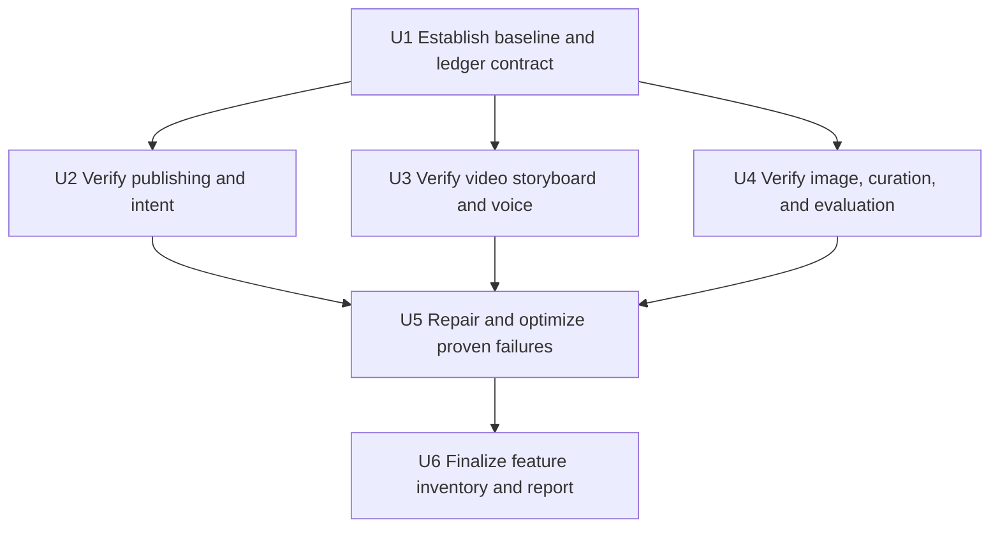

# refactor: Verify and converge the feature lifecycle

## Summary

Characterize the recently added publishing, intent, video-storyboard, image-prompt, art-curation, and prompt-evaluation capabilities one group at a time before changing behavior. Repair only demonstrated failures, converge branch-separated implementations without discarding either side, and establish one agent-readable feature ledger that distinguishes current, partial, superseded, and planned capabilities.

---

## Problem Frame

Recent work created a coherent product chain, but several capabilities are distributed across committed code, local `main`, the checked-out feature branch, and 39 working-tree changes. Some features have strong unit coverage yet may still fail at their real cross-layer entry point; others are represented by plans or UI state without a proven runnable path. Without an executable inventory, later agents can unknowingly replace working behavior, retain dead implementations, or spend model and provider cost rebuilding capabilities that already exist.

---

## Requirements

- R1. Verify each recent capability through its real code entry point and the narrowest meaningful unit or integration test; a plan, component, or type definition alone is not evidence that the feature runs.
- R2. Classify every audited capability as `working`, `partial`, `broken`, `observing`, `planned`, or `superseded`, with ownership code, tests, dependencies, invariants, and known failure evidence.
- R3. Preserve existing user data, generated media, paid-task receipts, version history, manual edits, and Story-scoped isolation during all tests and repairs.
- R4. Do not start, stop, or restart development servers for this work. Tests must not write to the main `.webdev/local-persist.json` or any worktree data file.
- R5. When a requested repair would weaken, replace, or remove a recorded capability, stop and request explicit user approval before applying it.
- R6. Reconcile the checked-out image-art-direction work with the prompt-evaluation commits already on local `main` semantically; do not resolve overlap by selecting one branch wholesale.
- R7. Improve robustness and efficiency only where failures, code-health evidence, or repeated logic justify the change; preserve behavior through characterization coverage before structural refactors.
- R8. Produce one durable feature ledger that agents must read before related edits and update after work, while fixes and refactors append to their owning feature rather than creating noisy standalone cards.
- R9. Produce a final Chinese report covering recent features, older still-active foundations, broken/partial paths, repairs, deferred improvements, and the evidence used for each conclusion.

---

## Scope Boundaries

- Do not delete or rewrite worktrees, branches, local data files, generated media, or historical feature plans as part of this audit.
- Do not make paid 302, image, video, TTS, or art-analysis calls. External-provider paths are verified with existing mocks, fixtures, and persisted-task state transitions.
- Do not treat every static-analysis “unused” or “high-risk” function as a defect. Confirm reachability, ownership, and behavior before cleanup.
- Do not split large React or router files merely to reduce line count. Extract a boundary only after characterization proves behavior and the boundary removes a demonstrated risk or repeated responsibility.
- Do not build a feature-management UI in this iteration. The first ledger is repository-owned and agent-readable.
- Do not claim real-time social-media trend adaptation is implemented unless an executable data source and generation path are found and verified.

### Deferred to Follow-Up Work

- Production migration of the private art repository to private object storage and database-backed review states follows after local catalog behavior is verified.
- Browser-visible acceptance testing may be performed later against the already-running main-repository port 3000, but this plan does not control that server.
- Full repository-wide dead-code removal follows only after feature ownership and runtime reachability are recorded in the ledger.

---

## Context & Research

### Relevant Code and Patterns

- `shared/publishingDraft.ts`, `server/services/publishingPersistence.ts`, and `server/routers/publishingDraft.ts` define version-scoped publishing state, revisions, receipts, and owner-checked mutations.
- `server/archive/storyIntent.ts` and `client/src/features/publishingDraft/PublishingDraftWorkspace.tsx` connect narrative purpose/audience recognition to the active publishing version.
- `server/services/publishingVideoStoryboard.ts`, `server/services/publishingVideoStoryboardPersistence.ts`, and `client/src/features/publishingDraft/PublishingVideoScriptReview.tsx` own preview, confirmation, coverage, and regeneration behavior.
- `server/services/renderGate.ts` is the intended single static-image prompt compiler; `server/services/staticImageQualityGate.ts` and `server/services/imageGen.ts` quarantine textual contamination after generation.
- `server/services/artRepository.ts`, `server/services/artRepositoryCatalog.ts`, and `art-repository/catalog.json` represent the uncommitted private-curation path.
- `server/services/promptEvalHarness.ts`, prompt-lineage services, and Story Agent recurring-edit paths on local `main` provide the evaluation side that must survive convergence.
- Existing router and service tests use isolated fixtures and mocked providers; these patterns are preferred over live-provider or browser-driven validation for this pass.
- `scripts/code-health-report.ts` provides trend evidence but is a triage source rather than proof of runtime failure.

### Institutional Learnings

- `docs/solutions/2026-06-13-多worktree环境数据分裂收敛.md`: persistence follows `process.cwd()`; tests and diagnostics must never mutate the real `.webdev` store, and only the main repository may own the running development service.
- `docs/solutions/2026-06-13-故事为唯一单位-镜头按storyId.md`: Story and user ownership are required at every read/write boundary; latest-Story or project-only fallbacks can overwrite unrelated work.
- Existing publishing plans establish complete-projection replacement, stable identities, idempotent receipts, explicit confirmation before paid or formal writes, and late-response isolation as invariants.

### External References

- None required. The work is an evidence-driven convergence of repository-specific behavior with established local testing and persistence patterns.

---

## Key Technical Decisions

| Decision | Rationale |
| --- | --- |
| Characterize before repair | The user reports that some visible capabilities do not actually run; preserving the failure as a test prevents a cosmetic or partial fix. |
| Audit by product chain rather than file size | A runnable capability crosses UI, router, service, persistence, and provider adapter; file-local checks can falsely report success. |
| Use one ledger with hierarchical feature cards | Durable capabilities remain discoverable while bug fixes and refactors stay in the owning history instead of becoming a second backlog. |
| Treat branch divergence as a feature conflict | The image prompt work and prompt-evaluation loop modify related semantics. A semantic compatibility matrix is required before code convergence. |
| Make acceptance evidence explicit | Each ledger state points to tests or a documented blocker, so future agents can distinguish shipped behavior from plans and unverified UI. |
| Optimize after behavior is stable | Large-file extraction and deduplication are allowed only after the relevant acceptance chain passes, limiting accidental feature loss. |

---

## High-Level Technical Design

> *This illustrates the intended approach and is directional guidance for review, not implementation specification. The implementing agent should treat it as context, not code to reproduce.*

Each feature moves through an evidence lifecycle: discovered → characterized → verified or failed → repaired if in scope → recorded with ownership and invariants. A feature cannot be marked `working` from a plan or static code presence alone.

---

## Implementation Units

### U1. Establish the verification baseline and feature-ledger contract

**Goal:** Capture the current branch/environment/test baseline and introduce a machine-readable, human-readable feature ledger contract without changing product behavior.

**Requirements:** R2–R5, R8

**Dependencies:** None

**Files:**

- Create: `docs/features/README.md`
- Create: `docs/features/feature-ledger.json`
- Create: `scripts/validate-feature-ledger.ts`
- Create: `scripts/validate-feature-ledger.test.ts`
- Modify: `package.json`
- Modify: `AGENTS.md`

**Approach:**

- Record stable feature identity, lifecycle state, user value, entry points, owning code, tests/evidence, invariants, dependencies, replacement relationships, known gaps, and change history.
- Seed cards for the recent capability groups already identified, but leave audit-dependent states as `observing` until their tests run.
- Add agent preflight/post-work rules and the hard approval gate to the repository instructions.
- Validate IDs, allowed states, referenced feature relationships, required ownership/evidence fields, and duplicate cards without introducing a database or UI.

**Execution note:** Implement the ledger validator test-first; the documentation and seed data have no runtime effect.

**Patterns to follow:**

- `scripts/code-health-report.ts` for repository-local deterministic diagnostics.
- `AGENTS.md` environment rules for concise mandatory agent behavior.

**Test scenarios:**

- Happy path: a complete ledger containing active, observing, and superseded cards validates successfully.
- Edge case: a fix recorded only in an owning feature’s history does not require a standalone feature card.
- Error path: duplicate IDs, invalid states, missing ownership/evidence, and references to unknown replacement/dependency IDs each fail with an actionable path.
- Error path: a capability marked `working` without at least one test/evidence reference is rejected.

**Verification:**

- The ledger validates deterministically and the agent rules require read-before-edit, update-after-edit, and approval-before-replacement.

### U2. Verify publishing versions, narrative intent, and story titles

**Goal:** Prove that version creation/selection, purpose-and-audience intent, automatic titles, and manual rename work through the real shared domain and router boundaries without cross-version or cross-Story overwrite.

**Requirements:** R1–R5, R7, R9

**Dependencies:** U1

**Files:**

- Modify when repair is proven: `shared/publishingDraft.ts`
- Modify when repair is proven: `server/archive/storyIntent.ts`
- Modify when repair is proven: `server/routers/publishingDraft.ts`
- Modify when repair is proven: `client/src/features/publishingDraft/PublishingDraftWorkspace.tsx`
- Test: `shared/publishingDraft.test.ts`
- Test: `server/archive/storyIntent.test.ts`
- Test: `server/routers.publishingDraft.test.ts`
- Test: `server/routers.storyAgent.test.ts`
- Test: `client/src/features/publishingDraft/PublishingDraftWorkspace.test.tsx`

**Approach:**

- Run the narrow existing suites first and map each requirement to passing or failing assertions.
- Add characterization only where a user-visible promise lacks coverage: V1/V2 isolation, provisional-to-confirmed intent, intent versioning, automatic-title non-overwrite, manual rename, stale/late response isolation, and restart-safe receipts.
- Apply repairs only after a reproducible failing test; preserve complete-projection and expected-revision patterns.

**Execution note:** Characterization-first for every uncovered behavior; do not restructure the workspace while failures are still ambiguous.

**Patterns to follow:**

- Publishing version tests in `shared/publishingDraft.test.ts` and router conflict/idempotency tests.
- Story-title isolation and late-response tests in `server/routers.storyAgent.test.ts`.

**Test scenarios:**

- Happy path: confirming a core change creates V2, keeps V1 content/cover/video state, and binds the new intent only to V2.
- Happy path: first effective conversation assigns an automatic title only to an unnamed Story; manual rename changes only the title.
- Edge case: wording-only and platform-only edits remain in the current version and do not silently create V2.
- Error path: stale revisions, duplicate operation tokens, unauthorized Story IDs, and delayed responses cannot change the active version or another Story.
- Integration: intent selected or inferred at the publishing entry reaches the persisted version projection returned to the workspace.

**Verification:**

- Each capability receives a ledger state backed by passing tests or a precise reproducible blocker.

### U3. Verify publishing-to-video storyboard and voice behavior

**Goal:** Prove the explicit preview/confirm path, paragraph coverage, stable regeneration, paid-free navigation, voice separation, and cross-Story response guards.

**Requirements:** R1–R5, R7, R9

**Dependencies:** U1

**Files:**

- Modify when repair is proven: `server/services/publishingVideoStoryboard.ts`
- Modify when repair is proven: `server/services/publishingVideoStoryboardPersistence.ts`
- Modify when repair is proven: `server/routers/publishingDraft.ts`
- Modify when repair is proven: `client/src/features/publishingDraft/PublishingVideoScriptReview.tsx`
- Modify when repair is proven: `client/src/features/storyAgent/views/StoryboardReviewBoard.tsx`
- Test: `server/services/publishingVideoStoryboard.test.ts`
- Test: `server/services/publishingVideoStoryboardPersistence.test.ts`
- Test: `server/routers.publishingDraft.test.ts`
- Test: `client/src/features/publishingDraft/PublishingVideoScriptReview.test.tsx`
- Test: `client/src/features/storyAgent/views/storyboardVoiceText.test.ts`
- Test: existing Story isolation tests discovered during execution

**Approach:**

- Separate preview generation evidence from formal confirmation evidence; navigation must remain read-only until the explicit action.
- Verify canonical paragraph coverage and fallback behavior without calling external providers.
- Verify stable IDs and manual/media preservation across regeneration, including conflict and cancellation paths.
- Confirm narration, dialogue, ambient sound, and video requirements remain distinct and restore against the correct Story/version.

**Execution note:** Characterization-first around the full preview → confirmation → regeneration lifecycle.

**Patterns to follow:**

- Version-scoped persistence CAS and operation-receipt tests.
- Storyboard stable-ID and late-response guards already present in Story Agent tests.

**Test scenarios:**

- Happy path: a multi-paragraph draft creates a reviewable preview with complete source/script/shot mapping and no formal-shot mutation before confirmation.
- Happy path: confirmation atomically activates the complete group; reopening restores matching version/script/voice state.
- Edge case: empty or sparse model output uses the bounded local fallback and still satisfies minimum coverage.
- Edge case: regeneration preserves exact safe shot IDs, user edits, images, videos, and voice bindings.
- Error path: CAS conflict, provider failure, cancellation, unauthorized Story, and delayed previous-Story responses leave formal data unchanged.
- Integration: publishing CTA → preview router/service → confirmed Story projection → Storyboard review model exposes the same script and voice fields.

**Verification:**

- The complete flow is either backed by passing cross-layer tests or recorded as partial/broken with an isolated failing seam.

### U4. Verify image prompt compilation, quality quarantine, art curation, and evaluation convergence

**Goal:** Prove the single prompt-compilation path, hard no-text/style rules, post-generation quarantine, private-curation safety, and compatibility with the prompt-evaluation commits on local `main`.

**Requirements:** R1–R7, R9

**Dependencies:** U1

**Files:**

- Modify when repair is proven: `server/services/renderGate.ts`
- Modify when repair is proven: `server/services/imageGen.ts`
- Modify when repair is proven: `server/services/staticImageQualityGate.ts`
- Modify when repair is proven: `server/services/artRepository.ts`
- Modify when repair is proven: `server/services/artRepositoryCatalog.ts`
- Modify when repair is proven: `evals/run.ts`
- Modify when repair is proven: `evals/recurringEditAnalysis.ts`
- Modify when repair is proven: `server/services/recurringEditSignal.ts`
- Test: `server/services/renderGate.test.ts`
- Test: `server/services/imageGen.test.ts`
- Test: `server/services/staticImageQualityGate.test.ts`
- Test: `server/services/artRepository.test.ts`
- Test: `evals/metrics/metrics.test.ts`
- Test: `evals/recurringEditAnalysis.test.ts`
- Test: `server/services/recurringEditSignal.test.ts`

**Approach:**

- Enumerate every static-image generation entry point and prove it reaches the canonical render gate exactly once.
- Test the final compiled prompt, not intermediate fragments, for no-text, non-photoreal, story-controlled palette, and full-round rejection-change behavior.
- Verify quality quarantine hides only contaminated candidates, isolates a fully contaminated round, and does not trigger an unconfirmed paid retry.
- Verify the art repository exposes only sanitized `ready` DNA at runtime; `pending-analysis`, raw paths, source subjects, and contamination cannot enter prompts.
- Build a compatibility matrix between current working-tree prompt changes and local-main evaluation/recurring-edit commits before any convergence edit.

**Execution note:** Characterization-first and no paid-provider calls. Any semantic conflict between the current branch and local `main` triggers the feature replacement approval gate before resolution.

**Patterns to follow:**

- Final-output prompt scoring in the prompt-evaluation harness.
- Provider-adapter separation documented in `server/services/imageGen.ts`.
- Sanitized-DNA boundary in `server/services/artRepository.ts`.

**Test scenarios:**

- Happy path: each cover, Story Agent, Creation Agent, and shot-derived static-image request compiles through the same gate once while retaining story-specific content and palette.
- Edge case: a user/reference prompt attempting to request text, logo, watermark, photorealism, or conflicting fixed color cannot override the final hard rules.
- Edge case: a quality result containing fewer than four clean candidates persists and displays only the clean IDs with rejection metadata.
- Error path: all candidates contaminated results in an isolated failed round without automatic resubmission or a second charge.
- Error path: malformed art catalog entries, prompt-injection text, oversized values, pending assets, and raw source paths are rejected or excluded.
- Integration: the final compiled prompt consumed by image generation is the same canonical output scored by the evaluation harness after branch convergence.

**Verification:**

- Image-generation entry points, sanitation boundaries, evaluation compatibility, and any remaining provider-only uncertainty are explicitly recorded in the ledger.

### U5. Repair demonstrated failures and apply bounded robustness/efficiency improvements

**Goal:** Fix failures discovered by U2–U4 and reduce proven complexity/repetition without changing accepted product behavior.

**Requirements:** R3–R7

**Dependencies:** U2, U3, U4

**Files:**

- Modify: only implementation and test files tied to reproducible failures or measured hotspots from U2–U4
- Test: corresponding unit and cross-layer suites for every behavior change

**Approach:**

- Prioritize correctness and lost-update/cross-Story risks before performance or file-size cleanup.
- Consolidate duplicated normalization, provider adaptation, or prompt compilation only when two verified paths share the same invariant.
- Split `PublishingDraftWorkspace.tsx` by version controls, intent, cover studio, and video handoff only if characterization coverage is green and the extraction reduces responsibility coupling without state duplication.
- Re-run code-health after repairs and explain rather than blindly chase changes in high-risk/unused counts.

**Execution note:** Test-first for each reproduced bug. Structural extraction remains characterization-first.

**Patterns to follow:**

- Complete state projection replacement and Story/version/revision tokens.
- One canonical compiler with thin provider adapters.
- Existing pure normalizers and deterministic fixtures.

**Test scenarios:**

- Happy path: every previously failing acceptance case passes through the real layer chain after repair.
- Edge case: repeated, delayed, or concurrent operations remain idempotent and scoped after simplification.
- Error path: provider, persistence, and malformed-data failures preserve the last valid user-visible state and expose a retryable error.
- Integration: focused suites for every changed cross-layer chain pass together, followed by TypeScript and build verification.

**Verification:**

- No repair relies only on manual inspection; each has a failing-before/passing-after test or a documented reason why automated reproduction is impossible.

### U6. Finalize the new/old feature inventory and health report

**Goal:** Turn audit results into a durable current-product map and a Chinese handoff report that future agents can use before editing.

**Requirements:** R2, R5, R8, R9

**Dependencies:** U1–U5

**Files:**

- Modify: `docs/features/feature-ledger.json`
- Modify: `docs/features/README.md`
- Create: `docs/features/feature-inventory.zh-CN.md`

**Approach:**

- Separate durable product capabilities from implementation mechanisms and historical fixes.
- Include old foundations still required by new work: Story ownership, stable shot identity, image-asset history, prompt lineage, environment isolation, and paid-operation receipts.
- Record every partial/broken capability with a precise missing seam; do not label plans or dormant code as working.
- Preserve historical plans unchanged; represent current and superseded status in the ledger so earlier decision context remains intact.
- Summarize what was repaired, what remains observation-only, and which optimizations should be follow-up rather than bundled cleanup.

**Test scenarios:**

- Happy path: the finalized ledger passes validation and every `working` feature has executable evidence.
- Edge case: a superseded plan points to its replacing feature without deleting historical context.
- Error path: stale file/test references or circular replacement relationships fail ledger validation.

**Verification:**

- A future agent can identify relevant existing behavior, its invariants, tests, current lifecycle state, and replacement approval requirement before changing code.

---

## System-Wide Impact

- **Interaction graph:** publishing UI → version/intent router → Story persistence; publishing preview → Storyboard projection → voice/media bindings; image entry points → render gate → provider → quality quarantine; feedback history → evaluation harness.
- **Error propagation:** failures must remain scoped to the initiating Story/version/operation and return retryable evidence without erasing the last valid projection.
- **State lifecycle risks:** current work spans uncommitted files and commits present only on local `main`; semantic convergence and late-response guards are critical to avoiding lost behavior.
- **API surface parity:** Story Agent, Creation Agent, publishing covers, shot generation, and derived-shot paths must share static-image rules; UI and router entry points must agree on version/intent identity.
- **Integration coverage:** unit tests are insufficient for version creation, preview confirmation, image compilation, or quality quarantine; each needs at least one real cross-layer test without mocking the layers being integrated.
- **Unchanged invariants:** one Story/user ownership boundary, one main-repository development service, no worktree data writes, explicit paid confirmation, immutable historical media, and no automatic overwrite of user-confirmed work.

---

## Risks & Dependencies

| Risk | Mitigation |
| --- | --- |
| Existing dirty changes are overwritten during repair | Snapshot paths and diffs before editing; stage no unrelated files; use the ledger conflict gate before semantic replacement. |
| Tests accidentally touch real local data | Run environment status first; inspect test setup; use isolated temp paths and provider mocks; compare main data mtime around risky suites. |
| A UI component exists but its router/service path is incomplete | Require entry-point-to-persistence trace and cross-layer evidence before marking working. |
| Provider tests pass while live credentials/contract are invalid | Record provider-live status separately as unverified; do not make paid calls in this pass. |
| Large-file refactoring introduces state races | Characterize late responses, dirty buffers, and complete-projection replacement before extraction; skip extraction if evidence is insufficient. |
| Local `main` and current branch both contain valuable prompt behavior | Build a semantic compatibility matrix and stop for approval on true replacement conflicts. |

---

## Documentation / Operational Notes

- The feature ledger is the canonical discovery index; existing brainstorms and plans remain detailed historical sources.
- The final inventory is written in Chinese for product review, while stable IDs and machine-readable fields remain language-neutral.
- Snapshot, type-check, test, and build outcomes are recorded with timestamps; provider-live uncertainty is never converted into a false success claim.

---

## Sources & References

- `docs/brainstorms/2026-08-05-publishing-draft-workspace-requirements.md`
- `docs/plans/2026-08-06-003-feat-story-publishing-versions-plan.md`
- `docs/plans/2026-08-08-001-feat-publishing-video-storyboard-plan.md`
- `docs/plans/2026-06-29-001-feat-unified-prompt-lineage-plan.md`
- `docs/solutions/2026-06-13-多worktree环境数据分裂收敛.md`
- `.code-health/latest.md`
