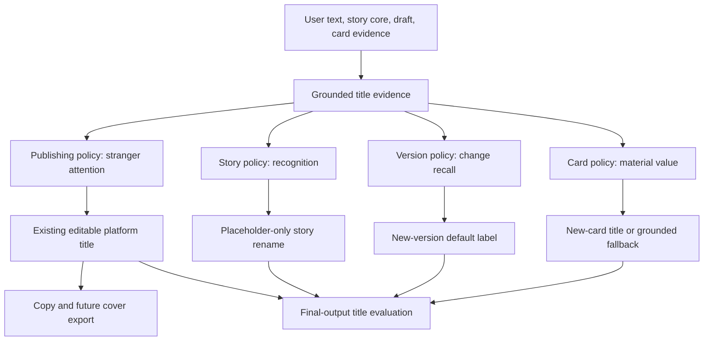
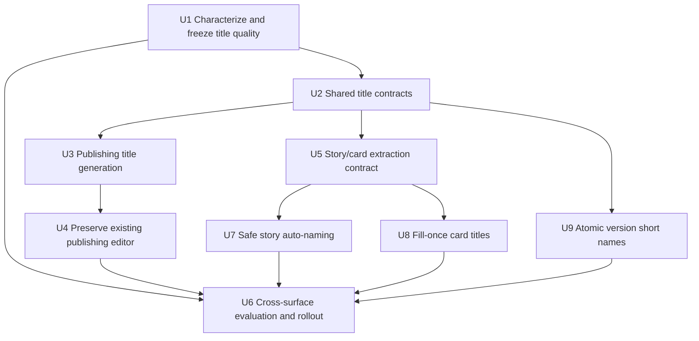
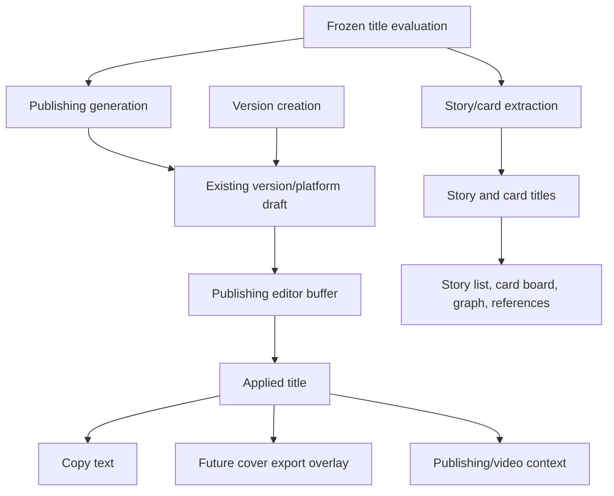

# fix: Make generated titles specific and compelling

## Summary

Replace the current one-size-fits-all title behavior with a grounded title evidence layer and four purpose-specific policies: publishing titles earn a stranger's attention, story and version names support recognition and recall, and card titles expose the material's concrete value. Each existing surface continues to receive one editable title through its current flow; the fix adds no candidate chooser, second save model, or hidden model call.

---

## Problem Frame

The four visible title types currently share neither a quality target nor a feedback loop. Publishing titles are emitted incidentally beside the body with no title-specific contract; story names are decided from the first turn or copied from downstream titles; version names fall back to plain `Vn`; and card titles are usually the first 14 characters of an existing field. This produces summaries, clipped sentences, and internal labels where the product needs language that is concrete, recognizable, and—only for public publishing—worth opening.

A read-only inventory of the current local corpus found 18 story titles, 78 card titles, four version names, and three non-empty publishing titles. Nineteen card titles end in the truncation ellipsis and every observed version name is a plain `Vn`. The publishing sample is too small to support a claim about audience appeal, so the implementation must establish a frozen, de-identified evaluation set before changing generation behavior.

---

## Requirements

- R1. Treat publishing titles, story names, version short names, and card titles as four different product jobs; do not solve them with one generic “write an attractive title” prompt.
- R2. Every model-generated title must be grounded in user-provided text, the saved story core, or the current draft. It must not invent a person, number, event, result, conflict, endorsement, certainty, or emotional intensity.
- R3. Non-X publishing generation and platform conversion must produce one specific, grounded title whose job is to earn a stranger's continued attention without using generic summary voice, manufactured suspense, or invented stakes.
- R4. X remains titleless. A generated publishing title is scoped to the current Story, publishing version, and platform, and must use the existing revision and late-response guards so it cannot leak across scope or overwrite a newer/manual title.
- R5. During initial generation, the generated publishing title may initialize the title only if the authoritative title is still empty when the result is committed. Later generation or conversion preserves an applied or manually entered title; users continue to edit and Apply through the existing title field.
- R6. A title-only publishing edit is platform wording: it must not create a new story-core version, stale a video storyboard, regenerate a cover image, or trigger an edit-classification model call. Copy and future cover export use only the applied title.
- R7. Story auto-naming must use a short, concrete internal name and keep the existing compare-and-set invariant: it may replace only an untitled placeholder and must never replace a user-chosen or concurrently changed name.
- R8. New publishing versions with no user-entered name must receive `Vn · <specific short label>` derived from that version's changed core, purpose/audience, or applied draft. User-entered and renamed version names always win; existing legacy `Vn` records are not silently bulk-renamed.
- R9. New cards should receive a compact title from the existing extraction call, preferring a concrete object, action, evidence, or user phrase over an emotion category or clipped sentence. Existing/imported non-empty card titles remain unchanged; missing or invalid model titles use a deterministic grounded fallback.
- R10. Model or validation failure must not block the underlying conversation, card creation, publishing body, or version creation. Title failure leaves the current title intact, falls back only where an internal name is required, and keeps manual editing available.
- R11. Build a small title-specific evaluation loop that scores final normalized titles, not prompt fragments. Automatic gates cover contract validity, grounding evidence, sensitive-information leakage, length, and template leakage; blind old-single-versus-new-single comparison covers stranger interest, recognizability, usefulness, personal voice, and non-clickbait trustworthiness. Report every title kind separately.
- R12. Existing user control and persistence invariants remain intact: Story is the sole work unit, platform/version drafts stay isolated, manual titles are editable, version operations keep their revision/idempotency guards, and generic Story saves cannot erase server-owned publishing state.
- R13. Real local text used for evaluation must remain read-only and local. Any committed fixture must be de-identified or synthetic while preserving the linguistic failure mode. Provider-backed evaluation may consume only committed de-identified fixtures, must never read `.webdev`, and must warn that fixture content leaves the machine. Runtime evidence anchors are validated in memory and are not copied into logs or external analytics.

---

## Scope Boundaries

- The first iteration keeps the current one-title UI on all four surfaces. It does not add a publishing candidate chooser, regeneration button, proposal persistence, or a second title-save workflow.
- X continues to have no independent title and receives no hidden title generation.
- The work improves titles; it does not rewrite the publishing body, story core, script, shot content, or the user's position.
- Existing story, version, and card titles are not batch-regenerated on load, migration, or deployment.
- The evaluation loop does not ingest social-platform views, likes, clicks, or conversion data and does not claim to optimize CTR.
- No long-term cross-story personal voice model or demographic persona is introduced.
- A model judge may be used as a diagnostic aid, but its score cannot be the sole regression gate or proof that a title is attractive.
- The implementation does not add background model calls when switching Stories, platforms, versions, cards, or workspaces.

### Deferred to Follow-Up Work

- Post-publication performance learning: revisit only after direct publishing or explicitly imported performance data exists.
- Long-term preference learning across Stories: consider only after ordinary title edits provide a trustworthy signal and users consent to retention.
- Bulk repair of historical generic names: provide a separate preview-and-confirm workflow if users ask for it; do not hide it in normalization.

---

## Context & Research

### Relevant Code and Patterns

- `server/services/publishingDraft.ts` owns publishing generation, conversion, revision, structured repair, platform context, and title normalization. Today the schema says only that `title` may be empty and does not state a title objective, stranger-audience goal, specificity requirement, or evidence contract.
- `shared/publishingDraft.ts`, `server/services/publishingPersistence.ts`, and `server/routers/publishingDraft.ts` provide the existing version/platform-scoped state, normalization, revision checks, idempotent version operations, and server-owned persistence boundary that title generation must preserve without adding another state protocol.
- `client/src/features/publishingDraft/PublishingDraftWorkspace.tsx` already owns the editable title field, local dirty buffer, platform/version switches, rewrite previews, and explicit Apply behavior. The fix keeps that interaction unchanged.
- `client/src/features/publishingDraft/publishingCoverExport.ts` and the publishing video handoff read the applied draft title. They establish the invariant that title changes alter future copy/export text without regenerating the visual master or invalidating unchanged video content.
- `server/archive/storyAgent.prompts.ts`, `server/archive/storyReply.ts`, `shared/storyTitle.ts`, and `server/routers/storyAgent.ts` form the story auto-title path. The existing placeholder-only database update and late-response tests are the safety boundary to retain.
- `client/src/features/storyAgent/storyTitle.ts` currently falls back through publishing, script, card, and conversation titles for an unnamed Story. Those inputs need internal-name normalization rather than direct public-title reuse.
- `client/src/features/storyAgent/storyAgentUtils.ts` currently derives card titles by selecting `sourceQuote || content || rawText` and truncating at 14 characters. `StoryAgentContext.tsx` applies this during card creation and hydration; card boards, graphs, retrieval labels, and art references then consume the stored title.
- `server/services/publishingPersistence.ts` and `PublishingDraftWorkspace.tsx` currently default new version labels to plain `Vn`, despite `docs/plans/2026-08-06-003-feat-story-publishing-versions-plan.md` specifying `Vn · <short title>`.
- Local `main` at `ab08276` contains the verified `evals/` baseline/golden-set pattern. Title work should extend that merged harness from a clean worktree rather than start from the current dirty feature checkout.

### Institutional Learnings

- `docs/brainstorms/2026-08-05-publishing-draft-workspace-requirements.md` requires platform adaptation to preserve facts, viewpoint, emotion, conclusion, and personal edge, and explicitly rejects generic “viral” platform voice.
- `docs/plans/2026-06-01-001-feat-xiaozhuo-conversation-stickiness-plan.md` treats positive distortion and negative over-interpretation as equal failures. A title may name only what the user actually supplied; it cannot create drama to improve apparent appeal.
- `docs/brainstorms/2026-05-19-story-agent-evocative-voice-requirements.md` identifies structured labeling and preset emotion vocabulary as a source of stiff language. Story/card names should prefer concrete user language over “emotion + event summary” templates.
- `docs/plans/2026-08-11-001-refactor-feature-health-convergence-plan.md` reinforces that evaluation must inspect the final runtime output and that plans or type contracts are not runtime evidence. The existing prompt harness is reusable architecture, not an already-working title evaluator.
- `docs/solutions/2026-06-13-故事为唯一单位-镜头按storyId.md` keeps every read/write owner- and Story-scoped.
- `docs/solutions/2026-06-13-多worktree环境数据分裂收敛.md` requires worktrees to avoid local business-data writes and browser verification to use the single main service.

### External References

- None required. The repository already has direct patterns for structured model output, explicit user application, version isolation, late-response guards, manual rename protection, and golden-set evaluation. The unresolved question is product quality on this corpus, not framework usage.

---

## Key Technical Decisions

| Decision | Rationale |
| --- | --- |
| Use one shared title evidence/normalization contract with four policies | Facts, source phrases, lengths, wrappers, and evidence anchors can be validated consistently, while each title kind keeps a different user job and rubric. |
| Keep one title in each existing surface | The user is broadly satisfied with the current flows and asked for a narrow quality correction. Reusing the current title field avoids a candidate chooser, proposal schema, revision domain, and second interaction model. |
| Reuse existing model calls for publishing, story, and card titles; derive version labels deterministically | Title quality should not introduce invisible cost or latency. This iteration adds no dedicated title-suggestion or regeneration call. |
| Preserve existing/manual titles by write rule rather than retroactive heuristics | Story names update only placeholders, card titles fill only missing values, and version defaults apply only at creation. A generated publishing title may initialize an authoritative field that is still empty, but later generation preserves any applied or manual title. This avoids guessing whether legacy `V2` or an existing phrase was manually chosen. |
| Separate hard validation from taste evaluation | Empty/overlong/malformed/duplicate/ungrounded outputs are enforceable in code. “Would a stranger continue?” and “does this sound like the user?” require blind human comparison and cannot be proven by a blacklist or self-score. |
| Treat manual title edits as user-authored platform wording | The system should not reject the user's own wording or reinterpret a title-only edit as a new story core. Grounding and sensitive-information checks constrain generated titles, not user ownership. |
| Keep automatic old-title repair out of normalization | Loading data must remain lossless and unsurprising. Historical cleanup needs a visible, reversible user action in a later scope. |
| Derive default version names only inside the server's locked create-version operation | The client cannot reliably know the final sequence or authoritative normalized content. Lock-scoped derivation makes concurrent creation and operation-token retries return the same stored name. |
| Treat evidence anchors as traceability, not proof of total semantic fidelity | An existing quote proves a source connection but cannot prove that the rest of a title contains no invented causality or emotion. Runtime gates cover deterministic differences; blind case review remains mandatory for semantic faithfulness. |

---

## Success Metrics

- The fixed comparison set contains at least five de-identified or synthetic cases per title kind and covers the observed clipped-card, plain-version, summary-like story, and incidental publishing-title failures plus sparse, mixed-language, quotation, positive/critical, fiction, job-search, and malformed-output boundaries. This first set is a characterization gate, not a statistically powered CTR study or a reusable benchmark claim.
- Generated outputs pass 100% of kind/platform structural and privacy gates: X title empty, required internal names non-empty, configured length bounds respected, wrappers removed, and no generated title exposes a phone number or email address. Every generated title supplies a verifiable source anchor during validation; anchor presence is traceability, not proof that every claim is faithful.
- In randomized blind old-single-versus-new-single review, the new title wins more non-tied comparisons than the old title within each kind: publishing on “would continue reading,” story/version on recognition and recall, and cards on quick material comprehension. Ties are reported, factual trustworthiness is scored separately, and any invented fact blocks acceptance regardless of preference. No aggregate score may hide a losing title kind.
- Integration tests prove that manual titles are never overwritten, title-only publishing edits create no core version/model classification call, old async responses cannot cross scope, and existing Story/version/card data loads unchanged.
- The normal path adds no model call for story names, card titles, or version names and no extra publishing call beyond the existing generation/conversion call.

---

## Open Questions

### Resolved During Planning

- **Should any surface add multiple candidates in this iteration?** No. All four keep their current one-title interaction and existing rename/manual-recovery behavior.
- **Should a title-only publishing edit create a new content-core version?** No. It is deterministic platform wording unless body/tags/core also change.
- **Should the system silently repair old `Vn` or clipped card titles?** No. This release affects new generation and missing-title fallback only.
- **What happens when a generated title fails validation?** The title failure is non-fatal to the body/card/conversation/version operation. Publishing preserves the current title; required internal names use a grounded deterministic fallback.
- **How are extra model costs avoided?** Story and card titles ride their existing structured extraction calls, publishing titles ride generation/conversion, and version names are deterministic. There is no dedicated title call in this iteration.
- **Should generated-title guards constrain a user's hand-written title?** No. The user remains the authority over manual text; only model-generated titles require source evidence and contact-information screening.
- **Where is an automatic version name computed?** Inside the locked server create-version operation after revision validation, using the normalized snapshot that will be persisted. An idempotent retry returns the stored result rather than deriving again.

### Deferred to Implementation

- The precise recommended length band per publishing platform may be tuned against the frozen corpus, while existing storage maxima and X's empty-title invariant remain hard boundaries.
- De-identification wording for each local case requires a manual privacy pass before a fixture is committed; preserving the failure shape matters more than preserving literal personal text.

---

## High-Level Technical Design

> *This illustrates the intended approach and is directional guidance for review, not implementation specification. The implementing agent should treat it as context, not code to reproduce.*

The evidence layer carries only facts and source phrases already available to the current operation. Model outputs identify the source anchors they relied on; deterministic validation confirms that the anchors exist, screens generated titles for contact-information leakage, and checks the kind/platform contract. Anchor presence does not prove total semantic faithfulness or taste, so a small blind old-title/new-title comparison closes that gap without changing the product UI.

---

## Implementation Units

### U1. Characterize current title behavior and freeze a comparison set

**Goal:** Turn “titles feel stiff” into reproducible examples and independent pass/fail evidence before modifying generation behavior.

**Requirements:** R1, R11, R13

**Dependencies:** Local `main` containing the verified `evals/` harness (`ab08276` or later)

**Files:**

- Create: `evals/titleCases.ts`
- Create: `evals/titleMetrics.ts`
- Create: `evals/titleMetrics.test.ts`
- Modify: `evals/run.ts`
- Modify: `package.json`

**Approach:**

- Inventory the four current paths and record their actual final normalized outputs, including story/card deterministic fallbacks and plain version labels. Do not score prompt text in place of output.
- Build a fixed set of at least five de-identified or synthetic cases per title kind from the observed local failure shapes and boundary cases. Each case declares available evidence, platform when applicable, prior/manual title state, and what must not be invented; it does not freeze one “correct” creative title.
- Keep two lightweight layers: deterministic metrics for enforceable contracts and a randomized old-single/new-single review sheet for product taste. Report wins, losses, and ties for each title kind separately; do not create a combined quality score.
- Reuse the existing eval runner and report shape instead of creating a second corpus/baseline framework. Provider-backed generation is an explicit local command that accepts only committed de-identified fixtures, warns that content leaves the machine, never reads `.webdev`, and is not part of deterministic CI.

**Execution note:** Start with characterization fixtures that demonstrate the current clipped-card, plain-version, summary-like story, and incidental publishing-title behaviors before introducing new policy.

**Patterns to follow:**

- `evals/run.ts`
- `evals/corpus.ts`
- `evals/report.ts`
- `evals/types.ts`

**Test scenarios:**

- Happy path: a mixed four-kind fixture loads, preserves case identity, and reports per-kind wins/losses/ties without exposing unredacted `.webdev` text.
- Grounding: a generated title citing a source phrase present in the case passes traceability; a title adding a missing person, number, event, result, or emotional claim is surfaced as a faithfulness failure even when some anchor exists.
- Kind boundaries: X requires an empty title, while story/version/card cases reject missing required names and publishing title failure remains non-fatal to the body.
- Privacy: committed fixtures contain no raw user IDs, Story IDs, contact data, or literal sensitive passages copied from local persistence.
- Provider boundary: the optional model-backed command refuses arbitrary `.webdev` paths and clearly states that the de-identified fixture text will leave the machine.
- Human review export: old/new single titles are randomized and unlabeled while kind-specific questions remain visible; the report cannot collapse faithfulness and attraction into one score.

**Verification:**

- The current implementation produces a fixed characterization report that exposes the known truncation and placeholder behaviors without claiming statistical significance or audience click-through impact.

### U2. Define shared title evidence, policies, and normalization

**Goal:** Give all four title paths one grounded contract while keeping their purpose, empty-value, length, and fallback rules distinct.

**Requirements:** R1, R2, R3, R4, R7, R8, R9, R10

**Dependencies:** U1

**Files:**

- Create: `shared/textTitle.ts`
- Create: `shared/textTitle.test.ts`
- Modify: `shared/storyTitle.ts`
- Test: `shared/storyTitle.test.ts`

**Approach:**

- Define title kinds and purpose-specific policies for required/optional value, recommended and hard bounds, wrapper cleanup, and allowed fallback behavior. Count Unicode characters consistently and avoid silently truncating user-authored titles.
- Define a grounded evidence input from already-available facts, thesis, core emotion, voice traits, source quotes, concrete objects/actions, body excerpts, platform, audience, and title purpose. Do not introduce demographic guesses or inferred trauma/conflict.
- Make deterministic validators return precise reasons for rejected model titles. Hard checks cover shape, length, optional/required semantics, anchor existence, contact-information leakage, and meta wrappers; template stiffness remains a scored signal rather than an over-broad phrase blacklist.
- Treat anchors only as traceability. In tests and blind review, evaluate unsupported person, number, event, result, causal, certainty, contrast, and emotional claims separately so a literal source phrase cannot make an otherwise fabricated title pass.
- Validate evidence anchors against the source in memory and return only normalized title text. Do not add proposal metadata, duplicate raw anchor passages in persisted platform/version state, or surface them in logs and ordinary API errors.
- Retain existing storage and normalization semantics. The shared title helper supplies generation-time policy and validation; it does not introduce a new publishing schema or rewrite recognized draft/title/body, version, cover, or video fields.

**Patterns to follow:**

- `shared/storyTitle.ts`
- `shared/publishingDraft.ts`
- `shared/publishingDraft.test.ts`

**Test scenarios:**

- Happy path: each kind normalizes a valid Chinese, English, and mixed-language title according to its own policy.
- Edge case: emoji, combining characters, repeated whitespace, book-title wrappers, “标题：” prefixes, empty strings, and hard-bound values behave deterministically.
- Manual safety: an overlong user-authored title is rejected at the interaction boundary rather than silently clipped; invalid automatic output preserves the current title or uses the kind-specific fallback.
- Grounding: evidence anchors must exist in the supplied source after safe whitespace normalization; unrelated anchors fail, and an anchor does not excuse a separate unsupported claim.
- Legacy safety: old publishing state, plain version names, and existing card/story titles retain all recognized semantic fields after load and an unrelated write.
- Privacy: a generated phone number or email is rejected even if it appears in the source; validation does not serialize the raw anchor into logs or a normal response. User-authored titles remain under user control.
- Platform boundary: X discards/rejects an independent generated title without invalidating its body/thread.

**Verification:**

- Every title path can consume the shared policy without sharing the same product objective or adding another persistence protocol.

### U3. Generate one grounded publishing title in the existing flow

**Goal:** Make publishing generation and conversion return one specific, platform-appropriate title without weakening facts, changing the body, or adding a model call.

**Requirements:** R2, R3, R4, R5, R6, R10, R12

**Dependencies:** U2

**Files:**

- Modify: `server/services/publishingDraft.ts`
- Test: `server/services/publishingDraft.test.ts`
- Modify: `server/routers/publishingDraft.ts`
- Test: `server/routers.publishingDraft.test.ts`

**Approach:**

- Strengthen the existing first-generation and target-platform conversion `title` output with one source anchor used transiently for validation. Continue to generate only the explicitly requested platform; X keeps an empty title.
- Make the title instructions concrete: a stranger should see the real situation, detail, contrast, or judgment quickly, while every promise remains supported by the draft/core. Explicitly reject generic summary voice, empty value words, manufactured suspense, and “viral template” imitation without forbidding a phrase the user actually supplied.
- Normalize and validate the generated title independently from the body. A valid body survives title failure; structural repair receives title diagnostics but cannot add facts outside the original source. Reject generated phone numbers and email addresses rather than echoing contact details into a public headline.
- Initial generation may initialize the title only through the existing server write and only when the authoritative Story/version/platform title is still empty and the expected baseline still matches. A title written by another tab while the model was running always wins.
- Ordinary body regeneration and platform conversion preserve a non-empty applied/manual title. This iteration does not add a title-only model endpoint, candidate state, or dedicated regeneration action.
- Retain the current title editor and persistence path. Confirm with tests that a title-only Apply does not classify a new story core, create a version, invalidate cover/video state, or replay stale body/tags; change that path only if the characterization test shows the invariant is currently false.
- Keep all writes under the existing owner check, Story lock, active-version projection, expected revisions, version-operation receipts, and generic-save preservation boundary.

**Patterns to follow:**

- `server/services/publishingDraft.ts` structured repair and platform context
- `server/services/publishingPersistence.ts` version-scoped operations
- `server/routers/publishingDraft.ts` error mapping and ownership checks

**Test scenarios:**

- Happy path: Xiaohongshu generation returns a valid body plus one specific grounded title and stores it only under the requested Story/version/platform.
- Conversion: converting to LinkedIn produces a target-appropriate title only when the target title is empty, while leaving the source title, story core, and existing target manual title unchanged.
- X: generation/conversion keeps `title` empty and adds no title branch or extra call.
- Failure isolation: a fabricated, sensitive, malformed, or overlong title is rejected while the valid body persists and the current title remains intact.
- Repair: malformed title JSON gets at most the existing bounded repair opportunity, and the repair prompt carries validation reasons without widening source facts.
- Manual preservation: ordinary body revision and conversion do not replace a non-empty applied title.
- Scope race: a result for an old Story/version/platform/revision cannot update the newly active buffer/title.
- Cross-tab initialization: generation starts with an empty title, another tab applies a manual title, and the late generation response preserves the manual title without body rollback.
- Ownership/conflict: another user's Story, stale version revision, and duplicate operation token follow the existing rejection/idempotency behavior.
- Call counts: first generation and conversion use their existing single model operation plus bounded structural repair only.

**Verification:**

- Server tests prove that title quality failure is isolated from body persistence and that generated titles cannot cross Story, version, or platform boundaries.

### U4. Preserve the existing publishing title editor and downstream behavior

**Goal:** Feed the improved title into the current editable field without adding controls or changing the save, navigation, copy, cover, or video behavior the user already accepts.

**Requirements:** R3, R4, R5, R6, R10, R12

**Dependencies:** U3

**Files:**

- Inspect; modify only if a title-specific regression test fails: `client/src/features/publishingDraft/PublishingDraftWorkspace.tsx`
- Test: `client/src/features/publishingDraft/PublishingDraftWorkspace.test.tsx`
- Test: `client/src/features/publishingDraft/publishingDraftFlow.test.ts`
- Test: `client/src/features/publishingDraft/publishingCoverExport.test.ts`
- Test: `client/src/features/publishingDraft/publishingVideoHandoff.test.ts`

**Approach:**

- Keep the current single title input, local dirty buffer, Apply, keep-for-later, discard, platform/version/Story switching, and stale-response guards. Do not add candidate cards, strategy labels, regeneration, focus states, or another pending/error surface.
- Treat the server-generated title exactly like the current generated value. Manual typing remains unrestricted and always takes precedence over a late response.
- Preserve the current X behavior with no independent title input.
- Confirm that copy and cover export read the applied title after Apply and that a dirty title cannot leak into downstream output. A title-only change must not invalidate the visual master or a body-derived video storyboard.
- If the tests reveal that the existing flow violates one of these title-specific invariants, make the smallest correction in the current buffer/write path rather than introducing another state model.

**Patterns to follow:**

- Existing local publishing buffers and dirty-switch dialog in `PublishingDraftWorkspace.tsx`
- `publishingDraftViewModel.ts` platform-specific visibility rules
- Existing Story/version scope guards in the workspace

**Test scenarios:**

- Happy path: the generated title appears in the existing field, Apply persists it, and reload shows it without a new UI element.
- Manual edit: typing keeps the user's value; a late generation/conversion response does not replace the field or steal focus.
- Dirty navigation: switching platform/version/Story after editing the title invokes the existing apply/keep/discard decision and never silently loses or applies it.
- Title-only Apply: only the title changes, edit classification is not called, no new version is created, and body/tags remain byte-equivalent.
- X: no title input renders and thread copy remains unchanged.
- Failure: invalid generated title preserves the current title and manual editing without clearing the body.
- Downstream: the applied title appears in copied content and future cover download; a dirty edit does not; visual master and confirmed storyboard identity remain unchanged.
- Scope race: a response from the previous version/platform/Story is ignored after a switch.

**Verification:**

- Component and flow tests demonstrate that title quality changed while the existing editor state machine and downstream behavior did not.

### U5. Extend the existing extraction contract for story and card titles

**Goal:** Make the existing background extraction call produce grounded internal-name inputs without adding another model request or coupling their persistence rules.

**Requirements:** R2, R7, R9, R10

**Dependencies:** U2

**Files:**

- Modify: `server/archive/storyAgent.prompts.ts`
- Modify: `server/archive/storyReply.ts`
- Modify: `server/archive/storyAgent.types.ts`
- Test: `server/archive/storyAgent.test.ts`

**Approach:**

- Strengthen `suggestedTitle` around a concrete object, action, judgment, or user-recognizable phrase. When the available turn is only setup or a generic command, return no suggestion rather than freezing a summary-shaped name.
- Add a card `title` to the same extraction result. Its instruction varies by current intent: concrete evidence for job-search cards, story elements for fiction, and user phrases/actions/objects for personal material.
- Parse and validate both fields independently. A bad story suggestion cannot drop a valid card, and a bad card title cannot abort the reply, read, card content, or tool calls.
- Keep evidence anchors in the transient model response only long enough for validation; return normalized title text without copying raw source passages into durable metadata.

**Patterns to follow:**

- The reply/extraction isolation in `server/archive/storyReply.ts`
- Existing structured-output and non-fatal parsing tests in `server/archive/storyAgent.test.ts`

**Test scenarios:**

- Happy path: substantive personal, fiction, and job-search turns produce grounded story/card title fields from the existing extraction request.
- Sparse turn: a generic setup or UI instruction yields no story suggestion and no invented card title while the reply still succeeds.
- Independent failure: malformed story title plus valid card, and valid story title plus malformed card title, preserve the valid sibling output.
- Truth boundary: an output that adds a number/person absent from the source is rejected where deterministically detectable; a valid anchor alone is not reported as proof of total semantic faithfulness.
- Call count: adding both title outputs does not add a model request to the existing reply/extraction pair.

**Verification:**

- The server response exposes independently validated internal title values while retaining the current non-fatal conversation contract.

### U7. Apply safe story auto-naming only to untitled placeholders

**Goal:** Produce short, recognizable Story names without copying public headlines directly or weakening the existing manual/concurrent rename guarantee.

**Requirements:** R2, R7, R10, R12

**Dependencies:** U5

**Files:**

- Modify: `client/src/features/storyAgent/storyTitle.ts`
- Test: `client/src/features/storyAgent/storyTitle.test.ts`
- Modify: `client/src/features/storyAgent/StoryAgentContext.tsx`
- Test: `client/src/features/storyAgent/StoryAgentContext.intent.test.tsx`
- Test: `client/src/features/creationEditor/spine-bridge.test.ts`
- Test: `server/routers.storyAgent.test.ts`

**Approach:**

- Allow a later substantive turn to suggest a name while the persisted Story still has an untitled placeholder; do not tie eligibility permanently to “first user turn.”
- Use the shared internal-name policy to choose a quoted phrase or meaningful clause for fallback rather than preserving a full first sentence. Publishing/script/card inputs are normalized for internal recognition instead of copied with public-headline wrappers.
- Retain the server's placeholder-only compare-and-set update and client Story/scope late-response guard. Once any non-placeholder title exists, automatic naming stops; manual rename remains authoritative.
- Do not scan or rename existing Stories on hydration. This unit changes future placeholder resolution only.

**Patterns to follow:**

- `shared/storyTitle.ts`
- `server/routers/storyAgent.ts` placeholder-only auto rename
- `client/src/features/creationEditor/spine-bridge.test.ts` late-response protection

**Test scenarios:**

- Happy path: a substantive first or later untitled turn produces a short concrete name; a generic command leaves the placeholder available for later evidence.
- Manual/concurrent rename: user rename, another-tab rename, and a late model response all prevent auto overwrite.
- Fallback: a public publishing headline is compacted into an internal label rather than copied verbatim; quoted user language remains recognizable.
- Failure: model/parse failure leaves the conversation and manual rename available without repeated overwrites.
- Compatibility: loading existing titled/untitled Stories performs no bulk title mutation.

**Verification:**

- Router and client tests prove that title quality can improve while placeholder-only ownership remains unchanged.

### U8. Fill new card titles once and keep every consumer consistent

**Goal:** Replace clipped sentence openings with compact evidence labels while preserving imported/existing cards and stable downstream references.

**Requirements:** R2, R9, R10, R12

**Dependencies:** U5

**Files:**

- Modify: `client/src/features/storyAgent/storyAgentUtils.ts`
- Create: `client/src/features/storyAgent/storyAgentUtils.test.ts`
- Modify: `client/src/features/storyAgent/StoryAgentContext.tsx`
- Test: `client/src/features/storyAgent/StoryAgentContext.intent.test.tsx`
- Modify: `client/src/features/storyAgent/views/StoryCardsBoard.tsx`
- Create: `client/src/features/storyAgent/views/StoryCardsBoard.title.test.tsx`
- Test: `client/src/features/storyAgent/views/StoryCardsGraph.test.tsx`

**Approach:**

- Prefer a valid extracted title, then derive a deterministic fallback from a meaningful trigger, source quote, content clause, or raw text instead of slicing the first 14 characters unconditionally.
- Fill a title only when the incoming/imported card has no non-empty title. Hydration and later content edits do not silently rename a card.
- Keep one stored title across board, graph, toast, retrieval label, and art-reference consumers; changing the derivation must not change card identity or links.
- Preserve legacy card titles exactly, including titles that would not pass the new automatic rubric.

**Patterns to follow:**

- `client/src/features/storyAgent/storyAgentUtils.ts`
- `client/src/features/storyAgent/StoryAgentContext.tsx` card normalization and persistence
- Existing StoryCardsBoard intent and StoryCardsGraph tests

**Test scenarios:**

- Happy path: personal, fiction, and job-search cards use the extracted grounded title.
- Fallback: missing/invalid model title handles whitespace, emoji, mixed language, and punctuation boundaries, and prefers a shorter meaningful clause over mid-clause truncation.
- Fill once: imported/existing non-empty titles survive hydration and content edits; an empty title is derived once.
- Consumer parity: board, graph, toast, retrieval, and art-reference labels show the same title without changing card ID.
- Failure: a card with valid content but no title still persists with a safe deterministic fallback.

**Verification:**

- New cards become easier to scan while every historical card and downstream reference remains stable.

### U9. Derive new publishing-version short names atomically

**Goal:** Replace new plain `Vn` placeholders with recognizable labels while preserving manual naming, revision conflicts, and idempotent retries.

**Requirements:** R2, R8, R10, R12

**Dependencies:** U2

**Files:**

- Modify: `client/src/features/publishingDraft/PublishingDraftWorkspace.tsx`
- Test: `client/src/features/publishingDraft/PublishingDraftWorkspace.test.tsx`
- Modify: `server/routers/publishingDraft.ts`
- Test: `server/routers.publishingDraft.test.ts`
- Modify: `server/services/publishingPersistence.ts`
- Test: `server/services/publishingPersistence.test.ts`
- Modify: `shared/publishingDraft.ts`
- Test: `shared/publishingDraft.test.ts`

**Approach:**

- Let an empty version-name input remain absent instead of having the client eagerly send `Vn`; explicit user input continues to pass through unchanged.
- Inside the server's Story lock, validate container/core/draft/version revisions, normalize the snapshot that will be written, compute the final sequence, and derive `Vn · <label>` from changed thesis/facts, purpose/audience, or applied publishing title in deterministic precedence order.
- Persist the derived name in the same atomic create-version write. An operation-token retry returns the already-created version/name and never derives again from a newer snapshot or a different retry payload.
- Keep plain `Vn` as final failure fallback, keep rename as an explicit version-revisioned operation, and do not backfill existing versions during normalization.

**Patterns to follow:**

- `server/services/publishingPersistence.ts` create/rename version operations and receipts
- `PublishingDraftWorkspace.tsx` existing optional version-name input

**Test scenarios:**

- Happy path: an empty input creates `V2 · <specific label>` from the locked normalized snapshot; explicit input and later rename win.
- Atomicity: concurrent title Apply/rename and create-version either use the validated snapshot or return a revision conflict, never a mixed label/content version.
- Idempotency: the same operation token after a lost response returns one version and the original display name even if the retry payload or current Story has changed.
- Compatibility: existing V1/V2 load and rename unchanged; no startup/load write backfills them.
- Failure: insufficient evidence safely yields plain `Vn` without blocking version creation or adding a model call.

**Verification:**

- Persistence tests prove one authoritative, deterministic version name per successful create operation and no silent historical mutation.

### U6. Run cross-surface evaluation, privacy review, and rollout gates

**Goal:** Prove the new behavior improves the intended job of each title kind without buying appeal through inaccuracy or breaking persistence/downstream invariants.

**Requirements:** R1–R13

**Dependencies:** U1, U4, U7, U8, U9

**Files:**

- Modify: `evals/titleCases.ts`
- Modify: `evals/titleMetrics.ts`
- Modify: `evals/titleMetrics.test.ts`
- Test: `server/services/publishingDraft.test.ts`
- Test: `server/archive/storyAgent.test.ts`
- Test: `server/routers.publishingDraft.test.ts`
- Test: `client/src/features/publishingDraft/PublishingDraftWorkspace.test.tsx`
- Test: `client/src/features/storyAgent/storyTitle.test.ts`
- Test: `client/src/features/storyAgent/storyAgentUtils.test.ts`
- Modify: `docs/features/feature-ledger.json`
- Test: `scripts/validate-feature-ledger.test.ts`

**Approach:**

- Generate one old and one new title for the same fixed evidence and complete a randomized blind review with different questions for public attention, internal recognition, and card usefulness. Record ties and faithfulness separately; any fabricated claim or generated contact information is a blocking failure regardless of preference score.
- Keep accepted and rejected fixed cases as regression fixtures. Do not create a second baseline format or a development/holdout split for this first correction; revisit that only if title policy enters repeated optimization cycles.
- Add a focused mocked lifecycle covering generate → existing title field → Apply → reload → copy/export, plus placeholder Story naming, new-version naming, and card creation in the same Story without cross-surface title reuse.
- Limit compatibility checks to title-touching boundaries: body/tags preservation during a title-only write, platform/version isolation, placeholder-only Story naming, version-operation idempotency, and unchanged copy/cover/video handoff consumers.
- Inspect committed fixtures for personal data. Provider-backed evaluation is explicit, potentially paid, accepts only de-identified fixture modules, warns that fixture content leaves the machine, and refuses `.webdev` as input.
- Update the existing `publishing-workspace`, `publishing-versions`, and `safe-story-titles` feature-ledger entries with the new authority paths, evidence, history, gaps, and unchanged invariants; validate the ledger rather than creating a duplicate title feature card.
- Verify against the single configured main service only after implementation is merged into the serving checkout; do not write `.webdev` business data from a worktree.

**Patterns to follow:**

- Existing eval baseline/golden-set update workflow
- Existing publishing router/component integration tests

**Test scenarios:**

- Blind preference: each kind is reviewed as old-single versus new-single with its own question; randomized labels prevent reviewers from knowing old/new; wins, losses, ties, and factual trust are reported separately.
- Hard regression: a title with an invented number/person or generated phone/email fails even when rated attractive; a faithful but low-interest result remains visible as a quality miss rather than being mislabeled safe success.
- Full publishing flow: the current Story/version/platform title field persists; another scope remains unchanged; title-only Apply causes no new core version/model classification/image charge.
- Full internal flow: placeholder Story rename, new-version label, and new-card title coexist without copying the same public headline into all three surfaces.
- Compatibility: current local legacy records load, edit, rename, copy, and export without silent title mutation.
- Privacy: optional provider analysis cannot load `.webdev`, committed fixtures contain no contact details, and generated titles reject phone/email leakage rather than persisting or logging it.
- Feature governance: the existing affected feature cards point to the new tests/owners and retain version idempotency plus placeholder-only story rename as explicit invariants.
- Environment: tests and analysis do not launch a worktree dev/preview server or mutate worktree `.webdev`; browser-visible checks use the single main checkout service.

**Verification:**

- The report can support only the narrow claim “on this fixed local comparison, these title outputs beat the previous implementation on their intended jobs without a faithfulness regression.” It cannot support a statistical benchmark or an unmeasured CTR claim.

---

## System-Wide Impact

- **Interaction graph:** Story/card extraction produces internal labels consumed by Story list and card views; publishing generation fills the existing scoped title field; only the applied publishing title flows to copy/export/handoff.
- **Error propagation:** Title generation/validation errors degrade locally and never abort conversation reply, card storage, publishing body persistence, or version creation. Persistence ownership/revision conflicts retain their existing visible error behavior.
- **State lifecycle risks:** Slow generation responses, dirty buffers, version switches, and generic Story saves must continue to obey the existing expected-revision, Story lock, version receipt, and late-response guards. No proposal state is introduced.
- **API surface parity:** Publishing generate/convert responses, StoryAgent extraction payloads, and client card/title types must agree; X retains its explicit no-title contract.
- **Integration coverage:** Focused cross-layer tests prove generated title → existing field → Apply → reload → copy/export behavior and placeholder-only rename under concurrency.
- **Unchanged invariants:** Story remains the sole work unit; user ownership checks, version idempotency, manual rename, cover asset identity, video storyboard identity, and explicit paid-generation confirmation remain unchanged.

---

## Risks & Dependencies

| Risk | Mitigation |
| --- | --- |
| “More attractive” becomes clickbait or invented drama | Use anchors for traceability, review claim-level faithfulness separately, block fabricated claims, and keep the user free to edit. |
| One shared policy flattens four different jobs | Share evidence/normalization only; keep kind-specific objectives, empty semantics, lengths, fallbacks, and review questions. |
| Title work expands into a second publishing workflow | Keep one title field, existing Apply semantics, and existing persistence; add no chooser, proposal schema, or title-only model endpoint. |
| Existing manual or legacy names are mistaken for system defaults | Never auto-refresh non-empty Story/card names or existing versions; apply derived version labels only during new creation. |
| Prompt changes appear better on a tiny sample but fail broadly | Fix at least five de-identified/synthetic cases per kind before changes, report per-kind wins/losses/ties, and avoid statistical or CTR claims. |
| Deterministic anti-template rules reject legitimate user language | Keep only shape/grounding/duplicate checks hard; treat style markers as diagnostic scores and allow manual titles. |
| Extra title calls increase cost/latency | Reuse current calls, add no dedicated title endpoint, and test call counts. |
| Generated titles repeat contact details from otherwise valid source text | Reject generated phone/email text, keep anchors in memory, and use only de-identified fixtures for provider-backed evaluation. |
| Version default naming races with create/rename retries | Compute once inside the locked, revision-validated create operation and return the stored receipt result on retry. |
| A narrow title fix disturbs recognized legacy content | Test only title-touching preservation boundaries: manual titles, body/tags, platform/version isolation, cover/video consumers, and version receipts. |
| Current checkout lacks the merged eval harness and has unrelated dirty work | Execute from a clean worktree based on local `main` after reconciling active feature work; do not edit or reset the current dirty checkout during implementation setup. |
| Committed evaluation text leaks personal material | De-identify or synthesize fixtures, preserve only failure structure, and perform a manual privacy review before commit. |

---

## Phased Delivery

### Phase 1: Evidence and contracts

- Land U1 and U2 first so old behavior, privacy boundaries, title jobs, and enforceable constraints are reviewable before prompt behavior changes.

### Phase 2: Public publishing titles

- Land U3 and U4 through the existing generation/title/Apply flow. Validate scope, manual-title preservation, call counts, and X behavior before touching internal labels.

### Phase 3: Internal names and acceptance

- Land U5, then U7/U8 in parallel and U9 independently; use U6 to run blind comparison, feature-ledger validation, privacy review, and cross-surface compatibility checks. Freeze the new baseline only after all title kinds meet their own success criteria.

---

## Documentation / Operational Notes

- Keep the optional title-evaluation command and its data-source/privacy warning next to the eval code; do not modify the general environment guide for this title fix.
- Provider-backed title generation analysis must be opt-in and clearly distinguish deterministic regression tests from paid/nondeterministic quality sampling.
- Implementation and unit tests may run in a worktree, but browser-visible verification must use the single main service and must not create a second `.webdev` data source.
- Rollout should compare generated and manually edited titles locally before any proposal to ingest external performance analytics.

---

## Sources & References

- Product constraints: `docs/brainstorms/2026-08-05-publishing-draft-workspace-requirements.md`
- Publishing implementation plan: `docs/plans/2026-08-05-001-feat-publishing-draft-workspace-plan.md`
- Version naming plan: `docs/plans/2026-08-06-003-feat-story-publishing-versions-plan.md`
- Conversation voice constraints: `docs/plans/2026-06-01-001-feat-xiaozhuo-conversation-stickiness-plan.md`
- Prompt evaluation convergence: `docs/plans/2026-08-11-001-refactor-feature-health-convergence-plan.md`
- Story title normalization: `shared/storyTitle.ts`
- Publishing generation: `server/services/publishingDraft.ts`
- Publishing editor: `client/src/features/publishingDraft/PublishingDraftWorkspace.tsx`
- Card fallback titles: `client/src/features/storyAgent/storyAgentUtils.ts`
