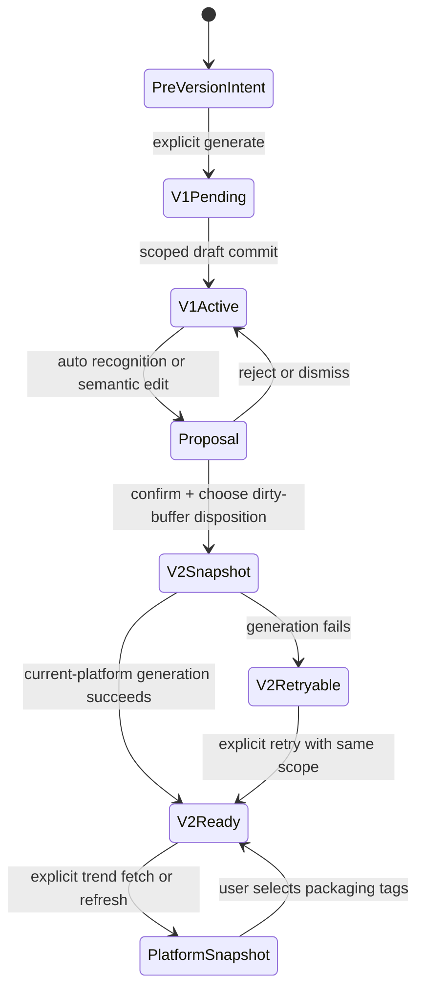
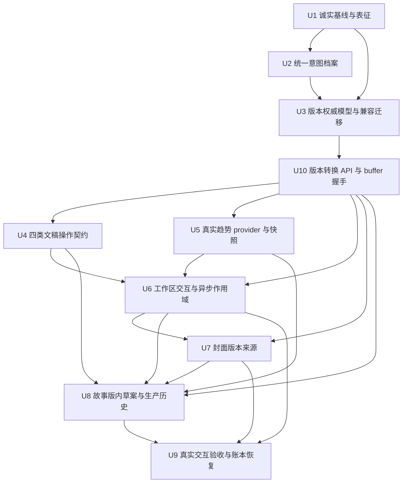
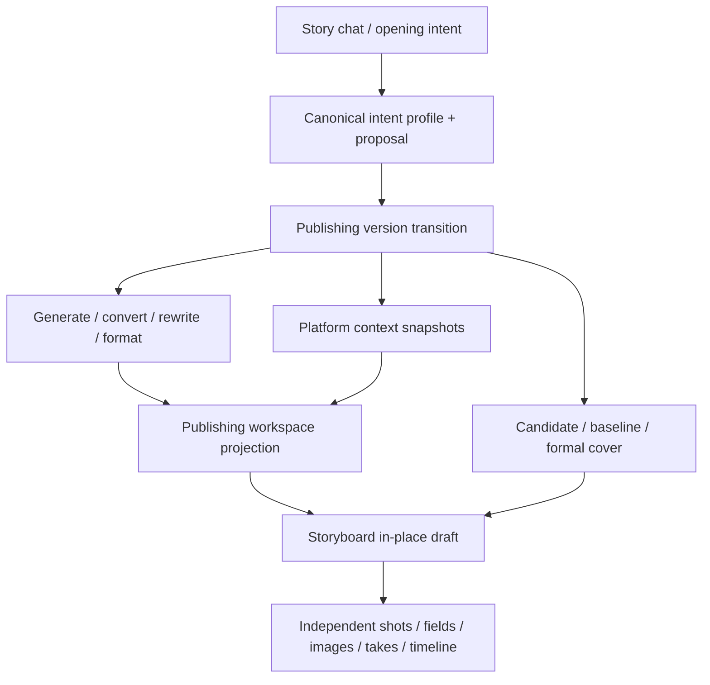

# feat: 收敛意图驱动的发布版本全流程

## Summary

本计划不重写已经可靠的发布稿、付费封面恢复和故事版 CAS 基础，而是先把高估的功能状态降为观察中，再统一意图、发布版本、平台语境和下游来源的权威边界。实施按可独立回滚的十个单元推进；每张功能卡只在它自己的真实入口和对应交互证据通过后分别恢复 `working`，缺少合格趋势来源的实时语境卡继续保持非 `working` 状态。

---

## Problem Frame

当前代码不是“完全没做”，而是多条链路已经分别存在，却没有共同完成同一项用户任务：版本后端具备 CAS 和幂等能力，故事版具备预览与原子确认，封面候选也具备付费恢复；但核心变化仍能原地覆盖当前版本、意图仍有两套可写状态、重命名只有后端 mutation、V2 继承封面会被当成正式封面、文字稿异步操作没有稳定的版本作用域，实时热门标签则完全没有可信数据源。页面、类型和分层测试因此给出了比真实用户体验更乐观的信号（see origin: `docs/brainstorms/2026-08-05-publishing-draft-workspace-requirements.md`）。

本计划采用表征优先和逐层门禁：先证明哪些旧能力必须保留，再改变权威状态；每次持久化只提交一个完整、带来源和 revision 的状态转换，失败时保留旧正式成果和用户输入。

---

## Requirements

权威产品要求仍是 origin 的 R1–R56、F1–F6 和 AE1–AE34。本计划按技术责任把它们映射到实施单元，不重新解释或缩减产品范围。

| Origin 范围 | 本计划承担方式 | 主要单元 |
| --- | --- | --- |
| R1–R7：入口、对话、六平台、显式首次生成、内容边界 | 保留现有 `/editing` 入口与逐问对话；统一显式生成 operation 和意图快照 | U1, U2, U4, U6, U9 |
| R8–R12：平台稿隔离、转换、内核变化判断 | 四类文稿操作共享同一内容/标题/作用域契约；实质变化只生成版本提案 | U3, U10, U4, U6, U9 |
| R13–R20：四图封面、费用、恢复、采用、复制/下载 | 保留已有付费安全链路，补版本来源、临时基线和完整交互回归 | U1, U7, U9 |
| R21–R26：版本创建、命名、切换、未应用编辑、隔离 | 以单一权威版本模型、原子转换和完整 projection 取代原地 core 覆盖 | U2, U3, U10, U6, U7, U9 |
| R27–R36：剧本、段落覆盖、故事版内确认、媒体保护 | 直接进入故事版的 scoped 草案；确认时整组 CAS，生产历史保持独立 | U8, U9 |
| R37–R44：小红书/抖音真实趋势、回退、用户选择 | fail-closed provider、不可变快照、相关性筛选和手动标签采用 | U5, U6, U8, U9 |
| R45–R49：统一意图与平台语境快照 | 统一 profile/proposal 解析器；版本/平台级语境快照 | U2, U3, U10, U5, U6, U9 |
| R50–R55：四链路质量、标题职责、异步隔离、下游历史 | 服务端字段策略、版本作用域、来源关系和独立生产历史 | U3, U10, U4, U6, U7, U8, U9 |
| R56：真实入口端到端证据 | 交互测试、跨层集成、main:3000 reload 验收和账本门禁 | U1, U9 |

**Origin actors:** A1（用户）、A2（对话编辑助手）、A3（平台适配能力）、A4（视频创作界面）

**Origin flows:** F1（想法到首稿）、F2（跨平台转换）、F3（措辞与内核修改）、F4（封面和视频交接）、F5（意图变化创建版本）、F6（真实趋势标签）

**Origin acceptance examples:** AE1–AE34；每个直接落地的场景在对应单元的测试中显式引用。

---

## Scope Boundaries

- 不新建社交媒体项目；Story 仍是聊天、发布稿、封面、故事版和媒体的唯一工作单位。
- 不增加版本删除、分支合并、逐字 diff、多人评论或协作审阅。
- 不连接社交账号，不直接发布、定时发布或采集发布后数据。
- 不抓取网页、复用登录 Cookie、模拟移动端、逆向接口，也不把模型或第三方聚合内容称为“实时热门”。
- 不让页面加载、平台切换、版本切换或后台任务自动请求趋势、生成文稿、生成封面或生成视频。
- 不重做封面提示词工程、图片供应商、像素质检、视频模型选择或一键成片执行；本计划只约束它们消费哪个故事/版本及何时可触发。
- 不把故事版字段版本、语音版本、图片候选、视频 Take、提示词历史或时间线历史复制进发布版本。
- 不在本计划内批量改写真实旧 Story；迁移采用兼容读、单一新写和按需确认，歧义数据保留并提示。

### Deferred to Follow-Up Work

- 平台账号发布、排期、效果回流和自动优化：后续独立产品迭代。
- 复杂版本 diff/merge、删除/归档和保留策略：版本生命周期稳定后再规划。
- 长期个人文风学习和跨故事风格档案：不进入本次发布版本收敛。
- 未获得官方控制台或书面授权的平台趋势接入：保留 provider capability 为关闭状态，待授权后以独立接入变更启用。

---

## Context & Research

### Current-State Assessment

| 能力 | 当前真实状态 | 主要缺口 | 计划处理 |
| --- | --- | --- | --- |
| 发布工作台和六平台稿 | 已有入口、独立标签页、生成/转换/改写 | 完整交互未验收；格式修复无独立入口 | U1, U4, U6, U9 |
| 发布版本 | 数据结构、CAS、operation receipt、选择接口已存在 | core change 仍可原地覆盖；V2 生成和 buffer 事务边界不清 | U3, U10, U4 |
| 版本命名 | 新建时可自动/手动传名 | `renameVersion` 没有真实 UI 调用 | U3, U10, U6 |
| 意图识别 | 聊天有 provisional/confirmed；版本有 narrative intent | 两套类型和持久化事实源；首次 V1 可能读取旧默认 | U2, U3 |
| 未应用编辑 | buffer 已按 story/platform/version 隔离 | 三选在失败、刷新和并发冲突下未形成端到端契约 | U3, U10, U6, U9 |
| 标题保护 | grounded title 和人工标题保留已有较好基础 | 四类文稿操作尚无统一字段级回归矩阵 | U4 |
| 实时平台语境 | 只有静态 platform guidance | 无来源、时间戳、刷新、相关性或降级实现 | U5, U6 |
| 封面候选 | 四图、付费确认、任务恢复、显式采用已实现 | V2 直接复制 formal cover，缺“来自 V1、待确认”语义 | U7 |
| 发布稿转故事版 | preview、影响分析、CAS 确认和稳定镜头已有基础 | 点击后尚未完整按“先进入故事版、原位显示草案”收敛；来源状态需统一 | U8 |
| 异步隔离 | 视频和部分封面路径有较强 scope | generate/convert/rewrite 多数只依赖当前 active projection | U3–U8, U10 |
| 功能账本 | 多张卡标为 `working` | 证据主要是分层测试/静态渲染，超过真实可用程度 | U1, U9 |

### Relevant Code and Patterns

- `shared/publishingDraft.ts`：发布平台、稿件、版本、封面和 active projection 的当前领域合同；后续收敛必须兼容其旧数据 normalizer。
- `server/services/publishingPersistence.ts`：发布状态唯一服务端写边界，已有 Story lock、revision 检查和 version operation receipt；正确性仍应以存储 CAS 为准。
- `server/routers/publishingDraft.ts`：生成、转换、改写、版本、封面和视频交接入口；当前文字稿 mutation 缺统一 version scope。
- `server/services/publishingDraft.ts`：四类文稿质量边界、标题 grounding、平台规则和 style repair 的主要复用位置。
- `client/src/features/storyAgent/StoryAgentContext.tsx` 与 `client/src/features/storyAgent/intentTypes.ts`：聊天意图识别、provisional/confirmed 状态和 Story 作用域保护。
- `client/src/features/publishingDraft/PublishingDraftWorkspace.tsx`：版本、意图、稿件、封面和视频动作集中在一个大组件，需在服务端状态机稳定后按职责拆出可测控件。
- `client/src/features/storyAgent/storyAgentPersistence.ts` 与 `client/src/features/publishingDraft/publishingDraftViewModel.ts`：版本级本地 buffer 和 active projection 的现有模式。
- `shared/publishingVideoStoryboard.ts`、`server/services/publishingVideoStoryboardPersistence.ts`：发布稿段落到草案、影响分析、operation claim 和正式故事版 CAS 的现有可靠基础。
- `client/src/features/creationEditor/publishingHandoffScope.ts`：下游来源选择和 active Storyboard 独立于浏览中发布版本的现有边界。
- `server/services/storySync.publishing.test.ts`：普通整 Story 保存不得覆盖 server-owned publishing slice 的关键回归模式。

### Institutional Learnings

- `docs/solutions/2026-06-13-故事为唯一单位-镜头按storyId.md`：不得通过 latest Story、projectId 或 shotNo 猜上下文；所有读写必须明确验证 `userId + storyId`，版本化来源继续使用稳定 ID。
- `docs/solutions/2026-06-13-多worktree环境数据分裂收敛.md`：本地业务数据跟 `process.cwd()` 走；只能使用主仓库现有 3000 服务验证，测试必须隔离数据，迁移前必须备份和 dry-run。
- `docs/plans/2026-08-11-001-refactor-feature-health-convergence-plan.md`：先做表征，再沿 UI → router → service → persistence/provider 验收；文件存在和静态渲染不能证明功能可用。
- `docs/plans/2026-08-11-002-fix-title-generation-quality-plan.md`：故事名、发布标题、版本短名和卡片标题职责不同；人工标题始终优先，标题失败不能破坏正文。

### External References

- [抖音开放平台](https://developer.open-douyin.com/) 与 [文档中心](https://developer.open-douyin.com/docs-page)：截至 2026-08-14，公开未登录文档无法确认全站热点接口、scope、限流和更新时间仍可新申请；必须以项目控制台当期能力和真实响应为准。
- [小红书开放平台](https://open.xiaohongshu.com/) 与 [小红书小程序平台](https://miniapp.xiaohongshu.com/)：截至 2026-08-14，未发现对普通第三方应用公开的全站实时热门话题 API；网页热点、搜索联想和商家能力不能推导为趋势授权。
- [TanStack Query v5 Query Keys](https://tanstack.com/query/v5/docs/framework/react/guides/query-keys)、[Query Cancellation](https://tanstack.com/query/v5/docs/framework/react/guides/query-cancellation)、[Mutations](https://tanstack.com/query/v5/docs/framework/react/guides/mutations)：缓存键需完整包含 story/version/platform 等变量；取消只是一种客户端优化，不能替代服务端 CAS 或 mutation 乱序保护。
- [tRPC 11 React useQuery](https://trpc.io/docs/client/react/useQuery)：`context` 是 link 元数据而不是缓存或一致性边界，identity/revision 必须进入 procedure input。
- [Zod 4 Basics](https://zod.dev/basics) 与 [Objects/Pipes/Transforms](https://zod.dev/api)：外部趋势响应先严格解析再归一化，schema 漂移必须显式记录或 fail closed。
- [OWASP LLM01 Prompt Injection](https://genai.owasp.org/llmrisk/llm01-prompt-injection/) 与 [NIST AI RMF Playbook](https://airc.nist.gov/AI_RMF_Knowledge_Base/Playbook)：外部趋势文本始终是非可信数据，不能进入系统指令层。

### Old-Plan Compatibility Matrix

| 旧决定 | 本计划处理 | 原因 |
| --- | --- | --- |
| Story 是唯一工作单位，publishing 是 Story 内的 server-owned slice | 保留 | 已有持久化和所有权模式正确 |
| 一次只生成用户明确选择的平台 | 保留 | 防止隐藏调用和算力浪费 |
| core 与 per-platform draft 分层 | 保留并增加 version/intent scope | 当前分层仍是平台转换的正确边界 |
| V2 直接继承 V1 formal cover | 修订 | V1 封面只能成为固定来源的临时美术基线，需显式重新确认 |
| 进入视频前先在独立预览表面看草案 | 废弃 | 当前需求明确直接进入故事版，在原位显示未确认草案 |
| 发布版本拥有下游完整生产历史 | 修订 | 发布版本只存来源/待更新；字段、语音、图片、Take、提示词和时间线历史保持独立 |
| 标题由素材 grounding，人工标题优先 | 保留并扩到四类文稿操作 | 防止改写/修复借机覆盖人工成果 |
| 分层单测通过即可标 `working` | 废弃 | R56/AE34 明确要求真实入口端到端证据 |

---

## Key Technical Decisions

| 决定 | 理由 |
| --- | --- |
| 为发布相关意图建立“唯一可写头 + 不可变版本快照 + 非权威 proposal”：V1 前只有 pre-version profile 可写，V1 后当前意图只由 active version snapshot 解析 | 自动识别可以提出建议，但不能把 profile/snapshot 换名后继续形成两套可写事实 |
| `versions[]` 是 core/drafts/platform/intent/cover/rounds 的唯一持久权威；Story 顶层同名字段只作兼容派生 projection，业务 mutation 禁止直接写入 | 现有顶层字段与版本字段重复，必须消除“新版稿 + 旧版封面”的混合写入可能 |
| 创建 V2 的原子事务只负责版本快照、意图、buffer disposition、来源和待更新状态；当前平台文稿生成是同一用户动作发起的可恢复后续 operation | 模型失败不应回滚或污染 V1，也不应制造含糊的半覆盖状态 |
| 每个平台在 V2 中显式处于 inherited reference、carried buffer、awaiting generation、generation failed 或 ready；只有 ready 稿可被当作 V2 正式稿 | 生成失败或继承旧文本时，用户必须知道正在看/复制的是旧来源还是 V2 成果 |
| 版本选择只返回和应用一个从 `versions[]` 派生的完整 projection；加载期间显示 scoped 空态，不暂时复用上一版内容 | 防止新版文稿配旧版封面/意图/故事版来源的视觉串版 |
| 所有 query/mutation 显式携带 `storyId + versionId + platform + expected revisions + operation identity`，服务端 CAS 后响应回显完整 scope | 客户端 abort 无法撤销已经执行的服务端写入，也无法解决多标签页并发 |
| generate、convert、rewrite、format repair 共享内容边界、标题字段策略和作用域合同，但保留各自允许修改的字段与模型预算 | 复用约束而不把四种用户动作压成不可解释的万能接口 |
| 目标平台已有人工稿时，转换只产生候选/缓冲，不直接覆盖 | 人工成果优先；跨平台转换不应成为隐式替换操作 |
| 趋势 provider 默认 `unavailable`，只有官方控制台或书面授权、当期文档、来源时间、TTL 和合规许可齐全才允许 `verified_fresh` | 当前公开资料不足以证明两个平台存在可直接使用的实时趋势 API |
| 平台语境快照不可变地绑定版本和平台；刷新写入新快照而不是改写历史 | 用户切回旧版本时必须能解释“当时依据什么生成” |
| 模型只能从已验证的候选 ID 中排序/筛选，不能补造标签；趋势字符串不进入 system/developer prompt | 防止伪造热点和外部 prompt injection |
| V2 的继承封面使用独立 baseline 状态，formal cover 默认为空；用户可免费重新确认沿用同一资产或采用新候选 | 保持视觉连续性，同时不冒充 V2 已确认成果、不重复收费 |
| 版本内 handoff 继续演进现有 `videoStoryboard` aggregate，不新建第二套草案权威；正式 Storyboard 及其字段/媒体历史继续由现有制作系统管理 | 满足 R55，并避免 Workspace、Creation Editor 和 publishing aggregate 各存一份草案 |
| receipt 和趋势快照进入 Story body 前必须有分类保留、容量预算和审计指针；完整 provider 响应不进 Story body | 整体 JSON CAS 会随无界历史放大，增加冲突、备份和恢复风险 |
| 功能账本先降为 `observing`，按能力分别恢复；实时趋势卡在授权和真实来源证据不足时不得恢复 `working` | “先观察”是本轮明确执行姿态，且符合账本状态定义 |

---

## Open Questions

### Resolved During Planning

- **是否整体重写发布系统？** 不重写。保留版本 CAS、付费封面 receipt、候选采用和故事版确认基础，只替换冲突的权威状态与作用域接缝。
- **核心/意图变化是否仍可 `confirmCoreChange` 原地更新？** 不可。兼容入口在迁移期只返回版本提案，不再写入当前版本。
- **V2 生成失败怎么办？** V2 快照保留为可见、可重试状态；V1 完整不变，其他平台不调用，用户输入不丢失。
- **V2 生成前显示什么？** 当前/其他平台可显示固定的 inherited source snapshot 和来源标签，但只有 `ready` 内容可作为 V2 正式稿编辑、导出或送往下游；carried buffer 仍是待应用用户输入。
- **V2 是否可以直接使用 V1 封面？** 只能先显示固定 asset/sourceVersion 的临时 baseline；用户明确“沿用并确认”后才成为 V2 formal cover，该确认不收费。
- **没有可验证趋势源时显示什么？** 显示“未获取到可验证的实时热点”，保留上次已选标签，并提供普通内容相关标签；不得显示实时标记。
- **点击进入视频制作何时导航？** 先锁定 source scope，立即进入故事版并显示 generating/failed/ready 的未确认草案状态；确认前正式镜头和旧媒体不变。

### Deferred to Implementation

- 抖音和小红书的具体 endpoint、OAuth/scope、QPS、榜单覆盖、商用/再展示权和费用：先做控制台能力验证；没有当期授权材料时 provider 保持关闭。
- 趋势来源未规定 TTL 时采用的保守窗口和相关性阈值：在脱敏真实响应与离线 fixtures 上校准，但任何过期数据都不得标“实时”。
- DOM 交互测试最终复用现有可用环境还是引入最小测试依赖：实施时先验证当前 transitive 环境；无可靠交互能力时再引入显式 dev dependency。
- 旧意图三源冲突的具体 UI 文案：状态必须是可见的待确认，最终措辞在 U6 交互测试中收敛。
- Story body 的 receipt 数量/时间上限、趋势快照历史上限和拆分独立存储阈值：先由 U1 的 p50/p95/max body bytes inventory 决定；pending、unknown 和付费恢复凭据不得按普通 TTL 清理。

---

## Output Structure

以下仅展示本计划新增的主要边界；现有 publishing、cover 和 storyboard 文件继续原位演进。

```text
shared/
  storyIntentProfile.ts
  publishingPlatformContext.ts
server/services/platformTrends/
  provider.ts
  registry.ts
  providers/
    unavailable.ts
    <authorized-provider>.ts   # 仅在授权门禁通过后创建
client/src/features/publishingDraft/
  PublishingIntentProposalDialog.tsx
  PublishingVersionControls.tsx
  PublishingTrendTagPicker.tsx
  publishingOperationScope.ts
docs/verification/
  publishing-lifecycle.md
```

---

## High-Level Technical Design

> *This illustrates the intended approach and is directional guidance for review, not implementation specification. The implementing agent should treat it as context, not code to reproduce.*

| 生命周期 | 唯一可写权威 | 不可变历史 | 当前 resolved intent |
| --- | --- | --- | --- |
| 尚无 V1 | pre-version profile + revision | legacy provenance（只读） | pre-version profile |
| 自动识别后 | pre-version profile 不变；proposal 可写生命周期状态 | proposal 的 source revision/evidence | 仍是 pre-version profile |
| 创建 V1 | 同一 CAS 把 pre-version profile 冻结进 V1 snapshot，并结束 pre-version 可写期 | V1 intent snapshot | active V1 snapshot |
| 已有版本、出现新意图 | 当前 snapshot 不变；只新增 scoped proposal | 所有既有 version snapshots | active version snapshot |
| 接受 proposal | 同一版本转换 CAS 生成新的不可变 snapshot | V1…Vn snapshots | 新 active version snapshot |
| 切回旧版本 | 不修改任何 profile | 目标版本 snapshot | 目标 active version snapshot |

`versions[]` 同样是版本 core、draft、platform、intent、cover 和 cover rounds 的唯一持久权威。顶层兼容字段只能由 active version 派生；迁移期每次 mutation 后必须验证派生 projection 与 active version 等价，不能把兼容 projection 当作第二个写入口。



所有异步操作先捕获不可变的 Story/version/context revision。服务端只向该 scope 写入；客户端只有在响应 scope 仍与当前界面相符时才投影到屏幕。迟到结果可以保存在原 scope 或被丢弃，但不能“跟随当前 active”改写另一个版本。

---

## Implementation Units



### U1. 建立诚实功能基线和历史表征

**Goal:** 在改状态模型前固定已经可靠的行为、真实缺口和旧数据样本，并把相关功能卡从过度乐观的 `working` 调整为 `observing`。

**Requirements:** R1–R3, R6, R8, R13–R20, R25–R26, R56; F1–F5; AE2, AE6, AE8–AE11, AE14, AE34

**Dependencies:** None

**Files:**

- Modify: `docs/features/feature-ledger.json`
- Modify: `shared/publishingDraft.test.ts`
- Modify: `server/services/publishingPersistence.test.ts`
- Modify: `server/services/publishingDraft.test.ts`
- Modify: `server/services/publishingVideoStoryboardPersistence.test.ts`
- Modify: `client/src/features/storyAgent/StoryAgentContext.intentRecognition.test.tsx`
- Modify: `client/src/features/publishingDraft/publishingDraftFlow.test.ts`
- Modify: `client/src/features/publishingDraft/PublishingDraftWorkspace.test.tsx`

**Approach:**

- 将 `publishing-workspace`、`publishing-versions`、`publishing-narrative-intent` 和 `publishing-video-storyboard` 标为 `observing`，写入已确认缺口；`realtime-social-context` 继续 `planned`，不能因新增类型提前升级。
- 为当前可保留能力补表征：六平台隔离、V1/V2 CAS、operation receipt、版本 buffer、人工标题、四图候选/付费恢复、故事版 preview 无正式副作用和确认 CAS。
- 增加旧数据 fixture 盘点：只有 legacy top-level、只有 V1、legacy 与 versions 共存、三份 intent 冲突、formal cover + cover rounds、旧封面占位镜头。
- 统计 Story body p50/p95/max bytes、receipt/快照数量、legacy fallback 命中，并列出 U8 所触及字段/资产/材料索引的真实存储所有权；这些结果决定迁移收缩和跨存储原子性边界。
- 表征测试不把错误行为写成永久契约；原地 core 覆盖、缺 rename UI、继承封面冒充正式和无趋势来源只记录为待修缺口，目标行为在后续单元先写失败测试。

**Execution note:** Characterization-first。不得为了让基线测试通过而清理、重写或迁移真实 `.webdev/local-persist.json`。

**Patterns to follow:**

- `docs/features/README.md` 的 `observing` / `working` 定义。
- `server/services/storySync.publishing.test.ts` 的 server-owned slice 保护方式。
- 现有付费 cover receipt 和 Storyboard CAS 测试中的无副作用断言。

**Test scenarios:**

- Happy path: legacy V1、两个平台稿、正式封面和故事版草案在 normalize/serialize 后逐项保留。
- Covers AE2: 选择三个平台仍只存在一个已生成稿，未请求平台无模型调用。
- Covers AE8/AE10: 四候选付费轮次可恢复，generation 不自动采用或覆盖 formal cover。
- Covers AE14: V1/V2 切换时独立稿件、buffer、cover rounds 和版本 revision 均可恢复。
- Covers AE34: 仅分层测试/静态渲染通过时，账本仍保持 `observing`。
- Regression: generic Story save 不覆盖更新后的 publishing version container。

**Verification:**

- 相关功能卡诚实反映“代码存在但尚未完成全链路验收”。
- 后续单元可以复用同一组旧数据 fixtures，且已有付费/故事版安全能力有明确不可破坏证据。

---

### U2. 统一意图档案、提案和旧数据迁移

**Goal:** 建立发布流程唯一可解释的意图档案和 proposal 生命周期，使聊天识别、开场手选、首次 V1 和活动发布版本不再互相覆盖。

**Requirements:** R4–R5, R21–R22, R45–R47, R54; F1, F5; AE1, AE12, AE24–AE26, AE33

**Dependencies:** U1

**Files:**

- Create: `shared/storyIntentProfile.ts`
- Create: `shared/storyIntentProfile.test.ts`
- Modify: `shared/publishingDraft.ts`
- Test: `shared/publishingDraft.test.ts`
- Modify: `client/src/features/storyAgent/intentTypes.ts`
- Modify: `client/src/features/storyAgent/StoryAgentContext.tsx`
- Test: `client/src/features/storyAgent/StoryAgentContext.intent.test.tsx`
- Test: `client/src/features/storyAgent/StoryAgentContext.intentRecognition.test.tsx`
- Modify: `server/archive/storyIntent.ts`
- Test: `server/archive/storyIntent.test.ts`
- Modify: `server/routers/storyAgent.ts`
- Test: `server/routers.storyAgent.test.ts`

**Approach:**

- 定义共享 profile，覆盖主/兼顾用途、核心/次要观众、发布渠道、表达取向、确认状态、revision 和 provenance；发布版本保存该 profile 的不可变快照，而不是维护另一套可写事实。
- 自动识别只写 proposal；proposal 记录 source Story/version/intent revision、差异、证据和 `pending/rejected/superseded/accepted` 生命周期。确认后的手选/用户修改拥有更高优先级。
- 统一 resolver：没有 V1 时读取 pre-version profile；存在版本后，发布输出读取活动版本快照。平台选择只改变 channel，除非用户另行确认用途/观众变化。
- V1 创建必须在同一 Story CAS 中冻结 pre-version profile、写入 V1 snapshot 并结束 pre-version 可写期；V1 后用户修改用途只产生 proposal，接受时由版本转换写新 snapshot。切换旧版本时 chat/workspace 都解析目标版本 snapshot。
- 对 legacy `confirmedIntent`、开场配置和 version narrative intent 做 expand/dual-read/single-write 迁移。活动版本是发布输出优先来源；不一致的 legacy 值保留为可见待确认 proposal，不静默合并或丢弃。
- proposal 的迟到响应必须仍绑定发起时 scope；用户确认或拒绝后到达的旧识别结果标记 superseded。

**Execution note:** 先为三源冲突 fixture 写迁移测试，再改变任何生产读写路径。

**Patterns to follow:**

- `normalizePublishingDraftState` 的容错旧数据读取。
- `StoryAgentContext.tsx` 现有 story scope epoch 和迟到响应保护。
- `shared/artDirection.ts` 的共享、可版本化 normalized contract 模式。

**Test scenarios:**

- Covers AE24: 用户确认“给自己看”后，高置信公开分享识别只形成 proposal，不覆盖 profile 或创建版本。
- Covers AE25: 首次生成前显示“公开分享 · 陌生读者 · 小红书”，V1 创建与刷新后仍一致，不回退默认值。
- Covers AE26: 用户接受“留给自己 → 公开分享给陌生读者”的 proposal 时，输出一个版本转换请求而不是原地更新。
- Migration: 三个 legacy intent 互相冲突时，发布输出按确定优先级读取，同时保留冲突 proposal；用户确认后刷新只剩一个权威结果。
- Proposal lifecycle: reject、supersede、重复识别、旧 revision 和迟到响应都不能重新激活已处理 proposal。
- Integration: Story chat 和 Publishing workspace 读取同一 resolver，不再各自拼接 purpose/audience/platform。

**Verification:**

- 任意时刻能解释当前意图来自用户确认、版本快照还是尚未确认的自动提案。
- 首次 V1 和已有版本均不再通过旧默认意图生成。

**Rollback:** 停止新的 profile/proposal 写入并启用 legacy adapter reader；已保存 proposal/snapshot 保留，不用 legacy 值覆盖新版本历史。

---

### U3. 收敛版本权威模型、兼容读取和单一新写

**Goal:** 先消除顶层 active projection 与 `versions[]` 的重复持久权威，建立可量化收缩的兼容迁移，再让后续版本操作只写一个 canonical 容器。

**Requirements:** R21, R23, R26, R45–R47, R53–R55; F5; AE13–AE14, AE25, AE31–AE33

**Dependencies:** U1, U2

**Files:**

- Modify: `shared/publishingDraft.ts`
- Test: `shared/publishingDraft.test.ts`
- Modify: `server/services/publishingPersistence.ts`
- Test: `server/services/publishingPersistence.test.ts`
- Modify: `server/services/storySync.ts`
- Test: `server/services/storySync.publishing.test.ts`

**Approach:**

- 把 `versions[]`、`activeVersionId` 和 container revision 定为持久权威。版本内持有 core、drafts、platform、intent snapshot、formal/baseline cover、cover rounds 和轻量 handoff；顶层旧字段只能由 active version 派生，业务 mutation 不再直接写。
- 将无作用域的 `coverGeneration` / operation receipts 迁移为 version-owned 或显式 version-keyed 状态；切版不搬移 pending/unknown/paid recovery receipt。
- 为 V2 的每个平台定义可解释状态：固定 inherited snapshot/reference、carried buffer、awaiting generation、generation failed、ready。V1 后续编辑不改变已经记录的 V2 inherited source；非 ready 稿不能冒充 V2 正式导出或下游来源。
- 采用 expand/dual-read/single-write：reader 兼容 legacy top-level 和 partial versions，所有新 mutation 只写 canonical container，并在返回前验证 active version 与派生 projection 等价。
- U1 inventory 记录 Story body p50/p95/max bytes、legacy fallback 命中、intent/cover/version 冲突和 U8 各写目标的实际存储所有权。超过预算或存在无法解释的有效字段时暂停迁移，不静默丢弃。
- 收缩 legacy reader 的门禁是：两次连续全量只读 inventory 的 fallback 命中为零或每条均有处置记录、legacy 新写为零、迁移前后 canonical projection hash 等价、U9 interaction/reload 无 legacy 回退。保留 reader kill switch，收缩不删除旧值。

**Execution note:** 先为 legacy/top-level/canonical 共存写 characterization 和 projection-equivalence 测试，再启用 single-write。

**Patterns to follow:**

- `normalizePublishingDraftState` 的容错读取和 legacy V1 保护。
- `canonicalize` / `projectVersion` 的现有 projection 边界。
- `storySync.publishing.test.ts` 的 server-owned slice 保留规则。

**Test scenarios:**

- Legacy: 只有 top-level、只有 V1、partial versions + valid legacy cover/draft 三类输入都保留有效内容并产生确定 canonical V1。
- Authority invariant: 任意 canonical mutation 后，derive(active version) 与兼容 projection 深度等价；直接修改顶层旧字段不成为业务写入结果。
- Covers AE25: legacy confirmed intent 迁移进 V1 snapshot 后，刷新 resolver 不再命中旧默认。
- Covers AE31: version container 只存 downstream source/status，不吸收 production field/image/take/timeline history。
- Operation ownership: V1 pending paid receipt 在切 V2 后仍只属于 V1，V2 查询不能恢复或覆盖它。
- Capacity: 有界非付费 receipt/快照 compaction 不删除 pending、unknown、paid recovery 或当前结果指针；完整 provider payload 不进入 Story body。
- Migration gate: fallback inventory、projection hash、legacy-write 计数和 reader kill switch 在收缩前均可验证。

**Verification:**

- 每个持久字段都能回答“由 active version 权威保存，还是仅为兼容派生”，没有第二个可写 projection。
- 兼容 reader 可回滚启用，且回滚不会删除 canonical versions 或新历史。

**Rollback:** 关闭 single-write 入口并回切兼容 reader；保留 canonical container 和 legacy 原值，不执行反向覆盖或字段删除。

---

### U10. 建立原子版本转换 API 和本地 buffer 提交握手

**Goal:** 用一次持久 CAS 创建/选择/重命名版本并提交业务结果与 receipt，同时通过可恢复握手协调浏览器 buffer，确保 lost response 或崩溃不丢输入、不重复创建 V2。

**Requirements:** R11–R12, R21–R26, R52–R54; F3, F5; AE4–AE5, AE12–AE14, AE26, AE30–AE31, AE33

**Dependencies:** U3

**Files:**

- Modify: `server/services/publishingPersistence.ts`
- Test: `server/services/publishingPersistence.test.ts`
- Modify: `server/routers/publishingDraft.ts`
- Test: `server/routers.publishingDraft.test.ts`
- Modify: `client/src/features/storyAgent/storyAgentPersistence.ts`
- Test: `client/src/features/storyAgent/storyAgentPersistence.test.ts`
- Modify: `client/src/features/publishingDraft/publishingDraftViewModel.ts`
- Test: `client/src/features/publishingDraft/publishingDraftViewModel.test.ts`

**Approach:**

- 版本转换 CAS 保存 parent/source、profile snapshot、原因名、平台状态、fixed cover baseline、video source status、buffer disposition/hash 和 completed receipt，然后激活 V2；业务结果与 receipt 以 storage affected-row=1 作为唯一 commit point，CAS 输家不留局部 receipt/version。
- 请求携带 source buffer key/payload hash/disposition/operation identity。客户端只有收到匹配 scope 的 committed receipt 后才清理或迁移本地 buffer；reload 通过 receipt 幂等 reconcile，不能假设 localStorage 与服务端天然原子。
- “留在原版本”保留 V1 version-keyed buffer；“带入新版本”在 V2 记录 carried buffer；“取消”零服务端写且 proposal 可继续处理。
- 相同 token + hash 在 lost response/进程重启后返回同一 V2；相同 token 不同 hash 被拒。跨两个独立 service writer 并发时仍只有一个 CAS 成功。
- `selectVersion` 和 `renameVersion` 返回从 canonical container 派生的完整 projection。人工版本名有独立标记，后续 intent/title 变化不能自动覆盖。
- 现有 `confirmCoreChange` 在兼容期只返回 proposal/transition 输入，不再原地推进 core revision。
- CAS 冲突返回最新完整 projection 和 committed/uncommitted disposition 状态；本地 buffer 保留并可重新提交。

**Execution note:** 先增加跨 writer、lost response、提交后客户端崩溃、localStorage 写失败和三种 disposition 的测试，再接 UI。

**Patterns to follow:**

- `applyVersionOperation` 的 container/version revision 和 receipt 机制。
- `persistPreparedStoryBody` 的 Story revision CAS 与 affected-row 检查。
- `publishingBufferKey` 的 story/platform/version 隔离。
- `publishingVideoStoryboardPersistence.ts` 的 request-hash operation claim 模式。

**Test scenarios:**

- Covers AE12/AE26: 实质意图变化确认后只创建一个 `V2 · 公开分享 · 陌生读者`，V1 序列化前后完全一致。
- Covers AE30: leave/carry/cancel 在成功、CAS 失败、lost response 和 reload 后恢复正确 buffer；cancel 零写入。
- Commit atomicity: CAS 输家没有 version、active pointer 或 receipt 的任何局部写入；赢家业务结果和 receipt 同时可读。
- Retry: 响应丢失/进程重启后相同 token + hash 返回同一 V2，不创建 V3；不同 hash 被拒。
- Client crash: 服务端已经提交而客户端尚未清理 buffer 时，reload 按 receipt reconcile，不重复带入或丢失输入。
- Concurrency: 两标签页/两个 writer 同时创建或重命名时只有一个成功；失败方保留输入并获得最新 projection。
- Naming: 空名、超长名、重复展示名、并发改名和自动建议名均不改变稳定 sequence；人工名刷新后保留。
- Loading projection: 选择版本只返回一个完整 projection，没有任何字段从上一版混入。

**Verification:**

- 创建、选择、重命名和 retry 均可从一次 committed Story revision 解释业务结果、receipt、buffer disposition 和版本来源。
- 浏览器崩溃、配额失败或响应丢失不会让本地输入与服务端版本产生不可恢复分叉。

**Rollback:** 关闭新版本转换入口并保留 canonical reader；已经 committed 的 V2 和 receipt 继续可读，不尝试用本地 buffer 反向覆盖。

---

### U4. 统一首次生成、转换、改写和格式修复契约

**Goal:** 让四种文稿操作共享事实/观点/声音、人工标题和版本作用域边界，同时保持各自可解释的允许修改范围和失败语义。

**Requirements:** R5–R12, R24, R50–R51, R54; F1–F3, F5; AE1–AE5, AE12, AE27, AE29, AE33

**Dependencies:** U10

**Files:**

- Modify: `server/services/publishingDraft.ts`
- Test: `server/services/publishingDraft.test.ts`
- Modify: `server/routers/publishingDraft.ts`
- Test: `server/routers.publishingDraft.test.ts`
- Modify: `shared/publishingDraft.ts`
- Test: `shared/publishingDraft.test.ts`
- Modify: `shared/textTitle.ts`
- Test: `shared/textTitle.test.ts`
- Modify: `client/src/features/publishingDraft/publishingDraftViewModel.ts`
- Test: `client/src/features/publishingDraft/publishingDraftViewModel.test.ts`

**Approach:**

- 为四类 operation 建立共同 scope/result envelope，显式包含 source version、draft/core/intent/context revisions、允许修改字段和完整响应 scope；procedure 不再读取“当前 active”后把结果重定向到最新版本。
- 首次生成只在用户点击后调用并创建/完成 V1 当前平台；V2 的当前平台生成是可重试 operation。转换只新增一个目标平台；已有人工稿时返回候选 buffer，必须显式采用才替换。
- rewrite 先返回版本级 buffer；format repair 优先确定性修复换行、编号、标签格式和 X thread 结构，只有用户明确触发且本地无法安全修复时才使用受限模型修复。
- 共享内容边界负责 facts/thesis/voice 不漂移、平台稿互相隔离、标签/CTA 不进入 core；分类结果为 core/intent 变化时只返回 VersionChangeProposal，不写当前版本。
- 人工标题在持久层按 baseline/revision 条件保留。标题生成或验证失败只能局部降级为空候选，不能清空已有标题、正文或标签。
- 已完成 operation 的同 token retry 返回已保存结果；仍在执行或失败的 operation 呈现明确、可恢复状态，减少重复模型调用。

**Execution note:** 以四类 operation × 标题状态 × scope 竞态的参数化测试先定义合同，再收敛服务和 router。

**Patterns to follow:**

- `preserveAppliedPublishingTitle` 和 `validateGeneratedTitle` 的人工标题保护。
- `PublishingVideoOperationState` 的 pending/completed/failed + request hash 语义。
- 现有 X 280 加权字符和 thread 编号验证。

**Test scenarios:**

- Covers AE1: 未点击前零生成；点击后只生成当前平台且结构改善、批判立场和事实保留。
- Covers AE3/AE27: 小红书转换抖音/X 仍在同一 version，来源稿 byte-equivalent，目标稿事实/观点一致。
- Existing target: 目标平台已有人工稿时 conversion 不覆盖；显式采用候选后才推进目标 draft revision。
- Covers AE29: generate/convert/rewrite/format repair 四路均保留人工标题；空/无效标题结果不影响正文。
- Format-only: 修复只改变格式允许字段，不改 core、用途、观众或版本数量。
- Semantic edit: 观点/目的变化返回 proposal，当前版本和其他平台保持不变。
- Failure: provider、解析、标题校验、CAS 或迟到响应失败均不清空已保存稿和 buffer。
- Cost discipline: 每个显式动作最多启动其声明的一次文本 operation；版本/平台/页面切换为零模型调用。

**Verification:**

- 四个入口用同一组字段级合同测试证明“可以优化表达，但不能借机改事实或覆盖人工成果”。
- 任一文字稿响应都能证明自己属于哪个 Story/version/platform/revision。

---

### U5. 建立 fail-closed 平台趋势 provider 和不可变语境快照

**Goal:** 为小红书和抖音提供有来源、时间和授权状态的平台语境；当来源不合格或无相关热点时诚实回退，永不伪造实时性。

**Requirements:** R37–R44, R48–R49, R54; F6; AE19–AE23, AE28, AE33

**Dependencies:** U10

**Files:**

- Create: `shared/publishingPlatformContext.ts`
- Create: `shared/publishingPlatformContext.test.ts`
- Create: `server/services/platformTrends/provider.ts`
- Create: `server/services/platformTrends/registry.ts`
- Create: `server/services/platformTrends/providers/unavailable.ts`
- Create: `server/services/platformTrends/provider.test.ts`
- Create: `server/services/publishingPlatformContext.ts`
- Create: `server/services/publishingPlatformContext.test.ts`
- Modify: `server/routers/publishingDraft.ts`
- Test: `server/routers.publishingDraft.test.ts`
- Modify: `server/services/publishingPersistence.ts`
- Test: `server/services/publishingPersistence.test.ts`
- Modify: `docs/environment-guide.md`

**Approach:**

- provider 合同返回明确 capability/status、候选 ID/文本、平台、覆盖范围、获取时间、源发布时间、过期时间、来源文档/授权标识、响应摘要和 parser version。只有 `verified_fresh + official/contract-authorized + valid timestamp` 可显示实时。
- 默认两个平台均使用 unavailable provider。启用任何真实 adapter 前，必须完成控制台可见能力、批准 scope、当期官方/授权文档、脱敏真实响应、限流/留存/商用许可和弃用检查。
- 使用边界严格 Zod 解析、Unicode/长度规范化、HTML 转义和 schema-drift 告警；外部文本作为结构化候选数据传递，不能拼进 system/developer prompt。
- relevance ranker 只能返回候选 ID 子集；先做内容安全和相关性过滤。低于阈值时返回零热点和普通内容标签，不用模型补齐。
- 快照以 version/platform/source revision 绑定且不可变；刷新产生新快照，旧版本继续展示当时来源。缓存按 platform/locale/category/provider version 分区，single-flight、限流和熔断只影响获取，不覆盖历史快照。
- Story body 只保存归一化快照、raw digest 和最小 provenance，不保存完整响应；按 version/platform 有界去重保留。pending/审计关键状态与普通 completed 非付费 receipt 使用不同保留策略，达到 U1 体积阈值时保持 provider 关闭并评估独立存储。
- 选中标签单独持久化为当前版本/平台包装；刷新或保存失败保留原 tags 和正文。其他四个平台永不显示 realtime capability。
- 记录最小审计指标：成功/回退、401/403/429、schema mismatch、fresh/stale、零相关、采用率和 stale response discard；不保存 token、Cookie 或不必要的外部原文。

**Execution note:** 先实现 unavailable/fresh/stale/invalid fixtures 和注入攻击 canary；在授权门禁未通过时不得创建猜测 endpoint 的 adapter。

**Patterns to follow:**

- 现有 platform registry 的数据驱动适配方式。
- TanStack Query 完整 query key 和现有 Story scope guard。
- Zod strict boundary + normalized shared contract。

**Test scenarios:**

- Covers AE19: 经授权 fresh fixture 返回相关候选时，显示来源/时间且只由用户显式打开触发一次请求。
- Covers AE20: 无相关候选返回“暂无相关热门标签”与内容标签，不泄露无关全站热点。
- Covers AE21: timeout 后使用仍可核验但已非实时的候选时明确标“近期相关/已过期”，不标实时。
- Covers AE22: 429、超时、解析失败或保存失败均保留三个已选标签和正文。
- Covers AE23/AE28: V1/V2、XHS/Douyin 快照和已选标签互不串用；刷新只新增当前 scope 快照，不创建版本。
- Trigger matrix: 页面加载、reload、切平台、切版本、后台任务均为零趋势调用；只有显式生成（允许的首次语境获取）或打开/刷新触发。
- Security: 话题名含“忽略指令/泄露密钥”时仍只是字符串，ranker 只能返回原候选 ID，内容不会进入 core/script。
- Capability: 非小红书/抖音永不出现 realtime；未授权 provider 始终 unavailable。
- Capacity: 达到快照上限时保留当前选择引用的快照和最近可解释历史，归档/压缩不产生 dangling selection；超阈值时 fail closed。

**Verification:**

- 任一“实时热门”标签都可追溯到合格 provider、来源时间、parser 和授权门禁。
- 没有合格 provider 时产品仍可创作，但不会制造实时能力存在的错觉。

**Rollback:** 按平台关闭 capability/kill switch 并继续读取已保存 provenance；不删除历史快照或已选标签，不把旧 snapshot 重新标实时。

---

### U6. 完成版本、意图、趋势和异步作用域的真实工作区交互

**Goal:** 把服务端状态机变成顺畅、可理解的用户流程，并拆出可独立测试的版本、意图和趋势控件，避免继续在大组件内复制业务判断。

**Requirements:** R1–R6, R8–R12, R21–R26, R37–R43, R45–R54; F1–F3, F5–F6; AE1–AE5, AE12–AE14, AE19–AE30, AE33

**Dependencies:** U10, U4, U5

**Files:**

- Create: `client/src/features/publishingDraft/PublishingIntentProposalDialog.tsx`
- Create: `client/src/features/publishingDraft/PublishingIntentProposalDialog.test.tsx`
- Create: `client/src/features/publishingDraft/PublishingVersionControls.tsx`
- Create: `client/src/features/publishingDraft/PublishingVersionControls.test.tsx`
- Create: `client/src/features/publishingDraft/PublishingTrendTagPicker.tsx`
- Create: `client/src/features/publishingDraft/PublishingTrendTagPicker.test.tsx`
- Create: `client/src/features/publishingDraft/publishingOperationScope.ts`
- Create: `client/src/features/publishingDraft/publishingOperationScope.test.ts`
- Modify: `client/src/features/publishingDraft/PublishingDraftWorkspace.tsx`
- Test: `client/src/features/publishingDraft/PublishingDraftWorkspace.test.tsx`
- Modify: `client/src/features/storyAgent/views/StoryAgentChat.tsx`
- Test: `client/src/features/storyAgent/StoryAgentContext.intentRecognition.test.tsx`
- Modify: `client/src/pages/editingStudioWorkspace.ts`
- Test: `client/src/pages/editingStudioWorkspace.test.ts`

**Approach:**

- 版本栏显示 sequence + 原因名、真实重命名入口、intent 摘要、draft generation 状态、cover/video 来源和 stale 标识；人工名编辑不与“新版本名称”输入混在一起。
- intent proposal 在聊天和发布工作区使用同一组件/状态，展示 from/to 差异。接受后进入单一版本确认，拒绝后两个入口同步显示 `rejected`；关闭只保留 `pending` 并可从版本栏重新打开，`superseded/accepted` 不得再作为待处理弹窗出现。
- 稿件区按五种版本平台状态呈现不同内容与动作：`inherited reference` 仅显示只读来源卡和生成入口；`carried buffer` 显示待应用候选而不冒充正式稿；`awaiting generation` 不回显上一版内容；`failed` 保留来源/候选并提供原 scope 重试；`ready` 才开放正式编辑、导出和下游动作。非 `ready` 状态必须显示动作不可用的原因。
- dirty 三选 dialog 在版本创建和切换共用：leave/carry/cancel；CAS/生成失败时保留对应 buffer 和可重试状态。
- 趋势控件只在 XHS/Douyin 显示，明确区分实时、近期/过期、内容建议和不可用；候选默认不勾选、不自动写稿。
- 每个请求捕获 scope token；query key 包含全部身份参数，queryFn 消费 AbortSignal 作为优化。response 只有在 story/version/platform/revisions 仍匹配时才更新当前 UI，否则保留原 scope 或丢弃。
- 版本投影加载期间使用 scoped skeleton/empty state，不回显前一版本字段。冲突 UI 提供重新加载、重试和保留输入，不只显示通用错误。
- 本单元只拆共享版本栏、proposal、趋势和 scope shell；不移动 cover 付费语义或 video 导航/确认业务，它们分别由 U7/U8 持有，避免三个单元反复重写同一状态机。

**Execution note:** 先增加可点击 DOM 交互测试，再把现有 Workspace 内的版本/意图/趋势逻辑移入新控件。

**Patterns to follow:**

- 现有 Publishing workspace 的 Radix Dialog/Tabs 视觉语言。
- `publishingDraftViewModel.ts` 的无副作用 projection helper。
- `StoryAgentContext.tsx` 的 story scope epoch 保护。

**Test scenarios:**

- Covers AE14/AE26: 真实点击创建、切换、重命名 V2 后，版本名/意图/稿件/来源一起更新，V1 不变。
- Covers AE30: 三个 dirty 选项均能通过控件完成；失败后输入仍在正确版本，取消不切换。
- Rename: 空/超长错误可见；重复名仍由 sequence 区分；人工名在新的 proposal 和刷新后保留。
- Slow load: V1 → V2 加载时不闪现 V1 cover/intent/draft；迟到 V1 response 不覆盖 V2。
- Covers AE19–AE23: 趋势面板显示来源/时间/状态，用户勾选后只更新当前版本/平台包装。
- Accessibility: proposal diff、版本来源、趋势状态、dirty 决策、loading/error/retry 均有可访问名称且不只靠颜色。
- Cost guard: 页面/工作区/平台/版本切换触发零文本、趋势、图片或视频调用。

**Verification:**

- 用户能从同一发布工作区顺畅完成 proposal → V2 → rename → generate/retry → convert → trend select → version switch，不需要理解底层 revision。
- 大组件只负责组合，版本/意图/趋势的状态转换各有独立测试面。

---

### U7. 收敛封面候选、付费恢复和版本来源语义

**Goal:** 保留现有四候选与付费安全能力，同时让 V2 继承封面只作为固定来源的临时美术基线，任何正式采用都由用户明确完成。

**Requirements:** R13–R20, R23, R26, R35, R53–R54; F4–F5; AE6, AE8–AE11, AE13–AE14, AE18, AE31, AE33

**Dependencies:** U10, U6

**Files:**

- Modify: `shared/publishingDraft.ts`
- Test: `shared/publishingDraft.test.ts`
- Modify: `server/services/publishingPersistence.ts`
- Test: `server/services/publishingPersistence.test.ts`
- Modify: `server/routers/publishingDraft.ts`
- Test: `server/routers.publishingDraft.test.ts`
- Modify: `client/src/features/publishingDraft/publishingCoverGenerationState.ts`
- Test: `client/src/features/publishingDraft/publishingCoverGenerationState.test.ts`
- Modify: `client/src/features/publishingDraft/PublishingDraftWorkspace.tsx`
- Test: `client/src/features/publishingDraft/PublishingDraftWorkspace.test.tsx`
- Test: `server/services/imageGen.test.ts`
- Test: `server/services/staticImageQualityGate.test.ts`
- Test: `client/src/features/publishingDraft/publishingCoverExport.test.ts`

**Approach:**

- 将 formal cover 与 inherited baseline 分开。V2 baseline 固定记录 sourceVersion/asset/sourceCore revision；V1 后续换封面不会漂移改变 V2 baseline。
- 提供“沿用并确认”免费操作，把现有 baseline asset 经所有权/来源校验后设为 V2 formal cover；或用户明确付费生成新四候选并采用。查看、选择、切换、重新确认和采用已有资产均不收费。
- cover generation/adoption 的每个 request 都绑定 story/version/core revision、request hash 和 receipt；迟到结果只能回原版本。仍有可恢复付费 task 时先恢复，绝不自动重提。
- 保留四候选、round lineage、选中候选 + 自然语言反馈、新一轮费用确认、刷新恢复、像素质检诚实状态和明确采用边界。
- V2 baseline 在重新确认前不能进入 downstream formal-cover reference，也不能成为某镜主图。确认后继续作为 Story-level style reference，不占镜头。
- 复制当前平台文案和下载平台适配封面继续基于活动版本 formal cover；没有 formal cover 时明确提示，不偷偷下载 baseline。

**Execution note:** 付费路径使用 provider mocks 和已有 receipt fixtures；任何 main:3000 验收不得在未获用户明确同意时提交真实付费任务。

**Patterns to follow:**

- `isRecoverablePublishingCoverGeneration` 的 task receipt 恢复规则。
- cover candidate generation 与 `adoptCoverCandidate` 的生成/采用分离。
- `publishingCoverGenerationState.ts` 的 source scope ref。

**Test scenarios:**

- Covers AE13/AE31: V2 只显示“来自 V1、待重新确认”的 baseline，formal cover 为空，V1 assets/rounds 不变。
- Reconfirm: 用户免费确认沿用 baseline 后 V2 formal cover 指向同一 asset；不调用 image provider，不新增付费轮次。
- Covers AE8–AE10: 每轮一次明确费用确认产生四候选；刷新恢复；旧 formal cover 在 generation 成功/失败时都不变。
- Covers AE9: 选中第二张并反馈后只提交一个 version-scoped 图生图任务，上一轮可回看。
- Retry/idempotency: 丢失响应和断连恢复同一 task ID，不产生第二次可能扣费提交。
- Covers AE11/AE18: 只有 adopted/reconfirmed formal cover 进入 Story style reference，永不占用镜头；候选和 baseline 不进入。
- Failure: adoption、quality check、asset lookup 或 CAS 失败时保留旧 formal cover、paid candidates 和用户选择。
- Export: 复制正文和下载封面读取同一 active version，不串 V1/V2。

**Verification:**

- 页面上每张图都能区分 candidate、baseline 和 formal 身份，并说明来源版本。
- 任何免费/付费动作的次数、receipt、版本归属和失败后正式状态均可从测试解释。

**Rollback:** 关闭 V2 baseline 新入口，保留既有 candidate/formal reader 和所有 task receipt；已提交付费结果继续只在原 version 恢复，不反向复制到顶层 projection。

---

### U8. 在故事版内承接未确认草案并保持生产历史独立

**Goal:** 用户点击后立即进入故事版查看 scoped 草案；确认时整组采用，发布版本变化只更新来源/待更新状态，不复制或删除正式生产历史。

**Requirements:** R16–R17, R27–R36, R44, R53–R55; F4–F5; AE7, AE11, AE15–AE18, AE23, AE31–AE33

**Dependencies:** U10, U4, U5, U6, U7

**Files:**

- Modify: `shared/publishingVideoStoryboard.ts`
- Test: `shared/publishingVideoStoryboard.test.ts`
- Modify: `server/services/publishingVideoStoryboard.ts`
- Test: `server/services/publishingVideoStoryboard.test.ts`
- Modify: `server/services/publishingVideoStoryboardPersistence.ts`
- Test: `server/services/publishingVideoStoryboardPersistence.test.ts`
- Modify: `server/routers/publishingDraft.ts`
- Test: `server/routers.publishingDraft.test.ts`
- Modify: `client/src/features/publishingDraft/publishingVideoHandoff.ts`
- Test: `client/src/features/publishingDraft/publishingVideoHandoff.test.ts`
- Modify: `client/src/features/publishingDraft/PublishingVideoHandoffBanner.tsx`
- Test: `client/src/features/publishingDraft/PublishingVideoHandoff.test.tsx`
- Modify: `client/src/features/publishingDraft/PublishingVideoScriptReview.tsx`
- Test: `client/src/features/publishingDraft/PublishingVideoScriptReview.test.tsx`
- Modify: `client/src/features/creationEditor/publishingHandoffScope.ts`
- Test: `client/src/features/creationEditor/publishingHandoffScope.test.ts`
- Modify: `client/src/features/storyAgent/views/StoryboardPanel.tsx`
- Modify: `client/src/features/storyAgent/views/StoryboardReviewBoard.tsx`
- Modify: `client/src/features/storyAgent/views/StoryboardMatrix.tsx`
- Test: `client/src/features/storyAgent/views/StoryboardMatrix.version.test.tsx`
- Test: `server/services/storyMaterials.test.ts`
- Test: `server/services/imageGenerationReference.test.ts`

**Approach:**

- 点击时先捕获 version/draft/core/context/storyboard revisions，然后立即导航故事版；草案区呈现 generating/failed/ready/stale，失败时停留原位并允许按原 scope 重试。
- 继续演进现有 version-local `videoStoryboard` handoff aggregate 保存发布段落、剧本段落、草案镜头和来源状态；Workspace/Creation Editor 不另存草案副本。正式 `shots`、字段版本、语音、图片、视频 Take、提示词和时间线仍留在现有生产系统，只记录 source publishing version/draft revision/handoff group。
- 每个非空正文段至少一个 script segment 和 shot；长段可拆，标签、CTA 和排版噪音先分类后排除。UI 同时展示原文、转写和镜头稳定 ID。
- 确认时重新校验 source draft/core、formal cover、正式 Storyboard 和 Story revisions。任一变化都阻止采用并显示影响，不在新基线上自动 replay。
- U1 先确认所有写目标的存储所有权：同在 Story body 的剧本/镜头、旧占位关系、style reference 和 active pointer 用一次 storage CAS；若资产/材料索引位于外部表或对象存储，则使用可重放 saga（先建不可见候选 → Story CAS 切指针 → 幂等对账），绝不先删资产或虚称跨存储原子。
- 重转写的影响分析只自动复用确定的一对一 stable lineage；歧义必须用户处理。未匹配图片、Take、prompt 和 timeline 项进入现有 parked/unassigned 机制，不删除。
- 浏览 V2 不自动把 V1 formal Storyboard 变成 V2；UI 显示其来源与待更新。用户确认 V2 草案后才切 active group，V1 历史仍可恢复。

**Execution note:** 先用 `#1172` 形状的隔离 fixture（不是直接改真实 Story）覆盖旧占位迁移和媒体保护，再改变导航与确认路径。

**Patterns to follow:**

- `PublishingVideoOperationState` 的 claim/hash/idempotency。
- `confirmPublishingVideoStoryboard` 的完整 Story CAS。
- stable shot identity、field ownership merge 和 unassigned material 现有模式。

**Test scenarios:**

- Covers AE7: 普通工作区切换零草案调用；点击后立即进入故事版并显示 generating/ready 草案，发布稿状态保留。
- Failure: 生成离线、provider 失败或迟到时留在故事版错误态，正式镜头、图片、Take 和 timeline 零变化。
- Covers AE15: 六个非空段落产生至少六个可追溯 segment/shot，话题标签和 CTA 不进入旁白。
- Covers AE16: cancel/保存失败不改正式故事版；成功时六镜和 scripts 同时采用，不留部分写入。
- Covers AE17/AE32: 原稿变化后旧正式故事版可读且 stale；重转写前展示媒体/人工字段影响，不删除旧成果。
- Covers AE18: 旧封面占位关系、整组镜头采用和 style reference 同成同败；封面资产本身不删除。
- Concurrency: 草案 ready 后 draft 或正式 Storyboard revision 变化，confirm fail closed；另一个标签页修改不会被覆盖。
- History separation: 创建/浏览 V2 不复制或删除 Storyboard field versions、voices、images、takes、prompts 或 timeline；只改变来源/待更新投影。
- Fault injection: 在 Story CAS 前后、外部材料暂存/对账和进程中断点注入失败；active pointer 不悬空，未匹配资产可枚举恢复，重试不重复关联。

**Verification:**

- 用户在真实故事版内能检查全文覆盖并一次确认；确认前后每项正式生产资产都有可解释去向。
- V1/V2 发布版本与 active formal Storyboard 保持显式关系，不因浏览行为自动同步。

**Rollback:** 关闭新的 handoff 入口并保留现有 aggregate/production readers；对已暂存但未激活的外部记录执行幂等对账，不删除 active 或 unassigned 资产。

---

### U9. 完成真实交互、reload 验收和功能账本恢复

**Goal:** 用 DOM 交互、跨层集成和主仓库现有 3000 服务的可重复 reload 流程证明用户任务完整可用，再按能力恢复账本状态。

**Requirements:** R1–R56; F1–F6; AE1–AE34

**Dependencies:** U6, U7, U8

**Files:**

- Create: `client/src/features/publishingDraft/PublishingLifecycle.interaction.test.tsx`
- Create: `server/routers.publishingLifecycle.integration.test.ts`
- Modify: `client/src/pages/editingStudioWorkspace.test.ts`
- Modify: `client/src/features/publishingDraft/publishingDraftFlow.test.ts`
- Create: `docs/verification/publishing-lifecycle.md`
- Modify: `docs/features/feature-ledger.json`
- Modify: `docs/environment-guide.md`
- Modify: `package.json` *(仅当需要显式 DOM 交互测试依赖或验证入口)*
- Modify: `pnpm-lock.yaml` *(仅与上述显式依赖同步)*

**Approach:**

- 建立真正可点击的 DOM interaction suite，不再只用 `renderToStaticMarkup` 证明按钮文字存在；模拟 tRPC 返回但保留真实 state transitions、query key 和迟到响应顺序。
- 建立跨 router/service/persistence 的隔离 fixture，覆盖 owner check、完整 projection、storage CAS、operation replay、provider fallback 和 Story save preservation；测试不得接触真实 `.webdev/local-persist.json`。
- 真实浏览器验收只使用主仓库现有 port 3000，不启动/停止/重启服务。任何会写主仓库业务数据的验收前都无条件备份 `.webdev/local-persist.json`，记录文件 hash、app commit、normalizer/parser version、目标 Story ID/revision 和非目标 Story body hashes；使用可枚举的专用验证 Story。
- 旧 `#1172` 默认只使用自动化等形 fixture；只有另行取得用户授权才操作真实 Story。验收后逐 Story 验证所有非目标 body hash 未变；删除验证 Story 不能作为唯一回滚方式。
- reload 验收记录版本 ID/revisions、intent、draft/title/tags、context snapshot、cover baseline/formal、Storyboard source/group、媒体计数和 backup/body hashes；刷新后逐项对账。
- 账本按能力恢复：具备入口和完整证据的卡改回 `working`；未获得合格趋势 provider 的 `realtime-social-context` 保持 `observing/partial` 并列明平台缺口，不能用 unavailable fallback 冒充实时能力。
- 运行 feature ledger 校验并把验证文档、interaction/integration tests 和环境约束作为 evidence；一次人工截图不单独构成 working 证据。

**Execution note:** 最终浏览器步骤前先执行环境状态检查并确认没有别的收敛/迁移会话；任何真实写验收都先做备份和 restore rehearsal，证明旧备份能由新 reader 打开。失败立即停止，不继续“边验收边修数据”。

**Patterns to follow:**

- `docs/environment-guide.md` 的单主仓库服务和数据备份纪律。
- `scripts/validate-feature-ledger.test.ts` 的账本结构校验。
- 现有 router tests 的 owner-isolated 临时 persistence 模式。

**Test scenarios:**

- Covers AE1–AE3: 逐问对话 → 显式小红书 V1 → 抖音转换；未请求平台和模型调用计数保持为零。
- Covers AE24–AE30: “给自己”确认 → 自动 proposal → 用户确认 V2 → 原因命名/重命名 → dirty 三选 → 人工标题保护 → reload。
- Covers AE19–AE23/AE28: fresh、无相关、provider failure 三条趋势路径；来源/时间/状态清楚，已选 tags 不丢不串。
- Covers AE13–AE18/AE31–AE32: V1 formal cover → V2 temporary baseline → free reconfirm/new adopt → 直接进入故事版 → 全文草案 → 原子确认；旧媒体和历史保持。
- Covers AE33: 故事 A/V1 的 intent/trend/text/cover/video 迟到响应均不能改变故事 B/V2。
- Covers AE34: router/service/static tests 单独通过仍不升级；只有 interaction + integration + main:3000 reload evidence 齐全才允许恢复相应卡。
- Failure evidence: 至少保留一个 V2 generation failure、一个 dirty-buffer conflict 和一个 stale async 场景作为可重复验证。
- Environment: 验收期间只有主仓库服务、没有 worktree 业务数据写入、没有真实付费调用；非目标 Story hashes 完全不变。
- Restore: 旧备份 → 新 reader、迁移中断 → reader kill switch 两条恢复演练均可读取且不覆盖迁移后新增版本；恢复旧文件与关闭新写入口是两种不同回滚动作。

**Verification:**

- 一名用户可以在同一个 Story 内完成完整链路并在刷新后继续，所有状态仍指向正确 story/version/source。
- 账本每个 `working` 状态都能指向真实入口、自动化证据和最近一次 reload 验收记录；未完成能力继续诚实保留缺口。

---

## System-Wide Impact



- **Interaction graph:** Chat/opening 只产生 profile/proposal；版本转换选择唯一 publishing projection；文稿和趋势更新当前版本/平台；封面和视频通过来源引用进入下游，生产历史仍独立。
- **Error propagation:** 识别/趋势/文本模型失败停在 proposal 或 retryable operation；封面失败保留 paid receipt/candidates/formal cover；故事版失败保留正式镜头和媒体；CAS 冲突返回最新 projection 和可恢复输入。
- **State lifecycle risks:** legacy 多意图冲突、V2 半完成、双标签页、lost response、token 重放、旧缓存闪现、provider 撤权、付费 task 断连、草案与正式镜头混淆。
- **Storage boundaries:** Story-body 内状态以一次 affected-row CAS 提交；外部资产/材料采用 staged + pointer flip + 幂等对账，不能把多存储写入描述为单事务。
- **API surface parity:** Story chat、Publishing UI、router、persistence、Creation Editor、Storyboard、图片参考和材料仓必须使用相同 story/version/source identity。
- **Integration coverage:** 纯函数不能证明缓存、导航、mutation 乱序或 reload；U9 补 DOM interaction、跨层 fixture 和现有 3000 浏览器证据。
- **Unchanged invariants:** Story 是唯一工作单位；`userId + storyId` 始终校验；人工标题/旧版本/正式封面/正式故事版/已付费结果不能被失败或迟到响应覆盖；任何付费任务仍需用户明确确认。

---

## Alternative Approaches Considered

- **整体重写 publishing slice 和 Workspace：** 拒绝。已有付费恢复、版本 CAS 和 Storyboard 事务能力真实存在；重写会同时扩大数据迁移、付费和媒体丢失风险。
- **继续原地更新 core，再补一个历史版本副本：** 拒绝。用户看到的 V1 已经被改变，历史副本无法恢复“先保留、后确认”的语义。
- **把 V2 创建与模型生成放进一个不可分割长请求，失败就全部回滚：** 拒绝。会放大 lost response 和重复算力问题，也让用户无法理解生成失败时版本是否存在。
- **抓取平台网页或使用模型猜热点：** 拒绝。来源、授权、更新时间和稳定性不可证明，直接违反 R39–R41。
- **把 V1 的 Storyboard、图片和 Take 复制进 V2：** 拒绝。会把来源关系误当成新版本的已确认生产成果，并制造昂贵的数据同步问题。

---

## Success Metrics

- 核心/意图实质变化只产生可确认 proposal；接受后 V1 序列化结果不变，只新增一个幂等 V2。
- 页面加载、工作区切换、平台切换和版本切换产生零文本模型、趋势、图片或视频调用。
- 相同 operation token 的 completed retry 不重复创建版本、不重复调用已保存的文本结果、不重复提交付费任务。
- 任意 committed version operation 的业务结果与 receipt 位于同一 Story revision；canonical active version 与兼容 projection 始终等价。
- 四类文稿操作均通过人工标题、事实/观点、平台隔离和迟到 scope 的参数化测试。
- 任何“实时热门”都具有 provider、授权状态、来源/获取时间和有效期；无合格来源时实时标记数量为零。
- V2 baseline、formal cover、candidate 三种身份不会混淆；免费重新确认不产生付费任务。
- 进入视频制作后立即在故事版看到可恢复草案；确认前正式镜头和媒体计数不变，确认后整组一致推进。
- 完整链路经过 DOM interaction、跨层 integration 和主仓库 3000 reload 验收；账本只恢复已经有真实证据的能力。
- receipt/趋势快照增长保持在 U1 定义的 Story body 预算内；超过阈值时 capability fail closed，而不是继续放大整体 JSON CAS。

---

## Dependencies / Prerequisites

- U1–U10 实施期间继续遵守 `AGENTS.md`：只有主仓库可运行 3000，worktree 不启动服务、不写 `.webdev` 业务数据。
- 趋势 realtime capability 的外部前置条件是官方控制台或书面授权、当期接口文档、真实脱敏响应、scope/限流/TTL/留存/商用许可和 2026 弃用检查。
- 旧数据迁移前需要只读 inventory、备份、dry-run 和 restore rehearsal；expand/dual-read/single-write 验收后才能收缩 legacy 字段。
- U3 只在 canonical projection、body-size inventory 和 legacy 收缩门禁明确后完成；U10 的 CAS/幂等/V1 immutability/buffer 握手通过前，不把 U4 文稿生成接到新版本 UI。
- U7 付费门禁和 U8 正式故事版门禁分别审查，不能因其中一条通过就同时开放另一条。

---

## Risk Analysis & Mitigation

| Risk | Likelihood | Impact | Mitigation |
| --- | --- | --- | --- |
| legacy 多份 intent 冲突被迁移代码猜错 | High | High | 确定优先级、保留 provenance、冲突转 visible proposal、fixture dry-run |
| 两标签页/两实例竞争造成重复 V2 或丢更新 | Medium | High | request hash + persistent receipt + storage CAS + complete projection |
| 长模型请求迟到写入另一个版本 | High | High | 明确 source scope、expected revisions、服务端拒绝、客户端 stale guard |
| V2 创建成功但文稿生成失败形成半成品 | Medium | Medium | 明确 retryable generation 状态；V1 不变；只重试当前平台 operation |
| 用户人工标题/目标平台稿被改写覆盖 | Medium | High | field policy + baseline CAS + candidate buffer + explicit adopt |
| 趋势 API 实际无权、下线或 schema 漂移 | High | High | 默认 unavailable、授权门禁、strict parse、kill switch、fail-closed |
| 外部趋势文本注入模型指令或包含不安全内容 | Medium | High | 结构化候选 ID、sanitize、安全过滤、canary、禁止进入系统提示 |
| 付费封面恢复路径回归并重复扣费 | Low | High | 保留 task receipt、先恢复后重提、provider mocks、独立 go/no-go |
| V2 baseline 被 UI/downstream 当 formal cover | High | High | 独立类型/状态、formal 默认为空、显式免费重新确认测试 |
| 故事版确认覆盖并发人工修改或删除媒体 | Medium | High | source recheck、整组 storage CAS、stable lineage、parked/unassigned |
| Story body 被 receipt/趋势快照无限放大 | Medium | High | p50/p95/max 预算、分类保留/压缩、raw payload 外置、超阈值暂停写入 |
| 本地 buffer 清理与服务端 V2 提交中断 | Medium | High | buffer hash/disposition receipt、提交后再清理、reload 幂等 reconcile |
| 跨存储 Storyboard 操作被误当原子事务 | Medium | High | inventory ownership、staged records、Story pointer CAS、补偿对账和故障注入 |
| 测试或 worktree 污染真实本地数据 | Medium | High | 隔离 fixtures、主仓库单服务、环境检查、备份/restore rehearsal |
| 账本再次因“文件存在”提前升级 | High | Medium | U1 先 observing；U9 以 interaction + integration + reload 共同门禁 |

---

## Phased Delivery

### Phase 0 — Truth before change

- U1：账本降级、旧数据 inventory、可靠能力表征。

### Phase 1 — Canonical state and safe versions

- U2：统一意图档案和 proposal 生命周期。
- U3：版本唯一持久权威、兼容读取、单一新写和迁移收缩门禁。
- U10：原子版本转换 API、receipt commit point 和本地 buffer 握手。

### Phase 2 — Content and platform context

- U4：四类文稿操作与人工标题/事实边界。
- U5：fail-closed 趋势 provider、快照、安全和授权门禁。

### Phase 3 — User flow and downstream lineage

- U6：版本/意图/趋势真实交互与响应作用域。
- U7：封面 candidate/baseline/formal 与付费恢复。
- U8：故事版内草案、原子采用和独立生产历史。

### Phase 4 — Evidence and status restoration

- U9：DOM 交互、跨层集成、main:3000 reload 验收和按能力恢复账本。

---

## Documentation / Operational Notes

- `docs/features/feature-ledger.json` 在 U1 和 U9 各更新一次：先诚实降级并列缺口，后按实际证据逐卡恢复。
- `docs/verification/publishing-lifecycle.md` 记录可重复流程、fixture 身份、scope/revisions、调用计数、backup/body hashes、app commit、normalizer/parser version、reload 前后对账和未通过项，不保存用户敏感正文。
- `docs/environment-guide.md` 补充 publishing 迁移、主仓库 3000 验收、禁止 worktree 业务数据和付费 mock 规则。
- provider secrets 只存在服务端 secret 环境；不得写入 Story body、快照、日志或前端 bundle。
- 记录 scope rejection、CAS conflict、idempotency replay、trend fallback、schema mismatch、stale discard 和 paid submission ID；正文/趋势原文只保留完成诊断所需的最小摘要。
- 回滚采用停新写/关 capability/恢复旧 reader，不删除已经创建的版本、候选、快照或生产历史。

---

## Sources & References

- **Origin document:** [docs/brainstorms/2026-08-05-publishing-draft-workspace-requirements.md](../brainstorms/2026-08-05-publishing-draft-workspace-requirements.md)
- **Feature ledger:** [docs/features/feature-ledger.json](../features/feature-ledger.json)
- Previous workspace plan: [docs/plans/2026-08-05-001-feat-publishing-draft-workspace-plan.md](2026-08-05-001-feat-publishing-draft-workspace-plan.md)
- Previous cover plan: [docs/plans/2026-08-05-002-feat-publishing-cover-candidate-workflow-plan.md](2026-08-05-002-feat-publishing-cover-candidate-workflow-plan.md)
- Previous version plan: [docs/plans/2026-08-06-003-feat-story-publishing-versions-plan.md](2026-08-06-003-feat-story-publishing-versions-plan.md)
- Previous Storyboard plan: [docs/plans/2026-08-08-001-feat-publishing-video-storyboard-plan.md](2026-08-08-001-feat-publishing-video-storyboard-plan.md)
- Current publishing contract: `shared/publishingDraft.ts`
- Current publishing persistence: `server/services/publishingPersistence.ts`
- Current publishing router: `server/routers/publishingDraft.ts`
- Current Storyboard persistence: `server/services/publishingVideoStoryboardPersistence.ts`
- External platform and framework references are listed in Context & Research with a 2026-08-14 research date.
