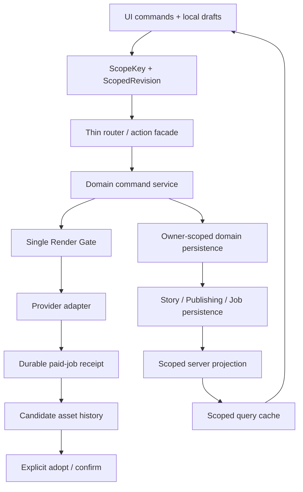
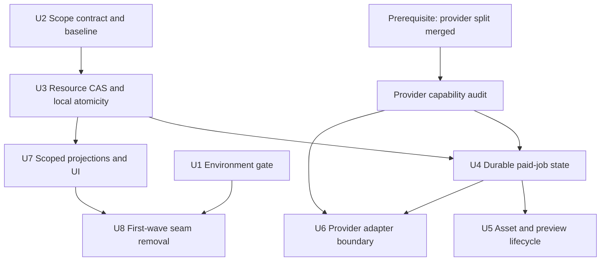
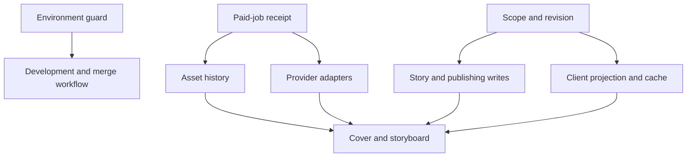

# refactor: 本周环境与架构加固

## Summary

本周的高频联动修改不是单纯由大文件造成，而是同一个业务事实同时存在于 Story body、发布版本、镜头、候选资产、当前图片、付费任务、客户端缓存和局部 UI 状态中。计划先把环境规则升级为机器门禁，再建立统一的作用域、局部 revision、付费任务和资产采用契约，最后沿已经稳定的事务边界删除重复状态与转译代码。

实施目标不是增加一层新框架。方案复用现有 Story CAS、operation receipt、Render Gate、scope epoch 和架构守卫；迁移既有责任时同步删除对应旧入口，以 writer、DTO 重建点、状态解释点和代表性改动触达文件数的下降作为硬验收，净生产代码量作为辅助指标。新建、移动或实质修改的业务函数补充简短中文契约注释，说明用途、稳定的直接调用入口和下游调用对象。

---

## Problem Frame

从 2026-08-08 至 2026-08-14，共有 32 个非合并提交，其中 24 个是修复；167 个文件累计变化约 `+18,158/-2,748`。变化集中在 `server`、`client`、`shared` 和 `evals`，而 `server/db.ts`、`StoryboardReviewBoard.tsx`、`StoryAgentContext.tsx`、`CreationEditorContext.tsx`、`PublishingDraftWorkspace.tsx`、`storyAgent.ts`、`imageGen.ts` 等编排文件已经承担多个领域的写入和状态解释。

本周反复出现的故障有共同模式：Story 切换后迟到响应污染新 Story；DTO 重建丢失 `providerTaskId` 等付费凭证；UI 显示的继承关系与真实 render 参数不同；候选、正式封面和视频首帧互相混用；nullable/布尔字段同时表达多个阶段；router、service、Context 各自判断 revision 和缓存是否有效。环境侧虽然已经从 13 个 worktree、多个数据副本收敛到当前的 2 个 worktree和单一 3000 服务，但健康仍主要依赖人工操作。

---

## Assumptions

*本计划是在没有同步逐项确认的情况下编写的。以下是用于填补输入空白的默认选择，实施前可由用户改写。*

- 文本冲突默认保留本地草稿并显示冲突，不做静默语义合并。
- `submission_unknown` 默认是禁止普通重试的可诊断终态；供应商有可验证查询能力时原地恢复，没有时本轮不建设通用自助绑定/解锁 UI。
- 不新建脱离 Story 的通用恢复资产库；存在非终态付费任务时阻止删除 Story/版本/镜头，已交付资产继续遵守原 scope 的现有删除语义。
- 允许多个标签页读取同一 Story；写入以资源级 CAS 解决冲突。
- provider receipt 永久记录原 provider 和 adapter schema version，恢复时不跟随当前 provider 选择。
- 客户端 `userId` 只用于缓存隔离；服务端 owner 一律来自认证会话。
- inactive、无服务且不存在业务持久化文件的 worktree 是允许状态，不作为环境门禁失败条件。

---

## Requirements

- R1. 主仓库是唯一允许启动 dev/preview 服务和写 `.webdev/local-persist.json` 的位置，端口固定为 3000；违规状态必须由可自动执行的门禁非零退出。
- R2. 所有 Story 读写都显式校验 `userId + storyId`；服务端 `userId` 必须来自认证会话而非客户端输入，版本、镜头、封面等资源再携带自己的稳定标识，禁止 latest Story、project-only 或 shotNo 猜测回退。
- R3. UI 只发送领域命令或局部 patch，不能把客户端完整投影反写服务端；互不相关的资源使用局部 revision，避免整 Story 冲突域。
- R4. Story 切换、版本切换和乱序响应不能污染新的 UI scope、query cache、当前资产或持久化目标。
- R5. `providerTaskId`、provider、adapter schema version、`operationId`、submission certainty、状态、错误原因和重试语义作为不可拆散的付费任务 receipt 跨层传递；供应商幂等键和 lease fencing token 使用独立字段。
- R6. 供应商已受理但 receipt 尚未确认落库的窗口不得自动重提；过期 claim 的迟到完成必须被 fencing token 拒绝。
- R7. 候选资产、当前图片、正式封面、视频首帧和故事版预览具有独立语义；只有显式 adopt/confirm 命令可以改变正式指针。
- R8. 静态图片只经过一次 Render Gate；provider adapter 只负责协议转换、提交、恢复和错误归一化，不追加第二套美术规则或资产采用规则。
- R9. V2 不修改 V1；故事版预览不修改正式镜头；重生成保留人工修改、旧媒体和稳定镜头身份；质检失败或不可用不隐藏已付费候选。
- R10. 按领域事务边界瘦身大文件，迁移一个既有责任就删除对应旧 seam；重复 writer、DTO、状态解释器和 direct-db/provider 入口必须减少。净生产代码量只作辅助指标，增加部分按安全能力、兼容期代码和预计删除点解释。
- R11. 每个新建、移动或实质修改的导出业务函数都在紧邻定义处写简短中文契约注释，至少说明“用途、稳定调用入口、下游调用对象”；内部小函数只在调用关系不显然时补充，避免把完整 call graph 手工复制进注释。
- R12. 每个实施单元必须先建立行为证据，再迁移结构；最终通过定向测试、串行关键测试、类型检查、构建、功能账本校验和环境门禁。

---

## Scope Boundaries

- 不引入新的客户端状态库、ORM、事件总线或微服务。
- 不按文件行数盲目拆分，也不在同一单元同时改变行为模型、存储格式和页面设计。
- 不自动删除历史 worktree、业务数据、媒体或已付费任务。
- 不重写已经工作的 Story ownership、稳定镜头、图片历史、发布 V1/V2、故事版预览/CAS、Render Gate 和质检展示能力。
- 不把全库性能优化、UI 重做、社交平台发布或供应商全面迁移混入本轮。
- 不复跑或改写 `docs/plans/2026-08-11-001-refactor-feature-health-convergence-plan.md`；该计划只作为行为基线。
- 不覆盖当前未提交的 brainstorm 文档，也不在 `codex/openai-next-provider-split` 合并前重写其 provider 接口。

### Deferred to Follow-Up Work

- Midjourney 与 GPT-image 以外 provider 的适配器迁移：首批两个 provider 验证合同后另行推进。
- 自动三方合并语义文本：先采用“保留本地草稿并提示冲突”，有真实需求后再规划。
- 全库大文件治理：本轮只处理被新契约直接覆盖的热点责任。
- Story 删除后的付费资产保留、恢复、永久删除和跨 Story 手工迁移：先以非终态任务阻止删除，产品语义明确后再规划。
- `submission_unknown` 的通用自助 task ID 绑定、解锁、审计后台和恢复资产 UI：先记录真实发生频率与 provider 可验证能力，再独立规划。
- 跨 Story 素材聚合、质检产品文案和 prompt evaluation 历史文档治理：只有本轮权威代码实际变化时同步更新，否则不进入本计划。

---

## Context & Research

### 本周变化与当前环境

| 观察面 | 本周证据 | 结论 |
| --- | --- | --- |
| 提交 | 32 个非合并提交，24 个 fix，5 个 feat | 修复比例过高，说明边界尚未稳定 |
| 变更量 | 167 个文件，约 `+18,158/-2,748` | 新能力伴随大量补丁式联动 |
| 最大热点 | 发布 router/test、`imageGen.ts`、Render Gate、发布工作台、故事板 | 付费任务、资产、版本与 UI 投影跨层重复解释 |
| 8 月 14 日凌晨环境 | 13 个 worktree、4 份 worktree 业务数据、71 个脏文件 | 人工并行习惯仍可制造数据分裂和验证失效 |
| 当前环境 | 2 个 worktree、主仓 3000 单服务、额外 worktree 无业务数据 | 已恢复健康，但缺少自动 gate 防复发 |

### Relevant Code and Patterns

- `server/_core/devServerPreflight.ts`：worktree 禁启服务、固定 3000 的现有硬约束。
- `scripts/env-status.ts`：实时报告 worktree、服务与数据文件的现有入口。
- `vitest.setup.ts`、`vitest.globalSetup.ts`、`server/db.ts`：测试临时持久化、真实数据拒写、原子替换和写前备份。
- `client/src/features/storyAgent/spine/storySpine.ts`：scope epoch、原子替换和乱序响应丢弃模式。
- `client/src/features/creationEditor/publishingHandoffScope.ts`：Story scope 检查的纯函数模式。
- `server/services/storyBodyPersistence.ts`：owner-scoped Story CAS。
- `server/services/publishingVideoStoryboardPersistence.ts`：`operationId`、request hash、claim TTL、claim/complete/fail 和 CAS。
- `server/services/renderGate.ts`：静态图片唯一提示词编译边界。
- `client/src/architecture-boundaries.test.ts`：依赖方向的静态守卫。
- `server/services/imageGen.ts` 的 `keepProviderReceipt`：错误改写时保留供应商凭证的正确方向，但目前尚未成为共享合同。

### Institutional Learnings

- `docs/solutions/2026-06-13-多worktree环境数据分裂收敛.md`：本地持久化随 `process.cwd()` 变化，worktree 启服务会创建另一份业务事实；治理必须依靠实时检测和强制失败。
- `docs/solutions/2026-06-13-故事为唯一单位-镜头按storyId.md`：Story 是唯一工作单位，所有读写都要以 `storyId + userId` 定位，不能推断当前 Story。
- 当前文档存在漂移：`docs/environment-guide.md` 仍允许其他端口预览；`single-dev-environment` 功能卡仍记录旧的 3050 服务和多份数据；旧 Story workspace 合同对跨 Story 素材聚合和正式镜头真相源的描述也与当前账本冲突。

### Session History

过去 7 天的 Claude/Codex 会话进一步确认：共享主 checkout 的并发修改使覆盖和验证失效；worktree 服务产生数据副本；server 热重启会中断付费任务长轮询；中间 DTO 重建持续丢失 receipt 字段；缓存和版本边界缺少统一 identity。方案因此优先收敛写入所有权与 durable job，而不是先做机械文件拆分。

---

## Key Technical Decisions

| 决定 | 采用方案 | 不采用的方向 |
| --- | --- | --- |
| 环境健康 | `env:status` 保持只读诊断，新增严格 `env:check` 供启动、测试和合并门禁使用 | 继续依靠人工检查或宽泛 `pkill` |
| 权威状态 | 服务端领域状态是持久化权威；query cache/store 是按 scope 派生的投影，本地草稿单独保存 | Context、cache 和 server 都可写同一事实 |
| 并发 | resource revision 是目标写入的唯一 CAS 条件；成功写入在同一存储事务内同时递增 resource 与 aggregate revision，aggregate 只负责投影失效 | 用 aggregate revision 阻塞无关资源写入，或客户端整体覆盖 Story body |
| 迟到响应 | 客户端 epoch 只保护 UI；服务端仍校验 owner、scope、revision 和 operation | 仅靠取消请求或 React 生命周期 |
| 付费任务 | 生成状态、质量状态、采用状态正交；receipt 与 scope 不随 DTO 改写丢失 | 一个 nullable/boolean 字段同时表示所有阶段 |
| lease 接管 | claim 产生递增 fencing token，complete/fail 必须匹配 operation、request hash 和 token | 仅靠 TTL 判断谁可以写完成结果 |
| Provider | adapter 只 submit/resume/normalize；Render Gate、存储、质检和 adopt 在 adapter 外 | 每个 provider 内复制提示词、存储和质检逻辑 |
| 持久化边界 | 先复用现有领域 persistence；只有同一原语被至少两个模块消费且能删除 direct-db seam 时才抽共享 helper | 把 Story CAS、paid-job lease 和 receipt 塞进一个新的中心 facade |
| 大文件 | 先建表征和窄领域边界，再移动单一责任并删除旧 seam | 按目录或行数一次性重写 |
| 注释 | 对本轮触碰的导出业务函数写中文调用契约，调用者写稳定入口而非穷举全部 callsite | 给每一行回调写重复注释或复制一份易漂移的完整 call graph |

---

## Open Questions

### Resolved During Planning

- 当前是否已经环境失控：没有；`pnpm env:status` 显示主仓单服务，第二个 worktree 无服务和业务数据。U1 解决的是防复发，而不是再次做数据合并。
- 是否立即物理拆分 `server/db.ts`：不立即拆。先复用现有领域 persistence，并只为已被两个调用方证明重复的原语建立 helper。
- 是否现在重写 provider 接口：不。等待 `codex/openai-next-provider-split` 合并，并以合并后的合同为迁移起点。
- 质检失败是否隐藏付费候选：不隐藏；质量只是资产元数据，不能改变交付事实和可见性。

### Deferred to Implementation

- 局部 revision 是使用独立整数、内容 hash 还是两者组合：U3 用现有持久化形态和并发测试选择最小实现，但 U2 的外部命令合同保持稳定。
- 供应商是否支持原生 idempotency key 和安全查询：U6 先记录首批 provider capability；U4 的保守合同不假设该能力，不支持时统一进入 `submission_unknown`。
- Story 删除是否代表不可恢复的数据删除，以及付费资产保留期：本轮以“存在非终态付费任务时禁止删除”收窄问题，完整保留/删除产品语义另行确认。

---

## High-Level Technical Design

> 下图表达状态所有权与写入方向。客户端草稿和缓存不反向成为权威；所有持久化命令都必须经过 owner、scope、revision 和 operation 检查。

### 核心合同

- 客户端 `ScopeKey` 可包含会话 `userId` 用于缓存隔离；router 必须使用认证会话重新构造服务端 scope，并拒绝不一致的 owner 输入。scope 按资源增加 `versionId`、`resourceId` 或 `stableShotId`。
- `ScopedRevision` 同时携带 aggregate 与 resource revision。目标命令只校验 resource revision；成功提交在同一存储事务内递增两者，aggregate 只用于投影失效和读取新鲜度。
- `PaidJobReceipt` 固定携带 provider、adapter schema version、`operationId`、request hash、provider task ID、submission certainty、generation status、retryability、清洗后的 error code/summary 和 `fencingToken`。`providerIdempotencyKey` 是独立可选字段。
- generation、quality、adoption 是三个正交维度。允许 `delivered + quality_flagged + adopted`，质检重跑只能改变 quality。
- receipt、日志和客户端 view model 使用字段白名单，禁止保存或返回认证头、cookie、完整 provider payload、长期下载凭证或未经清洗的错误对象。
- 供应商返回的资产先进入 candidate history；只有 scope 完整匹配的显式 adopt/confirm 命令才能改变 current/formal pointer。

---

## Implementation Units

执行分为两条可独立交付的主线：`U1` 与 `U2 → U3 → U7 → U8` 不等待 provider split，先兑现环境门禁和 Story/Publishing 减耦；付费生成主线在 provider capability 审计后执行 `U4 → U5` 与 `U4 → U6`。因此 provider 工作延期不会阻塞第一批 writer、DTO 和 UI 状态删除。

### U1. 环境门禁与事实校准

**Goal:** 把单服务、单数据源和受控 worktree 从文档约束升级为可执行门禁，同时让文档和功能账本反映当前事实。

**Requirements:** R1, R12

**Dependencies:** None

**Files:**

- Modify: `scripts/env-status.ts`
- Modify: `scripts/env-status.test.ts`
- Modify: `scripts/dev-preflight.ts`
- Create: `scripts/dev-preflight.test.ts`
- Modify: `package.json`
- Modify: `docs/environment-guide.md`
- Modify: `docs/features/feature-ledger.json`
- Modify: `scripts/validate-feature-ledger.test.ts`

**Approach:**

- 从当前报告逻辑抽出纯检查结果，保留 `pnpm env:status` 的降级可读输出，新增只读、非零退出的 `pnpm env:check`。
- 严格 gate 对无法确认 cwd、Git worktree 或端口归属的情况 fail closed；普通 status 对 `lsof` 等工具缺失只提示未知。
- inactive、无服务且没有 `.webdev/local-persist.json` 的 worktree 不失败；任一非主 worktree 服务或业务持久化文件、非 3000 服务或多份活动数据都使严格 gate 失败。历史遗留文件只由 status 报告来源，处理需显式授权，不用 mtime 猜“新增”。
- 用“解析目标端口 PID → 在发送信号前再次校验监听端口、进程 cwd、命令、当前用户均属于主仓 → 仅终止匹配进程”替换宽泛 `pkill -f`。
- 将 `env:check` 接入 predev、最终验证和合并前脚本；不自动删除 worktree、数据或媒体。
- 以实时证据更新 `single-dev-environment` 状态、known gaps 和测试证据，保留事故历史。

**Execution note:** 先为现有健康环境和每类违规状态写测试，再改变脚本。

**Test scenarios:**

- Happy path: 主仓 3000 单服务加一个 inactive clean worktree -> status 与 check 都通过。
- Error path: worktree 中存在运行服务、非 3000 端口服务或业务持久化文件 -> `env:check` 非零退出并指出精确目标。
- Error path: Git 信息不可读或 gate 无法确定进程归属 -> check fail closed；status 仍输出未知项。
- Safety: predev 只终止已验证属于主仓目标端口的旧进程，不影响其他 Node 服务。
- Integration: `pnpm feature:validate` 证明账本字段、状态和证据合法。

**Verification:** 环境状态与严格门禁在健康/违规 fixture 上输出正确结果；环境脚本测试和功能账本校验通过。

### U2. 统一 Story scope、revision 合同与耦合基线

**Goal:** 先固定跨层 identity、revision 不变量和领域命令 envelope，并量化当前 writer/DTO/状态解释点；本单元不承诺尚未实现的资源级持久化并发行为。

**Requirements:** R2, R3, R4, R9, R11

**Dependencies:** None

**Files:**

- Create: `shared/scopedResource.ts`
- Create: `shared/scopedResource.test.ts`
- Create: `docs/qa/refactor-coupling-baseline-2026-08-14.md`
- Modify: `shared/publishingDraft.ts`
- Modify: `client/src/features/storyAgent/spine/storySpine.ts`
- Modify: `client/src/features/creationEditor/publishingHandoffScope.ts`
- Modify: `client/src/architecture-boundaries.test.ts`

**Approach:**

- 定义 `ScopeKey`、`ScopedRevision` 和最小领域命令 envelope；scope 根据资源显式包含 story、version、stable shot 或 cover identity。
- 客户端 epoch 只判断响应是否还能进入当前 UI；router 使用认证会话构造 owner scope，客户端 `userId` 不参与授权。
- 明确 revision 不变量：资源命令只用目标 resource revision 判冲突；成功写入必须原子递增 resource 与 aggregate revision；aggregate 只驱动投影失效。
- 基线文档枚举所有 Story body/publishing writers、DTO 重建点、状态解释器、direct-db/provider seam，并记录三类代表性改动当前触达的生产文件数：Story 文本字段、生成状态、资产类型。
- 禁止 router/UI 发送完整客户端 projection；本单元只通过类型、解析和静态边界测试固定合同，真实 writer 迁移在 U3/U7。
- 对旧数据采用读取归一化、首次真实修改时写新格式，不因读取触发批量写回。

**Patterns to follow:** `storySpine.ts` 的 scope epoch、`publishingHandoffScope.ts` 的纯函数检查、`storyBodyPersistence.ts` 的 owner-scoped CAS。

**Test scenarios:**

- Contract: 缺少 storyId、resource kind 或资源稳定 ID 的命令解析失败。
- Ownership: 客户端伪造 userId 时服务端 scope 仍使用认证会话并拒绝不一致输入。
- Revision: resource revision 与 aggregate revision 的职责通过纯状态转换测试固定，aggregate 不作为无关资源写入前置条件。
- Compatibility: 读取旧 Story/publishing 数据不写回，首次真实修改才升级目标资源格式。
- Baseline: 三类代表性改动均有可复核的 writer、DTO、状态解释点和生产文件触达清单。

**Verification:** 共享合同、Story scope、handoff scope 和静态架构测试通过；基线清单能为 U3、U4、U5、U8 提供同一统计口径。

### U3. 资源级 CAS 与本地持久化原子性

**Goal:** 在不立即物理拆分 `server/db.ts` 的情况下，让现有领域 persistence 获得 owner-scoped read、资源级 CAS 和可观察的写盘失败语义，不创建新的中心 facade。

**Requirements:** R2, R3, R9, R10, R11

**Dependencies:** U2

**Files:**

- Modify: `server/db.ts`
- Create: `server/db.localPersistenceFailure.test.ts`
- Modify: `server/db.storyRevision.test.ts`
- Modify: `server/services/storyBodyPersistence.ts`
- Modify: `server/services/publishingPersistence.ts`
- Modify: `server/services/storyBodyPersistence.test.ts`
- Modify: `server/services/publishingPersistence.test.ts`

**Approach:**

- 先复用 `storyBodyPersistence.ts`、`publishingPersistence.ts` 等现有领域边界；只有同一最小原语被至少两个模块使用且能删除具体 direct-db seam 时才抽共享 helper。
- 所有写能力校验认证 owner、scope 和 expected resource revision。目标 resource revision 是唯一写入冲突条件；成功提交在同一存储事务内递增 resource 与 aggregate revision。
- 修正本地 JSON 路径的失败语义：基于不可变 next state/copy-on-write 生成候选状态，原子写盘与 rename 成功后才发布为 `memoryState`；写盘失败向调用方传播，当前内存状态保持不变。
- 本单元的“原子”只指单个本地状态文件或单个数据库事务内的元数据，不承诺覆盖 provider 网络调用或媒体文件。
- 保留旧格式兼容读，在每类 writer 迁移完成后删除对应的整 body/direct-db 写入口。

**Execution note:** characterization-first；每迁移一种 writer 都先证明旧行为，再删除旧入口。

**Test scenarios:**

- Integration: 两个标签页分别修改同一 Story 的标题和 V2 平台稿，两项都保存，不发生整 body 覆盖。
- Conflict: 两个标签页同时修改同一平台稿，后写者得到结构化 revision conflict。
- Error path: expected revision 过期 -> 返回结构化冲突，旧完整 projection 不得落库。
- Atomicity: 磁盘写入失败、rename 失败或前序排队写失败时，错误向上传播且 `memoryState` 不变化；重启后不出现仅存在于失败内存写的状态。
- Revision: 成功资源写入同时递增 resource 与 aggregate；无关资源不因 aggregate 变化发生 CAS 冲突。
- Ownership: 正确 storyId 但错误 userId 的读写全部拒绝。

**Verification:** Story revision、本地持久化失败、Story body 和 Publishing persistence 测试证明局部并发与失败回滚语义。

### U4. Durable paid-job receipt 与状态机

**Goal:** 让付费任务在断连、热重启、DTO 改写、乱序回调和 provider 切换后仍能恢复，并消除重复扣费窗口。

**Requirements:** R5, R6, R9, R11

**Dependencies:** U3；外部前置：provider split 合并，随后先完成 provider capability 审计

**Files:**

- Create: `shared/paidJob.ts`
- Create: `shared/paidJob.test.ts`
- Create: `server/services/paidJobPersistence.ts`
- Create: `server/services/paidJobPersistence.test.ts`
- Create: `docs/qa/provider-paid-job-capabilities.md`
- Modify: `server/services/imageGen.ts`
- Modify: `server/services/imageGen.test.ts`
- Modify: `server/routers/publishingDraft.ts`
- Modify: `server/routers.publishingDraft.test.ts`
- Modify: `client/src/features/publishingDraft/publishingCoverGenerationState.ts`
- Modify: `client/src/features/publishingDraft/publishingCoverGenerationState.test.ts`

**Approach:**

- 第一交付物只读核对 Midjourney 与 GPT-image 的 submit、resume、idempotency lookup、callback 和旧 receipt 支持，记录共同能力与权威 adapter contract 路径；状态机不假设 provider 没有证明的能力。
- generation 状态采用 `draft -> submitting -> accepted -> polling -> delivered`，异常分支为 `submission_unknown`、`recoverable_error`、`terminal_provider_failure`；只允许显式合法迁移。
- quality 使用独立状态 `pending/unavailable/flagged/passed`，adoption 使用独立事实；两者不得覆盖 generation。
- 提交前原子持久化 `operationId`、attempt ID、submittedAt、提交 lease 和可选 `providerIdempotencyKey`；provider 支持时才透传原生幂等键。
- 启动恢复时，超过提交 lease 且没有可靠 receipt 的 `submitting` 原子转为 `submission_unknown`。只有 provider 的可验证幂等查询可以自动恢复；刷新、切 Story、重启和普通重试都不能解除。
- 每次 poll/materialize claim 生成递增 `fencingToken`；complete/fail 必须同时匹配 `operationId`、request hash 和 fencing token，旧 lease 的迟到结果只能被记录为已拒绝。
- 元数据状态转移在本地状态文件或数据库事务内原子完成；provider 网络请求和媒体文件不在该原子性承诺内。
- 复用并推广 `keepProviderReceipt`，wrapper 只增补上下文，不重建丢字段错误。
- receipt、日志与客户端 view model 使用字段白名单：只保留归一化 error code、清洗摘要和受限诊断 ID，不保存认证头、cookie、完整响应、长期 URL 或原始错误对象。
- 本轮只提供 owner-scoped 可诊断状态，不新增通用手工 task ID 绑定、解锁或恢复资产 UI；是否建设该能力由真实发生频率与 provider 归属验证能力决定。

**Test scenarios:**

- Crash before call: `submitting` 已持久化但 provider 调用尚未发生 -> 只有能证明未发出时才回到可提交。
- Crash after accept: 请求已发出但响应或 receipt 未落库 -> lease 到期后进入 `submission_unknown`，不得自动重提。
- Failure window: 取得 task ID 后模拟持久化失败 -> 重启后按原 provider/idempotency 能力恢复或进入 `submission_unknown`。
- Unknown submission: 提交断连且无 task ID -> 状态为 `submission_unknown`，刷新、切 Story、重启均不重提。
- Ordering: provider 回调重复、乱序到达，`delivered` 后的 `processing` 不回退，重复 delivery 不重复建资产。
- Lease takeover: claim 过期并由新 worker 接管后，旧 worker 的迟到 complete/fail 被 fencing token 拒绝。
- Error propagation: 每层 wrapper 都保留 provider、task ID、submission certainty、cause、retryability 和 paid acceptance。
- Security: 伪造客户端 owner 无法读取/恢复任务；包含 secret、header、签名 URL 的 provider 错误在持久化、日志和客户端投影前被清洗。
- Quality: 允许 `delivered + quality_unavailable`、`delivered + quality_flagged` 和 `adopted + quality_flagged`。
- Coupling: “增加一个生成状态”只需要修改共享状态合同、状态转换和对应测试，不再同时修改多层 DTO 重建与错误文案判断。

**Verification:** paid-job 单元测试、`server/services/imageGen.test.ts`、`server/routers.publishingDraft.test.ts` 和封面生成状态测试串行通过。

### U5. 候选、预览、正式资产与显式采用

**Goal:** 让已付费结果在所属 Story 存续期间可恢复，同时确保刷新、质检、重生成和回调都不能隐式改变正式资产；不在本轮新建跨 Story 恢复资产产品。

**Requirements:** R7, R9, R11

**Dependencies:** U4

**Files:**

- Modify: `server/services/imageAssets.ts`
- Modify: `server/services/imageAssets.test.ts`
- Modify: `server/services/publishingVideoStoryboard.ts`
- Modify: `server/services/publishingVideoStoryboard.test.ts`
- Modify: `server/services/publishingVideoStoryboardPersistence.ts`
- Modify: `server/services/publishingVideoStoryboardPersistence.test.ts`
- Modify: `server/services/publishingPersistence.ts`
- Modify: `shared/publishingVideoStoryboard.ts`
- Modify: `server/db.ts`
- Modify: `server/routers/storyAgent.ts`
- Modify: `server/routers.storyAgent.test.ts`

**Approach:**

- 用稳定 scope 区分 shot candidate、cover candidate、current image、formal cover、video first frame 和 storyboard preview。
- provider 交付只追加 candidate history；adopt/confirm 必须使用认证 owner，并验证 story、version、stable shot 或 cover scope 后更新指针。
- preview 保存 source fingerprint。正文或版本变化后旧 preview 可以保留为 stale，但不能确认进正式镜头。
- receipt 先记录交付事实与临时媒体位置，再幂等 materialize 媒体和 candidate，最后标记 materialized；每一阶段可重放，重复 delivery 不重复建资产。
- 存在 `submitting`、`accepted`、`polling` 或 `submission_unknown` 任务时阻止删除所属 Story/版本/镜头。重生成不删除旧媒体；迟到结果只能回到原 stable scope，禁止按 shotNo 相似性重绑。
- 质检重跑只更新质量元数据，不改变可见性、receipt、candidate 顺序或 current pointer。

**Test scenarios:**

- Safety: 新候选返回、缓存刷新、重新生成、质检完成和故事版确认均不改变 current image。
- Happy path: 只有显式 adopt 命令且完整 scope 匹配时改变 current/formal pointer。
- Stale preview: V2 预览后修改正文，再确认旧预览被拒绝且正式镜头逐字节不变。
- Materialization: receipt 落库、临时媒体写入、正式媒体写入、candidate 建立各中断点重启后可幂等恢复；孤儿临时文件可识别但不误删已引用媒体。
- Stable identity: 非终态任务存在时删除被拒绝；重生成镜头后，迟到资产不绑定到 shotNo 相同但 stable ID 不同的镜头。
- Quality failure: 质检异常后资产仍可见并标记 `quality_unavailable`，重跑不改变 adopted 状态。
- Coupling: “增加一个资产类型”触达的生产文件、writer 和状态解释点少于 U2 基线。

**Verification:** image asset、publishing video storyboard、persistence 的定向测试全部通过。

### U6. Provider adapter 与 Render Gate 边界

**Goal:** 在 provider split 合并后复用其权威合同；仅在审计证明仍有重复时，才把 Midjourney 与 GPT-image 的差异补齐到同一 typed adapter contract，并保证提示词只编译一次。

**Requirements:** R5, R8, R10, R11

**Dependencies:** U4；外部前置：`.worktrees/codex/openai-next-provider-split` 合并并完成其定向测试

**Files:**

- Modify: `docs/qa/provider-paid-job-capabilities.md`
- Modify: `server/services/imageGen.ts`
- Modify: `server/services/imageGen.test.ts`
- Modify: `server/services/renderGate.ts`
- Modify: `server/services/renderGate.test.ts`
- Modify: `server/services/imageGenerationReference.ts`
- Modify: `server/services/imageGenerationReference.test.ts`

**Pre-edit gate:** capability 文档必须先记录合并后的权威 adapter contract 路径和 go/no-go 结论；路径未锁定前不得修改 provider 接口。

**Approach:**

- 读取 U4 的 go/no-go 审计：逐项核对 provider split 是否已覆盖 submit、resume、error normalization、receipt 字段和 Render Gate 单次编译；已覆盖部分只补测试或删除重复分支，不再创建第二套合同。
- adapter 输入是 Render Gate 已编译的请求，输出是 typed receipt/result/error；不得持久化业务投影、采用资产或运行第二套质检。
- receipt 记录 provider 和 adapter schema version；旧任务始终由原 provider adapter 恢复，不按当前用户选择切换。
- 只有审计确认 Midjourney 与 GPT-image 仍存在同类重复实现时才迁移共享 adapter contract；迁移同时删除 `imageGen.ts` 内对应重复 submit/poll/error normalization 分支。
- Render Gate 继续作为静态图片唯一编译器，Story Agent、Creation、封面和镜头派生入口都只调用一次。

**Test scenarios:**

- Provider switch: 当前 provider 切为 GPT-image 后，旧 Midjourney receipt 仍由 Midjourney adapter 恢复。
- Error contract: 两个 adapter 对超时、断连、拒绝和 terminal failure 输出同一结构且保留原始状态。
- Single compile: Story Agent、Creation、封面、镜头派生入口各自只经过一次 Render Gate。
- Compatibility: 旧 adapter schema receipt 在兼容周期内仍可恢复。

**Verification:** `server/services/renderGate.test.ts`、`server/services/imageGen.test.ts`、`server/services/imageGenerationReference.test.ts`，以及 provider split 自带测试。

### U7. Scoped projection、缓存与 UI 命令层

**Goal:** 让 Context 和大型工作台只负责按 scope 展示投影、保存本地草稿和派发命令，彻底阻断迟到响应与跨版本缓存污染。

**Requirements:** R3, R4, R9, R10, R11

**Dependencies:** U3

**Files:**

- Modify: `client/src/lib/trpc.ts`
- Modify: `client/src/features/storyAgent/spine/storySpine.ts`
- Modify: `client/src/features/storyAgent/StoryAgentContext.tsx`
- Modify: `client/src/features/creationEditor/CreationEditorContext.tsx`
- Modify: `client/src/features/publishingDraft/PublishingDraftWorkspace.tsx`
- Modify: `client/src/features/publishingDraft/publishingDraftViewModel.ts`
- Modify: `client/src/features/publishingDraft/publishingCoverGenerationState.ts`
- Modify: `client/src/features/storyAgent/views/StoryboardReviewBoard.tsx`
- Test: `client/src/features/storyAgent/spine/storySpine.test.ts`
- Test: `client/src/features/storyAgent/storyAgentPersistence.test.ts`
- Test: `client/src/features/storyAgent/StoryAgentContext.intent.test.tsx`
- Test: `client/src/features/publishingDraft/PublishingDraftWorkspace.test.tsx`
- Test: `client/src/features/publishingDraft/publishingDraftViewModel.test.ts`
- Test: `client/src/features/creationEditor/publishingHandoffScope.test.ts`

**Approach:**

- query/mutation key 至少包含会话投影中的 user、story、version、resource kind 和 resource ID；客户端 user 只隔离缓存，不作为服务端授权输入。只失效相关 scope，不全局清 cache。
- 请求完成时同时校验 captured scope epoch 与响应 ScopeKey；乐观更新只能触及同 scope projection。
- 文本 CAS 冲突保留本地草稿并显示冲突；adopt、confirm 等离散命令在刷新 revision 后可由用户安全重放。
- UI 不再把 query cache、Context 快照或本地 draft 当成可整体反写的权威状态，只消费 U2/U3 的 scoped projection 与结构化冲突。
- 从四个大组件中一次只抽离一个纯 selector、command facade 或 local-draft controller；抽出后删除原内联实现。

**Test scenarios:**

- Scope switch: Story A 请求在切到 B 后完成，不修改 B 的 UI、cache、标题、镜头、封面或任务状态。
- Independent writes: 两个标签页分别修改同一 Story 的标题和 V2 平台稿，两项都保存，不发生整 body 覆盖。
- Same-resource conflict: 两个标签页同时修改同一平台稿，后写者看到冲突且本地文字保留。
- Version isolation: V2 文稿、封面任务和故事版确认均不改变 V1 投影。
- Conflict UX: 同资源 CAS 冲突后服务端投影刷新，但用户未保存文字仍保留并可重新应用。
- Cache: 一个版本的 optimistic update 和 invalidation 不触及另一版本或另一 Story。

**Verification:** Story spine、Publishing workspace、handoff 和 Storyboard 的 scope/cache 测试通过；真实主仓 3000 页面在 U8 收敛后即可验证，不等待 provider 主线。

### U8. 第一批 seam 删除、编排瘦身与边界固化

**Goal:** 在 scope/CAS/UI 合同稳定后先删除 Story/Publishing 的旧 DTO、整 body writer 和重复 UI 状态解释，不等待 provider 主线完成。

**Requirements:** R2, R3, R4, R10, R11, R12

**Dependencies:** U1, U7

**Files:**

- Modify: `server/db.ts`
- Modify: `server/routers/storyAgent.ts`
- Modify: `server/routers/publishingDraft.ts`
- Modify: `client/src/features/storyAgent/StoryAgentContext.tsx`
- Modify: `client/src/features/creationEditor/CreationEditorContext.tsx`
- Modify: `client/src/features/publishingDraft/PublishingDraftWorkspace.tsx`
- Modify: `client/src/features/storyAgent/views/StoryboardReviewBoard.tsx`
- Modify: `client/src/architecture-boundaries.test.ts`
- Test: `server/routers.storyAgent.test.ts`
- Test: `server/routers.publishingDraft.test.ts`
- Test: `client/src/features/storyAgent/storyAgentPersistence.test.ts`
- Test: `client/src/features/publishingDraft/PublishingDraftWorkspace.test.tsx`
- Modify: `docs/qa/refactor-coupling-baseline-2026-08-14.md`
- Modify: `docs/story-workspace-data-contract.md`
- Modify: `docs/features/feature-ledger.json`

**Approach:**

- 使用 U2 的基线逐项删除已经被 scope/CAS contract 替代的 writer、DTO、状态解释器和 direct-db seam，并回填最终触达数。
- router 只做输入解析、权限入口和错误映射；service 负责领域命令；persistence 负责 CAS；UI 只负责投影与命令。
- architecture boundary 禁止 UI 直连 DB/provider、query cache 反向持久化和 router 绕过领域 persistence；provider/receipt 专属守卫在 U4/U6 同步落地。
- 每次只移动一个责任，保留变更量与行为测试证据。净行数不是压缩代码的硬门槛；新增量必须按安全能力、兼容期代码和预计删除点分类。
- 文档修改限于本轮真实改变的环境、Story scope、revision、receipt、资产采用和 provider 边界；其他历史漂移只在对应权威代码实际被修改时同步。
- 更新所属功能卡的 history、权威代码、测试证据和 known gaps，不为纯重构创建噪音功能卡。

**Execution note:** 本单元不允许顺手重命名或格式化无关代码，避免掩盖真实删除量。

**Test scenarios:**

- Static boundary: UI 直连 DB/provider、cache 反写和 router 绕过领域 persistence 的 fixture 都被架构测试拒绝。
- Regression: Story ownership、稳定镜头、prompt revision、V1/V2 隔离和现有资产采用行为保持。
- Coupling: “修改 Story 文本字段”代表性改动需要触达的生产文件、writer、DTO 重建点和状态解释点均少于 U2 基线。
- Code size: 重复 writer/DTO/state source 和 direct-db seam 数量下降；净生产代码变化按实现、安全代码、兼容代码分别报告。
- Documentation: `pnpm feature:validate` 通过，账本当前状态与实时环境/测试证据一致。

**Verification:** 先完成定向测试，再串行运行关键状态测试，最后通过类型检查、构建、功能账本校验和环境门禁；全库测试失败时采用基线对照和定向复跑区分回归与环境噪音。

---

## System-Wide Impact

- **Interaction graph:** Story/Publishing UI 派发 scoped command，经 router、domain service、persistence CAS 写入；付费生成另经 Render Gate、provider adapter、durable receipt 和 candidate history，再由显式 adopt 更新正式指针。
- **Error propagation:** 基础设施错误保留 typed cause 和 retryability；CAS 冲突返回目标 scope/revision；submission uncertainty 不被普通重试包装吞掉。
- **State lifecycle risks:** 重点覆盖 provider 受理与 receipt 落库窗口、lease 接管、迟到响应、非终态任务阻止删除、媒体 materialization、旧数据兼容和多标签页写竞争。
- **API surface parity:** Story Agent、Creation、发布封面、镜头图片和故事版入口都必须使用同一 scope、Render Gate、receipt 与 asset semantics。
- **Integration coverage:** 单元测试之外必须证明 A/B Story 切换、V1/V2 隔离、付费恢复、preview stale、explicit adopt 和环境 fail-closed。
- **Unchanged invariants:** 保留 `storyId + userId` ownership、禁止 latest Story 回退、稳定镜头 identity、confirmed prompt revision 不原地覆盖、V2 不修改 V1、发布 CAS/receipt、预览无正式副作用、单一 Render Gate、恢复优先和已付费候选可见性。

---

## Risks & Dependencies

| Risk | Mitigation |
| --- | --- |
| provider split 与本计划同时改写接口 | 付费主线等待其合并；capability 审计先锁定权威路径和已覆盖能力，U6 只补差异并删除重复实现 |
| 新安全合同暂时增加代码 | 迁移既有责任时同步删 seam；安全与兼容代码单列，最终以 writer/DTO/状态解释点和代表性改动触达数验收 |
| 局部 revision 设计过细导致复杂度上升 | 只为真实独立写入资源建 revision，先覆盖本周发生过的冲突，不建立通用事件溯源框架 |
| 本地写盘失败后内存和磁盘分叉 | U3 使用 copy-on-write，原子 rename 成功后才发布内存状态，所有失败向调用方传播 |
| receipt schema 迁移使旧任务无法恢复 | 记录 provider 与 adapter schema version；只在存量非终态 receipt 为零且兼容验证通过后删除旧 reader/adapter |
| `submission_unknown` 无法自动判断供应商结果 | fail safe，禁止普通重提；只使用 provider 可验证查询恢复，自助绑定/解锁另行规划 |
| 删除 Story 时仍有供应商任务 | 非终态或 unknown 任务存在时拒绝删除；不在本轮引入独立恢复资产库 |
| 过期 worker 覆盖新结果 | `operationId`、request hash、递增 `fencingToken` 三重匹配 |
| 大组件拆分改变行为 | characterization-first，每次只移动一种责任，不同时改 UI |
| 全量测试受网络、并发和全局熔断影响 | 保存基线，定向复跑；关键状态测试串行，最终结果区分确定回归与环境噪音 |
| 文档与账本继续漂移 | U1/U8 用实时事实更新，并以 `feature:validate` 和权威代码链接作为门禁 |

---

## Success Metrics

- `pnpm env:check` 能稳定阻止 worktree 服务、非 3000 服务和 worktree 业务数据写入；健康 inactive worktree 不误报。
- `package.json` 不再存在针对通用 Node 命令行的宽泛 `pkill -f`。
- 本周涉及的 Story/Publishing writer 全部显式使用 scope 与局部 CAS，客户端不再提交完整权威投影。
- 首批两个图片 provider 使用同一 receipt/error contract，任何 wrapper 测试都无法丢失 task ID 和 submission certainty。
- 任意付费任务在刷新、Story 切换和 server 重启后不会自动重复提交；旧 provider 任务可由原 adapter 恢复。
- candidate、quality 与 adopted 三种状态可独立组合，只有显式 adopt/confirm 改变正式指针。
- Story 文本字段、生成状态、资产类型三类代表性改动的生产文件触达数、writer、DTO 重建点和状态解释点均低于 U2 基线。
- 旧 writer、重复 DTO、重复状态枚举和重复 provider 分支均有删除清单；净生产代码量下降是优先目标而非压缩式硬门槛，新增安全/兼容代码单独说明。
- 本轮新建、移动和实质修改的导出业务函数具备准确的中文用途、稳定调用入口和下游调用注释。
- 定向测试、关键串行测试、类型检查、构建、环境门禁和功能账本校验全部通过。

---

## Documentation / Operational Notes

- U1 与 `U2 → U3 → U7 → U8` 可立即实施；只有 U4/U5/U6 付费生成主线等待 provider split 合并和 capability 审计。每个单元独立提交、独立回滚，不使用长期并行 worktree 服务。
- 需要运行页面时只在主仓库现有 3000 服务验证；worktree 只改代码，不启动 dev/preview，不写 `.webdev/` 业务数据。
- `env:check` 只诊断并阻止，不自动清理。任何数据合并、worktree 删除或付费任务重提都需要单独明确授权。
- 函数中文契约注释统一使用三行短格式：`用途`、`调用入口`、`下游调用`。只写稳定的模块/导出符号；调用关系变化时与函数同改，禁止穷举瞬时 callsite 或复制粘贴失真。
- 每个单元完成后更新所属功能卡 history；只有真实入口与可执行证据成立后才能标记 `working`。

---

## Sources & References

- 本周 Git 范围：基线提交 `a425c8834ae2f6d81d034b2fcb06e3f97427e91c` 至当前 `c9d34e4`。
- 历史执行基线：`docs/plans/2026-08-11-001-refactor-feature-health-convergence-plan.md`。
- 并行产品计划：`docs/plans/2026-08-14-001-feat-publishing-lifecycle-convergence-plan.md`；本计划不取代其产品需求，只提供共享的环境、scope、receipt 和资产边界。
- 环境说明：`docs/environment-guide.md`。
- 功能账本：`docs/features/feature-ledger.json` 与 `docs/features/README.md`。
- 事故学习：`docs/solutions/2026-06-13-多worktree环境数据分裂收敛.md`。
- Story ownership 学习：`docs/solutions/2026-06-13-故事为唯一单位-镜头按storyId.md`。
- 相关代码：`server/_core/devServerPreflight.ts`、`scripts/env-status.ts`、`server/services/storyBodyPersistence.ts`、`server/services/publishingVideoStoryboardPersistence.ts`、`server/services/renderGate.ts`、`server/services/imageGen.ts`、`client/src/features/storyAgent/spine/storySpine.ts`、`client/src/architecture-boundaries.test.ts`。
