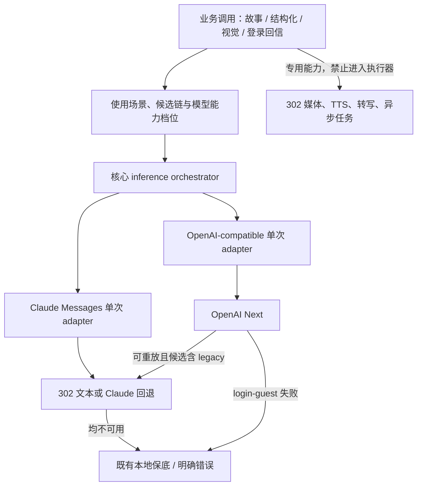
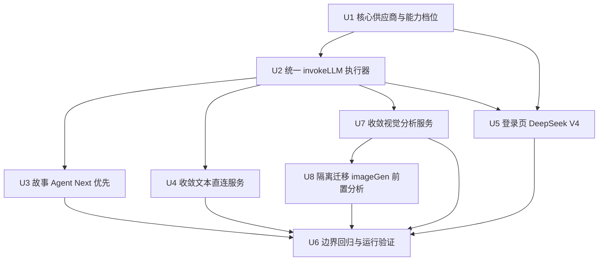
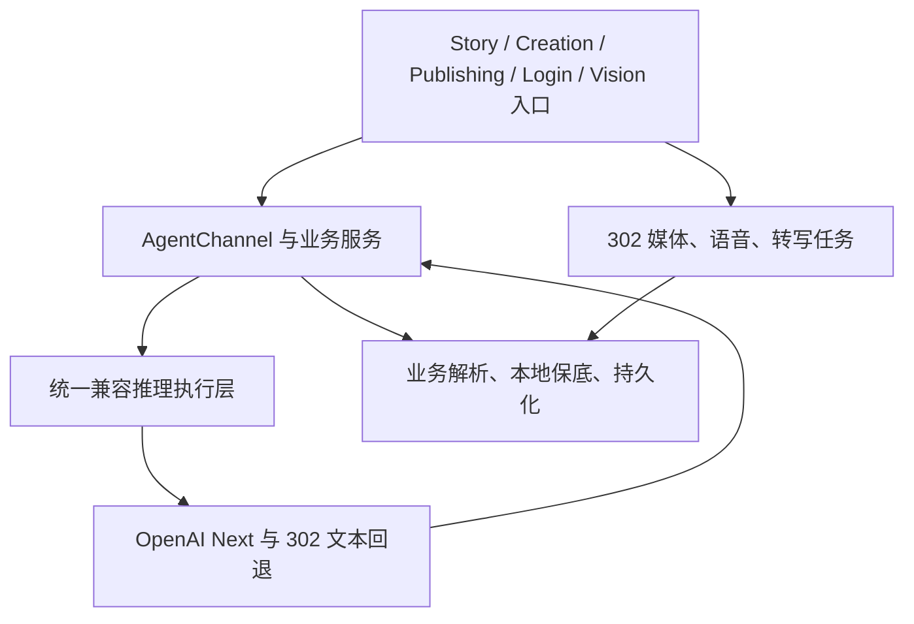

# refactor: Expand OpenAI Next compute routing

## Summary

建立一个服务端统一的 OpenAI-compatible 推理执行层，集中处理供应商选择、模型能力、参数适配、有限回退和脱敏观测；通用故事 Agent 优先使用 OpenAI Next `gpt-5.6-terra`，登录欢迎页访客回信使用 `deepseek-v4-flash`，现有 302 媒体、语音和异步任务链路保持隔离。

---

## Problem Frame

当前部分服务已使用 OpenAI Next 路由，但通用 `invokeLLM`、故事 Agent 的显式 Claude 通道以及若干直接 `fetch` 调用仍各自决定供应商和参数。同类推理因此可能绕回 302，`max_tokens`、结构化输出、视觉输入和重试行为也存在漂移（see origin: `docs/brainstorms/2026-08-14-openai-next-expanded-compute-routing-requirements.md`）。

---

## Requirements

- R1. 所有兼容聊天补全协议的通用文本推理优先使用 OpenAI Next，包括故事回复、摘要、意图识别、镜头拆解、选择编辑、提示词整理和结构化分析。
- R2. 通用文本使用 OpenAI Next `gpt-5.6-terra`，不沿用旧 302 模型名决定主路由。
- R3. 图片内容理解继续优先使用 OpenAI Next 视觉模型，并与图片生成协议分离。
- R4. token 上限、推理强度、temperature、结构化输出、工具调用和视觉消息按模型能力确定性适配。
- R5. OpenAI Next 未配置时使用 302；运行时仅对安全、可重放的推理执行有限回退，两个通道都失败时保持现有本地保底或错误语义。
- R6. 图片/视频生成与编辑、视频扩展、TTS、转写、Midjourney、GPT Image 和异步任务协议继续使用既有专用通道。
- R7. 已受理付费任务的 task id、恢复和防重复扣费行为不变。
- R8. 不修改、迁移或重建故事、图片、视频、编辑快照和本地持久化数据。
- R9. 安全诊断信息可确认供应商、模型、结果和回退原因，不记录凭据或私密内容。
- R10. OpenAI Next 凭据仅由未提交的环境配置注入。
- R11. 登录欢迎页访客回信使用 OpenAI Next `deepseek-v4-flash`，与通用故事 Agent 和登录后每日回信的模型档位分离。
- R12. 邀请码校验、会话建立和身份认证不依赖大模型；访客回信失败时使用本地保底且不影响登录。

**Origin flows:** F1 (OpenAI Next 正常承接), F2 (OpenAI Next 不可用时回退), F3 (媒体与语音专用任务), F4 (登录欢迎页访客回信)

**Origin acceptance examples:** AE1 (通用 Agent 使用 OpenAI Next), AE2 (视觉与参数兼容), AE3 (302 回退), AE4 (付费任务不重提), AE5 (数据与凭据保护), AE6 (登录页 DeepSeek V4 与认证隔离)

---

## Scope Boundaries

- 不把 OpenAI Next 用作图片生成、图片编辑、视频生成、视频扩展、TTS 或音频转写供应商。
- 不改动媒体任务提交、轮询、task id、receipt、恢复或防重复扣费状态机。
- 不迁移或回填现有业务数据，不改变 storyId/userId 归属和素材关联。
- 不引入前端模型选择器、计费面板或通用负载均衡产品能力。
- 不让模型参与身份、邀请码、权限或会话决策。
- 不把音频、PDF 或视频 `file_url` 当作本轮视觉理解输入；本轮多模态仅覆盖文本与 `image_url`。

### Deferred to Follow-Up Work

- 将统一供应商路由经验沉淀到 `docs/solutions/`：在实现验证完成后单独使用 compound workflow 记录，避免计划阶段预写未经运行验证的结论。

---

## Context & Research

### Relevant Code and Patterns

- `server/_core/llm.ts` 是通用 OpenAI-compatible 入口，支持消息规范化、tools/tool_choice 和结构化输出，但当前固定读取 Forge/302 配置且没有独立契约测试。
- `server/_core/agentChannel.ts` 为故事 Agent 选择 Claude Messages 或 OpenAI-compatible 通道；当前 `cc-opus-4-7` 配置使故事主链直接走 302 Claude。
- `server/services/textComputeProvider.ts` 已实现 OpenAI Next 优先与 302 配置回退，可作为统一候选解析的起点，但位于 service 层且只能返回单个供应商。
- `server/services/semanticAnnotation.ts`、`server/services/emotionDailyReference302.ts`、`server/services/publishingVideoStoryboard.ts` 及视觉服务已经各自接入 Next，证明协议可用，也暴露出 token 字段和回退逻辑不一致。
- `server/routers/index.ts` 的 `emotionAnalysis.guestReply` 是 `/login` 欢迎页实际调用模型的公共入口；身份认证仍由 `server/_core/oauth.ts` 独立完成。
- 功能账本 `docs/features/feature-ledger.json` 的 `text-compute-provider-routing` 卡已经定义媒体隔离、302 回退和环境变量密钥约束。

### Institutional Learnings

- `docs/solutions/2026-06-13-多worktree环境数据分裂收敛.md`：worktree 只能改代码，主仓库 3000 验证；不得从 worktree 写 `.webdev` 数据，合并后需及时清理工作树。
- `docs/solutions/2026-06-13-故事为唯一单位-镜头按storyId.md`：供应商迁移只替换推理层，不改变 storyId + userId 业务上下文，也不重写图片关联。

### External References

- [OpenAI Chat Completions create contract](https://developers.openai.com/api/reference/resources/chat/subresources/completions/methods/create/)：`max_completion_tokens` 是新基线，tools/tool_choice 取代旧 functions 接口。
- [OpenAI Structured Outputs](https://developers.openai.com/api/docs/guides/structured-outputs/)：`json_schema` 与仅保证合法 JSON 的 `json_object` 应区分处理。
- [OpenAI Images and Vision](https://developers.openai.com/api/docs/guides/images-vision/)：视觉理解使用消息内容中的 `image_url`，与图片生成接口不同。
- [OpenAI API error guidance](https://developers.openai.com/api/docs/guides/error-codes/) 与 [RFC 9110 retry semantics](https://www.rfc-editor.org/rfc/rfc9110.html#section-9.2.2)：只对安全、可重放请求实施有限重试和回退。
- [OWASP Logging Cheat Sheet](https://cheatsheetseries.owasp.org/cheatsheets/Logging_Cheat_Sheet.html)：日志采用字段 allowlist，排除凭据、token 和敏感内容。

---

## Key Technical Decisions

- **核心层拥有跨协议编排，adapter 只执行一次。** 将候选链、总 deadline、回退规则和观测放入核心 inference orchestrator；OpenAI-compatible 与 Claude Messages 分别是无重试的单次 adapter。`invokeLLM` 作为兼容 facade，Agent 通道只负责业务消息/结果转换，不再拥有第二套网络重试。
- **能力档位取代错误字符串猜测。** 为通用文本、视觉、情绪和登录访客回信建立明确模型档位，声明 token 字段、reasoning、temperature、结构化输出、tools 和 vision 能力；不根据任意 400 文本动态删除参数。
- **一个逻辑请求只有一个重试所有者和最多两个 provider attempts。** orchestrator 控制总 deadline；单个 adapter 不原地重试。预定义参数降级属于同一 provider 的兼容尝试且必须占用剩余 deadline；切换供应商时 deadline 不重置，`Retry-After` 超出剩余预算时立即停止。
- **每个 use case 有唯一候选链。** 通用兼容文本为 Next → 302 OpenAI-compatible；故事 Agent 为 Next → 302 Claude Messages，不再穿过中间的 302-compatible；登录访客情绪为 Next → 本地模板，不向第二家远端供应商转发。该分工来自用户在 2026-08-15 的明确确认及隐私审查。
- **错误分类决定回退。** 网络错误、超时、408、短暂 429 和 5xx 可在显式标记为可重放的 use case 中切换候选；取消、401/403、内容安全拒绝、上下文超长和业务 JSON 解析失败不跨供应商。参数类错误只执行 capability 预定义的兼容降级。
- **重放安全默认 fail closed。** 未显式声明可重放的旧调用不跨供应商；messages 含 tool/function role、tool_call_id、工具结果或已执行副作用标记时，orchestrator 强制关闭跨供应商回退。模型已返回 tool call 后，该轮也不得换供应商重跑。媒体和异步任务从不进入 orchestrator。
- **观测不新增业务持久化。** 结构化日志记录 request id、use case、provider、model、attempt、status、latency、归一化 error category 和可用 usage；现有 `modelLabel` 返回实际模型。生产异常与日志拒绝保存供应商原始错误正文，不开新数据库字段，也不写故事、快照或完整请求/响应。
- **登录模型独立配置。** 登录欢迎页访客回信使用独立 OpenAI Next 模型档位，默认 `deepseek-v4-flash`；登录后每日回信继续使用自己的情绪模型配置，身份认证完全不读取模型配置。

---

## Open Questions

### Resolved During Planning

- **是否需要为所有旧模型维护大型兼容表？** 不需要；先建立少量、显式的当前生产模型档位。未知模型采用最小保守参数集，新增模型必须补契约测试。
- **供应商来源是否写入数据库？** 本轮只写脱敏结构化日志，并在已有 `modelLabel` 返回面携带实际模型；不新增持久化字段，以满足数据不变约束。
- **显式 302 Claude 是否继续优先？** 不继续。OpenAI Next 配置存在时，故事 Agent 使用 `gpt-5.6-terra`；Claude Messages 仅作缺失/故障回退。
- **“DeepSeek V4”对应哪个模型？** 使用用户提供的 OpenAI Next 可用型号 `deepseek-v4-flash`，仅用于登录欢迎页访客回信。

### Deferred to Implementation

- OpenAI Next 对 tools、strict `json_schema` 和视觉 data URL 的实际兼容细节：用无私密合成输入做最小真实 smoke；实现先以契约测试和保守 capability profile 为准。
- 供应商错误体的稳定结构：实现不得依赖其完整文案，只使用 HTTP 状态和经过 allowlist 的可选错误码分类。

---

## High-Level Technical Design

> *This illustrates the intended approach and is directional guidance for review, not implementation specification. The implementing agent should treat it as context, not code to reproduce.*

---

## Implementation Units

### U1. 把供应商选择与模型能力档位提升到核心层

**Goal:** 提供统一、可测试的候选供应商解析和模型能力描述，为文本、视觉、情绪与登录访客回信选择正确模型和参数集合。

**Requirements:** R2, R3, R4, R5, R10, R11

**Dependencies:** None

**Files:**
- Create: `server/_core/textComputeProvider.ts`
- Create: `server/_core/textComputeProvider.test.ts`
- Modify: `server/services/textComputeProvider.ts`
- Modify: `server/_core/env.ts`
- Test: `server/services/textComputeProvider.test.ts`

**Approach:**
- 将 URL 规范化、Next/302 候选构建和 use-case 模型选择放到 `_core`；原 service 文件保留薄 re-export，避免同时改完所有调用点才能编译。
- 返回有序候选而非单个供应商，使“未配置选择”和“运行时回退”可以分开测试。
- 定义当前生产模型的显式能力档位：通用 `gpt-5.6-terra`、视觉 `qwen3-vl-plus`、情绪模型、登录 `deepseek-v4-flash` 与 302 legacy；未知模型只发送最小兼容字段。
- 增加独立登录欢迎页模型环境配置，默认值为 `deepseek-v4-flash`，不复用身份认证配置。

**Execution note:** 先为候选顺序和每个模型档位写失败契约测试，再移动现有 resolver。

**Patterns to follow:**
- `server/services/textComputeProvider.ts` 的 base URL 与 chat/completions URL 规范化。
- `server/_core/env.ts` 的环境变量默认值和不提交密钥约束。

**Test scenarios:**
- Happy path: Next key 和文本模型存在时，通用文本候选首位为 OpenAI Next `gpt-5.6-terra`，302 为后备。
- Happy path: 登录访客回信选择 `deepseek-v4-flash`，视觉选择 `qwen3-vl-plus`，互不污染模型档位。
- Edge case: Next 未配置时只返回有效 302 候选；两个 Key 都缺失时返回空候选而非伪造配置。
- Edge case: base URL 分别以域名、`/v1`、`/v1/chat/completions` 结尾时生成同一最终 endpoint。
- Contract: `gpt-5.6-terra` 使用 `max_completion_tokens` 和允许的 reasoning 档位，legacy 302 使用 `max_tokens`，两者不同时出现。
- Contract: 未登记模型省略 reasoning、temperature 和高级结构化输出等非最小字段。

**Verification:**
- 核心层可以独立解析四种 use case 的实际候选和能力，无 service → core 反向依赖。

### U2. 建立跨协议推理编排器并让 `invokeLLM` 成为兼容入口

**Goal:** 用一个核心 orchestrator 集中候选链、消息规范化、参数适配、deadline、错误分类、一次性回退和脱敏日志，同时保持现有 `InvokeResult` 业务契约。

**Requirements:** R1, R2, R4, R5, R9, R10

**Dependencies:** U1

**Files:**
- Create: `server/_core/inferenceOrchestrator.ts`
- Create: `server/_core/inferenceOrchestrator.test.ts`
- Modify: `server/_core/llm.ts`
- Create: `server/_core/llm.test.ts`
- Modify: `server/_core/agentChannel.ts`

**Approach:**
- 将候选编排与协议 adapter 分离：orchestrator 选择并遍历候选；OpenAI-compatible/Claude adapter 只做一次请求、协议转换并返回 typed outcome，不自行重试或选择下家。
- 让调用方声明 use case 与重放安全性，默认 fail closed；任何未知请求、tool/function continuation、tool_call_id、模型已返回 tool call 或已执行副作用的请求不自动跨供应商重放。
- 依据 U1 的能力档位构建 payload，保留 messages、tools/tool_choice、tool role/tool_call_id、json_object/json_schema 和 image_url 的现有契约。
- 统一 typed attempt error，至少携带 provider、HTTP status、归一化 category、可选安全 error code、retry-after、是否取消以及受理状态是否未知；编排规则不再解析 adapter 错误文案。
- 使用调用方现有 deadline 作为整个候选链外层上限，最大 provider attempts 为 2；每次尝试只拿剩余预算，切换候选不得重置 deadline。
- 参数兼容仅允许 capability 预定义的一次确定性降级，不解析任意错误文案删字段；该降级同样受总 deadline 和 attempt budget 约束。
- 返回实际 provider/model 元数据供 `modelLabel` 和安全诊断使用；生产日志与异常只保留 allowlist 字段，拒绝传播供应商原始错误正文，不输出 messages、图片 data URL、工具参数、响应正文或 Key。
- 保留旧调用签名的兼容默认值，使业务调用点能分批迁移；不得改变现有结果内容 shape。

**Execution note:** 为请求 payload、错误矩阵和日志脱敏建立 characterization + test-first 契约后再替换网络执行路径。

**Patterns to follow:**
- `server/_core/llm.ts` 的 message/tool/response format 规范化。
- `server/services/semanticAnnotation.ts` 已实测的 Next JSON 请求参数。
- `server/_core/agentChannel.ts` 的 Claude 消息转换；网络执行、错误分类和 retry owner 收敛到 orchestrator。

**Test scenarios:**
- Covers AE1. Happy path: 普通文本请求使用 Next URL、Key、`gpt-5.6-terra` 和能力匹配的 token 字段。
- Covers AE2. Contract: json_object、strict json_schema、tools/tool_choice、tool continuation、远程 image URL 和 data URL 均保持消息语义。
- Error path: network、408、短暂 429、500/502/503/504 仅在显式 replay-safe 请求上按预算切换候选；不在 Next 原地无限重试。
- Error path: abort、401/403、内容安全、context length 和业务 JSON 解析问题不跨供应商重放；401/403 触发可观测配置告警和短路保护。
- Error path: 400/422 只执行预定义参数降级，不盲目回退。
- Replay boundary: 未声明 replay-safe、消息含 tool/function role、tool_call_id/工具结果或模型已返回 tool call 时都不跨供应商；客户端 abort 立即终止整个候选链。
- Deadline: 第二候选只获得剩余预算，Retry-After 超过剩余预算时不等待，deadline 到期后不再启动新 attempt。
- Edge case: Next 与 302 都不可用时抛出原调用方可识别的配置/网络错误，供现有本地保底处理。
- Safety: 捕获日志与异常断言 provider、model、status、latency 和归一化 category 可见，而测试 Key、Bearer token、prompt marker、生日、base64 marker、tool args、ANSI/CRLF 和完整 error body 不出现。
- Compatibility: 旧调用未传 use case 时仍得到与原 `InvokeResult` 一致的 choices/model/usage 数据。

**Verification:**
- 所有 OpenAI-compatible 请求可通过一个测试面证明候选顺序、参数和失败语义；没有第二套核心 retry 链。

### U3. 让故事 Agent 优先使用 OpenAI Next

**Goal:** 将故事回复、意图、摘要、选择编辑、镜头拆解和提示词编译从显式 302 Claude 优先改成 OpenAI Next 优先，并保留跨协议 Claude 回退。

**Requirements:** R1, R2, R5, R9

**Dependencies:** U2

**Files:**
- Modify: `server/_core/agentChannel.ts`
- Create: `server/_core/agentChannel.test.ts`
- Test: `server/archive/storyAgent.test.ts`
- Test: `server/archive/storyIntent.test.ts`
- Test: `server/archive/selectionEdit.test.ts`
- Test: `server/archive/shotSynthesis.channel.test.ts`
- Test: `server/services/shotDerivation.test.ts`
- Test: `server/routers.storyAgent.test.ts`

**Approach:**
- 为 story-agent use case 明确唯一候选链：OpenAI Next `gpt-5.6-terra` → 现有 302 Claude Messages；不插入 302 OpenAI-compatible 第三候选。
- OpenAI Next 配置存在时由 U2 orchestrator 先尝试通用文本档位；旧 `cc-*`/`/cc` 配置只为 Claude adapter 提供回退连接，不再抢占主路由。
- 跨协议回退只发生在模型尚未返回 tool call、未出现 tool continuation 且未发生业务写入之前；Claude adapter 继续使用其原生消息格式，并明确忽略不支持的 OpenAI response_format。
- `agentChannel` 移除网络 fetch、错误正则和外层 retry，仅负责业务消息转换及结果文本/modelLabel 适配；整条链共享 U2 的 deadline 与最多两个 provider attempts。
- `modelLabel` 使用实际供应商和响应模型，不再硬编码旧 `ENV.llmModel`。

**Execution note:** 先为当前 Claude 优先行为添加 characterization，然后翻转优先级并更新断言。

**Patterns to follow:**
- `server/_core/agentChannel.ts` 的 Claude 消息转换和故事 Agent 宽松 JSON 解析保底。
- `server/archive/storyReply.ts`、`storyIntent.ts`、`summary.ts` 的既有业务返回契约。

**Test scenarios:**
- Covers F1 / AE1. Integration: 当前环境同时配置 Next 与 `cc-opus-4-7` 时，故事回复、意图和镜头拆解先使用 Next `gpt-5.6-terra`。
- Covers F2 / AE3. Error path: Next 未配置或出现允许回退的瞬时错误时，orchestrator 使用现有 Claude Messages adapter 一次，且不会先请求 302-compatible。
- Error path: Next 参数/安全/context 错误不触发无边界 Claude 重试；两个通道失败时保持各业务现有本地保底或错误结果。
- Safety: 模型已返回 tool call、输入包含工具结果、工具执行或业务写入后均不重新运行整轮模型调用。
- Regression: 故事卡片、摘要、意图、选择编辑和镜头 JSON shape 与迁移前一致，storyId + userId 上下文不变。
- Observability: 返回的 modelLabel 区分 OpenAI Next 与 Claude fallback 的实际模型。

**Verification:**
- 生产故事主链不再因 `cc-*` 配置绕过 OpenAI Next，且 302 Claude 仍能在明确回退条件下维持可用性。

### U4. 收敛现有文本与结构化直连服务

**Goal:** 删除语义标注和发布转写自行拼接 Next 请求的实现，使文本/结构化参数、日志和回退行为与 orchestrator 一致。

**Requirements:** R1, R4, R5, R9

**Dependencies:** U2

**Files:**
- Modify: `server/services/semanticAnnotation.ts`
- Test: `server/services/semanticAnnotation.test.ts`
- Modify: `server/services/publishingVideoStoryboard.ts`
- Test: `server/services/publishingVideoStoryboard.test.ts`

**Approach:**
- 将 direct chat/completions fetch 改为 U2 orchestrator，并显式选择通用文本 use case；保留各服务业务解析、schema validation、fallback 文案和 timeout 上层预算。
- `semanticAnnotation` 删除局部 Next 特判，避免修复后又出现第二套客户端。
- 非法业务 JSON 继续进入各功能原有确定性/本地保底，不把“模型答错格式”误判为供应商故障。

**Execution note:** 每个服务先固定现有业务 fallback 与 source/modelLabel，再机械替换网络适配层；不要在同一单元重写 prompt 或业务 schema。

**Patterns to follow:**
- `server/services/semanticAnnotation.ts` 的 active/pending circuit-breaker 语义。
- `server/services/publishingVideoStoryboard.ts` 的确定性本地补全与 modelLabel。

**Test scenarios:**
- Happy path: 语义标注和发布转写使用 Next 文本档位，payload 不携带模型不支持的字段。
- Covers AE3. Error path: Next 未配置时使用 302；两个通道失败时每个服务保持既有本地补全、pending 或明确错误状态。
- Regression: semantic annotation 成功仍为 active、非法 JSON 仍为 pending；情绪事实与本地模板行为不变。
- Observability: 每个服务的 source/modelLabel 来自实际选择供应商和模型。

**Verification:**
- 两条文本直连路径统一进入 orchestrator，业务 fallback 状态与输出结构保持不变。

### U7. 收敛视觉分析与提示词服务

**Goal:** 将通用视觉、图片提示导演、视频提示导演和归档视觉分析迁到统一视觉档位，不改变业务 schema 或素材关系。

**Requirements:** R3, R4, R5, R9

**Dependencies:** U2

**Files:**
- Modify: `server/services/visionChannel.ts`
- Test: `server/services/visionChannel.test.ts`
- Modify: `server/services/imagePromptDirector.ts`
- Test: `server/services/imagePromptDirector.test.ts`
- Modify: `server/services/videoPromptDirector.ts`
- Test: `server/services/videoPromptDirector.test.ts`
- Modify: `server/archive/visionAgent.ts`
- Test: `server/archive/visionAgent.test.ts`

**Approach:**
- 逐项把 direct chat/completions fetch 换成 U2 orchestrator 的 vision use case，复用统一 image_url、token、结构化输出、错误和日志契约。
- 仅覆盖 text + image_url（远程 URL 或 data URL）内容理解；audio/pdf/video file URL 不进入该档位。
- 保留每个服务既有的 schema validation、deterministic fallback、source/modelLabel 和调用方 timeout 上限，不改 prompt 与业务返回结构。

**Execution note:** 每个服务先固定成功、非法 JSON 和远端失败行为，再替换网络 adapter；按服务小步落地而不是一次重写所有 parser。

**Patterns to follow:**
- `server/services/visionChannel.ts` 的 image_url 输入边界。
- `server/services/imagePromptDirector.ts` 与 `videoPromptDirector.ts` 的 deterministic fallback 和 source 标签。

**Test scenarios:**
- Covers AE2. Happy path: 四类视觉分析使用 Next `qwen3-vl-plus` 和兼容参数，输出 schema/source/modelLabel 不变。
- Edge case: 远程 image URL 与 image data URL 均可用；audio/pdf/video file URL 被明确拒绝或沿用原通道。
- Error path: Next 瞬时失败仅在该视觉 use case 明确允许跨供应商时按 U2 预算回退；401/403 与内容安全失败不转发第二家。
- Regression: 非法 JSON 继续进入各服务 deterministic fallback，不触发 provider 切换。
- Privacy: 日志不包含图片 URL 查询参数、data URL、提示词或供应商错误正文。

**Verification:**
- 除 `imageGen` 生成前分析外，通用视觉 direct fetch 已收敛且所有既有业务回退通过。

### U8. 隔离迁移 `imageGen` 的生成前视觉分析

**Goal:** 只迁移 `imageGen` 中生成前/编辑前身份与参考图分析，明确禁止触碰付费生成、编辑和任务恢复 adapter。

**Requirements:** R3, R6, R7, R9

**Dependencies:** U7

**Files:**
- Modify: `server/services/imageGen.ts`
- Test: `server/services/imageGen.test.ts`
- Test: `server/services/videoJobs.test.ts`

**Approach:**
- 先列出 `imageGen.ts` 内允许迁移的分析调用与禁止修改的 generation/edit/MJ submit-poll-resume 清单；实现 diff 只替换前置分析的兼容请求。
- 付费 adapter、providerTaskId、accepted/unknown receipt 和 circuit breaker 保持原样，并用针对性 URL/调用次数断言锁定。
- 生成前分析失败继续沿用当前保底，不得借统一 orchestrator 自动提交或重提任何媒体任务。

**Execution note:** 把该文件作为高风险独立单元；先用边界测试证明付费调用不会变化，再迁移前置分析。

**Patterns to follow:**
- `server/services/imageGen.ts` 中视觉身份提取与 provider adapter 的现有分界。
- `server/services/imageGen.test.ts` 的 task receipt、outcome unknown 和恢复测试。

**Test scenarios:**
- Happy path: 前置图像分析使用 Next vision use case，生成/编辑请求仍命中原 302 endpoint。
- Covers AE4. Boundary: MJ/GPT Image submit、poll、resume、providerTaskId 和 accepted/unknown 状态不经过 orchestrator且不增加调用次数。
- Error path: 前置分析的 Next/302 失败不会自动触发图片或视频生成提交。
- Regression: 图片身份、参考图和生成结果选择行为保持不变。

**Verification:**
- `imageGen` 前置分析已统一，付费路径 diff 和边界测试证明未被重构或重提。

### U5. 登录欢迎页访客回信使用 DeepSeek V4

**Goal:** 让 `/login`/欢迎页的 guest reply 使用 OpenAI Next `deepseek-v4-flash`，同时保证公共限流、不落账号画像和认证独立性。

**Requirements:** R5, R8, R9, R10, R11, R12

**Dependencies:** U1, U2

**Files:**
- Modify: `server/routers/index.ts`
- Modify: `server/services/emotionDailyReference302.ts`
- Test: `server/emotionAnalysis.router.test.ts`
- Test: `server/services/emotionDailyReference302.test.ts`
- Test: `client/src/pages/WelcomePreviewPage.test.ts`
- Test: `client/src/features/auth/views/AuthEntryPanel.test.tsx`
- Test: `server/_core/oauth.invite.test.ts`

**Approach:**
- 将 `emotionDailyReference302.ts` 的兼容网络 adapter 在本单元接入 U2；仅 `emotionAnalysis.guestReply` 选择 login-guest 候选链与模型档位，import guest profile、save birth profile 和登录后 daily refresh 继续使用其现有情绪模型。
- login-guest 候选链固定为 OpenAI Next → 本地模板，不跨供应商转发生日、情绪或画像种子。
- 保留 guest IP/guestId 限流、只返回浏览器且不写画像/每日信件表的现有边界；在黄历查询和 LLM 调用前取得限流/并发许可。
- 为公开 payload 增加可审计的总大小、嵌套深度、数组数量和字符串长度上限，并为 guest 推理设置独立短 deadline、并发上限和 circuit breaker，避免模型流量耗尽认证所需进程资源。
- `deepseek-v4-flash` 不可用时沿用现有本地模板；不得让 auth panel 等待模型才能提交邀请码，也不得在 OAuth/invite routes 中引入模型依赖或共享事务。

**Execution note:** 先用 router 测试证明 guestReply 与认证完全分离，再切换 use-case 模型。

**Patterns to follow:**
- `server/routers/index.ts` guestReply 的限流、天行事实和不持久化注释。
- `client/src/pages/WelcomePreviewPage.tsx` 中登录面板与 guest reply mutation 的独立交互。

**Test scenarios:**
- Covers F4 / AE6. Happy path: guestReply 请求使用 Next `deepseek-v4-flash`，返回结构与浏览器本地画像契约不变。
- Covers F4 / AE6. Error path: Next 不可用或失败时返回本地模板，断言对 302 的 fetch 次数为 0，登录面板仍能发起邀请码登录。
- Contract: guestReply 的推理来源只允许 `openai-next | local-template`，不得返回或记录 302 为该 use case 的来源。
- Boundary: guestReply 不写账号 emotion profile 或 daily letters；import/save/refresh 路径仍使用各自情绪模型。
- Security: public guest reply 限流保持生效，模型档位不能绕过 allowance。
- Security: 超大/深层 JSON、过长字符串、guestId 轮换和并发洪泛在进入黄历/LLM 前被限制；敏感 login-guest 请求不调用 302 fallback。
- Authentication: 未配置任何模型 Key 时，邀请码登录仍建立 session；OAuth/invite 测试不加载推理执行器。
- Availability: 大量 guestReply 超时/429/容量拒绝时，邀请码校验与 session 建立仍在独立路径完成，cookie 写入不受模型结果影响。
- Observability: 登录访客回信日志标记 login-guest use case、OpenAI Next 和 `deepseek-v4-flash`，不记录生日、情绪内容或 guestId 原值。

**Verification:**
- 登录欢迎页可单独确认 DeepSeek V4 使用情况，模型失败不会改变认证成功率或业务持久化。

### U6. 锁定媒体边界、数据安全与真实运行验证

**Goal:** 用自动化、静态审计和主仓 smoke 证明扩大接管没有触碰 302 专用任务与用户数据，并更新功能账本。

**Requirements:** R6, R7, R8, R9, R10

**Dependencies:** U3, U4, U5, U7, U8

**Files:**
- Test: `server/services/imageGen.test.ts`
- Test: `server/services/videoGen.test.ts`
- Test: `server/services/videoJobs.test.ts`
- Test: `server/services/videoTransition302.test.ts`
- Test: `server/services/videoConform.test.ts`
- Test: `server/services/storyVoice302.test.ts`
- Test: `server/_core/voiceTranscription.test.ts`
- Modify: `docs/features/feature-ledger.json`

**Approach:**
- 建立生产调用审计清单，区分 active chat、active media、archive compatibility、test-only 和历史命名；禁止仅凭 `302` 字符串判断迁移完成。
- 以 URL、task id、receipt 和 resume 断言锁定媒体/TTS/转写仍在 302 专用路径，且不会引用通用推理执行器。
- 在任何实现前后只读记录主仓持久化文件与媒体目录的文件大小、关键集合计数和关联摘要；不在 worktree 启服务或创建 `.webdev` 数据。
- 真实 smoke 前先轮换用户曾粘贴到对话中的 OpenAI Next Key；使用专用低额度、可撤销且只从进程环境读取的 smoke 凭据，不让 Key 进入命令参数、fixture、测试名、报告或 shell history。
- 合并后只在主仓 3000 验证：用无私密合成输入对 Next 执行最小 text JSON、tool（若 endpoint 实测支持）和 vision smoke；302 fallback 使用 mock，避免真实双重消费或跨供应商披露。
- 更新 `text-compute-provider-routing` 功能卡 owners/evidence/history/knownGaps，并验证账本。

**Execution note:** 环境和数据保护属于发布门槛；先确认 `pnpm env:status` 健康，再做任何 worktree/合并操作。

**Patterns to follow:**
- `AGENTS.md` 的单一主仓 dev server、worktree 无数据和完成后清理规则。
- 媒体测试中已有的 accepted task、outcome unknown、resume same task 和防重复提交断言。

**Test scenarios:**
- Covers F3 / AE4. Boundary: 图片、视频、扩展、TTS 和转写请求仍命中原 302 endpoint，task id/receipt 在重启恢复后不变且不重提。
- Covers AE5. Data safety: 改动前后 stories/generatedImages/videoTakes/edit snapshots 的计数与关键关联摘要不变，主 `.webdev` 文件未被测试覆盖。
- Secret safety: tracked/untracked diff、fixtures、测试输出和服务日志不包含真实 OpenAI Next/302 Key、Bearer marker 或用户内容；发现 marker 阻断发布。
- Integration: 通用 Agent、登录 guest reply、视觉分析各至少一个代表请求报告预期 provider/model；真实 Next smoke 返回成功。
- Failure: Next 故障的 mock 回退不会调用任何媒体 submit/poll/resume adapter。

**Verification:**
- 自动化测试、功能账本校验、secret scan 和主仓 3000 smoke 全部通过；环境中仍只有主仓一个 dev server，故事和媒体数据完整。

---

## System-Wide Impact

- **Interaction graph:** 故事/创作/发布/情绪/视觉入口通过 Agent 或业务服务进入统一执行器；媒体、语音和转写旁路保持专用 adapter。
- **Error propagation:** orchestrator 只报告 typed、脱敏的供应商级选择与分类错误；业务 JSON 解析和本地保底仍由原服务负责，避免将内容质量错误误判为网络故障。原始供应商错误正文不进入异常、客户端或业务快照。
- **State lifecycle risks:** 通用推理回退可能产生额外额度消耗但不直接写状态；工具一旦执行以及所有付费异步任务都禁止重放。登录 guest reply 继续不写账号画像。
- **API surface parity:** tRPC 和前端返回结构不变；内部 `InvokeResult` 仅增加可选来源元数据，已有 consumers 不需要同步升级。
- **Integration coverage:** 单元 mock 之外，需要主仓真实 Next 的 text/vision 代表 smoke，以及故事 Agent 和登录 guest reply 的 provider/model 观测。
- **Unchanged invariants:** storyId + userId 权限、媒体 task id、素材关联、邀请码登录、访客限流和本地数据文件均不变。

---

## Risks & Dependencies

| Risk | Mitigation |
|------|------------|
| 多层 retry 导致 Next/302 请求倍增、延迟和额度浪费 | 统一 attempt budget；Agent 外层不重复整条候选链；每个 attempt 记录 provider/model/reason |
| `gpt-5.6-terra`、`deepseek-v4-flash` 或视觉模型参数不完全兼容 | 显式 capability profile、合成输入契约测试、每模型最多一次预定义降级、真实最小 smoke |
| 401/403 或敏感请求被跨供应商转发 | 默认停止远端链并进入本地保底；只有完成数据分类且显式 replay-safe 的 use case 才能配置跨供应商候选，login-guest/图片/tools 默认禁止 |
| 工具调用在 provider 切换后重复产生副作用 | 工具执行前后建立 replay boundary；执行后禁止跨供应商重跑 |
| direct fetch 遗漏导致部分功能仍绕过统一路由 | 生产调用审计清单 + rg 静态检查 + 各主要入口 provider 契约测试 |
| 误把视觉理解与图片/视频生成合并 | 仅迁 text + image_url；媒体 endpoint/task adapters 用边界回归锁定 |
| worktree 服务造成数据分裂或旧进程覆盖主数据 | worktree 禁止启动服务；主仓 3000 验证；前后只读数据摘要；合并后立即清理 |
| 登录页模型故障影响认证 | guest reply 与 auth endpoints 保持分离；无模型配置仍必须通过邀请码登录测试 |
| 公共 guestReply 被大 payload/并发滥用，间接拖垮登录 | 请求结构与大小上限、模型调用前限流/并发许可、独立短 deadline/circuit breaker，并验证认证路径在模型压力下仍可用 |
| 已在对话中暴露的 Key 被继续用于 smoke 或上线 | 真实验证前轮换；使用低额度可撤销凭据并从环境读取；对 diff、输出和日志执行 secret gate |

---

## Documentation / Operational Notes

- 实现前先读取并更新 `text-compute-provider-routing` 功能卡；若执行发现必须削弱已登记媒体边界，停止并向用户重新确认。
- 新环境变量只记录变量名、默认模型和用途，不记录真实值；`.env` 继续 ignored。
- 用户已在对话中粘贴过真实 OpenAI Next Key；执行阶段必须先由用户在供应商侧撤销/轮换，未轮换前只运行 mock/契约测试，不运行真实 smoke。
- 供应商日志需便于回答“这次走哪边算力”，但不得要求读取或打印业务 prompt。
- 执行遵守主仓唯一 3000 端口规则：worktree 只改代码和跑隔离测试，运行效果回主仓验证。

---

## Sources & References

- **Origin document:** [docs/brainstorms/2026-08-14-openai-next-expanded-compute-routing-requirements.md](../brainstorms/2026-08-14-openai-next-expanded-compute-routing-requirements.md)
- `server/_core/llm.ts`
- `server/_core/agentChannel.ts`
- `server/services/textComputeProvider.ts`
- `server/services/emotionDailyReference302.ts`
- `server/routers/index.ts`
- `docs/features/feature-ledger.json`
- `docs/solutions/2026-06-13-多worktree环境数据分裂收敛.md`
- `docs/solutions/2026-06-13-故事为唯一单位-镜头按storyId.md`
