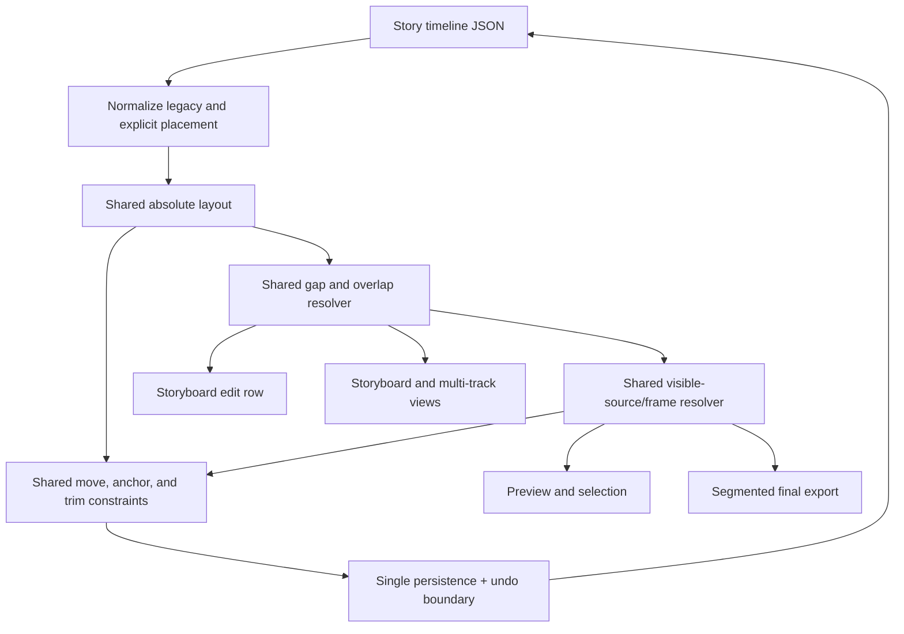
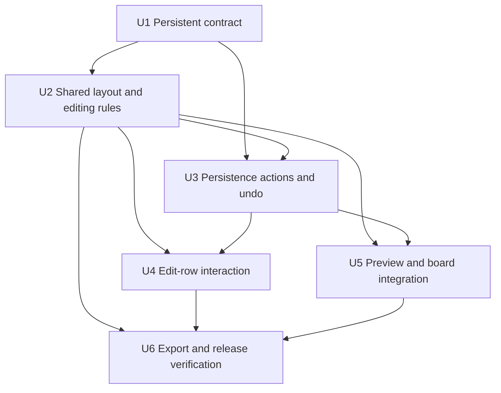
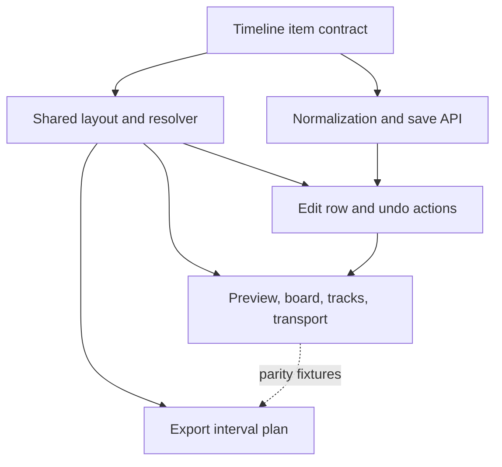

# feat: Add directional group moves and position anchors

## Summary

Extend the existing story timeline item contract with absolute placement, deterministic overlap priority, and persistent position anchors. A shared layout/resolution layer will drive editing, preview, and export so gaps, overlaps, anchored frames, and undo behave identically across every surface.

---

## Problem Frame

The current storyboard edit row derives every shot start by cumulatively adding durations, so moving one shot independently cannot represent a gap or overlap. Playback and export also resolve the timeline separately, which would make a UI-only implementation unsafe: the editor could show one result while the rendered video produces another (see origin: `docs/brainstorms/2026-08-18-storyboard-track-select-position-anchor-requirements.md`).

---

## Requirements

- R1. A left-directed gesture selects the source shot and the contiguous movable shots before it; a right-directed gesture selects the source shot and the contiguous movable shots after it.
- R2. The drag preview identifies the locked direction, selected range, target position, and any anchor boundary; cancellation leaves persisted state unchanged.
- R3. A group move changes absolute timeline placement while preserving every selected shot's duration, story order, and relative spacing.
- R4. Absolute placement supports intentional gaps and overlaps without ripple-closing or forced collision resolution.
- R5. `M` and a discoverable UI command create a position anchor only on a currently visible frame, never in a gap.
- R6. Anchors remain visible on the ruler and owning shot, are keyboard accessible, and can be removed explicitly.
- R7. An anchor preserves its visible source frame at its absolute timeline time and prevents whole-shot movement until the shot's final anchor is removed.
- R8. A shot may own multiple independent anchors.
- R9. The nearest anchored shot truncates a directional group; the anchor and shots beyond it do not move.
- R10. Either trim edge may move toward an anchor but cannot cross it or change the anchored source frame or absolute time.
- R11. An anchored shot wins any overlap; otherwise the most recently moved shot wins, with a stable deterministic tie-break.
- R12. Anchor-constrained moves and trims expose the limiting boundary and a plain-language reason.
- R13. Group move, anchor creation/removal, and anchor-safe trim each persist as one atomic timeline change and one `⌘Z` undo step.
- R14. Marking provides the editing-standard `M` shortcut and a discoverable UI entry that does not require memorizing the shortcut.

**Technical constraints:**

- C1. Existing edit-row transport shortcuts, context-menu actions, `headRef` seek correctness, single-shot reorder commands, and the audio waveform remain intact.
- C2. Existing stories without absolute placement or anchors load as the same contiguous sequence and render without visual or duration regressions.
- C3. Preview, storyboard selection, multi-track display, and final video export use the same gap and overlap resolution rules.
- C4. Every structural timeline time (start, duration, move delta, anchor, insert, split, ripple, undo, and export boundary) uses one canonical integer 30 fps frame grid; millisecond values are compatibility/display projections, not independent editing truth.

**Origin flows:** F1 (directional group move), F2 (create and remove position anchors)

**Origin acceptance examples:** AE1-AE9

---

## Scope Boundaries

- No additional video tracks or automatic promotion of overlaps into temporary tracks.
- No independent group movement or position locking for audio clips.
- No general-purpose marker panel with colors, notes, categories, or search.
- “Marker” in this iteration always means a locking position anchor; non-locking editorial markers remain out of scope.
- Content generation, video generation, material replacement, and rerender entry points remain available. An anchor protects timeline edits from drifting a frame; explicit source activation rebinds covered anchors, while confirmation for uncovered anchors authorizes one atomic “remove affected anchors + activate source” transaction.
- Redo is not added. The existing product contract is atomic `⌘Z` undo only.
- The center six-dot handle becomes the directional group-drag entry. Single-shot story-order changes remain available through the context menu and `⌥←` / `⌥→`, rather than competing for the same drag gesture.

### Deferred to Follow-Up Work

- Rich marker metadata and marker management: a later feature if creators need annotations separate from position locking.
- Multi-track visual editing for overlaps: a later feature; this iteration keeps one visual lane with deterministic winner resolution.
- Audio clip anchors or grouped audio movement: a later audio-editing iteration.
- Automatic overlap-priority compaction: defer until persisted priorities approach the safe-integer limit; this iteration returns an explicit error instead of rewriting every item opportunistically.

---

## Context & Research

### Relevant Code and Patterns

- `shared/storyMaterial.ts` defines `StoryTimelineItem`; the timeline is already persisted as JSON, so this change can use optional additive fields rather than a database schema migration.
- `server/services/storyMaterials.ts` normalizes timeline items and appends missing shots. It is the compatibility boundary for deriving explicit starts for older contiguous stories.
- `server/routers/creationAgent.ts` validates timeline save payloads. Its schema must accept and validate absolute placement, priority, and anchor metadata without trusting malformed frame identities.
- `client/src/features/storyAgent/storyboardTiming.ts` currently builds contiguous start/end rows. It is the natural client integration seam, but the underlying placement and winner logic must move to a shared pure module so the server exporter can use the same rules.
- `client/src/features/creationEditor/CreationEditorContext.tsx` centralizes timeline persistence. Its `saveTimelineItems` snapshot pattern already provides an atomic undo boundary for multi-item operations.
- `client/src/features/creationEditor/timelineUndoStore.ts` snapshots nested video edits and visual clips; anchors require the same defensive deep-copy treatment.
- `client/src/features/creationEditor/storyboardEditRow.ts` contains pure coordinate, shortcut, and menu helpers. Direction locking, group selection presentation, marker commands, and trim constraints should stay testable here or in the new shared editing module.
- `client/src/features/creationEditor/views/StoryboardEditRow.tsx` already has both trim handles, a center drag handle, a context menu, window-capture shortcuts, `headRef`, and the audio waveform row. The new interaction should extend these surfaces without replacing their established focus and keyboard safeguards.
- `client/src/features/creationEditor/views/EditingNleWorkspace.tsx` currently resolves preview sources and derives total duration and cut points from contiguous rows. All of those consumers must use the absolute layout and winner resolver.
- `server/services/videoExport.ts` currently concatenates shots in story order. It must segment the absolute timeline at visibility boundaries, synthesize gap intervals, and trim winning sources before concat.

### Institutional Learnings

- `docs/solutions/2026-06-13-多worktree环境数据分裂收敛.md`: keep one authoritative story/timeline data path and avoid environment-specific state. Implement and verify in the main checkout serving `:3000`.
- `docs/solutions/2026-06-13-故事为唯一单位-镜头按storyId.md`: timeline state remains scoped by `storyId`; absolute placement and anchors belong inside the existing story timeline, not a parallel store keyed only by shot.

### External References

- Product behavior is informed by established editing concepts such as Premiere Pro's forward/backward track selection, DaVinci Resolve's position lock, and Final Cut Pro's position tool/gap model. These are interaction references only; the confirmed origin requirements govern this implementation.
- A conventional marker by itself does not guarantee position locking. This product deliberately combines a visible marker with a position-lock constraint.

---

## Key Technical Decisions

| Decision | Chosen approach | Rationale |
|---|---|---|
| Timeline placement | Persist canonical integer start/duration frames at the existing 30 fps timeline rate while retaining `position` as story order and `plannedDurationMs` as a compatibility projection | Allows exact gaps/overlaps without cumulative millisecond rounding or corrupting narrative order |
| Overlap priority | Persist a monotonic move priority; anchored items outrank it; stable story/id order breaks ties | Makes “recently moved wins” durable across reloads while keeping output deterministic |
| Anchor identity | Persist absolute timeline time plus the visible source identity and source-frame position | Protects the actual picture, not just a time label, during left/right trims |
| Shared truth | Put layout, source-frame mapping, interval segmentation, winner selection, and edit constraints in shared pure modules | Client preview, anchor creation, and server export cannot drift into different interpretations |
| Gesture ownership | Direction locks after an initial horizontal threshold; the selected group then remains stable for the drag | Prevents the group from flipping when the pointer crosses its start point |
| Persistence and undo | Commit only on pointer release and save the complete item array once | One group action maps to one network write and one undo snapshot |
| Compatibility | Derive missing starts cumulatively in normalization; append new shots after the current maximum end | Existing stories remain contiguous, while edited stories preserve gaps and overlaps |
| Export gaps | Use distinct source-segment and generated-gap variants, normalized to the same intermediate media profile | A gap must produce real black/silent duration rather than being skipped and silently closed |

Additional rules:

- Group membership follows `position` story order, not current screen coordinates or overlap priority.
- The nearest anchored shot is excluded and ends the group. If the gesture starts on an anchored shot, the group move is a no-op and the UI explains that the shot is position-locked; the gesture never silently changes its target to a neighboring group.
- Moving a group assigns a new contiguous priority band above the existing maximum while preserving relative priority inside the group.
- Starts are clamped so no moved shot begins before zero. Anchors are selection boundaries, not collision walls: unanchored shots may overlap an anchored shot, but cannot cover it in resolved playback.
- Total duration is the maximum resolved item end, never the final item in story order.
- Structural operations snap once to the canonical frame grid and persist integer frames. A single shared conversion projects frames to milliseconds/seconds for display, media lookup, and FFmpeg; no caller independently rounds `1000 / 30`.
- Empty intervals resolve to black picture and silence. They do not fall back to the previously selected shot.
- Duplicate `M` at the same resolved frame is idempotent. Removing one of several anchors keeps the owning shot movement-locked.
- Within one winning shot, the shared source resolver selects the visual clip with the latest containing offset (stable id tie-break), otherwise the primary source unless `visualClipsReplacePrimary` makes the uncovered interval a gap. It returns source id, source time, effects, and transform as a pure descriptor; media availability errors are reported by the consuming preview/export layer rather than changing the conceptual winner.
- Reverse and playback-rate effects are part of the source-time mapping. Trims are validated through that mapping rather than assuming a forward source: a forward left trim advances the source start, while a reverse left trim moves the source end, with equivalent rules for visual clips.
- Splitting is valid only on a frame boundary that does not bisect an anchored frame. The left child retains the original start, the right child starts at the cut, each anchor moves to exactly one child by its absolute time (an anchor at the cut belongs to the right half-open interval), and both children inherit the prior priority ordering.
- Explicit source activation re-resolves every anchor at its existing absolute time. Covered anchors rebind inside the same server transaction. If the new source produces a gap at an anchor, a confirmation names the affected anchors; confirming atomically removes only those anchors, activates the source, and rebinds the rest. Cancellation writes nothing, failure rolls back everything, and one `⌘Z` restores both selection and anchors.

---

## Open Questions

### Resolved During Planning

- How can old stories remain compatible? Missing absolute starts are derived from the existing `position` and duration sequence at normalization time; no database migration is required.
- How is “this frame” represented without 30 fps drift? Normalize legacy millisecond durations once to integer timeline-frame counts, persist starts/durations/anchors as frame indices, and derive all display/export times from the same rational `frame / 30` conversion.
- How is overlap priority preserved after reload? Store a monotonic move priority rather than relying on ephemeral component state.
- How do preview and export stay consistent? Both consume the same shared interval and winner resolver; neither reimplements anchor/priority comparison.
- How does left trimming preserve an anchor? The item start and source mapping move together, while each anchor's absolute time and source-frame identity remain invariant. Internal visual-clip offsets and primary-video source bounds are adjusted as part of the same constrained edit.
- How do reverse sources preserve an anchor? A shared half-open timeline-offset-to-source-time mapping accounts for reverse, playback rate, visual-clip offset, and frame rounding; both trim edges are derived from that mapping and checked against every anchor.
- How are new timeline items placed once a story contains gaps or overlaps? Normalization only infers starts for legacy load. All post-normalization producers write explicit starts: fact synchronization appends at maximum end; before/after insertion uses the requested boundary and ripples only the following movable run until an anchor; a full ChatCut import emits a new explicit contiguous layout. Split preserves the combined occupied interval. Existing delete behavior is characterized and then expressed explicitly rather than left to normalization inference.
- How are intentional gaps rendered? The export plan has distinct source and gap segment variants. A gap is generated as black video plus silent stereo audio in the same dimensions, frame rate, pixel format, codec, sample rate, and channel layout as normalized source parts before concat.
- Does an anchor block intentional material replacement or rerender? No. It constrains timeline movement and trimming only; explicit source replacement remains user-controlled.
- What happens to anchors on split? A frame-safe split assigns each anchor to one child by its absolute time; a cut that cannot preserve an anchored frame is disabled with a reason.
- What happens to anchors on explicit source replacement? Compatible replacements atomically rebind at unchanged absolute times. For uncovered anchors, confirmation is authorization for one transaction that removes those anchors, activates the source, and rebinds the rest; it is never a separate pre-delete save.

### Deferred to Implementation

- Exact helper names and internal factoring inside the three shared modules may follow implementation evidence, but their public responsibilities remain separate: absolute layout, visible-source mapping, and editing constraints.

---

## High-Level Technical Design

> *This illustrates the intended approach and is directional guidance for review, not implementation specification. The implementing agent should treat it as context, not code to reproduce.*

For any interval at time `t`, the resolver considers items whose half-open range contains `t`. It chooses an anchored candidate first, then the highest persisted move priority, then a stable story/id tie-break. With no candidate, it returns an explicit gap. Anchor creation records the winner and its source-frame position at `t`, so later trim validation can prove that the frame remains unchanged.

Implementation-unit dependencies:

---

## Implementation Units

### U1. Add the persistent absolute-timeline contract

**Goal:** Represent absolute starts, durable overlap priority, and multiple source-aware position anchors while loading old stories unchanged.

**Requirements:** R4, R7, R8, R11, C2, C4

**Dependencies:** None

**Files:**

- Modify: `shared/storyMaterial.ts`
- Modify: `server/services/storyMaterials.ts`
- Test: `server/services/storyMaterials.test.ts`
- Modify: `server/routers/creationAgent.ts`
- Create/Test: `server/routers/creationAgent.timeline.test.ts`
- Audit, then modify only proven full-item constructors that would drop or omit placement: `server/services/shotDerivation.ts`, `server/services/editingTransitionWorkflow.ts`, `server/services/timelineEditAgent.ts`, `server/services/videoTimeline.ts`, `server/services/chatCutXml.ts`, and `shared/timelineVisualClips.ts`
- Test audited producer behavior in: `server/services/shotDerivation.test.ts`, `server/services/editingTransitionWorkflow.test.ts`, `server/services/timelineEditAgent.test.ts`, `server/services/videoTimeline.test.ts`, `server/services/chatCutXml.test.ts`, and `shared/timelineVisualClips.test.ts`

**Approach:**

- Add optional item-level canonical start/duration frames and overlap-priority values plus an array of anchors. Each anchor carries a stable id, absolute timeline frame, owning source kind/id, and source-frame position sufficient to detect drift after trimming. Keep `plannedDurationMs` synchronized as the legacy/display projection.
- Validate all numbers as finite and non-negative, reject malformed anchor/source identities at the API boundary, and normalize arrays defensively.
- In `storyMaterials` normalization, sort by existing story `position`, quantize legacy durations once to canonical frame counts, derive starts cumulatively only when every item is legacy, preserve explicit frame placement, and seed missing priorities deterministically. For defensive mixed legacy/explicit reads, treat missing items as append-only discoveries at current maximum end; API saves after normalization require explicit placement on every item, so no insert-before/after path can rely on this fallback.
- Make every post-normalization producer explicit: fact synchronization appends at maximum end; before/after derivation inserts at the requested boundary and ripples the following movable run only until an anchored shot; ChatCut full import emits a complete contiguous set of starts; split preserves the original occupied interval across two children. Characterize delete behavior and encode its placement transform explicitly rather than allowing normalization to close or create a gap accidentally.
- Keep `position` semantics unchanged. Do not use priority or absolute start to reorder the story.
- Audit item reconstruction paths with targeted search/type evidence. Modify only constructors that actually build a complete `StoryTimelineItem`; keep existing object-spread paths unchanged and do not introduce a generic builder solely for future-proofing.

**Execution note:** Add characterization tests for old contiguous fixtures before changing normalization, then implement the additive contract.

**Patterns to follow:**

- Existing finite-number, duration, `primaryVideoEdit`, and `visualClips` normalization in `server/services/storyMaterials.ts`.
- Existing nested timeline payload validation in `server/routers/creationAgent.ts`.

**Test scenarios:**

- Happy path: an item with explicit start, priority, and two valid anchors normalizes and round-trips without changing any values.
- Covers AE8 (persistence portion). Happy path: multiple anchors on one shot persist independently and survive reload.
- Covers C2. Compatibility: old items with no new fields normalize to their current cumulative starts and retain current story order and total duration.
- Edge case: a defensive mixed legacy/explicit read preserves all explicit starts and appends missing items at successive maximum ends; the next save is fully explicit and never interprets a missing item as before/after insertion.
- Timebase: legacy 33/34 ms frame projections normalize deterministically to the same integer-frame layout across repeated load/save cycles.
- Edge case: a newly appended shot starts at `max(item start + duration)`, including when an earlier story-order item extends past the final item.
- Producer: before/after insertion writes the requested absolute boundary and shifts the following movable run until the first anchor; the anchor and items beyond it remain fixed.
- Producer: a full ChatCut import writes explicit contiguous starts for every item and does not depend on legacy normalization.
- Producer: splitting preserves the original combined occupied interval and partitions anchors once, while deletion follows its characterized explicit placement rule.
- Error path: negative, non-finite, duplicate-id, or source-incomplete anchor payloads are rejected or sanitized according to the existing API/normalization boundary contract.
- Integration: save and reload a timeline with gaps, overlaps, priorities, and anchors; the material returned to the client is structurally equivalent.
- Regression: timeline mutations that rebuild an item preserve starts, priorities, and anchors unless the operation explicitly changes them.

**Verification:**

- Existing contiguous material fixtures remain equivalent after normalization.
- New placement and anchor fields persist through the creation-agent timeline endpoint and every intentional timeline reconstruction path.

### U2. Build shared layout, winner, and constrained-edit rules

**Goal:** Establish one deterministic pure domain layer for absolute rows, gaps, overlaps, group selection, anchoring, and anchor-safe trimming.

**Requirements:** R1, R3-R5, R7-R12, C2-C4

**Dependencies:** U1

**Files:**

- Create: `shared/timelineLayout.ts`
- Test: `shared/timelineLayout.test.ts`
- Create: `shared/timelineSource.ts`
- Test: `shared/timelineSource.test.ts`
- Create: `shared/timelineEditing.ts`
- Test: `shared/timelineEditing.test.ts`
- Modify: `client/src/features/storyAgent/storyboardTiming.ts`
- Test: `client/src/features/storyAgent/storyboardTiming.test.ts`

**Approach:**

- Produce absolute timing rows from normalized integer frames, calculate total duration with maximum end, enumerate cut boundaries from all starts/ends, and resolve each interval as an explicit shot winner or gap. Centralize frame-to-ms/seconds projection so client and FFmpeg cannot choose different rounding.
- Centralize winner comparison: any shot that owns at least one anchor is in the anchored tier throughout its effective interval; anchored candidates outrank unanchored candidates, then higher move priority wins, followed by a stable tie-break. The same comparison must be usable by client and server.
- Resolve the winning item's visible source through a second shared pure contract. Given item-local time and available-source metadata, return an explicit gap, primary source, or visual clip plus source id/time, effects, and transform. Preserve the current latest-containing-visual-clip rule and make missing-media reporting separate from conceptual source selection.
- Select directional groups by `position`: include the source when movable and stop before the nearest anchored item. An anchored source returns a position-locked no-op rather than proxy-selecting neighboring shots.
- Quantize one pointer delta to integer frames for the whole group, clamp it at the earliest selected start so no start becomes negative, retain all relative offsets/durations, and allocate the next safe priority band once per committed move. Reject overflow explicitly; do not compact priorities in this iteration.
- Add idempotent anchor creation from a resolved visible source and explicit anchor removal by id. A gap returns a typed no-op reason.
- Constrain left and right trims against all anchors using half-open frame intervals. Derive source bounds through the shared timeline-offset-to-source-time mapping, including reverse, playback rate, clip offsets, and the repository's established frame rounding. Both edges must preserve each anchor's absolute time and recorded source-frame identity and keep at least one frame of content.
- Split only at frame-safe boundaries, preserve the combined occupied interval, and partition anchors by absolute time into exactly one child. Treat a cut that would bisect an anchored frame as a typed blocked result.
- Keep the existing client timing API as a compatibility adapter while migrating consumers; do not allow it to silently reconstruct a contiguous sequence once explicit starts exist.

**Execution note:** Implement domain behavior test-first because the overlap and trim invariants are easier to prove in pure fixtures than through UI tests.

**Patterns to follow:**

- Existing frame conversion and timing helpers in `client/src/features/creationEditor/storyboardEditRow.ts` and `client/src/features/storyAgent/storyboardTiming.ts`.
- Existing visual-clip offset semantics in `shared/timelineVisualClips.ts`.

**Test scenarios:**

- Covers AE1. Happy path: A/B/C/D receive a left group move from C; A/B/C share the same delta, preserve spacing and duration, and D is unchanged.
- Covers AE2. Happy path: a right move leaves an explicit gap and creates an overlap without reordering or snapping.
- Covers AE6. Boundary: an anchored C truncates a left group from E to D/E; A/B/C remain unchanged and the returned boundary identifies C.
- Boundary: initiating on anchored C returns a position-locked no-op and never selects or moves an adjacent item.
- Edge case: a negative drag delta is clamped once for the group, preserving all internal offsets.
- Covers AE7. Overlap: a recently moved unanchored shot wins; an anchored shot wins regardless of lower priority; stable order resolves equal-priority ties.
- Gap: querying a time between items yields an explicit gap and total duration remains the maximum end.
- Covers AE3 / AE4. Anchor: creation on a visible resolved frame records the winner; creation in a gap returns no anchor and a user-facing reason; repeating `M` on the same frame is idempotent.
- Covers AE5. Trim: left and right trims stop before the nearest anchor, preserve multiple anchors' absolute/source frame values, and keep one frame of content.
- Source parity: the same local time resolves to the same primary/visual source id and source time in client and server descriptors; latest-containing visual clip wins internal overlap and `visualClipsReplacePrimary` creates a gap outside clip coverage.
- Trim matrix: primary source and visual clip, each forward and reverse, preserve anchor source time across both left and right trims at normal and non-1x playback rates.
- Frame boundary: non-integer source-frame durations follow one characterized half-open rounding rule and never move an anchor by one frame.
- Timebase stability: repeated positive/negative moves, reload, undo, and export planning return every start/anchor to the identical integer frame with no cumulative 33/34 ms drift.
- Split: anchors before/at/after a frame-safe cut belong to the correct single child (at-cut belongs right); a cut through an anchored frame returns a blocked reason.
- Error path: invalid duration, missing source, or an anchor inconsistent with its owner produces a safe no-op/validation result rather than partial mutation.
- Compatibility: old contiguous items produce the same rows, cut points, winner, and duration as the current timing helper.

**Verification:**

- One pure fixture can be passed to both client and server consumers and yields identical gap/overlap intervals and winners.
- Every move and trim operation either returns a complete valid item array or a typed no-op; it never mutates the input partially.

### U3. Add atomic persistence actions and deep undo snapshots

**Goal:** Expose group move, anchor add/remove, and edge-aware trim as reliable editor actions with one save and one undo step per gesture.

**Requirements:** R3, R7, R8, R10, R13, C4

**Dependencies:** U1, U2

**Files:**

- Modify: `client/src/features/creationEditor/CreationEditorContext.tsx`
- Modify: `client/src/features/creationEditor/timelineUndoStore.ts`
- Test: `client/src/features/creationEditor/timelineUndoStore.test.ts`
- Create/Test: `client/src/features/creationEditor/CreationEditorContext.timeline.test.tsx`
- Modify: `server/services/videoTimeline.ts`
- Test: `server/services/videoTimeline.test.ts`
- Modify: `server/routers/creationAgent.ts`
- Test: `server/routers/creationAgent.timeline.test.ts`

**Approach:**

- Add context actions that accept an already-resolved group move, anchor mutation, trim edge, frame-safe split, or source rebind and delegate transformation rules to U2.
- Persist exactly once after a successful pointer release or command. Preview-only pointer movement stays local and does not write history.
- Reuse `saveTimelineItems` so each successful operation records the entire prior item array as one snapshot. On persistence failure, retain/refetch the last authoritative timeline and surface the existing error channel rather than keeping optimistic partial placement.
- Deep-copy anchor arrays and their nested source identity in undo snapshots and equality checks.
- Keep the existing undo-only model and global `⌘Z` executor. Do not add redo.
- Ensure subsequent duration, clip, add-shot, delete-shot, or reorder saves preserve placement/anchor fields. Split partitions anchors into one child each and deleting an item deletes its owned anchors.
- Extend source selection through one server-side transaction spanning the selected video segment and story timeline JSON. Compatible anchors rebind; when confirmation authorizes removal of uncovered anchors, removal, source activation, and remaining rebinds commit or roll back together. Record the combined before-state as one undo operation.
- Serialize timeline mutations while a save is pending so duplicate pointer release, repeated `M`, or a second drag cannot calculate from stale placement. Preserve focus/selection on failure and make refetched authoritative state visible.

**Execution note:** Start with failing action/undo integration tests so the single-write and rollback boundaries are fixed before wiring the UI.

**Patterns to follow:**

- `saveTimelineItems`, `reorderShotInTimeline`, and `undoTimeline` in `client/src/features/creationEditor/CreationEditorContext.tsx`.
- Snapshot cloning and equality in `client/src/features/creationEditor/timelineUndoStore.ts`.

**Test scenarios:**

- Covers AE9. Integration: moving five shots performs one save, pushes one snapshot, and one `⌘Z` restores all five starts and priorities.
- Happy path: anchor add and removal each perform one save and can each be undone atomically.
- Covers AE8. Happy path: removing one of two anchors keeps the shot locked; removing the final anchor allows a later move.
- Happy path: an anchor-constrained trim commits its adjusted placement/source mapping once and undo restores duration, start, clips, edits, and anchors.
- Split: a frame-safe split creates two correctly placed children, partitions anchors exactly once, and undoes atomically; a blocked anchored-frame split performs no save.
- Source replacement: a compatible replacement rebinds all anchors at unchanged absolute times in one transaction.
- Source replacement with gaps: cancelling the affected-anchor confirmation performs zero writes; confirming removes only named uncovered anchors, activates the source, and rebinds the rest atomically; injected failure leaves both old source and all anchors intact; one undo restores both.
- No-op: cancelled drag, zero effective delta, duplicate anchor, and blocked trim perform no save and add no undo entry.
- Concurrency: a duplicate pointer release, repeated `M`, or second mutation during a pending save cannot create duplicate anchors, duplicate history, or stale placement.
- Error path: a rejected save does not leave locally visible moved items and does not consume or corrupt the prior undo snapshot.
- Snapshot isolation: mutating current anchor/source objects after saving does not mutate the stored undo state.
- Regression: existing reorder, duration, visual-clip, split, add, and delete actions retain current undo behavior.

**Verification:**

- Network/persistence spies observe one mutation per completed user operation and none during preview.
- One undo invocation restores the complete pre-operation timeline, including nested anchor metadata.

### U4. Implement directional drag and accessible anchor controls in the edit row

**Goal:** Make group movement and position anchors visible, predictable, keyboard-accessible editing interactions while preserving the current edit-row toolset.

**Requirements:** R1-R2, R5-R6, R9, R12-R14, C1, C4

**Dependencies:** U2, U3

**Files:**

- Modify: `client/src/features/creationEditor/storyboardEditRow.ts`
- Test: `client/src/features/creationEditor/storyboardEditRow.test.ts`
- Modify: `client/src/features/creationEditor/views/StoryboardEditRow.tsx`
- Test: `client/src/features/creationEditor/views/StoryboardEditRow.test.tsx`
- Preserve/integrate: `client/src/features/creationEditor/views/StoryboardAudioWaveform.tsx`

**Approach:**

- Reassign the center six-dot grip to a horizontal group-drag gesture. On hover/focus it shows left/right group-move affordances and an accessible description; pointer down before threshold previews the two candidate sides without committing. After crossing a small threshold, lock the direction from the initial horizontal intent, calculate group membership once, and keep that group stable even if the pointer later moves back across the origin. Touch uses the same pointer threshold and candidate preview without a hover dependency.
- During drag, render a non-persistent ghost/range for every selected shot plus concise labels for direction, group extent, delta/target time, zero clamp, and anchor boundary. Pointer cancel, Escape, lost capture, or no effective delta clears the preview.
- On release, submit one group move action. An anchored source is position-locked, so its drag remains blocked and never retargets an adjacent group.
- Render anchor marks both on the ruler and inside their owning shot, but expose one keyboard stop per anchor: the ruler marker is the interactive control and the in-shot mark is its visual counterpart. Use roving focus in chronological order; arrow keys move between markers, Enter opens its actions, and Delete/Backspace removes it. After removal, focus the nearest remaining marker or the owning shot when the last marker is removed.
- Add `M` to the existing window-capture shortcut model. Resolve from `headRef.current`, not potentially stale reported playhead state. Handle it when the visible editing workspace or one of its ordinary buttons owns focus; ignore text inputs/contenteditable, open menus/dialogs, modified/repeated key events, a hidden edit row, or focus outside the editing workspace. Preserve `defaultPrevented` and do not interfere with Space/Enter button activation rules.
- Add context-menu commands for adding an anchor at the playhead and removing the focused/target anchor, with disabled reasons for gaps, duplicate frame, missing source, or invalid target.
- Use one observable interaction state at a time: idle, candidate/locked preview, blocked, saving, or error. Put blocked reasons and save results in the existing edit-row status surface with polite live announcement; disable conflicting timeline mutations while saving, and preserve the triggering focus/selection across success or rollback.
- Keep both trim handles, all transport and selection shortcuts, current context-menu actions, `headRef`/`reportedHeadRef` synchronization, audio waveform, and single-shot reorder via menu and `⌥←` / `⌥→`.

**Patterns to follow:**

- Existing window-capture keyboard filtering and menu-model disabled reasons in `client/src/features/creationEditor/storyboardEditRow.ts`.
- Existing pointer capture and trim preview/commit behavior in `client/src/features/creationEditor/views/StoryboardEditRow.tsx`.
- Existing accessible button/label patterns in storyboard tests.

**Test scenarios:**

- Covers AE1 / AE6. Gesture: initial left or right motion locks the expected group; reversing pointer direction later changes delta but not group membership.
- Discoverability: hover, keyboard focus, and touch pointer-down expose left/right candidate ranges and the handle's new accessible group-move description before the threshold is crossed.
- Threshold: small pointer jitter never commits; crossing the threshold locks exactly once.
- Covers R2. Gesture: drag preview lists the selected extent and target; pointer cancel, Escape, lost capture, and zero delta clear it without calling persistence.
- Boundary: the nearest anchor appears as the hard edge and items beyond it are absent from the preview.
- Boundary: dragging from an anchored source is blocked with a position-lock reason and never previews or moves a neighboring group.
- Covers AE3. Shortcut: with focus on a non-text UI control, `M` uses the current intended playhead and creates one visible ruler mark and one shot mark.
- Covers AE4. Shortcut/menu: in a gap, `M` and the menu do not create a mark and announce the reason.
- Idempotency: pressing `M` twice on the same source frame creates one anchor and no second save.
- Accessibility: each anchor contributes one tab/roving-focus stop with shot/time semantics; its duplicate in-shot mark is not a second stop; arrow navigation, Enter, deletion, and post-delete focus work with multiple and final anchors.
- Covers AE8. Removal: deleting one of multiple marks leaves the shot lock indicator; deleting the final mark removes it.
- Covers AE5 / R12. Trim feedback: both handles stop at the calculated anchor constraint and display the reason rather than jumping through it.
- Regression: space/J-K-L/navigation/I-O/Escape shortcuts, context-menu editing, left/right trim, audio waveform, and `headRef` rapid-key sequences still pass.
- Shortcut scope: `M` works from ordinary controls inside the visible editing workspace, but not from text/contenteditable, an open menu/dialog, repeated/modified keys, hidden row, or focus outside the workspace; existing Space/Enter button focus behavior is unchanged.
- Pending/error state: repeated release or `M` while saving is ignored, a failure announces the error and restores layout, and focus remains usable.
- Regression: `⌥←` / `⌥→` and context menu still reorder a single shot in story order and do not change absolute placement semantics unexpectedly.

**Verification:**

- The row communicates selection and constraints before commit, and every marker operation is usable by keyboard.
- No pointer-move event writes timeline data; release produces a single action.

### U5. Unify storyboard, preview, and playback on absolute layout

**Goal:** Make every client surface show and play the same gap/overlap winner while retaining centered-playhead scrolling and existing manual-scroll grace behavior.

**Requirements:** R4, R7, R11-R12, C1-C4

**Dependencies:** U2, U3

**Files:**

- Modify: `client/src/features/storyAgent/storyboardTiming.ts`
- Test: `client/src/features/storyAgent/storyboardTiming.test.ts`
- Modify: `client/src/features/creationEditor/views/EditingNleWorkspace.tsx`
- Test: `client/src/features/creationEditor/editingWorkspaceLayout.test.ts`
- Modify: `client/src/features/storyAgent/views/StoryboardReviewBoard.tsx`
- Create/Test: `client/src/features/storyAgent/views/StoryboardReviewBoard.timeline.test.tsx`

**Approach:**

- Replace last-row-end assumptions with maximum end and use absolute starts for row widths/positions, cut-point navigation, range selection, waveform scale, and transport bounds.
- Route preview source selection through the shared resolver. At a gap, render the intentional black/empty preview state and do not fall back to `selectedShot` or the preceding shot.
- For overlaps, resolve the winning shot first, then use the shared source descriptor to select its primary video or internal visual clip at winner-relative time. Preview/export adapters supply media availability and paths but do not re-decide source/frame identity.
- Drive shot selection/follow from the resolved winner, not merely the latest story-order interval. Anchored winners remain stable even when a recently moved shot overlaps them.
- Draw the single-lane overlap without inventing a new video track: the winner remains full-height and on top, while each obscured shot exposes a labeled, keyboard-focusable overlap strip in a compact gutter. Selecting/focusing a strip temporarily raises that shot's edit controls (handles, menu, group grip) for interaction without changing playback priority; Escape returns interaction focus to the resolved winner. An anchored winner still leaves lower strips reachable.
- Ensure the centered red playhead remains stationary during playback while the intended timeline content scrolls, and retain the board's 2.5-second manual-scroll grace.
- Keep audio waveform timing anchored to its existing absolute audio duration; this iteration does not independently move audio.

**Execution note:** Add gap and overlap characterization fixtures before replacing the existing contiguous lookup helpers.

**Patterns to follow:**

- Current `buildStoryboardTimingRows`, `resolveTimelineVideoSource`, and `findShotAtTime` integration in `client/src/features/creationEditor/views/EditingNleWorkspace.tsx`.
- Existing selected-shot follow, centered playhead, and manual scroll grace in `client/src/features/storyAgent/views/StoryboardReviewBoard.tsx`.

**Test scenarios:**

- Compatibility: a legacy contiguous story produces the same selected shot, cut points, transport duration, visual positions, and preview source.
- Covers AE2. Gap/overlap: moved items render at absolute positions; a gap remains visible and an overlap is not ripple-collapsed.
- Gap playback: seeking or playing through an empty interval shows black/empty preview, no stale shot image, and no false selected-shot change.
- Covers AE7. Overlap playback: the most recently moved shot wins unless any overlapping candidate is anchored, in which case the anchored shot wins.
- Overlap editing: every obscured shot exposes a labeled strip; pointer and keyboard selection reveal its trim/menu/group controls without changing the resolver winner, and Escape restores winner interaction.
- Anchored overlap: an anchored winner remains visible while lower unanchored and anchored candidates remain independently selectable through their strips.
- Multiple boundaries: starts and ends at the same frame produce one deterministic cut point without zero-length playback intervals.
- Total duration: an earlier story-order shot ending latest controls the transport and render duration.
- Follow behavior: real playback updates the storyboard winner while the red playhead stays centered; manual board scrolling suppresses follow for 2.5 seconds and then resumes.
- Regression: the lower timeline does not resume unwanted auto-scroll behavior from the prior implementation.
- Integration: the edit row, preview panel, selected storyboard column, multi-track lane, and shared source descriptor identify the same winner, source id, and source time at several gap/overlap/anchor timestamps.
- Regression: the audio waveform remains aligned to absolute time and is unaffected by visual group movement.

**Verification:**

- At any sampled playhead time, all client surfaces agree on gap versus shot and on the winning shot/source.
- Existing centered-playhead, transport, manual-scroll, and shortcut behavior remains usable in a visible real browser session.

### U6. Make export match the resolved timeline and complete release verification

**Goal:** Render gaps, overlaps, and anchors exactly as previewed, then document and verify the complete feature without disturbing unrelated worktree changes.

**Requirements:** R4, R7, R11, C2-C4

**Dependencies:** U1, U2, U4, U5

**Files:**

- Modify: `server/services/videoExport.ts`
- Test: `server/services/videoExport.test.ts`
- Modify: `docs/features/feature-ledger.json`
- Test: existing feature-ledger validation coverage through `scripts/validate-feature-ledger.test.ts`

**Approach:**

- Build raw item ranges, collect every absolute item and internal-source boundary, and partition the timeline into non-zero adjacent intervals.
- Ask the shared item and source resolvers for each interval's winner and source-frame mapping. Represent the result as a discriminated source segment, intentional-gap segment, or missing-source placeholder. The latter keeps diagnostics distinct from a creative gap while preserving identical absolute duration.
- Coalesce adjacent segments only when they have the same source and continuous source mapping. Never coalesce across a winner, anchor, or source discontinuity that would alter frame identity.
- Extend the existing FFmpeg runner to branch on the segment variant. Source segments keep file probing and interval-level trims. Intentional gaps and relaxed-mode missing-source placeholders bypass file probing and use FFmpeg lavfi black color plus silent stereo audio, normalized to the selected output dimensions, 30 fps, yuv420p/H.264, 48 kHz stereo AAC intermediate MP4 before concat.
- Strict missing-media mode fails the export without publishing a partial result. Relaxed mode emits an equal-duration black/silent placeholder and records the missing-source diagnostic; it never deletes time or shifts later anchors. Compute reported duration and segment count from successfully generated source/placeholder parts, whose total must equal the resolved timeline duration.
- Add the feature to the ledger with its owning surfaces, tests, and invariants. Treat preview/export parity and legacy compatibility as release gates.
- Before each implementation unit, record HEAD and hashes for its owned hot files; if HEAD or a target hash changes before write/verification, stop that unit and reconcile rather than overwriting. Before the full suite and browser acceptance, require a brief pause from other writers, record the target hash manifest, and verify it again afterward. If a stable interval cannot be obtained, report focused results only and do not claim full regression. Never reset, stash, or broad-checkout the shared working tree.

**Execution note:** Establish export-plan tests from the same shared fixtures used by preview before modifying FFmpeg assembly.

**Patterns to follow:**

- Existing per-shot source normalization, strict/relaxed missing-video handling, and concat pipeline in `server/services/videoExport.ts`.
- Existing feature cards and validation rules in `docs/features/feature-ledger.json`.

**Test scenarios:**

- Compatibility: an old contiguous timeline produces the same ordered sources, trims, and total duration as the current export plan.
- Gap: a two-second empty interval produces exactly two seconds of black picture and silence between source segments.
- Covers AE7. Overlap: moved-priority winner segments replace hidden source intervals; an anchored source wins the same interval regardless of lower move priority.
- Boundary: simultaneous starts/ends and zero-length boundaries do not emit invalid segments.
- Source mapping: a winner interval inside a trimmed primary video or visual clip uses the correct source in/out values and playback rate.
- Reverse mapping: forward/reverse primary and visual sources export the same source id/time sequence reported by the shared descriptor at interval boundary samples.
- Coalescing: continuous adjacent intervals from one source merge; discontinuous or differently resolved intervals remain separate.
- Error path: a winning shot with unavailable video fails strict export; relaxed export emits an equal-duration placeholder with a missing-media diagnostic, while a deliberate gap is not misreported as missing media.
- Absolute-time preservation: missing A at 0-3 s followed by an anchor/gap and C at 5-8 s leaves C at 5 s in relaxed output rather than shifting it to 0 s.
- Runner: gap/placeholder segments never perform a filesystem existence check, generate normalized black/silent parts, and contribute exact frame duration; the sum of all generated parts equals the resolved maximum end.
- Integration: shared fixtures sampled in the client resolver and server export plan yield the same sequence of gap/winner intervals and total duration.
- Ledger: the new feature card references existing files/tests, contains no duplicate id, and passes repository validation.
- Browser acceptance: execute AE1-AE9 on `localhost:3000/editing`, reload after code changes, verify real playback rather than seek-only simulation, and undo every test mutation so the user story has zero net change.
- Full regression: type checking, focused creation-editor/storyboard/export suites, and the complete test suite pass from a stable snapshot of the shared checkout.

**Verification:**

- A rendered test story with both a gap and an overlap matches visible preview timing and priority frame-for-frame at every boundary sample.
- Feature-ledger validation, type checking, focused tests, full tests, and real-browser AE1-AE9 all pass.

---

## System-Wide Impact

- **Interaction graph:** pointer/keyboard commands produce pure timeline transforms, `CreationEditorContext` persists one item-array mutation, returned material feeds shared layout, and layout feeds every client surface plus server export.
- **Error propagation:** invalid or blocked edits return a reason before persistence; persistence failures use the current error/toast path and restore authoritative state; export still distinguishes unavailable source media from intentional gaps.
- **State lifecycle risks:** partial group writes, shallow-copied anchors, duplicate `M`, non-monotonic priority allocation, and reload normalization could drift state. Atomic array saves, deep snapshots, idempotency, and deterministic fallback rules mitigate these.
- **API surface parity:** shared TypeScript types, router validation, server normalization, editor persistence, client resolvers, and exporter all change together. Import/agent paths that reconstruct items are audited for preservation.
- **Integration coverage:** pure resolver fixtures prove cross-runtime semantics; context tests prove save/undo boundaries; browser tests prove pointer/focus/playback behavior; export-plan tests prove delivery parity.
- **Unchanged invariants:** `position` remains story order; one story owns one timeline; audio is not independently edited; explicit rerender/material replacement remains available; current keyboard transport and single-shot reorder commands remain.

---

## Risks & Dependencies

| Risk | Mitigation |
|---|---|
| Preview and export choose different overlap winners | Share interval/winner logic across client and server and reuse identical fixtures in both test suites |
| Legacy stories shift when new fields are absent | Characterize current contiguous timing first; derive missing starts only in the normalization boundary |
| Left trim preserves time but changes the visible source frame | Persist source-aware anchors and test primary video, playback rate, and internal visual-clip mapping |
| A group drag writes many intermediate states or undo steps | Keep drag preview local and commit the complete group once on release |
| Persisted move priority approaches the safe-integer limit | Reject the move with a clear error in this iteration; leave whole-array priority compaction to follow-up work |
| Gap playback leaks a stale selected image | Make gap an explicit resolver result and test preview/selection fallback paths |
| Export gaps create FFmpeg stream-format mismatches | Generate gaps through the same normalized intermediate format as real segments before concat |
| Relaxed missing-media export compresses later absolute times | Emit an equal-duration diagnostic placeholder instead of skipping the interval; strict mode publishes nothing |
| Independent millisecond rounding drifts anchors by one 30 fps frame | Persist canonical integer frames and require every move, reload, undo, preview, and export path to share one conversion |
| Source activation removes anchors before activation succeeds | Use one server transaction and one combined undo snapshot for selection, removals, and rebinds |
| Concurrent agents modify the same hot files during implementation | Record HEAD/file hashes per unit, stop on drift, and obtain a user-confirmed writer pause plus matching pre/post hash manifest before claiming full-suite results |
| Browser automation mutates the user's story | Use reversible paired operations or `⌘Z`, verify the undo toast/state, and report any unavoidable persisted change |

---

## Phased Delivery

1. **Domain foundation:** U1 and U2 establish additive persistence and pure deterministic rules with no UI behavior exposed.
2. **Editing transaction:** U3 and U4 wire atomic actions, directional drag, visible anchors, shortcuts, and constraints.
3. **Parity integration:** U5 moves all client playback/display consumers to absolute layout.
4. **Delivery parity and release:** U6 updates export, ledger, regression coverage, and real-browser acceptance.

Do not ship the editing gesture before U5 and U6 are complete: allowing users to persist gaps/overlaps while preview or export still assumes contiguity would create misleading and potentially destructive projects.

---

## Documentation / Operational Notes

- Add a feature-ledger card describing directional group selection, position-anchor invariants, shortcut `M`, overlap priority, undo, and preview/export parity.
- No database schema migration or environment-variable change is expected because timeline items are JSON and the new fields are additive.
- Existing stored timelines can remain lazy-compatible; normalization supplies missing starts. Avoid a broad data backfill unless implementation discovers an external consumer that requires materialized fields.
- Browser acceptance must run against the main checkout on port 3000. Reload the page after implementation changes because prior work established unreliable HMR for this component.
- Use real browser key events and visible playback for final acceptance. Direction keys must be emitted as `ArrowLeft` / `ArrowRight`; test automation must not infer behavior from hidden-tab `requestAnimationFrame` playback.
- Full-regression and browser claims require a stable writer interval. If another session continues modifying target files, record the focused checks that passed and defer the full claim rather than testing a moving snapshot.

---

## Sources & References

- **Origin document:** [`docs/brainstorms/2026-08-18-storyboard-track-select-position-anchor-requirements.md`](../brainstorms/2026-08-18-storyboard-track-select-position-anchor-requirements.md)
- Related type: `shared/storyMaterial.ts`
- Related normalization: `server/services/storyMaterials.ts`
- Related client timing: `client/src/features/storyAgent/storyboardTiming.ts`
- Related interaction: `client/src/features/creationEditor/views/StoryboardEditRow.tsx`
- Related workspace integration: `client/src/features/creationEditor/views/EditingNleWorkspace.tsx`
- Related export: `server/services/videoExport.ts`
- Institutional learning: `docs/solutions/2026-06-13-多worktree环境数据分裂收敛.md`
- Institutional learning: `docs/solutions/2026-06-13-故事为唯一单位-镜头按storyId.md`
