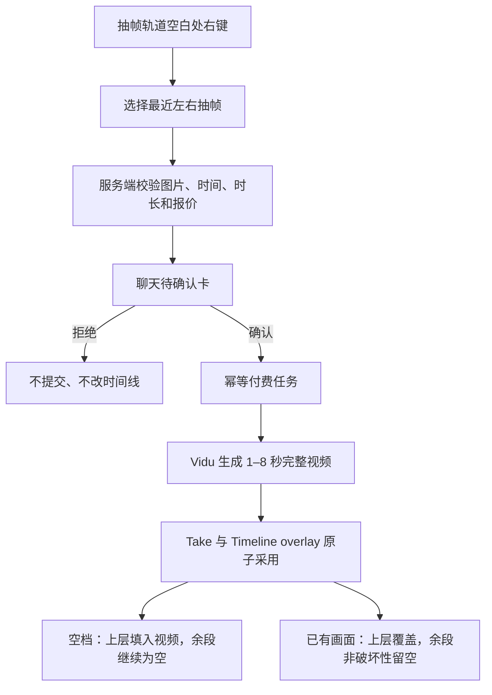
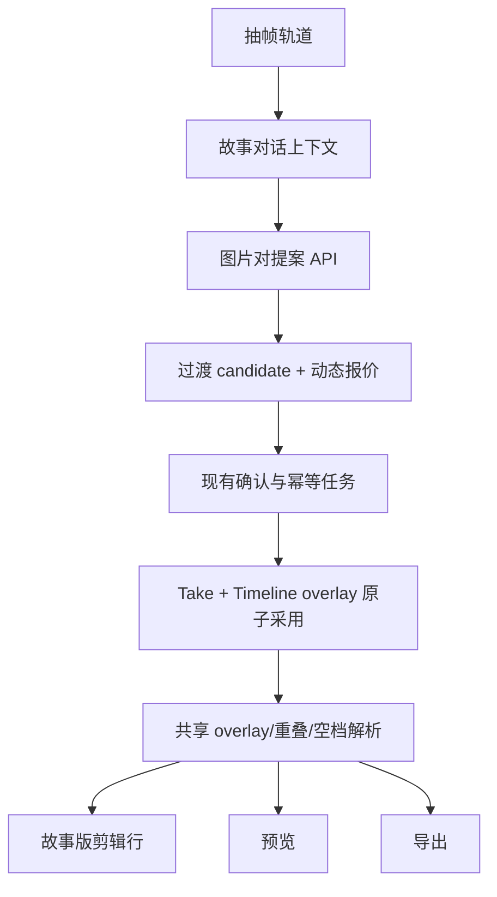

# feat: /editing 剪辑台现状与抽帧上层覆盖生成

## Summary

本文是 `/editing` 的合并主文档：前半部分记录 2026-08-19 晚至 8 月 20 日上午已经完成并验证的轻量剪辑台能力；后半部分记录“两张抽帧生成持久上层覆盖视频”的产品规则、实施方案与最终验收。历史需求与计划保留为来源，不再作为下一轮重复施工清单。

在故事版的“抽帧 · 上层”轨道中，用户右键两张抽帧之间的空白区域，系统用点击位置左右最近的两张抽帧作为首帧和尾帧，先在聊天中生成一张带真实价格的待确认卡；只有用户确认后才提交付费生成。生成结果从左侧抽帧的绝对时间开始摆放为持久上层覆盖片段：不新增 story shot，不改变下面 30 个故事镜头的数量、顺序、时长或素材。

两张抽帧的时间间隔决定完整覆盖区间，但 Vidu Q2 Turbo 只接受 1–8 秒整数时长。实现将请求“不超过区间、且不超过 8 秒”的最长完整整数秒视频；实际视频完整显示，不拉伸、不复制尾帧。没有视频覆盖到的剩余区间明确留空，即使下面原本有镜头也只做非破坏性遮罩、不删除底层数据。

## Implementation Result（2026-08-20）

- 已完成抽帧轨空白处右键入口、左右最近抽帧配对、1–8 秒整数时长、动态报价和现有聊天确认卡接入。
- 已完成持久 Timeline overlay、完整媒体播放、尾段显式 gap、锚点优先、预览/剪辑线/导出统一解析；不创建 story shot。
- 已完成服务端标准提案重构校验，客户端篡改 candidateId、时长、价格、提示词或镜头归属会在创建付费 Take 前被拒绝。
- 已完成重复提交保护、过期 submitting claim 的收单未知保护，以及已付费视频在无关时间线版本变化后的安全重新采用。
- 真实 `main:3000` 已验证：页面有 7 张抽帧；在 `00:02.893` 与 `00:06.201` 之间右键出现“用左右抽帧生成 3 秒覆盖视频…”，点击后出现含两张端点图、`302 点 / ¥0.69` 的待确认卡。未点击付费确认。
- 最终自动化验证：全仓 `306/306` 个测试文件、`2483/2483` 条测试通过；TypeScript、功能账本和 `git diff --check` 均通过。
- 真实数据保持：story `#1186` 为 30 镜、timeline 30 项、原 `0102` 存在；因未付费确认，持久 overlay 数为 0。

---

## Problem Frame

时间线已经可以在任意播放头位置抽取静帧，并把抽帧显示在独立上层轨道；也已经具备“主视频轨真实空档右键 → 聊天确认卡 → 付费生成 → 创建故事镜头”的过渡链路。但现有提案入口只接受两个相邻镜头身份，且确认后会创建 story shot；它无法直接把两张已抽取的静帧当作明确首尾画面，也不符合本轮已经确认的 B 方案——“生成持久上层覆盖片段，不新增或重排下面故事镜头”。

当前工作区还包含大量未提交且互相交织的时间线改动。本计划只做最小增量，不进行跨分支合并，不重写已有拖动、锚点、抽帧、确认卡或供应商提交逻辑。

---

## Part I — 已完成的 `/editing` 工作（事实基线）

### 1. 界面与播放体验

- 已有按真实时长显示的完整剪辑时间条，播放时看板与镜头内容跟随，播放控制区保持稳定。
- 播放红线尽量保持在视口中央；“剧本”行、剪辑行无用空白和两个多余图标已经移除。
- 剪辑轨下方已有声音变化参考轨；语音轨位于更靠下的位置。音频、字幕和语音保持原绝对时间，不随画面镜头拖动。
- 每个剪辑块显示对应画面缩略图；镜头较多或重叠时支持压缩显示，选中后展开具体内容。

### 2. 已有镜头剪辑能力

- 右键菜单固定保留 9 项：添加位置锚点、删除位置锚点、切一刀、抽帧（存成画面）、选中整镜交给聊聊、往前挪一位、往后挪一位、在后面加一镜、删除镜头。
- 已删除不直观的“时长 ±1 帧、±0.5 秒”菜单项，本计划不得恢复。
- 镜头左右两侧都能调整长度；拖镜头本体只移动当前镜头；六点抓手向左带左侧连续镜头、向右带右侧连续镜头。
- 位置锚点锁定绝对时间并拥有重叠优先级；锚点仍是移动与覆盖的硬约束。
- “切一刀”会创建两个真实故事镜头和两个时间线项目；“在后面加一镜”使用 story + timeline 原子写入并紧跟当前镜头；删除按 exact stable ID 定位。

### 3. 抽帧与上层轨

- 右键“抽帧（存成画面）”和快捷键 `F` 已可用。
- 抽帧作为 generatedImages 素材持久化，并按原绝对时间显示在剪辑轨上方的独立“抽帧 · 上层”轨道。
- 点击抽帧会跳回对应时间并选中来源镜头；刷新后可以从素材记录恢复。
- 当前真实页面基线可见 7 张抽帧。已经完成的是静帧轨与素材落位；两帧合成覆盖视频仍未实现。

### 4. 快捷键与撤销

- 已有：空格播放/暂停，`J/K/L` 倒放/停止/正放，方向键逐帧/逐秒，上下键跳切点，`Home/End` 头尾，`I/O` 入出点，`Esc` 取消，`S/⌘K` 切割，`F` 抽帧，`X` 交给聊聊，`M` 位置锚点。
- 快捷键使用 window capture 并避开文本输入控件，不再依赖时间条焦点；同步播放头 ref 已修复快速 `I → ↓ → O` 读旧位置的问题。
- `Cmd+Z/Ctrl+Z` 会等待 pending save；时间线移动、删除镜头和切一刀已有安全撤销。revision 变化但内容未变时可撤销，内容真的变化时拒绝覆盖。

### 5. 已修复的结构问题

- “在后面加一镜”不再只写 story 后被 timeline 补到末尾；现在 story 与 timeline 原子保存、位置连续、失败不留半完成状态。
- 删除后的自动重存不再让安全撤销误判；删除操作保存删除后 story 快照，以内容一致性区分自动 revision 与真实后续编辑。

### 6. 数据事故与不可破坏基线

- 真实测试曾按视觉位置误删原始 `0102`，已从 `.webdev/backups/local-persist-2026-08-20T04-09-27-670Z.json` 精确恢复。
- story `#1186` 当前应为 30 镜、timeline 30 项；原 `0102` exact stable ID 为 `manual-sh02-mrd7x0lw-efi428`；错误临时镜头不存在。
- 后续任何真实新增、切割、删除或覆盖操作只能使用接口返回的 exact stable ID，禁止根据“第几个视觉块”猜身份。
- 尚未执行“0101 后新增临时镜头 → exact stable ID 删除”的真实零净变化测试；它包含真实删除，必须另行获得用户授权。

### 7. 最近验证证据与未完成项

- 已通过：`server/routers.storyAgent.test.ts` 54/54；`client/src/features/creationEditor` 42 个文件、331 个测试；`npx tsc --noEmit`；`git diff --check`；`localhost:3000/healthz` 返回 200。
- 真实页面已确认 30 镜、7 张抽帧、抽帧轨、剪辑轨和精简后的右键菜单。
- 尚未统一提交；main 工作区混有多个 Agent 的改动；尚未在最后修复后重新跑整个仓库全量测试；未做预览或生产部署。

---

## Assumptions

- 用户确认同时支持两种落点：主轨空档被新视频填充；已有画面区间由新视频非破坏性覆盖。
- 两针间隔是目标区间，不要求供应商视频强行铺满。区间为 3.4 秒时请求 3 秒；区间大于 8 秒时请求 8 秒；不足 1 秒时不创建付费提案并说明原因。
- 两针定义目标覆盖区间。实际生成视频从左针开始完整显示；视频结束早于右针时，余段使用现有显式 gap/黑场语义留空，即使下面原本有镜头也暂时不可见；实际媒体略长时可以越过右针，但须经过生成后的锚点复查。两种情况都不修改底层镜头数据。
- 两张抽帧可以来自同一镜头、不同镜头或非相邻镜头，只要都属于当前故事、仍存在，并带有可验证的时间线抽帧时间。
- 用户已选择 B：生成结果是 timeline 级持久上层覆盖片段，不创建 story shot，不增加或重排下面故事镜头；付费 Take 业务归属到当前故事与左针来源镜头，覆盖位置只由两针绝对时间决定。

---

## Requirements

- R1. 用户只能在“抽帧 · 上层”轨道中两张抽帧之间的空白区域触发该功能；点在抽帧缩略图上仍执行查看/定位，不打开生成菜单。
- R2. 系统按点击时间选择严格位于左侧和右侧的最近抽帧；任一侧缺失、两帧时间相同或图片已失效时不创建提案。
- R3. 菜单与待确认卡明确展示首帧、尾帧、目标区间、实际请求时长、预计点数和人民币成本。
- R4. 创建提案不调用模型、不扣费、不修改故事和时间线；只有确认动作能进入付费提交。
- R5. 客户端只提交当前故事 ID 和两个 imageId。服务端重新读取图片归属、图片 URL、抽帧时间和所属镜头，不信任客户端传来的 URL、时间、镜头号或价格。
- R6. 请求时长为 `min(8, floor(右针时间 - 左针时间))` 秒；结果不足 1 秒时禁用确认并解释原因。供应商返回的视频保持完整速度和完整时长，不做拉伸、补帧或 1.4 秒后冻结尾帧。确认卡须预告“实际媒体可能略超右针”；成功采用后展示真实占用范围。
- R7. 同一认证用户、故事、首尾图片、抽帧事实、绝对起点、请求时长、规范化提示词、供应商及模型版本产生稳定的付费身份；timeline version 只作为 overlay 采用乐观锁，不改变已付费任务身份。重复确认或恢复查询不得重复付费提交。
- R8. 确认成功后，新上层覆盖片段从左针对应的 30fps 绝对帧开始，持续实际生成视频的完整时长，并获得高于当前未锚定底层镜头的叠放优先级；story shots 数量、顺序和内容保持不变。
- R9. 新视频落在空档时填充空档；与既有镜头重叠时覆盖实际视频范围；视频结束到右针之间显示显式空档。底层镜头数据、故事顺序、时长和素材不被删除或裁剪。
- R10. 用户拒绝卡片、供应商失败、故事切换、图片删除、时间线版本漂移或 overlay 采用失败时，不得留下半条覆盖或部分时间线写入；已经取得 taskId 的任务继续沿用同一任务查询。重新提案只刷新采用乐观锁版本，不改变不可变付费事实或再次提交 302。
- R12. 现有单镜头拖动、六点抓手批量移动、位置锚点、主轨空档建镜头、抽帧查看和普通聊天生成链路保持原行为。
- R13. 完成后更新功能账本并提供自动化测试、真实 `main:3000` 浏览器验证和账本校验证据。
- R14. 若完整目标区间与任何位置锚点所属镜头相交，提案阶段即阻止付费并定位冲突；不得改变“锚定镜头绝对优先”的既有不变量。只有供应商实际媒体不可预知地越过右针时，才允许在生成后发现新增锚点冲突；此时保留已付费 Take、禁止自动采用并明确说明原因。
- R15. 除鼠标右键外，聚焦抽帧轨道后可用 Context Menu 键或 `Shift+F10` 打开同一入口；菜单关闭时焦点返回触发点。
- R16. 上层覆盖必须持久化在 TimelineDocument 的独立可选集合中；刷新、预览、剪辑行和导出读取同一集合，不复用当前仅存在于 React 内存的 `extraLayers/layerAssignments`，也不把跨镜头覆盖硬塞进某个 StoryTimelineItem 的内部 visualClips。

---

## Scope Boundaries

- 不把两针之间超过 8 秒的区间拆成多个付费任务。
- 不用慢放、循环、冻结尾帧、AI 补帧或黑色视频强行填满目标区间。
- 不删除、裁剪或涟漪移动被覆盖的底层镜头。
- 不为本功能新增持久撤销 operation 或数据库迁移；抽帧绝对时间继续从已持久化的标准备注恢复，并把解析规则共享给前后端。
- 不允许普通图片历史、当前主图或手动导入但没有“时间线抽帧”时间的图片冒充轨道针点。
- 不在本轮增加多段生成、可变模型选择、分辨率选择或提示词高级编辑器。
- 不处理三个既有 worktree 的合并、清理或提交。
- 不创建新的 story shot，不改变下面故事镜头的 position，不把上层覆盖伪装成“在左针镜头后插入一镜”。
- 不新增“撤销后再次采用付费素材”的生命周期。Overlay 的持久一步撤销若未来需要，单独设计 operation 记录与迁移。

### Deferred to Follow-Up Work

- 超过 8 秒区间的自动分段生成与无缝拼接。
- 用户显式选择“剩余区间留空”或“恢复底层画面”的遮罩模式；本轮按已确认行为固定留空。
- 把抽帧时间从图片备注迁移到独立结构化字段。
- 触屏长按或“两针选择后显式生成”入口；本轮先保证桌面右键与键盘等价入口。
- Overlay 采用的持久一步撤销及“撤销后再次采用”素材生命周期。

---

## Context & Research

### Relevant Code and Patterns

- `client/src/features/creationEditor/views/StoryboardEditRow.tsx` 已渲染独立抽帧轨道，也实现了主剪辑轨真实空档右键菜单；新入口应复用相同的菜单生命周期、状态提示和事件冒泡约束。
- `client/src/features/creationEditor/storyboardEditRow.ts` 已能从抽帧图片备注恢复绝对毫秒时间；该解析规则需要移动或提取到前后端均可使用的共享纯函数。
- `client/src/features/storyAgent/views/StoryboardReviewBoard.tsx` 已把图片历史中的时间线抽帧映射成轨道针点，是 UI 候选集合的事实来源。
- `client/src/features/storyAgent/StoryAgentContext.tsx` 已能把直接提案结果注入聊天消息、持久化对话并复用确认/拒绝卡片；新增入口只扩展参数，不另建第二种卡片状态机。
- `server/services/timelineEditAgent.ts` 已定义图片型端点、稳定 candidate 和空档提案；新提案应共享 candidate 构建与提示词规则，但不再依赖“两个故事镜头必须相邻”。
- `server/services/editingTransitionWorkflow.ts` 已覆盖图片归属复查、幂等 claim、302 任务续查、视频落盘和旧入口的故事镜头插入；本轮只复用付费生成阶段，并新增明确的 overlay apply 分支。
- `server/services/videoTransition302.ts` 已实现 Vidu Q2 Turbo 的 1–8 秒整数限制及动态点数/人民币估价，应成为确认卡价格的唯一来源。
- `shared/timelineLayout.ts` 已定义 30fps 绝对位置、重叠赢家与安全叠放优先级；新 overlay 采用必须使用同一套规则。
- `shared/storyMaterial.ts` 的 TimelineDocument 当前只有 story items，适合通过可选 additive 字段增加持久 overlay 集合，无需数据库表迁移；overlay 必须有自己的稳定 id、Take 来源、绝对起止帧、媒体时长、gap 尾段和 stackOrder。
- `client/src/features/creationEditor/views/StoryboardEditRow.tsx` 中的 `extraLayers/layerAssignments` 当前只是本地 React 状态，不能作为 B 方案的持久事实来源；现有 StoryTimelineItem.visualClips 又只表达单个故事镜头内部片段，不能承担跨多个底层镜头的绝对覆盖。

### Existing Feature Ledger Constraints

- `storyboard-position-anchors` 当前为 `observing`。必须保持 30fps 整数帧、最大结束时间片长、锚定镜头绝对优先和空档真实存在；其已支持的移动、打标、取消锚点和安全裁剪继续保持一次保存与一次撤销。本计划不扩大该撤销契约到付费插入。
- `start-end-shot-video` 当前为 `working`。Vidu Q2 Turbo 只接受 1–8 秒，首尾帧必须作为硬约束，供应商原始视频不能被无意降级或拉伸。

### Institutional Learnings

- `docs/solutions/2026-06-13-多worktree环境数据分裂收敛.md`：只能在主仓库的 `main:3000` 做运行验证，禁止在 worktree 启动第二个服务或写入业务数据。
- `docs/solutions/2026-06-13-故事为唯一单位-镜头按storyId.md`：图片、镜头、时间线提案和付费任务都必须由 `storyId + userId` 重新校验，不建立脱离故事归属的平行状态。

### Related Planning Context

- `docs/brainstorms/2026-08-18-storyboard-track-select-position-anchor-requirements.md` 和 `docs/plans/2026-08-18-001-feat-storyboard-position-anchors-plan.md` 定义了绝对时间、重叠、锚点、空档和撤销不变量。本计划扩展内容生成入口，但不修改其已确认的拖动与锚点产品规则。
- 2026-08-20 `/editing` 工作报告把“两帧作为首尾帧，在上层形成覆盖镜头，不改变下面镜头顺序”记录为已确定产品方向；用户随后明确选择 B，因此本计划将付费生成与 overlay apply 分离，不再沿用旧工作流的 story-shot apply。

---

## Key Technical Decisions

| Decision | Chosen approach | Rationale |
|---|---|---|
| 左右针选择 | 以右键点击时间为界，取严格最近的左针和右针 | 与用户“点两帧之间空白”的心智一致，也能在三张以上抽帧中得到稳定结果 |
| 时间真实性 | 服务端从真实图片记录的标准抽帧备注恢复时间 | 防止客户端伪造绝对位置或把普通图片冒充抽帧 |
| 时长量化 | 取区间秒数向下取整，再封顶 8 秒 | 供应商只接受整数秒；理论请求不越过右针，实际媒体若略长则完整视频优先并显式预告实际占用范围 |
| 视频展示 | 保留供应商返回视频的完整速度与完整长度 | 用户明确要求“显示完整的视频”，不通过拉伸或裁切伪造区间长度 |
| 覆盖语义 | 新 overlay 在两针完整区间内成为赢家：前段播放生成视频，余段解析为显式 gap；底层镜头保留 | 同时满足空档填充、已有画面覆盖和“没有的直接空出来”，并保持数据非破坏性 |
| 付费安全 | 扩展现有 candidate、claim 和 taskId 续查机制 | 避免建立第二条付费状态机或在并发确认时重复扣费 |
| 覆盖容器 | TimelineDocument 增加独立、可选、持久 overlay 集合 | B 方案不创建 story shot；覆盖可跨越多个底层镜头，并让剪辑行、预览和导出共享事实来源 |
| 采用一致性 | 付费 Take 的 applied 状态与 timeline overlay 一次原子写入 | 防止“素材显示已采用但时间线上没有覆盖”或反向的半成品状态 |
| 锚点冲突 | 目标区间在提案阶段检查；真实媒体越右针后再检查实际占用范围 | 保持锚点绝对优先；可预知冲突不付费，不可预知的越界冲突保留 Take 但禁止自动采用 |
| 收敛策略 | 只改当前主工作区相关逻辑，暂不合并其他 worktree | 当前未提交改动交织，先保证功能边界和验证证据，再单独处理提交收敛 |

---

## High-Level Technical Design

> *下图只说明预期的数据流，供方案审阅；它是方向性指导，不是要求照抄的实现规格。*

三种区间行为：

| 两针间隔 | 付费请求 | 时间线结果 |
|---|---:|---|
| 小于 1 秒 | 不提交 | 说明区间太短，现状不变 |
| 1–8 秒且含小数 | 向下取完整整数秒 | 从左针显示完整视频，尾部不足 1 秒留空 |
| 大于 8 秒 | 8 秒 | 从左针显示完整 8 秒，剩余区间留空 |

---

## Implementation Units

### U5. 固化接手前变更归属基线

**Goal:** 在不清理、不暂存、不重置当前脏工作区的前提下，准确区分接手前已有改动与本功能新增 delta。

**Requirements:** R12, R13

**Dependencies:** None

**Files:**

- No repository file changes; baseline artifacts live under a task-specific temporary directory outside the repository
- Audit: every repository file listed by U1-U4 and U6 before its first edit

**Approach:**

- 保存开始时的 `git status`、目标文件完整 diff、未跟踪文件清单和定向测试结果，作为只读接手基线。
- 另存 story `#1186` 的只读事实基线：30 镜、30 个 timeline 项、原 `0102` exact stable ID 存在。不得把视觉上的“第几个块”转换成删除、切割或覆盖目标。
- 对每个已脏目标文件标记本功能允许修改的组件、函数或逻辑块；禁止整文件恢复、格式化、机械重写或跨分支搬运。
- 每个实施单元结束后查看“当前状态相对接手基线”的新增 hunks；发现必须覆盖基线已有逻辑时暂停并向用户说明影响。
- 最终交付只把基线之后可归属的 hunks 计入本功能成果；无法归属的 hunk 单独列出，不擅自提交或删除。
- 任何涉及真实新增后删除、恢复备份或清理临时镜头的零净变化测试都必须单独获得用户授权；默认浏览器验收只使用可撤销/非破坏性路径和接口返回的 exact stable ID。

**Patterns to follow:**

- `docs/environment-guide.md` 的单主仓库运行约束。
- `docs/solutions/2026-06-13-多worktree环境数据分裂收敛.md` 的数据与 worktree 收敛经验。

**Test scenarios:**

- Test expectation: none -- 本单元只建立只读归属基线，不改变产品行为。

**Verification:**

- 任一最终新增 hunk 都能归属到 U1-U4 或 U6 中的一个目标行为。
- 接手前已有删除、未跟踪文件和无关改动保持原样。
- story `#1186` 在非破坏性验收前后仍为 30 镜/30 个 timeline 项，原 `0102` stable ID 仍存在。

### U1. 建立抽帧配对与区间规则

**Goal:** 把“点击位置左右最近抽帧”“标准备注时间恢复”和“1–8 秒完整时长”变成可复用、可独立验证的纯规则。

**Requirements:** R1, R2, R6, R12, R15

**Dependencies:** U5

**Files:**

- Modify: `client/src/features/creationEditor/storyboardEditRow.ts`
- Test: `client/src/features/creationEditor/storyboardEditRow.test.ts`
- Create or Modify: `shared/extractedFrameTransition.ts`
- Test: `shared/extractedFrameTransition.test.ts`

**Approach:**

- 共享解析器只识别当前标准格式和已有旧格式，不接受任意数字字符串。
- 配对规则按时间、再按稳定图片 ID 排序；只有严格跨过点击位置的一左一右构成候选。
- 时长规则向下取整并封顶 8 秒；不足 1 秒返回带原因的不可提案结果，而不是偷偷改成 1 秒。
- 纯规则不读取 React 状态、不访问数据库，也不产生付费副作用。

**Execution note:** 先写边界测试，再迁移现有抽帧时间解析，避免上层轨道在重构过程中丢失既有针点。

**Patterns to follow:**

- `client/src/features/creationEditor/storyboardEditRow.ts` 中现有时间换算、命中与菜单纯函数。
- `shared/timelineLayout.ts` 的 typed ok/blocked 结果和 30fps 量化方式。

**Test scenarios:**

- Happy path: 三张抽帧位于 1、4、9 秒，点击 6 秒时选中 4 秒与 9 秒两张，而不是轨道首尾两张。
- Edge case: 点击恰好落在缩略图时间上时不把该图同时当作左针或右针。
- Edge case: 左侧或右侧没有抽帧、两帧时间相同、普通图片无抽帧备注时返回不可提案原因。
- Duration: 3.4 秒间隔得到 3 秒请求；8 秒得到 8 秒；12.7 秒仍为 8 秒；0.9 秒被阻止。
- Compatibility: 当前标准备注和已有旧备注都恢复相同毫秒值，普通素材备注仍返回空。
- Timebase: 左针毫秒转换到 30fps 后重复计算结果稳定，不积累 33/34ms 漂移。

**Verification:**

- 相同抽帧集合与点击时间始终得到同一对图片、同一起点帧和同一请求时长。
- 现有抽帧轨道测试不因解析器共享化而回归。

### U6. 建立持久的 Timeline 上层覆盖契约

**Goal:** 让生成视频成为独立于 story shots 的持久绝对覆盖片段，并成为剪辑行、预览和导出的共同事实来源。

**Requirements:** R8, R9, R12, R14, R16

**Dependencies:** U5

**Files:**

- Modify: `shared/storyMaterial.ts`
- Modify: `shared/timelineLayout.ts`
- Modify: `shared/timelineSource.ts`
- Test: `shared/timelineLayout.test.ts`
- Test: `shared/timelineSource.test.ts`
- Modify: `server/services/storyMaterials.ts`
- Test: `server/services/storyMaterials.test.ts`
- Modify: `server/routers/creationAgent.ts`
- Test: focused timeline payload tests under `server/routers.creationAgent.test.ts` or the existing timeline router test file

**Approach:**

- 给 TimelineDocument 增加可选 additive overlay 集合；旧故事没有该字段时行为完全不变，不需要数据库表迁移。
- 每个 overlay 保存独立稳定 ID、Take/来源镜头归属、30fps 绝对起点、目标右针、实际媒体范围、完整覆盖结构范围、stackOrder、transform/effects 和首尾 imageId 追踪信息。
- Overlay 的结构范围取两针目标区间与实际媒体时长的较大值；媒体结束早于右针时，余段返回显式 gap；媒体略晚于右针时完整媒体范围继续有效。
- 共享 resolver 先应用既有锚点硬约束，再在未锚定候选中比较 overlay 与底层 story item 的 stackOrder。Overlay 不进入 story `position`、不参与故事镜头数量或排序。
- 正规化、API payload 验证、克隆和相等性检查都保留未知旧故事兼容性，并防止无效帧、无效 Take 或重复 overlay ID 落库。
- 当前本地 `extraLayers/layerAssignments` 只作为 UI 参考，不升级为事实来源；现有 item.visualClips 继续只表达单镜头内部片段。

**Execution note:** 先用纯 fixture 固定“旧故事无 overlay”“跨多个底层镜头覆盖”“视频尾段 gap”和“story shots 完全不变”，再接入持久化。

**Patterns to follow:**

- StoryTimelineItem 的 additive 30fps placement/stackOrder/anchors 契约。
- `server/services/storyMaterials.ts` 对旧 timeline JSON 的防御性正规化。
- `shared/timelineSource.ts` 的显式 source/gap 结果，而不是上一帧画面回退。

**Test scenarios:**

- Compatibility: 没有 overlays 字段的 30 镜故事正规化、预览与导出结果和当前完全一致。
- Persistence: 一个跨越三个底层镜头的 overlay 保存、刷新并回读后，ID、绝对帧、Take 和 stackOrder 不漂移。
- Non-destructive: 添加 overlay 前后 story shots 数量、stable ID、position、时长和素材逐项相同。
- Gap tail: 12.7 秒目标区间加 8 秒媒体时，前 8 秒解析为 overlay 视频，后 4.7 秒解析为显式 gap，即使下面存在底层镜头。
- Actual overrun: 实际媒体略长于目标右针时 overlay 结构范围随完整媒体延长，并在无锚点时保持可见。
- Anchor: 任何与锚定镜头相交的 overlay 采用被阻止；已经存在的防御性脏数据仍由锚定底层镜头获胜。
- Validation: 负帧、结束早于开始、未知 Take、重复 overlay ID 或跨故事 Take 被 API/正规化边界拒绝或安全过滤。

**Verification:**

- 一份 TimelineDocument fixture 在剪辑行、预览 resolver 和导出计划中得到相同 overlay/gap 结果。
- 加入或移除 overlay 不改变任何 story shot。

### U2. 扩展服务端图片提案与动态报价

**Goal:** 用两个真实 imageId 生成与现有过渡镜头相同的待确认 candidate，同时在付费前锁定可验证的绝对落点、时长和报价。

**Requirements:** R3-R7, R10, R14, R16

**Dependencies:** U1, U6

**Files:**

- Modify: `server/routers/creationAgent.ts`
- Test: `server/routers.creationAgent.test.ts`
- Modify: `server/services/timelineEditAgent.ts`
- Test: `server/services/timelineEditAgent.test.ts`
- Modify: `server/services/videoTransition302.ts` only if existing estimator cannot be consumed directly
- Test: `server/services/videoTransition302.test.ts` only if estimator behavior changes

**Approach:**

- 新提案 mutation 使用现有登录保护；认证主体只能来自服务端 session/context，绝不从请求体接收 userId。入口只接收 storyId、leftImageId 和 rightImageId；服务端先校验 story 归属，再按 `imageId + storyId + actorUserId` 读取两张 generatedImages，统一处理不存在与无权访问，校验图片 URL、抽帧备注和所属镜头身份。
- 允许同一镜头、不同镜头和非相邻镜头的图片配对；删除“镜头必须相邻”约束，但只对新的 image-pair 提案入口放宽，现有主轨空档入口保持相邻约束。
- Candidate 使用明确的 image-pair/overlay placement 变体，不伪装成 provisional story shot；纳入稳定 overlay ID、绝对起点帧、右针帧、整数请求时长和动态报价。付费身份由认证用户、故事、图片对、重新导出的抽帧事实、起点、时长、规范化提示词、provider 与 model/version 组成；timeline version 单独作为 overlay 采用乐观锁。
- 确认接口不接受客户端重算价格；服务端使用 Vidu 估价器生成并再次验证点数与人民币成本。
- 提案阶段用共享绝对布局检查完整目标区间；只要与锚定镜头相交就返回 blocked，并给出冲突区间，不生成可确认的付费卡。
- 提案回复和卡片明确区分目标区间与实际生成时长，避免用户误以为超过 8 秒的部分会被补齐。

**Execution note:** 从服务端失败测试开始，先证明跨故事图片、无抽帧时间和短于 1 秒都在付费入口之前 fail closed。

**Patterns to follow:**

- `proposeGapTransition` 的无模型提案、稳定 candidate 与 plain-language blocked 结果。
- `timelineTransitionCandidateInput` 的服务端确认重校验。
- `estimateViduQ2TransitionCny` 的供应商一致报价。

**Test scenarios:**

- Happy path: 当前故事的两张有效抽帧生成 image/image candidate，携带左针绝对帧、右针绝对帧、正确整数时长和动态报价，且不调用供应商。
- Happy path: 两张图来自同一镜头或非相邻镜头时仍可提案。
- Security: 任一 imageId 属于另一故事、另一用户、已删除或没有可用 URL 时拒绝，不泄露图片详情。
- Auth: 请求体无法覆盖 session user；未登录请求和跨租户枚举使用统一失败语义，且不会创建 candidate。
- Validation: 客户端伪造 URL、时间、镜头号、时长或价格没有入口；确认时以服务端真实记录为准。
- Edge case: 两针倒序、同时间、间隔不足 1 秒或抽帧备注损坏时返回 blocked。
- Pricing: 1 秒、3 秒和 8 秒 candidate 的点数及人民币估价与 Vidu 估价器一致。
- Regression: 现有相邻镜头 `proposeGapTransition` 仍固定执行原有相邻性与素材可用性检查。
- Anchor: 目标区间与任一锚定镜头相交时在提案阶段阻止，供应商调用次数为零。

**Verification:**

- 生成提案期间没有 302 请求、视频 Take、故事写入或时间线写入。
- Candidate 的所有付费与落点关键字段都能由服务端事实重新导出。

### U3. 支持绝对位置的幂等生成与上层采用

**Goal:** 用户确认后复用现有付费工作流生成完整视频，并按左针绝对位置原子采用为持久上层 overlay，不创建 story shot。

**Requirements:** R6-R10, R12, R14, R16

**Dependencies:** U2, U6

**Files:**

- Modify: `server/services/editingTransitionWorkflow.ts`
- Test: `server/services/editingTransitionWorkflow.test.ts`
- Modify: `server/services/videoTransition302.ts`
- Test: `server/services/videoTransition302.test.ts` and `server/services/videoTransition302.hardcut.test.ts`
- Modify: `server/db.ts` to extend the existing durable claim slot and atomically apply Take state + Timeline overlay; no new schema migration
- Test: `server/db.editingTransitionSubmissionClaim.test.ts` and/or a focused atomic overlay-apply test when the DB boundary changes
- Modify: `client/src/features/storyAgent/StoryAgentContext.tsx`
- Test: existing or focused `StoryAgentContext` transition tests
- Audit, then modify only if parity is not already guaranteed: `client/src/features/creationEditor/views/EditingNleWorkspace.tsx`, `server/services/videoExport.ts`
- Test parity in: `client/src/features/creationEditor/editingWorkspaceLayout.test.ts` or a focused preview test, and `server/services/videoExport.test.ts`

**Approach:**

- 将现有 candidate 的固定 2 秒约束扩展为供应商支持的 1–8 秒整数，同时保留旧 2 秒 candidate 的兼容确认。新的 image-pair candidate 禁用现有 `cutAtSec=1.4` 后冻结尾帧的后处理，直接采用供应商完整运动视频；旧相邻镜头 candidate 继续原行为。
- 付费提交继续使用同一 durable claim、taskId、下载、落盘和重试状态机；进程内 Promise 只做优化，数据库唯一身份和 compare-and-set 状态才是并发事实来源。Image-pair claim slot 纳入两张 imageId、抽帧起点与时长，不能再只按 source/target 镜头身份占槽。
- 每次确认在取得或推进付费 claim 前，用 session 用户和 candidate storyId 重查两图并重新导出时间、起点、时长、URL、所属镜头和锚点冲突；事实变化则 fail closed。若 taskId 已经存在，只续查原任务，不重新 POST；资源失效时保留 Take，但禁止自动采用。
- Image-pair 采用不再要求两个端点镜头在故事顺序上相邻，也不调用 `insertedTransitionShot` 或修改 story body。付费 Take 归属当前故事和左针来源 stable ID；Timeline overlay 拥有自己的稳定 identity。
- Overlay 从候选中的左针绝对帧开始，结构时长取“两针目标间隔”与“实际完整视频时长”的较大值，并分配安全的新 stackOrder。前段读取完整 Take；媒体早于右针结束时，余段解析为显式 gap；媒体略晚于右针时 overlay 随完整媒体延长。
- Timeline overlay 与付费 Take 的 applied 状态在一个原子边界内收敛；story body 完全不参与写入。版本漂移时保留已生成素材但拒绝猜测采用位置，用户重试时沿用同一任务。
- 供应商实际媒体若略长于请求整数秒，完整视频优先，实际 clip 可以越过右针；采用结果和确认卡必须显示真实结束时间。生成完成后按 `[左针, 实际视频结束)` 再做一次锚点交集检查；若越界尾段碰到锚点，保留已付费 Take、禁止自动采用并明确提示，绝不重提。明显异常的媒体时长按现有媒体有效性规则阻止自动采用，不静默裁切。
- Take 中保存不可变的付费事实（用户/故事、图片对、抽帧事实、提示词、provider/model、时长和 taskId），不把旧的 overlay-apply expected version 当作永久事实。版本漂移后重新提案复用同一付费身份与 Take，只刷新当前 timeline 的采用乐观锁，再尝试一次原子采用。

**Execution note:** 先扩展现有幂等、并发确认和原子 overlay 采用测试，再改变 candidate 时长与采用规则。

**Patterns to follow:**

- `confirmEditingTransition` 的并发 Promise 共享、submission claim 和 taskId 续查。
- 现有 transition claim 的付费安全状态机；只复用生成阶段，不复用创建 story shot 的 apply 阶段。
- Timeline 保存的 expected version 与 U6 overlay 正规化。
- `moveTimelineGroup` 的安全 stackOrder 分配与重叠赢家语义。

**Test scenarios:**

- Happy path: 3 秒 candidate 只提交一次 3 秒供应商任务，完整视频从左针绝对帧开始成为上层 overlay，story shots 仍为原数量与顺序。
- Gap: 新视频范围内没有底层镜头时填充该范围，视频结束后的剩余目标区间解析为 gap。
- Overlap: 新视频与两个既有镜头重叠时，前段视频成为赢家，尾段显式 gap 也遮住底层画面；底层项目所有字段保持不变。
- Duration cap: 12.7 秒目标区间只生成并采用完整 8 秒，后续 4.7 秒显示为空，不产生冻结帧、重复帧、拉伸或底层画面回退。
- Full motion: 新 image-pair candidate 不执行 1.4 秒 hard-cut/freeze，导出视频的运动持续到供应商完整成片结束；旧 candidate 仍执行原有后处理。
- Actual media: 供应商元数据与请求时长有可接受差异时，以落盘视频的真实完整时长占用时间线，不裁掉视频尾部。
- Post-generation anchor: 实际媒体越过右针并碰到右针后的锚定镜头时，不自动采用，保留同一 Take 并返回冲突；供应商提交次数仍为一。
- Same-shot endpoints: 两张图来自同一镜头时创建独立 overlay 并覆盖原镜头区间，不创建新的故事镜头。
- Idempotency: 同镜头内两组不同 imageId/时间的候选拥有不同 durable slot；同一候选的重复确认、跨进程并发确认、available Take 重用和 processing task 续查都最多一次付费提交、一次 overlay 采用。
- Version drift: 已取得 taskId 后时间线版本变化，首次采用因旧 overlay 锁失败；重新提案复用原 candidateId/Take/taskId，仅刷新 apply expected version，并以新版本成功采用，供应商提交次数仍为一。
- Atomicity: 注入 timeline overlay 或 applied 状态写入失败时，两者都不留下半成品；story body 始终不写。
- Regression: 旧的固定 2 秒相邻镜头过渡 candidate 继续走原有“创建故事镜头”确认与插入，不被 B 方案改写。
- Resolver parity: 同一保存后的时间线在故事版、播放器与导出计划中，对“前段视频 + 尾段 gap + 普通底层重叠”得出相同结果；锚点相交则在提案阶段已被阻止。

**Verification:**

- 对同一 candidate 的任何重试路径都可证明最多一次供应商提交。
- 新 overlay 的绝对起点、实际时长和重叠赢家在保存与刷新后结果稳定，story shots 完全不变。

### U4. 接入抽帧轨道右键菜单与聊天确认卡

**Goal:** 让用户在抽帧轨道上可发现、可预览、可取消地完成“选两针 → 看报价 → 确认生成”。

**Requirements:** R1-R4, R12-R15

**Dependencies:** U1, U2, U3

**Files:**

- Modify: `client/src/features/creationEditor/views/StoryboardEditRow.tsx`
- Test: `client/src/features/creationEditor/views/StoryboardEditRow.test.tsx`
- Modify: `client/src/features/creationEditor/views/EditingNleWorkspace.tsx`
- Test: `client/src/features/creationEditor/editingWorkspaceLayout.test.ts` or a focused workspace integration test
- Modify: `client/src/features/storyAgent/views/StoryboardReviewBoard.tsx`
- Test: `client/src/features/storyAgent/views/StoryboardEditRow.test.tsx` and/or a focused review-board mapping test
- Modify: `client/src/features/storyAgent/StoryAgentContext.tsx`
- Test: focused StoryAgent context/chat transition test
- Modify: `client/src/features/storyAgent/views/StoryAgentChat.tsx` only if the existing card cannot already display variable duration and dynamic quote
- Test: existing or focused `StoryAgentChat` transition card test when rendering changes
- Modify: `docs/features/feature-ledger.json`

**Approach:**

- 抽帧轨道拥有自己的空白区右键处理。DOM 命中缩略图区域时永不触发空白菜单；只有轨道背景按滚动/缩放后的 x 坐标计算点击时间。重叠缩略图、贴边和狭窄空隙都遵循该规则。
- 同一“抽帧 · 上层”区域同时显示静帧针点和持久视频 overlay：针点仍是小缩略图；生成结果是按绝对时长铺开的独立上层视频块。两者使用不同命中目标，视频块不会被误当成新的左右针。
- 聚焦轨道后，Context Menu 键或 `Shift+F10` 在当前播放头位置打开同一菜单；Esc 关闭并把焦点还给触发轨道。触屏等价入口明确延期，不用不可发现的长按临时顶替。
- 菜单预览两张带“首帧/尾帧、时间码、所属镜头”标签的缩略图、两针时间、目标间隔、实际生成时长和明确留空区间；加载中显示占位，任一图片失败时禁用付费动作并提供重新选择提示。
- Workspace 将 imageId 对传给 StoryAgentContext；Context 复用现有“用户消息 + 服务端提案 + 助手确认卡 + 对话持久化”路径。
- 卡片继续使用现有确认/拒绝按钮和任务状态，只把固定 2 秒文案改为 candidate 的动态时长与报价。
- 提案注入成功后确保聊天面板可见并滚动到新卡；不强抢正在使用键盘的时间线焦点，轨道 live status 同时提供“查看确认卡”动作。采用成功后定位并高亮抽帧上层轨中的新 overlay，说明“视频覆盖区间 + 留空区间 + 底层保留”，下面故事镜头行不新增块。
- 提案、确认、失败和成功都保留当前故事作用域检查；故事切换后旧菜单或旧卡片不能写入新故事。
- 完成后在功能账本中为持久用户能力建立或扩展功能卡，记录入口、权威代码、测试证据、依赖、8 秒上限和剩余区间行为。

**Execution note:** UI 测试先覆盖事件命中和“提案不扣费”，最后再做主仓库 `main:3000` 的真实浏览器验证。

**Patterns to follow:**

- 主剪辑轨空档菜单的 focus、pending、status message 和防重复触发行为。
- `proposeGapTransitionCard` 的故事作用域检查、消息注入和对话持久化。
- 现有 `EditingTransitionCard` 的确认、拒绝、processing、retryable 和 submissionUnknown 状态。

**Test scenarios:**

- Happy path: 三张抽帧中间右键选中点击位置左右最近两张，菜单和卡片显示正确首尾图、时间、整数时长与报价。
- Event isolation: 右键/点击缩略图不打开空白菜单；主剪辑轨的右键菜单不受影响。
- Geometry: 水平滚动、时间线缩放、重叠缩略图、贴边缩略图和极窄背景空隙都按 DOM 背景命中后再换算时间。
- Edge case: 轨道只有一张图、点击在最左/最右、两针不足 1 秒或图片在菜单打开后被删除时，确认动作不可用且无网络付费提交。
- Scope: 菜单打开后切换故事，继续点击不会把提案注入新故事。
- Pending: 快速双击菜单项或确认按钮只产生一个提案/确认请求。
- Accessibility: 轨道、菜单项、首尾帧、时长和失败原因具备可读标签与 live status；Context Menu 键/`Shift+F10` 可打开，Esc 可关闭并恢复焦点，键盘取消不修改状态。
- Attention: 提案生成后聊天面板可见并滚动到新卡，时间线提供可操作状态提示；成功后上层 overlay 被选中并高亮，底层故事镜头数量不变。
- Integration: 从轨道右键到聊天 pending card 的完整前端路径只创建提案；点击确认后才进入付费 mutation。
- Persistence: 刷新页面后上层视频 overlay 从 TimelineDocument 恢复，下面故事镜头仍是 30 个且顺序不变。
- Browser: 在 `main:3000` 验证空档填充、已有镜头覆盖、超过 8 秒后余段留空、拒绝不扣费、完整运动视频不冻结以及刷新后位置不漂移。

**Verification:**

- 用户在提交前能看清“哪两帧、生成几秒、多少钱、剩余区间怎么处理”。
- 新入口和现有主轨空档入口可以同时工作，互不抢占右键事件。
- 功能账本通过校验，且真实浏览器可复现自动化测试声明的核心行为。

---

## System-Wide Impact

- **Interaction graph:** 新入口跨越抽帧轨道、StoryAgentContext、creationAgent router、timelineEditAgent、editingTransitionWorkflow、Timeline overlay 原子写入和共享播放赢家解析；story body 不进入采用写路径。
- **Error propagation:** 配对错误在客户端即时说明；图片归属和时间错误由提案 API fail closed；付费状态继续使用 processing/retryable/submissionUnknown；overlay 采用失败保留已生成素材但不猜测落点。
- **State lifecycle risks:** 菜单打开后图片或故事可能变化；确认期间时间线可能变化；供应商已扣费但 overlay 写入可能失败。Candidate 事实重校验、版本检查、taskId 续查和原子采用分别处理这些风险。
- **API surface parity:** 普通聊天过渡、主轨空档过渡和新的抽帧对过渡共用付费确认/任务状态机，但采用结果不同：旧入口创建 story shot，新入口只创建 Timeline overlay。类型必须显式区分，不能靠可选字段猜分支。
- **Integration coverage:** 单元测试不能单独证明右键命中、聊天卡注入、付费门槛、绝对覆盖播放和刷新持久化，需要一条真实浏览器验收链路。
- **Unchanged invariants:** 30fps 是结构时间唯一事实来源；锚定镜头仍拥有最高播放优先级，因此与锚定镜头相交的候选在付费前被阻止；故事顺序 position 不因绝对覆盖而被重算。

---

## Risks & Dependencies

| Risk | Mitigation |
|---|---|
| 用户以为两针间隔会被完全生成 | 菜单和卡片同时展示“目标区间”“实际生成时长”和“明确留空区间” |
| 抽帧时间仍藏在图片备注中，格式较脆弱 | 前后端共享严格解析器；服务端只认真实图片记录；结构化迁移单列后续工作 |
| 新入口放宽镜头相邻约束，误伤旧入口 | 使用独立 image-pair 提案资格规则；现有 gap proposal 的相邻性测试作为回归门禁 |
| 变更 candidate 固定 2 秒契约影响历史消息 | 确认端兼容旧 2 秒 candidate；新 candidate 接受 1–8 秒并用服务端动态报价重校验 |
| 新视频覆盖已有画面后用户以为底层被删除 | UI 标注“上层覆盖/留空均为非破坏性，底层保留”；移除 overlay 后既有底层行为不变 |
| 锚定镜头拥有绝对优先级，新视频会不可见 | 提案阶段检查目标区间；生成后再按真实媒体结束时间检查越右针部分。冲突时保留已付费 Take、禁止自动采用并提供定位提示 |
| 当前 main 工作区有大量未提交交织改动 | U5 保存接手基线并逐 hunk 审核新增 delta；禁止整文件恢复、机械重写和跨分支合并；无法归属的 hunk 交给用户确认 |
| 供应商返回时长与请求整数秒略有差异 | 读取实际媒体元数据，以完整视频真实时长占用时间线，不裁切、不拉伸 |

---

## Open Questions

### Resolved During Planning

- 生成结果是否创建 story shot？用户已选择 B：只创建持久 Timeline overlay，不新增或重排下面故事镜头；复用付费生成状态机，但不复用旧链路的 story-shot apply 阶段。
- 是否只支持主轨真实空档？同时支持空档填充和已有画面非破坏性覆盖；未生成的余段明确留空但不删除底层。
- 新 overlay 视频时长是否固定 2 秒？由两针间隔决定，但供应商请求按完整整数秒向下取整并封顶 8 秒。
- 超过 8 秒或有小数余量如何处理？完整显示实际生成视频，剩余区间不拉伸、不补帧，并明确留空。
- 覆盖区间碰到锚点怎么办？保持锚点绝对优先，在提案阶段阻止，不让用户为不可见结果付费。
- 供应商实长略超右针怎么办？完整视频优先，确认卡和采用结果展示实际结束时间；不再承诺绝对不越过右针。
- 生成期间版本漂移怎么办？付费身份与 overlay 采用版本分离；重新提案复用原 task/Take，只刷新采用乐观锁。
- 是否另建付费链路？不另建，复用现有确认卡、幂等 claim 和 taskId 续查；采用阶段新增 Timeline overlay 分支，不创建 story shot。

### Deferred to Implementation

- Timeline overlay 的原子 apply 是扩展现有 timeline JSON 事务还是新增一个窄 DB helper，以现有测试暴露的最小改动为准；它不得写 story body。
- 实际媒体元数据与请求整数秒出现供应商级细小偏差时，UI 的毫秒显示精度沿用现有媒体时长格式，不在计划中固定文案细节。
- 当前抽帧备注若存在尚未覆盖的历史格式，以现有真实数据样本决定是否补兼容；不借本轮建立通用备注迁移框架。

---

## Verification Strategy

1. 纯规则证明左右配对、严格抽帧备注解析、30fps 起点与 1–8 秒时长量化。
2. 服务端提案测试证明图片归属、动态报价、无供应商副作用和旧入口不回归。
3. 付费工作流测试证明并发/重试最多一次提交、完整运动视频不走冻结尾帧、任意绝对位置原子 overlay 采用、覆盖/留空非破坏和失败可恢复。
4. 前端测试证明抽帧轨道事件命中、卡片信息、故事作用域与确认前不扣费。
5. 审计预览与导出是否都消费共享 gap/overlap resolver；用空档、普通重叠、锚点阻止和 8 秒余段覆盖一致性测试，必要时最小修改对应消费者。
6. 全量类型检查与回归测试通过后，只在主仓库 `main:3000` 做真实浏览器验证；不在 worktree 启动服务。
7. 更新 `docs/features/feature-ledger.json`，记录功能状态、入口、权威代码、证据、不变量与 8 秒限制，并执行功能账本校验。

---

## Sources & References

- Related requirements: `docs/brainstorms/2026-08-18-storyboard-track-select-position-anchor-requirements.md`
- Related plan: `docs/plans/2026-08-18-001-feat-storyboard-position-anchors-plan.md`
- Feature ledger: `docs/features/feature-ledger.json`
- Existing extracted-frame UI: `client/src/features/creationEditor/views/StoryboardEditRow.tsx`
- Existing direct proposal: `server/services/timelineEditAgent.ts`
- Existing paid workflow: `server/services/editingTransitionWorkflow.ts`
- Provider duration and pricing: `server/services/videoTransition302.ts`
- Shared timeline rules: `shared/timelineLayout.ts`
- Environment guidance: `docs/environment-guide.md`
