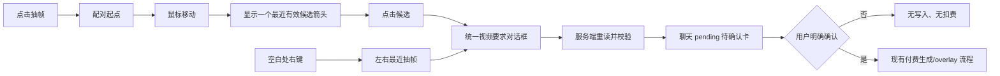

# feat: 抽帧引导配对与运镜要求对话框

## Summary

在现有“抽帧 · 上层”轨道中增加点击引导配对：用户点击一张抽帧后，鼠标移动时只提示当前最近的一个有效候选箭头；点击候选后进入独立的视频要求对话框。空白处右键继续保留，并与箭头入口共用同一对话框、服务端校验和聊天待确认卡流程。

本计划只扩展“选帧 → 填写运镜 → 待确认卡”这一段，不改变已完成的上层覆盖、完整视频播放、尾段留空、锚点优先、底层镜头保护和付费确认边界。

## Problem Frame

现有两帧合成入口依赖用户猜测抽帧之间的空白位置，用户难以知道系统会选中哪两张图。已有抽帧轨和服务端提案能力足以承载更可发现的入口，但需要把两种入口统一到一个可解释、可取消、不会提前扣费的流程中。（见 origin requirements）

## Requirements

- R1–R5. 左键点击抽帧进入配对模式；鼠标只提示当前最近的有效候选；可从左右任一侧选择，按绝对时间排序；再次点击起点、Esc 或轨道外点击可安全退出。
- R6–R8. 空白处右键入口必须保留；图片缩略图右键仍只打开图片菜单；两种入口进入同一个视频要求对话框，重叠抽帧按 exact imageId 区分。
- R9–R12. 对话框展示首尾帧、时间、区间和实际 1–8 秒请求时长；提供多行自然语言运镜描述和 Storyboard 的“自动/小/中/大”幅度语义。
- R13–R14. 继续只创建聊天待确认卡，不调用生成、不扣费、不改时间线；待确认卡保留首尾帧、运镜描述和幅度，最终付费仍只由现有确认动作触发。
- R15–R17. 配对状态可辨认且支持键盘焦点；无候选、间隔不足、锚点冲突和端点失效均有确定反馈；取消、故事切换、删除抽帧或刷新不会留下半成品。

**Origin actors:** A1 剪辑台用户；A2 系统
**Origin flows:** F1 点击抽帧引导配对；F2 空白处右键快速配对；F3 填写要求并创建待确认卡
**Origin acceptance examples:** AE1–AE9（重点覆盖箭头候选、左右选择、取消、重叠图片、运镜传递、8 秒上限和失效端点）

## Scope Boundaries

- 不删除或弱化空白处右键入口，不把图片缩略图右键误判为空白配对。
- 不在本轮加入拖拽连线、自由路径编辑、多段生成、模型/分辨率/帧率选择或高级提示词编辑器。
- 不在对话框继续时调用模型、扣费、确认付费或写入时间线。
- 不改变现有 overlay 持久化、完整供应商视频、尾段显式留空、锚点优先和底层故事镜头不变的规则。
- 不用视觉序号、客户端 URL、客户端价格或客户端时间作为服务端事实；不允许普通图片冒充时间线抽帧。

### Deferred to Follow-Up Work

- 超过 8 秒区间的自动拆分与拼接。
- 触屏长按、复杂节点式配对和覆盖模式切换。
- overlay 采用后的持久撤销及重新采用生命周期。

## Context & Research

### Relevant Code and Patterns

- `shared/extractedFrameTransition.ts`：沿用抽帧时间解析、最近左右帧选择和 1–8 秒时长规则；新增点击起点候选的纯函数，保证 UI 与服务端规则一致。
- `client/src/features/creationEditor/views/StoryboardEditRow.tsx`：扩展 `StoryboardExtractedFrameRows` 的配对状态、箭头渲染、Esc/轨道外取消和空白右键事件分层；缩略图右键必须阻止冒泡并保留现有图片菜单。
- `client/src/features/creationEditor/views/EditingNleWorkspace.tsx`：持有统一的“打开视频要求对话框”状态，并把两种入口的 exact imageId 传给同一回调。
- `client/src/features/storyAgent/StoryAgentContext.tsx`：扩展现有提案动作，将对话框收集的运镜描述和幅度带入待确认卡；不新建付费状态机。
- `client/src/features/storyAgent/components/EditingTransitionCandidateCard.tsx`：在 pending 卡中展示运镜摘要和幅度，确认/拒绝边界保持不变。
- `server/routers/creationAgent.ts` 与 `server/services/timelineEditAgent.ts`：扩展提案输入；服务端重新读取故事归属、imageId、抽帧时间、图片 URL、锚点和请求时长，并规范化用户文本与幅度。
- `client/src/features/storyAgent/views/storyboardReviewModel.ts`：复用 `auto/small/medium/large` 的现有幅度语义和显示文案。

### Institutional Learnings

- 只能在主仓库 `main:3000` 做真实验证；不能在 worktree 启动第二个服务或写入另一份 `.webdev/local-persist.json`。
- 所有读写必须以 `storyId + userId` 为边界；真实删除或写操作使用 exact imageId/stable ID，不能按视觉序号猜测。
- 功能账本中 `extracted-frame-overlay-video` 已是 working；新增入口必须追加 history、保持 overlay/锚点/完整媒体不变量，并运行 `pnpm feature:validate`。

## Key Technical Decisions

- **候选提示采用单一动态候选。** 配对模式下根据鼠标位置显示当前最近且有效的一张候选，不同时铺开左右候选，降低密集轨道中的视觉噪声；候选集合仍允许起点左右两侧，最终按时间排序。
- **对话框与确认卡分阶段。** 独立对话框负责让用户确认两帧、区间、时长和运镜；继续只注入 pending chat card，现有卡片仍是唯一付费确认入口。
- **客户端提示、服务端裁决。** 客户端可用共享纯函数做即时候选和时长预览，但服务端重新读取事实并拒绝失效端点、跨故事图片、间隔不足、锚点冲突或非法幅度/文本。
- **运镜作为提案事实保存。** 自然语言描述与幅度同时进入 canonical proposal/candidate，参与提案重建和稳定身份计算，避免安全重读时丢失用户意图或把不同要求合并成同一候选。
- **不引入第二套 overlay 或支付流程。** 本轮只接通现有 `proposeExtractedFrameTransitionCard` 与 `EditingTransitionCandidateCard`，确认后的生成/采用逻辑保持原样。

## Open Questions

### Resolved During Planning

- 箭头显示范围：采用鼠标当前最近的单一有效候选（用户确认）。
- 运镜填写位置：采用独立小对话框，继续后生成待确认卡（用户确认）。

### Deferred to Implementation

- 箭头在重叠布局中的精确定位和无障碍文案：实现时依据现有轨道几何和测试快照微调，不改变单一候选的产品规则。
- 用户自然语言的最大长度与空文本提示：沿用现有 Storyboard 文本输入约束并在服务端统一裁剪/校验。

## High-Level Technical Design

## Implementation Units

### U1. 共享抽帧候选规则

**Goal:** 让点击起点、鼠标候选和空白右键都基于同一套时间、故事和最小间隔规则。

**Requirements:** R2–R4, R6–R7, R16–R17

**Dependencies:** None

**Files:**
- Modify: `shared/extractedFrameTransition.ts`
- Test: `shared/extractedFrameTransition.test.ts`

**Approach:** 增加从任意起点得到左右有效候选的纯函数；保留现有空白位置左右最近选择；所有结果返回真实 imageId 并按绝对时间规范化。

**Test scenarios:**
- Happy path — 起点左右各有有效帧时只返回鼠标最近候选。
- Edge case — 同时间、间隔不足 1 秒、缺失一侧或无效端点不产生候选。
- Edge case — 起点晚于第二次选择时仍按时间整理首尾帧。

**Verification:** 共享测试锁定箭头入口与右键入口不会产生不同的配对事实。

### U2. 抽帧轨道配对交互

**Goal:** 实现点击起点、单一动态箭头、第二次点击、取消和事件隔离。

**Requirements:** R1–R8, R15, R17

**Dependencies:** U1

**Files:**
- Modify: `client/src/features/creationEditor/views/StoryboardEditRow.tsx`
- Test: `client/src/features/creationEditor/views/StoryboardEditRow.test.tsx`

**Approach:** 在抽帧行维护 pairingStartFrame/currentCandidate；箭头只覆盖可点击连接区域，不遮挡缩略图；缩略图右键先 stop propagation，空白右键继续调用原有最近帧选择并进入统一回调；Esc、重复点击、轨道外点击清理状态。

**Test scenarios:**
- Happy path — 左键起点后移动到有效邻近帧显示一个箭头，点击后回调 exact imageId。
- Edge case — 起点两侧只有无效/不足 1 秒帧时不显示可点击箭头并给出原因。
- Error path — 缩略图右键打开图片菜单而不是配对菜单；空白右键仍能触发配对。
- Integration — Esc、重复点击和轨道外点击都退出且不调用提案动作。

**Verification:** 组件测试证明两入口事件不抢占，重叠抽帧仍按真实 imageId 可区分。

### U3. 视频要求对话框与工作区接线

**Goal:** 为两种入口提供统一、可取消的帧确认和运镜填写界面。

**Requirements:** R9–R13, R15–R17

**Dependencies:** U1, U2

**Files:**
- Create: `client/src/features/creationEditor/views/ExtractedFrameTransitionRequirementsDialog.tsx`
- Modify: `client/src/features/creationEditor/views/EditingNleWorkspace.tsx`
- Test: `client/src/features/creationEditor/views/ExtractedFrameTransitionRequirementsDialog.test.tsx`

**Approach:** 展示首尾缩略图、imageId/时间标签、目标区间和共享时长预览；提供多行运镜输入与四档幅度；继续只发出统一 proposal callback，取消恢复稳定轨道状态。

**Test scenarios:**
- Happy path — 两帧、时长、运镜文本和幅度均可填写并传给 callback。
- Edge case — 12 秒区间显示请求 8 秒；不足 1 秒或端点失效时禁止继续。
- Integration — 取消、故事切换和刷新不会创建聊天卡或写入时间线。

**Verification:** 浏览器中箭头和空白右键都打开同一个对话框，继续后只出现 pending 卡。

### U4. 提案载荷、服务端校验与确认卡展示

**Goal:** 让用户运镜要求成为服务端可重建、可验证的提案事实，并显示在 pending 卡中。

**Requirements:** R7, R9–R14, R16–R17

**Dependencies:** U3

**Files:**
- Modify: `client/src/features/storyAgent/StoryAgentContext.tsx`
- Modify: `client/src/features/storyAgent/types.ts`
- Modify: `client/src/features/storyAgent/components/EditingTransitionCandidateCard.tsx`
- Modify: `server/routers/creationAgent.ts`
- Modify: `server/services/timelineEditAgent.ts`
- Test: `server/services/timelineEditAgent.test.ts`
- Test: `server/routers.creationAgent.extractedFrameTransition.test.ts`
- Test: `client/src/features/storyAgent/StoryAgentContext.intent.test.tsx`

**Approach:** 输入只携带 storyId、两个 imageId、运镜描述和白名单幅度；服务端重新读取图片/故事/时间/锚点并规范化文本，canonical prompt 与 candidate identity 包含运镜要求；客户端卡片展示摘要但仍只在既有确认按钮提交付费流程。

**Test scenarios:**
- Happy path — proposal 和 assistant candidate 都保留自然语言描述、幅度、端点图和时长。
- Error path — 跨故事 imageId、删除后的 imageId、非法幅度、过长文本、间隔不足或锚点冲突被拒绝。
- Integration — proposal/卡片阶段没有 supplier、302、扣费或 timeline 写入；重复候选不会因为运镜字段丢失而错误复用。

**Verification:** 服务端测试证明客户端不能伪造 URL、时间、价格、镜头归属或超过 8 秒的请求。

### U5. 功能账本、回归与真实浏览器验收

**Goal:** 更新 working 功能证据并证明新入口在主仓库真实页面可用。

**Requirements:** R1–R17

**Dependencies:** U1–U4

**Files:**
- Modify: `docs/features/feature-ledger.json`
- Test: `client/src/features/creationEditor/views/StoryboardEditRow.test.tsx`
- Test: `shared/extractedFrameTransition.test.ts`

**Approach:** 在现有 `extracted-frame-overlay-video` 功能卡 history 追加引导配对与统一对话框证据；运行类型检查、相关测试、账本校验和 diff 检查；只在 `main:3000` 使用 exact imageId 做浏览器验证，绝不点击付费确认。

**Test scenarios:**
- Integration — 真实页面点击一帧、看到单一箭头、点击另一帧、填写运镜并继续，聊天只出现 pending 卡。
- Integration — 空白右键仍进入同一对话框；缩略图右键仍是图片菜单。
- Regression — story #1186 仍为 30 镜、30 timeline items，原 `0102` stable ID 存在，overlay/付费写入保持零净变化。

**Verification:** `pnpm feature:validate`、`npx tsc --noEmit`、相关测试、`git diff --check` 和主仓库浏览器证据全部通过。

## System-Wide Impact

- **Interaction graph:** 抽帧行新增配对状态，工作区新增对话框状态，StoryAgent proposal callback 增加运镜载荷，确认卡消费扩展后的 candidate。
- **Error propagation:** 客户端即时提示只用于引导；服务端拒绝端点失效、归属错误、时间/锚点冲突时，错误回到对话框并清理未提交配对。
- **State lifecycle risks:** 对话框取消、故事切换、抽帧删除和刷新必须清掉 transient pairing；proposal 阶段不得创建 overlay、Take 或 timeline revision。
- **API surface parity:** router、server candidate 类型、客户端 candidate reference 和聊天归档结构必须同步更新；现有旧入口的可选字段保持兼容。
- **Integration coverage:** 组件单测不能证明真实右键命中区域和卡片持久化，必须在 `main:3000` 做一次鼠标/键盘浏览器验收。
- **Unchanged invariants:** 付费只发生在现有确认按钮；上层 overlay 完整播放、尾段留空、锚点优先、底层镜头数量/顺序和主轨其他右键菜单不变。

## Risks & Dependencies

| Risk | Mitigation |
|------|------------|
| 抽帧重叠导致箭头或右键命中错误 | 事件分层、真实 imageId 分列、组件测试覆盖重叠布局 |
| 客户端展示的候选与服务端事实不一致 | 服务端重新读取图片/故事/时间/锚点；客户端只作即时提示 |
| 运镜文本在提案重建时丢失 | 将规范化文本与幅度纳入 candidate canonical 数据和稳定身份测试 |
| 对话框继续误触发付费链路 | 明确只调用 proposal mutation；浏览器验证网络请求不出现 supplier/302/扣费 |
| 混杂工作树或错误端口造成假验证 | 先运行 `pnpm env:status`，只验证主仓库 `localhost:3000`，不启动第二服务 |
| 真实测试误删用户数据 | 只使用 exact imageId/stable ID；不做删除测试，不点击付费确认，并核对 story #1186 基线 |

## Sources & References

- Origin requirements: `docs/brainstorms/2026-08-20-extracted-frame-guided-pairing-requirements.md`
- Existing overlay plan and invariants: `docs/plans/2026-08-20-001-feat-extracted-frame-transition-plan.md`
- Feature ledger rules: `docs/features/README.md`, `docs/features/feature-ledger.json`
- Environment and data safety: `AGENTS.md`, `docs/environment-guide.md`, `docs/solutions/2026-06-13-多worktree环境数据分裂收敛.md`

## Confidence Check

- [ ] Shared candidate rules are covered by pure-function tests.
- [ ] Both UI entrances are covered by component and real-browser evidence.
- [ ] Server-side ownership, time, anchor, text, amplitude and duration validation is covered.
- [ ] Pending-card stage is proven not to call generation, payment or timeline mutation.
- [ ] Feature ledger and main `3000` environment checks pass.

## Next Steps

1. Use `/ce-work` to implement U1–U5 in dependency order.
2. After implementation, run `/ce-doc-review` or a focused code review before any commit.
3. Do not stage or commit the mixed worktree as a whole; isolate only this feature’s delta when the user requests commit.
