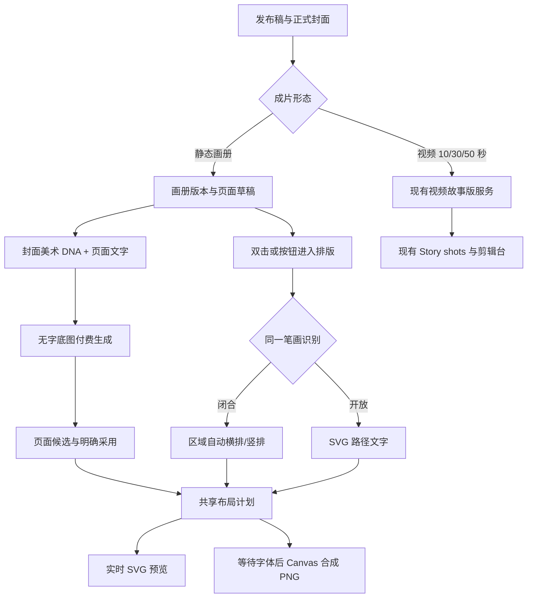
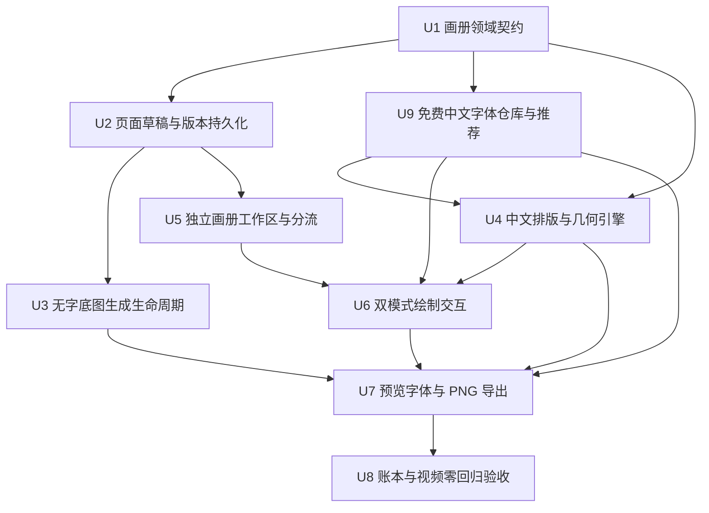
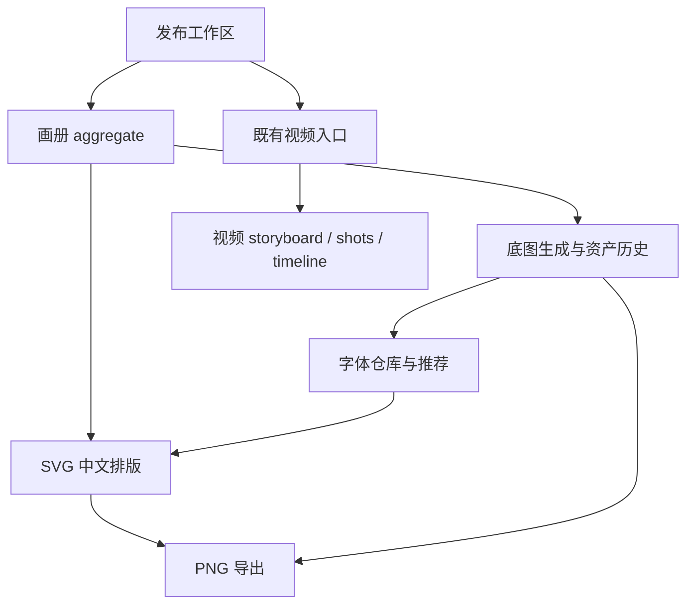

# feat: 独立静态画册、中文路径排版与字体仓库

## Summary

把“静态画册 · 最多 9 张”从现有视频故事版中真正分离出来：用户选择画册后，进入发布工作区内的专用画册编辑器；AI 只生成继承正式封面美术 DNA 的无字底图，产品把中文作为可编辑图层叠在底图上。用户双击页面后，用同一支轻量画笔画出闭合区域或开放路径，系统自动完成横排、竖排、沿路径排版、字号、间距、换行和对比度处理。画册内置一套可追溯许可证的免费中文字体仓库，根据已采用底图的美术方向和页面文字推荐字体，但最后由用户选择；导出时合成 PNG，同时保留可继续编辑的文字、字体选择与几何数据。

视频 10/30/50 秒入口、`PublishingVideoStoryboardAggregate`、正式 Story shots、时间线、视频素材与付费视频流程均保持原状；`album9` 不再调用任何视频 build/confirm 服务，也不再导航到剪辑台。

## Problem Frame

当前 `album9` 只是 `NarrativeSpecId` 中的一个变体。`PublishingDraftWorkspace` 无论用户选择画册还是视频，都会调用 `publishingDraft.buildVideoStoryboard`，随后把页面落成正式 Story shots 并跳转剪辑台。画册底图因此继承了“当前镜头/相邻镜头必须已有可信画面”的视频参考图门槛，出现“01 及相邻镜头还没有可信画面”的错误；确认后还会生成名为“视频版 · 静态画册”的版本。

用户需要的是另一种产品对象：画册页以文字为内容事实，以独立生成的无字背景为视觉底层，以产品字体和几何布局为可编辑上层。封面只提供已采用的美术风格，不应被复制为页面构图，更不应把图片模型生成的中文当成成品文字。

---

## Requirements

- **R1 独立分流。** `album9` 进入独立画册创建/编辑流程；`video10`、`video30`、`video50` 继续走现有视频 build/confirm 和剪辑台流程，不改变请求、状态或结果。
- **R2 版本隔离。** 画册是发布版本范围内的独立 aggregate，使用 `storyId + versionId + revision` 保护；V2 的页面、底图、文字和排版不得修改 V1。
- **R3 页面内容。** 从当前发布稿形成最多 9 个稳定页面，每页保存稳定 pageId、完整可编辑文字、来源信息、底图候选/采用状态和排版状态；不得把页面存成 Story shot 或 timeline item。
- **R4 封面风格继承。** 底图提示词继承当前版本正式采用封面的风格、色板、光线、材质和情绪，不复制封面布局，不把封面当人物身份锁；没有正式采用封面时，不提交付费生成，明确引导用户先采用封面。
- **R5 无字底图。** 所有底图都经过统一静态图片提示词与质量隔离规则，硬性禁止文字、字母、数字、水印和标识，并预留适合叠字的视觉空间与对比度。
- **R6 付费与候选生命周期。** 每次付费底图请求先展示服务端报价并由用户确认；持久化 operation token、provider taskId 和恢复状态；未知/超时只恢复同一任务，不自动重提；生成结果先成为当前页面候选，只有明确采用才改变该页底图。
- **R7 单一绘制入口。** 双击页面进入排版模式；一次 pointer stroke 根据几何自动识别为闭合区域或开放路径，支持撤销、重画、取消、字体风格、对齐和保存，不暴露专业矢量节点编辑。
- **R8 区域排版。** 闭合笔画归一化为区域，系统依据区域形状与长宽自动选择横排或竖排，并自动计算字号、行列间距、换行和对齐；不丢字、不静默截断。
- **R9 路径排版。** 开放笔画形成直线、曲线或简单自由路径，中文沿路径方向排布；过短路径在最小可读字号仍放不下全文时给出可恢复提示，禁止静默截断或保存错误成品。
- **R10 一致渲染。** 预览和导出消费同一份纯布局计划；导出前等待字体加载完成，将已采用底图和 SVG 文字层合成为 PNG，但不覆盖或删除可编辑元数据。
- **R11 中文字体仓库。** 首版提供一套许可证、来源、版本、文件校验值和字形覆盖可追溯的免费中文字体仓库；字体按画册编辑/导出场景懒加载并附带许可证通知。不得全局加载现有 11 MB 鸿雷字体，也不得在未确认再分发权利前把它作为画册依赖。
- **R12 恢复与冲突。** 刷新、切换故事/版本、页面切换或浏览器恢复后，已保存文字、采用底图和布局一致；过期保存必须被 revision/CAS 拒绝并保留用户本地草稿以便重试。
- **R13 可访问与轻量。** 双击不是唯一入口：页面提供可聚焦的“排版文字”按钮；Esc、pointercancel、失焦和取消均退出未保存绘制；工具栏状态和错误由键盘及读屏可感知。
- **R14 视频零回归。** 画册入口不得调用视频 router/service、写入 `videoStoryboard`、创建 shots/timeline 或触发视频素材刷新；视频入口的原有行为通过特征测试锁定。
- **R15 推荐而不代替选择。** 系统根据正式封面/已采用底图共享的 art direction（风格、色板、材质、情绪）和页面文字特征（长度、叙事语气、标点密度、标题/正文角色、所需字形）给出 1 个首选与最多 2 个备选，并解释推荐理由；用户可查看完整字体仓库并选择任意兼容字体。推荐刷新不得自动覆盖用户已保存的字体。

## Scope Boundaries

- 首版只处理静态画册，不修改视频剧本生成、视频镜头生成、视频时间分配、剪辑台或视频付费逻辑。
- 首版保留“一支画笔、两种结果”的轻交互；不加入逐字拖动、Bezier 节点、多路径组合、复杂遮罩、图层面板、字符级样式或桌面排版软件能力。
- 图片模型只负责底图，不负责中文、标题、数字或水印。
- 页面文字可编辑，但本轮不把页面编辑反向改写发布稿正文；来源与画册副本要明确区分。
- 首版不提供协同编辑、服务端成品渲染、PDF 印刷排版、用户上传字体或商业字体授权管理。
- 计划不顺带清理功能账本中与本功能无关的历史 `knownGaps` 文案。

### Deferred to Follow-Up Work

- 手动增删、拖拽排序、跨页移动文字，以及超过 9 页的长画册。
- 多个文字区域/路径叠加、路径节点精修、局部字号或逐字样式。
- PDF、印刷出血、CMYK、批量 ZIP 和服务端无头渲染。
- 自定义字体上传、商业字体授权管理和更多字体市场。
- 对已采用底图再次做付费 Vision 字体审美分析；首版使用生成时已有的 art direction 元数据与页面文字特征匹配。

---

## Context & Research

### Relevant Code and Patterns

- `client/src/features/publishingDraft/PublishingDraftWorkspace.tsx` 当前把四个规格汇入 `continueToVideo`，画册分支必须在调用 mutation 之前切开；画册编辑器作为发布工作区内部状态呈现，不新增顶栏“图像和声音”工作区，也不触发 `onContinueToVideo`。
- `server/routers/publishingDraft.ts` 的 `buildVideoStoryboard`、`confirmVideoStoryboard` 与 `server/services/publishingVideoStoryboardPersistence.ts` 保持视频专用；新增画册 router 和 service，不向这些 API 继续添加画册条件分支。
- `shared/publishingDraft.ts` 的 `PublishingStoryVersion.videoStoryboard` 继续只承载视频；新增可规范化的 version-scoped album aggregate，旧故事缺失字段时按 `null` 兼容。
- `server/services/publishingCoverArtDirection.ts` 的提取、应用与解析模式用于封面美术 DNA 继承；`server/services/publishingCoverStoryboardPrompt.ts` 提供封面提示词编译参考，但画册底图需要独立构图目标。
- `server/services/renderGate.ts` 与 `server/services/staticImageQualityGate.ts` 已定义“产品后叠文字、模型不得画字”和付费结果不自动丢弃/重提的不变量；画册底图必须接入同一权威静态图片编译与隔离链。
- `server/routers/publishingDraft.ts` 的封面生成展示了报价确认、持久化 taskId、同任务恢复、候选轮次和明确采用；画册复用生命周期语义，但 receipt、round 和 adoption 均按 pageId 隔离，采用页面背景不得提升为 Story 当前主图。
- `client/src/features/creationEditor/views/AnimaticPlayer.tsx` 已有 normalized pointer coordinates、pointer capture 和取消模式；`client/src/features/creationEditor/editMask.ts` 已有归一化点集模式。
- `client/src/features/publishingDraft/publishingCoverExport.ts` 已有同源图片读取、裁切、Canvas 合成和 PNG blob 导出模式；画册导出复用安全读取与文件命名思想，但预览/导出共用新的文字布局计划。
- `client/src/features/nayin/views/DailyDrinkHero.tsx` 已使用 SVG `<textPath>`；路径文字无需引入 Konva/Fabric。项目已有 `sharp`，但首版浏览器导出不需要新增重型画布依赖。
- `client/src/font-loading.test.ts` 明确禁止全局加载 `client/src/assets/fonts/honglei-zhuoshu.ttf`；画册字体必须放在独立仓库/registry 中懒加载，并对仓库总量和单次页面加载量分别设门槛。

### Institutional Constraints

- 按 `AGENTS.md`，worktree 只改代码，不能启动 dev/preview server，也不能写 `.webdev/`；实现完成合并回主干后，只在主仓库固定 `localhost:3000` 做真实验收。
- `publishing-workspace` 要求付费 taskId 可恢复且不自动重提；`publishing-versions` 要求版本不可互相污染并使用 revision/idempotency；`image-asset-history` 要求只有明确采用才改变当前图片。
- `unified-static-image-prompt` 要求所有静态图片入口经过一套权威编译，provider 层不得再加第二套美术规则；`static-image-quality-quarantine` 要求隔离失败不自动再次付费。
- `publishing-video-storyboard` 的预览无正式副作用、确认 CAS、手工编辑/媒体保留等所有现有约束均保持不变；画册功能不能改写该功能卡的 owners 或行为声明。

### 免费中文字体调研与保存清单

以下候选已在 2026-08-20 从官方仓库核对到字体文件与 OFL 文本，来源和大小作为本计划的持久调研记录。执行时从固定 commit 下载到 `client/src/assets/fonts/publishing-album/<font-id>/`，同时保存各自 `OFL.txt`、`SOURCE.json` 和 SHA-256；不能只引用随时间变化的 `main` URL。

| 字体 | 适合的画面/内容 | 官方文件（原始大小） | 许可证与固定来源 |
|---|---|---:|---|
| Noto Sans SC | 现代、极简、科技、信息密度高、长正文 | `NotoSansSC[wght].ttf`（17,772,300 B） | SIL OFL 1.1；`google/fonts@3b1480ea4b6e15fed70a42f4cb29216476a044ed` |
| Noto Serif SC | 文学、编辑感、传统、安静、长正文 | `NotoSerifSC[wght].ttf`（25,125,512 B） | SIL OFL 1.1；同上 |
| 霞鹜文楷 LXGW WenKai | 温暖、日记、生活叙事、人文、手作质感 | `LXGWWenKai-Regular.ttf`（25,575,676 B） | SIL OFL 1.1；`lxgw/LxgwWenKai@50f4b182415a8c33d9a456df220b66a284e2509b` |
| 站酷小薇体 ZCOOL XiaoWei | 复古、海报、民国/宋体气质、中短标题与段落 | `ZCOOLXiaoWei-Regular.ttf`（6,313,808 B） | SIL OFL 1.1；上述 `google/fonts` 固定 commit |
| 马善政毛笔楷书 Ma Shan Zheng | 笔墨、戏剧性、节庆、强情绪短标题或短路径 | `MaShanZheng-Regular.ttf`（5,857,936 B） | SIL OFL 1.1；上述 `google/fonts` 固定 commit |
| 志莽行书 Zhi Mang Xing | 自由、手写、旅行、青春、短句和曲线路径 | `ZhiMangXing-Regular.ttf`（4,063,532 B） | SIL OFL 1.1；上述 `google/fonts` 固定 commit |

**首版保存决定：** 安装 Noto Sans SC、Noto Serif SC、ZCOOL XiaoWei、Ma Shan Zheng、Zhi Mang Xing 五款，原始文件合计 59,133,088 B（约 56.4 MiB），覆盖中性黑体、文学宋体、复古标题、毛笔和行书五类；LXGW WenKai 保留为已核验但未安装候选，避免首版仓库膨胀到约 85 MB。仓库原始字体总量硬上限为 60 MiB，单页初始只加载用户当前选中的一个字体；仅在实际缺字时再加载 Noto Sans SC fallback。以后增删字体必须在同一预算内替换，而不是不断累加。

### External Guidance

- SVG `<textPath>` 是浏览器原生的沿路径文字机制：<https://developer.mozilla.org/en-US/docs/Web/SVG/Reference/Element/textPath>
- 导出前可等待 `FontFaceSet.ready`，避免预览字体与合成字体不一致：<https://developer.mozilla.org/en-US/docs/Web/API/FontFaceSet/ready>
- Noto Serif SC / Noto Sans SC 可作为首批候选，但实现时必须随字体文件保存对应 SIL Open Font License 通知并核验实际下载文件：<https://raw.githubusercontent.com/google/fonts/main/ofl/notoserifsc/OFL.txt>
- Google Fonts 中 ZCOOL XiaoWei、Ma Shan Zheng、Zhi Mang Xing 的字体文件与 OFL：<https://github.com/google/fonts/tree/main/ofl>
- 霞鹜文楷官方仓库与 OFL：<https://github.com/lxgw/LxgwWenKai>

---

## Key Technical Decisions

| 决策 | 选择 | 理由 |
|---|---|---|
| 产品边界 | 画册 aggregate 与 video storyboard 完全分离 | 从数据和 API 上消除画册误入 shots/timeline 的可能，而不是继续堆 `album9` 条件 |
| 编辑入口 | 发布工作区内的专用 `PublishingAlbumWorkspace` | 画册仍属于发布版本，但不是剪辑台媒资；用户可自然返回文字稿与封面 |
| 底图参考 | 只接受当前版本正式采用封面的美术 DNA | 确保“继承封面风格”有稳定事实；未采用封面时不冒险付费生成 |
| 文字呈现 | SVG 实时层 + 共享纯布局计划 + Canvas 导出 | SVG 原生支持文本与 textPath，Canvas 负责最终 PNG；无需引入专业画布框架 |
| 几何存储 | 0–1 归一化点、区域/路径判别结果与算法版本 | 页面缩放或不同屏幕下仍可重建；算法升级可迁移或保留旧结果 |
| 过长文字 | 自动缩小至可读下限，仍溢出则阻止保存并建议重画 | 不截字、不把错误成品悄悄保存，也不增加复杂手动字号控件 |
| 字体资产 | 固定来源、许可证随附、按场景懒加载的字体仓库 | 保证中文可控与导出一致，同时避免来源漂移、全局加载和授权风险 |
| 字体匹配 | 基于 art-direction/content tags 的确定性评分，展示推荐但由用户决定 | 推荐可解释、可测试、无额外模型费用；用户选择不会被后台刷新覆盖 |

`NarrativeSpecId` 可暂时保留 `album9` 作为设置对话框的用户选择值，以避免无关的公共类型重构；但服务端视频 router 要把输入收窄为视频规格，画册在 UI 分支后只进入画册 API。后续若其他调用方不再依赖统一 union，再单独清理类型命名。

## High-Level Technical Design

以下图示用于审阅整体边界，是方向性指导，不是需要逐字复现的实现规范。

### State Lifecycle

- 画册 aggregate：`empty → draft → ready`；页面各自拥有 `backgroundGeneration`、candidate rounds、adopted background 和 typography layout。
- 底图任务：`pending → completed | failed | unknown`；存在 taskId 的 `pending/unknown/可恢复 failed` 只能查询同一付费任务。
- 排版草稿：进入绘制后仅存在客户端；保存时以 page/version revision 写入。CAS 冲突时服务端状态不变，本地笔画和文字保留并提示刷新/重试。
- 导出是读取操作：只读取已采用底图和已保存/当前有效布局，不改变 adoption、page revision 或可编辑数据。

---

## Implementation Units

### U1. 定义独立画册领域契约

**Goal:** 建立 version-scoped 画册 aggregate、稳定页面身份、底图生命周期和可编辑排版的数据边界，不复用 video storyboard/shot 类型。

**Requirements:** R1–R3, R6, R7–R12, R14

**Dependencies:** None

**Files:**
- Create: `shared/publishingAlbum.ts`
- Modify: `shared/publishingDraft.ts`
- Test: `shared/publishingAlbum.test.ts`
- Test: `shared/publishingDraft.test.ts`

**Approach:**
- 定义 `PublishingAlbumAggregate`、page、background generation/round/adoption、typography layout 和 revision 字段；layout 使用 `region | path` 判别联合，点和区域均为 0–1 坐标。
- 页面文字保存完整 Unicode 字符串；来源记录只用于解释/重建，不让后续发布稿变化静默覆盖用户已编辑文字。
- aggregate 增加 schema/algorithm version；normalizer 对缺失/旧值安全回落，对非法点、越界坐标、重复 pageId 和不完整 receipt 做确定性清理或拒绝。
- `PublishingStoryVersion` 新增 nullable album 字段；legacy materialization、version clone/normalize/project 明确保留版本隔离，`videoStoryboard` 不改变。

**Patterns to follow:**
- `shared/publishingDraft.ts` 中 cover generation、video storyboard normalizer 和 legacy state materialization。
- `shared/scopedResource.ts` 的稳定 scope 身份。

**Test scenarios:**
- Happy path — 九个页面、候选轮次、采用底图、区域/路径布局往返 normalize 后信息完整。
- Edge case — 缺失 album 的旧故事得到 `null`，不会生成页面、shots 或意外 revision。
- Edge case — 越界/NaN 坐标、空 pageId、重复 pageId、未知字体/方向和不完整 receipt 被安全处理。
- Integration — 克隆或创建 V2 后修改其 album，不改变 V1 album 和任一版本的 `videoStoryboard`。

**Verification:** 共享类型和 normalization 测试能证明画册可独立持久化、旧数据兼容且无法写入视频 aggregate。

### U2. 页面草稿生成与版本安全持久化

**Goal:** 从当前版本发布稿建立最多 9 个稳定页面，并提供按 pageId 保存文字、布局和采用状态的 CAS 写操作。

**Requirements:** R2, R3, R6, R12, R14

**Dependencies:** U1

**Files:**
- Create: `server/services/publishingAlbumPersistence.ts`
- Modify: `server/services/publishingPersistence.ts`
- Modify: `server/routers/publishingDraft.ts`
- Test: `server/services/publishingAlbumPersistence.test.ts`
- Test: `server/services/publishingPersistence.test.ts`

**Approach:**
- 新增画册专用的 initialize/update-page/adopt-background 操作，所有写入验证 story ownership、versionId、base container/version/page revision 和 operation token。
- 初次建立草稿时按发布稿段落语义确定性切分 1–9 页，稳定 pageId 来源于版本与源段落身份；重复请求返回同一 aggregate，不重复建页。
- 用户改过页面文字后，发布稿变化只标记 source stale，不自动覆盖；重新按正文拆页属于显式后续操作，不在保存布局时暗中发生。
- 页面顺序由 aggregate 的 pageIds 决定；首版不暴露新增、删除和拖拽排序写操作。

**Patterns to follow:**
- `server/services/publishingPersistence.ts` 的 Story write lock、版本 operation handshake 和 revision 冲突。
- `server/services/publishingVideoStoryboardPersistence.ts` 的 version-scoped aggregate 写入方式，但不调用其中的 formal shot 转换。

**Test scenarios:**
- Happy path — 一段短文形成一页，长文确定性形成不超过九页且全文顺序不丢失。
- Happy path — 保存 page text/layout 只递增目标 page/version/container revision，其他页和其他版本不变。
- Edge case — 空正文建立可编辑空白页；超长正文仍不超过九页且不静默丢字。
- Error path — 过期 page/version/container revision、错误 versionId、错误 story owner 和复用 token 携带不同 payload 均被拒绝。
- Integration — 初始化/保存画册后 Story shots、timeline、`activeVideoStoryboardVersionId` 和 `videoStoryboard` 保持字节语义不变。

**Verification:** 持久化测试证明重放安全、版本隔离、全文保留和视频状态零副作用。

### U3. 封面风格驱动的无字底图生成

**Goal:** 为单个画册页提供报价、明确付费、同任务恢复、候选展示和采用流程，同时不依赖当前/相邻视频镜头。

**Requirements:** R4–R6, R12, R14

**Dependencies:** U2

**Files:**
- Create: `server/services/publishingAlbumBackgroundPrompt.ts`
- Create: `server/services/publishingAlbumBackgroundGeneration.ts`
- Modify: `server/services/publishingAlbumPersistence.ts`
- Modify: `server/routers/publishingDraft.ts`
- Test: `server/services/publishingAlbumBackgroundPrompt.test.ts`
- Test: `server/services/publishingAlbumBackgroundGeneration.test.ts`
- Test: `server/services/publishingAlbumPersistence.test.ts`

**Approach:**
- 编译输入只使用该页文字的语义摘要、当前版本正式采用封面的 art direction/asset reference、平台画幅和累计用户反馈；不查询当前/相邻 shot image。
- 提示词明确继承风格/色板/光线/材质/情绪，重新设计页面构图，并为文字区域保留安静空间；统一 hard rules 禁止模型生成任何文字、数字、logo 或 watermark。
- router 返回服务端报价；只有匹配报价的明确确认才 claim 付费任务。provider taskId 一旦出现就是收据，刷新/超时/未知状态只能恢复查询，不得自动创建第二个任务。
- 生成图片以 story image asset + album page metadata 入库，先进入该页 candidate round；像素 QA 只标记/隔离，不丢弃已付费结果、不自动重提。采用只更新该 page 的 adopted background，绝不调用 `promoteStoryImageToCurrent`。
- 没有正式采用封面、封面不属于当前版本、页面已变化或 scope/revision 过期时，在付费提交之前失败。

**Patterns to follow:**
- `server/services/publishingCoverArtDirection.ts` 的美术 DNA 继承。
- `server/routers/publishingDraft.ts` 的 cover estimate/claim/update/complete/recover/candidate/adopt 生命周期。
- `server/services/renderGate.ts`、`server/services/staticImageQualityGate.ts` 和 `image-asset-history` 的统一图片约束。

**Test scenarios:**
- Happy path — 已采用封面 + 有效页面 + 确认报价产生一项 page-scoped generation 和候选轮次，提示词含风格 DNA、留白和无字硬规则。
- Error path — 没有采用封面、跨版本封面、报价变化、过期 revision 或未确认费用时零 provider 调用、零资产写入。
- Error path — provider 超时且已有 taskId 时重试只查询原任务；未知状态、质量检查不可用和部分结果均不自动再次付费。
- Integration — 候选出现后 adopted background 不变；明确采用 exact assetId 后仅该页改变，Story current image、封面和视频素材均不变。
- Regression — prompt compiler 仍通过 unified static image rules，不在 provider adapter 追加第二套冲突规则。

**Verification:** 服务测试可从 provider 调用计数、taskId 和 Story diff 证明“付费一次、可恢复、明确采用、无视频参考门槛”。

### U9. 免费中文字体仓库与可解释推荐

**Goal:** 把调研清单落成来源可追溯、可按需加载、可检查字形覆盖的字体仓库，并根据底图风格与文字内容给出推荐，同时保留用户最终选择权。

**Requirements:** R10, R11, R12, R15

**Dependencies:** U1

**Files:**
- Create: `shared/publishingAlbumFonts.ts`
- Create: `client/src/features/publishingAlbum/publishingAlbumFontRepository.ts`
- Create: `client/src/features/publishingAlbum/publishingAlbumFontRecommendation.ts`
- Create: `client/src/assets/fonts/publishing-album/README.md`
- Create: `client/src/assets/fonts/publishing-album/noto-sans-sc/NotoSansSC[wght].ttf`
- Create: `client/src/assets/fonts/publishing-album/noto-sans-sc/OFL.txt`
- Create: `client/src/assets/fonts/publishing-album/noto-sans-sc/SOURCE.json`
- Create: `client/src/assets/fonts/publishing-album/noto-serif-sc/NotoSerifSC[wght].ttf`
- Create: `client/src/assets/fonts/publishing-album/noto-serif-sc/OFL.txt`
- Create: `client/src/assets/fonts/publishing-album/noto-serif-sc/SOURCE.json`
- Create: `client/src/assets/fonts/publishing-album/zcool-xiaowei/ZCOOLXiaoWei-Regular.ttf`
- Create: `client/src/assets/fonts/publishing-album/zcool-xiaowei/OFL.txt`
- Create: `client/src/assets/fonts/publishing-album/zcool-xiaowei/SOURCE.json`
- Create: `client/src/assets/fonts/publishing-album/ma-shan-zheng/MaShanZheng-Regular.ttf`
- Create: `client/src/assets/fonts/publishing-album/ma-shan-zheng/OFL.txt`
- Create: `client/src/assets/fonts/publishing-album/ma-shan-zheng/SOURCE.json`
- Create: `client/src/assets/fonts/publishing-album/zhi-mang-xing/ZhiMangXing-Regular.ttf`
- Create: `client/src/assets/fonts/publishing-album/zhi-mang-xing/OFL.txt`
- Create: `client/src/assets/fonts/publishing-album/zhi-mang-xing/SOURCE.json`
- Create: `scripts/verify-publishing-album-fonts.ts`
- Test: `client/src/features/publishingAlbum/publishingAlbumFontRepository.test.ts`
- Test: `client/src/features/publishingAlbum/publishingAlbumFontRecommendation.test.ts`
- Test: `scripts/verify-publishing-album-fonts.test.ts`
- Modify: `client/src/font-loading.test.ts`

**Approach:**
- manifest 为每个候选保存稳定 fontId、中文/英文名、安装状态、family/weight、字体文件相对路径、固定上游 commit/URL、SHA-256、OFL 路径、字形覆盖、适用的 style/material/mood/content tags、正文/标题/路径适用度和体积。
- 按上方固定 commit 下载并安装已确定的五款字体，核验 OFL、SHA-256、常用简体中文/标点/数字/拉丁字形覆盖和视觉差异；原始字体总量不得超过 60 MiB。LXGW WenKai 留在 manifest 的 research pool 且标记未安装，UI 不得展示为可选字体。
- 推荐器读取与底图生成共享的 canonical art direction，不再次付费分析图片；结合页面文字长度、标题/正文角色、标点/数字/拉丁混排和 narrative intent 计算分数。过滤缺少任一所需字形的字体后，返回首选 + 最多两个备选及中文理由。
- 字体选择器把推荐项置顶，并允许用户展开完整已安装仓库；用户明确选择后保存 fontId。文字或底图变化只刷新推荐提示，不自动应用，不覆盖已保存 fontId。
- FontFace 按 fontId 动态加载；单页初始只加载当前选择，实际缺字时才补载 Noto Sans SC fallback。校验脚本拒绝 mutable source、缺失许可证、checksum 不符、manifest/文件漂移和原始文件总量超过 60 MiB。

**Patterns to follow:**
- `server/services/publishingCoverArtDirection.ts` 的 canonical style/palette/material/mood 信息。
- `client/src/font-loading.test.ts` 的全局字体保护。
- `shared/publishingDraft.ts` 中稳定 ID、normalizer 和可解释 metadata。

**Test scenarios:**
- Happy path — 文学长段 + 安静纸张/油画风优先正文可读的宋/楷类；现代短文 + 几何/高对比风优先黑体；笔墨短标题优先毛笔/行书并给出理由。
- Happy path — 用户可跳过首选并保存任意已安装兼容字体，刷新推荐后选择保持不变。
- Edge case — 生僻字、emoji、数字/英文混排先做 glyph coverage；不完整字体不进入推荐，必要时回退覆盖广的正文字体并解释。
- Error path — 缺失 OFL/SOURCE、mutable URL、SHA-256 不符、文件未在 manifest、仓库超预算或 CSS 全局引用字体时验证失败。
- Integration — 当前页只请求已选字体和 fallback；切页后不重复下载已加载字体，导出复用同一 fontId/FontFace。

**Verification:** 仓库校验输出每个已安装字体的固定来源、许可证、校验值、覆盖率与大小；推荐测试证明相同 art direction + 文本得到稳定排名，用户选择永远优先于推荐。

### U4. 中文布局计划与路径几何

**Goal:** 用可测试的纯函数把笔画和中文转换为稳定的区域/路径布局计划，为预览和导出提供唯一事实。

**Requirements:** R7–R11, R13

**Dependencies:** U1, U9

**Files:**
- Create: `client/src/features/publishingAlbum/publishingAlbumGeometry.ts`
- Create: `client/src/features/publishingAlbum/publishingAlbumLayout.ts`
- Test: `client/src/features/publishingAlbum/publishingAlbumGeometry.test.ts`
- Test: `client/src/features/publishingAlbum/publishingAlbumLayout.test.ts`

**Approach:**
- 对 pointer points 做去抖、简化和归一化；根据首尾距离相对笔画包围盒、最小长度和有效面积判定闭合/开放。闭合笔画保存区域包围几何，开放笔画保存简化 polyline，原始像素尺寸不进入 canonical state。
- 区域依据形状/长宽选择横排或竖排，按 Unicode grapheme 计算行列，在字号上下限内寻找可完整容纳的最大字号；对齐和对比色由确定性规则给出，用户只选字体风格与对齐。
- 路径计算弧长并生成稳定 SVG path；在最小可读字号仍无法放下全部 graphemes 时返回明确 overflow，不生成省略号。
- 布局只接受 U9 字体仓库已经加载且通过 glyph coverage 的 font metrics；未知/未安装 fontId 不进入可保存计划。

**Patterns to follow:**
- `client/src/features/creationEditor/editMask.ts` 的 normalized point。
- `client/src/features/publishingDraft/publishingCoverExport.ts` 的中文 grapheme/measure 思路。
- `client/src/font-loading.test.ts` 的全局字体体积保护。

**Test scenarios:**
- Happy path — 近闭合圆/矩形识别为 region；直线、弧线和简单自由笔识别为 path，缩放容器后 canonical geometry 相同。
- Edge case — 点击抖动、极短线、越界点、自交线和 pointercancel 不生成可保存布局。
- Happy path — 宽区域完整横排、窄高区域完整竖排；标点、emoji、代理对和换行不被拆坏。
- Happy path — 路径方向反转时文字方向随路径改变，全部文字仍存在。
- Error path — 区域/路径在最小字号仍溢出时返回 overflow 和建议，不截断、不输出可保存 plan。
- Regression — production CSS 未引用鸿雷 11 MB 文件，画册字体只在显式 load 时请求。

**Verification:** 纯函数测试证明同一文本、字体 metrics 和 normalized geometry 总得到相同布局/overflow 结果，且字体不会全局加载。

### U5. 画册分流与专用工作区骨架

**Goal:** 让用户选择静态画册后建立画册版本并留在发布工作区编辑，而视频选择完全沿用现有入口。

**Requirements:** R1–R4, R12–R14

**Dependencies:** U2

**Files:**
- Create: `client/src/features/publishingAlbum/PublishingAlbumWorkspace.tsx`
- Modify: `client/src/features/publishingDraft/PublishingDraftWorkspace.tsx`
- Modify: `client/src/pages/EditingStudioPage.tsx`
- Test: `client/src/features/publishingAlbum/PublishingAlbumWorkspace.test.tsx`
- Test: `client/src/features/publishingDraft/PublishingDraftWorkspace.test.tsx`
- Test: `client/src/pages/editingStudioWorkspace.test.ts`

**Approach:**
- 设置对话框可继续共用形态选择，但标题/说明/确认按钮随 `album9` 改为“制作画册”；创建版本显示名为“画册版 · …”，随后调用 album initialize 并在 `PublishingDraftWorkspace` 内切换到画册子视图。
- 只有视频规格调用现有 `continueToVideo` 和 `onContinueToVideo`；router 输入同步收窄，避免未来客户端误把 `album9` 传给视频 API。
- 工作区显示 1–9 页缩略导航、当前页文字、底图候选/采用入口、生成状态和导出入口；没有采用封面时呈现可返回封面工作室的阻断提示，但允许查看/编辑页面草稿。
- 故事/版本切换时取消 transient 请求展示并从新 scope 读取；响应回写前验证 `storyId + versionId`，过期响应不得覆盖当前页面。

**Patterns to follow:**
- `PublishingDraftWorkspace` 的版本切换、scope match、cover generation recovery 和 dirty buffer 提示。
- `publishingOperationScope.ts` 的 story/version/revision 身份。

**Test scenarios:**
- Happy path — 选择 `album9` 创建“画册版”，调用 album initialize，显示画册页，未调用 video mutation 或 editing callback。
- Regression — 分别选择 video10/30/50，仍调用原 buildVideoStoryboard payload、刷新逻辑和 `onContinueToVideo`，不调用 album API。
- Edge case — 无封面时可以编辑文字但生成按钮禁用并引导采用封面；采用后恢复可报价状态。
- Error path — 初始化失败保留原发布版本/文字且不跳转；故事/版本切换后的迟到响应被丢弃。
- Accessibility — 页面列表、返回文字稿、进入排版和生成底图均可键盘聚焦并有当前页/忙碌状态。

**Verification:** 组件特征测试明确记录 album 与 video 的调用图；浏览画册不需要进入 `editing` workspace。

### U6. 双击绘制的区域/路径排版交互

**Goal:** 实现“一支画笔、自动识别两种排版”的最小编辑体验，并安全保存可编辑布局。

**Requirements:** R7–R9, R11–R13, R15

**Dependencies:** U4, U5, U9

**Files:**
- Create: `client/src/features/publishingAlbum/PublishingAlbumTypographyEditor.tsx`
- Modify: `client/src/features/publishingAlbum/PublishingAlbumWorkspace.tsx`
- Test: `client/src/features/publishingAlbum/PublishingAlbumTypographyEditor.test.tsx`
- Test: `client/src/features/publishingAlbum/PublishingAlbumWorkspace.test.tsx`

**Approach:**
- 双击画面或点击“排版文字”进入 draw mode；pointerdown 捕获、pointermove 采点、pointerup 分类，触摸/鼠标共用 Pointer Events。
- 笔画完成后即时显示识别结果、完整文字预览和最小工具栏：撤销、重画、字体、对齐、保存；字体选择器默认显示“为这页推荐”的首选/备选与理由，并可展开完整仓库。方向、字号、间距、换行和对比色由布局引擎自动处理。
- 保存只提交 normalized geometry、layout choice、font/alignment 和完整文字，并携带 base revision；未保存状态停留客户端。overflow、字体未就绪或无有效笔画时禁止保存并提示重画。
- Esc、取消、pointercancel、页面/版本切换清理 transient stroke；CAS 冲突保留当前草稿，读取新 revision 后由用户再次保存，不自动覆盖服务端。

**Patterns to follow:**
- `AnimaticPlayer.tsx` 的 pointer capture、normalized selection 与取消。
- `PublishingDraftWorkspace.tsx` 的 dirty state 和 conflict toast。

**Test scenarios:**
- Happy path — 双击、画闭合区域、自动预览横/竖排、选择字体/对齐并保存 exact pageId。
- Happy path — 画开放曲线后文字沿路径显示，撤销恢复上一个已保存布局，重画不修改服务端直到保存。
- Error path — 太短/无效笔画、overflow、字体失败、pointercancel 和失焦均不提交。
- Error path — stale revision 返回冲突后服务端布局不变、本地 stroke/text 仍可见。
- Accessibility — 按钮入口可替代双击，Esc 退出，toolbar 状态、overflow 和保存结果通过 live region 可读。
- Integration — 更换底图或文字后推荐可变化，但已保存 fontId 不自动改变；只有用户点击字体才更新草稿。

**Verification:** 组件测试覆盖鼠标、触控取消、键盘替代入口、两种判别、最小工具栏和冲突恢复，无逐字/节点编辑 UI。

### U7. SVG 实时预览、字体就绪与一致 PNG 导出

**Goal:** 让背景与中文在编辑器内看起来是一张页面，并可靠导出同样的合成结果而不破坏编辑层。

**Requirements:** R5, R8–R13

**Dependencies:** U3, U4, U6, U9

**Files:**
- Create: `client/src/features/publishingAlbum/PublishingAlbumPagePreview.tsx`
- Create: `client/src/features/publishingAlbum/publishingAlbumExport.ts`
- Modify: `client/src/features/publishingAlbum/PublishingAlbumWorkspace.tsx`
- Test: `client/src/features/publishingAlbum/PublishingAlbumPagePreview.test.tsx`
- Test: `client/src/features/publishingAlbum/publishingAlbumExport.test.ts`

**Approach:**
- 预览用 adopted background 作为底层，SVG `<text>`/`<textPath>` 作为上层；候选预览明确标记，不能假装已采用。
- preview 与 export 都调用 U4 的同一布局计划。导出先显式 load registry font 并等待 `document.fonts.ready`，随后将 SVG 文字层光栅化并按平台目标画幅与底图一起绘入 Canvas。
- 字体加载失败时禁止带错误 fallback 悄悄导出，提示重试或明确选择可用 fallback；跨源图片读取沿用 authenticated fetch → Blob URL，完成后释放 URL。
- 下载只产生 PNG blob/文件名，不写回画册状态；保存的 text/geometry/font 元数据继续保留。

**Patterns to follow:**
- `PublishingCoverPagePreview`/`publishingCoverExport.ts` 的安全裁切、Canvas 和 PNG 下载。
- `DailyDrinkHero.tsx` 的 SVG textPath。

**Test scenarios:**
- Happy path — region 与 path 预览使用相同 font、glyph 顺序、对齐、颜色和路径数据生成导出指令。
- Happy path — `document.fonts.ready` 完成后才调用 Canvas 绘字/导出；输出尺寸与当前平台画幅一致。
- Edge case — 高 DPI、容器缩放和不同源图尺寸不改变 normalized layout 的相对位置。
- Error path — 未采用底图、布局 overflow、字体加载失败、图片 fetch 失败或 Canvas context 缺失时不下载空白/错字文件。
- Integration — 导出后 page revision、adopted asset、layout metadata、Story current image 和 video state 均不改变。

**Verification:** 单元测试比较预览/export 的共享 layout plan，并证明字体等待、错误处理、资源释放和无写入导出。

### U8. 功能账本、视频零回归与主仓库验收

**Goal:** 建立静态画册功能卡和跨层证据，证明新流程可用且视频工作流未被触碰。

**Requirements:** R1–R15

**Dependencies:** U3, U5–U7

**Files:**
- Modify: `docs/features/feature-ledger.json`
- Test: `client/src/features/publishingDraft/PublishingDraftWorkspace.test.tsx`
- Test: `server/services/publishingVideoStoryboardPersistence.test.ts`
- Test: `client/src/features/publishingAlbum/PublishingAlbumWorkspace.test.tsx`
- Test: `client/src/features/publishingAlbum/publishingAlbumExport.test.ts`

**Approach:**
- 新建持久能力卡 `publishing-static-album`，记录入口、owners、依赖、付费恢复、候选采用、中文可编辑层、导出证据和已知缺口；只在相关现有卡 history/dependsOn 中追加必要事实，不改写视频卡的行为所有权。
- 增加静态 contract/characterization guard：album UI 不引用/调用 video build/confirm；video router 只接收视频规格；album persistence 不写 shots/timeline/video aggregate；视频三规格仍通过原有生成/确认测试。
- 实现阶段先运行针对性单测、类型检查、`pnpm feature:validate` 和 diff check。合并回 `main` 后按环境铁律只使用主仓库现有 3000 服务做真实浏览器验收，不在 worktree 启动服务或写数据。
- 真实验收使用非破坏性草稿/测试故事；任何付费底图提交都必须再次由用户明确同意，不因计划验收自动消费。

**Patterns to follow:**
- `docs/features/README.md` 的功能卡状态与 working 证据规则。
- `publishing-video-storyboard`、`publishing-versions`、`publishing-workspace`、`image-asset-history`、`unified-static-image-prompt` 与 `static-image-quality-quarantine` 功能卡的不变量。

**Test scenarios:**
- Integration — 有采用封面的故事创建画册、生成候选（mock provider）、明确采用、画区域/路径、刷新恢复并导出 PNG。
- Integration — 无采用封面时零付费调用；已有 taskId 的刷新只恢复同一任务；候选未采用前页面底图不变。
- Regression — video10/30/50 仍创建正式 storyboard/shots 并进入 editing；现有手工镜头编辑、媒体和 active storyboard 指针保持原逻辑。
- Regression — 选择 album 不产生任何 shot、timeline item、video asset、`activeVideoStoryboard*` 更新或视频缓存刷新。
- Operational — `pnpm env:status` 显示仅主仓库 3000 服务；worktree 无 `.webdev/` 业务数据写入。

**Verification:** 相关测试、类型检查、`pnpm feature:validate`、`git diff --check` 和主仓库浏览器验收全部通过，功能卡有真实入口与可执行证据后才标记 `working`。

---

## System-Wide Impact

- **Interaction graph:** 发布工作区新增 album 分支、page-scoped router/persistence、图片生成生命周期、字体仓库/推荐、布局引擎和导出；视频分支仍直接连接既有 video service。
- **Error propagation:** 封面缺失、报价变化和 scope 冲突在 provider 调用前返回；已有 taskId 的网络错误进入可恢复状态；布局 overflow/字体失败停在客户端，不生成残缺导出。
- **State lifecycle risks:** 关键风险是迟到响应覆盖新版本、同一付费任务重复提交、候选自动成为页面底图、发布稿变化覆盖用户排版；分别由 scope match、receipt、显式 adoption 和 source-stale 标记约束。
- **API surface parity:** shared normalizer、persistence operation、tRPC input/output 和 client cache 必须同步；视频 API 收窄后所有调用点和测试要同时更新。
- **Integration coverage:** 单层 mocks 不能证明无 shots/timeline 副作用、同任务恢复和预览/导出一致，需要 persistence diff、provider call-count 与主仓库浏览器证据共同覆盖。
- **Unchanged invariants:** 视频 10/30/50 的 preview/confirm/CAS/媒体保留、剪辑台导航、封面采用、Story current image 和统一静态图片 hard rules不变。

---

## Alternative Approaches Considered

- **继续把 `album9` 当 video storyboard 的特殊镜头。** 改动较少，但仍会把页面绑定 shot references、formal shots 和剪辑台，无法满足用户明确要求的独立画册逻辑，拒绝。
- **把文字直接写进图片模型提示词。** 中文字形、断行和后续编辑不可控，且违反现有 render gate“文字由产品后叠”的硬规则，拒绝。
- **引入 Konva/Fabric 作为完整画布编辑器。** 能快速获得节点和多图层能力，但明显超过“一支画笔 + 最小工具栏”的首版范围，并增加 bundle、状态同步和导出差异，暂不采用。
- **只用 Canvas 做预览与导出。** 路径文字命中、可访问性和 DOM 测试成本更高；采用 SVG 预览和 Canvas 最终合成的分工。
- **服务端渲染最终图片。** 可获得跨浏览器一致性，但需要字体部署、无头 SVG/Canvas 管线和新任务生命周期；首版先用浏览器确定性导出，后续印刷/PDF 再评估。

---

## Risk Analysis & Mitigation

| Risk | Likelihood | Impact | Mitigation |
|---|---|---|---|
| 共用设置对话框时误调用视频流程 | 中 | 高 | UI 分支测试 + video router 输入收窄 + album service 禁止写 video aggregate |
| 字体文件体积或授权不清 | 中 | 高 | 提交前核验具体文件/OFL，场景懒加载，保留系统 fallback，继续禁止全局鸿雷全量字体 |
| 推荐字体覆盖不了用户的生僻字或混排字符 | 中 | 高 | 推荐前逐字符 glyph coverage，过滤不完整字体，保存完整 fallback 链且向用户解释 |
| 推荐刷新覆盖用户审美选择 | 中 | 中 | recommendation 与 selected fontId 分离；刷新只提示，只有显式点击才保存 |
| 浏览器 SVG 与 Canvas 字体 metrics 不一致 | 中 | 高 | 共用 layout plan、显式字体加载、等待 `document.fonts.ready`、用实际 font metrics 做测试 |
| 自由笔迹分类让用户困惑 | 中 | 中 | 判定阈值确定化、即时标记“区域/路径”、一键撤销/重画，不暴露节点编辑 |
| 长中文无法放入短路径 | 高 | 中 | 自动缩小至可读下限，仍溢出则阻止保存并保留全文，提示画更长路径/区域 |
| 付费任务重放造成重复扣费 | 低 | 高 | page-scoped durable receipt、taskId 恢复、报价确认、provider call-count 测试 |
| 画册候选污染封面或 Story 主图 | 中 | 高 | page-scoped adoption，禁止 `promoteStoryImageToCurrent`，Story diff 测试 |
| 多 worktree 服务导致本地数据分裂 | 低 | 高 | worktree 不启动服务；合并后只在主仓库 3000 验证并先运行 `pnpm env:status` |

---

## Phased Delivery

### Phase 1 — 数据与安全边界

- 完成 U1–U3 与 U9：先落独立 aggregate、CAS、付费底图生命周期和字体仓库安全边界，证明没有视频副作用或不明字体资产。

### Phase 2 — 可编辑中文体验

- 完成 U4–U6：让布局引擎消费已核验字体与可解释推荐，接通画册工作区和双模式绘制。

### Phase 3 — 成品与收敛

- 完成 U7–U8：统一预览/导出、账本、回归测试和主仓库真实验收。

---

## Documentation / Operational Notes

- 更新 `docs/features/feature-ledger.json`，新增独立静态画册能力卡并记录测试/入口/缺口。
- 字体目录必须包含实际字体对应的许可证文本、固定来源、SHA-256 与覆盖/大小审计；未安装候选只能留在 research manifest，不得在 UI 假装可选。
- 实现与单测可在 worktree 完成；浏览器验收只在合并回主干后、主仓库 `localhost:3000` 完成。
- 底图生成涉及实际费用；自动测试使用 mock provider，真实验收不替用户点击付费确认。

---

## Sources & References

- Current album/video coupling: `client/src/features/publishingDraft/PublishingDraftWorkspace.tsx`, `server/routers/publishingDraft.ts`, `server/services/publishingVideoStoryboardPersistence.ts`
- Publishing version contract: `shared/publishingDraft.ts`, `server/services/publishingPersistence.ts`
- Cover art direction and generation lifecycle: `server/services/publishingCoverArtDirection.ts`, `server/services/publishingCoverStoryboardPrompt.ts`, `server/routers/publishingDraft.ts`
- Static image invariants: `server/services/renderGate.ts`, `server/services/staticImageQualityGate.ts`
- Pointer/geometry patterns: `client/src/features/creationEditor/views/AnimaticPlayer.tsx`, `client/src/features/creationEditor/editMask.ts`
- Export and font protections: `client/src/features/publishingDraft/publishingCoverExport.ts`, `client/src/font-loading.test.ts`
- Feature and environment rules: `AGENTS.md`, `docs/features/README.md`, `docs/features/feature-ledger.json`, `docs/environment-guide.md`
- Historical grouping decision: `docs/handoff/2026-08-17-narrative-rhythm-handoff.md`
- SVG text path: <https://developer.mozilla.org/en-US/docs/Web/SVG/Reference/Element/textPath>
- Browser font readiness: <https://developer.mozilla.org/en-US/docs/Web/API/FontFaceSet/ready>
- Noto Serif SC OFL: <https://raw.githubusercontent.com/google/fonts/main/ofl/notoserifsc/OFL.txt>
- Google Fonts fixed research revision: <https://github.com/google/fonts/tree/3b1480ea4b6e15fed70a42f4cb29216476a044ed/ofl>
- LXGW WenKai fixed research revision: <https://github.com/lxgw/LxgwWenKai/tree/50f4b182415a8c33d9a456df220b66a284e2509b>

---

## Confidence Check

- [ ] `album9` has no call path to video build/confirm, formal shots, timeline or editing navigation.
- [ ] Version/page CAS, operation replay and paid task recovery are covered by persistence and provider call-count tests.
- [ ] No-cover, failed/unknown generation, candidate/adoption and late-response cases are explicit.
- [ ] Region/path geometry, all-text preservation, Unicode graphemes, overflow and pointer cancellation are covered.
- [ ] Preview and export share one layout plan and wait for the same licensed font.
- [ ] Font assets have pinned sources, OFL, checksums, glyph/size audits; recommendations are explainable and never override a user selection.
- [ ] Video10/30/50 characterization tests prove unchanged behavior.
- [ ] Feature ledger validation and main-repo-only browser verification are part of completion.

## Next Steps

1. Use `/ce-work` to implement all U1–U9 units in dependency order, keeping each unit independently reviewable.
2. After implementation, run focused code review before commit/merge.
3. Merge back to `main`, validate only against the existing main-repo port 3000, then delete the worktree and feature branch per `AGENTS.md`.
