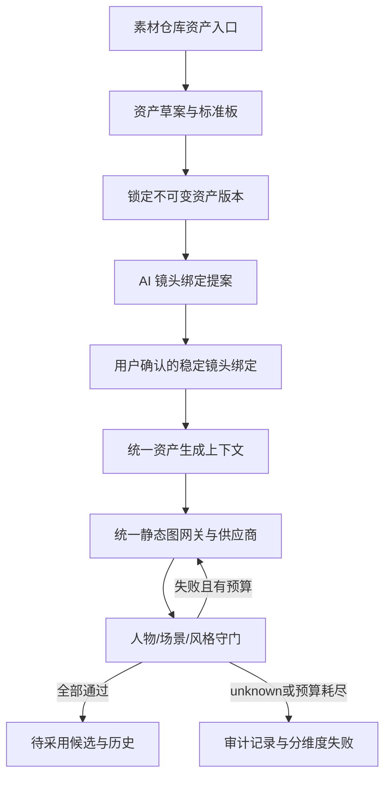
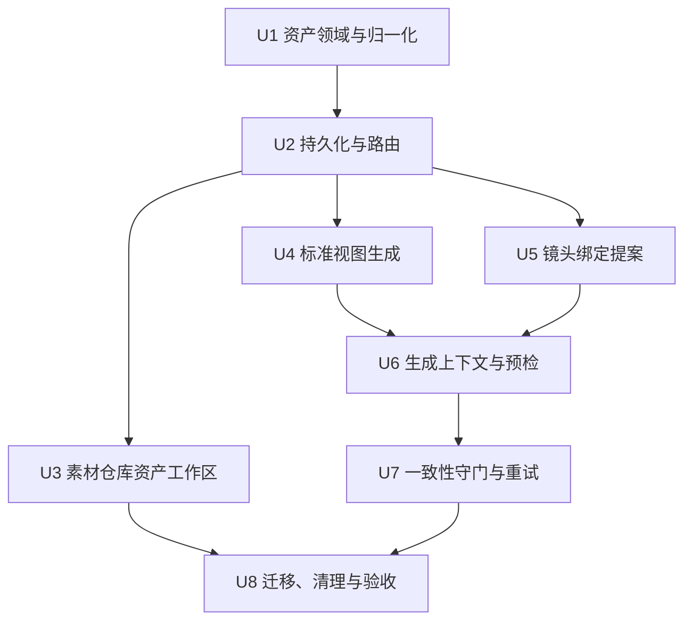
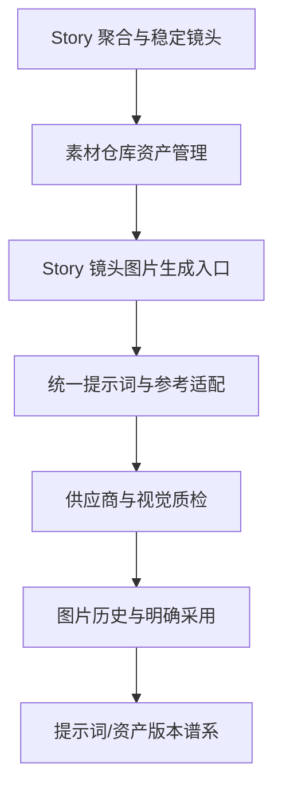

# feat: Story 锁定式视觉资产

## Summary

在现有 Story 聚合内建立版本化视觉资产与稳定镜头绑定，以素材仓库作为唯一管理入口；复用统一静态图网关、参考图注入、视觉模型通道和候选历史，增加资产标准视图生成、付费前 fail-closed 预检，以及最多三次尝试的生成后自动一致性守门。

---

## Problem Frame

当前系统有单人物锚点、故事级美术配方和事后视觉一致性识别，但三者没有形成资产、绑定与验收闭环，人物也从未在真实跨镜头生成中稳定成功。产品行为与成功定义见 origin 文档。

---

## Requirements

- R1. 素材仓库提供当前 Story 独占的人物、场景和风格资产。
- R2. 用户先选资产类型，分析过程不得把同一参考图中的不同控制维度混合。
- R3. 多图参考的固定事实冲突必须显式暴露，冲突未解决不得锁定。
- R4. 人物、场景和风格资产分别生成可检查的标准视图集合。
- R5. 资产草案经用户明确锁定后才可参与正式生成。
- R6. 一个人物资产只代表一套固定脸、发型、服饰和配件造型。
- R7. 场景与风格资产区分固定事实和允许变化的光线、机位等变量。
- R8. AI 提出整组镜头绑定建议，用户确认前不改变正式生成。
- R9. 用户可逐镜覆盖建议；v1 每镜最多绑定一个主要人物、一个场景和一个风格资产。
- R10. 资产固定事实高于镜头临时描述；冲突必须在付费前阻止。
- R11. 付费前验证绑定、版本和参考输入真实可用，禁止无参考静默降级。
- R12. 生成后只针对已绑定维度分别检查人物、场景和风格。
- R13. 未通过结果不进入可采用候选，并在预算上限内携带偏差自动重试。
- R14. 重试耗尽或质检不可用时停止付费、保留审计记录并按维度报告。
- R15. 合格结果沿用现有“候选不自动采用”语义，并可追溯到资产版本与验收。
- R16. 资产更新创建新版本，历史镜头与图片不被静默改义。

**Origin actors:** A1 创作者、A2 资产 Agent、A3 一致性守门员  
**Origin flows:** F1 创建并锁定资产、F2 建立镜头关联、F3 生成验收与重试  
**Origin acceptance examples:** AE1-AE7，覆盖资产创建、冲突、批量绑定、付费前阻断、分维度重试和版本历史。

---

## Scope Boundaries

- 资产只属于当前 Story；不做项目级、个人级或跨用户共享。
- v1 不承诺多人镜头逐人一致，只约束一个主要人物。
- 一个角色资产不含多套造型；换装或换发型创建新资产。
- 不引入三维人物、三维场景或先搭三维画面再渲染。
- 不建设 99 图私人审美学习或满意/不满意训练库。
- 不改变封面和画册现有“付费结果全部保留、质检只提示”的产品语义；新的 fail-closed 守门只作用于已绑定视觉资产的 Story 镜头图片。
- 不删除 `artDirection` 的故事美术配方能力；只替代它作为单人物覆盖式锚点和隐式参考池的职责。

### Deferred to Follow-Up Work

- 多人物镜头逐人绑定与位置约束。
- 资产跨 Story 复制、共享、权限和版本分叉。
- 专用三维/姿态/深度控制管线；只有真实能力验证证明二维参考无法过门槛时再规划。

---

## Context & Research

### Relevant Code and Patterns

- `shared/artDirection.ts` 已包含人物、场景、物件、构图、局部和故事风格角色，以及 Story/scene/shot 作用域与稳定 `assetId`/`shotIdentity` 字段；这些是迁移输入，不足以承担版本化资产聚合。
- `client/src/features/creationEditor/views/MaterialWarehousePanel.tsx` 是当前素材仓库的页面与抽屉入口，已有图片、视频、导入和“AI 建议 → 用户采纳”交互模式。
- `shared/storyMaterial.ts` 与 `server/services/storyMaterials.ts` 提供 Story 级素材投影，已经严格过滤其他 Story。
- `server/services/imageGenerationReference.ts`、`server/services/imageInjection.ts` 和 `server/services/imageGen.ts` 已能区分当前帧、人物、场景/风格参考，并支持人物与风格参考的供应商参数及降级路径。
- `server/services/renderGate.ts` 是静态图提示词唯一权威编译缝；资产固定事实必须在这里作为显式高优先级输入，而不是由各路由自行拼第二套规则。
- `server/services/shotConsistency.ts` 与 `server/services/visionChannel.ts` 已有多图视觉比较、结构化维度、并发限制和错误归一化模式，但当前是单人物锚点的事后建议工具，`unknown` 不应直接复用为新守门的放行语义。
- `server/services/publishingAlbumBackgroundGeneration.ts` 和 `server/services/publishingPersistence.ts` 提供付费任务 operation token、不可变输入快照、taskId 恢复、unknown 不自动重提和幂等 receipt 的成熟模式。
- `server/services/imageAssets.ts`、`image_signals` 与 `generated_images` 已提供图片历史、明确采用和拒绝信号；未通过的付费尝试可以保留审计记录而不进入候选。
- `server/services/storyBodyPersistence.ts` 提供 Story revision CAS；资产、版本和镜头绑定应与 Story 镜头事实共用这一并发边界。

### Institutional Learnings

- `docs/solutions/2026-06-13-故事为唯一单位-镜头按storyId.md` 要求所有 Story 读写同时校验 `storyId + userId`，稳定身份优先于会重排的镜头号。
- `docs/solutions/2026-06-13-多worktree环境数据分裂收敛.md` 与 `AGENTS.md` 要求只在主仓库 3000 端口做运行验证，禁止在 worktree 启动服务或写入 `.webdev/`。
- 功能账本要求保留 Story 隔离、稳定镜头身份、候选显式采用、统一静态图编译和付费任务幂等恢复等既有不变量。

### External References

- 本计划不依赖新的外部库。模型能力和阈值不能靠文档推断，改用仓库内可复现的正/负样例基准与一次明确授权的真实供应商验收决定是否达标。

---

## Key Technical Decisions

- **Story 聚合作为资产真相源：** 资产、不可变版本、镜头绑定和操作 receipt 存在 Story body 的独立子聚合中；像素继续由现有图片记录保存。这样 Story CAS 能保护资产与镜头关系，又不复制图片存储。
- **跨存储采用 staged + receipt：** 付费或上传得到的图片先以不可采用状态落入图片历史，再用 operation token 和 Story CAS 把其 ID 接入资产版本或生成尝试；CAS 失败留下的是可对账孤儿，不会变成当前图或已锁定资产。
- **资产 API 只接收已归属图片身份：** 创建资产从当前 Story 的 image ID 取参考；本地上传先走现有素材导入与类型/大小限制。服务端重新解析所有图片归属和可用性，不接受客户端任意 URL，避免越权引用与服务端代取不可信地址。
- **Story 聚合只保留有界操作状态：** locked 资产版本和已确认绑定长期保留；终态操作 receipt 只保留有界窗口与摘要，逐次生成/质检证据落到现有图片和 signal 历史，避免 Story body 随重试无限增长。
- **一版资产是一块一致的标准板：** 人物转面、场景关系和风格覆盖样例优先在一次生成中形成同一标准板，再确定性切成单独视图。任一视图不合格时生成新版本标准板，不把不同任务中漂移的视图拼成一个版本。
- **旧锚点只迁移为草案：** 现有人物/场景参考和故事美术配方可投影成待确认草案，但没有标准视图和用户锁定就不能自动升级为正式资产。
- **绑定固定到 asset version：** AI 建议和用户确认是两个状态；确认后记录不可变版本 ID，后续资产更新不自动推动历史镜头。
- **统一生成上下文：** 所有 Story 镜头图片入口先解析同一份资产上下文，再进入 `renderGate` 和供应商适配。新资产存在时不再追加 visual canvas 或旧 `artDirection.references` 的隐式全故事参考。
- **最多三次生成尝试：** 一次确认展示初次生成加最多两次自动重试的最坏成本；整组尝试共用不可变输入快照。已受理但缺 taskId/receipt 的状态进入 unknown，禁止自动重提。
- **守门 fail-closed：** 每个绑定维度返回 pass/fail/unknown、证据与置信度；只有全部必需维度高置信 pass 才产生 pending 候选。视觉通道故障、缺结果或低置信都停止而不是放行。
- **先校准再宣称 working：** 用已知正例、故意换脸/换发/换装/改布局/换画风的负例验证零 false-accept 门槛；达不到时功能保持 observing，不以“接口接上了”冒充一致性成立。

---

## Open Questions

### Resolved During Planning

- **标准视图如何生成：** 同一资产版本优先由单次标准板任务生成并切分；重试产生新完整版本，不混拼。
- **自动验收如何起步：** 复用多图视觉通道，以资产固定事实加标准视图作为双重依据；通过仓库内正负基准校准，失败时再决定是否引入专用身份相似度能力。
- **自动重试预算：** 三次总尝试（首次 + 最多两次重试），一次确认最坏成本，重试沿用同一输入快照和付费 receipt 规则。

### Deferred to Implementation

- **供应商对多参考角色的真实上限：** 由 U6 的受控能力探针确认人物、场景和风格组合在当前账号/模型上的实际参数限制；只允许在现有适配器内调整，不绕过统一网关。
- **各维度置信阈值：** 由 U7 的正负样例校准得出；计划只规定零 false-accept 的硬门槛，不伪造纸面数值。
- **标准板切分坐标：** 由最终标准板模板和真实供应商输出确定；必须有面板数量、尺寸与错位检测，不能靠静默硬裁。

---

## Output Structure

    shared/
      visualAssets.ts
      visualAssets.test.ts
    server/
      routers/
        visualAssets.ts
      services/
        visualAssetPersistence.ts
        visualAssetCreation.ts
        visualAssetAssociations.ts
        visualAssetGenerationContext.ts
        visualAssetConsistencyGate.ts
    client/src/features/creationEditor/visualAssets/
      VisualAssetLibrary.tsx
      VisualAssetCreationDialog.tsx
      ShotAssetBindingPanel.tsx

测试文件与实现文件同目录或沿用现有 `server/routers.<feature>.test.ts` 约定；实现时可在不改变职责边界的前提下调整文件拆分。

---

## High-Level Technical Design

> *This illustrates the intended approach and is directional guidance for review, not implementation specification. The implementing agent should treat it as context, not code to reproduce.*

资产状态主线：`draft → generating_views → review → locked → superseded`。`locked` 版本不可原地修改；新版本锁定后旧版本转为可追溯历史，已有镜头绑定保持不变。

---

## Implementation Units

### U1. 视觉资产领域模型与兼容归一化

**Goal:** 定义 Story 级资产聚合、不可变版本、标准视图、绑定提案/确认、生成尝试和操作 receipt 的共享语义，并安全读取旧 Story。

**Requirements:** R1-R7, R9, R15-R16; F1-F3; AE1, AE2, AE7

**Dependencies:** None

**Files:**
- Create: `shared/visualAssets.ts`
- Create: `shared/visualAssets.test.ts`
- Modify: `shared/storyMaterial.ts`
- Modify: `shared/artDirection.ts`
- Test: `shared/artDirection.test.ts`

**Approach:**
- 资产 ID 和版本 ID 为稳定业务身份；视图只保存现有图片 ID、用途与验收状态，不把 URL 当身份。
- 归一化器 fail-closed：未知类型、丢失固定事实、重复版本、跨资产视图或绑定到不存在版本时，不升级为 locked。
- 镜头绑定只认 `stableShotId`；旧 `shotNo` 仅用于展示与受控兼容查找。
- 从现有 `artDirection.references` 和锁定 recipe 生成兼容草案视图，不自动标 locked，也不清除原数据。

**Execution note:** 先用旧 Story body、损坏版本和重排镜头的 characterization tests 锁定兼容边界。

**Patterns to follow:**
- `shared/artDirection.ts` 的归一化与旧数据恢复。
- `shared/publishingDraft.ts` 的版本、operation receipt 与有限集合归一化。
- `shared/shotIdentity.ts` 的稳定身份兼容。

**Test scenarios:**
- Covers AE1. Happy path：人物、场景、风格草案分别归一化为正确类型、视图要求和 draft 状态。
- Covers AE2. Error path：参考固定事实冲突未解决时，即使客户端伪造 locked，归一化后仍不可用于生成。
- Covers AE7. Happy path：版本 2 锁定后，指向版本 1 的镜头绑定保持版本 1。
- Edge case：同一 stableShotId 的重复建议不会覆盖已确认绑定；未知资产/版本引用被标为无效。
- Compatibility：只有旧人物锚点或旧美术配方的 Story 得到草案，不会被静默视为正式资产。

**Verification:**
- 任意旧 Story body 可安全读取；有效 locked 状态必须具有完整、不可变且可追溯的版本。

### U2. Story-CAS 持久化、权限与资产 API

**Goal:** 提供 Story 所有权校验、幂等操作、资产版本写入、锁定、绑定确认和素材投影接口，建立跨 Story 隔离与跨存储对账边界。

**Requirements:** R1, R3, R5, R8-R9, R15-R16; F1-F2; AE2, AE3, AE7

**Dependencies:** U1

**Files:**
- Create: `server/services/visualAssetPersistence.ts`
- Create: `server/services/visualAssetPersistence.test.ts`
- Create: `server/routers/visualAssets.ts`
- Create: `server/routers.visualAssets.test.ts`
- Modify: `server/routers/index.ts`
- Modify: `server/services/storyMaterials.ts`
- Test: `server/services/storyMaterials.test.ts`
- Modify: `server/services/storyBodyPersistence.ts`
- Test: `server/services/storyBodyPersistence.test.ts`

**Approach:**
- 每个读写入口先以 `storyId + userId` 解析 Story，再进行资产操作；不接受 projectId 回退或 latest Story。
- 所有状态变化通过 Story revision CAS 和 operation token；重复请求返回同一 receipt，过期 revision 返回冲突而非覆盖。
- 图片先落现有图片历史，再通过 staged operation 接入资产；CAS 失败或回调迟到时保持不可采用并可对账。
- 创建与分析接口只接收当前 Story 内已解析的 image ID；任意 URL、其他 Story 图片、缺失文件和不支持的 MIME/尺寸在进入视觉模型前拒绝。
- 归一化与写入对终态 operation receipt 做有界保留；资产版本、已确认绑定和审计摘要不随压缩丢失。
- Story material projection 增加资产摘要和绑定状态，但不把资产视图混进普通镜头图或未归属图片。

**Patterns to follow:**
- `server/services/storyBodyPersistence.ts` 的 prepared body + revision CAS。
- `server/services/publishingPersistence.ts` 的 claim/complete/unknown receipt。
- `server/services/storyMaterials.ts` 的 Story-only 投影。

**Test scenarios:**
- Happy path：创建草案、锁定版本、创建新版、确认绑定分别增加 revision 并返回稳定 receipt。
- Covers AE3. Integration：AI 提案写入后不改变有效绑定；确认操作才使指定 stableShotId 使用所选版本。
- Error path：其他用户传入 storyId 无法读写资产或视图图片。
- Concurrency：两个客户端基于同一 revision 锁定不同结果，只有一个成功，另一个得到冲突且不覆盖。
- Idempotency：同一 operation token 重放不创建重复版本、视图或绑定。
- Cross-store failure：图片已生成但 Story CAS 失败时，图片不成为资产视图或镜头候选，并可由对账查询识别。
- Isolation：Story A 的查询、建议和锁定不返回 Story B 的资产。
- Security：传入其他 Story image ID、任意远程 URL 或伪造 asset/version ID 均在视觉调用前拒绝。
- Lifecycle：大量已完成/失败 operation 被压缩后，活动任务、资产版本、绑定和审计摘要保持完整。

**Verification:**
- 资产状态、镜头绑定和图片引用在重试、并发和跨用户输入下均无静默覆盖或串 Story。

### U3. 素材仓库资产工作区

**Goal:** 在素材仓库增加资产分类与创建、检查、锁定、版本浏览入口，同时保留现有图片和视频操作。

**Requirements:** R1-R7, R16; A1-A2; F1; AE1-AE2, AE7

**Dependencies:** U2

**Files:**
- Create: `client/src/features/creationEditor/visualAssets/VisualAssetLibrary.tsx`
- Create: `client/src/features/creationEditor/visualAssets/VisualAssetLibrary.test.tsx`
- Create: `client/src/features/creationEditor/visualAssets/VisualAssetCreationDialog.tsx`
- Create: `client/src/features/creationEditor/visualAssets/VisualAssetCreationDialog.test.tsx`
- Modify: `client/src/features/creationEditor/views/MaterialWarehousePanel.tsx`
- Create: `client/src/features/creationEditor/views/MaterialWarehousePanel.test.tsx`
- Modify: `client/src/features/creationEditor/CreationEditorContext.tsx`
- Test: `client/src/features/creationEditor/editingWorkspaceLayout.test.ts`

**Approach:**
- 页面和 drawer 共用同一资产工作区；资产与现有图片/视频为同级分类，不另建脱离素材仓库的页面。
- 新建流程第一步明确选择人物、场景或风格，再从当前 Story 图片和本地上传中多选参考。
- 草案页显示固定事实、允许变化、冲突、标准板/切分视图、成本与状态；冲突或缺视图时锁定按钮不可用并解释原因。
- 锁定资产后展示版本号和使用镜头数；更新创建新草案，旧版本仍可查看。

**Patterns to follow:**
- `MaterialWarehousePanel.tsx` 的 page/drawer 双形态、导入暂存与错误提示。
- `DirectorAdviceSection` 的 AI 建议与用户明确采纳交互。
- 现有 UI 对付费操作的报价与二次确认模式。

**Test scenarios:**
- Covers AE1. Happy path：选择人物类型与三张图后，只显示人物固定事实和人物标准视图，锁定后出现版本 1。
- Covers AE2. Error path：参考图发型或服饰冲突时展示冲突，锁定保持禁用。
- Edge case：切换 Story 后旧 Story 资产立即消失，迟到查询不能覆盖新 Story。
- Error path：分析、上传或标准板生成失败时草案与已锁定版本保留，可从失败步骤恢复。
- Regression：素材仓库现有图片导入、图片采用、视频复用和 drawer 关闭行为不变。

**Verification:**
- 创作者可完全在素材仓库内完成“选类型 → 选图 → 看草案 → 看标准视图 → 锁定/建新版”。

### U4. 资产分析与标准视图生成

**Goal:** 将多张参考图提炼为分类型固定事实，生成同版标准板并切分为可独立引用的标准视图，且所有付费任务可恢复、不重复购买。

**Requirements:** R2-R7, R11, R16; F1; AE1-AE2

**Dependencies:** U2

**Files:**
- Create: `server/services/visualAssetCreation.ts`
- Create: `server/services/visualAssetCreation.test.ts`
- Modify: `server/services/artAgent.ts`
- Test: `server/services/artAgent.test.ts`
- Modify: `server/services/imageGen.ts`
- Test: `server/services/imageGen.test.ts`
- Modify: `server/services/imageAssets.ts`
- Test: `server/services/imageAssets.test.ts`
- Modify: `shared/imageAsset.ts`

**Approach:**
- 分析提示只允许输出所选类型的固定事实、允许变量、冲突和证据来源；冲突不是自动融合任务。
- 标准板使用类型专属模板：人物转面和关键特写、场景视角关系与俯视、风格跨主体/景别覆盖。
- 一次标准板任务对应一个候选资产版本；切分前验证面板数量、画幅和可读性，切分图作为现有图片记录保存并标为资产视图。
- 生成 claim 持久化不可变输入、报价上限、operation token 和 provider taskId；连接中断且无 receipt 时进入 unknown，不重提。

**Patterns to follow:**
- `server/services/artAgent.ts` 的图片分析与公开结果清洗。
- `server/services/publishingAlbumBackgroundGeneration.ts` 的付费任务恢复和不可变输入快照。
- `server/services/imageAssets.ts` 的图片可用性与投影隔离。

**Test scenarios:**
- Covers AE1. Integration：三张人物参考产生一块标准板及正、侧、背、特写视图，视图 ID 只属于该草案版本。
- Covers AE2. Error path：分析发现固定事实冲突时不提交标准板付费任务。
- Happy path：场景和风格模板分别产生 origin 要求的视图角色，不误用人物模板。
- Error path：标准板缺面板、错位或图像不可读时不允许锁定，原始付费结果保留在审计记录。
- Idempotency：同一 operation token 重放或恢复 taskId 不产生第二次供应商提交。
- Unknown path：供应商可能受理但未取得 taskId 时停止并提示核对，不自动购买新任务。
- Projection：资产视图不出现在普通镜头候选、未归属图片或 publishing cover 中。

**Verification:**
- 每个 locked 资产版本来自一块内部一致、完整可检查的标准板，付费恢复不会重复扣费。

### U5. AI 镜头绑定提案与用户确认

**Goal:** 根据 Story 镜头事实提出整组人物/场景/风格绑定，并提供批量确认与逐镜覆盖，不让建议越权进入生成。

**Requirements:** R8-R10, R16; F2; AE3-AE4, AE7

**Dependencies:** U2

**Files:**
- Create: `server/services/visualAssetAssociations.ts`
- Create: `server/services/visualAssetAssociations.test.ts`
- Create: `client/src/features/creationEditor/visualAssets/ShotAssetBindingPanel.tsx`
- Create: `client/src/features/creationEditor/visualAssets/ShotAssetBindingPanel.test.tsx`
- Modify: `client/src/features/creationEditor/views/MaterialWarehousePanel.tsx`
- Modify: `client/src/features/creationEditor/CreationEditorContext.tsx`

**Approach:**
- 建议输入只含当前 Story 的 canonical shots 与 locked 资产摘要；输出必须解释为何关联或为何不关联。
- 建议与确认分层保存；批量确认写入 stableShotId → asset version 绑定，逐镜覆盖使用同一原语。
- 当镜头文字与资产固定事实冲突时，把冲突作为确认阻断项，而不是自动改镜头或资产。
- 资产新版本只触发“可升级”提示，不自动重写现有绑定。

**Patterns to follow:**
- `MaterialWarehousePanel.tsx` 的导演顾问提案/采纳模式。
- `server/services/directorAdvice.ts` 的结构化视觉建议与稳定镜头匹配。
- `shared/shotIdentity.ts` 的 stableShotId 优先策略。

**Test scenarios:**
- Covers AE3. Happy path：十镜提案中批量确认九镜、单镜改绑一镜，最终绑定与用户确认完全一致。
- Covers AE4. Error path：人物固定短发红外套与镜头长发白衬衫冲突，确认和生成入口都显示阻断。
- Edge case：多人镜头只允许选择一个主要人物，第二个人物选择被明确拒绝而非覆盖第一个。
- Edge case：镜头重排或 shotNo 改变后绑定仍跟随 stableShotId。
- Concurrency：提案生成后资产版本被 supersede，旧提案不可直接确认，必须刷新。
- Isolation：建议器从不读取其他 Story 的同名资产。

**Verification:**
- AI 可以减少逐镜操作，但任何正式绑定都能追溯到一次用户确认，并在镜头重排后保持正确。

### U6. 统一资产生成上下文与付费前预检

**Goal:** 让所有 Story 镜头图片入口解析同一份资产版本快照，按人物、场景、风格职责注入参考和固定事实，并在任何参考失效或冲突时阻止付费。

**Requirements:** R9-R12, R15; F3; AE3-AE4, AE6

**Dependencies:** U4, U5

**Files:**
- Create: `server/services/visualAssetGenerationContext.ts`
- Create: `server/services/visualAssetGenerationContext.test.ts`
- Modify: `server/services/imageGenerationReference.ts`
- Test: `server/services/imageGenerationReference.test.ts`
- Modify: `server/services/imageInjection.ts`
- Test: `server/services/imageInjection.test.ts`
- Modify: `server/services/renderGate.ts`
- Test: `server/services/renderGate.test.ts`
- Modify: `server/services/creationAgent.ts`
- Test: `server/services/creationAgent.test.ts`
- Modify: `server/routers/creationAgent.ts`
- Test: `server/routers.creationAgentCost.test.ts`
- Modify: `server/routers/storyAgent.ts`
- Test: `server/routers.storyAgent.test.ts`

**Approach:**
- 一个 resolver 按 `storyId + userId + stableShotId` 取得确认绑定、不可变版本、标准视图、固定事实、可变项和来源指纹；所有入口只消费该结果。
- 人物参考只锁身份/造型，场景参考只锁空间事实，风格参考只锁美术语言；当前镜头图作为 edit base 时仍保持最高构图事实，但不能改写锁定资产。
- `renderGate` 接收资产契约作为权威高优先级块；各调用方不再自行拼一套资产规则。
- 对 asset-enabled 镜头，任一必需视图缺失、无法 materialize、供应商不支持所需参考职责或文本冲突时，在报价/提交前返回结构化阻断。
- 未建立新资产绑定的 legacy Story 保持旧路径；一旦镜头启用新绑定，不再隐式注入 visual canvas 或旧故事参考池。

**Execution note:** 先为现有各出图入口增加 characterization coverage，再替换为统一 resolver；真实供应商探针必须单独报价并获得明确确认。

**Patterns to follow:**
- `server/services/imageGenerationReference.ts` 的参考职责规划。
- `server/services/renderGate.ts` 的单次权威编译不变量。
- `server/services/imageInjection.ts` 的公网 URL 解析与供应商降级边界。

**Test scenarios:**
- Covers AE4. Error path：镜头文字要求改变锁定造型时，生成函数未被调用且不产生付费 taskId。
- Covers AE6. Happy path：同一绑定允许变更机位、景别、动作和夜间光线，但固定事实块与参考版本指纹不变。
- Integration：素材仓库单图循环、故事板生成/重渲、creation Agent 工具三条 Story 镜头路径解析出相同资产版本上下文。
- Error path：人物参考只有本地失效 URL、场景标准视图缺图、风格图不可用时均 fail-closed，不回落纯文本。
- Provider path：当前供应商不支持人物 + 场景 + 风格职责组合时，付费前明确阻断或选择经验证的现有适配器降级，绝不丢一项后继续。
- Regression：publishing cover、publishing album 和未绑定资产的 legacy 镜头保持现有参考与质检语义。
- Security：客户端伪造其他 Story 的 asset/version ID 时 resolver 拒绝。

**Verification:**
- 任何已绑定镜头无论从哪个 Story 图片入口生成，都使用同一资产快照；没有参考、冲突或职责降级时零供应商提交。

### U7. 分维度一致性守门、自动重试与成本边界

**Goal:** 对每个生成结果执行 fail-closed 人物/场景/风格验收，在同一授权预算内最多尝试三次，只把全部通过的结果投影为 pending 候选。

**Requirements:** R11-R15; A3; F3; AE5-AE6

**Dependencies:** U6

**Files:**
- Create: `server/services/visualAssetConsistencyGate.ts`
- Create: `server/services/visualAssetConsistencyGate.test.ts`
- Create: `tests/fixtures/visual-asset-consistency/manifest.json`
- Create: `tests/fixtures/visual-asset-consistency/README.md`
- Modify: `shared/shotConsistency.ts`
- Test: `server/services/shotConsistency.test.ts`
- Modify: `server/services/visionChannel.ts`
- Test: `server/services/visionChannel.test.ts`
- Modify: `server/routers/creationAgent.ts`
- Modify: `server/routers/storyAgent.ts`
- Modify: `client/src/features/creationEditor/views/MaterialWarehousePanel.tsx`

**Approach:**
- 新守门器以生成快照、各资产固定事实和标准视图为输入；只评估已绑定维度，输出每维 verdict、证据、置信度和可用于下一次生成的具体修正。
- 正例/负例基准先校准 fail-closed 行为：不完整返回、解析异常、模型超时、低置信或 unknown 均不得通过。
- 首次生成与两次重试共享一个授权预算和 operation group；每次尝试先持久化 claim/taskId，再生成、质检、记录结果。
- 失败尝试保存在图片历史并立即记录 rejected/QA metadata，不出现在可采用候选；最终 pass 才记录 pending 候选，不自动 swipe_right。
- 重试提示只加入本轮已证实的偏差，不改变资产版本、镜头事实或用户允许的变量。

**Execution note:** 建立故意换脸、换发、换装、改场景布局和换风格的负例集；零 false-accept 是上线硬门槛，允许较高 false-reject。

**Patterns to follow:**
- `server/services/shotConsistency.ts` 的多图视觉比较与结构化归一化。
- `server/services/staticImageQualityGate.ts` 的缺结果即拒绝。
- `server/services/publishingAlbumBackgroundGeneration.ts` 的预算、恢复和 unknown 语义。
- `server/services/imageAssets.ts` 的 pending/rejected/explicit selection 投影。

**Test scenarios:**
- Covers AE5. Happy path：人物 pass、场景 fail、风格 pass 时只携带场景偏差重试；第二次全 pass 后仅第二张进入 pending 候选。
- Covers AE5. Exhaustion：连续三次场景 fail 后不再调用供应商，返回场景失败摘要，三次尝试均可审计且无候选。
- Covers AE6. Happy path：允许的夜间光线和特写不触发场景/风格误拒，固定布局和媒介仍需 pass。
- Fail-closed：视觉模型缺一个维度、返回 unknown、低置信、非法 JSON 或超时时停止，绝不把图投影为候选。
- Cost：确认页展示三次总尝试上限；未经确认、超过预算或 operation group 已耗尽时供应商未被调用。
- Idempotency：重放成功、失败或 unknown 的 operation token 不重复提交已受理任务。
- History：失败图有资产版本、attempt 序号和 mismatch metadata；成功图有完整 pass 记录但仍非 current。
- Calibration：所有故意漂移负例均被拒绝；真实正例的拒绝原因可读且可人工复核。

**Verification:**
- 守门基准零 false-accept；真实三镜验收前，功能状态不得标 working。

### U8. 旧能力迁移、冲突清理、功能账本与真实验收

**Goal:** 安全迁移可复用旧数据，移除已被新资产取代的单主角/隐式参考入口，完成非付费 UI 验收和经用户确认的最小真实付费一致性验收。

**Requirements:** R1-R16; F1-F3; AE1-AE7

**Dependencies:** U3, U7

**Files:**
- Modify: `client/src/features/storyAgent/views/CardReferenceDock.tsx`
- Test: `client/src/features/storyAgent/views/CardReferenceDock.test.tsx`
- Modify: `client/src/features/storyAgent/StoryAgentContext.tsx`
- Modify: `server/routers/_storyShared.ts`
- Test: `server/routers.storyAgent.test.ts`
- Modify: `server/services/creationAgent.ts`
- Test: `server/services/creationAgent.test.ts`
- Modify: `server/routers/creationAgent.ts`
- Modify: `server/services/promptLineageMigration.ts`
- Test: `server/services/promptLineageMigration.test.ts`
- Modify: `docs/features/feature-ledger.json`
- Modify: `docs/features/README.md` only if the new lifecycle introduces terminology not already documented

**Approach:**
- 旧人物锚点、场景参考和美术 recipe 只生成资产草案入口；用户确认新资产前保持 legacy 行为，确认后切换到新绑定路径。
- 删除或收口“设为主角后覆盖全故事”和“所有 visual canvas 图片隐式进入所有出图”的旧交互；保留卡片参考图作为创作材料和新建资产来源。
- 移除 creation Agent 的单主角 `setCharacterAnchor` 工具及对应路由处理，改为引导用户进入资产创建/绑定；legacy Story 在完成迁移前仍通过兼容读取保持可生成。
- 提示词谱系迁移记录从旧 character/scene reference 来源映射到资产版本来源；历史记录不重写。
- 账本新增持久功能卡，状态先为 observing；只有自动测试、main:3000 非付费 UI 验收、受控付费三镜和人工复核全部通过后才升 working。

**Patterns to follow:**
- `docs/features/README.md` 的功能状态定义和证据要求。
- `docs/features/feature-ledger.json` 中 `unified-static-image-prompt`、`image-asset-history` 与 `story-ownership` 的不变量。

**Test scenarios:**
- Migration：旧单人物锚点 Story 打开资产库时出现人物草案，不自动锁定、不丢原参考。
- Regression：未启用资产的旧 Story 仍能生成；启用新资产的镜头不再收到旧隐式参考。
- Cleanup：移除旧“设为主角”动作后，卡片参考上传、预览和删除仍工作。
- Lineage：新生成图能追溯到人物/场景/风格资产版本；旧记录继续可读。
- Covers AE1-AE7. Integration：在 main:3000 完成资产创建、锁定、AI 绑定提案、批量确认、单镜覆盖、失败提示、版本升级和候选历史的非付费全链路。
- Paid acceptance：经用户明确同意后，用一个人物固定造型、一个场景和一个风格生成三个不同景别/动作/光线的单人镜头；每镜通过自动守门并由人眼确认，记录实际模型、花费、尝试数和失败维度。
- Failure acceptance：刻意输入与资产冲突的镜头要求，在付费前被阻止；模拟视觉通道不可用时不产生候选。

**Verification:**
- 旧能力没有重复入口或隐式控制；新资产链路在真实 Story 中可恢复、可追溯，并以人眼 + 自动证据证明人物、场景和风格一致性，而不是只证明 API 调通。

---

## System-Wide Impact

- **Interaction graph:** Story body 的资产聚合经素材投影进入仓库 UI；确认绑定进入所有 Story 镜头生成入口；结果经视觉守门后才进入图片历史候选和谱系。
- **Error propagation:** 权限、CAS、参考丢失、供应商 receipt 不确定、质检 unknown 和预算耗尽都返回明确状态；任何一层失败都不能被下层解释为“无资产继续生成”。
- **State lifecycle risks:** 图片行与 Story 聚合是跨存储写入；必须用 staged image + operation receipt + CAS 对账，防止孤儿视图、重复付费、迟到回调和资产版本被覆盖。
- **API surface parity:** 素材仓库单图循环、故事板生成/重渲和 creation Agent 工具必须共用资产 resolver；封面、画册和视频生成不纳入本轮新守门。
- **Integration coverage:** 单元测试之外必须验证真实 provider 对人物 + 场景 + 风格多参考的可用性、main:3000 全链路与三镜人眼一致性。
- **Unchanged invariants:** Story 隔离、stableShotId、候选显式采用、统一静态图只编译一次、付费任务不重复购买、历史素材不被删除均保持。

---

## Risks & Dependencies

| Risk | Mitigation |
|------|------------|
| 当前模型无法同时锁人物、场景与风格 | U6 先做受控能力探针；未过真实门槛时保持 observing，不降低标准冒充完成；再决定是否引入专用控制能力。 |
| 视觉模型误把漂移图判为通过 | 使用固定事实 + 多视图、缺结果即拒绝、故意漂移负例集和零 false-accept 上线门槛。 |
| 自动重试造成意外费用 | 一次确认展示三次尝试的最坏总价；operation group 有硬预算和三次上限。 |
| 付费任务网络中断导致重复购买 | 持久化 provider taskId；unknown 状态不自动重提，只恢复同一任务。 |
| Story body 与图片表跨存储不一致 | staged 图片不可采用，Story CAS 接入，operation receipt 幂等，对账识别孤儿。 |
| 旧 artDirection 与新资产同时注入造成冲突 | asset-enabled 镜头只消费新 resolver；旧机制仅在无新绑定时兼容，随后收口重复入口。 |
| 当前工作区已有无关未提交修改 | 实施按文件白名单推进，先复核重叠文件的现有 diff，不回退或覆盖用户工作。 |

---

## Documentation / Operational Notes

- 开始实施前再次读取 `docs/features/feature-ledger.json`；若现有未提交改动已经登记了相邻新功能，先更新影响分析。
- 只在主仓库执行 `pnpm dev`，固定端口 3000；若出现环境异常，第一步运行 `pnpm env:status`。
- 标准视图与镜头图片都可能产生付费任务：自动化测试只用替身；真实生成必须单独显示报价并由用户确认。
- 功能状态先记为 observing；完成后更新权威代码、自动测试、main:3000 UI 证据、真实三镜结果、依赖与已知缺口，并运行 `pnpm feature:validate`。
- 被删除的旧 requirements/plan 仍可从 git 历史查回；当前权威产品定义只认 origin 文档和本计划。

---

## Sources & References

- **Origin document:** [docs/brainstorms/2026-08-21-story-visual-assets-requirements.md](../brainstorms/2026-08-21-story-visual-assets-requirements.md)
- `shared/artDirection.ts`
- `shared/storyMaterial.ts`
- `client/src/features/creationEditor/views/MaterialWarehousePanel.tsx`
- `server/services/storyMaterials.ts`
- `server/services/imageGenerationReference.ts`
- `server/services/imageInjection.ts`
- `server/services/renderGate.ts`
- `server/services/shotConsistency.ts`
- `server/services/visionChannel.ts`
- `server/services/imageAssets.ts`
- `server/services/publishingAlbumBackgroundGeneration.ts`
- `server/services/storyBodyPersistence.ts`
- `docs/features/feature-ledger.json`
- `docs/solutions/2026-06-13-故事为唯一单位-镜头按storyId.md`
- `docs/solutions/2026-06-13-多worktree环境数据分裂收敛.md`
