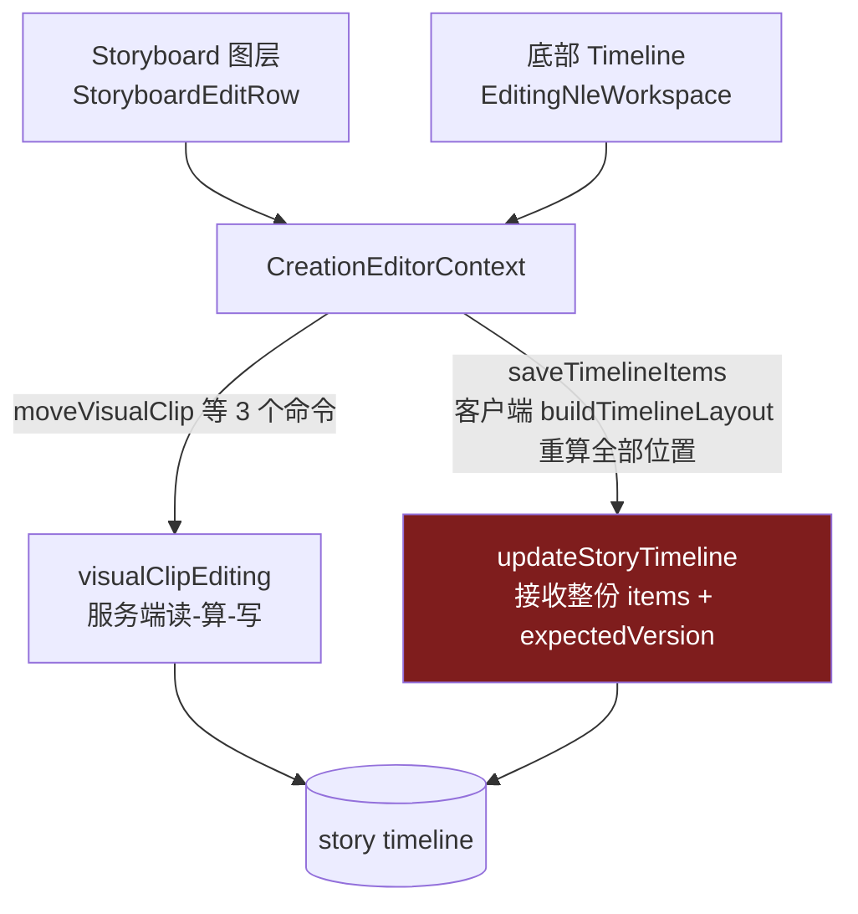
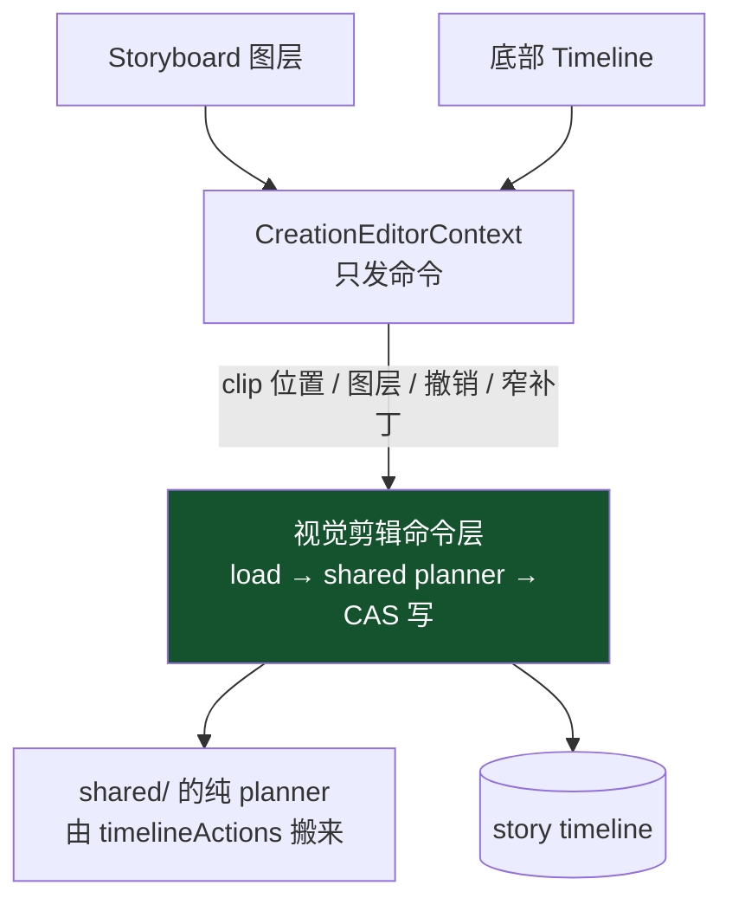

# refactor: 关闭整份 timeline 写入口，位置只走领域命令

## Summary

先加一层只阻止新增债务的静态棘轮，再把 clip 位置这一个事实的写入权从客户端收回服务端：把已经纯净的 7 个 timeline planner 搬到 `shared/`，由服务端"读—算—写"执行，客户端只发领域命令。全部调用方迁完后删掉 `saveTimelineItems` 与 `updateStoryTimeline` 的整份 items 入口，让功能账本里已经宣布、但代码尚未兑现的"唯一写入口"不变量真正成立。

---

## Problem Frame

`extracted-frame-overlay-video` 功能卡第 9 条不变量已写死"不得再上传整份 items 或由客户端持有 expectedVersion"，但 `server/routers/creationAgent.ts` 的 `updateStoryTimeline` 仍接收客户端算好的完整 `items[]`，`CreationEditorContext.saveTimelineItems` 仍用 `buildTimelineLayout` 重算每一项位置后整份写回。同一批坐标同时被新落地的 `moveVisualClip` 家族写着——**同一事实两个 writer**，这正是"拖了没反应、刷新回弹"那一类现象的根因族。

完整证据与债务基线见起源文档。

---

## Requirements

- R1. 冻结当前债务基线，新增静态守卫只阻止新增债务，不让历史债务立刻让全库变红（origin R1–R6）。
- R2. clip 的绝对位置与所属视觉层，生产代码中只能有一个写入者（origin R7–R9）。
- R3. 批量操作（撤销、整层重排、方向整组移动、滚动修剪）同样表达成服务端领域命令，不保留受限的整份写入口（origin R9，用户选定严格方案 A）。
- R4. 一次用户操作只递增一次 timeline version；重复提交同一次移动不产生第二次位移（origin R11）。
- R5. 迁移完成即删除旧入口，不允许新旧并存跨越本轮（origin R12、origin 原则 7）。
- R6. 唯一写入口必须同时定义"它拒绝时人怎么接管"：可见原因 + 一条可执行出路，不许静默 return、静默回弹或把用户锁死（origin R13.1）。
- R7. 服务端四处既有整份写入本轮只盘点登记，但必须证明它们不与新命令争同一 clip 的坐标（origin R10）。
- R8. 验收以主仓 3000 真实链路为准：操作 → 保存 → 刷新 → 不回弹；单测全绿不构成验收（origin R13）。
- R9. 全部现存不变量保持不变，尤其 `extracted-frame-overlay-video` 第 5–34 条与 `storyboard-position-anchors` 第 1–9 条（origin 行为指标）。

**起源验收样例：** AE3（拖动 20 帧并换层，只发一次命令、版本 +1、刷新不回弹）、AE4（移动底层视频，上层 clip id 与绝对帧前后完全一致）、AE5（同一 operation 重试不产生第二次位移）、AE6（试点后 grep 不到整份 items 写回路径）。

---

## Scope Boundaries

- 不改 React / tRPC / Drizzle / 本地持久化。
- 不做 `server/db.ts` 物理拆分。
- 不合并两个剪辑界面，也不在本计划里决定哪个是 canonical——见 Key Technical Decisions 第 1 条。
- 不改变用户可见的剪辑行为、存储格式或页面设计；本计划是纯粹的写入路径收敛。
- 不触发真实付费生成。
- 不动 `server/routers/storyAgent.ts`（视觉资产线在该文件上有待办，已在会话看板登记）。

### Deferred to Follow-Up Work

- `CreationEditorContext` 的四层责任拆分（origin R14–R19）：等本计划证明命令模式有效后另立计划。
- 服务端四处整份写入的迁移（`timelineEditAgent`、`videoTimeline`、`chatCutXml`、`editingTransitionWorkflow`）：本轮只盘点，见 U8。
- `server/archive/` 与 `client/src/features/analysis/` 改名（origin R25–R26）：用户已决定排到收敛之后。
- knip 未用导出清理（origin R20–R24 的首批执行）：用户选择"先拆墙"，随 U7 删除旧 writer 时一并处理。

---

## Context & Research

### Relevant Code and Patterns

- `server/services/visualClipEditing.ts`（187 行）——已落地的命令模式：`load → 纯函数改文档 → 服务端自持版本 CAS 写`。三个函数结构完全同形，是本计划要推广和加固的模板。
- `shared/visualClipModel.ts`（602 行）——纯领域层，操作 `VisualEditDocument { items, overlays?, visualLayerState? }`，返回判别联合 `{status:"ok"|"error"}`。
- **`client/src/features/creationEditor/timelineActions.ts`（653 行）——关键发现：它只 import `@shared/*` 的类型与函数，没有任何 React、DOM 或浏览器依赖，已经是纯函数模块。** 7 个 planner（`planTimelineGroupMove` / `SingleMove` / `RollingTrim` / `MagnetDetach` / `AnchorAdd` / `AnchorRemove` / `Trim`）都产出完整 `items` 数组。它们不是"客户端逻辑"，只是**放错了边**。
- `client/src/architecture-boundaries.test.ts`（284 行，10 条守卫）——已有的静态守卫落点。harness 已经在遍历 `client/src`、`shared` 和 `server` 三棵树并缓存内容（`activeSourcesPromise` / `sharedSourcesPromise` / `serverSourcesPromise`），新守卫直接复用。第 233 行那条"matcher 是否真的匹配它声称的东西"的元测试是本计划新守卫要照抄的写法。
- `server/services/visualClipEditing.test.ts` 与 `shared/visualClipModel.test.ts`——新命令测试的现成骨架（含"移动底层不动上层""重复提交不写库"两个已有断言）。
- **两个剪辑界面都通过 `CreationEditorContext` 写入**：`saveTimelineItems` 的 22 处引用全部位于 `CreationEditorContext.tsx` 一个文件内，`StoryboardEditRow.tsx` 与 `EditingNleWorkspace.tsx` 只消费 context 暴露的函数。这是本计划能在"哪个界面 canonical"未决的情况下推进的技术原因。

### Institutional Learnings

- `docs/solutions/2026-06-13-故事为唯一单位-镜头按storyId.md`——所有按 storyId 的读写必须带 `userId`。新命令全部经 `getStoryTimeline(storyId, userId)`，继承该约束。
- `docs/qa/refactor-coupling-baseline-2026-08-14.md` 2026-08-15 复核——七条"重复"里只有一条成立。本计划只收敛**经证实的同一事实多 writer**，不做字段相似即合并。
- `docs/handoff/2026-08-22-simple-multitrack-editor-architecture-reset.md`——错误 1：不要从修 pointer 事件开始；错误 5：测试通过不等于用户验收。
- 视觉资产线的实战教训（已写入 origin R13.1）：唯一写入口若没有人工接管出路，不变量成立而用户被锁死。

### External References

无。本计划不引入新技术，全部模式在仓库内已有先例。

---

## Key Technical Decisions

- **不需要先决定哪个剪辑界面是 canonical**：两个界面都通过 `CreationEditorContext` 写入，收敛 context 的写路径对两者同时生效。"哪个界面留下"是产品问题，可以在本计划之后独立回答，不阻塞。
- **把 `timelineActions.ts` 搬到 `shared/` 而不是在服务端重写一遍**：它已经是纯函数且有配套测试，搬迁近乎机械。这让"严格方案 A"（批量操作也走服务端命令）从重写降级为移位，是本计划可行的前提。
- **命令层复用 `visualClipEditing.ts` 的既有形状，先抽 `withVisualEditDocument` 辅助函数**：三个现有函数已经把同一段 load/save/错误包装抄了三遍，再加 7 个命令会变成十遍。这个抽象由 3 处既有用例证明，不是预先设计。
- **撤销改为服务端命令日志，而不是保留客户端整份快照**：现在的 undo 存的是完整 `items` 数组，本质上就是一个整份写入口，保留它等于保留旁路。日志方案同时天然满足账本第 30 条（图层顺序、层数、显隐与素材进同一条撤销记录）。
- **幂等按值判定，不引入 operation id**：`moveVisualClip` 已经在目标与当前一致时返回 `changed:false` 且不写库。这满足 R4 的用户可见语义（重试不产生第二次位移），比新增 operation token 简单。付费链路的 operation token 语义不受影响，两者不是一回事。
- **版本冲突重试一次再报错**：服务端自己读版本后立即写，冲突窗口极窄；一次重读重试能吃掉绝大多数真并发，仍失败则按 R6 给出具体原因和"以最新状态刷新后重来"的出路。

---

## Open Questions

### Resolved During Planning

- 严格方案 A 是否可行？——可行。`timelineActions.ts` 已纯净，搬迁即可让服务端执行同一批 planner。
- 是否需要先决定 canonical 编辑面？——不需要，见上。
- 幂等是否需要 operation id？——不需要，既有的按值判定已满足要求。

### Deferred to Implementation

- 7 个 planner 搬到 `shared/` 后的最终文件切分（一个 `shared/timelineCommands.ts` 还是按语义分两个）：等实际搬完看依赖形状再定。
- 服务端撤销日志的存储位置（timeline 文档内的一个字段 vs 独立 sidecar）：取决于 `updateStoryTimeline` 的现有 schema 能否无损容纳，需要打开代码确认。
- 非 timeline 类型的撤销项（`deleted-story-shot` 等）与新日志如何共存于同一个 Cmd+Z 栈：需要读 `timelineUndoStore` 的实际形状。
- 各 planner 迁到服务端后，客户端拖拽预览需要的"落点合法性"预判是否要单独暴露一个只读接口：等 U7 接 UI 时才知道是否必要。

---

## High-Level Technical Design

> *以下用于校验方向，是评审用的示意，不是实现规格。实施者应把它当上下文，不要照抄成代码。*

当前（两个 writer 争同一事实）：

目标（一个 writer）：

命令清单（U3–U6 逐步落地）：

| 命令 | 取代的客户端路径 | 落在哪个单元 |
| --- | --- | --- |
| 已有 `moveVisualClip` / `insertVisualImageClip` / `removeVisualClip` | —— | 已落地，U3 加固 |
| `moveShotGroup`、`moveShotSingle`、`rollingTrim`、`magnetDetach`、`addAnchor`、`removeAnchor`、`trimShot` | `commitTimelinePlan` 的 7 个调用点 | U3 |
| `applyVisualLayerAction` | `manageTimelineVisualLayer` | U4 |
| `undoVisualEdit` | `undoTimeline` 的整份快照回写 | U5 |
| `setShotIncluded`、`reorderShots`、`patchImageTransform`、`removeInnerVideoClip` | `addShotToTimeline` / `removeShotFromTimeline` / `moveShotInTimeline` / `reorderShotInTimeline` / `resetTimelineShots` / `updateTimelineImageTransform` / `removeTimelineVideoClip` | U6 |

---

## Implementation Units

### U1. 架构棘轮：冻结基线，只阻止新增债务

**Goal:** 在动任何产品代码前，让"新增债务"变成一条会失败的测试。本单元不改任何运行时行为。

**Requirements:** R1

**Dependencies:** 无（可与后续单元并行，但应最先落地）

**Files:**
- Modify: `client/src/architecture-boundaries.test.ts`
- Create: `docs/qa/architecture-ratchet-baseline-2026-08-23.md`（基线数字与豁免表）

**Approach:**
- 复用既有的 `serverSourcesPromise` / `activeSourcesPromise` / `sharedSourcesPromise`，不新建遍历。
- 守卫一：直接 import `../db` 的生产文件数不超过基线 49（脚本除外）；超出需在豁免表登记 owner、原因、到期条件，豁免表只减不增。
- 守卫二：tRPC procedure 的 input schema 不得出现客户端计算的位置字段（`timelineStartFrame`、`visualLayer`、`stackOrder`）与 `expectedVersion` 的组合。**本条上线时 `updateStoryTimeline` 会命中，因此先以显式豁免登记它，并在 U7 删除该豁免**——这样棘轮从第一天就指向终点，而不是等收敛完了再补。
- 守卫三：六个热点文件行数不超过基线（`StoryboardReviewBoard` 5612 / `StoryAgentContext` 4528 / `EditingNleWorkspace` 4425 / `CreationEditorContext` 4329 / `StoryboardEditRow` 3992 / `PublishingDraftWorkspace` 3305）。
- 守卫四：视觉赢家比较器、稳定镜头定位器、付费状态解释器各自只有一个权威实现（按导出名与调用图断言，不按字符串相似）。
- `describe` 块标题从"frontend architecture boundaries"改为覆盖前后端的名字——该文件早已在断言 server 源码。

**Patterns to follow:**
- `client/src/architecture-boundaries.test.ts:217` 的 scope 收窄守卫（先列举违例、再断言集合为空，报错信息给出修法）。
- `client/src/architecture-boundaries.test.ts:233` 的元测试写法：为每条新守卫配一条"matcher 确实匹配它声称的东西"的反向断言，防止守卫因正则写错而永远通过。

**Test scenarios:**
- Happy path：当前仓库状态下六条守卫全部通过（基线冻结成立）。
- Covers AE1. Error path：人造一个新增的直接 import `../db` 的生产文件，守卫失败，报错指出应走哪个领域 persistence 或要求登记豁免（owner + 原因 + 到期）。
- Covers AE2. Error path：人造一个接收 `items: [{ timelineStartFrame }]` 的 procedure 源码，守卫失败。
- 元测试：给每条守卫喂一段人造的违例源码字符串，断言 matcher 命中；再喂一段合规源码，断言不命中。
- Edge case：豁免表里登记的文件不计入超限；豁免表出现未登记 owner 或缺少到期条件时测试失败。
- Edge case：`*.test.ts` 与 `scripts/**` 不计入 direct-db 计数。
- Error path：热点文件超过基线一行即失败，错误信息指出当前行数、基线行数与差值。

**Verification:**
- `pnpm exec vitest run client/src/architecture-boundaries.test.ts` 全绿。
- 手工临时给某热点文件加 10 行空行，守卫失败；还原后恢复。
- `pnpm check` 通过。

---

### U2. 把 `timelineActions.ts` 搬到 `shared/`

**Goal:** 让 7 个 planner 能被服务端执行。纯搬迁，零逻辑改动。

**Requirements:** R3

**Dependencies:** 无（建议在 U1 之后，以便守卫先就位）

**Files:**
- Create: `shared/timelineCommands.ts`（由 `client/src/features/creationEditor/timelineActions.ts` 移入）
- Delete: `client/src/features/creationEditor/timelineActions.ts`
- Modify: `client/src/features/creationEditor/CreationEditorContext.tsx`、`client/src/features/creationEditor/views/EditingNleWorkspace.tsx`（改 import 路径）
- Test: `shared/timelineCommands.test.ts`（由 `client/src/features/creationEditor/timelineActions.test.ts` 移入）

**Approach:**
- 该模块只 import `@shared/storyMaterial`、`@shared/timelineEditing`、`@shared/timelineLayout`、`@shared/timelineVisualLayers` 的类型与函数，无 React/DOM 依赖，搬迁后 import 路径由 `@shared/x` 变为 `./x`。
- 现有消费者只有两个文件，改 import 即可。
- **本单元不改任何函数体。** 若搬迁过程中发现必须改动才能编译，说明它并非真纯净，停下来重新评估 U3 的可行性。

**Execution note:** characterization-first——先把 `timelineActions.test.ts` 原样搬到 `shared/` 并跑绿，再动 import 路径。这个模块是后续所有单元的地基，不能带着未知行为搬。

**Patterns to follow:**
- `shared/visualClipModel.ts` 的模块组织与判别联合返回值风格。

**Test scenarios:**
- Happy path：搬迁后 `shared/timelineCommands.test.ts` 全部用例保持通过，断言逐条未改。
- Integration：`pnpm check` 通过，说明两个消费者的 import 已正确改写且类型未漂移。
- Edge case：`client/src/architecture-boundaries.test.ts` 的"shared 不得 import client/server 实现"守卫仍通过——这条守卫正是本单元的安全网。

**Verification:**
- `pnpm exec vitest run shared/timelineCommands.test.ts` 与 `pnpm check` 通过。
- `grep -r "timelineActions" client/src server shared` 无残留引用。

---

### U3. 视觉剪辑命令层：7 个 planner 升为服务端命令

**Goal:** 把 `commitTimelinePlan` 的 7 个调用点改为服务端领域命令，服务端自己读、自己算、自己持有版本。

**Requirements:** R2, R3, R4, R6

**Dependencies:** U2

**Files:**
- Modify: `server/services/visualClipEditing.ts`（抽 `withVisualEditDocument`，新增 7 个命令）
- Modify: `server/routers/creationAgent.ts`（新增对应 procedure）
- Modify: `client/src/features/creationEditor/CreationEditorContext.tsx`（`commitTimelinePlan` 改为调用命令）
- Test: `server/services/visualClipEditing.test.ts`

**Approach:**
- 先抽 `withVisualEditDocument(storyId, userId, mutate)`：封装 load → 纯函数 → `changed` 短路 → CAS 写 → 错误包装。现有三个命令先改为用它，行为不变（这一步本身由现有测试保护）。
- 7 个新命令各自只接收领域参数（如 `{ storyId, shotId, direction }`），**不接收 items、不接收 expectedVersion**。
- 版本冲突时重读重试一次；再失败返回带具体原因的 `{status:"error"}`，并区分"版本冲突，请刷新后重来"与"操作本身不合法"两类错误码——这是 R6 要求的可执行出路的服务端一半。
- `commitTimelinePlan` 在客户端保留为薄封装（保留写锁与"上一步剪辑还在保存中"的串行语义），但内部改为发命令。

**Execution note:** 每个命令先写领域测试再接调用方；7 个命令逐个迁移、逐个删除对应的客户端整份写路径，不要 7 个一起切。

**Patterns to follow:**
- `server/services/visualClipEditing.ts` 现有三个函数的读—算—写形状。
- `server/services/visualClipEditing.test.ts:158` 的"移动底层视频不动上层任何素材"断言写法。

**Test scenarios:**
- Happy path（每个命令一条）：方向整组移动、单镜移动、滚动修剪、取消吸附、加锚点、删锚点、修剪——各自产生预期的位置变化，版本 +1。
- Covers AE4. Edge case：方向整组移动只影响与起始镜头同 `visualLayer` 的镜头，上层 clip 的 id 与绝对帧前后完全一致（账本 `storyboard-position-anchors` 第 7 条）。
- Covers AE5. Edge case：重复提交同一次操作，第二次返回 `changed:false` 且不写库，版本不变。
- Edge case：滚动修剪任一侧被锚点或素材边界阻挡时整次不提交，总结束时间不变（账本第 9 条）。
- Error path：版本冲突时重试一次成功；连续冲突两次返回可区分的错误码与人话原因。
- Error path：clipId/shotId 不存在时返回可见错误，不静默成功。
- Integration：命令执行后重新 `getStoryTimeline` 读出的文档，与命令返回的文档一致（服务端读写自洽）。

**Verification:**
- 7 个命令的定向测试全绿，且既有 `visualClipEditing.test.ts` 用例未改动仍通过。
- `commitTimelinePlan` 内部不再出现 `saveTimelineItems`。

---

### U4. 图层管理命令

**Goal:** `manageTimelineVisualLayer` 的整层重编号改为服务端命令。

**Requirements:** R2, R3, R9

**Dependencies:** U3

**Files:**
- Modify: `server/services/visualClipEditing.ts`
- Modify: `server/routers/creationAgent.ts`
- Modify: `client/src/features/creationEditor/CreationEditorContext.tsx`
- Test: `server/services/visualClipEditing.test.ts`

**Approach:**
- 命令接收 `{ storyId, action }`，服务端读文档后调用既有的 `applyTimelineVisualLayerAction`（该函数已在 shared 侧）。
- 插入、删除、排序必须在一次写入里原子重映射层内全部图片、视频与遗留 overlay（账本第 13、27 条）。

**Patterns to follow:**
- U3 抽出的 `withVisualEditDocument`。

**Test scenarios:**
- Happy path：插入一层、隐藏一层、整层上移、删除空层各自产生预期的层状态，版本 +1。
- Covers AE4. Edge case：整层排序后，层内全部素材（含遗留 overlay）的层号被一致重映射，绝对帧不变。
- Edge case：`visualLayerState.count` 只记显式层数；把素材拖上派生顶层再拖回来不留多余空层（账本第 26 条）。
- Edge case：隐藏一层不改变其它层任何素材的绝对时间（账本第 29 条）。
- Error path：删除非空层未带明确确认时拒绝并给出原因，不静默删素材（账本第 13 条）。
- Error path：删除最高那层派生空白层被拒绝（账本第 32 条）。

**Verification:**
- 定向测试全绿；`manageTimelineVisualLayer` 内部不再出现 `saveTimelineItems`。

---

### U5. 服务端撤销日志

**Goal:** 把 timeline 撤销从"客户端整份快照回写"改为服务端命令日志，消除最后一个天然需要整份写入的场景。

**Requirements:** R3, R5, R9

**Dependencies:** U3, U4

**Files:**
- Modify: `server/services/visualClipEditing.ts`（每个命令记一条日志项）
- Modify: `server/routers/creationAgent.ts`（`undoVisualEdit` procedure）
- Modify: `client/src/features/creationEditor/CreationEditorContext.tsx`（`undoTimeline` 改为调命令）
- Modify: `client/src/features/creationEditor/timelineUndoStore.ts`（timeline 类型的条目改为只存游标）
- Test: `server/services/visualClipEditing.test.ts`、`client/src/features/creationEditor/timelineUndoStore.test.ts`

**Approach:**
- 每个命令在 CAS 写入的同一次操作里追加一条日志项（记录命令类型与足以回退的前值），`undoVisualEdit` 弹出最近一条并原子回退。
- **与非 timeline 撤销项共存**：`deleted-story-shot` 等类型仍走各自的恢复接口，客户端撤销栈保留统一顺序，只是 timeline 类型的条目从"整份快照"变成"服务端日志游标"。
- 账本第 30 条要求图层顺序、层数、显隐与素材进同一条撤销记录——日志方案下 U4 的一次图层命令天然就是一条记录，这条不变量由结构保证而非靠调用方自觉。
- 存储位置待实施时确认（见 Open Questions）。

**Execution note:** 先写"命令 → 撤销 → 文档回到命令前状态"的领域测试，再接客户端。撤销是用户最容易察觉损坏的功能，不接受先切后测。

**Test scenarios:**
- Happy path：执行移动 → 撤销 → 文档与移动前逐字段一致，版本 +1（撤销本身也是一次写入）。
- Covers AE5. Edge case：连续三次命令后连撤三次，逐步回到初始状态，顺序正确。
- Edge case：图层排序命令撤销后，层数、显隐集合与层内全部素材一起还原（账本第 30 条，一次撤销全部还原）。
- Edge case：`changed:false` 的命令不产生日志项，撤销不会"空转一次"。
- Error path：日志为空时撤销返回明确的"没有可撤销的操作"，不抛异常也不静默失败。
- Integration：timeline 撤销与 `deleted-story-shot` 撤销混合入栈时，Cmd+Z 顺序与用户操作顺序一致。

**Verification:**
- 定向测试全绿；`undoTimeline` 内部不再出现 `saveTimelineItems`。

---

### U6. 窄补丁命令

**Goal:** 把剩余借道整份写入、但其实不改 clip 位置的操作，各自收成窄命令。

**Requirements:** R2, R5

**Dependencies:** U3

**Files:**
- Modify: `server/services/visualClipEditing.ts`
- Modify: `server/routers/creationAgent.ts`
- Modify: `client/src/features/creationEditor/CreationEditorContext.tsx`
- Test: `server/services/visualClipEditing.test.ts`

**Approach:**
- `setShotIncluded`（取代 `addShotToTimeline` / `removeShotFromTimeline`）
- `reorderShots`（取代 `moveShotInTimeline` / `reorderShotInTimeline` / `resetTimelineShots`）
- `patchImageTransform`（取代 `updateTimelineImageTransform`，含文字层增删）
- `removeInnerVideoClip`（取代 `removeTimelineVideoClip`）
- 这些操作现在只是"顺手用了整份写入这根管子"，语义上都是单镜头补丁，收窄后爆炸半径最小。

**Test scenarios:**
- Happy path（每个命令一条）：目标镜头字段按预期变化，其它镜头一个不动。
- Edge case：`patchImageTransform` 传 `textOverlay: null` 时删除该图的文字层，不影响同镜头其它图。
- Edge case：`removeInnerVideoClip` 移除最后一个内部片段时，`visualClipsReplacePrimary` 正确回落。
- Edge case：`reorderShots` 重排后 `position` 连续无空洞。
- Error path：目标镜头不在时间线上时返回可见错误（现有客户端已有此校验，迁移后不得丢失）。

**Verification:**
- 定向测试全绿；上述七个客户端函数内部均不再出现 `saveTimelineItems`。

---

### U7. 关闭旧入口

**Goal:** 删掉 `saveTimelineItems` 与 `updateStoryTimeline` 的整份 items 入口，让 U1 的守卫二豁免可以摘除。这是"迁移一个责任就删除一个旧入口"的兑现点。

**Requirements:** R2, R5, R6

**Dependencies:** U3, U4, U5, U6

**Files:**
- Modify: `client/src/features/creationEditor/CreationEditorContext.tsx`（删除 `saveTimelineItems` 及其 11 个调用点残留）
- Modify: `server/routers/creationAgent.ts`（收窄 `updateStoryTimeline` input：去掉客户端计算的位置字段与 `expectedVersion`；若无剩余合法调用方则整体删除该 procedure）
- Modify: `client/src/architecture-boundaries.test.ts`（摘除守卫二的豁免登记）
- Modify: `client/src/features/creationEditor/views/EditingNleWorkspace.tsx`、`views/StoryboardEditRow.tsx`（若有直接依赖整份写语义的残留）

**Approach:**
- 先确认 11 个调用点全部迁完，再删函数；不允许"先删函数再补命令"。
- 同步删除只服务于旧路径的 helper 与其测试（origin R20–R24 的删除标准在此适用：静态不可达 + 不在功能卡权威链路 + 无动态引用 + 定向测试通过）。
- **R6 的客户端一半在此落地**：命令失败时界面必须显示具体原因并给出出路（重试 / 以最新状态刷新后重来）；禁止静默 return 与静默回弹。
- 删除后 `client/src/features/creationEditor/CreationEditorContext.tsx` 行数应显著低于基线 4329——但**行数下降是副产品，不是验收标准**。

**Test scenarios:**
- Happy path：守卫二在摘除豁免后仍全绿，说明生产代码中确实不存在接收客户端位置数组的 procedure。
- Covers AE6. Integration：`grep -r "saveTimelineItems" client/src` 无结果。
- Error path：命令返回版本冲突时，UI 显示可读原因并提供刷新重试入口；模拟连续失败，断言不出现静默回弹（对应账本 `extracted-frame-overlay-video` 第 11 条）。
- Edge case：删除的 helper 若被任何测试夹具或动态 import 引用，删除前必须暴露为失败而非静默通过。

**Verification:**
- `pnpm check`、`pnpm feature:validate`、全量 `pnpm test` 通过（既有的、与本单元无关的失败必须列出文件与证据，不静默忽略）。
- 守卫二豁免表为空。

---

### U8. 服务端旁路盘点、账本更新与主仓 3000 真实验收

**Goal:** 证明剩余四处服务端整份写入不与新命令争同一 clip 坐标；把结果写回功能账本；在主仓 3000 逐项人工验收。

**Requirements:** R7, R8, R9

**Dependencies:** U7

**Files:**
- Create: `docs/qa/timeline-writer-inventory-2026-08-23.md`（四处旁路的盘点结论）
- Modify: `docs/features/feature-ledger.json`（`extracted-frame-overlay-video` 与 `storyboard-position-anchors` 的 history 与 evidence）
- Modify: `docs/handoff/SESSION-BOARD.md`（收工销号）
- Modify: `docs/qa/refactor-coupling-baseline-2026-08-23.md`（按同一口径复测触达文件数，与基线对比）

**Approach:**
- 逐个打开 `timelineEditAgent`、`videoTimeline`、`chatCutXml`、`editingTransitionWorkflow` 的整份写入点，判定它们写的是不是 clip 坐标；是则登记为下一轮迁移目标并说明当前为何不竞争（例如只在生成流程内、与用户拖动不并发），否则登记为"不同事实，不收敛"。
- 账本 history 记录：第 9 条不变量此前为声明状态，本轮由代码兑现。
- 复测触达文件数并如实记录，**下降就写下降，没下降就写没下降**（沿用 2026-08-15 那次 U8 复盘的诚实口径）。

**Test scenarios:**
- Test expectation: none —— 本单元产出文档与账本，不含行为变更；验证由下方的人工验收清单承担。

**Verification（主仓 3000，逐项操作并刷新）:**
1. 拖动一张图片向右，刷新后仍在新位置。
2. 拖动同一图片到上一层，刷新后仍在新层。
3. 一次斜向拖动同时改变位置与层。
4. 对普通视频重复 1–3。
5. 移动底层视频，记录上层全部 clip 的 id 与绝对帧，前后完全一致。
6. 整层排序与显隐，一次 Cmd+Z 全部还原。
7. 连续三次编辑后连撤三次，逐步回到初始状态。
8. 制造一次版本冲突（两个标签页同时操作），确认界面给出可读原因与可执行出路，不静默回弹。
9. `pnpm env:status`、`pnpm check`、`pnpm feature:validate` 全部通过。

---

## System-Wide Impact

- **交互图**：`CreationEditorContext` 是两个剪辑界面的唯一写入枢纽，本计划全部改动收敛在它与 `visualClipEditing.ts` / `creationAgent.ts` 之间。`StoryboardEditRow` 与 `EditingNleWorkspace` 只跟随 context API 变化。
- **错误传播**：命令返回判别联合而非抛异常；客户端必须把 `{status:"error"}` 转成可见提示。R6 要求区分"版本冲突可重试"与"操作不合法"两类，两者的用户出路不同。
- **状态生命周期风险**：撤销日志与 CAS 写入必须在同一次操作内完成，否则会出现"写成功但撤销日志没记"的半状态。U5 的领域测试必须覆盖这一点。
- **接口一致性**：预览、剪辑行与导出共用 `shared/timelineVisualPriority` 的同一比较器，本计划不触碰解析路径，只改写入路径。
- **集成覆盖**：单测证明不了"服务端写完客户端读回来是同一份"，U3 的 integration 场景与 U8 的 3000 验收共同承担。
- **不变的东西**：Story 归属与 userId 校验、稳定镜头身份、视觉赢家规则、候选/采用状态机、付费回执与 CAS 语义、导出行为——本计划一律不改。付费链路的 operation token 与本计划的幂等判定是两件事，互不影响。

---

## Risks & Dependencies

| 风险 | 缓解 |
| --- | --- |
| `timelineActions.ts` 并非真纯净，搬迁时才发现有隐藏依赖 | U2 设为独立单元且 characterization-first；搬不动就立刻停下重估 U3，不硬改函数体 |
| 撤销改造损坏用户最敏感的功能 | U5 先写领域测试再接 UI；保留非 timeline 撤销项的既有路径；3000 验收含连撤三次 |
| 7 个命令一起切导致中途不可用 | U3 要求逐个迁移、逐个删旧路径，每个命令自带测试 |
| 迁移期间新旧并存被当成终态 | U1 的守卫二从第一天就以豁免形式指向 `updateStoryTimeline`，U7 摘除豁免即为完成信号 |
| 与其它会话争用同一文件 | 已在 `docs/handoff/SESSION-BOARD.md` 登记；`server/routers/storyAgent.ts` 归视觉资产线，本计划不碰 |
| `:3000` 是共享 `tsx watch` 进程，改 server 文件会重启并打断在飞的付费出图 | 动 `server/**` 前先确认没有正在进行的生成；主 checkout 只用 `pnpm preview:3000`，不用 `pnpm dev` |
| 行数下降被误当成验收标准 | U7、U8 明确写入"行数是副产品"；验收以真实链路与守卫为准 |

---

## Documentation / Operational Notes

- `docs/qa/architecture-ratchet-baseline-2026-08-23.md`（U1）与 `docs/qa/timeline-writer-inventory-2026-08-23.md`（U8）是本计划的两份长期资产，后续单元复测以它们为口径。
- 功能账本 `extracted-frame-overlay-video` 的 history 需记录"第 9 条不变量由声明兑现为代码"。
- 会话看板需在开工时登记、收工时销号。
- 本计划不需要迁移数据、不需要 feature flag、不需要回滚脚本——所有改动都是写入路径重构，存储格式不变。

---

## Sources & References

- **起源文档：** [docs/brainstorms/2026-08-23-architecture-convergence-requirements.md](docs/brainstorms/2026-08-23-architecture-convergence-requirements.md)
- 交接：[docs/handoff/2026-08-23-architecture-convergence-agent-handoff.md](docs/handoff/2026-08-23-architecture-convergence-agent-handoff.md)、[docs/handoff/2026-08-22-simple-multitrack-editor-architecture-reset.md](docs/handoff/2026-08-22-simple-multitrack-editor-architecture-reset.md)
- 耦合基线与复核：[docs/qa/refactor-coupling-baseline-2026-08-14.md](docs/qa/refactor-coupling-baseline-2026-08-14.md)
- 会话协调：[docs/handoff/SESSION-BOARD.md](docs/handoff/SESSION-BOARD.md)
- 权威代码：`server/services/visualClipEditing.ts`、`shared/visualClipModel.ts`、`client/src/features/creationEditor/timelineActions.ts`、`client/src/architecture-boundaries.test.ts`
