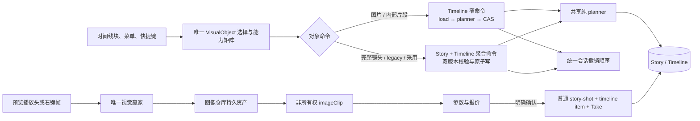
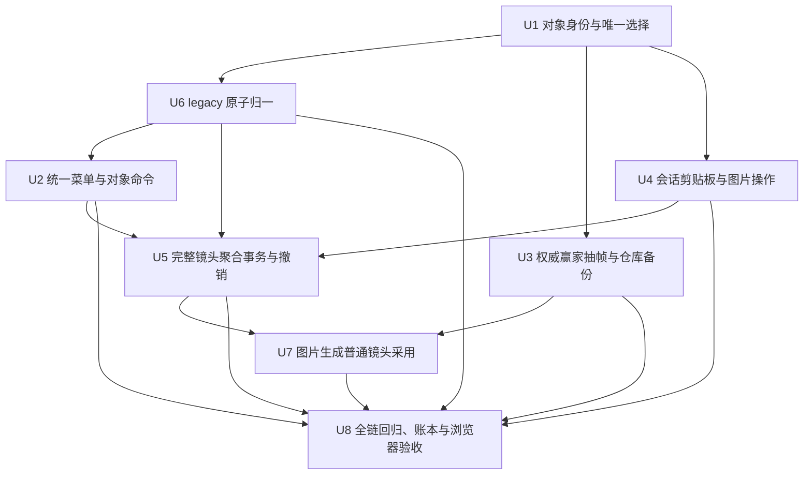

# feat: 统一视觉图层剪辑操作

## Summary

本计划把视觉对象身份、选择、菜单、键盘和服务端命令收敛为一条按对象能力路由的编辑链路；图片与内部片段继续走窄时间线命令，完整故事镜头、legacy 归一和生成采用走 Story + Timeline 聚合事务。抽帧只使用权威预览赢家，先把静帧永久保存到图像仓库，再以非所有权图片块参与“覆盖—抽帧—生成—继续剪辑”的循环。

---

## Problem Frame

当前主层故事镜头、上层故事镜头、内部视频片段和独立图片块虽然投影到同一时间线，却仍由不同的菜单、选择状态和写入路径驱动；因此上层素材能力残缺，重叠下层难以命中，抽帧会二次解析赢家，完整镜头删除又只改 Story body。来源需求要求统一图层能力，但仍严格保留完整镜头、内部片段和独立图片三种对象的安全边界。

---

## Requirements

- R1. 所有持久视觉层使用同一图层语义，视频能力不得由主层、上层或生成来源决定。
- R2. 图层只决定覆盖；被遮挡对象仍可从其轨道直接选择和编辑。
- R3. 时间线只有一个明确对象选择；右键对象先唯一选中，右键空白只保留位置命令；对象类别由创作语义而非存储宿主决定。
- R4. 任意层的完整故事镜头获得完整镜头菜单；内部视频片段只获得片段级命令，不得误触故事结构操作。
- R5. 图片块获得复制、聊聊、删除、生成和条件式锚点操作；无含义的视频命令不显示。
- R6. 不破坏现有逐帧/跨层移动、磁吸、锚点、显隐、稳定赢家、单步撤销和镜头信息列随视频瞬态移动等能力；副本不复制绝对位置锚点。
- R7. 快捷键抽帧使用播放头；右键抽帧使用点击绝对帧并同步播放头；两者都读取最终可见赢家。规划确认：有对象选择时以所选对象层为操作层，否则以显式当前层为操作层；两者都没有时禁用。
- R8. 预览、抽帧和导出共享既有单一赢家规则，不新增透明度或像素混合；隐藏层永不参与赢家。
- R9. 抽帧产物是同绝对时间、严格一帧的普通图片块，位于操作层相邻可见上一层；相邻层隐藏或不存在时原子插入可见层，不改变原隐藏状态或锚定镜头。当前位置无赢家或媒体不可解码时不得伪造黑帧或回退到菜单对象源。
- R10. 抽帧图片可作为普通图片移动、复制、删除、聊聊和生成输入。规划确认：成功取得的静帧先成为图像仓库的持久资产，时间线只保存非所有权引用；移除时间线块或撤销放置不得删除仓库备份。
- R11. 图片生成视频沿用现有参数、报价和确认边界；取消、关闭、重复确认或过期响应不得产生任务、重复扣费或时间线副作用。
- R12. 采用生成结果后只创建普通故事镜头与普通时间线视频项，不再创建新的 legacy overlay。规划确认：视频从首帧图片的绝对时间开始，落在所有来源图片之上的相邻可见层；首帧图对齐视频开头、尾帧图对齐视频结尾，已有图片块不重复创建，仓库资产始终保留。
- R13. 通用会话剪贴板只复制完整故事镜头和图片块；复制读取当前唯一选择并形成不会随播放头、选择或源对象后续变化而漂移的快照，Story 切换或刷新即清空。
- R14. 镜头副本获得新的镜头与内部片段身份，复制用户可见编辑状态和采用媒体，但不复制锚点、独立图片、任务或付费记录；图片副本获得新时间线身份并复用同一仓库资产。
- R15. 键盘粘贴使用播放头和当前层（无当前层则来源层），右键粘贴使用点击帧与点击层；允许重叠、不替换、不推开。规划确认：同起点的新故事镜头排在已有同起点镜头之后，再按新的故事顺序一次性重编号。
- R16. 粘贴副本可独立编辑和删除；时间线对象共享媒体时仍不取得删除仓库原件、Take 或采用历史的所有权。
- R17. 删除完整镜头只删除其 Story 记录、主视觉和拥有的内部视频片段；独立图片必须确定性 rehost 且保持绝对帧、层、时长、变换、稳定堆叠和媒体引用。删除片段或图片只移除目标块；最后一镜不得删除。
- R18. Delete/Backspace 在非编辑控件中立即按当前对象删除；每次成功粘贴、删除及 legacy“归一 + 修改”形成一条原子撤销记录，纯复制和失败操作不占栈。规划确认：撤销仅保证当前编辑会话，刷新或切换 Story 后清空。
- R19. 粘贴和删除成功后刷新不回弹；任何失败都恢复服务端确认态并给出可执行反馈，不允许内存已变、磁盘未写或界面假成功。
- R20. 可解析 legacy overlay 的首次持久修改必须与用户命令同事务、同撤销归一成关联的普通上层故事镜头；选择、复制、抽帧和聊聊等只读操作不触发归一；异常 overlay 保持原状并报错。

**Origin actors:** A1 剪辑用户；A2 时间线与预览系统；A3 付费生成流程。

**Origin flows:** F1 任意图层编辑视频；F2 多图层共同派生新视频；F3 复制、粘贴和直接删除。

**Origin acceptance examples:** AE1–AE3 验证对象选择与任意层操作；AE4–AE6 验证赢家抽帧与生成；AE7–AE11 验证复制、删除、撤销和刷新；AE12 验证 legacy 原子归一；AE13 验证右键对象边界。

---

## Scope Boundaries

- 不增加跨 Story、跨项目或系统剪贴板；刷新后剪贴板与撤销栈均清空。
- 不把镜头内部视频片段加入通用复制粘贴；它只获得片段级剪辑和删除。
- 不删除图像仓库资产、来源视频、生成 Take、采用历史、任务或付费记录；时间线始终是非所有权引用。
- 不新增透明度、蒙版、调色、转场、混合模式或多层像素合成。
- 不改变生成模型、价格计算、报价卡、确认责任和已存在的幂等付费 claim。
- 不重做位置、磁吸、锚点、显隐、导出或镜头信息列模型；只扩展其对象覆盖面并修复已确认的错误分叉。
- 不引入持久化 undo operation log，也不扩展 `story_operations` 数据库 enum；本轮复用会话级统一撤销顺序栈与服务端 CAS 恢复。
- 不在本轮解决静态图片进入最终成片的专用区间编码、真实 MySQL 环境验收或隐藏页面 requestAnimationFrame 测试等既有账本缺口。
- 不顺手迁移所有 `generated_images` 的项目级历史关联；本轮以不可变 imageId/媒体引用保证仓库资产不被时间线操作删除，并继续按 `storyId + userId` 校验当前操作。

### Deferred to Follow-Up Work

- 内部视频片段的通用复制粘贴。
- 跨刷新/跨设备撤销和持久剪贴板。
- 多层透明度或混合模式的真实像素合成。
- 聊天剪辑代理暴露绝对帧移动、滚动剪辑、取消吸附和磁吸拓扑原语。

---

## Context & Research

### Relevant Code and Patterns

- `shared/visualClipModel.ts` 已通过 `projectVisualClips` 把 shot、image clip、owned video clip 和 overlay 投影成绝对帧 `VisualClip`；`moveVisualClip` 是唯一位置写入口，`insertVisualImageClip` 已隐藏图片存储宿主选择，`removeVisualClip` 明确拒绝删除完整 shot。
- `shared/timelineLayout.ts` 的 `resolveTimelineVisualFrame` 是预览、抽帧与导出的权威赢家入口；当前抽帧路径随后又调用视频 resolver，存在同一帧两次裁决的漂移风险。
- `shared/timelineVisualLayers.ts` 已有整层插入与稳定重映射规则，可扩展为“确保操作层上方存在相邻可见层”的纯 planner，不另建图层真相。
- `server/services/visualClipEditing.ts` 的 `withVisualEditDocument` 已实现服务端读、纯函数、CAS、一次冲突重试和成功后才记 undo，适合图片与内部片段的窄命令。
- `server/services/visualEditUndoJournal.ts` 与 `client/src/features/creationEditor/timelineUndoStore.ts` 已形成“服务端 timeline 快照 + 客户端统一操作顺序栈”；结构操作应扩展聚合恢复项，不新建第二套 Cmd/Ctrl+Z 顺序。
- `client/src/features/creationEditor/storyboardEditRow.ts` 的菜单模型仍以 shot 为中心，但 `storyboardEditShouldHandleKey` 已有 editable、锚点和 visual clip 的快捷键避让基础。
- `client/src/features/creationEditor/views/StoryboardEditRow.tsx` 的主层 shot 有完整菜单，上层 shot、内部片段和图片各走不完整的独立路径；内部片段当前只是不可选择的 segment span。
- `client/src/features/creationEditor/views/EditingNleWorkspace.tsx` 只有视频编辑器内部剪贴板；当前抽帧目标层取赢家层而非操作对象层，且视频赢家被二次解析。
- `server/routers/storyAgent.ts` 的 split 路径和 `server/db.ts` 的 Story + Timeline 原子函数提供聚合 CAS 模式；现有 `deleteStoryShot`/restore 仅改 Story body，是 R17–R19 的直接缺口。
- `server/services/editingTransitionWorkflow.ts` 已提供报价、claim、任务续查和 Story + Timeline + Take 采用模式，但当前新结果仍额外写 legacy overlay，且采用层固定为历史规则。
- `server/db.ts` 的本地 `updateStoryTimeline` 目前可能在写盘失败前先改内存；实施必须先补回滚，才能兑现 R19 的失败原状保持。

### Existing Feature Ledger Constraints

- `storyboard-position-anchors`（observing）：必须保持 30fps 整帧、锚点优先、同一赢家、单命令单撤销、`position` 仅表示故事顺序、视频拖动信息列只做瞬态投影并继续只走 `moveVisualClip`。本工作必须真正解决“重叠时下层镜头没有可访问编辑 strip”的已登记缺口，不能只换菜单样式。
- `extracted-frame-overlay-video`（working）：必须保持一帧 imageClip、绝对帧独立于宿主、唯一多轨模型和位置写入口、隐藏层统一退出赢家、付费采用幂等与图层/素材原子撤销。用户已明确批准把“采用后固定 layer 1/目标镜头前”更新为“视频位于来源图片上方、来源图片在仓库永久保留”的统一规则。

### Institutional Learnings

- `docs/solutions/2026-06-13-故事为唯一单位-镜头按storyId.md`：故事是工作单位；所有镜头、图片与时间线读写必须带 `storyId + userId`，不得用“最新故事”或视觉顺序猜归属。
- `docs/solutions/2026-06-13-多worktree环境数据分裂收敛.md`：只能在主仓库固定 3000 端口运行和验收；worktree 不得启动服务或写 `.webdev`，验证前先检查环境状态。

### External References

- 未使用外部资料。本计划优先复用仓库已经验证的视觉赢家、CAS、聚合采用和撤销模式。

---

## Key Technical Decisions

- **创作语义身份位于存储投影之上：** 导出 `VisualClip.origin` 的必要信息，并建立完整镜头、拥有的视频片段、独立图片三类 `VisualObjectRef`；legacy overlay 只是兼容来源，不成为用户需要理解的第四类对象。
- **一个选择控制器、一个能力矩阵：** Story 范围内只保存一个对象选择；右键先更新选择再打开菜单，菜单、键盘、选中样式和“交给聊聊”都从同一对象能力投影产生。`selectedShotNo` 只作为完整镜头选择的兼容投影。
- **轨道命中与预览赢家解耦：** 每个实际块都有可访问、最小可命中的交互 strip；视觉上被遮挡或结构时长只有一帧，不影响从所属轨道选择。扩大命中宽度不得改变结构时长或赢家。
- **命令按事务边界分成三层：** shared 只放纯 planner；图片/内部片段的 timeline adapter 复用 `withVisualEditDocument`；完整镜头、legacy 和生成采用的 aggregate adapter 只调用 DB-owned Story + 完整 Timeline 事务。若保留统一 facade，它只接领域 intent、返回版本/撤销回执，不持有持久化或 undo 状态；客户端不得上传 next Story body、next items 或派生位置。
- **唯一赢家生成捕获描述：** 抽帧服务端只调用一次 `resolveTimelineVisualFrame`，把结果转换为图片引用或视频帧捕获描述；gap、隐藏层或无效媒体明确失败，不再调用第二个视频赢家 resolver。
- **仓库资产与时间线引用分离：** 每次抽帧意图使用可幂等重放的操作身份；视频静帧成功捕获后返回由服务端绑定 `userId + storyId + winner/frame` 的 durable assetId，随后以同一 placement intent 原子执行图层插入与 imageClip 放置。响应丢失、双击或 CAS 重试不得重复捕获资产或重复放置；若资产已保存但放置失败，保留仓库备份并只重试 placement。
- **复制使用值快照和字段白名单：** 快照冻结来源 Story、对象种类、媒体引用、来源层及可见编辑状态；粘贴前服务端重新校验用户、Story 和媒体可用性。镜头与所有内部片段生成新身份，绝不复制锚点、宿主图片、任务或付费事实。
- **稳定插入与 rehost：** 镜头故事顺序按绝对起点确定，同起点副本排在已有同起点对象之后并整体重编号；删除宿主前先钉死全部绝对位置，图片 rehost 只改变持久宿主，不改变时间、层、时长、变换、stackOrder 或 imageId。
- **会话级统一撤销使用可寻址回执：** 服务端为 timeline 与 aggregate 命令统一签发带 operationId、kind、session epoch、before/after Story revision 与 Timeline version 的 undo receipt；服务端按栈顶 receipt 校验和消费，客户端只保存用户操作顺序与不可写回执，不保存可篡改的整份恢复文档。刷新、切 Story 或新标签页建立新 epoch，旧会话撤销请求被拒；恢复失败不消费回执。
- **legacy normalizer 是事务 envelope 的前置阶段：** 命令加载 canonical documents 后、领域 planner 前执行纯归一；normalizer 自身不写库、不记 undo，只返回 normalized working set。move、换层、切割、锚点、片段编辑和删除在同一 envelope 继续；选择、复制、抽帧和聊聊保持只读。只要归一影响 Story/Take 绑定，命令自动升级到 aggregate adapter，禁止 timeline-only writer 半归一。
- **生成结果只走普通 story-shot：** 提案仍使用图片 clip 身份和现有报价/付费状态机；采用事务原子创建普通 Story shot、普通 timeline item、primary video 与 Take adoption marker，不再制造新 overlay。视频层取所有来源图片最高层的相邻可见上一层；首尾图片引用保留在下方并按视频边界对齐。已有 legacy overlays 只作为冲突读取与原样透传，不因采用而触发归一；采用后的 UI 选择是可重试派生状态。
- **数据库变更只限抽帧回执表：** 2026-08-25 用户明确批准新增 additive `timeline_frame_extraction_operations` 表，以在多实例和进程重启后仍保证同一 request 不重复解码、不重复创建仓库资产，并能从 `asset_ready` 状态只重试时间线落位。除此之外仍复用并泛化现有 Story + Timeline 原子函数和客户端统一撤销栈；不扩展 `story_operations`、不建立持久化 undo log，也不改写既有业务行。

---

## Open Questions

### Resolved During Planning

- **快捷键抽帧的操作层：** 有对象选择时取所选对象层；否则取显式当前层；都没有则禁用并说明。
- **无最终赢家：** 抽帧失败且不创建黑帧、透明帧或菜单对象源的替代帧。
- **同帧镜头顺序：** 新镜头排在已有同起点镜头之后，再按新的稳定顺序统一镜号。
- **撤销生命周期：** 只保证当前编辑会话；刷新和 Story 切换后成功结果仍持久，但撤销入口清空。
- **图片与生成视频的关系：** 抽帧先永久进入仓库；视频位于来源图片上方，首/尾图片分别对齐视频边界，时间线删除不影响仓库备份。
- **图片 rehost：** 复用“覆盖该帧的最低层镜头 → 最近前驱 → 第一个剩余镜头”的确定性宿主规则；宿主只负责存储。
- **legacy 首次修改范围：** 只有会持久化改变对象的命令触发归一；选择、复制、抽帧、聊聊不触发。

### Deferred to Implementation

- **可见编辑字段白名单的最终枚举：** 先用 characterization 测试锁定当前 Story shot、primaryVideoEdit、visualClips 和 imageClip 的真实字段，再建立显式复制表；不通过盲目 spread 猜测。
- **统一对象模块的最终文件拆分：** 计划给出责任边界，实施时可在不改变 U-ID 和测试职责的前提下把过小纯模块合并，避免空壳抽象。
- **异常媒体的可重试分类文案：** 服务端需区分临时加载失败与引用永久失效；确切文案在 UI 接线时按现有错误样式确定，不改变失败不落位的语义。

---

## High-Level Technical Design

> *下图说明责任与事务边界，是评审用方向图，不是实现规格。*

### 实施依赖

U-ID 是稳定交接锚点，不因加深而重编号。实际执行按依赖图进行：U6 在 U1 后先建立 normalizer/事务 envelope，再接 U2 与 U5；文档保留原 U-ID 顺序，实施者不得按编号大小猜依赖。

---

## Implementation Units

### U1. 统一视觉对象身份、选择与轨道命中

**Goal:** 建立与存储宿主无关的三类视觉对象身份和 Story 范围内唯一选择，使任意层、任意重叠状态的实际块都可被明确选中。

**Requirements:** R1, R2, R3, R5, R13, R17

**Origin flows:** F1, F3

**Dependencies:** None

**Files:**

- Modify: `shared/visualClipModel.ts`
- Create: `shared/visualObject.ts`
- Test: `shared/visualObject.test.ts`
- Create: `client/src/features/creationEditor/visualObjectSelection.ts`
- Test: `client/src/features/creationEditor/visualObjectSelection.test.ts`
- Modify: `client/src/features/creationEditor/views/EditingNleWorkspace.tsx`
- Modify: `client/src/features/creationEditor/views/StoryboardEditRow.tsx`
- Test: `client/src/features/creationEditor/views/StoryboardEditRow.test.tsx`

**Approach:**

- 导出 `VisualClip.origin` 所需的判别信息，让 UI 从 canonical 投影得到 `story-shot`、`owned-video-clip`、`image-clip`，禁止解析 `shot:`/`image:` 字符串或用 owner 猜对象。
- Story 切换、页面卸载或选中对象在最新文档中消失时清空选择；菜单打开后版本变化或对象消失时关闭菜单并提示，不把命令落到邻近对象。
- 给 story shot、内部 segment 和 image clip 都建立独立 DOM 命中区、选中 ring 和对象类型标识；一帧图片和窄片段只放大交互宽度，不改变结构 duration。
- 完整镜头选择继续投影到现有 `selectedShotNo` 以驱动信息列；图片和内部片段不得错误展开或移动镜头信息列。

**Execution note:** characterization-first。先锁定当前主层选择、上层拖动和信息列投影，再替换选择真相，避免“统一选择”反而破坏现有移动手势。

**Patterns to follow:**

- `shared/visualClipModel.ts` 的判别联合与绝对帧投影。
- `client/src/features/creationEditor/storyboardEditRow.ts` 的纯命中/快捷键规则。

**Test scenarios:**

- Happy path（AE1/AE13）：依次点击主层 shot、上层 shot、内部片段和图片，任一时刻只有一个对象处于选择态，类型标识准确。
- Edge case（AE2）：上层视频完全覆盖下层视频时，下层轨道的交互 strip 仍能选中下层对象，预览赢家不改变。
- Edge case：一帧图片拥有可点宽度但仍投影为 durationFrames=1；窄内部片段不被相邻块吞掉命中。
- Error path：菜单打开后对象被并发删除或 Story 切换，菜单关闭且后续命令不执行。
- Integration（AE3）：选择/拖动完整 shot 才驱动镜头信息列；选择或移动图片不驱动信息列。

**Verification:**

- 三类对象均能从任何视觉层唯一选中；`storyboard-position-anchors` 的“下层无可访问 strip”缺口具备可执行测试证据。

---

### U2. 统一能力矩阵、菜单、键盘与对象级视频命令

**Goal:** 让主层和上层的同类对象获得相同命令，同时把完整镜头、内部片段和图片的安全边界固化为纯能力矩阵。

**Requirements:** R3, R4, R5, R6, R17, R18

**Origin flow:** F1

**Dependencies:** U1, U6

**Files:**

- Modify: `client/src/features/creationEditor/storyboardEditRow.ts`
- Test: `client/src/features/creationEditor/storyboardEditRow.test.ts`
- Modify: `client/src/features/creationEditor/views/StoryboardEditRow.tsx`
- Test: `client/src/features/creationEditor/views/StoryboardEditRow.test.tsx`
- Modify: `client/src/features/creationEditor/views/EditingNleWorkspace.tsx`
- Modify: `client/src/features/creationEditor/useTimelineCommands.ts`
- Modify: `client/src/features/creationEditor/CreationEditorContext.tsx`
- Modify: `shared/timelineVisualClips.ts`
- Test: `shared/timelineVisualClips.test.ts`
- Modify: `server/services/visualClipEditing.ts`
- Test: `server/services/visualClipEditing.test.ts`
- Modify: `server/routers/creationAgent.ts`

**Approach:**

- 由对象能力矩阵生成菜单和快捷键动作：完整 shot 包含锚点、切刀、抽帧、聊聊、移动、层、重排、加镜、复制、删镜；owned clip 只有切割、抽帧、聊聊、移动、层和删片段；图片只有条件锚点、聊聊、复制、删除和生成。
- 主层与上层 story shot 共用同一个菜单组件和命令分发；空白菜单只读取点击位置和剪贴板能力，不携带旧对象删除/复制动作。
- 修正内部片段切刀：按所选 owned clip 在源范围内拆成两个 owned clip，不再错误调用完整故事镜头 split。
- 片段 split/delete、图片 delete 继续走服务端窄命令与唯一位置模型；命令成功才记录 timeline undo 占位，失败 refetch 服务端确认态。
- 扩展快捷键保护到 input、textarea、select、contenteditable、combobox、弹窗、重命名态和显式消费快捷键的控件；`defaultPrevented` 时永不接管。

**Execution note:** test-first。先为上下层参数化同一套菜单断言，再逐项接命令；每迁移一个动作即删除该动作的层级分支。

**Test scenarios:**

- Happy path（AE1）：主层与上层完整 shot 的适用菜单完全一致；内部片段没有复制、故事重排、加镜和删镜；图片没有切刀。
- Happy path：内部片段切割后仍是同一故事镜头拥有的两个片段，Story 镜头数量不变。
- Edge case（AE13）：A 已选中时右键 B，菜单、复制和删除只绑定 B；右键空白不沿用 A/B。
- Edge case：图片锚点能解析稳定镜头时可用，落在间隙或归属不唯一时禁用并给出原因。
- Error path（AE9）：输入框、下拉框、combobox、弹窗或重命名态按 Backspace/Delete 不删除时间线对象。
- Regression（AE3）：逐帧移动、跨层移动、磁吸、锚点和信息列瞬态预览继续使用原命令与原位置真相。

**Verification:**

- 对象能力只随创作语义变化，不随 visualLayer 或历史来源变化；片段命令不会升级为故事结构命令。

---

### U3. 收敛权威赢家抽帧、可见层插入与仓库备份

**Goal:** 把右键/快捷键抽帧收敛为服务端权威赢家捕获，并把“仓库资产持久化”与“相邻可见上层引用放置”分成清晰、可恢复的责任。

**Requirements:** R7, R8, R9, R10, R18, R19

**Origin flow:** F2

**Dependencies:** U1

**Files:**

- Modify: `shared/timelineLayout.ts`
- Test: `shared/timelineLayout.test.ts`
- Modify: `shared/timelineVisualLayers.ts`
- Test: `shared/timelineVisualLayers.test.ts`
- Modify: `shared/visualClipModel.ts`
- Test: `shared/visualClipModel.test.ts`
- Create: `server/services/timelineFrameExtraction.ts`
- Test: `server/services/timelineFrameExtraction.test.ts`
- Modify: `server/services/visualClipEditing.ts`
- Test: `server/services/visualClipEditing.test.ts`
- Modify: `server/routers/creationAgent.ts`
- Modify: `client/src/features/creationEditor/views/EditingNleWorkspace.tsx`
- Modify: `client/src/features/creationEditor/views/StoryboardEditRow.tsx`
- Modify: `client/src/features/creationEditor/CreationEditorContext.tsx`

**Approach:**

- 服务端按 `storyId + userId + timelineFrame` 读取 canonical Story/Timeline，并且只调用一次 `resolveTimelineVisualFrame`；图片赢家复用 imageId，视频赢家复用现有视频帧渲染服务生成仓库资产。
- 每次用户抽帧意图分配一个可重放的 request identity；服务端把它绑定到用户、Story、操作帧、操作层和解析出的 winner descriptor。响应丢失、双击或 CAS 重试复用该身份，返回同一个 durable assetId 与 placement intent，不能再次解码或写第二份仓库资产。
- 客户端只传操作身份、操作帧和操作对象/当前层，不传 takeId、URL、赢家类型或价格；右键入口先 seek 到点击帧，快捷键读取同步播放头。placement 重试只提交服务端签发的 assetId/intent，并重新做 `userId + storyId` 授权。
- 以操作层而非赢家层计算目标层；相邻上层不存在或隐藏时，用共享图层 planner 插入新可见层并重映射全部 shot、image、owned clip、overlay 与 hidden indices。
- 视频帧一旦成功导入仓库即成为持久备份；随后以独立命令原子执行“必要插层 + durationFrames=1 imageClip 放置”，相同 placement intent 最多创建一个 clip。放置成功的 undo receipt 只撤 imageClip 与该操作创建的整层重映射，永不撤仓库资产；放置失败保留仓库资产、不给时间线 undo，并提供从该资产重试放置的反馈。
- 删除 `extractFrameAtPlayhead` 的二次 `resolveTimelineVideoSource` 裁决和简单 `source.visualLayer + 1` 目标层逻辑。

**Patterns to follow:**

- `resolveTimelineVisualFrame` 与 `shared/timelineVisualPriority` 的稳定赢家规则。
- `insertVisualImageClipForStory` 的服务端读—算—CAS—成功后 undo 模式。
- 现有视频帧端点服务的 Take/range/source-time 校验。

**Test scenarios:**

- Happy path（AE4）：在下层视频右键 8 秒、上层视频是赢家时，播放头到 8 秒，仓库图片内容来自上层赢家，但 imageClip 落在下层操作对象的相邻可见上层。
- Happy path（AE5）：快捷键使用播放头和当前选择层；无选择时使用 active layer。
- Edge case：隐藏层永不成为赢家；相邻隐藏层保持隐藏并整体上移，新插层可见；原素材绝对帧不变。
- Edge case：锚点赢家优先于更高普通层；抽帧不会移动、裁剪或解锚任何 shot。
- Edge case：图片赢家复用同一仓库 imageId，新增 clip 获得新身份且结构时长严格一帧。
- Error path：gap、无 active layer、媒体失效或视频解码失败均不创建 timeline block；不得产生黑帧或回退源。
- Error path：仓库写入成功、时间线 CAS 失败时仓库图片仍可见，timeline/undo 不变并显示重试入口。
- Idempotency：模拟双击、响应丢失和 CAS 冲突后重试，仓库最多产生一个本次捕获资产，时间线最多产生一个 placement；若是图片赢家则始终复用原 imageId。
- Undo：放置曾插入新层时，一次 undo 同时移除 imageClip 并恢复全部 layer/hidden indices，仓库 assetId 仍可重新放置。
- Integration：相同帧的 preview、extract descriptor 和 export winner 得到相同对象与稳定 tie-break。

**Verification:**

- 抽帧不再存在第二套赢家解析；任何成功捕获的静帧都能在仓库找到，时间线删除不会影响它。

---

### U4. 建立 Story 范围剪贴板与独立图片复制粘贴删除

**Goal:** 先为独立图片完成稳定快照、键盘/右键落点、非所有权副本、直接删除和会话生命周期，再为 U5 的镜头结构操作复用同一交互协议。

**Requirements:** R5, R13, R14, R15, R16, R17, R18, R19

**Origin flow:** F3

**Dependencies:** U1

**Files:**

- Create: `shared/visualObjectClipboard.ts`
- Test: `shared/visualObjectClipboard.test.ts`
- Create: `client/src/features/creationEditor/visualObjectClipboard.ts`
- Test: `client/src/features/creationEditor/visualObjectClipboard.test.ts`
- Create: `shared/visualObjectOperations.ts`
- Test: `shared/visualObjectOperations.test.ts`
- Modify: `server/services/visualClipEditing.ts`
- Test: `server/services/visualClipEditing.test.ts`
- Modify: `server/services/visualEditUndoJournal.ts`
- Modify: `server/routers/creationAgent.ts`
- Modify: `client/src/features/creationEditor/useTimelineCommands.ts`
- Modify: `client/src/features/creationEditor/CreationEditorContext.tsx`
- Modify: `client/src/features/creationEditor/views/EditingNleWorkspace.tsx`
- Modify: `client/src/features/creationEditor/storyboardEditRow.ts`
- Modify: `server/db.ts`
- Test: `server/db.localPersistenceFailure.test.ts`

**Approach:**

- 剪贴板保存版本化、不可变快照：sourceStoryId、kind、sourceLayer、imageId/媒体引用、duration、transform 和可见参数；不保存 ownerStableShotId 作为语义所有者。
- 复制从 canonical 文档生成快照，纯复制不入 undo；改变选择、播放头、源块位置或删除源块后，快照值仍不漂移。刷新、Story 切换和编辑器卸载清空。
- 键盘粘贴使用播放头和当前层/来源层，右键粘贴使用点击帧/层；服务端生成新 clip identity、重新校验 imageId 属于当前用户可用资产，并复用原 imageId。
- 图片 duplicate/delete 的纯 planner 位于 shared；服务端 adapter 复用 `withVisualEditDocument`，统一 facade 若存在只转发领域 intent，不持有 DB 或 undo 状态。图片删除只移除 clip，资产记录、历史和其它引用不变。
- 成功 paste/delete 各返回一条可寻址 timeline undo receipt，失败不占；U5 会把同一 receipt 协议扩展到聚合命令，客户端顺序栈不再保存可写快照。
- 修复 `server/db.ts` 本地 timeline 首次创建与更新两条路径：在持久化锁内构造隔离 next-state，耐久化成功后才发布到 `memoryState`；若现有写法必须先交换，则需完整深拷贝并在失败时恢复。不得用会被后续并发写污染的浅引用回滚。

**Execution note:** 先补本地持久化失败 characterization，再接 copy/paste/delete；R19 的回滚门禁未通过前不得开启 UI 快捷键。

**Test scenarios:**

- Happy path（AE8）：复制带时长/变换的图片并在另一层重叠粘贴，副本参数一致、clip id 不同、imageId 相同，原块不被推开。
- Happy path（AE11）：复制后改变选择与播放头，仍粘贴原快照；刷新或 Story 切换后粘贴入口为空。
- Edge case：源块在复制后移动或删除，只要仓库媒体仍有效，快照仍可粘贴；媒体永久失效则可见失败。
- Edge case（AE13）：右键图片 B 先选 B，复制/删除不使用之前的 shot A。
- Error path（AE10）：timeline 持久化失败后内存、磁盘、刷新结果和 undo depth 全部保持 before。
- Error path：首次创建与更新分别注入目录、写入和原子替换失败；并发前后两次写中前一次失败不得回滚或污染后一次成功结果。
- Undo（AE8）：粘贴一次、删除副本一次，各自一次 Cmd/Ctrl+Z 完整恢复对应操作；纯复制不占栈。

**Verification:**

- 图片副本与原块独立编辑但共享仓库资产；任何时间线删除都不能减少仓库实体数量。

---

### U5. 完整镜头复制粘贴、聚合删除 rehost 与单步恢复

**Goal:** 用服务端 Story + 完整 Timeline 聚合 CAS 取代 body-only 删除，完成完整镜头 identity remap、稳定故事插入、独立图片 rehost 和统一会话撤销。

**Requirements:** R3, R6, R13, R14, R15, R16, R17, R18, R19

**Origin flow:** F3

**Dependencies:** U2, U4, U6

**Files:**

- Modify: `client/src/features/storyAgent/storyShotEditing.ts`
- Test: `client/src/features/storyAgent/storyShotEditing.test.ts`
- Modify: `shared/visualObjectOperations.ts`
- Test: `shared/visualObjectOperations.test.ts`
- Modify: `shared/visualClipModel.ts`
- Create: `server/services/storyVisualObjectEditing.ts`
- Test: `server/services/storyVisualObjectEditing.test.ts`
- Modify: `server/services/storyTimelineEditing.ts`
- Modify: `server/services/visualEditUndoJournal.ts`
- Create: `server/services/visualEditUndoJournal.test.ts`
- Modify: `server/db.ts`
- Create: `server/db.visualObjectStoryMutation.test.ts`
- Modify: `server/routers/storyAgent.ts`
- Test: `server/routers.storyAgent.test.ts`
- Modify: `server/routers/creationAgent.ts`
- Modify: `client/src/features/creationEditor/timelineUndoStore.ts`
- Test: `client/src/features/creationEditor/timelineUndoStore.test.ts`
- Modify: `client/src/features/creationEditor/CreationEditorContext.tsx`
- Modify: `client/src/features/creationEditor/views/EditingNleWorkspace.tsx`

**Approach:**

- 在服务端从 canonical Story/Timeline 构造 shot 快照；复制字段采用显式白名单，生成新的 stableShotId/shotIdentity/shotKey/shotNo 和全部内部 clip id，复用 Take/range/图片媒体引用，剔除锚点、imageClips、绝对落点、stackOrder、任务、receipt 和付费记录。
- 粘贴先分配全部新身份，再一次性建立 Story shot 与 timeline item；目标 frame/layer 来自键盘或右键上下文。故事插入按绝对起点，同起点插在已有同起点对象之后，最后统一 position/shotNo。
- 删除前 materialize 全部绝对位置，移除目标 Story shot/timeline item；主视觉和 owned visualClips 随 item 删除，imageClips 逐个按确定性宿主规则 rehost。最后一镜在 planner 和路由两层拒绝。
- shot aggregate adapter 只把领域 intent 交给 U6 的 Story + Timeline envelope；shared planner 负责 identity/remap/rehost，DB primitive 负责锁、CAS 与写入，adapter 不持有持久化或 undo 状态。
- 泛化现有 Story + Timeline 原子写模式：SQL 固定按 Story → Timeline 取得锁并校验双版本，本地在同一锁内安全发布；调用方不能上传任意 Story body/items。数据库 harness 并发执行同 Story paste/delete，CAS loser、deadlock/serialization retry 都必须零副作用。
- 把 `visualEditUndoJournal` 扩成 timeline/aggregate 判别 entry，并按 `userId + storyId + editorSessionEpoch` 隔离；每次成功命令签发栈顶可寻址 receipt，保存 operationId、kind、before/after revisions/versions 和受影响 identity fingerprint。客户端统一栈只排序 receipt。
- aggregate undo 在同一事务校验 expected-after revision/version、受影响 identity 和媒体引用，再原子恢复 Story、items、overlays、visualLayerState 与 image host。图片在删除后又被移动、对象被继续编辑或版本不匹配时拒绝恢复且不消费 receipt；持久化失败也必须保留栈顶。

**Execution note:** characterization/test-first。先证明当前 delete 只改 body 的缺口，再用同一组测试驱动聚合 delete/restore；镜头复制字段白名单必须由测试锁定，不能用对象 spread 快速通过。

**Patterns to follow:**

- `server/db.ts` 中现有 Story + Timeline 插入/恢复与 Story + Timeline + Take 采用事务。
- `server/services/visualClipEditing.ts` 的 CAS 冲突分类和成功后 undo 记录。
- `shared/visualClipModel.ts` 的绝对位置 materialize 与图片宿主选择。

**Test scenarios:**

- Happy path（AE7）：复制带描述、采用媒体和内部切割的 shot，在另一时间/层粘贴；所有对象 identity 全新，可见编辑状态保留，锚点/独立图片/任务未复制。
- Edge case（AE7）：新镜头与已有镜头同起点时排在同起点组末尾；所有 shotNo/position 唯一连续，重叠赢家刷新前后一致。
- Happy path（AE9）：删除宿主 shot 后，owned clips 消失，独立图片只改变 host，绝对帧/层/时长/变换/stackOrder/imageId 不变。
- Safety（AE9）：最后一镜删除被禁用；删除 shot 或图片不删除 Take、generated image、采用历史或生成记录。
- Undo（AE7/AE9）：shot paste/delete 各只占一格；一次 undo 完整恢复 Story + Timeline + rehost，且与 timeline-only 操作交错时仍按用户顺序。
- Undo ordering：执行 timeline A → aggregate B → timeline C 后连续撤销三次，服务端逐次核对对应栈顶 receipt；B 因并发冲突失败时 B 仍在栈顶，A/C 不被误消费。
- Session isolation：刷新、切 Story 或另开同 Story 标签页产生新 epoch；旧 receipt 请求被拒，不同标签页不能互相 pop。
- Safety：删镜 rehost 后再移动其中一张图片，旧删镜 undo 被拒且 Story/Timeline/undo 栈均无部分变化；Image、Take、generated image、采用历史和付费记录计数恒定。
- Error path（AE10）：任一 Story/Timeline CAS、SQL/local persist 或媒体校验失败时两份事实都保持 before，UI refetch 后不回弹。
- Error path：undo 自身持久化失败时恢复 entry；数据库并发 harness 证明固定锁顺序、幂等唯一约束和安全重试，真实 MySQL 人工验收仍记录为既有缺口。
- Concurrency：命令进行中切换 Story，晚到响应只更新原 storyId，不覆盖新 Story 选择或剪贴板。

**Verification:**

- `deleteStoryShot`/restore 不再存在 body-only 成功路径；shot 结构变更与 Timeline 永远同成同败。

---

### U6. 建立 legacy normalizer 与修改事务 envelope

**Goal:** 把零散 overlay 兼容逻辑收敛为所有持久修改命令共用的纯前置，并先建立 U2/U5 可复用的 Story + Timeline command envelope；最终撤销回执由 U5 统一接通。

**Requirements:** R1, R3, R4, R6, R17, R18, R20

**Origin flow:** F1

**Dependencies:** U1

**Files:**

- Create: `shared/legacyOverlayNormalization.ts`
- Test: `shared/legacyOverlayNormalization.test.ts`
- Create: `server/services/storyTimelineEditing.ts`
- Test: `server/services/storyTimelineEditing.test.ts`
- Modify: `server/services/visualClipEditing.ts`
- Test: `server/services/visualClipEditing.test.ts`
- Modify: `server/db.ts`
- Test: `server/db.storyTimelineOverlay.test.ts`
- Modify: `server/routers/storyAgent.ts`
- Test: `server/routers.storyAgent.test.ts`
- Modify: `client/src/features/creationEditor/CreationEditorContext.tsx`
- Modify: `client/src/features/creationEditor/views/StoryboardEditRow.tsx`

**Approach:**

- 纯 normalizer 验证 overlay、sourceStableShotId、Story shot、timeline item、Take/primaryVideoEdit 引用均可建立一一对应；保留绝对帧、真实 visualLayer、媒体范围、效果、变换和可见赢家，返回删除恰好一条 overlay 的 normalized working set，但自身不写库、不记 undo。
- command envelope 固定执行“加载 canonical Story/Timeline → 必要时 normalize → 领域 planner → 一次 CAS”；所有持久修改目标复用该 envelope 执行 split、move、换层、锚点、视频编辑或 delete，移除当前 move/split 等命令中的零散两步迁移。
- 归一只改变 Timeline 时仍可使用 timeline adapter；一旦改变 Story 或 Take binding，envelope 自动升级为 aggregate adapter。任何命令都不能先用 timeline writer 归一，再用另一 writer 执行目标动作。
- 只读操作继续对 overlay 的 canonical 关联对象工作但不写库；异常 overlay 可选中查看错误，不伪装成可拖、可删的普通块。
- U6 返回一次命令所需的完整 before/after 事实，U5 将其签成统一 aggregate undo receipt；在 U5 完成前不得单独启用 legacy 修改 UI，避免阶段性交付暴露没有统一撤销的路径。

**Execution note:** U-ID 保持不变，但本单元按依赖图在 U1 后、U2/U5 前实施；不要先上线 U2/U5 再横切补 normalizer。

**Test scenarios:**

- Happy path（AE12）：首次对合法 overlay 执行切割、移动、换层、锚点、编辑和删除，分别在一次事务中归一并完成命令，无重复块或闪回。
- Edge case：选择、复制、抽帧和聊聊合法 overlay 不改变 Story revision、Timeline version 或 undo depth。
- Error path（AE12）：source shot、timeline item、Take 或媒体引用缺失，或同 source 出现无法消歧的 overlay 时，原 Story/Timeline 完全不变并给出原因。
- Undo（AE12，与 U5 联合）：一次 receipt 同时撤销用户修改和归一，恢复原 overlay 的时间、层、媒体与可见结果；没有“只撤归一”的中间状态。
- Regression：预览/导出仍能读取尚未修改的 legacy overlay；新操作不会再写新的 overlay。

**Verification:**

- 生产修改命令中不再存在各自私有的 overlay 迁移分支；所有分支共享同一 normalizer 与聚合回滚证据。

---

### U7. 接通图片报价确认与普通故事镜头采用

**Goal:** 保留现有付费状态机，把图片对的时间线身份、仓库备份和新采用落位接到普通 story-shot 模型，完成可重复的“图片—视频—再剪辑”循环。

**Requirements:** R8, R10, R11, R12, R16, R19

**Origin flow:** F2

**Dependencies:** U3, U5

**Files:**

- Modify: `shared/extractedFrameTransition.ts`
- Test: `shared/extractedFrameTransition.test.ts`
- Modify: `client/src/features/creationEditor/views/StoryboardEditRow.tsx`
- Modify: `client/src/features/creationEditor/views/ExtractedFrameTransitionRequirementsDialog.tsx`
- Test: `client/src/features/creationEditor/views/ExtractedFrameTransitionRequirementsDialog.test.tsx`
- Modify: `client/src/features/storyAgent/types.ts`
- Modify: `client/src/features/storyAgent/editingTransitionPersistence.test.ts`
- Modify: `client/src/features/storyAgent/StoryAgentContext.tsx`
- Test: `client/src/features/storyAgent/StoryAgentContext.intent.test.tsx`
- Modify: `client/src/features/storyAgent/components/EditingTransitionCandidateCard.tsx`
- Test: `client/src/features/storyAgent/components/EditingTransitionCandidateCard.test.tsx`
- Modify: `server/services/timelineEditAgent.ts`
- Test: `server/services/timelineEditAgent.test.ts`
- Modify: `server/services/editingTransitionWorkflow.ts`
- Test: `server/services/editingTransitionWorkflow.test.ts`
- Modify: `server/db.ts`
- Create: `server/db.generatedVisualShot.test.ts`
- Test: `server/db.editingTransitionSubmissionClaim.test.ts`
- Modify: `server/routers/creationAgent.ts`
- Test: `server/services/storyMaterials.test.ts`
- Test: `server/services/videoExport.test.ts`

**Approach:**

- 提案与 candidate 贯穿 image clip identity，并由服务端用 imageId 交叉校验仓库资产；不再只用可能出现在多个时间线块中的 imageId 猜起点和层。
- 首/尾图片的 canonical 绝对帧定义视频边界；已有 imageClip 直接复用，仓库-only 输入在明确生成上下文中建立非所有权边界引用，不重复复制资产。
- 目标视频层取参与生成图片最高 visualLayer 的相邻可见上一层；如果该层隐藏或不存在，采用事务使用 U3 图层 planner 插入可见层。首图留在视频开头下方，尾图留在视频最后一帧下方。
- 报价、拒绝、幂等确认、供应商 taskId 续查、Take 保存和锚点预检沿用现有状态机；请求与晚到响应绑定 storyId、candidate identity 和事实版本，Story 已切换时不得落到新上下文。
- 采用事务按固定 Story → Timeline → Take 锁顺序，原子创建 Story shot、普通 timeline item、primaryVideoEdit/Take adoption marker 和必要的边界 imageClip 引用；candidate/provisional stable identity 由数据库唯一约束保护。保留 visualLayerState 与所有 legacy overlays，但不新增也不归一 overlay。
- 现有 apply 之后的 timeline selection 与界面 active selection 降为可重试派生状态：其失败不能把已经原子采用的 Take 标回“未采用”。重试先按 candidate/provisional identity 检测已存在的 shot/item/Take 并向前修复派生状态，绝不重复插入或扣费。
- 采用后的 UI 最终选中新普通 shot，菜单获得 U2 的完整能力；取消/拒绝/重复确认/采用失败均不产生半条 Story/Timeline/Take 事实。

**Execution note:** 先用既有 workflow 测试锁住报价、claim、付费任务恢复和幂等边界，再只替换 apply 阶段的数据落位；禁止重写整条付费状态机。

**Test scenarios:**

- Happy path（AE6）：报价后取消，没有 provider task、Take 或 timeline 变化；再次确认并采用后创建普通 story shot，可切割、抽帧、复制和删镜。
- Happy path：首/尾图片仓库记录均保留；首图位于视频起点下方、尾图位于视频最后一帧下方，已有 clip 不重复。
- Edge case：来源图片位于更高层或相邻层隐藏时，生成视频仍落在所有来源图的相邻可见上层，原隐藏状态和其它素材绝对帧不变。
- Edge case：重复确认或恢复同一 candidate 最多提交一次供应商任务并最多创建一个 stable shot/timeline item。
- Error path：报价过期、图片失效、Story 切换、锚点冲突、供应商失败或采用 CAS 失败，不产生半条普通 shot/overlay；已付费 Take 按既有恢复语义保留。
- Recovery：分别在 aggregate apply 后、timeline selection 后和 Take/UI 派生状态更新前注入失败；重试最终收敛到一个 shot、一个 item、同一 Take 与同一 claim/receipt，不把已采用事实谎报为未采用。
- Concurrency：两个确认同时采用同一 candidate 时，数据库唯一约束和固定锁顺序保证只有一个赢家；CAS loser/deadlock/serialization retry 不产生第二任务、第二镜头或部分图片引用。
- Regression：现有 instruction、运动幅度、1–8 秒与价格计算原样贯穿；新采用不再增加 overlay count。

**Verification:**

- 新生成结果在 `projectVisualClips` 中只投影为普通 story shot，不需要 legacy 分支即可预览、导出、移动和继续编辑。

---

### U8. 全链回归、功能账本与主仓浏览器验收

**Goal:** 用自动化和 main:3000 真实交互证明三条 Key Flow、既有不变量、失败恢复与仓库资产安全，并把权威事实写回功能账本。

**Requirements:** R1–R20

**Origin flows:** F1, F2, F3

**Dependencies:** U2, U3, U4, U5, U6, U7

**Files:**

- Modify: `docs/features/feature-ledger.json`
- Audit/extend: `client/src/features/creationEditor/visualLayerResolution.test.ts`
- Audit/extend: `client/src/features/creationEditor/views/storyboardVisualClipDrag.test.ts`
- Audit/extend: `shared/timelineCommands.test.ts`
- Audit/extend: `shared/timelineSource.test.ts`
- Audit/extend: `shared/timelineEditing.test.ts`
- Audit/extend: `server/services/storyMaterials.test.ts`
- Audit/extend: `server/services/videoExport.test.ts`

**Approach:**

- 更新且只更新 `storyboard-position-anchors`、`extracted-frame-overlay-video` 两张卡：补 owners/evidence/invariants/history，移除已解决的下层 strip gap，保留未解决 gaps；同步顶层 `updatedAt`。
- 将固定 layer 1 的历史 invariant 更新为用户确认的“仓库永久资产 + 来源图片下层边界引用 + 普通 story-shot 位于相邻可见上层”，并记录这是显式产品决策而非静默回归。
- 先跑定向共享/UI/事务/付费测试，再跑类型、全量测试、构建与账本校验；浏览器验收前按环境铁律确认只有主仓 3000 服务。
- 真实验收使用接口返回的 stable identity，记录操作前后 Story/Timeline/仓库资产数量与错误日志；所有临时移动/粘贴/删除测试在验收结束后用产品撤销或精确恢复回原状态。

**Test scenarios:**

- F1（AE1–AE3/AE13）：遮挡下层可选；上下层 shot 菜单对等；inner/image 能力正确；移动、锚点、磁吸、显隐与信息列同步不回归。
- F2（AE4–AE6）：重叠/隐藏/锚点情况下右键和快捷键抽帧都等于 preview/export 赢家；仓库有备份；生成取消零任务，采用后普通 shot 位于来源图上方且可继续剪辑。
- F3（AE7–AE11/AE13）：shot/image 快照、键盘/右键落点、新 identity、重叠稳定顺序、rehost、单步 undo、刷新持久、输入控件保护和失败零部分写。
- Legacy（AE12）：首次修改一次归一并完成命令，无重复/闪回，一次 undo；异常 overlay 原样保留并显错。
- Cleanup：验收结束恢复测试对象位置和选择，刷新重验，页面与服务端无新增 error。

**Verification:**

- `pnpm env:status`
- `pnpm env:check`
- `pnpm test -- shared/visualClipModel.test.ts shared/visualObject.test.ts shared/visualObjectClipboard.test.ts shared/visualObjectOperations.test.ts shared/timelineVisualLayers.test.ts shared/timelineLayout.test.ts shared/timelineCommands.test.ts shared/timelineSource.test.ts shared/timelineEditing.test.ts client/src/features/creationEditor/visualObjectSelection.test.ts client/src/features/creationEditor/visualObjectClipboard.test.ts client/src/features/creationEditor/visualLayerResolution.test.ts client/src/features/creationEditor/views/StoryboardEditRow.test.tsx client/src/features/creationEditor/views/storyboardVisualClipDrag.test.ts client/src/features/creationEditor/storyboardEditRow.test.ts client/src/features/storyAgent/storyboardTiming.test.ts`
- `pnpm test -- server/services/visualClipEditing.test.ts server/services/storyTimelineEditing.test.ts server/services/storyVisualObjectEditing.test.ts server/services/visualEditUndoJournal.test.ts server/services/timelineFrameExtraction.test.ts server/services/storyMaterials.test.ts server/services/timelineEditAgent.test.ts server/services/editingTransitionWorkflow.test.ts server/db.localPersistenceFailure.test.ts server/db.visualObjectStoryMutation.test.ts server/db.generatedVisualShot.test.ts server/db.storyTimelineOverlay.test.ts server/routers.storyAgent.test.ts server/services/videoExport.test.ts client/src/features/creationEditor/timelineUndoStore.test.ts`
- `pnpm test`
- `pnpm check`
- `pnpm build`
- `pnpm feature:validate`
- 主仓 `http://localhost:3000/editing` 完成 F1、F2、F3 和 legacy 可逆验收并保存证据。

---

## Requirement Traceability

| Flow | Requirements | Acceptance Examples | Primary Units | Principal evidence |
| --- | --- | --- | --- | --- |
| F1 任意图层编辑视频 | R1–R6, R20 | AE1, AE2, AE3, AE12, AE13 | U1, U2, U6 | object/selection/menu tests；visual clip service tests；真实遮挡下层操作 |
| F2 多图层共同派生新视频 | R7–R12 | AE4, AE5, AE6 | U3, U7 | winner/layer/frame extraction tests；generation workflow/atomic adopt tests；真实报价取消与普通 shot 采用 |
| F3 复制、粘贴和直接删除 | R13–R19 | AE7–AE11, AE13 | U4, U5 | clipboard/operation planners；Story+Timeline transaction/undo tests；真实刷新与 rehost |

---

## System-Wide Impact

- **Interaction graph:** 时间线块 pointer/contextmenu/keyboard → 唯一对象选择 → 能力矩阵 → client command → timeline-only 或 Story+Timeline service → shared planner → CAS persistence → refetch/selection projection。抽帧另经 winner → warehouse asset → imageClip，生成再经报价/确认 → aggregate adoption。
- **Error propagation:** shared planner 返回可分类 blocked/error；服务层区分非法目标、媒体失效、版本冲突与持久化失败。每次成功 mutation 返回 story/timeline 版本和可寻址 undo receipt；客户端失败时 refetch 服务端确认态，undo 失败不消费 receipt，并展示重试或刷新出路。
- **State lifecycle risks:** Story 切换、刷新和新标签页建立新的 editor session epoch，同时清 selection、clipboard、menu 与客户端顺序栈；旧 epoch receipt 不可调用。晚到抽帧/生成/粘贴响应按原 storyId/epoch 丢弃 UI 投影。资产先于 timeline 放置成功时，仓库资产携幂等 placement intent 进入可重试状态。
- **Data integrity:** shot paste/delete、legacy normalize 与生成采用分别可能影响 Story body、timeline items、overlays、visualLayerState 和 Take；DB adapter 固定锁顺序并校验 before/after versions 与 identity fingerprint。local create/update 都必须“耐久化成功后发布内存”，SQL 并发 harness 必须证明 CAS loser/重试零副作用；真实 MySQL 人工验收仍是已知缺口。
- **Paid-state convergence:** candidate/provisional identity 与数据库唯一约束防止重复采用；Story + Timeline + Take adoption marker 同事务。active selection 等派生 UI 状态失败时只向前修复，不能回滚已成功的付费事实或再次提交任务。
- **API surface parity:** 主层/上层、右键/快捷键、keyboard/context paste、菜单/Delete 必须调用相同对象命令；现有聊聊入口只消费统一选择投影，不成为第二选择状态。
- **Security:** 所有快照、图片、Take、Story 和 Timeline 操作都重新校验 `storyId + userId`；不信客户端 URL、takeId、赢家、owner、价格或派生绝对位置。
- **Integration coverage:** 单元测试不能证明真实 DOM 命中、浏览器快捷键焦点、播放头同步、缩放拖动和刷新视觉稳定，必须在主仓 3000 完成三条 Key Flow；数据库 harness 另行覆盖并发 paste/delete/adopt、固定锁顺序和幂等唯一约束。
- **Unchanged invariants:** 30fps 整帧、锚点赢家、隐藏层排除、稳定 tie-break、唯一 `moveVisualClip` 位置写入口、非所有权媒体引用、价格/claim 幂等和镜头信息列瞬态投影保持不变。

---

## Alternative Approaches Considered

- **继续维护主层/上层两套菜单：** 拒绝。它会保留用户当前最困惑的层级差异，并让后续每个命令继续双写。
- **让客户端复制整份 Story/Timeline 并回传新文档：** 拒绝。客户端会重新成为位置、赢家、身份和版本的第二真相，且无法安全处理并发与本地写盘失败。
- **继续使用只能 pop 的 timeline LIFO 快照：** 拒绝。timeline 与 aggregate 操作交错时无法证明撤销的是客户端当前栈顶。改为服务端 session-scoped 判别日志 + 可寻址 receipt，客户端只负责排序 receipt。
- **新增持久化 operation log 或扩 `story_operations` enum：** 拒绝。本轮明确只需会话级撤销；迁移会扩大风险和范围。
- **生成结果继续写 legacy overlay：** 拒绝。新结果必须立即获得普通 story-shot 的完整能力，legacy 只保留读取和首次修改兼容。
- **生成视频固定 layer 1 或与图片同层：** 拒绝。用户已确认视频位于来源图片之上，图片作为下层边界引用和仓库备份保留；动态相邻可见层才能支持任意层继续派生。

---

## Risks & Dependencies

| Risk | Mitigation |
| --- | --- |
| 统一选择改变现有拖动、列展开或播放头事件顺序 | U1 characterization + pointer/contextmenu 参数化测试；把选择投影与位置写入保持解耦 |
| 结构快照遗漏字段，副本或撤销丢用户编辑 | 从当前真实数据形状建立字段白名单测试；未知字段不得靠 spread 自动继承 |
| Story + Timeline 或 Story + Timeline + Take 只写成一半 | 固定锁顺序、双版本/identity 校验和数据库幂等唯一约束；SQL harness 与 local create/update 均做故障注入 |
| 删除宿主顺带移动/删除独立图片 | 删除前 materialize；batch rehost 逐字段断言绝对帧、层、stackOrder、变换与 imageId 不变 |
| 新 identity 在同层同帧产生刷新后赢家漂移 | 分配稳定 stackOrder/id，继续只用共享 comparator；测试刷新/重投影稳定性 |
| 抽帧资产与时间线放置部分成功或重试重复 | 每次用户意图使用幂等 request/placement identity；资产成功即永久保留，重试只做授权后的 placement，undo 只撤引用与插层 |
| timeline 与 aggregate 操作交错时撤错，或刷新后撤到旧会话 | 服务端 receipt 校验 operationId、kind、epoch、before/after 版本；失败不消费；覆盖 A→B→C、刷新和双标签页测试 |
| legacy 数据异常导致误迁移或重复素材 | normalizer 只接受可证明的一一关联；异常 no-op/error；每个修改命令参数化测试 |
| 付费链路重构导致重复扣费、半采用或已付费 Take 状态谎报 | 只替换 apply 结果形状；Story/Timeline/Take marker 原子写，selection 派生可重试，按 candidate identity 向前修复并锁住 claim/receipt 测试 |
| Story 切换时晚到响应污染新 Story | 每个请求/响应绑定 storyId + expected fact version；客户端在应用结果前复核 active story |
| 浏览器真实数据被验收操作污染 | 只在主仓 3000，先记录 stable identity，优先使用单步撤销；结束后刷新核对并恢复测试对象 |

---

## Phased Delivery

### Phase 1 — 对象交互地基

- U1、U6、U2：先建立身份和 legacy command envelope，再统一命中、菜单、键盘和片段命令；U-ID 保持稳定但执行遵循依赖图。

### Phase 2 — 派生与图片对象

- U3、U4：收敛赢家抽帧、仓库备份、图层插入和图片 copy/paste/delete；建立后续结构操作使用的交互协议。

### Phase 3 — 聚合结构安全

- U5：在 U6 envelope 上完成镜头复制删除、rehost、session-scoped receipt 和聚合撤销；关闭 body-only、两步迁移与不可寻址 LIFO 路径后，才启用完整 UI。

### Phase 4 — 付费采用与全链证明

- U7、U8：把生成结果改为来源图片上方的普通故事镜头，保留现有付费边界，完成账本、自动化和 main:3000 真实验收。

---

## Documentation / Operational Notes

- 开始实施和浏览器验收前运行 `pnpm env:status`；只有主仓可运行 `pnpm dev`，固定端口 3000，worktree 禁止启动服务或写 `.webdev`。
- 这是现有功能扩展与缺口修复，不新建噪音功能卡。完成后只更新 `storyboard-position-anchors` 与 `extracted-frame-overlay-video` 的 owners、evidence、invariants、knownGaps、history 和顶层 `updatedAt`。
- `storyboard-position-anchors` 保持 observing，除非其整卡全部验收另有证据；`extracted-frame-overlay-video` 只有真实入口、可执行测试和浏览器证据齐全时才继续维持 working。
- history 新项只使用 `feature`、`fix`、`refactor`、`decision`、`verification`；摘要同时记录用户可见结果、事务/唯一真相、失败回滚、测试和浏览器验收。
- 不在计划阶段运行 dev server、付费任务或破坏性真实数据操作。

---

## Sources & References

- **Origin document:** [docs/brainstorms/2026-08-25-unified-visual-clip-operations-requirements.md](../brainstorms/2026-08-25-unified-visual-clip-operations-requirements.md)
- **Feature ledger:** [docs/features/feature-ledger.json](../features/feature-ledger.json) — `storyboard-position-anchors`, `extracted-frame-overlay-video`
- **Related requirement:** [docs/brainstorms/2026-08-22-unified-visual-material-placement-requirements.md](../brainstorms/2026-08-22-unified-visual-material-placement-requirements.md)
- **Related generation requirement:** [docs/brainstorms/2026-08-20-extracted-frame-guided-pairing-requirements.md](../brainstorms/2026-08-20-extracted-frame-guided-pairing-requirements.md)
- **Related completed plan:** [docs/plans/2026-08-20-001-feat-extracted-frame-transition-plan.md](2026-08-20-001-feat-extracted-frame-transition-plan.md)
- **Write convergence plan:** [docs/plans/2026-08-23-001-refactor-timeline-write-convergence-plan.md](2026-08-23-001-refactor-timeline-write-convergence-plan.md)
- **Story isolation learning:** [docs/solutions/2026-06-13-故事为唯一单位-镜头按storyId.md](../solutions/2026-06-13-故事为唯一单位-镜头按storyId.md)
- **Environment learning:** [docs/solutions/2026-06-13-多worktree环境数据分裂收敛.md](../solutions/2026-06-13-多worktree环境数据分裂收敛.md)
- Related code: `shared/visualClipModel.ts`, `shared/timelineLayout.ts`, `server/services/visualClipEditing.ts`, `server/services/editingTransitionWorkflow.ts`, `server/routers/storyAgent.ts`, `server/db.ts`, `client/src/features/creationEditor/views/StoryboardEditRow.tsx`, `client/src/features/creationEditor/views/EditingNleWorkspace.tsx`
