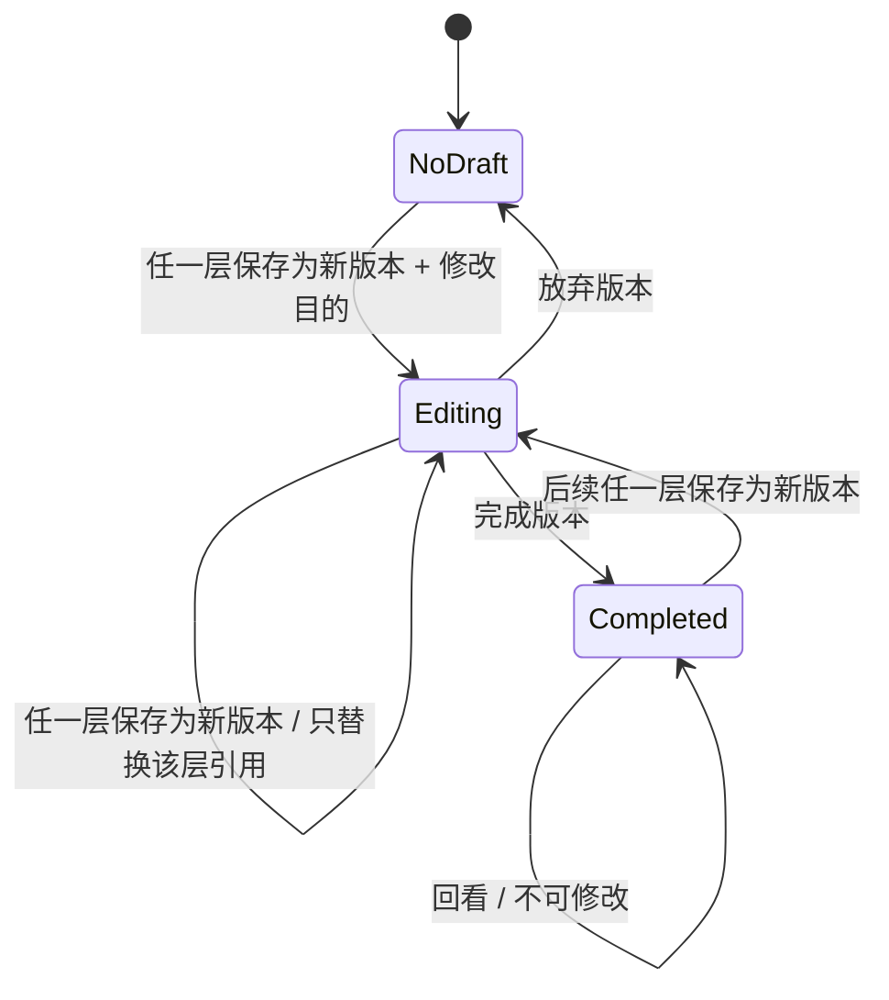
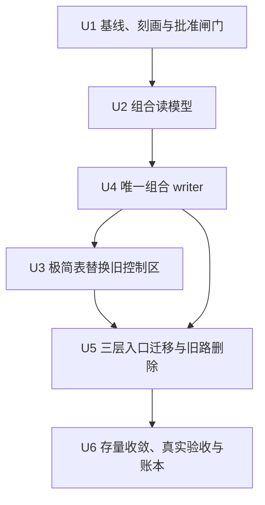
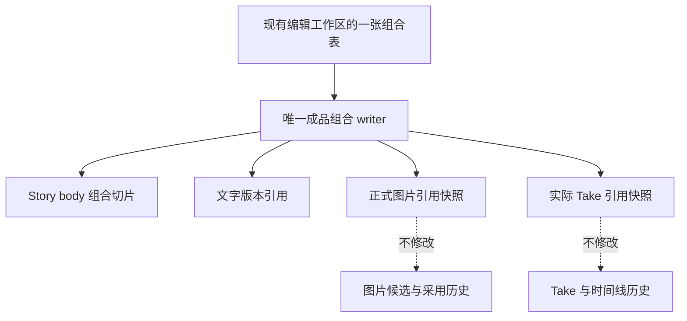

# refactor: 收敛成品版本组合

## Summary

把现有发布版本的复杂生命周期收敛为一个 Story 级成品组合事实：复用文字版本 ID，并对当时正式采用的图片与视频 Take 保存不可变引用快照。实施采用“先刻画与只读投影、再建立唯一 writer、最后迁移入口并删除旧路”的顺序，页面数不增加且生产代码必须净减少。

---

## Problem Frame

当前文字已有聚合版本，图片和视频却只有逐素材身份；发布工作区又把意图、草稿、封面、画册和视频故事板塞进同一个版本生命周期。结果是 174 项定向测试仍不能证明真实页面可用，而用户无法从一个简单视图看出某版成品实际采用了哪些文字、图片与视频。

本计划不继续扩建旧版本系统，也不把可变的当前图片或时间线选择冒充历史版本。它必须在保留付费安全、素材历史和 Story 归属约束的前提下，减少 writer、状态源、对话框和生产代码。

---

## Requirements

- R1. 每个成品版本显示成品编号、文字版本、图像版本、视频版本、修改目的和状态。（see origin: `docs/brainstorms/2026-08-27-finished-product-version-composition-requirements.md`）
- R2. 成品版本只保存已有内容的引用，不复制文字、媒体或整个 Story。
- R3. 文字、图像、视频相互独立；更新一层不自动把另外两层标旧或重做。
- R4. 已完成成品版本可回看且不可改写。
- R5. 普通保存、自动保存和候选生成不创建版本；只有明确“保存为新版本”才创建或替换一层。
- R6. 同一 Story 最多一个进行中的成品版本；没有进行中版本时创建下一行，已有时只替换当前层。
- R7. 创建时必须填写简短修改目的，完成后目的与三层组合一起锁定。
- R8. 放弃进行中版本不得删除任何文字、图片、候选、Take 或历史成果。
- R9. 版本操作集中在现有编辑工作区的一张表中，不新增页面、向导、依赖图、审批流程或第二套编辑器。
- R10. 复用现有三层权威身份与制作入口，不建立第二套媒体历史。
- R11. 最终生产代码、writer、重复状态源和对话框数量均须净减少，新旧写路径不得长期并行。
- R12. 删除或削弱任何已登记能力前必须取得用户逐项批准。
- R13. 真实验收必须覆盖创建、逐层替换、锁定、放弃、连续刷新和旧版本回看，不能只凭类型检查或单测宣称完成。

**Origin flows:** F1（从任意制作层发起）、F2（完成进行中的成品版本）

**Origin acceptance examples:** AE1–AE6

---

## Scope Boundaries

- 不建立独立的整套图片版本库或视频版本库；`Image Vn`、`Video Vn` 是不同采用引用快照的显示编号。
- 不自动分析三层语义依赖，不显示“待确认”“待更新”或自动过期状态。
- 不自动生成文字、图片或视频，不触发付费任务。
- 不提供逐字差异、版本合并、分支树、回滚或多人审阅。
- 不删除图片候选、正式采用历史、视频 Take、时间线历史或付费任务回执。
- 已完成成品引用的文字版本、图片、Take 与必要回放元数据不得硬删除；从当前工作区移除不等于销毁历史素材。
- 不改变热门标签在无授权真实数据源时 fail-closed 的真实性边界。
- 不改变视频故事板“预览无副作用、确认走 Story CAS、重生成不删人工内容”的约束。
- 不在当前未提交的 Beta 访问控制改动上交叉实现。

### Deferred to Follow-Up Work

- 丰富的版本差异展示、筛选、归档和恢复工具：本次只交付组合表与不可变回看。
- 媒体版本的人类可读自定义命名：第一版只按不同引用快照的首次出现顺序显示编号。
- 多个并行进行中的成品分支：本次固定一个进行中版本，避免分支管理界面。

---

## Context & Research

### Relevant Code and Patterns

- `shared/publishingDraft.ts` 的 `PublishingDraftState.versions[]` / `activeVersionId` 是当前唯一稳定的文字版本身份，但每个版本还混有意图、封面、画册和视频故事板，不能继续作为“完整成品版本”深复制。
- `server/services/publishingPersistence.ts` 已提供 Story lock、revision/CAS、幂等回执和发布状态的唯一写入边界；本计划收缩并复用这条边界，不新建第二个版本 writer。
- `server/db.ts` 的 Story CAS、正式图片采用和视频采用逻辑是图片/视频当前事实的权威读取来源；成品 writer 必须在服务端读取，不能相信客户端上传的整套 imageId/takeId。
- `drizzle/schema.ts` 的 `generated_images.id` 和 `shared/videoAsset.ts` 的 `takeId` 是稳定素材身份；`isCurrent` 与当前时间线选择是可变投影，不能直接充当旧版本历史。
- `server/services/storyMaterials.ts` 已能按 Story 投影当前正式图片和实际使用的 Take，可作为组合快照读取边界的优先复用对象。
- `client/src/features/publishingDraft/PublishingVersionControls.tsx` 与 `client/src/features/publishingDraft/PublishingDraftWorkspace.tsx` 是旧版本交互入口。新表必须替换旧控制区并删除旧状态，而不是叠加在 3305 行工作区之上。
- `client/src/pages/EditingStudioPage.tsx` 已协调文字与图像/声音工作区；版本表应挂在这个现有工作区范围内，并复用已有导航。
- `docs/plans/2026-08-23-001-refactor-timeline-write-convergence-plan.md` 已证明本项目可通过“一个事实、一个命令、迁一个删一个”收敛多入口写入。

### Institutional Learnings

- `docs/architecture-simplification-playbook.md`：先定义对象身份、所有者、writer、冲突和恢复，再迁移一条完整纵向链路；新路径成立后必须关闭旧路。
- `docs/solutions/2026-06-13-故事为唯一单位-镜头按storyId.md`：Story 是唯一工作单位，所有读写同时校验 `storyId` 与 `userId`，不能用 latest Story 回退。
- `docs/solutions/2026-06-13-多worktree环境数据分裂收敛.md`：只有主仓库 3000 做真实验收，worktree 不运行服务或写 `.webdev`。
- `docs/handoff/2026-08-25-story-refresh-latency-handoff.md`：连续刷新、切 Story 和迟到响应必须共同验收，不能用一次刷新或测试夹具代替。
- `docs/plans/2026-08-21-001-feat-story-visual-assets-plan.md`：候选、不可变版本与正式采用必须分离；生成成功不等于采用，旧引用不得随当前指针变化。

### External References

- 无。仓库已有 Story CAS、不可变资产引用、幂等回执和唯一 writer 的成熟模式；外部资料不会改变本计划的核心决策。

---

## Key Technical Decisions

- **成品版本是 Story body 顶层的独立 server-owned 切片。** 它引用一个文字版本，并保存创建/替换时解析出的正式图片集合与实际使用视频 Take 集合；`server/services/publishingPersistence.ts` 复用现有锁/CAS 能力作为唯一 owner，`server/services/storySync.ts` 必须像保护 publishing 一样保护该切片，不能让 generic save 覆盖。
- **图像/视频版本号只在完成时固化。** 相同规范化引用集合复用同一个已完成编号；editing 行只显示“新”，反复替换或放弃不占号，避免刷新与重建后编号漂移。
- **快照由服务端一致读取。** 客户端只提交当前制作层、修改目的和预期版本；SQL 模式必须在固定锁顺序的同一事务中读取 Story、正式图片与时间线/选择版本，本地模式必须在同一临界区读取，结果只能是变更前或变更后的完整组合，不能冻结从未同时存在的混合状态。
- **一个领域 writer 处理三种动作。** 创建进行中组合、替换其中一层、完成/放弃都通过同一事实所有者协调；不同 API 表面不得各自复制组合规则。
- **最多一个进行中版本。** 并发创建时只有一个 CAS 成功；幂等重放返回已有结果，另一请求得到可见冲突并可刷新恢复。
- **文字“保存为新版本”是旧 create_version 的精简替代。** 它必须原子产生稳定 Text ID 并更新进行中的成品组合，只冻结文字/core/drafts，不复制封面、视频故事板、画册和平台上下文；不得新增第二个文字版本 writer。
- **只读投影先证明事实，但不冒充历史。** 在任何新 writer 前先用测试与内部投影证明当前文字、正式图片、时间线 Take 能稳定解析；用户界面在持久 writer 就绪前最多显示“当前未冻结组合”，不能显示 Vn、目的或锁定历史，也不能提前删除唯一可用的旧历史入口。
- **U4 与 U5 是不可拆分发布单元。** 新 writer 在三个入口与获批旧 writer 同批迁移前不得对用户可达，避免中间版本形成第三套真相；最终用静态调用图证明每层只有一个 reachable command。
- **完成组合钉住引用生命周期。** 被 completed 组合引用的 Text ID、imageId、takeId 与必要回放元数据只能从当前工作区移除或归档，不能硬删除；删除入口必须反查引用并给出可执行说明，Story 整体删除按明确的 Story 删除语义处理。
- **幂等 receipt 属于 Story 级组合聚合。** receipt 独立于可放弃的 editing 行，记录请求身份与已提交结果并有容量边界；放弃后重放同 token 不得再次建行。
- **迁移采用单写棘轮。** 旧数据允许通过一个只读归一化入口恢复，但旧 writer 在对应调用方迁移后立即删除或封死；不得长期保持双写。
- **减法是发布门禁。** 以变更前基线为准，最终生产 LOC、writer、重复状态源、版本对话框和工作区本地状态数必须全部不增加，其中生产 LOC、writer、重复状态源与版本对话框必须下降。

---

## Open Questions

### Resolved During Planning

- **图像和视频是否已有整套版本 ID？** 没有。计划保存规范化的正式 imageId / takeId 引用快照，并从不同快照派生显示编号，而不是新建两套版本系统。
- **组合记录放在哪里？** 作为 Story body 中受服务端保护的独立小切片，由现有 Story CAS 与发布持久化边界协调；不放进单张图片或单个 Take，也不创建新项目实体。
- **哪些媒体进入快照？** 图像只包含 Story 中各稳定镜头当前明确采用的正式图片；视频只包含当前时间线实际引用的 Take 与必要选择范围，不包含候选、失败任务或未采用素材。
- **普通采用图片/视频是否自动创建成品版本？** 不。采用仍只改变当前制作事实；只有明确“保存为新版本”才冻结该层到进行中成品组合。
- **是否保留旧 U6 版本主流程？** 不长期保留。实施前生成逐项影响清单；用户批准的旧版本创建/切换/重命名/联动路径在迁移后删除，未获批准的能力必须解耦并保留。
- **是否现在处理 Beta 未提交改动？** 不。实施必须等待相关改动独立收口，或在不包含这些用户改动的干净基线上进行；计划本身不触碰它们。
- **完成成品引用的素材能否硬删除？** 不能。用户可以从当前工作区移除，但底层引用与必要回放信息保持，保证旧成品完整回看。

### Deferred to Implementation

- **旧真实 Story 中顶层 publishing 投影与 `versions[]` 的分布。** 在改代码前做只读盘点；若存在只被 legacy reader 恢复的数据，先建立一次性迁移证据，再关闭旧 writer。
- **视频快照所需的最小规范化范围字段。** 执行时以预览/导出实际消费的 Take 选择为准；只保存能稳定重放同一采用结果的引用，不复制完整时间线，但必须纳入一致性事务和引用保留审计。
- **最终可删除的 U6 行数。** 实施以调用点与真实数据盘点为准；若某段代码仍承载已登记的非版本职责，先迁移职责再删除表面。

---

## High-Level Technical Design

> *This illustrates the intended approach and is directional guidance for review, not implementation specification. The implementing agent should treat it as context, not code to reproduce.*

组合事实只保存三类引用与目的；文字、图片采用和视频时间线继续由各自现有领域持有。读取成品历史时使用保存下来的引用快照，不再重新查询“当前采用”来重建旧版本。

---

## Phased Delivery

### Phase 0：保护现场与批准闸门

- 收口或隔离当前 Beta 未提交改动。
- 记录生产 LOC、writer、状态源、对话框、本地 React 状态和旧版本调用点基线。
- 只读抽样真实 Story 的文字版本、正式图片和时间线 Take，并列出 U6 六项退出影响。
- 在任何能力删除前取得用户逐项批准。

### Phase 1：建立正确读模型

- 先用现有权威读取生成“当前未冻结组合”，不增加持久 writer、不把它显示成历史 Vn。
- 用字符化测试证明三层身份与一致性边界；旧版本控制在持久 writer 就绪前仍保留。

### Phase 2：以不可拆分单元建立 writer、替换 UI 与迁移三层入口

- 持久化进行中/已完成组合，接入创建、逐层替换、完成和放弃。
- 同批让文字、图像、视频现有工作区共用同一个版本动作与同一张表，并删除获批旧 writer/自动联动。
- 新 mutation 在旧入口关闭前不得对用户可达；这批工作不可拆分发布。

### Phase 3：迁移存量、关闭旧路并真实验收

- 收敛旧 publishing 顶层投影与活动版本双轨，停止下游容器随文字版本自动复制。
- 删除用户已批准退出的 U6 编排，保留付费安全、候选历史和视频 CAS 不变量。
- 在主仓 3000 完成连续刷新、跨 Story、并发和零付费验收，并更新功能账本。

---

## Implementation Units

### U1. 建立基线、字符化证据与能力退出闸门

**Goal:** 在不改变产品状态的前提下，固定三层事实、旧 U6 调用点、真实数据形态和减法基线，并取得后续删除所需批准。

**Requirements:** R10–R13；AE6

**Dependencies:** 当前 Beta 访问控制改动已独立收口，或实施在不包含其未提交修改的干净基线上进行。

**Files:**

- Modify: `shared/publishingDraft.test.ts`
- Modify: `server/services/publishingPersistence.test.ts`
- Modify: `server/services/storyMaterials.test.ts`
- Modify: `client/src/features/publishingDraft/PublishingDraftWorkspace.test.tsx`
- Read-only inventory: `docs/features/feature-ledger.json`

**Approach:**

- 为当前 `versions[]`、顶层活动投影、正式图片集合和时间线 Take 集合补充字符化测试，先冻结真实行为再动模型。
- 记录变更前生产 LOC、版本 writer、重复持久状态、版本相关对话框、`PublishingDraftWorkspace` 本地状态和入口调用点数量；基线必须可由实施者重复计算，不能引用易漂移的手写估算。
- 对真实本地数据只读抽样并记录：旧 Story 是否依赖 legacy 顶层投影、是否有缺失/重复版本 ID、正式图片是否都能映射稳定镜头、时间线 Take 是否能按 Story 所有权解析。
- 生成六项退出清单：版本重命名、dirty 草稿携带三选、意图接受自动建版本、待更新联动、文字版本自动携带封面/视频/画册、顶层 publishing 双轨。每项说明保留价值、替代路径与删除影响，等待用户逐项批准。

**Execution note:** 先写字符化测试；本单元不得修改生产行为、启动付费调用或写入真实 Story。

**Patterns to follow:**

- `server/services/storySync.publishing.test.ts` 对服务端持有切片的保护测试。
- `docs/plans/u4-redundancy-inventory.md` 的调用点与冗余盘点方式。
- `scripts/env-status.ts` 与 `docs/environment-guide.md` 的环境证据格式。

**Test scenarios:**

- Characterization: legacy 顶层投影与 `versions[]` 同时存在时，当前读取结果被准确记录，不因测试重排而改变。
- Characterization: Story 中多镜正式图片按 stable shot identity 解析为确定排序的 imageId 集合。
- Characterization: 当前时间线中主视频与普通视觉层引用的 Take 均能按 Story 解析，候选和未采用 Take 不进入集合。
- Safety: 读取另一个用户或另一个 Story 的 imageId/takeId 被拒绝，不回退到 latest Story。
- Baseline: 当前普通文字保存、图片采用和视频采用均不会被测试误报为“保存成品版本”。

**Verification:**

- 实施者能复现全部基线数字和真实数据样本；功能退出清单已经用户逐项批准或明确保留，未获批准的项不进入后续删除范围。

### U2. 定义不可变成品组合与规范化快照读取

**Goal:** 建立最小共享领域事实，能从当前权威状态解析一行组合，并能稳定比较图像/视频快照而不创建第二套媒体历史。

**Requirements:** R1–R4, R6, R10；F1, F2；AE1–AE3

**Dependencies:** U1

**Files:**

- Create: `shared/finishedProductVersion.ts`
- Create: `shared/finishedProductVersion.test.ts`
- Modify: `server/services/storyMaterials.ts`
- Modify: `server/services/storyMaterials.test.ts`
- Modify: `shared/publishingDraft.ts`
- Modify: `shared/publishingDraft.test.ts`

**Approach:**

- 把成品组合限制为：Story 归属、顺序、状态、修改目的、文字版本引用、规范化图像引用快照和规范化视频引用快照；不包含文字正文、媒体 blob、候选或完整时间线。
- 图像快照按稳定镜头身份保存明确采用的 imageId；视频快照按稳定用途/镜头与实际使用范围保存 takeId 引用。规范化规则必须排序稳定、去重且保留能重放同一采用结果的最小范围。
- 不同规范化图像/视频快照按首次出现在已完成成品历史中的顺序获得显示编号；内容相同的已完成快照复用编号。editing 快照不分配编号，只显示“新”。
- 读取当前组合时通过服务端 Story/material 投影获得 imageId/takeId，客户端不得组装或上传整套集合。
- 文字引用先使用现有稳定发布 versionId；新增文字版本不再深复制封面、视频故事板、画册或平台上下文作为成品身份的一部分。

**Execution note:** 领域规则测试优先；没有纯函数证据前不接 UI 或 writer。

**Patterns to follow:**

- `shared/timelineVisualPriority.ts` 的单一共享解析规则。
- `server/services/storyMaterials.ts` 的 Story 范围素材投影。
- `shared/publishingDraft.ts` 的持久数据容错归一化，但只保留一个只读迁移点，不复制其双轨 writer。

**Test scenarios:**

- Happy path: Text V4 + 两个正式 imageId + 两个时间线 takeId 解析为稳定组合，重复读取结果等价。
- Covers AE1: 只改变文字引用时，图像与视频快照逐字段保持不变。
- Covers AE2: 只改变图片集合或 Take 集合时，另外两层引用保持不变。
- Identity: 已完成历史中，相同图片/Take 集合即使读取顺序不同也复用同一个显示版本号；集合内容真正变化且完成时才递增。
- Edge case: Story 没有正式图片或视频时得到合法空快照，表中显示空层而不是伪造 V1。
- Safety: 候选图片、失败/未采用 Take、跨 Story 素材和已删除但无历史引用的当前指针不进入新快照。
- Immutability: 后续改变 `isCurrent` 或时间线选择不会改变已经持久化的旧快照。

**Verification:**

- 纯领域测试能证明“只换一层、快照稳定、旧组合不漂移”；没有新增图片或视频历史 writer。

### U3. 用持久成品组合表替换旧版本控制区

**Goal:** 在 U4 已能返回真实持久历史后，用一张表替换旧控制区，并通过删除旧控制与状态使界面净简化。

**Requirements:** R1, R4, R9, R11；AE5, AE6

**Dependencies:** U2, U4；U1 中涉及 UI 退出的项目已获批准。U4 与 U5 尚未完成前，本单元不得独立发布。

**Files:**

- Replace/Delete: `client/src/features/publishingDraft/PublishingVersionControls.tsx`
- Replace/Delete: `client/src/features/publishingDraft/PublishingVersionControls.test.tsx`
- Modify: `client/src/features/publishingDraft/PublishingDraftWorkspace.tsx`
- Modify: `client/src/features/publishingDraft/PublishingDraftWorkspace.test.tsx`
- Modify: `client/src/pages/EditingStudioPage.tsx`

**Approach:**

- 将旧选择/创建/重命名控制区替换为一张持久组合表，已完成行显示固定 Vn、三层编号、目的与状态；当前实时投影只允许显示“当前未冻结组合”，不得冒充历史。
- 表格只提供进入已有文字、图像/声音入口的导航，不复制这些编辑器的控件。
- 同一批次删除已批准退出的重命名 UI、dirty carry 决策 UI、版本 pending 状态和对应无用 React state；不把组合表继续塞成巨大工作区里的第二套状态机。
- 保留趋势真实性、封面付费恢复、候选采用和视频预览/确认的独立入口与错误处理。
- 加入结构守卫，禁止重新出现版本向导、第二张版本表或客户端 image/take 集合 writer。
- editing 行中的新图像/视频集合显示“新”，只有完成成功后才一次性分配并持久化编号；替换、放弃与刷新不得消耗或重排编号。

**Execution note:** 先用组件测试证明旧控制消失、当前组合可读，再接真实数据投影；本单元不允许新增 mutation。

**Patterns to follow:**

- `client/src/pages/EditingStudioPage.tsx` 的现有工作区切换。
- `client/src/features/publishingDraft/publishingDraftViewModel.ts` 的纯投影方式；只保留仍有价值的显示逻辑。

**Test scenarios:**

- Covers AE5: 用户只看到一张组合表、三层版本编号、目的/状态位置和已有入口导航，不出现重命名、影响分析、待更新或 dirty carry 向导。
- Navigation: 点击文字、图像、视频列分别进入已有对应工作区，不创建数据、不触发模型调用。
- Empty state: 没有图片或视频时表格仍可读，入口可进入已有制作界面。
- Draft identity: current/editing 行不显示伪历史 Vn；反复替换、放弃后重建、刷新均不造成 Image/Video 编号漂移。
- Isolation: 切 Story 后表格只显示目标 Story 组合，迟到投影不得覆盖当前 Story。
- Regression: 平台稿标签、趋势 fail-closed、封面候选与视频故事板入口仍可访问。
- Reduction: 组件与静态盘点证明版本相关对话框、本地状态和生产 LOC 相比 U1 基线下降。

**Verification:**

- 主工作区页面数不增加；只读表能准确解释当前组合；本单元生产代码净减少且无新增 writer。

### U4. 建立唯一成品组合与精简文字版本 writer

**Goal:** 通过一致性事务、Story CAS 与现有持久化边界原子支持精简 Text 版本创建、组合创建/替换一层、完成和放弃，且所有重试、删除与冲突可恢复。

**Requirements:** R2, R3, R5–R8, R10–R12；F1, F2；AE1–AE4

**Dependencies:** U2；U1 的真实数据盘点没有未解决的数据丢失风险。

**Files:**

- Modify: `server/services/publishingPersistence.ts`
- Modify: `server/services/publishingPersistence.test.ts`
- Modify: `server/services/storySync.ts`
- Modify: `server/routers/publishingDraft.ts`
- Modify: `server/routers.publishingDraft.test.ts`
- Modify: `server/services/storySync.publishing.test.ts`
- Modify: `server/db.ts`
- Modify: `server/services/visualAssetPersistence.test.ts`
- Modify: `shared/finishedProductVersion.ts`
- Modify: `shared/finishedProductVersion.test.ts`

**Approach:**

- 在 Story body 顶层持久化带 schemaVersion 的独立小型成品组合切片，由现有发布持久化服务持有；`prepareStoryBody` 及其它 generic merge 必须原样保护它。
- 一个领域写边界处理：没有 editing 时，以最近已完成组合为基底创建下一行，只从当前权威事实解析并替换用户明确操作的目标层；没有任何已完成组合时，才从三层当前权威事实建立首行。已有 editing 时只替换当前层，完成时锁定，放弃时只删组合行。文字层动作以旧 create_version 的精简替代原子产生 Text ID 并更新组合；图像/视频动作由服务端读取权威引用快照。
- SQL 模式在固定锁顺序的同一事务中读取 Story、正式图片和时间线/选择 revision；本地模式在同一临界区读取。并发图片采用或时间线变化时，快照必须完整落在变化前或变化后，不能混合。
- 每次写入校验 Story + user、预期 Story/组合/material/timeline revision 与操作 token；重复 token 返回相同结果，不产生第二行；不同并发请求只允许一个 CAS 成功。
- 幂等 receipt 保存在 Story 级组合聚合而非 editing 行，绑定 request hash、已提交结果与 revision，并有明确容量/保留上限；放弃 editing 后同 token 重放仍返回原结果，同 token 不同 payload 必须拒绝。
- 修改目的在创建时必填、进行中可改、完成后不可改；已完成行的任何写请求均拒绝并返回可恢复提示。
- 放弃只移除进行中组合记录，不级联删除其引用内容；媒体删除仍由现有独立领域规则控制。
- 完成时为首次出现的新图像/视频快照固化显示编号；editing 替换/放弃不占号。
- 已完成组合反向约束文字/图片/Take 删除：普通删除只能移出当前工作区或归档，不能硬删引用目标；读取缺失引用必须报完整性问题，禁止回退到 active/current 冒充历史。
- 不新增第二个 Story 写锁、第二套媒体版本 writer 或整份 Story 覆盖 API。

**Patterns to follow:**

- `server/services/publishingPersistence.ts` 的 Story lock、CAS、幂等 receipt 和完整 projection 返回。
- `server/services/storySync.publishing.test.ts` 对 generic save 不得覆盖服务端持有切片的测试。
- `server/routers/publishingDraft.ts` 的 Story ownership 与冲突分类；路由只校验意图，领域规则不复制到 router。

**Test scenarios:**

- Covers AE1: V1 完成后从 Text V4 发起并提供目的，原子创建 V2，图片/视频快照沿用 V1；普通文字保存不创建 V3。
- Explicit layer only: V1 完成后，当前工作区的非目标层已经变化但未明确保存为新版本时，从 Text/Image/Video 任一层发起都只替换该目标层，另外两层严格沿用 V1。
- Covers AE2: V2 editing 时从图像和视频入口依次保存，只替换对应层，不产生额外 editing 行。
- Covers AE3: 完成 V2 后所有字段不可改；下一次保存创建 V3。
- Covers AE4: 放弃 editing 行后所有被引用文字、图片、候选、Take 和时间线仍存在。
- Validation: 空白目的、未知层、跨 Story 引用、过时 revision 和已完成版本修改全部在写入前拒绝。
- Concurrency: 两个标签同时从同一完成版本创建下一行，只有一个成功；失败方刷新后能继续更新同一 editing 行。
- Snapshot consistency: 图片采用（含其当前视频选择清理）或时间线变更与保存版本交错时，冻结结果只能是完整的变更前或变更后组合，不能混合两时点数据。
- Idempotency: 同 token 在超时、进程重启或客户端重放后只产生一次组合变更。
- Receipt lifecycle: 成功后放弃、进程重启再以同 token 重放不重建；同 token 携带不同目的或层引用被拒绝。
- Reference retention: completed 组合引用的 Text、imageId、takeId 无法硬删，只能从当前视图移除/归档；未引用素材继续遵守原删除规则。
- Integration: generic Story save 与专用成品写入交错时不会回滚组合切片；组合写入也不覆盖其它 Story body 字段。
- No side effects: 所有 writer 场景均不调用文字模型、图片供应商或视频供应商。

**Verification:**

- 服务层和路由测试证明单一 writer、CAS、幂等、锁定和不级联删除；writer 总数相比 U1 基线下降或至少在 U5 删除旧 writer 后整体下降。

### U5. 接入三层现有入口并删除获批旧路径

**Goal:** 让文字、图像和视频工作区共用同一版本动作，同时退出已批准的 U6 自动联动与双轨状态。

**Requirements:** R3, R5–R12；F1, F2；AE1–AE6

**Dependencies:** U3, U4；每一项删除均已在 U1 获得用户明确批准。

**Files:**

- Modify: `client/src/features/publishingDraft/PublishingDraftWorkspace.tsx`
- Modify: `client/src/features/publishingDraft/PublishingDraftWorkspace.test.tsx`
- Modify: `client/src/features/storyAgent/views/StoryboardReviewBoard.tsx`
- Modify: `client/src/features/storyAgent/views/ShotMaterialBasket.tsx`
- Modify: `client/src/features/creationEditor/views/StoryboardEditRow.tsx`
- Modify: `client/src/pages/EditingStudioPage.tsx`
- Modify: `server/routers/publishingDraft.ts`
- Modify: `server/routers.publishingDraft.test.ts`
- Modify: `server/db.ts`
- Modify: `server/services/visualAssetPersistence.test.ts`
- Modify/Delete as approved: `client/src/features/publishingDraft/publishingOperationScope.ts`
- Modify/Delete as approved: `client/src/features/publishingDraft/publishingOperationScope.test.ts`
- Modify/Delete as approved: `client/src/features/publishingDraft/PublishingIntentProposalDialog.tsx`
- Modify/Delete as approved: `client/src/features/publishingDraft/PublishingIntentProposalDialog.test.tsx`
- Modify: `client/src/features/storyAgent/storyAgentPersistence.ts`
- Modify: `client/src/features/storyAgent/storyAgentPersistence.test.ts`

**Approach:**

- 在现有工作区范围复用同一组合表和同一“保存为新版本”动作；各制作表面只声明当前层，目的输入与完成/放弃不复制成三套流程。
- 文字入口冻结当前选中的稳定 publishing versionId；图像入口在用户已经明确采用图片后由服务端读取整 Story 正式图片集合；视频入口由服务端读取当前时间线实际 Take 集合。
- 普通保存、采用候选、生成图片、采用 Take 和切换工作区不自动创建成品版本。
- 按 U1 批准结果删除或解耦：版本重命名、dirty carry 三选、意图接受自动建版本、待更新联动、文字版本自动携带下游容器和旧双轨 writer。保留意图编辑本身时，它只属于文字内容，不再拥有隐式成品版本权限。
- 图片采用目前会隐式清理该镜视频选择；这与用户已确认的“三层独立”冲突。本单元在影响清单获批后移除该隐式清理，图片采用只改变图片事实；需要删除/替换视频时必须由用户在视频层明确操作。未获批准前不能合并本单元。
- 保留热门标签真实性、人工标题、封面候选/正式采用、付费回执、视频故事板 preview/confirm、图片候选历史和 Take 历史。
- 每迁移一个调用方立即删掉对应旧状态、mutation 或兼容 writer；不得先把所有新入口铺完再长期保留旧路。

**Execution note:** 每个入口先补一个失败的跨层集成测试，再迁移并删除旧调用点；不做付费生成验收。

**Patterns to follow:**

- 时间线 `moveVisualClip` 收敛：多个 UI 投影共用一个领域命令，失败可见，迁一个删一个。
- `client/src/features/publishingDraft/publishingDraftViewModel.ts` 的迟到响应 scope 比较，保留 Story/版本隔离但删除不再需要的多 revision 组合。

**Test scenarios:**

- Text entry: 明确保存 Text Vn 创建/更新组合；普通编辑、自动保存、生成/改写/格式修复不创建组合。
- Image entry: 明确保存图像版本冻结整 Story 当前正式 imageId 集合；单纯生成候选或采用一张图不自动创建组合。
- Video entry: 明确保存视频版本冻结当前实际 takeId 集合；生成 Take 或预览不自动创建组合。
- Independence: 采用新图片不会删除或改写现有视频选择；只有视频层明确操作才改变 Video 快照。
- Cross-layer: 依次从文字、图像、视频入口操作同一 editing 版本，只改变目标列，目的保持不变。
- Late response: 发起后切 Story 或完成版本，迟到响应不得写入当前 Story/已完成行。
- Regression: 趋势无真实源仍不可用且不清空标签；封面任务恢复不重提；视频预览不改正式镜头；人工标题不被清空。
- UI simplicity: 三个入口没有各自的向导/对话框副本，表格和目的输入只存在一份。
- Reduction: 已批准退出的旧组件、状态、mutations 和调用点实际不可达并删除；production LOC、writer、重复状态源和对话框均低于 U1 基线。

**Verification:**

- 三个现有入口都通过同一领域写边界；旧自动建版与双轨 writer 已关闭；页面流程比改动前更少。

### U6. 收敛存量数据、真实验收并更新功能账本

**Goal:** 证明存量 Story 不丢、旧版本不漂移、真实页面可恢复，并留下阻止架构回弹的证据。

**Requirements:** R4, R8, R11–R13；AE3–AE6

**Dependencies:** U5；主仓库没有其它会话正在做跨分支合并/收敛。

**Files:**

- Modify: `shared/publishingDraft.ts`
- Modify: `shared/publishingDraft.test.ts`
- Modify: `server/services/publishingPersistence.ts`
- Modify: `server/services/publishingPersistence.test.ts`
- Modify: `server/services/storySync.ts`
- Modify: `server/services/storySync.publishing.test.ts`
- Modify: `client/src/features/publishingDraft/PublishingDraftWorkspace.test.tsx`
- Modify: `docs/features/feature-ledger.json`
- Modify: `docs/environment-guide.md` only if persisted-state recovery guidance changes

**Approach:**

- 对 legacy publishing 顶层投影与 `versions[]` 做存量兼容盘点；为组合切片定义 versioned envelope 与每类旧形态的确定映射表。顺序固定为：备份与只读审计 → 新 reader 兼容旧/新 → 单写新切片 → 迁移并核对 → 真实刷新观察窗口 → 删除旧 writer。
- 迁移前后记录 Story 数、文字版本数、正式 imageId/takeId 引用计数和内容 hash；异常先进入人工清单，不得通过“选一个看起来最新的”自动修复。
- 回滚不能只依赖代码回退：在关闭旧 writer 前验证旧代码能安全忽略新切片，并保留已验证的可逆导出/恢复证据。若旧代码会覆盖或误读新切片，则迁移不可进入删除阶段。
- 将现有 Story 的当前稳定文字、正式图片和时间线 Take 作为初始可读组合；不得虚构历史 Image/Video 快照。只有现有数据能证明的完成组合才写入历史，否则显示当前未冻结状态。
- 为“成品组合只能由唯一 writer 修改”“已完成行不可写”“媒体候选不可进入快照”“旧 publishing 双轨不得新增调用”建立静态或测试棘轮。
- 扫描 completed 组合的 Text/imageId/takeId 是否仍存在且可读取；发现 dangling reference 必须停止迁移并报告，不得静默回落当前素材。
- 在真实验收前备份本地数据并记录目标 Story、版本、imageId/takeId 和 revision；不得通过清空缓存、重启为新数据或直接编辑 `.webdev` 来获得绿结果。
- 验收结束后更新相关功能卡：`publishing-workspace`、`publishing-versions`、`publishing-narrative-intent`、`publishing-video-storyboard`、`image-asset-history`、`story-ownership`，记录权威代码、自动化与真实入口证据、被删除旧路和剩余缺口。
- 重新计算减法基线；任一硬指标未达成则不宣称完成，功能保持 observing。

**Patterns to follow:**

- `docs/features/README.md` 的 working/observing 证据标准。
- `docs/handoff/2026-08-25-story-refresh-latency-handoff.md` 的连续刷新与迟到请求验收。
- `docs/architecture-simplification-playbook.md` 的旧路关闭和静态棘轮要求。

**Test scenarios:**

- Migration: legacy Story 完整读取为当前组合，原 V1/V2 文字、封面、候选和视频故事板没有丢失或被重写。
- Migration integrity: 迁移前后 Story/文字版本/媒体引用计数与 hash 满足映射不变量；异常数据不被自动吞掉。
- Rollback: 在旧 writer 关闭前完成一次备份恢复演练，并证明旧代码忽略新切片时不会清空或覆盖它。
- Covers AE3: 完成版本后连续三次整页刷新仍保持相同 Text/Image/Video 引用和目的。
- Covers AE4: 放弃进行中版本后刷新，所有引用媒体和历史仍存在。
- Cross-story: Story A 的迟到请求在切到 Story B 后被丢弃；两边 revision 与组合均正确。
- Concurrency: 两个标签同时创建/完成，CAS loser 得到可见恢复路径，刷新后只有一个一致结果。
- No-cost: 页面切换、创建/完成/回看成品版本期间没有文字模型、图片或视频供应商调用。
- Playback/read parity: 旧成品引用的 takeId/imageId 在后续当前采用变化后仍能回看；删除来源镜头不使仍被引用 Take 失效。
- Orphan audit: completed 组合引用的 Text/imageId/takeId 零悬挂；删除/清理入口对被引用资产执行 restrict/归档而非硬删。
- Reduction gate: production LOC、writer、重复状态源、版本对话框和工作区状态数全部重新统计并满足 R11。

**Verification:**

- 自动化检查、功能账本校验与主仓 3000 的无付费真实验收全部通过；旧 writer 与获批退出路径不可达；环境仍只有一个 dev server。

---

## System-Wide Impact

- **Interaction graph:** 文字发布工作区、故事板/素材界面、视频 Take/时间线界面共同读取一张组合表并调用一个 Story 级命令；各自原有生成和采用流程继续独立。
- **Error propagation:** Story ownership、过时 revision、已完成锁定和无效素材引用必须分类返回到唯一表格入口；不允许静默 return、自动重试付费任务或回弹到旧组合。
- **State lifecycle risks:** 最大风险是组合写成功但客户端仍显示旧 Story、双标签重复创建、legacy projection 回写覆盖新切片，以及当前图片/视频指针变化使旧组合漂移；CAS、幂等 token、不可变快照和迟到响应 scope 共同防护。
- **API surface parity:** 文字、图像、视频三个表面只传达“当前层保存为新版本”的意图；服务端读取权威引用。任何聊天/代理入口若未来能做同一动作，必须调用同一命令，不能另写 Story body。
- **Integration coverage:** 需要跨 shared/server/client 的组合创建与刷新证据，以及主仓真实 Story 的连续刷新、切 Story、并发和零付费观察。
- **Unchanged invariants:** Story/user 所有权、图片候选与正式采用分离、Take 资产历史、封面付费恢复、趋势真实性、视频故事板预览/确认和时间线唯一 writer 均保持。

---

## Alternative Approaches Considered

- **分别建立完整 ImageVersion 与 VideoVersion 实体：** 拒绝。现有系统没有整套媒体版本身份，新建两套生命周期会直接违反“不增加代码和复杂流程”的目标。
- **每次读取当前 `isCurrent` 图片与时间线选择来重建旧版本：** 拒绝。当前指针会变化，旧成品将无法回看，违反不可变要求。
- **把组合表叠加到 U6 并保留全部旧版本 UI：** 拒绝。会形成第三套真相与更多状态，无法满足生产代码和 writer 净减少。
- **一次性重写发布、图片和视频三个领域：** 拒绝。迁移与验收面过大；采用纵向切片，每迁一个入口关闭一条旧路。

---

## Risk Analysis & Mitigation

| Risk | Likelihood | Impact | Mitigation |
| --- | --- | --- | --- |
| 删除 U6 路径时静默削弱已登记能力 | 高 | 高 | U1 逐项影响清单与用户批准；U5 保留/删除测试成对落地 |
| 图片采用当前会清理视频选择，破坏“三层独立” | 高 | 高 | 按已确认产品规则改为图片采用不动视频；U5 合并前取得能力影响批准并补独立性回归测试 |
| 图像/视频快照定义过宽，复制整条时间线 | 中 | 高 | 只保存重放正式采用所需的最小稳定引用；纯函数测试锁定规范化规则 |
| Story CAS 无法保证跨图片表与时间线的一致读取 | 高 | 高 | SQL 固定锁序同事务读取，本地同临界区读取，并发交错测试禁止混合时点快照 |
| completed 组合引用的素材或文字被硬删 | 中 | 高 | 删除入口反查并 restrict/归档；孤儿审计与真实回看作为发布门禁 |
| legacy 顶层投影或旧 writer 覆盖新组合 | 中 | 高 | generic save 保护、单写棘轮、真实数据迁移盘点后关闭旧 writer |
| U4 与 U5 分开发布形成第三套真相 | 中 | 高 | 两单元不可拆分发布；新入口在旧 writer 关闭前不可达，静态调用图证明单命令 |
| 当前脏工作区与 Beta 改动冲突 | 高 | 高 | 实施前独立收口；不在当前未提交改动上交叉编辑 |
| 双标签/迟到响应产生重复或串 Story | 中 | 高 | Story CAS、幂等 token、完整 projection、客户端 scope 丢弃 |
| 为达到 LOC 目标误删仍承载付费安全的代码 | 中 | 高 | 按职责迁移而非按文件大小删除；账本不变量与回归测试作为硬门禁 |
| 真实验收改写或污染本地数据 | 中 | 高 | 主仓 3000、验收前备份/hash、无付费路径、禁止直接编辑 `.webdev` |

---

## Success Metrics

- 用户只通过一张表即可看懂每个成品版本的文字、图像、视频和修改目的。
- 页面数不增加；版本专用向导和对话框数量下降；三个入口不复制流程。
- 生产代码 LOC、版本 writer 和重复状态源相对 U1 基线净减少。
- 普通保存、候选生成、图片采用、Take 生成/采用和页面切换均不会自动创建成品版本。
- 已完成成品在连续三次刷新、切 Story 和后续媒体采用变化后仍指向相同引用。
- 已完成成品引用零悬挂；从当前工作区移除素材后，旧成品仍可完整回看。
- 创建、完成和回看期间无任何模型或付费供应商调用。
- 功能账本明确记录保留能力、退出能力、真实证据和剩余缺口；没有用测试数量代替 working 证据。

---

## Documentation / Operational Notes

- 实施前按 AGENTS.md 运行环境状态检查；只有主仓库端口 3000 用于真实验收。
- worktree 只修改代码，不运行 dev/preview、不写 `.webdev`；合并后立即删除 worktree 与分支。
- 验收前保存本地数据备份与关键引用清单；发现数据差异先停止，不以继续写入“修复”。
- 任何付费图片/视频重生成不属于本计划验收；若真实入口意外出现付费确认，立即停止。
- 完成后更新相关功能卡并运行功能账本校验；只有真实入口证据充分才可提升状态。

---

## Sources & References

- **Origin document:** [docs/brainstorms/2026-08-27-finished-product-version-composition-requirements.md](../brainstorms/2026-08-27-finished-product-version-composition-requirements.md)
- [docs/architecture-simplification-playbook.md](../architecture-simplification-playbook.md)
- [docs/plans/2026-08-14-001-feat-publishing-lifecycle-convergence-plan.md](2026-08-14-001-feat-publishing-lifecycle-convergence-plan.md)
- [docs/plans/2026-08-06-003-feat-story-publishing-versions-plan.md](2026-08-06-003-feat-story-publishing-versions-plan.md)
- [docs/plans/2026-08-23-001-refactor-timeline-write-convergence-plan.md](2026-08-23-001-refactor-timeline-write-convergence-plan.md)
- [docs/plans/2026-08-21-001-feat-story-visual-assets-plan.md](2026-08-21-001-feat-story-visual-assets-plan.md)
- [docs/handoff/2026-08-25-story-refresh-latency-handoff.md](../handoff/2026-08-25-story-refresh-latency-handoff.md)
- [docs/solutions/2026-06-13-故事为唯一单位-镜头按storyId.md](../solutions/2026-06-13-故事为唯一单位-镜头按storyId.md)
- [docs/solutions/2026-06-13-多worktree环境数据分裂收敛.md](../solutions/2026-06-13-多worktree环境数据分裂收敛.md)
