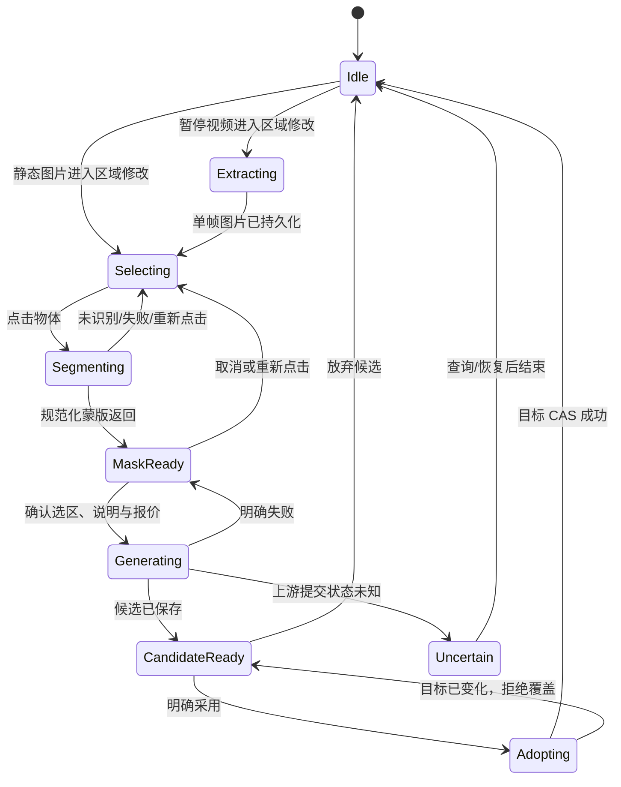
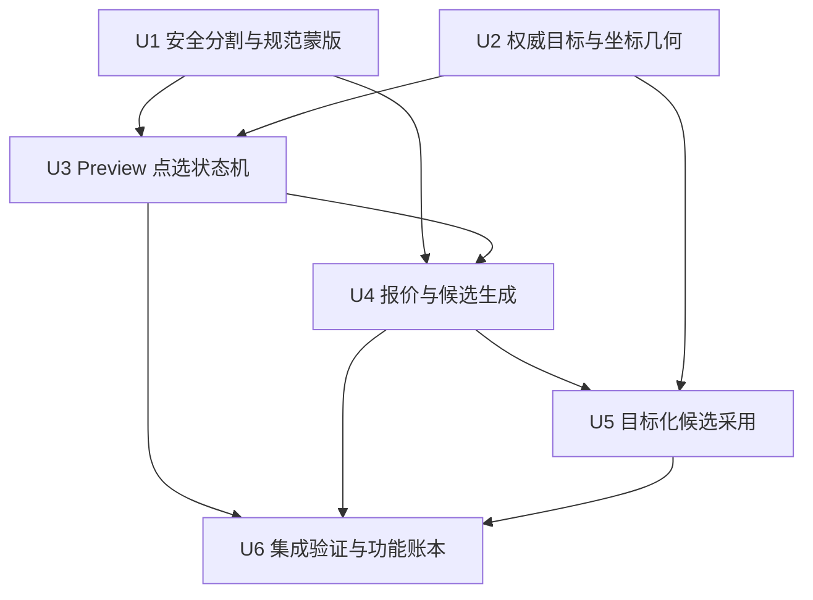
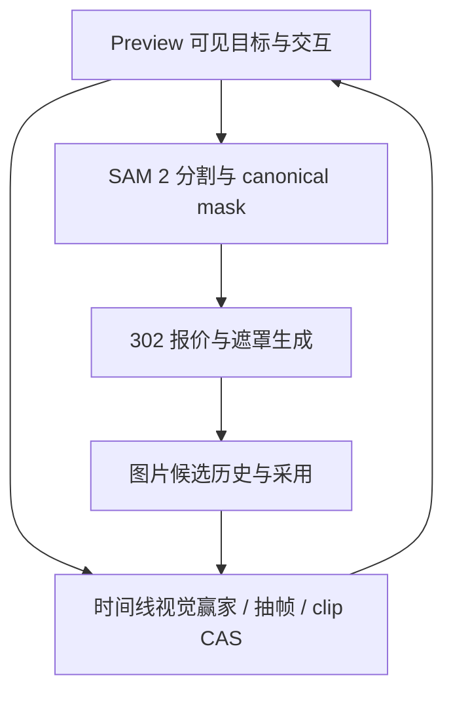

# feat: Preview 点选物体局部修改

## Summary

在现有 Preview 图片编辑和暂停抽帧能力上，接通“点选物体 → 自动分割 → 可视确认蒙版 → 确认费用 → 只重绘蒙版内像素 → 审阅候选 → 明确采用”的完整链路。实现复用现有 SAM 2、302 GPT-image 遮罩编辑、蒙版外像素回填和图片候选历史，同时为静态主图与时间线单帧图片提供各自安全的采用语义。

---

## Problem Frame

当前 Preview 能旋转、翻转、调整构图、OCR，并能在视频暂停后自动抽取当前帧，但不能让创作者指向一个具体物体并限制生成式修改范围。已有分割与遮罩编辑代码尚未形成安全、坐标一致、候选优先的端到端产品能力；直接复用现状还会引入图片越权、蒙版语义反转、错误目标被替换和重复付费等风险（see origin: `docs/brainstorms/2026-08-28-preview-object-mask-editing-requirements.md`）。

---

## Requirements

- R1. 静态图片 Preview 提供明确的区域修改入口，点击画面中的单一物体即可发起自动轮廓识别。
- R2. 视频仅在暂停时允许进入区域修改；系统先完成当前帧抽取并落为独立的一帧 `imageClip`，原视频素材和正常连续播放保持不变。
- R3. 分割结果必须以和底图同变换、同像素位置的轮廓与半透明蒙版展示，并由创作者确认后才进入修改说明与生成阶段。
- R4. 创作者可取消或重新点选；重新点选替换旧蒙版和旧异步请求。分割失败不得退化为无蒙版整图重绘。
- R5. 服务端只接受属于当前用户、当前故事的底图与蒙版；Preview 坐标必须可靠映射为源图像素坐标，且规范化蒙版必须证明透明区域可编辑、非透明区域受保护。
- R6. SAM 2 单点分割费用由系统承担，不逐次弹窗；必须提供短期去重、按用户/故事/图片的并发与速率控制，并保留供应商熔断器。
- R7. 302 遮罩图片编辑每次提交前必须展示并确认绑定当前底图、蒙版和修改要求的报价；任一输入变化、报价过期或价格变化都使旧确认失效。
- R8. 生成失败、超时、未知提交状态或重复点击不得覆盖当前画面或静默再发起一笔付费任务；成功结果以 `isCurrent: false` 的候选保存，并记录原图、蒙版、修改说明、费用与任务来源。
- R9. 候选只有在创作者明确采用后才更新当前可见目标：主镜头图片使用条件式提升，时间线图片剪辑只替换精确 clip 的图片引用并保留剪辑身份、时长、图层、构图和文字。
- R10. 现有 Preview 旋转、构图、文字、OCR、普通整图改图、暂停抽帧和一帧图片覆盖视频的防闪烁语义不得回归。

**Origin actors:** A1（创作者），A2（系统）  
**Origin flows:** F1（静态图片局部修改），F2（视频当前帧局部修改）  
**Origin acceptance examples:** AE1（点选杯子并只修改杯子），AE2（视频暂停抽帧后修改且原视频连续播放），AE3（分割失败不生成），AE4（重新点选使费用确认失效且候选不自动采用）

---

## Scope Boundaries

- 第一版只支持一次选择一个物体，不组合多个不相连的蒙版。
- 第一版不提供画笔增加/擦除、羽化、逐像素修边或蒙版布尔运算。
- 第一版不追踪播放中视频的移动物体，也不把蒙版传播到连续多帧。
- 第一版不在分割失败时使用矩形框、整图重绘或其他静默降级。
- 第一版不自动采用、覆盖或删除原图，也不自动清理未采用候选。
- 本计划只在 Preview 提供对象点选交互；聊天框现有倒转/OCR/生成式意图分流保持原样，不扩展聊天中的点选蒙版协议。

### Deferred to Follow-Up Work

- 手工修边、羽化和多对象选区：等待第一版点选成功率与误选数据明确后另行规划。
- 连续帧目标跟踪与视频局部重绘：需要跨帧一致性、时间范围和视频生成成本模型，独立规划。

---

## Context & Research

### Relevant Code and Patterns

- `server/services/segmentation.ts` 和 `server/services/segmentation.test.ts` 已封装 fal.ai SAM 2、供应商超时、持久化与三次失败后的熔断，但当前坐标契约和存储键不满足 Preview 安全接入。
- `server/routers/creationAgent.ts` 已暴露 `segment` 与 `inpaint`，但二者当前接受调用方 URL；`segment` 缺少故事/图片归属校验，`inpaint` 使用旧的 FLUX fill 路径且生成结果默认成为当前图片。
- `server/services/imageGen.ts` 的 `editImage(..., editMaskImageUrl)` 已强制遮罩编辑走 302 GPT-image edits，不会回落到无蒙版整图重绘；`server/services/imageGen.test.ts` 已覆盖 multipart 遮罩上传、长响应和蒙版外像素保护。
- `server/services/imageMaskComposite.ts` 会在供应商生成后重新合成源图像素，当前契约为“透明 alpha = 可编辑，非透明 alpha = 保护”。规范化 SAM 输出后继续用它作为最终保护闸门。
- `server/routers/storyAgent.ts` 的 `generateForMobile` 已有遮罩编辑费用估算、显式费用确认、候选 `isCurrent: false` 和未知提交状态不自动重试的行为，可作为报价与失败语义参考；本功能不直接复用其宽泛的聊天生成输入。
- `client/src/features/creationEditor/views/EditingNleWorkspace.tsx` 中 `ShotPreview`、`activeTimelineImageSource`、`editCurrentVideoFrame` 和持久视频节点是一帧覆盖层共同构成权威 Preview。对象编辑必须从该可见赢家派生目标，不能只从当前选中镜头主图派生。
- `client/src/features/creationEditor/imageClipEditorModel.ts` 的 `timelineTransformStyle` 定义了 Preview 图像的 pan、rotation、zoom、flip；点击坐标反算与蒙版渲染必须共享同一变换模型。
- `shared/timelineLayout.ts` 的 `resolveTimelineVisualFrame` 是播放头处图片、镜头和 overlay 的权威视觉优先级解析器；应扩展其客户端投影信息，而不是另写一套“当前图片”选择规则。
- `server/services/visualClipEditing.ts` 的 `withVisualEditDocument`、时间线 CAS 和精确 clip 编辑模式是时间线图片候选采用的写入边界；必须保留 clip ID、绝对位置、持续帧、图层、transform 和文字关联。
- `server/db.ts` 的 `createGeneratedImage` 与 `promoteStoryImageToCurrent` 提供候选历史和主图提升能力；主图采用还需增加“源图仍是预期原图”的条件保护。

### Institutional Learnings

- `docs/solutions/2026-06-13-故事为唯一单位-镜头按storyId.md` 要求所有接收 `storyId` 的图片操作先以 `storyId + userId` 校验故事归属，再解析故事内资产，不能把 URL 当成授权凭据。
- `docs/handoff/2026-08-22-visual-asset-chat-edit-handoff.md` 记录了付费图片操作的报价签名、输入哈希和候选采用模式；本功能应把底图、蒙版、修改说明和价格绑定到同一次确认，而不是只比较前端传回的金额。
- 功能账本 `image-preview-local-edit-ocr` 与 `extracted-frame-overlay-video` 明确要求图片编辑非破坏、视频抽帧落独立 `imageClip`、原视频保持不变，以及一帧图片不卸载视频节点。这些是本计划的回归不变量。

### External References

- fal.ai SAM 2 公共模型仍提供基于图片与点坐标的对象分割能力；公共元数据无法完整证明生产账户下的输出 alpha 语义与价格，因此实现先以 mock/fixture 刻画契约，再在明确授权后做一次真实供应商烟测。
- 302 GPT-image edits 的仓库内既有适配与像素回填测试是本功能的权威遮罩语义；不直接假定 SAM 输出可以原样上传到 302。

---

## Key Technical Decisions

| Decision | Chosen approach | Rationale |
|---|---|---|
| Preview 编辑目标 | 以播放头处“权威可见图片”构造不可变目标快照，包含故事、图片、clip/主图类型、所属镜头、变换和会话版本 | 防止高图层单帧可见时误改下层主图，也让异步结果能判断是否已过期 |
| 点击坐标 | 客户端 inverse-map 到源图坐标，服务端再按已知源图尺寸校验、夹取并转为 SAM 像素坐标 | `object-cover`、pan、zoom、rotation、flip 使 DOM 比例坐标不等于源图坐标；服务端不能信任任意坐标 |
| 蒙版格式 | 将供应商输出规范化为源图同尺寸的“透明可编辑、非透明保护”PNG，并另派生 Preview 半透明/轮廓表示 | 明确 302 与 `imageMaskComposite` 的 alpha 语义，避免黑白或 alpha 方向反转造成整图变化 |
| 分割成本保护 | 系统赞助，不弹费用确认；同一用户/故事/图片/量化点击做短期请求合并，并设置每用户与每图片并发/速率上限 | 控制误触、连点与自动重试成本，同时不打断点选体验 |
| 付费生成入口 | 收敛为图片身份与 mask key 驱动的窄 RPC，服务端解析 URL、校验报价签名并调用现有 302 masked edit | 杜绝任意 URL、蒙版替换、无确认付费和无蒙版回退 |
| 付费任务收据 | 用独立、持久的 masked-edit operation receipt 记录 input hash、报价、claim/lease、供应商任务与候选结果 | 单靠前端状态或候选字段无法在进程重启、响应丢失和未知提交状态下阻止第二次付费 |
| 候选采用 | 主图和时间线 clip 使用不同命令；两者都带期望源身份做 compare-and-set | 候选生成期间用户可能已换图、移动播放头或编辑时间线，旧结果不能覆盖新状态 |

---

## Open Questions

### Resolved During Planning

- SAM 2 是否每次点选都向创作者确认费用：不确认，费用由系统承担；通过请求合并、限流、并发限制和熔断控制成本。
- 局部图片生成是否仍需费用确认：需要；确认必须绑定底图、规范化蒙版、修改要求、价格和有效期。
- 分割失败是否允许整图生成：不允许，保持底图并允许重新点选或退出。
- 视频帧结果采用后是否改写视频：不改写视频；只替换自动抽出的独立单帧图片剪辑。

### Deferred to Implementation

- fal.ai SAM 2 在生产响应中返回的是 alpha mask、灰度 mask 还是带预览色的 PNG：先以下载 fixture 刻画并支持显式解析；真实响应语义只在获准的供应商烟测中确认，未确认前保持 fail-closed。
- fal.ai `queue.fal.run` 在当前账户/模型版本下是直接结果还是 submit receipt + poll：实现时以 fixture 与一次受控烟测刻画 transport；没有证据前不沿用现有“首个 JSON 直接含 masks”的假设。
- 点选去重窗口、每用户速率和并发上限的最终数值：以可配置常量落地并用单元测试证明边界；默认值在实现时依据现有请求限制约定选择，不能通过放宽失败回退来换成功率。
- Preview 轮廓绘制选用 CSS/SVG 还是从规范化 mask 生成独立预览 PNG：实现时以最少重复像素处理、能与同一 transform 精确对齐为准，规范化 edit mask 始终是服务端权威。

---

## High-Level Technical Design

> *This illustrates the intended approach and is directional guidance for review, not implementation specification. The implementing agent should treat it as context, not code to reproduce.*

状态机绑定一个不可变的编辑会话键（故事、目标类型、图片、clip/镜头、播放头世代）。重新点选、切故事、切图、切播放头、开始播放或抽帧目标变化都会使旧请求失效；晚到响应只可被丢弃，不能挂到新目标或自动重试。

---

## Implementation Units

### U1. 收敛安全分割与规范蒙版契约

**Goal:** 将现有 SAM 2 服务改造成只处理已授权故事图片、接收源图像素坐标、输出确定 alpha 语义与尺寸的权威蒙版服务，并为系统赞助调用增加成本保护。

**Requirements:** R3-R6；F1、F2；AE1、AE3

**Dependencies:** None

**Files:**
- Modify: `server/services/segmentation.ts`
- Modify: `server/services/segmentation.test.ts`
- Create: `server/services/imageEditMask.ts`
- Create: `server/services/imageEditMask.test.ts`
- Modify: `server/routers/creationAgent.ts`
- Create: `server/routers.creationAgentMaskEditing.test.ts`

**Approach:**
- 把 `segment` 输入从任意 `imageUrl` 改为故事与图片身份加源图点击坐标；先校验故事归属和图片属于该故事，再由服务端解析权威 URL、像素尺寸和存储命名空间。
- 明确客户端传入的是源图坐标而非 `0..1` 比例；拒绝 NaN、越界、零尺寸和目标已改变的请求。修复当前 router 使用归一化坐标而 service/test 使用像素坐标的矛盾。
- 下载 SAM 输出后解析真实像素，验证非空、可解码、合理尺寸、非全图选中且编辑区域包含用户点击点；若供应商返回多个候选，只能按 provider score/点击包含关系选出一个有效对象，不能无条件取数组首项。重采样到源图精确尺寸并输出“alpha=0 可编辑、alpha>0 保护”的 canonical edit mask。Preview 使用的轮廓/半透明表示从同一规范蒙版派生，不能让前端自行解释供应商色值。
- 先刻画 fal queue 的真实 submit/poll/result 合同：若首次响应只是 request/task receipt，则以同一 receipt 轮询/恢复，不能把它当最终 `masks` 响应，也不能因客户端重试再次 submit。供应商合同无法确认时保持功能关闭/失败，不用猜测响应形状。
- 服务端解析权威图片和 mask 时走仓库受控存储读取或现有公共图片安全下载策略；禁止跟随调用方 URL、任意重定向、内网/本机地址和超出大小上限的响应，避免 SSRF 与解压/内存攻击。授权图片身份是必要条件，但不能替代网络目标校验。
- 存储键包含用户、故事、图片与随机/内容摘要作用域；RPC 只返回受控 mask 标识和预览资产，不把任意外部 URL 当作后续生成凭据。canonical mask 随候选来源关系保留，派生的轮廓/半透明预览按短 TTL 清理；日志和费用收据只记 key/hash，不记可直接抓取的外部 URL。
- 对相同用户、故事、图片和量化点击的短期请求合并为同一个进行中/近期结果；再叠加每用户与每图片并发、滑动时间窗速率限制，并保留全局供应商熔断。被限制的请求明确返回可重试状态，不触发供应商调用。
- 空对象、模糊小物体、供应商错误和遮罩规范化失败全部 fail-closed；绝不合成全透明全图蒙版。

**Execution note:** 先补 router/service 的坐标、授权与 alpha 语义 characterization tests，再改变现有契约。

**Patterns to follow:**
- `server/services/segmentation.ts` 的可注入 fetcher、超时和熔断测试模式。
- `server/services/imageMaskComposite.ts` 与 `server/services/imageGen.test.ts` 的透明可编辑/非透明保护语义。
- `docs/solutions/2026-06-13-故事为唯一单位-镜头按storyId.md` 的 story/user 归属检查顺序。

**Test scenarios:**
- Happy path：属于当前用户故事的 1920×1080 图片、源图坐标点击目标 → SAM 收到对应像素坐标，返回与源图同尺寸且透明区域只覆盖目标的 canonical mask 与可视预览。
- Integration：fal queue 先返回 request receipt、后续 poll 才返回 mask → 同一 request 只 submit 一次并完成结果；进程内重试复用 receipt，不能把 receipt 误判为空 mask。
- Covers AE1. Integration：SAM fixture 返回选中杯子的不同尺寸灰度/alpha 图 → 规范化后杯子像素透明、人物/桌面/背景像素不透明。
- Edge case：供应商返回多个 masks，首项不含点击点而次项包含 → 选择次项；所有候选都不含点击点时 fail-closed，不展示错误对象。
- Edge case：router 收到 `0.5, 0.5` 但图片为 1920×1080 时不再把它误当像素 0.5；契约只接受已经 inverse-map 的有效像素坐标并在服务端夹取到图像边界。
- Error path：图片 ID 属于另一用户、另一故事或不存在 → 在下载图片或调用 fal 之前拒绝，响应不泄露 URL 或存在性。
- Security：已授权图片记录中若 URL 指向本机、私网、非允许协议、重定向到私网或超大响应 → 安全下载在 fal/Sharp 之前拒绝；受控仓库相对路径与允许的公共对象存储仍可读取。
- Covers AE3. Error path：SAM 返回无 mask、不可解码图片、全透明全图、全不透明无编辑区或尺寸异常 → 不创建可生成的 mask key，不调用 302，允许用户重选。
- Edge case：同一点击在去重窗口内连发三次 → 只产生一次供应商调用；窗口外可重新分割。
- Edge case：同一用户跨多图达到并发/速率上限，或同一图片被快速连点 → 超额请求被拒绝或合并，已在途请求不被复制。
- Error path：连续供应商失败打开熔断 → 后续请求不调用 fal；冷却后一次成功关闭熔断。

**Verification:**
- API 不再接受任意图片 URL；坐标、归属、mask alpha 与尺寸均有可执行测试证据。
- 任意失败分支都无法得到可用于 302 生成的全图蒙版。
- 系统赞助点选在并发与重复请求下有确定的供应商调用上界。

### U2. 建立权威 Preview 图片目标与变换坐标几何

**Goal:** 让局部编辑准确作用于播放头处真正可见的图片，并让点击点与蒙版在 object-cover、pan、zoom、rotation、flip 下仍逐像素对齐。

**Requirements:** R1-R5、R9-R10；F1、F2；AE1、AE2

**Dependencies:** None

**Files:**
- Modify: `client/src/features/creationEditor/views/EditingNleWorkspace.tsx`
- Modify: `client/src/features/creationEditor/imageClipEditorModel.ts`
- Modify: `client/src/features/creationEditor/imageClipEditorModel.test.ts`
- Create: `client/src/features/creationEditor/previewObjectMaskGeometry.ts`
- Create: `client/src/features/creationEditor/previewObjectMaskGeometry.test.ts`
- Modify: `shared/timelineLayout.ts`
- Modify: `shared/timelineLayout.test.ts`
- Modify: `client/src/features/creationEditor/editingWorkspaceLayout.test.ts`

**Approach:**
- 将 `activeTimelineImageSource` 从只有 URL/transform 的显示投影扩展为编辑目标快照：目标类型（主镜头图片或 `imageClip`）、story/image ID、stable shot ID、clip ID（如有）、权威 URL、源尺寸、transform、播放头/会话版本。
- 继续以 `resolveTimelineVisualFrame` 决定播放头处赢家；若高层一帧图片覆盖视频或下层主图，区域修改只指向该 `imageClip`。若当前赢家是视频，则只能走暂停抽帧；不得退回当前所选 shot 的主图。
- 建立纯几何 helper：根据 Preview 画布尺寸、源图尺寸、`object-cover` 裁切和 `timelineTransformStyle` 的平移/旋转/缩放/翻转，inverse-map pointer 到源图像素。落在变换后图片外的点击返回不可选，而不是夹到最近边缘。
- 蒙版预览使用与底图同一画布盒和同一变换栈；轮廓层只负责显示，不拦截播放控制之外的事件。
- 尽可能由同一标准化 transform 数据同时驱动 CSS 与几何计算，避免两套公式随现有图片编辑功能演进后漂移。

**Execution note:** 先用纯函数覆盖几何矩阵和现有 transform 行为，再在 `ShotPreview` 接入交互。

**Patterns to follow:**
- `shared/timelineLayout.ts` 的权威视觉赢家与图层优先级。
- `client/src/features/creationEditor/imageClipEditorModel.ts` 的 transform 归一化和 CSS 映射。
- `client/src/features/creationEditor/editingWorkspaceLayout.test.ts` 对持久视频节点与一帧覆盖层的结构测试。

**Test scenarios:**
- Happy path：无 transform 的 16:9 源图显示在 1:1 Preview 中 object-cover → 点击可见中心映射到源图中心，被裁掉的左右区域不可被点中。
- Edge case：分别应用 pan、2× zoom、90°/180° rotation、flipX、flipY 与组合变换 → inverse-map 后的源图点与正向渲染回 Preview 的位置一致（允许亚像素容差）。
- Edge case：点击画布边缘但实际落在变换后图片外、源尺寸未知或 Preview 尺寸为零 → 返回不可选择，不调用分割。
- Covers AE2. Integration：播放头处一帧 `imageClip` 压在持久视频节点上 → 目标快照包含该 clip/image，而不是下层视频 poster 或当前 shot 主图。
- Integration：播放头处赢家为视频 → 不构造静态目标；暂停抽帧成功后重新解析并构造新单帧目标。
- Regression：现有 `timelineTransformStyle` 的旋转、翻转、构图测试保持通过，Preview 覆盖图片继续与下层视频共享画布且不卸载 video 节点。

**Verification:**
- 每个可点位置都能由正反变换测试证明落到唯一源图像素；不可见区域不会被误点。
- Preview 向分割与采用链路传递的目标就是当前视觉赢家，包含足够身份信息用于服务端二次授权和 CAS。

### U3. 构建 Preview 点选、确认与失效状态机

**Goal:** 在 Preview 中实现静态图直接点选、视频暂停自动抽帧、蒙版明确确认、重新点选与安全取消的交互生命周期。

**Requirements:** R1-R4、R7、R10；F1、F2；AE1-AE4

**Dependencies:** U1, U2

**Files:**
- Create: `client/src/features/creationEditor/previewObjectMaskEditing.ts`
- Create: `client/src/features/creationEditor/previewObjectMaskEditing.test.ts`
- Modify: `client/src/features/creationEditor/views/EditingNleWorkspace.tsx`
- Create: `client/src/features/creationEditor/views/PreviewObjectMaskEditor.test.tsx`
- Modify: `client/src/features/creationEditor/editingWorkspaceLayout.test.ts`

**Approach:**
- 在 Preview 顶栏增加独立“区域修改”入口，不把它塞进构图/OCR 面板。静态图片立即进入 selecting；视频播放时入口禁用并提示暂停，暂停后触发既有 `extractFrameAtPlayhead`，持久化成功并重新解析单帧目标后再进入 selecting。
- 以 reducer/状态机表达 `idle → extracting → selecting → segmenting → mask-ready → generating → candidate-ready → adopting`，另有 error/uncertain 状态；每个异步请求携带编辑会话键与递增 request ID。
- segmenting 期间再次点击会让旧请求失效并以新点开始；晚到的旧响应不覆盖新蒙版。切换故事、图片、播放头、视觉赢家、开始播放或关闭编辑都会清空会话与报价确认。
- mask-ready 展示清晰轮廓与半透明区域，提供“确认选区”“重新点选”“取消”。用户确认前隐藏/禁用修改要求与付费生成入口。
- 分割失败保留底图并给出可重试提示；不创建生成 draft，不调用报价或 302。
- 候选与原图并排/切换审阅，提供采用和放弃；关闭候选不改变当前画面，未采用候选仍留在图片历史。

**Patterns to follow:**
- `client/src/features/creationEditor/views/EditingNleWorkspace.tsx` 的 `editCurrentVideoFrame` 抽帧与 story-session stale guard。
- `client/src/features/storyAgent/useChatImageRemix.ts` 的 draft/generating/result/error 候选生命周期与未知付费错误文案。
- 现有 `ImageClipEditorPanel` 的 Preview 侧边编辑入口和可访问性测试风格，但不复用其构图保存语义。

**Test scenarios:**
- Covers AE1. Happy path：静态图片点击区域修改、点杯子、分割成功 → 显示杯子蒙版；确认前看不到可提交的说明/生成动作，确认后才开放。
- Covers AE2. Happy path：视频播放时入口不可用；暂停后点击入口 → 先显示 extracting，抽帧成功后在新单帧目标进入 selecting，原视频节点与 URL 不变。
- Covers AE3. Error path：分割返回空/错误/超时 → 保持当前原图、展示重新点选/退出，不出现报价和生成请求。
- Covers AE4. Edge case：已有 mask-ready/报价确认后重新点选 → 旧蒙版、说明绑定与费用确认立即失效；只有新蒙版的新报价可提交。
- Edge case：请求 A segmenting 时点击 B，请求 B 先返回、A 后返回 → 最终只显示 B 的蒙版。
- Edge case：segmenting/generating 中移动播放头、切换 story/shot、开始播放或可见赢家改变 → 会话重置，晚到响应不展示、不采用。
- Error path：视频抽帧失败或抽到的 clip 未出现在权威时间线 → 不进入 selecting，不把视频 poster 当图片提交。
- Regression：普通“编辑图片”、旋转、翻转、OCR 和视频播放按钮仍可使用；区域修改模式退出后原有控制恢复。

**Verification:**
- 用户在任何付费动作前都能看到并确认实际蒙版。
- 所有目标变化和异步乱序都有确定的失效行为，不会把旧 mask/candidate 绑定到新画面。

### U4. 实现报价绑定、一次性付费提交与候选持久化

**Goal:** 用服务端授权的底图与 canonical mask 调用现有 302 遮罩编辑，确保报价与输入绑定、失败不重试、结果只保存为带完整来源的候选。

**Requirements:** R5、R7-R8、R10；F1、F2；AE1、AE4

**Dependencies:** U1, U3

**Files:**
- Create: `server/services/previewMaskedImageEditing.ts`
- Create: `server/services/previewMaskedImageEditing.test.ts`
- Create: `server/persistence/previewMaskedImageEditingPersistence.ts`
- Create: `server/persistence/previewMaskedImageEditingPersistence.test.ts`
- Modify: `server/routers/creationAgent.ts`
- Modify: `server/routers.creationAgentMaskEditing.test.ts`
- Modify: `server/db.ts`
- Create: `server/db.previewMaskedImageOperations.test.ts`
- Modify: `drizzle/schema.ts`
- Create: `drizzle/migrations/0014_preview_masked_image_operations.sql`
- Modify: `server/services/imageGen.ts`
- Modify: `server/services/imageGen.test.ts`
- Modify: `server/services/imageMaskComposite.ts`
- Create: `server/services/imageMaskComposite.test.ts`
- Modify: `client/src/features/creationEditor/views/EditingNleWorkspace.tsx`
- Modify: `client/src/features/creationEditor/previewObjectMaskEditing.test.ts`
- Modify: `shared/imageRenderCost.ts`
- Modify: `shared/imageRenderCost.test.ts`

**Approach:**
- 将旧 `creationAgent.inpaint` 收敛/替换为两个窄操作：对已授权 target + mask + instruction 生成有时效、签名的报价；确认提交时重新解析同一 target 与 mask，并验证签名、输入哈希、价格和有效期。若为兼容保留旧名称，也必须移除任意 URL 和 FLUX fill 行为。
- 报价输入哈希至少绑定用户、故事、目标类型、源 image ID、clip/shot 身份、mask key/内容摘要、修改说明和模型/价格版本；前端金额不是唯一验证依据。
- 提交前重新验证 canonical mask 属于该用户/故事/图片且仍有效，底图仍存在；服务端解析底图与 mask URL，强制调用 `editImage` 的 302 GPT-image masked path。不得调用 `inpaintImage`，不得在 302 不可用时降级整图生成。
- 新增可持久恢复的 masked-edit operation receipt，并保持数据库与内存测试适配器一致。receipt 以 story/user/operation token 唯一约束，记录 input hash、签名报价、claim lease、状态、供应商 task ID、candidate ID 与非敏感错误码；提交前原子 claim，同一 token/input 重放恢复既有状态，不同 input 复用 token 被拒绝。
- 明确失败可以由用户主动重新报价后重试；上游返回 task ID 或提交状态未知时持久保存可恢复状态并阻止自动/双击重提。进程重启后先查询/恢复 receipt，不凭前端内存判断是否可以再次购买。
- 对 302 返回结果继续执行 `imageMaskComposite` 像素回填；任何尺寸/解码/合成失败都不保存可采用候选。
- 成功后 `createGeneratedImage` 使用 `isCurrent: false`、`generationType: "inpaint"`、`parentImageId`、`maskKey`，并保存费用确认/operation token 等可审计来源；不在这个动作里 promote 或改时间线。
- 客户端在提交前显示预计人民币费用并取得明确确认；底图、mask、instruction 任一变化都丢弃 quote 和 operation token，重新报价。

**Execution note:** 从“旧 `inpaint` 会自动成为当前图”的失败 characterization 开始，再收敛为候选优先的窄契约。

**Patterns to follow:**
- `server/services/visualAssetCreation.ts` / `server/services/publishingAlbumBackgroundGeneration.ts` 的签名报价、input hash、expiry 与 operation token 模式。
- `server/persistence/timelineFrameExtractionPersistence.ts` 与 `drizzle/migrations/0013_timeline_frame_extraction_operations.sql` 的持久 receipt、lease 和数据库/内存一致性模式。
- `server/routers/storyAgent.ts` 的 masked edit 费用估算、302 未知提交状态提示和 `isCurrent: false` 候选语义。
- `server/services/imageGen.ts` 的遮罩强制 302 与 `server/services/imageMaskComposite.ts` 的防御性像素回填。

**Test scenarios:**
- Covers AE1. Happy path：确认过的源图、杯子 mask 与“改成蓝色陶瓷杯” → 302 请求包含唯一底图和 canonical mask；保存候选的 parent/mask/prompt/费用来源正确，当前图未变化。
- Covers AE4. Edge case：报价后更换 mask、源 image/clip、说明文字或价格版本 → 旧 quote/input hash 被拒绝且不调用 302。
- Error path：无费用确认、签名错误、报价过期或金额变化 → 返回需重新确认，供应商调用次数为零。
- Error path：尝试提交另一故事/用户的 image ID 或 mask key → 在解析 URL 和生成前拒绝。
- Error path：FAL mask 不存在、已失效、尺寸不一致或被替换 → 不生成；不能把请求改成无 mask 的 `editImage`。
- Integration：canonical 2×1 mask 指定左像素可编辑，供应商返回全蓝图 → 候选左像素为蓝、右像素严格等于源图，证明蒙版外保护。
- Error path：302 明确失败 → 不创建候选、不自动重试；提交状态未知或已有 task ID → 返回可恢复状态，同 operation token 重放不创建第二笔任务。
- Edge case：用户双击确认/网络重试同一 request hash → 最多一次供应商提交和一组候选记录。
- Integration：供应商已受理后进程在候选落库前重启 → 新请求从 receipt 恢复/查询原任务；未证明上次失败前不得创建新付费 operation。
- Regression：无遮罩的普通整图改图仍走原有 provider/费用逻辑；masked edit 始终不追加相邻参考图。

**Verification:**
- 每个付费请求都能从候选追溯到签名报价、源图、canonical mask 和用户说明。
- 测试证明无确认、输入漂移、越权、无 mask 与未知状态均不会发生新的付费提交或当前画面写入。
- 数据库与内存模式都能在重放、lease 竞争和进程重启模拟下保持“一次确认最多一次供应商提交”。
- 像素级 fixture 证明 mask 外像素逐字节来自源图。

### U5. 实现主图与时间线单帧的安全候选采用

**Goal:** 让明确采用只更新生成时锁定的可见目标，拒绝覆盖已经变化的主图或时间线剪辑。

**Requirements:** R2、R8-R10；F1、F2；AE2、AE4

**Dependencies:** U2, U4

**Files:**
- Modify: `server/db.ts`
- Create: `server/db.previewMaskedImageAdoption.test.ts`
- Modify: `server/services/visualClipEditing.ts`
- Modify: `server/services/visualClipEditing.test.ts`
- Modify: `server/routers/creationAgent.ts`
- Modify: `server/routers.creationAgentMaskEditing.test.ts`
- Modify: `client/src/features/creationEditor/views/EditingNleWorkspace.tsx`
- Modify: `client/src/features/creationEditor/previewObjectMaskEditing.test.ts`

**Approach:**
- 采用 RPC 接受候选 ID 和生成时保存的 target snapshot，不接受任意新 URL；重新校验候选属于当前用户/故事、是指定 parent/mask 的 inpaint 候选且尚未被错误绑定。
- 主镜头图片采用通过数据库/内存实现一致的 compare-and-set：只有该 stable shot 的当前图片仍等于 expected source image ID 才调用提升；若用户已换图，保留候选并提示重新审阅，不覆盖新主图。
- 时间线图片采用新增一个窄视觉编辑命令：在同一 visual-edit CAS 中定位 expected stable shot + clip ID + expected source image ID，仅替换该 clip 的 `imageId/imageUrl`。clip ID、起止帧、duration、visual layer、label、transform 保持不变；对应文字层/变换索引按现有数据模型迁移到新 image ID，不能丢失 Preview 构图和文字。
- adoption operation token 提供幂等性；同一候选重复采用返回已完成结果，不能产生二次 promotion、移动 clip 或新的历史候选。
- 采用成功后刷新故事资产与时间线；当前编辑会话结束。采用 CAS 冲突时仍展示候选，允许用户退出或在新目标上重新开始。

**Execution note:** 先为现有无条件 `promoteStoryImageToCurrent` 与 imageClip 图片引用写并发变化测试，再引入条件式采用。

**Patterns to follow:**
- `server/services/visualClipEditing.ts` 的 `withVisualEditDocument` 与操作幂等/时间线 CAS。
- `server/services/visualClipEditing.ts` 的 `patchImageTransformForStory` 对 image clip 与 transform/text overlay 的一致写入。
- `server/db.ts` 的图片 promotion 与 signal/history 记录。

**Test scenarios:**
- Happy path：主镜头当前图仍是 parent A，采用候选 B → B 成为 current，A 留在历史，候选来源信息保留。
- Edge case：生成 B 后用户先把主图换成 C，再采用 B → CAS 拒绝，C 保持 current，B 仍是可审阅候选。
- Covers AE2. Happy path：抽帧 clip A 采用候选 B → 精确 clip 的 image ID/URL 更新，原视频素材、视频节点、clip ID、位置、1 帧时长、图层和 transform 不变。
- Integration：抽帧 clip 带 rotation/flip/text overlay，采用候选后 → Preview 仍显示同样构图和文字，相关持久化引用随新 image ID 保持可编辑。
- Edge case：clip 已删除、移到另一归属、已换成 C 或候选 parent/mask 不匹配 → 拒绝采用，不创建替代 clip。
- Edge case：同一 adoption token 重放 → 返回同一完成结果，timeline revision 最多前进一次。
- Error path：另一用户或故事的候选、普通未关联候选、已删除图片 → 拒绝且不泄露资产详情。
- Regression：采用单帧候选后正常播放 → 持久视频节点继续播放，单帧只在其一帧范围覆盖，不出现闪烁或视频卸载。

**Verification:**
- 主图与单帧 clip 的采用都由 expected source identity 保护。
- 任何冲突只留下候选，不改变用户后来完成的图片/时间线编辑。
- 单帧采用后的播放、构图、文字和图层回归均有跨层测试。

### U6. 端到端验证、供应商烟测与功能账本收敛

**Goal:** 证明静态图与视频当前帧两条关键流程可用、无闪烁、无越权/重复付费，并把新能力及既有功能影响写入功能账本。

**Requirements:** R1-R10；F1、F2；AE1-AE4

**Dependencies:** U3, U4, U5

**Files:**
- Modify: `client/src/features/creationEditor/editingWorkspaceLayout.test.ts`
- Modify: `client/src/features/creationEditor/views/ImageClipEditorPanel.test.tsx`
- Modify: `server/services/timelineFrameExtraction.test.ts`
- Modify: `server/services/imageGen.test.ts`
- Modify: `server/services/visualClipEditing.test.ts`
- Modify: `docs/features/feature-ledger.json`

**Approach:**
- 组合既有单元/集成测试形成两条完整验收路径：静态主图点选局部改图与视频暂停抽帧后的单帧局部改图。
- 在主仓库固定 3000 端口做浏览器验收；不得在 worktree 启动服务或写 `.webdev/`。验证真实 Preview 布局、蒙版对齐、重选失效、候选审阅与采用后播放。
- 默认使用 mock/fixture 验证 fal/302 合同，不在普通测试中产生费用。真实 SAM 2 烟测只验证一次点选坐标、输出语义和存储；真实 302 烟测只有在用户明确授权预计费用后执行，且不自动采用结果。
- 为 `preview-object-mask-editing` 建立新功能卡，记录 entry points、owners、测试与浏览器证据、依赖 `image-preview-local-edit-ocr` / `extracted-frame-overlay-video` / story ownership / image history，以及第一版已知缺口。
- 在既有两张功能卡 history 追加本功能的兼容性与防闪烁验证，不改变其非破坏性、抽帧和持久 video 节点不变量。

**Patterns to follow:**
- `docs/features/README.md` 的功能卡状态、evidence、history 与 known gaps 规范。
- `image-preview-local-edit-ocr` 和 `extracted-frame-overlay-video` 现有卡片的入口、不变量与验证记录。
- `client/src/features/creationEditor/editingWorkspaceLayout.test.ts` 的 Preview 结构回归断言。

**Test scenarios:**
- Covers F1 / AE1. Browser integration：在静态图 Preview 点杯子、确认 mask、输入修改、确认报价、收到候选 → 蒙版外人物/桌面/背景不变；采用前当前图不变，采用后仅目标主图更新。
- Covers F2 / AE2. Browser integration：播放视频时不能区域修改；暂停并进入后自动抽帧，点选/生成/采用单帧候选 → 原视频连续播放且一帧覆盖无闪烁。
- Covers AE3. Browser error：点空白处或 mock 分割失败 → 可重新点击/退出，无报价、无 302 请求、无候选。
- Covers AE4. Browser edge：报价后重新点选 → 旧确认不可提交；新候选成功后不自动采用。
- Security integration：使用另一用户/故事的 image/mask/candidate 标识调用 segment、generate、adopt → 三个阶段都 fail-closed。
- Cost integration：连点、双击确认、未知提交状态和重放 operation token → SAM 去重有效、302 最多一次、未知任务不自动重提。
- Regression：旋转、翻转、构图、文字、OCR、普通整图改图、抽帧、视频播放和一帧 overlay 现有测试全部通过。

**Verification:**
- 所有 origin R/F/AE 均有自动化或浏览器证据；真实外部调用与费用授权记录清晰分开。
- `preview-object-mask-editing` 功能卡达到有真实入口和可执行证据的状态；既有卡片的不变量与 history 同步。
- 功能账本校验通过，且浏览器控制台无新增错误或重复请求。

---

## System-Wide Impact

- **Interaction graph:** Preview 解析权威视觉赢家；视频目标先进入时间线抽帧；静态目标调用安全分割；确认 mask 后进入签名报价与 302；候选采用再写主图或精确 imageClip，最后刷新 Preview。
- **Error propagation:** 分割错误回到 selecting；报价失效回到 mask-ready；302 明确失败保留 mask-ready；提交未知进入独立 uncertain 状态并阻止重提；采用冲突保留 candidate-ready。
- **State lifecycle risks:** 目标、播放头与请求响应存在竞态；quote、operation token、mask 和 target snapshot 必须成组失效。候选保存与采用分离，避免半写导致当前图变化。
- **API surface parity:** 只新增 Preview 对象编辑契约，不改变聊天框和普通整图重渲 API；旧 `creationAgent.inpaint` 若保留名称，其对外输入必须同步收窄，不能继续暴露任意 URL 旁路。
- **Integration coverage:** 必须跨 client → router → provider adapter → candidate persistence → adoption 验证一次静态图与一次抽帧 clip，单层 mock 无法证明目标选择、候选语义和播放无闪烁。
- **Unchanged invariants:** 图片 transform 仍是非破坏性 TimelineTransform；OCR 不执行图片内指令；抽帧只创建独立单帧；原视频及持久 video DOM 不被候选生成/采用替换；未采用候选不改变当前画面。

---

## Risks & Dependencies

| Risk | Likelihood | Impact | Mitigation |
|---|---:|---:|---|
| SAM 输出 alpha/颜色语义与假设不同 | Medium | High | fixture characterization + canonical normalization；无法识别时 fail-closed；真实烟测仅在授权后进行 |
| fal queue transport 被误当同步结果或重试时重复提交 | Medium | High | 刻画 submit/poll/result 合同，持有并复用 provider receipt，未知响应 fail-closed |
| CSS transform 与坐标反算漂移 | Medium | High | 共享标准化 transform，正反映射 property/组合测试，object-cover 与画布边界专门覆盖 |
| 连点造成赞助分割成本失控 | Medium | Medium | 请求合并、按用户/图片限流、并发上限、熔断与可观测拒绝原因 |
| 302 未知提交导致重复付费 | Medium | High | 稳定 operation token、请求哈希、unknown 状态不自动重试、恢复优先 |
| operation receipt 与候选落库出现部分写入 | Medium | High | 独立持久状态机、原子 claim/settle、可恢复 task ID 与进程重启集成测试 |
| 候选生成期间目标被用户更改 | High | High | immutable target snapshot + 主图/clip compare-and-set；冲突保留候选不覆盖 |
| Mask 边界外仍被模型改变 | Medium | High | canonical alpha 契约 + 302 masked edit + 服务端最终像素回填三重保护 |
| canonical/preview mask 泄露或无限增长 | Medium | Medium | key 仅服务端解析、日志不记 URL；preview TTL 清理，canonical mask 按候选来源生命周期保留并可审计清理 |
| 已授权资产 URL 被用作 SSRF/超大下载入口 | Low | High | 仓库存储优先；公共 URL 使用协议、DNS/IP、重定向、字节与像素上限的安全下载策略 |
| 一帧图片采用引发视频闪烁回归 | Medium | High | 不替换 clip/视频节点，只换 image reference；结构测试与真实播放验收 |
| fal.ai/302 配置或网络不可用 | Medium | Medium | 配置预检、超时、熔断、明确错误；无服务时不降级整图或自动改用其他 provider |

---

## Phased Delivery

### Phase 1 — 安全合同与只读点选

- 完成 U1、U2、U3：用户能在静态图和暂停抽帧图上点选并确认准确 mask，但尚不开放付费生成。这样可先验证最危险的授权、坐标和预览对齐问题。

### Phase 2 — 候选生成与采用

- 完成 U4、U5：开放签名报价、一次性 302 masked edit、候选审阅和两类 CAS 采用。

### Phase 3 — 回归与受控上线

- 完成 U6：浏览器验收、防闪烁/费用/越权回归、功能账本与外部服务受控烟测。

---

## Documentation / Operational Notes

- SAM 2 为系统赞助调用，应记录成功、空 mask、供应商错误、熔断、去重命中、限流拒绝和延迟指标，但日志不得包含原始图片 URL 或用户修改说明全文。
- 302 遮罩编辑继续沿用现有付费审计；新增维度至少能关联 operation token、story/image/mask 标识、报价版本和候选 ID。
- `0014_preview_masked_image_operations.sql` 是只增不改的收据表迁移；部署顺序先落 schema/读写兼容再开放入口。回滚 UI/服务开关时保留收据表与历史记录，避免丢失已付费任务的恢复依据。
- 上线初期可通过服务端能力开关控制入口；关闭时 Preview 不展示区域修改，不应降级为旧 `inpaint` 或普通整图改图。
- 真实供应商验证需分开授权：SAM 2 系统赞助烟测可在实现验收时执行一次；302 烟测必须先向用户展示预计费用并得到明确确认。
- 完成实现后更新 `docs/features/feature-ledger.json` 并运行功能账本校验；只有真实入口、自动化证据和主仓库 3000 端口验收齐备后才能标记 `working`。

---

## Sources & References

- **Origin document:** [docs/brainstorms/2026-08-28-preview-object-mask-editing-requirements.md](../brainstorms/2026-08-28-preview-object-mask-editing-requirements.md)
- Related feature ledger: `docs/features/feature-ledger.json` (`image-preview-local-edit-ocr`, `extracted-frame-overlay-video`)
- Segmentation provider adapter: `server/services/segmentation.ts`
- Masked image editing and pixel protection: `server/services/imageGen.ts`, `server/services/imageMaskComposite.ts`
- Preview and paused-frame entry: `client/src/features/creationEditor/views/EditingNleWorkspace.tsx`
- Visual winner and timeline adoption patterns: `shared/timelineLayout.ts`, `server/services/visualClipEditing.ts`
- Story ownership learning: `docs/solutions/2026-06-13-故事为唯一单位-镜头按storyId.md`
- Cost/candidate handoff: `docs/handoff/2026-08-22-visual-asset-chat-edit-handoff.md`
