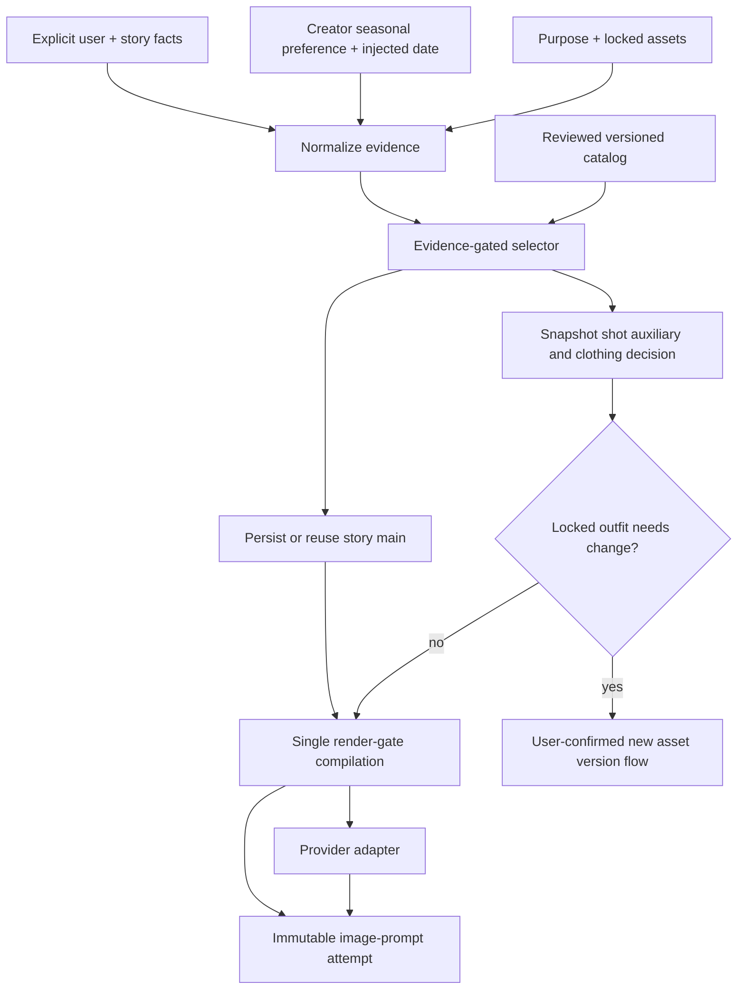
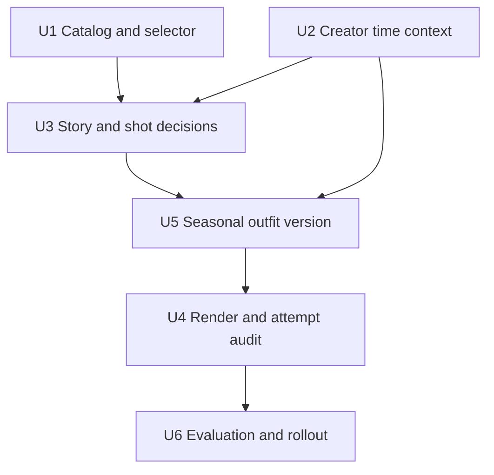
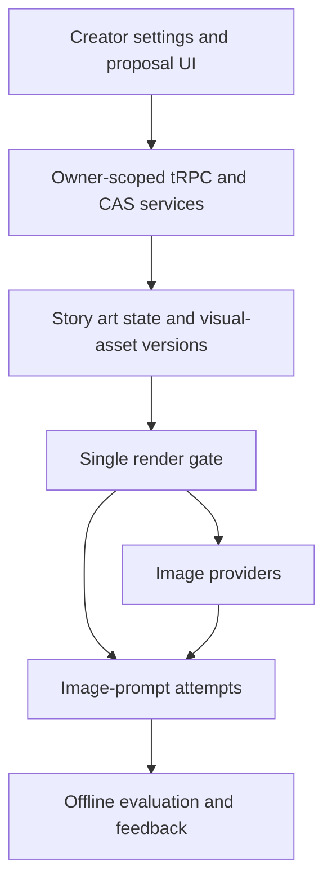

# feat: Add semantic art direction

## Summary

Replace the current zero-evidence art-lineage fallback with one structured, evidence-gated decision stage upstream of the existing render gate. Persist the story-level main choice, resolve time and clothing from explicit story facts plus privacy-safe creator context, snapshot every provider-final prompt and decision, and route locked-outfit changes through a user-confirmed visual-asset version instead of changing a lock in place.

---

## Problem Frame

`server/services/renderGate.ts` is already the single authoritative static-image compiler, but its current keyword scorer always chooses a handmade lineage even when every candidate scores zero. It also lacks a stable story-main/shot-auxiliary model, replayable temporal context, structured skip reasons, and a safe path from seasonal clothing inference to locked visual assets. The origin requirements define the desired behavior; this plan closes the technical gaps without reviving a provider-side prompt layer (see origin: `docs/brainstorms/2026-08-31-semantic-art-direction-requirements.md`).

---

## Requirements

- R1. Read explicit user instructions and story/shot evidence semantically; do not require exact style keywords.
- R2. Preserve the confirmed priority order: explicit user direction over system inference, while locked assets and confirmed story facts remain immutable constraints.
- R3. Ship the three requested cards—modernist painting fusion, dreamy colored-pencil minimalism, and diffuse motion blur—and move the existing automatic handmade lineages into the same evidence-gated catalog.
- R4. Select at most one story-level main card and one compatible shot-level auxiliary card; never concatenate complete styles.
- R5. Skip a card when evidence is weak, conflicting, purpose-disallowed, or too close to another candidate, and retain an explainable reason.
- R6. Keep the main choice stable at story scope and the auxiliary choice at stable-shot scope; a shot decision must not rewrite the story main choice.
- R7. Let an auxiliary card contribute only catalog-approved compatible dimensions.
- R8. Treat historical facts as strict constraints while allowing historically grounded artistic language and palette choices.
- R9. Keep artist attribution evidence-backed and internal; if attribution is uncertain, output only supported period media, palette, and material traits.
- R10. Use an injected real-world date and a privacy-safe creator seasonal preference; creator context must not become story location or provider prompt content.
- R11. Apply seasonal clothing directly only when no outfit is locked. For a locked outfit, create a reviewable new-version proposal; do not change, pay for, lock, or bind it without the corresponding user confirmations.
- R12. Translate artists into observable visual properties for the provider-final prompt rather than issuing name-stacking imitation instructions.
- R13. Suppress the new expressive cards for factual/product/standard-view purposes while retaining the existing global stylization and text-free hard constraints, per the user's explicit planning decision.
- R14. Keep one authoritative static-image compilation and leave `server/services/imageGen.ts` free of art-direction or clothing additions.
- R15. Bind the structured decision, catalog version, temporal snapshot, asset fingerprint, and actual provider-final prompt to an immutable generation attempt, including failed attempts.

**Origin actors:** A1 (creator), A2 (art director), A3 (unified image prompt system), A4 (image provider adapter)

**Origin flows:** F1 (establish story main style), F2 (add shot auxiliary effect), F3 (adapt time and clothing)

**Origin acceptance examples:** AE1-AE7, including near-negative semantic triggering, one-main/one-aux inheritance, standard-view suppression, 1930s Shanghai grounding, current-date seasonal clothing, locked-outfit versioning, and provider-final auditability.

---

## Scope Boundaries

- Do not append any requested card to every generation or keep the existing zero-evidence random lineage fallback.
- Do not add a second prompt compiler in `imagePromptDirector`, an image provider, or an individual product route.
- Do not relax `STATIC_IMAGE_STYLIZATION_CONSTRAINT` or `STATIC_IMAGE_TEXT_FREE_CONSTRAINT`; factual and standard-view purposes suppress only the conditional cards.
- Do not infer creator location from IP, request GPS permission, reuse the voluntary emotion-analysis location without separate consent, or send creator location to the image provider.
- Do not perform runtime art-history lookups. The catalog is reviewed offline and contains sources with each claim.
- Do not change a locked visual-asset version in place, inherit obsolete passed views after an outfit change, auto-bind a replacement version, or submit paid standard-view work without confirmation.
- Do not extend the behavior to video prompts in this iteration.
- Do not auto-generate paid images for evaluation or rollout validation.

### Deferred to Follow-Up Work

- Expansion beyond the reviewed first catalog and the migrated existing lineages: add only after real trigger/skip data identifies a gap.
- Cross-project/global aesthetic learning beyond the existing art library and rejection/preference signals.
- Replacing the upstream `compilePromptTargets().finalText` lineage model wholesale. This plan still evaluates both layers explicitly, but every provider-bound preview/save/submit path must consume one immutable render-gate artifact and hash.

---

## Context & Research

### Relevant Code and Patterns

- `server/services/renderGate.ts` owns the only static-image art compiler. Its `authoredBrief`, locked-style, `preservePrompt`, product-purpose, and hard-constraint branches establish the priority and bypass patterns to preserve.
- `server/services/styleLibrary.ts` and `docs/style-library/entries/*.yaml` already provide validated, cached, status-gated art entries. Extend this catalog instead of introducing a parallel prompt library.
- `shared/artDirection.ts` already normalizes backward-compatible story art state and versions a locked recipe. Add semantic-selection state alongside—not inside—the confirmed recipe.
- `server/services/visualAssetGenerationContext.ts` makes a locked outfit a highest-priority fact and blocks conflicting text before payment.
- `server/services/visualAssetPersistence.ts` already uses story revision CAS and operation tokens for asset versions. Its generic fork path inherits passed views, so seasonal outfit changes need a distinct invalidating path.
- `server/services/promptLineage.ts`, `shared/promptCompiler.ts`, and generated-image `promptCompilationId` links preserve upstream prompt lineage. The provider-final prompt remains separately stored on generated images.
- `shared/storyContract.ts` and creation-editor prompt runs show a final-prompt snapshot pattern, but their strict, shot-local shape does not cover all static-image attempts.
- `docs/solutions/2026-06-13-故事为唯一单位-镜头按storyId.md` requires story + user ownership and stable shot identity; story main selection must use `storyId`, and shot auxiliaries must use `stableShotId`, never display `shotNo` as identity.

### Institutional Learnings

- User instructions and locked visual facts must outrank inferred art. Past prompt blocks contradicted the user and made valid requests consistently fail.
- Reference roles are structural: identity, scene, style, and composition inputs cannot silently control one another.
- Low-confidence visual judgments must fail closed to `unknown`; for art selection, the safe outcome is “no conditional card” while the existing global prompt rules continue.
- Provider-final prompt behavior—not only upstream lineage text—must be tested, because the repository has a known two-level evaluation gap.
- Paid attempts and historical assets are immutable evidence. A proposal or selector result must never imply payment, adoption, or rebinding.

### External References

- [ECMA-402 `Intl.DateTimeFormat.prototype.resolvedOptions`](https://tc39.es/ecma402/#sec-intl.datetimeformat.prototype.resolvedoptions): the host time zone is a formatter setting, not physical location.
- [MDN `resolvedOptions()`](https://developer.mozilla.org/en-US/docs/Web/JavaScript/Reference/Global_Objects/Intl/DateTimeFormat/resolvedOptions): browser locale/time-zone boundaries.
- [W3C Geolocation](https://www.w3.org/TR/geolocation/): precise location is permissioned and disproportionate for seasonal clothing inference.
- [Getty AAT](https://www.getty.edu/research/tools/vocabularies/aat/), [ULAN](https://www.getty.edu/research/tools/vocabularies/ulan/), and [CDWA](https://www.getty.edu/publications/categories-description-works-art/categories/): controlled terminology, artist authority, and separated date/place/material/provenance modeling.
- [NIST AI RMF Measure playbook](https://airc.nist.gov/airmf-resources/playbook/measure/): document, measure, monitor, and update semantic decision behavior.
- [Node.js 24 test runner dates](https://nodejs.org/docs/latest-v24.x/api/test.html#dates) and [`TZ` behavior](https://nodejs.org/docs/latest-v24.x/api/cli.html#tz): inject clocks and test time zones deterministically.

---

## Key Technical Decisions

- Extend the existing style-library schema with optional automatic-selection metadata and migrate the six hard-coded lineages into reviewed entries beside the three new cards. Explicitly selected legacy styles remain usable even when they have no auto-trigger metadata.
- Separate semantic evidence normalization from deterministic policy selection. A bounded classifier may normalize structured story/shot evidence, but it cannot choose a card ID or emit prompt fragments; classifier failure or ambiguity becomes `unknown`. The pure art-card selector returns only applied or skipped results from normalized evidence and the reviewed catalog; the composed `ArtDirectionDecisionSnapshot` adds `confirmation_needed` when time/clothing evaluation conflicts with a locked outfit.
- Persist the automatic story main card in a dedicated server-owned story slice, not ordinary client-editable `body.artDirection`. Bind it to story revision, evidence fingerprint, catalog version, and creator-preference revision. Story evidence changes mark an inferred choice stale; explicit user choices remain until cleared. Shot auxiliaries are recalculated from stable shot revision and snapshotted per attempt.
- Treat explicit creator seasonal preference as authoritative. The browser IANA time zone may prefill a suggestion and local calendar date, but it cannot establish hemisphere or climate by itself; an unknown/tropical/ambiguous profile produces no seasonal outfit guess.
- Define one immutable `ArtDirectionDecisionSnapshot` for the story/shot/time/asset inputs and one immutable compiled image artifact containing provider-final prompt/hash, hard constraints, catalog/decision/time/asset fingerprints, and compiler identity. Preview, save, preserve, and submit must consume the same valid artifact; missing or stale fingerprints force recompile or block.
- Add a dedicated immutable image-prompt attempt record rather than overloading prompt-lineage revisions or interaction signals. The route/service caller—not the render gate—claims the operation, invokes the provider outside a transaction, and CAS-settles success/failure/unknown. A provider success followed by persistence uncertainty remains reconcilable and must never auto-buy again.
- Introduce a detailed render-gate result while preserving the existing string-returning facade for compatibility. All feature-bearing static-image routes migrate to the detailed path so they can persist the exact compiled artifact they submit.
- Keep selector failure fail-open for availability: record `selector_error`, apply no conditional card, and continue through the current global stylization/text-free rules. Locked-asset conflict remains fail-closed before paid submission.
- Seasonal outfit changes use a dedicated proposal/version transition based on the same decision snapshot. A locked conflict yields `confirmation_needed` and makes the provider path unreachable. Proposal acceptance atomically deep-copies facts, changes only the proposed outfit, invalidates every outfit-bearing view, and records a receipt; the accepted version triggers a fresh decision before any separately confirmed paid generation, locking, or rebinding.
- Keep SQL and local-JSON persistence behavior explicit and symmetric: additive migration, defaults/load normalization, next IDs, copy-on-write atomic persistence, deletion, user merge/reassignment, export where applicable, and non-destructive rollback all require parity tests.
- Roll out behind an application flag with observe-only attempt recording first. Catalog versions remain readable, old code ignores additive fields, and rollback disables new application without deleting decisions, proposals, attempts, assets, or paid evidence.
- Roll out with deterministic fixtures and provider-callback capture first; no paid generation is part of the implementation proof.

---

## Open Questions

### Resolved During Planning

- How should creator location be obtained? Use an explicit coarse seasonal profile; offer browser time zone only as an editable suggestion, and never use silent GPS/IP or the emotion-analysis profile.
- What happens when creator context is missing or ambiguous? Return unknown and do not infer seasonal clothing.
- Should factual/product/standard-view purposes become photographic? No. They suppress the conditional cards but retain the existing global stylization hard rule.
- May a locked outfit be adjusted automatically? No. Produce a reviewable new-version proposal and preserve the old version and bindings until explicit confirmation.
- What is the image evaluation truth? The provider-final prompt plus structured decision and attempt status is authoritative for image outcome evaluation; upstream lineage remains separately evaluated.
- Should only the three new cards use semantic triggering? No. The existing automatic lineages migrate into the same evidence-gated catalog so zero-evidence selection disappears everywhere.

### Deferred to Implementation

- Exact scoring weights and confidence cutoffs: tune against the checked-in positive, near-negative, conflict, and cross-shot fixtures; do not change the fail-safe outcomes.
- Exact catalog wording and sourced art-history claims: finalize during entry review, using museum/foundation/Getty sources and a catalog version bump.
- Whether a provider exposes a useful native negative-prompt channel for a particular route: keep the render-gate prompt contract authoritative; do not add provider-specific art direction during this work.

---

## High-Level Technical Design

> *This illustrates the intended approach and is directional guidance for review, not implementation specification. The implementing agent should treat it as context, not code to reproduce.*

The selector never submits paid work. The provider sees only the compiled observable traits and story facts; creator climate metadata, artist provenance, confidence, and skip reasons remain in the attempt snapshot.

---

## Implementation Units

**Execution order:** U1 and U2 may proceed independently, followed by U3, U5, U4, and U6. Unit IDs remain stable for traceability even though U5 intentionally precedes U4.

### U1. Build the reviewed semantic art catalog and pure selector

**Goal:** Replace hard-coded, always-select lineages with one versioned catalog and a deterministic selector that can apply or safely skip one main and one compatible auxiliary card.

**Requirements:** R1-R5, R7-R9, R12-R13; F1-F2; AE1-AE4

**Dependencies:** None

**Files:**

- Create: `shared/semanticArtDirection.ts`
- Create: `shared/semanticArtDirection.test.ts`
- Create: `server/services/semanticArtDirectionCatalog.ts`
- Create: `server/services/semanticArtDirectionCatalog.test.ts`
- Modify: `server/services/styleLibrary.ts`
- Modify: `server/services/styleLibrary.test.ts`
- Create: `docs/style-library/entries/modernist-sanyu-seurat-wu.yaml`
- Create: `docs/style-library/entries/dreamy-colored-pencil-minimal.yaml`
- Create: `docs/style-library/entries/diffuse-motion-blur.yaml`
- Create or migrate reviewed entries under `docs/style-library/entries/` for `expressive-print`, `symbolist-pastel`, `nabist-memory`, `visionary-romantic`, `spiritual-abstraction`, and `naive-fable`

**Approach:**

- Extend the existing catalog with stable version/provenance, allowed scope, positive and counter-signals, observable feature dimensions, compatibility, forbidden purposes, and sourced period/region claims.
- Keep names and source claims out of provider fragments; compile only reviewed observable traits.
- Normalize evidence independently from card choice. The normalizer consumes explicit direction plus structured story/shot fields and may use a bounded classifier, but its output is evidence labels with subject attribution, polarity, and provenance—not card IDs or provider text.
- Score explicit user, story, and shot evidence separately; require a clear threshold and margin. A tie, low score, hard conflict, invalid entry, or missing catalog returns a structured skip.
- Treat dynamic blur/diffusion as auxiliary-only. Validate that every auxiliary contribution is allowed by the selected main card.
- Remove the zero-score hash fallback when U3 integrates the selector; retain deterministic tie-breaking only after eligibility is proven.

**Execution note:** Implement the catalog validation and decision table test-first; the current fallback is historically fragile and should be characterized before removal.

**Patterns to follow:**

- `server/services/styleLibrary.ts` status-gated loader and safe invalid-entry behavior
- `server/services/libraryLoader.ts` directory cache and validation boundary
- `shared/artDirection.ts` normalization of optional fields for old stories

**Test scenarios:**

- Covers AE1. Happy path: quiet, sparse bereavement memory evidence selects dreamy colored-pencil minimalism as main without requiring the word “彩铅”.
- Covers AE1. Near-negative: an ordinary indoor conversation containing only “回忆” skips all conditional cards.
- Semantic boundaries: paraphrase can match, while negation, quoted dialogue, and a style description attributed to a different subject do not become positive evidence.
- Covers AE2. Happy path: a running/vertigo shot under a compatible main selects diffuse motion blur only as auxiliary.
- Edge case: multiple compatible matches still yield at most one main and one auxiliary; a close-score tie skips rather than choosing by hash.
- Edge case: an auxiliary attempting a non-allowlisted medium/palette override is rejected while the main remains intact.
- Covers AE3. Purpose boundary: standard-view/product/factual purpose suppresses conditional cards while preserving a decision reason.
- Covers AE4. Provenance: a supported historical match retains internal source references but provider fragments contain no artist names.
- Error path: an invalid or unknown catalog version produces a structured selector error/skip, never an unvalidated prompt fragment.

**Verification:**

- Every existing automatic lineage and the three requested cards is either a validated catalog entry or explicitly non-auto-selectable.
- Zero evidence yields no conditional card, and catalog validation failures cannot block the base image prompt path.

### U2. Add replayable, privacy-safe creator time and season context

**Goal:** Supply the selector with an explicit creator seasonal profile and injected local date without treating locale or time zone as physical location.

**Requirements:** R2, R8-R11, R15; F3; AE4-AE6

**Dependencies:** None

**Files:**

- Create: `shared/creatorVisualPreferences.ts`
- Create: `shared/creatorVisualPreferences.test.ts`
- Create: `shared/seasonContext.ts`
- Create: `shared/seasonContext.test.ts`
- Modify: `drizzle/schema.ts`
- Create: `drizzle/migrations/0015_semantic_art_direction.sql`
- Modify: `server/db.ts`
- Create: `server/db.creatorVisualPreferences.test.ts`
- Create: `server/routers/creatorVisualPreferences.ts`
- Create: `server/routers.creatorVisualPreferences.test.ts`
- Modify: `server/routers/index.ts`
- Modify: `client/src/features/storyAgent/views/GenerationSettingsPanel.tsx`
- Create: `client/src/features/storyAgent/views/GenerationSettingsPanel.test.tsx`

**Approach:**

- Store the minimum creator-controlled season context: coarse seasonal profile, optional IANA time zone, source, and update time. Do not store coordinates, IP-derived geography, or the emotion-analysis location.
- Give each owner at most one revisioned preference record. Clearing it is a first-class write that increments revision, so in-flight decisions cannot continue using a withdrawn value.
- Let the browser suggest its IANA time zone, visibly distinguish suggestion from a saved preference, and allow edit/clear/unknown.
- Resolve local date from an injected instant and IANA zone. Resolve season only from explicit story facts or an explicit seasonal profile; a browser zone alone may establish local date but not climate/hemisphere.
- Return a structured time result with source, confidence, and as-of instant. Only the resolved season/clothing trait may enter prompt compilation; raw creator context stays out.
- Preserve MySQL and local JSON behavior and owner isolation. The additive migration and local-memory implementation must cover array/default initialization, load normalization, next IDs, atomic persist, story/account deletion, user merge/reassignment, and export if the preference is included there.
- Retain only the saved coarse profile and optional zone; decision/attempt evidence stores evidence type plus a hash and short bounded excerpt rather than raw creator/story text. Define account deletion behavior and de-identification rules for records that must remain as paid/audit evidence.

**Patterns to follow:**

- `drizzle/schema.ts` owner-scoped preference/profile tables and matching local-memory persistence in `server/db.ts`
- `server/routers/visualAssets.ts` protected, strict tRPC inputs and service-owned validation
- `shared/shichen.ts` explicit time-zone formatting, while avoiding its fixed `Asia/Shanghai` product assumption

**Test scenarios:**

- Covers AE5. Happy path: an injected 2026-08-31 instant plus an explicit northern-season profile resolves summer clothing guidance.
- Happy path: explicit story season/weather overrides creator preference and browser time zone.
- Edge case: southern and northern profiles resolve opposite seasons for the same instant.
- Edge case: tropical/unknown profile returns no four-season clothing guess.
- Edge case: browser time zone is present but no seasonal profile is confirmed; local date resolves, season remains unknown.
- Privacy boundary: locale, raw time zone, profile label, and creator place never appear in provider-facing art fragments.
- Error path: invalid IANA input is rejected; missing preference degrades to unknown without blocking generation.
- Ownership: one user cannot read or update another user's creator visual preference in SQL or local mode.
- Lifecycle: clearing a preference increments its revision; deletion and user merge/reassignment produce the same result in SQL and local JSON modes.
- Persistence failure: local JSON uses copy-on-write plus one atomic persist, leaving the prior state readable if disk persistence fails.
- Determinism: year boundary, local-midnight boundary, leap day, and DST cases use the injected instant rather than server `Date.now()`.

**Verification:**

- The UI can show, change, clear, and mark the seasonal profile unknown without GPS/IP access.
- Replaying the same instant, story facts, and preference produces the same time decision on any server time zone.

### U3. Persist story main selection and derive shot-level decisions

**Goal:** Keep one inferred or explicit main card stable across a story, invalidate it deliberately when evidence changes, and derive shot auxiliary/time/clothing decisions without cross-story or cross-shot leakage.

**Requirements:** R1-R11, R13, R15; F1-F3; AE1-AE6

**Dependencies:** U1, U2

**Files:**

- Modify: `shared/storyContract.ts`
- Modify: `shared/storyContract.test.ts`
- Create: `server/services/semanticArtDirectionState.ts`
- Create: `server/services/semanticArtDirectionState.test.ts`
- Modify: `server/routers/_storyShared.ts`
- Modify: `server/services/storySync.ts`
- Modify: `server/services/storySync.visual-assets.test.ts`
- Modify: `server/services/promptLineageMigration.ts`
- Modify: `server/services/promptLineageMigration.test.ts`

**Approach:**

- Add a dedicated optional server-owned story semantic-selection slice: main card/catalog version, source (explicit or inferred), bounded evidence fingerprint, creator-preference revision, decision snapshot ID/hash, confidence, and stale status. Keep client-editable `body.artDirection`, its confirmed recipe, and recipe-version history unchanged.
- Extend `SERVER_OWNED_BODY_FIELDS`/story sync merging so stale browser saves cannot erase or roll back this slice. Old clients ignore the additive field; server round-trips it unchanged.
- Use story/user ownership plus revision CAS for first selection, recomputation, explicit override, clear/return-to-auto, and stale transitions. The selection token binds story revision, evidence fingerprint, catalog version, and creator-preference revision; a CAS loser rereads and either reuses the winner or recomputes.
- Recompute an inferred main only when its relevant story-evidence fingerprint changes or its catalog entry becomes unavailable. A catalog upgrade alone marks the choice reviewable/stale; it does not silently replace the active main during a multi-shot run.
- Derive shot auxiliaries from stable-shot identity and current shot revision. Store the result on the generation attempt rather than mutating the story main.
- Normalize old stories to “no semantic selection” and preserve all existing art-direction references, recipe versions, prompt-lineage migration, and story sync behavior.

**Patterns to follow:**

- `shared/artDirection.ts` additive normalization and recipe versioning
- `server/services/storyBodyPersistence.ts` revision CAS and owner-scoped story writes
- `docs/solutions/2026-06-13-故事为唯一单位-镜头按storyId.md` stable story/shot identity rule

**Test scenarios:**

- Covers AE1. First eligible story selection persists one inferred main with evidence and catalog version.
- Covers AE2. Two shots reuse the same story main; only the qualifying shot receives a transient auxiliary.
- Isolation: identical stable-shot IDs in different stories or users never share a main or auxiliary decision.
- Staleness: relevant story content changes mark an inferred main stale and allow recomputation; unrelated timeline edits do not.
- Stability: catalog version changes do not silently change the active main mid-story; missing catalog entry yields a recorded skip/review state.
- Explicit priority: a user-selected story recipe/style suppresses automatic main selection until the user clears it.
- Backward compatibility: legacy stories and prompt-lineage migration retain recipes, references, and current compilation heads.
- Concurrency: two first-generation requests use expected story revision/idempotency semantics and cannot create divergent main selections.
- Stale-client safety: a browser that loaded the story before server selection cannot erase or replace the server-owned slice when it later saves unrelated edits.
- Preference race: a cleared/changed creator preference invalidates an older selection token and cannot be reused by an in-flight request.

**Verification:**

- The same unchanged story produces the same main card across all image paths, while shot effects remain scoped to stable shot identity.
- Existing story art recipes and old stories round-trip unchanged when no semantic selection exists.

### U4. Integrate one render-gate compilation and immutable attempt audit

**Goal:** Make the structured decision and the exact provider-final prompt a single auditable generation attempt across every static-image entry point, without moving art logic into providers.

**Requirements:** R2, R4-R7, R12-R15; A2-A4; AE2, AE3, AE7

**Dependencies:** U5 (and transitively U1-U3)

**Files:**

- Modify: `server/services/renderGate.ts`
- Modify: `server/services/renderGate.test.ts`
- Modify: `server/services/renderGate.longPrompt.test.ts`
- Create: `server/services/imagePromptRuns.ts`
- Create: `server/services/imagePromptRuns.test.ts`
- Modify: `drizzle/schema.ts`
- Modify: `drizzle/migrations/0015_semantic_art_direction.sql`
- Modify: `server/db.ts`
- Create: `server/db.imagePromptRuns.test.ts`
- Modify: `server/services/creationAgent.ts`
- Modify: `server/services/creationAgent.test.ts`
- Modify: `server/routers/storyAgent.ts`
- Modify: `server/routers.storyAgent.test.ts`
- Modify: `server/routers/creationAgent.ts`
- Modify: `server/services/artAgent.ts`
- Modify: `server/services/shotDerivation.ts`
- Modify: `server/services/shotDerivation.test.ts`
- Modify: `server/services/visualAssetCreation.ts`
- Modify: `server/services/visualAssetCreation.test.ts`
- Modify: `server/services/publishingAlbumBackgroundPrompt.ts`
- Modify: `server/routers/publishingDraft.ts`
- Modify: `server/services/imageGen.test.ts`

**Approach:**

- Replace `inferTextArtSignals()` plus unconditional `chooseHandmadeLineage()` with the structured decision supplied by U3/U1. Keep existing content sovereignty, user instruction, reference boundary, rejection/preference, product-purpose, prompt-budget, stylization, and text-free blocks in their current priority order.
- Compile catalog observable traits only once. `authoredBrief`, locked style, purpose suppression, and explicit user style remain explicit decision inputs instead of disconnected bypasses.
- Make render-gate compilation a pure operation returning an immutable compiled artifact: provider-final prompt/hash, hard-constraint fingerprint, catalog version, decision snapshot ID/hash, time/asset fingerprints, compiler identity/version, purpose, and upstream compilation link. It performs no DB, payment, or provider orchestration.
- Preserve `preservePrompt` only for callers carrying that immutable compiled artifact. Preview, save, and submit must reference the same artifact/hash; a missing artifact or stale story/time/asset/compiler fingerprint requires recompile or blocks instead of silently preserving text.
- Before provider submission, the caller claims an attempt using owner/story/stable-shot scope plus a unique operation token and non-null input hash. Reusing a token with a different hash is a conflict; terminal states are irreversible.
- Invoke the provider outside the transaction, then settle with a claim token/CAS. Provider failure settles `failed`; crash or ambiguous provider/persistence outcome settles or recovers as `unknown` and must never auto-resubmit or auto-buy.
- Capture provider-final prompt/hash, decision/catalog/time snapshot, actual story revision/selection fingerprint, stable shot, locked-asset fingerprint, provider/model/task ID, and outcome. Store bounded evidence type/hash/short excerpt, not full duplicated private story text.
- On success, insert/validate the same-owner/story generated image and link it to the attempt in one DB transaction. Failed/unknown attempts cannot link an image. Index provider task ID, story/shot/time queries, and recoverable status/lease queries.
- Implement the same state machine in local JSON with copy-on-write and one atomic persist. Define normalization/defaults/next IDs, deletion, user merge/reassignment, export behavior, and rollback that stops new writes without deleting audit or paid evidence.
- Keep provider adapters unchanged except for tests proving they receive exactly the gate output.

**Execution note:** Add characterization tests for every bypass and provider callback before replacing the current selector.

**Patterns to follow:**

- `server/services/renderGate.test.ts` callback capture of the actual submitted prompt
- `previewMaskedImageOperations` and other operation records for immutable attempt lifecycle, idempotency, and unknown-state handling
- `generated_images.prompt` and `promptCompilationId` for outcome linkage

**Test scenarios:**

- Covers AE7. Integration: an applied main + auxiliary produces one provider-final prompt and one attempt record containing the same decision and prompt hash.
- Zero evidence: no conditional card appears, while global handmade stylization and text-free hard constraints remain present.
- Covers AE3. Standard-view/factual/product purpose: conditional cards are absent, but `STATIC_IMAGE_STYLIZATION_CONSTRAINT` and text-free rules remain.
- Priority: authored brief, explicit style, locked style, story recipe, and locked asset each suppress or constrain inference according to the confirmed hierarchy.
- Preserve path: an inherited compiled cover prompt is not recompiled, has verifiable hard-constraint provenance, and records a skip reason rather than silently bypassing audit.
- Error path: selector/catalog error records a skipped/error decision and still submits the base prompt; locked-asset conflict blocks before attempt acceptance/payment.
- Failure path: provider failure or unknown status retains the attempt and never creates a false successful image or auto-resubmission.
- Idempotency: repeated confirmation with the same operation identity reuses the attempt and cannot buy twice.
- Token conflict: the same operation token with a different input hash is rejected; terminal attempts cannot regress or be reassigned.
- Crash windows: provider success followed by DB/image persistence failure remains `unknown`/reconcilable and never triggers an automatic second purchase.
- Link integrity: a successful attempt can link only an image owned by the same user/story; failed/unknown attempts cannot link any image.
- Cross-entry matrix: story frame, image edit, publishing cover/album, art-agent image, shot derivation, and visual-asset standard view each supply the correct purpose, story/shot identity, and decision policy.
- Provider boundary: `server/services/imageGen.ts` does not add card, palette, artist, or seasonal clothing text after the render gate.
- Budget edge: structured additions respect Midjourney and long-prompt budgets while preserving latest explicit user instructions and hard constraints.

**Verification:**

- Every feature-bearing static-image path has a test that captures the actual provider callback prompt and matches it to one immutable attempt.
- Failure, unknown, and success attempts remain explainable without reading logs, and no provider-side art rule is introduced.

### U5. Add a user-confirmed seasonal outfit version flow

**Goal:** Turn a seasonal conflict with a locked outfit into a safe version proposal, not an automatic prompt override or silent asset mutation.

**Requirements:** R2, R10-R11, R15; F3; AE6

**Dependencies:** U2, U3

**Files:**

- Modify: `shared/visualAssets.ts`
- Modify: `shared/visualAssets.test.ts`
- Modify: `server/services/visualAssetPersistence.ts`
- Modify: `server/services/visualAssetPersistence.test.ts`
- Modify: `server/services/visualAssetGenerationContext.ts`
- Modify: `server/services/visualAssetGenerationContext.test.ts`
- Modify: `server/routers/visualAssets.ts`
- Modify: `server/routers.visualAssets.test.ts`
- Modify: `client/src/features/creationEditor/visualAssets/VisualAssetLibrary.tsx`
- Modify: `client/src/features/creationEditor/visualAssets/VisualAssetLibrary.test.tsx`
- Modify: `client/src/features/storyAgent/views/StoryAgentChat.tsx`
- Create: `client/src/features/storyAgent/views/SemanticWardrobeProposal.test.tsx`

**Approach:**

- When an unlocked character has an appearance gap, compile supported seasonal clothing directly as an inferred art decision. When a locked character requires a different outfit, the immutable decision snapshot returns `confirmation_needed`; no provider claim or payment path is reachable.
- The proposal consumes that exact decision snapshot ID/hash and identifies the locked source version/fingerprint, story revision, affected stable shots, seasonal evidence, preserved signature color/silhouette/accessories, and the proposed outfit-only change. It does not re-infer during proposal creation.
- Accepting the proposal is one owner-scoped Story CAS: validate source fingerprint and decision revision, deep-copy fixed facts, change only outfit, clear all clothing-bearing view results/pass verdicts/provider references, create the review version, and write a proposal receipt atomically.
- After acceptance, compute a fresh art-direction decision against the new asset version. Paid-view quote/generation remains a separate operation and receipt.
- Keep proposal acceptance separate from paid view quotes/generation, manual review, locking, and rebinding. Existing bindings continue to point to the old locked version until the user explicitly selects the new locked version.
- Revalidate source version, story revision, season decision, and asset fingerprint at each mutation. Stale proposals fail without partial writes; selected stable shots continue through the existing explicit binding workflow.

**Patterns to follow:**

- `server/services/visualAssetPersistence.ts` CAS, operation receipt, lock, and bind semantics
- `server/services/visualAssetCreation.ts` quote-before-paid standard-view generation
- `client/src/features/creationEditor/visualAssets/VisualAssetLibrary.tsx` existing version creation, review, lock, and bind UI

**Test scenarios:**

- Covers AE6. A locked deep-red coat + silver brooch in summer yields a proposal preserving color/silhouette/accessory cues; the original version and bindings remain unchanged.
- User override: “继续穿原外套” suppresses the seasonal proposal and keeps the locked contract.
- Proposal acceptance: a new review version deep-copies facts, changes only outfit, and has no inherited clothing-bearing pass views.
- Confirmation boundary: accepting text does not quote, pay, generate, lock, adopt, or bind automatically.
- Happy path: after paid views pass and the new version is locked, explicit rebinding changes only selected stable shots.
- Stale path: changed source version, story time/place, seasonal preference, or asset fingerprint rejects the old proposal.
- Idempotency/concurrency: duplicate acceptance produces one draft version; concurrent story change returns a revision conflict with no partial version.
- Atomicity: injected failure at any acceptance write leaves no partial version, cleared view, or receipt; rebinding remains a later explicit per-selection operation.
- Failure path: view generation failure retains paid evidence and the review version, does not re-buy successful views, and does not affect old bindings.
- Ownership: another user/story cannot accept, inspect, or bind the proposal.

**Verification:**

- No code path can change `fixedFacts.outfit` on a locked/superseded version or reuse old passed views after an outfit change.
- A complete seasonal replacement remains an explicit multi-confirmation asset workflow with the old version recoverable throughout.

### U6. Add deterministic evaluation, rollout checks, and feature-ledger evidence

**Goal:** Prove trigger precision, non-trigger behavior, cross-entry provider prompts, and asset safety without paid generation, then record the shipped capability and remaining gaps.

**Requirements:** R1-R15; AE1-AE7; all success criteria

**Dependencies:** U4, U5

**Files:**

- Create: `evals/semanticArtDirectionCases.ts`
- Create: `evals/semanticArtDirectionCases.test.ts`
- Create: `evals/run-semantic-art-direction.ts`
- Modify: `evals/README.md`
- Modify: `package.json`
- Modify: `docs/codex-verify-prompt-eval-harness.md`
- Modify: `docs/features/feature-ledger.json`

**Approach:**

- Check in positive, near-negative, conflict, temporal, inheritance, purpose, and locked-outfit cases that directly trace AE1-AE7.
- Evaluate the structured decision and captured provider-final prompt separately from upstream `compilePromptTargets().finalText`; report both surfaces so the known two-level compiler gap is visible rather than hidden.
- Include false-trigger, missed-trigger, override, stale-main, unknown-location, and selector-error counts. Freeze a reviewed baseline only after fixtures pass human inspection.
- Roll out behind a feature flag in observe-only mode first: compute and record candidate decisions/artifacts without applying conditional fragments. Enable application only after the deterministic suite and observed skip/trigger metrics demonstrate no regression in explicit styles, locked assets, prompt budgets, hard constraints, and provider parity.
- Keep historical catalog versions readable for replay. Rollback turns off application/new semantic writes but preserves selections, compiled artifacts, attempts, proposals, asset versions, and paid receipts for reconciliation and audit.
- Update the feature ledger after implementation with authoritative files, test evidence, dependencies, status, and honest known gaps. Validate the ledger.

**Patterns to follow:**

- `evals/run.ts`, `evals/golden-set.json`, and `evals/baseline.json` deterministic report/baseline behavior
- `server/services/renderGate.test.ts` provider callback capture
- `docs/features/README.md` status and evidence requirements

**Test scenarios:**

- Covers AE1-AE7. Each acceptance example has at least one positive fixture and relevant negative/override fixture.
- Regression: existing explicit styles, locked recipes, authored briefs, preserved cover prompts, and current hard constraints retain their established output.
- Precision: “普通回忆” does not trigger colored pencil; ordinary walking does not trigger motion blur; an era word alone does not invent an artist.
- Temporal: story fact overrides creator context; unknown/tropical context makes no outfit guess; saved as-of date makes reruns deterministic.
- Audit: every fixture that reaches the provider has a matching final prompt/decision snapshot; skipped/error cases expose reasons.
- Safety: the evaluation runner never calls an image provider or creates a quote/paid operation.

**Verification:**

- The deterministic evaluation command can run offline and fails on false triggers, missing hard constraints, artist-name leakage, cross-shot inheritance, or audit mismatch.
- Type checking, targeted tests, full relevant suite, and `pnpm feature:validate` pass; no paid generation is used as implementation evidence.

---

## System-Wide Impact

- **Interaction graph:** creator preference and story facts feed evidence normalization and the deterministic selector; the server-owned story main plus stable-shot evidence form one decision snapshot; locked-outfit conflicts divert before claim/payment; otherwise one compiled artifact is claimed, submitted, and CAS-settled by the caller.
- **Error propagation:** classifier/selector/catalog/location uncertainty degrades to no conditional card; ownership, locked-asset conflict, stale artifact/proposal, and missing paid reference remain blocking errors; provider failure/unknown settles the attempt without automatic resubmission.
- **State lifecycle risks:** stale client saves, story-selection CAS races, preference withdrawal, catalog upgrades, travel/time changes, stale seasonal proposals, and attempt/image partial writes require server-owned merge rules, bound fingerprints, idempotent claim/CAS settlement, and reconciliation. Old story/art/asset/catalog versions remain readable.
- **API surface parity:** all static image routes must declare purpose and supply or intentionally skip semantic context. Client and server types plus SQL/local JSON lifecycle operations—create/load/update/clear/delete/merge/export/rollback—must remain behaviorally symmetric.
- **Integration coverage:** unit tests cannot prove the actual provider prompt matches the audit, so each entry class needs callback-capture integration coverage; asset proposal tests must cross service, router, and UI confirmation boundaries.
- **Unchanged invariants:** one render gate; no provider art additions; global stylization/text-free constraints remain; story/user ownership and stable-shot identity remain mandatory; locked assets and paid evidence remain immutable; generation never implies adoption.

---

## Risks & Dependencies

| Risk | Mitigation |
|------|------------|
| Semantic false positives homogenize unrelated stories | Require evidence threshold + margin, counter-signals, purpose gates, deterministic near-negative fixtures, and skip on uncertainty. |
| Catalog claims misattribute artist, period, or region | Use reviewed offline sources, separate provenance from observable traits, version entries, and output no artist when a claim is uncertain. |
| Story main style drifts between shots | Persist story main choice with evidence/catalog fingerprints and explicit stale semantics; snapshot each attempt. |
| Creator time zone is mistaken for location/climate | Require an explicit coarse seasonal profile; treat browser time zone as suggestion/local-date input only; unknown means no inference. |
| Seasonal clothing breaks locked character identity | Divert to a deep-copied review version, invalidate old views, separate all confirmations, and keep old bindings until explicit rebind. |
| Audit write and provider/image outcome diverge | Use an idempotent attempt lifecycle and link the actual callback prompt/hash and resulting image or failure state. |
| A stale browser save erases the selected story main | Store semantic selection in a dedicated server-owned slice and add stale-client merge/round-trip tests. |
| One operation token is replayed with changed inputs | Bind owner scope and a non-null input hash; reject token/hash conflicts and make terminal states irreversible. |
| Provider succeeds during a DB crash window | Settle as unknown/reconcilable, index provider task IDs, and never automatically repurchase. |
| Existing prompt paths bypass the new decision | Maintain a cross-entry matrix, classify purpose explicitly, validate preserved compiled prompts, and test provider callbacks for each class. |
| Prompt budget pushes user instructions or hard rules out | Preserve current latest-instruction and hard-constraint budgeting; add long/MJ regression cases. |
| Dirty working tree causes unrelated schema/router changes to be overwritten | Re-check status and diffs before execution, edit narrowly, and do not revert existing user/other-session changes. |
| Database and local JSON behavior diverge | Test defaults, next IDs, atomic persistence, deletion, user merge/reassignment, export, failure rollback, and every state transition in both modes. |
| Rollback destroys evidence needed to reconcile paid work | Make migrations additive and rollback operational only: disable new application/writes while preserving attempts, proposals, assets, receipts, and readable catalog versions. |

---

## Documentation / Operational Notes

- Implementation must begin with `pnpm env:status`; only the main repository may run the port-3000 dev server, and worktrees may not write `.webdev` business data.
- This plan contains no paid verification. Any later real-image validation requires a separate explicit quote/confirmation and must preserve all candidates and receipts.
- Add concise UI copy explaining whether a decision came from explicit user choice, story inference, or current-season default; do not expose raw private evidence.
- Define retention explicitly: ordinary semantic preferences/selections follow story/account deletion; audit records retain only bounded/de-identified evidence needed for provider or paid reconciliation. Clearing a preference increments revision immediately.
- Rollout sequence is schema/read compatibility, observe-only computation and recording, metric review, then gated application. Rollback never drops the additive schema or historical evidence.
- Record the new feature under the existing `unified-static-image-prompt`, `prompt-lineage`, and `story-visual-assets` ledger cards unless implementation creates a durable independently user-visible capability warranting its own card.

---

## Sources & References

- **Origin document:** [docs/brainstorms/2026-08-31-semantic-art-direction-requirements.md](../brainstorms/2026-08-31-semantic-art-direction-requirements.md)
- Related requirements: `docs/brainstorms/2026-06-02-unified-prompt-pool-requirements.md`
- Related requirements: `docs/brainstorms/2026-08-21-story-visual-assets-requirements.md`
- Related plan: `docs/plans/2026-06-29-001-feat-unified-prompt-lineage-plan.md`
- Related code: `server/services/renderGate.ts`, `server/services/styleLibrary.ts`, `shared/artDirection.ts`, `server/services/visualAssetGenerationContext.ts`, `server/services/visualAssetPersistence.ts`
- Institutional learning: `docs/solutions/2026-06-13-故事为唯一单位-镜头按storyId.md`
- External: ECMA-402, MDN, W3C Geolocation, Getty AAT/ULAN/CDWA, NIST AI RMF, and Node.js 24 references listed under Context & Research.
