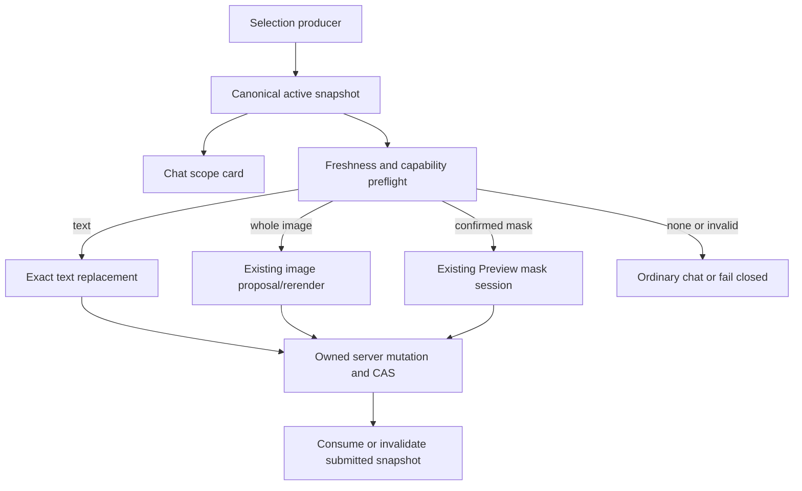
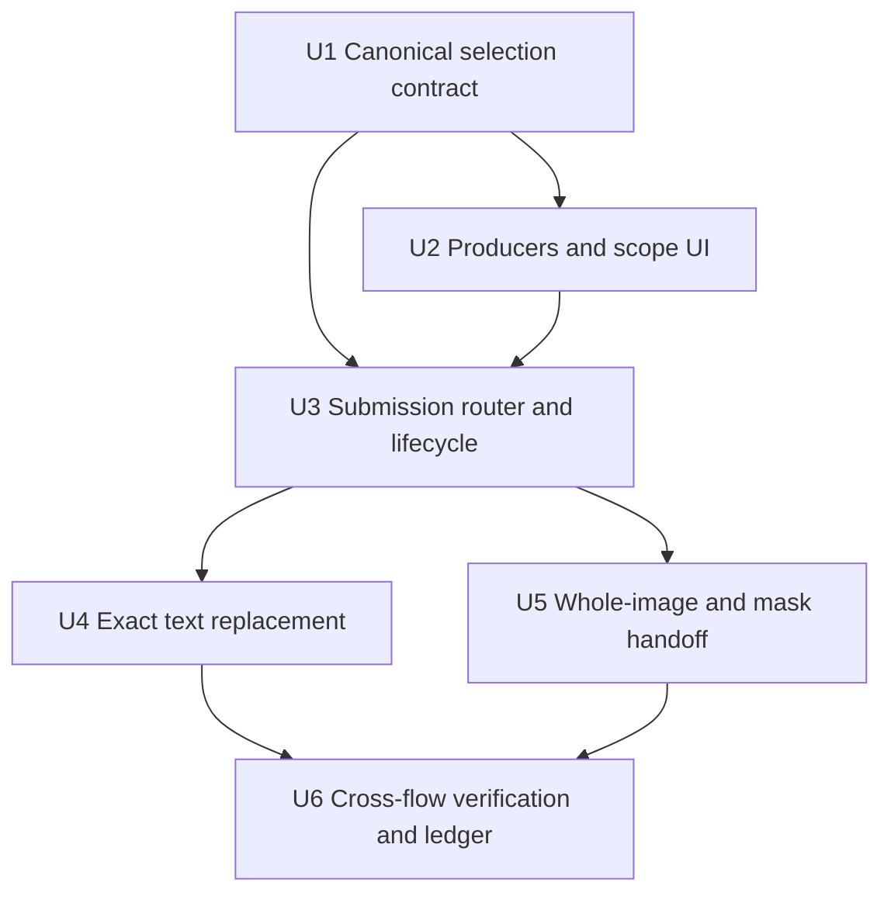
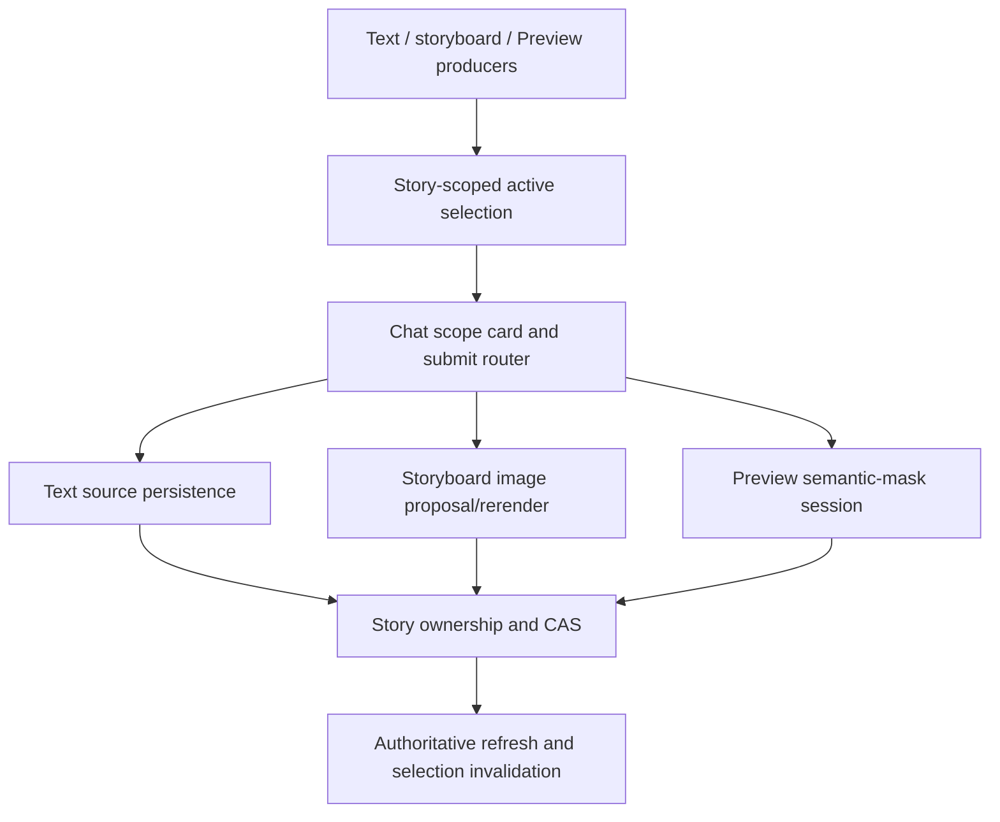

# feat: Add selection-scoped chat editing

## Summary

Introduce one canonical active-selection lifecycle and one submission router, then dispatch validated selections to three existing execution families: exact text replacement, whole-image proposal/rerender, and Preview semantic-mask editing. The shared layer owns identity, display, replacement, freshness, and failure behavior; it does not merge or bypass the downstream preview, pricing, candidate-review, adoption, or authorization flows.

---

## Problem Frame

The repository already captures text, image, and rectangular media selections, but producers encode them inconsistently and `StoryAgentChat` decides among several special cases by local precedence. Text editing currently trusts an LLM-returned full string without enforcing unchanged prefixes/suffixes, while Preview's confirmed semantic mask is not represented as the chat selection's authoritative region. As a result, the UI can display a selection without proving that the exact target is still current or that the chosen executor will preserve everything outside it (see origin: `docs/brainstorms/2026-08-31-selection-scoped-chat-editing-requirements.md`).

---

## Requirements

- R1. An explicit current selection is the sole scope for the next edit instruction and takes precedence over inferred targets.
- R2. A text selection carries an exact mutable source, range, selected content, and source version; only that range may be replaced.
- R3. A whole-image selection binds one owned image and one stable story/shot target; no sibling image or shot may be changed.
- R4. An image-region selection binds the exact image plus a confirmed semantic mask; it may never fall back to whole-image generation.
- R5. Before submission, chat shows the exact selected object, scope, and whether it is ready, stale, or read-only, and allows clearing it.
- R6. Without a valid explicit selection, submission follows ordinary chat and never executes a guessed edit.
- R7. A new explicit selection atomically replaces the previous one; story switches, target deletion, target replacement, and successful adoption clear or invalidate it.
- R8. Text edits preserve the prefix, suffix, structure, and order outside the selected range byte-for-byte/string-for-string.
- R9. Image edits preserve non-target images and shots; masked edits preserve pixels outside the confirmed mask.
- R10. Cross-story, deleted, version-changed, range-drifted, or mask-drifted selections fail closed and require reselection.
- R11. Each selection kind retains its existing non-destructive preview, pricing, candidate review, explicit confirmation, and adoption behavior.
- R12. Story and image ownership and current-target checks are enforced again at server mutation boundaries; client selection state is never authorization.

**Origin actors:** A1 (创作者), A2 (聊天助手)  
**Origin flows:** F1 (文字选区修改), F2 (整图定向修改), F3 (图片局部修改)  
**Origin acceptance examples:** AE1 (exact text range), AE2 (one image only), AE3 (confirmed mask only), AE4 (no-selection ordinary chat), AE5 (replacement and stale target), AE6 (pricing and authorization)

---

## Scope Boundaries

- No multi-selection or discontinuous-range batch edit in v1.
- No inferred modification target when no explicit selection exists.
- No redesign of the overall chat, text editor, image editor, or Preview information architecture.
- No whole-image fallback when semantic-region recognition or mask validation fails.
- No changes to provider choice, image-generation price, signed-quote policy, candidate count, or adoption policy.
- No cross-story, cross-user, or cross-project batch capability.
- Read-only prose such as historical chat messages may remain quote context, but must not be presented or routed as an executable text edit target. Adding editable chat-history semantics is separate product work.
- Existing video/time-range commands remain on their current editing-command path; this plan only ensures they cannot be mistaken for one of the three confirmed selection-edit kinds.

### Deferred to Follow-Up Work

- Multi-target editing and compound instructions: reconsider only after single-target scope protection has production evidence.
- Editable historical chat messages: requires a separate decision about conversation provenance and persistence semantics.

---

## Context & Research

### Relevant Code and Patterns

- `shared/selectionContext.ts` and `server/routers/_storyShared.ts` already define the cross-layer selection shape and validation schema. Extend this contract instead of creating a parallel payload.
- `client/src/features/storyAgent/selectionStoryScope.ts` already fails closed for mismatched story IDs, but legacy selections without a story ID currently pass. New executable producers must always provide story ownership; legacy permissiveness should not survive on executable paths.
- `client/src/features/storyAgent/hooks/useSelectionCapture.ts`, `client/src/features/storyAgent/views/StoryboardPanel.tsx`, `client/src/features/creationEditor/mediaSelectionContext.ts`, and `client/src/features/creationEditor/views/EditingNleWorkspace.tsx` are the main selection producers.
- `client/src/features/storyAgent/views/SelectionContextCard.tsx` is the existing user-visible selection surface and should become the common scope/readiness presentation rather than being replaced.
- `client/src/features/storyAgent/views/StoryAgentChat.tsx` currently hard-codes routing precedence among remix, local image tools, asset swap, and `sendSelectionEdit`; extract the selection decision into a testable router.
- `client/src/features/storyAgent/StoryAgentContext.tsx` already registers a storyboard rerender runner, creates prompt candidates, checks active story after async work, and keeps failed selections for retry. Preserve these patterns while moving scope validation ahead of execution.
- `server/archive/selectionEdit.ts` is the current LLM text rewrite boundary. It asks for a complete rewritten string but does not mechanically prove that the prefix and suffix stayed unchanged; the new text path must request/accept replacement content and reconstruct the authoritative full value around the selected range.
- `client/src/features/creationEditor/views/ShotPreview.tsx`, `client/src/features/creationEditor/previewObjectMaskEditing.ts`, and `server/routers/creationAgent.ts` already implement semantic-mask confirmation, signed quote, idempotent paid submission, candidate review, current-target checks, and compare-and-set adoption. Chat should hand off into this flow rather than duplicating it.
- `server/routers.creationAgentMaskEditing.test.ts`, `server/db.previewMaskedImageAdoption.test.ts`, and `server/db.previewMaskedImageOperations.test.ts` establish the authorization, idempotency, and late-adoption regression patterns for masked edits.

### Institutional Learnings

- `docs/solutions/2026-06-13-故事为唯一单位-镜头按storyId.md` makes Story the sole work unit. Every executable selection read/write must resolve by `storyId + userId`, use stable shot identity, and never fall back to the latest story or mutable `shotNo` matching.
- Existing comments in `client/src/features/storyAgent/selectionStoryScope.ts` document a real cross-story selection leak. Freshness must be a shared lifecycle invariant, not a collection of cleanup calls at known navigation sites.

### External References

- None. The repository contains direct, current patterns for selection payloads, story ownership, version/CAS checks, paid masked editing, and candidate adoption; external guidance would not improve the implementation decisions.

---

## Key Technical Decisions

| Decision | Resolution and rationale |
|---|---|
| Shared concept | Use one canonical active-selection snapshot and lifecycle, not one universal executor. This gives all three modes the same user contract without weakening their distinct safety flows. |
| Selection identity | Require kind-specific exact identity: mutable text source + range + version/fingerprint; image ID + stable target + current version; image ID + stable target + confirmed semantic-mask identity + image version. Labels and `selectedText` remain display data, never identity. |
| Freshness | Validate once before client dispatch and again at every server mutation. Any mismatch is stale; do not fuzzy-match text, substitute a current image, or regenerate a mask automatically. |
| Text containment | Have the model produce only replacement content. Reconstruct the final value from the server-authoritative prefix and suffix after range/version validation, then persist through the source's existing story/shot CAS path. |
| Region handoff | A confirmed Preview mask becomes the region selection's authority. Chat supplies the instruction to the existing mask session, which still owns quote confirmation, paid submission, candidate review, and adoption. |
| Selection consumption | Snapshot the active selection at submit time. A later UI selection cannot retarget in-flight work; successful handoff/application consumes that snapshot, while recoverable execution errors retain it only if it is still current. |
| Read-only sources | Keep quote/reference selections distinct from editable selections. An unsupported or read-only text source fails closed with an explicit explanation instead of returning prose that implies a mutation occurred. |

---

## Open Questions

### Resolved During Planning

- How can three selections share a lifecycle without merging executors? A discriminated canonical snapshot owns identity, display, replacement, and freshness; a central router dispatches to existing kind-specific runners.
- How should drift be verified? Text uses authoritative source version/fingerprint plus exact range content; whole-image uses owned current image ID plus stable target identity; region editing adds the confirmed mask identity scoped to that image and reuses the existing quote/adoption current-target checks.
- Should a raw rectangle be sufficient for region editing? No. It can be a gesture or display hint, but only a server-produced, explicitly confirmed semantic mask makes the selection executable.

### Deferred to Implementation

- Exact helper and adapter names: choose names consistent with nearby modules once the contract is introduced.
- Whether every existing text producer already exposes a durable revision: characterize each producer first; where no revision exists, use a deterministic content fingerprint as the v1 comparison token and do not invent a broad persistence refactor.
- Final stale/read-only copy: preserve the behavioral distinction in tests, then tune wording with the surrounding chat tone during implementation.

---

## High-Level Technical Design

> *This illustrates the intended approach and is directional guidance for review, not implementation specification. The implementing agent should treat it as context, not code to reproduce.*

| Active selection | Client preflight | Executor | Server-side protection |
|---|---|---|---|
| Exact text range | Editable source, story, version/fingerprint, boundaries, selected content still match | Exact replacement + existing source persistence | Ownership, authoritative content/version, range match, CAS write |
| Whole image | The exact selected source image still belongs to the stable shot/clip and its target version is current | Existing prompt proposal and image rerender/candidate flow | Story/user ownership, exact source image/material status, target-version and adoption CAS checks |
| Confirmed image mask | Image target and confirmed mask identity still match | Existing Preview mask quote/generate/review/adopt flow | Scoped mask key, signed quote, ownership, current target, expected source at adoption |
| None, stale, or read-only | Do not execute a selection mutation | Ordinary chat for none; explicit reselection/read-only response otherwise | No mutation endpoint is called |

---

## Implementation Units

### U1. Define the canonical selection contract and freshness rules

**Goal:** Make executable text, whole-image, and confirmed-region selections unambiguous across client and server, with one pure validation vocabulary for kind, ownership, target identity, capability, and stale reason.

**Requirements:** R1, R2, R3, R4, R7, R10, R12; F1-F3; AE5

**Dependencies:** None

**Files:**
- Modify: `shared/selectionContext.ts`
- Modify: `server/routers/_storyShared.ts`
- Modify: `client/src/features/storyAgent/selectionStoryScope.ts`
- Create: `client/src/features/storyAgent/selectionLifecycle.ts`
- Test: `shared/selectionContext.test.ts`
- Test: `client/src/features/storyAgent/selectionStoryScope.test.ts`
- Test: `client/src/features/storyAgent/selectionLifecycle.test.ts`
- Test: `client/src/features/storyAgent/storyConversationStore.test.ts`

**Approach:**
- Refine the shared context into kind-discriminated executable snapshots while retaining enough compatibility to deserialize archived quote context. Require story ownership and kind-specific target identity for every executable snapshot.
- Separate display fields from authoritative identity. For text, retain exact untrimmed source-relative boundaries and a source version/content fingerprint; for whole image, require the image and stable shot/clip target; for region image, additionally require a confirmed semantic-mask reference scoped to the selected image.
- Represent readiness as a derived validation result rather than storing optimistic booleans that can drift. The validator returns executable, stale, read-only, or invalid with a reason suitable for UI mapping.
- Tighten story-scope handling so missing `storyId` is tolerated only for legacy/read-only quote context, never for a new executable selection.
- Define deterministic replacement/clear semantics: a new snapshot replaces the old one; target/story/version transitions invalidate it; a submitted snapshot is compared by identity before any later completion clears current state.

**Execution note:** Add characterization coverage for legacy archived selections before tightening executable validation.

**Patterns to follow:**
- Discriminated region validation in `server/routers/_storyShared.ts`.
- Fail-closed story filtering in `client/src/features/storyAgent/selectionStoryScope.ts`.
- Session epoch/target identity guards in `client/src/features/creationEditor/useVisualObjectEditingSession.ts`.

**Test scenarios:**
- Happy path: valid text, whole-image, and confirmed-mask snapshots normalize to distinct executable kinds with their exact identities intact.
- Edge case: backward/reversed DOM text selection normalizes to the same start/end range without trimming away boundary characters.
- Error path: executable selection with missing story ID, missing image ID, zero/invalid text range, or raw rectangle without confirmed mask is rejected.
- Covers AE5. A new image snapshot replaces an earlier text snapshot, and a completion carrying the old snapshot identity cannot clear or mutate the new one.
- Error path: a selection from another story, a changed object version/fingerprint, or a mask scoped to another image validates as stale and supplies no executor payload.
- Compatibility: a persisted legacy conversation selection still renders as quote context, while round-tripping a new canonical snapshot preserves its discriminator and exact identity.

**Verification:**
- Every executable selection kind has one authoritative identity definition shared by client and server.
- Legacy quote data remains renderable but cannot silently become an executable mutation.

### U2. Normalize producers and make the chat card an explicit scope contract

**Goal:** Ensure all in-scope producers create canonical snapshots and chat tells the creator exactly what will change before submission.

**Requirements:** R1, R2, R3, R4, R5, R7, R10; A1, A2; F1-F3

**Dependencies:** U1

**Files:**
- Modify: `client/src/features/storyAgent/hooks/useSelectionCapture.ts`
- Modify: `client/src/features/storyAgent/views/StoryboardPanel.tsx`
- Modify: `client/src/features/creationEditor/mediaSelectionContext.ts`
- Modify: `client/src/features/creationEditor/views/EditingNleWorkspace.tsx`
- Modify: `client/src/features/creationEditor/views/ShotPreview.tsx`
- Modify: `client/src/features/creationEditor/previewObjectMaskEditing.ts`
- Modify: `client/src/features/storyAgent/views/SelectionContextCard.tsx`
- Test: `client/src/features/storyAgent/hooks/useSelectionCapture.test.tsx`
- Test: `client/src/features/creationEditor/mediaSelectionContext.test.ts`
- Test: `client/src/features/creationEditor/previewObjectMaskEditing.test.ts`
- Test: `client/src/features/storyAgent/views/SelectionContextCard.test.tsx`

**Approach:**
- Make DOM text capture preserve exact offsets against the same canonical source string that will later be resolved for persistence. Reject cross-container or read-only sources as executable edits and clear obsolete active selections when the browser selection moves outside a supported source.
- Update whole-image producers to bind the exact current image plus stable target and version, not `shotNo` or labels alone.
- On semantic-mask confirmation in Preview, publish a region snapshot that carries the server-issued mask identity, selected image target, and display geometry/preview. A lasso/rectangle before semantic recognition and explicit confirmation remains non-executable.
- Extend `SelectionContextCard` to show a consistent kind label, target summary, exact text excerpt or image/mask preview, the promise that only this scope changes, and stale/read-only status with clear/reselect affordance.
- Clear or invalidate from target deletion/replacement, story navigation, Preview target changes, and successful candidate adoption through the shared lifecycle rather than scattered source-specific assumptions.

**Patterns to follow:**
- Existing normalized geometry builders in `client/src/features/creationEditor/mediaSelectionContext.ts`.
- Explicit mask confirmation state in `client/src/features/creationEditor/previewObjectMaskEditing.ts`.
- Existing compact scope card and clear affordance in `client/src/features/storyAgent/views/SelectionContextCard.tsx`.

**Test scenarios:**
- Happy path: selecting the middle sentence of an editable card/shot emits exact untrimmed range boundaries, story ID, source identity, and source revision/fingerprint.
- Edge case: selection spanning two source containers, a collapsed selection, or selection in historical chat does not become an executable text edit.
- Happy path: selecting the second of three storyboard images shows that exact image ID/shot target in the card.
- Happy path: confirming a semantic mask shows the target image and region, while an unconfirmed lasso remains not ready to submit.
- Error path: changing stories, deleting/replacing the image, or changing Preview target marks/clears the old card before it can execute.
- UI: each mode exposes clear/reselect behavior and communicates “only this text/image/region will change”; stale and read-only states never use ready-to-edit language.

**Verification:**
- The card's displayed target and the executor payload are derived from the same snapshot.
- No in-scope producer relies on mutable labels or `shotNo` as sole identity.

### U3. Centralize submission routing and in-flight selection ownership

**Goal:** Replace component-local precedence with a pure, testable routing decision that snapshots and validates the active selection before any mutation-like work begins.

**Requirements:** R1, R5, R6, R7, R10, R11; F1-F3; AE4, AE5

**Dependencies:** U1, U2

**Files:**
- Create: `client/src/features/storyAgent/selectionSubmissionRouter.ts`
- Modify: `client/src/features/storyAgent/views/StoryAgentChat.tsx`
- Modify: `client/src/features/storyAgent/StoryAgentContext.tsx`
- Modify: `client/src/features/storyAgent/types.ts`
- Test: `client/src/features/storyAgent/selectionSubmissionRouter.test.ts`
- Test: `client/src/features/storyAgent/StoryAgentContext.selectionEditing.test.tsx`

**Approach:**
- Route from a single decision point using the submitted snapshot: no selection to ordinary chat; valid text to text replacement; whole image to the existing image path; confirmed mask to the mask handoff; video/time selection to its existing command runner; invalid/stale/read-only to an explicit non-mutating response.
- Treat deterministic local tools and asset swap as capabilities of the selected target after selection classification, not as earlier intent heuristics capable of silently overriding the active scope.
- Refuse ambiguous combinations such as an active single-target selection plus unrelated pending media rather than expanding into an implicit multi-target operation.
- Capture selection identity at submit time. Async responses may append messages only within the originating story session and may consume the active selection only if it still matches the submitted identity.
- Preserve retry only for transient failures when the selection remains fresh; stale, permission, deleted-target, and version-conflict failures invalidate it and instruct reselection.

**Execution note:** Characterize current `handleSubmit` precedence before replacing it, then write routing cases as a decision table.

**Patterns to follow:**
- Story-session late-result checks in `client/src/features/storyAgent/StoryAgentContext.tsx`.
- Editing-session epoch guards in `client/src/features/creationEditor/useVisualObjectEditingSession.ts`.
- Current fallthrough behavior in `client/src/features/storyAgent/useAssetSwapProposal.ts`, moved behind the explicit routing decision.

**Test scenarios:**
- Covers AE4. With no selection and the instruction “让它更温暖”, the router selects ordinary chat and no edit mutation/runner is called.
- Happy path: each of the three valid selection kinds maps to exactly one executor; explicit selection wins over inferred image/text intent.
- Error path: stale, read-only, cross-story, or malformed selection maps to no executor and retains no mutation payload.
- Edge case: active selection plus unrelated pending attachments is rejected as ambiguous instead of becoming a batch edit.
- Covers AE5. If selection A is submitted and selection B becomes active before A completes, A's completion cannot clear or retarget B.
- Integration: transient executor failure retains the same still-fresh selection for retry; a target/version conflict invalidates it.

**Verification:**
- `StoryAgentChat` no longer encodes competing selection-edit precedence branches.
- Every submitted selection instruction has one observable route or an explicit no-mutation result.

### U4. Enforce exact-range text replacement against authoritative content

**Goal:** Make text editing mechanically incapable of changing content outside the selected range and persist through the selected source's owned, version-checked path.

**Requirements:** R2, R8, R10, R11, R12; F1; AE1

**Dependencies:** U3

**Files:**
- Modify: `server/archive/selectionEdit.ts`
- Modify: `server/routers/storyAgent.ts`
- Modify: `server/routers/_storyShared.ts`
- Modify: `client/src/features/storyAgent/StoryAgentContext.tsx`
- Modify: `client/src/features/storyAgent/views/StoryCardsBoard.tsx`
- Modify: `client/src/features/analysis/views/ShotTable.tsx`
- Test: `server/archive/selectionEdit.test.ts`
- Test: `server/routers.storyAgent.test.ts`
- Test: `client/src/features/storyAgent/StoryAgentContext.selectionEditing.test.tsx`

**Approach:**
- Resolve the selected mutable source under `storyId + userId` at the server boundary and compare its current version/fingerprint, exact range, and selected substring with the submitted snapshot before asking the model to edit.
- Ask the model for replacement content only. Construct the final source value from authoritative prefix + replacement + authoritative suffix; never accept an LLM-authored full document as evidence of containment.
- Persist through the existing source-specific path: story-body revision CAS for card/script-owned content and stable-shot field patch/CAS for shot-owned content. Do not introduce “latest story” or `shotNo` fallback resolution.
- Return an applied/candidate/conflict outcome that lets the client refresh authoritative state. Unsupported/read-only text sources return a no-mutation capability result.
- Preserve any existing source-level confirmation semantics; do not use a chat reply as proof that persistence succeeded.

**Patterns to follow:**
- `server/routers/storyAgent.ts` story ownership and `updateStoryShotFields` stable-identity write path.
- Story-body revision CAS helpers in `server/routers/_storyShared.ts` and `server/db.ts`.
- Prompt candidate version checks in `client/src/features/storyAgent/StoryAgentContext.tsx` for non-destructive confirmation where applicable.

**Test scenarios:**
- Covers F1 / AE1. Given “今天下雨。我们去了公园。晚上回家。” and the exact middle range, a replacement changes only that range; prefix and suffix are identical.
- Edge case: repeated selected text appears twice; the stored range selects and replaces only the intended occurrence, with no `indexOf`/fuzzy fallback.
- Edge case: selection includes whitespace or punctuation at its boundaries; exact boundaries, not trimmed display text, govern reconstruction.
- Error path: source text changes after selection, version/fingerprint differs, range is out of bounds, or the substring no longer matches; no model write is persisted and reselection is required.
- Error path: wrong user or cross-story source identity is rejected even when the client-supplied full text looks valid.
- Integration: a successful server write refreshes the card/shot view and consumes only the submitted selection; a CAS conflict preserves the newer authoritative content.
- Regression: malformed model output leaves the authoritative source unchanged.

**Verification:**
- Tests prove unchanged prefix/suffix rather than merely asserting a plausible final sentence.
- The server never trusts client `fullText` as the authoritative value to write.

### U5. Route whole-image and confirmed-region instructions through existing safe flows

**Goal:** Ensure an image instruction targets exactly one current image, and a region instruction reuses Preview's semantic-mask workflow without bypassing quote, review, or adoption.

**Requirements:** R3, R4, R9, R10, R11, R12; F2, F3; AE2, AE3, AE5, AE6

**Dependencies:** U3

**Files:**
- Modify: `client/src/features/storyAgent/StoryAgentContext.tsx`
- Modify: `client/src/features/storyAgent/views/StoryboardReviewBoard.tsx`
- Modify: `client/src/features/storyAgent/views/StoryboardPanel.tsx`
- Modify: `client/src/features/creationEditor/views/EditingNleWorkspace.tsx`
- Modify: `client/src/features/creationEditor/views/ShotPreview.tsx`
- Modify: `client/src/features/creationEditor/previewObjectMaskEditing.ts`
- Modify: `server/routers/creationAgent.ts`
- Test: `client/src/features/storyAgent/StoryAgentContext.selectionEditing.test.tsx`
- Test: `client/src/features/storyAgent/views/storyboardImageRenderPlan.test.ts`
- Test: `client/src/features/creationEditor/views/PreviewObjectMaskEditor.test.tsx`
- Test: `client/src/features/creationEditor/previewObjectMaskEditing.test.ts`
- Test: `server/routers.creationAgentMaskEditing.test.ts`
- Test: `server/db.previewMaskedImageAdoption.test.ts`
- Test: `server/services/imageMaskComposite.test.ts`
- Test: `server/services/imageGen.test.ts`

**Approach:**
- Whole image: resolve the exact selected source image and its material status against the stable story/shot or timeline-clip target before creating a prompt/image candidate. Do not silently substitute the target's current image when the creator selected a different owned candidate. Carry both the source identity and expected target version through review/adoption so a later target change cannot redirect the result.
- Preserve the current prompt-candidate and explicit rerender/adoption stages; a chat response may prepare the requested edit but must not silently promote a generated image.
- Confirmed region: register a Preview mask-session handoff through the editor workspace alongside the existing storyboard rerender runner. The chat instruction pre-fills/arms the already-confirmed mask session; Preview remains the UI and state owner for quote confirmation, paid submission, candidate display, and adoption.
- Reuse `segmentRegion`, `quoteInpaint`, `inpaint`, and `adoptInpaintCandidate` authorization, signed-quote, idempotency, and expected-source checks. Extend inputs only where needed to bind the confirmed mask snapshot/version; do not create a second paid endpoint.
- Preserve the existing hard-mask compositing in `server/services/imageGen.ts`: provider output is not trusted to protect the surrounding frame, so the final stored candidate must copy source pixels outside the binary mask through `server/services/imageMaskComposite.ts`.
- If the Preview runner is unavailable, the semantic mask is missing/unconfirmed, the image/clip is no longer current, or the mask belongs to another image, fail closed. Never reroute to whole-image generation.
- On successful image adoption, refresh the story/editor target and invalidate the submitted image selection because its source version is no longer current.

**Patterns to follow:**
- Runner registration and story-session checks in `client/src/features/storyAgent/StoryAgentContext.tsx` and `client/src/features/storyAgent/views/StoryboardReviewBoard.tsx`.
- Semantic-mask state machine and quote-before-submit order in `client/src/features/creationEditor/views/ShotPreview.tsx`.
- Ownership, scoped mask keys, durable operation receipts, and expected-source adoption in `server/routers/creationAgent.ts`.
- Pixel-level containment in `server/services/imageMaskComposite.ts`.

**Test scenarios:**
- Covers F2 / AE2. With three images in one shot, selecting image 2 creates/reviews a candidate descended from image 2 only; images 1 and 3 remain unchanged.
- Error path: whole-image source is deleted, its material/target relationship changes, or the target version changes before rerender/adoption; no fallback image is selected and no candidate is promoted.
- Covers F3 / AE3. A confirmed “hat” semantic mask and red-color instruction reach the masked-edit path; the request contains that exact mask and never enters the whole-image executor.
- Covers AE3 / R9. Given a provider result that changes every pixel, final compositing copies generated pixels only inside the hard semantic mask and preserves every protected source pixel outside it.
- Error path: raw rectangle, unconfirmed mask, mask from another image/user/story, stale image version, or unavailable Preview session causes no paid submission and asks for reselection/reconfirmation.
- Covers AE6. Quote happens before paid generation, identical uncertain submissions are not retried, the result stays a non-current candidate, and adoption requires explicit user action plus expected-source CAS.
- Covers AE5. Adopting a newer image invalidates the old whole-image/region selection; a late candidate from the old source cannot replace it.
- Authorization: another user cannot segment, quote, generate, inspect a candidate, or adopt through forged selection metadata.

**Verification:**
- Whole-image and region edits each call only their intended existing executor family.
- Existing pricing, idempotency, candidate review, and explicit adoption tests remain green and gain chat-entry coverage.

### U6. Add cross-flow acceptance coverage and update the feature ledger

**Goal:** Prove the unified contract across UI, router, server, and adoption boundaries, then record the real shipped entry points and evidence.

**Requirements:** R1-R12; A1, A2; F1-F3; AE1-AE6

**Dependencies:** U4, U5

**Files:**
- Create: `client/src/features/storyAgent/selectionScopedChatEditing.integration.test.tsx`
- Modify: `server/routers.ownershipBoundaries.test.ts`
- Modify: `docs/features/feature-ledger.json`
- Test: `client/src/features/storyAgent/selectionScopedChatEditing.integration.test.tsx`
- Test: `server/routers.ownershipBoundaries.test.ts`

**Approach:**
- Add a compact integration matrix that enters through the chat submission surface and asserts executor choice, stale behavior, outside-scope preservation, selection consumption, and candidate/adoption handoff for all three modes.
- Keep server ownership coverage aware of any revised selection endpoint; remove the current label-only ownership exemption only when executable selection edits actually verify owned story sources.
- Update the `selection-scoped-chat-editing` ledger card only after real entry points and executable tests exist. Record authoritative code, dependencies, preserved invariants, remaining gaps, and verification evidence; do not mark `working` from types or UI alone.

**Patterns to follow:**
- Feature status/evidence rules in `docs/features/README.md`.
- Existing ownership guard in `server/routers.ownershipBoundaries.test.ts`.

**Test scenarios:**
- Covers AE1-AE6. One table-driven acceptance suite verifies exact text containment, one-image targeting, confirmed-mask routing, no-selection ordinary chat, selection replacement/staleness, and paid/authorization safeguards.
- Integration: switching stories while each executor is in flight suppresses late UI mutation and cannot write into the newly active story.
- Regression: image OCR/rotation, asset swap, prompt candidates, storyboard rerender, and Preview mask adoption remain reachable only for compatible selected targets.
- Ledger: validation accepts the updated card and its cited test files/entry points exist.

**Verification:**
- All origin acceptance examples have executable evidence at the appropriate layer.
- `pnpm feature:validate` passes and the feature ledger accurately reflects implementation status and known gaps.

---

## System-Wide Impact

- **Interaction graph:** Selection producers feed story-spine state; the chat card and router consume one snapshot; kind-specific runners cross into story text persistence, storyboard image generation, or Preview mask operations; successful writes refresh the owning surface and invalidate the old target.
- **Error propagation:** Validation failures are typed as stale/read-only/invalid and stop before mutation. Server authorization/CAS failures return to the originating runner, invalidate stale targets, and never fall through to another executor. Paid uncertain states retain their existing no-auto-retry treatment.
- **State lifecycle risks:** The principal races are new selection replacing an in-flight one, story switch during async work, source content/image changing after quote, and late candidate adoption. Snapshot identity, story-session checks, and expected-source CAS cover each boundary.
- **API surface parity:** Shared client/server selection schemas must evolve together. Archived conversation selections remain readable, while only canonical owned snapshots are executable.
- **Integration coverage:** Unit tests cannot alone prove that chat dispatch reaches the correct existing runner and that adoption invalidates the old selection; U6 supplies this cross-layer matrix.
- **Unchanged invariants:** Story is the sole work unit; stable shot identity outranks `shotNo`; client display is not authorization; generated images remain candidates until explicit adoption; region failure never broadens scope; no price/provider policy changes.

---

## Risks & Dependencies

| Risk | Mitigation |
|---|---|
| Compatibility with archived/legacy selections | Parse them as display-only quote context unless they meet the stricter executable contract; add characterization tests before schema changes. |
| DOM text offsets differ from persisted canonical strings | Bind capture to a source adapter/canonical value, preserve untrimmed boundaries, and validate substring + fingerprint on the server before model invocation. |
| LLM rewrites outside the requested sentence | Accept replacement content only and reconstruct prefix/suffix mechanically from authoritative text. |
| Existing intent branches override explicit scope | Centralize routing and make specialized tools target capabilities downstream of selection classification. |
| Mask display geometry is mistaken for the actual editable region | Treat geometry as presentation only; require a confirmed, image-scoped semantic mask identity for execution. |
| Paid request is duplicated after timeout | Preserve signed quotes, operation tokens, durable receipts, and uncertain-state no-retry behavior. |
| Late async result mutates a new story/selection | Carry submitted snapshot identity and story session through completion; compare before UI updates and enforce server ownership/CAS. |
| Broad refactor destabilizes unrelated video/timeline commands | Keep their existing executor and add a router boundary test proving they are classified separately from the three v1 edit modes. |

---

## Documentation / Operational Notes

- Update `docs/features/feature-ledger.json` after implementation and run `pnpm feature:validate` as the required final evidence check.
- No data migration or new provider configuration is planned. Shared payload evolution must remain tolerant of stored conversation history.
- Roll out behind the existing chat/edit entry points; failures should be visible as reselection/read-only guidance rather than silent fallback. No new background worker or monitoring surface is required.

---

## Sources & References

- **Origin document:** `docs/brainstorms/2026-08-31-selection-scoped-chat-editing-requirements.md`
- **Feature ledger:** `docs/features/feature-ledger.json` (`selection-scoped-chat-editing`)
- **Institutional learning:** `docs/solutions/2026-06-13-故事为唯一单位-镜头按storyId.md`
- **Shared selection contract:** `shared/selectionContext.ts`
- **Current selection orchestration:** `client/src/features/storyAgent/StoryAgentContext.tsx`
- **Current chat routing:** `client/src/features/storyAgent/views/StoryAgentChat.tsx`
- **Preview mask workflow:** `client/src/features/creationEditor/views/ShotPreview.tsx`
- **Masked-edit server safety:** `server/routers/creationAgent.ts`
