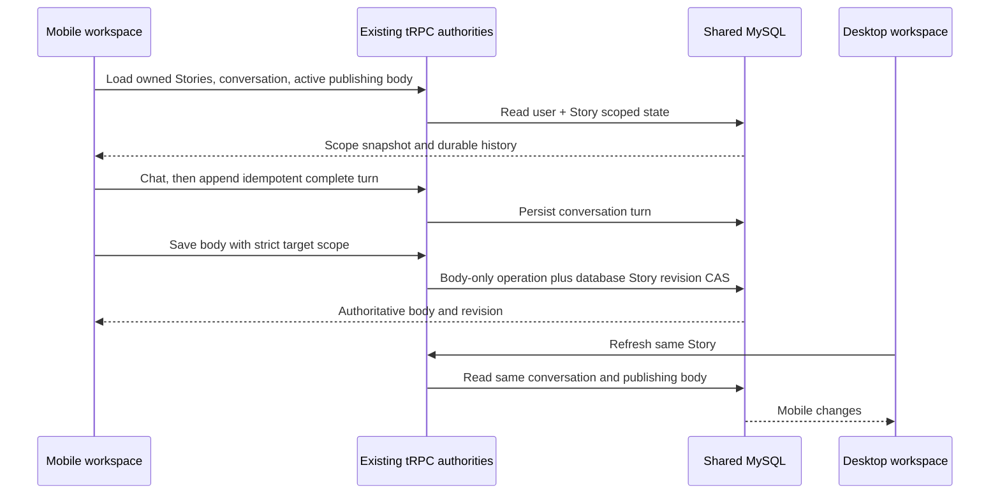
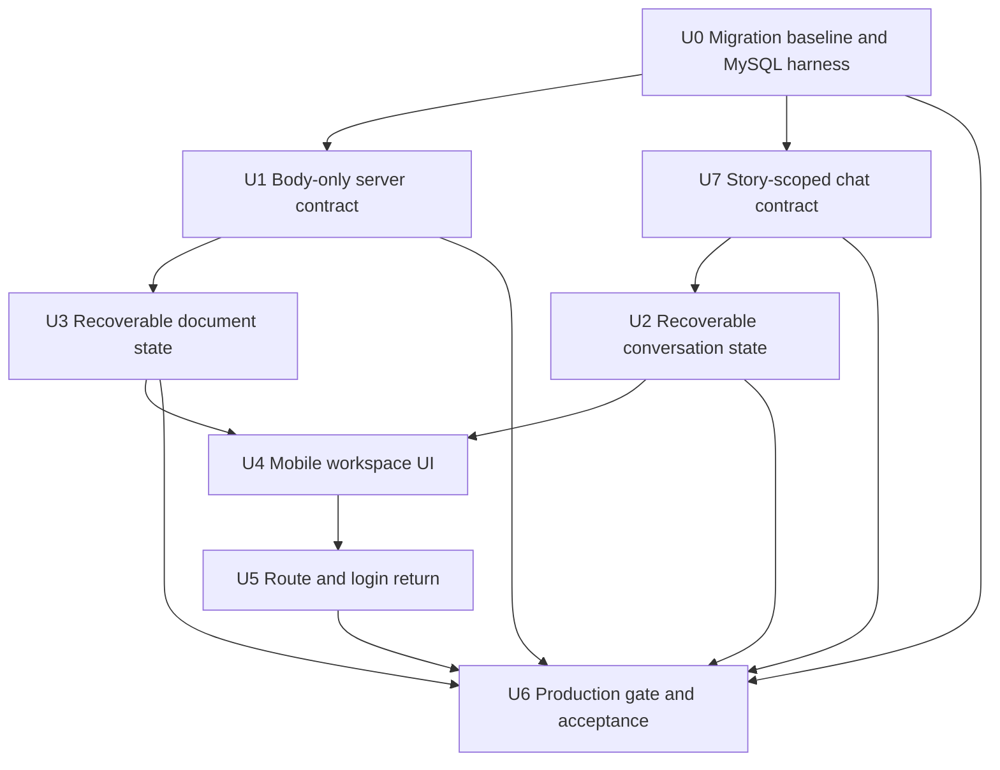
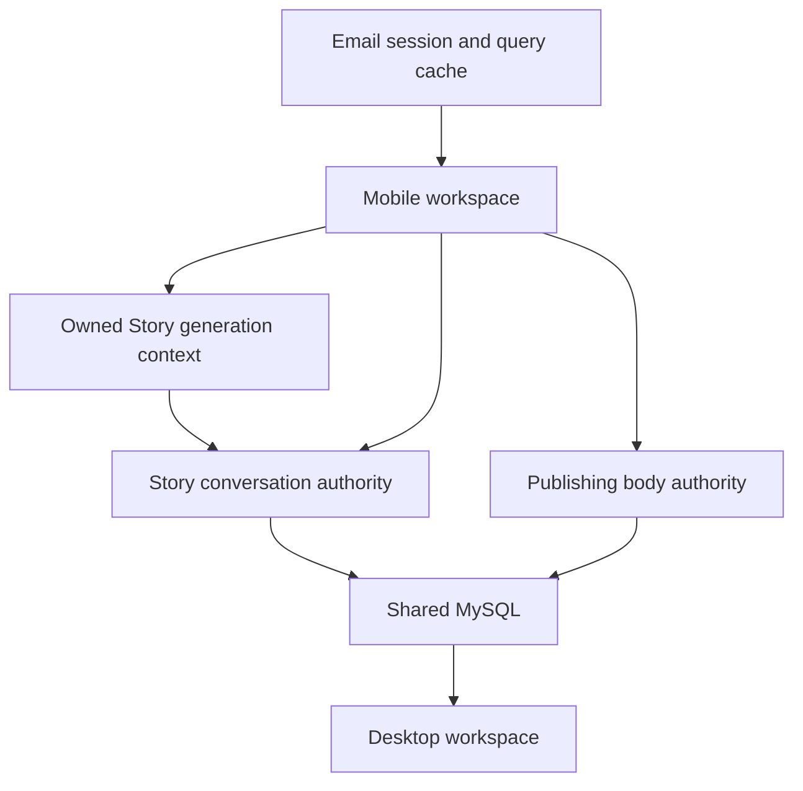

# feat: Add mobile cross-device chat and document workspace

## Summary

Build an independent, lightweight mobile Web workspace on top of the existing account, Story, conversation, and publishing-version authorities. Add a body-only strict save boundary, device-local recovery for unsynced work, safe login return routing, and a production gate requiring real authentication, HTTPS, and one shared MySQL backend.

---

## Problem Frame

The desktop workspace already persists Story conversations and publishing drafts, but its editing, preview, asset, and timeline surfaces are too heavy for quick mobile use. The mobile and desktop devices also cannot genuinely continue one another's work while production authentication is disabled or data is stored in a machine-local persistence file. See origin: `docs/brainstorms/2026-05-25-mobile-chat-image-experience-requirements.md`.

---

## Requirements

- R1. Serve the mobile workspace through a public HTTPS URL without requiring an installed app.
- R2. Reuse the desktop email identity and preserve all existing Story and project ownership checks.
- R3. Open the account's most recently updated existing Story by default and allow switching among that account's existing Stories.
- R4. Load the current Story's durable “聊聊” history rather than creating a mobile-only conversation.
- R5. Persist each completed user/assistant turn under the same Story; do not present an unsaved turn as synced.
- R6. Make successful mobile conversation turns visible on desktop after re-entry or refresh, and vice versa.
- R7. Edit only the body of the publishing workspace's server-returned active version and active platform; preserve title, tags, selection pointers, sibling platforms, and sibling versions.
- R8. Make a successful body save authoritative for both devices rather than browser-local only.
- R9. Provide save-then-refresh cross-device visibility; real-time cursor or keystroke collaboration is not required.
- R10. Provide only two primary mobile views, “聊聊” and “正文”, with readable touch-friendly controls that remain usable with the software keyboard open.
- R11. Reject stale or scope-drifted document writes instead of silently overwriting newer content or writing into a version/platform that is no longer active.
- R12. Preserve user text and complete unsynced turns across network errors, uncertain results, conflicts, refreshes, and session reauthentication, with retry or copy recovery paths.

**Origin actors:** A1 (creator), A2 (“聊聊”), A3 (mobile workspace), A4 (desktop workspace)

**Origin flows:** F1 (mobile login and recent Story), F2 (cross-device conversation), F3 (mobile publishing-body edit), F4 (concurrent edit conflict)

**Origin acceptance examples:** AE1 (account and recent Story), AE2 (conversation continuation), AE3 (body-only cross-device save), AE4 (conflict protection), AE5 (mobile keyboard usability)

---

## Scope Boundaries

- Do not implement image generation or editing, materials, visual assets, storyboards, preview playback, timelines, video, or publishing covers.
- Do not edit publishing titles, tags, active version/platform selection, other platforms, or other versions from mobile.
- Do not create Stories from mobile in this MVP; an empty account directs the user to create its first Story on desktop.
- Do not build a WeChat mini-program, native app, PWA installation, offline editing, voice input, push notifications, or multi-user collaboration.
- Do not redesign the desktop workspace or weaken its current account, Story, cache, or version boundaries.
- Do not require live two-screen synchronization, cursor presence, automatic conflict merging, or collaborative locking.
- Treat `docs/plans/2026-05-25-001-feat-mobile-chat-image-experience-plan.md` as historical context only; none of its image, swipe, signal, or storyboard implementation units are active here.

### Deferred to Follow-Up Work

- Mobile Story creation and broader publishing controls.
- Real-time subscription/push synchronization after save-refresh semantics are proven.
- Automatic three-way document merging; the MVP fails closed and preserves both the user's local text and the latest server text.
- PWA installation, offline queueing, images, voice, and other richer mobile authoring capabilities.

---

## Context & Research

### Relevant Code and Patterns

- `client/src/app/router/AppRouter.tsx` provides `AuthGuard`; its current `/m/:rest*` redirect must be replaced by the mobile route without changing desktop routing.
- `client/src/features/auth/views/AuthEntryPanel.tsx` performs invite-email login and `useAuth.refreshAfterIdentityChange`; extend its successful destination through a safe internal return path while preserving the whole-query-cache clear.
- `client/src/features/storyAgent/recentStoryEntry.ts` already treats the server's `updatedAt`-descending Story list as the recent-Story authority and guards late initial loading.
- `server/routers/promptLineage.ts`, `server/services/storyConversation.ts`, and `client/src/features/storyAgent/storyConversationStore.ts` provide owned Story conversation listing, transactional two-message append, idempotent client message IDs, and legacy projection merging.
- `client/src/features/storyAgent/StoryAgentContext.tsx` and `client/src/features/storyAgent/views/StoryAgentChat.tsx` contain many desktop-only image, selection, timeline, and whole-Story autosave behaviors; the mobile workspace must not mount them as its state layer.
- `server/routers/publishingDraft.ts`, `server/services/publishingPersistence.ts`, and `shared/publishingDraft.ts` own versioned publishing content and the current active version/platform projection.
- `server/services/storyBodyPersistence.ts` and `server/db.ts` provide Story ownership and revision-CAS persistence; the new document operation should extend this authority rather than call the stale whole-Story merge path.
- `client/src/features/storyAgent/storyAgentPersistence.ts` demonstrates recoverable local buffers, but its project-wide Story spine key is too broad for the mobile body and pending-turn scopes.
- `docs/aliyun-deploy-runbook.md` and `scripts/deploy-initial-aliyun.sh` define the existing ECS/nginx/PM2/MySQL path. Their current HTTP/auth-disabled defaults cannot satisfy this feature's release gate.

### Institutional Learnings

- `docs/solutions/2026-06-13-故事为唯一单位-镜头按storyId.md`: every mobile read and write stays inside `userId + storyId`; never resolve writes through a latest-Story fallback, and isolate late results after Story switches.
- `docs/solutions/2026-06-13-多worktree环境数据分裂收敛.md`: `.webdev/local-persist.json` follows the process working directory and previously split into six divergent copies. It is a local development fallback, not cross-device storage; implementation and verification continue to use the single main-repo port-3000 environment.
- The feature ledger records a prior cross-identity React Query cache leak. Every identity transition must continue through `refreshAfterIdentityChange`, and mobile query keys/invalidation must remain Story-scoped.

### External References

- No external research is required for planning. The repository has direct patterns for authentication, Story ownership, conversation persistence, publishing CAS, deployment, and mobile-safe React primitives; device-specific viewport behavior is intentionally verified during implementation on iOS Safari and Android Chrome.

---

## Key Technical Decisions

- **Use an independent mobile feature state layer, not the desktop Story spine:** mobile needs only Story selection, conversation, and one publishing body. Reusing the desktop provider would import whole-Story local hydration, background autosaves, images, selections, and timeline side effects.
- **Treat the server read result as the document scope snapshot:** the mobile editor binds to the returned `storyId`, active version, active platform, and server-issued monotonic body revision. Local storage never chooses which version or platform is authoritative.
- **Add a monotonic body-only revision inside the canonical publishing authority:** a content hash alone is vulnerable to A→B→A (ABA) edits. Bind a server-issued body revision to user, Story, version, and platform; advance it whenever the body changes while also advancing the existing draft/version/container revisions and canonical projections. This can live in the versioned publishing JSON without a new table, but it must not be a hash-only fence.
- **Fail closed on active scope drift:** if desktop changes the active version or platform while mobile is dirty, mobile preserves its draft but does not write into the previous scope. The user can copy the draft or load the latest active document.
- **Make generation and turn persistence Story-scoped and durably idempotent:** add a mobile conversation facade that verifies the owned Story and builds model context from durable Story conversation state. Reserve a logical turn by `userId + storyId + clientTurnId + requestHash` before model execution and persist the completed reply before returning it, so an uncertain HTTP result can be recovered without another model call. Bind both conversation messages to that turn; exact retries converge, while reused identities with different content conflict instead of forming a mixed or half turn.
- **Keep model reply and history append as two recoverable stages:** a durably recovered reply is still not presented as cross-device synced until the whole-turn append succeeds. Generation/status and append retries reuse the same turn/message identities; a stale in-progress generation whose provider outcome cannot be proven is surfaced as unknown for copy/recovery rather than automatically invoking the model again.
- **Treat browser recovery storage as recoverability, not an auth boundary:** scope records with an opaque authenticated account identity, cap their age/count/bytes, and remove the prior account's records on explicit logout or account change. Same-user session reauthentication may recover; a different account must find no prior content even by enumerating storage.
- **Use the existing deployment path but fail closed at process startup:** mobile release is No-Go unless production starts with real auth, a strong session secret, an HTTPS origin, restricted proxy trust, and a utf8mb4 MySQL database. Template checks alone are insufficient because PM2 or manual starts can bypass them.

---

## Open Questions

### Resolved During Planning

- **Which document is editable?** The publishing workspace's complete long-form body for the server-returned active version and active platform, not per-shot script text.
- **Old plan or new plan?** Create this new plan and retain the May image-experience plan only as history.
- **Existing or new mobile Story?** Open and switch existing Stories only; Story creation stays on desktop for the MVP.
- **What happens when version/platform changes remotely?** Reject the stale save, preserve the local text, and offer copy or latest reload; do not silently write the old scope.
- **How are unsynced chat replies handled?** Preserve the complete turn locally and retry the idempotent history append without re-running the model.
- **Is external research needed?** No; local architecture and institutional records provide direct patterns. Browser-specific behavior is an implementation verification concern.

### Deferred to Implementation

- Exact component/hook splitting inside `client/src/features/mobileWorkspace/` may be adjusted as long as the independent state boundary and test seams remain intact.
- Exact viewport fallback behavior for older browsers depends on device testing; dynamic viewport and safe-area support remain the target behavior.
- The production HTTPS switch may use the missing documented switch script or an equivalent reviewed nginx/certificate path, but the resulting gate and runbook must be reproducible.

---

## Output Structure

    client/src/
    ├── features/mobileWorkspace/
    │   ├── MobileWorkspace.tsx
    │   ├── MobileStoryPicker.tsx
    │   ├── MobileChatView.tsx
    │   ├── MobileDocumentView.tsx
    │   ├── mobileConversationStore.ts
    │   ├── mobileDocumentStore.ts
    │   └── *.test.ts(x)
    └── pages/MobileWorkspacePage.tsx

The implementing agent may consolidate small hooks or presentation components, but the mobile feature must remain independent from desktop-only Story, publishing, and editing providers.

---

## High-Level Technical Design

> *This illustrates the intended approach and is directional guidance for review, not implementation specification. The implementing agent should treat it as context, not code to reproduce.*

---

## Implementation Units

### U0. Establish an executable migration baseline and MySQL integration harness

**Goal:** Ensure schema changes and cross-process concurrency tests run against the same authoritative Drizzle migration chain that production will use.

**Requirements:** R5, R8, R11, R12; F2, F4; AE2, AE4

**Dependencies:** None

**Files:**
- Modify: `package.json`
- Modify only through verified reconciliation/generation: `drizzle/meta/_journal.json`
- Modify only through verified reconciliation/generation: `drizzle/meta/*.json`
- Modify only through verified reconciliation/generation: `drizzle/migrations/*.sql`
- Create: `scripts/verify-drizzle-migration-baseline.ts`
- Create: `server/integration/mysqlTestHarness.ts`
- Create: `server/integration/migrationBaseline.mysql.test.ts`

**Approach:**
- Treat Drizzle's journal and snapshots as the executable migration authority. Before adding feature schema, inventory SQL files `0007`-`0014`, compare them with `drizzle/meta/_journal.json`, the schema definition, and a disposable migrated database, and reconcile the chain deliberately. Do not hand-number a later SQL file, invent journal entries, renumber files, or mark production migrations applied without evidence.
- Add `pnpm test:mysql-integration`, backed by a required `TEST_MYSQL_DATABASE_URL`. The harness creates a unique utf8mb4 database per run, applies the reconciled migration chain, refuses to fall back to `.webdev/local-persist.json`, exposes independent connection/process helpers, and drops only its own validated test database on completion.
- Add pre/post migration assertions for required tables, columns, indexes, character set, and Drizzle migration history. U7 generates feature migration SQL plus snapshot/journal artifacts from `drizzle/schema.ts`, then proves them with this harness before any deployment step.
- Keep the production database read-only during baseline discovery. Comparing the real production migration ledger/schema or applying any reconciliation remains part of U6's explicit remote-approval boundary.

**Execution note:** Land the baseline reconciliation separately from feature schema generation so reviewers can distinguish existing migration drift from the new turn-identity change.

**Test scenarios:**
- A fresh disposable MySQL database reaches the expected pre-feature schema by running the repository migration command; no manual SQL is needed.
- The verifier fails when a SQL file, snapshot, journal entry, or applied migration ledger disagrees with the selected baseline.
- The harness refuses an absent/local `TEST_MYSQL_DATABASE_URL`, creates utf8mb4 tables, and cleans up only the uniquely named database it created.
- Two child processes or independently instantiated services use separate locks and pools against the same test database, so later U1/U7 races cannot be masked by one process-local mutex.

**Verification:**
- There is one documented, executable migration path from the reconciled baseline to new feature schema.
- `pnpm test:mysql-integration` can prove database constraints and multi-process races without touching developer or production data.

### U1. Add an owned body-only publishing save contract

**Goal:** Read and update only the long-form body of the active publishing version/platform with target-specific conflict protection.

**Requirements:** R2, R7, R8, R11; F3, F4; AE3, AE4

**Dependencies:** U0

**Files:**
- Modify: `shared/publishingDraft.ts`
- Modify: `server/services/publishingPersistence.ts`
- Modify: `server/routers/publishingDraft.ts`
- Test: `server/services/publishingPersistence.test.ts`
- Test: `server/routers.publishingDraft.test.ts`
- Test: `server/routers.ownershipBoundaries.test.ts`
- Create: `server/integration/publishingBody.mysql.test.ts`

**Approach:**
- Introduce one narrow document-read projection or derive it from the existing publishing read result: Story, active version, active platform, current body, and a server-issued monotonic body revision bound to that exact scope.
- Add the body-only operation to the canonical `PublishingDraftWriteOperation` path. It must update the target version's platform draft and advance body, draft, version, container/publishing, and `updatedAt` revisions before regenerating the compatible top-level projection.
- Add a dedicated body-save contract that verifies Story ownership, exact version/platform identity, continued active scope, and unchanged body revision before writing. A body hash may verify payload identity but cannot replace the revision fence.
- Treat the existing keyed Story lock as a same-process optimization only. Cross-process correctness comes from the database Story revision CAS.
- On a Story revision race, re-read the latest complete Story, revalidate active scope and target body revision, replay only the body operation on that latest authority, and retry the Story CAS within a small bound. Sibling-only changes may be preserved; target-body change, active-scope drift, or retry exhaustion returns distinct conflict classes.
- Preserve title, tags, cover state, selections, sibling platform drafts, sibling versions, and non-publishing Story fields. Do not call `storyUpsert` or stale-body merge.
- Return an authoritative scope/body/revision on success and a typed conflict carrying enough latest state for recovery. Reuse existing publishing size/platform validation, Unicode, and newline behavior.
- Store the monotonic body revision in the versioned publishing state and normalize legacy drafts deterministically. Avoid a new document table, but do not compromise strict CAS to avoid a compatibility migration inside the JSON model.

**Execution note:** Start with failing service and router integration tests for body-only preservation and concurrent-save behavior.

**Patterns to follow:**
- `writePublishingDraftState` serialization and Story lock in `server/services/publishingPersistence.ts`.
- `persistPreparedStoryBody` and `updateStoryBodyIfRevision` in `server/services/storyBodyPersistence.ts` and `server/db.ts`.
- Ownership and typed conflict translation in `server/routers/publishingDraft.ts`.

**Test scenarios:**
- Covers AE3. Save a changed body for the active version/platform; a subsequent read returns the body while title, tags, cover, active pointers, other platforms, and other versions are byte-for-byte unchanged.
- Covers AE4. Two requests use the same base body; the first succeeds and the second conflicts, leaving the first body authoritative.
- ABA edge: the body changes A→B→A; a client holding the original A revision still conflicts even though the text matches again.
- Edge case: title/tags or another platform changes without changing the target body; the body save preserves those newer sibling values rather than overwriting them.
- Error path: the version or platform no longer exists or is no longer active; reject without mutation and return the latest active scope.
- Error path: user A submits user B's Story ID; the request is rejected and no B content is exposed.
- Error path: oversized or otherwise invalid content is rejected before persistence.
- Integration: an underlying Story revision race retries/re-evaluates safely within the existing authority or returns conflict; it never falls back to whole-body stale merge.
- Projection integration: after save, canonical-version and compatibility projections remain equivalent, all relevant revisions advance, and an older desktop draft revision conflicts rather than overwriting the mobile body.
- Multi-process integration: use U0's disposable MySQL harness and two independently locked service processes to synchronize competing writes at the CAS boundary; assert one safe replay/conflict outcome with sibling preservation rather than relying on the process-local lock.

**Verification:**
- The server exposes exactly one owned body-only save path for the mobile editor.
- Tests demonstrate sibling preservation and same-base concurrency, not merely a plausible final body.

### U7. Add a Story-scoped generation and whole-turn idempotency contract

**Goal:** Ensure the model reply and the persisted question/answer pair are bound to one owned Story and one verifiable logical turn.

**Requirements:** R2, R4, R5, R6; F2; AE2

**Dependencies:** U0

**Files:**
- Modify: `drizzle/schema.ts`
- Generate after U0 reconciliation: `drizzle/migrations/*.sql`
- Generate after U0 reconciliation: `drizzle/meta/_journal.json`
- Generate after U0 reconciliation: `drizzle/meta/*.json`
- Modify: `shared/promptLineage.ts`
- Modify: `server/routers/promptLineage.ts`
- Modify: `server/routers/storyAgent.ts`
- Modify: `server/services/storyConversation.ts`
- Modify: `server/services/promptLineageStore.ts`
- Test: `server/routers.storyConversation.test.ts`
- Test: `server/services/promptLineageStore.test.ts`
- Test: `server/routers.ownershipBoundaries.test.ts`
- Create: `server/integration/storyConversation.mysql.test.ts`

**Approach:**
- Add a Story-scoped mobile reply facade. It accepts the owned Story identity, logical client turn identity, and canonical request hash; verifies ownership; and builds model context from the durable Story conversation/projection rather than trusting client-supplied history from another Story.
- Add a durable logical-turn record scoped by `userId + storyId + clientTurnId` with request hash, generation state, user content, assistant result, and message identities. Reserve it atomically before model execution; the same identity/hash returns the stored pending/completed/failed state, while the same identity with different input conflicts.
- Persist the completed assistant reply before returning it. Expose turn-status lookup so a lost response can recover the one authoritative result without another model call. A caught provider failure becomes retryable failure; a stale pending record whose provider outcome is unknowable does not auto-reinvoke and instead returns an unknown state with copy/new-turn recovery unless the provider offers a proven idempotency key.
- Bind the user and assistant conversation messages to the logical turn with database-level uniqueness in MySQL and equivalent enforcement in local persistence. Treat an exact retry of the same turn/messages as success. If a turn or message identity already exists with a different role, content, Story, or pairing, return a typed idempotency conflict and write nothing.
- Preserve the transaction boundary for appending both messages and explicitly reject or repair legacy half-turn states rather than filling the missing half with unrelated content.
- Define server append order as authoritative. If new durable messages appear after generation began, record the generated turn consistently without claiming it was generated from the newer cursor; expose a stale-context signal if the UI needs to indicate that distinction.
- Generate the schema migration and local-store compatibility work through U0's reconciled Drizzle path. Existing legacy messages remain readable and are deterministically classified as lacking a turn record; do not guess historical pairings during backfill.
- Do not simulate whole-turn idempotency with two independent message-ID checks: the current append path silently accepts an existing message ID without verifying role/content and can otherwise combine one old message with one new message. The per-turn record is also the durable authority required for uncertain generation-result recovery.

**Execution note:** Characterize the existing per-message retry cases first, then add failing ownership, collision, exact-retry, response-loss, and concurrency tests before changing persistence. Generate and inspect migration artifacts; do not create a hand-numbered SQL file outside the journal.

**Patterns to follow:**
- Owned Story checks and prompt-lineage bootstrap in `server/routers/promptLineage.ts`.
- Transactional message insertion in `server/services/storyConversation.ts`.
- Operation-token/request-hash collision protection in publishing persistence as a precedent for “same identity, same payload only”.

**Test scenarios:**
- Covers AE2. An owned Story reply uses its durable history, appends one complete logical turn, and is visible on the next list request.
- Permission: user A cannot generate against, list, or append user B's Story; B's history is never passed to the model.
- Scope mismatch: a forged Story/project/history combination is rejected rather than mixing contexts.
- Exact retry: the same turn and message identities with identical content converge to one complete turn.
- Lost generation response: the model completes and its result is stored, the HTTP response is discarded, and status/retry returns that stored reply without a second model invocation.
- Generation failure/unknown: a caught failure permits an explicit same-turn retry; a stale pending result that cannot prove provider completion is not automatically re-run and remains copyable/recoverable.
- Collision: reuse only the user ID, only the assistant ID, or the turn ID with different role/content; each conflicts and leaves the original turn unchanged.
- Legacy edge: a pre-existing half-turn or corrupt pair cannot be completed with unrelated new content.
- Concurrency: two devices submit different turns against the same base cursor; both are durably ordered once, and neither message pair interleaves.
- Migration: U0's disposable database applies the generated journal/snapshot chain; legacy conversations without turn identities remain readable, new turns use the durable record, and required scoped uniqueness is present.
- Multi-process: concurrent claims for the same turn/hash converge to one generation owner/result; the same turn with another hash conflicts.
- Desktop compatibility: the existing desktop Story Agent append/list path continues to produce valid whole turns and reads mobile turns in server order.

**Verification:**
- Generation context and persistence are both owned-Story scoped.
- Whole-turn retry semantics are enforced by the server and durable store, not inferred by the client.

### U2. Build recoverable Story-conversation state for mobile

**Goal:** Continue the durable Story conversation while making model-reply and history-persistence states visible and recoverable.

**Requirements:** R2, R4, R5, R6, R12; F2; AE2

**Dependencies:** U7

**Files:**
- Create: `client/src/features/mobileWorkspace/mobileConversationStore.ts`
- Create: `client/src/features/mobileWorkspace/mobileConversationStore.test.ts`
- Create: `client/src/features/mobileWorkspace/useMobileConversation.ts`
- Create: `client/src/features/mobileWorkspace/useMobileConversation.test.tsx`

**Approach:**
- Load the selected Story's durable conversation projection.
- Submit plain-text chat through the Story-scoped facade from U7, then append the complete user/assistant pair using the same logical turn identity.
- Model history through loading, empty, loaded, and retryable-error states; do not enable submission until the selected owned Story's durable history is loaded. A failed load shows a named retry action and never leaves stale history from the prior Story on screen.
- Model each submitted turn through replying, generation-failed, generation-unknown, persisting, synced, and persistence-failed states. Generate the client turn ID, request hash, and stable message IDs before submission and reuse them for status lookup and append retry.
- On a caught generation failure, retain the submitted user text, release the Story's in-flight submission lock, and offer Retry and Copy. Retry reuses the same logical turn identity/hash. On an uncertain transport result, query U7's durable turn status first; never blindly invoke the model again.
- Save complete unsynced turns in identity-and-Story-scoped local recovery storage. Merge recovery entries with server history by client message ID after refresh; server projection wins when the append actually succeeded but the response was lost.
- Bind every request/result to its original user and Story. A late result may update that Story's scoped cache/recovery record but cannot appear in a newly selected Story or a different identity.
- Keep one submitted turn in flight per Story to prevent accidental duplicate Enter/click sends; switching the active tab does not discard a submitted turn.

**Execution note:** Implement the mobile state machine test-first against U7's characterized server contract.

**Patterns to follow:**
- `mergeStoryConversationMessages` and draft-key behavior in `client/src/features/storyAgent/storyConversationStore.ts`.
- Whole-turn idempotency and Story-scoped reply contract from U7.
- Story-session late-result guards in `client/src/features/storyAgent/StoryAgentContext.tsx`.

**Test scenarios:**
- Covers AE2. Load desktop-created history, send one mobile message, persist the reply, refresh, and render one non-duplicated new turn.
- Happy path: progress visibly from replying to persisting to synced; only synced turns are claimed as cross-device saved.
- Error path: model reply succeeds but append fails; retain the complete turn, show retry/copy recovery, and do not mark it synced.
- Error path: model generation fails before a reply; retain the submitted user text, release the in-flight guard, and make Retry/Copy survive refresh and Story switching without leaking into the new Story.
- Error path: generation completes but the response is lost; status lookup recovers the stored result without a second model call, then append continues with the original identities.
- Error path: retry after a timeout where the server already appended; reuse IDs and converge to one durable turn without another model call.
- History states: loading disables send, empty provides a first-message state, failure shows retry, and successful reload enables the composer only for the current Story.
- Edge case: refresh with both a local pending turn and the same server-projected IDs; deduplicate and clear the recovery record.
- Edge case: switch Story A to B or identity A to B while A's request is late; B never displays A's content.
- Input edge: while a Chinese IME composition is active, Enter does not submit; explicit send submits once.
- Permission: list and append reject another user's Story ID.

**Verification:**
- A successful mobile turn appears from the durable projection after refresh.
- No code path swallows append failure while presenting the turn as saved.

### U3. Build scoped publishing-body draft and conflict recovery

**Goal:** Provide a mobile document state machine that never loses local text and never overwrites a newer or different active publishing target.

**Requirements:** R7, R8, R9, R11, R12; F3, F4; AE3, AE4

**Dependencies:** U1

**Files:**
- Create: `client/src/features/mobileWorkspace/mobileDocumentStore.ts`
- Create: `client/src/features/mobileWorkspace/mobileDocumentStore.test.ts`
- Create: `client/src/features/mobileWorkspace/useMobileDocument.ts`
- Create: `client/src/features/mobileWorkspace/useMobileDocument.test.tsx`

**Approach:**
- Derive the editor target only from the latest owned server read: user, Story, active version, active platform, body, and base identity.
- Track clean, dirty, saving, saved, failed, uncertain, and conflict states. Background refetch may refresh a clean editor but never replaces dirty text.
- Persist dirty text after edits in local recovery storage keyed by authenticated identity and exact document scope. Clear it only after a verified authoritative save or explicit discard.
- Apply recovery TTL, record-count, and byte limits; recovery is not indefinite document storage. Do not put email addresses into key names or values.
- On reload, restore automatically only if the authoritative target and base identity still match; otherwise enter conflict with both local text and latest server text available.
- On network timeout or unknown result, read the authority first. If the returned body proves the save landed, mark saved; otherwise keep the draft failed/uncertain without blind resubmission.
- Guard Story switching while dirty with save, discard, and cancel choices. A late save completion updates the current view only when its complete scope still matches.

**Execution note:** Implement the pure state transitions before wiring queries and mutations.

**Patterns to follow:**
- Publishing buffer scope helpers in `client/src/features/storyAgent/storyAgentPersistence.ts` and `client/src/features/publishingDraft/publishingOperationScope.ts`.
- Server selection/version identities in `shared/publishingDraft.ts`.
- Existing Story load epoch guards in `client/src/features/storyAgent/StoryAgentContext.tsx`.

**Test scenarios:**
- Covers AE3. Edit and save the current long-form body, refetch, and show the authoritative body with a new base identity.
- Covers AE4. When the server body changes after load, saving the old local body enters conflict, retains local text, and exposes latest/copy recovery without overwriting.
- Scope drift: desktop changes active version or platform while mobile is dirty; reject the save and keep the draft under its original recovery scope.
- Sibling change: title/tags or another platform updates while target body stays unchanged; body save succeeds and retains the sibling update.
- Failure: offline/network error keeps dirty text and permits retry; a later online transition does not auto-submit without the user action.
- Uncertain result: timeout followed by authority read distinguishes landed from not-landed saves.
- Refresh: a matching recovery draft restores; a changed base enters conflict rather than auto-overwriting server content.
- Story switch: save/discard/cancel is enforced, and a late Story A response cannot replace Story B's editor.

**Verification:**
- Every destructive state transition has a recovery path covered by tests.
- The document controller never submits the full publishing state or an unscoped body.

### U4. Create the two-view mobile workspace and Story picker

**Goal:** Present the existing-Story picker, conversation, and publishing-body editor as a focused mobile experience.

**Requirements:** R3, R4, R7, R10, R12; F1, F2, F3; AE1, AE2, AE3, AE5

**Dependencies:** U2, U3

**Files:**
- Create: `client/src/pages/MobileWorkspacePage.tsx`
- Create: `client/src/features/mobileWorkspace/MobileWorkspace.tsx`
- Create: `client/src/features/mobileWorkspace/MobileStoryPicker.tsx`
- Create: `client/src/features/mobileWorkspace/MobileChatView.tsx`
- Create: `client/src/features/mobileWorkspace/MobileDocumentView.tsx`
- Create: `client/src/features/mobileWorkspace/MobileWorkspace.test.tsx`
- Create: `client/src/features/mobileWorkspace/MobileStoryPicker.test.tsx`
- Create: `client/src/features/mobileWorkspace/MobileChatView.test.tsx`
- Create: `client/src/features/mobileWorkspace/MobileDocumentView.test.tsx`
- Modify: `client/src/index.css`
- Test: `client/src/features/storyAgent/recentStoryEntry.test.ts`

**Approach:**
- Query the owned Story list, auto-open its first server-ordered item once per cold mobile entry, and provide a compact existing-Story selector. Handle loading, retryable error, empty account, and multiple-Story states explicitly.
- Render only “聊聊” and “正文” as the primary views; do not mount desktop workspace providers or hidden desktop feature panels.
- Keep the Story selector and tab state outside the two view controllers, while the controllers own Story-scoped async and recovery state.
- Use dynamic viewport sizing, safe-area padding, independent scroll regions, and sticky composer/save actions so the software keyboard does not hide the primary action.
- Preserve normal mobile accessibility: touch-sized controls, visible focus, readable text at narrow widths/system font enlargement, explicit status announcements, and IME-safe chat submission.
- Implement dirty-Story switching and conflict recovery with the project's accessible dialog primitive: labelled title/description, initial focus on the non-destructive action, contained focus, Escape as cancel, focus restoration to the triggering control, and an announced outcome. Destructive discard is never the default focused action.
- If no Story exists, explain that the first Story must be created on desktop; do not expose a partial mobile creation flow.

**Patterns to follow:**
- `resolveRecentStoryEntry` for server-ordered recent Story behavior.
- Existing UI primitives under `client/src/components/ui/` and presentation conventions in `StoryAgentChat`/`PublishingDraftWorkspace`, without importing their stateful providers.

**Test scenarios:**
- Covers AE1. A multi-Story account opens the server-reported most recent Story and can switch to another owned Story.
- Empty/error: empty account shows the desktop-create guidance; list failure offers retry without stale Story content.
- Covers AE5. At 320/360/390px-equivalent layouts, chat composer and document save status/action remain reachable with a simulated viewport reduction.
- Accessibility: tab, Story selector, send, save, retry, copy, and conflict actions have names and keyboard focus behavior.
- Dialog accessibility: dirty-switch and conflict prompts contain/restore focus, Escape cancels, the safe action receives initial focus, and screen-reader status text announces the outcome.
- Input: long Chinese text scrolls without displacing the fixed navigation; IME composition does not trigger accidental sends.
- Dirty Story switch: save/discard/cancel paths route to the document controller and cannot silently discard text.
- Late data: Story A queries that settle after Story B selection do not render under B.

**Verification:**
- The mobile DOM contains no timeline, preview, materials, image, or publishing metadata controls.
- Both primary tasks are usable without horizontal page scrolling or keyboard-hidden primary actions.

### U5. Add canonical mobile routing and safe post-login return

**Goal:** Make `/m` a protected canonical mobile entry and return unauthenticated users there safely after login.

**Requirements:** R1, R2, R3, R12; F1; AE1

**Dependencies:** U4

**Files:**
- Modify: `client/src/app/router/AppRouter.tsx`
- Modify: `client/src/features/auth/views/AuthEntryPanel.tsx`
- Modify: `client/src/pages/LoginPage.tsx`
- Create: `client/src/app/router/AppRouter.test.tsx`
- Test: `client/src/features/auth/views/AuthEntryPanel.test.tsx`
- Test: `client/src/architecture-boundaries.test.ts`

**Approach:**
- Replace the legacy `/m/:rest*` login redirect with an authenticated `/m` page and a compatible redirect from historical mobile subpaths to the canonical entry.
- When a protected mobile entry redirects to login, carry a same-origin, allowlisted internal return path. Reject external URLs, protocol-relative values, encoded bypasses, and admin-only paths.
- Centralize return validation in one pure parser shared by guard, login entry, and login success. For the MVP, accept only the canonical `/m` target after a single normalization pass; reject schemes, hosts, double slashes, backslashes, control characters, encoded separators, dot segments, and repeated decoding tricks.
- After invite-email login, continue using `refreshAfterIdentityChange` before navigation, then navigate to the validated mobile return path or the existing desktop default.
- On same-user session expiry, keep already scoped local recovery data, clear identity-bound query data, and return through login. On explicit logout or account change, remove the prior account's mobile recovery records before another account can render.

**Execution note:** Add route and open-redirect tests before changing login navigation.

**Patterns to follow:**
- `AuthGuard`, `LoginEntry`, and admin route separation in `client/src/app/router/AppRouter.tsx`.
- Whole-query-cache clearing in `client/src/_core/hooks/useAuth.ts` and its architecture boundary test.

**Test scenarios:**
- Covers AE1. Visiting `/m` unauthenticated reaches login and successful same-account login returns to `/m`; authenticated access renders the mobile workspace.
- Desktop regression: direct `/login` still defaults to `/editing` after login when no mobile return path exists.
- Security: external, protocol-relative, encoded, malformed, and admin return targets are rejected to a safe default.
- Identity switch: cached Story/document/conversation data from user A is absent before user B's mobile queries render.
- Storage privacy: after explicit account change, enumerating mobile recovery storage as user B finds no user A body or conversation content, not merely hidden UI entries.
- Session expiry with dirty text: after reauthentication as the same user, the correctly scoped recovery draft is offered; a different user cannot read it.
- Legacy route: old `/m/...` links resolve to the canonical mobile entry without a redirect loop.

**Verification:**
- There is one canonical mobile URL, protected by the same server-backed auth contract as desktop.
- Login changes do not weaken existing cache clearing or admin route protection.

### U6. Make shared persistence and production authentication a release gate

**Goal:** Deploy and verify the mobile workspace only in an environment where phone and desktop share real authenticated MySQL state over HTTPS.

**Requirements:** R1-R12; F1-F4; AE1-AE5

**Dependencies:** U0, U1, U7, U2, U3, U5

**Files:**
- Modify: `docs/aliyun-deploy-runbook.md`
- Modify: `docs/environment-guide.md`
- Modify: `scripts/deploy-initial-aliyun.sh`
- Create or restore: `scripts/switch-www-drinkingtime-after-icp.sh`
- Modify: `server/_core/env.ts`
- Modify: `server/_core/index.ts`
- Modify: `server/_core/cookies.ts`
- Create or modify: `server/_core/securityHeaders.ts`
- Create or modify: `server/_core/requestOrigin.ts`
- Create: `server/_core/productionReadiness.test.ts`
- Create: `server/_core/cookies.test.ts`
- Create: `server/_core/securityHeaders.test.ts`
- Create: `server/_core/requestOrigin.test.ts`
- Create: `scripts/deploy-mobile-readiness.test.ts`
- Create: `docs/qa/2026-09-01-mobile-cross-device-acceptance.md`
- Modify: `docs/features/feature-ledger.json`

**Approach:**
- Make the production path fail closed when real authentication, required session secrets, HTTPS origin/callback configuration, proxy protocol forwarding, or MySQL persistence is absent. Local port-3000 development remains unchanged.
- Enforce those prerequisites at process startup and readiness, not only in templates: production without real auth, a strong session secret, HTTPS application origin, or utf8mb4 MySQL must refuse to become ready rather than fall back to guest identity or local JSON.
- Restrict Express proxy trust to the intended nginx hop/network, have nginx overwrite rather than forward client-supplied protocol headers, redirect origin HTTP to HTTPS, and validate HSTS/secure-cookie behavior. Require the production session cookie to use `SameSite=Lax` or stricter for this same-origin mobile flow, and validate the `Origin` of every state-changing API request against the configured HTTPS application origin; a future cross-site flow must add an explicit CSRF-token design before cookie scope can be broadened.
- Enforce a production Content Security Policy at the owning server/nginx boundary, with allowlisted script/style/connect/font/image sources and no silent unsafe production fallback. Test the actual response headers. This reduces the exposure of local recovery drafts and pending turns; output escaping and dependency hygiene remain required because localStorage is not an XSS security boundary.
- Restore or replace the runbook's missing HTTPS/domain switch automation and make its dry-run output auditable before remote mutation.
- Preserve the existing backup and local-to-MySQL migration workflow; verify counts and Story/user ownership before enabling the mobile URL. Never merge device-local JSON copies as the cross-device strategy. Before schema mutation, compare the production Drizzle ledger/schema with U0's reconciled baseline under explicit approval.
- Roll out turn identity expand-compatibly: apply additive nullable turn records/links and indexes first; classify legacy rows without inventing pairs; verify duplicate/corrupt cases; deploy code that dual-reads legacy messages while all new mobile writes use the durable turn record; then enforce only constraints proven safe by the data checks. Record the last rollback-safe point. Do not roll application or schema back past it without a compatible forward-fix/data procedure.
- Run U0's MySQL integration command as a mandatory pre-release gate. U1's race test uses two independently locked processes against that database, and U7's claim test proves one generation owner/result under concurrent requests.
- Validate secure cookie establishment and renewal on the real domain in iOS Safari and Android Chrome, including mobile-login return to `/m`.
- Run acceptance with two independent browser/device contexts: phone chat to desktop refresh, desktop chat to phone refresh, phone body to desktop refresh, reverse direction, and same-base concurrent body conflict.
- Record viewport/keyboard evidence for narrow phones, portrait/landscape, safe areas, long documents, system text scaling, Chinese IME, offline/reconnect, and copy/retry recovery.
- Keep the feature card `planned`/`observing` until the real entry, automated evidence, and public cross-device smoke test exist; only then promote it according to the ledger definition.

**Execution note:** Treat deployment as a separate, explicit approval boundary. Complete code and local verification before any remote rollout; do not run remote mutation or data migration without user authorization during execution.

**Patterns to follow:**
- Dry-run, backup, health-check, PM2, nginx, MySQL utf8mb4, and rollback sections in `docs/aliyun-deploy-runbook.md`.
- Single-dev-server and data-backup rules in `docs/environment-guide.md` and `AGENTS.md`.
- Feature state/evidence rules in `docs/features/README.md`.

**Test scenarios:**
- Static gate: production templates cannot leave authentication disabled or omit the shared database/HTTPS prerequisites.
- Runtime gate: direct or PM2 production startup without any required auth/origin/database prerequisite remains unready or exits; no manual start can silently enter guest or local-persist mode.
- Proxy security: client-supplied forwarded-protocol headers cannot override the trusted nginx result; origin HTTP cannot establish an authenticated session.
- CSRF: `SameSite=Lax` or stricter is present, trusted same-origin chat/body mutations succeed, and cross-site or missing/mismatched-Origin unsafe requests are rejected.
- CSP: production responses contain the enforced policy; unsafe fallback configuration fails readiness/header tests.
- Migration baseline: production preflight matches U0's reconciled journal/schema before any approved mutation; expand/dual-read/enforce checks and the rollback boundary are recorded.
- MySQL race gate: `pnpm test:mysql-integration` passes the two-process body CAS and same-turn generation-claim cases without local fallback.
- Script dry-run: domain/HTTPS switch prints intended changes without mutating nginx, certificates, environment, or services.
- Covers AE1. Public HTTPS login establishes the intended secure session and returns to `/m`; another account cannot read the first account's Story ID.
- Covers AE2. A mobile turn persists, survives app/server refresh, appears once on desktop, and desktop can continue it back to mobile.
- Covers AE3. Mobile body save appears on desktop while title, tags, active selection, other platforms, and other versions remain unchanged; reverse direction also works.
- Covers AE4. Two-device same-base edits produce one success and one recoverable conflict without lost text.
- Covers AE5. Real iOS Safari and Android Chrome keep the relevant composer/save action usable across keyboard, safe-area, orientation, and long-document cases.
- Persistence: service restart and MySQL backup/restore preserve the tested Story conversation and document body.

**Verification:**
- The acceptance record contains automated results plus real-device/public-domain evidence for every origin AE.
- `pnpm feature:validate` passes with accurate status, owners, entry points, dependencies, evidence, and remaining gaps.

---

## System-Wide Impact

- **Interaction graph:** mobile auth selects an owned Story; conversation and publishing controllers independently read/write that Story; desktop later reads the same MySQL authorities.
- **Error propagation:** authentication/ownership failures stop data rendering; model failures retain the user message; append failures retain the complete turn; body conflicts retain local and latest server text; deployment prerequisite failures block rollout.
- **State lifecycle risks:** identity, Story, version, platform, and client-message IDs are all scope boundaries. Late results, duplicated append retries, uncertain saves, and dirty reloads must converge without cross-scope rendering or silent loss.
- **API surface parity:** desktop APIs keep their current behavior. The body-only operation is additive and deliberately narrower than desktop semantic edit/version-transition flows.
- **Integration coverage:** unit tests cannot prove cross-device cookies, public network reachability, MySQL restart persistence, or mobile keyboard behavior; U6 owns those acceptance gates.
- **Unchanged invariants:** project/Story ownership, exact Story cache invalidation, prompt-lineage conversation authority, publishing version authority, desktop creation/editing features, paid-media confirmation, and the single local dev service remain unchanged.

---

## Risks & Dependencies

| Risk | Mitigation |
|------|------------|
| Production currently defaults to disabled authentication or HTTP | Treat real auth + HTTPS + secure-cookie verification as a release-blocking U6 gate. |
| A stale mobile document overwrites desktop changes or sibling fields | Use exact target identity and body-only strict CAS; preserve all siblings and fail closed on active-scope drift. |
| A generation reply is produced but its HTTP response is lost | Reserve a durable Story-scoped turn before generation, store the authoritative reply before responding, recover it by status, and never blindly re-run an unknowable in-flight provider call. |
| Model reply is durable but history append fails | Separate generation/persist states, store the complete pending turn, and retry append idempotently without re-running the model. |
| Local recovery leaks across accounts or through injected script on a shared phone | Use opaque account scope plus TTL/count/byte limits, delete prior-account recovery on logout/change, test storage enumeration, and enforce production CSP while retaining normal escaping/dependency controls. |
| A late Story/version/platform response pollutes the current view | Capture full request scope and apply results only to the matching scope. |
| Local JSON data is mistaken for cross-device persistence | Prohibit it in production readiness checks and verify both devices against one MySQL database. |
| Mobile software keyboards cover send/save controls | Use dynamic viewport/safe-area design plus real iOS/Android acceptance evidence. |
| Deployment or data migration damages existing Stories | Use dry-run, backup, ownership/count verification, staged health checks, and an explicit remote-mutation approval boundary. |
| Proxy/header spoofing breaks or weakens secure sessions | Restrict trusted proxy hops, overwrite forwarded protocol at nginx, force HTTPS/HSTS, and verify cookie behavior against both origin and proxied requests. |
| Cross-site requests trigger cookie-authenticated mutations | Require `SameSite=Lax` or stricter and reject unsafe requests whose `Origin` does not match the configured HTTPS application origin. |
| A hand-authored migration is skipped or rolls out in an unsafe order | Reconcile the Drizzle journal first, generate migration artifacts through the authoritative toolchain, prove them on disposable MySQL, and use an expand/dual-read/enforce rollout with a recorded rollback boundary. |

---

## Documentation / Operational Notes

- Implementation begins with `pnpm env:status`; only the main repository may run the port-3000 dev server, and worktrees remain code-only.
- Local browser verification proves layout and state behavior but does not satisfy cross-device acceptance until the same build runs under public HTTPS with real authentication and shared MySQL.
- Remote deployment, certificate changes, database migration, and production data mutation require explicit user approval during execution.
- The feature ledger remains truthful: requirements and a plan justify `planned`; code with incomplete public/device evidence is `observing`; `working` requires a real entry and executable evidence.

---

## Sources & References

- **Origin document:** `docs/brainstorms/2026-05-25-mobile-chat-image-experience-requirements.md`
- Feature ledger: `docs/features/feature-ledger.json` (`mobile-cross-device-chat-document`)
- Story workspace contract: `docs/story-workspace-data-contract.md`
- Deployment: `docs/aliyun-deploy-runbook.md`
- Environment safety: `docs/environment-guide.md`
- Institutional learning: `docs/solutions/2026-06-13-故事为唯一单位-镜头按storyId.md`
- Institutional learning: `docs/solutions/2026-06-13-多worktree环境数据分裂收敛.md`
- Historical superseded plan: `docs/plans/2026-05-25-001-feat-mobile-chat-image-experience-plan.md`
