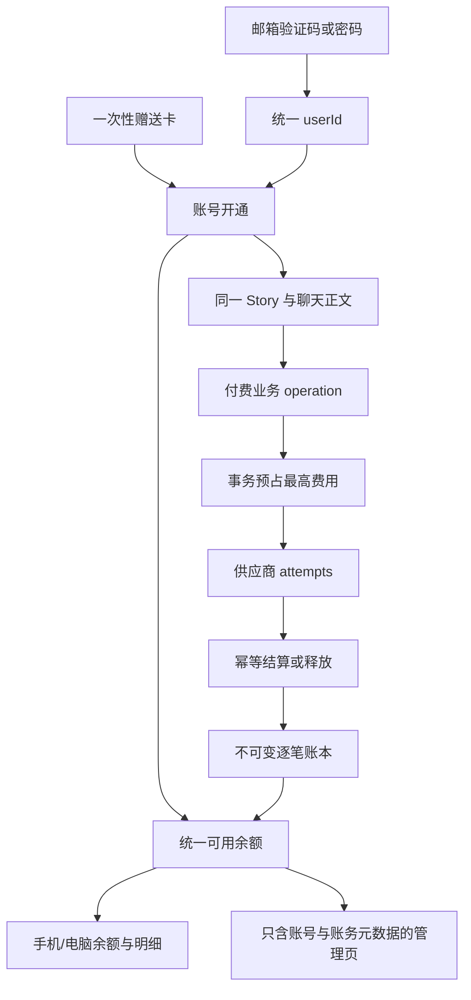
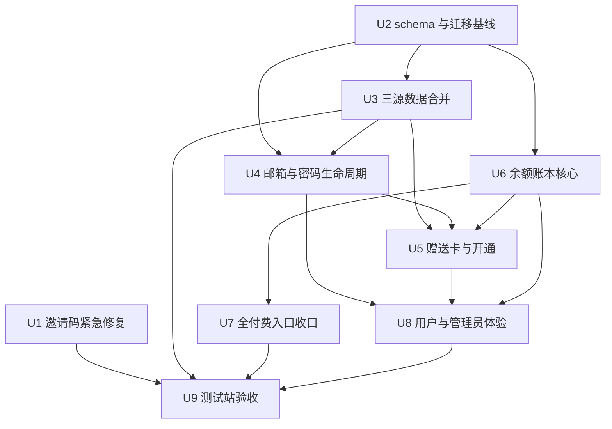
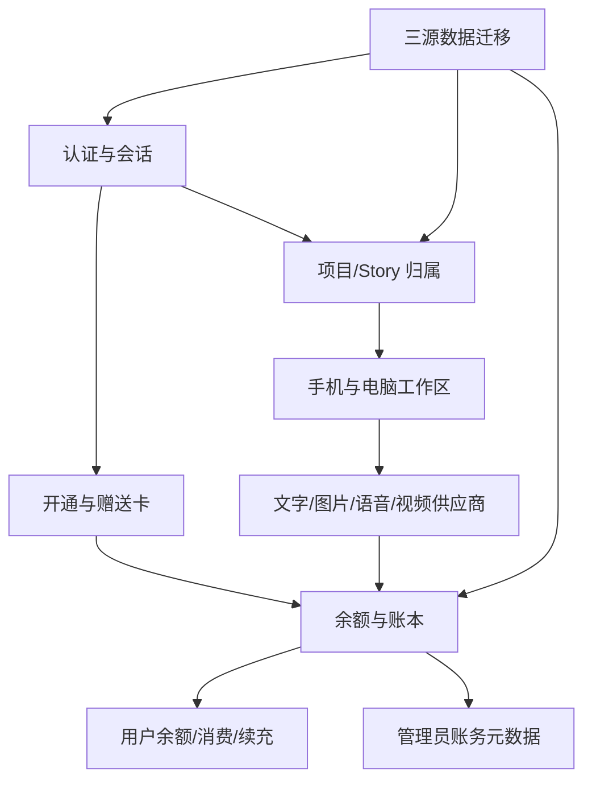

# feat: 第一阶段统一账号、算力赠送卡与透明余额

## Summary

先用受控脚本恢复当前测试邀请码，再在一条完整、可验证的 MySQL 迁移基线上建立统一邮箱身份、密码、赠送卡、人民币算力账本和续充申请。旧 MySQL、当前测试库与本地 Guest 数据先以只读来源导入新的合并库，经归属和内容哈希验收后切换测试站；所有付费 AI 入口随后统一经过预占、供应商用量记录和幂等结算，并在手机和电脑上显示同一余额。

---

## Problem Frame

当前邀请码既承担开通资格又承担长期登录，手工生成时只要归一化规则不同就会阻断登录；测试库又只有部分迁移，无法安全承载手机跨端数据。与此同时，付费 AI 调用缺少统一余额、并发预占和逐笔审计，用户不能清楚知道每次花费，余额耗尽后也没有站内续充流程（see origin: `docs/brainstorms/2026-08-27-production-beta-access-and-cost-controls-requirements.md`）。

---

## Requirements

- R1. 用户可通过一次性邮箱验证码登录；安全会话有效时正常设备自动进入账号。
- R2. 已验证邮箱可设置、使用、修改和找回密码，赠送卡不再作为密码。
- R3. 验证码、密码及未来微信身份解析到同一个 `userId`、内容归属和余额；身份切换清理上一账号缓存。
- R4. 已验证但未开通的账号只能领取赠送卡和查看账户说明；领取后进入工作台。
- R5. 首张卡一次性增加 ¥30，不叠加另一笔新用户自动赠送；后续卡可配置其他面额。
- R6. 赠送卡不预绑邮箱、首个已验证账号原子领取、默认 30 天未领过期，领取后的余额不失效。
- R7. 已领取旧邀请码最多补一次 ¥30，未领取旧邀请码转换成 ¥30 卡；重复迁移不重复赠送或丢内容。
- R8. 文字、图片、语音、视频及其他付费 AI 能力共享人民币余额，所有赠送、调整、消费、释放和退款均有不可改写的逐笔记录。
- R9. 每次供应商提交前按稳定参数和可信最高费用原子预占；余额不足或没有可信上界时不提交。
- R10. 调用完成后按可核验实际费用或用量结算并释放差额；失败、重试、回调和重启不得重复提交或扣费。
- R11. 用户可查看余额、累计消费和明细；文字完成后显示本次消费，高成本媒体提交前显示预计费用并确认。
- R12. 余额不足只阻止付费调用，登录、浏览、编辑和未提交输入继续可用；界面显示 `mountionzeng@gmail.com`。
- R13. 用户可提交并查看追加测试算力申请；同一账号最多一个待处理申请。
- R14. 管理员可发卡、审批、调整和审计账号费用，但不能读取用户故事、提示词或媒体；人工调整记录操作者、时间、金额和原因。
- R20. 第一阶段必须通过账户恢复、跨账号隔离、迁移/赠送幂等、并发余额、失败结算、备份恢复和真实手机跨端验收后才能开放。

**Origin actors:** A1 用户、A2 管理员／负责人、A3 AI 能力供应商、A5 账户与额度系统。A4 支付与订阅渠道只作为后续兼容边界。

**Origin flows:** F1 邮箱注册与首卡、F2 返回登录与恢复、F3 付费调用与结算、F4 余额不足与续充。F5 微信绑定与购买延后。

**Origin acceptance examples:** AE1–AE10 为第一阶段验收；AE11–AE13 作为后续阶段的数据模型兼容约束。

---

## Scope Boundaries

- 第一阶段不接入微信登录、微信支付、支付宝、银行卡或订阅；R15–R19 只通过可扩展身份和外部交易引用预留边界。
- 当前续充是负责人批准的免费测试额度，不向用户收款，不提供提现、转账或兑换现金。
- 不增加多人共享账号、Story 转移或实时共同编辑。
- 不允许管理员通过账号或账务页面读取创作内容。
- 不覆盖、删除或就地改写旧 MySQL、本地历史数据及归属未确认的 Story。
- 不触碰正式应用目录或切换正式数据库；本计划的远端操作目标仅限经再次核验的测试站与测试数据库，且每次远端写操作仍是独立批准边界。

### Deferred to Follow-Up Work

- 第二阶段 R15–R16：微信登录、显式绑定、冲突处理和审计；另建计划并核验微信资质。
- 第三阶段 R17–R19：真实购买、退款、订阅和消费者告知；另建计划并核验支付与合规条件。
- 套餐、促销、发票、税务和提现能力：不属于本阶段。

---

## Context & Research

### Relevant Code and Patterns

- `server/services/inviteAccess.ts` 是邀请码归一化与 SHA-256 的唯一权威；`scripts/create-invite-code.ts` 已正确复用，远端修复和发卡必须继续复用该模块。
- `server/db.ts` 的邀请码条件更新、Guest 内容认领事务和 Story 归属校验提供原子领取、跨表迁移和失败关闭模式。
- `server/_core/oauth.ts`、`server/_core/sdk.ts`、`server/_core/cookies.ts` 是邮箱身份、JWT 和安全 Cookie 的现有入口。
- `drizzle/meta/_journal.json`、`drizzle/migrations/` 与 snapshot 是迁移权威；`server/integration/migrationBaseline.mysql.test.ts` 和 `scripts/run-mysql-integration.ts` 提供一次性真实 MySQL 门禁。
- `server/services/previewMaskedImageEditing.ts`、`server/services/visualAssetCreation.ts`、`server/services/publishingAlbumBackgroundGeneration.ts` 已有绑定参数、过期时间和价格的签名报价模式。
- `server/_core/inferenceOrchestrator.ts`、`server/services/imageGen.ts`、`server/services/videoGen.ts` 以及语音/转写服务是供应商调用的主要集中点。
- `client/src/features/mobileWorkspace/mobileRecoveryIdentity.ts` 与 Query cache 清理逻辑提供跨身份缓存隔离模式。

### Institutional Learnings

- `.webdev/local-persist.json` 随 `cwd` 分裂；历史合并必须先冻结、备份、内容哈希去重、ID/外键重映射，再从暂存结果切换，不能挑一份覆盖（`docs/solutions/2026-06-13-多worktree环境数据分裂收敛.md`）。
- Story 和所有派生资产必须按服务端认证的 `userId + storyId` 归属；无法唯一证明的历史归属必须失败关闭并等待人工映射（`docs/solutions/2026-06-13-故事为唯一单位-镜头按storyId.md`）。
- 迁移采用 expand-compatible 顺序；生产或测试迁移 ledger 不能靠手工标记已应用，且旧数据源保留为只读回滚源（`docs/plans/2026-09-01-001-feat-mobile-cross-device-workspace-plan.md`）。
- 付费异步操作必须携带稳定 operation、请求哈希、供应商 task/receipt 和提交确定性；`submission_unknown` 不得自动重提（`docs/plans/2026-08-14-002-refactor-environment-architecture-hardening-plan.md`）。

### External References

- [OWASP Password Storage Cheat Sheet](https://cheatsheetseries.owasp.org/cheatsheets/Password_Storage_Cheat_Sheet.html)：密码使用慢、带盐、内存困难哈希；无 Argon2id 时可用 scrypt，快速 SHA-256 不用于密码。
- [OWASP Forgot Password Cheat Sheet](https://cheatsheetseries.owasp.org/cheatsheets/Forgot_Password_Cheat_Sheet.html)：找回响应防邮箱枚举，验证码安全存储、一次性、过期和限流，密码重置后处理旧会话。
- [NIST SP 800-63B](https://pages.nist.gov/800-63-4/sp800-63b.html)：密码长度、常见密码拦截、验证限流和会话生命周期依据。
- [MySQL 8.4 Locking Reads](https://dev.mysql.com/doc/refman/8.4/en/innodb-locking-reads.html)：余额检查和预占在显式事务内使用锁定读，避免并发 read-then-write 透支。

---

## Key Technical Decisions

| Decision | Rationale |
|---|---|
| 新建完整迁移的合并测试库，不在残缺的 `drinking_time_mobile_staging` 就地补 ledger | 当前只登记 7/16 条迁移且存在部分未登记表；新库可重演、可验收、可一键切回旧连接 |
| 身份凭据与业务用户分离为可扩展 identity/credential 边界 | 邮箱验证码和密码映射同一 `userId`，第二阶段可增加微信 subject 而不复制用户、内容或余额 |
| 密码采用 Node 原生 scrypt 的版本化参数、随机 salt 和定时安全比较 | 符合 OWASP 的无 Argon2id 回退建议，避免为 Node 24 增加原生二进制依赖；未来可按版本升级工作因子 |
| 邮箱验证码只保存带独立服务端 secret 和版本的摘要 | 6 位验证码即使数据库泄露也不能离线枚举；版本允许轮换 secret，配置缺失时生产失败关闭 |
| 验证码发送/验证和赠送卡领取使用共享持久化限流 | PM2 重启或多进程不能绕过限制；内存限流只可作为额外快速保护，不能成为唯一门禁 |
| 会话默认最长 30 天；修改密码撤销其他设备，找回密码撤销全部旧会话并要求正常登录 | 缩短当前一年会话风险，同时保持手机使用便利；敏感操作需要近期验证 |
| 金额内部使用整数最小计价单位，展示层统一格式化为人民币 | 避免浮点累计误差，并保留小于一分钱的模型用量精度 |
| 最终余额来自不可变账本，活动预占独立记录；可用余额为已入账余额减活动预占 | 用户消费事实不可被后台静默改写，并发任务可在事务中竞争同一余额 |
| 业务 operation 与供应商 attempt 分层 | 业务层控制一次预占/结算，底层记录 fallback、重试和真实用量，避免 router 漏算或 adapter 重复扣费 |
| 数据库事务不跨越供应商网络调用 | 预占事务先提交，再调用供应商，最后用新事务结算；避免长事务、锁等待和网络超时把余额行锁死 |
| `submission_unknown` 保留 hold 并进入对账，不自动释放或重提 | 未知状态下释放可能让同一余额再次消费，重提可能产生双份供应商费用；只有可核验结果才能推进状态 |
| 无可信最高费用的能力失败关闭 | R9 要求先守住预算；不能用“调用后再看花了多少”换取暂时可用性 |
| 赠送优先于未来购买额度消耗，但第一阶段对用户只显示总余额 | 保留 R19 的未来兼容边界，不把尚未实现的支付带入本阶段 UI |

---

## Open Questions

### Resolved During Planning

- 安全会话与密码策略：30 天最长会话；密码至少 15 个字符、支持长密码和 Unicode、不强制字符组合、拒绝常见弱密码；修改/找回后按上表撤销会话。
- 验证码策略：一次性、短时过期、发送冷却、按邮箱与来源地址限流、验证尝试次数上限；请求与找回返回统一文案，防止枚举。
- 历史数据归属：生成显式映射清单，按表计数、正文/JSON 哈希和外键证明；`mountionzeng@gmail.com` 与截图中的 `mountainzeng@gmail.com` 不自动合并，本地 Guest 48 的内容也不自动归属。
- 续充通知：站内申请和管理员看板是权威；Resend 邮件通知负责人是非阻塞提醒，发送失败不回滚申请。
- 供应商入口：先生成付费入口清单和覆盖门禁；未被清单覆盖或无可信上界的入口在测试环境失败关闭。
- 当前测试邀请码：优先在严格前置核验后修复同一原码；若记录已过期、已变化或不再适合原地修复，则保留旧记录审计并通过权威脚本签发一张新替代卡，原码只展示一次。

### Deferred to Implementation

- 每个供应商 operation type 的最终保守上界与实际用量换算：以当前模型配置、重试/质检次数和供应商返回字段实测后固化；不得在未知时开放。
- Guest 48 的最终邮箱归属：导入器只生成候选和哈希报告，真实归属写入必须获得明确映射批准。
- MySQL 版本对本地临时测试库的具体锁行为与隔离级别：通过双连接集成测试验证，不以 mock 结论替代。

---

## High-Level Technical Design

> *This illustrates the intended approach and is directional guidance for review, not implementation specification. The implementing agent should treat it as context, not code to reproduce.*

迁移数据流：旧 MySQL、现测试库和本地/sidecar 文件均保持只读，先输出 inventory、映射与哈希报告，再导入从完整 migration journal 建立的新合并库；只有 counts、ownership、内容哈希、跨账号隔离和备份恢复全部通过后，测试站才切换连接。

---

## Implementation Units

关键生命周期如下；供应商网络请求永远发生在短事务之间，而不是事务内部：

| Lifecycle | Valid transitions | Failure posture |
|---|---|---|
| Identity | unverified → verified → access-enabled | 邮箱冲突停在 verified 前的人工处理状态，不建立第二用户 |
| Gift card | issued → redeemed；issued → expired/revoked | redeemed 不可回退为可领取；credit 与 access-enable 同事务 |
| Billing operation | created → reserved → submitted/unknown → settled/released/exception | unknown 保留 hold 并对账；同 operation/hash 重放只返回原状态 |
| Provider attempt | prepared → submitted/task-known → succeeded/charged-failure/not-charged-failure | task-known 只恢复查询；没有确定提交结果时不自动重提 |
| Recharge request | pending → approved/rejected | approved 与 ledger credit 同事务；终态不可再次审批 |

### U1. 恢复当前测试邀请码并封住手工哈希路径

**Goal:** 在不等待完整账户重构的前提下恢复当前未领取邀请码，并让以后创建、检查和修复都复用同一归一化/哈希合同。

**Requirements:** R4, R6, R20；修复当前已确认故障。

**Dependencies:** 远端写入前重新核验目标是测试数据库，且邀请码仍未领取。

**Files:**
- Modify: `scripts/create-invite-code.ts`
- Create: `scripts/repair-invite-code.ts`
- Create: `scripts/repair-invite-code.test.ts`
- Modify: `server/services/inviteAccess.ts`
- Modify: `server/services/inviteAccess.test.ts`
- Modify: `server/_core/oauth.invite.test.ts`
- Modify: `docs/aliyun-deploy-runbook.md`

**Approach:**
- 把 raw code 的规范化、摘要、等值核验集中在 `inviteAccess`，脚本不得复制字符串处理或手算摘要。
- 修复脚本先只读展示数据库标识、记录状态、过期时间和“当前摘要是否为预期旧值”；raw code 通过受控秘密输入传入，不作为命令行参数，也不进入日志、报告或 shell history 输出。
- 只有未领取、未过期、目标测试库和旧摘要都匹配时才在事务中更新为权威摘要；重复执行收敛为 no-op。
- 若原地修复前置条件不成立，脚本不改旧记录，改由权威创建路径签发一张新替代卡并只展示一次原码；旧记录保留以便审计，不制造两个可领取的有效凭据。
- 发卡脚本增加创建后自检，确保原码立刻能通过与登录端相同的验证路径。

**Execution note:** 先写失败契约测试复现带横线邀请码的归一化差异，再实现脚本和远端修复。

**Patterns to follow:**
- `server/db.inviteAccess.test.ts` 的条件更新与同邮箱幂等。
- `scripts/setup-invite-access.ts` 的环境预检。

**Test scenarios:**
- Happy path：输入带横线原码，创建端与登录端得到同一摘要并验证成功。
- Edge case：空白、大小写和横线变体按既有合同处理，raw code 不出现在报告。
- Error path：记录已领取、已过期、数据库名不符或旧摘要不符时不更新。
- Fallback：旧记录无法安全修复时只有新替代卡有效，旧记录状态和管理员看板可解释替换原因。
- Integration：修复重复运行两次仅第一次产生变化，当前测试码可完成真实登录 smoke。

**Verification:**
- 当前测试邀请码可以在 `https://test.drinkingtime.top/login` 登录；管理员看板仍不返回 raw code 或 code hash。

### U2. 建立统一身份、赠送卡和账本的完整迁移基线

**Goal:** 以 additive schema 承载身份、密码、会话撤销、赠送卡、余额、预占、供应商尝试、续充申请和迁移凭据，并保证 fresh MySQL 可从零应用全部 journaled migrations。

**Requirements:** R1–R10, R13–R14, R20；为 F1–F4 提供持久化地基。

**Dependencies:** None。

**Files:**
- Modify: `drizzle/schema.ts`
- Create: `drizzle/migrations/0016_account_gift_credit.sql`
- Modify: `drizzle/meta/_journal.json`
- Create: `drizzle/meta/0016_snapshot.json`
- Modify: `server/db.ts`
- Modify: `server/integration/migrationBaseline.mysql.test.ts`
- Create: `server/integration/accountSchema.mysql.test.ts`
- Modify: `scripts/verify-drizzle-migration-baseline.ts`

**Approach:**
- identity 与 credential 独立；邮箱标准化值唯一，未来微信 provider/subject 可加在同一身份层。
- 验证挑战保存摘要/secret 版本、用途、尝试次数、发送/过期/使用时间；共享限流计数可跨进程生效；用户或 credential 保存 session 版本。
- 赠送卡保存面额、用途、过期、领取者和领取时间，原码仍只在创建时出现一次。
- 账本、活动预占、供应商 attempts、续充申请和数据迁移 receipt 分表；金额为整数最小单位，所有业务幂等键建立唯一约束。
- 迁移只新增表/可空字段/索引；旧邀请码与用户数据由 U3/U5 显式回填，不在 schema migration 内猜归属。

**Execution note:** 先扩展 migration baseline 和真实 MySQL schema 测试；不使用 `db:push`，不手工伪造已应用记录。

**Patterns to follow:**
- `drizzle/migrations/0015_mobile_story_conversation_turns.sql` 和 migration baseline harness。
- `drizzle/migrations/0010_invite_codes.sql` 的邀请表约束。

**Test scenarios:**
- Happy path：空白一次性 MySQL 从 migration 0 应用至新迁移，journal、snapshot、表和索引一致。
- Edge case：旧数据存在时 additive migration 不要求先回填，不破坏现有邀请/Story 读取。
- Error path：缺迁移、journal 次序漂移、非 utf8mb4 或关键唯一索引缺失时门禁失败。
- Integration：真实 MySQL 验证 identity 邮箱、业务幂等键和每用户单一待处理申请约束。

**Verification:**
- 新合并库可从零应用完整迁移链；测试数据库 schema 与仓库 journal 可机械对比。

### U3. 备份并合并旧 MySQL、测试库与本地历史

**Goal:** 把三类来源安全导入新的完整测试合并库，保留旧源只读和可回滚，并证明账号、项目、Story、聊天、正文和快照没有丢失或串号。

**Requirements:** R3, R7, R20；F2；AE1, AE5。

**Dependencies:** U2；真实导入与切换前的远端操作批准。

**Files:**
- Modify: `scripts/import-local-persist-to-mysql.ts`
- Create: `scripts/inventory-account-migration.ts`
- Create: `scripts/import-account-data.ts`
- Create: `scripts/verify-account-migration.ts`
- Create: `scripts/import-account-data.test.ts`
- Create: `server/integration/accountDataMigration.mysql.test.ts`
- Modify: `docs/environment-guide.md`
- Modify: `docs/aliyun-deploy-runbook.md`

**Approach:**
- 对旧 `drinking_time`、当前 staging、`.webdev/local-persist.json` 及相关 sidecar 先做只读导出，记录源标识、文件/dump 摘要、每表计数和迁移 ledger。
- dry-run 生成稳定 ID 映射、邮箱冲突、Guest 候选归属和逐 Story 内容摘要；无法唯一证明的映射失败关闭。
- 导入到从 U2 完整 migration chain 新建的第三个数据库；每个来源和批次有 receipt，重复导入零新增、零重复关联。
- 先验证 `mountionzeng@gmail.com` 的旧账号数据；`mountainzeng@gmail.com` 和 Guest 48 只作为候选，不自动合并。
- counts、外键、owner、正文/JSON hash、聊天 turn、edit snapshot 和随机深链隔离通过后，才允许测试站切换 `DATABASE_URL`；旧库保持只读回滚源。

**Execution note:** characterization-first；先固定各来源现状与 hash 报告，再写转换。任何真实归属写入都由可审阅映射清单驱动。

**Patterns to follow:**
- `scripts/merge-local-persist.ts` 的内容去重、ID 重编号与冲突报告。
- `server/db.claimLegacyGuestStories.test.ts` 的跨表 owner 迁移覆盖。

**Test scenarios:**
- Happy path：旧邮箱账号、已确认 Guest 内容和当前未领邀请码导入新库，owner/数量/hash 全部一致。
- Edge case：相同 ID 不同内容、同邮箱多个 user、拼写近似邮箱、同时间不同正文均报告冲突而不猜测。
- Error path：sidecar 缺失、外键悬空、目标库非空且无匹配 receipt、来源在导入中变化时整批停止。
- Integration：同一导入运行两次结果相同；从备份恢复后再次验证 counts/hash；另一账号猜 storyId 被拒绝。

**Verification:**
- 生成可审计 inventory、mapping、import receipt 和 before/after 报告；测试站切换前后数据一致，并能切回旧连接。

### U4. 完成邮箱验证码、密码与会话生命周期

**Goal:** 用户可用验证码或密码进入同一账号，完成设置、修改和找回密码，并具备限流、防枚举与会话撤销。

**Requirements:** R1–R3, R12, R20；F2；AE1, AE2。

**Dependencies:** U2；实现可并行开始，但 U3 提供历史邮箱冲突报告前不得启用自动 identity 解析。

**Files:**
- Create: `server/services/accountIdentity.ts`
- Create: `server/services/accountIdentity.test.ts`
- Create: `server/services/accountSecurity.ts`
- Create: `server/services/accountSecurity.test.ts`
- Modify: `server/_core/oauth.ts`
- Create: `server/_core/oauth.account.test.ts`
- Modify: `server/_core/sdk.ts`
- Modify: `server/_core/cookies.ts`
- Modify: `server/_core/productionReadiness.ts`
- Modify: `server/_core/productionReadiness.test.ts`
- Create: `server/integration/accountAuth.mysql.test.ts`

**Approach:**
- 统一 identity resolver：标准化邮箱只解析一个 user；冲突时停止并进入人工处理，不静默 merge。
- OTP 按登录、验证、找回用途隔离；安全随机生成、摘要存储、短时过期、原子消费、失败计数和邮箱/IP 组合持久化限流；同邮箱/用途签发新 challenge 时使旧 challenge 失效。
- 密码采用版本化 scrypt record；设置和修改要求近期邮箱/密码验证，找回成功后不自动登录。
- JWT 携带并校验 session 版本；普通退出撤销当前 cookie，修改密码撤销其他会话，找回撤销全部旧会话。
- 所有认证状态变更保持现有受信 Origin/CSRF 边界；密码错误、未知邮箱和未设置密码使用不会泄露账号状态的对外响应。
- 生产 readiness 要求 OTP 摘要 secret、强 session secret、HTTPS origin、secure cookie 和真实 MySQL。

**Test scenarios:**
- Covers AE1. 同一邮箱分别用 OTP 和密码登录，返回同一 userId、Story 和余额。
- Covers AE2. 找回后旧密码与旧 session 失效，新密码可正常登录。
- Edge case：Unicode/长密码、邮箱大小写、OTP 刚过期、重复使用、超过尝试次数均按合同处理。
- Error path：未知邮箱与已知邮箱的请求文案一致；Resend 失败不创建可用 challenge；限流不锁死账号。
- Security：连续签发验证码后旧码失效；跨进程/重启后限流仍生效；不受信 Origin 的设置/修改/找回请求被拒绝。
- Integration：两个设备登录后修改/找回密码的撤销策略符合决定；切换账号清除上一身份的 Query cache/recovery 数据。

**Verification:**
- 账号不再需要赠送卡登录；安全配置缺失时测试站 readiness 失败关闭。

### U5. 把邀请码演进为一次性算力赠送卡

**Goal:** 已验证账号原子领取首卡并在同一事务开通工作台和增加 ¥30；旧邀请转换和历史赠送幂等。

**Requirements:** R4–R7, R14, R20；F1；AE3–AE5。

**Dependencies:** U2, U3, U4, U6。

**Files:**
- Create: `server/services/giftCard.ts`
- Create: `server/services/giftCard.test.ts`
- Modify: `server/db.ts`
- Modify: `server/routers/index.ts`
- Create: `server/integration/giftCard.mysql.test.ts`
- Modify: `scripts/create-invite-code.ts`
- Create: `scripts/migrate-invites-to-gift-cards.ts`
- Create: `scripts/migrate-invites-to-gift-cards.test.ts`
- Modify: `server/inviteAdmin.router.test.ts`

**Approach:**
- 领取事务同时锁定卡、验证已验证身份和过期状态、写不可变 credit、标记账号开通和卡已领取。
- 首卡赠送用稳定业务键保证账号最多一次 ¥30；卡 credit 与“新用户赠送”不双发。
- 已领旧邀请按用户稳定迁移键补一次，未领旧邀请保持相同可输入原码语义并转换成 ¥30 卡；原始摘要不外泄。
- 管理员发卡可选面额/期限/用途，但无法通过接口重新读取原码。
- 新卡使用足够熵的随机原码；领取端采用共享持久化限流，错误响应不区分“码不存在”和可用于枚举卡状态的内部细节。

**Test scenarios:**
- Covers AE3. 两个账号并发领取同一卡，只有一个获得开通和 ¥30。
- Covers AE4. 未领取过期卡拒绝；过期前领取的余额之后不减少。
- Covers AE5. 旧邀请迁移运行两次，已领账号仅一笔 ¥30，未领卡仅一张，Story/hash 不变。
- Error path：未验证邮箱、已开通账号重复首卡、撤销卡和数据库事务失败都不产生部分 credit。
- Security：暴力尝试无效卡触发跨进程限流；有效/无效卡对外错误不暴露领取者或卡面元数据。
- Integration：发卡管理接口只暴露状态/面额/领取者元数据，普通用户不能调用，管理员不能读内容。

**Verification:**
- 赠送卡只负责开通和充值；旧邀请兼容窗口可观测，并具备后续退役条件。

### U6. 建立不可变余额、预占和幂等结算核心

**Goal:** 所有账号共享一个不会因并发、重试或回调变负/重复的人民币算力余额，并可核对每笔来源和去向。

**Requirements:** R8–R10, R14, R20；F3；AE6–AE8, AE10。

**Dependencies:** U2。

**Files:**
- Create: `server/services/computeLedger.ts`
- Create: `server/services/computeLedger.test.ts`
- Create: `server/services/computeBilling.ts`
- Create: `server/services/computeBilling.test.ts`
- Create: `server/services/computeReconciliation.ts`
- Create: `server/services/computeReconciliation.test.ts`
- Modify: `server/db.ts`
- Create: `server/integration/computeLedger.mysql.test.ts`
- Create: `server/integration/computeBilling.mysql.test.ts`
- Create: `shared/computeMoney.ts`
- Create: `shared/computeMoney.test.ts`

**Approach:**
- 只允许领域命令写 ledger，禁止通用“设置余额”；调整以反向/补充 entry 表达，既有消费事实不可 update/delete。
- reserve 在 MySQL 事务中锁定账号余额行，计算 posted minus active holds；operation id + canonical request hash 唯一，同 key 不同参数冲突。
- reserve 提交后立即结束数据库事务；供应商网络调用完成或恢复后，再开启独立 settle/release 事务，任何路径都不跨网络持有余额锁。
- settle/release/refund/adjustment 各自幂等并关联原 operation；供应商 attempt 独立记录 task id、receipt、用量、费用、提交确定性和 retryability。
- 实际费用低于 hold 时释放差额；确认未收费失败全释放；已收费失败按可核验费用结算；unknown 不自动重提。
- reconciliation 按状态扫描陈旧 hold：明确未提交才释放，有 task id 才恢复查询，unknown 保持冻结并进入管理员对账；不得只因超时自动释放。
- 若供应商报告超过已证明上界，记录账务异常并停止该 operation type，不把差额制造为用户负余额或静默吞掉。

**Execution note:** 核心状态机 test-first，并以两个独立 MySQL 连接验证锁和唯一约束；mock 只覆盖纯转换。

**Test scenarios:**
- Covers AE6. ¥10 下并发预占 ¥7/¥6 只有一个成功，¥7 最终结算 ¥5 后释放 ¥2。
- Covers AE7/AE8. 文字和图片分别按实际费用只结算一次，差额释放，明细可核对。
- Edge case：零费用、最小计价单位、重复请求同参数、同 key 不同参数、回调乱序、进程重启恢复。
- Error path：供应商未收费失败、已收费失败、submission unknown、费用超过上界、数据库死锁重试均不重复扣或负余额。
- Recovery：进程在预占后、提交前、提交后回写前、结算提交前四个位置崩溃，恢复器分别释放、查询或保留对账状态，不自动购买第二次。
- Integration：管理员 credit/debit adjustment 留下 actor/time/reason；账本总额、活动 hold 与显示余额一致。

**Verification:**
- 并发、重试、失败和恢复测试可机械证明余额不负、每个 operation 最多一次最终结算。

### U7. 盘点并收口全部付费 AI 入口

**Goal:** 每个会产生供应商成本的文字、图片、视频、语音、转写和视觉分析路径都被 operation/quote、余额预占与 attempt 用量记录覆盖。

**Requirements:** R8–R12, R20；F3, F4；AE7–AE9。

**Dependencies:** U6。

**Files:**
- Create: `docs/billing/paid-operation-inventory.md`
- Create: `server/services/billingContext.ts`
- Create: `server/services/billingContext.test.ts`
- Modify: `server/_core/inferenceOrchestrator.ts`
- Modify: `server/_core/llm.ts`
- Modify: `server/services/imageGen.ts`
- Modify: `server/services/videoGen.ts`
- Modify: `server/services/storyVoice302.ts`
- Modify: `server/_core/voiceTranscription.ts`
- Modify: `server/routers/storyAgent.ts`
- Modify: `server/routers/creationAgent.ts`
- Modify: `server/routers/publishingDraft.ts`
- Modify: `server/routers/promptLineage.ts`
- Modify: `server/routers/index.ts`
- Create: `server/integration/paidOperationCoverage.mysql.test.ts`
- Create: `server/services/paidOperationInventory.test.ts`

**Approach:**
- 先形成入口 → operation type → provider/model → 最大尝试/质检/fallback → 费用上界 → 实际用量字段 → UI 确认策略的权威清单。
- 业务入口创建 operation 和预占，显式 context 向 provider adapter 传播；adapter 每次真实尝试写 attempt，但不自行重复扣余额。
- 文字无需确认但必须先预占；图片/语音/视频复用签名报价并绑定账号、Story、参数、model、数量、最高费用和过期时间。
- 部分成功仅对已完成 attempt 结算，重试只补失败项；有 task id 时恢复轮询，submission unknown 不自动购买。
- 清单外调用、缺 context、缺可信上界或报价参数漂移时，供应商 adapter 在测试/生产模式失败关闭；免费/本地操作显式声明无需计费。

**Execution note:** characterization-first；逐个 writer/adapter 加覆盖断言后再切入账本，不在同一改动中同时重写业务行为。

**Test scenarios:**
- Covers AE7. 文字请求无弹窗，完成后返回唯一 settlement summary。
- Covers AE8. 媒体报价被修改 role/model/count/参数或过期时拒绝，供应商未收到任务。
- Covers AE9. 余额不足、清单缺失或无上界时不调用 provider，但原输入仍可恢复。
- Edge case：fallback 多 provider、质量重试、部分成功、异步 callback 重复、进程重启已有 task id。
- Integration：静态/运行时 coverage 测试枚举所有集中 provider 调用；每个 paid path 有且只有一个业务 operation 和若干可核对 attempt。

**Verification:**
- 权威清单无“未知上界但开放”的条目；真实小额 smoke 只在另行授权后执行并记录供应商、尝试数和实际费用。

### U8. 提供登录、余额、消费明细和续充体验

**Goal:** 手机与电脑用户能设置/找回密码、领取赠送卡、随时看余额和明细，并在余额不足时继续编辑和提交一次续充申请；管理员只处理账号/账务元数据。

**Requirements:** R1–R5, R11–R14；F1–F4；AE1–AE4, AE7–AE10。

**Dependencies:** U4–U7。

**Files:**
- Modify: `client/src/features/auth/views/AuthEntryPanel.tsx`
- Modify: `client/src/features/auth/views/AuthEntryPanel.test.tsx`
- Create: `client/src/features/account/AccountSecurityPanel.tsx`
- Create: `client/src/features/account/AccountSecurityPanel.test.tsx`
- Create: `client/src/features/account/ComputeBalancePanel.tsx`
- Create: `client/src/features/account/ComputeBalancePanel.test.tsx`
- Create: `client/src/features/account/GiftCardRedemption.tsx`
- Create: `client/src/features/account/GiftCardRedemption.test.tsx`
- Modify: `client/src/features/mobileWorkspace/MobileChatView.tsx`
- Modify: `client/src/features/mobileWorkspace/MobileChatView.test.tsx`
- Modify: `client/src/features/mobileWorkspace/MobileWorkspace.tsx`
- Modify: `client/src/features/storyAgent/views/StoryAgentChat.tsx`
- Modify: `client/src/pages/AdminInvitesPage.tsx`
- Modify: `client/src/pages/AdminInvitesPage.test.tsx`
- Modify: `client/src/app/router/AppRouter.tsx`
- Modify: `server/routers/index.ts`
- Create: `server/account.router.test.ts`
- Create: `server/rechargeAdmin.router.test.ts`

**Approach:**
- 登录页变为邮箱验证 → 验证码/密码 → 未开通时领卡的明确步骤；返回路径继续支持 `/m` 与 `/editing`。
- 账号安全页提供设置、修改、找回和退出其他设备；不在 localStorage 保存密码、验证码或卡号。
- 全局余额入口显示可用余额、累计消费和分页明细；每个文字回复旁显示本次实际消费与最新余额，高成本媒体确认显示预计最高费用和预计余额。
- 余额不足时保持草稿/输入，禁用或拦截付费提交但保留浏览编辑；显示负责人邮箱并提供一个站内申请。
- 续充状态为 pending/approved/rejected；管理员批准或调整在同一事务完成状态更新和 ledger entry，邮件通知失败不影响权威状态。
- 管理 API 使用 `adminProcedure`，只返回邮箱、账号状态、余额、账目元数据、申请和审计字段，绝不 join Story/素材/提示词表。

**Test scenarios:**
- Covers AE1–AE4. 新/旧用户完成验证、密码登录、找回和领卡，手机/电脑回到正确工作区。
- Covers AE7. 文字回复显示本次费用和余额，刷新后与账本一致且不重复显示扣款。
- Covers AE9. 余额不足时供应商未收到请求，正文仍可编辑，未提交输入保留，只产生一个 pending 申请。
- Covers AE10. 管理员批准 ¥20 后用户余额/申请同步，审计完整；管理员路由无法读取内容。
- Error path：OTP/邮件/网络失败、账本加载失败、申请邮件失败和账号切换时 UI 不伪造成功、不泄露上一账号数据。

**Verification:**
- iOS/Android 尺寸和桌面入口均能完成关键流程；无论 UI 是否被绕过，服务端余额与权限仍失败关闭。

### U9. 完成测试站切换、跨端验收与功能账本收敛

**Goal:** 在可回滚前提下把测试站切到完整合并库和新账户体系，取得真实 MySQL、HTTPS、手机/电脑、跨账号和备份恢复证据。

**Requirements:** R3, R7–R14, R20；F1–F4；AE1–AE10。

**Dependencies:** U1–U8；远端部署/数据库切换批准；确认当前无其他会话执行跨分支收敛或在飞付费任务。

**Files:**
- Modify: `server/_core/productionReadiness.ts`
- Modify: `server/_core/productionReadiness.test.ts`
- Modify: `scripts/deploy-mobile-readiness.test.ts`
- Create: `scripts/verify-account-release.ts`
- Create: `scripts/verify-account-release.test.ts`
- Create: `docs/qa/2026-09-02-account-gift-credit-acceptance.md`
- Modify: `docs/aliyun-deploy-runbook.md`
- Modify: `docs/environment-guide.md`
- Modify: `docs/features/feature-ledger.json`

**Approach:**
- 发布前保存数据库 dump、应用配置和 last rollback-safe point；只读比较目标 schema/journal，readyz 必须检查真实 auth、secrets、HTTPS、secure cookie、Origin、proxy trust 和 utf8mb4 MySQL。
- 先部署 compatible app，再切测试站数据库连接；切换期间冻结写入或使用明确维护窗口，避免源数据继续变化。
- smoke 覆盖邀请码、OTP、密码、赠送、余额、文字结算、媒体报价、余额不足和续充；失败时切回旧连接而不删除新库或源库。
- 切换后持续观察认证失败/限流、gift redemption、活动/陈旧 hold、billing exception、provider attempt 与续充积压；任何余额异常或未知提交激增都停止新付费调用。
- 用手机和电脑两个独立会话验证同一 Story、聊天、正文和余额；第二账号验证所有 storyId、账本和申请隔离。
- 备份恢复到临时库后重跑 counts/hash/owner/ledger 检查；功能账本只有在真实入口和测试证据成立后从 `planned` 更新。

**Test scenarios:**
- Fresh DB：一次性 MySQL 应用完整迁移并跑 auth、card、ledger、billing 并发集成套件。
- Migration：重复导入/赠送迁移零重复，备份恢复后的 counts/hash/owner/余额一致。
- Security：HTTPS secure cookie、Origin、proxy spoof、OTP/密码爆破、跨账号 Story/账本猜测均被拒绝。
- Cross-device：手机聊天/正文/消费后电脑刷新可继续，电脑修改后手机可见；账号切换无缓存串线。
- Failure/rollback：readyz、smoke 或 hash 任一失败时停止放量并按记录切回旧连接，旧数据源可读。

**Verification:**
- `pnpm feature:validate` 通过，`account-compute-gift-payments` 账本列出真实入口、权威代码、测试和仍未完成的微信/支付缺口；发布证据不把 mock 或本地 JSON 算作 MySQL/公网通过。

---

## System-Wide Impact

- **Interaction graph:** 认证 context 影响所有 `protectedProcedure`；账务 context 跨业务 router 与 provider adapter；身份切换影响 Query cache、本地 recovery 和手机/电脑入口。
- **Error propagation:** 邮件提醒失败不回滚已持久化 challenge/申请以外的权威状态；余额、报价、归属或提交确定性不明时供应商调用失败关闭并返回可恢复错误。
- **State lifecycle risks:** 重点防止半领取、半赠送、重复迁移、活动 hold 泄漏、回调乱序、unknown 自动重提、旧进程把内存数据覆盖回磁盘。
- **Transaction boundaries:** 只在短 MySQL 事务中锁定/更新余额；供应商网络调用在事务外执行，恢复器依据 attempt/task/receipt 推进，不依赖单进程内存。
- **API surface parity:** `/m` 与 `/editing`、文字与媒体、用户与管理员、旧 invite 与新 gift card 都必须使用同一身份和账本合同。
- **Integration coverage:** 真实 MySQL 双连接并发、备份恢复、PM2 重启、HTTPS cookie、两设备跨端和两账号隔离不能由 mock 替代。
- **Unchanged invariants:** 手机与电脑仍只在保存后跨端可见，不扩展实时协作；服务端仍从 session 重建 owner；管理员邀请看板仍不暴露 hash/raw code 或创作内容。

---

## Success Metrics

- 当前坏邀请码经受控修复后可登录，之后所有新卡通过创建后自检。
- 新用户完成邮箱验证、密码设置、¥30 首卡和工作台开通；重复领取或迁移不会产生第二笔 ¥30。
- `mountionzeng@gmail.com` 在手机和电脑进入同一 userId，并看到迁移前后相同的项目/Story/聊天/正文 hash。
- 所有已开放 paid operation 都有可信上界、唯一 operation、provider attempts 和最终 settlement；coverage 清单无遗漏。
- 并发、回调、失败、重启和重复执行下余额不负且账本可核对。
- 余额不足不会触达供应商，用户仍能编辑并提交一个续充申请。
- 管理员可完成发卡/审批/调整，但通过 API 和 UI 均无法取得用户创作内容。

---

## Risk Analysis & Mitigation

| Risk | Likelihood | Impact | Mitigation |
|---|---:|---:|---|
| 残缺 staging 迁移 ledger 导致 schema 不可预测 | High | High | 新建完整合并库，从 journal 重演；旧库只读保留，不 `db:push` |
| 三来源 ID 冲突或错误归属导致故事串号 | High | High | dry-run、稳定映射、逐 Story hash、歧义失败关闭、人工批准、重复导入 receipt |
| OTP 明文/无限流或找回泄露账号存在性 | High | High | secret 摘要、用途隔离、原子消费、限流、统一响应和审计 |
| 密码或会话被盗 | Medium | High | scrypt、弱密码拒绝、30 天会话、敏感操作近期验证、修改/找回撤销旧 session |
| 并发预占或重复回调造成负余额/重复扣费 | High | High | MySQL 锁定事务、唯一键、operation/hash、幂等 settle/release/refund、双连接测试 |
| fallback/质检/部分成功漏算或重算供应商费用 | High | High | 业务 operation + provider attempt 分层，权威入口清单和 adapter 失败关闭 |
| 预占后进程崩溃导致 hold 永久占用或错误释放 | Medium | High | 按提交确定性分类恢复；明确未提交才释放，task-known 恢复查询，unknown 保留并人工对账 |
| 在供应商网络调用期间持有余额锁导致阻塞/死锁 | Medium | High | reserve 与 settle 分成两个短事务，网络调用不在事务内，死锁只重试幂等事务 |
| 供应商真实费用超过报价 | Medium | High | 保守上界覆盖最大尝试，越界即熔断该 operation type 并进入人工对账，不制造用户负余额 |
| 大范围接入影响既有聊天/生成行为 | Medium | High | characterization-first，按入口分批接入，免费编辑和已有内容读取保持独立 |
| 远端切换失败或旧服务覆盖新数据 | Medium | High | 写入冻结/维护窗口、备份、readyz、last rollback-safe point、连接级快速回退 |
| 管理账务权限意外暴露创作内容 | Low | High | 独立元数据查询、`adminProcedure`、禁止 join 内容表、权限与响应 shape 测试 |
| 多进程/重启绕过认证或赠送卡限流 | Medium | High | 限流状态持久化并在共享 MySQL 生效，内存限流不作为唯一安全控制 |

---

## Phased Delivery

### Phase A — 恢复可登录与建立安全地基

- U1 恢复测试邀请码并封住哈希分叉。
- U2 建立完整 schema/migration 基线。
- U3 完成三来源 inventory、备份、映射、导入和测试站数据库切换准备。

### Phase B — 统一账号与算力

- U4 邮箱验证码、密码和会话生命周期与 U6 账本核心可在 U2/U3 边界清楚后并行实现。
- U6 不可变账本、预占、恢复和结算先通过并发测试。
- U5 在 U4 身份与 U6 credit 原语之上完成赠送卡、开通和旧邀请幂等迁移。

### Phase C — 全入口和用户体验

- U7 盘点并收口所有付费调用。
- U8 登录、余额、明细、续充和管理员体验。

### Phase D — 真实环境验收

- U9 完成测试站、真实 MySQL、手机/电脑、跨账号、备份恢复和回滚验收。

每个阶段都可单独形成回滚点；“一次性修好”表示同一计划连续完成全部第一阶段能力，不表示把身份、数据和计费压进一次不可回滚的发布。

---

## Documentation / Operational Notes

- 开始执行前再次运行 `pnpm env:status`，并登记 `docs/handoff/SESSION-BOARD.md`；修改 `server/**` 前确认没有在飞付费任务。
- 只有主仓可运行 3000 端口；worktree 只改代码，不启动服务、不写 `.webdev/` 数据。
- 远端 mutation 只使用阿里云 ECS 云助手并在每次操作前打印/核验测试目录、PM2 应用、端口和数据库名；正式 `/opt/Drinking-Time` 和正式数据库不在范围内。
- 数据库 dump、mapping 报告和含邮箱的迁移证据按敏感运维材料保存，不提交邀请码原码、OTP、password hash 或生产凭据。
- 上线观察项至少包含认证失败/限流、赠送领取、陈旧预占、账务异常、供应商 unknown、余额不足拒绝和续充积压，并定义停止新付费调用的阈值与负责人。
- 完成后更新 `docs/features/feature-ledger.json` 并运行 `pnpm feature:validate`；没有真实入口与验收证据不得标记 `working`。

---

## Sources & References

- **Origin document:** [docs/brainstorms/2026-08-27-production-beta-access-and-cost-controls-requirements.md](../brainstorms/2026-08-27-production-beta-access-and-cost-controls-requirements.md)
- Related plan: [docs/plans/2026-09-01-001-feat-mobile-cross-device-workspace-plan.md](2026-09-01-001-feat-mobile-cross-device-workspace-plan.md)
- Environment guide: [docs/environment-guide.md](../environment-guide.md)
- Feature ledger: [docs/features/feature-ledger.json](../features/feature-ledger.json)
- OWASP Password Storage: https://cheatsheetseries.owasp.org/cheatsheets/Password_Storage_Cheat_Sheet.html
- OWASP Forgot Password: https://cheatsheetseries.owasp.org/cheatsheets/Forgot_Password_Cheat_Sheet.html
- NIST SP 800-63B: https://pages.nist.gov/800-63-4/sp800-63b.html
- MySQL Locking Reads: https://dev.mysql.com/doc/refman/8.4/en/innodb-locking-reads.html
