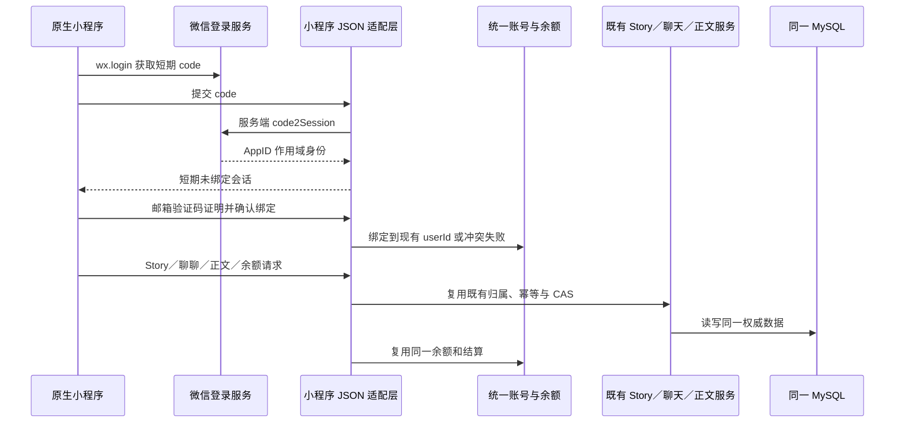
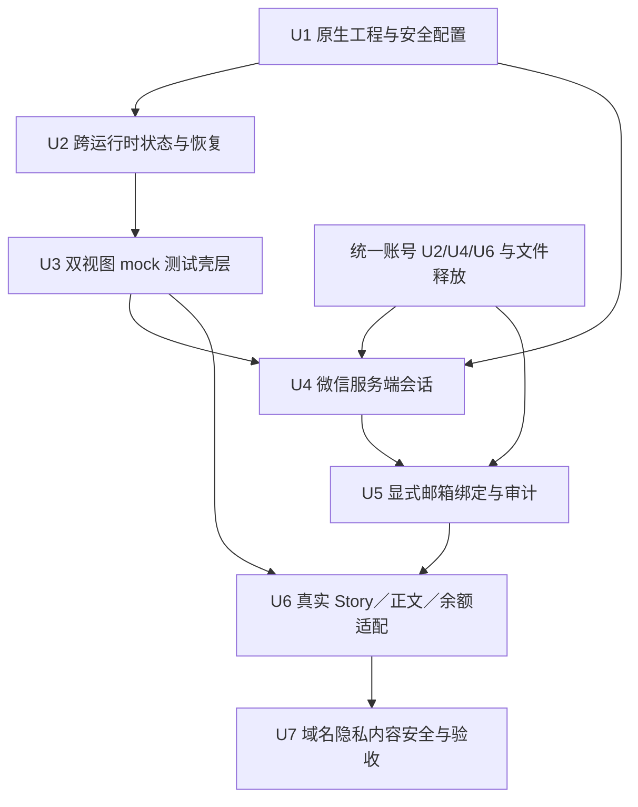
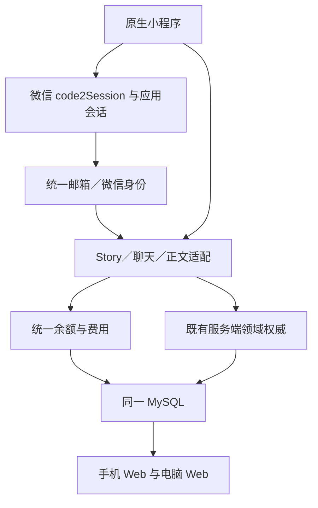

# feat: 原生微信小程序测试壳层与统一账号接入

## Summary

先在独立的 `miniprogram/` 目录建立可由微信开发者工具运行的原生 TypeScript 测试壳层，只呈现已有 Story、“聊聊”和当前正文；统一账号地基释放后，再通过服务端微信会话与邮箱验证码显式绑定现有用户，继续复用同一份聊天、正文和余额。

---

## Problem Frame

现有 `/m` 已经证明了手机端“聊聊 + 正文”的产品与持久化边界，但它是 React Web 页面，依赖浏览器 Cookie、tRPC、DOM 和 `localStorage`，不能直接作为原生微信小程序运行。当前企业小程序仍在验证中，用户虽已扫码，但尚未向仓库提供可核验的测试 AppID；同时统一账号 Agent 正在修改身份、迁移和数据库热区，因此小程序首批工作必须能独立落地而不制造平行账号、平行数据库或代码冲突。

---

## Requirements

- R15. 微信登录必须允许用户把微信身份显式绑定到已经验证的邮箱账号，并在绑定前说明将继续使用哪个账号、内容和余额（see origin）。
- R16. 微信登录、绑定冲突、解绑或更换绑定不得静默创建平行用户、Story 或余额；邮箱始终保留为恢复同一账号的通道，身份变更必须可审计（see origin）。
- R21. 第一批交付使用微信原生小程序和官方 TypeScript 工程形态，不使用 `web-view`、Taro 或 uni-app；工程在没有真实账号后端时也能以明显标识的 mock 模式运行。
- R22. 小程序只提供已有 Story 选择、“聊聊”和发布工作台当前版本／当前平台正文两个主要视图；不带入图片、素材、分镜、时间线、预览或视频能力。
- R23. 小程序、手机 Web 与电脑 Web 必须读取同一个 `userId`、Story、对话、正文和余额权威；不得增加小程序专用业务数据库或把客户端提交的 `userId` 当作身份。
- R24. `wx.login` 的短期 code 只能提交给自家 HTTPS 后端；AppSecret、`session_key`、服务端会话密钥和刷新凭据不得进入小程序包、仓库、聊天或普通日志。
- R25. 测试 AppID、正式 AppID、openid、Secret、会话和数据环境必须隔离。测试 openid 不迁移为正式凭据；正式 AppID 下由用户重新验证并绑定同一个邮箱账号。
- R26. 小程序“聊聊”必须保留现有 Story 归属、整轮幂等、未知结果查询和余额结算合同；正文必须保留当前版本／平台作用域、body revision CAS 和本地／服务端双副本冲突恢复。
- R27. 会话过期、微信账号变化、退出或绑定到不同账号时，上一账号的 Story、余额和恢复草稿必须在新身份渲染前清除；恢复键使用服务端不透明账号作用域，不含邮箱或 openid。
- R28. 测试号只证明开发壳层和接口契约，不等于可提审、可发布或可支付。真机联调必须通过 HTTPS 合法域名、证书、隐私告知、内容安全和跨账号隔离门禁。
- R29. 小程序显示与 Web 相同的可用余额和文字调用结果费用；余额不足只阻止新的付费调用，不阻止浏览和正文编辑，并继续展示负责人联系路径。
- R30. 前后台切换、微信进程回收、弱网、重复点击、Story 切换和两端并发编辑都不得重复模型调用、重复扣费、静默丢失文字或跨 Story 渲染迟到结果。

**Origin actors:** A1 用户、A5 账户与额度系统；新增客户端角色为微信原生小程序。微信平台只提供登录 code 与运行容器，不成为业务数据权威。

**Origin flows:** F2 返回登录与恢复、F3 付费调用与结算、F4 余额不足与续充、F5 微信绑定中的身份部分；手机工作区的 Story／聊天／正文行为继续遵循 `docs/brainstorms/2026-05-25-mobile-chat-image-experience-requirements.md` 的 F1–F4。

**Origin acceptance examples:** AE11 为微信绑定权威验收；手机 Story、聊天、正文、冲突和键盘行为继续复用手机工作区 AE1–AE5；余额行为复用 AE7、AE9。

---

## Scope Boundaries

- 不把现有 `/m` 塞入 `web-view`；企业 AppID、业务域名和备案未完成时也不把 `web-view` 当作隐藏后备路径。
- 不实现图片、语音、视频、素材、分镜、时间线、预览、Story 创建、标题／标签／版本／平台选择或多人协作。
- 不接入微信支付、支付宝、银行卡、订阅或测试号支付；真实支付仍属于账户计划第三阶段。
- 不把测试 openid 写入正式身份空间，不复制或迁移测试会话，不让测试号数据成为正式账号归属证据。
- 不在统一账号 Agent 释放前修改其当前占用的 `drizzle/schema.ts`、迁移、`server/db.ts`、邀请码、账号凭据或付费 router 文件。
- 不因开发者工具开启“不校验合法域名”而宣称真机可用；不在本计划中绕过平台域名、备案、隐私或审核要求。
- 不执行远端部署、服务器 Secret 配置、域名设置、数据库迁移或服务重启，除非用户在对应动作前另行批准。

### Deferred to Follow-Up Work

- 微信支付、购买算力、订阅、退款和商户回调：账户与付费体系第三阶段单独规划。
- 完整自助解绑／换绑界面：测试版至少提供退出和联系负责人路径；正式开放前再完成带近期验证和审计的自助流程。
- 正式小程序提审、发布和运营监控：企业主体认证、备案、服务域名、隐私指引和平台类目全部通过后另设发布门禁。
- `web-view`：只有未来存在明确、经审核的网页场景时再单独评估，不作为当前原生工作区的替代方案。

---

## Context & Research

### Relevant Code and Patterns

- `client/src/features/mobileWorkspace/` 已有 Story-scoped 聊天状态、整轮幂等、正文 CAS、冲突恢复和身份隔离行为；小程序复用这些合同，不复制 React hooks 或浏览器 API。
- `server/routers/promptLineage.ts` 与 `server/services/storyConversation.ts` 是 Story 对话和移动整轮持久化权威。
- `server/routers/publishingDraft.ts` 与 `server/services/publishingPersistence.ts` 是当前版本／平台正文和 body-only CAS 权威。
- `server/_core/context.ts`、`server/_core/sdk.ts` 当前只从浏览器 Cookie 建立用户上下文；原生小程序需要独立、短期、可撤销的服务端会话载体，不能假设 `wx.request` 自动复用 Web Cookie。
- `drizzle/schema.ts` 当前已预留 `account_identities(provider, subject)`，但微信 subject 必须包含环境和 AppID 作用域，不能只保存裸 openid。
- `docs/handoff/SESSION-BOARD.md` 把统一账号线设为 U1–U9 唯一实现者；本计划 U1–U3 只新增独立目录，U4 以后必须等其释放账号热区并重新登记。

### Institutional Learnings

- `docs/solutions/2026-06-13-故事为唯一单位-镜头按storyId.md`：所有读写继续使用服务端认证的 `userId + storyId`；客户端 openid、Story ID 或最近 Story 都不能替代归属校验。
- `docs/solutions/2026-06-13-多worktree环境数据分裂收敛.md`：小程序不得建立另一份业务持久化；本地 mock 仅是界面开发数据，真实跨端只能连同一个 MySQL 权威。
- `docs/plans/2026-09-01-001-feat-mobile-cross-device-workspace-plan.md`：聊天未知结果不得盲目重跑模型，正文过期保存失败关闭并保留本地和服务端两份文本。

### External References

- [微信小程序测试号](https://developers.weixin.qq.com/sandbox?tab=miniprogram)：测试号用于开发和接口调试，不代表正式提审或支付能力。
- [小程序登录流程](https://developers.weixin.qq.com/miniprogram/dev/framework/open-ability/login.html) 与 [code2Session](https://developers.weixin.qq.com/miniprogram/dev/server/API/user-login/code2Session.html)：客户端 code 交给自家后端，Secret 与 `session_key` 只留在服务端。
- [项目配置](https://developers.weixin.qq.com/miniprogram/dev/devtools/projectconfig.html)、[TypeScript 编译](https://developers.weixin.qq.com/miniprogram/dev/devtools/compilets.html) 与 [npm 支持](https://developers.weixin.qq.com/miniprogram/dev/devtools/npm.html)：采用官方原生工程与运行时约束。
- [网络能力](https://developers.weixin.qq.com/miniprogram/dev/framework/ability/network.html)：真机请求需要后台配置的 HTTPS 合法域名和有效证书；开发工具跳过校验只适用于本地调试。
- [隐私保护](https://developers.weixin.qq.com/miniprogram/dev/framework/user-privacy/) 与 [文本内容安全](https://developers.weixin.qq.com/miniprogram/dev/OpenApiDoc/sec-center/sec-check/msgSecCheck.html)：身份与创作内容处理必须先告知、最小化并在服务端执行内容安全策略。

---

## Key Technical Decisions

| Decision | Rationale |
| --- | --- |
| 采用微信原生 TypeScript 小程序，不采用 `web-view` 或跨端框架 | 用户已明确选择原生；测试号阶段没有可靠业务域名条件，原生壳层也能最小化运行时和依赖风险 |
| U1–U3 只新增 `miniprogram/`，先用显眼的 mock transport | 让界面、状态和恢复逻辑立即可开发，同时不碰统一账号 Agent 的热区，也不伪装成真实登录完成 |
| 小程序通过窄 JSON 适配层调用既有领域服务，不直接访问数据库或复制业务规则 | `wx.request` 不具备浏览器 tRPC/Cookie 运行时；窄适配层可以继续复用 Story、对话、正文和账本权威 |
| `wx.login` 只建立短期“未绑定微信会话”，邮箱验证码证明完成后才解析到业务用户 | 微信扫码不能替代已有账号归属；显式绑定符合 R15–R16，冲突时可失败关闭 |
| 微信身份 subject 同时绑定环境、AppID 和 openid | openid 只在某 AppID 内唯一；测试和正式 AppID 不同，裸 openid 会制造错误合并风险 |
| 小程序使用服务端签发、短期、可撤销的应用会话，不保存 `session_key` 或把它当业务凭据 | 支持 sessionVersion 撤销和账号切换隔离，也避免把微信上游密钥暴露给客户端 |
| 第一版使用服务端持久化摘要的高熵不透明 access token，不发行 refresh token | token 只在小程序进程内存中保存，绝对有效期 2 小时、空闲有效期 30 分钟；进程重启或过期后重新 `wx.login`，避免长期凭据落入 `wx` storage |
| 小程序 route family 使用独立 Bearer principal，不接受 Cookie 降级，也不把 Origin／Referer／AppID header 当身份 | 原生请求与浏览器 CSRF 模型不同；独立边界可以保留 Web Cookie + Origin 防护而不全局放宽 `/api/trpc` |
| 输入内容安全拒绝发生在费用预占和模型提交之前；输出审核发生在供应商调用后、持久化／呈现前 | 输入拒绝不调用、不扣费；输出拒绝仍按已发生的可核验供应商成本结算，但不把原文写入聊天权威、客户端恢复或普通日志 |
| 测试号、企业正式号和 Web 账号共享业务用户但不共享平台凭据 | 同一 `userId` 保留内容与余额连续性；不同 AppID 仍各自重新验证和显式绑定 |

环境组合是启动门禁，而不是部署人员的口头约定：

| 运行层 | AppID / Secret | 业务数据库 | 身份处理 |
| --- | --- | --- | --- |
| 开发者工具 mock | 公开占位或测试 AppID；不使用 Secret | 无远端业务写入 | 只使用固定演示身份 |
| 测试号联调 | 测试 AppID + 测试 Secret | 完整迁移的 staging 数据库 | subject 带 test 环境与测试 AppID；只绑定 staging 内已验证邮箱用户 |
| 企业正式号 | 正式 AppID + 正式 Secret | 正式数据库 | 在正式库中以已验证邮箱重新解析当地 `userId`；禁止沿用测试数字 ID、openid、session 或 identity 行 |

---

## Open Questions

### Resolved During Planning

- **原生还是 `web-view`？** 用户选择原生小程序；`web-view` 不进入当前方案。
- **首次绑定如何证明已有账号？** 默认使用统一账号计划的邮箱验证码，密码可作为后续同等证明方式；赠送卡和邀请码不承担身份绑定。
- **测试号是否可以直接变成正式身份？** 不可以；测试 AppID 的 openid 和会话只存在于测试环境，正式 AppID 重新绑定同一邮箱用户。
- **小程序是否复制 `/m` 的完整代码？** 不复制 React 页面；复用产品范围和服务端合同，在原生运行时实现最小界面和状态机。
- **内容安全命中是否产生费用？** 输入命中在供应商提交和费用预占前拒绝，因此不调用模型、不扣费；输出命中发生在供应商已调用之后，按可核验实际成本结算但不持久化／展示被拒内容，并保留可解释提示。
- **小程序会话是否需要 refresh token？** 第一版不需要。短期内存 access token 过期或进程重启后重新 `wx.login`；这不会要求用户重新绑定已经存在的微信 identity，但会重新取得服务端会话。
- **当前扫码成功是否等于已经可联调？** 不等于。只有用户确认官方测试号页面显示 AppID，并把 Secret 安全配置到服务端后，才进入真实 `wx.login` 联调。

### Deferred to Implementation

- 测试 AppID 的实际值尚未提供；U1 使用公开占位配置，值只能在用户确认后写入项目配置。AppSecret 永远不写入仓库。
- 微信开发者工具的具体稳定版本和基础库最低版本在首次导入时记录，以真实编译结果为准，但不得放宽安全或产品边界。
- 统一账号 U4/U6 最终提供的验证码、sessionVersion 与审计服务名称可能不同；U4–U5 基于届时已落地的权威服务适配，不复制一套平行实现。
- 微信内容安全在测试号下的真实可用范围、超时和异步结果通过 U7 真机／服务端验收确认；不可用时正式发布失败关闭。

---

## Output Structure

    miniprogram/
    ├── project.config.json
    ├── .gitignore
    ├── README.md
    ├── tsconfig.json
    ├── vitest.config.ts
    ├── src/
    │   ├── app.ts
    │   ├── app.json
    │   ├── app.wxss
    │   ├── core/
    │   │   ├── conversationState.ts
    │   │   ├── documentState.ts
    │   │   ├── recoveryState.ts
    │   │   └── workspaceState.ts
    │   ├── services/
    │   │   ├── transport.ts
    │   │   ├── mockTransport.ts
    │   │   ├── liveTransport.ts
    │   │   └── session.ts
    │   └── pages/
    │       ├── start/
    │       └── workspace/
    └── tests/

小程序后端接入文件仍位于现有 `server/` 与 `shared/` 权威目录，不在 `miniprogram/` 内建立服务端或数据库副本。

---

## High-Level Technical Design

> *This illustrates the intended approach and is directional guidance for review, not implementation specification. The implementing agent should treat it as context, not code to reproduce.*

---

## Implementation Units

### U1. 建立可导入的原生工程与 Secret 安全边界

**Goal:** 建立微信开发者工具可以识别的原生 TypeScript 小程序工程，并从第一天阻止 Secret、`session_key` 和私有配置进入提交。

**Requirements:** R21, R24, R25, R28

**Dependencies:** 用户已选择原生方案；真实 AppID 不是建立占位工程的前置。

**Files:**
- Create: `miniprogram/project.config.json`
- Create: `miniprogram/.gitignore`
- Create: `miniprogram/README.md`
- Create: `miniprogram/tsconfig.json`
- Create: `miniprogram/vitest.config.ts`
- Create: `miniprogram/src/app.ts`
- Create: `miniprogram/src/app.json`
- Create: `miniprogram/src/app.wxss`
- Create: `miniprogram/src/sitemap.json`
- Create: `miniprogram/src/typings/wechat.d.ts`
- Create: `miniprogram/tests/projectSafety.test.ts`
- Modify after coordinating with the current single owner: `docs/features/feature-ledger.json`
- Modify while registered as owner of `miniprogram/`: `docs/handoff/SESSION-BOARD.md`

**Approach:**
- 使用官方原生目录和 TypeScript 编译能力；tracked 配置只包含公开 AppID 占位值、`miniprogramRoot`、基础编译设置和可复现项目名。
- 将开发者工具私有配置、构建产物、临时 npm 目录和任何 Secret 文件排除；README 只记录变量名与用户本人配置步骤，不记录值。
- 把 mock 模式作为显眼的开发状态，而不是隐藏的生产回退；没有真实会话时所有网络写入失败关闭。
- 不修改根 `package.json`、根 `tsconfig.json`、根 Vitest 配置或当前统一账号 Agent 已经占用的文件；`miniprogram/vitest.config.ts` 与 `miniprogram/tsconfig.json` 独立覆盖小程序源码和测试，再调用仓库现有 Vitest/TypeScript 工具。
- 原生小程序是持久用户能力：U1 开始前先与 `docs/features/feature-ledger.json` 当前 owner 协调，由唯一 owner 建立或扩展 `planned` 卡；若 owner 尚未释放，U1 可继续纯目录脚手架，但 U3 不能被标记为可用，且任何 ledger 编辑必须等待所有权明确。

**Execution note:** 先写 Secret 泄漏和项目配置测试，再生成工程文件。

**Patterns to follow:**
- 根仓库 TypeScript 严格模式与 Vitest 命名约定。
- `docs/features/feature-ledger.json` 的“页面存在不等于 working”状态定义。

**Test scenarios:**
- Happy path: 项目配置声明正确的原生源码根、TypeScript 编译和两个初始页面，不包含 `web-view`。
- Security: 扫描 tracked 小程序文件时，不出现 AppSecret、`session_key`、私钥、真实 refresh token 或用 Secret 拼接的微信接口 URL。
- Edge case: 只有公开占位 AppID 时工程仍进入明确的 mock 模式，不尝试真实 `wx.login` 交换。
- Error path: 私有配置或疑似 Secret 文件被加入候选提交时安全测试失败。

**Verification:**
- 微信开发者工具可以导入工程；提供真实测试 AppID 后不需要改业务源码即可编译预览。
- `git diff` 中不存在任何 Secret 或用户私有项目配置。

### U2. 建立小程序运行时的 Story、聊天、正文与恢复状态

**Goal:** 在不依赖 React、DOM 或浏览器存储的前提下，复现现有手机工作区最关键的 Story 作用域、整轮恢复和正文冲突状态。

**Requirements:** R22, R23, R26, R27, R30

**Dependencies:** U1

**Files:**
- Create: `miniprogram/src/core/workspaceState.ts`
- Create: `miniprogram/src/core/conversationState.ts`
- Create: `miniprogram/src/core/documentState.ts`
- Create: `miniprogram/src/core/recoveryState.ts`
- Create: `miniprogram/src/core/types.ts`
- Create: `miniprogram/src/services/storage.ts`
- Create: `miniprogram/tests/workspaceState.test.ts`
- Create: `miniprogram/tests/conversationState.test.ts`
- Create: `miniprogram/tests/documentState.test.ts`
- Create: `miniprogram/tests/recoveryState.test.ts`

**Approach:**
- 用纯 TypeScript 状态转移表示 Story 选择、聊天 pending／unknown／synced、正文 clean／dirty／saving／conflict 和前后台恢复；微信 API 只通过窄适配器注入。
- 聊天在发送前生成稳定 turn/message 身份，未知结果先查状态；正文保存携带服务端返回的版本、平台和 body revision。
- 恢复数据按服务端不透明账号 scope + Story + 文档目标隔离，限制 TTL、条数和字节；退出或账号变化时先清理再渲染新数据。
- 不从客户端计算或缓存业务用户归属，不将 openid、邮箱或微信昵称作为恢复主键。

**Execution note:** 状态机测试优先；不得用 UI 点击测试代替幂等、冲突和跨身份行为测试。

**Patterns to follow:**
- `client/src/features/mobileWorkspace/mobileConversationStore.ts`
- `client/src/features/mobileWorkspace/mobileDocumentStore.ts`
- `client/src/features/mobileWorkspace/mobileRecoveryIdentity.ts`

**Test scenarios:**
- Happy path: 选择 Story、同步一轮聊天、编辑并保存正文后，两类状态都回到权威 synced/saved。
- Error path: 聊天响应丢失时保持原 turn 身份并进入状态查询，不生成第二次模型请求。
- Error path: 正文 base revision 过期时保留本地正文和最新服务端正文，不自动覆盖或合并。
- Edge case: Story A 请求在切换到 B 后返回，只更新 A 的隔离恢复记录，不渲染到 B。
- Lifecycle: `onHide` 不承诺网络保存；`onShow` 刷新 session、余额和权威 revision，但不覆盖 dirty 正文。
- Identity: 退出或切换微信账号后，新账号枚举存储也读不到旧账号文本、Story 或余额。
- Resource limits: 过期、超量或畸形恢复记录被清除，不导致启动崩溃。

**Verification:**
- 纯状态测试覆盖网络、迟到结果、重复点击、进程恢复、Story 切换和账号切换。
- 状态层不引用 React、DOM、`localStorage` 或 Node-only API。

### U3. 实现“聊聊 + 正文”的原生 mock 测试壳层

**Goal:** 让用户在微信开发者工具中看到并操作原生小程序的完整最小界面，同时明确它尚未连接真实账号和供应商。

**Requirements:** R21, R22, R26, R29, R30

**Dependencies:** U2

**Files:**
- Create: `miniprogram/src/services/transport.ts`
- Create: `miniprogram/src/services/mockTransport.ts`
- Create: `miniprogram/src/pages/start/index.ts`
- Create: `miniprogram/src/pages/start/index.json`
- Create: `miniprogram/src/pages/start/index.wxml`
- Create: `miniprogram/src/pages/start/index.wxss`
- Create: `miniprogram/src/pages/privacy/index.ts`
- Create: `miniprogram/src/pages/privacy/index.json`
- Create: `miniprogram/src/pages/privacy/index.wxml`
- Create: `miniprogram/src/pages/privacy/index.wxss`
- Create: `miniprogram/src/core/privacyConsentState.ts`
- Create: `miniprogram/src/pages/workspace/index.ts`
- Create: `miniprogram/src/pages/workspace/index.json`
- Create: `miniprogram/src/pages/workspace/index.wxml`
- Create: `miniprogram/src/pages/workspace/index.wxss`
- Create: `miniprogram/tests/mockTransport.test.ts`
- Create: `miniprogram/tests/privacyConsentState.test.ts`
- Create: `miniprogram/tests/workspacePresentation.test.ts`

**Approach:**
- 启动页清楚显示“测试模式／尚未绑定真实账号”，提供进入 mock 工作区和查看下一步配置的入口，不仿造登录成功。
- 在任何 `wx.login`、邮箱验证或 Story 拉取之前展示最小隐私告知；记录告知版本、同意时间和撤回状态。mock 工作区无需真实身份也能预览，但不能把 mock 点击冒充真实授权。
- 工作区只呈现 Story 选择、“聊聊”“正文”和一行余额状态；Story 为空时提示先到电脑创建。
- mock transport 使用固定、无隐私的演示数据和确定性响应，不调用模型、不计费、不写 `.webdev` 或任何远端数据库。
- 输入区适配 safe-area、常见窄屏、中文 IME 和软键盘；dirty Story 切换提供继续、复制或放弃路径，破坏性操作不是默认焦点。

**Patterns to follow:**
- `client/src/features/mobileWorkspace/MobileWorkspace.tsx` 的两视图信息架构。
- `docs/qa/2026-09-01-mobile-cross-device-acceptance.md` 的手机键盘、冲突和恢复验收语言。

**Test scenarios:**
- Happy path: mock 账号打开最近 Story，可切换 Story、完成一轮本地演示聊天并保存演示正文。
- Scope: 页面中不存在图片、素材、分镜、时间线、预览、视频或 Story 创建入口。
- Empty/error: 无 Story、transport 失败和恢复记录损坏都有可理解的空态／重试，不展示上一 Story 数据。
- Input: 中文 IME 组合期间 Enter 不发送；快速重复点击只生成一个 pending turn。
- Layout: 320／360／390px 等效宽度和键盘缩小视口下，发送、保存、复制和冲突操作保持可达。
- Truthfulness: mock 模式始终有可见标识，不能被误认为已连接真实微信登录、余额或数据库。
- Privacy: 拒绝或撤回隐私告知后，不触发 `wx.login`、验证码或 Story 网络请求；告知版本提升时要求重新确认。

**Verification:**
- 使用公开占位 AppID 或用户提供的测试 AppID，可在开发者工具中运行并操作双视图壳层。
- 没有真实身份、供应商费用或远端数据副作用。

### U4. 增加安全的微信 code2Session 与小程序应用会话

**Goal:** 把 `wx.login` code 在服务端交换为 AppID 作用域的微信身份，并向客户端签发短期、可撤销、未绑定或已绑定状态明确的应用会话。

**Requirements:** R15, R16, R24, R25, R27, R30

**Dependencies:** U1, U3 的隐私同意门；统一账号已提供业务用户／sessionVersion 权威、邮箱验证码消费、identity 唯一约束和审计能力；账号 Agent 在 `SESSION-BOARD` 释放相关文件；用户确认测试 AppID 并自行完成服务端 Secret 配置。

**Files:**
- Create: `shared/wechatMiniProgram.ts`
- Create: `server/services/wechatMiniProgramGateway.ts`
- Create: `server/services/wechatMiniProgramSession.ts`
- Create: `server/_core/authenticatedPrincipal.ts`
- Create: `server/_core/authenticatedPrincipal.test.ts`
- Create: `server/routes/wechatMiniProgramAuth.ts`
- Modify: `server/_core/env.ts`
- Modify: `server/_core/context.ts`
- Modify: `server/_core/index.ts`
- Modify: `server/_core/requestOrigin.ts`
- Modify: `drizzle/schema.ts`
- Generate: `drizzle/migrations/*.sql`
- Generate: `drizzle/meta/_journal.json`
- Generate: `drizzle/meta/*.json`
- Create: `server/services/wechatMiniProgramGateway.test.ts`
- Create: `server/services/wechatMiniProgramSession.test.ts`
- Create: `server/routes.wechatMiniProgramAuth.test.ts`
- Create: `miniprogram/src/services/session.ts`
- Create: `miniprogram/tests/session.test.ts`

**Approach:**
- 客户端只提交一次性 code；服务端按明确环境选择匹配的 AppID/Secret 调用微信，验证结果后生成 AppID 作用域身份。
- 只有当前隐私版本已同意时才允许交换 code。返回自有短期会话，区分未绑定微信身份和已绑定业务用户；不向客户端返回 openid、`session_key`、Secret 或可用于调用微信服务端 API 的凭据。
- access token 使用高熵随机值，数据库只保存摘要；第一版不发行 refresh token。绝对有效期 2 小时、空闲有效期 30 分钟，客户端仅存进程内存；重新启动、过期或撤回后重新 `wx.login`。
- 抽出 transport-neutral principal resolver：Web Cookie 和小程序 Bearer 分别验证，最终都产生同一种业务用户、sessionVersion 和 auth session 作用域。小程序 route 禁止 Guest／`DISABLE_AUTH` 降级，也不把 Bearer 能力无差别开放给全部 tRPC 或媒体接口。
- 小程序接口使用独立 route family：只接受 Bearer，不接受 Cookie-only；不以 Origin、Referer 或客户端 AppID header 证明身份。Web `/api/trpc` 继续执行现有 Cookie + Origin／CSRF 防护，不因小程序放宽。
- 登录、code exchange 使用独立的小 body limit，以及按来源地址、会话／subject 的持久限流和退避；公开错误统一，不泄漏身份存在性或上游细节。
- 已绑定会话校验统一账号 `sessionVersion`；改密、找回、解绑和管理员撤销可以使现有小程序会话失效。
- 绑定成功必须撤销未绑定 token 并签发新的 bound token；退出、解绑、改密、找回和管理员撤销使相关 token 摘要立即失效。
- 日志按错误类别记录必要诊断，不记录 code、openid、token、`session_key` 或创作内容；测试和正式配置失败关闭，不能串用。

**Execution note:** 先覆盖重复／过期 code、环境错配、上游超时和日志脱敏，再连接真实微信测试号。

**Patterns to follow:**
- 统一账号 U4/U6 的验证码、会话版本和撤销实现。
- `server/_core/context.ts` 的单一认证用户上下文；新载体最终仍产生同一种 `ctx.user`，不旁路 `protectedProcedure`／服务端归属。

**Test scenarios:**
- Happy path: 有效测试 code 产生短期未绑定会话；已绑定身份产生同一业务 user 会话。
- Error path: 已使用、过期、无效 code 失败并要求重新 `wx.login`，不产生会话。
- Upstream: 微信 429、5xx、超时和异常响应映射为可重试状态，不泄漏原始上游内容。
- Security: AppID/Secret 错配失败；测试配置不能调用正式身份空间，正式配置也不能接受测试 subject。
- Request boundary: 缺 Bearer、Cookie-only、伪造 Origin／AppID header、错误 token audience 或在 Guest 模式访问小程序 route 都失败；`/api/trpc` 的 Web Origin 防护保持原样。
- Abuse: code exchange flood 和按 subject／来源地址的重复失败触发限流与退避，不能通过切换单一请求头绕过。
- Revocation: sessionVersion 变化、解绑或明确退出后旧 token 立即失效。
- Replay: 被窃 token 重放、绑定后的旧 unbound token、并发复用同一 token 都不能获得更高权限或延长生命周期。
- Logging: 捕获日志不包含 code、openid、Secret、`session_key` 或 bearer token。
- Client: 401 发生在正文保存时保留草稿；发生在聊天提交时先用同一 turn 身份查明状态，不盲目重放。

**Verification:**
- 只有服务端与微信 `code2Session` 通信；小程序包和网络响应不含微信上游密钥。
- 同一个业务用户无论从 Web Cookie 还是小程序会话进入，都得到同样的服务端归属边界。

### U5. 显式绑定已验证邮箱并记录身份审计

**Goal:** 让未绑定的微信身份通过邮箱验证码确认后绑定到唯一现有用户，所有冲突和变更失败关闭并留下审计证据。

**Requirements:** R15, R16, R23, R25, R27

**Dependencies:** U4；统一账号邮箱验证码与身份服务已完成；迁移热区已释放。

**Files:**
- Create: `server/services/wechatIdentityBinding.ts`
- Create: `server/routes/wechatMiniProgramBinding.ts`
- Create: `server/services/wechatIdentityBinding.test.ts`
- Create: `server/routes.wechatMiniProgramBinding.test.ts`
- Modify if the existing account audit authority cannot express binding events: `drizzle/schema.ts`
- Generate if schema changes are required: `drizzle/migrations/*.sql`
- Generate if schema changes are required: `drizzle/meta/_journal.json`
- Generate if schema changes are required: `drizzle/meta/*.json`
- Create: `server/integration/wechatIdentityBinding.mysql.test.ts`
- Create: `miniprogram/src/pages/bind-email/index.ts`
- Create: `miniprogram/src/pages/bind-email/index.json`
- Create: `miniprogram/src/pages/bind-email/index.wxml`
- Create: `miniprogram/src/pages/bind-email/index.wxss`
- Create: `miniprogram/tests/bindEmail.test.ts`

**Approach:**
- 未绑定会话先展示不透露账号是否存在的通用绑定说明，再由用户输入邮箱、请求并提交验证码；验证完成后才在最终确认页显示脱敏邮箱及将继续使用原账号内容和余额的说明。邀请码或赠送卡不参与身份证明。
- 邮箱证明前不展示账号是否存在、Story、余额或可枚举资料；统一响应完成证明后，才在最终确认页显示脱敏邮箱和将继续使用的账号说明。
- 验证码 challenge 绑定当前未绑定 session、环境／AppID／openid 规范 subject、标准化邮箱、`wechat_bind` 用途、nonce 和尝试次数；其他会话或用途不能兑换该 challenge。
- 以唯一 canonical subject 构造器生成环境 + AppID + openid 作用域身份，集中处理版本、长度和分隔；禁止各 route 自行拼接 subject。
- 验证码消费、identity 唯一写入、审计写入、旧未绑定 session 撤销和新 bound session 签发／轮换在同一事务边界完成。邮箱已属于用户 A、微信已属于用户 B、重复绑定、验证码过期或状态变化都失败关闭，不自动创建、合并或转移内容。
- 测试绑定只写入测试数据库并标记测试 AppID 作用域；正式号重新验证同一邮箱，禁止把测试 identity 行导入正式环境。
- 绑定、拒绝、解绑和重绑事件记录操作者／用户、平台作用域、时间和结果，但普通管理入口不能借审计读取 Story 内容。

**Execution note:** 用真实 MySQL 唯一约束和并发测试证明两个设备不能把同一微信身份绑定到两个用户。

**Patterns to follow:**
- 统一账号计划的 `account_identities` 唯一边界、邮箱验证码、sessionVersion 和审计原则。
- `server/integration/accountSchema.mysql.test.ts` 的冲突失败关闭证据。

**Test scenarios:**
- Covers AE11. 已有邮箱账号绑定微信后，通过微信进入原 `userId` 并看到同一 Story 与余额。
- Exact retry: 同一微信／邮箱重复提交相同绑定结果幂等，不新增第二条 identity 或审计噪音。
- Conflict: 邮箱与微信分别已绑定不同用户时停止并提示联系负责人，两个账号内容和余额都不改变。
- Concurrency: 两个并发请求竞争同一 AppID-scoped 微信身份时仅一个绑定成功。
- Session binding: 同一验证码被两个微信会话竞争、同一邮箱被两个微信 subject 并发绑定或其他会话重放 challenge 时，仅权威事务成功一次；旧 unbound token 均不能访问业务数据。
- Verification: 错误、过期、已消费验证码不能绑定；请求与验证响应不泄漏邮箱是否存在。
- Environment: 测试 identity 不能在正式 AppID 或正式数据库解析为业务用户。
- Recovery: 微信访问失效后，用户仍能通过已验证邮箱进入同一账号；退出后本地旧恢复内容被清理。

**Verification:**
- 数据库和服务测试证明微信只是同一用户的额外身份，不新增 Story、余额或平行用户。
- 所有身份变化可审计且不暴露创作内容。

### U6. 接入真实 Story、聊天、正文和余额适配层

**Goal:** 用原生 `wx.request` 连接一组窄、稳定的 JSON 合同，并把所有操作委托给现有服务端权威。

**Requirements:** R22, R23, R26, R29, R30

**Dependencies:** U3, U5；统一账号费用入口 U7 已落地或明确提供同等费用门禁。

**Files:**
- Create: `shared/wechatMiniProgramWorkspace.ts`
- Create: `server/services/mobileWorkspaceApplication.ts`
- Create: `server/routes/wechatMiniProgramWorkspace.ts`
- Create: `server/services/mobileWorkspaceApplication.test.ts`
- Create: `server/routes.wechatMiniProgramWorkspace.test.ts`
- Create: `server/integration/wechatMiniProgramWorkspace.mysql.test.ts`
- Create: `miniprogram/src/services/liveTransport.ts`
- Modify: `miniprogram/src/services/transport.ts`
- Modify: `miniprogram/src/pages/start/index.ts`
- Modify: `miniprogram/src/pages/workspace/index.ts`
- Modify: `server/routers/promptLineage.ts`
- Modify: `server/routers/publishingDraft.ts`
- Create: `miniprogram/tests/liveTransport.test.ts`
- Create: `miniprogram/tests/crossDeviceContract.test.ts`

**Approach:**
- 先抽 transport-neutral mobile workspace application facade，统一 Story ownership、prompt-lineage 初始化、conversation turn、publishing body、费用和错误分类；现有 tRPC router 与新 JSON route 共同调用，避免两套应用编排。
- JSON 适配层只暴露最近／已有 Story、对话读取、移动 turn 生成／状态／append、正文 read／save、余额摘要和必要费用结果；不暴露完整桌面 router 或管理接口。
- 每个请求从 U4 principal 解析 `userId`，再调用共享 application facade；route 只做 schema、principal 和 HTTP 错误映射，不直接拼 SQL 或接受客户端 userId。
- 聊天继续使用稳定 turn identity、请求哈希、状态恢复和同一费用 operation；余额不足在供应商提交前拒绝，未知供应商结果不自动重提或重复结算。
- 内容安全属于共享 application／paid-operation authority，而不是小程序 route 特例：输入通过后才预占并提交供应商；输出在持久化／呈现前审核。输入拒绝不调用、不扣费；输出拒绝时按可核验实际供应商成本结算并释放差额，未知结果保留 hold 进入幂等回查／人工处理，不通过另一端泄漏原文。
- mock 与 live transport 共用同一客户端合同，但 live 模式只有在有效绑定会话和 HTTPS API origin 存在时启用；不能静默退回 mock 并让用户误以为已保存。

**Execution note:** 先为 JSON 合同做鉴权、归属和跨层集成测试，再切换小程序 live transport。

**Patterns to follow:**
- `server/routers/promptLineage.ts` 的移动 Story 对话 facade。
- `server/routers/publishingDraft.ts` 的 body-only read/save 和 typed conflict。
- 统一账号 U7 的费用预占、结算和余额不足合同。

**Test scenarios:**
- Cross-device: 小程序聊天完整落库一次，Web 刷新后可见；Web 新消息在小程序刷新／`onShow` 后可见。
- Cross-device: 小程序正文保存后 Web 读取相同正文且标题、标签、兄弟平台／版本不变；反方向同样成立。
- Permission: 用户 A 猜测用户 B 的 Story ID 时，适配层拒绝且不泄漏 B 的 Story、余额或存在性。
- Transport parity: 同一 authenticated principal 和输入分别通过 tRPC 与小程序 JSON route，得到相同的 ownership、幂等、CAS、内容安全和费用结果。
- Idempotency: 弱网重试和重复点击对同一 turn 只调用／结算一次；同 ID 异内容冲突。
- Conflict: Web 先保存正文或切换 active scope 后，小程序保存失败关闭并保留两份正文。
- Balance: 文字回复显示一次实际费用和最新余额；余额不足不调用模型，仍能浏览和编辑正文并显示负责人路径。
- Content safety: 输入拒绝不提交模型、不预占／扣费；输出拒绝不进入聊天权威或客户端缓存，但供应商已发生的可核验成本只结算一次；审核超时不自动放行或重复提交。
- Session: token 过期发生在 query 时可重新登录；发生在 mutation 时保留输入并按操作幂等语义恢复。
- Lifecycle: 微信回收进程后恢复 pending turn／dirty正文；`onShow` 刷新权威数据但不覆盖未保存正文。

**Verification:**
- 真实联调没有小程序专用业务表或数据副本；Web 与小程序读取同一 MySQL 事实。
- 服务器端归属、幂等、CAS、内容安全和余额门禁均有跨层证据，客户端 UI 不是唯一保护。

### U7. 建立合法域名、隐私、内容安全和跨端发布门禁

**Goal:** 将“开发者工具能运行”与“测试号真机可用”“正式号可发布”明确分层，并为每一层提供可审计证据。

**Requirements:** R24, R25, R27, R28, R29, R30

**Dependencies:** U6；企业主体认证／备案和平台配置属于外部前置；任何远端变更取得用户当次批准。

**Files:**
- Create: `scripts/verify-wechat-miniprogram-release.ts`
- Create: `scripts/verify-wechat-miniprogram-release.test.ts`
- Create: `docs/qa/2026-09-02-wechat-miniprogram-acceptance.md`
- Modify: `docs/aliyun-deploy-runbook.md`
- Modify after resolving the concurrent owner: `docs/features/feature-ledger.json`
- Modify while registered in the session board: `docs/handoff/SESSION-BOARD.md`
- Modify: `miniprogram/README.md`
- Modify: `miniprogram/src/pages/privacy/index.ts`
- Modify: `miniprogram/src/pages/privacy/index.wxml`
- Modify: `miniprogram/src/pages/privacy/index.wxss`

**Approach:**
- 静态门禁检查客户端包无 Secret／`session_key`、正式构建无 mock fallback、API origin 为 HTTPS 合法域名、测试／正式 AppID 配置不混用，且开发工具“不校验合法域名”不能作为验收证据。
- U3 已在首次处理微信身份前提供最小隐私门；U7 将其替换为正式平台文本，核对同意版本、撤回、删除／解绑和重新同意流程。拒绝或撤回时不调用敏感 API 并保留说明／退出路径。
- 内容安全覆盖用户文本和 AI 输出；记录 pending／reject／error 的处理和费用语义，普通日志不留创作原文。
- 验收分层：开发者工具验证 U1–U3；测试号真机验证 U4–U6 和合法域名；正式企业 AppID 重新绑定邮箱并通过隐私、类目、备案、审核和跨端验收后才可发布。
- 测试 openid、测试 session 和测试 Secret 不导入正式环境；正式号上线以全新配置和同邮箱显式绑定恢复同一业务用户。
- 为测试 identity／session 定义留存期限和清理策略：先 revoke 活跃会话，再按审计与隐私期限删除或匿名化测试 subject；禁止用测试数字 `userId` 与正式库做对应。

**Execution note:** 远端域名、环境变量、部署、数据库或公众平台配置都是独立批准边界；先完成 dry-run 与本地门禁。

**Patterns to follow:**
- `docs/qa/2026-09-01-mobile-cross-device-acceptance.md` 的双设备验收和证据格式。
- `server/_core/productionReadiness.ts` 与部署脚本的 fail-closed 思路。
- `docs/features/README.md` 的 `planned`／`observing`／`working` 定义。

**Test scenarios:**
- Static security: 构建产物和仓库扫描不含 Secret、`session_key`、真实 bearer／refresh token、测试用户 openid 或用户创作内容。
- Config isolation: 测试 AppID/Secret/API/database 组合不能启动正式模式，正式配置也不能加载测试 identity。
- Network: 开发工具、体验版和真机分别记录域名／证书结果；非 HTTPS、IP、localhost、异常证书或未配置域名失败关闭。
- Privacy: 用户拒绝告知时不触发微信身份、邮箱验证或 Story 拉取；重新同意后按最小范围继续。
- Content: 文本审核 accepted／rejected／pending／error 路径均有 UI、重试和费用证据。
- Device lifecycle: iOS／Android 微信中的前后台、锁屏、弱网、断网、进程回收、中文 IME、系统字号和安全区操作可恢复。
- Identity: 退出、换微信、解绑和 sessionVersion 变化后旧账号 Story／余额／草稿不可见。
- Test-to-formal: 正式 AppID 下重新 wx.login + 邮箱验证，在正式库中解析该已验证邮箱的业务用户；不比较或沿用测试库数字 `userId`，不导入测试 openid 或 session。
- Cleanup: 测试号结束后 active session 全部撤销，测试 subject 按留存策略删除／匿名化，审计仍能证明操作而不保留不必要 openid。
- Cross-device: 小程序与电脑 Web 双向继续聊天、双向保存正文、同 base revision 冲突和余额一致性全部通过。

**Verification:**
- 功能卡在只有代码／开发工具证据时保持 `observing`；真实测试号入口和真机证据齐全后才能记录测试可用，正式发布仍有独立门禁。
- 验收记录明确列出哪些是自动化、开发者工具、测试号真机和正式号证据，不把其中一层冒充另一层。

---

## Phased Delivery

### Phase 0 — 现在可安全执行

- U1–U3：只新增 `miniprogram/` 原生工程、纯状态机、mock transport 和双视图界面。
- U1 开始时协调 feature-ledger owner；U3 前必须已有准确的 `planned`／`observing` 功能卡，但不得与账号 Agent 并行编辑同一 JSON。
- 不需要 AppSecret，不碰统一账号 Agent 的 schema、数据库、邀请码或 router 热区。
- 交付结果是“可运行测试壳层”，不是“微信登录或跨端已经完成”。

### Phase 1 — 统一账号地基释放后

- U4–U6：依次接入服务端 `wx.login` 与 principal、邮箱原子绑定、共享 application facade、同一 Story／聊天／正文／余额。
- 开始前更新 `SESSION-BOARD`，重新核对账号 Agent 的实际提交与文件所有权。
- 测试 AppID 只连测试环境；任何 Secret 由用户本人通过服务器秘密配置提供。

### Phase 2 — 外部条件齐备后

- U7：测试号真机、合法域名、隐私、内容安全和跨端验收。
- 企业正式 AppID 使用全新配置并重新绑定同一邮箱；完成备案、类目和审核后另行决定发布。

---

## System-Wide Impact

- **Interaction graph:** Cookie 与 Bearer 分别经过统一 principal 边界；小程序会话解析成现有业务用户，tRPC 与 JSON transport 再共同调用 mobile workspace application facade、Story、conversation、publishing 和 credit 权威；Web 继续读取相同 MySQL。
- **Error propagation:** 微信交换失败停留在登录；绑定冲突停留在确认；权限失败不返回资源；聊天未知结果进入状态查询；正文冲突保留双副本；余额／内容安全失败不提交模型。
- **State lifecycle risks:** code 一次性、token 过期、AppID 环境、identity 绑定、Story、turn、版本／平台和 body revision 都是独立作用域；任何迟到结果必须携带并验证完整作用域。
- **API surface parity:** 小程序只增加独立 Bearer route family 和窄 JSON 适配，既有 Web tRPC Cookie + Origin／CSRF 行为保持不变；两者最终产生同一种 principal，并共用应用编排而非复制 router 规则。
- **Integration coverage:** 单元测试无法证明微信 code、合法域名、真机生命周期、MySQL 归属和跨设备可见性；U5–U7 分别承担 MySQL、微信和真机证据。
- **Unchanged invariants:** Story ownership、整轮幂等、正文 CAS、单一余额账本、管理员不可读取创作内容以及单主仓 dev server 规则保持不变。

---

## Risks & Dependencies

| Risk | Mitigation |
| --- | --- |
| 扫码成功被误认为已有可用测试 AppID | U1–U3 使用公开占位与 mock；只有用户确认 AppID 后才进入 U4 |
| 测试 openid 被当成正式身份迁移 | subject 绑定环境 + AppID；测试数据库／Secret 分离；U7 明确禁止测试身份导入 |
| 原生小程序复制一套业务规则并与 Web 漂移 | 只实现运行时状态和窄 transport；服务端适配委托既有 Story、conversation、publishing、credit 权威 |
| 小程序 token 绕过 Web 的 sessionVersion 或归属检查 | U4 统一产生同一 `ctx.user` 并校验撤销版本；所有业务接口继续服务端校验 |
| 与统一账号 Agent 修改同一热区造成覆盖 | U1–U3 只新增 `miniprogram/`；U4 以后以其提交为依赖并重新登记 SESSION-BOARD |
| 弱网导致模型重复调用或重复扣费 | 复用 clientTurnId／request hash／状态查询和费用 operation；未知状态不自动重提 |
| 正文在 Web 与小程序之间静默覆盖 | 复用 exact version/platform/body revision CAS，冲突保留本地和最新服务端文本 |
| 开发工具跳过域名校验掩盖真机失败 | U7 将 HTTPS 合法域名、证书和真机证据设为独立门禁 |
| AppSecret 或 `session_key` 泄漏到包、日志或聊天 | Secret 仅服务端 secret store；静态扫描、日志捕获测试和客户端响应测试共同门禁 |
| 内容安全或隐私要求在提审前才发现 | U6 前置服务端内容安全语义，U7 在身份／内容处理前验证隐私告知和拒绝路径 |
| 小程序 Bearer 支持全局放宽 Web Origin／CSRF 防护 | 使用独立 route family 与统一 principal resolver；Cookie-only、伪造 Origin 和错误 audience 有回归测试，`/api/trpc` 合同不变 |
| 验证码被另一个未绑定微信会话兑换 | challenge 绑定 session + AppID-scoped subject + email + purpose，并在绑定事务内一次性消费和轮换 token |
| 短期 token 被持久化或重放 | 客户端只存进程内存；服务端只存摘要并实施绝对／空闲过期、绑定轮换、退出／解绑／sessionVersion 撤销，无 refresh token |
| 测试库数字 userId 被错误带入正式库 | 正式绑定以正式库已验证邮箱重新解析用户；启动矩阵校验 AppID、Secret、database、environment 完整组合 |

---

## Documentation / Operational Notes

- 实施每一阶段前先运行 `pnpm env:status`；只有主仓可运行 3000，worktree 不启动服务、不写 `.webdev`。
- U1–U3 开始前在 `SESSION-BOARD` 登记只占 `miniprogram/`；不修改另一个 Agent 的未提交文件。
- 测试 AppID 可以出现在客户端项目配置中；AppSecret、`session_key`、服务端 token 和支付材料绝不能出现。
- 真实 `wx.login` 联调前，用户只需提供 AppID 与小程序名称；AppSecret 由用户本人写入服务端秘密配置，不经过聊天。
- 任何远端服务器、数据库、域名、公众平台、备案或部署动作都在执行时单独请求批准。
- 测试号、企业正式号和微信支付商户号是三种不同外部状态；任何一种完成都不能推导另外两种已经可用。

---

## Sources & References

- **Origin document:** `docs/brainstorms/2026-08-27-production-beta-access-and-cost-controls-requirements.md`
- Mobile product/API baseline: `docs/brainstorms/2026-05-25-mobile-chat-image-experience-requirements.md`
- Mobile implementation baseline: `docs/plans/2026-09-01-001-feat-mobile-cross-device-workspace-plan.md`
- Account execution boundary: `docs/plans/2026-09-02-001-feat-account-gift-credit-plan.md`
- Account handoff: `docs/handoff/2026-09-02-account-gift-credit-execution-handoff.md`
- Coordination authority: `docs/handoff/SESSION-BOARD.md`
- Feature authority: `docs/features/feature-ledger.json`
- WeChat official login: https://developers.weixin.qq.com/miniprogram/dev/framework/open-ability/login.html
- WeChat official network requirements: https://developers.weixin.qq.com/miniprogram/dev/framework/ability/network.html
- WeChat official privacy requirements: https://developers.weixin.qq.com/miniprogram/dev/framework/user-privacy/
