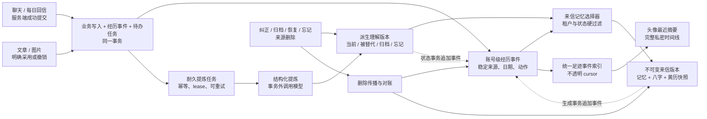
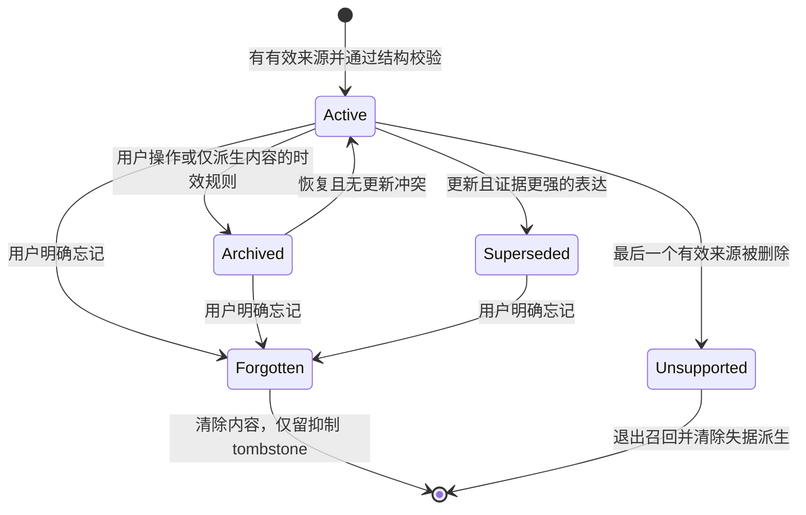
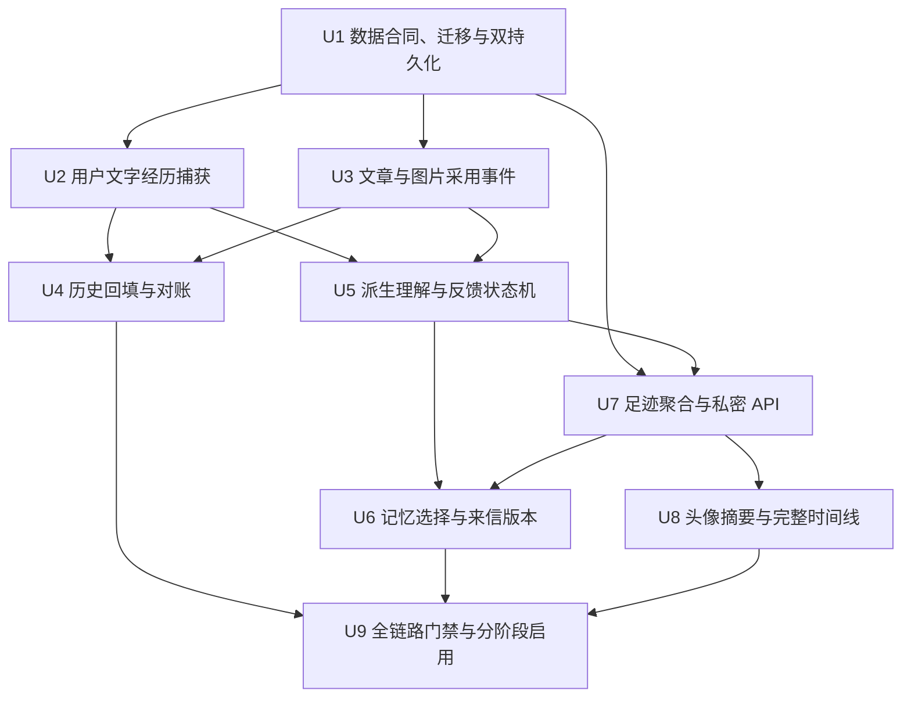

# feat: 个人记忆、每日来信与头像足迹互通

## Summary

在既有 Story 对话、发布稿版本、图片采用和每日来信权威之上增加账号级经历索引与可纠正的派生理解；所有提炼异步、可重试、可追溯，每日来信保存生成时的记忆、八字与黄历版本，头像则通过同一服务端聚合提供最近摘要和完整私密足迹。

---

## Problem Frame

当前普通聊天、每日回信、文章版本和图片采用分别持久化，只有每日回信留言会进入后续来信的历史上下文；头像也只有账号操作。规划必须在不复制作品权威、不猜测历史采用、不牺牲跨账号隔离的前提下，把这些已有事实连接成能够学习、纠错、遗忘和解释的连续体验。

---

## Requirements

- R1. 个人记忆按登录账号聚合，但所有 Story、文章、图片和聊天来源继续执行 `userId` 与原实体归属双重校验，不得产生跨账号读取。
- R2. 只捕获服务端确认写入成功的用户文字，包括普通聊天和每日回信；未提交草稿、流式开始、失败请求和键盘过程不进入记忆。
- R3. 只有明确采用、保存为当前版本、发布或“用这张”等权威成功动作才记录作品经历；生成候选、处理中结果和系统审美判断不算采用。
- R4. 每条经历按中国时区保存发生日期、精确时间、稳定来源和有意义的修订／采用行为；跨日修改不得重写旧日期。
- R5. 原始经历和作品来源不会被自动硬删或静默改写；用户从权威入口删除源内容时，记忆层必须清除可识别副本并阻止失据理解继续被召回。
- R6. 派生理解区分用户明确陈述与系统推断，覆盖事实、偏好、关系、阶段目标、近期牵挂和感悟，并保持到来源与日期的证据链。
- R7. 明确纠正、否定、忘记、编辑和撤销采用属于强反馈；重复表达和持续采用可增强依据，沉默、未点击或暂时不用不构成否定。
- R8. 冲突通过新增理解版本与 `superseded` 关系保存变化轨迹，最新且证据更强的表达成为当前理解，旧话不得被改写成新结论。
- R9. 系统只能对派生理解执行降权或可恢复归档；短期状态可衰减，原始经历不参与自动淘汰。
- R10. 用户能够查看理解及依据，并执行纠正、归档、恢复和忘记。归档可恢复；忘记清除派生内容、保留不含原文的抑制标记，阻止原有证据再次生成同一理解，但不删除底层聊天或作品。
- R11. 八字是可修改的长期资料，黄历是按目标中国日期获取的实时事实；两者与个人记忆分别版本化，不得互相混写或重算历史信。
- R12. 每日来信只从仍有效、允许用于来信且与当天有关的有限理解中选择内容；完整聊天和全部候选不得直接进入生成上下文。
- R13. 每个中国日期的首次来信幂等地产生首版；新聊天默认只影响未来，用户显式“再读一遍”才产生同日不可变新版本，失败时保留旧版。
- R14. 来信引用过去时保留日期、来源类别和确定性边界；推断不得冒充事实，也不得替用户作心理诊断、人格定性或命运断言。
- R15. 黄历只接受日期匹配且带来源、抓取时间和解析版本的结果；超时、限流、缺字段或日期不符时使用同日可信缓存，否则生成不含黄历断言的降级版本。
- R16. 头像菜单保留账号、管理员和退出能力，并以同一足迹聚合提供最近有活动日期的摘要和完整入口；完整时间线不塞进小弹层。
- R17. 完整足迹按中国日期聚合用户原话、感悟、每日来信、Story 活动、采用文章和采用图片；作品入口回到各自权威页面，日期与事件锚点支持返回定位。
- R18. 足迹覆盖加载、空记录、错误、重试、列表结束、来源已删除、当前无权访问和采用成果仍处理中的状态；纠正、归档、恢复和忘记在刷新及同账号跨端后保持一致。

**Origin actors:** A1 登录用户、A2 个人记忆系统、A3 每日来信、A4 作品权威流程。

**Origin flows:** F1 从聊天与创作沉淀记忆、F2 根据反馈更新而不改写历史、F3 生成更懂用户的每日来信、F4 从头像回看个人足迹。

**Origin acceptance examples:** AE1–AE3 验证文字与采用边界；AE4、AE5、AE8 验证冲突、纠正、归档与忘记；AE6、AE7 验证来信版本和黄历降级；AE9 验证头像与足迹状态。

---

## Scope Boundaries

- 不建设公开主页、关注、分享或跨用户画像，也不让管理员入口隐式获得普通用户的私密记忆。
- 不采集产品外聊天、键盘输入、未提交草稿、被动浏览、沉默、未采用候选或失败的生成结果。
- 不重做 Story、发布稿、图片候选和素材删除的权威；个人记忆只记录其服务端确认的结果并回链来源。
- 不把所有聊天交给模型，不只凭向量相似度召回，也不在本阶段引入向量数据库。
- 不允许模型直接删除来源、激活理解或绕过确定性状态机；模型输出可以为空，也必须经过结构校验。
- 不自动改写已经生成的来信，不把旧黄历当今天，不把八字或黄历写成个人经历。
- 不为填满历史而根据“最近 Story”、当前 `activeVersionId`、当前图片或 `shotNo` 猜测过去采用行为。
- 不新增 Redis、BullMQ、Kafka、独立微服务或事件溯源框架；现有 MySQL 与本地持久化足以承载首版耐久任务。
- 不在工作树启动第二个开发服务或写入业务持久化；运行验收只使用主仓库固定的 3000 端口。

### Deferred to Follow-Up Work

- 公开或可分享的人生时间线、家庭成员协作、跨账号推荐：不属于私密个人记忆首版。
- 语义向量检索：只有结构化选择器在真实规模下无法达到相关性与延迟目标时再独立评估。
- 独立队列基础设施：只有单进程耐久任务表出现可量化吞吐瓶颈后再规划。

---

## Context & Research

### Relevant Code and Patterns

- `drizzle/schema.ts` 与 `server/db.ts` 同时定义 MySQL 和 `.webdev/local-persist.json` 两条持久化路径；新实体必须覆盖 `MemoryState`、兼容加载、ID 分配、串行写盘和失败回滚。
- `server/services/storyConversation.ts`、`server/routers/promptLineage.ts` 与 `story_conversation_messages` 是桌面／手机普通聊天的统一持久化边界；捕获应在服务端成功事务中完成，不能分别埋客户端事件。
- `server/services/emotionDailyLetters.ts`、`server/services/emotionProfileDailyRefresh.ts` 和 `server/services/emotionDailyReference302.ts` 是每日来信归档、刷新和生成权威；当前历史只聚合每日回信留言。
- `emotion_daily_letters` 当前以 `userId + letterDate` 唯一并保存可变快照；显式同日重读需要新增不可变版本，而不是继续覆盖该行。
- `stories.body.publishing`、`server/services/publishingPersistence.ts` 与 `server/routers/publishingDraft.ts` 管理发布稿版本。是否曾被采用必须来自成功动作和操作令牌，不能从当前活跃版本反推。
- `imageSignals.action = swipe_right` 与 `promoteStoryImageToCurrent` 记录图片采用；`generated_images.isCurrent` 只是当前状态，不能充当历史采用事实。
- `storyActivityDates` 仍读取 `story.body.messages`，看不到标准化对话表；新的足迹事件索引应成为日期聚合权威，而不是继续扩展 legacy 推导。
- `client/src/app/shell/TopBar.tsx` 是现有头像菜单；`client/src/app/router/AppRouter.tsx` 使用受保护路由；`MobileWorkspace.tsx` 的手机页头需要提供同一私密足迹入口。
- `server/_core/inferenceOrchestrator.ts` 已统一外部推理的错误分类和有界重试；新的提炼任务应复用它，但跨进程重试由耐久任务状态负责。
- `server/services/timelineFrameExtraction.ts` 展示了 claim token、lease heartbeat、外部工作与数据库状态分离的既有模式，可作为任务执行的仓库内参考。

### Institutional Learnings

- `docs/solutions/2026-06-13-故事为唯一单位-镜头按storyId.md`：Story 继续拥有作品和聊天；账号级记忆保存来源索引，所有读写同时验证 `userId + storyId`，不得猜最近 Story。
- `docs/solutions/2026-06-13-多worktree环境数据分裂收敛.md`：迁移和回填必须 dry-run、备份、幂等、报告歧义并校验外键；本地模式与 MySQL 必须同步实现，只在主仓库服务验收。

### External References

- Drizzle 的事务、约束、MySQL 冲突写入与 journaled migration 支持事务内事件／任务写入和数据库级幂等，迁移与业务幂等需要分别设计。
- tRPC v11 与 TanStack Query 的无限查询支持不透明 cursor；足迹应使用 keyset cursor 和服务端 `limit + 1`，不使用易漂移的 offset。
- AWS Transactional Outbox 指南明确指出至少一次投递会重复，因此消费者必须幂等并防止乱序旧任务覆盖新状态。
- GDPR 第 5、17 条和 EDPB 删除指南要求目的限制、数据最小化、准确性、保留期限与删除传播；原始经历、派生理解、快照摘录和 tombstone 必须采用不同生命周期。
- OWASP LLM Sensitive Information Disclosure 指南要求在进入模型前做最小化和租户硬过滤，日志与错误中不得落原文。
- OpenAI Evals 指南支持用结果区间和安全硬门槛评测记忆选择，不把生成文案锁死为逐字快照。

---

## Key Technical Decisions

| Decision | Rationale |
| --- | --- |
| 建立账号级不可变经历事件，正文仍由来源权威拥有 | 统一日期、来源、采用和反馈行为，同时避免复制出另一套会漂移的 Story／文章／图片状态 |
| 每种来源定义稳定来源 ID、来源修订和动作 ID，并以数据库唯一约束保证捕获幂等 | 客户端重试、跨端重复请求和 worker 至少一次执行都不能制造重复经历 |
| 原始事件、派生理解、证据边和提炼任务分开持久化 | 原话长期保留，系统理解可版本化，证据可多对多，失败重试不会污染原始写入 |
| 来源有不可变正文时事件只保存引用与哈希；缺少不可变修订的来源保存最小必要快照 | 来源拥有当前实体；事件快照只对“当次发生时用户说了／采用了什么”负责，不能反向覆盖来源当前状态 |
| 显式删除源内容是经历账本 append-only 的唯一破例 | 事件身份可保留不含原文的删除 tombstone 用于审计和防复活，但正文、可逆哈希、embedding、快照摘录和派生内容必须清除 |
| 派生理解使用版本化状态机：当前、被替代、归档、忘记 | 纠正保留变化轨迹；归档可恢复；忘记清除文本并建立对旧证据的抑制，不会误删来源 |
| 用户明确陈述和纠正的可信级别高于系统推断 | 防止一次性项目指令、提问、引用或模型猜测变成永久人格；恢复旧理解也不能压过更新的冲突理解 |
| 捕获事件与待提炼任务同事务写入，LLM 在事务外异步运行 | 数据与任务不会双写分裂，模型故障也不会回滚聊天、回信或作品采用 |
| 使用数据库耐久任务、lease 和条件提交，不引入新队列服务 | 与当前单进程部署和本地模式兼容，同时对重启、重复、乱序和未来多实例保持安全 |
| 来信选择先做租户、状态、来源和主动提及资格硬过滤，再做结构化排序与数量限制 | 隐私条件不能交给相似度或模型判断；有限、多来源且有冷却期的上下文减少重复和冒犯 |
| 不可变来信版本是生成内容唯一权威，`emotion_daily_letters` 只保留同事务更新且可重建的日期级指针／兼容投影 | 所有 legacy writer 必须在 U1 即切到统一写入门面，不能让 U1–U6 之间出现只改投影、不追加版本的漂移窗口 |
| 来信版本分为不可变 envelope 与可清除的隐私 payload | 版本号、生成时间和策略保持稳定；证据摘录与来源关联可以在明确删除源内容时 scrub，并通过 deletion overlay 安全呈现 |
| 每个来信生成 attempt 固定 privacy epoch、八字修订、记忆证据修订和黄历事实 | 能解释“为什么提到”，并在外部生成期间发生忘记／删除时拒绝提交过期输入 |
| 经历、理解状态变化和来信生成／重读都写入统一足迹事件索引 | 足迹只分页一个稳定索引；理解和来信正文仍由各自权威拥有，详情 resolver 按事件类型读取 |
| 足迹查询使用不透明 keyset cursor，来源详情再按类型解析 | 避免跨多张业务表全量 union 和 offset 漂移；同日分段由客户端按事件 ID 合并去重 |
| 最近摘要与完整足迹共用同一聚合服务 | 头像和详情不会对“哪一天发生过什么”产生两套口径 |
| 历史回填只写确定性来源；来源不完整和歧义进入报告，不制造事件 | 历史缺口可解释，且不会把当前状态伪造成过去用户选择 |

### Source Contract Matrix

| Source | Stable identity / revision | Current content authority | Event-owned historical material | Delete handling |
| --- | --- | --- | --- | --- |
| 普通聊天用户消息 | 账号、Story、conversation message ID；消息行即修订 | `story_conversation_messages` | 发生时间、动作、内容哈希和展示所需最小摘录；完整正文优先解析消息行 | Story／消息删除时 scrub 摘录和哈希，事件只留无内容 tombstone |
| 每日回信用户文字 | 账号、日期、消息修订号 | 日期级当前投影 | 每次已提交修订的原文；这是旧修订的历史权威，不反写当前投影 | 删除该日留言时清除对应修订正文并失效仅由其支持的理解 |
| 发布文章采用 | 账号、Story、发布版本 ID、采用动作 ID | `stories.body.publishing` 当前版本状态 | 采用时版本身份、内容哈希及最小标题／摘录；必要时固定不可变采用修订 | 删除 Story／版本时 scrub 快照并取消详情导航 |
| 图片采用 | 账号、Story、generated image ID、采用 signal／动作 ID | `generated_images` 与 `imageSignals` | 采用时间、图片身份和安全展示元数据，不复制图片字节 | 图片删除时清缩略图／prompt 摘录，只留采用发生过的无内容 tombstone |
| 派生理解 | 账号、insight lineage、insight revision | `personal_memory_insights` | 理解文本、适用范围、可信度与证据边 | 归档保留；忘记清除文本并以 lineage + 旧证据修订建立抑制 |
| 每日来信版本 | 账号、中国日期、version／attempt ID | 不可变 letter version | envelope、生成正文、段落到证据的关联；敏感摘录位于可 scrub payload | 普通资料变化不改版；明确源删除通过 overlay 隐去相关段落或在无法安全分段时隐藏正文 |

内容哈希只用于一致性与变化检测，不得作为可恢复正文或删除后的语义匹配材料。实现必须为每种 source type 写出允许持久化字段清单，未在清单内的原文、prompt、图片元数据和八字不得进入事件或普通日志。

### Capture Atomicity Matrix

| User action | Atomic boundary | If event/outbox write fails | Async work |
| --- | --- | --- | --- |
| 普通聊天提交 | 标准化 user message、经历事件、待提炼任务同一 SQL 事务／本地 copy-on-write | 整次持久化明确失败，可凭原 client ID 安全重试；不得返回已保存 | 助手生成与提炼均在事务外，按各自幂等合同处理 |
| 每日回信保存／编辑 | 回信当前修订、历史经历、任务同一短事务 | CAS 不推进，保留旧文字并提示刷新／重试 | 黄历与来信生成不放入该事务 |
| 文章／图片明确采用 | 权威版本／current 变更、采用 signal、经历、任务同一领域事务 | 采用不生效且不返回成功；同一动作 ID 可重放 | 偏好提炼稍后执行 |
| 理解纠正／状态变化 | 新理解版本或状态、privacy epoch、足迹事件同一短事务 | 旧状态保持不变并返回冲突／失败 | 受影响来源的重提炼或清理由任务继续 |
| 来信首次生成／重读 | 短事务保留 attempt 与输入截点；外部生成后另一短事务条件提交版本、指针与足迹事件 | attempt 可重试；旧版本与当前指针不变 | 黄历和模型调用均在两个短事务之间 |

---

## Open Questions

### Resolved During Planning

- **归档和忘记是否相同？** 不相同。归档保留内容、证据与恢复能力并退出个性化；用户已确认忘记会清除派生内容、阻止旧证据再次生成同一理解，但不删除原聊天或作品。
- **是否把个人记忆做成第二套 Story／作品库？** 否。事件保存稳定来源与必要历史快照，详情和删除仍回到原权威；来源删除后记忆层做级联清理。
- **是否在聊天请求中同步调用模型提炼？** 否。成功提交只原子写事件与任务，提炼异步完成；模型失败不改变原业务结果。
- **是否需要 Redis、向量库或独立 worker 服务？** 首版不需要。使用同库耐久任务、小批量有界 runner 和结构化选择器，保留未来替换执行器的边界。
- **足迹按什么分页？** 按 `occurredAt DESC, immutable event id DESC` 做 keyset 分页；客户端合并同日段并按事件 ID 去重，刷新或筛选变化时重新建立查询快照。
- **历史来信如何进入版本模型？** 当前每个日期的已存快照确定性迁移为 version 1；之后首次生成与显式重读只追加新版本，日期级行只作为当前指针／兼容投影。
- **如何处理撤销采用？** 保留“曾采用”的历史事件，追加撤销事件并停止其作为当前偏好证据；再次采用产生新的幂等动作事件。
- **如何回填旧作品？** 每日回信、标准化用户消息和带明确用户／来源的采用信号可回填；只有当前状态、来源无法唯一归属或可能由自动流程产生的记录拒绝写入。

### Deferred to Implementation

- 每封来信的记忆条数、类别配额、冷却期、时间衰减、最低可信度和自动归档阈值在受控默认值上通过离线评测调整；硬过滤和来源要求不可配置放宽。
- 头像摘要展示多少个“有活动日期”、单页事件数和单卡预览长度属于 UI 参数；摘要与详情仍必须使用同一查询口径。
- 黄历请求超时、重试次数和同日缓存时限按现有供应商实测确定；日期匹配、来源可识别和失败不编造是固定门槛。
- 提炼 runner 的批量、并发、lease、退避和最大尝试次数根据单进程负载测试调整；外部调用不得持有数据库事务。
- 来源失效卡片保留的非敏感标题和时间文案在设计实现时确定；已删正文、图片缩略图和虚假跳转始终禁止展示。
- 备份中个人内容的最终清除时限沿用部署环境的数据保留政策；恢复备份后必须先重放删除账本，不能让已忘记或已删除内容复活。

---

## Output Structure

    shared/
    └── personalMemory.ts
    server/
    ├── routers/
    │   └── personalMemory.ts
    └── services/
        ├── personalMemoryEvents.ts
        ├── personalMemoryAdoption.ts
        ├── personalMemoryExtraction.ts
        ├── personalMemoryJobRunner.ts
        ├── personalMemoryInsights.ts
        ├── personalMemoryReconciliation.ts
        ├── personalMemorySelection.ts
        └── personalMemoryTimeline.ts
    client/src/
    ├── features/personalMemory/
    │   ├── PersonalMemorySummary.tsx
    │   ├── PersonalMemoryTimeline.tsx
    │   ├── PersonalMemoryDay.tsx
    │   ├── PersonalMemoryInsightActions.tsx
    │   └── personalMemoryViewModel.ts
    └── pages/
        └── PersonalMemoryPage.tsx
    scripts/
    └── backfill-personal-memory.ts

文件树表达责任边界而非必须逐字照搬；实现可以在不改变权威和测试边界的前提下合并过细模块。

---

## High-Level Technical Design

> *This illustrates the intended approach and is directional guidance for review, not implementation specification. The implementing agent should treat it as context, not code to reproduce.*

派生理解生命周期：

---

## Implementation Units

### U1. 建立经历、理解、任务和来信版本的数据合同

**Goal:** 以 additive schema 建立账号级经历事件、租户来源注册、派生理解、证据关联、抑制／删除记录、耐久任务、生成 attempt 和不可变来信版本，并让 MySQL 与本地 `MemoryState` 具有相同语义。

**Requirements:** R1, R4–R6, R8–R11, R13

**Dependencies:** 当前账号／迁移热区完成并释放；实施前先运行环境状态与 migration baseline 检查，按当时 journal 生成下一个迁移，不能占用本计划撰写时看到的编号。

**Files:**
- Create: `shared/personalMemory.ts`
- Modify: `drizzle/schema.ts`
- Create: `drizzle/migrations/<next>_personal_memory_daily_letter_versions.sql`
- Modify: `drizzle/meta/_journal.json` and generated snapshot
- Modify: `server/db.ts`
- Modify: `server/services/emotionDailyLetters.ts`
- Test: `server/db.personalMemory.test.ts`
- Test: `server/services/emotionDailyLetters.test.ts`
- Test: `server/integration/personalMemory.mysql.test.ts`
- Test: `server/integration/personalMemoryMysqlWorker.ts`

**Approach:**
- 用独立表表达经历、理解、证据边、任务和来信版本，避免一个万能 JSON 同时承担原话、模型状态和外部事实。
- 经历使用 `userId + source type + stable source id + source revision + canonical action discriminator/id` 的数据库唯一性；参与唯一性的字段全部非空，避免 MySQL 对 `NULL` 的唯一索引语义放过重复行。
- 非多态来源优先使用包含 `userId` 的复合外键；多态来源先写入租户来源注册表，事件、证据、任务和来信证据边再通过包含 `userId` 的复合唯一／外键引用它。repository 层仍必须显式带用户条件，形成纵深防御。
- 提供同时接受 SQL transaction handle 或本地 aggregate draft 的 transaction-scoped event/outbox repository，U2、U3 和 U5 只能在领域事务内调用它，不能自行开启嵌套事务。
- 对于用户要求保留历史但源实体允许删除的关系，删除策略采用“先清敏感内容、再留最小 tombstone”，不依赖 cascade 静默抹除。
- 来信不可变版本在 U1 即成为唯一内容 writer；`saveDailyLetterFromProfile`、`rewriteEmotionDailyLetter` 等 legacy writer 同步切到统一 write-through 门面。日期级行只保存同事务推进的当前版本指针和可重建兼容字段，不接受独立正文写入。
- 生成 attempt 保存用户级 privacy epoch、输入 cutoff 与所选资料修订；用户忘记或源删除必须在同一短事务递增 privacy epoch，使在途生成失效。
- 本地模式同步增加状态数组、next ID、旧文件兼容加载、冻结快照和原子回滚；不创建第二个 JSON 文件或写盘队列。

**Execution note:** 先写数据合同、source contract、transaction-scoped repository 与 MySQL／local parity 测试，再生成迁移；合并前重新解析正在进行的账号迁移，避免手工改 journal 冲突。U1 必须完成来信 writer cutover 后才能开放 U2/U3 捕获。

**Patterns to follow:**
- `drizzle/schema.ts` 的复合唯一索引和用户外键。
- `server/db.ts` 的 `MemoryState` 兼容加载、`enqueueLocalPersistenceWrite` 与事务式本地快照。
- `story_conversation_messages` 的稳定客户端 ID 和租户字段组合。
- `publishingPersistence` 的统一写入门面与 projection 可重建检查。

**Test scenarios:**
- **Happy path:** 同一用户写入两种来源事件和一项带多来源的理解，MySQL 与本地模式读回相同顺序、状态和来源。
- **Edge case:** 重放同一动作 ID 多次，事件、任务和证据边基数不变。
- **Edge case:** 两个用户具有相同 source ID，数据仍按用户隔离且唯一约束互不冲突。
- **Edge case:** 直接尝试让用户 A 的事件、证据或任务引用用户 B 的来源，数据库复合约束拒绝写入。
- **Edge case:** canonical identity 的任一必要组成缺失时拒绝捕获，不允许以 `NULL` 绕过唯一性。
- **Error path:** 本地持久化中途失败时，经历和任务同时回滚，不留下半写状态。
- **Integration:** 从完整 Drizzle journal 在 disposable MySQL 重演后，新旧每日来信都能读取，旧日期成为 version 1；日期投影可由版本重建且所有旧 writer 无法单独改正文。

**Verification:**
- 新模型在两条持久化路径具备等价的创建、查询、条件更新与删除传播能力，数据库能拒绝跨租户来源引用；迁移可从空库重演，所有来信写入均经过版本权威。

---

### U2. 在服务端成功边界捕获用户文字

**Goal:** 让桌面／手机普通聊天和每日回信中的用户文字只在权威写入成功后形成一次可追溯经历，并为修改保留修订轨迹。

**Requirements:** R1, R2, R4, R5, R7

**Dependencies:** U1

**Files:**
- Create: `server/services/personalMemoryEvents.ts`
- Modify: `server/services/storyConversation.ts`
- Modify: `server/routers/promptLineage.ts`
- Modify: `server/services/emotionDailyLetters.ts`
- Test: `server/services/personalMemoryEvents.test.ts`
- Test: `server/services/storyConversation.test.ts`
- Test: `server/services/storyConversation.mobile.test.ts`
- Test: `server/services/emotionDailyLetters.test.ts`

**Approach:**
- 把标准化 user message 行 ID 作为普通聊天稳定来源；事件插入和待提炼任务加入现有消息事务，流式调用开始或助手生成成功本身不产生用户经历。
- 桌面 `appendTurn`、手机整轮提交和恢复路径共用服务端捕获函数；同一 client message／turn 重试命中唯一约束并返回已有事件。
- 每日回信首次保存和每次编辑通过 U1 的统一短事务，同时推进当前修订、追加带修订号的用户文字经历和任务；黄历查询与来信模型生成在事务之外，不得把外部失败混进留言保存。
- 日期级行仍可呈现当前文字，但旧修订由不可变事件保存，不再只靠 `analysisSeed.messageHistory`。编辑动作同时生成足迹事件，空白清除则触发证据失效检查。
- 空白清除记录为明确编辑／删除语义而不是新感悟；是否清除底层每日留言依照现有 CAS，相关派生理解通过删除传播重新评估。

**Patterns to follow:**
- `server/services/storyConversation.ts` 的 turn claim、request hash、客户端消息 ID 与 SQL 事务。
- `server/services/emotionDailyLetters.ts` 的 revision CAS 和冲突错误。

**Test scenarios:**
- **Happy path:** 用户在桌面提交文字，消息与经历各写一次，第二个设备读取同一来源和中国日期。
- **Happy path:** 用户修改某日回信，时间线保留前后两次修订并把最新修订作为当前内容。
- **Edge case:** 手机未知结果查询、重复提交和服务恢复不会重复经历或提炼任务。
- **Edge case:** 提问、引用别人的话和项目指令仍作为原始文字保存，但尚未被错误提升为个人偏好。
- **Error path:** 消息事务失败或 CAS 冲突时不产生幽灵经历；提炼任务后续失败不回滚已经成功的文字。
- **Error path:** 黄历或来信生成失败不回滚已经成功保存的每日留言；留言事件写入失败也不能让日期级行单独推进。
- **Integration:** 同一 user message 从桌面和手机路径到达时，最终只存在一个 source event。

**Verification:**
- 所有已提交用户文字都能按来源回看，草稿、失败请求和重复重试均不能出现在事件表。

---

### U3. 把明确文章与图片采用映射为经历事件

**Goal:** 为发布稿和图片的所有明确采用／撤销入口建立单一事件映射，记录用户真实选择而非当前状态。

**Requirements:** R1, R3–R5, R7

**Dependencies:** U1

**Files:**
- Create: `server/services/personalMemoryAdoption.ts`
- Modify: `server/services/publishingPersistence.ts`
- Modify: `server/routers/publishingDraft.ts`
- Modify: `server/db.ts`
- Modify: `server/routers/storyAgent.ts`
- Modify: `server/routers/creationAgent.ts`
- Test: `server/services/personalMemoryAdoption.test.ts`
- Test: `server/routers.publishingDraft.test.ts`
- Test: `server/routers.storyAgent.test.ts`
- Test: `server/routers.creationAgentVisualObjects.test.ts`

**Approach:**
- 先建立采用动作映射表：发布稿选定版本／明确保存或发布、发布封面采用、图片“用这张”、候选确认、撤销和再次采用分别指向稳定版本／图片 ID 和幂等动作令牌。
- 把事件写入放到持久化服务的成功事务内；router 只传递明确用户意图，不能在返回成功后以 best-effort 方式补日志。
- 图片采用扩展 `promoteStoryImageToCurrent` 的明确采用上下文；自动迁移、恢复 current 状态和内部派生不传该上下文，因此不会制造用户偏好。
- 文章事件冻结采用时的版本身份和内容哈希；如果现有版本可继续编辑，保存最小必要采用快照或固定源修订，确保时间线能说明当时采用了什么。
- 撤销不删除历史采用事件，而是追加动作并使它退出当前偏好证据；再次采用生成新的稳定动作。

**Patterns to follow:**
- `writePublishingDraftState` 的 operation token、revision CAS 和版本作用域。
- `promoteStoryImageToCurrent` 的事务、expected current guard 与 `imageSignals`。
- `storyAgent.recordSignal` 的 `swipe_right` 用户选择语义。

**Test scenarios:**
- **Happy path:** 四张候选只采用一张，时间线和理解证据只出现被采用图片。
- **Happy path:** 草稿次日采用修订版，生成日与采用日分开，长期作品指向采用修订。
- **Edge case:** 同一采用请求重试多次只产生一个事件；撤销再采用产生有序的三个行为。
- **Edge case:** 自动恢复 `isCurrent`、批量迁移和后台生成不产生采用经历。
- **Error path:** 图片／文章归属、版本 CAS 或采用事务失败时不写事件；另一账号猜 ID 始终失败关闭。
- **Integration:** 发布封面、普通 Story 图片和编辑候选的所有明确入口共享相同事件语义。

**Verification:**
- “采用”可以从动作历史证明，任何当前状态变化都不能倒推出或伪造用户曾经选择。

---

### U4. 确定性回填历史并建立持续对账

**Goal:** 把可证明的旧用户文字和采用行为安全转为经历，报告而不猜测其余历史，并持续发现失据理解、卡死任务和删除残留。

**Requirements:** R1–R5, R17, R18

**Dependencies:** U2, U3；dry-run 可先执行，apply 必须等 U5 的 runner、pause 开关和积压指标可用。

**Files:**
- Create: `scripts/backfill-personal-memory.ts`
- Create: `scripts/backfill-personal-memory.test.ts`
- Create: `server/services/personalMemoryReconciliation.ts`
- Test: `server/services/personalMemoryReconciliation.test.ts`
- Modify: `package.json`
- Update: `docs/environment-guide.md`

**Approach:**
- 回填默认 dry-run，并生成包含源表高水位／内容摘要、目标 schema version 和分类结果的不可变 manifest；apply 只能消费仍匹配当前水位和 schema 的 manifest。
- 写前创建可恢复备份，重复运行幂等；报告总数、确定性写入、来源不完整、歧义拒绝、跨用户污染和外键问题。
- 标准化 user conversation message 与每日回信修订按稳定行 ID 回填；legacy `story.body.messages` 只在能证明用户、Story 和原始时间时使用。
- 图片只接受具有稳定 image ID、明确用户行为和可验证 Story owner 的采用信号；文章只接受能证明版本、动作与用户意图的持久化收据。`isCurrent`、`activeVersionId`、最近 Story 和 `shotNo` 不作为证据。
- apply 按用户与来源 keyset 分块，每块短事务原子并写 checkpoint；源水位或 schema 漂移时停止后续块，保留已提交的幂等进度并准确报告 `applied-through`，不承诺整库长事务回滚。
- 回填 apply 默认暂停任务消费，按积压预算分批写入；先抽样提炼并核对成本／质量，再逐批开放 runner，避免一次性轰击模型供应商。
- 对账扫描活跃经历无成功提炼、活跃理解只指向失效来源、卡死 lease、孤立证据边、索引状态不一致及来信隐私 payload 残留；修复动作使用同一幂等合同。
- 删除／忘记账本必须在业务备份世代之外保留可恢复镜像或后续增量，并让每次备份记录 deletion high-watermark。恢复时先关闭 recall 与 runner，在隔离状态补齐账本、执行 scrub／对账并核对水位，最后才重新开放。

**Patterns to follow:**
- `scripts/merge-local-persist.ts` 的安全迁移思想与 `docs/solutions/2026-06-13-多worktree环境数据分裂收敛.md`。
- 现有 migration baseline 与 MySQL integration worker。

**Test scenarios:**
- **Happy path:** dry-run 对确定性聊天、每日回信和采用图片给出预期分类，apply 后第二次运行零新增。
- **Edge case:** 同 project 相同 `shotNo` 属于不同 Story 时拒绝猜测，报告可定位但不写事件。
- **Edge case:** 只有当前文章版本而无采用收据时标为来源不完整。
- **Error path:** 备份失败、跨用户引用、外键断裂、manifest 水位或 schema 变化时 fail closed，停止后续分块并准确保留／报告已提交 checkpoint。
- **Error path:** 恢复环境缺少与备份 watermark 衔接的删除账本时，recall 与 runner 保持关闭，不能以旧库内容对用户提供个性化。
- **Integration:** 对账能恢复过期 lease、失效最后证据的理解并清除来信快照摘录，不改变仍有独立证据的理解。

**Verification:**
- 每条回填事件都能说明来源和确定性依据，歧义项保持未写入；分块任务可从 checkpoint 恢复，旧备份在缺少完整删除水位时无法重新开放召回。

---

### U5. 实现可追溯提炼、冲突处理与用户反馈状态机

**Goal:** 从经历异步生成少量带证据的理解，以确定性状态机处理纠正、归档、恢复、忘记和来源删除，并保证重试、乱序和模型错误不会复活旧状态。

**Requirements:** R5–R10, R12, R14

**Dependencies:** U1, U2, U3

**Files:**
- Create: `server/services/personalMemoryExtraction.ts`
- Create: `server/services/personalMemoryJobRunner.ts`
- Create: `server/services/personalMemoryInsights.ts`
- Modify: `server/_core/index.ts`
- Use: `server/_core/inferenceOrchestrator.ts`
- Test: `server/services/personalMemoryExtraction.test.ts`
- Test: `server/services/personalMemoryJobRunner.test.ts`
- Test: `server/services/personalMemoryInsights.test.ts`

**Approach:**
- 提炼输入只包含单个经历及最少冲突候选，结构化区分 direct statement、question、quotation、hypothesis、project-scoped instruction 与 inferred behavior；允许返回零理解。
- 每个任务以用户、经历、源修订、提炼器版本和操作组成幂等身份。runner 以短事务 claim 后释放锁，再调用模型；完成时按 lease token 和当前源修订条件提交。
- provider 内部仅对安全的纯分析做有限重试；job 层负责跨进程指数退避、最大次数、永久失败和人工重跑，不叠加无界重试。
- runner 是可显式 start／stop 的模块：数据库 readiness 后启动，import 不自启动；单个 tick 不重叠，定时器不阻止进程退出，每轮 claim、并发和单用户份额受限，启动时回收过期 lease。
- 收到进程终止信号时先停止新 claim，再在有界时间内等待在途工作结束或让 lease 安全过期；多实例依靠原子 claim 保证安全，但首版执行器仍与 HTTP 服务同进程。
- 时钟、调度器、claim repository 和推理执行器均可注入，测试不依赖真实 sleep；独立 kill switch 停止任务消费但不丢 pending 行。
- 新纠正产生高可信的直接理解版本并 supersede 冲突旧版；旧任务在调用前后都检查源状态和序列，不能覆盖新纠正、归档、忘记或删除。
- 多来源理解删除一个来源时重新计算依据；最后有效来源删除时退出召回并清除派生内容。来源暂时不可访问与已删除分开处理。
- 自动规则只能调整权重和归档派生理解。忘记清除文本、证据摘要和检索内容，tombstone 只绑定 `userId + insight lineage/key + 被禁止的 evidence IDs/revisions`；它阻止旧证据重建该理解，不承诺对未来新表达做不可解释的语义级永久封禁。
- 未来新证据按正常流程形成新版本；若产品以后需要“无论未来怎么说都不再提某主题”，必须新增用户可见的独立选择，不能暗中扩大本次忘记语义。
- 日志只记录任务、来源和错误类别，不记录用户原话、模型 prompt 或可逆内容哈希。

**Patterns to follow:**
- `inferenceOrchestrator` 的错误分类、`replaySafe` 和供应商重试。
- `timelineFrameExtraction` 的 claim token、lease、心跳和条件完成。
- `promptRevisions` 的 candidate／confirmed／rejected 分层，但派生理解状态独立于 Story prompt。

**Test scenarios:**
- **Happy path:** 三次采用暖色图片形成带三个来源的候选理解，用户纠正为项目限定后，全局旧理解被替代。
- **Edge case:** “我讨厌早起吗？”、小说人物台词和临时项目要求不被提炼为用户永久事实。
- **Edge case:** 先说喜欢独处、后说明想多见朋友，当前理解更新且旧时间轨迹仍可见。
- **Edge case:** 删除多来源中的一个仍保留有依据理解；删除最后来源后召回为零。
- **Edge case:** 归档后恢复不覆盖更新的冲突理解；忘记后旧任务和旧证据无法重新创建同一理解。
- **Error path:** worker 在 claim 前后崩溃、lease 过期、任务重复或乱序完成时，active insight 与证据边基数保持稳定。
- **Error path:** 重复 timer tick、启动导入、服务终止或某一用户大量积压时，不产生重入执行、丢任务或长期饿死其他用户。
- **Error path:** 模型返回非法结构、越权删除指令或敏感人格断言时任务失败／返回零结果，原经历不受影响。
- **Integration:** 重启服务后 pending 任务继续处理，另一账号的 runner 永远不能 claim 或写入当前用户结果。

**Verification:**
- 来源覆盖率达到 100%，被归档／忘记／失据内容召回为零，重复与乱序执行无法改变正确的最终状态。

---

### U6. 用精选记忆生成不可变、可重读的每日来信

**Goal:** 把有效个人理解、当前八字和目标日期黄历组成受控生成输入，保存不可变版本与依据快照，并为显式同日重读提供并发安全入口。

**Requirements:** R10–R15

**Dependencies:** U1, U5, U7；U7 先提供统一事件 writer 与可扩展来源 resolver，U6 再注册来信版本事件和详情适配。

**Files:**
- Create: `server/services/personalMemorySelection.ts`
- Modify: `server/services/emotionProfileDailyRefresh.ts`
- Modify: `server/services/emotionDailyLetters.ts`
- Modify: `server/services/emotionDailyReference302.ts`
- Modify: `server/services/personalMemoryTimeline.ts`
- Modify: `server/routers/index.ts`
- Modify: `client/src/features/analysis/views/DailyLetterWelcome.tsx`
- Test: `server/services/personalMemorySelection.test.ts`
- Test: `server/services/emotionProfileDailyRefresh.test.ts`
- Test: `server/services/emotionDailyLetters.test.ts`
- Test: `server/services/emotionDailyReference302.test.ts`
- Test: `server/emotionAnalysis.router.test.ts`

**Approach:**
- 选择器先硬过滤当前用户、active、有效来源、允许主动提及和非抑制理解，再按日期／主题相关性、可信度、显著性、时效、冷却期和来源多样性排序；只把有限结果送入生成。
- 生成输入明确标记用户原话和系统推断、原始日期与适用范围；prompt 要求克制引用、不诊断、不把推断写成事实，输出后再做来源与日期约束检查。
- 首次打开以用户和中国日期为幂等键；并发标签页只确认一个 version 1。显式重读使用稳定 action ID，重复提交返回同一 attempt／version。
- 开始生成的短事务创建 attempt，分配 input cutoff 并记录当前 privacy epoch，物化所选 insight／evidence revision 与八字 revision；黄历与模型在事务外运行。完成时用 attempt token、privacy epoch 和所有引用 revision 做条件提交，检查与提交位于同一短事务。
- 忘记或删除源内容会原子递增用户 privacy epoch；在途 attempt 即使已经拿到模型结果也不能提交旧输入，只能安全重选或降级。MySQL 使用行锁／CAS，本地模式使用同一用户 aggregate mutex 与 copy-on-write。
- 每版 envelope 保存版本号、日期、生成时间和 selector／prompt／model 版本；可清除的隐私 payload 保存八字修订、黄历事实与来源、所选理解／证据 revision、最小摘录和生成正文的段落级证据关联。
- 黄历失败按超时、限流、缺字段、日期不匹配和解析失败分类；只有同目标日期且来源可信的缓存可用，否则生成清楚省略黄历断言的版本。
- 重读失败不推进当前版本指针，UI 继续显示旧版并允许重试；历史版本永不因八字、记忆或模型更新而后台重算。
- 归档或忘记只影响未来召回，用户已读的历史信不因理解状态变化而改写。明确删除底层源内容是隐私例外：清除输入摘录和证据资格，并用 deletion overlay 隐去仅由该来源支持的正文段落；无法可靠分段时隐藏该版本正文并显示“内容因删除请求不可再显示”，只保留无内容 envelope。
- 每个成功的首次生成／重读在版本、当前指针同一事务中追加足迹事件，U7 只凭统一事件索引即可分页来信历史。

**Patterns to follow:**
- `chinaDateString` 的中国日期边界。
- `rewriteEmotionDailyLetter` 的 revision CAS 与冲突反馈。
- `getFreshEmotionAnalysisProfile` 的当日归档恢复和 `getAlmanacDay` 获取路径。

**Test scenarios:**
- **Happy path:** 9 月 2 日聊天“最近在学游泳”，9 月 3 日首封信有限度引用并能追到 9 月 2 日来源。
- **Happy path:** 上午读 version 1，下午修改八字并聊天；旧版不变，次日使用新资料，显式重读才生成 version 2。
- **Edge case:** 两设备同时首次打开当天来信，只产生一个首版；同时重读按动作身份幂等且版本有序。
- **Edge case:** 生成期间用户在另一端忘记理解或删除来源，旧 privacy epoch 的结果不能提交，旧版保持可读。
- **Edge case:** 多条相似记忆不能垄断上下文，同一敏感主题处于冷却期时不主动重复提及。
- **Error path:** 黄历返回昨天日期、缺字段或超时且无同日可信缓存，来信继续生成但不含黄历断言。
- **Error path:** 记忆源在选择后、提交前被忘记或删除，条件提交拒绝使用失效快照并安全重选／降级。
- **Integration:** 重读失败、模型失败或快照写入冲突时仍能读取旧版，且不会留下半成品当前版本。
- **Integration:** 删除一个被历史信引用的来源后，版本 envelope 仍存在，但相关摘录和正文段落不再可见；由其他独立来源支持的段落保持可读。

**Verification:**
- 任一历史来信版本都能说明当时使用的资料边界；删除、归档和纠正后的内容不会进入未来生成输入。

---

### U7. 提供账号级足迹聚合、来源解析和记忆控制 API

**Goal:** 用一个受保护的服务端接口支持头像摘要、完整时间线、来源导航和派生理解操作，并在每一层失败关闭跨账号访问。

**Requirements:** R1, R4, R6, R10, R16–R18

**Dependencies:** U1, U5；来信版本适配由后续 U6 接入，不阻塞先上线经历／理解足迹。

**Files:**
- Create: `server/services/personalMemoryTimeline.ts`
- Create: `server/routers/personalMemory.ts`
- Modify: `server/routers/index.ts`
- Test: `server/services/personalMemoryTimeline.test.ts`
- Test: `server/routers.personalMemory.test.ts`
- Test: `server/routers.ownershipBoundaries.test.ts`

**Approach:**
- tRPC router 只从认证上下文取得 `userId`，不接受客户端用户身份；摘要、分页、来源解析和动作 repository 全部要求租户参数。
- 时间线按 `occurredAt DESC, immutable id DESC` 查询 `limit + 1`，返回不透明 cursor；筛选条件进入 query key，客户端合并同日跨页片段并按事件 ID 去重。
- 经历捕获、理解创建／纠正／归档／恢复／忘记都在各自状态事务内追加统一足迹事件；U6 对来信首次生成和重读使用同一 writer。聚合器不跨业务表 union，只有详情 resolver 才读取理解或来信权威。
- 摘要调用同一聚合器，只裁剪为最近若干个有活动日期；“最近”不是制造无内容的连续自然日。
- 来源 resolver 对每种 source type 重新验证 Story／消息／文章版本／图片所有权，返回可访问、已删除、当前无权访问或处理中状态。不可访问时不返回正文、缩略图 URL 或可猜测标识。
- 纠正、归档、恢复和忘记使用 insight revision 条件更新；并发冲突返回可刷新状态。恢复前检查是否存在更新冲突，忘记调用 U5 的清除和抑制流程。
- 来源深链包含日期和事件锚点；返回时可恢复到原日期段，来源已失效则停留在时间线并显示解释状态。

**Patterns to follow:**
- `promptLineage.listRevisionHistory` 的 cursor 查询先例。
- 现有 `protectedProcedure`、`getStoryById(storyId, ctx.user.id)` 和 ownership boundary tests。

**Test scenarios:**
- **Happy path:** 摘要与完整时间线对同一用户返回一致的最近日期和事件类型。
- **Happy path:** 大量同日事件跨页时无丢失、重复或重复日期标题，事件详情返回后恢复原锚点。
- **Edge case:** 新事件插入、归档或来源删除后旧页 cursor 不越权；刷新建立的新查询反映当前状态。
- **Edge case:** 来源已删除与当前无权访问都隐藏敏感内容，但呈现不同的可解释状态。
- **Error path:** 用户 B 猜用户 A 的 event、insight、Story、version 或 image ID 时，所有列表、动作和解析结果均失败关闭。
- **Error path:** 两设备同时归档／恢复／纠正时，过期 revision 不能覆盖较新的动作。
- **Integration:** 时间线动作后每日来信选择器立即反映同一状态，不依赖客户端缓存过期。
- **Integration:** 理解状态变化与来信版本追加后，足迹只查询事件索引也能得到一致顺序，详情再解析到当前可访问内容。

**Verification:**
- 从 API 到来源 resolver 的跨账号泄漏为零，cursor 稳定，所有记忆控制动作具备可观察的一致结果。

---

### U8. 在头像中展示最近摘要并建立完整私密足迹

**Goal:** 保留现有头像账号功能，增加轻量最近摘要和响应式完整足迹页面，让用户回看、定位来源并管理系统理解。

**Requirements:** R10, R16–R18

**Dependencies:** U7

**Files:**
- Create: `client/src/features/personalMemory/PersonalMemorySummary.tsx`
- Create: `client/src/features/personalMemory/PersonalMemoryTimeline.tsx`
- Create: `client/src/features/personalMemory/PersonalMemoryDay.tsx`
- Create: `client/src/features/personalMemory/PersonalMemoryInsightActions.tsx`
- Create: `client/src/features/personalMemory/personalMemoryViewModel.ts`
- Create: `client/src/pages/PersonalMemoryPage.tsx`
- Modify: `client/src/app/shell/TopBar.tsx`
- Modify: `client/src/app/router/AppRouter.tsx`
- Modify: `client/src/features/mobileWorkspace/MobileWorkspace.tsx`
- Test: `client/src/app/shell/TopBar.test.tsx`
- Test: `client/src/features/personalMemory/personalMemoryViewModel.test.ts`
- Test: `client/src/pages/PersonalMemoryPage.test.tsx`
- Test: `client/src/features/mobileWorkspace/MobileWorkspace.test.tsx`

**Approach:**
- 头像弹层继续显示姓名、邮箱、管理员入口和退出；其上增加最近有活动日期的紧凑摘要、加载／空态和“查看全部足迹”，不在弹层中承载无限列表。
- 完整页面按日期呈现原话／感悟、来信、Story 活动、采用文章和采用图片；不同类型使用一致的来源状态、时间和当前／历史标识，不为缺少的类型制造占位。
- “系统理解”卡展示 direct／inferred 标签、依据日期和来源数量，并提供纠正、归档、恢复、忘记；忘记前明确说明不会删除底层内容，删除原文则引导到来源。
- 同日来信显示版本号、生成时间和使用资料说明；显式重读仍在来信入口完成，足迹只导航和解释。
- 使用无限查询加载下一页并合并同日段；URL 保存日期和事件锚点，返回、刷新和浏览器历史均能恢复位置。
- 手机工作区页头增加同一账号／足迹入口，完整页面使用响应式布局；不复制第二套移动数据状态。
- 图片处理中、已删除、无权限和失效链接都使用文本状态与安全占位，不渲染破图或伪链接。
- 桌面与窄屏明确重排信息层级并保持足够的触控目标；头像 Popover 支持 Tab、Shift+Tab、Escape，打开后进入首个可操作项，关闭和确认操作后把焦点还给触发按钮。
- 日期标题、事件、来源状态和理解标签使用语义结构与可访问名称；无限加载、局部错误、重试和动作结果通过读屏可感知的状态播报，不只依赖颜色或动画。
- 深链返回同时恢复滚动锚点与逻辑焦点；窄屏确认层不得遮挡系统键盘或把主要动作推到不可达区域。

**Patterns to follow:**
- `TopBar.tsx` 的 Popover、管理员入口和退出流程。
- `AppRouter.tsx` 的 `AuthGuard`。
- `DailyLetterWelcome.tsx` 的来信历史交互和主题视觉语言。

**Test scenarios:**
- **Happy path:** 有历史用户点击头像先看到最近摘要，进入完整页面后可按日期打开聊天、文章、图片和来信来源。
- **Happy path:** 新用户仍能查看账号和退出，并看到自然空态而非空白或错误。
- **Edge case:** 某日只有原话没有作品，只展示真实事件；长日期跨页追加后标题和锚点稳定。
- **Edge case:** 已删除图片、不可访问文章和仍处理中的采用成果分别显示安全状态，不加载泄露 URL。
- **Error path:** 摘要或下一页失败时可局部重试，账号与退出能力仍可用。
- **Edge case:** 仅用键盘可打开／关闭头像、进入足迹、加载下一页和完成记忆控制；焦点不会掉到页面顶部或被隐藏元素捕获。
- **Edge case:** 读屏能够获知加载中、成功、冲突、错误、已删除和列表结束，窄屏触控目标与重排后阅读顺序保持可用。
- **Integration:** 桌面归档一项理解后手机刷新立即反映；手机纠正后桌面和下一封来信使用新状态。
- **Integration:** 从足迹进入作品详情再返回，恢复原日期和事件位置。

**Verification:**
- 头像原有能力无回归，四类经历、来信与理解控制在桌面和手机窄屏均可完成且使用同一服务端数据。

---

### U9. 建立安全、质量、迁移和上线门禁

**Goal:** 用确定性安全门槛、记忆质量评测、迁移演练和分阶段开关证明功能可以安全启用，并把权威代码与证据写回功能账本。

**Requirements:** R1–R18; AE1–AE9

**Dependencies:** U4, U6, U8

**Files:**
- Create: `server/services/personalMemoryEvaluation.test.ts`
- Create: `server/integration/personalMemoryFlow.mysql.test.ts`
- Create: `server/integration/personalMemoryFlowMysqlWorker.ts`
- Modify: `client/src/architecture-boundaries.test.ts`
- Update: `docs/environment-guide.md`
- Update: `docs/aliyun-deploy-runbook.md`
- Update: `docs/features/feature-ledger.json`

**Approach:**
- 设置互相独立的提炼与来信召回 kill switch：先 shadow 提炼但不影响来信，再开放内部足迹解释，随后小流量启用记忆来信；停用召回不删除经历或理解。
- 安全硬门槛包括来源覆盖 100%、跨账号泄漏 0、归档／忘记／已删除的未来召回 0、重复任务结果基数不变、旧任务／旧 privacy epoch 不能复活新状态、备份恢复不复活删除内容。
- 质量评测覆盖 memory precision、纠正遵从、冲突率、陈旧记忆率、来源多样性、敏感内容主动提及率和重复主题冷却；生成文案按事实与范围结果评分，不锁死措辞。
- 运行指标覆盖提炼延迟、任务最老等待时间、重试／永久失败、lease 恢复、对账漂移、黄历降级、来信重读失败和时间线分页错误；普通日志只记录 ID 与分类。
- 在 disposable MySQL 重演完整 journal 和历史回填；本地模式验证持久化重启。真实页面验收前先执行 `pnpm env:status`，只连接主仓库 3000 端口。
- 更新功能账本的状态、入口、owner、权威文件、自动化证据、依赖和剩余缺口；只有四条 Key Flow 可执行且测试证据完整时才从 `planned` 提升。

**Patterns to follow:**
- `server/routers.ownershipBoundaries.test.ts` 的租户边界静态门禁。
- `scripts/verify-drizzle-migration-baseline.ts` 与 `server/integration/migrationBaseline.mysql.test.ts` 的迁移重演。
- `docs/features/README.md` 的 `working` 证据门槛。

**Test scenarios:**
- **Integration:** 完整复现 AE1–AE9，覆盖聊天、单图采用、跨日文章采用、冲突更新、忘记、重读、黄历失败和头像空／历史态。
- **Integration:** 用户 A/B 使用相同文字和相同数值 source ID，在捕获、提炼、检索、时间线、来源跳转和来信快照各层均无交叉。
- **Integration:** MySQL 与本地模式在重复、并发、重启和删除传播后产生相同可见结果。
- **Integration:** 来信生成 attempt 与忘记／删除并发时，旧 privacy epoch 永不成为可见版本；隐私 overlay 在历史版本、摘要和详情使用同一结果。
- **Error path:** 提炼供应商不可用、黄历失败、服务在任务中重启和回填中断时，用户原始内容保持完整且可恢复／重跑。
- **Error path:** shadow 或 recall kill switch 切换不改变历史数据，只改变任务执行或来信是否读取记忆。
- **Regression:** 账号、管理员、退出、普通聊天、发布版本、图片采用、旧每日来信和 Story 删除行为保持原有合同。

**Verification:**
- 自动化门槛、主仓库页面验收和功能账本校验全部通过后才启用记忆召回；任一隐私、删除或跨账号门槛失败都阻止上线。

---

## System-Wide Impact

- **Interaction graph:** 聊天、每日回信、发布稿和图片采用的成功事务会新增经历与任务；任务产生派生理解并追加状态事件；来信选择器使用 attempt 截点保存版本并追加来信事件；头像与手机入口只分页同一足迹索引。
- **Error propagation:** 事件／任务原子写入失败使对应业务持久化明确失败并可凭动作 ID 安全重试；提交后模型提炼失败只进入任务状态。黄历或来信生成失败不得改变已有版本，privacy epoch 变化使在途结果失效，时间线来源解析失败只局部降级。
- **State lifecycle risks:** 最大风险是双写裂缝、重复事件、旧任务乱序提交、生成期间删除的 TOCTOU、删除只清主表、日期投影成为第二 writer、旧备份复活内容和本地内存半写；通过事务作用域 repository、非空唯一键、复合租户约束、privacy epoch、lease/CAS、外部删除水位、版本权威和本地 copy-on-write 控制。
- **API surface parity:** 桌面和手机普通聊天共用捕获边界；桌面头像与手机页头共用足迹查询；纠正／归档／恢复／忘记都是受保护服务端动作，可由任一客户端一致调用。
- **Integration coverage:** 单元测试不能证明 MySQL journal、跨端缓存、来源路由和页面返回位置；U9 必须覆盖 disposable MySQL、服务重启、两客户端、真实主仓库 3000 页面。
- **Unchanged invariants:** Story 仍是作品工作单元，发布稿和图片表仍是作品权威，用户身份只来自服务端上下文，现有管理员／退出／删除／费用和生成合同不因记忆功能放宽。

---

## Alternative Approaches Considered

- **继续扩展 `analysisSeed.messageHistory`：** 只能保存少量每日回信留言，缺少稳定来源、采用行为、反馈状态和删除传播，无法成为账号级长期权威。
- **每次生成来信时扫描所有 Story 与作品表：** 会造成跨表全量读取、来源歧义和 offset 不稳定，也无法证明历史采用，因此改用写入时事件索引。
- **把聊天和作品全文全部复制到记忆表：** 形成第二套内容权威并扩大删除面；改为稳定引用、哈希和仅在缺少不可变修订时的最小必要快照。
- **在用户请求内同步提炼：** 增加延迟并让模型故障回滚业务；改为事务内 outbox 与事务外耐久执行。
- **依靠当前 `isCurrent`／`activeVersionId` 回填历史：** 当前状态不等于过去行为，会伪造用户选择；改为确定性回填与歧义报告。
- **首版引入向量库和消息队列：** 当前规模和部署没有证据需要额外基础设施；结构化选择器与数据库任务更易测试、删除和本地对齐。

---

## Success Metrics

- **安全硬门槛:** provenance coverage 100%；cross-account leak 0；forgotten／archived／deleted recall 0；重复任务的 active insight 与 evidence edge 数量不变。
- **准确性:** 每个被引用陈述都能由当前有效来源支持；明确纠正后下一封信不再使用旧结论；项目限定要求不会提升为全局人格。
- **连续性:** AE1 所示跨日聊天可以在次日自然参与来信，AE2／AE3 的采用作品准确进入足迹，历史来信版本保持稳定。
- **可控性:** 用户操作归档、恢复或忘记后，同账号另一端刷新即可观察结果；删除最后证据后所有在线召回与快照摘录在约定 SLA 内清除。
- **质量与克制:** 陈旧记忆率、矛盾率、敏感内容非请求主动提及率和重复主题率保持在上线门槛内；“有帮助／不准确／别再提”反馈可按版本追溯。
- **可靠性:** 提炼 lag p95、oldest pending age、permanent failure、黄历降级和 reconciliation drift 可观测且无持续增长。

---

## Phased Delivery

### Phase 1 — 数据地基与只捕获不提炼

- 完成 U1–U3，只捕获经历并入队，runner 保持暂停；先证明来源、幂等、MySQL／local parity 和跨账号隔离，避免在提炼器完成前形成不可控积压。

### Phase 2 — 历史、理解与可解释足迹

- 先完成 U5 并以小样本 shadow 提炼验证质量／成本，再让 U4 按 manifest 分批回填并受积压预算控制；随后完成 U7、U8，开放用户本人可见的足迹、来源和控制动作。来信召回仍关闭，以真实反馈校准提炼。

### Phase 3 — 版本化记忆来信

- 在 U7 的统一事件能力之上完成 U6、U9，小流量启用记忆召回，监控纠正遵从、敏感提及、任务积压和黄历降级；通过安全硬门槛后扩大。

---

## Risk Analysis & Mitigation

| Risk | Likelihood | Impact | Mitigation |
| --- | --- | --- | --- |
| 跨账号事件或来源泄漏 | Med | High | 每表带 userId，repository 强制租户参数，来源二次验权，端到端 A/B 同 ID 测试失败关闭 |
| 原业务写入成功但经历／任务丢失 | Med | High | 同事务写事件与任务，数据库唯一键，定期 reconciliation |
| 提炼把提问、引用或项目要求误认为人格 | High | High | 类型化提炼、允许零结果、范围字段、直接陈述优先、离线负向评测 |
| 用户纠正／忘记后旧任务复活内容 | Med | High | source revision、用户序列、lease token 和完成时 CAS；抑制 tombstone 在提交前后检查 |
| 来源删除后快照、缓存或备份仍含原文 | Med | High | 可 scrub 隐私 payload、段落级 overlay、在线清理、业务备份外删除水位、隔离恢复与残留对账 |
| 每日来信过度提及敏感或重复往事 | Med | High | 主动提及资格、敏感度、冷却期、来源多样性、有限条数和独立 recall kill switch |
| 同日首次生成／重读竞争覆盖历史 | Med | High | 不可变版本唯一键、动作幂等、当前指针 CAS、失败保留旧版 |
| 生成读取完成后发生忘记／删除，旧输入仍被提交 | Med | High | attempt input cutoff、用户 privacy epoch、引用 revision 与提交事务内 CAS；失效结果重选或丢弃 |
| 黄历日期错配或供应商失败导致编造 | Med | High | 目标日期校验、来源元数据、只用同日缓存、无可靠数据则省略断言 |
| 历史回填伪造采用 | High | High | 只接受稳定收据／信号，dry-run、备份、三类报告，歧义不写入 |
| dry-run 与 apply 间源数据变化或长事务锁表 | Med | High | 固定 manifest 水位／schema、按用户和来源 keyset 分块、checkpoint、漂移即停止后续块 |
| 日期级来信投影与版本权威漂移 | Med | High | U1 同步切换全部 writer，投影只在版本事务更新且可从版本重建，架构门禁禁止独立正文写入 |
| 本地和 MySQL 行为漂移 | Med | High | U1 repository parity、两套集成测试、禁止第二份本地持久化 |
| 耐久任务拖慢单进程或关闭时丢 claim | Med | Med | 显式 runner 生命周期、非重叠 tick、有界公平 claim、SIGTERM drain、外部调用不持锁和独立开关 |
| 与正在进行的账号／迁移工作冲突 | High | High | 实施前 `env:status` 与 session board 协调，等待热区释放后生成新迁移，不预占编号或覆盖未提交变更 |

---

## Documentation / Operational Notes

- 在 `docs/environment-guide.md` 记录经历、任务、删除账本与本地持久化的诊断方式，强调只有主仓库可运行 3000 服务。
- 在 `docs/aliyun-deploy-runbook.md` 增加迁移顺序、shadow／recall 开关、任务积压、黄历降级、删除传播和回滚观察项。
- 历史回填每次保留 dry-run 与 apply 报告；报告不得包含用户原文，只记录分类、ID、数量和歧义原因。
- 生产日志和告警不记录原始文字、八字、文章正文、图片 prompt、模型完整输入或可逆内容哈希。
- 部署回滚只停用提炼／召回和恢复旧代码，不回滚删除／忘记动作，也不删除已经安全写入的经历。
- 完成后更新 `personal-memory-daily-letter` 功能卡的状态、入口、owner、权威文件、测试证据和剩余缺口，并运行功能账本校验。

---

## Sources & References

- **Origin document:** [docs/brainstorms/2026-09-02-personal-memory-daily-letter-requirements.md](../brainstorms/2026-09-02-personal-memory-daily-letter-requirements.md)
- **Feature ledger:** [docs/features/feature-ledger.json](../features/feature-ledger.json)
- **Repository learning:** [Story 是唯一工作单元](../solutions/2026-06-13-故事为唯一单位-镜头按storyId.md)
- **Repository learning:** [多 worktree 数据分裂收敛](../solutions/2026-06-13-多worktree环境数据分裂收敛.md)
- **Drizzle transactions:** https://orm.drizzle.team/docs/transactions
- **Drizzle indexes and constraints:** https://orm.drizzle.team/docs/indexes-constraints
- **Drizzle MySQL conflict handling:** https://orm.drizzle.team/docs/insert#on-duplicate-key-update
- **Drizzle migrations:** https://orm.drizzle.team/docs/migrations
- **tRPC cursor pagination:** https://trpc.io/docs/client/react/useInfiniteQuery
- **TanStack infinite queries:** https://tanstack.com/query/latest/docs/framework/react/guides/infinite-queries
- **AWS transactional outbox:** https://docs.aws.amazon.com/prescriptive-guidance/latest/cloud-design-patterns/transactional-outbox.html
- **GDPR Articles 5 and 17:** https://eur-lex.europa.eu/eli/reg/2016/679/oj
- **EDPB right to erasure:** https://www.edpb.europa.eu/sme-data-protection-guide/respect-individuals-rights/right-erasure_en
- **OWASP LLM sensitive information disclosure:** https://genai.owasp.org/llmrisk/llm022025-sensitive-information-disclosure/
- **OpenAI Evals:** https://developers.openai.com/api/docs/guides/evals
- **Node timers and `unref`:** https://nodejs.org/api/timers.html
