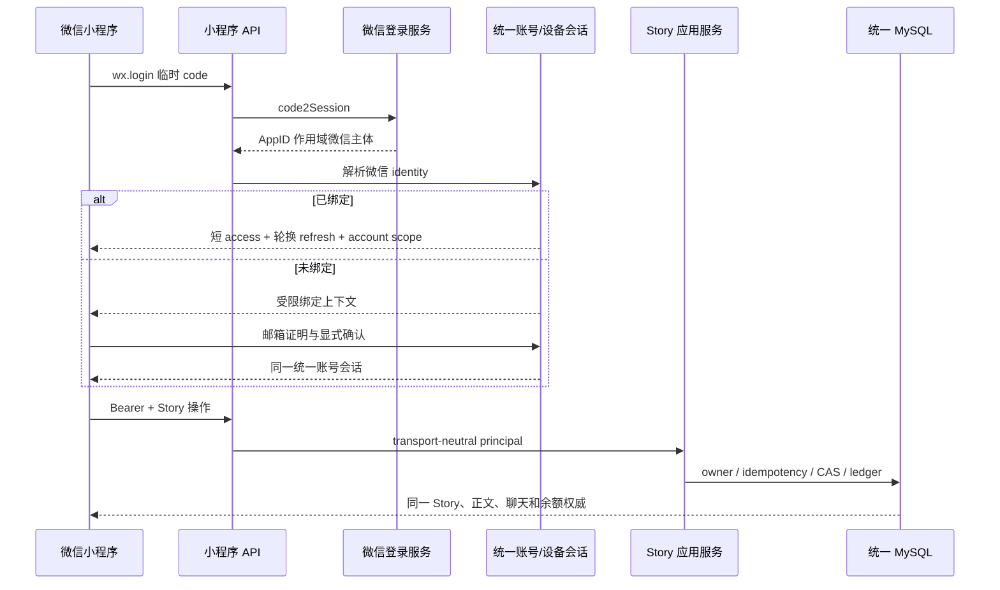
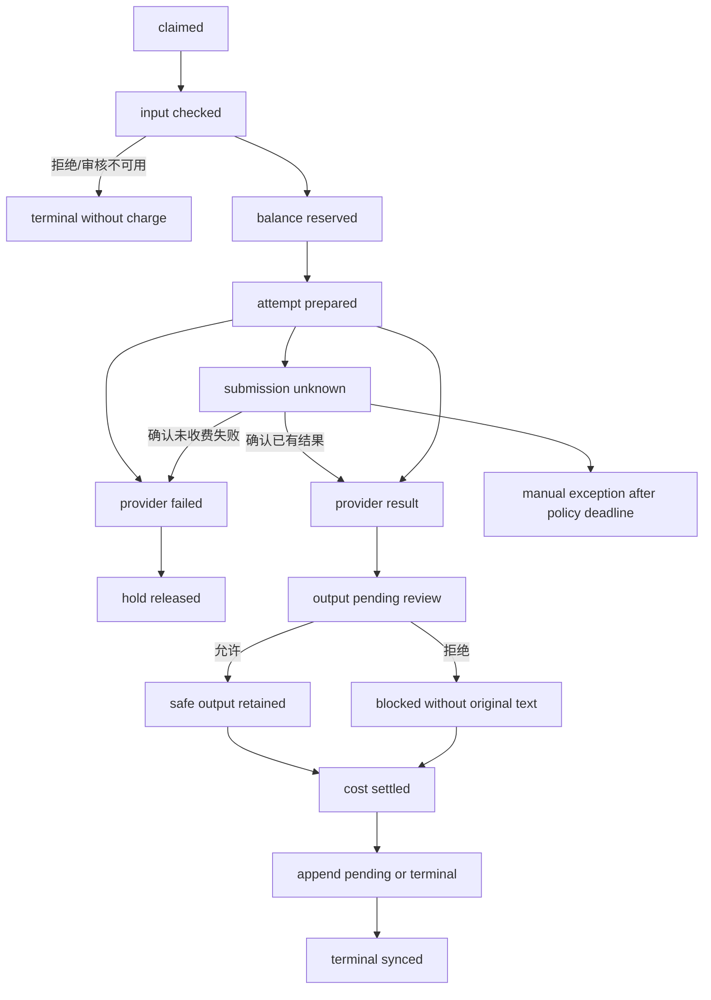
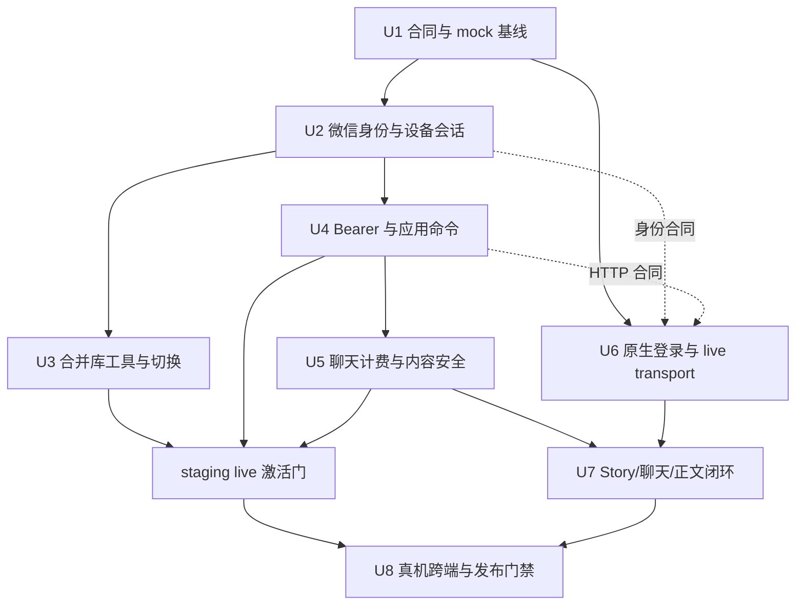
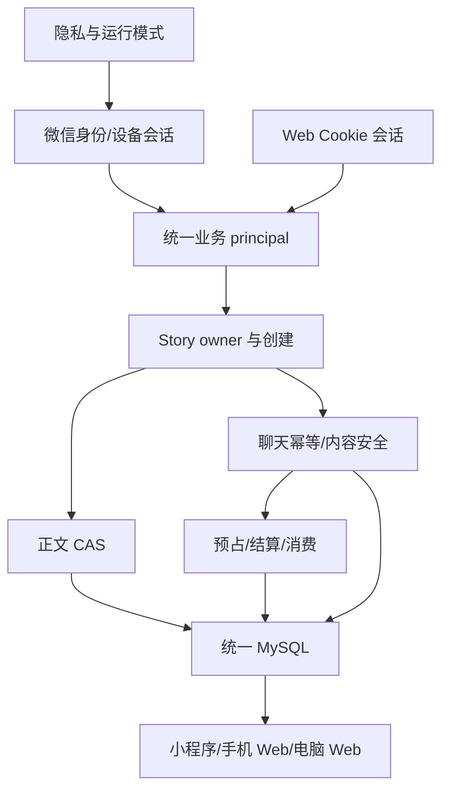

# “聊会儿”微信原生小程序统一账号与跨端故事工作区计划

## Summary

在已合入的原生小程序 mock 骨架、统一邮箱账号、移动聊天整轮持久化和正文 CAS 之上，新增微信身份绑定、可撤销设备会话、小程序专用服务端边界、真实算力结算及 Story 创建闭环。真实数据仍以同一 MySQL、同一 `userId` 和同一 Story 为权威，并按“数据先收敛、能力后接通、测试号与正式号分层验收”的顺序交付。

---

## Problem Frame

当前主干已经具备移动 Web 跨端合同和一个明显标识为演示数据的小程序壳层，但小程序仍无法进入真实账号、创建 Story 或调用真实服务；测试站数据库也尚未完成三来源合并和恢复演练。若直接把 mock transport 换成网络请求，最容易出现平行账号、跨账号缓存、重复生成／扣费和旧正文覆盖新正文等问题（see origin: `docs/brainstorms/2026-09-02-liaohuier-wechat-miniprogram-requirements.md`）。

---

## Requirements

- R1. 小程序全部使用“聊会儿”名称与个人 Story 创作语境，移除“拾光”、家庭传记、亲属协作和人物纪念文案。
- R2. 新用户可在小程序通过邮箱验证创建统一账号；已有用户可验证并绑定电脑端同一账号，不自动创建平行身份。
- R3. 小程序、手机 Web 和电脑 Web 使用同一 `userId`、MySQL、Story、聊天、正文和余额权威。
- R4. 用户可看见当前账号、退出本设备，并使用现有账号能力设置、修改或找回密码；身份冲突失败关闭。
- R5. Story 列表只显示当前账号拥有的 Story，并按服务端最近更新时间展示最近编辑项。
- R6. 用户可用最少信息创建空 Story，创建操作必须幂等，且不要求分镜、素材、平台或视频配置。
- R7. 切换 Story 前必须处理未保存正文，覆盖“保存并切换、放弃并切换、取消”三条路径。
- R8. 小程序加载当前 Story 已持久化的“聊聊”历史，不建立小程序专属会话。
- R9. 用户消息和回复作为同一轮持久化；生成、追加或网络结果未知时按同一操作查询或补写，不重新调用模型。
- R10. 手机与电脑保存后的聊天互相可见；第一阶段不承诺两个已打开页面实时同步输入过程。
- R11. 正文界面明确区分加载、未保存、保存中、已保存、失败、结果未知和冲突状态。
- R12. 正文成功保存到两端共同读取的权威版本，不能仅停留在微信本地缓存。
- R13. 基于旧 revision 的保存不得覆盖新正文；冲突时本机与服务端两份文本均可查看和复制。
- R14. 账号、Story、“聊聊”和正文在常见窄屏、软键盘、安全区域、系统大字号与中文输入法下可操作。
- R15. 余额和每笔已结算费用来自服务端 append-only 账本；余额不足只阻止新的付费聊天，不阻止阅读或正文编辑保存。
- R16. mock、测试 AppID、企业体验版和正式发布四级证据严格分层；真实全链路验收前保留可见演示／测试标识。
- TR1（用户已确认的计划约束）. 小程序会话采用短期 access token 与服务端可撤销、单次轮换的 refresh token；密码变更、找回、已确认退出或撤销后旧凭据不可继续访问。离线退出先锁定本机，服务端撤销完成前不宣称安全退出。
- TR2（用户已确认的计划约束）. 私人、仅本人可见的正文允许正常保存；付费 AI 输入／输出及未来公开分享必须在服务端执行内容安全策略，审核不可绕过或由客户端冒充。

**Origin actors:** A1（创作者）、A2（“聊会儿”微信小程序）、A3（“聊聊”）、A4（电脑 Web 工作区）

**Origin flows:** F1（创建或进入账号）、F2（查看／继续／新建 Story）、F3（跨端继续“聊聊”）、F4（正文保存与跨端冲突）

**Origin acceptance examples:** AE1–AE9；各实施单元在测试场景中继续引用。

---

## Scope Boundaries

- 不包含“拾光”家庭人物传记、亲属投稿、老人事实确认、家族房间或纪念册能力；`family-biography-wechat-text` 功能卡保持独立。
- 不包含图片生成／编辑、素材库、分镜、时间线、视频、数字人或完整桌面工作台。
- 不包含多人实时协作、光标同步、CRDT 或离线写队列；第一阶段依赖网络。
- 不在本计划接入微信支付、支付宝、银行卡、订阅、退款或自动充值；只显示余额、逐笔费用和“联系负责人续充”。
- 不把测试号 openid、会话、Secret 或测试数据迁移成企业正式号身份。
- 不扩大现有 Web tRPC、Cookie、Origin／CSRF 或媒体接口的鉴权范围；小程序只获得独立、窄化的 Bearer API。
- 不自动认领无邮箱的 legacy user 11 或本地 Guest 48，也不把未验证 QQ 账号激活为当前用户。
- 不在本计划中修改 Story 所有权模型，Project 仍不是当前 Story 的替代身份。

### Deferred to Follow-Up Work

- 充值和订阅：在支付资质、退款和消费者告知单独规划后接入。
- 公开分享／发布：届时复用本计划的服务端内容安全门禁，但不在小程序第一阶段开放。
- 单独管理设备会话的高级界面：第一阶段提供退出本设备与密码变更撤销；完整设备列表可后续补充。

---

## Context & Research

### Relevant Code and Patterns

- `miniprogram/src/core/workspaceState.ts`、`documentState.ts`、`conversationState.ts` 已实现纯 TypeScript 的 Story 作用域、正文冲突和聊天 unknown 状态，可继续扩展而不把 `wx.*` 带进领域层。
- `miniprogram/src/services/transport.ts` 是 mock／live 适配边界；当前缺少身份、Story 创建、余额刷新和逐笔费用合同。
- `server/services/storyConversation.ts` 与 `server/routers/promptLineage.ts` 已实现 `userId + storyId + clientTurnId + requestHash` 的整轮幂等和状态查询。
- `server/services/publishingPersistence.ts` 与 `server/routers/publishingDraft.ts` 已实现正文 `baseBodyRevision` CAS 和冲突返回。
- `server/services/computeLedger.ts`、`computeBilling.ts` 与 `server/db.ts` 已具备预占、结算、释放和 append-only 账本原语，但生产聊天路径和用户余额 API 尚未接线。
- `server/_core/sdk.ts` 与 `context.ts` 目前只从 Cookie 解析 Web 会话；小程序 Bearer principal 尚不存在。
- `server/services/accountIdentity.ts` 与 `drizzle/schema.ts` 的泛型 identity 模型可承载微信身份，但当前只实现邮箱解析与登记。
- `server/routers/storyAgent.ts` 已有 owned Story 列表／读取／创建原语；小程序应通过窄 application facade 复用，而不直接依赖桌面大返回体。

### Institutional Learnings

- `docs/solutions/2026-06-13-多worktree环境数据分裂收敛.md`：只有主仓可运行 3000；worktree 不得启动服务或写 `.webdev`。迁移前必须停写、备份、重取哈希并检查旧进程。
- `docs/solutions/2026-06-13-故事为唯一单位-镜头按storyId.md`：所有读取和写入以服务端 principal 派生的 `userId + storyId` 校验，不能以 latest Story、Project、openid 或客户端 userId 猜归属。
- `docs/qa/account-migration-conflict-report.md`：`mountionzeng@gmail.com` 的旧库和 staging 记录映射到一个新统一账号并保留双方项目；legacy user 11 与 Guest 48 独立待认领；两个 QQ 账号独立迁入。
- `docs/qa/account-migration-cutover-rollback-plan.md`：新库从完整 journal 建立；旧 OTP／旧 access session 不迁移；切换后若有新写入，回滚前必须先 dump 并暂停裁决，不能只改 `DATABASE_URL`。

### External References

- [微信 `wx.login`](https://developers.weixin.qq.com/miniprogram/dev/api/open-api/login/wx.login.html) 与 [`code2Session`](https://developers.weixin.qq.com/miniprogram/dev/OpenApiDoc/user-login/code2Session.html)：短期 code 只交自家服务端，AppSecret 和 `session_key` 不返回客户端。
- [微信网络能力](https://developers.weixin.qq.com/miniprogram/dev/framework/ability/network.html)：真机请求使用后台登记的 HTTPS 合法域名，开发工具跳过域名校验不能作为发布证据。
- [微信隐私授权](https://developers.weixin.qq.com/miniprogram/dev/framework/user-privacy/PrivacyAuthorize.html)：用户拒绝、撤回或隐私版本变化时不得先调用身份与业务网络。
- [微信文本内容安全](https://developers.weixin.qq.com/miniprogram/dev/OpenApiDoc/sec-center/sec-check/msgSecCheck.html)：由服务端处理 AI 输入／输出，客户端不持有调用凭据。
- [微信发布流程](https://developers.weixin.qq.com/miniprogram/dev/framework/quickstart/release.html)：开发版、体验版、审核和正式发布是不同证据层。

---

## Key Technical Decisions

| Decision | Rationale |
|---|---|
| 保留原生 TypeScript + 纯状态机 + transport 架构 | 已有 144 项小程序测试和运行时隔离门禁；继续扩展比换成 Taro／uni-app 风险更低，也不引入第二套状态权威。 |
| 新增版本化的小程序 JSON route family，而不是放宽全部 tRPC | 原生客户端与浏览器 CSRF 模型不同；独立边界可只接受 Bearer，同时保持 Web Cookie、Origin 和现有路由行为不变。 |
| Cookie 与 Bearer 最终解析成同一种业务 principal | 两个客户端共享 owner、聊天幂等、正文 CAS 与账本应用服务，避免把规则复制进不同 router。 |
| 微信 identity 按环境与 AppID 隔离 | 现有 schema 的 provider 枚举保持 `wechat`；subject 使用版本化复合值 `v1:<environment>:<appid>:<openid>`，避免动态扩 enum，同时保证测试／正式 AppID 的同值 openid 不碰撞。 |
| 未绑定微信先取得受限绑定上下文，不自动进入业务账号 | `wx.login` 只能证明一个微信主体，不能证明历史 Story 属于谁；先验证邮箱、展示脱敏账号摘要、再次确认，才能原子绑定。 |
| 一个微信 subject 只归属一个账号；一个账号可有多个分别验证过的微信 subject | 现有 identity 模型允许一个 userId 挂多条身份；每个微信主体仍必须独立完成邮箱证明，不能靠账号侧唯一索引偶然决定产品规则。第一阶段不提供无验证的“添加微信”入口。 |
| access token 默认约 15 分钟；refresh token 默认 30 天并按 family 单次轮换 | 短 access 降低泄漏窗口，持久 refresh 支撑“随时打开继续写”；服务端只存高熵 refresh 摘要，并以 family／generation 原子轮换、设备撤销、绝对过期和 `sessionVersion` 约束。具体上限配置化但生产不得关闭轮换。 |
| refresh token 只经 `storage.ts` 适配器持久化，access token 只驻留内存 | 微信存储不是硬件安全区，因此持久凭据必须可撤销、轮换且不进入日志；所有账号切换同时更换不透明 recovery scope。 |
| wire contract 以仓库内纯 JSON schema 为单一权威并确定性生成两端类型／validator | `miniprogram/tsconfig.json` 刻意不包含 `shared/**`，不能假设开发者工具会打包仓库外类型；提交生成物并以 `--check`／坏样本测试拦截漂移。 |
| Story 创建使用稳定 client operation id | 超时或响应丢失后重复同一操作只得到同一 Story；禁止因用户再次点击产生重复空 Story。 |
| 聊天 generation、append 与 billing 共用稳定操作身份 | unknown 只查询状态；生成完成但 append 未完成只补 append；预占和结算不会因客户端重试重复发生。 |
| 私人正文保存不依赖内容安全服务可用性 | 用户应能保存仅本人可见的文字；服务端仍校验权限、长度和 CAS。AI 输入在预占／供应商调用前审核，AI 输出在持久化／呈现前审核，未来公开分享另设强制审核。 |
| 余额与本轮费用只认服务端 settled ledger | 客户端金额只用于显示，不能授权调用或推导实际扣款；余额不足也不影响无费用的正文保存。 |
| live 配置不完整时失败关闭，不回退 mock | mock 始终显眼且只能显式选择；测试／正式包不得在身份或后端错误时展示模拟 Story、余额或回答。 |

---

## Open Questions

### Resolved During Planning

- **会话续期：** 采用短 access token + 服务端可撤销、单次轮换 refresh token；密码变更／找回继续用 `sessionVersion` 撤销旧凭据。
- **私人正文内容安全：** 私人正文可正常保存；AI 输入／输出及未来公开分享执行服务端审核。
- **测试号转正式号：** 不迁移测试 openid；企业 AppID 首次登录重新验证同一邮箱，再绑定正式 provider identity。
- **新 Story 最小输入：** 只要求标题；空白或纯空格沿用现有“未命名”规则，创建后立即取得可编辑正文权威。
- **账号迁移：** `mountionzeng@gmail.com` 两来源合并并保留双方项目；user 11、Guest 48 和两个 QQ 账号按现有人工裁决独立处理。
- **微信 identity 基数：** 同一 provider subject 只能归属一个账号；多个微信主体只有在各自完成同一邮箱证明后才能映射同一业务账号。
- **新 Story 正文平台：** 第一阶段复用 `shared/publishingDraft.ts` 的内部默认平台初始化可编辑正文，UI 不要求用户选平台；另建 platform-neutral 正文模型属于独立架构变更。

### Deferred to Implementation

- **企业 AppID、Secret 与合法域名的最终值：** 属于外部审批和部署状态；实现使用显式环境矩阵，联调前由用户通过秘密配置提供，不写入仓库或聊天。
- **`msgSecCheck` 当前错误码、同步／异步行为与测试号可用范围：** 在实现和提审前重新核对官方文档，并用服务端适配器契约测试锁定；不影响已确认的产品语义。
- **默认 refresh 闲置期限：** 在 30 天绝对上限内根据真实使用频率与风险数据确定；family 轮换、服务端撤销和 sessionVersion 校验不可取消。

---

## High-Level Technical Design

> *This illustrates the intended approach and is directional guidance for review, not implementation specification. The implementing agent should treat it as context, not code to reproduce.*

运行时状态至少区分 `privacy → runtime/config → wx-auth → account-link → authenticated → stories → workspace`。任何层失败都不得带着上一账号的 Story、余额或草稿进入下一层。

付费聊天同时跨越内容安全、供应商和账本，使用持久操作状态而不是依赖一次 HTTP 请求寿命：

提交未知时不能因 TTL 到期自动释放或重提；只有供应商明确未收费失败才释放。成本可核验后即幂等结算，输出未审核通过前不进入聊天投影、缓存、状态响应或普通日志。

---

## Implementation Units

实线表示代码／领域依赖，虚线表示客户端可以先按 fake contract 开发。`staging live 激活门` 还要求 U2／U4 readiness、U3 切库后的 Web smoke 和外部微信配置全部通过；它不是让 U3 阻塞所有本地实现的串行依赖。

### U1. 冻结小程序合同、运行模式与“聊会儿”基线

**Goal:** 把已合入的 mock 骨架重定向为“聊会儿”产品语境，并先冻结身份、Story 创建、聊天状态、正文 CAS、余额和费用的 transport 语义，避免服务端与客户端并行实现时漂移。

**Requirements:** R1, R5–R7, R9, R11, R15–R16；F2–F4；AE1, AE3–AE9。

**Dependencies:** 执行前运行环境盘点，在 `docs/handoff/SESSION-BOARD.md` 登记；确认 `codex/frame-edit-session` 不占用本单元文件。规划阶段不修改协调板。

**Files:**
- Create: `shared/miniprogramWorkspace.schema.json`
- Create: `shared/miniprogramWorkspace.ts`
- Create: `miniprogram/src/contracts/workspace.ts`
- Create: `scripts/generate-miniprogram-contract.ts`
- Create: `scripts/generate-miniprogram-contract.test.ts`
- Modify: `miniprogram/src/core/types.ts`
- Modify: `miniprogram/src/core/runtimeMode.ts`
- Modify: `miniprogram/src/services/transport.ts`
- Modify: `miniprogram/src/core/privacyConsentState.ts`
- Modify: `miniprogram/src/pages/start/index.wxml`
- Modify: `miniprogram/src/pages/workspace/index.wxml`
- Modify: `miniprogram/README.md`
- Modify: `miniprogram/tests/runtimeMode.test.ts`
- Modify: `miniprogram/tests/workspacePresentation.test.ts`
- Modify: `miniprogram/tests/projectSafety.test.ts`
- Create: `miniprogram/tests/transportContract.test.ts`

**Approach:**
- 建立版本化、金额单位明确且只含 JSON primitives 的 wire schema：账号摘要、Story summary/create operation、turn submit/status/receipt、正文 read/save/conflict、balance/recent charge；客户端输入不含可信 `userId`、openid 或价格。
- 从同一 schema 确定性生成服务端类型与可由微信开发者工具打包的小程序类型／运行时 validator；生成物提交仓库，检查模式在内容漂移时失败，不让小程序直接 import `shared/**`。
- 将 mock、测试 live、正式 live 作为显式运行模式；缺 API origin、AppID 或构建标志时留在不可登录／明显 mock 状态，绝不静默切换。
- 移除所有“拾光”和家庭传记语义；反转旧测试里“禁止创建 Story”的产品限制，但暂不在本单元发真实网络请求。
- 固定网络错误词汇：明确失败、结果未知、未授权、身份冲突、目标不存在、正文冲突、余额不足与内容拒绝不得压成同一种失败。

**Execution note:** characterization-first；先锁住可复用的 runtime isolation、Secret scan、unknown 和 CAS 行为，再修改品牌和合同断言。

**Patterns to follow:**
- `miniprogram/src/services/transport.ts` 的 `TransportResult` 判别联合。
- `shared/promptLineage.ts` 的 request hash 和 `shared/publishingDraft.ts` 的版本／平台类型。

**Test scenarios:**
- Happy path：mock 模式展示“聊会儿”、演示标识、Story 创建能力和现有双视图，不出现“拾光”文案（AE1, AE9）。
- Edge case：live 配置缺一项时停在可解释的配置错误，transport 不回退模拟数据。
- Error path：客户端 DTO 试图携带 `userId`、openid、浮点金额或无版本正文请求时在合同边界被拒绝。
- Contract parity：服务端序列化的有效 fixture 能通过小程序 validator；未知字段／错版本／错金额单位等坏样本在两端得到一致拒绝。
- Security：tracked／untracked 候选文件扫描不含 AppSecret、`session_key`、真实 bearer／refresh token 或私钥。

**Verification:**
- mock 技术证据继续有效，但功能卡仍为 `planned`；合同生成检查、小程序独立 TypeScript 与 Vitest 门禁通过。

### U2. 建立微信 identity、绑定挑战与可撤销设备会话

**Goal:** 在服务端实现 `wx.login` code 交换、AppID 作用域 identity、受限绑定上下文以及 access／refresh 生命周期，不让微信主体未经邮箱证明直接拥有历史账号。

**Requirements:** R2–R4, TR1；F1；AE2。

**Dependencies:** U1；可用 mock adapter 即可开发，任何真实启用依赖 U3 的统一数据库与外部 AppID 配置。

**Files:**
- Modify: `drizzle/schema.ts`
- Create: `drizzle/migrations/0017_wechat_workspace_identity.sql`
- Modify: `drizzle/meta/_journal.json`
- Create: `drizzle/meta/0017_snapshot.json`
- Modify: `server/db.ts`
- Modify: `server/_core/env.ts`
- Modify: `server/_core/productionReadiness.ts`
- Create: `server/services/wechatLogin.ts`
- Create: `server/services/wechatLogin.test.ts`
- Create: `server/services/accountDeviceSession.ts`
- Create: `server/services/accountDeviceSession.test.ts`
- Modify: `server/services/accountIdentity.ts`
- Modify: `server/services/accountIdentity.test.ts`
- Modify: `server/_core/sdk.ts`
- Modify: `server/_core/sdk.session.test.ts`
- Create: `server/integration/wechatAccount.mysql.test.ts`
- Modify: `server/integration/migrationBaseline.mysql.test.ts`

**Approach:**
- 保持 schema 的 provider=`wechat`，将 `code2Session` 返回的 openid 编码为长度受限的版本化 subject `v1:<environment>:<appid>:<openid>`；只有该规范化函数能构造或解析 subject，不依赖客户端 openid、AppID header 或 unionid 猜测。
- 微信 code 单次、短时交换；上游超时视为未完成，客户端重新 `wx.login` 取得新 code。重复成功登录按 identity 幂等解析，不重复建用户。
- 未绑定 identity 只得到短时、一次性绑定上下文，无权读取 Story、余额或正文；绑定 challenge 同时绑定微信 subject、目标邮箱 identity／user、OTP challenge、账号摘要 nonce、用途和过期时间。邮箱 OTP 验证后先返回脱敏账号摘要和 Story 数，再经用户确认原子 link。
- 最终确认事务内重新锁定并校验微信 identity、邮箱 identity、目标 user 与 challenge，然后原子消费 challenge 和 link；任何 TOCTOU 变化整笔回滚，不移动 Story／余额或隐式 merge。同一微信 subject 只能归属一个 user；多个微信 subject 只有各自独立完成邮箱证明后才能映射同一 user。
- 新邮箱同样先完成 OTP，再创建唯一统一账号并绑定；密码设置是后续可恢复步骤，不成为绕过邮箱验证的捷径。
- access token 带明确 issuer／audience、device session id 和 sessionVersion；refresh token 高熵、只在创建时返回原文，device session 保存 family id、当前摘要、generation、过期和撤销状态。
- refresh 以旧摘要 + generation + 未撤销条件做原子 compare-and-rotate；客户端串行化 refresh。已消费 token 再现视为 reuse 并撤销该 device family；轮换响应丢失时重新 `wx.login`，不允许重放旧 refresh 取回 winner token。只有跨设备／高风险证据才升级为全账号 sessionVersion 撤销。
- 同一 foundational migration 预留绑定 challenge、device session 和 Story creation receipt 的唯一约束；receipt 由 U4 使用 `(userId, clientOperationId)` 与 request hash 防止重复／异载荷重放。
- 本设备退出撤销该 device session；改密／找回继续递增 sessionVersion，使 Web 与小程序旧凭据按既定语义失效。
- 生产缺微信 AppID／AppSecret、token secret 或错误 API origin 时 readiness 失败关闭；Secret、session_key 和 OTP 不写普通日志。

**Execution note:** test-first；先用假的微信 adapter、可控时钟和并发测试定义交换、绑定、轮换和撤销，再触达 schema 与 auth 热区。

**Patterns to follow:**
- `server/services/accountIdentity.ts` 的 OTP 防枚举、HMAC 摘要、一次性消费和冲突失败关闭。
- `server/_core/sdk.ts` 的 sessionVersion 兼容门禁。
- `server/services/computeLedger.ts` 的短事务与稳定幂等键模式。

**Test scenarios:**
- Happy path：已绑定微信重复登录解析为同一 `userId`；access 过期后使用 refresh 单次轮换并继续同一账号。
- Happy path：已有 Web 邮箱账号完成 OTP、查看摘要并确认后绑定，原 Story／余额和 Web 会话不变（AE2）。
- Happy path：未知邮箱完成 OTP 后只创建一个统一账号，可稍后设置密码。
- Edge case：code2Session 成功但客户端未收到 token，重新登录仍解析同一 identity，不多建账号。
- Edge case：测试 AppID 和企业 AppID 得到不同 provider identity；企业号必须重新验证邮箱才能进入同一业务账号。
- Error path：code 为空／过期／重复、错误 AppID／Secret、OTP 跨邮箱或跨用途、绑定挑战过期均失败且零业务授权。
- Concurrency：同一 challenge 双击、同一微信抢绑两个邮箱、确认后邮箱归属变化或事务中途异常得到确定结果且零半绑定；两个分别验证过的微信 subject 可映射同一 user，但每个 subject 永远只有一个 owner。
- Concurrency：双进程对同一 refresh 轮换仅一个拿到新凭据；旧 token 再现撤销该 family，其他设备不被无依据登出。
- Security：被轮换 refresh、撤销 device session／family、旧 sessionVersion、错误 realm／audience／issuer 和伪造 openid 均被拒绝；日志不出现规范化前 openid、refresh 原文或摘要。
- Recovery：refresh 轮换响应丢失后重新 `wx.login` 恢复同一 userId，无新用户、新绑定或平行 device family。
- Integration：fresh MySQL 应用全部 journal 后，identity／device session 唯一约束和并发轮换行为成立。

**Verification:**
- 服务端能把微信主体安全解析为统一账号 principal；客户端和日志均看不到 AppSecret 或 `session_key`。

### U3. 建立完整合并库并完成统一账号切换前置

**Goal:** 把旧 MySQL、当前 staging 和本地历史数据导入从完整迁移链建立的新库，完成恢复演练，并先用手机 Web／电脑 Web 证明同一账号和数据权威。

**Requirements:** R3, R12, R15–R16；F1–F4；AE2, AE5–AE8。

**Dependencies:** U2 的 additive migration；盘点／导入工具可与 U4–U7 并行，最终目标库必须应用切换时的完整 journal。真实建库、备份、停写、导入和切换需用户另行批准；staging live 激活不得绕过本单元。

**Files:**
- Modify: `scripts/import-local-persist-to-mysql.ts`
- Modify: `scripts/inventory-account-migration.ts`
- Create: `scripts/import-prompt-lineage-sidecar.ts`
- Create: `scripts/import-edit-snapshots-sidecar.ts`
- Create: `scripts/import-account-data.ts`
- Create: `scripts/import-account-data.test.ts`
- Create: `scripts/verify-account-migration.ts`
- Create: `scripts/verify-account-migration.test.ts`
- Create: `server/integration/accountDataMigration.mysql.test.ts`
- Modify: `docs/qa/account-migration-conflict-report.md`
- Modify: `docs/qa/account-migration-cutover-rollback-plan.md`
- Create: `docs/qa/2026-09-03-unified-account-database-acceptance.md`
- Modify: `docs/environment-guide.md`
- Modify: `docs/aliyun-deploy-runbook.md`

**Approach:**
- 为每个来源记录 snapshot id、采集开始／结束时间、文件 SHA 或一致性事务／dump marker；停止主仓唯一 dev server 后一次性复制 `local-persist.json` 及全部 sidecar，远端在同一冻结窗口采集。三来源重新备份并重取表计数、业务列哈希、owner、外键和 migration ledger；历史观察哈希不作为导入依据。
- 新库显式使用 `utf8mb4_unicode_ci`，从当前完整 journal 从零建立，不在残缺 staging 上补标 ledger，也不使用 `db:push`。
- 使用已裁决映射：`mountionzeng@gmail.com` 两来源进入全新统一账号且双方项目都保留；user 11 与 Guest 48 独立待认领；两个 QQ 账号独立迁入、未验证前不自动激活。
- 旧明文 OTP 和旧 access session 显式跳过；每来源／批次保存 receipt，重复导入零新增；所有 ID、FK、Story、正文、聊天、快照和邀请码通过稳定映射。
- 本地三件套分别建立可执行转换：主 `local-persist.json`、`prompt-lineage-local.json` 和 `edit-snapshots-local.json`。sidecar 明确 conversation／turn／message／reference 与 edit snapshot 的目标表、旧 ID→新 ID 映射、依赖顺序、去重键和独立 receipt；无法归属的记录进入冲突报告，不因主 Story 已导入就默认为成功。
- 导入前再次断言所有来源尚无正式 ledger／hold；一旦已产生消费历史，账号 merge 自动 No-Go 并重新裁决，不重写 append-only 财务历史。
- 从 schema 生成“全部可写表”的 forward-write manifest，覆盖 Story、正文版本、聊天 turn、identity／device session、gift／invite、hold／ledger／receipt，而不是手写少数表名。
- 切换前把目标库恢复到临时实例并核对完整关系，备份采用最小权限、加密、校验和与明确保留期。目标库在激活前保持不可写。
- 兼容顺序固定为：先部署可读旧／新 schema 且 mini live flag 关闭的 expand-compatible app；建立并验证新库；冻结写入并应用最终 delta／hash；切换数据库；拒绝或撤销全部切换前 Cookie、Bearer 和 refresh；用邮箱重新登录做 Web smoke；最后才允许 staging live gate 打开微信绑定和小程序业务 API。
- 若切换后产生 forward writes，回滚先关闭 mini 写入、从 manifest 生成统计并 dump 新库，再暂停让用户裁决；两个方向均撤销会话并核对邀请码，不能只改连接串。

**Execution note:** characterization-first + dry-run-first；任何来源哈希变化、歧义映射、孤儿 FK 或目标库非预期非空都停止，不自动修复。

**Patterns to follow:**
- `scripts/inventory-account-migration.ts` 的只读盘点和禁止自动映射返回类型。
- `docs/qa/account-migration-cutover-rollback-plan.md` 的 No-Go 与 rollback-safe point。
- `scripts/merge-local-persist.ts` 的稳定 ID 重编号和内容去重原则。

**Test scenarios:**
- Happy path：三来源按批准映射导入，新统一账号保留双方项目，计数／哈希／owner／FK 一致。
- Sidecar fidelity：包含多 Story 历史聊天、message reference 和项目 edit snapshot 的真实形状 fixture 按顺序导入；恢复后通过业务 API 验证对话顺序、引用关系、快照 owner，而不只比较文件 hash。
- Idempotency：同一来源和批次重复导入，receipt 命中且用户、Story、邀请码和账本零新增。
- Edge case：相同数字 ID 不同内容、来源变化、未知 owner、近似邮箱或目标已有无 receipt 数据时失败关闭。
- Snapshot consistency：在远端事务或任一 sidecar 采集期间注入写入，snapshot marker／hash 不一致使 dry-run 失败。
- Security：另一账号猜测 Story id、正文 version 或账本 id 均无法读取。
- Recovery：恢复库除计数／哈希／FK 外，还验证 conversation→Story owner、publishing version/revision、identity→user 和 invite／ledger／hold 约束；有 forward writes 时预检能识别每类可写表并先保存新库 dump。
- Cross-device：`mountionzeng@gmail.com` 通过手机 Web 与电脑 Web 进入同一 userId，双方修改保存后互相可见。
- Session cutover：旧 Cookie、旧 refresh 和旧测试 token 在切库后全部失败；重新邮箱登录进入新统一 userId，任一 readiness／smoke 失败都不能打开下一阶段 flag。

**Verification:**
- 新库与完整 migration journal 一致，迁移可重跑、可恢复、可审计；`ACCOUNT_AUTO_IDENTITY_RESOLUTION` 继续关闭直到人工映射和真实登录证据齐全。

### U4. 增加独立 Bearer principal 与小程序窄 API

**Goal:** 让原生小程序通过版本化 JSON API 访问账号、owned Story、聊天、正文和余额，同时复用既有应用服务且不放宽 Web 鉴权。

**Requirements:** R2–R13, R15, TR1；F1–F4；AE2–AE8。

**Dependencies:** U1–U2；实现可先使用一次性 MySQL，staging live 开启依赖 U3。

**Files:**
- Create: `server/_core/miniprogramAuth.ts`
- Create: `server/_core/miniprogramAuth.test.ts`
- Create: `server/_core/miniprogramRoutes.ts`
- Create: `server/_core/miniprogramRoutes.test.ts`
- Modify: `server/_core/index.ts`
- Create: `server/services/mobileWorkspace.ts`
- Create: `server/services/mobileWorkspace.test.ts`
- Modify: `server/services/accountIdentity.ts`
- Modify: `server/services/storyConversation.ts`
- Modify: `server/services/publishingPersistence.ts`
- Modify: `server/db.ts`
- Modify: `shared/miniprogramWorkspace.ts`
- Modify: `server/routers/storyAgent.ts`
- Modify: `server/routers.storyAgent.test.ts`
- Modify: `server/routers/promptLineage.ts`
- Modify: `server/routers.storyConversation.test.ts`
- Modify: `server/routers/publishingDraft.ts`
- Modify: `server/routers.publishingDraft.test.ts`
- Create: `server/integration/miniprogramWorkspace.mysql.test.ts`

**Approach:**
- 小程序 route mount 在 HTTPS／安全头之后，以精确前缀独立处理 Bearer、请求大小、超时和限流；不依赖 Cookie、Origin、Referer 或客户端 AppID header 鉴权。
- principal 只由经验证的 access token 和当前 device session／sessionVersion 得出；所有业务端点从 principal 取得 userId，客户端合同没有 userId。
- 提供窄合同：当前账号／退出／刷新、微信绑定、owned Story list/create/open、conversation list/submit/status、body read/save、balance/recent settled charges。
- transport-neutral `mobileWorkspace` commands 作为 Story、turn、body 与 balance 的唯一应用编排；Web tRPC 与小程序 JSON route 都只做各自鉴权、输入解析和错误映射，随后调用同一 command，避免只给小程序接计费／审核。
- Story create 使用专用 creation receipt，以 `(userId, clientOperationId)` 唯一并保存 request hash、storyId 和 terminal status。同一聚合状态机完成 Story、prompt lineage、内部默认平台的 publishing version／draft／`bodyRevision=1` 初始化，最后标记 complete；任一步中断可按 receipt 补偿或续跑，不把“列表可见但正文打不开”的半 Story当成功。
- 同一 operation + 同一 payload 返回原 Story；同 operation + 不同 payload 明确冲突。用户不选择发布平台，服务端仅为兼容现有正文模型使用 `DEFAULT_PUBLISHING_PLATFORM`，UI 不暴露平台设置。
- 聊天 submit、status 和 append 继续使用现有 requestHash、turn claim 和 Story owner；正文继续使用 version/platform/body revision CAS。U5 的 billing／内容安全进入同一 submit command，不在 Web 和小程序 router 各接一次。
- 浏览器 `/api/trpc`、Cookie 和 Origin 行为保持原样；两类 transport 只在应用服务层汇合。

**Execution note:** characterization-first；先锁定 Web Cookie／Origin、Guest 开发和现有 tRPC 行为，再挂小程序 route family。

**Patterns to follow:**
- `server/_core/oauth.account.test.ts` 的 HTTP characterization。
- `server/services/storyConversation.mobile.test.ts` 与 `server/services/publishingPersistence.test.ts` 的领域合同。
- `server/routers/_storyShared.ts` 的 owner 失败关闭。

**Test scenarios:**
- Happy path：Bearer principal 只列本人 Story，可创建、打开、读聊天／正文／余额；同一服务结果经 Web 与小程序 transport 保持语义一致。
- Edge case：Story 创建响应丢失后同 operation 重试只得到一条 Story（AE3）。
- Crash recovery：分别在 Story、prompt lineage、publishing version／draft 与 receipt 完成边界中断，重试后得到一个完整可打开 Story；不会留下正文不可用的列表项。
- Idempotency：同 key 同 payload replay 返回相同 storyId，同 key 异 payload 返回冲突。
- Error path：缺／坏／过期 Bearer、Cookie-only、错误 audience、Guest 模式或已撤销 session 均不能访问小程序业务 route。
- Security：客户端伪造 userId、openid、AppID header、价格或他人 Story id 无效，且响应不泄漏资源是否存在。
- Regression：小程序 route 上线前后，Web tRPC Cookie + Origin／CSRF 测试结果不变。
- Transport parity：Cookie 与 Bearer 对同一 application command 得到相同 owner、幂等、CAS 与 billing 语义，同时保留各自认证错误模型。
- Integration：真实 MySQL 中两账号 Story、正文、turn 和账本隔离；新 Story 立即具有可编辑正文版本。

**Verification:**
- 原生客户端只需实现 transport，不再复制 owner、幂等、CAS 或账本规则；Web 安全边界无回归。

### U5. 把文字聊天接入内容安全、预占、结算和费用回执

**Goal:** 让每轮真实“聊聊”在服务端完成内容安全、余额预占、供应商调用、持久化和实际费用结算，并在任何重试／unknown 路径下最多生成和扣费一次。

**Requirements:** R8–R10, R15, TR2；F3；AE5, AE8。

**Dependencies:** U4；真实内容安全联调依赖测试 AppID／access token，领域与 adapter 测试可并行完成。

**Files:**
- Modify: `drizzle/schema.ts`
- Create: `drizzle/migrations/0018_story_conversation_billing_attempts.sql`
- Modify: `drizzle/meta/_journal.json`
- Create: `drizzle/meta/0018_snapshot.json`
- Modify: `server/services/storyConversation.ts`
- Modify: `server/services/storyConversation.mobile.test.ts`
- Modify: `server/services/computeBilling.ts`
- Modify: `server/services/computeBilling.test.ts`
- Modify: `server/services/computeLedger.ts`
- Modify: `server/services/computeLedger.test.ts`
- Create: `server/services/textContentSafety.ts`
- Create: `server/services/textContentSafety.test.ts`
- Modify: `server/db.ts`
- Modify: `server/routers/promptLineage.ts`
- Modify: `server/routers.storyConversation.test.ts`
- Modify: `shared/miniprogramWorkspace.ts`
- Modify: `server/integration/storyConversation.mysql.test.ts`
- Modify: `server/integration/computeLedger.mysql.test.ts`

**Approach:**
- owner 校验和最终 prompt 组装完成后，在共享 application command 内对实际将发送给模型的最小必要文本执行服务端内容安全；因此正文／历史即使不在当前消息中，也不能绕过审核。拒绝或审核不可用发生在余额预占和供应商调用之前，不调用、不扣费；私人正文 save 不走此门禁。
- 同一 turn operation 先原子预占可用余额，再在事务外调用供应商；实际费用由服务端可核验用量结算，差额释放。
- 输出在写入聊天权威和返回客户端前审核；若供应商已发生可核验成本但输出被拒，按实际成本结算并只返回解释性状态，不记录／展示被拒原文。
- generation、append、账本 operation、供应商 attempt 和 receipt 使用可关联的稳定身份，并按高层状态 `claimed → input_checked → reserved → attempt_prepared → submission_known|submission_unknown → output_pending_review → output_allowed|output_blocked → append_pending|terminal → settled|released|exception` 做版本条件推进。生成成功但 append 失败只补 append；提交状态未知保留 hold 并只查询供应商／operation 状态，不能因 TTL 盲目释放或重提，超期进入人工 exception 告警。
- `clientTurnId` 表示逻辑轮次；同一 attempt 的 unknown／append 恢复保持相同 operation。只有服务端已记录明确 terminal failure 且用户显式选择“重新生成”时，才增加 attempt generation，创建新的 durable attempt／billing operation 并关联原 logical turn 与 request hash；原 released／settled operation 永不重开。
- 成本已可核验时即幂等 settle，即使输出被拒；只有供应商明确未收费失败才 release。output 审核超时或失败时不展示／落聊天权威，只保留不含原文的最小审计与 receipt 供 reconciliation。
- balance API 区分可用、账面、预占；本轮回执返回实际已结算金额和结算后可用余额，最近消费按 settled entries 查询。
- 余额不足由服务端原子 reserve 决定并返回 required／available；仍允许列表、历史、正文 read/save 和退出。

**Execution note:** test-first；先覆盖并发、供应商失败、响应丢失、输出拒绝和 reconciliation，再接真实聊天入口。

**Patterns to follow:**
- `server/services/computeLedger.ts` 的 reserve／settle／release 幂等原语。
- `server/services/storyConversation.ts` 的 durable turn claim 与 status lookup。
- `server/services/computeReconciliation.ts` 的未知操作收敛模式。

**Test scenarios:**
- Happy path：聊天生成、整轮落库和实际费用结算一次，刷新后回执和余额与账本一致（AE5）。
- Edge case：余额恰好等于预占上限时可提交；实际费低于预占时差额释放。
- Concurrency：两设备同时争抢仅够一轮的余额，恰一轮获得预占，另一轮不足且正文仍可保存（AE8）。
- Unknown：提交响应丢失后 status 找回同一回答和同一 receipt，不再生成或扣费。
- Partial failure：生成完成但 append 失败时只补写；供应商明确失败释放预占；结算未知由 reconciliation 收敛。
- Explicit retry：terminal failure 后用户重试产生同 logical turn 下的新 attempt／operation；旧 released 账本保持终态，Web 与 Bearer 都不会把旧 receipt 当作新结果。
- Content safety：输入命中不调用／不扣费；输出命中按可核验成本结算但不把原文写入聊天、缓存或普通日志。
- Content safety parity：违规内容分别从 Web 和 Bearer 提交均为零 reserve／零 provider；违规文本藏在引用正文或历史中仍在最终 prompt 审核被拦截。
- Crash recovery：在 reserve、attempt、submission unknown、output review、settle 和 append 边界逐点中断并重启 reconciliation，最终最多一次 provider submit、一次 append 和一次 settle／release，hold 不泄漏。
- Output isolation：output 审核完成前，list／status／cache／stream 均取不到原文；已收费但被拒时用户只看到解释和实际 receipt。
- Security：客户端报价、余额和 charged amount 被忽略；所有金额使用整数最小单位，账本保持 append-only。
- Integration：真实 MySQL 双进程 claim 与 reserve 竞争下仍最多一次生成、一次结算且余额不为负。
- Integration：同 attempt 双进程竞争最多一次提交；明确失败后的新 attempt 各自最多一次 reserve／settle，逻辑聊天轮次不重复追加用户消息。

**Verification:**
- live 聊天只有在余额、内容安全和计费链路均可用时开放；普通正文编辑与保存不受计费故障阻断。

### U6. 接通原生微信登录、账号绑定与 live transport

**Goal:** 用真实网络 transport 替换 `app.ts` 的硬编码 mock，交付隐私授权、微信登录、邮箱绑定／新建账号、refresh、当前账号和退出本设备流程。

**Requirements:** R1–R4, R14, R16, TR1–TR2；F1；AE1–AE2, AE9。

**Dependencies:** 实现依赖 U1，以及 U2／U4 已冻结的 identity／HTTP contract（可使用 fake）；激活依赖 U3 完成且 staging live gate 通过。

**Files:**
- Create: `miniprogram/src/core/authState.ts`
- Create: `miniprogram/src/services/authSession.ts`
- Create: `miniprogram/src/services/liveTransport.ts`
- Modify: `miniprogram/src/services/storage.ts`
- Modify: `miniprogram/src/app.ts`
- Modify: `miniprogram/src/app.json`
- Create: `miniprogram/src/pages/account/index.ts`
- Create: `miniprogram/src/pages/account/index.json`
- Create: `miniprogram/src/pages/account/index.wxml`
- Create: `miniprogram/src/pages/account/index.wxss`
- Modify: `miniprogram/src/pages/start/index.ts`
- Modify: `miniprogram/src/pages/start/index.wxml`
- Modify: `miniprogram/src/pages/privacy/index.ts`
- Modify: `miniprogram/src/pages/privacy/index.wxml`
- Modify: `miniprogram/src/typings/wechat.d.ts`
- Create: `miniprogram/tests/authState.test.ts`
- Create: `miniprogram/tests/authSession.test.ts`
- Create: `miniprogram/tests/liveTransport.test.ts`
- Modify: `miniprogram/tests/noRealWechatCalls.test.ts`
- Modify: `miniprogram/tests/pageBindings.test.ts`
- Modify: `miniprogram/tests/projectSafety.test.ts`

**Approach:**
- 隐私同意成功后才首次调用 `wx.login` 或业务网络；拒绝、撤回、版本变化或同意存储失败均停留在无网络状态。
- app 启动时先尝试 refresh；`App.onShow` 与请求拦截器共用单一在飞 refresh，避免客户端自我竞争。失败、reuse 或撤销后重新 `wx.login`；轮换响应丢失同样不重放旧 refresh。已绑定微信直接恢复同一 account scope，未绑定进入邮箱 OTP／确认流程。
- refresh 原文只由 `authSession` 经 storage adapter 保存；access 只驻内存。401 立即冻结新的写入／付费动作，保留当前账号作用域的 dirty 正文和 unknown turn，重登后再按权威状态恢复。
- 区分自然会话过期与显式退出／换账号：自然过期只冻结 UI，同一服务端 account scope 重新认证后可恢复 dirty／unknown；显式退出、解绑或选择换账号则先让用户保存、复制或取消，确认后在新账号渲染前清除旧 token、Story／query／balance、draft、turn 和 recovery 原文。
- 在线退出只有服务端幂等撤销 device session 成功后才显示“已安全退出”。请求失败时立即锁定本机业务 UI，清除内容缓存并在隔离区保留最小 pending-revoke 凭据供联网重试；撤销确认前不允许切换到新账号，也不声称旧 refresh 已失效。本地清理失败同样进入 locked-cleanup，禁止渲染任何新账号业务数据。opaque scope 只是隔离键，只有服务端重新认证返回相同 scope 才能授权自然过期恢复。
- runtime 配置明确区分 mock、测试 AppID 和企业 AppID；live transport 配置错误时不创建 guest、不显示模拟数据。
- 密码设置／修改／找回调用现有统一账号服务语义；找回不自动发新业务会话，用户重新认证。

**Execution note:** 状态机 test-first；真实 `wx.*` 只存在 adapter／page 边界，core 测试继续在 Node 中运行。

**Patterns to follow:**
- `miniprogram/src/core/privacyConsentState.ts` 的版本化同意和失败关闭。
- `miniprogram/src/core/recoveryState.ts` 的不透明 account scope 隔离。
- `miniprogram/src/services/storage.ts` 的唯一 `wx` 存储适配边界。

**Test scenarios:**
- Happy path：已绑定用户同意隐私后微信登录并刷新会话，显示当前邮箱摘要且进入同一 Story 列表（AE2）。
- Happy path：未绑定用户选择已有账号或新建账号，完成 OTP 与确认后进入；取消绑定零业务写入。
- Edge case：access 在 dirty 正文或 unknown turn 期间过期，重登同账号后草稿仍在，聊天只查询原 turn。
- Edge case：App 被杀后 refresh 轮换成功；旧 refresh 再次使用被拒并触发重新微信登录。
- Error path：隐私拒绝／撤回／陈旧同意、wx.login 失败、code2Session 超时、绑定冲突和 refresh 网络失败均有明确恢复路径。
- Isolation：账号 A 显式退出或换账号后，storage 中不再含 A 的 Story 摘要、余额、草稿、turn 或 token，B 才可渲染；A 的迟到响应不得重新写回。只有自然过期后重登同一账号才恢复原 scope。
- Cleanup failure：清理被中断或 storage 删除失败时保持 locked-cleanup，B 的 Story／余额页面不能出现。
- Logout failure：断网退出立即隐藏 A 内容但显示“待联网完成安全退出”；服务端 revoke 确认后旧 refresh 失效并清除 pending 凭据，确认前不能进入 B。
- Security：日志、错误提示、storage key 和页面 data 不暴露 AppSecret、session_key、原始 refresh 摘要、openid 或完整邮箱。
- Regression：mock 测试断言真实 `wx.login/request` 为零；live 测试则断言只在隐私同意和显式运行模式下调用。

**Verification:**
- 用户可在小程序安全进入同一统一账号；会话过期、退出和换账号不会丢稿、重调模型或串号。

### U7. 完成 Story 创建／切换、“聊聊”、正文和余额闭环

**Goal:** 把真实账号后的 Story 列表与创建、聊天、正文编辑、冲突恢复、余额和逐笔费用做成适合手机的完整工作区。

**Requirements:** R5–R15；F2–F4；AE3–AE9。

**Dependencies:** U4–U6。

**Files:**
- Modify: `miniprogram/src/core/workspaceState.ts`
- Modify: `miniprogram/src/core/workspacePresentation.ts`
- Modify: `miniprogram/src/core/conversationState.ts`
- Modify: `miniprogram/src/core/documentState.ts`
- Modify: `miniprogram/src/core/recoveryState.ts`
- Modify: `miniprogram/src/services/transport.ts`
- Modify: `miniprogram/src/pages/workspace/index.ts`
- Modify: `miniprogram/src/pages/workspace/index.wxml`
- Modify: `miniprogram/src/pages/workspace/index.wxss`
- Create: `miniprogram/src/pages/stories/index.ts`
- Create: `miniprogram/src/pages/stories/index.json`
- Create: `miniprogram/src/pages/stories/index.wxml`
- Create: `miniprogram/src/pages/stories/index.wxss`
- Modify: `miniprogram/tests/workspaceState.test.ts`
- Modify: `miniprogram/tests/workspacePresentation.test.ts`
- Modify: `miniprogram/tests/conversationState.test.ts`
- Modify: `miniprogram/tests/documentState.test.ts`
- Modify: `miniprogram/tests/recoveryState.test.ts`
- Create: `miniprogram/tests/storyCreation.test.ts`
- Modify: `miniprogram/tests/pageBindings.test.ts`

**Approach:**
- Story 页面分别呈现 loading／error／empty／ready；空态可输入最少标题创建。client operation id 在首次点击前持久化，超时后查询或重复同 key。
- Story 切换补齐“保存并切换、放弃并切换、取消”；保存冲突或失败时不切换，放弃为明确破坏性选择。Story A 的迟到响应按 scope 丢弃，不落到 B。
- 聊天在首次发送前持久化稳定 turn id、requestHash 和两条 message id；unknown 只查 status，append 失败只补 append，切回 Story／重开应用自动恢复。
- 正文保存结果未知时先重新读取权威：服务端正文等于提交文本则收敛为 saved，否则保留本机并进入 conflict／failed；保存迟到不得覆盖用户随后输入。
- 冲突面板同时展示并允许复制本机与服务端文字；允许采用服务端或在本机继续手工合并，不提供无条件强制覆盖。
- 余额显示可用金额、当前预占、最近 settled 消费和本轮 receipt；不足时保留输入并显示负责人联系方式，阅读和正文保存继续可用。
- 适配 320／360／390 宽度、safe-area、软键盘、系统大字号和中文 IME；真正 disabled 的按钮配邻近说明，不依赖 disabled 控件点击 toast。

**Execution note:** 纯状态机和 presentation 测试先行，再接页面；不在 WXML 事件里复制恢复规则。

**Patterns to follow:**
- `miniprogram/src/core/workspaceState.ts` 的 scope／late response 防护。
- `miniprogram/src/core/documentState.ts` 的双文本冲突模型。
- `client/src/features/mobileWorkspace/useMobileConversation.ts` 与 `useMobileDocument.ts` 的跨端恢复语义。

**Test scenarios:**
- Happy path：空账号创建“未命名”或指定标题 Story，立即聊天并保存正文，刷新后仍在（AE3, AE5–AE6）。
- Idempotency：创建响应丢失后重复同 operation 只出现一条 Story；快速连点发送只产生一个未决 turn。
- Story switch：dirty A 保存成功才切 B；保存冲突／失败保持 A；取消不变；明确放弃后才切换（AE4）。
- Chat unknown：响应丢失、退后台、杀进程或切 Story 后找回同一回答和回执，不重复生成／扣费。
- CAS conflict：电脑先保存 B，小程序基于 A 保存 C，B 不被覆盖且 B／C 均可复制（AE7）。
- Late response：A 的聊天／正文／余额响应在切到 B 后到达，不更新 B；保存响应到达前用户再编辑 D，D 保持 dirty。
- Balance：余额不足时发送被阻止但历史、Story 切换和正文保存可用，输入保留并显示联系负责人（AE8）。
- Accessibility：中文候选确认不发送；软键盘弹起后发送／保存／复制／冲突操作可达；窄屏和大字号无关键按钮遮挡（AE9）。
- Isolation：A 与 B 账号使用不同恢复 scope，任何列表、draft、turn 或 balance 都不串号。

**Verification:**
- 小程序内完成“进入账号 → 新建／打开 Story → 聊一轮 → 编辑保存正文 → 查看费用”的完整闭环，所有恢复状态可解释且可继续。

### U8. 完成分层真机、跨端、隐私与发布门禁

**Goal:** 取得从 mock 到企业正式 AppID 体验版的分层证据，准备可提交审核的包与检查清单，并在可回滚条件下证明小程序和 Web 共享真实账号、Story、正文、聊天与余额。微信审核结果和正式发布是后续外部状态与单独授权动作。

**Requirements:** R1–R16, TR1–TR2；F1–F4；AE1–AE9。

**Dependencies:** U1–U7；企业主体审批、AppID、合法域名、备案、隐私配置、内容安全权限和远端部署均为外部前置，执行时另行授权。

**Files:**
- Modify: `miniprogram/project.config.json`
- Modify: `miniprogram/README.md`
- Modify: `miniprogram/tests/projectSafety.test.ts`
- Modify: `server/_core/productionReadiness.ts`
- Modify: `server/_core/productionReadiness.test.ts`
- Modify: `scripts/deploy-mobile-readiness.test.ts`
- Create: `scripts/verify-miniprogram-release.ts`
- Create: `scripts/verify-miniprogram-release.test.ts`
- Create: `docs/qa/2026-09-03-liaohuier-wechat-miniprogram-acceptance.md`
- Modify: `docs/aliyun-deploy-runbook.md`
- Modify: `docs/features/feature-ledger.json`
- Modify: `docs/handoff/SESSION-BOARD.md`

**Approach:**
- 四级证据分别记录：mock 自动化／开发者工具；测试 AppID 真机；企业 AppID 开发版／体验版；微信审核与正式发布。工程完成点是企业体验版验收和提审材料 ready；审核结果不由实现计划保证，正式发布必须再次取得用户授权，任何一级不能代替更高一级。
- 测试、staging、正式分别固定 AppID、Secret、API origin、数据库、token issuer／audience 和 identity namespace；正式包静态验证不能连接 staging API。
- 企业 AppID 首次进入重新 `wx.login` 和邮箱 OTP，绑定同一统一账号；不复制测试 identity、数字 userId、session 或 openid。
- readiness 验证完整 migration journal、MySQL、`OTP_DIGEST_SECRET`、微信 Secret、token secret、HTTPS API origin 和非占位配置；nginx／负载入口把 readiness 纳入切换检查。
- 真机验收覆盖隐私拒绝／撤回、窄屏、中文 IME、软键盘、safe-area、后台／杀进程、弱网、token 过期、账号切换和内容安全。
- 两个独立设备／会话做双向验收：小程序创建 Story、聊天、正文和消费后 Web 可见；Web 修改后小程序刷新可见；第二账号验证隔离。
- 功能账本只做最小卡片更新；没有真实 MySQL、企业 AppID 和双设备证据时保持 `planned`／`observing`，不把体验版写成已发布。

**Execution note:** 自动化门禁通过后再做开发者工具与真机；每次远端变更先备份和 dry-run，失败按 U3 rollback-safe point 停止。

**Patterns to follow:**
- `docs/qa/2026-09-01-mobile-cross-device-acceptance.md` 的证据分层和 No-Go 记录。
- `scripts/deploy-mobile-readiness.test.ts` 的生产失败关闭门禁。
- `miniprogram/tests/projectSafety.test.ts` 的客户端 Secret 扫描。

**Test scenarios:**
- New user E2E：隐私同意 → 微信登录 → 邮箱 OTP → 创建账号 → 可选设密码 → 建 Story → 聊一轮 → 保存正文 → Web 可见。
- Existing user E2E：微信登录 → OTP → 账号摘要确认 → 绑定 → 原 Story／余额可见，Web 会话按既有策略仍有效。
- Conflict：邮箱对应历史冲突时停止、零新账号、零内容移动，并提供人工处理出口。
- Recovery：token 过期且正文 dirty，重登同账号后本机文字仍在并按原 revision CAS；unknown turn 只查询。
- Session loss：refresh 轮换响应丢失后 App 被杀，旧 refresh 不可重放；重新 `wx.login` 恢复同一 userId。显式退出清理失败时第二账号不可渲染。
- Billing：两端争抢最后余额只有一轮成功，失败方仍能保存正文；本轮费用与刷新后账本一致。
- Moderation/billing：供应商已收费而 output 审核超时，账本通过 reconciliation 收敛，任何客户端、聊天投影、缓存和普通日志均无未审核原文。
- Privacy：拒绝、撤回和隐私版本升级时身份／Story 网络调用为零或立即停止；重新同意后重新认证。
- Test-to-formal：测试号绑定不让正式号自动登录；正式号重新验证同一邮箱后进入同一业务账号和内容。
- Security：跨账号 Story／正文／账本猜测、错环境 token、错误 issuer／audience、Secret／日志扫描均失败或零泄漏。
- Rollback：live smoke、hash、readiness 或跨端任一失败即停止放量；存在 forward writes 时先 dump 并暂停裁决。

**Verification:**
- `pnpm check`、`pnpm test`、`pnpm feature:validate`、`pnpm migration:verify`、`git diff --check` 与小程序独立 TypeScript／Vitest 门禁通过；真实 MySQL、开发者工具、测试真机和企业体验版证据分别记录，提审包与清单可交付；审核／发布仍等待平台结果与用户授权。

---

## System-Wide Impact

- **Interaction graph:** 小程序隐私与 runtime 决定是否启动微信认证；Bearer 与 Web Cookie 分别验证后汇合为 principal，再调用 Story、conversation、publishing 和 ledger 权威。
- **Error propagation:** 微信交换失败留在登录；绑定冲突留在确认；401 冻结新写并保留当前 scope 恢复数据；聊天 unknown 进入 status；正文 conflict 保留双文本；余额／输入审核失败不提交模型。
- **State lifecycle risks:** refresh 轮换竞争、绑定半完成、创建响应丢失、turn 生成与 append 分离、hold 泄漏、正文迟到响应和账号切换缓存都必须有持久幂等或作用域隔离。
- **Security state:** refresh token family 与 binding challenge 是独立于业务 principal 的持久安全状态机；任一状态未知、过期、重放或部分写入都不能降级为已授权账号。
- **Recovery lifecycle:** 自然 token 过期可在同账号重认证后恢复；显式退出、解绑和换账号必须清除旧账号本机内容；撤销后的迟到响应不能重建缓存。
- **Transaction boundaries:** identity link、refresh rotation、Story create claim、turn claim、reserve／settle 在短事务中完成；微信、邮件、内容安全和模型网络调用在事务外，通过持久状态恢复。
- **API surface parity:** 小程序只增加版本化 Bearer JSON route；Web tRPC、Cookie、Origin／CSRF 和媒体接口保持现状，两端在 application service 层复用规则。
- **Integration coverage:** 单元测试无法证明真实 MySQL 并发、微信 AppID 作用域、合法域名、手机键盘、跨设备可见和切换回滚，均由 U3／U8 单独门禁。
- **Unchanged invariants:** Story 仍以 owner `userId + storyId` 鉴权；正文只改 body；聊天 unknown 不重提；账本 append-only；余额不足不阻止无费用编辑；“拾光”功能卡和代码不在本计划中变更。

---

## Alternative Approaches Considered

- **继续只做手机 Web：** 已能提供部分跨端能力，但不能满足用户明确要求的微信原生入口和企业小程序身份；保留手机 Web 作为迁移验证与回退入口。
- **小程序使用 web-view：** 开发快但受域名、体验和登录边界限制，也会掩盖原生键盘／safe-area 问题；不采用。
- **在小程序维护独立账号或数据库：** 会破坏同一 Story、聊天、正文和余额权威，明确拒绝。
- **2 小时 access token、无 refresh：** 安全简单但进程回收后频繁重登，不符合“随时打开继续写”；改用短 access + 可撤销轮换 refresh。
- **所有私人正文保存前强制 `msgSecCheck`：** 审核故障会阻止用户保存自己的私密文字；改为私人正文正常保存，AI／公开边界强制审核。
- **把 Bearer 直接开放给全部 tRPC：** 会扩大 Web auth 与 Origin／CSRF 变更面；改用窄 route family。

---

## Success Metrics

- 新用户和既有 Web 用户都能在企业 AppID 下进入唯一统一账号，不产生平行账号或错误内容归属。
- 小程序创建或修改的 Story、完整聊天轮次和正文在电脑 Web 刷新后可见，反向修改亦可见。
- 创建、聊天和结算在响应丢失、重复点击、退后台和两进程竞争中保持幂等；无重复 Story、重复生成、重复扣费或负余额。
- 正文跨端冲突不覆盖较新版本，本机和服务端文本均可恢复或复制。
- A 账号退出、B 账号登录后，Story、余额、draft、turn 和 token 零串线。
- 余额不足只阻止新的付费聊天；历史阅读和正文保存成功率不受计费服务影响。
- mock、测试号、企业体验版和正式发布均有独立证据，功能账本状态不超前。

---

## Dependencies / Prerequisites

- 真实远端工作需要用户另行批准建库、备份、停写、切换、配置 Secret、部署、域名和公众平台变更。
- 企业小程序主体审批、AppID／AppSecret、HTTPS 合法域名、备案、隐私指引和内容安全接口权限必须就绪。
- `OTP_DIGEST_SECRET`、小程序 token secret 和微信 Secret 必须由服务端秘密配置提供；不得经聊天、仓库或小程序包传递。
- 实施前重新核对 `docs/handoff/SESSION-BOARD.md` 与全部 worktree；`codex/frame-edit-session` 未释放共享文档时，不触碰 `feature-ledger.json`，也不做跨分支收敛。
- 只有主仓可运行端口 3000；计划 worktree 只用于代码和文档变更，不启动 dev／preview server，不写 `.webdev`。
- `ACCOUNT_AUTO_IDENTITY_RESOLUTION` 在 U3 完成和人工映射验收前保持关闭。

---

## Risk Analysis & Mitigation

| Risk | Likelihood | Impact | Mitigation |
|---|---|---|---|
| 残缺数据库 ledger 或错误 owner 映射导致内容丢失／串号 | High | High | 新库重放完整 migration、停写后重取 hash、稳定映射、receipt 幂等、恢复演练；歧义失败关闭。 |
| 测试 openid 或数字 userId 被带入企业正式号 | Medium | High | identity provider 绑定环境和 AppID；正式号重新邮箱验证，不复制测试 identity／session。 |
| refresh token 泄漏、并发轮换或响应丢失 | Medium | High | 高熵原文只存客户端适配层，服务端存摘要；family + generation 原子 CAS、客户端单飞、reuse 撤销设备、响应丢失后重新 wx.login；日志／包扫描。 |
| 新 Bearer 支持意外放宽 Web Origin／CSRF | Medium | High | 独立 route family、Cookie-only 拒绝、Web characterization 与回归测试。 |
| 创建／聊天响应丢失导致重复对象、生成或扣费 | High | High | stable operation id、durable status、生成／append／账本关联、unknown 只查询。 |
| 两设备并发消费导致负余额 | Medium | High | 服务端原子 reserve、append-only ledger、双进程 MySQL 竞争测试和 reconciliation。 |
| 旧正文覆盖新正文或迟到响应覆盖新输入 | High | High | version/platform/body revision CAS、双文本冲突、scope／generation guard、unknown read-back。 |
| 账号切换显示上一账号草稿或余额 | Medium | High | 自然过期与显式退出分流；退出／换号先裁决 dirty 后清全部本机内容，清理失败锁屏，服务端 scope 只在同账号重认证后恢复。 |
| 最终 prompt 的正文／历史绕过内容安全 | Medium | High | 在共享 application command 的最终 prompt 组装后审核；Web 与 Bearer 走同一路径，输出审核前不得进入投影／缓存。 |
| 内容安全不可用阻止私人写作或漏审 AI 内容 | Medium | High | 私人正文与 AI 边界分离；AI live 入口在内容安全不可用时失败关闭，正文仍可保存。 |
| 微信规则或接口在提审前变化 | Medium | Medium | 实现与提审前重核官方文档、adapter 隔离错误映射、分层体验版验证。 |
| worktree 服务写出第二份业务数据 | Low | High | 遵守 `AGENTS.md`：worktree 不跑服务；主仓单服务；迁移前检查进程与数据 mtime。 |
| 功能账本被并发整文件覆写 | Medium | Medium | 等共享 owner 释放后最小 patch，写前重读，运行 `pnpm feature:validate`。 |

---

## Phased Delivery

### Phase 1 — 合同与安全地基

- U1–U2：冻结合同、重品牌、实现微信 identity 与设备会话；全部使用 fake adapter 和一次性 MySQL，不启用 live。

### Phase 2 — 统一数据与服务端能力

- U3–U5：完成新合并库／恢复演练、Bearer API、Story 创建、内容安全、聊天计费与余额回执；手机 Web 先证明同一账号数据。

### Phase 3 — 原生客户端闭环

- U6–U7：接通真实登录／绑定、live transport、Story 创建／切换、聊天／正文／余额和全部恢复状态；仍保留测试标识。

### Phase 4 — 企业体验版与提审准备

- U8：测试 AppID 真机 → 企业 AppID 开发／体验版 → 双设备跨端 → 提审包与检查清单 ready；任一级失败保持 No-Go。微信审核通过后是否正式发布由用户另行授权，发布后 smoke／回滚作为获授权后的 follow-up。

---

## Documentation / Operational Notes

- U1 开工前将本计划涉及的文件范围登记到 `docs/handoff/SESSION-BOARD.md`；涉及 `server/db.ts`、auth、migration、ledger 与共享文档时必须独占热区。
- `docs/qa/2026-09-03-liaohuier-wechat-miniprogram-acceptance.md` 分别记录自动化、开发者工具、测试真机、企业体验版和正式发布，不用一句“已验证”合并不同证据。
- API／数据库部署 runbook 必须包含备份、readiness、smoke、监控、rollback-safe point 和 forward-write 处理。
- 监控至少覆盖 code2Session 错误率、OTP／绑定冲突、refresh 重放／撤销、401、创建／turn unknown、陈旧 hold、内容安全拒绝／错误和结算异常；不记录创作原文。
- 功能账本只在真实入口与对应证据成立后更新 `wechat-miniprogram-workspace`、`mobile-cross-device-chat-document` 和 `account-compute-gift-payments`；不修改 `family-biography-wechat-text`。

---

## Sources & References

- **Origin document:** `docs/brainstorms/2026-09-02-liaohuier-wechat-miniprogram-requirements.md`
- Planning handoff: `docs/handoff/2026-09-03-liaohuier-wechat-miniprogram-planning-handoff.md`
- Mock shell baseline: `docs/plans/2026-09-02-002-feat-wechat-miniprogram-test-shell-plan.md`
- Account and billing baseline: `docs/plans/2026-09-02-001-feat-account-gift-credit-plan.md`
- Mobile cross-device baseline: `docs/plans/2026-09-01-001-feat-mobile-cross-device-workspace-plan.md`
- Migration conflict authority: `docs/qa/account-migration-conflict-report.md`
- Cutover and rollback authority: `docs/qa/account-migration-cutover-rollback-plan.md`
- Environment authority: `docs/environment-guide.md`
- Coordination authority: `docs/handoff/SESSION-BOARD.md`
- Feature authority: `docs/features/feature-ledger.json`
- WeChat official login: https://developers.weixin.qq.com/miniprogram/dev/api/open-api/login/wx.login.html
- WeChat official code exchange: https://developers.weixin.qq.com/miniprogram/dev/OpenApiDoc/user-login/code2Session.html
- WeChat official network requirements: https://developers.weixin.qq.com/miniprogram/dev/framework/ability/network.html
- WeChat official privacy authorization: https://developers.weixin.qq.com/miniprogram/dev/framework/user-privacy/PrivacyAuthorize.html
- WeChat official content safety: https://developers.weixin.qq.com/miniprogram/dev/OpenApiDoc/sec-center/sec-check/msgSecCheck.html
- WeChat official release flow: https://developers.weixin.qq.com/miniprogram/dev/framework/quickstart/release.html
