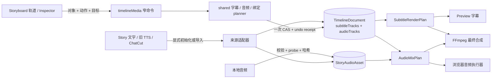
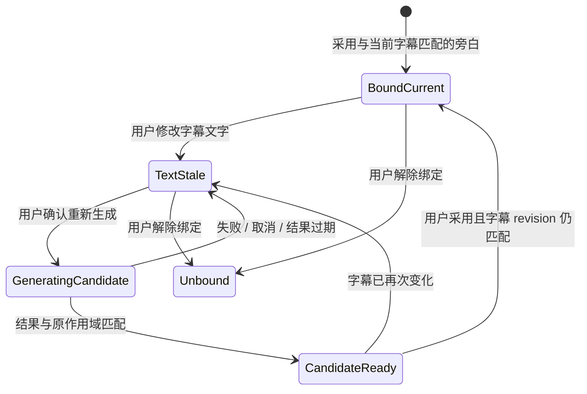
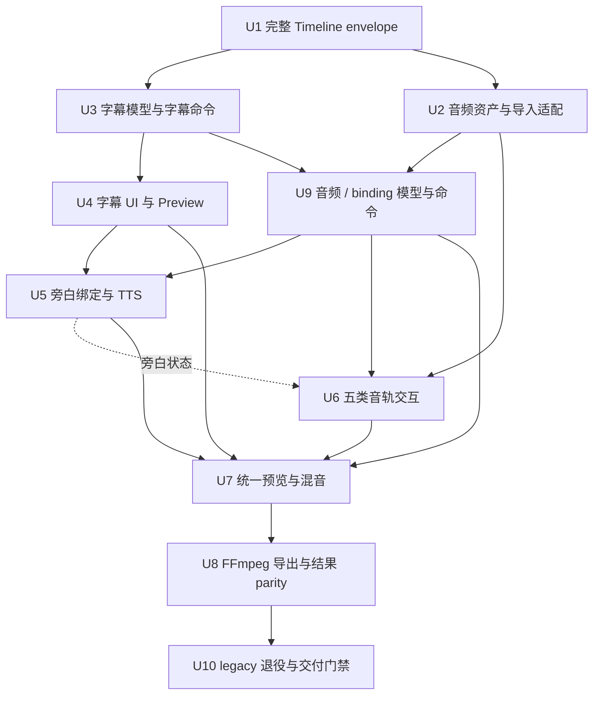

# feat: 增加字幕与多音轨剪辑

## Summary

本计划在现有 Storyboard 唯一时间线中增加一条可直接改字的字幕轨，以及旁白、音乐、环境声、音效和原声等语义音轨。视觉层继续向上叠加并按最高可见层决定画面；字幕位于画面与声音之间；声音轨向下排列，所有未静音的重叠声音共同混音。

实现采用“共享时间与交互外壳、媒体能力各自独立”的增量方案：字幕、旁白、音乐和图片共用 30fps 绝对时间、选择、移动、裁剪、服务端窄命令、CAS 和撤销协议，但各自保留不同的创建入口、属性面板和生成流程。现有视觉模型不重写，旧 ChatCut 音频和镜头 TTS 只作为显式、幂等的迁移输入，最终由 Timeline 文档和 Story 音频资产成为剪辑、预览与导出的权威来源。

---

## Problem Frame

当前 Editing 页面只有可编辑视觉层。字幕只是 Preview 根据 ChatCut cue 或镜头 `dialogue` 临时算出的文字，不能在时间线上选中、改字、拆分、合并或调整时间；声音也只是从 `story.body.chatCutImport` 投影到一条只读波形行，并由隐藏 `<audio>` 元素按文件名猜测音乐后固定设为 18% 音量。镜头 TTS 则保存在 `voiceAudio*` 字段中，与 Timeline 没有正式关系。

这使得新增一个看似简单的能力需要同时修改 Story body、Timeline、Preview 和导出，并容易形成第二套真相。更危险的是，当前 `server/db.ts` 的 Timeline JSON 编解码器只保留 `items`、`overlays` 和 `visualLayerState`；若先加字幕或音频字段，任何旧视觉写入或撤销都可能把它们静默删除。`CreationEditorContext.tsx`、`StoryboardEditRow.tsx` 和 `EditingNleWorkspace.tsx` 也都已是大型热点文件，继续把新逻辑直接堆进去会让下一阶段再次难以扩展。

---

## Assumptions

*以下是为把用户目标转成可执行计划而补齐的首版边界。执行 Agent 若发现它们与最新产品决定冲突，应先更新本计划，不应在代码中另造规则。*

- 首版只有一个字幕轨；默认生成的字幕不重叠，但必须无损读取和稳定显示导入数据中的重叠 cue。
- 主界面按“上层视觉 → 主画面 → 字幕 → 旁白 → 音乐 → 环境声 → 音效 → 原声”的固定语义顺序展示。轨道顺序用于理解和管理，不代表音频覆盖优先级。
- 新故事的字幕候选来自当前 Story 的镜头旁白/对白文字；已附加 ChatCut 且带准确 cue 时间时优先使用 ChatCut cue。候选只有在用户点击“从当前文字生成字幕”后才落库，页面打开或刷新不产生隐藏写入。
- 首版接入现有 TTS、本地音频导入和 ChatCut 音频。音乐生成供应商不在本轮选择或实现，但未来供应商输出必须进入同一个 Story 音频资产边界。
- 首版使用统一默认字幕样式，只支持 cue 级文字与时间编辑；字体模板、逐字卡拉 OK、高级排版和多语言样式留到后续。
- 对已有 Story 的旧 `voiceAudio*` 与 `chatCutImport` 不做页面加载时自动迁移。用户显式导入/迁移后才写入正式轨道，操作必须幂等且可撤销。
- 精细时间线剪辑首版以当前 Editing 桌面工作区的指针和键盘输入为目标；窄屏继续使用同一横向时间轴与滚动，不在本轮增加触摸拖拽和移动端专用 inspector。

---

## Requirements

- R1. Editing 页面必须继续只有一个可编辑时间线。字幕和声音作为现有 Storyboard 的轨道加入，不恢复已删除的底部时间线，也不建立字幕专用平行编辑器。
- R2. 所有字幕和音频结构时间以 30fps 非负整数帧保存；毫秒和像素只作显示投影。Timeline 总时长取视觉、字幕和音频最大结束帧。
- R3. 视觉层继续向上叠加并使用现有唯一赢家规则；字幕位于视觉与音频之间；旁白、音乐、环境声、音效和原声五条语义音轨向下排列。重叠音频同时混音，不能复用视觉赢家算法。
- R4. 字幕首次由现有文字候选生成，之后由字幕 cue 自己拥有最终显示文字和时间。刷新、正文变化、重新附加 ChatCut 或重新生成候选不得覆盖用户已编辑的字幕。
- R5. 用户可以在字幕块上直接进入文字编辑，并可移动、左右裁剪、拆分、合并和删除字幕；文字输入期间全局剪辑快捷键不得误触。
- R6. 旁白、音乐、环境声、音效和原声共用选择、移动、裁剪、音量、静音、淡入淡出与错误反馈外壳，但创建方式和可用命令按媒体类型分别呈现，不出现万能属性面板。首版不提供 solo、循环或任意音轨管理器。
- R7. 旁白和字幕通过稳定绑定身份关联。新旁白默认与字幕同起点；移动任一方默认成对移动；显式解除绑定后可以独立调整。
- R8. 修改字幕文字必须在同一服务端命令中把关联旁白标记为“文字已变化”；不得在打字、保存、拖动、播放或导出时自动触发付费 TTS。用户明确确认重新生成后才可提交一次生成请求。
- R9. 旁白重新生成成功先创建不可变音频资产候选，不自动替换当前片段；采用前重新校验 Story、字幕、绑定和源文字版本。采用后保留原起点，以真实媒体时长更新旁白；用户已手调的字幕时长不被自动覆盖。
- R10. Timeline 音频片段只引用 Story 音频资产，不拥有原文件。删除、撤销或替换片段不得级联删除原音频、TTS 回执、ChatCut 来源或生成候选。
- R11. 本地音频上传和远程 ChatCut/TTS 音频必须物化为受管资产，记录 `storyId + userId`、存储键、真实时长、来源、校验和及必要的生成元数据；播放、波形和导出都通过按 Story 鉴权的同源读取入口访问。
- R12. 新增的字幕/音频写操作必须是服务端窄领域命令。客户端只发送对象身份与意图，不上传完整 `TimelineDocument`、下一份 Story body 或 `expectedVersion`。
- R13. 每次实际改变 Timeline 的成功用户命令只递增一次 Timeline version、写入一条撤销记录；无变化命令返回 `changed:false`，不递增版本且不写撤销记录。相同 operation ID 和相同 payload 重放幂等，不同 payload 复用 operation ID 必须拒绝。失败保持原状态并返回可见、可执行的恢复提示。
- R14. 所有现有视觉 writer、聚合写入、撤销和 Timeline 编解码路径必须无损保留字幕与音频切片；字幕/音频写入也必须无损保留视觉项、overlay、图层状态和锚点。
- R15. Story 是工作单位。所有 Timeline、音频资产、生成任务和媒体路由必须同时校验 `storyId + userId`，不得使用 latest Story、相似镜号、当前 UI 选择或客户端 URL 猜归属。
- R16. 切换 Story、切换字幕、修改源文字、删除目标或发起较新生成后，迟到保存和 TTS 结果只能回到原不可变作用域，不能覆盖当前 Story 或较新结果；播放器必须立即停止旧 Story 的全部声音。
- R17. Preview 与成片导出必须消费相同的字幕 render plan 和音频 mix plan，在字幕时段、源裁剪、音量、静音、淡入淡出、重叠混音与总时长上保持一致。视觉原声与显式关联的 source 音轨不得重复播放；时间边界允许误差不超过一个 30fps 帧，确定性音调的增益/fade 对照允许误差不超过 0.5dB。
- R18. 完成后必须更新功能账本，保留 `storyboard-voice-lane` 和 `extracted-frame-overlay-video` 的既有不变量，并在主仓库唯一的 `main:3000` 上完成刷新、跨 Story、混音、撤销和导出验收。

---

## Scope Boundaries

- 不重写现有视觉时间线、视觉赢家、图层、锚点、图片/视频生成或视觉对象操作。
- 不恢复旧 `MultiTrackTimeline`，不新建第二个可编辑页面，也不让 Preview 自己持有可编辑字幕事实。
- 不在本轮选择或接入新的音乐生成供应商；只保留按媒体类型出现的“生成音乐”扩展槽位。
- 不做多字幕轨、多语言轨、逐字时间、卡拉 OK、语音识别自动打轴、字幕翻译或高级字体模板。
- 不做音频降噪、自动响度标准化、EQ、压缩器、变调、变速、声道自动闪避或总线混音器。
- 不做音乐自动循环、轨道 solo 或任意新增/删除/排序音轨；首版用固定语义轨道和片段/轨道静音满足简单剪辑。
- 不让视觉镜头批量移动自动带走字幕或音频。只有显式的字幕—旁白绑定会成对移动。
- 不把 Story 的 `sound` 文本说明当成可播放媒体，也不把环境声文字混入 TTS 朗读内容。
- 不在删除 Timeline 引用时清理素材资产。孤立资产回收需要独立的保留策略与明确确认。
- 不在 worktree 运行 dev/preview server，也不向 worktree 的 `.webdev/` 写入业务数据。
- 不在本轮实现触摸精细拖动或移动端专用剪辑布局；桌面键盘必须覆盖选择、移动、裁剪和删除，窄屏保持可滚动与可查看。

### Deferred to Follow-Up Work

- 音乐生成供应商、报价和候选采用：在本轮资产接口稳定后单独规划。
- 多语言字幕、字幕样式模板、逐字高亮和 SRT/VTT 导入导出：单独的字幕生产计划。
- 自动 ducking、响度分析、音频效果器和主混音台：需要真实节目素材和听感指标后再规划。
- 服务端波形峰值缓存：首版复用客户端解码；只有真实大文件性能数据证明必要时再加。
- 音频资产垃圾回收和跨 Story 复用：必须先定义用户可见所有权与保留期。

---

## Context & Research

### Relevant Code and Patterns

- `shared/storyMaterial.ts` 定义 `TimelineDocument`，当前只有 `items`、`overlays`、`visualLayerState`；同文件已有 `STORY_TIMELINE_FPS` 与帧/毫秒转换，是新轨道时间合同的权威来源。
- `server/db.ts` 的 `StoryTimelinePayload`、`decodeStoryTimelinePayload`、`encodeStoryTimelinePayload`、`storyTimelineView`、`updateStoryTimeline` 和 `updateStoryAndTimelineAtomic` 只认识现有三个切片，是新字段最先需要加固的边界。
- `shared/visualClipModel.ts`、`server/services/visualClipEditing.ts`、`server/services/storyTimelineEditing.ts` 与 `server/persistence/storyVisualPersistence.ts` 已采用“服务端读取完整文档 → shared 纯函数修改目标 → CAS 保存”的领域命令模式，新媒体命令应复用它的结构而不复制视觉语义。
- `server/services/visualEditUndoJournal.ts` 与 `client/src/features/creationEditor/timelineUndoStore.ts` 已形成服务端恢复事实、客户端只记录操作顺序的撤销链，但快照当前只覆盖视觉切片，必须先扩展完整性再写入新媒体。
- `client/src/features/creationEditor/views/StoryboardEditRow.tsx` 是唯一可编辑时间线组合面，目前按视觉上层、主画面和一条音频行渲染；新轨道只通过独立组件接入，不继续堆领域逻辑。
- `client/src/features/creationEditor/views/StoryboardAudioWaveform.tsx` 已有同源抓取、AudioContext 解码和波形缓存，但块不可选择、拖动或裁剪，可保留为纯展示组件。
- `client/src/features/creationEditor/TimelineAudioPlayback.tsx` 当前从 ChatCut manifest 创建隐藏 `<audio>`，按文件名猜音乐并固定为 18%；它是需要被正式播放计划替换的临时实现。
- `client/src/features/creationEditor/chatCutTimeline.ts` 与 `client/src/features/creationEditor/views/EditingNleWorkspace.tsx` 仍直接解释 `chatCutImport` 的 cue、轨道和音频 URL；迁移完成后 UI 不应继续理解这种来源格式。
- `client/src/features/creationEditor/previewPlaybackModel.ts` 当前在 ChatCut cue 与镜头 `dialogue` 之间选择 Preview 文字；正式字幕落地后只允许把它们作为初始化候选。
- `client/src/features/creationEditor/views/ShotPreview.tsx` 已有字幕显示 rail；它应消费共享字幕 resolver 的结果，不自己解释 Story 或 ChatCut。
- `server/routers/storyAgent.ts` 的 `generateStoryShotVoice` 已有 Story/稳定镜头校验、相同请求复用和迟到请求保护；`client/src/features/storyAgent/views/StoryboardMatrix.tsx` 已有“文字已修改，请重新生成”的正确交互，应迁移其语义而非复制存储。
- `server/services/chatCutXml.ts` 解析视频、音频和 script cue，但 attach 目前先写 Story body 再写 Timeline，正式媒体迁移需要改为 Story + Timeline 的原子边界。
- `server/services/storyAudioProxy.ts` 与 `server/_core/index.ts` 已有按 Story 校验 ChatCut 音频并阻断任意 URL/SSRF 的入口，可作为资产媒体路由的安全模式。
- `server/services/videoExport.ts` 已按共享视觉 resolver 生成等长视觉区间，并给缺音视频补静音；它当前只保留视频自带音轨，没有独立音频混合或字幕合成。
- `client/src/architecture-boundaries.test.ts` 已冻结大型热点文件并禁止旧写入模式；新模块与新 router 应纳入同一架构棘轮。

### Existing Feature Ledger Constraints

- `storyboard-voice-lane`（working）：朗读文本不得混入环境声说明；TTS 结果必须绑定正确 Story 和镜头。
- `extracted-frame-overlay-video`（working）：只有一个多轨编辑模型和一个位置写入口；客户端不得上传完整 next items 或持有 `expectedVersion`；视觉预览、时间线和导出共享同一赢家规则；视觉镜头移动不得带走其它绝对定位媒体。
- `story-ownership`（working）：所有 Story 数据必须同时按 `storyId + userId` 读取和写入；本地 JSON 写盘失败必须向调用方传播，不能出现内存假成功。

### Institutional Learnings

- `docs/plans/2026-08-23-001-refactor-timeline-write-convergence-plan.md`：历史拖动回弹的根因是同一事实有整份 Timeline writer 与窄命令两个写入口。新功能必须从第一天只暴露窄命令。
- `docs/brainstorms/2026-08-25-unified-visual-clip-operations-requirements.md`：采用“图层同等、对象有别”的能力矩阵；统一选择和移动协议，不统一媒体创作语义。
- `docs/plans/2026-08-18-001-feat-storyboard-position-anchors-plan.md`：结构时间使用 30fps 整数帧，总时长取所有素材最大结束帧，预览与导出共用 resolver。
- `docs/solutions/2026-06-13-故事为唯一单位-镜头按storyId.md`：可继续采用的硬约束是 Story 作为工作单位、所有读写校验 `storyId + userId`、不得用 latest Story 或视觉顺序猜归属；其中较早的“shots 表是唯一真相”表述已与后续聚合模型漂移，实施时以当前代码和功能账本为准。
- `docs/solutions/2026-06-13-多worktree环境数据分裂收敛.md`：只有主仓库固定 3000 端口可以运行与验收；worktree 只改代码，禁止产生第二份 `.webdev` 业务数据。
- 既有付费生成计划共同证明：异步操作必须冻结 Story、源对象、源 revision、请求哈希与 operation token；供应商结果先成为候选，明确采用后才改变当前时间线。

### External References

- 未使用外部资料。React、tRPC、Drizzle、本地 JSON、FFmpeg 和媒体播放模式在仓库内均有直接先例，本计划优先保持本地约束一致。

---

## Key Technical Decisions

- **统一时间壳，不统一万能 Clip：** 公共字段只包含稳定对象 ID、Story scope、track ID、绝对起点、结构时长、选择与通用操作状态。字幕和不同音频用判别联合或独立 payload 表达，各自拥有有意义的字段与命令。
- **在 `TimelineDocument` 顶层增加两个独立切片：** 使用 `subtitleTracks` 与 `audioTracks`，视觉的 `items`、`overlays` 和 `visualLayerState` 保持原样。所有 writer 改为在完整文档 envelope 上做字段级读改写，避免一种媒体保存时删除另一种媒体。
- **字幕拥有最终文字：** Story `dialogue` 和 ChatCut `scriptCues` 只产生可预览的初始化候选。第一次显式生成后，字幕 cue 的 `text`、`startFrame`、`durationFrames` 与 provenance 成为权威；源文字更新只产生“来源已更新”提示，不覆盖人工稿。
- **音频资产与时间线引用分离：** 新增 Story 音频资产实体保存文件身份、真实时长、来源、校验和、归属和 TTS 元数据；Timeline clip 只保存 `assetId`、源裁剪、位置与混音参数。远程音频在导入时物化，本地上传在 probe 成功后才可落轨。
- **旧数据只在显式边界迁移：** ChatCut attach/import 和旧 TTS 迁移采用幂等 service。legacy adapter 可为未迁移 Story 提供只读候选及兼容播放、Preview、导出，但不得在 load effect 中写库。文件导入使用持久 operation 与 staging 状态机；资产只有在 probe/hash、原子移入正式目录并标记 `ready` 后才可被 Timeline 引用，不能把文件系统与数据库描述成一个事务。
- **字幕—旁白使用稳定 `speechBindingId`：** 绑定是关系而非对象嵌套。移动默认原子地应用同一帧差；解绑后独立。改字在同一命令里把当前旁白标记 `text-stale`，保留旧资产供比较和回退。
- **真实时长和用户时间意图分离：** 音频资产保存媒体真实帧数；音频 clip 分别保存 `sourceInFrame`、`sourceOutFrame`、`timelineStartFrame` 和 `durationFrames`。字幕只保存显示时段。裁剪字幕不能拉伸音频，裁剪音频不能暗改字幕。
- **服务端是唯一 writer：** `timelineMedia` router 只收领域 intent，服务端按 `storyId + userId` 读取最新文档、调用 shared planner、一次 CAS 保存并签发撤销回执。客户端不计算下一份文档，不保存版本，不吞掉冲突。
- **操作能力由注册表投影：** 字幕显示改字、拆分、合并和时间；旁白显示声音、重新生成与绑定；音乐/环境声/音效显示裁剪、音量、淡入淡出和静音。一个“添加”入口按类型进入各自流程，避免多个全局按钮和万能弹窗。
- **固定语义轨道降低操作成本：** 首版不提供任意轨道管理器。字幕、旁白、音乐、环境声、音效、原声按固定顺序排列；空轨可折叠，选中后只显示与对象有关的简短 inspector。轨道上下顺序不改变混音结果。
- **共享 plan、两个执行器：** shared 纯函数从同一 `TimelineDocument` 生成 `SubtitleRenderPlan` 和 `AudioMixPlan`。浏览器执行器负责实时显示/播放，FFmpeg 执行器负责成片；两者不得各自重算 cue 选择、增益、fade 或时间边界。
- **视觉原声明确进入 mix plan：** 当前视频自带声音作为虚拟 source 输入；ChatCut 只有在带明确 linked visual source 身份时才抑制重复原声。不能仅凭文件名或校验和猜测“听起来像同一条”并去重。
- **生成和采用分离：** 用户点击“重新生成”并确认当前文字后才取得一次 TTS 提交权。结果先写音频资产候选；采用时重新读取绑定和文字 revision，旧请求只能留在原 Story 的候选历史。
- **大型文件只作组合接线：** 新的 pure model、controller、row、inspector、asset service、router 和 export planner 放入独立模块。`CreationEditorContext.tsx`、`StoryboardEditRow.tsx`、`EditingNleWorkspace.tsx` 及 `server/db.ts` 的新增量由架构测试限制。

---

## Open Questions

### Resolved During Planning

- 图片、字幕、旁白和音乐是否使用同一种对象？——否。只统一时间、选择、移动/裁剪、保存、撤销和错误协议；创建与修改能力保持不同。
- 声音重叠时谁覆盖谁？——都不覆盖。所有未静音声音共同进入混音；轨道顺序只用于组织。首版不提供 solo。
- 修改字幕是否立即重新生成旁白？——否。只标记旧旁白过期，并由用户明确重新生成和采用。
- 是否重做整个 NLE？——否。保留现有 Storyboard 与视觉模型，增量增加正式字幕和音频切片。
- 首版是否包含音乐生成？——否。包含本地导入、ChatCut 导入和现有 TTS，给未来音乐生成保留资产适配接口。

### Deferred to Implementation

- 本地音频首版允许的格式、单文件大小和总存储限制：执行时根据当前 Express body/upload 限制、浏览器解码和 FFmpeg probe 能力确定一组明确白名单，并集中在配置与错误文案中，不散落魔法数字。
- 音频导入 operation 的最小 schema 形状：实现时可使用独立导入回执表或现有通用 operation 表，但 TTS 计费不得另建一套基础设施，必须直接复用 `billing_operations`、`credit_holds`、`provider_attempts` 和 `server/services/computeLedger.ts`。
- 波形峰值是否只保存在浏览器缓存：首版默认复用现有解码；若定向性能验证证明长音频或多轨解码阻塞，再在不改变 Timeline 合同的情况下增加派生缓存。
- 默认字幕字体、描边和安全区：U8 使用项目已有字体与一个可测试的全局默认样式；具体视觉模板另行设计，不阻塞文字与时间剪辑。
- 旧 Story 的批量迁移是否必要：先通过查询统计真实数据量和来源形状。若需要批量处理，应另建只读审计与可恢复迁移脚本，不能把它藏在页面加载中。

---

## Output Structure

    shared/
      timelineSubtitleModel.ts
      timelineSpeechBinding.ts
      timelineAudioModel.ts
      timelineMediaDuration.ts
    server/
      persistence/
        storyTimelinePersistence.ts
      routers/
        timelineMedia.ts
      services/
        audioMedia.ts
        storyAudioAssets.ts
        storyAudioImport.ts
        storyNarration.ts
        timelineMediaEditing.ts
        timelineMediaExport.ts
    scripts/
      backup-local-media.ts
    client/src/features/creationEditor/
      timelineMedia/
        useTimelineMediaController.ts
        timelineMediaCapabilities.ts
        AddTimelineMediaMenu.tsx
        SubtitleTrackRow.tsx
        AudioTrackRow.tsx
        TimelineMediaInspector.tsx
        TimelineAudioEngine.tsx

这个树表示预期责任边界，不要求执行 Agent 机械照抄文件名。若实施中现有模块已经承担同一单一责任，应扩展现有模块并在 PR 中说明，不能同时保留两个权威实现。

---

## High-Level Technical Design

> *以下用于校验方案方向，是评审上下文，不是可复制的实现规格。执行 Agent 应根据当前代码完成类型和接口设计。*

### 数据与写入流



### 用户看到的轨道顺序

```text
视觉层 N                 ← 重叠时上层是画面赢家
…
主画面
字幕                     ← 点击块直接改字
旁白                     ← 与字幕可绑定，改字后提示重新生成
音乐                     ← 裁剪 / 音量 / 淡入淡出
环境声                   ← 裁剪 / 音量 / 淡入淡出
音效                     ← 裁剪 / 落位 / 音量
原声                     ← 裁剪 / 落位 / 音量
                         ← 重叠声音共同混音
```

### 领域形状

```text
TimelineDocument
  existing visual slices
  subtitleTracks[]
    track metadata
    subtitle clips: stable id, absolute frames, text, provenance, edit flags, speech binding
  audioTracks[]
    semantic kind, fixed order, mute/default gain
    audio clips: asset ref, source frames, absolute frames, gain, fades, stale state, speech binding

StoryAudioAsset
  immutable identity + story/user ownership
  managed storage key + media facts
  source kind + checksum
  optional narration generation provenance
```

### 旁白状态流



### Implementation Unit 依赖



---

## Implementation Units

### U1. 完整 Timeline envelope、兼容 codec 与跨 writer 保留

**Goal:** 在引入任何字幕或音频事实前，使 Timeline 的读取、保存、聚合写入和撤销都围绕一个完整、可扩展的文档 envelope 工作，消除旧 writer 静默丢弃新增切片的风险。

**Requirements:** R2, R13, R14

**Dependencies:** 无；U3 和 U2 的共同硬前置。

**Files:**
- Modify: `shared/storyMaterial.ts`
- Create: `server/persistence/storyTimelinePersistence.ts`
- Create: `server/persistence/storyTimelinePersistence.test.ts`
- Modify: `server/db.ts`
- Modify: `server/db.storyTimelineOverlay.test.ts`
- Modify: `server/db.localPersistenceFailure.test.ts`
- Modify: `server/persistence/storyVisualPersistence.ts`
- Modify: `server/persistence/storyVisualPersistence.test.ts`
- Modify: `server/services/storyTimelineEditing.ts`
- Modify: `server/services/storyTimelineEditing.test.ts`
- Modify: `server/services/visualEditUndoJournal.ts`
- Modify: `client/src/features/creationEditor/timelineUndoStore.ts`
- Modify: `client/src/features/creationEditor/timelineUndoStore.test.ts`
- Modify: `client/src/architecture-boundaries.test.ts`

**Approach:**
- 先为 legacy 裸 `items[]`、当前三字段 envelope、视觉 CAS、Story+Timeline 聚合写入和视觉撤销补 characterization tests；这些测试先失败于“扩展切片丢失”，再开始改 codec。
- `TimelineDocument` 增加正式扩展槽位，但 U1 不定义字幕或音频业务模型。测试使用 sentinel extension slices，证明 codec 和每个 writer 能保留当前不认识、后来新增的顶层字段。
- 将 decode、encode、完整文档 load、CAS save 和版本规则集中在一个 persistence adapter。`server/db.ts` 只保留薄接线，视觉 service 只修改视觉切片并把其余 envelope 原样带回。
- 所有现有 writer、聚合写入和 undo snapshot 改为完整文档语义。客户端 undo store 继续只记录操作顺序和不可写回 receipt，不缓存整份文档。
- CAS 的 `changed:false` 合同先在这一层固定：没有语义变化时不增加 version、不写 undo；成功变更一次只增加一个 version。
- 架构守卫禁止业务模块手写 `{items, overlays, visualLayerState}` 保存对象，禁止新增第二个 Timeline codec，并冻结 `server/db.ts` 与三个客户端热点文件的新增领域逻辑。

**Execution note:** characterization-first。sentinel 切片通过所有 writer/undo 往返前，不得落库任何正式字幕或音频数据。

**Test scenarios:**
- Legacy：裸 `items[]` 与当前三字段 envelope 可读，缺失扩展槽位时得到安全默认值。
- Round trip：sentinel subtitle/audio extension 经过 decode → encode → DB view、memoryState 和 MySQL repository contract 后逐字段相同。
- Writer preservation：视觉移动、裁剪、拆分、图层显隐、聚合 Story+Timeline 更新和视觉 undo 均只改变目标视觉字段，sentinel 完整保留。
- CAS：两个 writer 从同一版本写不同切片时只允许一个成功；失败者重读后只重放自己的 intent，不用旧 envelope 覆盖新值。
- No-op：语义相同的写入返回 `changed:false`，version 和 undo 数量均不变。
- Persistence failure：本地 JSON 在 mkdir/write/rename 任一步失败时内存态回滚，错误传播到调用方，后续写入不会顺带落盘失败内容。
- Guard：人造三字段 writer、第二 codec 或把完整 document 放进客户端 mutation input 时架构测试失败并指向违规文件。

**Verification:**
- 一个权威 codec 同时服务本地 JSON、MySQL 和所有 service。
- 所有现有视觉写入与撤销测试都能携带 sentinel 扩展切片运行。
- U1 不包含字幕、音频、binding、总时长或 UI 业务规则。

---

### U2. StoryAudioAsset、受管存储与 staged import

**Goal:** 建立按 Story 鉴权、可恢复、可探测的音频资产边界，把本地上传、ChatCut 与旧 TTS 字节转换为 `ready` 资产，但不在此单元定义音频 clip 或绑定规则。

**Requirements:** R10, R11, R15, R16

**Dependencies:** U1

**Files:**
- Modify: `drizzle/schema.ts`
- Create: `drizzle/migrations/<next>_story_audio_assets.sql`
- Modify: `server/db.ts`
- Create: `server/services/storyAudioAssets.ts`
- Create: `server/services/storyAudioAssets.test.ts`
- Create: `server/services/storyAudioImport.ts`
- Create: `server/services/storyAudioImport.test.ts`
- Create: `server/services/audioMedia.ts`
- Create: `server/services/audioMedia.test.ts`
- Modify: `server/services/chatCutXml.ts`
- Modify: `server/services/chatCutXml.test.ts`
- Modify: `server/services/storyAudioProxy.ts`
- Modify: `server/services/storyAudioProxy.test.ts`
- Modify: `server/_core/index.ts`
- Modify: `server/routers.storyShotFields.test.ts`
- Create: `scripts/backup-local-media.ts`
- Create: `scripts/backup-local-media.test.ts`

**Approach:**
- 新增 `story_audio_assets` 和持久导入 operation 状态，至少保存 `id`、`storyId`、`userId`、随机 storage key、显示名、媒体/来源 kind、真实 duration/sample/channel facts、checksum、`pending|ready|failed`、失败原因、来源 provenance 与时间戳。migration 使用执行时实际下一个编号。
- 默认正式目录为 `.webdev/audio`，可由 `LOCAL_AUDIO_DIR` 覆盖。storage key 到真实路径只允许通过 `audioMedia.ts` 的一个解析器；任何客户端路径、文件名或 URL 都不能直接参与路径拼接。
- 文件系统与 DB 不假装共享事务。导入状态机固定为：①持久化 pending operation/asset；②写入隔离且不可执行的 staging；③以参数数组运行 ffprobe 并计算 hash；④同文件系统原子 rename 到正式目录；⑤提交媒体事实并标记 ready；⑥崩溃恢复器按 operation 状态重放、补偿或清理。
- Timeline 以后只能引用 `ready` asset。失败上传与 staging 文件立即 best-effort 清理；启动时清理超过 24 小时且没有活跃 operation 的 staging。未采用 TTS candidate 不按 TTL 自动删除，保留到用户显式删除或 Story 删除。
- probe 禁止 shell，使用参数数组启动；设置硬超时、stdout/stderr 上限、并发和资源限制，关闭不需要的网络协议。畸形容器、超多 stream、超长 metadata 和异常退出都必须结束进程并清理临时文件。
- 远程字节只能由可信 ChatCut/TTS provenance 生成，客户端不能提交 URL。下载器要求 HTTPS host/port allowlist；初始请求及每次 redirect 都重新解析 DNS/IP，拒绝 loopback、link-local、私网、组播、云元数据、IPv4/IPv6 混淆地址；限制 redirect 次数、连接/总超时、流式字节数和并发。
- 媒体读取 route 使用 `storyId + assetId`，`userId` 只从 session 注入；服务端重新校验资产属于该 Story 和用户。支持 Range 时也必须先完成同一鉴权。
- ChatCut 与旧 `voiceAudio*` 在此只物化资产和 provenance，不创建正式音频 clip。已存在同 Story、同来源 key/checksum 的 ready 资产可幂等复用；跨 Story 不自动共享。
- Story 删除必须清理受管字节、资产元数据、staging operation 与可识别 generation metadata；备份脚本同时覆盖本地 DB 元数据和 `.webdev/audio`，并验证恢复顺序。孤立资产的用户级 GC 留到后续。
- 日志只记录 operation/asset ID、状态和安全错误码，禁止音频内容、签名 URL、完整朗读文本、provider 凭据和本地绝对媒体路径。

**Execution note:** 先用临时目录和故障注入完成 memoryState/MySQL contract；worktree 测试不得写主仓 `.webdev`。迁移和 memoryState 必须同批支持。

**Test scenarios:**
- Happy path：合法 mp3/wav/m4a fixture 从 pending → staging → probed → ready，保存可信媒体事实和 checksum；同源 route 支持授权读取。
- Crash matrix：在建立 pending、写一半文件、probe 后、rename 后、DB ready 前分别崩溃；重启恢复后只能得到一个 ready 资产或一个可解释 failed operation，没有 Timeline 孤儿引用。
- Local/MySQL parity：相同 operation 重放返回同一 asset；本地 JSON 写盘失败与数据库事务失败都不会产生“DB ready 但文件不存在”。
- Probe abuse：伪 MIME、空文件、畸形容器、超多 stream、超长 metadata、超时和进程异常全部失败并清理 staging。
- SSRF：开放重定向、DNS rebinding、IPv4/IPv6 私网、混淆 hostname、非 HTTPS/非允许端口、过多重定向和超限流式响应均被拒绝。
- Ownership：伪造另一个 Story/用户 asset ID、storage key、路径穿越或客户端 URL 均不可读取或复用。
- Lifecycle：失败上传立即清理；过期 staging 在 24 小时恢复门槛后清理；未采用 candidate 保留；删除 Story 后 route、文件和元数据均不可访问。
- Backup：备份与恢复 fixture 后 asset metadata、文件 hash 和 ready 状态一致；缺文件资产被标出而非静默成功。

**Verification:**
- UI、播放器和导出以后只需要 `storyId + assetId`，不依赖第三方 URL 或客户端路径。
- 任何 crash 点都能通过 operation 状态恢复或补偿；没有“文件系统和数据库单事务”的假设。
- 所有归属判断都使用 session `userId + storyId`，并有正反向测试。

---

### U3. 字幕纯模型、字幕窄命令、CAS 与撤销

**Goal:** 独立交付正式字幕数据和唯一写入口，使字幕无需等待音频资产即可持久化、编辑和撤销。

**Requirements:** R2, R4, R5, R12, R13, R14, R15, R16

**Dependencies:** U1

**Files:**
- Create: `shared/timelineSubtitleModel.ts`
- Create: `shared/timelineSubtitleModel.test.ts`
- Create: `shared/timelineMediaDuration.ts`
- Create: `shared/timelineMediaDuration.test.ts`
- Create: `server/services/timelineSubtitleEditing.ts`
- Create: `server/services/timelineSubtitleEditing.test.ts`
- Create: `server/routers/timelineMedia.ts`
- Create: `server/routers.timelineMedia.test.ts`
- Modify: `server/routers/index.ts`
- Modify: `server/services/visualEditUndoJournal.ts`
- Create: `client/src/features/creationEditor/timelineMedia/useTimelineMediaController.ts`
- Create: `client/src/features/creationEditor/timelineMedia/useTimelineMediaController.test.tsx`
- Modify: `client/src/features/creationEditor/CreationEditorContext.tsx`
- Modify: `client/src/architecture-boundaries.test.ts`

**Approach:**
- 定义单条正式字幕轨与 subtitle cue：稳定 ID、30fps 绝对 `startFrame/durationFrames`、权威 `text`、来源 identity/revision、`textEdited/timingEdited`、`textRevision` 和可选 `speechBindingId`。允许无损读取重叠 cue。
- 纯 planner 负责初始化、改字、移动、左右裁剪、拆分、与上一条/下一条合并、删除和当前帧 resolve。它只接受领域对象与整数帧，不接受像素、毫秒、React 状态或音频资产。
- router 只接收 `operationId + storyId + target identity + action-specific intent`；`userId` 从 session 注入。客户端不得提交完整 `subtitleTracks`、完整 Timeline、下一版 Story body 或 `expectedVersion`。
- service 每次按 `userId + storyId` 读取完整最新 Timeline，调用 pure planner，经 U1 persistence CAS 一次保存并签发一条 undo receipt。冲突时只有目标前提仍成立才重读重试一次。
- 相同 operation ID 与相同规范 payload 重放返回原结果；不同 payload 复用同 ID 拒绝。只有实际改变 Timeline 的成功命令 version +1 且新增一个 undo；no-op 返回 `changed:false`。
- 改字在同一文档命令中增加 `textRevision`，绝不调用 TTS 或资产 service。U9 接入 binding 后扩展同一条服务端命令，在一次 CAS 中把关联 narration 标成 stale；不能增加第二个改字入口。
- 总时长 planner 在 U3 先覆盖视觉与字幕，U9 再增量加入音频；视觉切片通过每条字幕命令和 undo 后必须逐字段不变。
- controller 只管理选择、draft/ghost、pending/error 与 query invalidation。旧 mutation 返回先校验 Story epoch，失败显示明确恢复动作。

**Execution note:** 先完成命令与 undo 的 service 测试，再接 UI。此单元不得因 U2 未完成而阻塞。

**Test scenarios:**
- CRUD：初始化、改字、移动、左右裁剪、拆分、合并、删除各只改目标字段，一次操作一次 version/undo。
- Idempotency/no-op：相同 operation 重放不新增 version/undo；相同 ID 异 payload 拒绝；相同文本/位置返回 `changed:false`。
- Frame rules：非负整数帧、每 cue 至少 1 帧；总时长包含视觉与字幕最大尾点。
- Split：请求同时携带播放头 `splitFrame`、文字 `caretIndex` 和当前 `textRevision`；两段 trim 后文字都非空、时间都至少 1 帧，否则拒绝。
- Merge：只有与上一条/下一条相邻且样式/来源兼容时可用；文字用换行连接，保留较早 cue ID，时间覆盖两段，返回焦点应落到合并结果。
- Undo：每种操作一次撤销完整恢复旧 cue/revision/stale；跨 Story、过期或被后续冲突写覆盖的 receipt 不能误恢复。
- Concurrency：两个标签页同时改同 cue 只有一个生效；另一个保留 draft 并得到 conflict。修改不同切片时重读重试不覆盖先成功内容。
- Cross-domain：任一字幕命令/undo 后 `items`、`overlays`、`visualLayerState` 和 sentinel audio slice 不变；任一视觉命令后字幕不变。
- Security：跨 Story cue、伪造 userId、非法 action、过大文本和控制字符策略均在服务端拒绝。
- Architecture：增加完整 document/`expectedVersion` mutation input、第二字幕 writer 或在 Context 中持久化全文副本时守卫失败。

**Verification:**
- U3 完成后可在没有任何音频 schema、资产或 TTS 的条件下执行完整字幕命令测试。
- 所有字幕写入都可追溯到 `timelineMedia` 的字幕窄命令，并进入现有统一撤销顺序。
- shared subtitle model 与 resolver 只有一个权威实现。

---

### U4. 字幕初始化、inline edit、键盘与 Preview

**Goal:** 交付从现有文字生成字幕、在 Storyboard 轨道直接改字并用同一 resolver 预览的第一个可见检查点。

**Requirements:** R1, R2, R3, R4, R5, R8, R16, R17

**Dependencies:** U1, U3

**Files:**
- Create: `client/src/features/creationEditor/timelineMedia/SubtitleTrackRow.tsx`
- Create: `client/src/features/creationEditor/timelineMedia/SubtitleTrackRow.test.tsx`
- Create: `client/src/features/creationEditor/timelineMedia/TimelineMediaInspector.tsx`
- Create: `client/src/features/creationEditor/timelineMedia/TimelineMediaInspector.test.tsx`
- Create: `client/src/features/creationEditor/timelineMedia/AddTimelineMediaMenu.tsx`
- Create: `client/src/features/creationEditor/timelineMedia/AddTimelineMediaMenu.test.tsx`
- Modify: `client/src/features/creationEditor/views/StoryboardEditRow.tsx`
- Modify: `client/src/features/creationEditor/views/StoryboardEditRow.test.tsx`
- Modify: `client/src/features/creationEditor/views/ShotPreview.tsx`
- Create: `client/src/features/creationEditor/views/ShotPreview.test.tsx`
- Modify: `client/src/features/creationEditor/previewPlaybackModel.ts`
- Modify: `client/src/features/creationEditor/editingWorkspaceLayout.test.ts`
- Modify: `client/src/features/creationEditor/spine-bridge.test.ts`

**Approach:**
- “添加”始终位于 Storyboard 固定 header。无字幕时显示一条空字幕行、主 CTA“从当前文字生成字幕”；有字幕后显示 cue 并把来源变更作为提示，不能覆盖人工稿。
- 初始化候选优先取带精确时间的 ChatCut cue，否则按稳定镜头 `dialogue` 与权威绝对时段生成；空文字不生成。点击 CTA 后服务端重读来源并显式落库，页面 load/refresh 不写库。
- 字幕行固定在主画面与旁白之间，复用现有 viewport、播放头、4px 起拖阈值和失败回滚。一次点击选择，双击文字或聚焦后 Enter 进入编辑。
- inline editor 使用本地 draft。Enter 保存，Shift+Enter 插入换行，Escape 取消；IME composition 期间 Enter 只交给输入法。控件旁提供可发现提示“Enter 保存，Shift+Enter 换行”。失焦保存策略必须与 Enter 共用一个幂等提交函数。
- timeline 直接触发 split 时，先进入文字编辑并要求用户放置 caret；提交必须同时带播放头时间点、caret index 和 cue text revision。若任一段文字 trim 后为空或任一时间段小于 1 帧，显示禁用原因。
- 单选模型下不做多选合并。Inspector/菜单提供“与上一条合并”“与下一条合并”；只对时间相邻且语义兼容 cue 启用。合并后文字以换行连接、较早 ID 保留、时间覆盖两段、焦点进入结果；一次撤销恢复两条。
- 键盘：Tab 或 roving tabindex 聚焦 clip；Enter 选择/编辑；clip 上方向键每次移动 1 帧；左右 trim handle 可单独聚焦并每次调 1 帧；Escape 取消；Delete 删除。保存、错误和冲突使用 `aria-live`。
- 无正式字幕时 Preview 可显示明确标注的只读候选；落库后只消费 shared `SubtitleRenderPlan`，不直接解释 ChatCut/shot text。重叠 cue 以稳定 start/id 顺序共同显示。
- 窄屏保持滚动和查看；首版不增加触摸精细裁剪手势。

**Execution note:** 先证明生成 → 保存 → 刷新 → Preview，再接拖动、split/merge 和键盘；此 Phase 是内部可验证里程碑，尚未包含 Export，不能宣称最终发布闭环。

**Test scenarios:**
- Empty state：无字幕时只有空字幕行和 header 添加入口；点击一次生成后刷新保留，重复点击不复制 cue。
- Edit：点击改字，Enter 保存，Shift+Enter 换行，Escape 取消；IME 候选确认不误保存，输入控件不触发全局 Delete/Space/方向键。
- Source drift：已编辑字幕后镜头 dialogue 或 ChatCut cue 改变，只显示来源更新提示，文字和时间保持。
- Split：播放头+caret+revision 缺一不可；空文本段、边界不足 1 帧时显示具体禁用原因；成功后焦点、文本、时段和 undo 正确。
- Merge：上一条/下一条命令的启用条件、换行规则、保留 ID、焦点和一次撤销均被覆盖；不兼容 cue 显示原因。
- Keyboard/a11y：Tab 聚焦，Enter 编辑，clip/handle 方向键逐帧，Delete 删除，Escape 取消，aria-live 报告 pending/success/error。
- Preview：头帧显示、`endFrame` 隐藏；多个活动 cue 稳定显示；seek、缩放和刷新不改变结果。
- Billing boundary：改字只增加 text revision，provider/TTS/资产调用计数保持 0；U9 接入 binding 后再增加 stale 断言。
- Layout：DOM 顺序为视觉层 → 主画面 → 字幕；播放头贯穿同一 viewport。

**Verification:**
- 用户无需离开 Storyboard 即可从文字生成、修改、拆分/合并、移动/裁剪字幕并刷新保持。
- Preview 的字幕 ID、文本和时段都来自 shared plan；页面 load、输入和播放零付费、零隐藏写入。
- UI 回归包含中文 IME 和完整键盘路径。

---

### U9. 音频与 speech binding 纯模型、窄命令和统一 controller

**Goal:** 在 ready 资产之上定义五类音频 clip、字幕—旁白绑定、混音参数和唯一写入口，为旁白、轨道 UI、Preview 与 Export 提供稳定领域合同。

**Requirements:** R2, R3, R6, R7, R8, R10, R12, R13, R14, R15, R16, R17

**Dependencies:** U1, U2, U3

**Files:**
- Create: `shared/timelineAudioModel.ts`
- Create: `shared/timelineAudioModel.test.ts`
- Create: `shared/timelineSpeechBinding.ts`
- Create: `shared/timelineSpeechBinding.test.ts`
- Modify: `shared/timelineMediaDuration.ts`
- Modify: `shared/timelineMediaDuration.test.ts`
- Create: `server/services/timelineAudioEditing.ts`
- Create: `server/services/timelineAudioEditing.test.ts`
- Modify: `server/routers/timelineMedia.ts`
- Modify: `server/routers.timelineMedia.test.ts`
- Modify: `server/services/visualEditUndoJournal.ts`
- Modify: `client/src/features/creationEditor/timelineMedia/useTimelineMediaController.ts`
- Modify: `client/src/features/creationEditor/timelineMedia/useTimelineMediaController.test.tsx`
- Modify: `client/src/architecture-boundaries.test.ts`

**Approach:**
- 固定五类音轨：`narration`、`music`、`ambience`、`sfx`、`source`。clip 保存稳定 ID、ready `assetId`、`timelineStartFrame`、`sourceInFrame/sourceOutFrame`、`durationFrames`、clip gain/mute、fade-in/out 和可选 binding/linkage；轨道只保存固定 kind、mute/default gain。首版没有 solo、循环或任意轨管理器。
- 首版无变速，持久不变量固定为 `durationFrames == sourceOutFrame - sourceInFrame`。move 只改 `timelineStartFrame`；左裁剪同步增加 sourceIn 并缩短 duration，右裁剪同步减少 sourceOut 并缩短 duration；所有误差最多 1 个 30fps 帧。
- `speechBindingId` 是字幕与 narration clip 的稳定关系。新旁白默认与 cue 同起点；移动任一方默认原子应用同一帧差；解绑后独立。视觉移动永远不带走字幕或音频。
- 字幕改字令绑定 narration 成为 `text-stale`，不删除旧声音、不调用 TTS。绑定对象缺失、越界或 revision 改变时整条命令失败，不能半移动。
- 音频命令只暴露 insert、move、trim-left/right、delete-reference、reclassify、gain、mute、fade、bind/unbind、adopt-candidate 等 intent。service 验证 session scope、asset `ready`、源边界和类型能力后经完整 Timeline CAS 一次保存。
- 同一 controller 处理字幕和音频的 selection、ghost、pending/error、epoch 与 undo receipt，但 shared planner 和 service 分开，不能创造万能 payload。
- 总时长扩展为视觉、字幕和音频最大尾点。删除 clip/undo 不级联删除资产或 generation receipt。
- 架构守卫禁止第二 audio writer、完整 `audioTracks`/`expectedVersion` mutation input、基于文件名分类和视觉 winner 参与音频选择。

**Execution note:** 先用一个 ready music asset 打通 insert → move → trim → gain → refresh → undo，再接 binding 与其它 kind。

**Test scenarios:**
- Model：五类轨道固定、非法 kind/重复 ID/非整数帧/非 ready asset 拒绝；重叠声音全部保留。
- No speed：move 不改 source 区间；左右 trim 分别同步正确 source 边界；duration 恒等式在边界和四舍五入 fixture 中误差 ≤1 帧。
- Commands：insert/move/trim/reclassify/gain/mute/fade/delete 各一次 version/undo；no-op 与重放不增加，异 payload 同 ID 拒绝。
- Binding：绑定移动两方同 delta；解绑后独立；改字只置 stale 且 provider 调用 0；一方越界/删除时整次不写。
- Ownership：另一个 Story 的 asset、pending/failed asset、客户端 userId 和伪 storage key 均被拒绝。
- Cross-domain：音频命令及 undo 后所有视觉/字幕字段不漂移；视觉移动不改变 audio/subtitle；字幕非绑定移动不影响 audio。
- Duration：只有声音、声音晚于画面、fade 超过 clip、mute clip 都仍以结构尾点决定总长。
- Controller：切 Story 清除 selection/ghost，迟到 mutation 不写当前 Story；错误可恢复且不只进 console。
- Guard：完整数组 mutation、第二 writer、文件名猜 music、solo 字段和音频 winner 逻辑均触发架构测试。

**Verification:**
- 音频结构和绑定命令在无 UI、无 provider 的条件下可完整测试。
- Timeline clip 只非所有权引用 ready asset；删除与撤销从不删除底层文件。
- 五类声音共享编辑协议，但 narration/binding 与其它媒体仍有独立类型规则。

---

### U5. 旁白 binding、持久计费、TTS candidate 与 adopt

**Goal:** 把现有 TTS 接入正式字幕、资产和音频 clip，形成“改字零付费 → 明确生成 → 候选试听 → 显式采用”的安全闭环。

**Requirements:** R6, R7, R8, R9, R10, R11, R13, R15, R16

**Dependencies:** U4, U9

**Files:**
- Create: `server/services/storyNarration.ts`
- Create: `server/services/storyNarration.test.ts`
- Modify: `server/services/storyVoice302.ts`
- Modify: `server/services/storyVoice302.test.ts`
- Modify: `server/services/computeLedger.ts`
- Modify: `server/services/computeLedger.test.ts`
- Modify: `server/routers/timelineMedia.ts`
- Modify: `server/routers.timelineMedia.test.ts`
- Modify: `server/routers/storyAgent.ts`
- Modify: `server/routers.storyShotFields.test.ts`
- Modify: `client/src/features/creationEditor/timelineMedia/TimelineMediaInspector.tsx`
- Modify: `client/src/features/creationEditor/timelineMedia/TimelineMediaInspector.test.tsx`
- Modify: `client/src/features/storyAgent/views/StoryboardMatrix.tsx`
- Modify: `client/src/features/storyAgent/views/storyboardVoiceText.test.ts`

**Approach:**
- 从选中 cue 生成旁白时冻结 `storyId + subtitleId + textRevision + textHash + bindingId + provider + voice + operationId`；`userId` 从 session 注入，朗读文本由服务端重读 Timeline，客户端不能提交 userId、任意正文、价格或来源 URL。
- TTS 直接复用 `billing_operations`、`credit_holds`、`provider_attempts` 与 `server/services/computeLedger.ts`。服务端重新计算或验证签名报价，校验 provider/voice 白名单、账户额度、速率和并发限制，并在调用供应商前原子预占。
- 明确成功后结算 hold，明确失败释放/结算相应金额；`submission_unknown` 保留 hold 且禁止自动重提。相同 operation 合并为一次 provider attempt，不另建易丢失的内存幂等表。
- provider 成功字节走 U2 staged import，形成不可变 ready candidate asset。结果晚到时仍只归原 Story/operation；字幕改字、解绑、删除或已有较新 generation 只使 candidate 不可采用，不能覆盖当前 clip。
- candidate 可试听、采用、删除。首版未采用 candidate 一直保留到用户显式删除或 Story 删除。采用前重读 Story、cue、binding、text revision 和 candidate scope；成功后创建/替换 narration clip，旧 asset 和计费回执保留。
- 新旁白起点与字幕一致，真实媒体时长决定 narration clip。字幕未人工调时可同一 adopt 命令对齐结束；`timingEdited` 为真则保留字幕时间并显示差异。
- stale 旁白仍可试听；任何改字、拖动、播放、Preview、Export 或页面 load 都不能触发 TTS。
- `StoryboardMatrix` 的旧入口过渡期只创建/展示可迁移 candidate；正式绑定旁白存在时只读展示，不再写 `voiceAudio*` 成为第二真相。

**Execution note:** 先锁定 compute ledger 和现有迟到保护测试，再移动结果存储。真实付费 smoke 必须获得用户明确授权；fake/cached provider 应完成其余全链路。

**Test scenarios:**
- Billing happy path：签名报价校验、hold、单次 provider attempt、成功 asset、结算与 adopt 全部可追溯。
- Tampering：伪 userId、价格、provider/voice、正文、Story 或 candidate ID 拒绝，provider 调用计数 0。
- Idempotency：双击与两个客户端同 operation 只预占/提交/扣费一次；相同已完成结果重放返回原 candidate。
- Unknown：请求发送后连接中断进入 `submission_unknown`，hold 保留、自动重试 0；只有 reconcile 或用户明确处理后改变状态。
- Stale/late：生成期间改字、解绑、删 cue、切 voice、发起较新请求或切 Story，旧结果只成为原 Story 的不可采用 candidate。
- Adopt：试听零 Timeline 写入；采用时 revision 匹配才替换 clip，一次 undo 恢复旧 clip，但两份 asset 和回执保留。
- Timing：3 秒媒体产生真实帧长；未手调字幕可对齐，手调字幕保持并提示；源区间恒等式不破坏。
- Lifecycle：未采用 candidate 刷新后仍在；显式删除或 Story 删除清理字节与可识别 generation metadata。
- Zero-charge paths：改字、保存、移动、Preview、Export、页面 load 的 provider/ledger 调用计数均为 0。

**Verification:**
- 每个 provider 调用之前都有持久 hold 与 attempt，之后有可解释结算或 unknown 状态。
- 正式播放/导出只由 Timeline narration clip + StoryAudioAsset 决定；旧字段只参与兼容 adapter。
- 迟到结果和重复请求不能串 Story、覆盖较新旁白或重复扣费。

---

### U6. 五类音轨、固定添加入口、Inspector 与直接剪辑

**Goal:** 以最少界面概念交付旁白、音乐、环境声、音效和原声的导入、选择、移动、裁剪、音量、fade 与 mute。

**Requirements:** R1, R2, R3, R6, R10, R11, R12, R13, R16

**Dependencies:** U2, U9；完整旁白状态展示依赖 U5。

**Files:**
- Create: `client/src/features/creationEditor/timelineMedia/timelineMediaCapabilities.ts`
- Create: `client/src/features/creationEditor/timelineMedia/timelineMediaCapabilities.test.ts`
- Create: `client/src/features/creationEditor/timelineMedia/AudioTrackRow.tsx`
- Create: `client/src/features/creationEditor/timelineMedia/AudioTrackRow.test.tsx`
- Modify: `client/src/features/creationEditor/timelineMedia/AddTimelineMediaMenu.tsx`
- Modify: `client/src/features/creationEditor/timelineMedia/AddTimelineMediaMenu.test.tsx`
- Modify: `client/src/features/creationEditor/timelineMedia/TimelineMediaInspector.tsx`
- Modify: `client/src/features/creationEditor/timelineMedia/TimelineMediaInspector.test.tsx`
- Modify: `client/src/features/creationEditor/views/StoryboardAudioWaveform.tsx`
- Modify: `client/src/features/creationEditor/views/StoryboardEditRow.tsx`
- Modify: `client/src/features/creationEditor/views/StoryboardEditRow.test.tsx`
- Modify: `client/src/features/creationEditor/views/EditingNleWorkspace.tsx`
- Modify: `client/src/features/creationEditor/editingWorkspaceLayout.test.ts`

**Approach:**
- 固定 DOM/视觉顺序：视觉层 → 主画面 → 字幕 → 旁白 → 音乐 → 环境声 → 音效 → 原声。顺序用于理解，不影响声音混合集合。
- header 的“添加”始终可见，菜单直接列出：从文字生成字幕、从字幕生成旁白、导入音乐、导入环境声、导入音效、从 ChatCut 导入原声。不要用“导入本地声音”后再让系统猜分类。
- 无音频时五条轨折叠成一条“添加声音”行；有素材后默认只展开有内容轨，并允许用户展开空轨。状态只影响显示，不改 Timeline 数据。
- capability registry 从 subtitle/narration/music/ambience/sfx/source kind 投影允许命令、主动作、Inspector 字段和色调；创建方式仍由各自 adapter 决定。
- audio row 复用纯波形展示。单击选择，4px 后拖动；整块 move 只改起点，左右 handle 按 U9 无变速合同裁剪。viewport 在手势开始时冻结，松手只发一个窄命令。
- Inspector 仅提供名称/类型、音量、mute、fade 和与类型相关动作。首版无 solo、循环、EQ、ducking 或任意轨管理。narration 改类前必须解绑；其它类型显式重分类只移动同一 clip，不复制 asset。
- 键盘沿用 U4：Tab/roving focus，clip 方向键逐帧 move，trim handle 逐帧调整，Delete 删除引用，Escape 取消；控件内按键不穿透。pending/error 通过 aria-live 可知。
- U6 读取顺序保持 `正式 Timeline → legacy 只读 adapter → 无内容`。legacy 内容可播放/Preview/导出或显示“导入”入口，但生产 writer 只写正式 Timeline；这里不得删除 legacy adapter。
- 缺媒体或 decode 失败的 clip 保留结构位置和总时长，显示“重新定位/重新导入/删除引用”等明确动作。

**Execution note:** 先用本地 music asset 完成 asset → clip → move/trim/gain → refresh，再复用外壳到其它 kind；不通过 capability matrix 测试不得复制类型分支到组件。

**Test scenarios:**
- Empty/add：header 添加始终存在；全空时折叠为“添加声音”；六个菜单动作名称和目标类型准确。
- Happy path：音乐导入后 move、两侧 trim、gain、mute、fade 保存并刷新；环境声、音效、原声落入各自固定轨。
- Capabilities：字幕无音量，旁白有生成/绑定，音乐无改字，原声无 TTS；菜单与 Inspector 从同一 registry 取值。
- Interaction：点击与 4px drag 区分、viewport 冻结、handle 不触发整块 move、一次手势一次命令/undo。
- Keyboard/a11y：clip/handle 逐帧、Delete/Escape、输入控件隔离与 aria-live 均可操作。
- Overlap：同类与跨类重叠均保留；视觉层和轨道显示顺序不减少声音输入。
- Ownership/lifecycle：删除 clip 不删 asset；同 asset 另一 clip 可用；跨 Story asset 拒绝；切 Story 清除 selection 和 ghost。
- Legacy：只有 `chatCutImport` 或 `voiceAudio*` 的旧 Story 仍能通过只读 adapter 显示/播放，不发生隐藏迁移、不双播。
- Error：缺媒体、decode/upload/CAS 失败时权威块不消失，ghost 回滚，提示含下一步。

**Verification:**
- 用户只需理解“添加、选中、拖动/裁剪、音量/淡入淡出、静音”，媒体来源差异在对应菜单中表达。
- 五类轨道拥有各自创建动作和共享剪辑外壳，没有万能生成表单。
- 两个热点组件只做组合接线，类型分支与领域逻辑留在新模块。

---

### U7. SubtitleRenderPlan、AudioMixPlan 与浏览器播放

**Goal:** 让字幕显示、seek、暂停、Story 切换和重叠声音统一执行共享 plan，为 FFmpeg 提供同一语义输入。

**Requirements:** R2, R3, R7, R9, R11, R16, R17

**Dependencies:** U4, U5, U6, U9

**Files:**
- Modify: `shared/timelineSubtitleModel.ts`
- Modify: `shared/timelineSubtitleModel.test.ts`
- Modify: `shared/timelineAudioModel.ts`
- Modify: `shared/timelineAudioModel.test.ts`
- Create: `client/src/features/creationEditor/timelineMedia/TimelineAudioEngine.tsx`
- Create: `client/src/features/creationEditor/timelineMedia/TimelineAudioEngine.test.tsx`
- Create: `client/src/features/creationEditor/timelineMedia/audioPlanAnalysis.ts`
- Create: `client/src/features/creationEditor/timelineMedia/audioPlanAnalysis.test.ts`
- Modify: `client/src/features/creationEditor/useTimelinePlaybackClock.ts`
- Modify: `client/src/features/creationEditor/useTimelinePlaybackClock.test.ts`
- Modify: `client/src/features/creationEditor/views/ShotPreview.tsx`
- Modify: `client/src/features/creationEditor/views/EditingNleWorkspace.tsx`
- Modify: `client/src/features/creationEditor/editingWorkspaceLayout.test.ts`
- Modify: `client/src/features/creationEditor/spine-bridge.test.ts`

**Approach:**
- `SubtitleRenderPlan` 输出当前帧所有 cue 的 ID、文字、稳定顺序和时段；`AudioMixPlan` 输出 asset/虚拟 source、源区间、绝对时间、最终 gain、fade/mute 和 linkage 去重结论。planner 不读 DOM、文件名或 Story body。
- 所有视频内嵌声音先投影为 AudioMixPlan 的虚拟 `visual-source`；视觉 master 在 U8 必须静音。带明确 linked identity 的 ChatCut source 只替代对应虚拟 source 一次；相同 checksum 但无 linkage 的手工音频保留。
- 浏览器用单一 Web Audio 执行器执行 plan。每个活动 clip 有独立 source/gain；seek 定位到正确 source offset；连续播放只在漂移超过阈值时校正，避免逐 tick 重建。
- 所有重叠且未静音输入同时创建节点；视觉 winner 不参与声音选择。track default gain、clip gain 和 fade 在 shared plan 中合成最终值。
- `storySessionKey`/Story epoch 变化、pause、卸载、删除 clip 和 seek 出区间时同步停止旧节点。旧 decode promise 完成后必须复核 epoch 才能接入。
- 字幕和声音在每个 tick 共享同一规范整数帧；UI 可显示毫秒，但 resolver 前只做一次 frame 归一化。
- 浏览器 autoplay 被阻止时显示一次可操作提示，用户手势恢复后不重复建节点或双播。
- U7 保留 legacy adapter fallback，使未迁移 Story 仍可播放和 Preview；正式 Timeline 存在时优先并抑制同一明确来源的 legacy 重复输入。

**Execution note:** planner test-first；执行器先用 fake AudioContext 验证生命周期，再在 U10 主仓验收。U7 不删除 legacy 读取。

**Test scenarios:**
- Planner：旁白+音乐+环境声+音效同帧产生四个输入；track/clip mute、gain、fade 中点和末帧得到确定值。
- Visual source：视频内嵌声产生一个虚拟输入；linked ChatCut source 替换一次；无 linkage 的同 checksum 音频仍保留。
- Playback：play/pause/resume、seek 到 clip 中间、seek 出区间和跨 clip 边界时节点与 source offset 正确。
- Story lifecycle：快速切 Story 立即静音旧 graph；旧 decode 晚到不播放；删除当前 clip 与组件卸载无残声。
- Missing：一个 asset 缺失或 decode 失败只静音目标输入，其他声音/播放头继续，总时长不缩短。
- Subtitle sync：cue 头帧与音频头帧同 tick 激活，endFrame 同 tick 退出；缩放不影响。
- Legacy：无正式媒体的旧 Story 从 adapter 播放；一旦正式来源存在不双播。
- Autoplay：未恢复显示提示；一次手势恢复后同一节点只创建一次。

**Verification:**
- shared plan 是浏览器和后续导出的唯一字幕/混音语义；`TimelineAudioPlayback.tsx` 的文件名分类分支不再运行，但文件可到 U10 再删除。
- Story 切换、暂停和卸载后没有残留声音。
- 相同 plan fixture 的活动输入、source offset 与 gain 可由确定性分析器复现。

---

### U8. 静音视觉 master、FFmpeg 字幕/混音与结果级 parity

**Goal:** 把正式字幕和多音轨写入最终成片，并用真实输出证明浏览器与 FFmpeg 对同一 plan 的执行误差在合同内。

**Requirements:** R2, R3, R10, R11, R14, R15, R17

**Dependencies:** U7

**Files:**
- Create: `server/services/timelineMediaExport.ts`
- Create: `server/services/timelineMediaExport.test.ts`
- Create: `server/services/timelineMediaParity.test.ts`
- Modify: `server/services/videoExport.ts`
- Modify: `server/services/videoExport.test.ts`

**Approach:**
- 现有视觉 resolver 先生成严格无音频的 visual master。所有视频内嵌声音只从 shared AudioMixPlan 的虚拟 source 进入最终 mix pass，成片只允许这一个 pass 输出音频，消除双播。
- `timelineMediaExport.ts` 只把 shared SubtitleRenderPlan/AudioMixPlan 转换为 FFmpeg inputs/filter graph。字幕使用安全临时 ASS 或等价格式，集中转义中文、换行、反斜杠、花括号和控制字符；FFmpeg 使用参数数组，不能拼 shell。
- 音频 graph 统一执行 source trim、timeline delay、gain、fade、mute 与 `amix`，输出固定采样率、声道和 codec。linked ChatCut source 只替换对应 visual-source 一次。
- 总时长取统一 media duration；字幕或声音超过画面时沿用显式黑场/gap 规则补齐画面。strict missing asset 失败且清理半成品；relaxed 模式输出等长静音缺口和诊断。
- 测试不仅比较 plan JSON 或命令字符串。用不同频率的确定性音调代表不同轨，在视觉重叠、source trim、fade、mute、linked source 情况下真跑 FFmpeg，再解码关键窗口并测频率、RMS、峰值和 fade envelope。
- 浏览器侧用 `OfflineAudioContext` 渲染同一 plan，并交给同一分析器；与 FFmpeg 结果比较：所有时间边界误差 ≤1 个 30fps 帧，增益/fade 误差 ≤0.5dB。
- 用真实微型视频 fixture 和 ffprobe 验证只有一个音频流、总时长、采样事实；关键帧截图验证字幕出现/消失。视觉回归覆盖 winner、hidden layer、overlay、锚点与一帧抽帧 clip。
- U8 保留正式 Timeline 优先、legacy adapter 回退，保证未迁移 Story 仍可导出。是否删除旧读取由 U10 的数据统计和门禁决定。

**Execution note:** 先锁定无双播与结果 parity，再接真实 Story。U8 不改功能账本状态，也不删除 legacy adapter。

**Test scenarios:**
- Happy path：两条字幕、旁白、音乐、环境声导出为一个视频流+一个音频流，总长等于统一 Timeline 尾点。
- Subtitle pixels：头帧出现、endFrame 消失；中文、英文、换行及 ASS 特殊字符安全渲染，无参数注入。
- Frequency parity：不同轨频率在预期窗口出现；mute 频率消失；trim 起点、fade RMS/峰值与 OfflineAudioContext 对照在阈值内。
- Double-play：visual-source + linked source 只出现一次；独立音乐仍与原声混合；输出只有最终 mix 音轨。
- Structure：视觉重叠、source trim、左右裁剪和无变速恒等式的时间误差 ≤1 帧。
- Missing：strict 不留半成品；relaxed 保持时长、字幕和其它轨并记录缺失诊断。
- Ownership：跨 Story asset ID 导出失败且不读取文件。
- Compatibility：无正式字幕/音频的旧 Story 经 adapter 导出与当前可接受基线一致；只有字幕、只有声音、尾部长于视觉均可处理。
- Regression：视觉 winner、hidden layer、overlay、锚点、抽帧一帧 clip 与现有输出测试保持。

**Verification:**
- 结果级分析同时覆盖浏览器离线渲染和 FFmpeg 解码输出，不用 plan 相等冒充执行结果相等。
- 时间差不超过 1 帧，gain/fade 差不超过 0.5dB。
- visual master 无音频，最终成片只由一个 mix pass 产生声音。

---

### U10. Legacy 退役门禁、架构守卫、账本与主仓验收

**Goal:** 在兼容性和导出已被证明后收敛旧读取，完成架构、数据、文档和真实操作门禁，使功能可安全标记为 `working`。

**Requirements:** R1, R14, R15, R17, R18

**Dependencies:** U8

**Files:**
- Modify: `client/src/features/creationEditor/chatCutTimeline.ts`
- Modify: `client/src/features/creationEditor/chatCutTimeline.test.ts`
- Modify: `client/src/features/creationEditor/previewPlaybackModel.ts`
- Modify: `client/src/features/creationEditor/views/EditingNleWorkspace.tsx`
- Modify: `client/src/features/creationEditor/TimelineAudioPlayback.tsx` or delete after retirement gate
- Modify: `server/services/storyMaterials.ts`
- Modify: `server/services/storyMaterials.test.ts`
- Modify: `client/src/architecture-boundaries.test.ts`
- Modify: `docs/features/feature-ledger.json`
- Modify: `docs/features/README.md` only if schema interpretation changes
- Modify: `docs/environment-guide.md`

**Approach:**
- 先运行只读统计：目标 Story 中正式 Timeline 媒体、`chatCutImport.audioTracks/scriptCues`、`voiceAudio*`、不可物化 URL 和明确 linked source 的数量。统计不得写 Story 或启动批量迁移。
- 生产读取顺序在整个迁移期固定为 `正式 Timeline → legacy 只读 adapter → 无内容`。只有统计证明目标 Story 已迁移，或 adapter 可作为长期安全 fallback 时，才删除某条旧读取；不能因新 fixture 通过就让旧 Story 静音或无字幕。
- 保留 ChatCut/TTS adapter 作为显式导入能力。删除的是 UI、Preview、播放和 Export 对来源格式的直接解释，以及基于文件名分类；若真实未迁移数据仍依赖 fallback，则 adapter 留在生产并在账本记录缺口。
- 架构守卫要求一个 Timeline codec、一个 subtitle plan、一个 audio mix plan、一个媒体 controller 和唯一窄 writer；禁止热点文件增长为领域模块，禁止 client URL/userId/price，禁止 `voiceAudio*`/ChatCut body 成为正式写入真相。
- 更新功能账本：新增“字幕与多音轨剪辑”卡，记录入口、状态、owner、权威代码、自动化和人工证据、不变量、依赖与缺口；给 `storyboard-voice-lane` 增加迁移历史；复核 `extracted-frame-overlay-video` 的视觉规则未变。
- 更新环境文档，写清 `.webdev/audio`、`LOCAL_AUDIO_DIR`、备份/恢复顺序、staging 恢复和 Story 删除。备份前后验证文件 hash 与元数据。
- 合并实现后只在主仓已有 `main:3000` 验收；worktree 不启动服务。先 `pnpm env:status`、备份业务数据和受管媒体，再执行浏览器流程，最后恢复或保留测试 Story 由执行记录说明。
- 完成一个不看说明的端到端可用性任务：从文字生成并修改字幕 → 生成/替换旁白 → 加入并裁剪背景音乐 → Preview → Export。记录用户需要理解的概念、误操作和阻塞点；如果必须解释内部资产/binding/adapter 才能完成，则不能通过“操作简单”门禁。
- 真实付费 TTS 仍需用户明确授权；没有授权时用 fake/cached candidate 验证全链路，并在 ledger 写明真实 provider smoke 未完成，不能伪称验证。

**Execution note:** U10 是删除旧读取和标记 `working` 的唯一地点。先保兼容，再删路径；每次删除要有统计和对应旧 Story fixture。

**Test scenarios:**
- Retirement gate：包含 only-legacy ChatCut、only-legacy TTS、混合正式/legacy、不可物化 URL 的 Story fixture 均有明确读取结果，不静默消失或双播。
- Architecture：第二 codec/writer/resolver/mix、文件名分类、客户端整份 Timeline、热点文件领域增长均触发守卫。
- Ledger：feature validation 能发现缺入口、缺测试证据、错误 `working` 状态或丢失既有不变量。
- Environment：备份/恢复 `.webdev/audio` 与 metadata 后 hash 一致；env status 证明唯一服务和 worktree 无业务数据。
- Browser acceptance：添加 → 保存 → 刷新；拖动/裁剪 → 刷新；改字 → stale 且零付费；三条重叠声音；切 Story 立即停旧声；一次 undo；Preview/Export 同时间点一致。
- Simple task：首次使用者不看文档完成完整链路；记录概念数、误操作和阻塞点并修到可接受后再过门禁。
- Export acceptance：在三个代表时间点对比字幕、活动声音、RMS/峰值和总时长；满足 U8 阈值。

**Verification:**
- 定向测试、TypeScript、build、架构守卫与 `pnpm feature:validate` 全部通过。
- 主仓 `main:3000` 验收记录写入功能卡 history，且有 env status、备份和导出证据。
- 旧读取是否删除由真实数据和 fixture 决定；任何保留 adapter 都有明确 owner、边界和后续条件。

---

## System-Wide Impact

- **Interaction graph:** Story 文字先显式生成字幕；上传/ChatCut/旧 TTS 字节先进入 staged asset，再由窄命令建立 Timeline 引用；Storyboard 只发 intent；Preview 与 Export 共用 shared plan。两条支线在 U9 才汇合，字幕不能被音频资产阻塞。
- **Error propagation:** provider、下载、上传、probe、CAS、媒体缺失、浏览器 autoplay 与 FFmpeg 失败保留原始原因和 retryability，经 router/controller 映射为可执行提示。任何失败都不能只写日志或让 UI 假成功。
- **State lifecycle risks:** 最高风险是旧 writer/undo 删掉新切片、ChatCut 双写半状态、旧 TTS 与正式旁白双真相、切 Story 后迟到结果或旧声音串台，以及远程 URL 在预览可用但导出失效。
- **API surface parity:** Storyboard、Story Agent 前置旁白区、ChatCut attach、媒体路由和导出都要迁到同一资产/Timeline 合同；任何仍能修改 `voiceAudio*` 或直接播放 ChatCut manifest 的入口都要显式标成 legacy，并只在 U10 的统计门禁通过后删除。
- **Data ownership:** StoryAudioAsset 属于 `storyId + userId`，Timeline clip 是非所有权引用，provider receipt 和来源保留审计。客户端不能提交 URL、归属、时长或价格事实。
- **Performance:** 首版波形复用缓存，播放引擎只为活动/临近 clip 准备节点；禁止因每个播放 tick 重建所有音频或保存 Timeline。长媒体 probe 与远程物化在服务端完成并提供 pending/error 状态。
- **Integration coverage:** 单元测试不能证明真实解码、混音、字体、时长和浏览器生命周期；U7/U8 必须加入 fake engine、OfflineAudioContext 和真实 FFmpeg fixture，U10 再做 main:3000 对照验收。
- **Unchanged invariants:** 视觉 30fps、图层赢家、锚点、抽帧、唯一位置命令和素材非所有权规则保持；视觉批量移动不影响字幕/音频，只有明确 speech binding 允许字幕与旁白联动。

---

## Alternative Approaches Considered

- **把所有媒体改成一个通用 Clip 表/对象：** 能减少表面类型数量，但会把图片生成、字幕文字、TTS 候选、音乐裁剪和视觉 winner 混进大量可选字段与分支，正好扩大用户当前“简单功能难加”的痛点，因此不采用。
- **重建完整桌面 NLE 和任意轨道管理器：** 能提供更高自由度，但会重复已经删除的第二时间线、扩大视觉回归面，并让首版操作复杂。固定语义轨已覆盖当前目标，因此不采用。
- **继续把字幕和音频保存在 Story body：** 改动短，但 Preview、波形、导出与 Timeline 会继续有不同真相，无法得到统一 CAS/撤销/绝对时间，也会与 `voiceAudio*`/ChatCut 的历史问题叠加，因此不采用。
- **只做前端本地状态和隐藏 `<audio>`：** 可以快速演示，但刷新丢失、无法导出、无法跨 Story 隔离，也不能证明用户真正获得剪辑能力，因此不采用。
- **字幕与旁白嵌套成一个对象：** 绑定很直观，但解绑、手调不同时间、重生成候选和保留旧音频会变得困难。稳定 binding relation 更适合两者既联动又可独立。
- **在页面打开时自动迁移旧 Story：** 表面上少一步，但产生隐藏写入、冲突和付费/来源误判风险。显式幂等导入更可控，也便于撤销。

---

## Success Metrics

- 用户从现有文字生成字幕后，可以在同一 Storyboard 中点击改字、拖动和裁剪，刷新后不回弹。
- 修改字幕到显示旁白 stale 的整个链路不产生 TTS 网络调用；只有确认生成动作能提交一次请求。
- 旁白、音乐与环境声在同一时段都可播放，Preview 与导出对其时段、音量和 fade 的计划逐项一致。
- 浏览器离线渲染与 FFmpeg 实际输出的时间差不超过 1 个 30fps 帧，gain/fade 差不超过 0.5dB。
- 任意视觉命令或撤销之后字幕/音频字段零丢失；任意媒体命令或撤销之后视觉字段零漂移。
- 跨 Story asset 引用、迟到响应和旧播放器节点均无法影响当前 Story。
- 正式媒体路径上线后，生产写入不再更新 `chatCutImport` 或 `voiceAudio*`；旧读取只存在于有统计和 fixture 保护的 legacy adapter。
- 三个客户端热点文件不承载新领域实现，架构守卫继续阻止它们增长与第二 writer 出现。
- 首次使用者不看说明即可完成“生成并改字幕 → 生成/替换旁白 → 加入并裁剪音乐 → Preview → Export”，且无需理解资产、binding、adapter 或 codec 等内部概念。

---

## Dependencies / Prerequisites

- 当前主干必须先保持 `pnpm env:status` 健康：只有主仓 3000 dev server，所有 worktree 无业务 `.webdev` 数据。
- U1 需要覆盖当前所有 Timeline writer 和 undo 路径；若执行时新增了并行 writer，必须先纳入完整性测试再继续。
- 本地机器和部署环境必须有当前导出已依赖的 FFmpeg/FFprobe 能力，并能找到一个可合法分发的默认中文字幕字体。
- U2 的 SQL migration 与 memoryState 必须同批落地；不能只支持本地模式或只支持 MySQL。
- 真实 ChatCut/TTS 远程物化需要可访问来源；网络不可用时使用固定 fixture 完成结构验证，不能把未下载 URL 标为正式可导出资产。
- 真实付费 TTS smoke 需要用户明确授权；未授权不阻塞 fake/cached asset 的全链路验收，但功能卡必须如实记录该限制。

---

## Execution Agent Handoff Contract

执行 Agent 应把本文件视为实施合同，而不是一次性建议。若当前代码与本文事实不同，先用测试或代码引用更新计划，再改业务代码；不得静默改写关键产品语义。

1. **启动检查：** 先读 `AGENTS.md` 和 `docs/features/feature-ledger.json`，运行 `pnpm env:status`，确认没有其它会话正在做跨分支合并。为实现建立独立 `codex/` worktree；worktree 内不启动 dev/preview server，不写 `.webdev` 业务数据。
2. **严格依赖：** 执行顺序为 `U1 → U3 → U4 → U2 → U9 → U6 → U5 → U7 → U8 → U10`。可以在同一 Phase 内准备不改同文件的测试 fixture，但不得绕过前一单元 Gate 向真实 Story 写入后续模型。
3. **每单元循环：** 先补 characterization/失败测试，随后做最小实现，运行该单元列出的定向测试，再跑受影响的既有回归。所有命令和实际文件若与计划不同，在提交说明中解释原因并更新计划引用。
4. **提交边界：** 原则上每个 U 一个可回退提交；U4、U6、U10 的 UI/验收若过大，可按“纯模型/服务端 → UI 接线 → 验收证据”拆提交。不得把 schema、数据迁移、UI、legacy 删除和无关清理混成一个提交。
5. **停止条件：** sentinel 扩展字段丢失、资产出现 ready/文件不一致、TTS 无持久 hold、Preview/Export 超过 parity 阈值、only-legacy Story 丢内容、视觉赢家或抽帧回归、跨 Story 访问成功，任一情况都必须停止后续单元并修复根因。
6. **Phase Gate：** 每个 Phase 结束记录实际测试命令、通过数量、失败原因和未完成项。测试未通过时不把后续 UI “看起来能用”当作完成。
7. **最终验证：** 在实现 worktree 运行定向测试、`pnpm check`、必要构建和 `pnpm feature:validate`。合并前再次确认没有并行收敛操作；合并后只使用主仓既有 3000 服务完成 U10 浏览器验收，不在 worktree 启服务。
8. **交付报告：** 列出每个 U 的提交、数据迁移与回滚方法、legacy adapter 是否保留及统计依据、真实付费 smoke 是否获授权、Preview/Export 测量值、主仓验收 Story 和功能账本证据。

### Requirement Coverage Matrix

| Requirement | Owning units | Completion evidence |
|---|---|---|
| R1 单一 Storyboard 时间线 | U4, U6, U10 | DOM/架构守卫与 main:3000 验收 |
| R2 30fps 与统一总时长 | U3, U9, U7, U8 | 纯模型边界、ffprobe 与结果对照 |
| R3 固定轨道与重叠混音 | U4, U9, U6, U7, U8 | 布局测试、mix fixture、导出频率分析 |
| R4 字幕拥有人工稿 | U3, U4 | 来源漂移和刷新保持测试 |
| R5 字幕编辑能力 | U3, U4 | 命令、IME、键盘、split/merge 与 undo |
| R6 分类能力与简单 Inspector | U9, U5, U6 | capability registry 和端到端可用性任务 |
| R7 字幕—旁白绑定 | U9, U5, U7 | 原子移动、解绑、stale 和播放测试 |
| R8 改字零付费 | U3, U4, U9, U5 | provider/ledger 调用计数为 0 |
| R9 TTS candidate/adopt | U5, U7 | 迟到隔离、试听、采用与撤销 |
| R10 asset 非所有权引用 | U2, U9, U5, U6, U8 | 删除/撤销不删资产，显式生命周期测试 |
| R11 受管音频资产 | U2, U5, U7, U8 | staged import、鉴权 route、probe/SSRF 测试 |
| R12 服务端窄命令 | U3, U9, U6 | router contract 与架构反向 fixture |
| R13 CAS、幂等与统一 undo | U1, U3, U9, U5, U6 | version/no-op/replay/conflict/undo 测试 |
| R14 跨 writer 完整性 | U1, U3, U9, U8, U10 | sentinel extension 和视觉/媒体交叉回归 |
| R15 Story/user scope | U2, U3, U9, U5, U8, U10 | 跨 Story/用户负向测试 |
| R16 迟到与 Story 生命周期 | U2, U3, U9, U5, U6, U7 | epoch、late result、stop graph 和删除测试 |
| R17 Preview/Export parity | U4, U9, U7, U8, U10 | OfflineAudioContext/FFmpeg 结果误差门禁 |
| R18 账本与真实验收 | U10 | ledger validate、env status 和 main:3000 证据 |

---

## Risk Analysis & Mitigation

| Risk | Likelihood | Impact | Mitigation |
|---|---|---|---|
| 旧 Timeline writer 或 undo 静默删除新字段 | High | High | U1 在任何数据写入前统一完整 envelope，并为每类现有 writer 加字段保留测试与静态守卫。 |
| 文件与 DB 在任一导入步骤后形成半状态 | High | High | U2 使用持久 pending operation、隔离 staging、原子 rename、ready 门禁和逐崩溃点恢复/补偿测试。 |
| 旧 `voiceAudio*` 与正式 narration 同时播放或导出 | High | High | 正式 Timeline 优先、legacy adapter 去重；U5/U7/U8 加双源回归，U10 通过数据门禁后才删除读取。 |
| 预览与导出各自实现字幕/混音规则 | Medium | High | shared 只生成两份纯 plan，浏览器和 FFmpeg 仅执行；确定性音调、OfflineAudioContext 与 FFmpeg 解码做结果对照。 |
| 远程音频预览可用但波形/导出失败 | High | High | 导入时物化到受管本地资产，同源鉴权读取；失败保持 pending/error，不落可用 clip。 |
| 可信来源 URL 被开放重定向或 DNS 解析绕过 | Medium | High | 每跳 HTTPS allowlist、IP 分类、redirect/timeout/bytes/concurrency 上限，并覆盖 IPv4/IPv6、rebind 和流式超限测试。 |
| 畸形媒体拖垮 ffprobe 或留下临时文件 | Medium | High | 无 shell 参数数组、不可执行 staging、硬超时、输出/资源上限和所有异常分支清理。 |
| TTS 重复扣费或迟到结果覆盖新字幕 | Medium | High | 不可变 scope、operation 幂等、submission_unknown、candidate/adopt 分离与 revision 重检。 |
| source 音轨与视频内嵌原声双播 | Medium | High | 只有显式 linked source identity 触发去重；mix plan 和真实音频 fixture 锁定。 |
| 音频比视觉长导致成片被截断 | Medium | Medium | 总时长统一取所有媒体最大结束帧，沿用显式 gap/黑场补齐并用 ffprobe 验证。 |
| 浏览器切 Story 后旧声音继续播放 | Medium | High | engine 按 storySessionKey/epoch 管理节点，切换与卸载同步 stop；晚到 promise 先验 epoch。 |
| 多轨解码使页面卡顿 | Medium | Medium | 只准备活动/临近 clip，复用波形缓存，避免逐 tick 重建；用真实长音频测量后再决定服务端峰值缓存。 |
| 轨道多导致 UI 复杂 | Medium | Medium | 固定语义顺序、空轨折叠、一个添加入口、常用操作就地完成、Inspector 只显示能力矩阵允许字段。 |
| migration 序号与并行分支冲突 | Medium | Low | 执行时取当日实际下一个编号，重命名 migration 并更新计划/PR，不覆盖他人文件。 |
| `server/db.ts` 和三大客户端热点继续膨胀 | High | Medium | 只加最薄 schema/memory 接线，领域逻辑放独立模块；守卫冻结行数和 import 边界。 |

---

## Phased Delivery

### Phase 1 — 字幕安全地基与 Preview 检查点

- 按顺序完成 U1、U3、U4。字幕模型和命令只依赖完整 Timeline envelope，不等待音频表、文件导入或 TTS。
- Gate：sentinel 跨 writer/undo 保留、字幕 CAS/幂等、生成/改字/拆分/合并、IME、键盘、保存刷新和 Preview resolver 全部通过。
- 这是内部可验证里程碑；尚未证明最终 Export，不能将整项功能标为 `working`。

### Phase 2 — 音频资产与基础剪辑

- 按顺序完成 U2、U9、U6。先证明安全物化和 ready asset，再接音频纯模型/命令，最后显示五类固定轨。
- Gate：本地/MySQL 故障注入、SSRF/probe 防护、music asset → clip → move/trim/gain → refresh/undo、固定添加菜单和 legacy fallback 全部通过。

### Phase 3 — 旁白与实时播放

- 按顺序完成 U5、U7。先接持久计费与 candidate/adopt，再让浏览器执行统一 plan。
- Gate：改字零付费、hold/attempt/unknown、迟到隔离、重叠混音、visual-source 去重、seek 和切 Story 停声全部通过。

### Phase 4 — 成片与收敛

- 按顺序完成 U8、U10。先证明静音 visual master、字幕烧入、多轨混音和结果 parity，再根据只读统计决定 legacy adapter 的保留或退役。
- Gate：FFmpeg/OfflineAudioContext 误差阈值、视觉回归、旧 Story 兼容、架构守卫、`pnpm feature:validate`、main:3000 人工证据和不看说明的完整任务全部通过后，才能把新功能卡标为 `working`。

---

## Documentation / Operational Notes

- 新功能卡应记录两个明确 owner 边界：Timeline 字幕/音轨领域，以及 StoryAudioAsset 媒体资产。若只做成一张卡，invariants 必须同时覆盖写入口、资产非所有权、付费和 Preview/Export parity。
- 给 `storyboard-voice-lane` history 记录从镜头字段迁移到绑定字幕+资产的时间线能力，保留“朗读文本不混环境声”和 Story/镜头作用域。
- 若新增 `.webdev/audio` 或其它受管目录，更新 `docs/environment-guide.md` 的备份、恢复和禁止 worktree 数据写入说明，并确认现有备份脚本包含它或明确说明文件/元数据恢复顺序。
- 每个 phase 落地后更新本计划只用于设计变更，不记录 checkbox 式进度；执行进度由 git commits 与功能账本 evidence 判断。
- 错误文案至少区分：权限/Story 不匹配、版本冲突、目标已删除、媒体缺失、probe/解码失败、provider 明确失败、submission unknown、字幕已变化和需要重新生成。
- 不在文档里保存真实用户音频路径、供应商 token、付费 task payload 或本地业务数据。

---

## Operational / Rollout Notes

- 实施 Agent 开始前先运行 `pnpm env:status`，确认没有其它会话进行跨分支合并/收敛；worktree 只改代码与运行不写业务数据的测试。
- 所有媒体测试使用临时目录和隔离 memory state，禁止碰主仓 `.webdev/local-persist.json` 或真实共享音频目录。
- 合并每个 phase 前先复核 migration、Timeline codec 和 feature ledger，避免并行分支在相同 JSON envelope 或 migration 序号上产生隐式覆盖。
- 主仓真实验收前备份本地持久化数据和受管音频目录，只使用既有 3000 服务。验收过程中不得启动第二个 dev server。
- 对旧 Story 先做只读统计：多少 Story 有 ChatCut audio、script cue、`voiceAudio*`，多少远程 URL 可物化。统计结果决定是否另开批量迁移，不改变本计划的显式迁移原则。
- 若需要渐进上线，读取顺序为“正式 Timeline → legacy 只读候选 → 无内容”，写入始终只进正式 Timeline；不能允许一部分命令写旧字段、一部分写新字段。
- 最终清理 worktree 和分支遵守仓库环境规则；主干只保留通过全部门禁的原子提交。

---

## Sources & References

- User request in this task: 可点击修改的字幕层；旁白与字幕绑定；音乐、环境声和音效可剪辑；视觉向上、声音向下；图片与音乐保留不同生成/修改方式；操作尽量简单。
- `docs/features/feature-ledger.json`
- `docs/features/README.md`
- `docs/plans/2026-08-23-001-refactor-timeline-write-convergence-plan.md`
- `docs/brainstorms/2026-08-23-architecture-convergence-requirements.md`
- `docs/plans/2026-08-25-001-feat-unified-visual-clip-operations-plan.md`
- `docs/brainstorms/2026-08-25-unified-visual-clip-operations-requirements.md`
- `docs/plans/2026-08-18-001-feat-storyboard-position-anchors-plan.md`
- `docs/solutions/2026-06-13-故事为唯一单位-镜头按storyId.md`
- `docs/solutions/2026-06-13-多worktree环境数据分裂收敛.md`
- `shared/storyMaterial.ts`
- `server/db.ts`
- `server/services/visualClipEditing.ts`
- `server/services/chatCutXml.ts`
- `server/services/videoExport.ts`
- `client/src/features/creationEditor/views/StoryboardEditRow.tsx`
- `client/src/features/creationEditor/views/StoryboardAudioWaveform.tsx`
- `client/src/features/creationEditor/TimelineAudioPlayback.tsx`
- `client/src/features/creationEditor/views/ShotPreview.tsx`
