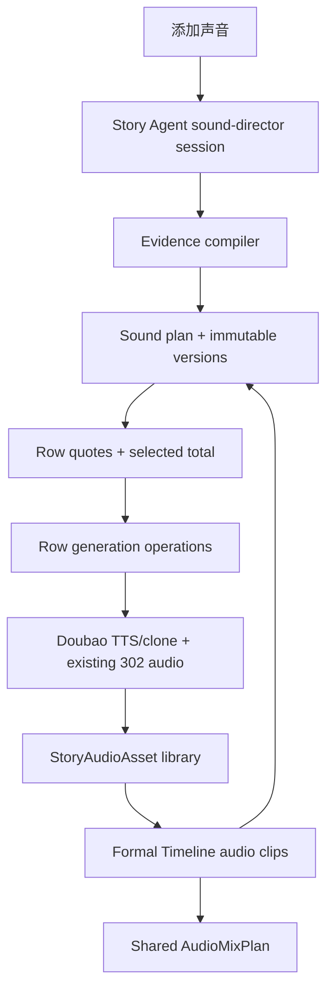
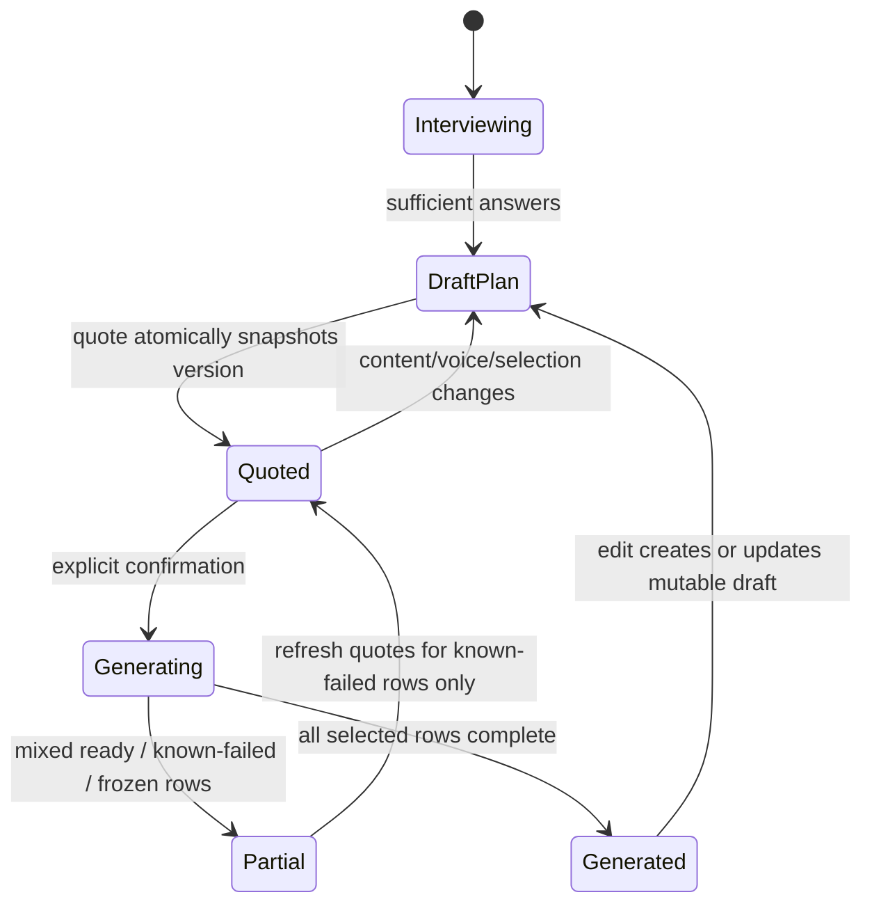
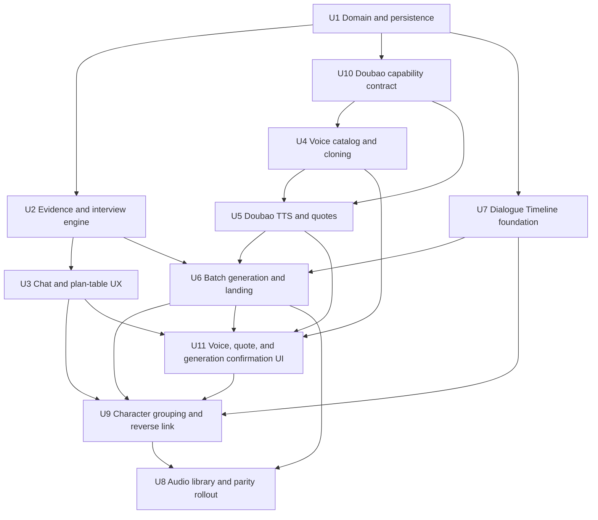
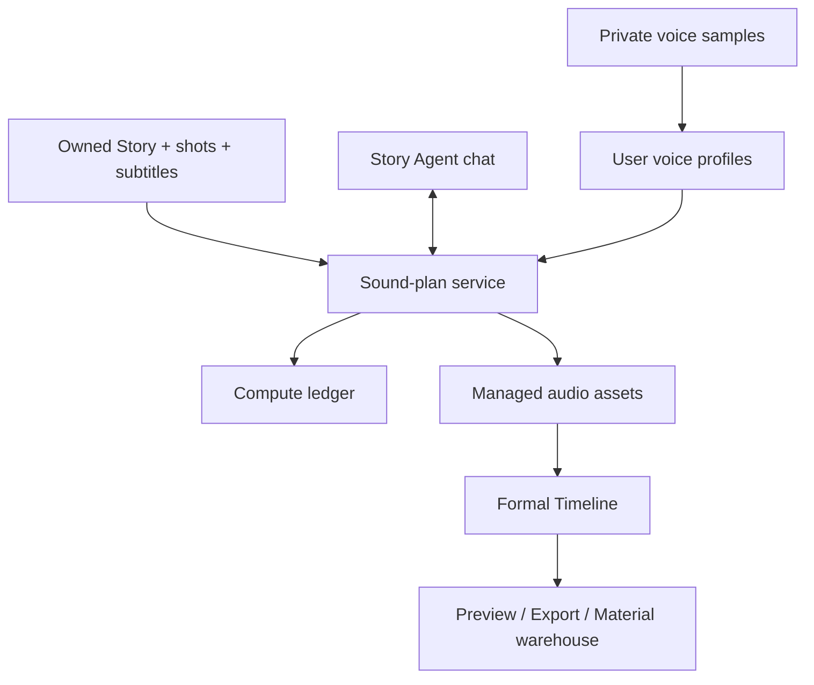

# feat: Add conversational sound director and layered audio workflow

## Summary

Extend the existing Story Agent, managed audio assets, paid-generation receipts, and formal Timeline instead of creating a second editor. A server-owned sound-plan domain will preserve the guided interview and whole-plan versions; row-scoped generation operations will turn confirmed rows into reusable audio assets and editable Timeline clips, while direct Volcengine/Doubao adapters add official voices and consented voice cloning.

---

## Problem Frame

The current editor can add narration, music, ambience, and effects one category at a time, but it cannot read the whole story, guide a non-expert through a coherent sound design, preserve character voice identity, or show one editable plan and total price before generation. The implementation must add that orchestration without weakening the existing asset/clip separation, subtitle binding, ownership isolation, paid-generation safety, Preview/Export parity, or legacy-read guarantees (see origin: `docs/brainstorms/2026-09-16-conversational-sound-director-requirements.md`).

---

## Requirements

- R1. Clicking “添加声音” enters a dedicated question-and-answer sound-director session in the existing chat and expands the chat if needed.
- R2. The director reads the owned Story, shots, subtitles, current Timeline, characters, and existing audio before asking or proposing anything.
- R3. Questions progress from global sound direction to scene-level decisions, and persisted answers can be revisited without restarting.
- R4. Each question presents 2–4 evidence-backed options plus free input; every suggestion retains traceable source evidence.
- R5. Unsupported sound categories are omitted with an explanation and remain manually addable; the system never fills tracks merely for completeness.
- R6. Dialogue uses verbatim source text when available. Inferred wording is explicitly marked `AI 草稿`, cannot be selected for paid generation, and becomes eligible only after user confirmation.
- R7. Each speaking character has one stable base voice across the whole plan; scene rows vary performance parameters rather than silently replacing the voice.
- R8. A cloned voice requires an explicit rights/consent record, an uploaded or recorded sample, provider processing, preview comparison, and user approval before it can be bound or used for paid synthesis.
- R9. The interview produces an editable, server-persisted whole-plan version whose rows expose type, scene/time, source or character, text/description, voice, performance/style, duration, selection, price, and status.
- R10. Versioning applies to the whole sound plan (V1, V2, …), not per-row multi-Take management.
- R11. Restoring a plan version changes only the editable plan; it never mutates clips, deletes assets, calls a provider, or incurs charges.
- R12. Rows are selected by default, may be unchecked independently, and receive authoritative per-row quotes plus a selected total.
- R13. Only a user-confirmed quote submits selected, eligible rows. Unselected, unchanged, stale-quoted, or unconfirmed-draft rows cannot be charged.
- R14. Every successful generated sound first becomes a managed StoryAudioAsset and then creates or replaces a non-owning editable Timeline clip.
- R15. The creative audio UI shows dialogue, narration, music, ambience, and effects; dialogue can expand into character groups. The existing source-audio semantic lane remains compatible and visible when populated.
- R16. Move, trim, gain, mute, and fade remain free, non-generative clip edits and never mutate or delete the source asset.
- R17. A generated clip can navigate back to its originating plan row. Changing text, voice, or performance requires a fresh quote and explicit regenerate confirmation; the prior asset remains retained.
- R18. Preview and Export continue to consume the same AudioMixPlan, including dialogue groups, overlaps, gain, mute, fades, and frame timing.
- R19. All generation preserves server-authoritative pricing, balance reservation/settlement, Story/User ownership, durable receipts, and `submission_unknown` freeze behavior.
- R20. Batch confirmation orchestrates row-level operations: successes remain usable, failures remain explainable and retryable, and retries do not resubmit completed rows.
- R21. Existing subtitle–narration binding, local audio import, source audio, undo, formal Timeline authority, and legacy read-only adapters remain intact.

**Origin actors:** A1 (creator), A2 (sound director), A3 (generation and Timeline system)

**Origin flows:** F1 (create sound plan), F2 (confirm and generate), F3 (edit or regenerate), F4 (choose a character voice)

**Origin acceptance examples:** AE1–AE10 from `docs/brainstorms/2026-09-16-conversational-sound-director-requirements.md`

---

## Scope Boundaries

- Do not create per-row multi-Take version management; immutable generated assets remain available, but V1/V2 labels describe the whole plan only.
- Do not introduce an arbitrary track manager. Character rows are a collapsible projection inside the dialogue lane, not user-created tracks.
- Do not remove the existing `source` audio lane. The model gains a sixth semantic kind, `dialogue`, while the user-facing creative stack remains the five requested layers plus source audio when it exists.
- Do not invent characters, events, spoken wording, sound cues, or locations unsupported by Story/shot/subtitle/user evidence.
- Do not automatically submit, retry, or “heal” paid operations whose provider outcome is unknown.
- Do not store the sound plan only in chat messages or only in Timeline extensions; both are projections, not the plan’s source of truth.
- Do not auto-generate when a subtitle changes, a plan version is restored, a clip is edited, or a voice preview finishes.
- Do not delete legacy Timeline readers or migrate old `voiceAudio*`/ChatCut data in this feature.
- Multilingual dubbing, word-level karaoke, automatic ducking, loudness normalization, and general-purpose audio mastering remain out of scope.
- The lightweight WeChat mini-program audiobook product is being designed in a separate task and is not implemented by this desktop-repository plan.

### Deferred to Follow-Up Work

- A unified cross-provider deletion center and deletion of historical generated Story assets across all stories are deferred. Doubao clone-slot withdrawal/deletion or a documented provider DSAR path is not deferred: U10/U4 must establish it, alongside local raw-sample TTL/cleanup, before accepting real recordings.
- Automatic orphan-asset garbage collection remains deferred until the repository defines a retention policy for StoryAudioAsset.
- Audited resolution of `submission_unknown` states is separate operations work after provider status/billing contracts and an admin authorization model exist. This release preserves receipts, holds, and frozen dependents, surfaces age/escalation guidance, and never retries or edits the outcome directly.
- Generic “place any library audio on any Timeline lane” is deferred; current direct import/add flows remain available, while this plan adds only automatic generated placement and its idempotent failure recovery.
- New third-party voice onboarding is deferred until documented authorization review exists. This release’s new-clone wizard supports the signed-in user’s own voice with a fresh randomized challenge/liveness capture; already provider-verified profiles may be used only when their assurance/scope is imported and validated.

---

## Context & Research

### Relevant Code and Patterns

- `shared/timelineAudioModel.ts` is the authoritative pure clip/track model: 30fps non-negative integer frames, non-owning `assetId`, no speed, and fixed semantic tracks.
- `server/services/storyAudioAssets.ts`, `server/services/storyAudioImport.ts`, and `server/services/audioMedia.ts` establish managed bytes, ready-gating, Story/User ownership, probing, and recoverable import.
- `server/services/storyNarration.ts` establishes signed quote → reserve → provider attempt → immutable candidate → explicit adopt, including `submission_unknown` handling.
- `server/services/storyAudioGeneration.ts` and `server/services/storyAudio302.ts` already generate context-aware music, ambience, and effects from server-resolved shot context.
- `server/routers/timelineMedia.ts` and `client/src/features/creationEditor/timelineMedia/useTimelineMediaController.ts` are the narrow-command boundary for media changes.
- `client/src/features/creationEditor/timelineMedia/AddTimelineMediaMenu.tsx` is the present “添加声音” entry; `AudioTrackRow.tsx` is the existing editable lane UI.
- `client/src/features/storyAgent/StoryAgentContext.tsx`, `client/src/features/storyAgent/views/StoryAgentChat.tsx`, and `client/src/pages/EditingStudioPage.tsx` provide persisted chat plus the dedicated editing-command precedence seam.
- `client/src/features/creationEditor/views/MaterialWarehousePanel.tsx` already owns the Story material drawer and should gain an audio tab instead of introducing a second material-library shell.
- `server/services/editContext.ts`, `server/services/videoShotContext.ts`, and the structured-output director services provide patterns for compiling bounded context and validating model output.
- `server/services/timelineMediaExport.ts` and `client/src/features/creationEditor/timelineMedia/TimelineAudioEngine.tsx` already derive Export and Preview from the formal audio state.

### Institutional Learnings

- `docs/solutions/2026-06-13-故事为唯一单位-镜头按storyId.md` requires Story to remain the work unit and every `storyId` read/write to be combined with `userId`; “latest story” lookup is forbidden.
- `docs/solutions/2026-06-13-多worktree环境数据分裂收敛.md` and `AGENTS.md` require the only dev server to remain the main-repository process on port 3000. Worktrees may modify code but must never run a server or write `.webdev/` data.
- `docs/features/feature-ledger.json` records the `timeline-subtitle-audio-editing` and `storyboard-voice-lane` invariants. This plan extends those capabilities and must not downgrade their working/observing evidence.

### External References

- Volcengine, [声音复刻 API V3](https://docs.volcengine.com/docs/6561/2227958?lang=zh): direct `X-Api-Key` authentication, training and status endpoints, base64 sample limits, optional transcript consistency checking, demo audio, and states that permit subsequent TTS.
- ChatCut, [Voice Library](https://chatcut.io/docs/voice-library), [AI Voiceover](https://chatcut.io/docs/ai-voiceover), and [Music and Sound Effects](https://chatcut.io/docs/music-and-sound-effects): planning/selection precedes generation, voices can be previewed, cloning separates sample capture from preview, and generated audio becomes reusable media before Timeline placement.

---

## Key Technical Decisions

| Decision | Rationale |
|---|---|
| Persist sound plans outside chat and Timeline | Chat remains the conversational projection and Timeline remains the committed edit. A dedicated Story/User-owned plan domain can resume a question, save V1/V2, quote a stable snapshot, and restore a version without mutating media. |
| Treat model output as evidence-linked proposals | A deterministic compiler provides bounded evidence IDs; a validator rejects references to missing characters/scenes/cues and marks non-verbatim dialogue as a blocked AI draft. This enforces the user’s “do not create unrelated things” constraint beyond prompt wording. |
| Add `dialogue` as a formal sixth audio kind | Mapping dialogue into `narration` would erase speaker identity and make character grouping unreliable. Preserving `source` avoids breaking old data; speaker grouping remains presentation metadata on dialogue clips, not a new track manager. |
| Persist reusable cloned voices at user scope and voice assignments at Story-plan scope | The user’s voice should be reusable in future Stories, while a character-to-voice binding is specific to a sound plan. Raw samples, provider IDs, consent, and Story bindings must not be conflated. |
| Keep raw clone samples in a private user-owned blob boundary with short retention | StoryAudioAsset is Story-scoped and intended for reusable edit media; raw biometric-like training input needs stricter access, backup exclusion, consent linkage, expiry, and cleanup than ordinary Story audio. |
| Use direct official Volcengine/Doubao adapters for cloned voices and speech synthesis | Existing 302 integration can continue for music/effects and legacy narration, but official cloning status, preview, slot-charge semantics, and voice IDs require an adapter whose contract the server controls. |
| Separate clone preview acceptance from priced first formal use | Preview acceptance approves quality, not a charge. When first formal synthesis can activate a billable slot, the final batch quote shows that line item and its single explicit generation confirmation authorizes both activation and selected rows; no redundant activation modal is added unless provider/legal policy requires it. |
| Treat first-use voice activation as its own durable paid operation | Quote arithmetic alone cannot prevent two tabs or Stories from activating the same reusable voice twice. One uniquely claimed profile/provider/price-version operation owns reservation, provider attempt, receipt, and unknown-outcome state; dependent speech rows wait for it. |
| Quote and execute rows independently | A whole-plan confirm is an orchestration convenience, not one irreversible transaction. Row-level immutable request digests, quotes, and receipts allow partial success and safe retry without duplicating completed work. |
| Generate asset first, then apply a narrow Timeline mutation | Provider success must produce managed bytes and provenance before any clip references the asset. Re-generation swaps the clip’s asset reference atomically while retaining the old asset. |
| Extend the existing material warehouse with an audio tab | The user asked for original media in the library and editable copies on the Timeline. Reusing the existing drawer preserves one mental model and avoids a second “素材库.” |
| Keep Preview and Export on one normalized audio model | Dialogue and plan-link metadata may change grouping and navigation but cannot create an alternate playback path; both consumers continue to resolve the same AudioMixPlan. |

---

## Open Questions

### Resolved During Planning

- **Where does whole-plan version state live?** In a server-owned, Story/User-scoped domain with immutable version snapshots and a mutable current interview/draft pointer; chat and Timeline carry references only.
- **How are character subtracks represented?** As a grouped view over `dialogue` clips carrying a stable speaker identity. They are collapsible, but they are not independently created/deleted tracks.
- **How are existing five tracks preserved?** `dialogue` is added; `narration`, `music`, `ambience`, `sfx`, and `source` remain readable. Empty tracks may collapse, and source is shown when content exists.
- **What is the paid batch boundary?** Each selected row has its own signed quote and durable operation. Batch status is a deterministic projection of authoritative row states; it never permits a frozen unknown row to be treated as retryable or hides row receipts.
- **How is cloned voice consent enforced?** A versioned record identifies the voice subject, submitter’s rights basis, allowed product/cross-Story scope, sample digest, policy version, and confirmation time. Owned sample, provider status, preview acceptance, and a final priced batch confirmation covering first-use activation are server-enforced prerequisites; client booleans alone are insufficient.
- **Which provider performs which work?** Official Doubao handles voice catalog/clone/TTS in the new path. Existing 302 music and effects remain behind their current server adapters unless later provider work is separately approved.

### Deferred to Implementation

- U10 must resolve the exact Doubao speech-synthesis product/resource ID, official-voice source/allowlist, preview method, controls, and price version against the enabled account before U4/U5 are considered complete; unavailable voices are omitted rather than emulated.
- The final bounded context size and scene chunking thresholds should be tuned against representative long Stories during implementation while preserving deterministic evidence coverage tests.
- The exact migration sequence number may need rebasing if another migration lands first; the migration content and ownership constraints in U1 remain unchanged.
- The exact browser microphone codec depends on runtime support. The client may prefer a supported compressed format, but the server must normalize only provider-documented formats and enforce the 10 MiB upper bound.

---

## High-Level Technical Design

> *This illustrates the intended approach and is directional guidance for review, not implementation specification. The implementing agent should treat it as context, not code to reproduce.*

The interview/session and each row operation use explicit lifecycles rather than UI-local loading flags:

For one selected row, `prepared → submitting → ready | failed | submission_unknown`. Only `failed` outcomes known not to have charged may be offered for retry. `submission_unknown` is frozen and escalated without an automatic or user-facing retry, matching the existing narration invariant.

---

## Implementation Units

### U1. Establish the sound-plan, voice-profile, and operation domain

**Goal:** Create the ownership, versioning, consent, and row-operation facts that all later UI and provider work depend on, with equivalent MySQL and local-persist behavior.

**Requirements:** R3, R7–R11, R19, R20; F1–F4

**Dependencies:** None

**Files:**
- Create: `shared/storySoundPlan.ts`
- Create: `shared/storyVoiceProfile.ts`
- Create: `server/services/storySoundPlanStore.ts`
- Create: `server/services/storySoundPlanStore.test.ts`
- Create: `server/services/storyVoiceProfiles.ts`
- Create: `server/services/storyVoiceProfiles.test.ts`
- Create: `server/services/voiceSampleMedia.ts`
- Create: `server/services/voiceSampleMedia.test.ts`
- Create: `server/services/storySoundLimits.ts`
- Create: `server/services/storySoundLimits.test.ts`
- Create: `server/db.storySoundDirector.test.ts`
- Create: `drizzle/0022_story_sound_director.sql`
- Modify: `drizzle/schema.ts`
- Modify: `drizzle/relations.ts`
- Modify: `server/db.ts`

**Approach:**
- Define normalized shared contracts for session state, plan version snapshots, evidence references, rows, row eligibility, character voice assignments, and row-generation linkage. Persist monetary amounts as integer minor units and all Timeline positions as 30fps non-negative integer frames.
- Store one mutable Story/User-scoped workspace/draft plus immutable content-addressed whole-plan versions. Each version includes its canonical creative-content digest and evidence-snapshot digest/source revisions. “Restore” copies an old snapshot into a new mutable draft. An optional “保存新版本” action or server-authoritative “获取报价” transaction reuses the identical version or creates the next version only when creative content/evidence changed; selection, quote attempts, expiry, and price versions live outside version history. Quotes bind to the immutable version/evidence/row digests. Optimistic revision checks prevent two tabs from silently overwriting answers or draft edits.
- Store reusable user-owned cloned voice profiles separately from Story-specific character assignments. Persist voice subject, submitter rights basis, assurance level, randomized challenge identity/result, allowed use/cross-Story scope, policy version/time, consentRecordId, sample digest, provider resource identity, lifecycle status, preview acceptance, activation state, and deactivation; never expose provider secrets or accept `userId` from the client.
- Store raw clone samples in a private user-owned blob record, not StoryAudioAsset, JSON/base64, or database text. Envelope-encrypt bytes at rest with environment-separated managed key material and recorded key version; persist only an opaque storage key, content hash, probed media metadata, consent link, provider-submission link, expiry/deletion state, and ownership. Deny public/static paths and exclude sample bytes from local-persist and backups.
- Define shared server-side quotas/concurrency guards for interview/model requests, decoded upload/storage budget, active voice profiles/training operations, coalesced status polls, quote rate, maximum selected rows/batch, concurrent provider submissions, and per-user spend/reservation ceilings. Limits fire before decode, storage allocation, ledger reservation, or provider calls.
- Store row operations with a unique owner/request identity, immutable request digest, quote/version linkage, provider attempt state, asset/clip result links, operation purpose, and failure/outcome classification. Add a separate uniquely keyed voice-activation operation for `(user, voice profile, provider, activation price version)`. Use composite Story/User ownership constraints wherever a row references Story-owned facts.
- Story deletion may remove mutable interview/draft content after normal deletion policy, but it must not cascade away charged or unresolved operation receipts. Preserve/tombstone the minimal owner, Story identity snapshot, digest, money, provider-attempt, and audit metadata in the compute/reconciliation ledger for its required accounting period.
- Extend local memory serialization, deletion cleanup, ID allocation, and test reset alongside Drizzle tables; do not let local mode silently omit a new collection.

**Execution note:** Implement domain normalization and ownership tests first; add schema/persistence only after the lifecycle and invariants are executable as pure tests.

**Patterns to follow:**
- `drizzle/schema.ts` StoryAudioAsset ownership indexes and operation tables
- `server/db.ts` dual MySQL/local-memory repository functions
- `server/services/storyAudioAssets.ts` owned-load helpers
- `shared/timelineAudioModel.ts` normalization of stored unknown data

**Test scenarios:**
- Happy path: create an interview workspace, persist answers, save V1, modify a row, and save V2; listing returns both immutable versions and V1 content is unchanged.
- Version deduplication: repeated, failed, expired, or selection-only quote attempts against unchanged creative/evidence digests reuse V1; only a creative/evidence change can create V2.
- Covers AE5: restore V1 by copying it into a new draft, save or quote it as a later immutable version, and verify neither V1 nor V2 changes and no Timeline, asset, or provider function is invoked merely by restore/save.
- Edge case: two clients update the same workspace revision; the stale update is rejected with the latest server revision and neither snapshot is partially written.
- Concurrency: one tab edits a draft while another saves/quotes; the quote transaction snapshots and binds to exactly one immutable version, and later draft edits cannot change its digest.
- Security: a second user cannot read or update a plan, row operation, sample, voice profile, or assignment by guessing IDs.
- Data integrity: deleting a Story removes mutable plan workspace/content according to policy but retains/tombstones charged or unresolved paid-operation receipts and reconciliation identity; it does not delete a reusable user voice profile. Deactivating/withdrawing consent prevents new training, bindings, activations, and synthesis while preserving required historical audit facts.
- Consent integrity: a sample digest or consent scope change creates a new clone-training operation; even the same user cannot rebind an unrelated sample/consent record to an existing approved profile.
- Assurance: a new self-voice profile requires a fresh, unexpired randomized challenge/liveness result bound to consent and sample digest; replayed challenge audio or a checkbox-only assertion cannot reach preview-ready/active state.
- Activation concurrency: two Stories attempt first formal use of the same profile concurrently; exactly one activation operation/reservation is created and both batches depend on its single terminal result.
- Local parity: serialize and reload all new rows from `.webdev/local-persist.json` without ID collisions, missing consent state, or dropped version links.
- Private storage: persisted blobs are ciphertext; ownership-checked streaming uses short-lived single-purpose access, rejects foreign/expired/replayed tokens, and key-version rotation can read old ciphertext without exposing plaintext to backups/logs.
- Limits: repeated/concurrent requests hit explicit retryable quota errors before media decode, storage allocation, compute reservation, or provider invocation; poll coalescing produces one upstream status call.
- Migration: the schema accepts existing databases with no sound-plan rows and preserves every existing StoryAudioAsset and Timeline document.

**Verification:**
- The server can round-trip a two-version plan and a preview-approved cloned voice in both local and MySQL test modes, with Story/User isolation and no side effects on Timeline or compute state.

### U2. Compile story evidence and run a resumable interview engine

**Goal:** Produce short, context-aware questions and a validated plan without allowing the model to invent unsupported story facts.

**Requirements:** R1–R6, R9–R11, R21; A1, A2; F1; AE1, AE2

**Dependencies:** U1

**Files:**
- Create: `server/services/storySoundContext.ts`
- Create: `server/services/storySoundContext.test.ts`
- Create: `server/services/storySoundDirector.ts`
- Create: `server/services/storySoundDirector.test.ts`
- Create: `server/routers/storySoundDirector.ts`
- Create: `server/routers.storySoundDirector.test.ts`
- Modify: `server/routers/index.ts`
- Modify: `server/services/storyConversation.ts`

**Approach:**
- Compile an owned, bounded evidence packet from Story body, stable shots, formal subtitle cues, current Timeline audio, shot sound requirements, and confirmed character data. Each evidence item carries source kind, stable source identity, text/hash, scene/frame range, and certainty.
- Canonicalize the packet into an evidence-snapshot digest plus per-source revision/hash markers that are persisted with each immutable plan version. Recompute or cheaply compare markers before quote and confirm; changed/removed source evidence marks only affected rows stale and requires explicit rebase/review, while unrelated user-authored answers may survive.
- Prefer deterministic extraction for verbatim dialogue, existing sound requirements, cue timing, and current audio. Use the language model only to group evidence, propose bounded options, and phrase questions.
- Validate every model-suggested character, scene, cue, time range, and evidence reference against the packet. Reject or omit unsupported suggestions instead of “repairing” them with new content.
- Generate the next question from a persisted step engine: global direction first, then only scenes/categories supported by evidence. Every question has 2–4 grounded options and a free-text path; previous answers remain editable.
- Keep the first release linear: persist a global-then-scene cursor. Editing an earlier answer invalidates and deterministically rebuilds every subsequent derived question/row, while preserving prior answers only as reviewable suggestions. Move to the first rebuilt question and block version save/quote until the downstream sequence is reviewed again. Do not introduce a general dependency graph until usability evidence requires selective invalidation.
- If intent is present but verbatim dialogue is absent, create an `AI 草稿` row with source evidence and a blocked eligibility state. Only a specific user confirmation of the text clears the block.
- Write human-readable question/answer summaries to the existing Story conversation for continuity, but store structured interview state and versions only in the new domain.
- Expose narrow authenticated procedures to start/resume, answer/go back, build a version, edit a row, confirm draft wording, and list versions. No procedure accepts provider choice, cost, or owner identity as authority from the client.
- Apply U1’s per-user interview/model rate and concurrency guard before compiling/invoking, while idempotent resume/list requests remain cheap and do not consume provider quotas.

**Execution note:** Start with fixtures for stories containing explicit dialogue, paraphrased speech, no audio need, existing clips, ambiguous characters, and long multi-scene content; implement the compiler and validator before adding model calls.

**Patterns to follow:**
- `server/services/editContext.ts` for server-owned context assembly
- `server/services/videoShotContext.ts` for stable shot context
- `server/services/imagePromptDirector.ts` and `server/services/videoPromptDirector.ts` for structured model output with deterministic validation
- `server/routers/timelineMedia.ts` for narrow authenticated procedures

**Test scenarios:**
- Covers AE1: a Story with explicit dialogue and indoor rain evidence yields global questions followed only by dialogue/rain questions, with no gunshot, vehicle, or unrelated category.
- Covers AE2: “她向母亲道歉” without quoted words produces a blocked `AI 草稿`; the row cannot become generation-eligible until the user confirms the exact text.
- Happy path: interrupt an interview after two answers, reload it, continue at the same unanswered step, go back, edit the first answer, and build a new version whose downstream rows reflect the change.
- Linear invalidation: editing any earlier answer rebuilds the downstream sequence, shows prior answers as “待复核” suggestions, resumes at the first rebuilt question after reload, and blocks version/quote until the sequence is reviewed; repeated rebuilds remain deterministic and do not duplicate questions.
- Existing-content edge: a scene already has an ambience clip linked to matching evidence; the director reports it and avoids proposing a duplicate by default.
- Evidence drift: edit/remove a quoted subtitle/shot requirement before confirmation; affected rows and quotes become stale before reservation, unchanged user answers remain available for rebase, and no obsolete provider request is submitted.
- Ambiguity edge: two characters have the same display name or no stable identity; the engine asks for disambiguation instead of binding a voice automatically.
- Long-story edge: chunked context still covers every scene identity once, preserves evidence links, and does not repeat the same question after resume.
- Error path: malformed model JSON, unknown evidence IDs, unsupported row types, or out-of-range frames result in a recoverable director error and no persisted plan version.
- Security: another user’s Story ID is rejected before story body, shots, subtitles, or audio are read.
- Abuse path: rapid duplicate answers/model requests are coalesced or rejected before model invocation and cannot create duplicate steps or versions.

**Verification:**
- Every persisted row can be traced to at least one valid Story/user answer evidence record, and fixtures containing no source support never gain generated content merely because a category exists.

### U3. Add the chat-first interview and editable plan workspace

**Goal:** Make “添加声音” open the existing chat, conduct one-question-at-a-time interaction, and end in an editable whole-plan workspace before any provider integration is required.

**Requirements:** R1, R3–R6, R9–R11; A1, A2; F1; AE1, AE2, AE5

**Dependencies:** U1, U2

**Files:**
- Create: `client/src/features/creationEditor/soundDirector/useStorySoundDirector.ts`
- Create: `client/src/features/creationEditor/soundDirector/useStorySoundDirector.test.tsx`
- Create: `client/src/features/creationEditor/soundDirector/SoundDirectorQuestionCard.tsx`
- Create: `client/src/features/creationEditor/soundDirector/SoundDirectorQuestionCard.test.tsx`
- Create: `client/src/features/creationEditor/soundDirector/SoundPlanTable.tsx`
- Create: `client/src/features/creationEditor/soundDirector/SoundPlanTable.test.tsx`
- Modify: `client/src/features/creationEditor/timelineMedia/AddTimelineMediaMenu.tsx`
- Modify: `client/src/features/creationEditor/timelineMedia/AddTimelineMediaMenu.test.tsx`
- Modify: `client/src/features/storyAgent/StoryAgentContext.tsx`
- Modify: `client/src/features/storyAgent/StoryAgentContext.intent.test.tsx`
- Modify: `client/src/features/storyAgent/views/StoryAgentChat.tsx`
- Modify: `client/src/pages/EditingStudioPage.tsx`
- Modify: `client/src/features/creationEditor/views/EditingNleWorkspace.tsx`

**Approach:**
- Promote sound director to the primary voice action while retaining a secondary/manual path for direct narration/import/music/ambience/effects. Clicking it activates the director session, switches to Editing if needed, and expands/focuses chat.
- Add a dedicated session route with higher precedence than generic story chat and the general editing-command runner. While active, answers, back/edit actions, and free text go only to the sound-director API; users can explicitly exit to ordinary chat.
- Render one active question at a time with evidence-aware choices, free input, progress, “why this is asked,” and a skip explanation. Preserve accessibility for keyboard, focus, and screen-reader labels.
- Render the plan as a server-backed card/table rather than embedding mutable JSON in a chat message. The current workspace is editable; saved V1/V2 snapshots are read-only, and “基于此版本修改” copies a snapshot into the draft. Support inline row edits, default-selected checkboxes, AI-draft confirmation, and version viewing/restoration; voice/quote/generation controls remain capability-disabled until U11.
- Use semantic table/grid structure with stable row labels, select-all semantics, keyboard-operable text/choice controls, and a narrow-panel card/row layout that preserves row identity and actions. Move focus to the new question after answer/back and announce question, validation, save, and conflict states through appropriate live regions.

**Patterns to follow:**
- `client/src/features/storyAgent/StoryAgentContext.tsx` dedicated selection/edit command precedence
- `client/src/features/storyAgent/views/AssetSwapProposalCard.tsx` for actionable chat cards backed by server facts
- `client/src/features/creationEditor/visualAssets/VisualAssetLibrary.tsx` for dense but editable asset controls

**Test scenarios:**
- Covers AE1: click “添加声音,” verify chat expands and the first global question appears without first requiring a type-menu choice.
- Routing integration: while a sound session is active, answering “温暖克制” updates the interview and does not call ordinary story chat or `editingCommandRunner`; exiting restores normal routing.
- Covers AE2: an AI-draft row is visibly labeled and generation-ineligible; confirming edited wording only updates the draft and never calls a provider.
- Covers AE5: view V1/V2 read-only, copy V1 into a new draft, optionally save it as a later version, and verify no Timeline/generation mutation fires and existing clips remain unchanged.
- Failure path: server conflict from another tab preserves the user’s current edit, shows the newer version, and requires an explicit refresh/merge choice instead of overwriting.
- Accessibility: question choices, back/edit, AI-draft confirmation, version controls, and narrow-panel plan editing work by keyboard; screen-reader assertions cover question/live status and stable row labels.

**Verification:**
- From the Editing page, a user can complete the grounded interview and edit/save a whole plan without any speech-provider capability; ordinary chat cannot bypass the server workspace/version rules.

### U10. Establish the verified Doubao speech capability contract

**Goal:** Resolve account-specific TTS, official-voice, preview, control, resource, and pricing facts before UI or paid orchestration treats them as available.

**Requirements:** R7, R8, R12, R19; F4

**Dependencies:** U1

**Files:**
- Create: `shared/storyVoiceCapabilities.ts`
- Create: `server/services/doubaoSpeechCapabilities.ts`
- Create: `server/services/doubaoSpeechCapabilities.test.ts`
- Create: `docs/integrations/doubao-speech.md`
- Modify: `server/_core/env.ts`
- Modify: `.env.example`

**Approach:**
- Verify against the enabled account and current official documentation: TTS endpoint/auth/resource/app identifiers, clone resource entitlement, allowed official voice IDs, preview method, supported emotion/rate/intensity controls, one-time activation semantics, and price version source.
- Verify the provider data contract before enabling cloning: processing/retention purpose, training use, region/residency, policy version, sample/voice-slot retention, withdrawal/deletion or DSAR path and SLA. Record the contract version/region on consent/training operations and present a concise disclosure before upload; if the contract cannot meet the requirement, keep cloning disabled.
- Load credentials from environment-separated secret-manager/config references with least-privilege entitlements. Document rotation, revocation, and dual-key rollover without logging values; startup validation reports capability only.
- Encode only verified facts in a server-owned capability contract. If no official catalog API exists, use an entitlement-tested server allowlist with labels/preview support rather than inventing a dynamic catalog.
- Return booleans and owned opaque capability IDs to clients, never credentials, raw provider responses, or externally usable voice IDs. Missing/ambiguous entitlement disables only the affected option and keeps manual import/other configured audio paths available.
- Make capability/price version changes invalidate relevant quotes; do not perform a paid synthesis merely to probe availability.

**Patterns to follow:**
- `client/src/features/creationEditor/timelineMedia/timelineMediaCapabilities.ts` explicit capability gating
- `server/_core/env.ts` server-only environment normalization
- `server/services/storyVoice302.ts` bounded adapter configuration

**Test scenarios:**
- Configured entitlement exposes only allowlisted, verified official/clone/TTS capabilities and supported performance controls.
- Missing resource/app/price version disables the exact dependent capability with a clear reason while unrelated audio/import features remain enabled.
- A provider voice not in the verified server contract cannot be selected by sending its raw ID from the client.
- Missing/unknown provider retention, region, deletion/DSAR, or policy version disables real sample submission and explains why without exposing account details.
- Credential rollover switches scoped keys without losing in-flight operation identity; revoked/invalid keys disable capability and never appear in startup/API/log output.
- Capability/router/error snapshots contain no API key, authorization header, full provider payload, or externally usable voice identifier.
- Updating capability or price version invalidates affected cached quotes but does not mutate plans, assets, or Timeline clips.

**Verification:**
- U4/U5 can consume a documented, tested contract without making an unverified provider-interface decision or a paid discovery call.

### U4. Integrate official voices and consented Doubao voice cloning

**Goal:** Let users preview official voices or create a reusable owned clone through Volcengine/Doubao without allowing an unapproved or unready voice into paid synthesis.

**Requirements:** R7, R8, R19; F4; AE3

**Dependencies:** U1, U10

**Files:**
- Create: `server/services/doubaoVoiceClone.ts`
- Create: `server/services/doubaoVoiceClone.test.ts`
- Create: `server/services/storyVoiceCatalog.ts`
- Create: `server/services/storyVoiceCatalog.test.ts`
- Create: `server/services/voiceSampleCleanup.ts`
- Create: `server/services/voiceSampleCleanup.test.ts`
- Create: `scripts/cleanup-voice-samples.ts`
- Create: `scripts/cleanup-voice-samples.test.ts`
- Create: `server/routers/storyVoiceProfiles.ts`
- Create: `server/routers.storyVoiceProfiles.test.ts`
- Create: `client/src/features/creationEditor/soundDirector/VoiceProfilePicker.tsx`
- Create: `client/src/features/creationEditor/soundDirector/VoiceProfilePicker.test.tsx`
- Create: `client/src/features/creationEditor/soundDirector/VoiceCloneWizard.tsx`
- Create: `client/src/features/creationEditor/soundDirector/VoiceCloneWizard.test.tsx`
- Modify: `server/routers/index.ts`
- Modify: `server/_core/index.ts`
- Modify: `scripts/backup-local-media.ts`
- Modify: `scripts/backup-local-media.test.ts`

**Approach:**
- Implement a direct server adapter for the V3 clone training and status endpoints using `DOUBAO_SPEECH_API_KEY`; keep resource/app identifiers and timeouts in validated environment configuration.
- Provide the server-filtered official voice allowlist/catalog and preview method proven by U10. If the provider has no catalog endpoint, serve the verified allowlist rather than simulating discovery. Do not let the client invent provider/voice IDs; capability responses hide unconfigured or unentitled choices.
- Accept only documented sample formats and verify the decoded bytes rather than trusting base64 length or MIME. Bound HTTP body/base64 length, decoded size, duration, channels, sample rate, probe/decode CPU, and timeout; compare MIME with magic/probe results. Bound optional transcript length/characters and never echo it in errors.
- Put samples only in U1’s private owned blob boundary. Temporary upload/base64/transcode files are removed immediately; raw samples default to a short training/retry TTL and are deleted after preview-ready/terminal state unless the user separately chooses an allowed retention option. Preview audio has its own short TTL. `.webdev/local-persist.json` and `.webdev/backups/` must never contain sample bytes/base64.
- Stream original/preview audio only through an authenticated ownership check and short-lived single-purpose token; never return a raw private storage path or long-lived provider URL.
- Run bounded cleanup at server startup and on a conservative interval, with an explicit idempotent operator script for recovery. Backup tooling must explicitly exclude the private sample root, while cleanup uses owned opaque keys and recorded expiry/deletion state rather than globs or client paths.
- Capture a versioned rights statement before upload/recording, including voice subject, submitter rights basis, allowed product/cross-Story use, and policy version. Persist the consent record before provider submission and bind every training operation to consentRecordId + sample digest + owned profile.
- Limit new profiles in this release to the signed-in user’s own voice. Issue a short-lived randomized challenge phrase, require fresh live capture bound to the consent/sample digest, and persist an assurance result before provider training. Uploaded training audio still requires the live challenge; replayed/expired challenge audio or checkbox-only consent cannot create a reusable profile.
- Treat clone-training submission as a durable operation with `prepared`, `submitting`, provider identity/job handle, terminal states, and `submission_unknown`. Use a provider idempotency/client token or deterministic owned voice identity when supported; after a lost response, query the persisted identity first and freeze rather than POST again when submission cannot be disproven.
- Poll status through an explicit query/backoff policy. Map provider failure reasons (no clear voice, low signal-to-noise, review rejection, voiceprint/WER mismatch) into stable user-facing categories while retaining a safe diagnostic code.
- Materialize provider demo URLs only through the existing HTTPS/provider-host allowlist, redirect/DNS revalidation, response size/type, and timeout controls. Store demo audio as a short-lived private preview result according to provider terms. “Preview accepted” unlocks binding; it does not authorize first paid TTS.
- When first formal use can activate a billable slot, include it in U5/U11’s final authoritative quote; that single explicit generation confirmation authorizes activation plus selected rows. After successful use, store activation state so later batches do not show or charge the line again.
- Allow consent withdrawal/deactivation to immediately block new training, binding, activation, and synthesis, delete local retained samples/previews, and invoke or operationalize U10’s provider deletion/DSAR path. UI distinguishes immediate “stop future use” from provider deletion completion and from deferred historical generated-asset deletion.
- Capability and error responses expose only owned opaque IDs and normalized states. Structured logs use a server-keyed fingerprint for sensitive short text and never include API keys, authorization headers, raw samples/base64/transcripts, full provider payloads, or externally usable voice IDs.
- Implement the wizard as explicit resumable steps: self-voice rights/scope → randomized live challenge → record or upload training sample with validation → upload progress → provider processing (safe to close and resume) → actionable rejection/replace-sample → original-versus-clone preview comparison → save/accept profile. The wizard ends before billable activation; U11’s priced batch confirmation handles first formal use.

**Execution note:** Test the provider adapter entirely with fixtures first. A real sample upload or first formal synthesis is a paid/privacy-sensitive smoke test and requires explicit user authorization during implementation.

**Patterns to follow:**
- `server/services/storyVoice302.ts` timeout/outcome classification
- `server/services/storyAudioImport.ts` bounded media ingestion and recoverable operation identity
- `server/services/storyAudioProxy.ts` safe remote fetch rules where provider preview URLs must be materialized
- `client/src/features/creationEditor/timelineMedia/TimelineAudioCreationDialog.tsx` explicit quote/confirmation boundary

**Test scenarios:**
- Covers AE3: select an official voice for one character and verify three scene rows share the same base voice while emotion/rate/intensity differ per row.
- Consent failure: upload/record submission without the current consent version is rejected server-side even if the client sends `consented: true`.
- Assurance failure: expired/replayed challenge, challenge/sample digest mismatch, failed liveness/voice match, or third-party subject selection cannot submit training; an already provider-verified imported profile must carry a validated assurance/scope record.
- Format/size edge: documented audio formats within limits proceed; unsupported MIME, empty audio, or payload over 10 MiB fails before a provider call.
- Provider lifecycle: training accepted → polling → preview-ready state persists across reload; duplicate client retries reuse the same owned request rather than create a second voice slot.
- Unknown training submission: provider accepts but the HTTP response is lost; status lookup reuses the persisted provider identity, and absence of authoritative proof freezes the operation without a second POST.
- Provider errors: no-clear-voice, low-SNR, review rejection, WER mismatch, timeout, and malformed payload map to actionable stable states without leaking provider secrets.
- Preview boundary: preview success alone cannot bind the profile until the user accepts it; binding alone cannot perform first paid use without the separate charge confirmation when required.
- Security: one user cannot list, preview, bind, deactivate, or submit synthesis with another user’s cloned voice ID.
- Retention: raw sample, temporary transcode, preview, terminal-failure, and consent-withdrawal cleanup follow their TTL/status rules; sample bytes never enter local-persist, backups, logs, API errors, or router snapshots.
- Cleanup integration: advance the clock, run the real startup/periodic cleanup and operator entry, and verify expired samples/previews/temp files are removed, active training-window samples remain, repeated cleanup is idempotent, and media backups omit the private sample root.
- Observability: capability/router/error/log snapshots contain no API key, authorization header, base64, transcript, raw/provider payload, or externally usable voice identifier.
- UI: microphone denial offers file upload and clear browser-setting guidance without losing the wizard; canceling after preview causes no TTS call.
- Abuse limits: per-user/profile/storage/upload/training/poll quotas and concurrency guards reject before decode or provider submission; concurrent clients share one status poll and receive retry guidance.
- Wizard lifecycle: refresh during provider processing resumes status; upload interruption can safely retry the same owned digest; provider rejection offers sample replacement; expired preview regenerates only the preview path; cancellation, consent withdrawal, and safe close explain retained/deleted sample consequences and never activate the voice.
- Withdrawal: future use is blocked synchronously, local private bytes are removed by policy, provider deletion/DSAR status is tracked to its documented SLA, and failure cannot silently reactivate the profile.

**Verification:**
- A configured account can list/preview entitled official voices and complete clone-to-preview with an owned audit trail; an unconfigured account receives a clear capability state and no fake voices.

### U5. Add official Doubao TTS and row-scoped authoritative quotes

**Goal:** Synthesize dialogue and narration with chosen official/cloned voices while retaining the existing paid-operation safety model and current 302 fallback path where needed.

**Requirements:** R7, R12, R13, R17, R19; F2–F4; AE3, AE4, AE8

**Dependencies:** U1, U4, U10

**Files:**
- Create: `server/services/doubaoTts.ts`
- Create: `server/services/doubaoTts.test.ts`
- Create: `server/services/storySoundQuotes.ts`
- Create: `server/services/storySoundQuotes.test.ts`
- Modify: `server/services/storyNarration.ts`
- Modify: `server/services/storyNarration.test.ts`
- Modify: `server/routers/storySoundDirector.ts`
- Modify: `server/routers.storySoundDirector.test.ts`
- Modify: `server/services/computeLedger.ts`

**Approach:**
- Place direct Doubao speech synthesis behind a provider-neutral speech adapter. Keep the existing 302 adapter available for the current narration flow during rollout, but never silently substitute a different voice/provider after the user has approved a quote.
- Normalize only the performance controls proven by the entitled API (such as emotion, rate, and intensity); reject or omit unsupported controls rather than transforming them into unrelated prompt prose.
- Quote each selected row from server-owned plan content, evidence-snapshot digest/source revisions, voice capability/activation state, duration/text basis, provider price version, and a short expiry. Sign the plan version ID, evidence digest, row ID, request digest, provider/voice identity, max charge, and expiry.
- Include any first-use cloned-voice slot charge as an explicit line item associated with the affected voice profile. In one transaction, create or reuse U1’s unique profile/provider/activation-price-version operation; every affected speech row depends on that operation. This deduplicates across rows, tabs, batches, and Stories—not merely inside one displayed total.
- Invalidate quotes when content, voice, performance, eligibility, selection basis, provider price version, or plan version changes. The client never submits a price or changes the quoted provider.
- Before dispatch, transactionally preflight and reserve the maximum displayed total for every selected fresh row plus any activation operation as one funding barrier. Only after full funding succeeds are amounts allocated to authoritative row/activation operations; provider failure then settles/releases per operation. A balance race may result in zero submissions, never an unintended paid subset caused by reservation order.
- Reuse compute reservation, provider-attempt, settlement, and unknown-outcome rules for both voice activation and row synthesis. Persist prepared state before calling the provider; an unknown activation freezes every dependent row and prevents a second batch from trying to activate the same profile.
- Preserve subtitle-bound narration behavior: changed subtitle text marks the clip stale but does not call either speech provider.

**Execution note:** Add failing quote-tamper, one-time-slot deduplication, and unknown-outcome tests before modifying the current narration provider boundary.

**Patterns to follow:**
- `server/services/storyNarration.ts` signed quotes, durable provider attempts, candidates, and explicit adopt
- `server/services/computeLedger.ts` reservation and settlement
- `server/services/storyVoice302.ts` conservative timeout classification

**Test scenarios:**
- Happy path: quote one official-voice dialogue row, confirm the same immutable digest, synthesize through the Doubao adapter, settle at or below the maximum, and return an owned candidate result.
- Covers AE3: three rows for one character carry the same base voice ID and distinct allowed performance settings in provider requests.
- Covers AE4: quote seven selected rows and verify the total equals their authoritative row amounts plus a deduplicated single clone activation fee when applicable.
- Concurrency: two tabs and two Stories confirm first use of the same reusable voice concurrently; one activation reservation/provider attempt/settlement exists and all speech rows reference its result.
- Covers AE8: changing only clip gain never requests a quote; changing text or voice invalidates the old quote and requires explicit regenerate confirmation.
- Tamper path: altered row text, plan version, voice ID, provider, max cost, expired token, or foreign Story is rejected before reserve/provider invocation.
- Evidence drift: a changed subtitle/shot/source revision makes the evidence digest stale and rejects the quote/confirm before funding or provider submission.
- Funding race: concurrent spending reduces available balance between quote and confirm; the aggregate funding barrier fails atomically and zero selected providers run. When fully funded, per-row settlement/release still supports genuine provider partial failure.
- Failure path: known uncharged provider rejection releases/resolves the hold as failed; charged failure settles appropriately; timeout or connection loss records `submission_unknown` and blocks retry.
- Eligibility path: unconfirmed AI draft, unaccepted clone preview, deactivated profile, or not-entitled official voice cannot be quoted.
- Ownership semantics: a user-owned active profile may be explicitly assigned in another Story owned by the same user after consent-scope validation, but no client-supplied provider voice ID is trusted and no cross-user use is possible.
- Compatibility: current 302 narration tests continue to pass and no legacy Story changes provider simply by loading or editing.

**Verification:**
- Quotes are reproducible from server facts, tamper-resistant, and invalidated by every generative input change; speech synthesis with official/cloned voices cannot bypass consent, entitlement, balance, or outcome-freeze checks.

### U6. Orchestrate partial-safe generation, asset materialization, and Timeline landing

**Goal:** Execute a confirmed selection as independently recoverable row operations that create original assets and editable clips without duplicating charges or losing partial success.

**Requirements:** R13, R14, R17, R19, R20; A3; F2, F3; AE4, AE6, AE8, AE10

**Dependencies:** U1, U2, U5, U7

**Files:**
- Create: `server/services/storySoundGeneration.ts`
- Create: `server/services/storySoundGeneration.test.ts`
- Create: `server/services/storySoundGenerationRecovery.ts`
- Create: `server/services/storySoundGenerationRecovery.test.ts`
- Modify: `server/services/storyAudioGeneration.ts`
- Modify: `server/services/storyAudioGeneration.test.ts`
- Modify: `server/services/storyAudioAssets.ts`
- Modify: `server/services/storyAudioAssets.test.ts`
- Modify: `server/services/timelineAudioEditing.ts`
- Modify: `server/services/timelineAudioEditing.test.ts`
- Modify: `server/routers/storySoundDirector.ts`
- Modify: `server/routers.storySoundDirector.test.ts`

**Approach:**
- Accept one confirmed batch containing row IDs and their server-issued quote tokens. Re-read the immutable published plan version and eligibility, then create/reuse one immutable operation per row before any provider call. The unique identity includes user, Story, plan version, row, immutable digest, purpose (initial/regenerate), provider/voice, and price version; server operation IDs are authoritative and a client nonce only correlates retries.
- Revalidate the version’s evidence digest/source revisions at confirmation and pass U5’s aggregate funding barrier before any row enters `submitting`. Evidence drift or insufficient total funding leaves every selected row unsubmitted.
- Enforce server-configured maximum selected rows, concurrent row/provider operations, per-user reservation/spend ceiling, and request rate before creating reservations or provider attempts. Large plans remain valid but must be confirmed in bounded batches.
- Make the row operation the only paid orchestration boundary for speech, music, ambience, and effects: every kind validates the same plan/version/digest/fresh quote, reserves funds, records a durable attempt, and then delegates to an existing provider adapter. Existing audio services must not create a second client-prompt/client-price path around the row receipt.
- Materialize each successful provider result into StoryAudioAsset with plan version/row/operation provenance and correct semantic media kind. Only `ready` assets may enter the Timeline.
- Apply a narrow, idempotent Timeline command after asset readiness. New rows create clips at validated plan frames; regeneration compares the expected clip revision before swapping the asset/plan-row metadata. If manual editing wins the race, retain the ready asset and require the user to retry placement rather than overwrite their edit.
- Represent that split outcome explicitly as `asset_ready_placement_pending` (or `asset_ready_placement_failed` with a retryable placement reason). It is not fully `ready/generated` for R14, and its recovery retries only the no-cost Timeline command—never the provider or charge. Reserve `ready` for rows whose required clip create/replace completed.
- Record asset and clip identities on the row operation. Enforce operation-derived uniqueness on asset `sourceKey` and Timeline edit identity so concurrent identical confirms and lost responses cannot duplicate provider calls, charges, assets, or clips.
- Treat row operations as authoritative and batch status as a deterministic projection. Mixed `ready`, known `failed`, and `submission_unknown` rows are partial; only known retryable failures can start new quoted operations, while ready rows stay immutable and unknown rows stay frozen.
- Require every provider adapter to declare its recovery contract. Queryable jobs persist a provider job/result ID before polling; synchronous/non-queryable calls freeze after ambiguous disconnect; returned audio is durably staged and hashed before provider completion is recorded. Never claim universal automatic recovery where the provider supplies no authoritative lookup.
- Model the final-response-before-fsync window explicitly. Queryable providers recover by persisted result ID. For synchronous providers, `provider_succeeded_media_missing` is allowed only after success/charge evidence has itself been durably committed and later media staging fails; it is frozen with no automatic retry. A process crash before that durable success receipt remains `submission_unknown`, because restart cannot know the response was observed. Enable a provider only if it offers queryable recovery or an accepted durable streaming/spooling/receipt contract; otherwise document the residual failure and surface support escalation.

**Execution note:** Implement the orchestration with fake provider/asset/Timeline dependencies first, including crash points between every durable transition.

**Patterns to follow:**
- `server/services/storyNarration.ts` prepared attempt and unknown-submission recovery
- `server/services/storyAudioGeneration.ts` server-resolved placement and generation reuse
- `server/services/storyAudioImport.ts` managed-byte materialization
- `server/services/timelineAudioEditing.ts` Story edit lock and narrow Timeline commands

**Test scenarios:**
- Covers AE6: successful narration produces one ready StoryAudioAsset and one narration clip; moving, trimming, or deleting the clip leaves the asset unchanged and available.
- Covers AE10: seven rows yield five successes and two failures; five assets/clips are immediately usable, failed rows remain retryable, and retry calls providers only for those two.
- Idempotency: replay the same batch/row operation after a lost response; no duplicate provider call, charge, asset, or clip is created.
- Concurrency: submit the same confirmation concurrently with different client nonces; uniqueness and locks produce one row operation, one provider attempt, one asset, and one Timeline mutation.
- Crash recovery: for a queryable job, persist and poll the provider ID; for a synchronous ambiguous disconnect, freeze as unknown; for returned audio, stage/hash bytes before completion. Simulate interruption after staging, after asset ready, and before Timeline insert without blind paid resubmission.
- Media-loss fault: for a queryable result, recover from the persisted ID; after a durably committed synchronous success receipt but failed staging, persist `provider_succeeded_media_missing`; if the process dies before that receipt commit, recover only as `submission_unknown`. Neither frozen state resubmits automatically.
- Regeneration: create a new asset and retain the old asset; compare-and-swap only the expected target clip revision and preserve manual gain/fades/crop when valid. If a concurrent manual edit changes the clip, replacement loses safely and the new asset remains reusable.
- Placement edge: invalid/negative frames, missing scene, clip beyond allowed duration, or Story version drift rejects the Timeline write without discarding a successfully materialized asset.
- Placement recovery: a ready asset whose clip write loses a revision race enters placement-pending, can retry the idempotent Timeline command after user review, and reaches ready without another quote, provider call, or charge.
- Security: a batch cannot use another Story’s quote, asset, clip, or row. A same-user voice profile is reusable only through an explicit owned Story assignment and renewed active/consent-scope validation; another user cannot use the profile or observe batch progress.
- Provider mix: one batch containing dialogue, music, ambience, and effects reaches the correct adapters; every row has its own reservation/receipt, no adapter accepts provider-specific client pricing/prompt authority, and replay cannot bypass the ledger.
- Limits: an oversized/high-rate/high-concurrency batch is rejected before any reservation or provider attempt, with existing completed rows and plan selections unchanged.

**Verification:**
- A replay-safe batch can stop and resume at any durable boundary, and every terminal row explains whether it charged, which asset it owns, and which clip (if any) references that asset.

### U11. Add voice selection, authoritative quote, and generation confirmation UI

**Goal:** Complete the plan workspace with verified voices, row selection, authoritative pricing, one explicit priced confirmation, and actionable mixed batch outcomes.

**Requirements:** R7, R8, R12, R13, R17, R19, R20; F2–F4; AE3, AE4, AE8, AE10

**Dependencies:** U3, U4, U5, U6

**Files:**
- Create: `client/src/features/creationEditor/soundDirector/SoundPlanGenerationPanel.tsx`
- Create: `client/src/features/creationEditor/soundDirector/SoundPlanGenerationPanel.test.tsx`
- Modify: `client/src/features/creationEditor/soundDirector/useStorySoundDirector.ts`
- Modify: `client/src/features/creationEditor/soundDirector/useStorySoundDirector.test.tsx`
- Modify: `client/src/features/creationEditor/soundDirector/SoundPlanTable.tsx`
- Modify: `client/src/features/creationEditor/soundDirector/SoundPlanTable.test.tsx`
- Modify: `client/src/features/creationEditor/soundDirector/VoiceProfilePicker.tsx`
- Modify: `client/src/features/creationEditor/soundDirector/VoiceProfilePicker.test.tsx`
- Modify: `client/src/features/storyAgent/views/StoryAgentChat.tsx`

**Approach:**
- Attach U4’s official/clone voice selection to stable character assignments, and show unsupported/unentitled capability reasons without substituting a voice.
- “获取报价” atomically reuses or snapshots the current eligible creative/evidence digest and quotes that exact immutable version. Content-identical re-quotes, expiry, failure, price changes, or selection changes do not mint V2/V3. An optional advanced “保存新版本” can snapshot changed creative content without quoting, but novices do not need a separate publish step.
- Show a first-use clone activation charge as a distinct line in the same selected total. Preview acceptance remains separate; the single final “确认并生成” action authorizes activation and all selected row operations.
- Apply this state matrix to every row; the prose is authoritative if labels change during implementation:

| Row state | Selection/editability | Price/total | Primary action |
|---|---|---|---|
| `draft_blocked` | not selectable; draft text editable | none; excluded | confirm exact draft text |
| `unquoted` / `stale` | selectable; generative fields editable | not a trusted total | get/refresh quote |
| `quote_loading` | selection shown; generative fields temporarily locked | loading; confirmation disabled | wait |
| `quote_failed` | selectable/editable | error; trusted total unavailable | fix/retry quote |
| `quoted` | selected by default; edits invalidate quote | authoritative row amount; included | confirm selected batch |
| `submitting` / `generating` | selection and generative fields locked | approved amount/hold shown | view progress; no blind cancel/retry |
| `known_failed` | editable for next attempt | prior outcome separate from new total | fix, obtain fresh quote, confirm again |
| `submission_unknown` | locked/frozen | hold/outcome unknown shown; excluded from retry total | view frozen status/escalation guidance only |
| `provider_succeeded_media_missing` | locked/frozen | charged result/media loss shown; excluded from retry total | view support escalation; never regenerate automatically |
| `asset_ready_placement_pending` | asset playable; generative fields unchanged | no new charge needed | inspect position and place on Timeline |
| `ready` | receipt immutable; free clip edits elsewhere | settled amount shown; excluded from new total | play/open clip or deliberately regenerate |

- Count selected draft rows visibly, but display a trusted total and enable confirmation only when every selected eligible row has a fresh quote. A mixed batch summary separately counts ready, known-failed, frozen-unknown, and placement-pending rows.
- Announce quote completion/expiry, generation start/progress, partial outcome, unknown freeze, and placement recovery through polite/assertive live regions as appropriate. Preserve row focus after quote refresh; after confirm focus the batch summary; after a reverse link focus the exact row. Audio previews are keyboard operable with explicit play/pause labels.

**Patterns to follow:**
- `client/src/features/creationEditor/timelineMedia/TimelineAudioCreationDialog.tsx` quote/confirm boundary
- `client/src/features/creationEditor/soundDirector/SoundPlanTable.tsx` server-backed draft/version rows
- `client/src/features/storyAgent/views/AssetSwapProposalCard.tsx` actionable persisted chat cards

**Test scenarios:**
- Covers AE3: one selected base voice appears across all character rows and scene performance changes do not silently replace it.
- Covers AE4: ten rows default selected; uncheck three, quote, and verify the trusted total and submitted row IDs include exactly seven.
- First-use clone: preview is accepted, the quote shows one activation line across multiple rows, and one final confirmation covers activation plus selected synthesis without a second modal.
- Funding barrier: final confirmation with a now-insufficient aggregate balance submits zero rows; a fully funded batch may still show real per-provider partial outcomes afterward.
- Evidence drift/version dedupe: source revision change blocks confirm and requests rebase; repeated/expired/failed quotes with unchanged creative/evidence digest reuse the same V number.
- State matrix: component tests assert label, checkbox/edit lock, amount treatment, primary action, retry eligibility, selected-count/total inclusion, and accessible announcement for every row state.
- Mixed batch: ready rows remain usable, known failures offer fresh quote/retry, unknown rows are frozen, placement-pending rows offer no-cost placement, and the summary never labels the whole batch simply “failed.”
- Covers AE8: gain edit triggers no quote; text/voice/performance edit creates a stale draft and requires an auto-snapshotted fresh version/quote before regenerate.
- Quote race: another-tab draft edit during quote creation either loses optimistic concurrency or becomes a later draft; the returned quote/version digest remains immutable.
- Accessibility/responsive: semantic headers/row labels, select-all, live status, audio previews, confirmation, and mixed-state actions work by keyboard and remain understandable in the narrow chat panel.

**Verification:**
- A novice can move directly from an edited plan to a trusted selected total and one explicit generation confirmation, while every partial or uncertain outcome presents only the safe next action.

### U7. Add the dialogue Timeline foundation before generation can write it

**Goal:** Make `dialogue` a safe formal Timeline kind across normalization, persistence, editing, Preview, and Export before U6 is allowed to create dialogue clips.

**Requirements:** R14–R18, R21; F3; AE6, AE9

**Dependencies:** U1

**Files:**
- Modify: `shared/timelineAudioModel.ts`
- Modify: `shared/timelineAudioModel.test.ts`
- Modify: `shared/timelineMediaDuration.ts`
- Modify: `shared/timelineMediaDuration.test.ts`
- Modify: `server/persistence/storyTimelinePersistence.ts`
- Modify: `server/persistence/storyTimelinePersistence.test.ts`
- Modify: `server/services/timelineAudioEditing.ts`
- Modify: `server/services/timelineAudioEditing.test.ts`
- Modify: `server/routers/timelineMedia.ts`
- Modify: `server/routers.timelineMedia.test.ts`
- Modify: `client/src/features/creationEditor/timelineMedia/timelineMediaCapabilities.ts`
- Modify: `client/src/features/creationEditor/timelineMedia/timelineMediaCapabilities.test.ts`
- Modify: `client/src/features/creationEditor/timelineMedia/AudioTrackRow.tsx`
- Modify: `client/src/features/creationEditor/timelineMedia/AudioTrackRow.test.tsx`
- Modify: `client/src/features/creationEditor/timelineMedia/useTimelineMediaController.ts`
- Modify: `client/src/features/creationEditor/timelineMedia/useTimelineMediaController.test.tsx`
- Modify: `client/src/features/creationEditor/timelineMedia/TimelineAudioEngine.tsx`
- Modify: `client/src/features/creationEditor/timelineMedia/TimelineAudioEngine.test.tsx`
- Modify: `server/services/timelineMediaExport.ts`
- Modify: `server/services/timelineMediaExport.test.ts`
- Modify: `server/services/timelineMediaParity.test.ts`

**Approach:**
- Extend AudioTrackKind with `dialogue` while preserving stable normalization of all existing kinds. Old documents load unchanged; unknown legacy slices remain losslessly preserved by the Timeline envelope.
- Add optional non-owning metadata to generated clips for `soundPlanVersionId`, `soundPlanRowId`, and stable speaker identity/display label. These fields may later support grouping/navigation but never become ownership or provider authority.
- Display dialogue as a normal editable lane in the stable creative-layer order and render source audio when present. Empty lanes may remain collapsed according to current behavior.
- Preserve move/trim/gain/mute/fade/delete/reclassify and undo via existing narrow commands. Reclassification into or out of dialogue validates/clears speaker metadata but never calls a generation endpoint.
- Include dialogue in the same Preview graph and server AudioMixPlan/Export path before any generated dialogue can be persisted. Speaker metadata must be mix-neutral.
- Keep subtitle–narration binding exclusively on narration unless a later product decision explicitly defines dialogue-caption binding; do not overload `speechBindingId` for character grouping.

**Execution note:** Add characterization tests for all five existing track kinds and legacy normalization before introducing `dialogue`.

**Patterns to follow:**
- `shared/timelineAudioModel.ts` pure planners and normalization
- `client/src/features/creationEditor/timelineMedia/AudioTrackRow.tsx` clip interaction semantics
- `server/services/timelineAudioEditing.ts` durable operation ledger and Story edit lock
- `server/services/legacyTimelineMedia.ts` read-only fallback boundaries
- `server/services/timelineMediaParity.test.ts` shared Preview/Export behavior

**Test scenarios:**
- Compatibility: an existing five-kind document normalizes with identical clips and mix values, gains an empty dialogue lane, and preserves populated source audio.
- Covers AE6: dialogue clips support move/trim/gain/mute/fades/delete, and each edit leaves the asset and sound-plan version unchanged.
- Reclassify edge: moving a clip to dialogue requires a chosen known speaker or explicit “未分配人物”; moving it out clears grouping metadata but retains the asset and edit parameters.
- Undo integration: undo of insert, replace, move, trim, and delete restores clip state without deleting either the new or old asset.
- 30fps invariants: every new dialogue placement/crop remains integer, non-negative, and duration-equal-to-source-range.
- Covers AE9: dialogue, narration, music, and fading ambience overlap; Preview and real Export agree within one frame and 0.5 dB, and changing the speaker label does not change the mix.

**Verification:**
- Old Stories sound exactly as before, and a dialogue clip can safely round-trip through every reader/editor/mixer/exporter before U6 is enabled to create one.

### U9. Add character grouping and clip-to-plan reverse navigation

**Goal:** Project formal dialogue clips into collapsible character groups and let generated clips return to their exact plan row without creating another mutation path.

**Requirements:** R7, R15–R17; F3; AE3, AE7, AE8

**Dependencies:** U3, U6, U7, U11

**Files:**
- Modify: `client/src/features/creationEditor/timelineMedia/AudioTrackRow.tsx`
- Modify: `client/src/features/creationEditor/timelineMedia/AudioTrackRow.test.tsx`
- Modify: `client/src/features/creationEditor/timelineMedia/useTimelineMediaController.ts`
- Modify: `client/src/features/creationEditor/timelineMedia/useTimelineMediaController.test.tsx`
- Modify: `client/src/features/creationEditor/views/StoryboardEditRow.tsx`
- Modify: `client/src/features/creationEditor/views/StoryboardEditRow.test.tsx`
- Modify: `client/src/features/creationEditor/views/EditingNleWorkspace.tsx`
- Modify: `client/src/features/creationEditor/soundDirector/SoundPlanTable.tsx`
- Modify: `client/src/features/creationEditor/soundDirector/SoundPlanTable.test.tsx`

**Approach:**
- Group dialogue clips by stable speaker identity and support expand/collapse. Grouping is a UI projection only: every item remains an ordinary dialogue clip and group order/mute state does not change mixing semantics.
- Display the five creative layers in a stable order and render source audio when present. Empty lanes retain current collapse behavior.
- On clip selection, expose “查看声音方案” only when valid plan version/row metadata exists. Activate the sound-director card, open that immutable version and row, and offer “基于此版本修改” before any generative change.
- Keep free Timeline editing local. Text, voice, or performance changes create/edit a draft, publish a new version, refresh the quote, and regenerate through U6; reverse navigation never writes Timeline directly.

**Patterns to follow:**
- `client/src/features/creationEditor/timelineMedia/AudioTrackRow.tsx` clip interaction and focus behavior
- `client/src/features/storyAgent/views/AssetSwapProposalCard.tsx` cross-surface actionable cards
- `client/src/features/creationEditor/soundDirector/SoundPlanTable.tsx` immutable-version/draft boundary

**Test scenarios:**
- Covers AE7: three characters plus narration/music/ambience render five creative main layers; expanding dialogue shows three character groups and every clip appears under the correct stable identity.
- Covers AE3: all scenes for a character display one base voice identity while row-level emotion/rate/intensity remain distinct.
- Covers AE8: selecting a generated clip opens its exact immutable plan row; gain edit stays local, while text/voice edit creates a draft and cannot replace the clip until a fresh published version is quoted and confirmed.
- Edge case: missing/deactivated profile, deleted plan reference, unavailable old version, or old clip without plan metadata disables reverse navigation without breaking playback.
- Grouping neutrality: expand/collapse, group ordering, and speaker-label edits do not change AudioMixPlan output.
- Accessibility: keyboard users can expand a character, select a clip, open the plan row, and return focus to the originating clip.

**Verification:**
- Dialogue is visibly organized by character, and the reverse link reaches the right read-only version/row while every paid or Timeline mutation still passes through its authoritative service.

### U8. Add the audio material library, prove mix parity, and roll out safely

**Goal:** Expose original audio in the existing material warehouse, link to reusable profiles through a distinct “我的音色” surface, verify Preview/Export parity, and update feature governance and operations.

**Requirements:** R14–R21; A1, A3; F2, F3; AE6–AE10

**Dependencies:** U6, U7, U9, U11

**Files:**
- Create: `client/src/features/creationEditor/soundDirector/StoryAudioAssetLibrary.tsx`
- Create: `client/src/features/creationEditor/soundDirector/StoryAudioAssetLibrary.test.tsx`
- Create: `client/src/features/creationEditor/soundDirector/soundDirectorFlow.test.tsx`
- Modify: `client/src/features/creationEditor/views/MaterialWarehousePanel.tsx`
- Create: `client/src/features/creationEditor/views/MaterialWarehousePanel.test.tsx`
- Modify: `client/src/features/creationEditor/views/EditingNleWorkspace.tsx`
- Modify: `server/services/timelineMediaParity.test.ts`
- Modify: `docs/features/feature-ledger.json`
- Modify: `docs/environment-guide.md`
- Create: `docs/runbooks/story-sound-operations.md`

**Approach:**
- Add an Audio tab to MaterialWarehousePanel that lists owned StoryAudioAssets with provenance, type, duration, creation/version context, preview, usage count, and placement status. Generic “place any asset on any lane” is deferred; only U6’s generated-row placement recovery can create a clip from this surface. Failed/pending assets remain diagnosable and cannot be inserted.
- Keep cloned voice profiles distinct from audio files. The Audio tab may link to “我的音色,” but it must not present a provider voice ID as playable Story audio or imply that deleting a clip deletes a voice.
- Fully ready generated rows appear as original assets and Timeline clips; the library always represents the original managed media, and Timeline rows represent editable references.
- If generation produces a ready asset but Timeline placement fails, show the asset immediately with “未放入时间轴,” mirror that state on the plan row, and offer “检查位置并放入时间轴.” The action resolves invalid/occupied ranges and retries only the idempotent placement command; users may also dismiss or place manually without another quote/provider call.
- Re-run real-media parity after the full grouped UI lands: dialogue stays in U7’s same client Preview graph and server Export AudioMixPlan, and U9 grouping cannot alter timing, overlap, gain, mute, fade, or mix order.
- Add a cross-layer acceptance test harness using fake/cached providers: interview → plan → quote → confirm → partial result → asset library → Timeline → plan-row reverse link. Do not put paid live generation in automated tests.
- Register a new `conversational-sound-director` feature card with owners, evidence, dependencies, invariants, known gaps, and status. Append relevant history to `timeline-subtitle-audio-editing` and `storyboard-voice-lane` rather than duplicating their established invariants.
- Roll out behind a server/client capability flag until migrations, Doubao entitlement, and required environment keys are present. Manual direct-add flows remain available as fallback throughout observation.
- Add an escalation runbook for unknown training, activation, and generation submissions. It identifies the owned operation/hold and provider support evidence to collect, but this release exposes no direct database mutation or “retry anyway” path; the operation and dependent rows remain frozen pending separate operations work.
- Verify only on the main repository’s port 3000. No worktree may start a server or write local business data.

**Patterns to follow:**
- `client/src/features/creationEditor/views/MaterialWarehousePanel.tsx` drawer tabs and Story-scoped material selection
- `client/src/features/creationEditor/visualAssets/VisualAssetLibrary.tsx` asset-library interaction patterns
- `client/src/features/creationEditor/timelineMedia/TimelineAudioEngine.tsx` shared preview source resolution
- `server/services/timelineMediaParity.test.ts` real-media Preview/Export assertions
- `docs/features/README.md` feature-card status and evidence rules

**Test scenarios:**
- Covers AE6: a successful generated asset appears once in Audio materials and once as an editable clip; delete the clip and verify the original asset remains playable and reusable.
- Asset gating: pending, failed, foreign-Story, and foreign-user assets cannot be previewed through the protected endpoint or inserted into the Timeline.
- Covers AE9: dialogue, narration, music, and fading ambience overlap; Preview and real Export agree within one 30fps frame and 0.5 dB for timing/gain/fades.
- Covers AE10: after a partial batch, successful assets/clips are visible, failed rows are not represented as ready assets, and retry does not duplicate the five successes.
- Placement recovery: a ready-unplaced asset survives reload, shows in both library and plan, can be placed once after resolving a range conflict or manually placed/dismissed, and cannot create duplicate clips.
- Full flow: complete grounded interview, confirm an AI draft, pick a voice, quote selected rows, generate with fakes, locate raw assets, edit clips, open the source plan row, and regenerate one clip while retaining the old asset.
- Capability fallback: missing Doubao configuration disables official/clone speech with a clear message while direct import and configured music/effects continue working.
- Unknown escalation: an unknown operation remains frozen and visible with age/SLA, has no client/operator retry or mutation control in this release, and the runbook identifies it unambiguously for later audited operations work.
- Legacy regression: a legacy-only Story still reads through the adapter, does not acquire formal slices merely by viewing the library, and exports as before.
- Governance: feature-ledger validation passes and `working` is not claimed until the real entry, executable tests, main:3000 walkthrough, and configured-provider capability check exist.

**Verification:**
- A main-repository walkthrough can prove both user promises—original audio remains in materials and an independently editable clip lands on the Timeline—and automated parity tests prove Preview and Export consume the same normalized mix.

---

## System-Wide Impact

- **Interaction graph:** Add-sound entry activates the dedicated chat route; interview state produces a plan; fresh row quotes create durable generation operations; provider outputs materialize as assets; narrow Timeline commands create/replace clips; the material warehouse, Preview, Export, and reverse-navigation UI read those facts.
- **Error propagation:** Context/model failures remain non-billable interview errors. Quote failures remain row-local. Provider outcomes are classified as known uncharged, charged failure, or unknown; batch state summarizes but never erases the row outcome. Asset materialization and Timeline landing errors remain distinguishable so a ready asset is not mistaken for a missing generation.
- **State lifecycle risks:** Stale plan edits, duplicate batch submission, concurrent first-use activation, clone-submit uncertainty, provider success before durable staging, asset ready before clip insertion, and clip replacement races require immutable digests, uniqueness constraints, owner locks, compare-and-swap, and recovery contracts tailored to each adapter.
- **API surface parity:** The formal Timeline is shared by desktop Preview and Export. The mini-program audiobook surface is separate, but shared Story/User/voice authorization assumptions should remain documented for future API reuse.
- **Integration coverage:** Unit tests alone cannot prove the quote → ledger → provider → managed bytes → Timeline → Preview/Export chain; U6/U8 include cross-layer fixtures and a real-media parity test.
- **Unchanged invariants:** Story is the work unit; user ownership is mandatory; frames are 30fps integers; assets outlive clips; subtitle edits never trigger TTS; visual writers preserve Timeline audio slices; source audio stays compatible; legacy adapters stay read-only; one AudioMixPlan governs preview/export; unknown paid submissions freeze.

---

## Alternative Approaches Considered

- **Store sound-plan versions in Timeline extensions:** Rejected because restoring a plan must not mutate the edit, and conversational/quote state has a different lifecycle from committed clips. Timeline metadata keeps only non-owning back-links.
- **Use Story conversation messages as the plan database:** Rejected because messages do not provide row-level optimistic concurrency, immutable version snapshots, quote eligibility, or operation receipts. Messages remain a readable transcript/projection.
- **Model dialogue as narration:** Rejected because it loses stable speaker identity and makes requested character subtracks ambiguous; a formal `dialogue` kind is a small compatible extension.
- **Create arbitrary tracks per character:** Rejected because the existing model deliberately avoids a general track manager. Character subtracks are a dialogue grouping projection and do not change mixing semantics.
- **Submit the whole plan as one provider/billing transaction:** Rejected because one failure would make retry and charge reconciliation unsafe. Independent row operations provide partial success and idempotency.
- **Keep all speech behind the current 302 TTS route:** Rejected for the new path because official clone training/status, preview acceptance, voice-slot activation, and entitlement details need direct Volcengine/Doubao contracts. Existing 302 behavior remains compatible during rollout.

---

## Success Metrics

- In acceptance fixtures, 100% of proposed plan rows reference valid Story or user-answer evidence; unsupported characters/events/sounds produce zero rows.
- A user can reach an editable plan from “添加声音” without first choosing an audio category, and can resume the interview after reload.
- Every selected row shows a valid server quote before confirmation; tampered, stale, blocked, or unselected rows produce zero provider submissions.
- Partial batches never duplicate successful provider calls, charges, assets, or clips during replay/retry tests.
- All generated results appear as both a reusable managed asset and an editable Timeline clip, and deleting a clip leaves the asset intact.
- Existing five-kind/legacy Stories preserve audio behavior, while new dialogue clips group by character without changing mix semantics.
- Preview and Export remain within the existing one-frame/0.5 dB parity thresholds.
- No live voice sample or paid generation occurs in automated tests; any real provider smoke has explicit authorization and a recorded bounded scope.

---

## Dependencies / Prerequisites

- The account must have the required Volcengine/Doubao speech-synthesis and V3 voice-clone resources enabled; `DOUBAO_SPEECH_API_KEY` must be server-only.
- Development, staging, and production use separate least-privilege credentials loaded from their configured secret stores; the rollout needs a tested rotation/revocation path and must not share a personal console key across environments.
- Provider voice/resource IDs and current pricing must be resolved from the enabled account before real quote/smoke activation.
- The existing compute ledger, StoryAudioAsset storage, formal Timeline persistence, and port-3000 main-repository environment must be healthy before provider rollout.
- Before accepting a real clone sample, private storage, short TTL, backup exclusion, temp/failed/terminal cleanup, consent scope, and deletion-state tests must all be implemented and verified; documentation alone is not sufficient.

---

## Risk Analysis & Mitigation

| Risk | Likelihood | Impact | Mitigation |
|---|---|---|---|
| The model invents dialogue or sound events | Medium | High | Evidence IDs, deterministic validation, AI-draft blocking, and source display in the plan table. |
| Duplicate charges during batch retry or crash | Medium | High | Per-row request digests, durable prepared/provider attempts, signed quotes, replayed receipts, and `submission_unknown` freeze. |
| Voice cloning without valid consent or with stolen audio | Low/Medium | High | Versioned server-side consent, ownership isolation, sample constraints, provider review/voiceprint errors, preview acceptance, audit trail, and deactivation. |
| First formal clone use incurs an unexpected slot fee | Medium | High | Separate preview acceptance from the final priced generation confirmation; show the one-time line explicitly and claim one unique activation operation across rows, tabs, batches, and Stories. |
| Provider APIs/entitlements differ from documentation | Medium | Medium/High | Capability probes, allowlisted catalog, fixture adapters, environment gating, and no fake fallback voice/provider. |
| Plan restore overwrites hand-edited clips | Medium | High | Separate plan/Timeline facts; restore never writes Timeline; only explicit row regeneration may replace one linked clip. |
| Schema/local-memory drift loses data | Medium | High | U1 parity tests for schema, local serialization, reset, Story deletion, and ID allocation; migration verification before rollout. |
| Dialogue kind breaks legacy mix/export | Low/Medium | High | Characterization tests first, additive normalization, source preservation, and real-media parity tests. |
| Long stories exceed context or repeat questions | Medium | Medium | Deterministic evidence inventory, scene chunking, persisted step IDs, coverage/deduplication tests, and server limits. |
| Raw voice samples or provider identifiers leak into logs | Low | High | Redacted adapter logging, server-only secrets, opaque owned IDs, bounded retention, and tests that inspect logged/error payloads. |
| A lost clone-training response creates duplicate provider voice slots | Low/Medium | High | Durable training operation, provider idempotency/owned identity, status lookup before retry, and `submission_unknown` freeze when acceptance cannot be disproven. |
| Concurrent first use activates/charges the same cloned voice twice | Medium | High | Unique cross-Story activation operation, transactional claim, one reservation/attempt/receipt, and dependent speech rows. |
| Raw samples persist in local backups or failed-upload residue | Low/Medium | High | Private blob boundary, backup exclusion, short terminal TTL, immediate temp/transcode cleanup, deletion-state tests, and a hard real-sample rollout gate. |
| Existing manual audio users are blocked during rollout | Medium | Medium | Capability flag, preserve direct-add/import actions, and enable sound director only after migration/config checks. |

---

## Phased Delivery

### Phase 1 — Safe planning foundation

- Land U1, U2, and U3 behind no user-visible provider calls, with voice/quote/generate controls capability-disabled.
- Validate the highest-risk product loop—grounded one-question chat, editable plan, version restore, and AI-draft blocking—before provider work determines the schedule.

### Phase 2 — Guided UX and voice preparation

- Land U10, then U4 and U5 against the verified account capability contract; provider calls remain fixture-backed except separately authorized preview smoke.
- Land U7 so every Timeline reader, editor, Preview, and Export surface understands dialogue. Keep first formal clone use and batch generation disabled until U6/U11.

### Phase 3 — Timeline foundation and paid generation

- Land U6 and U11 with fake/cached integration tests, then perform only explicitly authorized bounded provider smokes.
- Observe provider outcomes and keep manual audio paths available.

### Phase 4 — Full editing, materials, and parity

- Land U9 and U8, add character grouping and reverse navigation, re-prove Preview/Export parity, update the feature ledger, and move status from gated/observing only when main:3000 evidence is recorded.

---

## Documentation / Operational Notes

- Add the new server environment variables, required console entitlements, clone-consent/version policy, supported sample formats/limit, and paid-smoke procedure to `docs/environment-guide.md` without including secrets.
- Document credential ownership, environment isolation, rotation/revocation/rollover, and startup capability validation without recording secret values.
- Record owned operation IDs, price versions, and normalized outcome classes in structured logs; externally usable provider IDs remain inside owned records. Fingerprint sensitive short text with a server-keyed HMAC, and exclude raw text previews, samples, base64, transcripts, API keys/headers, and provider audio/payload bodies.
- Add counts/latency/outcome metrics for interview validation rejections, quotes, row operations, clone training states, partial batches, unknown submissions and age/SLA, asset materialization failures, and Timeline landing/revision-conflict failures.
- Escalate unknown training, activation, and generation states through `docs/runbooks/story-sound-operations.md`; the current release keeps the hold/freeze, forbids retry/direct DB edits, and defers any audited transition mechanism to follow-up operations work.
- Before implementation work starts, re-read `docs/features/feature-ledger.json`. At completion, create/update feature cards and run `pnpm feature:validate`.
- All runtime validation occurs on the main repository’s existing port 3000. Worktrees are code-only and must not write `.webdev/` data.
- Automated verification uses fixture/fake providers. Any real clone sample, first-use slot activation, or paid TTS/music/effect request requires a separate explicit confirmation naming the bounded smoke action.

---

## Sources & References

- **Origin document:** `docs/brainstorms/2026-09-16-conversational-sound-director-requirements.md`
- **Existing audio plan:** `docs/plans/2026-09-03-002-feat-subtitle-audio-timeline-plan.md`
- **Feature ledger:** `docs/features/feature-ledger.json`
- **Ownership learning:** `docs/solutions/2026-06-13-故事为唯一单位-镜头按storyId.md`
- **Environment learning:** `docs/solutions/2026-06-13-多worktree环境数据分裂收敛.md`
- **Official voice-clone API:** https://docs.volcengine.com/docs/6561/2227958?lang=zh
- **ChatCut voice library:** https://chatcut.io/docs/voice-library
- **ChatCut AI voiceover:** https://chatcut.io/docs/ai-voiceover
- **ChatCut music and sound effects:** https://chatcut.io/docs/music-and-sound-effects
