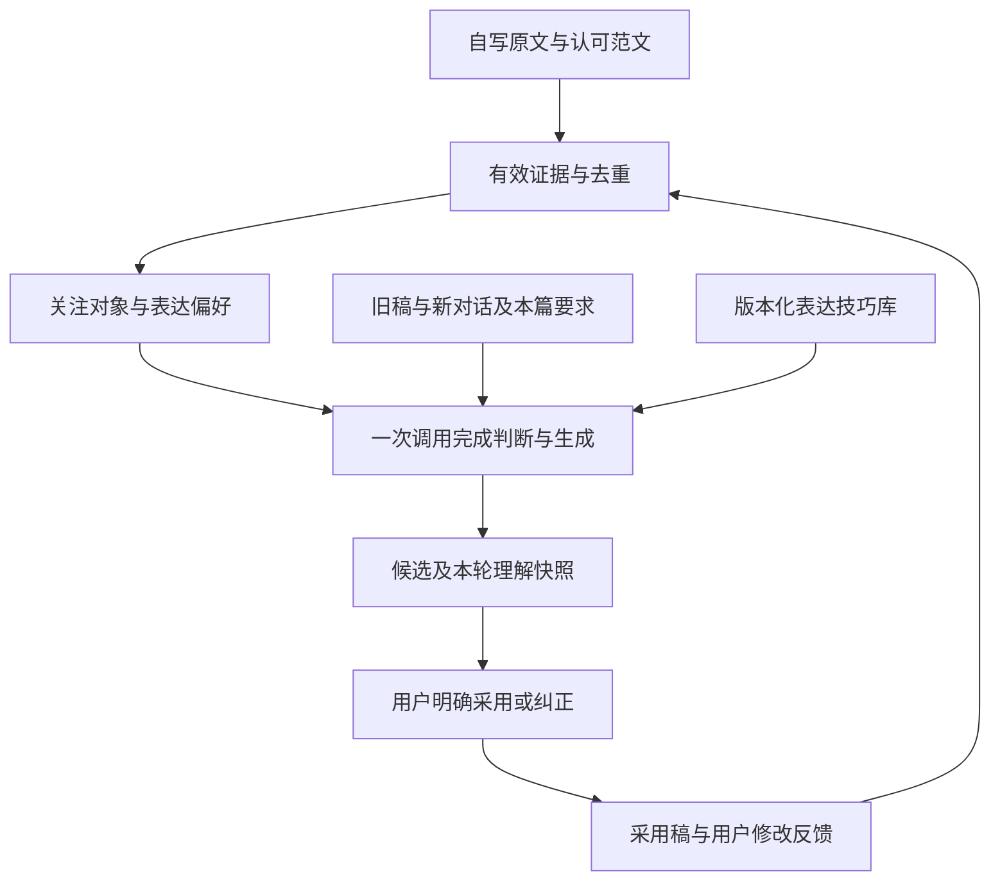

# 用持续的表达偏好理解匹配文字技巧

## Summary

在独立文字版本链路中，分别记录用户反复关注的事物、认可的表达方式和当篇要求，以可追溯的证据选择多位作者的通用表达技巧。沿用已经存在的原文与采用稿两类学习入口，补齐结构化观察、证据汇总、技巧适配和纠正反馈。此文件是下一轮修改方案，尚未实施。

---

## Problem Frame

用户进一步说明：有人更能感受到自然，有人更关注人与人的关系，希望系统逐渐认识个人的表达倾向，替他找到合适的文字。当前 `writingObservationSchema` 只保存两段自由文字、一个总置信度和所选技巧；`writingEvidence` 每次读取最近100个故事中同平台最多各6份原文/采用样本，尚无可持续汇总的结构化偏好。

关注对象不能直接等同于文风：同样在意人际关系的人，可以喜欢直白、幽默或含蓄的写法；一次写树也不足以证明长期喜欢自然描写。现有四张技巧卡侧重动作、节奏、结尾和反差，尚不足以表达这些差异。

---

## Requirements

- 沿用 origin R1–R3、R7：从关注对象与表达方式共同匹配少量技巧，可组合多个作者的通用方法；不得编造素材没有的景物、动作或人物动机。
- 沿用 R4–R6、R12：原稿观察与审美偏好分别记录；当篇内容、任务要求与反复出现的倾向可区分。用户可能喜欢自己尚不会写出的表达。
- 沿用 R5、R8、R13：采用与有明确含义的修改能够修正观察；生成次数、查看、没有回复、重复材料不能加强偏好证据。
- 沿用 R9、R10：每条判断有来源、范围和可信状态，能解释、停用并重新计算；新旧版本均可读取。
- 沿用 R11、R14、R15：独立文字历史、标题保护、平台约束、归属、幂等和成品快照保护继续有效。
- 新补充：以自然感官、人际互动、内心感受、观念思考、日常观察作为可扩展的初始观察维度，允许并存、未知和混合，不作互斥人物分类。
- 新补充：没有自然表达证据代表“尚不了解”，不能推出“缺乏感知力”；只提取与创作有关的可观察倾向，不输出完整人格、心理健康或敏感身份判断。

F1 对应从原文提出假设，F2 对应采用后校正，F3 对应回看与纠正。AE1–AE9 作为学习规则回归；AE10–AE11 作为原有新版本流程回归。

---

## Scope Boundaries

本次修改以“生成新版本”入口为范围。保留原文/范文来源确认、候选查看、明确采用及不再用于文风参考的现有含义。平台之间继续隔离，同平台内跨故事积累；当篇用途会进一步约束选材。

不涉及基础模型训练、整本书采集、人格测验、独立管理后台、旁白改写、媒体生成或其他旧文字生成接口。个人足迹/每日来信系统的捕获和提炼开关维持原状，其规则可借鉴，不能因新增文字理解而隐式启用。

后续另行规划跨平台通用偏好、超过当前故事检索窗口的账号级索引，以及其他生成入口接入。当前有界历史不是永久完整记忆，界面与交接不能声称已经了解用户全部经历。

---

## Context & Research

- `shared/textDraftHistory.ts`：已有来源声明、版本、采用记录、置信度及技巧选择类型，可兼容扩展。
- `server/services/textDraftHistory.ts`：已有用户归属、Story CAS、操作认领、模型调用与采用；`writingEvidence` 目前按整份消息集合去重，相邻版本只是多一条消息时仍会重复携带旧材料。
- `server/services/textDraftPrompt.ts`：目前原文观察、采用判断、技巧选择和完整生成共用一次模型调用，适合保留成本与幂等边界。
- `server/services/writingTechniqueLibrary.ts`：已有4张编辑归纳卡及提示词/卡库版本号，可扩充适配维度。
- `client/src/features/publishingDraft/TextDraftVersions.tsx`：已有来源选择、反馈输入、表达参考详情及证据停用；继续在这里提供简短解释。
- `shared/personalMemory.ts`、`server/services/personalMemoryExtraction.ts`、`server/services/personalMemorySelection.ts`：已有用户原话/推断区分、当篇指令范围约束、来源有效性验证和有界选择的参考模式。
- `docs/solutions/architecture-patterns/semantic-art-direction-library-handoff-2026-09-03.md`：历史倾向不能冒充本轮情绪；艺术家作为内部来源、运行时执行可观察技巧。这些原则适用，图片选卡器的关键词打分不能直接充当人的文风识别。
- 功能账本：`independent-text-versions` 与 `publishing-versions` 均为 observing。真实模型文风效果及新链路 MySQL 验收仍有空白。本轮是规划，不提高功能状态。

本方案扩展本地既有数据与生成模式，不新增服务商、模型训练或基础设施；没有进行外部研究或付费模型试验。

---

## Key Technical Decisions

### 1. 三类信息分别表达

| 信息 | 示例 | 如何影响写作 |
|---|---|---|
| 关注与感受的对象 | 经常描述关系中的照顾、距离与误解 | 优先从素材里挑选这些细节 |
| 认可的表达方式 | 喜欢动作与对话、短句、少作解释 | 决定如何组织这些细节 |
| 当前写作任务 | 这篇要写景；这次希望直接说明 | 约束本篇选择，覆盖不适用的历史倾向 |

每条观察携带维度、方向、来源引用、适用范围及 tentative/confirmed 等可信状态；方向可为偏好、明确回避或未知。原文可证明“曾注意到某物”，不能独自证明“喜欢所有这种写法”。总字数、主题关键词和模型自行给出的高分均不直接提高可信度。

可信状态的语义固定为：tentative 是初步推断；supported 是多个独立来源支持的推断；confirmed 必须有用户对该项偏好的明确认可。模型输出的自评分不能替代这些资格条件。

### 2. 证据是权威，画像是可重建结果

新增写作证据与汇总服务，从同一用户、同一平台的有效历史重建当前理解。原文以消息/片段及内容修订作为稳定来源；采用事件以版本及最终内容为来源。重复片段、同一故事的连续改版、重复采用不会被算作多个独立认可。单一故事贡献封顶，避免一段素材占满候选池。

沿用 Story 历史保存本轮结构化观察和使用时的理解快照。画像快照用于解释当时决策，不作为下一轮认可证据；下一轮只读取仍有有效原始来源的观察。沿用最近100个自有故事的读取边界，把候选观察先去重、按任务相关性和证据种类排序，再带入有界代表样本，替代“只取最先遇到的6份”。保存覆盖范围与截断标记，不宣称全量记忆。

首次扩展不增加独立账号表或后台扫描任务，避免多份画像彼此争夺权威。原文声明、采用结果与停用状态仍是现有历史字段的权威。新字段以可选、带内部版本的扩展读取；旧版只有自由文字观察时保持可读，不将旧自由文字自动升级为已确认偏好。

观察引用必须回溯到最初消息、材料或采用事件的修订与启用状态，不能只检查存放该观察的版本仍然存在。用户后续纠正以独立、带修订的反馈记录追加，不改写已采用正文或历史生成快照。

### 3. 两个学习过程各自有验证条件

第一过程记录原文关注点、表达习惯和用户认可范文，附具体证据；来源不明只可作当篇上下文。来源声明必须绑定被确认的材料，不能因为选择“我自己写的”就给整段混合聊天统一改身份。旧版整批声明可兼容读取，但保持弱证据，不反推某段引文是用户原作。

第二过程比较候选、最终采用稿与反馈：事实纠错、篇幅限制与文风修改分开解释。整篇采用只是一条作品选择记录，不逐项确认本次技巧；明确针对某种写法的反馈才能确认对应偏好。多次独立采用可增加支持程度，但仍标为推断，直到用户明确确认。未采用不记为不喜欢。

采用时原子保存证据；语义解释安排在下一次用户主动生成时，与生成共用一次模型调用。保存和停用不额外发起模型调用。该次响应同时包含来源明确的观察、采用分析、选卡依据和正文，服务端验证来源引用属于输入许可集合，并限制模型不能凭空生成“用户已确认”的状态。

### 4. 技巧卡按适配条件组合

为技巧卡增加关注维度、表达特点、所需素材条件、避用条件、相容性和启用状态。增加自然感官、季节变化、关系动作、对话中已有的言外之意等少量技巧；每张卡可适配多个维度，每次仍选择0–3项。

自然兴趣不会强迫稿件出现天气和植物；关系兴趣也不会允许增加未提供的冲突或潜台词。作者和作品说明技巧来源，生成执行通用表达方法。新增作者归因必须标明编辑归纳与核验状态，示例使用原创内容。未启用的卡不可由模型自行选中。

### 5. 用户看得懂的纠正入口

在现有“本次表达参考”里显示一两句观察，例如“你这几次更常保留人物之间的小动作，所以这篇优先通过动作写关系”。可展开查看支撑该说法的本人原文/采用片段。

沿用可选反馈输入，补充“仅这篇”与“以后同类文字也这样”的范围；默认仅当篇，用户明确选长期时才可作为持续指令。整份证据停用入口继续可用；停用后下一次生成重新汇总。不给用户显示人格分数或要求先完成问卷。

---

## High-Level Technical Design

以下示意用于说明设计方向，不是需要照抄的实现代码。

快照不直接回流到有效证据；只有原始来源、真实采用或明确反馈可以回流。

---

## Implementation Units

### U1. 可兼容的观察与来源契约

**Goal:** 定义关注对象、表达偏好、当篇要求、来源片段、反馈范围与理解快照。

**Requirements:** R4–R6、R9、R10、R12；新增关注与表达分离要求。

**Dependencies:** 无。

**Files:** 修改 `shared/textDraftHistory.ts`；新增 `shared/writingPreference.ts`、`shared/writingPreference.test.ts`。

**Approach:** 新字段可选且版本化，旧记录原样兼容；缺证据时为未知。明确来源绑定的材料范围，以及追加式纠正反馈的身份/修订/作用范围，保留现有请求重放的哈希语义，不让新增默认值改变旧token的请求身份。

**Patterns to follow:** 现有 Zod 校验与 `readTextDraftHistory`；personalMemory 的原话/推断与范围区分。

**Test scenarios:** 旧历史可读；新观察可序列化往返；非法维度/越权来源拒绝；旧请求重放不因字段默认值发生冲突；混合粘贴不能整体提升为自写；当前要求不能默认为全局。

**Verification:** 已有历史与新记录共存，证据来源和作用范围可由服务端校验。

### U2. 有效证据汇总与可重建理解

**Goal:** 从本人历史中得到去重、可撤回、适合当篇的表达依据。

**Requirements:** R4–R6、R8、R9、R12、R13；F1、F2。

**Dependencies:** U1。

**Files:** 从 `server/services/textDraftHistory.ts` 拆出 `server/services/writingEvidence.ts`；新增 `server/services/writingPreference.ts` 及两个同名测试文件。

**Approach:** 复用归属约束与最近100故事边界；稳定来源身份去重、限制同一故事的重复贡献；只汇总原始证据及有有效来源的观察，不累计模型自己的画像快照。将采用稿编辑的事实/文风解释留给一次生成调用，汇总服务负责证据资格、范围、去重与预算。

**Patterns to follow:** `repositories/stories`、`personalMemorySelection` 的读取后验证、现有学习停用规则。

**Test scenarios:** Covers AE1/AE6/AE9：资料、他人对白、未采用稿不进入确认偏好；甲的资料不进入乙；停用、删除来源后不再支撑新理解；同一对话追加一条消息不会把旧消息重复计权；多版本同稿不产生多份认可；其他平台排除；没有自然证据不生成负向标签；覆盖不足明确标注。

**Verification:** 每项理解均能回到有效原始来源；重新执行不增加证据强度，撤回能在下一次生成生效。

### U3. 技巧库与生成链路接入

**Goal:** 让关注对象、表达偏好和当前任务共同决定正文写法。

**Requirements:** R1–R3、R7、R10–R15；F1、F2。

**Dependencies:** U1、U2。

**Files:** 修改 `server/services/writingTechniqueLibrary.ts`、`server/services/textDraftPrompt.ts`、`server/services/textDraftHistory.ts`；新增 `server/services/textDraftPrompt.test.ts`，扩展 `server/services/textDraftHistory.test.ts`。

**Approach:** 版本化扩展卡片与提示词；在同一次调用内完成原文观察、采用对照、当篇策略和文本生成。验证来源引用、卡片启用状态、技巧数和正文结构；保存本次选材清单与观察快照，沿用认领与失败行为。

**Patterns to follow:** 当前 `compileTextDraftPrompt`、`generateTextDraft`、Story CAS 与模型调用重试边界。

**Test scenarios:** Covers AE2–AE5/AE7/AE8：关系主题可匹配不同表达方式；明确写景要求覆盖历史关系偏好；短样本保持低可信；删错事实不等于厌恶细节；用户原文朴素但采用丰富表达时允许更新审美假设；未知/停用卡、伪造证据引用拒绝；Covers AE10/AE11：旧稿+新增对话、幂等、超时不重提、标题及已完成成品快照不变。

**Verification:** 模拟模型测试验证边界与一次调用，不用它宣称文学效果；真实质量另按下方验收。

### U4. 可理解的解释与范围反馈

**Goal:** 用户能看出为何匹配这类表达，并纠正系统的理解。

**Requirements:** R4、R6、R8–R10；F3。

**Dependencies:** U1、U2、U3。

**Files:** 修改 `client/src/features/publishingDraft/TextDraftVersions.tsx`、`server/routers/textDrafts.ts`；扩展 `client/src/features/publishingDraft/TextDraftVersions.test.tsx`、`server/services/textDraftHistory.test.ts`；新增 `server/routers.textDrafts.test.ts`。

**Approach:** 在现有详情中显示少量观察和来源；选中材料才能确认其来源；采用反馈默认当篇，可明确作用于以后同类文字；继续提供整份来源停用。反馈需保存来源、范围及修订，服务端只用登录身份。纠正更新后先使当前理解失效，再从有效证据生成，避免旧快照复活。

**Patterns to follow:** 当前组件的故事/平台切换防护、采用动作及 `setLearning`。

**Test scenarios:** 只查看不反馈；当篇反馈不影响其他故事；长期明确反馈可影响之后同用途稿件；停用后解释不继续引用该材料；切换故事后迟到响应不覆盖当前页面；旧记录缺观察时诚实空态；未登录及跨用户操作拒绝。

**Verification:** 用户无需读代码即可理解一句判断、找到依据、修正它；所有控制有等价后端入口。

### U5. 行为验收与功能记录

**Goal:** 同时验证流程正确和表达匹配是否真的有帮助。

**Requirements:** origin Success Criteria、AE1–AE11。

**Dependencies:** U1–U4。

**Files:** 新增 `evals/fixtures/writing-preference-cases.json`、`evals/writingPreferenceContract.test.ts`、`docs/qa/writing-preference-evaluation.md`；更新 `docs/features/feature-ledger.json`、`docs/qa/2026-09-29-independent-text-versions.md`。

**Approach:** 使用原创固定材料，比较自然感官、关系动作、同兴趣不同文风、当篇覆写、无证据和纠正后的行为。分开记录规则测试与真人对稿评价；只有真实入口及实际证据足够时才调整账本状态。

**Test scenarios:** 同一材料面对不同表达偏好有可解释差异但事实一致；多轮采用能纠正初始假设；反复点击未采用不能把系统风格学成用户偏好；同一原文重复提交不提升确信。

**Verification:** 类型、架构边界、定向回归和功能账本通过；主仓3000端口检查解释/纠正交互。真实模型试稿在获授权后由用户比较“更像我”“需要改多少”和事实保真，不能用选中作者数量代替效果。

---

## System-Wide Impact

持久化仍经 Story CAS，模型调用仍在重试区外；新结构化字段需与泛用故事保存的服务端字段保护一致。跨故事读取保持用户及平台约束，理解快照只做解释，不变成新的事实权威。错误沿用生成失败/不确定记录；新理解格式不合法不能触发第二次模型调用。

本次不接通个人记忆后台，不让未采用候选进入已有个人足迹。历史成品、人工标题、发布稿修订保护以及新版本与采用分离都需要回归。

---

## Open Questions

已解决：版本独立、采用才反馈、当篇指令优先、多作者技巧组合、原文来源需可确认，均来自既有确认与本次补充。

实施期确定：原文片段选择在现有面板中的最小交互；代表样本与观察的上下文预算；本地/SQL的实际并发验证方式。模型对比喻、事实纠错与文风修改的区分效果只能通过样本评价判断，不能凭本计划证明。

---

## Sources & References

- `docs/brainstorms/2026-09-29-writing-technique-library-requirements.md`
- 本次对话关于自然感受、人际关系及个人表达匹配的补充。
- `docs/qa/2026-09-29-independent-text-versions.md`
- `docs/features/feature-ledger.json`
- `docs/solutions/architecture-patterns/semantic-art-direction-library-handoff-2026-09-03.md`
